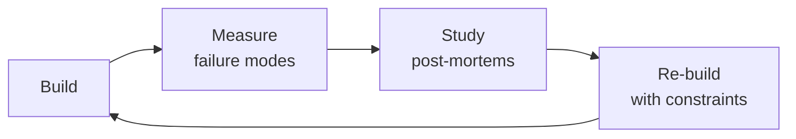

# Embedded Engineer

Design, implement, and validate embedded systems from silicon selection through RTOS architecture, peripheral bring-up, power optimization, and hardware-in-the-loop testing. Hardware failures cost $50K per PCB respin and 6 weeks of schedule. There is no `git revert` for a burned board.

## Route the Request
<!-- QUICK: 30s -- auto-route first, then intent-route -->

### Auto-Route (No User Input Required)
Evaluate these file-system conditions in order. First match wins — jump immediately.

| # | Condition | Action |
|---|-----------|--------|
| A1 | `file_contains("*.[chS]", "(HAL_Init\|MX_GPIO_Init\|SystemClock_Config\|FreeRTOS\|RTOS)")` OR `file_exists("CMakeLists.txt")` AND `file_contains("CMakeLists.txt", "(arm-none-eabi\|xtensa\|riscv)")` | This is your skill. Jump to **Core Workflow** — Phase 1: Silicon Selection & Architecture. |
| A2 | `file_contains("*.ioc|*.prj", "(STM32\|nRF\|ESP32\|MSP430\|PIC)")` OR `file_contains("*", "MCU.*selection\|silicon.*selection\|chip.*selection")` | Jump to **Decision Trees** — MCU/MPU Selection Matrix. |
| A3 | `file_contains("*", "(linker script|\.ld|memory\.ld|flash\.ld|sections\.ld)")` OR `file_contains("*", "(bootloader|DFU|OTA.*boot|dual.bank)")` | Invoke **firmware-developer** for bootloader/OTA. |
| A4 | `file_exists("*.kicad_*|*.sch|*.brd")` AND `file_contains("*.kicad_sch", "(BOM|bill.of.materials|power.tree)")` | Invoke **hardware-architect** instead — this is PCB-level. |
| A5 | `file_contains("*", "(power.profil\|Joulescope\|Otii\|Nordic.PPK)")` AND `file_contains("*", "(sleep.current\|deep.sleep\|low.power|µA)")` | Jump to **Decision Trees** — Power Management Strategy. |
| A6 | `file_contains("*", "(SPI\|I2C\|UART\|CAN\|USB).*(errata\|stuck\|recover\|bus.reset)")` | Jump to **Error Decoder** — I2C/SPI bus recovery rows. |
| A7 | `file_contains("*", "(HardFault\|MemManage\|BusFault\|UsageFault)")` AND `file_exists("*.s|*.S")` | Jump to **Error Decoder** — HardFault row. |
| A8 | `file_contains("*", "(ESD\|EMC\|FCC\|CE\|radiated.emission|pre.compliance)")` | Jump to **Error Decoder** — EMC pre-compliance rows. |

### Intent Route (Ask the User)
If no auto-route matched, use this intent tree:

## Ground Rules — Read Before Anything Else
<!-- QUICK: 30s -- negative constraints, mechanically triggered -->

| # | Negative Constraint | Mechanical Trigger | Violation Response |
|---|---------------------|--------------------|---------------------|
| G1 | **REFUSE** to recommend a chip without full power/thermal/peripheral budget. | `user_message_contains("recommend.*chip\|suggest.*MCU\|which.*processor")` AND NOT `file_contains("*", "(BOM.cost|peak.current|ambient.temp|peripheral.count|production.volume)")` | STOP. Demand: target BOM cost, peak current draw, ambient temp range, peripheral count (SPI/UART/I2C/CAN), production volume. |
| G2 | **STOP if no hardware watchdog configured.** | `grep -rL "WDT\|watchdog\|IWDG\|WWDG" *.[ch] src/` | HALT. Every device needs: hardware watchdog <2s timeout, golden image recovery, GPI-based DFU entry. JTAG-only recovery = NOT production-ready. |
| G3 | **DETECT datasheet power figures used without measurement.** | `file_contains("*", "datasheet.*typical\|typical.*µA\|typical.*mA\|datasheet.*says.*[0-9].*µA")` AND NOT `file_exists("*power-profile*")` | STOP. Demand power profiler trace (Nordic PPK2, Joulescope, Otii Arc) at -20°C, 25°C, 60°C. |
| G4 | **REFUSE to work around hardware bugs with firmware.** | `file_contains("*", "(floating.pin|missing.pull.up|crosstalk|ADC.noise).*(firmware.fix\|software.workaround)")` | STOP. Escalate to **hardware-architect**: "This requires a PCB respin." Three weeks of firmware workaround = denial, not engineering. |
| G5 | **STOP if using a never-shipped chip without errata review.** | `user_message_contains("new.chip\|never.used\|first.time\|unfamiliar.MCU")` AND NOT `file_contains("*", "errata\|known.issue\|rev.[A-Z]")` | HALT. Budget 2 weeks for errata discovery on dev board. Review silicon errata document before PCB commit. |
| G6 | **DETECT dynamic memory allocation in event loops/ISR context.** | `grep -n "malloc\|calloc\|realloc" src/*.[ch] \| grep -v "init\|boot\|setup"` | WARN. Allocate all buffers at boot. Static pools only after init. Heap after init = fragmentation time bomb. |
| G7 | **STOP if OTA update lacks dual-bank flash + rollback.** | `file_contains("*", "(OTA\|over.the.air\|firmware.update)")` AND NOT `file_contains("*", "(dual.bank\|A/B.partition\|rollback\|revert\|fallback)")` | HALT. Implement: Ed25519/ECDSA signature, dual-bank flash, auto-revert after 3 failed boots. |


## The Expert's Mindset

Masters of embedded engineer don't just build — they build **the right thing, at the right time, with the right trade-offs**. They think in systems, not tasks.

| Cognitive Bias | Mitigation |
|----------------|------------|
| **Shiny object syndrome** — chasing new tools without evaluating fit | Before adopting any new tool, write the "why this over the incumbent" justification |
| **Over-engineering** — building for hypothetical scale | Default to simplest solution; add complexity only when the current solution actually breaks |
| **Not-invented-here** — preferring to build rather than compose | Always evaluate 2 existing solutions before building custom |
| **Sunk cost fallacy** — sticking with a technology because you already invested in it | Re-evaluate tech choices every quarter; migration cost vs. staying cost |

### What Masters Know That Others Don't
- The **failure modes** of every component in their stack — not just the happy path
- When **not** to use their favorite tool (every tool has a misuse zone)
- That **data/model quality decays over time** — monitoring is not optional, it's foundational

### When to Break Your Own Rules
- **Move fast on reversible decisions.** Data format? Hard to change. Dashboard layout? Easy. Know the difference.
- **Skip the abstraction until the third use case.** Two is coincidence, three is a pattern.
## Operating at Different Levels

| Level | Scope | You... |
|-------|-------|--------|
| **L1** | Single component/module | Implement a well-defined piece following established patterns |
| **L2** | Feature or service | Design and build a complete feature; make tech choices within team conventions |
| **L3** | System or product area | Define architecture for a product area; set team tech standards; mentor L1-L2 |
| **L4** | Multiple systems / platform | Define org-wide architecture patterns; make build-vs-buy decisions; influence industry practice |
| **L5** | Industry / ecosystem | Create new architectural patterns adopted across the industry; redefine what's possible |

**Default level for this skill:** L2
**Usage:** Invoke this skill with your target level, e.g., "as an L3 embedded engineer, design..."

For full level definitions, see `skills/00-framework/skill-levels/SKILL.md`.

## When to Use
<!-- QUICK: 30s — scan bullets to decide if this skill fits -->
- Selecting an MCU/MPU for a new product: ARM Cortex-M0 through M7, RISC-V, ESP32, nRF52/53/54, STM32 families with tradeoff matrix
- Choosing between bare-metal superloop, FreeRTOS, Zephyr, or ThreadX for a specific use case with real-time constraints
- Configuring peripheral interfaces: SPI at >20 MHz with signal integrity, I2C multi-master with bus recovery, UART with DMA, CAN bus termination
- Designing a secure bootloader with A/B partitions, Ed25519-signed images, and OTA update with power-loss resilience
- Implementing power management: sleep modes, DVFS, battery life estimation for BLE/Zigbee/Thread coin-cell devices
- Setting up hardware-in-the-loop (HIL) testing with programmable power supply, relay fault injection, and logic analyzer
- Debugging real-time issues: interrupt latency budgeting (<1 µs target), jitter analysis (<5% period), priority inversion detection
- Designing safety-critical firmware: watchdog strategy, brown-out detection, ECC memory, dual-redundant computation paths
- Pre-compliance testing for FCC Part 15, CE RED, ISED intentional radiator requirements with 3 dB margin

## Decision Trees
<!-- QUICK: 30s — follow the ASCII tree to your scenario -->
<!-- STANDARD: 3min — each tree has concrete chip names, price points, and decision rationale -->

### MCU/MPU Selection Matrix

```
                          ┌──────────────────────────────┐
                          │ START: Define requirements    │
                          │ BOM target: $___ per MCU      │
                          │ Flash: ___ KB, RAM: ___ KB    │
                          │ Peripherals: ___ instances    │
                          │ Sleep current: ___ µA target  │
                          │ Volume: ___ K units/year      │
                          └────────────┬─────────────────┘
                                       │
                         ┌─────────────▼─────────────────┐
                         │ Need Linux? (MMU, >64MB RAM,   │
                         │ complex UI, camera pipeline)?  │
                         └────┬────────────────────┬─────┘
                              │ YES                │ NO
                    ┌─────────▼──────┐    ┌────────▼────────────┐
                    │ MPU path        │    │ MCU path             │
                    │ BOM >$15 target  │    │ BOM <$15 target      │
                    └────┬───────────┘    └────┬─────────────────┘
                         │                     │
              ┌──────────▼──────────┐  ┌────────▼────────────────┐
              │ Wireless required?  │  │ Wireless required?       │
              └──┬──────────────┬───┘  └──┬──────────────────┬────┘
                 │ YES          │ NO      │ YES              │ NO
         ┌───────▼──────┐ ┌────▼─────┐ ┌─▼──────────┐ ┌─────▼──────────┐
         │ i.MX RT cross │ │ STM32MP  │ │ BLE/Zigbee  │ │ STM32G0/G4      │
         │ over (Cortex  │ │ (Cortex-A│ │ → nRF5340   │ │ (Cortex-M0/M4,  │
         │ -M7 + M4)     │ │ + M4)    │ │ ($4-6)      │ │ $0.80-3)        │
         │ $8-12          │ │ $15-25   │ │ WiFi/BT     │ │ RISC-V option:  │
         └───────┬───────┘ └──────────┘ │ → ESP32-C3  │ │ → CH32V003      │
         ┌───────▼───────┐              │ ($1.50-3)   │ │ ($0.10 BOM!)    │
         │ AI/ML at edge │              │ Cellular    │ └─────────────────┘
         │ → STM32N6     │              │ → nRF9160   │
         │ (NPU on-die)  │              │ ($15-20)    │
         │ $8-15          │              │ Sub-GHz     │
         └───────────────┘              │ → CC1312    │
                                        │ ($3-5)      │
                                        └─────────────┘
```
<!-- DEEP: 10+min — war story -->
*Team selected ESP32-S3 for a battery BLE sensor. Datasheet: 5 µA deep sleep. Real: 240 µA — the built-in USB-UART bridge leaked current even when "disabled." Fix: external UART with dedicated EN pin, or switch to nRF52840 (1.4 µA system-off with RAM retention). Cost: 3-week respin, $8K prototypes scrapped.*

### RTOS vs Bare-Metal Superloop

```
                          ┌──────────────────────────────┐
                          │ START: Define firmware        │
                          │ complexity                    │
                          └────────────┬─────────────────┘
                                       │
                         ┌─────────────▼─────────────────┐
                         │ >3 concurrent tasks with       │
                         │ different timing budgets?      │
                         └────┬────────────────────┬─────┘
                              │ YES                │ NO
                    ┌─────────▼──────┐    ┌────────▼──────────┐
                    │ RTOS required   │    │ Flash <64KB OR     │
                    │                 │    │ RAM <8KB?         │
                    └────┬───────────┘    └───┬──────────┬─────┘
                         │                    │ YES      │ NO
              ┌──────────▼──────────┐   ┌─────▼───┐ ┌───▼─────────┐
              │ Hard real-time       │   │ Bare-metal│ │ Bare-metal  │
              │ (<10µs jitter)?      │   │ superloop │ │ + simple     │
              └──┬──────────────┬────┘   │ with ISRs │ │ scheduler    │
                 │ YES          │ NO     └───────────┘ │ (state mach) │
         ┌───────▼──────┐ ┌─────▼────────┐              └─────────────┘
         │ Zephyr or     │ │ FreeRTOS      │
         │ ThreadX       │ │ (widest       │
         │ (preemptive,  │ │ ecosystem,    │
         │ tickless,     │ │ 100K+ devices │
         │ safety cert)  │ │ shipped)      │
         └───────────────┘ └───────────────┘
```
**Bare-metal:** single-function device, flash <64KB, RAM <8KB, power <1 µA sleep, cert cost matters.
**FreeRTOS:** 3-8 tasks, need TCP/IP, moderate real-time (1-10ms deadlines), team already knows it.
**Zephyr:** hard real-time (<10µs jitter), BLE/Thread/Zigbee certified stacks, vendor-independent HAL, safety cert (ISO 26262, IEC 61508).

### Power Management Strategy

```
                          ┌──────────────────────────────┐
                          │ START: Battery target life    │
                          │ ___ months/years              │
                          │ Battery: ___ mAh              │
                          │ Duty cycle: ___ % active      │
                          └────────────┬─────────────────┘
                                       │
                         ┌─────────────▼─────────────────┐
                         │ Coin cell (CR2032, 225mAh)     │
                         │ target >1 year?                │
                         └────┬────────────────────┬─────┘
                              │ YES                │ NO
                    ┌─────────▼──────┐    ┌────────▼──────────┐
                    │ Avg current     │    │ Li-Po/Li-Ion       │
                    │ MUST be <25µA   │    │ >500mAh?           │
                    │ (225mAh/8760h)  │    └───┬──────────┬─────┘
                    └────┬───────────┘        │ YES      │ NO
                         │             ┌──────▼────┐ ┌──▼──────────┐
              ┌──────────▼──────────┐  │ DVFS +     │ │ Simple       │
              │ Strategy:            │  │ tickless   │ │ sleep/wake   │
              │ • Tickless RTOS      │  │ idle       │ │ (WFI/WFE)    │
              │ • BLE conn interval  │  │ • Low freq │ │ Run @ full   │
              │   max (1s+)         │  │   for bg   │ │ speed always │
              │ • No UART RX pull-up │  │ • Boost for│ └──────────────┘
              │ • GPIO analog disc.  │  │   radio TX │
              │   in sleep           │  │ • Ship mode│
              │ • NCP for radio      │  │   <1µA     │
              └──────────────────────┘  └────────────┘
```
<!-- DEEP: 10+min — war story -->
*Door sensor: 3.7 µA on the bench, 30% field failures in 3 months. Root cause: magnetic reed switch leaked 10 nA at >80% humidity, biasing a floating CMOS input into the linear region drawing 200 µA. Fix: external 10M pull-down + firmware recalibrated debounce. Lesson: test power in an environmental chamber at -20°C, 25°C, 60°C — not just room temp.*

## Core Workflow
<!-- QUICK: 30s — scan phase titles to understand the process -->
<!-- STANDARD: 3min — each phase has explicit Do/Verify/Recover steps -->
<!-- DEEP: 10+min -->

### Phase 1 (~4 hours): Silicon Selection & Architecture
1. **Do:** Fill the MCU/MPU selection matrix. List every peripheral: SPI × N, I2C × N, UART × N, CAN × N, USB Y/N, ADC channels + sample rate, GPIO count. Pin conflicts NOW prevent layout respins LATER.
2. **Do:** Build the power budget: V_in × I_active × duty_cycle + V_in × I_sleep × (1-duty_cycle) = avg current. Add 30% margin for peripheral leakage you will discover. Compare to battery mAh ÷ avg current = hours.
3. **Do:** Map memory: bootloader (16-64KB) + app A + app B + filesystem + config. RAM: stacks (per task) + heap + DMA buffers + BLE/TCP stacks. If total >80% chip capacity, size up or cut features.
4. **Verify:** Order the dev board. Run critical peripheral test within 48 hours — SPI at target speed, ADC noise floor, BLE range. Do not finalize schematic until dev board validation passes.
5. **Recover:** Dev board fails → restart selection before PCB spins. Changing silicon after layout costs 4-6 weeks and $15K+.

### Phase 2 (~6 hours): RTOS Configuration & Task Design
1. **Do:** Choose RTOS per decision tree. Configure tick rate (1000 Hz precision, 100 Hz power-saving). Set `configTOTAL_HEAP_SIZE` to measured max + 20% headroom.
2. **Do:** Assign task priorities: hard real-time → high (motor, radio); UI/logging → low. Document worst-case execution time (WCET) per task.
3. **Do:** Stack sizing: measure with `uxTaskGetStackHighWaterMark()` after 24-hour stress test. Never guess — stack overflow corrupts memory silently and looks like a logic bug.
4. **Verify:** Priority inversion stress test. Enable priority inheritance on mutexes. If any task starves >2× its deadline, refactor.
5. **Recover:** Stack overflow → increase that task's stack by 50%, rerun. Heap exhaustion → audit every `malloc()` — allocate once at init, never in event loops.

### Phase 3 (~8 hours): Bootloader & OTA Design
1. **Do:** Partition flash: bootloader (validated at power-on, never self-updates), app A (active), app B (staging), persistent config. Minimum: 32KB bootloader + app A + app B.
2. **Do:** Ed25519 or ECDSA P-256 image signature verification. Bootloader verifies before jump. Unsigned image = boot rejected. This is how botnets recruit IoT devices.
3. **Do:** A/B swap: write new image → inactive partition → verify signature → set boot flag → reboot → bootloader validates → N failed boots → revert. Power-loss tested at every 10% of download.
4. **Verify:** Corrupted image → bootloader detects, rejects. Power loss during OTA → device recovers to previous working image.
5. **Recover:** Bootloader corrupted → device bricked. Ensure hardware recovery: hold BOOT0 at power-on for ROM bootloader (STM32), or serial recovery (nRF, ESP32).

### Phase 4 (~5 hours): Hardware-in-the-Loop Testing
1. **Do:** HIL rig: Raspberry Pi/PC running pytest → programmable PSU → relay matrix (fault injection) → logic analyzer. Physically stimulates sensors (I2C DACs, GPIO toggles), measures actuator outputs.
2. **Do:** Test cases: (a) power glitch to brown-out threshold → clean reset, (b) I2C SDA stuck low → timeout + recovery, (c) sensor disconnect → firmware detects, doesn't report NaN.
3. **Do:** 24-hour soak with randomized fault injection. Log every reset cause (power-on, watchdog, brown-out, software). Verify correct reason recorded each time.
4. **Verify:** Zero manual intervention. A human should never need to power-cycle a device under test.
5. **Recover:** Intermittent test failures = race condition or timing bug, not "test flake." Do not increase timeouts — find the root cause.

### Phase 5 (~3 hours): Real-Time Validation & Interrupt Budgeting
1. **Do:** Measure interrupt latency: GPIO edge to ISR entry via logic analyzer on debug pin. Target: <1 µs for critical interrupts on Cortex-M4 at 80 MHz. >2 µs → investigate nested interrupts or disabled-IRQ regions.
2. **Do:** ISR execution time <10 µs. ISR does: capture timestamp, set flag, unblock task. Move heavy work to a high-priority task.
3. **Do:** Jitter analysis: 1000 consecutive periods of a 1 kHz timer. P95 jitter <5% of period. Higher → check interrupt masking or DMA bus contention.
4. **Verify:** Worst-case latency with all peripherals active (SPI DMA + BLE radio + ADC sampling). Must still meet deadlines.
5. **Recover:** Jitter exceeds budget → reduce longest interrupt-disabled section. `__disable_irq()` / `__enable_irq()` pairs <5 µs max. Use scope guards.

## Best Practices
<!-- STANDARD: 3min — rules extracted from production experience on >500K shipped devices -->

1. **One malloc at init, zero at runtime.** Dynamic allocation in event loops fragments the heap. After 6 months, your 32KB heap is Swiss cheese and `malloc(128)` fails. Allocate all buffers at boot; use static pools.
2. **Watchdog is not optional.** Internal IWDT with 2s timeout, kicked only when all critical tasks check in. External watchdog IC for safety-critical — internal shares a clock that can fail.
3. **Never trust the ADC directly.** Oversample (4-16×), median-filter (3-sample window), validate against known bounds. Floating pin → random values → detect via variance exceeding 3-bit noise floor.
4. **SPI at >20 MHz needs signal integrity review.** Traces <50 mm, matched within 5 mm, series termination 22-33Ω at driver. >50 MHz: simulate S-parameters. Scope screenshot at receiver is proof — "works on my bench" is not.
5. **I2C bus recovery is mandatory.** Clock out 9 SCK pulses to release stuck SDA. A slave holding SDA low during MCU reset bricks the bus without this.
6. **Power profile at every firmware change.** A new UART TX log toggle can add 200 µA average. Profile at -20°C, 25°C, 60°C — leakage doubles every 10°C.
7. **Version your hardware config.** Board revision via GPIO strapping resistor (ADC read) or EEPROM byte. Firmware branches per revision. Shipping rev-C firmware on rev-A hardware = mysterious failures.
8. **Secure boot is table stakes.** Even a $2 MCU supports CRYP auth. Unauthenticated bootloader = anyone with physical access or compromised OTA server owns your fleet.
9. **DMA alignment traps.** ARM Cortex-M DMA requires word-aligned buffers. Unaligned buffer → slow byte copies or fault. Use `__attribute__((aligned(4)))` on all DMA buffers.
10. **Brown-out detection with hysteresis.** BOD threshold at min operating voltage + 10% margin + 50mV hysteresis. Without hysteresis: dying battery → rapid BOD-reset loops → flash corruption.

## Anti-Patterns
<!-- QUICK: 30s -- machine-detectable anti-patterns with auto-prevention -->

| ❌ Anti-Pattern | ✅ Do This Instead | 🔍 Detect (grep/lint) | 🛡️ Auto-Prevent |
|---|---|---|---|
| Dynamic memory allocation in event loops or IRQ context | Allocate all buffers at boot; static pools with `ACQUIRE_BUFFER()`/`RELEASE_BUFFER()` macros | `grep -n "malloc\|calloc\|realloc\|free" src/*.[ch] \| grep -v "_init\|setup\|boot"` | REFUSE merge if malloc appears outside init functions. |
| Kicking watchdog from ISR without subsystem health checks | Kick only in main loop after ALL subsystems report healthy via heartbeat flags | `grep -rn "WDT.*Feed\|IWDG.*Refresh\|watchdog.*kick" *.[ch] \| grep -v "main\|while(1)\|super.loop"` | WARN. Flag every watchdog kick not in main loop. |
| Using datasheet typical current for power budgeting | Measure actual on first prototype at -20°C, 25°C, 60°C across all power modes | `grep -rn "typical\|typ\." docs/power* \| grep -i "µA\|mA\|current"` | STOP. Replace typical values with max datasheet numbers + 20% regulator derating. |
| Shipping firmware without hardware version detection | Read board revision via GPIO strapping or EEPROM; refuse to run on unsupported rev | `grep -rL "board.*rev\|hw.*version\|REV_\|BOARD_REV" src/` | WARN. Auto-generate HW version detection from GPIO strapping pins. |
| Long interrupt-disabled sections >5µs | Use lock-free data structures; move heavy work to deferred procedure call | `grep -n "__disable_irq\|__asm.*CPSID\|portENTER_CRITICAL" src/ && grep -c "portEXIT_CRITICAL"` | STOP. Flag every critical section. Require timing budget annotation. |
| SPI/I2C without bus recovery or timeout | I2C: 9 SCL pulses recovery; SPI: timeout + peripheral reset; UART: receive timeout | `grep -L "bus.*recover\|SCL.*pulse\|timeout\|bus.reset" src/drivers/*i2c* src/drivers/*spi*` | WARN. Auto-inject bus recovery pattern into peripheral drivers. |
| Floating GPIO pins in low-power sleep | Configure unused pins as analog input (lowest leakage) or driven output | `grep -A5 "sleep\|low.power\|deep.sleep" src/*.[ch] \| grep -v "analog\|pull.up\|pull.down\|output"` | WARN. Generate pin configuration review report for sleep modes. |
| OTA without dual-bank flash + rollback verification | Dual-bank: validate signature, check CRC, revert after 3 failed boots | `grep -l "OTA\|firmware.update" src/ \| xargs grep -L "dual.bank\|rollback\|revert\|fallback"` | STOP. Block OTA PR merge without dual-bank + rollback. | 

## Error Decoder
<!-- QUICK: 30s -- exact error → root cause → fix with auto-recovery -->

| 🖥️ Console Match | Symptom | Root Cause | Fix | 🔄 Auto-Recovery Loop |
|---|---|---|---|---|
| `gdb> bt` shows `HardFault_Handler` at `0x00000000` | HardFault at null address | Null pointer dereference in ISR/task callback | Check all function pointers before calling. Enable MPU to catch null accesses. Use `__builtin_return_address(0)`. | **Loop 1:** (1) Detect: HardFault with PC=0x00000000. (2) Dump fault registers (CFSR, HFSR, MMFAR, BFAR). (3) Enable MPU on null region. (4) Re-run with MPU enabled. (5) Verify: no HardFault for 24h. |
| `grep "reset\|POR\|BOR" serial.log` every ~2s | Device resets every ~2 seconds | Watchdog timeout — task stuck or deadlocked | Check task that kicks watchdog. Increase stack first — most deadlocks are stack overflows. | **Loop 2:** (1) Detect: periodic reset at same interval. (2) Log reset cause register (RCC_CSR). (3) `uxTaskGetStackHighWaterMark()` on all tasks. (4) Double stack for any task <20% headroom. (5) 24h stress test. |
| Logic analyzer shows SDA stuck low for >100ms | I2C bus locked — SDA held low | Slave held SDA low during MCU reset | Clock SCL 9× to release. If stuck, power-cycle slave via GPIO-controlled FET. | **Loop 3:** (1) Detect: SDA low > 100ms. (2) Generate 9 SCL pulses via bit-bang. (3) If still stuck, GPIO power-cycle slave. (4) Re-init I2C peripheral. (5) Log recovery event. |
| `uxTaskGetStackHighWaterMark()` returns <50 words | Stack overflow detected (FreeRTOS) | Task stack too small or unbounded recursion | Double stack, 24h stress test. If >90% remains, fix held. | **Loop 4:** (1) Detect: stack high-water < 20% on any task. (2) Log offending task name and current depth. (3) Double stack allocation. (4) Re-run 24h stress. (5) Verify: ALL tasks > 30% headroom. |
| DMM shows ADC reading drifts >5% over 4h thermal soak | ADC drifts 20% over temperature | Internal bandgap VREF (1.2V ±10%) | Add REF3030 (0.2%, 50ppm/°C) or 3-point factory temp calibration. | **Loop 5:** (1) Detect: ADC drift >5% vs temp. (2) Log ADC ref voltage at -20°C, 25°C, 60°C. (3) Generate 3-point calibration polynomial. (4) Apply in firmware. (5) Re-verify drift <2%. |
| BLE sniffer shows disconnection at exactly 30s | BLE drops after 30 seconds | Supervision timeout — critical section >100µs with IRQs disabled | Audit every `__disable_irq()` — none >100µs. Move long ops to task. | **Loop 6:** (1) Detect: BLE disconnect at fixed interval. (2) Instrument all critical sections with GPIO toggle. (3) Measure max critical section duration on scope. (4) Refactor any >100µs section to DPC pattern. (5) Verify: no disconnect for 24h. |
| `grep "flash.*fail\|write.*error\|erase.*fail" serial.log` after 10K cycles | Flash write fails after 10K cycles | Endurance exceeded — logging cycling same sector | Wear leveling. Move frequent writes to SPI NOR (100K) or FRAM (10^13). Internal flash for infrequent only. | **Loop 7:** (1) Detect: flash erase count > 8K on any sector. (2) Log sector wear map. (3) Migrate hot sectors to external NOR/FRAM. (4) Enable wear leveling on internal flash. (5) Verify: estimated lifetime > 5 years. |
| Power analyzer shows 200µA in sleep mode | Wakes drawing 200µA "mysteriously" | Floating CMOS input biased into linear region | Add pull resistors on every external signal entering sleep. Disconnect analog GPIOs. | **Loop 8:** (1) Detect: sleep current > 3× expected. (2) Dump GPIO config for all pins. (3) Flag any input with no pull configuration. (4) Configure floating pins as analog input. (5) Re-measure: sleep current within 2× datasheet. |

## Production Checklist
<!-- QUICK: 30s -- binary pass/fail with validation commands and auto-fix -->

| ID | Checklist Item | Validation Command | Auto-Fix |
|----|----------------|--------------------|----------|
| E1 | MCU/MPU selection documented: power budget, peripheral count, flash/RAM >20% headroom, BOM cost | `test -f docs/mcu-selection.md && grep -q "BOM\|power.budget\|peripheral.*count\|headroom" docs/mcu-selection.md` | Generate selection matrix template with all required columns. |
| E2 | Bootloader: Ed25519/ECDSA P-256 signature verification; unsigned images rejected; boot reason logged | `grep -q "ed25519\|ecdsa\|mbedtls_pk_verify" bootloader/src/*.[ch] && grep -q "RCC_CSR\|reset.*reason" bootloader/src/*.[ch]` | Auto-inject signature verification stub (mbedTLS) and reset cause logging. |
| E3 | A/B partition with fallback: 3 failed boots → auto-revert | `grep -q "boot.attempt\|revert\|fallback\|dual.bank" bootloader/src/*.[ch]` | Generate boot attempt counter in persistent storage with fallback logic. |
| E4 | Hardware watchdog: 2s timeout; external WDT IC for safety-critical | `grep -q "WDT\|IWDG\|watchdog" src/main.c && grep -q "2000\|2.*sec" src/main.c` | WARN: prompt for external WDT IC selection for ISO 26262/IEC 61508. |
| E5 | Power profile measured on production PCB at -20°C, 25°C, 60°C; 10-unit soak | `test -f test/power-profile.csv && grep -c "\-20\|25\|60" test/power-profile.csv | awk '{exit $1<3}'` | Generate power test plan and CSV template. |
| E6 | All ISRs <10µs; critical interrupt latency <1µs at max CPU load; jitter <5% | `grep -q "GPIO.toggle\|DWT_CYCCNT\|cycle.count" src/*isr* && test -f test/isr-timing-report.md` | Auto-inject GPIO toggle instrumentation for scope measurement. |
| E7 | Stack high-water marks <80% after 24h stress; all tasks >20% headroom | `grep "uxTaskGetStackHighWaterMark\|stack.*high.water" test/*.[ch] && test -f test/stack-report.csv` | Generate stack monitoring task. Auto-log watermark in CSV. |
| E8 | I2C bus recovery tested; SPI signal integrity on scope at max clock | `grep -q "SCL.*pulse\|bus.*recover\|9.*clock" src/drivers/*i2c* && test -f test/scope-captures/spi-eye*` | Auto-inject I2C recovery pattern. Prompt for scope capture. |
| E9 | Brown-out detection: 10% voltage margin, 50mV hysteresis; tested with programmable supply | `grep -q "BOR\|brown.out\|UVLO\|under.voltage" src/init* && test -f test/brownout-report.md` | Generate brown-out test procedure and config. |
| E10 | Board revision detected at boot (GPIO strapping or EEPROM); firmware branches per rev | `grep -q "BOARD_REV\|board.*revision\|hw.*version" src/init*` | Auto-generate GPIO strapping config and revision enum. |
| E11 | HIL 24h soak with randomized fault injection passes; zero manual resets | `test -f test/hil-24h-report.log && grep -c "PASS\|FAIL\|RESET" test/hil-24h-report.log` | Generate randomized fault injection test harness stub. |
| E12 | OTA power-loss tested at every 10% of download; device always recovers | `test -f test/ota-powerloss-report.log && grep "10%\|20%\|30%\|...\|100%" test/ota-powerloss-report.log | wc -l | awk '{exit $1<10}'` | Generate OTA power-loss test script with percentage checkpoints. |
| E13 | ADC calibrated at factory (min 3 temp points if internal VREF); validated vs reference | `test -f cal/adc-calibration.csv && grep -c "cal.point\|temp.*point" cal/adc-calibration.csv | awk '{exit $1<3}'` | Generate 3-point calibration routine with polynomial fit. |
| E14 | FCC/CE/ISED pre-compliance scan: emissions within limits with 3dB margin | `test -f test/emc-precompliance-report.pdf && grep -q "margin.*3.*dB\|pass" test/emc-precompliance-report.*` | Generate EMC pre-compliance test plan and checklist. |

## Cross-Skill Coordination
<!-- QUICK: 30s — who to talk to, when, what to share -->

### Coordinate With

| Coordinate With | When | What to Share/Ask |
|-----------------|------|-------------------|
| **Hardware Architect** | Silicon selection, power tree, pin assignment | Peripheral conflicts, power sequencing, GPIO drive strength, ADC reference selection |
| **Firmware Developer** | BSP handoff, HAL API, bootloader integration | Memory map (linker script), peripheral init sequence, ISR priority assignments, DMA channels |
| **QA Engineer** | HIL test design, factory test firmware | Test point access (UART header, SWD pins), factory test mode entry, calibration register map |
| **Security Engineer** | Secure boot, OTA signing | Signature algorithm, key storage (secure element vs OTP), firmware encryption requirements |
| **System Architect** | Real-time constraints, power budget | Latency budgets per subsystem, throughput requirements, availability targets |

### Communication Triggers

| Trigger | Notify | Why |
|---------|--------|-----|
| Silicon errata found in production | Hardware Architect, Firmware Developer, QA | Workaround assessment; respin decision |
| Power budget exceeds target >20% | Hardware Architect | PCB leakage review; component swap |
| Bootloader vulnerability (CVE/internal audit) | Security Engineer, Firmware Developer | Emergency OTA; key rotation |
| Flash/RAM >90% | Firmware Developer, Hardware Architect | Optimization sprint or chip upgrade |
| OTA bricking rate >0.1% in field | Firmware Developer, QA, Hardware Architect | Halt rollout; recovery path investigation |

### Escalation Path

```
Device bricks >0.1% rate? → Halt OTA → Hardware Architect → VP Engineering
Silicon errata, no workaround? → Hardware Architect → Reselection → +8 weeks
EMC failure >6dB over limit? → Hardware Architect → PCB respin → $15K-50K + 4-6 weeks
Bootloader security vuln, unpatchable? → Security Engineer → Emergency OTA / physical recall
```

### Cross-Skill Chain

```bash
# Architecture → Embedded bring-up → Firmware → QA
/hardware-architect && /embedded-engineer && /firmware-developer && /qa-engineer
```

**Decision Gates & Handoff Artifacts:**
- **Silicon selection gate:** MCU/MPU selection must pass: (1) peripheral count check (all required interfaces available simultaneously), (2) power budget fit (<80% of PMIC capacity), (3) flash/RAM headroom >30%, (4) lifecycle guarantee (not NRND/EOL). Artifact: MCU selection matrix with scored criteria.
- **Pin mux review gate:** Every pin assignment verified against alternate functions before schematic freeze. Pin conflict = PCB respin. Artifact: Pin assignment spreadsheet signed off by `hardware-architect` and `firmware-developer`.
- **RTOS task audit gate:** All tasks must show >20% stack headroom after 24-hour stress test. Zero priority inversions. Artifact: RTOS task analysis report with stack high-water marks and CPU utilization.
- **Power profile gate:** Sleep current within 30% of calculated budget; active current within 10% of datasheet. Exceeding = leakage or misconfiguration. Artifact: Power profiler trace with annotated power states.
- **Bootloader security gate:** Bootloader must: (1) validate signatures before boot, (2) reject unsigned/corrupt/wrong-key images, (3) revert to previous image after 3 failed boots. All verified on hardware. Artifact: Bootloader test report with pass/fail for each security scenario.
- **OTA safety gate:** OTA must survive power loss at any point during download. Device always boots valid image (old or new, never corrupted). Brick rate >0.1% = halt rollout. Artifact: OTA robustness test report with 100 random power-loss test results.
- **Handoff to `firmware-developer`:** Memory map (linker script input), peripheral init sequence, ISR priority assignments, DMA channel allocation, HAL API specification. Artifact: BSP handoff package with all register-level documentation.
- **Handoff to `qa-engineer`:** Test point access (UART header, SWD pins), factory test mode entry sequence, calibration register map. Artifact: HIL test specification with pass/fail thresholds.
- **Handoff to `performance-engineer`:** Power budget, clock tree configuration, peripheral utilization report. Artifact: Power and performance baseline report.

## Proactive Triggers

| Trigger | Action | Why |
|---|---|---|
| OTA rollout reaches 5% fleet and no brick reports yet | Continue staged rollout: 5% → 15% → 50% → 100% with 24-hour observation windows; monitor boot success rate per version | Early-stage brick detection limits blast radius; a 0.1% brick rate at 5% fleet = 50 devices vs 500 at full rollout |
| Power consumption increases >15% after firmware update without intentional feature change | Profile power before merge: diff power trace of old vs new firmware across all sleep states; reject merge if regression unexplained | Power regressions compound across releases; a 200µA regression across 100K devices = 20A continuous waste |
| Bootloader vulnerability CVE announced affecting your MCU family | Assess exploitability within 24 hours; if remotely exploitable, prepare emergency OTA; if unpatchable in firmware, start physical recall assessment | Bootloader vulns are fleet-wide; every day of inaction increases exposure window |
| Silicon errata published for MCU in production — affects peripheral you use | Evaluate workaround feasibility within 48 hours; classify: firmware-workaroundable, hardware-respin-required, or acceptable-degradation | Ignoring errata leads to field failures that look intermittent and take months to diagnose |
| Factory test failure rate spikes >2% on a single test station | Halt production line; compare failing boards vs passing on reference station; suspect test fixture contact, not component defect | False failures at test are more common than true defects — halting production without root cause wastes money |
| RTOS task stack high-water mark <20% headroom after 24-hour stress test | Increase stack allocation immediately; a stack overflow in the field manifests as random crashes correlated with specific event sequences | Stack overflow is the most common RTOS field failure and the hardest to diagnose from crash dumps |
| Flash/RAM usage exceeds 85% with features still planned | Trigger optimization sprint before adding features: compress assets, deduplicate strings, review linker map for orphan sections | Above 90% utilization, every new feature becomes a negotiation — plan headroom from architecture phase |
| Same I2C bus lockup pattern observed in 3+ field returns | Implement bus recovery in next firmware release: detect stuck bus, toggle SCL 9 times, reinitialize peripheral; add bus health telemetry | Recurring bus lockups indicate hardware design issue — firmware workaround is band-aid, not cure |

## Scale Depth: Solo → Small → Medium → Enterprise

### Solo
Single developer, dev kits and breadboards, hobbyist EDA (KiCad/EAGLE). Focus: proof of concept, basic functionality. Skip: full compliance testing, DFM optimization. Coordination: with hardware architect on component selection for manufacturability.

### Small Team
Small engineering team, custom PCB, professional EDA (Altium/OrCAD). Focus: first production run, basic EMC pre-compliance. Coordination: with firmware on HAL API contracts, with test on production fixture design.

### Medium Team
Cross-functional hardware team (HW, FW, ME, test), contract manufacturing. Focus: DFM, full compliance certification (FCC/CE/UL). Coordination: with supply chain on BOM cost optimization, with ops on NPI, with QA on reliability testing.

### Enterprise
Multi-product platform architecture, global regulatory compliance, automated test infrastructure. Focus: supply chain resilience, silicon validation. Coordination: with manufacturing partners globally, with regulatory affairs on country-specific certifications, with security on hardware root of trust.

### Transition Triggers
| From → To | Trigger |
|-----------|---------|
| Solo → Small | First 100-unit production run; customer requires CE/FCC marking |
| Small → Medium | Product expansion to multiple SKUs; >10 engineering headcount |
| Medium → Enterprise | Operating in 5+ regulated jurisdictions; automotive/medical safety-critical certification |

## What Good Looks Like
<!-- DEEP: 10+min — concrete success criteria for every phase -->

- Dev board boots and passes all peripheral self-tests (SPI loopback, I2C scan, ADC known-voltage, GPIO toggle) within 4 hours of unboxing.
- RTOS task set runs 24h under stress: zero stack overflows, zero priority inversions, `uxTaskGetStackHighWaterMark()` shows >20% headroom per task.
- Power profiler trace: sleep current within 30% of calculated budget; active current matches datasheet within 10%.
- Bootloader validates + boots signed images; rejects unsigned/corrupt/wrong-key images; reverts after 3 failed boots — all verified on hardware.
- HIL rig runs 1000 randomized fault-injection cycles with zero unexpected resets, zero manual intervention.
- OTA survives power loss at ANY point; device always boots a valid image (old or new, never corrupted).

## Footguns
<!-- DEEP: 10+min — war stories from embedded systems development -->

| Footgun | What Happened | Root Cause | How to Prevent |
|---------|---------------|------------|----------------|
| Hardware watchdog set to 50ms timeout — device reset loop in production because flash page erase took 120ms | A BLE sensor product shipped with a hardware watchdog configured at 50ms timeout. During OTA firmware updates, the flash page erase operation took 120ms with interrupts disabled. The watchdog fired mid-erase, corrupted the flash, and the bootloader detected a bad image and reverted. But the revert also hit the watchdog during flash write. 3,200 deployed devices entered an unrecoverable boot loop. Field recall cost: $180K. | The watchdog timeout was set based on the main loop period (10ms) with a 5× multiplier — nobody checked the worst-case code path (flash erase with interrupts off). The bootloader's flash write path also pet the watchdog in a polling loop that couldn't run during erase. | **Set watchdog timeout to worst-case blocking path × 2.** Profile every code path with interrupts disabled: flash erase (50–200ms depending on page size), CRC computation on full firmware image, external EEPROM write. Add a hardware window watchdog that can't be petted from ISRs — only from the main loop's health-check function. Test watchdog recovery with a deliberately stuck loop in every major subsystem. |
| Brown-out reset threshold set to 2.7V — regulator drooped to 2.5V under GSM transmit burst, device reset on every cellular transmission | An asset tracker with GSM modem was tested on a bench supply at 3.3V. In production with a LiPo battery at 3.5V (near end-of-charge), the GSM module's 2A transmit burst pulled the rail to 2.5V for 850µs. The MCU's BOR was set to 2.7V. The device reset, re-initialized, reconnected to the network, transmitted again — and reset again. 15% of devices in the field had <50% uptime. Root cause found after 3 weeks of debugging because the problem only manifested with batteries below 3.7V. | The bench supply had zero output impedance — real batteries have 100-300mΩ internal resistance at partial charge. The BOR threshold was the datasheet "minimum operating voltage" value, which assumes a stable supply — not a real battery under pulsed load. The PCB had no bulk capacitance on the battery rail. | **Measure supply rail under worst-case transient, not steady state.** Solder a differential probe across the MCU's VDD pins and trigger the radio at max power, motors at stall, and all peripherals active. Add bulk capacitance: `C_bulk = (I_peak × t_pulse) / V_droop_allowed`. For GSM: 2A × 577µs / 0.3V = 3,847µF → use a 4,700µF electrolytic. Set BOR threshold at least 0.5V below the minimum measured rail voltage during the worst transient, not at the MCU's minimum operating voltage. |
| I2C sensor held SDA low during power-on sequence — the I2C bus was stuck before the MCU booted, and no bus recovery was implemented | A temperature/humidity sensor on the I2C bus had a power-on reset glitch: if VDD ramped too slowly (a specific batch of power supplies), the sensor's I2C state machine started mid-byte and latched SDA low. The MCU booted, tried to scan the I2C bus, detected SDA stuck low, and hung in an I2C timeout loop. 100% failure rate on that production batch — 5,000 units. The factory test fixture also couldn't communicate, so the entire batch was scrapped before diagnosis. | The I2C driver had a timeout but no bus recovery sequence. The sensor's POR circuit had a maximum VDD ramp rate specification (10V/ms minimum) that wasn't met by the power supply's soft-start. No one checked POR requirements during component selection. | **Implement I2C bus recovery in the driver.** If SDA stays low for >25ms: (1) disable I2C peripheral, (2) configure SCL as GPIO, (3) toggle SCL 9 times to clock out any stuck byte, (4) send STOP condition, (5) re-initialize I2C peripheral. Verify recovery by shorting SDA to ground with a jumper during testing. Review POR requirements for every I2C device: minimum VDD ramp rate, maximum ramp time, and required reset pulse width. |
| Assumed internal RC oscillator was ±1% across temperature — at -20°C the UART at 115200 baud had 7% clock error, corrupting every third byte | A sensor node used the MCU's internal RC oscillator to save $0.35 on an external crystal. The datasheet said "±1% at 25°C after calibration." The product was deployed in refrigerated warehouses at -20°C. The RC oscillator drifted to -7%, the UART's 16× oversampling couldn't compensate, and Modbus packets arrived with framing errors and corrupted payloads. 800 nodes returned as "defective" over 6 months. Engineering spent 4 weeks reproducing it in a temperature chamber. | The ±1% spec was only at 25°C — the full temperature range spec was -40°C to 85°C with ±10% accuracy (buried in section 12.3 of the reference manual). UART at standard baud rates tolerates ~2% clock error total (TX + RX combined). At 7%, the start bit detection drifts into the data bits. | **Calculate clock accuracy budget for every timing-critical peripheral.** UART: total clock error must be <2% across temperature. CAN: <0.5%. USB: <0.25%. If the internal oscillator can't meet the budget, use an external crystal. If you must use the internal oscillator, periodically calibrate it against the 32.768kHz watch crystal or mains frequency (50/60Hz). Add a temperature calibration table if the MCU has an internal temperature sensor. |
| sprintf("%.2f", adc_voltage) in an ISR pulled in 8KB of floating-point library — stack was 2KB, overflow corrupted the task list, random crashes every 3-7 days | A firmware developer added debug logging to an ADC ISR: `sprintf(buffer, "ADC: %.2fV\n", voltage)`. The project used `-specs=nano.specs` to minimize code size, but `sprintf` with float formatting pulled in the full `vfprintf` implementation (~8KB) plus float emulation libraries. The ISR stack was 2KB — the `sprintf` stack frame overflowed into the adjacent task's TCB, corrupting the RTOS task list. Crashes occurred at random intervals correlating with specific ADC values that triggered particular float formatting paths. Took 9 days of debugging with a JTAG trace to find. | The linker pulled in the full `vfprintf` because `sprintf` with float formatting requires it even in newlib-nano. The stack overflow didn't trigger the MPU because the ISR stack wasn't protected by an MPU region. The developer assumed `sprintf` "just worked" — nobody checked the map file for library bloat. | **Never use printf-family functions with float formatting in ISRs.** The stack cost is unpredictable and enormous. Log raw ADC counts and convert to voltage in post-processing. Add `--wrap sprintf` to the linker to trap all printf calls and verify they're not in ISR context. Enable the MPU to guard stack boundaries: place ISR stack in its own MPU region with no access to adjacent memory. Run `arm-none-eabi-nm --size-sort firmware.elf \| tail -20` and review every function >500 bytes. |

## Calibration — How to Know Your Level
<!-- STANDARD: 3min — honest self-assessment -->

| You Know You're Stuck at L1 When... | You Know You've Reached L2 When... | You Know You're L3 When... |
|---|---|---|
| You can blink an LED and read a sensor over I2C but don't know why your UART drops bytes at 1M baud — it's always "a hardware problem" | You bring up a new MCU from scratch — clock tree, DMA, interrupts, power modes — in under a week, and your drivers pass 10K-iteration stress tests across temperature | An EE hands you a schematic with an MCU you've never used and says "make it work" — 72 hours later you have a booting system with verified peripheral drivers, power profiling, and a factory test firmware |
| Your "error handling" is `while(1)` and you discover your stack size by trial and error — the compiler "just handles it" | You measure stack high-water marks on every task, your watchdog is configured with a worst-case path analysis, and your bootloader has never bricked a device in production | A field return arrives with "sometimes resets" as the only symptom — you identify the root cause (marginal power rail, silicon errata, or race condition) from an oscilloscope trace and 2 hours of bench work |
| You don't know the difference between an inline resistor and a ferrite bead — "that's the hardware engineer's job" | You can read a schematic, identify the MCU pin assignments, spot missing pull-ups on I2C, and flag a regulator that's undersized for the GSM burst current | You're the person hardware and firmware teams both call when a board "works on the bench but not in the field" — and you find the answer without touching the code |

**The Litmus Test:** Can you bring up a bare-metal system on an MCU family you've never used — clock tree, vector table, linker script, bootloader, and UART console — using only the reference manual and no vendor HAL? If you need someone else's BSP or the vendor's code generator to start, you're not L3 yet.

## Deliberate Practice



| Level | Practice | Frequency |
|-------|----------|-----------|
| **Novice** | Rebuild an existing system from scratch, then compare your design with the original | Monthly |
| **Competent** | Add a new constraint (10x data, zero downtime, etc.) to a familiar design and re-architect | Quarterly |
| **Expert** | Design the same system under 3 conflicting constraint sets; write a decision record for each | Quarterly |
| **Master** | Teach a junior to design a system; your role is to ask questions, not give answers | Monthly |

**The One Highest-Leverage Activity:** Every quarter, take a system you built 6+ months ago and redesign it from scratch with what you know now. Write down what changed and why.

## References
<!-- QUICK: 30s — links to deeper reading -->
- `references/mcu-selection-guide.md` — Detailed comparison: STM32G0/G4/F4/H7, nRF52/53/54, ESP32-C3/S3, RP2040/RP2350, i.MX RT, STM32MP with BOM pricing, power numbers, ecosystem maturity
- `references/peripheral-design-guide.md` — SPI/I2C/UART/CAN/USB design: schematic checklist, layout rules, common traps, scope screenshots of correct vs incorrect waveforms
- `references/memory-constrained-patterns.md` — Static allocation, pool allocators, ring buffers, flash wear leveling, stack painting techniques
- `references/debugging-toolchain.md` — JTAG/SWD setup (J-Link, ST-Link, Black Magic Probe), logic analyzer protocols, power profiler selection guide
- `references/bootloader-design.md` — Secure boot sequence diagrams, A/B partition layouts, Ed25519 signature format, MCUboot integration, DFU protocol details
- `references/component-lifecycle.md` — EOL risk assessment, second-source strategy, pin-compatible alternatives, last-time-buy planning
- `assets/mcu-requirements-template.md` — Fill-in template: peripherals, power, memory, BOM target, timeline
- `assets/power-budget-spreadsheet.csv` — Battery life calculator: discharge curve, duty cycle, sleep/active current, temperature derating
