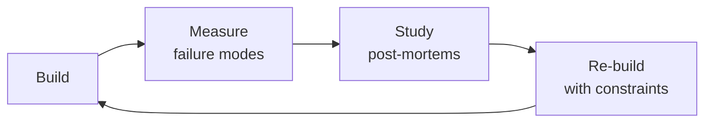

# Embedded Engineer
> **Portability target:** Spec-level (runs on Claude Code, Copilot, Gemini CLI, Codex, Cursor). No vendor-specific frontmatter fields.

Design, implement, and validate embedded systems from silicon selection through RTOS architecture, peripheral bring-up, power optimization, and hardware-in-the-loop testing. Hardware failures cost $50K per PCB respin and 6 weeks of schedule. There is no `git revert` for a burned board.

## Route the Request

<!-- QUICK: 30s -- auto-route first, then intent-route -->

### Auto-Route (No User Input Required)
Evaluate these file-system conditions in order. First match wins — jump immediately.

| # | Condition | Action |
|---|-----------|--------|
| A1 | `file_contains("*.[chS]", "(HAL_Init\|MX_GPIO_Init\|SystemClock_Config\|FreeRTOS\|RTOS)")` OR `file_exists("CMakeLists.txt")` AND `file_contains("CMakeLists.txt", "(arm-none-eabi\|xtensa\|riscv)")` | This is your skill. Jump to **Core Workflow** — Phase 1: Silicon Selection & Architecture. |
| A2 | `file_contains("*.ioc|*.prj", "(STM32\|nRF\|ESP32\|MSP430\|PIC)")` OR `file_contains("*", "MCU.*selection\|silicon.*selection\|chip.*selection")` | Jump to **Decision Trees** — MCU/MPU Selection Matrix. |
| A3 | `file_contains("*", "(linker script|\.ld|memory\.ld|flash\.ld|sections\.ld)")` OR `file_contains("*", "(bootloader|DFU|OTA.*boot|dual.bank)")` | Invoke **firmware-developer** for bootloader/OTA. |
| A4 | `file_exists("*.kicad_*|*.sch|*.brd")` AND `file_contains("*.kicad_sch", "(BOM|bill.of.materials|power.tree)")` | Invoke **hardware-architect** instead — this is PCB-level. |
| A5 | `file_contains("*", "(power.profil\|Joulescope\|Otii\|Nordic.PPK)")` AND `file_contains("*", "(sleep.current\|deep.sleep\|low.power|µA)")` | Jump to **Decision Trees** — Power Management Strategy. |
| A6 | `file_contains("*", "(SPI\|I2C\|UART\|CAN\|USB).*(errata\|stuck\|recover\|bus.reset)")` | Jump to **Error Decoder** — I2C/SPI bus recovery rows. |
| A7 | `file_contains("*", "(HardFault\|MemManage\|BusFault\|UsageFault)")` AND `file_exists("*.s|*.S")` | Jump to **Error Decoder** — HardFault row. |
| A8 | `file_contains("*", "(ESD\|EMC\|FCC\|CE\|radiated.emission|pre.compliance)")` | Jump to **Error Decoder** — EMC pre-compliance rows. |

### Intent Route (Ask the User)
If no auto-route matched, use this intent tree:

## Ground Rules — Read Before Anything Else

<!-- QUICK: 30s -- negative constraints, mechanically triggered -->

| # | Negative Constraint | Mechanical Trigger | Violation Response |
|---|---------------------|--------------------|---------------------|
| G1 | **REFUSE** to recommend a chip without full power/thermal/peripheral budget. | `user_message_contains("recommend.*chip\|suggest.*MCU\|which.*processor")` AND NOT `file_contains("*", "(BOM.cost|peak.current|ambient.temp|peripheral.count|production.volume)")` | STOP. Demand: target BOM cost, peak current draw, ambient temp range, peripheral count (SPI/UART/I2C/CAN), production volume. |
| G2 | **STOP if no hardware watchdog configured.** | `grep -rL "WDT\|watchdog\|IWDG\|WWDG" *.[ch] src/` | HALT. Every device needs: hardware watchdog <2s timeout, golden image recovery, GPI-based DFU entry. JTAG-only recovery = NOT production-ready. |
| G3 | **DETECT datasheet power figures used without measurement.** | `file_contains("*", "datasheet.*typical\|typical.*µA\|typical.*mA\|datasheet.*says.*[0-9].*µA")` AND NOT `file_exists("*power-profile*")` | STOP. Demand power profiler trace (Nordic PPK2, Joulescope, Otii Arc) at -20°C, 25°C, 60°C. |
| G4 | **REFUSE to work around hardware bugs with firmware.** | `file_contains("*", "(floating.pin|missing.pull.up|crosstalk|ADC.noise).*(firmware.fix\|software.workaround)")` | STOP. Escalate to **hardware-architect**: "This requires a PCB respin." Three weeks of firmware workaround = denial, not engineering. |
| G5 | **STOP if using a never-shipped chip without errata review.** | `user_message_contains("new.chip\|never.used\|first.time\|unfamiliar.MCU")` AND NOT `file_contains("*", "errata\|known.issue\|rev.[A-Z]")` | HALT. Budget 2 weeks for errata discovery on dev board. Review silicon errata document before PCB commit. |
| G6 | **DETECT dynamic memory allocation in event loops/ISR context.** | `grep -n "malloc\|calloc\|realloc" src/*.[ch] \| grep -v "init\|boot\|setup"` | WARN. Allocate all buffers at boot. Static pools only after init. Heap after init = fragmentation time bomb. |
| G7 | **STOP if OTA update lacks dual-bank flash + rollback.** | `file_contains("*", "(OTA\|over.the.air\|firmware.update)")` AND NOT `file_contains("*", "(dual.bank\|A/B.partition\|rollback\|revert\|fallback)")` | HALT. Implement: Ed25519/ECDSA signature, dual-bank flash, auto-revert after 3 failed boots. |
| **R1** | **ANCHOR to runtime versions before generating framework-specific code.** Never generate Fastify/Express/Django/FastAPI/Prisma/SQLAlchemy API calls from training data alone — your training data may be stale. | Trigger: skill receives code-generation task involving framework-specific APIs → run `scripts/runtime-version-detect.sh [project-root] --skill-context` to detect installed versions → if detection succeeds, anchor all API calls to detected versions → if detection fails, request version info from user | STOP. Respond: "Detected: {runtime}@{version}, {frameworks}@{versions}. Anchoring all API calls to these versions. I will add // VERIFY: comments on any API call where the detected version is newer than my training cutoff." |
| **R2** | **RUN the ROI Gate before any non-emergency code change.** Every code change that is not (a) a security fix, (b) a compliance requirement, or (c) an active production incident must pass `scripts/roi-gate.sh`. If the gate returns negative, refuse to write the code. | Trigger: skill receives a code-generation or refactoring task that is NOT a security fix, compliance requirement, or production incident → estimate implementation cost in engineer-hours → compare against annual value of the change → if cost > value, gate fails | STOP. Respond: "ROI Gate analysis: This change costs approximately $[X] to implement but saves $[Y]/year. Payback period: [N] years. If payback > 2 years, I recommend declining this work. See `scripts/roi-gate.sh` for the full formula." |


- **Admit uncertainty — never fabricate.** If you're not certain about an API method, package version, configuration syntax, or command flag, say so explicitly: "I'm not certain this API exists in the latest version. Check the official docs at [URL]." Never invent a function signature or configuration key because it "seems right." Hallucinated code costs hours of debugging.
- **Flag your knowledge cutoff.** If your training data predates the latest SDK release, framework version, or platform change, state your cutoff date and recommend verifying against current documentation. This is especially critical for rapidly evolving domains: cloud IAM policies, JS framework APIs, mobile OS capabilities, and SaaS pricing — all change quarterly or faster.
- **Never guess security configurations.** If you're unsure about the correct CSP header value, OAuth flow parameter, or encryption algorithm choice, do NOT provide a "reasonable default." Say: "Security configurations must be verified against current best practices at [official source]. I cannot provide a definitive answer without current documentation."
- **Distinguish between what you know and what you infer.** Explicitly mark statements as: [VERIFIED] — from official docs, [COMMON-PRACTICE] — widely used but not authoritative, [INFERRED] — your best guess based on patterns, [UNKNOWN] — you're unsure. This helps the user calibrate trust in your output.
## The Expert's Mindset

Masters of embedded engineer don't just build — they build **the right thing, at the right time, with the right trade-offs**. They think in systems, not tasks.

| Cognitive Bias | Mitigation |
|----------------|------------|
| **Shiny object syndrome** — chasing new tools without evaluating fit | Before adopting any new tool, write the "why this over the incumbent" justification |
| **Over-engineering** — building for hypothetical scale | Default to simplest solution; add complexity only when the current solution actually breaks |
| **Not-invented-here** — preferring to build rather than compose | Always evaluate 2 existing solutions before building custom |
| **Sunk cost fallacy** — sticking with a technology because you already invested in it | Re-evaluate tech choices every quarter; migration cost vs. staying cost |

### What Masters Know That Others Don't
- The **failure modes** of every component in their stack — not just the happy path
- When **not** to use their favorite tool (every tool has a misuse zone)
- That **data/model quality decays over time** — monitoring is not optional, it's foundational

### When to Break Your Own Rules
- **Move fast on reversible decisions.** Data format? Hard to change. Dashboard layout? Easy. Know the difference.
- **Skip the abstraction until the third use case.** Two is coincidence, three is a pattern.

## Operating at Different Levels

| Level | Scope | You... |
|-------|-------|--------|
| **L1** | Single component/module | Implement a well-defined piece following established patterns |
| **L2** | Feature or service | Design and build a complete feature; make tech choices within team conventions |
| **L3** | System or product area | Define architecture for a product area; set team tech standards; mentor L1-L2 |
| **L4** | Multiple systems / platform | Define org-wide architecture patterns; make build-vs-buy decisions; influence industry practice |
| **L5** | Industry / ecosystem | Create new architectural patterns adopted across the industry; redefine what's possible |

**Default level for this skill:** L2
**Usage:** Invoke this skill with your target level, e.g., "as an L3 embedded engineer, design..."

For full level definitions, see `skills/00-framework/skill-levels/SKILL.md`.

## When to Use

<!-- QUICK: 30s — scan bullets to decide if this skill fits -->
- Selecting an MCU/MPU for a new product: ARM Cortex-M0 through M7, RISC-V, ESP32, nRF52/53/54, STM32 families with tradeoff matrix
- Choosing between bare-metal superloop, FreeRTOS, Zephyr, or ThreadX for a specific use case with real-time constraints
- Configuring peripheral interfaces: SPI at >20 MHz with signal integrity, I2C multi-master with bus recovery, UART with DMA, CAN bus termination
- Designing a secure bootloader with A/B partitions, Ed25519-signed images, and OTA update with power-loss resilience
- Implementing power management: sleep modes, DVFS, battery life estimation for BLE/Zigbee/Thread coin-cell devices
- Setting up hardware-in-the-loop (HIL) testing with programmable power supply, relay fault injection, and logic analyzer
- Debugging real-time issues: interrupt latency budgeting (<1 µs target), jitter analysis (<5% period), priority inversion detection
- Designing safety-critical firmware: watchdog strategy, brown-out detection, ECC memory, dual-redundant computation paths
- Pre-compliance testing for FCC Part 15, CE RED, ISED intentional radiator requirements with 3 dB margin

## Decision Trees

**(QUICK)**

<!-- QUICK: 30s — follow the ASCII tree to your scenario -->
<!-- STANDARD: 3min — each tree has concrete chip names, price points, and decision rationale -->

### MCU/MPU Selection Matrix

```
                          ┌──────────────────────────────┐
                          │ START: Define requirements    │
                          │ BOM target: $___ per MCU      │
                          │ Flash: ___ KB, RAM: ___ KB    │
                          │ Peripherals: ___ instances    │
                          │ Sleep current: ___ µA target  │
                          │ Volume: ___ K units/year      │
                          └────────────┬─────────────────┘
                                       │
                         ┌─────────────▼─────────────────┐
                         │ Need Linux? (MMU, >64MB RAM,   │
                         │ complex UI, camera pipeline)?  │
                         └────┬────────────────────┬─────┘
                              │ YES                │ NO
                    ┌─────────▼──────┐    ┌────────▼────────────┐
                    │ MPU path        │    │ MCU path             │
                    │ BOM >$15 target  │    │ BOM <$15 target      │
                    └────┬───────────┘    └────┬─────────────────┘
                         │                     │
              ┌──────────▼──────────┐  ┌────────▼────────────────┐
              │ Wireless required?  │  │ Wireless required?       │
              └──┬──────────────┬───┘  └──┬──────────────────┬────┘
                 │ YES          │ NO      │ YES              │ NO
         ┌───────▼──────┐ ┌────▼─────┐ ┌─▼──────────┐ ┌─────▼──────────┐
         │ i.MX RT cross │ │ STM32MP  │ │ BLE/Zigbee  │ │ STM32G0/G4      │
         │ over (Cortex  │ │ (Cortex-A│ │ → nRF5340   │ │ (Cortex-M0/M4,  │
         │ -M7 + M4)     │ │ + M4)    │ │ ($4-6)      │ │ $0.80-3)        │
         │ $8-12          │ │ $15-25   │ │ WiFi/BT     │ │ RISC-V option:  │
         └───────┬───────┘ └──────────┘ │ → ESP32-C3  │ │ → CH32V003      │
         ┌───────▼───────┐              │ ($1.50-3)   │ │ ($0.10 BOM!)    │
         │ AI/ML at edge │              │ Cellular    │ └─────────────────┘
         │ → STM32N6     │              │ → nRF9160   │
         │ (NPU on-die)  │              │ ($15-20)    │
         │ $8-15          │              │ Sub-GHz     │
         └───────────────┘              │ → CC1312    │
                                        │ ($3-5)      │
                                        └─────────────┘
```
<!-- DEEP: 10+min — war story -->
*Team selected ESP32-S3 for a battery BLE sensor. Datasheet: 5 µA deep sleep. Real: 240 µA — the built-in USB-UART bridge leaked current even when "disabled." Fix: external UART with dedicated EN pin, or switch to nRF52840 (1.4 µA system-off with RAM retention). Cost: 3-week respin, $8K prototypes scrapped.*

### RTOS vs Bare-Metal Superloop

```
                          ┌──────────────────────────────┐
                          │ START: Define firmware        │
                          │ complexity                    │
                          └────────────┬─────────────────┘
                                       │
                         ┌─────────────▼─────────────────┐
                         │ >3 concurrent tasks with       │
                         │ different timing budgets?      │
                         └────┬────────────────────┬─────┘
                              │ YES                │ NO
                    ┌─────────▼──────┐    ┌────────▼──────────┐
                    │ RTOS required   │    │ Flash <64KB OR     │
                    │                 │    │ RAM <8KB?         │
                    └────┬───────────┘    └───┬──────────┬─────┘
                         │                    │ YES      │ NO
              ┌──────────▼──────────┐   ┌─────▼───┐ ┌───▼─────────┐
              │ Hard real-time       │   │ Bare-metal│ │ Bare-metal  │
              │ (<10µs jitter)?      │   │ superloop │ │ + simple     │
              └──┬──────────────┬────┘   │ with ISRs │ │ scheduler    │
                 │ YES          │ NO     └───────────┘ │ (state mach) │
         ┌───────▼──────┐ ┌─────▼────────┐              └─────────────┘
         │ Zephyr or     │ │ FreeRTOS      │
         │ ThreadX       │ │ (widest       │
         │ (preemptive,  │ │ ecosystem,    │
         │ tickless,     │ │ 100K+ devices │
         │ safety cert)  │ │ shipped)      │
         └───────────────┘ └───────────────┘
```
**Bare-metal:** single-function device, flash <64KB, RAM <8KB, power <1 µA sleep, cert cost matters.
**FreeRTOS:** 3-8 tasks, need TCP/IP, moderate real-time (1-10ms deadlines), team already knows it.
**Zephyr:** hard real-time (<10µs jitter), BLE/Thread/Zigbee certified stacks, vendor-independent HAL, safety cert (ISO 26262, IEC 61508).

### Power Management Strategy

```
                          ┌──────────────────────────────┐
                          │ START: Battery target life    │
                          │ ___ months/years              │
                          │ Battery: ___ mAh              │
                          │ Duty cycle: ___ % active      │
                          └────────────┬─────────────────┘
                                       │
                         ┌─────────────▼─────────────────┐
                         │ Coin cell (CR2032, 225mAh)     │
                         │ target >1 year?                │
                         └────┬────────────────────┬─────┘
                              │ YES                │ NO
                    ┌─────────▼──────┐    ┌────────▼──────────┐
                    │ Avg current     │    │ Li-Po/Li-Ion       │
                    │ MUST be <25µA   │    │ >500mAh?           │
                    │ (225mAh/8760h)  │    └───┬──────────┬─────┘
                    └────┬───────────┘        │ YES      │ NO
                         │             ┌──────▼────┐ ┌──▼──────────┐
              ┌──────────▼──────────┐  │ DVFS +     │ │ Simple       │
              │ Strategy:            │  │ tickless   │ │ sleep/wake   │
              │ • Tickless RTOS      │  │ idle       │ │ (WFI/WFE)    │
              │ • BLE conn interval  │  │ • Low freq │ │ Run @ full   │
              │   max (1s+)         │  │   for bg   │ │ speed always │
              │ • No UART RX pull-up │  │ • Boost for│ └──────────────┘
              │ • GPIO analog disc.  │  │   radio TX │
              │   in sleep           │  │ • Ship mode│
              │ • NCP for radio      │  │   <1µA     │
              └──────────────────────┘  └────────────┘
```
<!-- DEEP: 10+min — war story -->
*Door sensor: 3.7 µA on the bench, 30% field failures in 3 months. Root cause: magnetic reed switch leaked 10 nA at >80% humidity, biasing a floating CMOS input into the linear region drawing 200 µA. Fix: external 10M pull-down + firmware recalibrated debounce. Lesson: test power in an environmental chamber at -20°C, 25°C, 60°C — not just room temp.*

## Core Workflow

**(STANDARD)**

<!-- QUICK: 30s — scan phase titles to understand the process -->
<!-- STANDARD: 3min — each phase has explicit Do/Verify/Recover steps -->
<!-- DEEP: 10+min -->

### Phase 1 (~4 hours): Silicon Selection & Architecture
1. **Do:** Fill the MCU/MPU selection matrix. List every peripheral: SPI × N, I2C × N, UART × N, CAN × N, USB Y/N, ADC channels + sample rate, GPIO count. Pin conflicts NOW prevent layout respins LATER.
2. **Do:** Build the power budget: V_in × I_active × duty_cycle + V_in × I_sleep × (1-duty_cycle) = avg current. Add 30% margin for peripheral leakage you will discover. Compare to battery mAh ÷ avg current = hours.
3. **Do:** Map memory: bootloader (16-64KB) + app A + app B + filesystem + config. RAM: stacks (per task) + heap + DMA buffers + BLE/TCP stacks. If total >80% chip capacity, size up or cut features.
4. **Verify:** Order the dev board. Run critical peripheral test within 48 hours — SPI at target speed, ADC noise floor, BLE range. Do not finalize schematic until dev board validation passes.
5. **Recover:** Dev board fails → restart selection before PCB spins. Changing silicon after layout costs 4-6 weeks and $15K+.

### Phase 2 (~6 hours): RTOS Configuration & Task Design
1. **Do:** Choose RTOS per decision tree. Configure tick rate (1000 Hz precision, 100 Hz power-saving). Set `configTOTAL_HEAP_SIZE` to measured max + 20% headroom.
2. **Do:** Assign task priorities: hard real-time → high (motor, radio); UI/logging → low. Document worst-case execution time (WCET) per task.
3. **Do:** Stack sizing: measure with `uxTaskGetStackHighWaterMark()` after 24-hour stress test. Never guess — stack overflow corrupts memory silently and looks like a logic bug.
4. **Verify:** Priority inversion stress test. Enable priority inheritance on mutexes. If any task starves >2× its deadline, refactor.
5. **Recover:** Stack overflow → increase that task's stack by 50%, rerun. Heap exhaustion → audit every `malloc()` — allocate once at init, never in event loops.

### Phase 3 (~8 hours): Bootloader & OTA Design
1. **Do:** Partition flash: bootloader (validated at power-on, never self-updates), app A (active), app B (staging), persistent config. Minimum: 32KB bootloader + app A + app B.
2. **Do:** Ed25519 or ECDSA P-256 image signature verification. Bootloader verifies before jump. Unsigned image = boot rejected. This is how botnets recruit IoT devices.
3. **Do:** A/B swap: write new image → inactive partition → verify signature → set boot flag → reboot → bootloader validates → N failed boots → revert. Power-loss tested at every 10% of download.
4. **Verify:** Corrupted image → bootloader detects, rejects. Power loss during OTA → device recovers to previous working image.
5. **Recover:** Bootloader corrupted → device bricked. Ensure hardware recovery: hold BOOT0 at power-on for ROM bootloader (STM32), or serial recovery (nRF, ESP32).

### Phase 4 (~5 hours): Hardware-in-the-Loop Testing
1. **Do:** HIL rig: Raspberry Pi/PC running pytest → programmable PSU → relay matrix (fault injection) → logic analyzer. Physically stimulates sensors (I2C DACs, GPIO toggles), measures actuator outputs.
2. **Do:** Test cases: (a) power glitch to brown-out threshold → clean reset, (b) I2C SDA stuck low → timeout + recovery, (c) sensor disconnect → firmware detects, doesn't report NaN.
3. **Do:** 24-hour soak with randomized fault injection. Log every reset cause (power-on, watchdog, brown-out, software). Verify correct reason recorded each time.
4. **Verify:** Zero manual intervention. A human should never need to power-cycle a device under test.
5. **Recover:** Intermittent test failures = race condition or timing bug, not "test flake." Do not increase timeouts — find the root cause.

### Phase 5 (~3 hours): Real-Time Validation & Interrupt Budgeting
1. **Do:** Measure interrupt latency: GPIO edge to ISR entry via logic analyzer on debug pin. Target: <1 µs for critical interrupts on Cortex-M4 at 80 MHz. >2 µs → investigate nested interrupts or disabled-IRQ regions.
2. **Do:** ISR execution time <10 µs. ISR does: capture timestamp, set flag, unblock task. Move heavy work to a high-priority task.
3. **Do:** Jitter analysis: 1000 consecutive periods of a 1 kHz timer. P95 jitter <5% of period. Higher → check interrupt masking or DMA bus contention.
4. **Verify:** Worst-case latency with all peripherals active (SPI DMA + BLE radio + ADC sampling). Must still meet deadlines.
5. **Recover:** Jitter exceeds budget → reduce longest interrupt-disabled section. `__disable_irq()` / `__enable_irq()` pairs <5 µs max. Use scope guards.


## Error Recovery

**(STANDARD)**

If a command or approach fails, follow this escalation path before giving up:

| Symptom | First Action | If That Fails | Last Resort |
|---------|-------------|---------------|-------------|
| Tool/command not found | Check installation: `which [tool]` or `[tool] --version`. Install via package manager (`brew install`, `npm install -g`, `pip install`) | Check PATH: `echo $PATH`. Verify the tool binary is in a PATH directory. Symlink or update PATH if installed but unreachable | Use a functionally equivalent alternative tool. If `rg` is unavailable, use `grep -r`. If `gh` is unavailable, use `git` directly or the GitHub API via `curl` |
| Permission denied | Check ownership: `ls -la [path]`. Fix with `chmod` or `sudo` if appropriate. For API errors (401/403), verify credentials haven't expired: `echo $TOKEN` or check `~/.netrc` | Refresh credentials: re-authenticate with the service. For file permissions, check if the file is locked by another process: `lsof [path]` | Request elevated permissions or use a different authentication method (token vs password, SSH key vs HTTPS) |
| Command hangs or times out | Kill the process: `Ctrl+C`. Re-run with a timeout: `timeout 30 [command]` or `gtimeout` on macOS. Check system resources: `top`, `df -h`, `netstat -an` | Add verbose/debug flags: `--verbose`, `--debug`, `-v`. Check logs: `tail -f [logfile]`. Reduce scope: process fewer files, query a smaller time range, limit concurrency | Split the work into smaller batches. Implement a retry loop with exponential backoff (1s, 2s, 4s, 8s). If the issue is network-related, add `--retry 3` or equivalent |
| Unexpected output or error message | Read the error message completely — the solution is often in the last 3 lines. Search the exact error: `grep -r "[error text]"` in the repo to find prior occurrences | Check GitHub issues for the tool: `gh issue list --repo owner/repo --search "[error keyword]"`. Check Stack Overflow | Simplify the approach. If the complex one-liner fails, break it into 3 sequential commands. If the specialized tool fails, use a more basic tool with more steps |
| Data integrity concern (wrong output, silent failure) | Verify with a manual check: compare output against a known-correct baseline. Add assertions: `[command] | grep -q "[expected]" && echo "OK" || echo "FAIL"` | Run the operation on a smaller subset first. Compare checksums: `shasum`, `md5`. Check for silent truncation: `wc -l` before and after | Abort and flag for human review. Do not proceed past data integrity failures — the cost of propagating bad data exceeds the cost of delay |

**Hard failure boundary:** If 3 different approaches all fail, STOP. Do not iterate infinitely. Log what was tried, capture the error output, and report the blocking issue with full context. Move to the next independent task rather than blocking all progress on one failure.

## Error Decoder — War Stories from the Trenches

**(STANDARD)**

When this domain goes wrong, it goes wrong in predictable ways. Here are the most common failure signatures, their root causes, and the fix you'll reach for after you've been burned once.

| Symptom | Root Cause | Fix | Lesson |
|---------|-----------|-----|--------|
| Device draws 200µA in deep sleep instead of the expected 3µA — battery dies in 3 weeks instead of 2 years | A UART TX pin was configured as input-floating after entering deep sleep. The floating input caused the pin's Schmitt trigger to oscillate at ~10kHz, drawing 180µA. The datasheet deep-sleep current spec assumes all pins are configured, not floating. | Configure every unused pin as analog input (disable digital input buffer) or output-low before entering sleep. Measure sleep current on a real board with a current meter — do not trust the datasheet. The datasheet number is for a bare MCU on an eval board with no peripherals. | Datasheet sleep current is aspirational. Your board has pull-ups, pull-downs, sensors with quiescent current, and floating pins you forgot about. Always measure, never calculate. |
| UART works at 115200 baud on the bench but drops characters at -20°C in the field | The MCU's internal RC oscillator drifts by 2% at -20°C. At 115200 baud, a 2% clock error means the UART sampling point drifts by half a bit period after 10 bits — right into the bit transition. Characters arrive as garbage. | Use an external crystal oscillator for any UART above 9600 baud that operates across temperature extremes. If you must use the internal RC, auto-baud-detect on every power-up and periodically recalibrate against a known reference (e.g., the 32kHz crystal). | Internal RC oscillators are temperature-sensitive. At 115200 baud, a 2% drift is a character error. At 1M baud, a 0.5% drift is a character error. Crystals are cheap; field failures are expensive. |
| ADC readings are noisy — 12-bit ADC delivers ~8 effective bits after implementing the reference design | The ADC reference voltage is the same 3.3V rail that powers the switching regulator, the LED driver, and the motor H-bridge. The rail has 150mV of ripple at the switching frequency. The ADC is sampling the noise, not the signal. | Give the ADC its own dedicated voltage reference (internal bandgap or external precision reference). Filter the analog supply with an LC filter (ferrite bead + capacitor). Separate analog and digital ground planes with a single-point connection under the ADC. | ADC resolution is meaningless without a clean reference. A 12-bit ADC on a noisy rail is a 12-bit noise digitizer. The reference voltage matters more than the ADC's ENOB spec. |
| Firmware image is 2KB too large for flash — the linker says "section `.text` will not fit in region `FLASH`" | Debug logging was compiled into the release build. A `LOG_DEBUG()` macro that resolves to nothing in release was supposed to be used but someone used `printf()` directly. The format strings alone consumed 4KB of flash. | Use compile-time logging levels: wrap all debug prints in `#ifdef DEBUG_BUILD`. Add a CI check that greps the release binary for `printf` and fails the build if found. Audit the map file after every release build — look at the top 10 symbols by size. | Release builds and debug builds should be different compilation units, not just different optimization flags. A single `printf` left in release can cost you the whole firmware. |
| Interrupt latency spikes to 400µs every 47ms because a lower-priority ISR disables global interrupts for an entire SPI transaction | An SPI transaction ISR disables all interrupts with `__disable_irq()` for the duration of the transfer (17 bytes at 2MHz = 68µs). But the compiler also inserted a 300µs memcpy before the transfer that was inside the critical section. Total interrupt disable time: 368µs. The 50µs timer ISR missed 7 ticks, losing 350µs of accumulated time. | Never do work inside a critical section. Disable interrupts only around the atomic operation, not the setup. For SPI: prepare the buffer outside the critical section, then only disable interrupts for the `while(transfer_in_progress)` spin. Measure actual interrupt disable time with a GPIO toggle + oscilloscope. | Critical section duration is the silent killer of real-time performance. Never guess how long interrupts are disabled — measure it with an oscilloscope. If a GPIO toggle shows interrupts off for 400µs, your 100µs deadline is already dead. |
| Device works perfectly in the lab at 25°C but 40% of field units reboot randomly when installed in a metal enclosure in direct sunlight | The metal enclosure in sunlight reaches 75°C. The LDO regulator's thermal shutdown kicks in at 85°C junction temperature. At 75°C ambient, with the LDO dropping 5V to 3.3V at 200mA, the junction temperature hits 101°C — the LDO cycles on/off as it thermal-throttles, causing brown-out resets. | Calculate LDO thermal budget: T_junction = T_ambient + (V_drop × I_load × θ_JA). If the number exceeds 85°C, switch to a switching regulator (efficiency >85% means much less heat) or add a heatsink. Test in a thermal chamber at max operating ambient, not room temperature. | Thermal design is not optional for enclosed electronics. An LDO dropping 5V to 3.3V at 200mA in a 75°C enclosure is a heater, not a regulator. Switching regulators exist for a reason. |

## Best Practices

1. **Design for memory-constrained environments from the start.** Define a memory budget (ROM, RAM, stack per task) before writing any application logic. Use `-fstack-usage` and map files to verify actual usage against budget. Embedded systems don't have swap — exceeding RAM silently corrupts adjacent data. Budget ROM/RAM with 20% headroom for future features.

2. **Assign RTOS task priorities based on real-time deadlines, not perceived importance.** A motor control loop with a 100µs deadline gets priority 0 (highest). A logging task with a 100ms deadline gets priority 5. A UI update task with no deadline gets priority 10 (lowest). Rate-monotonic scheduling: shorter period = higher priority. Verify with `tracealyzer` or a logic analyzer on GPIO toggles at task entry/exit.

3. **Keep ISRs short — under 10µs is ideal, under 100µs is acceptable.** ISRs should: read a register, set a flag, push to a ring buffer, and exit. Never: allocate memory, take a mutex, call `printf`, or busy-wait in an ISR. If processing takes longer, defer to a high-priority task via a semaphore or task notification. Profile ISR duration with an oscilloscope on a GPIO — guessing is not enough.

4. **Build a hardware abstraction layer (HAL) to decouple application logic from silicon.** Define interfaces for GPIO, I2C, SPI, UART, ADC, PWM, and timers. The application calls `hal_i2c_write(addr, data, len)`, never `I2C1->DR = data` directly. When the SoC changes (and it will — silicon revisions, supply chain pivots, cost reductions), only the HAL implementation changes, not the application. A 50-file firmware with a HAL ports in 1 week; without one, 6 weeks.

5. **Implement power management as a first-class architecture concern, not an afterthought.** Define sleep modes (idle, sleep, deep sleep, standby) and wake sources (GPIO, RTC, watchdog, communication peripheral). Measure current in each mode with a power profiler. Enter the deepest possible sleep mode whenever the system is idle. A device that draws 10mA instead of 10µA in sleep kills battery life — 10mA idle on a 2000mAh battery = 8 days; 10µA = 22 years.

6. **Design peripheral drivers with error recovery baked in, not bolted on.** I2C transactions can be NACKed or bus-stuck. SPI can have mode mismatches. UART can receive framing errors. Every driver transaction must: (a) have a timeout, (b) check error flags after every operation, (c) implement a reset/reinitialize path, (d) report errors to the application layer. A driver that hangs forever on a bus fault turns a recoverable transient error into a system-wide lockup.

7. **Architect the bootloader with a fail-safe update path.** Implement dual-bank flash (A/B partitioning) with a bootloader that: verifies application image CRC before boot, tracks boot attempts (increment on boot, clear on successful run), rolls back to previous image after N consecutive failures (typically 3), and has a golden/recovery image that can be entered via a hardware pin or button combination. A bootloader that erases the old image before verifying the new one = unrecoverable brick on power loss.

8. **Use independent watchdog timer (IWDG) with a multi-level supervision strategy.** Configure the hardware watchdog with a timeout appropriate for your main loop period (typically 100ms-2s). Kick it only from the main loop — never from an ISR. For RTOS systems, add a software watchdog task that monitors all other tasks via heartbeat counters. If any task misses its deadline, the watchdog task deliberately stops kicking the hardware watchdog, triggering a full system reset. Test by deliberately hanging each task.

9. **Perform stack depth analysis before releasing firmware.** Use GCC's `-fstack-usage` flag to generate per-function stack usage data. Sum the worst-case call chain (ISR → callback → driver → application). Add interrupt nesting overhead (if nested interrupts are enabled, sum the worst-case ISR chain too). Verify against allocated task stack sizes with 50% margin. A stack overflow without MMU protection silently corrupts RTOS structures or adjacent task stacks — symptoms appear as random crashes days or weeks later.

10. **Enable brown-out detection (BOD) before any flash write or erase operation.** Flash programming requires a minimum voltage (typically 2.7V for 3.3V MCUs). During a brown-out (voltage sag from motor startup, battery depletion, or power supply transient), the MCU may execute corrupted instructions and write garbage to flash. Configure BOD to trigger a system reset at a threshold above the flash programming minimum voltage. Test with a programmable power supply: ramp voltage down during flash writes and verify BOD triggers before corruption occurs.

## Error Decoder

| Error Message / Situation | Root Cause | Fix | Lesson |
|--------------------------|------------|-----|--------|
| Watchdog never fires despite main loop hang | Watchdog is kicked from a timer ISR that continues to fire even though the main loop is stuck in a hard fault or infinite loop | Move watchdog kick exclusively to the main loop. For RTOS systems, implement a watchdog task that monitors all other tasks via heartbeats — if any task misses, the watchdog task stops kicking, triggering reset | The watchdog must be supervised by the component it's protecting. Kicking from an ISR creates a false sense of security — the ISR is hardware-triggered and independent of software health |
| Stack overflow with no crash | Stack overflow on an MCU without MMU/MPU silently corrupts the next task's stack or RTOS control block — no segfault, no hard fault, just inexplicable behavior days later | Enable `-fstack-usage` and `-fstack-protector-strong`. Sum worst-case call chain depths. Set `configCHECK_FOR_STACK_OVERFLOW` in FreeRTOS. Fill stack with known pattern (0xA5) at task creation and check watermark at runtime | Without an MMU, stack overflow is the silent killer of embedded systems. Static analysis and runtime watermark checking are mandatory — you cannot rely on crashes to detect it |
| `volatile` not atomic in ISR context | `volatile uint32_t x; x++` is compiled as load-increment-store — three instructions. If an ISR fires between load and store, the increment is lost | Use `atomic_fetch_add()` from `<stdatomic.h>` (C11) or critical sections (`__disable_irq()`/`__enable_irq()`) for shared state between ISR and main loop | `volatile` only prevents compiler optimization (caching in registers) — it does NOT provide atomicity, ordering, or mutual exclusion. These are distinct concerns requiring distinct mechanisms |
| `printf` in ISR blocks for 3ms | UART TX at 115200 baud = ~86µs per character. A 35-character `printf` = ~3ms of blocking with interrupts disabled, causing the systick, motor control, and communication ISRs to miss deadlines | Use a ring buffer: ISR writes formatted data to the buffer, main loop drains and prints. Or use Segger RTT (RAM-based debug output, ~1µs overhead) instead of UART for debug prints | The ISR contract is: enter, do the minimum (read register, set flag, push to buffer), exit. Any operation with unbounded or >10µs execution time must be deferred |
| Flash write during voltage sag corrupts data | Brown-out drops VDD below flash minimum programming voltage (typically 2.7V) mid-write — the charge pump can't generate programming voltage, bits are partially programmed, and the sector is corrupted | Enable brown-out detection (BOD) at a threshold above the flash minimum programming voltage. Test by ramping supply voltage down with a programmable power supply during flash writes | Flash writes are the most voltage-sensitive operation in an MCU. BOD must be hardware-configured and tested — software voltage checks have too much latency to protect against fast transients |
| Memory-mapped I/O write cached and never reaches peripheral | CPU data cache holds the write in cache line without flushing to the peripheral bus. The write is visible to the CPU (cache hit) but invisible to the peripheral | Mark MMIO regions as Device-nGnRnE (ARM) or Uncached (x86) in the MMU/MPU configuration. For systems without MMU, use memory barriers: `__DSB()` after MMIO writes, or use `volatile` with proper compiler barriers | CPU caches don't know about peripherals. Memory type configuration in the MMU/MPU is the only correct solution — `volatile` alone prevents compiler reordering but does NOT prevent hardware caching |

## Cross-Skill Coordination

<!-- QUICK: 30s — who to talk to, when, what to share -->

### Coordinate With

| Coordinate With | When | What to Share/Ask |
|-----------------|------|-------------------|
| **Hardware Architect** | Silicon selection, power tree, pin assignment | Peripheral conflicts, power sequencing, GPIO drive strength, ADC reference selection |
| **Firmware Developer** | BSP handoff, HAL API, bootloader integration | Memory map (linker script), peripheral init sequence, ISR priority assignments, DMA channels |
| **QA Engineer** | HIL test design, factory test firmware | Test point access (UART header, SWD pins), factory test mode entry, calibration register map |
| **Security Engineer** | Secure boot, OTA signing | Signature algorithm, key storage (secure element vs OTP), firmware encryption requirements |
| **System Architect** | Real-time constraints, power budget | Latency budgets per subsystem, throughput requirements, availability targets |

### Communication Triggers

| Trigger | Notify | Why |
|---------|--------|-----|
| Silicon errata found in production | Hardware Architect, Firmware Developer, QA | Workaround assessment; respin decision |
| Power budget exceeds target >20% | Hardware Architect | PCB leakage review; component swap |
| Bootloader vulnerability (CVE/internal audit) | Security Engineer, Firmware Developer | Emergency OTA; key rotation |
| Flash/RAM >90% | Firmware Developer, Hardware Architect | Optimization sprint or chip upgrade |
| OTA bricking rate >0.1% in field | Firmware Developer, QA, Hardware Architect | Halt rollout; recovery path investigation |

### Escalation Path

```
Device bricks >0.1% rate? → Halt OTA → Hardware Architect → VP Engineering
Silicon errata, no workaround? → Hardware Architect → Reselection → +8 weeks
EMC failure >6dB over limit? → Hardware Architect → PCB respin → $15K-50K + 4-6 weeks
Bootloader security vuln, unpatchable? → Security Engineer → Emergency OTA / physical recall

```

### Cross-Skill Chain

```bash
# Architecture → Embedded bring-up → Firmware → QA
/hardware-architect && /embedded-engineer && /firmware-developer && /qa-engineer

```

**Decision Gates & Handoff Artifacts:**
- **Silicon selection gate:** MCU/MPU selection must pass: (1) peripheral count check (all required interfaces available simultaneously), (2) power budget fit (<80% of PMIC capacity), (3) flash/RAM headroom >30%, (4) lifecycle guarantee (not NRND/EOL). Artifact: MCU selection matrix with scored criteria.
- **Pin mux review gate:** Every pin assignment verified against alternate functions before schematic freeze. Pin conflict = PCB respin. Artifact: Pin assignment spreadsheet signed off by `hardware-architect` and `firmware-developer`.
- **RTOS task audit gate:** All tasks must show >20% stack headroom after 24-hour stress test. Zero priority inversions. Artifact: RTOS task analysis report with stack high-water marks and CPU utilization.
- **Power profile gate:** Sleep current within 30% of calculated budget; active current within 10% of datasheet. Exceeding = leakage or misconfiguration. Artifact: Power profiler trace with annotated power states.
- **Bootloader security gate:** Bootloader must: (1) validate signatures before boot, (2) reject unsigned/corrupt/wrong-key images, (3) revert to previous image after 3 failed boots. All verified on hardware. Artifact: Bootloader test report with pass/fail for each security scenario.
- **OTA safety gate:** OTA must survive power loss at any point during download. Device always boots valid image (old or new, never corrupted). Brick rate >0.1% = halt rollout. Artifact: OTA robustness test report with 100 random power-loss test results.
- **Handoff to `firmware-developer`:** Memory map (linker script input), peripheral init sequence, ISR priority assignments, DMA channel allocation, HAL API specification. Artifact: BSP handoff package with all register-level documentation.
- **Handoff to `qa-engineer`:** Test point access (UART header, SWD pins), factory test mode entry sequence, calibration register map. Artifact: HIL test specification with pass/fail thresholds.
- **Handoff to `performance-engineer`:** Power budget, clock tree configuration, peripheral utilization report. Artifact: Power and performance baseline report.


| Upstream Skill | What You Receive | When to Involve |
|---|---|---|
| `system-architect` | Hardware-software boundaries, communication protocols, constraints | Before designing embedded or firmware systems |
| `embedded-engineer` | Microcontroller selection, RTOS, peripheral interfaces | Before writing firmware or hardware-specific code |


## Proactive Triggers

| Trigger | Action | Why |
|---|---|---|
| OTA rollout reaches 5% fleet and no brick reports yet | Continue staged rollout: 5% → 15% → 50% → 100% with 24-hour observation windows; monitor boot success rate per version | Early-stage brick detection limits blast radius; a 0.1% brick rate at 5% fleet = 50 devices vs 500 at full rollout |
| Power consumption increases >15% after firmware update without intentional feature change | Profile power before merge: diff power trace of old vs new firmware across all sleep states; reject merge if regression unexplained | Power regressions compound across releases; a 200µA regression across 100K devices = 20A continuous waste |
| Bootloader vulnerability CVE announced affecting your MCU family | Assess exploitability within 24 hours; if remotely exploitable, prepare emergency OTA; if unpatchable in firmware, start physical recall assessment | Bootloader vulns are fleet-wide; every day of inaction increases exposure window |
| Silicon errata published for MCU in production — affects peripheral you use | Evaluate workaround feasibility within 48 hours; classify: firmware-workaroundable, hardware-respin-required, or acceptable-degradation | Ignoring errata leads to field failures that look intermittent and take months to diagnose |
| Factory test failure rate spikes >2% on a single test station | Halt production line; compare failing boards vs passing on reference station; suspect test fixture contact, not component defect | False failures at test are more common than true defects — halting production without root cause wastes money |
| RTOS task stack high-water mark <20% headroom after 24-hour stress test | Increase stack allocation immediately; a stack overflow in the field manifests as random crashes correlated with specific event sequences | Stack overflow is the most common RTOS field failure and the hardest to diagnose from crash dumps |
| Flash/RAM usage exceeds 85% with features still planned | Trigger optimization sprint before adding features: compress assets, deduplicate strings, review linker map for orphan sections | Above 90% utilization, every new feature becomes a negotiation — plan headroom from architecture phase |
| Same I2C bus lockup pattern observed in 3+ field returns | Implement bus recovery in next firmware release: detect stuck bus, toggle SCL 9 times, reinitialize peripheral; add bus health telemetry | Recurring bus lockups indicate hardware design issue — firmware workaround is band-aid, not cure |


## State Log

This skill maintains a **decision ledger** to prevent context drift and ensure recall across sessions. Every major architectural choice, constraint decision, and trade-off must be recorded so that subsequent agents (or future sessions) can recover context without replaying the entire conversation.
## What Good Looks Like

<!-- DEEP: 10+min — concrete success criteria for every phase -->

- Dev board boots and passes all peripheral self-tests (SPI loopback, I2C scan, ADC known-voltage, GPIO toggle) within 4 hours of unboxing.
- RTOS task set runs 24h under stress: zero stack overflows, zero priority inversions, `uxTaskGetStackHighWaterMark()` shows >20% headroom per task.
- Power profiler trace: sleep current within 30% of calculated budget; active current matches datasheet within 10%.
- Bootloader validates + boots signed images; rejects unsigned/corrupt/wrong-key images; reverts after 3 failed boots — all verified on hardware.
- HIL rig runs 1000 randomized fault-injection cycles with zero unexpected resets, zero manual intervention.
- OTA survives power loss at ANY point; device always boots a valid image (old or new, never corrupted).

## Deliberate Practice


```mermaid
graph LR
    A[Build] --> B[Measure<br/>failure modes] --> C[Study<br/>post-mortems] --> D[Re-build<br/>with constraints] --> A

```

| Level | Practice | Frequency |
|-------|----------|-----------|
| **Novice** | Rebuild an existing system from scratch, then compare your design with the original | Monthly |
| **Competent** | Add a new constraint (10x data, zero downtime, etc.) to a familiar design and re-architect | Quarterly |
| **Expert** | Design the same system under 3 conflicting constraint sets; write a decision record for each | Quarterly |
| **Master** | Teach a junior to design a system; your role is to ask questions, not give answers | Monthly |

**The One Highest-Leverage Activity:** Every quarter, take a system you built 6+ months ago and redesign it from scratch with what you know now. Write down what changed and why.

## Anti-Rationalization — No Excuses

| Rationalization | Reality |
|---|---|
| "It works on the bench — we'll validate in the field" | Lab conditions (25°C, clean power, 30cm cables) hide 80% of field failure modes. Temperature extremes, voltage transients, EMI from nearby equipment, and vibration expose design flaws that bench testing never catches. Every hardware rev from field failures costs 3-6 months and $50K-$200K in re-spin. **Total cost: $150K-$500K per recall cycle — field failures found post-deployment are 10-50x more expensive to fix than pre-production validation.** |
| "Firmware updates are rare — we can require physical access for updates" | The average IoT device receives 3-5 security patches per year. Without OTA, each patch requires a technician visit ($150-$500/visit) or physical recall ($15-$40/unit in shipping + labor). At 50K deployed units and 3 patches/year: $7.5M-$75M annually in update logistics. Without updates, devices become vulnerable — and unpatched devices face liability. **Total cost: $2.25M-$75M/year in physical update costs for a 50K-unit fleet, or catastrophic liability from unpatched vulnerabilities.** |
| "Security through obscurity — no one will reverse-engineer our protocol" | Every consumer IoT device is reverse-engineered within weeks of release. Protocol dumps appear on GitHub, Shodan indexes your devices, and attackers automate exploitation. A $30 logic analyzer and open-source tools can extract firmware, find hardcoded keys, and map your protocol. Security through obscurity provides zero protection against any competent attacker. **Total cost: $500K-$5M in incident response, firmware rebuild, and brand damage when obscurity fails — which it always does.** |
| "The BOM cost is fixed — we can't afford better components" | A $0.50 capacitor instead of a $2.00 rated one saves $1.50/unit upfront. But a 2% field failure rate on 100K units = 2,000 returns at $75/unit in shipping, diagnosis, and replacement = $150K. The "$1.50 savings" cost $75K more than using the right part. Design-to-cost must account for total lifecycle cost, not just BOM. **Total cost: $100K-$500K in warranty claims and field returns from component cost-cutting that ignores reliability impact.** |
| "We'll fix it in the next hardware revision" | Hardware revisions take 3-6 months and $50K-$200K in engineering + tooling + certification. Meanwhile, every unit shipped with the known issue generates warranty claims, support tickets, and customer churn. A $5 PCB respin becomes $50K when factoring in compliance recertification (FCC, CE, UL). If the issue causes field failures, add recall logistics. Fix it in THIS revision. **Total cost: $50K-$500K per deferred fix — "next revision" fixes cost 10-100x more than fixing it now, plus accumulated warranty and support costs on already-shipped units.** |

## Anti-Patterns

- **`volatile` in C does NOT guarantee atomicity** — `volatile uint32_t x; x++` on a 32-bit ARM is NOT atomic if an ISR can fire mid-instruction. `volatile` only prevents compiler optimization; use atomic operations (`atomic_fetch_add`) or critical sections for shared state between ISR and main loop.
- **Watchdog timer** that's kicked in a timer ISR — the main loop is stuck in a hard fault handler, but the timer ISR keeps firing, kicking the watchdog. The system is frozen forever with a happy watchdog. Always kick the watchdog from the main loop, never from an ISR.
- **Memory-mapped I/O with caching enabled** — writing to `*((volatile uint32_t*)0x40000000) = 0x01` but the CPU's write buffer reorders or caches the write. The peripheral never sees it. Mark MMIO regions as Device-nGnRnE (ARM) or Uncached (x86) in the MMU/MPU.
- **Stack overflow in embedded** — RTOS creates a 2KB stack per task. A `char buffer[2048]` on the stack + function call overhead = stack overflow into the next task's stack. No MMU means no segfault — just silent corruption. Use `-fstack-usage` and `-fstack-protector-strong`, and measure worst-case stack depth.
- **`printf` in an ISR** — `printf` blocks for milliseconds waiting for UART TX FIFO. You're in an ISR with interrupts disabled. A 3ms printf blocks the 1ms systick, the 500µs motor control loop, and everything else. Never block in ISRs; use a ring buffer and let the main loop do the printing.
- **OTA firmware update pushed without a rollback mechanism** — 100K deployed devices receive an over-the-air update that passes QA on 50 test devices. But 2% of the fleet (2,000 devices) has a specific flash memory wear pattern from 18 months of field operation. The new firmware's slightly larger bootloader overwrites a worn sector, corrupting the application image. No fallback partition, no rollback protocol. 2,000 devices are bricked and require physical return for reflashing via JTAG. Average return cost: $75/device including shipping, rework labor, and customer goodwill credit. **Total cost: $150K-$500K in returns, rework, and replacements for a single bad OTA update — plus permanent customer trust damage in the IoT product category.** Fix: A/B partition scheme with boot count tracking. Bootloader attempts boot of new image up to 3 times; on third failure, automatically rolls back to previous known-good image. Staged rollout: 1% of fleet for 48 hours, then 10% for 1 week, then 100%. Monitor crash telemetry and error rates at each stage before expanding.
- **Hardcoded credentials in production firmware** — the factory test mode leaves a default admin password (`admin:admin123`) in the firmware binary. A security researcher downloads the firmware update file from your public support portal, runs `strings firmware.bin | grep admin`, finds the credential, and posts a CVE. Within 72 hours, attackers scan Shodan for your devices and gain root access to 50K deployed units. They're now part of a Mirai-variant botnet launching DDoS attacks. Your customers' networks are compromised through your device. **Total cost: $100K-$2M in incident response (firmware rebuild, coordinated disclosure, customer notification, CVE management) plus brand damage — enterprise customers cancel $500K in pending orders citing "unacceptable security posture."** Fix: factory credentials must be unique per device and printed on a label (not in firmware). First-boot flow forces password change. CI pipeline scans firmware binaries for hardcoded strings matching credential patterns before release. Production firmware never includes debug/test backdoors — they are compiled out via `#ifdef DEBUG` guards.
- **Flash wear leveling omitted on a configuration-write-heavy device** — a data logger writes its configuration state + timestamp every 60 seconds to the same NOR flash sector. NOR flash endurance: 100,000 erase cycles. At 1 write per minute, the sector wears out in 100,000 minutes = 69 days. The device is marketed with a "5-year field life" and installed in remote monitoring stations accessible only via helicopter. Field failures begin at month 3 — the device boots, reads corrupted config, and enters an unrecoverable error state. **Total cost: $200K-$1M in warranty claims, helicopter-site-visit replacements ($2K-$5K per site visit to remote locations), and product line recall — all from a single component-level spec oversight.** Fix: use a wear-leveling file system (LittleFS, SPIFFS) that distributes writes across flash blocks. For NOR flash without a FS, implement a simple ring-buffer across multiple sectors: write to sector 0, when full move to sector 1, cycling through N sectors. Calculate: flash endurance ÷ writes per day = minimum flash lifespan. Add 3x safety margin. Track erase counts in a reserved sector and log warnings at 80% of rated endurance.

## Verification

- [ ] Build: firmware compiles with `-Wall -Werror` — zero warnings
- [ ] Static analysis: `cppcheck` or `clang-tidy` — zero high/critical findings
- [ ] Stack analysis: `-fstack-usage` output — no function's stack depth exceeds RTOS task stack size
- [ ] Watchdog test: force an infinite loop — watchdog resets the system within configured timeout
- [ ] Power consumption: multimeter / power profiler — idle and active current within budget
- [ ] Boot test: power-cycle 100 times — boots successfully 100/100 times, no brown-out corruption

## Verification Guardrails

Before delivering work, the agent must verify:

- [ ] **Self-check against What Good Looks Like:** All deliverables meet the quality bar defined above
- [ ] **No broken references:** All file paths, URLs, and skill references resolve correctly
- [ ] **Continuity with State Log:** No prior decisions contradicted without documented rationale
- [ ] **Anti-hallucination check:** No fabricated APIs, version numbers, or capabilities asserted
- [ ] **Error Recovery paths exercised:** Failure modes documented and recovery steps tested
- [ ] **Cross-skill dependencies satisfied:** All upstream skill outputs consumed as documented

If any checkbox fails, revise before delivering. When all pass, add to the state log.

## Production Checklist

**(STANDARD)**

- [ ] **[EM1]** Memory budget verified: ROM and RAM usage with 20% headroom confirmed via map file and linker output — no allocation exceeds budget
- [ ] **[EM2]** Stack depth analysis complete: `-fstack-usage` output reviewed, worst-case call chain depths summed, all task stacks sized with 50% margin above worst-case
- [ ] **[EM3]** Watchdog configuration verified: independent watchdog enabled, timeout appropriate for main loop period, kicked exclusively from main loop (never ISR), multi-level supervision for RTOS — watchdog task monitors all other task heartbeats
- [ ] **[EM4]** ISR timing verified: all ISR handlers profiled with oscilloscope on GPIO toggles, worst-case duration <100µs, no blocking operations (malloc, printf, mutex) in any ISR
- [ ] **[EM5]** Power budget complete: current consumption measured in each power mode (active, idle, sleep, deep sleep) with a power profiler, sleep current within battery life budget, wake sources configured and tested
- [ ] **[EM6]** Bootloader validation: dual-bank flash with boot attempt tracking, CRC/signature verification before boot, automatic rollback after N consecutive failures, golden recovery image accessible via hardware pin
- [ ] **[EM7]** Peripheral initialization sequence verified: power-on reset, brown-out, and watchdog reset all result in correct peripheral state — no partially initialized hardware after any reset source
- [ ] **[EM8]** Error handling complete: every peripheral driver implements timeout, error flag checking, reinitialize path, and error reporting to application layer — no infinite-hang paths on bus faults
- [ ] **[EM9]** Brown-out detection enabled and tested: BOD threshold set above flash minimum programming voltage, verified with programmable power supply ramping voltage down during flash writes — BOD triggers before corruption
- [ ] **[EM10]** Flash wear analysis: total erase cycles over product lifetime calculated for every flash write path, 3x safety margin confirmed, wear leveling implemented for any sector exceeding 50% of rated endurance
- [ ] **[EM11]** Security audit: no hardcoded credentials, debug interfaces locked in production, firmware images signed and verified, JTAG/SWD permanently disabled after provisioning, production firmware compiled without debug flags
- [ ] **[EM12]** Environmental testing: power-cycled 100 times with zero boot failures, tested at -20°C, +25°C, and +60°C (or product rated range), vibration-tested to shipping specification, no intermittent failures

## References

Detailed reference material loaded on demand:

- **Anti-Patterns**: See [anti-patterns.md](references/anti-patterns.md)
- **Best Practices**: See [best-practices.md](references/best-practices.md)
- **Calibration — How to Know Your Level**: See [calibration.md](references/calibration.md)
- **Production Checklist**: See [checklist.md](references/checklist.md)
- **Error Decoder**: See [error-decoder.md](references/error-decoder.md)
- **Footguns**: See [footguns.md](references/footguns.md)
- **Scale Depth: Solo → Small → Medium → Enterprise**: See [scale-depth.md](references/scale-depth.md)

