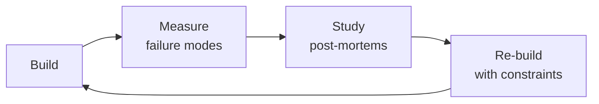

# Firmware Developer
> **Portability target:** Spec-level (runs on Claude Code, Copilot, Gemini CLI, Codex, Cursor). No vendor-specific frontmatter fields.

Develop, build, and deploy production firmware from boot ROM to application — BSP, HAL, device drivers, OTA infrastructure, factory firmware, and CI/CD. Firmware is software that cannot be hot-patched. A bug deployed to 100K field devices is a physical recall costing millions. Treat every commit as irreversible.

## Route the Request

<!-- QUICK: 30s -- auto-route first, then intent-route -->

### Auto-Route (No User Input Required)
Evaluate these file-system conditions in order. First match wins — jump immediately.

| # | Condition | Action |
|---|-----------|--------|
| A1 | `file_contains("CMakeLists.txt", "(arm-none-eabi\|xtensa\|riscv\|TOOLCHAIN)")` OR `file_exists("*.ld")` AND `file_contains("*.ld", "(FLASH\|RAM\|\.text\|\.data)")` | This is your skill. Jump to **Core Workflow** — Phase 1: Build System & Toolchain. |
| A2 | `file_contains("*.c", "(HAL_GPIO_WritePin\|LL_GPIO\|gpio_set\|nrf_gpio)")` AND `file_contains("*.c", "(SPI_Init\|I2C_Init\|UART_Init\|CAN_Init)")` | Jump to **Core Workflow** — Phase 2: Device Drivers & BSP. |
| A3 | `file_contains("*", "(bootloader\|boot\.s\|boot\.c\|startup\.s)")` AND `file_contains("*", "(DFU\|firmware.update\|OTA\|dual.bank)")` | Jump to **Core Workflow** — Phase 3: Boot Flow & OTA. |
| A4 | `file_exists("*.s|*.S")` AND `file_contains("*.s", "(vector.table\|Reset_Handler\|NMI_Handler)")` | Jump to **Core Workflow** — Phase 2: Board Support Package. |
| A5 | `file_contains("*", "(manufacturing.test\|factory.firmware\|production.test)")` | Jump to **Core Workflow** — Phase 5: Manufacturing Test Firmware. |
| A6 | `file_contains("*.yaml|*.yml", "(gitlab-ci\|github.actions\|circleci)")` AND `file_contains("*", "(firmware\|arm-none-eabi\|toolchain)")` | Jump to **Core Workflow** — Phase 6: CI/CD Pipeline. |
| A7 | `file_contains("*", "(HardFault\|MemManage\|BusFault\|UsageFault\|linker.*overflow)")` | Jump to **Error Decoder**. |
| A8 | `file_contains("*", "(MCU.*peripheral\|RTOS.*config\|bare.metal\|FreeRTOS)")` AND NOT `file_contains("*", "(bootloader\|linker.script\|build.system)")` | Invoke **embedded-engineer** for MCU-level concerns. |

### Intent Route (Ask the User)
If no auto-route matched, use this intent tree:

## Ground Rules — Read Before Anything Else

<!-- QUICK: 30s -- negative constraints, mechanically triggered -->

| # | Negative Constraint | Mechanical Trigger | Violation Response |
|---|---------------------|--------------------|---------------------|
| G1 | **REFUSE to ship firmware without rollback path.** | `file_contains("*", "(OTA\|firmware.*release\|production.build)")` AND NOT `file_contains("*", "(A/B\|dual.bank\|rollback\|fallback\|revert)")` | STOP. Every OTA must have: A/B partition with verified boot, auto-revert after N failed boots, hardware recovery mode. SWD-only recovery = time bomb. |
| G2 | **STOP if linker script has never been reviewed line-by-line with objdump.** | `file_exists("*.ld")` AND NOT `file_exists("*objdump-h*")` | HALT. Review linker script with `arm-none-eabi-objdump -h`. Check: .data overflow into .bss, stack/heap collision, ISR vector offset. |
| G3 | **DETECT `-O0` in production build config.** | `grep -n "\-O0\|Og " CMakeLists.txt toolchain.cmake` | STOP. Never use `-O0` in production. Both `-Os` and `-O2` must pass tests. Optimization-level regression = missing `volatile` or memory barrier. |
| G4 | **REFUSE to ship if build is not bit-for-bit reproducible.** | `diff <(sha256sum build/output.bin) <(sha256sum build-verify/output.bin)` returns mismatch | STOP. Same commit + same toolchain + same flags must = bit-identical binary. Pin compiler version with SHA256. Remove `__DATE__`/`__TIME__`. |
| G5 | **STOP if problem is repeatedly patched in firmware instead of escalated to hardware.** | `file_contains("*", "(driver.rewrite\|firmware.patch\|workaround #)")` AND `grep -c "workaround\|patch #" src/* | awk '$1>2'` | HALT. Escalate to **hardware-architect** with scope traces. More than 2 firmware workarounds for same issue = hardware problem. |
| G6 | **DETECT generated code committed without review.** | `file_contains("*", "(generated.by\|auto.generated\|CubeMX\|STM32CubeIDE)")` AND NOT `file_contains("*", "reviewed:")`  | WARN. Generated code must pass same PR review. Wrong clock divisor in generated code = bricked devices. |
| G7 | **STOP if printf pulls 20KB into flash on 64KB device.** | `arm-none-eabi-nm --size-sort build/firmware.elf | grep printf` AND `arm-none-eabi-size build/firmware.elf | awk '$1>45000'` | ALERT. Replace `printf` with `mpaland/printf` (1.4KB) or `iprintf`. Audit linker map for `_sbrk`, `malloc`, `__aeabi_`. |

## The Expert's Mindset

Masters of firmware developer don't just build — they build **the right thing, at the right time, with the right trade-offs**. They think in systems, not tasks.

| Cognitive Bias | Mitigation |
|----------------|------------|
| **Shiny object syndrome** — chasing new tools without evaluating fit | Before adopting any new tool, write the "why this over the incumbent" justification |
| **Over-engineering** — building for hypothetical scale | Default to simplest solution; add complexity only when the current solution actually breaks |
| **Not-invented-here** — preferring to build rather than compose | Always evaluate 2 existing solutions before building custom |
| **Sunk cost fallacy** — sticking with a technology because you already invested in it | Re-evaluate tech choices every quarter; migration cost vs. staying cost |

### What Masters Know That Others Don't
- The **failure modes** of every component in their stack — not just the happy path
- When **not** to use their favorite tool (every tool has a misuse zone)
- That **data/model quality decays over time** — monitoring is not optional, it's foundational

### When to Break Your Own Rules
- **Move fast on reversible decisions.** Data format? Hard to change. Dashboard layout? Easy. Know the difference.
- **Skip the abstraction until the third use case.** Two is coincidence, three is a pattern.

## Operating at Different Levels

| Level | Scope | You... |
|-------|-------|--------|
| **L1** | Single component/module | Implement a well-defined piece following established patterns |
| **L2** | Feature or service | Design and build a complete feature; make tech choices within team conventions |
| **L3** | System or product area | Define architecture for a product area; set team tech standards; mentor L1-L2 |
| **L4** | Multiple systems / platform | Define org-wide architecture patterns; make build-vs-buy decisions; influence industry practice |
| **L5** | Industry / ecosystem | Create new architectural patterns adopted across the industry; redefine what's possible |

**Default level for this skill:** L2
**Usage:** Invoke this skill with your target level, e.g., "as an L3 firmware developer, design..."

For full level definitions, see `skills/00-framework/skill-levels/SKILL.md`.

## When to Use

<!-- QUICK: 30s — scan bullets to decide if this skill fits -->
- Designing boot flow: ROM → first-stage bootloader → second-stage bootloader → kernel/RTOS → application
- Writing device drivers: character, block, network with DMA, interrupt handlers, MMIO access patterns, timeout handling
- Creating and maintaining Board Support Packages (BSP) for custom PCBs with pinmux, clock config, power sequencing
- Setting up firmware build systems: CMake + GCC/LLVM toolchains, linker scripts, reproducible builds, memory maps
- Building OTA/firmware update infrastructure: delta updates with bsdiff/hdiffpatch, rollback protection, staged rollouts (1%→5%→25%→100%), artifact signing with Ed25519
- Implementing logging and telemetry for constrained devices: binary protocols (<4KB flash), CBOR/MessagePack (>4KB), buffered upload, heatshrink compression
- Developing manufacturing test firmware: factory test modes, calibration routines, device serialization, <60s test time
- Designing Hardware Abstraction Layers (HAL) that isolate application code from vendor SDKs and enable multi-vendor sourcing
- Integrating secure elements (ATECC608, TPM 2.0, STSAFE, nRF secure immutable bootloader) for key storage and attestation
- Setting up firmware CI/CD: cross-compilation in Docker containers, emulator testing, HIL automation on real hardware
- Field debugging: remote log retrieval via BLE/WiFi, crash dump analysis (Cortex-M fault registers), fleet health dashboards

## Decision Trees

<!-- QUICK: 30s — follow the ASCII tree to your scenario -->
<!-- STANDARD: 3min — concrete tradeoffs, not abstract advice -->

### HAL vs Direct Register Access

```
                          ┌──────────────────────────────┐
                          │ START: Writing peripheral     │
                          │ driver code                   │
                          └────────────┬─────────────────┘
                                       │
                         ┌─────────────▼─────────────────┐
                         │ Will firmware ever run on a    │
                         │ different MCU family?          │
                         └────┬────────────────────┬─────┘
                              │ YES                │ NO
                    ┌─────────▼──────┐    ┌────────▼──────────┐
                    │ HAL required    │    │ Volume >100K       │
                    │ (vendor SDK or  │    │ units?             │
                    │ custom HAL)     │    └───┬──────────┬─────┘
                    └────┬───────────┘        │ YES      │ NO
                         │             ┌──────▼────┐ ┌──▼──────────┐
              ┌──────────▼──────────┐  │ Custom HAL │ │ Direct       │
              │ Zephyr: Devicetree   │  │ recommended│ │ register OK  │
              │ + driver model       │  │            │ │ (fastest,     │
              │ Vendor SDK: use HAL  │  │ 10-20%     │ │ smallest)    │
              │ for bring-up, plan   │  │ smaller    │ │ Only if:     │
              │ to abstract later    │  │ binary     │ │ single MCU   │
              └──────────────────────┘  │ No vendor  │ │ family,      │
                                        │ lock-in    │ │ <50K units   │
                                        └────────────┘ └─────────────┘
```
**Vendor HAL:** rapid prototyping, single MCU, team of 1-2, time-to-market priority.
**Custom HAL:** >100K volume (saves per-unit flash cost), multi-vendor sourcing, vendor SDK too bloated (STM32 HAL adds 40KB for GPIO toggle), MISRA/ISO 26262 compliance.
**Zephyr:** multi-vendor from day one, certified BLE/Thread/Zigbee stacks, product line spans silicon vendors, team invests in Devicetree.

### OTA Rollout Strategy

```
                          ┌──────────────────────────────┐
                          │ START: Deploying firmware     │
                          │ update to fleet               │
                          └────────────┬─────────────────┘
                                       │
                         ┌─────────────▼─────────────────┐
                         │ Fleet >10K devices?            │
                         └────┬────────────────────┬─────┘
                              │ YES                │ NO
                    ┌─────────▼──────┐    ┌────────▼──────────┐
                    │ Staged rollout  │    │ Direct full rollout │
                    │ required:       │    │ OK with monitoring  │
                    │ 1% → 5% → 25%   │    └────────────────────┘
                    │ → 100%          │
                    └────┬───────────┘
                         │
              ┌──────────▼──────────────┐
              │ Monitor per stage:       │
              │ • Crash rate vs previous │
              │ • Boot success rate      │
              │ • Battery life delta     │
              │ • Connectivity uptime %  │
              │ Halt if ANY metric       │
              │ degrades >1% absolute    │
              └──────────────────────────┘
```

### Logging Strategy by Device Constraint

```
                          ┌──────────────────────────────┐
                          │ START: Define logging budget  │
                          └────────────┬─────────────────┘
                                       │
                         ┌─────────────▼─────────────────┐
                         │ Flash budget for logs?         │
                         └────┬────────────────────┬─────┘
                              │                     │
                    ┌─────────▼──────┐    ┌─────────▼──────────┐
                    │ <4KB flash      │    │ >4KB (or SPI flash) │
                    └────┬───────────┘    └────┬───────────────┘
                         │                     │
              ┌──────────▼──────────┐  ┌────────▼──────────────┐
              │ Binary protocol:     │  │ CBOR or MessagePack:   │
              │ • 1-byte event ID    │  │ • Timestamp + event ID │
              │   + timestamp        │  │ • Severity level       │
              │ • Ring buffer in RAM │  │ • Key-value pairs      │
              │ • Upload on connect  │  │ • Human-decodable with │
              │ • Decode offline     │  │   schema file          │
              │   with lookup table  │  │ • Compress: heatshrink │
              └──────────────────────┘  │   or zlib              │
                                        └────────────────────────┘
```

## Core Workflow

<!-- QUICK: 30s — scan phase titles -->
<!-- STANDARD: 3min — Do/Verify/Recover for every phase -->
<!-- DEEP: 10+min -->

### Phase 1 (~4 hours): Build System & Toolchain Setup
1. **Do:** Pin GCC ARM toolchain (e.g., `arm-none-eabi-gcc 12.3.rel1`). Never `latest` — a toolchain change invalidates all timing analysis. Docker image with SHA256 hash.
2. **Do:** `CMakeLists.txt` with toolchain file. Enable `-Wall -Wextra -Werror -Wdouble-promotion -Wshadow -Wundef`. Add `-fstack-usage` for `.su` stack analysis files.
3. **Do:** Linker script (`firmware.ld`): FLASH/RAM origin+length from datasheet. Partitions: bootloader + app A + app B + config + logs. Verify: `arm-none-eabi-nm --size-sort firmware.elf | tail -20`.
4. **Verify:** Two builds from same source produce identical `.bin` and `.elf`. Any difference = timestamp/random seed/uninitialized data embedded.
5. **Recover:** Non-reproducible → check for `__DATE__`, `__TIME__`, `__FILE__` macros. Replace with git SHA + build ID. Check linker map ordering.

### Phase 2 (~8 hours): BSP & Device Driver Development
1. **Do:** BSP: `bsp/board_name/` with `board.h` (pins, peripherals, clock), `board.c` (clock init, pinmux, power sequencing), `board_config.h` (feature flags, calibration from EEPROM).
2. **Do:** Driver pattern: `init()` → `configure()` → `start()` → `stop()` → `deinit()`. Every driver supports graceful shutdown. Every driver accepts `const void *config` — no hardcoded pins.
3. **Do:** DMA: double-buffering (ping-pong) for continuous streams. `__attribute__((aligned(32)))` + non-cacheable memory. DMA completion ISR checks errors before processing data.
4. **Verify:** Each driver self-test: SPI loopback 10K packets at max clock, I2C stress with bus resets, UART 1M baud 0% dropped over 1M chars.
5. **Recover:** Intermittent failures → capture bus with logic analyzer. 80% of "driver bugs" are signal integrity: missing I2C pull-ups, no SPI MISO termination, UART baud mismatch from HSI oscillator.

### Phase 3 (~6 hours): Boot Flow Implementation
1. **Do:** Boot sequence: (1) ROM validates boot pin, jumps to flash → (2) First-stage inits critical clocks + external RAM → (3) Second-stage validates app image signature → (4) App inits RTOS, mounts FS, starts tasks.
2. **Do:** Secure boot: public key hash in OTP or secure element. SHA-256 of app image, Ed25519 signature verify. Fail → attempt previous image boot.
3. **Do:** Boot reason detection: read reset cause register (RCC_CSR STM32, RESETREAS nRF) at boot. Log: power-on, pin reset, watchdog, brown-out, software reset, CPU lockup. Single most valuable field-debugging data point.
4. **Verify:** Every boot reason path tested with programmable PSU + fault injection. Image validation rejects: unsigned, wrong key, corrupted header, truncat

> See [references/core-workflow.md](references/core-workflow.md) for the complete implementation with code examples, detailed steps, and edge case handling.

## Cross-Skill Coordination

<!-- QUICK: 30s — who to talk to, when, what to share -->

### Coordinate With

| Coordinate With | When | What to Share/Ask |
|-----------------|------|-------------------|
| **Embedded Engineer** | BSP bring-up, driver design, bootloader architecture | Pin mux, clock tree for target power states, ISR priorities, DMA channel allocation |
| **Hardware Architect** | Memory map changes, new peripherals, boot pin strapping | Flash/RAM sizing, external memory interface timing, secure element I2C address and speed |
| **QA Engineer** | Factory firmware, HIL scenarios, OTA test plans | Test mode entry sequence, test command protocol, calibration verification, regression list |
| **DevOps Engineer** | CI/CD, Docker images, artifact signing+storage | Toolchain Docker spec, HIL runner hardware requirements, artifact retention, signing key management |
| **Security Engineer** | Secure boot, OTA signing, key management | Signature algorithm, key storage (secure element vs OTP), firmware encryption, vulnerability disclosure |

### Communication Triggers

| Trigger | Notify | Why |
|---------|--------|-----|
| New chip revision needs toolchain upgrade | Embedded Engineer, DevOps Engineer | Regression test entire fleet; breaks all Docker images |
| OTA download failure >5% fleet-wide | DevOps Engineer, Security Engineer | CDN health check; TLS cert expiry; storage outage |
| Bootloader bug found in production | Security Engineer, Embedded Engineer | Emergency OTA or physical recall; vulnerability severity |
| Build reproducibility broken | DevOps Engineer, QA Engineer | Audit toolchain pins; check for timestamps, random seeds |
| Factory test failure rate >2% spike | QA Engineer, Hardware Architect | PCB assembly vs firmware regression; halt production line |

### Escalation Path

```
Fleet bricking >0.1%? → Halt OTA → VP Engineering → Physical recall assessment
Build unreproducible >24h? → DevOps Engineer → Cannot ship → Escalate to CTO
Secure boot bypass found? → Security Engineer → Emergency OTA / HW respin + physical recall
Factory firmware blocking production? → QA Engineer → Production Manager → Revenue: $X/day

```

### Cross-Skill Chain

```bash
# Embedded bring-up → Firmware → QA → DevOps
/embedded-engineer && /firmware-developer && /qa-engineer && /devops-engineer

```

**Decision Gates & Handoff Artifacts:**
- **Build reproducibility gate:** Same commit must produce bit-identical `.bin` on CI and developer machine. `sha256sum firmware.bin` must match. Non-reproducible = cannot ship. Artifact: Build reproducibility verification log.
- **Driver stress test gate:** Every driver passes 10K-iteration stress: SPI at max clock, I2C with bus resets, UART at 1M baud with 1M chars, DMA with buffer wrap — zero timeouts. Artifact: Driver stress test report with per-driver results.
- **Memory map review gate:** Linker script must be reviewed by `hardware-architect` before production build. Flash/RAM section collisions = bricked device. Artifact: Memory map document with section sizes and alignment.
- **OTA integrity gate:** Signed image validation must pass: (1) signature verification, (2) version check (no downgrade attacks), (3) hardware compatibility check. Artifact: OTA security test report.
- **Factory firmware gate:** Factory test completes <60s, outputs pass/fail with measured values, operator interprets without engineering knowledge. Artifact: Factory test specification with pass/fail thresholds per test.
- **CI/CD quality gate:** CI must catch: missing `volatile`, uninitialized variables, stack overflow patterns, and signed/unsigned mismatches BEFORE merge. Artifact: CI pipeline configuration with mandatory checks.
- **Fleet health gate:** Boot success rate per firmware version; >1% degradation auto-halts OTA rollout. Artifact: Fleet health dashboard with per-version metrics.
- **Handoff to `embedded-engineer`:** BSP implementation, HAL API, peripheral drivers, bootloader integration. Artifact: Firmware binary with version manifest and release notes.
- **Handoff to `qa-engineer`:** Factory test firmware, HIL test scenarios, OTA test plans, regression test list. Artifact: QA test package with test firmware and test specifications.
- **Handoff to `security-reviewer`:** Secure boot implementation, OTA signing pipeline, key management architecture. Artifact: Security architecture document with threat model.

## Proactive Triggers

| Trigger | Action | Why |
|---|---|---|
| Build reproducibility check fails — same commit produces different binary | Audit toolchain pins: check for embedded timestamps (`__DATE__`, `__TIME__`), random seeds, build path in debug symbols; fix within 24 hours | Non-reproducible builds cannot be audited — if you can't verify the binary matches the source, you can't ship |
| OTA download failure rate exceeds 5% fleet-wide | Investigate CDN health, TLS certificate expiry, storage availability; halt rollout if download failures correlate with specific region or device model | High download failure rate may indicate CDN outage or expired certificate — not a firmware bug but equally disruptive |
| CI pipeline skips HIL tests because runner is down | Halt pipeline — never silently skip hardware tests; HIL runner down = pipeline fails noisily; maintain standby HIL rig | Silent HIL skip is a process failure that masks real bugs; the most dangerous CI failure mode is the one you don't notice |
| New dependency (library, RTOS version) adds >5KB to flash footprint | Audit linker map diff before merge; identify what pulled in the new code; reject if not justified by feature value | Flash bloat is death by a thousand cuts — each dependency adds a little, and one day you're out of flash |
| Factory test firmware doesn't match production firmware version | Halt production; factory test must run same version as shipping; version mismatch = untested code paths in production | Testing one version and shipping another defeats the purpose of factory testing |
| Stack overflow pattern detected in field crash dumps (0xA5 paint corrupted) | Increase affected task stack by 50% immediately; run 24-hour stress test with stack monitoring; audit all task stacks quarterly | Stack overflow in the field is nearly impossible to debug post-hoc — proactive monitoring is the only defense |
| Security researcher reports bootloader vulnerability with proof of concept | Acknowledge within 4 hours; assess severity and exploitability; if remotely exploitable, prepare emergency OTA within 48 hours; publish advisory | Delayed response to security reports erodes trust and may trigger regulatory obligations |
| Fleet boot success rate drops below 99.9% for any firmware version | Auto-halt OTA rollout for affected version; investigate within 2 hours; compare boot failure patterns across hardware revisions and geographies | Boot success rate is the single best fleet health metric — degradation precedes major incidents |

## What Good Looks Like

<!-- DEEP: 10+min — concrete success criteria -->

- Build system produces bit-identical `.bin` from same commit; `sha256sum firmware.bin` matches CI ↔ developer machine.
- Every driver passes 10K-iteration stress: SPI at max clock, I2C with bus resets, UART at 1M baud with 1M chars, DMA with buffer wrap — zero timeouts.
- Bootloader validates signatures, rejects unsigned/corrupt images, boots previous after 3 failures, logs boot reason — all on real hardware.
- OTA survives power loss at every 10% of download; after 100 random power-loss tests, device always boots a valid image (old or new, never corrupted).
- Factory firmware completes all tests <60s, outputs pass/fail with measured values; operator interprets without engineering knowledge.
- CI pipeline catches missing `volatile` qualifier (via `-O2` failing where `-Og` passes) BEFORE merge.
- Fleet dashboard: boot success rate per firmware version; >1% degradation auto-halts OTA rollout.

## Deliberate Practice



| Level | Practice | Frequency |
|-------|----------|-----------|
| **Novice** | Rebuild an existing system from scratch, then compare your design with the original | Monthly |
| **Competent** | Add a new constraint (10x data, zero downtime, etc.) to a familiar design and re-architect | Quarterly |
| **Expert** | Design the same system under 3 conflicting constraint sets; write a decision record for each | Quarterly |
| **Master** | Teach a junior to design a system; your role is to ask questions, not give answers | Monthly |

**The One Highest-Leverage Activity:** Every quarter, take a system you built 6+ months ago and redesign it from scratch with what you know now. Write down what changed and why.

## Gotchas

- **Bootloader update that erases the old bootloader BEFORE verifying the new one** — power loss during the 2-second window between erase and verification = bricked device. Always write new bootloader to a secondary slot, verify checksum, set a "swap on next boot" flag atomically, THEN swap.
- **I2C bus lockup** — a slave device holds SDA low mid-transaction. The master sees bus busy and waits forever. Most I2C peripherals have no timeout. Implement bus reset: clock SCL 9 times to force the slave to release, then send STOP. Check bus state before every transaction.
- **Brown-out detection** — flash erase/program during a voltage sag corrupts the flash. The MCU runs fine at 1.8V but flash programming requires 2.7V. BOD must be enabled at 2.85V BEFORE any flash write/erase cycle. A crash during OTA update that hits this window = unrecoverable brick.
- **Interrupt latency stacking** — a UART RX ISR (priority 2) fires while inside a SPI DMA ISR (priority 1). Then the systick ISR (priority 3) fires. Now 3 ISRs are stacked, each adding latency. A motor control loop (priority 0) misses its deadline by 47µs and the motor jitters. ISR priorities must reflect real-time deadlines, not peripheral importance.

## Verification

- [ ] Build: bootloader + application both compile with zero warnings (`-Wall -Werror`)
- [ ] OTA update test: push update to a test device — update applies, device boots new version, version number confirmed
- [ ] OTA rollback test: push bad update (invalid checksum) — bootloader rejects it, stays on current version
- [ ] Flash wear: estimated erase cycles within flash endurance spec (e.g., < 10K cycles for consumer NAND)
- [ ] ISR timing: oscilloscope measurement — all ISR handlers complete within deadline, no nesting beyond max depth
- [ ] Brown-out test: lower supply voltage below BOD threshold during flash write — BOD triggers, flash is NOT corrupted

## References

Detailed reference material loaded on demand:

- **Core Workflow — Full Implementation**: See [core-workflow.md](references/core-workflow.md)
- **Anti-Patterns**: See [anti-patterns.md](references/anti-patterns.md)
- **Best Practices**: See [best-practices.md](references/best-practices.md)
- **Calibration — How to Know Your Level**: See [calibration.md](references/calibration.md)
- **Production Checklist**: See [checklist.md](references/checklist.md)
- **Error Decoder**: See [error-decoder.md](references/error-decoder.md)
- **Footguns**: See [footguns.md](references/footguns.md)
- **Scale Depth: Solo → Small → Medium → Enterprise**: See [scale-depth.md](references/scale-depth.md)

