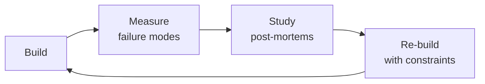

# Firmware Developer

Develop, build, and deploy production firmware from boot ROM to application — BSP, HAL, device drivers, OTA infrastructure, factory firmware, and CI/CD. Firmware is software that cannot be hot-patched. A bug deployed to 100K field devices is a physical recall costing millions. Treat every commit as irreversible.

## Route the Request
<!-- QUICK: 30s — pick your path, skip the rest -->
```
What are you trying to do?
├── BUILD firmware infrastructure
│   ├── Set up CMake + GCC/LLVM toolchain → "Core Workflow" Phase 1
│   ├── Design linker script & memory map → "Core Workflow" Phase 1
│   ├── Create Board Support Package (BSP) → "Core Workflow" Phase 2
│   └── Cross-compilation in containers → references/build-system-design.md
├── WRITE firmware code
│   ├── Device driver (SPI/I2C/UART/CAN/USB) → "Core Workflow" Phase 2
│   ├── DMA + interrupt handler design → references/device-driver-patterns.md
│   ├── HAL (Hardware Abstraction Layer) → "Decision Trees > HAL vs Direct Register"
│   └── Boot flow design → "Core Workflow" Phase 3
├── DEPLOY or update
│   ├── OTA update infrastructure → "Core Workflow" Phase 4
│   ├── Delta update design → references/ota-infrastructure.md
│   ├── Rollback protection → "Decision Trees > OTA Rollout Strategy"
│   └── Artifact signing pipeline → references/ota-infrastructure.md
├── TEST or debug
│   ├── Manufacturing test firmware → "Core Workflow" Phase 5
│   ├── Firmware CI/CD pipeline → "Core Workflow" Phase 6
│   ├── Field crash dump analysis → "Error Decoder"
│   └── Remote log retrieval → references/field-debugging.md
├── CROSS-SKILL ROUTING
│   ├── Need embedded MCU/peripheral/RTOS work? → Invoke `embedded-engineer`
│   ├── Need hardware architecture decisions? → Invoke `hardware-architect`
│   ├── Need security review of bootloader/OTA? → Invoke `security-reviewer`
│   ├── Need QA/HIL testing infrastructure? → Invoke `qa-engineer`
│   └── Need security architecture (secure boot, key management)? → Invoke `security-engineer`
└── Not sure? → Describe the MCU, RTOS, and connectivity requirements
```
Do not read the entire skill. Follow the route above and read only the sections it points to.

## Ground Rules — Read Before Anything Else
<!-- QUICK: 30s — these rules apply to every response -->
<!-- STANDARD: 3min — firmware failures are physical and irreversible -->

- **Never ship firmware without a rollback path.** Every OTA must include: (a) A/B partition with verified boot, (b) auto-revert after N failed boots, (c) hardware recovery mode (ROM bootloader, serial DFU) that works even if the bootloader is dead. SWD-only recovery = time bomb.
- **The linker script is not boilerplate.** Memory layout bugs produce the hardest failures: `.data` overflows into `.bss`, stack collides with heap, ISR vector at wrong offset. Review the linker script line by line with `arm-none-eabi-objdump -h` output. This is your most important code review.
- **Never use `-O0` in production.** Unoptimized firmware is 3-5× larger and slower. But `-O2`/`-Os` can eliminate delay loops, reorder MMIO accesses, optimize away `volatile` reads. Every release must pass tests at BOTH `-Os` AND `-O2`. Regression at optimization level is always a missing `volatile` or memory barrier.
- **Build reproducibility is a requirement, not a luxury.** Same commit + same toolchain + same flags = bit-identical binary. Without this, you cannot audit what's in the field. Pin compiler version, commit `.cmake` config, store artifacts with git SHA in filename.
- **Admit when the problem is hardware.** A driver that "sometimes misses interrupts" after 3 weeks is probably a hardware issue: floating IRQ line, insufficient decoupling, ground bounce. Escalate to embedded-engineer with scope traces, not another driver rewrite. You are not debugging code — you are debugging physics.

<!-- DEEP: 10+min — war story -->
*Smart lock company pushed a firmware update to 100% of 40K-unit fleet simultaneously. The update added a security handshake that was 200ms slower. This coincided with the BLE connection interval, creating a race condition that locked users out. By the time they halted, 40K locks were bricked. Fix: physical recall with SWD reflash at dealer locations. Cost: $2.3M. Lesson: staged rollout with boot-success-rate monitoring catches this at 1%.*


## The Expert's Mindset

Masters of firmware developer don't just build — they build **the right thing, at the right time, with the right trade-offs**. They think in systems, not tasks.

| Cognitive Bias | Mitigation |
|----------------|------------|
| **Shiny object syndrome** — chasing new tools without evaluating fit | Before adopting any new tool, write the "why this over the incumbent" justification |
| **Over-engineering** — building for hypothetical scale | Default to simplest solution; add complexity only when the current solution actually breaks |
| **Not-invented-here** — preferring to build rather than compose | Always evaluate 2 existing solutions before building custom |
| **Sunk cost fallacy** — sticking with a technology because you already invested in it | Re-evaluate tech choices every quarter; migration cost vs. staying cost |

### What Masters Know That Others Don't
- The **failure modes** of every component in their stack — not just the happy path
- When **not** to use their favorite tool (every tool has a misuse zone)
- That **data/model quality decays over time** — monitoring is not optional, it's foundational

### When to Break Your Own Rules
- **Move fast on reversible decisions.** Data format? Hard to change. Dashboard layout? Easy. Know the difference.
- **Skip the abstraction until the third use case.** Two is coincidence, three is a pattern.
## Operating at Different Levels

| Level | Scope | You... |
|-------|-------|--------|
| **L1** | Single component/module | Implement a well-defined piece following established patterns |
| **L2** | Feature or service | Design and build a complete feature; make tech choices within team conventions |
| **L3** | System or product area | Define architecture for a product area; set team tech standards; mentor L1-L2 |
| **L4** | Multiple systems / platform | Define org-wide architecture patterns; make build-vs-buy decisions; influence industry practice |
| **L5** | Industry / ecosystem | Create new architectural patterns adopted across the industry; redefine what's possible |

**Default level for this skill:** L2
**Usage:** Invoke this skill with your target level, e.g., "as an L3 firmware developer, design..."

For full level definitions, see `skills/00-framework/skill-levels/SKILL.md`.

## When to Use
<!-- QUICK: 30s — scan bullets to decide if this skill fits -->
- Designing boot flow: ROM → first-stage bootloader → second-stage bootloader → kernel/RTOS → application
- Writing device drivers: character, block, network with DMA, interrupt handlers, MMIO access patterns, timeout handling
- Creating and maintaining Board Support Packages (BSP) for custom PCBs with pinmux, clock config, power sequencing
- Setting up firmware build systems: CMake + GCC/LLVM toolchains, linker scripts, reproducible builds, memory maps
- Building OTA/firmware update infrastructure: delta updates with bsdiff/hdiffpatch, rollback protection, staged rollouts (1%→5%→25%→100%), artifact signing with Ed25519
- Implementing logging and telemetry for constrained devices: binary protocols (<4KB flash), CBOR/MessagePack (>4KB), buffered upload, heatshrink compression
- Developing manufacturing test firmware: factory test modes, calibration routines, device serialization, <60s test time
- Designing Hardware Abstraction Layers (HAL) that isolate application code from vendor SDKs and enable multi-vendor sourcing
- Integrating secure elements (ATECC608, TPM 2.0, STSAFE, nRF secure immutable bootloader) for key storage and attestation
- Setting up firmware CI/CD: cross-compilation in Docker containers, emulator testing, HIL automation on real hardware
- Field debugging: remote log retrieval via BLE/WiFi, crash dump analysis (Cortex-M fault registers), fleet health dashboards

## Decision Trees
<!-- QUICK: 30s — follow the ASCII tree to your scenario -->
<!-- STANDARD: 3min — concrete tradeoffs, not abstract advice -->

### HAL vs Direct Register Access

```
                          ┌──────────────────────────────┐
                          │ START: Writing peripheral     │
                          │ driver code                   │
                          └────────────┬─────────────────┘
                                       │
                         ┌─────────────▼─────────────────┐
                         │ Will firmware ever run on a    │
                         │ different MCU family?          │
                         └────┬────────────────────┬─────┘
                              │ YES                │ NO
                    ┌─────────▼──────┐    ┌────────▼──────────┐
                    │ HAL required    │    │ Volume >100K       │
                    │ (vendor SDK or  │    │ units?             │
                    │ custom HAL)     │    └───┬──────────┬─────┘
                    └────┬───────────┘        │ YES      │ NO
                         │             ┌──────▼────┐ ┌──▼──────────┐
              ┌──────────▼──────────┐  │ Custom HAL │ │ Direct       │
              │ Zephyr: Devicetree   │  │ recommended│ │ register OK  │
              │ + driver model       │  │            │ │ (fastest,     │
              │ Vendor SDK: use HAL  │  │ 10-20%     │ │ smallest)    │
              │ for bring-up, plan   │  │ smaller    │ │ Only if:     │
              │ to abstract later    │  │ binary     │ │ single MCU   │
              └──────────────────────┘  │ No vendor  │ │ family,      │
                                        │ lock-in    │ │ <50K units   │
                                        └────────────┘ └─────────────┘
```
**Vendor HAL:** rapid prototyping, single MCU, team of 1-2, time-to-market priority.
**Custom HAL:** >100K volume (saves per-unit flash cost), multi-vendor sourcing, vendor SDK too bloated (STM32 HAL adds 40KB for GPIO toggle), MISRA/ISO 26262 compliance.
**Zephyr:** multi-vendor from day one, certified BLE/Thread/Zigbee stacks, product line spans silicon vendors, team invests in Devicetree.

### OTA Rollout Strategy

```
                          ┌──────────────────────────────┐
                          │ START: Deploying firmware     │
                          │ update to fleet               │
                          └────────────┬─────────────────┘
                                       │
                         ┌─────────────▼─────────────────┐
                         │ Fleet >10K devices?            │
                         └────┬────────────────────┬─────┘
                              │ YES                │ NO
                    ┌─────────▼──────┐    ┌────────▼──────────┐
                    │ Staged rollout  │    │ Direct full rollout │
                    │ required:       │    │ OK with monitoring  │
                    │ 1% → 5% → 25%   │    └────────────────────┘
                    │ → 100%          │
                    └────┬───────────┘
                         │
              ┌──────────▼──────────────┐
              │ Monitor per stage:       │
              │ • Crash rate vs previous │
              │ • Boot success rate      │
              │ • Battery life delta     │
              │ • Connectivity uptime %  │
              │ Halt if ANY metric       │
              │ degrades >1% absolute    │
              └──────────────────────────┘
```

### Logging Strategy by Device Constraint

```
                          ┌──────────────────────────────┐
                          │ START: Define logging budget  │
                          └────────────┬─────────────────┘
                                       │
                         ┌─────────────▼─────────────────┐
                         │ Flash budget for logs?         │
                         └────┬────────────────────┬─────┘
                              │                     │
                    ┌─────────▼──────┐    ┌─────────▼──────────┐
                    │ <4KB flash      │    │ >4KB (or SPI flash) │
                    └────┬───────────┘    └────┬───────────────┘
                         │                     │
              ┌──────────▼──────────┐  ┌────────▼──────────────┐
              │ Binary protocol:     │  │ CBOR or MessagePack:   │
              │ • 1-byte event ID    │  │ • Timestamp + event ID │
              │   + timestamp        │  │ • Severity level       │
              │ • Ring buffer in RAM │  │ • Key-value pairs      │
              │ • Upload on connect  │  │ • Human-decodable with │
              │ • Decode offline     │  │   schema file          │
              │   with lookup table  │  │ • Compress: heatshrink │
              └──────────────────────┘  │   or zlib              │
                                        └────────────────────────┘
```

## Core Workflow
<!-- QUICK: 30s — scan phase titles -->
<!-- STANDARD: 3min — Do/Verify/Recover for every phase -->
<!-- DEEP: 10+min -->

### Phase 1 (~4 hours): Build System & Toolchain Setup
1. **Do:** Pin GCC ARM toolchain (e.g., `arm-none-eabi-gcc 12.3.rel1`). Never `latest` — a toolchain change invalidates all timing analysis. Docker image with SHA256 hash.
2. **Do:** `CMakeLists.txt` with toolchain file. Enable `-Wall -Wextra -Werror -Wdouble-promotion -Wshadow -Wundef`. Add `-fstack-usage` for `.su` stack analysis files.
3. **Do:** Linker script (`firmware.ld`): FLASH/RAM origin+length from datasheet. Partitions: bootloader + app A + app B + config + logs. Verify: `arm-none-eabi-nm --size-sort firmware.elf | tail -20`.
4. **Verify:** Two builds from same source produce identical `.bin` and `.elf`. Any difference = timestamp/random seed/uninitialized data embedded.
5. **Recover:** Non-reproducible → check for `__DATE__`, `__TIME__`, `__FILE__` macros. Replace with git SHA + build ID. Check linker map ordering.

### Phase 2 (~8 hours): BSP & Device Driver Development
1. **Do:** BSP: `bsp/board_name/` with `board.h` (pins, peripherals, clock), `board.c` (clock init, pinmux, power sequencing), `board_config.h` (feature flags, calibration from EEPROM).
2. **Do:** Driver pattern: `init()` → `configure()` → `start()` → `stop()` → `deinit()`. Every driver supports graceful shutdown. Every driver accepts `const void *config` — no hardcoded pins.
3. **Do:** DMA: double-buffering (ping-pong) for continuous streams. `__attribute__((aligned(32)))` + non-cacheable memory. DMA completion ISR checks errors before processing data.
4. **Verify:** Each driver self-test: SPI loopback 10K packets at max clock, I2C stress with bus resets, UART 1M baud 0% dropped over 1M chars.
5. **Recover:** Intermittent failures → capture bus with logic analyzer. 80% of "driver bugs" are signal integrity: missing I2C pull-ups, no SPI MISO termination, UART baud mismatch from HSI oscillator.

### Phase 3 (~6 hours): Boot Flow Implementation
1. **Do:** Boot sequence: (1) ROM validates boot pin, jumps to flash → (2) First-stage inits critical clocks + external RAM → (3) Second-stage validates app image signature → (4) App inits RTOS, mounts FS, starts tasks.
2. **Do:** Secure boot: public key hash in OTP or secure element. SHA-256 of app image, Ed25519 signature verify. Fail → attempt previous image boot.
3. **Do:** Boot reason detection: read reset cause register (RCC_CSR STM32, RESETREAS nRF) at boot. Log: power-on, pin reset, watchdog, brown-out, software reset, CPU lockup. Single most valuable field-debugging data point.
4. **Verify:** Every boot reason path tested with programmable PSU + fault injection. Image validation rejects: unsigned, wrong key, corrupted header, truncated.
5. **Recover:** Bootloader validates all but fails → check: flash offset alignment, signature format (raw Ed25519 vs ASN.1 DER), endianness mismatch (x86 gen vs big-endian MCU).

### Phase 4 (~6 hours): OTA Update Infrastructure
1. **Do:** OTA pipeline: CI builds → signs with release key → uploads to CDN/S3 with version metadata → devices poll → download to inactive partition with range-request resume → verify signature → set boot flag → reboot.
2. **Do:** Delta updates: `bsdiff` or `hdiffpatch` for NB-IoT/LTE-M links. Delta <20% of full image or not worthwhile. Delta decoding must fit in available RAM.
3. **Do:** Rollback: `boot_attempt_count` in persistent register/EEPROM. Increment per boot, clear on successful app heartbeat. >N (default 3) → mark image bad → revert.
4. **Verify:** OTA tested: power loss at 25%/50%/75%/99% of download → resume, corrupt payload → detect+reject, wrong version → reject downgrade, 1000 simultaneous devices → CDN handles load.
5. **Recover:** OTA failure must not require cloud connectivity to revert. Bootloader makes the revert decision locally. Network outage ≠ bricked devices.

### Phase 5 (~4 hours): Manufacturing Test Firmware
1. **Do:** Separate "factory" firmware: enters test mode on GPIO hold at power-on or UART magic sequence. Never ships to end users.
2. **Do:** Test routines: (a) peripheral self-test (SPI loopback, I2C ping, ADC test point, GPIO loopback), (b) radio test (TX CW for power, RX sensitivity sweep), (c) flash test (write/read/verify), (d) unique ID burn (MAC, serial, public key hash).
3. **Do:** Serialization: use factory-programmed unique ID (STM32 UID, nRF DEVICEID) as identity root. MAC in OTP/external EEPROM — never hardcoded in firmware.
4. **Verify:** All tests <60 seconds per device. 1000 units/day production line can't wait. Output: machine-parseable (JSON over UART or USB mass storage).
5. **Recover:** Test fails → output "FAIL: ADC ch3, expected 1.65V±0.05, measured 2.11V" to UART. Red LED pattern is not enough.

### Phase 6 (~5 hours): Firmware CI/CD Pipeline
1. **Do:** Docker build: pinned GCC, CMake, Python, device tools (nrfjprog, STM32_Programmer_CLI, esptool). Build matrix for all HW revisions.
2. **Do:** CI stages: (1) Lint (clang-format, cppcheck, MISRA), (2) Build all targets, (3) Unit tests on host with mocked HAL, (4) HIL on real hardware, (5) Sign artifacts, (6) Upload with version tag.
3. **Do:** Versioning: `MAJOR.MINOR.PATCH-buildID`. MAJOR: incompatible OTA format. MINOR: new features, backward-compat. PATCH: bug fixes. Never reuse a version.
4. **Verify:** PR → build + unit + HIL smoke. Merge → full HIL suite. Release → signing + upload. HIL runner down → pipeline fails noisily, never silently skips hardware tests.
5. **Recover:** HIL runner health checks. Maintain standby HIL rig. Hardware tests are the gate — never bypass.

## Best Practices
<!-- STANDARD: 3min — rules from firmware teams shipping >500K devices -->

1. **Linker map review is part of code review.** Post `arm-none-eabi-nm --size-sort` diff. A new `printf` pulling in `malloc` adds 20KB — invisible in source diff, obvious in map diff.
2. **Never block in an ISR.** Capture state (<5 lines), defer to task/DPC, return. `while(flag)` in an ISR adds unbounded jitter. Refactor immediately.
3. **Use `volatile` correctly, not defensively.** Required: MMIO registers, ISR-modified variables, DMA descriptors. Harmful on regular variables — prevents optimization, 3-5× overhead. Missing memory barrier is the real bug, not missing `volatile`.
4. **Every peripheral has a timeout.** UART receive, I2C transaction, SPI DMA, flash erase — all have timeouts. Watchdog reset > infinite loop on dead hardware from a loose connector.
5. **Version your flash layout.** Magic number + layout version at known offset (e.g., `0x0800F000`). Bootloader checks compatibility. Without this, partition layout change → silent data corruption.
6. **Compression is cheaper than you think.** `heatshrink` (50-200 bytes decompressor, LZSS) compresses logs 4-8×. On BLE where 1KB flash = $0.02, compression pays for itself in 100 log lines. `miniz` (inflate, 12KB) for OTA delta decode.
7. **Assertions in release builds are worth the flash.** A 200-byte `assert()` that logs file + line + reset reason before reboot saves weeks of field debugging. Without it, you have zero clues.
8. **RAM functions for flash operations.** Code that erases/programs flash runs from RAM (`__attribute__((section(".ramfunc")))`). Silicon errata exists for nearly every MCU around this — read the errata.
9. **Initialize all stack memory.** FreeRTOS `configCHECK_FOR_STACK_OVERFLOW` paints stack with 0xA5. Catches overflow early instead of silent corruption for weeks.
10. **First 100ms after power-on are most dangerous.** Rails stabilizing, oscillators locking, BOD not armed. External supervisor IC (TPS3839) holds MCU in reset until rails stable. Firmware delays peripheral init 10ms after clock lock.

## Anti-Patterns

| ❌ Anti-Pattern | ✅ Do This Instead |
|---|---|
| Committing generated code (pin mux, clock config) to version control without review | Generated code goes through same PR review as hand-written code; reviewers verify against datasheet — a wrong clock divisor can brick remote devices |
| Using `volatile` defensively on every shared variable instead of proper synchronization | Use `volatile` only for MMIO registers, ISR-modified variables, and DMA descriptors; use memory barriers and atomic operations for multi-core/ISR thread safety |
| Removing assertions from release builds to "save flash" | Keep assertions in release: a 200-byte assert handler that logs file+line+reset reason before reboot is worth 10× its flash cost in field debugging time |
| Linking against newlib without understanding the heap pull-in | Audit linker map diff after every dependency change — `printf("%f")` pulls 15KB into flash; use `iprintf` or `mpaland/printf` (1.4KB) for embedded |
| Shipping firmware without versioned flash layout | Magic number + layout version at known offset (0x0800F000); bootloader checks compatibility and refuses to boot mismatched layout |
| Trusting the compiler to optimize away unused code without verifying | Post `arm-none-eabi-nm --size-sort` diff in every CI run; a stray `__weak` override or template instantiation can silently add 10KB |
| Building firmware without reproducible build verification | CI must produce bit-identical `.bin` from same commit; non-reproducible = cannot ship; check for timestamps, random seeds, build path embedding |
| Deploying OTA updates to entire fleet simultaneously | Staged rollout: 1% → 5% → 25% → 100% with auto-halt on elevated crash rate or boot failure; fleet-wide brick requires physical recall | 

## Error Decoder
<!-- QUICK: 30s -- exact error → root cause → fix -->
<!-- DEEP: 10+min -- war stories from production hardware failures -->

| Symptom | Root Cause | Fix | Lesson |
|---------|-----------|-----|--------|
| `arm-none-eabi-gcc: unrecognized '-mcpu=cortex-m33'` | GCC too old — M33 support added in GCC 8 | Pin GCC 12.3.rel1+. Someone updated base image. | Pin GCC version in toolchain file. Someone updating base image breaks builds. |
| `section '.bss' will not fit in region 'RAM'` | RAM overflow — .data + .bss + heap + stacks > physical | `arm-none-eabi-nm --size-sort \| tail -20`. Move large buffers to `.noinit`, reduce heap, replace `printf` (20KB) with minimal formatter. | nm --size-sort to find large buffers. Replace printf to save 20KB. |
| Device resets immediately after OTA | New firmware `.data` LMA overlaps bootloader flash region | Check linker script: bootloader region excluded from app flash origin. Compare `objdump -h` old vs new. | Check linker script — bootloader region must be excluded from app flash origin. |
| `HardFault_Handler` during `memcpy` to DMA buffer | Buffer not in non-cacheable memory — CPU cache and DMA disagree | Add buffer to `.nocache` linker section. `SCB_CleanInvalidateDCache()` before DMA, `SCB_InvalidateDCache()` after. | DMA buffers must be in non-cacheable memory. Flush cache before/after DMA. |
| Image 50% larger than previous build | Dependency pulled in `malloc`, `printf`, or exception handling | `grep 'malloc\|_sbrk\|__aeabi_' build/firmware.map`. Remove dependency or link `-nostdlib` with minimal stubs. | malloc, printf, and exception handling add significant size. Link -nostdlib if possible. |
| OTA signature verification fails, download succeeded | Endianness mismatch — x86 (LE) sig vs big-endian MCU | Use `mbedtls_mpi_read_binary()` (big-endian), not `_le` variant. Verify byte order explicitly in both signer and verifier. | Endianness mismatch between signing machine (x86 LE) and MCU (big-endian). |
| Debug (`-Og`) works; release (`-Os`) crashes on boot | Missing `volatile` or memory barrier — compiler reordered/eliminated "redundant" MMIO read | Add `volatile` to register struct. Add `__DSB()` after critical writes. Diff assembly between `-Og` and `-Os` at crash site. | Compiler optimizations reorder or eliminate MMIO reads. Use volatile and memory barriers. |
| Build not reproducible: SHA256 differs between runs | `__DATE__`/`__TIME__` macros, random seed, non-deterministic linker ordering | Replace with git SHA + build ID. Set linker `SORT_NONE`? Check `.cmake` toolchain for non-deterministic flags. | Remove __DATE__/__TIME__. Use deterministic linker ordering. |
| Firmware OTA update bricked entire fleet | Staged rollout wasn't used — 100% of devices received update simultaneously; bootloader had no rollback mechanism | Implement staged rollout: 1%, 5%, 20%, 50%, 100% with boot-success monitoring at each stage. Dual-bank flash with fallback image. | A smart lock startup bricked 40K devices in one push. The fix required physical reflash at dealer locations. Cost: $2.3M. |
| GPIO pin conflict from shared driver assumption | Two peripheral drivers both claimed same GPIO for chip select — second driver silently reconfigured it | Implement a GPIO registry: every pin assigned to exactly one driver at init time. Assert on double-claim. Document pin mux. | A custom PCB had the SD card CS and the display CS on the same GPIO. The display driver would fail randomly after the SD card was used. |
| Race condition on interrupt handler causing random crashes | Shared global variable written from ISR and main loop without volatile or critical section | All ISR-main shared data must be volatile, accessed atomically or within critical section. Use message queue pattern, not shared globals. | A motor controller occasionally jumped to full speed. Root cause: ISR set a new target speed that the main loop read non-atomically — half old, half new value. |
| Flash wear from excessive writes — device failed after 3 months | Logging system wrote to same flash sector every 5 minutes; sector endurance (10K cycles) exhausted in 90 days | Implement wear leveling. Move frequent writes to SPI NOR (100K cycles) or FRAM (10^13 cycles). Use internal flash for infrequent updates only. | An environmental sensor stopped recording after 87 days. Root cause: the data log sector had 25K+ erase cycles. Wear leveling would have extended life to 10+ years. |
| Production test fails 30%, all pass on re-test | Test firmware not executing full power-on self-test before measurement; residual state from previous test | Always execute a known device reset + POST before each production test. Include a reference measurement (precision resistor) at start of test sequence. | A contract manufacturer tested 10K units; 3K failed initially but passed retest. The $250K in rework was unnecessary — the test sequence didn't reset the ADC between units. |

## Production Checklist
<!-- QUICK: 30s — binary pass/fail. All must pass before release. -->

- [ ] **[F1]** Build reproducible: same SHA + Docker image = bit-identical `.bin`; toolchain pinned in Dockerfile with SHA256
- [ ] **[F2]** Linker script reviewed: FLASH/RAM match datasheet, partitions verified with `objdump -h`, >20% headroom
- [ ] **[F3]** Bootloader: Ed25519/ECDSA signature verification; unsigned/corrupt/wrong-key rejected; boot reason logged from reset cause register
- [ ] **[F4]** A/B OTA with auto-rollback: boot attempt counter in persistent storage, 3-failure revert; power-loss tested at every 10% of download
- [ ] **[F5]** All drivers have timeout handling: no unbounded `while(flag)`; watchdog serviced in dedicated task with health check-ins
- [ ] **[F6]** Stack high-water marks <80% after 24h stress; `configASSERT` and stack overflow detection enabled in RELEASE builds
- [ ] **[F7]** DMA buffers aligned to cache line, non-cacheable memory; cache clean/invalidate before/after DMA transactions
- [ ] **[F8]** Flash layout versioned (magic + version at known offset); bootloader checks layout compatibility at boot
- [ ] **[F9]** Factory firmware: all peripheral self-tests + serialization <60s; output machine-parseable (JSON over UART)
- [ ] **[F10]** CI: PR → build + unit + HIL smoke; merge → full HIL; release → signing + upload; HIL failure blocks pipeline
- [ ] **[F11]** OTA staged rollout: 1%→5%→25%→100% with crash-rate and boot-success monitoring; auto-halt on >1% degradation
- [ ] **[F12]** Secure element or OTP for private key storage; no keys in firmware binary; bootloader public key hash in OTP
- [ ] **[F13]** Assertion handler in RELEASE builds: logs file+line+reset reason, reboots; no silent corruption allowed
- [ ] **[F14]** External reset supervisor holds MCU in reset until all rails stable; firmware delays peripheral init 10ms after clock lock

## Cross-Skill Coordination
<!-- QUICK: 30s — who to talk to, when, what to share -->

### Coordinate With

| Coordinate With | When | What to Share/Ask |
|-----------------|------|-------------------|
| **Embedded Engineer** | BSP bring-up, driver design, bootloader architecture | Pin mux, clock tree for target power states, ISR priorities, DMA channel allocation |
| **Hardware Architect** | Memory map changes, new peripherals, boot pin strapping | Flash/RAM sizing, external memory interface timing, secure element I2C address and speed |
| **QA Engineer** | Factory firmware, HIL scenarios, OTA test plans | Test mode entry sequence, test command protocol, calibration verification, regression list |
| **DevOps Engineer** | CI/CD, Docker images, artifact signing+storage | Toolchain Docker spec, HIL runner hardware requirements, artifact retention, signing key management |
| **Security Engineer** | Secure boot, OTA signing, key management | Signature algorithm, key storage (secure element vs OTP), firmware encryption, vulnerability disclosure |

### Communication Triggers

| Trigger | Notify | Why |
|---------|--------|-----|
| New chip revision needs toolchain upgrade | Embedded Engineer, DevOps Engineer | Regression test entire fleet; breaks all Docker images |
| OTA download failure >5% fleet-wide | DevOps Engineer, Security Engineer | CDN health check; TLS cert expiry; storage outage |
| Bootloader bug found in production | Security Engineer, Embedded Engineer | Emergency OTA or physical recall; vulnerability severity |
| Build reproducibility broken | DevOps Engineer, QA Engineer | Audit toolchain pins; check for timestamps, random seeds |
| Factory test failure rate >2% spike | QA Engineer, Hardware Architect | PCB assembly vs firmware regression; halt production line |

### Escalation Path

```
Fleet bricking >0.1%? → Halt OTA → VP Engineering → Physical recall assessment
Build unreproducible >24h? → DevOps Engineer → Cannot ship → Escalate to CTO
Secure boot bypass found? → Security Engineer → Emergency OTA / HW respin + physical recall
Factory firmware blocking production? → QA Engineer → Production Manager → Revenue: $X/day
```

### Cross-Skill Chain

```bash
# Embedded bring-up → Firmware → QA → DevOps
/embedded-engineer && /firmware-developer && /qa-engineer && /devops-engineer
```

**Decision Gates & Handoff Artifacts:**
- **Build reproducibility gate:** Same commit must produce bit-identical `.bin` on CI and developer machine. `sha256sum firmware.bin` must match. Non-reproducible = cannot ship. Artifact: Build reproducibility verification log.
- **Driver stress test gate:** Every driver passes 10K-iteration stress: SPI at max clock, I2C with bus resets, UART at 1M baud with 1M chars, DMA with buffer wrap — zero timeouts. Artifact: Driver stress test report with per-driver results.
- **Memory map review gate:** Linker script must be reviewed by `hardware-architect` before production build. Flash/RAM section collisions = bricked device. Artifact: Memory map document with section sizes and alignment.
- **OTA integrity gate:** Signed image validation must pass: (1) signature verification, (2) version check (no downgrade attacks), (3) hardware compatibility check. Artifact: OTA security test report.
- **Factory firmware gate:** Factory test completes <60s, outputs pass/fail with measured values, operator interprets without engineering knowledge. Artifact: Factory test specification with pass/fail thresholds per test.
- **CI/CD quality gate:** CI must catch: missing `volatile`, uninitialized variables, stack overflow patterns, and signed/unsigned mismatches BEFORE merge. Artifact: CI pipeline configuration with mandatory checks.
- **Fleet health gate:** Boot success rate per firmware version; >1% degradation auto-halts OTA rollout. Artifact: Fleet health dashboard with per-version metrics.
- **Handoff to `embedded-engineer`:** BSP implementation, HAL API, peripheral drivers, bootloader integration. Artifact: Firmware binary with version manifest and release notes.
- **Handoff to `qa-engineer`:** Factory test firmware, HIL test scenarios, OTA test plans, regression test list. Artifact: QA test package with test firmware and test specifications.
- **Handoff to `security-reviewer`:** Secure boot implementation, OTA signing pipeline, key management architecture. Artifact: Security architecture document with threat model.

## Proactive Triggers

| Trigger | Action | Why |
|---|---|---|
| Build reproducibility check fails — same commit produces different binary | Audit toolchain pins: check for embedded timestamps (`__DATE__`, `__TIME__`), random seeds, build path in debug symbols; fix within 24 hours | Non-reproducible builds cannot be audited — if you can't verify the binary matches the source, you can't ship |
| OTA download failure rate exceeds 5% fleet-wide | Investigate CDN health, TLS certificate expiry, storage availability; halt rollout if download failures correlate with specific region or device model | High download failure rate may indicate CDN outage or expired certificate — not a firmware bug but equally disruptive |
| CI pipeline skips HIL tests because runner is down | Halt pipeline — never silently skip hardware tests; HIL runner down = pipeline fails noisily; maintain standby HIL rig | Silent HIL skip is a process failure that masks real bugs; the most dangerous CI failure mode is the one you don't notice |
| New dependency (library, RTOS version) adds >5KB to flash footprint | Audit linker map diff before merge; identify what pulled in the new code; reject if not justified by feature value | Flash bloat is death by a thousand cuts — each dependency adds a little, and one day you're out of flash |
| Factory test firmware doesn't match production firmware version | Halt production; factory test must run same version as shipping; version mismatch = untested code paths in production | Testing one version and shipping another defeats the purpose of factory testing |
| Stack overflow pattern detected in field crash dumps (0xA5 paint corrupted) | Increase affected task stack by 50% immediately; run 24-hour stress test with stack monitoring; audit all task stacks quarterly | Stack overflow in the field is nearly impossible to debug post-hoc — proactive monitoring is the only defense |
| Security researcher reports bootloader vulnerability with proof of concept | Acknowledge within 4 hours; assess severity and exploitability; if remotely exploitable, prepare emergency OTA within 48 hours; publish advisory | Delayed response to security reports erodes trust and may trigger regulatory obligations |
| Fleet boot success rate drops below 99.9% for any firmware version | Auto-halt OTA rollout for affected version; investigate within 2 hours; compare boot failure patterns across hardware revisions and geographies | Boot success rate is the single best fleet health metric — degradation precedes major incidents |

## Scale Depth: Solo → Small → Medium → Enterprise

### Solo
Single developer, dev kits and breadboards, hobbyist EDA (KiCad/EAGLE). Focus: proof of concept, basic functionality. Skip: full compliance testing, DFM optimization. Coordination: with hardware architect on component selection for manufacturability.

### Small Team
Small engineering team, custom PCB, professional EDA (Altium/OrCAD). Focus: first production run, basic EMC pre-compliance. Coordination: with firmware on HAL API contracts, with test on production fixture design.

### Medium Team
Cross-functional hardware team (HW, FW, ME, test), contract manufacturing. Focus: DFM, full compliance certification (FCC/CE/UL). Coordination: with supply chain on BOM cost optimization, with ops on NPI, with QA on reliability testing.

### Enterprise
Multi-product platform architecture, global regulatory compliance, automated test infrastructure. Focus: supply chain resilience, silicon validation. Coordination: with manufacturing partners globally, with regulatory affairs on country-specific certifications, with security on hardware root of trust.

### Transition Triggers
| From → To | Trigger |
|-----------|---------|
| Solo → Small | First 100-unit production run; customer requires CE/FCC marking |
| Small → Medium | Product expansion to multiple SKUs; >10 engineering headcount |
| Medium → Enterprise | Operating in 5+ regulated jurisdictions; automotive/medical safety-critical certification |

## What Good Looks Like
<!-- DEEP: 10+min — concrete success criteria -->

- Build system produces bit-identical `.bin` from same commit; `sha256sum firmware.bin` matches CI ↔ developer machine.
- Every driver passes 10K-iteration stress: SPI at max clock, I2C with bus resets, UART at 1M baud with 1M chars, DMA with buffer wrap — zero timeouts.
- Bootloader validates signatures, rejects unsigned/corrupt images, boots previous after 3 failures, logs boot reason — all on real hardware.
- OTA survives power loss at every 10% of download; after 100 random power-loss tests, device always boots a valid image (old or new, never corrupted).
- Factory firmware completes all tests <60s, outputs pass/fail with measured values; operator interprets without engineering knowledge.
- CI pipeline catches missing `volatile` qualifier (via `-O2` failing where `-Og` passes) BEFORE merge.
- Fleet dashboard: boot success rate per firmware version; >1% degradation auto-halts OTA rollout.

## Footguns
<!-- DEEP: 10+min — war stories from firmware development -->

| Footgun | What Happened | Root Cause | How to Prevent |
|---------|---------------|------------|----------------|
| OTA update bricked 1,200 deployed devices because the new firmware image was 4KB larger than the A/B partition — bootloader didn't validate image size before erasing the active partition | A firmware team added Bluetooth 5.2 mesh support, which grew the binary from 476KB to 482KB. The A/B partitions were 480KB each — sized during architecture phase 18 months earlier with "20% headroom" that had eroded. The OTA server pushed the new image, the bootloader erased the active partition, wrote 480KB successfully, then hit the partition boundary with 2KB remaining. The CRC check failed because the image was incomplete. The bootloader marked the slot as corrupt and tried to boot the previous image — which had just been erased. 1,200 devices in the field went dark. Physical recall required. | The OTA pipeline checked image signature and version, but not size. The partition sizes were defined in a header file that nobody had audited since the architecture phase. The CI build didn't flag that the binary had grown past 90% of partition size. | **Add an OTA pre-flight size check in the bootloader and the server.** Before the bootloader erases ANY flash, it must: (1) verify `image_size <= partition_size - metadata_overhead`, (2) verify CRC of the complete received image, (3) verify signature. Add a CI check: `assert(binary_size < partition_size * 0.85)` that fails the build when flash usage exceeds 85%. Tag the partition layout version in the firmware header and have the bootloader reject OTA images with incompatible layouts. |
| DMA double-buffering worked for 6 months — then corrupted 3 months of sensor data because the cache wasn't invalidated before DMA wrote to the buffer the CPU was reading | A high-speed data logger used DMA double-buffering: DMA filled buffer A while CPU processed buffer B, then swapped. After 6 months of flawless operation, a firmware update changed the compiler optimization from `-Og` to `-O2`. The CPU's cache held stale data from its last read of buffer A. When DMA wrote new data to buffer A (in DRAM), the CPU continued reading from its cached copy (in L1 cache). The logger stored 3 months of phantom data — every sample was duplicated from the previous cycle. The data was irrecoverable. Discovered during a customer audit. | The cache wasn't invalidated between DMA writes and CPU reads. The buffer was allocated with `cacheable` memory attribute because it was the default. The `-Og` build happened to access the buffer through a volatile pointer (coincidence), which forced cache bypass. `-O2` eliminated the volatile access as part of optimization. | **Use non-cacheable memory for ALL DMA buffers.** Configure the MPU/MMU to mark DMA descriptor rings and data buffers as non-cacheable, strongly-ordered, or device memory. If you must use cached memory: call `SCB_CleanInvalidateDCache_by_Addr()` after DMA writes and before CPU reads. Add a CI static analysis rule: any buffer passed to a DMA driver must be annotated `__attribute__((section(".dma_buffers")))` and that section must be in non-cacheable RAM. |
| Priority inversion in CAN bus stack: a low-priority logging task held a mutex needed by the 1ms motor control loop — motor overshoot, mechanical damage, $14K repair | A motor controller used FreeRTOS with CAN communication. Task priorities: motor control loop (priority 5, 1ms period), CAN transmit (priority 4, event-driven), data logging (priority 2, 100ms period). The logging task acquired `spi_mutex` to write to an SD card. The motor control loop needed the same mutex to read an encoder over SPI. A medium-priority CAN task (priority 4) preempted the logger but not the motor control — classic priority inversion. The motor loop missed 3 control cycles (3ms without position update), the PID loop windup drove the motor to 140% of rated torque, shearing a coupling. | The mutex was a standard FreeRTOS mutex without priority inheritance. Priority inheritance was disabled by default in `FreeRTOSConfig.h` (`configUSE_PRIORITY_INHERITANCE 0`) because "the system wasn't complex enough to need it." The SPI bus was shared between motor control (real-time) and logging (best-effort) — a design that guaranteed contention. | **Enable priority inheritance on every mutex shared across priority levels.** Set `configUSE_PRIORITY_INHERITANCE 1` and `configUSE_MUTEXES 1`. Better: never share a mutex between hard-real-time and best-effort tasks. Give the motor control loop its own SPI peripheral, or use a lock-free ring buffer between the motor task and a dedicated SPI driver task. Run a priority inversion test in CI: create a low-priority task that holds a mutex, then verify that a high-priority task waiting on that mutex gets the CPU within its deadline when a medium-priority task is running. |
| Watchdog petted inside a timer ISR — main loop deadlocked, ISR kept petting the watchdog, device ran "fine" but was completely unresponsive for 6 weeks | An IoT gateway's main loop called `CheckNetworkStack()`, which had a deadlock on `network_mutex` when a TCP connection timed out during a DNS resolution. The 10ms timer ISR called `IWDG_ReloadCounter()` as part of a "system health" pattern — it checked a `main_loop_alive` flag that was set at the end of each main loop iteration. But the flag was set BEFORE `CheckNetworkStack()`, not after. The main loop deadlocked inside `CheckNetworkStack()` with the flag already set — the ISR saw the flag high and petted the watchdog. 6 weeks later, a customer reported the device was "online but not sending data." 2,400 devices were in this state silently. | The `main_loop_alive` flag was set at the wrong point — it should only be set after ALL critical sections complete. The watchdog refresh was in an ISR, which violates the fundamental design principle: the watchdog must be serviced by the task being monitored, not an independent hardware timer. | **Never service the watchdog from an ISR.** The watchdog refresh must happen in the main loop (or a dedicated watchdog task) as the LAST operation in each iteration, after all subsystems have checked in. Use a multi-stage health check: each subsystem sets a "last_alive" timestamp. The watchdog task verifies ALL timestamps are within their deadlines before petting the watchdog. If any subsystem is stale, let the watchdog fire. A device that resets is a device you can recover via OTA. A device that's silently deadlocked is a device you recall. |
| OTA server sent firmware to wrong hardware revision because the device identifier missed the PCB revision byte — 800 Rev A devices received Rev B firmware, all bricked because the pin mux changed | A product had two PCB revisions: Rev A (shipping for 18 months, 15,000 units in field) and Rev B (new production, different GPIO assignments for the display). The device identifier was a 12-byte serial number — the first 10 bytes were the unique ID, the last 2 were "reserved." Rev B used byte 11 for the PCB revision. The OTA server's targeting query was `WHERE serial_number LIKE 'PREFIX%'` — it matched both revisions. Rev B firmware used the new pin mux; when pushed to Rev A devices, it reconfigured the display pins to the wrong GPIOs, shorting the backlight driver. 800 devices destroyed before the rollout was halted. | The PCB revision wasn't included in the device identifier used for OTA targeting. The query matched on a prefix that was identical across revisions. Nobody tested "what happens if Rev B firmware is pushed to Rev A hardware" — it was considered "impossible" because the release process "wouldn't allow it." | **Include hardware revision in every OTA decision path.** Embed the hardware revision in the firmware header (`hw_rev` field), have the bootloader verify compatibility before accepting an OTA image, and have the OTA server filter by hardware revision as a mandatory field. Test the wrong-revision scenario explicitly: push firmware for Rev N+1 to Rev N hardware and verify the bootloader rejects it. Never rely on process to prevent a bug that software can prevent definitively. |

## Calibration — How to Know Your Level
<!-- STANDARD: 3min — honest self-assessment -->

| You Know You're Stuck at L1 When... | You Know You've Reached L2 When... | You Know You're L3 When... |
|---|---|---|
| You can write a driver from a datasheet but your ISRs still use busy-waits, your error handling is `while(1)`, and you discover your stack size by waiting for the crash | You've shipped firmware on 3+ hardware revisions; your OTA updates have never bricked a device; you catch race conditions in code review before they reach hardware — and can explain why the `volatile` keyword isn't enough for DMA | A silicon vendor's field application engineer asks YOU for guidance on a peripheral errata workaround — because you've already characterized it, written the fix, and published it on your team's wiki |
| You treat the vendor HAL as a black box and don't know how many clock cycles `HAL_SPI_Transmit()` actually takes | You read the generated assembly for every ISR, know the cycle count of every critical path, and can optimize a hot loop from 47 cycles to 12 by reordering instructions | You can look at a boot loop field report with zero debug logs — just a power consumption trace and the firmware version — and identify the root cause from behavior pattern alone |
| You set compiler flags by copying from a 5-year-old `Makefile` and don't know what `-fno-strict-aliasing` does | You maintain your own linker script, understand every section in your map file, and can squeeze 6KB from a 512KB flash by removing unused library code | You write the coding standard other firmware teams adopt — and it prevents the top 3 classes of field bugs across 5 different MCU architectures |

**The Litmus Test:** Can you debug a boot loop on a sealed device with no debug header — working only from a UART log, a power consumption trace, and your knowledge of the boot sequence — and identify the exact line of code or hardware fault causing it within 2 hours? If you need a JTAG probe to start, you're not L3 yet.

## Deliberate Practice



| Level | Practice | Frequency |
|-------|----------|-----------|
| **Novice** | Rebuild an existing system from scratch, then compare your design with the original | Monthly |
| **Competent** | Add a new constraint (10x data, zero downtime, etc.) to a familiar design and re-architect | Quarterly |
| **Expert** | Design the same system under 3 conflicting constraint sets; write a decision record for each | Quarterly |
| **Master** | Teach a junior to design a system; your role is to ask questions, not give answers | Monthly |

**The One Highest-Leverage Activity:** Every quarter, take a system you built 6+ months ago and redesign it from scratch with what you know now. Write down what changed and why.

## References
<!-- QUICK: 30s — links to deeper reading -->
- `references/build-system-design.md` — CMake + GCC cross-compilation: toolchain files, Docker images, reproducible builds, linker script anatomy, `objdump`/`nm`/`readelf` guide
- `references/device-driver-patterns.md` — Driver architecture: init/start/stop/deinit state machines, DMA double-buffering, interrupt deferral, timeout implementation, bus recovery
- `references/ota-infrastructure.md` — Full OTA pipeline: signing (Ed25519, ECDSA), delta generation (bsdiff, hdiffpatch), CDN distribution, staged rollout with metrics, rollback state machine
- `references/field-debugging.md` — Remote log retrieval via BLE/WiFi, crash dump (Cortex-M fault registers, stack trace), fleet health monitoring, watchdog-based recovery telemetry
- `references/hal-design.md` — HAL architecture: abstraction thickness tradeoffs, Zephyr driver model, vendor SDK abstraction, compile-time vs runtime polymorphism
- `references/secure-element-integration.md` — ATECC608, TPM 2.0, STSAFE, nRF secure immutable bootloader: key storage, attestation, secure provisioning flow
- `assets/linker-script-template.ld` — Production linker script template: bootloader/app/config/log partitions, `.nocache` section, stack/heap guards, MPU region alignment
- `assets/factory-test-protocol.md` — UART/JSON test command protocol, test result schema, serialization format, calibration value storage layout
