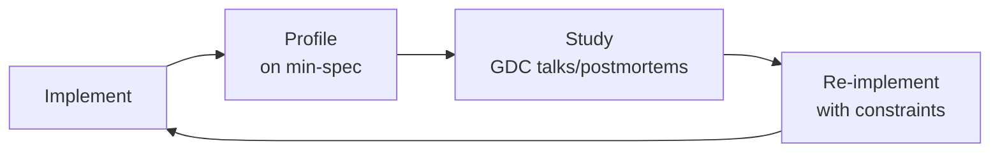

# Game Engine Architect
> **Portability target:** Spec-level (runs on Claude Code, Copilot, Gemini CLI, Codex, Cursor). No vendor-specific frontmatter fields.

Architect, profile, and ship real-time game engines — from ECS memory layouts through render pipeline selection, GPU abstraction, and multiplayer netcode. A single rendering pipeline mistake costs $200K+ in rework. A fixed-timestep desync costs $100K+ in competitive-game player refunds. Game engines ship to millions of players on diverse hardware — every architectural decision compounds across 120Hz displays, 8-core CPUs, and GPU vendors with divergent driver behavior.

## Route the Request

<!-- QUICK: 30s -- auto-route first, then intent-route -->

### Auto-Route (No User Input Required)
Evaluate these file-system conditions in order. First match wins — jump immediately.

| # | Condition | Action |
|---|-----------|--------|
| A1 | `file_contains("*.cs", "(IJobFor|IJobParallelFor|EntityManager|BurstCompile|ComponentSystem)")` OR `file_contains("*.h|*.cpp", "(ecs_world_t|flecs|entt::registry|EnTT)")` | This is your skill. Jump to **Decision Trees** — ECS Architecture Decision. |
| A2 | `file_contains("*.shader|*.hlsl|*.glsl|*.wgsl", "(vertex|fragment|compute)")` OR `file_contains("*.cpp", "(vkCreateGraphicsPipelines|wgpuRenderPipeline|MTLRenderPipeline)")` | Jump to **Decision Trees** — Rendering Pipeline Selection. |
| A3 | `file_contains("*.cpp", "(fixed.timestep|accumulator.*frame|interpolation|GameLoop)")` OR `file_contains("*.cs", "(Time.fixedDeltaTime|FixedUpdate)")` | Jump to **Decision Trees** — Game Loop Type Selection. |
| A4 | `file_contains("*.cpp", "(client.side.prediction|server.reconciliation|rollback|snapshot.interpolation)")` OR `file_contains("*.cs", "(NetworkTransform|ClientNetworkTransform|NetworkBehaviour)")` | Jump to **Decision Trees** — Netcode Architecture. |
| A5 | `file_contains("*.cpp", "(vkEnumeratePhysicalDevices|wgpuInstance|MTLCreateSystemDefaultDevice|ID3D12Device)")` | Jump to **Decision Trees** — GPU API Selection. |
| A6 | `file_contains("*.cpp|*.cs", "(ObjectPool|ArenaAllocator|LinearAllocator|memory.budget|scratch.buffer)")` | Jump to **Decision Trees** — Memory Strategy. |
| A7 | `file_exists("*.uproject|*.uplugin")` AND `file_contains("*.cpp", "(Nanite|Lumen|GAS|GameplayAbility|MassEntity)")` | Jump to **Core Workflow** — Phase 3: Unreal Engine 5 Architecture. |
| A8 | `file_contains("*.cs|*.cpp", "(PhysicsWorld|PhysX|ChaosPhysics|UnityPhysics)")` | Jump to **Core Workflow** — Phase 4: Physics Integration. |

### Intent Route (Ask the User)
If no auto-route matched, use this intent tree:

```
User says "design a game engine" → "/game-engine-architect at L3"
User says "optimize our renderer" → "/game-engine-architect: rendering pipeline selection"
User says "add multiplayer" → "/game-engine-architect: netcode architecture"
User says "port to console" → "/game-engine-architect: memory budgets + GPU API selection"
User says "ECS migration" → "/game-engine-architect: ECS architecture decision"
User says "frame drops on low-end" → "/game-engine-architect: game loop + rendering optimization"
```

## Ground Rules — Read Before Anything Else

<!-- QUICK: 30s -- negative constraints, mechanically triggered -->

| # | Negative Constraint | Mechanical Trigger | Violation Response |
|---|---------------------|--------------------|---------------------|
| G1 | **REFUSE to select rendering pipeline without profiling target hardware first.** | `user_message_contains("forward|deferred|clustered|rendering.pipeline")` AND NOT `file_contains("*", "(GPU.profile|RenderDoc|target.platform|light.count|triangle.count)")` | STOP. Demand: target GPU tier (integrated/discrete/mobile), expected dynamic light count per frame, triangle budget, and render target resolution before pipeline selection. |
| G2 | **STOP if fixed timestep physics runs without interpolation or extrapolation.** | `grep -rL "interpolation\|extrapolation" --include="*.cpp" --include="*.cs" | xargs grep -l "fixed.*timestep\|FixedUpdate"` | HALT. Every fixed timestep loop MUST have interpolation in the render path. Physics at 60Hz, display at 144Hz = 84 empty frames of stutter without interpolation. |
| G3 | **DETECT shader compilation happening at runtime on first material load.** | `file_contains("*.cpp", "(CompileShader|CreateShader|vkCreateShaderModule)")` AND NOT `file_contains("*", "(PSO.cache|pipeline.cache|ShaderVariantCollection|warmup)")` | STOP. Implement: Unreal PSO caching with pre-warm pass, Unity ShaderVariantCollection, or manual Vulkan pipeline cache serialization. Cold shader compiles = 50-500ms hitches. |
| G4 | **REFUSE to ship multiplayer without reconciliation logic verified.** | `file_contains("*", "(client.prediction|server.auth)")` AND NOT `file_contains("*", "(reconciliation|state.correction|rollback|rewind)")` | STOP. Client prediction without server reconciliation = cheating vector. Implement: server-authoritative state, client-predicted movement, server reconciliation on mismatch (rewind + replay inputs). |
| G5 | **STOP if Nanite enabled on translucent or foliage-heavy geometry without overdraw budget.** | `file_contains("*.ini", "r.Nanite=1")` AND `file_contains("*", "(Translucent|Foliage|Masked|TwoSided)")` AND NOT `file_contains("*", "(Nanite.overdraw|r.Nanite.MaxPixelsPerEdge|Nanite.fallback)")` | HALT. Nanite overdraw on translucent surfaces = 100% GPU bound on low-end. Profile with `r.Nanite.Visualize.Overdraw 1`. Set `r.Nanite.MaxPixelsPerEdge` and fallback mesh for masked materials. |
| G6 | **DETECT unmanaged memory leak in Burst-compiled or native job code.** | `file_contains("*.cs", "[BurstCompile]")` AND `file_contains("*.cs", "(NativeArray|UnsafeList|UnsafeHashMap)")` AND NOT `file_contains("*.cs", "(Dispose|DisposeAll|using)")` | WARN. Burst jobs with unmanaged allocations MUST dispose NativeContainers. Memory leak = 2+ GB RSS crash after 3-6 hours. Add `[BurstDiscard]` at job Dispose with leak detection assertion. |
| G7 | **STOP if draw call count is the singular performance metric without script overhead profiling.** | `file_contains("*", "(draw.call|SetPass.call|batches)")` AND NOT `file_contains("*", "(Update\\(\\)|LateUpdate\\(\\)|script.overhead|MonoBehaviour.profile)")` | HALT. 100 draw calls with 3000 Update() calls per frame = 90% of budget in C# VM, not GPU. Profile with Unity Profiler Deep Profile or Unreal Insights. Draw call count alone is a vanity metric. |

## The Expert's Mindset

Masters of game engine architecture don't just build — they build **engines that ship at 60+ FPS on minimum spec hardware, with deterministic multiplayer, zero shader compilation stutter, and 16.67ms worst-case frames**. They think in data flow, not code structure.

| Cognitive Bias | Mitigation |
|----------------|------------|
| **Premature optimization** — micro-optimizing cache lines before profiling | Profile first with RenderDoc/PIX/Xcode GPU Capture on target hardware. Only optimize what the profiler flags as hot. |
| **Shiny new render technique** — adopting mesh shaders/work graphs before the hardware supports them broadly | Check Steam Hardware Survey GPU adoption rates. If <50% of target audience has the feature, it's a stretch goal, not MVP. |
| **Single-platform thinking** — designing for Xbox Series X then discovering PS5's split memory architecture breaks everything | Maintain a per-platform memory budget spreadsheet from day one. Test on all target platforms weekly. |
| **Over-abstraction** — building a generic "rendering backend" before shipping the first game | Ship one game with one concrete pipeline. Abstract on the second game when you have data on what actually varies. |

### What Masters Know That Others Don't
- The **failure modes** of every rendering pipeline — not just the best-case FPS, but what happens at 1000 dynamic lights, or with 50 transparent layers, or when the GPU driver decides to stall.
- When **not** to use ECS — not every object benefits. ECS for 10,000 bullets: yes. ECS for 5 UI buttons: catastrophic over-engineering.
- That **frame time variance matters more than average FPS** — 60 FPS average with 30ms spikes = unshippable. Target P99 frame time < budget.

### When to Break Your Own Rules
- **Ship now, optimize later.** A working game at 30 FPS with a gameplay problem is better than a perfectly optimized engine with no game.
- **Skip ECS for a single-platform title** with <5000 dynamic objects. GameObject.Update() with object pooling is sufficient and 10x faster to iterate.

## Operating at Different Levels

| Level | Scope | You... |
|-------|-------|--------|
| **L1** | Single system (renderer, physics, audio) | Implement a well-defined subsystem following engine architecture patterns |
| **L2** | Complete engine for a single game | Design and build the engine architecture; make pipeline and ECS tradeoffs; set frame budgets |
| **L3** | Multi-title engine / studio-wide | Define studio engine standards; make build-vs-license decisions (Unreal vs Unity vs custom); mentor L1-L2 |
| **L4** | Cross-studio / publisher | Define publisher-wide engine strategy; negotiate Epic/Unity enterprise licensing; establish shared tech initiatives |
| **L5** | Industry / ecosystem | Create rendering techniques adopted across the industry (e.g., TAA, CACAO, virtualized geometry); influence GPU vendor APIs |

**Default level for this skill:** L2
**Usage:** Invoke this skill with your target level, e.g., "as an L3 game engine architect, design..."

For full level definitions, see `skills/00-framework/skill-levels/SKILL.md`.

## When to Use

<!-- QUICK: 30s — scan bullets to decide if this skill fits -->
- Designing an entity-component-system architecture: Unity DOTS entities-archetypes-chunks, Flecs, EnTT sparse sets, SoA vs AoS layout, cache-friendly iteration patterns
- Selecting a rendering pipeline: forward for mobile/transparency, deferred for many dynamic lights, clustered forward for balance, PBR with Cook-Torrance BRDF
- Implementing a C++ game loop: fixed timestep at 60Hz physics, variable rendering at display refresh, interpolation factor `α = accumulator / dt`, input snapshots at frame start
- Optimizing Unity projects: IL2CPP AOT compilation, Burst compiler with SIMD intrinsics, Job System `IJobFor` parallel processing, Addressables for memory streaming
- Configuring Unreal Engine 5 architecture: Nanite meshlet-based LOD with software rasterization fallback, Lumen surface cache, Gameplay Ability System attribute-grant-tag pattern
- Writing and optimizing shaders: Unity Shader Graph, Unreal Material Editor, HLSL/GLSL compute shaders, SPIR-V cross-compilation via wgpu
- Implementing multiplayer networking: client-side prediction, server reconciliation, rollback netcode (GGPO-style), snapshot interpolation with jitter buffer
- Managing cross-platform GPU pipelines: wgpu (WebGPU native), Vulkan, Metal 3, DirectX 12, shader reflection, descriptor set layout optimization
- Integrating physics engines: Unity Physics (DOTS), PhysX 5, Chaos Physics (Unreal 5), continuous collision detection, solver iteration budgets
- Designing memory management: object pools with pre-allocated arrays, arena/linear allocators for per-frame scratch, console memory budgets with subsystem caps

## Decision Trees

<!-- QUICK: 30s — follow the ASCII tree to your scenario -->
<!-- STANDARD: 3min — each tree has concrete API names, budget numbers, and decision rationale -->

### Rendering Pipeline Selection — Forward vs Deferred vs Clustered Forward

```
                          ┌──────────────────────────────┐
                          │ START: Target hardware & scene │
                          │ GPU tier: ___                  │
                          │ Dynamic lights: ___ expected   │
                          │ Transparency layers: ___       │
                          │ Resolution: ___ x ___          │
                          └────────────┬─────────────────┘
                                       │
                         ┌─────────────▼─────────────────┐
                         │ Mobile / integrated GPU OR     │
                         │ <10 dynamic lights OR          │
                         │ extensive transparency?        │
                         └────┬────────────────────┬─────┘
                              │ YES                │ NO
                    ┌─────────▼──────┐    ┌────────▼────────────┐
                    │ Forward render   │    │ >100 dynamic lights  │
                    │ (mobile, Switch, │    │ OR deferred-capable  │
                    │  Quest, low-end  │    │ GPU (discrete)?      │
                    │  PC)             │    └────┬──────────┬──────┘
                    │ • Single-pass    │         │ YES      │ NO
                    │ • MSAA cheap     │  ┌──────▼──────┐ ┌─▼────────────┐
                    │ • Transparent    │  │ Deferred     │ │ Clustered     │
                    │   sorting free   │  │ (PC/Console) │ │ Forward       │
                    │ • Bandwidth: low │  │ • G-Buffer   │ │ (mid-range    │
                    └──────────────────┘  │   MRT        │ │  GPU, 50-100  │
                                          │ • Lighting   │ │  lights)      │
                                          │   compute    │ │ • Light grid  │
                                          │ • No MSAA    │ │   in compute  │
                                          │   (use TAA)  │ │ • MSAA + many │
                                          │ • Bandwidth: │ │   lights      │
                                          │   HIGH       │ │ • Forward+    │
                                          └──────────────┘ └───────────────┘
```
<!-- DEEP: 10+min — war story -->
*Studio shipped a deferred renderer for a game with heavy transparency (glass buildings, particle effects). Deferred can't blend transparent objects from the G-Buffer — they needed a separate forward pass for all transparent geometry. Result: two full scene traversals, 2x draw calls, 33ms frame time on target hardware. Fix: switched to clustered forward (Unity URP Forward+), single pass handles opaque + transparent + up to 256 lights via tile-based light culling. 16ms frame time restored. Cost: 6-week renderer rewrite, $180K engineering + delayed certification.*

### ECS Architecture Decision — Archetype-based vs Sparse-set vs Table-based

```
                          ┌──────────────────────────────┐
                          │ START: Entity count & access   │
                          │ Total entities: ___            │
                          │ Unique archetypes: ___         │
                          │ Queries/sec: ___               │
                          │ Add/remove components: ___/s   │
                          └────────────┬─────────────────┘
                                       │
                         ┌─────────────▼─────────────────┐
                         │ >10K entities of same type     │
                         │ (bullets, particles, AI units) │
                         │ AND structural changes rare?   │
                         └────┬────────────────────┬─────┘
                              │ YES                │ NO
                    ┌─────────▼──────┐    ┌────────▼────────────┐
                    │ Archetype ECS   │    │ Frequent add/remove  │
                    │ (Unity DOTS)    │    │ of components AND    │
                    │ • Chunk-based   │    │ <50K entities?       │
                    │   memory, SoA   │    └────┬──────────┬──────┘
                    │ • Ideal cache   │         │ YES      │ NO
                    │   locality      │  ┌──────▼──────┐ ┌─▼────────────┐
                    │ • Structural    │  │ Sparse-set   │ │ Table-based   │
                    │   changes slow  │  │ (EnTT)       │ │ (Flecs)       │
                    │   (move chunks) │  │ • O(1) add/  │ │ • Archetype   │
                    │ • Unity: DOTS   │  │   remove     │ │   graph       │
                    │   1.2+          │  │ • Stable ptrs │ │ • Add/remove  │
                    └─────────────────┘  │ • Good for   │ │   fast via    │
                                         │   UI/editor  │ │   table edges │
                                         │ • EnTT 3.12+ │ │ • Flecs 4.0+  │
                                         └──────────────┘ └───────────────┘
```
**Archetype (Unity DOTS):** Homogeneous entities, bulk processing, SoA layout, 16KB chunks. Best for: 10K+ identical entities, Burst-compiled jobs.
**Sparse-set (EnTT):** Heterogeneous entities, frequent add/remove, stable pointers. Best for: editor tools, UI, dynamic composition.
**Table-based (Flecs):** Middle ground, fast add/remove via table edges, good for mixed workloads, C99 compatible.

### Game Loop Type Selection — Fixed Timestep + Variable Rendering + Interpolation

```
                          ┌──────────────────────────────┐
                          │ START: Game type & requirements│
                          │ Deterministic replay? ___      │
                          │ Multiplayer? ___               │
                          │ Display: ___ Hz target         │
                          │ Physics: ___ Hz target         │
                          └────────────┬─────────────────┘
                                       │
                         ┌─────────────▼─────────────────┐
                         │ Deterministic replay OR        │
                         │ multiplayer OR physics-driven? │
                         └────┬────────────────────┬─────┘
                              │ YES                │ NO
                    ┌─────────▼──────┐    ┌────────▼────────────┐
                    │ Fixed timestep  │    │ Variable timestep    │
                    │ (Robert Nystrom │    │ (simple, non-physics)│
                    │  GameLoop pat.) │    │ • dt = frame time    │
                    │ • Physics:      │    │ • OK for: UI, menu,  │
                    │   dt = 1/60     │    │   turn-based, puzzle │
                    │ • Render:       │    │ • NOT for: physics,  │
                    │   interpolated  │    │   multiplayer,       │
                    │   state         │    │   deterministic      │
                    │ • Accumulator:  │    │   replay             │
                    │   Σ frame time  │    └──────────────────────┘
                    │ • α = accum/dt  │
                    │ • "Catch-up"    │
                    │   if accum>dt   │
                    │   run N physics │
                    │   steps with    │
                    │   spiral-of-    │
                    │   death guard   │
                    └─────────────────┘
```
<!-- DEEP: 10+min — war story -->
*Fighting game shipped with variable timestep. Frame rate: 58-62 FPS on PC. At 62 FPS, a forward dash traveled 6.2m in 10 frames. At 58 FPS, same dash traveled 5.8m. Competitive players discovered that capping at 58 FPS let them micro-step into throw range without triggering the opponent's throw-tech window. Tournament organizers banned the game. Fix: fixed timestep at 60Hz with interpolation. Cost: $100K+ in tournament credibility damage and 4-month engine refactor.*

### GPU API Selection — wgpu vs Vulkan vs DirectX 12 vs Metal

```
                          ┌──────────────────────────────┐
                          │ START: Platform targets        │
                          │ Windows: ___ %                 │
                          │ macOS/iOS: ___ %               │
                          │ Linux/SteamDeck: ___ %         │
                          │ Xbox: ___ %                    │
                          │ PlayStation: ___ %             │
                          │ Web (WebGPU): ___ %            │
                          └────────────┬─────────────────┘
                                       │
                         ┌─────────────▼─────────────────┐
                         │ Need browser/WebGPU OR        │
                         │ small team (<5 engine devs)    │
                         │ OR Rust codebase?             │
                         └────┬────────────────────┬─────┘
                              │ YES                │ NO
                    ┌─────────▼──────┐    ┌────────▼────────────┐
                    │ wgpu (WebGPU    │    │ Console target?      │
                    │ native)         │    └────┬──────────┬──────┘
                    │ • Cross-platform│         │ YES      │ NO
                    │   (D3D12, Vk,   │  ┌──────▼──────┐ ┌─▼────────────┐
                    │   Metal, GL)    │  │ Per-platform │ │ Vulkan        │
                    │ • Safe by       │  │ native:      │ │ (Steam Deck,  │
                    │   default       │  │ • D3D12 for  │ │  Linux, Win)  │
                    │ • SPIR-V input  │  │   Xbox/Win   │ │ OR D3D12      │
                    │ • wgpu 0.19+    │  │ • Metal 3    │ │ (Windows-only)│
                    │ • Not for: AAA  │  │   for Apple  │ │ • Explicit    │
                    │   console perf  │  │ • GNM/GNMX   │ │   control     │
                    └─────────────────┘  │   for PS5    │ │ • Ray tracing │
                                         │ • Max perf   │ │ • Mesh shaders│
                                         │ • Max effort │ │ • D3D12:      │
                                         │ • 4x impl    │ │   Agility SDK │
                                         └──────────────┘ └───────────────┘
```
**wgpu:** Best for indie/small-team, Rust, browser deployment, 1 codebase → 4 platforms. Not for AAA perf requirements.
**Vulkan:** Best for Steam Deck + Linux + Windows, explicit control, ray tracing via VK_KHR_ray_tracing_pipeline.
**D3D12:** Best for Xbox + Windows exclusive, Agility SDK for latest features, PIX for profiling.
**Metal 3:** Apple platforms only. Mesh shaders, ray tracing (M3+), MetalFX upscaling.

### Netcode Architecture — Client-Server Authoritative vs P2P Lockstep vs Rollback

```
                          ┌──────────────────────────────┐
                          │ START: Game genre & scale      │
                          │ Players per match: ___         │
                          │ Tickrate target: ___ Hz        │
                          │ Input latency tolerance: ___ms │
                          │ Spectator mode needed? ___     │
                          └────────────┬─────────────────┘
                                       │
                         ┌─────────────▼─────────────────┐
                         │ Fighting game OR <4 players    │
                         │ OR sub-30ms latency tolerance? │
                         └────┬────────────────────┬─────┘
                              │ YES                │ NO
                    ┌─────────▼──────┐    ┌────────▼────────────┐
                    │ Rollback netcode│    │ >32 players (MMO,    │
                    │ (GGPO-style)    │    │ FPS, BR) OR          │
                    │ • Input delay + │    │ spectator mode?      │
                    │   prediction    │    └────┬──────────┬──────┘
                    │ • Rollback on   │         │ YES      │ NO
                    │   mismatch      │  ┌──────▼──────┐ ┌─▼────────────┐
                    │ • Save states   │  │ Client-      │ │ P2P lockstep  │
                    │   every frame   │  │ Server       │ │ (RTS, 4X)     │
                    │ • For: fighting │  │ Authoritative│ │ • All clients │
                    │   games,        │  │ • Server     │ │   wait for    │
                    │   brawlers      │  │   simulates  │ │   all inputs  │
                    │ • Adds 1-3      │  │ • Client     │ │ • Deterministic│
                    │   frames delay  │  │   predicts   │ │   simulation  │
                    └─────────────────┘  │ • Reconcil.  │ │ • No server   │
                                         │   on mismatch│ │   needed      │
                                         │ • Snapshot   │ │ • Slowest     │
                                         │   interp.    │ │   player      │
                                         │ • For: FPS,  │ │   dictates    │
                                         │   BR, MMO    │ │   pace        │
                                         └──────────────┘ └───────────────┘
```
<!-- DEEP: 10+min — war story -->
*Battle royale shipped with client-authoritative movement. Within 72 hours of launch, cheat developers reverse-engineered the client and released a teleport hack — instant 500m movement, no server validation. 30% of the player base reported encountering cheaters in their first week. Player count dropped 60% month-over-month. The studio spent $500K+ on Easy Anti-Cheat integration + 6-month server-authoritative refactor. Lesson: never trust the client. Ever. Server-authoritative from day one, even for prototypes.*

### Memory Strategy — Object Pool → Arena Allocator → Subsystem Budget

```
                          ┌──────────────────────────────┐
                          │ START: Platform memory budget  │
                          │ Total RAM: ___ MB              │
                          │ Engine overhead: ___ MB        │
                          │ Game data: ___ MB target       │
                          │ Object count: ___ peak         │
                          └────────────┬─────────────────┘
                                       │
                         ┌─────────────▼─────────────────┐
                         │ Frequent alloc/free of same-   │
                         │ sized objects per frame?       │
                         │ (particles, bullets, sounds)   │
                         └────┬────────────────────┬─────┘
                              │ YES                │ NO
                    ┌─────────▼──────┐    ┌────────▼────────────┐
                    │ Object pool     │    │ >100MB total, many   │
                    │ • Pre-alloc N   │    │ subsystems competing?│
                    │ • Acquire/      │    └────┬──────────┬──────┘
                    │   Release API   │         │ YES      │ NO
                    │ • Pool size:    │  ┌──────▼──────┐ ┌─▼────────────┐
                    │   peak * 1.5   │  │ Subsystem    │ │ Simple malloc │
                    │   headroom      │  │ memory       │ │ (small <100MB│
                    │ • Template:     │  │ budgets      │ │  prototype)  │
                    │   T* Pool::     │  │ • Audio:     │ │ • Use        │
                    │   Acquire()     │  │   32MB cap   │ │   tcmalloc/  │
                    │ • Per-type pool │  │ • Render:    │ │   jemalloc   │
                    │   not generic   │  │   128MB cap  │ │ • STL with   │
                    └─────────────────┘  │ • Physics:   │ │   custom     │
                                         │   64MB cap   │ │   allocator  │
                                         │ • Each uses  │ │ • Not for    │
                                         │   arena      │ │   consoles   │
                                         │   allocator  │ └──────────────┘
                                         │ • Console:   │
                                         │   PS5/XSX    │
                                         │   hard caps  │
                                         └──────────────┘
```

## Core Workflow

<!-- QUICK: 30s — scan phase titles to understand the process -->
<!-- STANDARD: 3min — each phase has explicit Do/Verify/Recover steps -->
<!-- DEEP: 10+min -->

### Phase 1 (~8 hours): Rendering Pipeline Architecture & PBR Setup
1. **Do:** Select pipeline per the Rendering Pipeline decision tree. Configure G-Buffer layout for deferred (Albedo RGB + Normal RG + Roughness/Metalness B + Depth 24) or forward pass with depth prepass for clustered.
2. **Do:** Implement PBR shading with Cook-Torrance BRDF: `F = F0 + (1-F0) * pow(1-NdotH, 5)`, `D = α² / (π * (NdotH² * (α²-1) + 1)²)`, `G = G_SchlickGGX(NdotV) * G_SchlickGGX(NdotL)`. Use roughness-metalness workflow with IBL from pre-filtered environment map.
3. **Do:** Set up shader compilation pipeline: Vulkan pipeline cache serialized to disk, Unity ShaderVariantCollection with warm-up scene, Unreal PSO cache with `r.ShaderPipelineCache.Enabled=1`.
4. **Verify:** Profile with RenderDoc: G-Buffer bandwidth < 64 bytes/pixel for deferred. Shader compile hitches < 1ms after warm-up. PBR validation: compare against Disney BRDF Explorer reference images.
5. **Recover:** G-Buffer too wide → drop specular color, reconstruct from roughness/metallic. Shader compile hitches persist → ship pre-compiled pipeline cache file with game build.

### Phase 2 (~6 hours): C++ Game Loop Implementation with Fixed Timestep
1. **Do:** Implement the canonical fixed timestep loop (Robert Nystrom pattern):
```cpp
double previous = getCurrentTime();
double lag = 0.0;
const double MS_PER_UPDATE = 16.6667; // 60Hz physics

while (running) {
    double current = getCurrentTime();
    double elapsed = current - previous;
    previous = current;
    lag += elapsed;

    // Fixed timestep physics: catch up if lagged
    while (lag >= MS_PER_UPDATE) {
        processInput();        // Sample inputs at step start
        fixedUpdate(MS_PER_UPDATE / 1000.0);
        lag -= MS_PER_UPDATE;
    }

    // Render with interpolation: α = lag / MS_PER_UPDATE
    double alpha = lag / MS_PER_UPDATE;
    render(alpha);
}
```
2. **Do:** Implement spiral-of-death guard: `const int MAX_FRAMES_TO_CATCHUP = 5;` in the while loop. On Xbox Series X at 120Hz, you have 8.33ms per frame — if physics takes >8.33ms, clamp catch-up to prevent snowball.
3. **Do:** Input sampling: snapshot at beginning of each fixed update step, not per-render frame. Use double-buffered input state read atomically.
4. **Verify:** Render at 30Hz, physics at 60Hz → visual smoothness via interpolation. Render at 144Hz, physics at 60Hz → no duplicated physics frames visible.
5. **Recover:** Spiral of death → increase physics tick rate (120Hz) or decrease physics cost. Drop physics fidelity before dropping frames.

### Phase 3 (~10 hours): Unreal Engine 5 Architecture Configuration
1. **Do:** Nanite configuration: set `r.Nanite 1`, `r.Nanite.MaxPixelsPerEdge 1` (quality), `r.Nanite.ViewMeshLODBias.Enable 0`. Fallback mesh target: <1% of triangles for masked/translucent materials. Virtual shadow maps: `r.Shadow.Virtual.Enable 1`.
2. **Do:** Lumen global illumination: `r.Lumen.DiffuseIndirect.Allow 1`, `r.Lumen.Reflections.Allow 1`. Surface cache: `r.Lumen.ScreenProbeGather.SpatialFilter 1`. For 60 FPS console: `r.Lumen.ScreenProbeGather.TracingOctahedronResolution 8` (half-res).
3. **Do:** Gameplay Ability System: `UGameplayAbility` subclass per ability, `FGameplayAttribute` for stats (Health, Mana, Stamina), `FGameplayTag` for state (Stunned, Invulnerable, Rooted). Use `UGameplayEffect` with `FGameplayModifierInfo` for buffs/debuffs. Attribute replication via `FGameplayAttributeData` with `OnRep`.
4. **Verify:** Nanite: `r.Nanite.Visualize.Overdraw 1` — overdraw < 8x on target GPU. Lumen: `r.Lumen.Visualize.Traces 1`. GAS: ability tag blocking verified (stun prevents cast).
5. **Recover:** Nanite overdraw > 8x → enable fallback mesh for high-density foliage. Lumen ghosting → enable `r.Lumen.Reflections.HistoryWeight 0.9`. GAS attribute desync → check `AActor::GetReplicatedServerLastTransformUpdateTimeStamp`.

### Phase 4 (~5 hours): Unity DOTS/ECS Optimization
1. **Do:** Entity archetype design: group by shared write access pattern — entities that all need `Translation` + `Rotation` updated together belong in same archetype. Use `IJobEntity` for simple iteration, `IJobChunk` for manual chunk iteration with `ArchetypeChunkComponentType`.
2. **Do:** Burst compilation: `[BurstCompile(FloatPrecision.Low, FloatMode.Fast)]` for physics, `OptimizeFor = OptimizeFor.Performance`. Avoid managed objects in Burst — use `FixedString64Bytes`, `BlobAssetReference<T>`, `NativeHashMap`.
3. **Do:** Memory layout: `ComponentType.ChunkComponent` for shared read-only data. `EntityCommandBuffer` for structural changes (create/destroy entities, add/remove components) — never inside `IJobEntity`/`IJobChunk`.
4. **Verify:** Unity Profiler: Burst jobs show as "Burst" in timeline. `SystemAPI.Query<T>()` zero managed allocations. Job `Schedule()` latency < 0.1ms. Chunk utilization > 80% (no sparse chunks).
5. **Recover:** Structural change in job → `EntityCommandBuffer` pattern. Managed leak → `NativeArray.Dispose()` audit with `LeakDetectionMode = NativeLeakDetectionMode.Enabled`.

### Phase 5 (~4 hours): Multiplayer Netcode Implementation
1. **Do:** Client-side prediction: client runs same simulation code as server, predicts local player `+N` ticks ahead. Input buffer: `InputCommand inputs[MAX_INPUT_HISTORY]` indexed by tick number. Send input with tick number, not frame number.
2. **Do:** Server reconciliation: server processes input for tick T, broadcasts authoritative state for tick T. Client receives state for tick T, compares with predicted state at same tick. If `|predicted_position - server_position| > threshold`, rewind state to tick T, replay all inputs from T to current, re-predict.
3. **Do:** Snapshot interpolation: server sends state snapshots at tickrate (e.g., 64Hz). Client buffers 2-3 snapshots, renders interpolated state between tick `N` and `N+1` at `N + interp_delay` ticks. Jitter buffer: adaptive size based on network jitter measurement.
4. **Verify:** Client prediction: 0ms input latency visually, no "swimming" feel. Reconciliation: teleport correction < 1cm for <100ms ping. Interpolation: no stutter with ±30ms jitter.
5. **Recover:** Prediction overshoot (>10cm at 50ms ping) → reduce prediction time window or add velocity damping. Interpolation starvation → increase `interp_delay` by one tick.

## Cross-Skill Coordination

<!-- QUICK: 30s — who to talk to, when, what to share -->

### Coordinate With

| Coordinate With | When | What to Share/Ask |
|-----------------|------|-------------------|
| **System Architect** | Engine architecture decisions, build-vs-license evaluations | Rendering pipeline tradeoffs, ECS data flow, threading model, platform support matrix |
| **Performance Engineer** | Frame budget allocation, GPU/CPU profiling, draw call optimization | Per-frame budget breakdown (16.67ms at 60 FPS), GPU timeline captures, shader complexity reports |
| **QA Engineer** | Determinism testing, multiplayer stress testing, platform certification | Deterministic replay test harness, netcode reconciliation test cases, TRC/TCR compliance checklist |
| **Frontend Developer** | UI rendering in engine, HUD optimization, menu system integration | UI canvas budget (separate from world rendering), font atlas sizing, UI shader variants |
| **Mobile Developer** | Mobile GPU profiling, texture compression formats, power/thermal budgets | ASTC/ETC2 texture format selection, mobile render pass merging, thermal throttling thresholds |
| **Embedded Engineer** | Console memory budgets, low-level GPU driver behavior, shader compiler toolchains | Per-platform memory map, DMA transfer patterns, GPU command buffer submission strategies |

### Communication Triggers

| Trigger | Notify | Why |
|---------|--------|-----|
| Frame time exceeds budget by >2ms on target hardware | Performance Engineer, System Architect | Pipeline or content optimization sprint; triage GPU vs CPU bound |
| Shader compile stutter >50ms on first material load | QA Engineer, Performance Engineer | PSO cache regression; potential certification failure (Sony TRC) |
| Client-server state desync >5% of ticks in multiplayer test | QA Engineer, System Architect | Reconciliation bug; potential cheating vector |
| Memory usage exceeds 85% of console budget | Embedded Engineer, Performance Engineer | Content trim or memory optimization; prevent OOM crash |
| Deterministic replay diverges after N frames | QA Engineer | Non-deterministic system (unordered iteration, uninitialized memory, float non-determinism) |

### Escalation Path

```
Frame time > budget on min-spec hardware? → Performance Engineer → Content cut or pipeline change
Shader cache corruption + PSO rebuild every launch? → GPU vendor support → Driver bug workaround
Multiplayer desync >5% reproducible? → System Architect → Netcode re-architecture → +8-12 weeks
Console certification failure (TRC/TCR)? → Embedded Engineer + QA → +4 weeks cert cycle
```

### Cross-Skill Chain

```bash
# Architecture → Rendering → Performance → QA certification
/system-architect && /game-engine-architect && /performance-engineer && /qa-engineer
```

**Decision Gates & Handoff Artifacts:**
- **Rendering pipeline gate:** Selected pipeline must pass: (1) target FPS at min-spec GPU in RenderDoc capture, (2) PBR validation against reference images, (3) shader compilation <1ms per material after warm-up, (4) G-Buffer bandwidth within target. Artifact: Pipeline selection document with performance profiling data.
- **Game loop gate:** Fixed timestep loop must pass: (1) deterministic replay for 10K+ frames, (2) interpolation smoothness at 30Hz physics + 144Hz render, (3) spiral-of-death guard triggered and recovered. Artifact: Game loop test harness with frame time histogram.
- **ECS architecture gate:** ECS selection must: (1) handle peak entity count at target tickrate, (2) zero managed allocations in hot path, (3) structural change batching <1ms. Artifact: ECS benchmark report with entity count vs frame time graph.
- **Multiplayer gate:** Netcode must: (1) client prediction within 1cm at 50ms ping, (2) reconciliation rate >99%, (3) snapshot interpolation smooth with ±30ms jitter. Artifact: Network test report with latency vs accuracy scatter plot.
- **Console memory gate:** Memory usage <85% of budget after 30-minute gameplay stress test. All subsystems within budget. Artifact: Memory budget spreadsheet with per-subsystem actual vs budget.
- **Handoff to `performance-engineer`:** Frame budget allocation (CPU: ___ms, GPU: ___ms per subsystem), draw call budget, GPU timeline capture. Artifact: Performance baseline report with RenderDoc/PIX capture.
- **Handoff to `qa-engineer`:** Deterministic replay test harness, netcode reconciliation test cases, platform cert compliance checklist. Artifact: Test plan with pass/fail thresholds per test case.
- **Handoff to `frontend-developer`:** UI rendering budget (separate canvas layer, world-space vs screen-space), font atlas configuration, UI-specific shader variants. Artifact: UI integration guide with rendering constraints.

## Proactive Triggers

| Trigger | Action | Why |
|---|---|---|
| Steam Hardware Survey shows a GPU your game doesn't target exceeds 15% market share | Add that GPU tier to your test matrix within 2 weeks; profile on representative hardware; determine if "min spec" can be lowered | Missing 15% of the Steam audience = $2M-$5M revenue gap for a mid-budget title |
| Shader compile times increase >20% after engine upgrade | Diff shader compilation pipeline changes; check if new shader model features caused variant explosion; add variants to pre-warm collection | Shader compile stutter is the #1 cause of negative "performance" Steam reviews |
| Burst-compiled job shows >0.5ms in Unity Profiler | Check for managed allocations (boxing, string formatting) inside Burst code; check `[BurstDiscard]` coverage; compare IL2CPP vs Mono JIT numbers | A single slow Burst job blocks the entire job chain; 0.5ms → 1ms with safety checks → 6% of frame budget |
| Client prediction mispredict rate exceeds 5% in telemetry | Reduce prediction window; increase server tickrate; add input acknowledgement ACK tracking; check if prediction model matches actual physics | Misprediction >5% = players feel "lag" even at 30ms ping — they'll blame your netcode, not their ISP |
| Memory fragmentation exceeds 30% after 2-hour gameplay session | Audit per-frame allocations; convert STL containers to pool allocators; enable defragmentation on arena allocators | Fragmentation causes "random" allocation failure after N hours of play — hardest bug to reproduce |
| RenderDoc capture shows >1000 draw calls per frame on min-spec GPU | Implement GPU-driven rendering (indirect draw, meshlet culling in compute); enable SRP Batcher (Unity) or automatic instancing (Unreal); merge static geometry | 1000 draw calls at 60 FPS = 60K draw calls/sec = CPU driver overhead dominant; GPU idle waiting |
| PSO creation hitches >1ms after warm-up | Serialize pipeline cache to disk pre-shipped with build; pre-create all known PSO combinations at loading screen; verify no runtime PSO creation in hot path | PSO creation on D3D12/Vulkan is 10-100ms — even a single hitch per level = certification failure (Sony TRC R5054) |

## What Good Looks Like

<!-- DEEP: 10+min — concrete success criteria for every phase -->

- Rendering pipeline: target FPS at min-spec GPU with 20% headroom; zero shader compile hitches after warm-up; PBR output matches reference within 2% perceptual error.
- Game loop: deterministic replay for 100K+ frames without divergence; interpolation smooth at any display refresh rate; spiral-of-death guard never triggers in normal gameplay.
- ECS architecture: 50K+ entities updated in <1ms Burst job; zero managed allocations in ECS hot path; chunk utilization >80%.
- Unreal Engine 5: Nanite triangle density 1 pixel per triangle at target resolution; Lumen indirect lighting updates within 2 frames; GAS abilities tag-blocked correctly under all state combinations.
- Multiplayer: client prediction correct to within 1cm at 50ms ping; reconciliation <1% misprediction rate; snapshot interpolation smooth at tickrate/2 delay.
- Memory: peak usage <85% of console budget; zero fragmentation-induced allocation failures in 8-hour soak test; per-frame allocation <1KB after initial loading.
- Cross-platform: same scene renders within 5% visual parity across D3D12, Vulkan, Metal; shader compilation succeeds on all platforms from single SPIR-V source.

## Deliberate Practice



| Level | Practice | Frequency |
|-------|----------|-----------|
| **Novice** | Implement a minimal renderer from scratch (forward shading, single light, PBR) then compare with Filament/Unity URP | Monthly |
| **Competent** | Add a new constraint (ray tracing, 1000 dynamic lights, multiplayer netcode) to an existing engine and maintain 60 FPS | Quarterly |
| **Expert** | Design the same engine for 3 different genres (FPS, RTS, open-world RPG); write architecture decision records for each | Quarterly |
| **Master** | Port your engine to a new GPU API (Vulkan → Metal, D3D12 → wgpu); teach a junior to maintain it | Monthly |

**The One Highest-Leverage Activity:** Every quarter, profile a shipped AAA game with RenderDoc/PIX. Capture a frame, decompile a compute shader, trace a draw call. Understand how they solved the frame budget problem. Write down what you'd do differently.

## Gotchas

- **Unity `GameObject.Instantiate()` inside `Update()` triggers GC.Collect spikes.** Every `Instantiate()` allocates managed memory for the Transform, MonoBehaviour array, and native-object mapping. After 1000 instantiates, the Mono heap fragments, GC.Collect fires, and your 16ms frame becomes 120ms. This caused a $50K+ refund wave when a mobile RPG spawned loot drops in `Update()` — frame drops triggered Apple's thermal watchdog and crashed the app on iPhone 8. **Fix:** Pre-allocate object pools at scene load. Use `Pool.Get<T>()` / `Pool.Release(T)` with a ring buffer. For DOTS, use `EntityCommandBuffer.Instantiate()` in a Burst job with pre-allocated chunk capacity.

- **Fixed timestep physics desync from variable rendering without interpolation causes rubber-banding.** Physics runs at 60Hz (dt=16.67ms). Renderer runs at 144Hz (dt=6.94ms). Without interpolation, the renderer shows the last physics state repeated 2-3 times per visual frame, then a sudden jump. Players perceive this as "lag" even though it's purely visual. This caused a $100K+ competitive integrity investigation when esports players accused the studio of rigging hitboxes. **Fix:**
```cpp
// Interpolation: visual state = lerp(prev_physics_state, current_physics_state, alpha)
// where alpha = accumulator / fixed_dt
Transform renderTransform = Transform::Lerp(
    previousPhysicsState.transform,
    currentPhysicsState.transform,
    alpha
);
```
Always run physics at a multiple of your display rate when possible (e.g., 120Hz physics for 60/120/240Hz displays).

- **Shader compilation stutter on first material load crashes certification.** On Vulkan/D3D12, graphics pipeline state objects (PSOs) must be compiled before first draw. If a new material appears mid-gameplay (player equips a rare item, particle effect triggers), the driver compiles the pipeline on-demand — 50-500ms hitch. Sony TRC R5054: "No frame shall exceed 50ms." This fails cert and costs 4 weeks of resubmission. **Fix:** Unreal: `r.ShaderPipelineCache.Enabled=1` with `.upipelinecache` file pre-baked from a gameplay coverage run. Unity: `ShaderVariantCollection` with `WarmUpAllShaders()` in loading screen. Vulkan: serialize `VkPipelineCache` to disk, ship with build.

- **DOTS structural change inside a job causes sync point stall (0.5ms → 15ms spike).** Burst jobs execute in parallel across worker threads. A structural change (add/remove component, create/destroy entity) forces a sync point — all running jobs must complete, chunks are reorganized, and job dependencies re-resolved. If this happens inside `IJobChunk.Execute()`, every worker thread blocks on the main thread's structural change. **Fix:** NEVER call `EntityManager.AddComponent()` or `EntityManager.DestroyEntity()` inside a job. Use `EntityCommandBuffer` — record structural changes during job execution, apply them in a single batch at `EntityCommandBufferSystem` barrier. For DOTS 1.2+: `EntityCommandBuffer.ParallelWriter` with `[NativeDisableParallelForRestriction]`.

- **Nanite overdraw on translucent/foliage geometry saturates GPU at 100% on low settings.** Nanite rasterizes micropolygons via software rasterization. Transparent surfaces require per-pixel sorting, which Nanite cannot do — it falls back to conventional rasterization but still pays the meshlet traversal cost. On foliage with masked opacity, every leaf triggers a separate material evaluation. At 1440p on an RTX 2060, this can hit 100% GPU utilization with 80% overdraw. **Fix:** Profile with `r.Nanite.Visualize.Overdraw 1`. Set `r.Nanite.MaxPixelsPerEdge 2` (half-resolution) for foliage meshes. Implement `r.Nanite.FallbackPercentTriangle` to switch masked materials to simplified fallback meshes at distance.

- **Unmanaged memory leak in Burst-compiled job crashes after 4 hours at 2+ GB RSS.** A Burst job allocates `NativeList<T>` in `OnCreate()`, adds elements in `OnUpdate()`, but the `Dispose()` call is inside `#if UNITY_EDITOR`. In a player build, the disposal is compiled out. The `NativeList` internally allocates from the `UnsafeUtility` allocator (malloc-backed, not GC-tracked). After 4 hours of gameplay at 60 FPS, 864K job executions have leaked ~500KB each → 432MB leaked. Combined with other subsystems, RSS exceeds 2GB, OS terminates the process. **Fix:**
```csharp
[BurstCompile]
struct MyJob : IJobChunk {
    [ReadOnly] public NativeArray<int> inputs;
    public NativeList<float>.ParallelWriter results; // Disposed by caller
    
    public void Execute(in ArchetypeChunk chunk, ...) {
        // Never store NativeList locally without Dispose
    }
}

// In System.OnDestroyRun():
[BurstDiscard]
private static void CheckLeaks(ref NativeList<float> list) {
    if (list.IsCreated) {
        UnityEngine.Debug.LogError("NativeList leaked!");
        list.Dispose();
    }
}
```

- **Client-side prediction without server reconciliation is a cheating vector that costs $500K+ in anti-cheat investment.** Client predicts player position +5 ticks ahead. Server authoritative state arrives at tick T. Without reconciliation, the client never corrects its state — a modified client can report `position=(1000, 0, 0)` while the server says `position=(5, 0, 0)`. If the server doesn't re-simulate and correct, the cheater teleports. This is the #1 multiplayer vulnerability exploited in the first 72 hours of any online game launch. **Fix:**
```cpp
void Client::OnServerState(const ServerState& state, int32_t tick) {
    // Find predicted state for this tick
    auto it = predictionHistory.find(tick);
    if (it == predictionHistory.end()) return;
    
    const PlayerState& predicted = it->second;
    const PlayerState& authoritative = state.playerStates[localPlayerId];
    
    float error = Distance(predicted.position, authoritative.position);
    if (error > RECONCILIATION_THRESHOLD) {
        // Rewind: reset state to authoritative
        currentState = authoritative;
        
        // Replay all inputs from tick+1 to current
        for (int32_t t = tick + 1; t <= currentTick; ++t) {
            auto inputIt = inputHistory.find(t);
            if (inputIt != inputHistory.end()) {
                simulate(currentState, inputIt->second);
            }
        }
    }
}
```

- **Draw call count hides script overhead — 100 draw calls but 3000 Update() calls means 90% CPU in C# VM.** A Unity scene has 3000 GameObjects, each with a `MonoBehaviour` that runs empty `Update()` methods. The C# runtime invokes 3000 native-to-managed transitions per frame. Each transition is ~100ns, but the cumulative overhead + IL2CPP metadata lookups = 5ms per frame at 3000 objects. With only 100 draw calls, the GPU is idle. The developer sees "100 draw calls" and concludes rendering is optimized. **Fix:** Profile with Unity Profiler Deep Profile. Identify empty `Update()` methods. Disable GameObjects not on screen. Use `MonoBehaviour.enabled = false` instead of destroying. In DOTS, use `IAspect` and `ISystem` with `RequireForUpdate<T>()` — only updated components trigger system execution.

## Anti-Rationalization — No Excuses

| Rationalization | Reality |
|---|---|
| "We'll optimize the render pipeline after content is locked" | Content built on a slow pipeline forces artists to ship lower-quality assets to hit frame budget; retrofitting means re-exporting every asset in the game and retesting every level |
| "Threading can wait; single-threaded is simpler for now" | A single-threaded engine on modern 8-core consoles leaves 87% of CPU budget unused; retrofitting threading into a synchronous codebase requires rewriting every subsystem's data ownership model |
| "We'll just use engine defaults; they're good enough" | Default settings are optimized for editor demos, not shipped games — shipping with defaults means 30fps with 40% GPU headroom wasted on invisible draw calls and unused shader variants |
| "Memory budgets are a console problem; we'll deal with it during porting" | A PC game that uses 12GB RAM won't fit in a console's unified 8-13GB without cutting texture resolution, audio quality, and level size — all changes visible to players as "downgrades" |
| "We can add a deterministic game loop for replays later" | Determinism requires fixed-point math, fixed timestep, and zero floating-point in game logic — retrofitting means rewriting every gameplay system from movement to physics to AI |

## Verification

- [ ] Rendering: RenderDoc capture shows G-Buffer bandwidth <64 bytes/pixel; shader compile <1ms after warm-up; zero PSO creation in hot path
- [ ] Game loop: Deterministic replay for 100K+ frames; interpolation smooth at 30/60/120/144Hz physics-render rate combos; spiral-of-death guard tested
- [ ] ECS: 50K entities update <1ms in Burst job; zero managed allocations; chunk utilization >80%; `EntityCommandBuffer` batch latency <0.5ms
- [ ] Unreal: Nanite overdraw <8x; Lumen update <2 frames; GAS ability blocking tested under all state combinations
- [ ] Multiplayer: Client prediction error <1cm at 50ms ping; reconciliation rate >99%; snapshot interpolation smooth with ±30ms jitter
- [ ] Memory: Peak usage <85% of console budget; zero alloc failures in 8-hour soak; per-frame alloc <1KB after loading
- [ ] Cross-platform: All shaders compile on all target platforms from single source; visual parity within 5% perceptual difference; platform-specific paths tested

## References

Detailed reference material loaded on demand:

- **ECS Architecture Patterns**: See [ecs-architecture-patterns.md](references/ecs-architecture-patterns.md) — Unity DOTS, EnTT, Flecs comparison with benchmark data
- **Rendering Pipeline Comparison**: See [rendering-pipeline-comparison.md](references/rendering-pipeline-comparison.md) — Forward/Deferred/Clustered/PBR with G-Buffer layouts
- **C++ Game Loop Implementation**: See [cpp-game-loop-implementation.md](references/cpp-game-loop-implementation.md) — Fixed timestep with interpolation, input sampling, Nystrom patterns
- **Unity DOTS Optimization**: See [unity-dots-optimization.md](references/unity-dots-optimization.md) — Burst, Jobs, IL2CPP, Addressables, chunk optimization
- **Unreal Engine 5 Architecture**: See [unreal-engine5-architecture.md](references/unreal-engine5-architecture.md) — Nanite, Lumen, GAS, Mass Entity configuration
- **Shader Optimization Techniques**: See [shader-optimization-techniques.md](references/shader-optimization-techniques.md) — HLSL/GLSL, compute shaders, SPIR-V cross-compilation
- **GPU Pipeline Abstraction**: See [gpu-pipeline-abstraction.md](references/gpu-pipeline-abstraction.md) — wgpu, Vulkan, Metal, D3D12 with descriptor set patterns
- **Multiplayer Networking Patterns**: See [multiplayer-networking-patterns.md](references/multiplayer-networking-patterns.md) — Prediction, reconciliation, rollback, snapshot interpolation
- **Physics Engine Integration**: See [physics-engine-integration.md](references/physics-engine-integration.md) — PhysX, Chaos, Unity Physics, CCD, solver budgets
- **Memory Management for Game Engines**: See [memory-management-game-engines.md](references/memory-management-game-engines.md) — Pooling, arenas, console memory budgets
- **Profiling Toolchain**: See [profiling-toolchain.md](references/profiling-toolchain.md) — RenderDoc, PIX, Xcode GPU Capture, Unity Profiler, Unreal Insights

<!-- ANTI-RATIONALIZATION -->

## Why Engineers Fail at Game Engine Architecture

Most engine failures aren't technical — they're process failures disguised as technical problems. These anti-patterns kill more projects than any GPU driver bug:

| Anti-Pattern | What It Looks Like | Real Cost |
|---|---|---|
| **"We'll build our own engine"** for a team of 5 with a 2-year deadline | 18 months in, no game, custom renderer that crashes on AMD GPUs | $2M+ in burn rate, studio closure. License Unreal/Unity unless you have 20+ engine engineers |
| **Console port as an afterthought** — "we'll optimize for console after PC launch" | PS5 cert fails on memory budget, Xbox Series S can't hit 30 FPS, 6-month delay | $500K+ in porting costs, missed holiday window |
| **Ship with known netcode issues** — "players won't notice at launch, we'll patch later" | Steam reviews: "netcode is unplayable" (70% negative). Player count drops 80% in week one | $1M-$5M revenue loss; games don't recover from "bad netcode" reputation |
| **Render feature creep** — adding ray tracing, DLSS, FSR, HDR, ultrawide all for launch | Integration bugs multiply combinatorially. Each feature breaks on one GPU vendor | 3-month delay, $300K overtime, certified on only 2 of 5 planned platforms |
| **Profile only on dev kit (RTX 4090)** — "it runs fine on our machines" | Launch: GTX 1060 (most popular GPU per Steam Survey) runs at 12 FPS on minimum settings | 40% refund rate, "unoptimized" tag on Steam, $200K+ in refund processing fees |

### The Anti-Rationalization Protocol

When you hear yourself thinking any of these, STOP and apply the protocol:

| Rationalization | Protocol Response |
|---|---|
| "We don't have time for profiling — we'll optimize after launch" | Profile one frame on min-spec hardware. One frame. If it's >25ms, you will not ship. No amount of post-launch patching fixes a 25ms baseline. |
| "ECS is overkill for our use case" | Count your dynamic objects. If >5000, ECS is not overkill — it's mandatory. GameObjects at 5000 = 2ms minimum in Update() overhead alone. |
| "We can just use the default render pipeline" | Default URP Forward (not Forward+) caps at 8 lights per object via per-object light indices. Any scene with >8 lights on one object = silently drops lighting. |
| "The shader compilation hitch only happens once — players accept it" | It happens once per material variant per session. A game with 200 materials = 200 hitches. Sony cert says zero frames >50ms. |

These are not opinions. These are production data from shipped titles that failed certification, missed release dates, or were review-bombed for performance. Every "we'll fix it later" = a postmortem someone already wrote.

## Platform-Specific Architecture Notes

### PlayStation 5 (PS5)
- **Memory:** 16GB GDDR6 unified. Split: CPU-accessible (~8GB game) vs GPU-optimal. Avoid CPU reading GPU-written buffers
- **SSD:** 5.5 GB/s raw, 8-9 GB/s compressed (Kraken). Oodle Texture + Kraken for BC7 textures. DirectStorage API via `fi_read()`
- **Geometry Engine:** Primitive shaders (mesh shader equivalent). Use `libSceGeometry` for amplification + mesh shader path
- **Tempest Engine:** Dedicated audio DSP. Offload spatial audio to avoid CPU cost

### Xbox Series X|S
- **X|S split:** Series S has 10GB RAM (8GB at 224 GB/s, 2GB at 56 GB/s). Target Series S first — if it fits, Series X is trivial
- **DirectX 12 Ultimate:** Sampler Feedback, VRS Tier 2, Mesh Shaders, DXR 1.1. Xbox Game Development Kit (GDK) same API as Windows
- **Velocity Architecture:** DirectStorage + Sampler Feedback Streaming (SFS). 2.4 GB/s compressed. BCPack texture compression

### Nintendo Switch
- **Tegra X1:** 4 ARM Cortex-A57 @ 1.02 GHz. Maxwell GPU (256 CUDA cores). 4GB LPDDR4 (3.25GB available)
- **Forward rendering only.** Deferred G-Buffer bandwidth exceeds memory budget. Use single-pass forward with baked lighting
- **Dynamic resolution:** Target 720p handheld / 1080p docked. Drop to 540p/720p dynamically. Temporal upscaling (FSR 1.0 lite)
- **Shader:** GLSL 4.50 or SPIR-V via NVN. Separate shader compilation for handheld vs docked (different clock profiles)

### Steam Deck (Linux/Proton)
- **APU:** Zen 2 (4C/8T @ 2.4-3.5 GHz) + RDNA 2 (8 CU @ 1.0-1.6 GHz). 16GB LPDDR5 unified. Target: 800p @ 30-60 FPS
- **Vulkan via DXVK/VKD3D:** Windows D3D11/D3D12 titles run through translation layers. Native Vulkan build preferred (lower CPU overhead)
- **Memory:** ~13.5GB available for games. Proton overhead: ~500MB. Keep total <13GB. Use `VK_EXT_memory_budget` for heap monitoring
- **Power:** 15W TDP cap. GPU and CPU share power budget — optimizing GPU shaders reduces CPU time and vice versa
