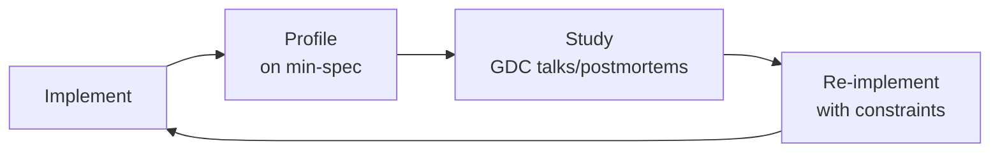

# Game Engine Architect
> **Portability target:** Spec-level (runs on Claude Code, Copilot, Gemini CLI, Codex, Cursor). No vendor-specific frontmatter fields.

Architect, profile, and ship real-time game engines — from ECS memory layouts through render pipeline selection, GPU abstraction, and multiplayer netcode. A single rendering pipeline mistake costs $200K+ in rework. A fixed-timestep desync costs $100K+ in competitive-game player refunds. Game engines ship to millions of players on diverse hardware — every architectural decision compounds across 120Hz displays, 8-core CPUs, and GPU vendors with divergent driver behavior.

## Route the Request

<!-- QUICK: 30s -- auto-route first, then intent-route -->

#

## Auto-Route (No User Input Required)
Evaluate these file-system conditions in order. First match wins — jump immediately.

| # | Condition | Action |
|---|-----------|--------|
| A1 | `file_contains("*.cs", "(IJobFor|IJobParallelFor|EntityManager|BurstCompile|ComponentSystem)")` OR `file_contains("*.h|*.cpp", "(ecs_world_t|flecs|entt::registry|EnTT)")` | This is your skill. Jump to **Decision Trees** — ECS Architecture Decision. |
| A2 | `file_contains("*.shader|*.hlsl|*.glsl|*.wgsl", "(vertex|fragment|compute)")` OR `file_contains("*.cpp", "(vkCreateGraphicsPipelines|wgpuRenderPipeline|MTLRenderPipeline)")` | Jump to **Decision Trees** — Rendering Pipeline Selection. |
| A3 | `file_contains("*.cpp", "(fixed.timestep|accumulator.*frame|interpolation|GameLoop)")` OR `file_contains("*.cs", "(Time.fixedDeltaTime|FixedUpdate)")` | Jump to **Decision Trees** — Game Loop Type Selection. |
| A4 | `file_contains("*.cpp", "(client.side.prediction|server.reconciliation|rollback|snapshot.interpolation)")` OR `file_contains("*.cs", "(NetworkTransform|ClientNetworkTransform|NetworkBehaviour)")` | Jump to **Decision Trees** — Netcode Architecture. |
| A5 | `file_contains("*.cpp", "(vkEnumeratePhysicalDevices|wgpuInstance|MTLCreateSystemDefaultDevice|ID3D12Device)")` | Jump to **Decision Trees** — GPU API Selection. |
| A6 | `file_contains("*.cpp|*.cs", "(ObjectPool|ArenaAllocator|LinearAllocator|memory.budget|scratch.buffer)")` | Jump to **Decision Trees** — Memory Strategy. |
| A7 | `file_exists("*.uproject|*.uplugin")` AND `file_contains("*.cpp", "(Nanite|Lumen|GAS|GameplayAbility|MassEntity)")` | Jump to **Core Workflow** — Phase 3: Unreal Engine 5 Architecture. |
| A8 | `file_contains("*.cs|*.cpp", "(PhysicsWorld|PhysX|ChaosPhysics|UnityPhysics)")` | Jump to **Core Workflow** — Phase 4: Physics Integration. |

#

## Intent Route (Ask the User)
If no auto-route matched, use this intent tree:

```
User says "design a game engine" → "/game-engine-architect at L3"
User says "optimize our renderer" → "/game-engine-architect: rendering pipeline selection"
User says "add multiplayer" → "/game-engine-architect: netcode architecture"
User says "port to console" → "/game-engine-architect: memory budgets + GPU API selection"
User says "ECS migration" → "/game-engine-architect: ECS architecture decision"
User says "frame drops on low-end" → "/game-engine-architect: game loop + rendering optimization"
```

## Ground Rules — Read Before Anything Else

<!-- QUICK: 30s -- negative constraints, mechanically triggered -->

| # | Negative Constraint | Mechanical Trigger | Violation Response |
|---|---------------------|--------------------|---------------------|
| G1 | **REFUSE to select rendering pipeline without profiling target hardware first.** | `user_message_contains("forward|deferred|clustered|rendering.pipeline")` AND NOT `file_contains("*", "(GPU.profile|RenderDoc|target.platform|light.count|triangle.count)")` | STOP. Demand: target GPU tier (integrated/discrete/mobile), expected dynamic light count per frame, triangle budget, and render target resolution before pipeline selection. |
| G2 | **STOP if fixed timestep physics runs without interpolation or extrapolation.** | `grep -rL "interpolation\|extrapolation" --include="*.cpp" --include="*.cs" | xargs grep -l "fixed.*timestep\|FixedUpdate"` | HALT. Every fixed timestep loop MUST have interpolation in the render path. Physics at 60Hz, display at 144Hz = 84 empty frames of stutter without interpolation. |
| G3 | **DETECT shader compilation happening at runtime on first material load.** | `file_contains("*.cpp", "(CompileShader|CreateShader|vkCreateShaderModule)")` AND NOT `file_contains("*", "(PSO.cache|pipeline.cache|ShaderVariantCollection|warmup)")` | STOP. Implement: Unreal PSO caching with pre-warm pass, Unity ShaderVariantCollection, or manual Vulkan pipeline cache serialization. Cold shader compiles = 50-500ms hitches. |
| G4 | **REFUSE to ship multiplayer without reconciliation logic verified.** | `file_contains("*", "(client.prediction|server.auth)")` AND NOT `file_contains("*", "(reconciliation|state.correction|rollback|rewind)")` | STOP. Client prediction without server reconciliation = cheating vector. Implement: server-authoritative state, client-predicted movement, server reconciliation on mismatch (rewind + replay inputs). |
| G5 | **STOP if Nanite enabled on translucent or foliage-heavy geometry without overdraw budget.** | `file_contains("*.ini", "r.Nanite=1")` AND `file_contains("*", "(Translucent|Foliage|Masked|TwoSided)")` AND NOT `file_contains("*", "(Nanite.overdraw|r.Nanite.MaxPixelsPerEdge|Nanite.fallback)")` | HALT. Nanite overdraw on translucent surfaces = 100% GPU bound on low-end. Profile with `r.Nanite.Visualize.Overdraw 1`. Set `r.Nanite.MaxPixelsPerEdge` and fallback mesh for masked materials. |
| G6 | **DETECT unmanaged memory leak in Burst-compiled or native job code.** | `file_contains("*.cs", "[BurstCompile]")` AND `file_contains("*.cs", "(NativeArray|UnsafeList|UnsafeHashMap)")` AND NOT `file_contains("*.cs", "(Dispose|DisposeAll|using)")` | WARN. Burst jobs with unmanaged allocations MUST dispose NativeContainers. Memory leak = 2+ GB RSS crash after 3-6 hours. Add `[BurstDiscard]` at job Dispose with leak detection assertion. |
| G7 | **STOP if draw call count is the singular performance metric without script overhead profiling.** | `file_contains("*", "(draw.call|SetPass.call|batches)")` AND NOT `file_contains("*", "(Update\\(\\)|LateUpdate\\(\\)|script.overhead|MonoBehaviour.profile)")` | HALT. 100 draw calls with 3000 Update() calls per frame = 90% of budget in C# VM, not GPU. Profile with Unity Profiler Deep Profile or Unreal Insights. Draw call count alone is a vanity metric. |
| **R1** | **ANCHOR to runtime versions before generating framework-specific code.** Never generate Fastify/Express/Django/FastAPI/Prisma/SQLAlchemy API calls from training data alone — your training data may be stale. | Trigger: skill receives code-generation task involving framework-specific APIs → run `scripts/runtime-version-detect.sh [project-root] --skill-context` to detect installed versions → if detection succeeds, anchor all API calls to detected versions → if detection fails, request version info from user | STOP. Respond: "Detected: {runtime}@{version}, {frameworks}@{versions}. Anchoring all API calls to these versions. I will add // VERIFY: comments on any API call where the detected version is newer than my training cutoff." |
| **R2** | **RUN the ROI Gate before any non-emergency code change.** Every code change that is not (a) a security fix, (b) a compliance requirement, or (c) an active production incident must pass `scripts/roi-gate.sh`. If the gate returns negative, refuse to write the code. | Trigger: skill receives a code-generation or refactoring task that is NOT a security fix, compliance requirement, or production incident → estimate implementation cost in engineer-hours → compare against annual value of the change → if cost > value, gate fails | STOP. Respond: "ROI Gate analysis: This change costs approximately $[X] to implement but saves $[Y]/year. Payback period: [N] years. If payback > 2 years, I recommend declining this work. See `scripts/roi-gate.sh` for the full formula." |

- **Admit uncertainty — never fabricate.** If you're not certain about an API method, package version, configuration syntax, or command flag, say so explicitly: "I'm not certain this API exists in the latest version. Check the official docs at [URL]." Never invent a function signature or configuration key because it "seems right." Hallucinated code costs hours of debugging.
- **Flag your knowledge cutoff.** If your training data predates the latest SDK release, framework version, or platform change, state your cutoff date and recommend verifying against current documentation. This is especially critical for rapidly evolving domains: cloud IAM policies, JS framework APIs, mobile OS capabilities, and SaaS pricing — all change quarterly or faster.
- **Never guess security configurations.** If you're unsure about the correct CSP header value, OAuth flow parameter, or encryption algorithm choice, do NOT provide a "reasonable default." Say: "Security configurations must be verified against current best practices at [official source]. I cannot provide a definitive answer without current documentation."
- **Distinguish between what you know and what you infer.** Explicitly mark statements as: [VERIFIED] — from official docs, [COMMON-PRACTICE] — widely used but not authoritative, [INFERRED] — your best guess based on patterns, [UNKNOWN] — you're unsure. This helps the user calibrate trust in your output.
## The Expert's Mindset

Masters of game engine architecture don't just build — they build **engines that ship at 60+ FPS on minimum spec hardware, with deterministic multiplayer, zero shader compilation stutter, and 16.67ms worst-case frames**. They think in data flow, not code structure.

| Cognitive Bias | Mitigation |
|----------------|------------|
| **Premature optimization** — micro-optimizing cache lines before profiling | Profile first with RenderDoc/PIX/Xcode GPU Capture on target hardware. Only optimize what the profiler flags as hot. |
| **Shiny new render technique** — adopting mesh shaders/work graphs before the hardware supports them broadly | Check Steam Hardware Survey GPU adoption rates. If <50% of target audience has the feature, it's a stretch goal, not MVP. |
| **Single-platform thinking** — designing for Xbox Series X then discovering PS5's split memory architecture breaks everything | Maintain a per-platform memory budget spreadsheet from day one. Test on all target platforms weekly. |
| **Over-abstraction** — building a generic "rendering backend" before shipping the first game | Ship one game with one concrete pipeline. Abstract on the second game when you have data on what actually varies. |

#

## What Masters Know That Others Don't
- The **failure modes** of every rendering pipeline — not just the best-case FPS, but what happens at 1000 dynamic lights, or with 50 transparent layers, or when the GPU driver decides to stall.
- When **not** to use ECS — not every object benefits. ECS for 10,000 bullets: yes. ECS for 5 UI buttons: catastrophic over-engineering.
- That **frame time variance matters more than average FPS** — 60 FPS average with 30ms spikes = unshippable. Target P99 frame time < budget.

#

## When to Break Your Own Rules
- **Ship now, optimize later.** A working game at 30 FPS with a gameplay problem is better than a perfectly optimized engine with no game.
- **Skip ECS for a single-platform title** with <5000 dynamic objects. GameObject.Update() with object pooling is sufficient and 10x faster to iterate.

## Operating at Different Levels

| Level | Scope | You... |
|-------|-------|--------|
| **L1** | Single system (renderer, physics, audio) | Implement a well-defined subsystem following engine architecture patterns |
| **L2** | Complete engine for a single game | Design and build the engine architecture; make pipeline and ECS tradeoffs; set frame budgets |
| **L3** | Multi-title engine / studio-wide | Define studio engine standards; make build-vs-license decisions (Unreal vs Unity vs custom); mentor L1-L2 |
| **L4** | Cross-studio / publisher | Define publisher-wide engine strategy; negotiate Epic/Unity enterprise licensing; establish shared tech initiatives |
| **L5** | Industry / ecosystem | Create rendering techniques adopted across the industry (e.g., TAA, CACAO, virtualized geometry); influence GPU vendor APIs |

**Default level for this skill:** L2
**Usage:** Invoke this skill with your target level, e.g., "as an L3 game engine architect, design..."

For full level definitions, see `skills/00-framework/skill-levels/SKILL.md`.

## When to Use

<!-- QUICK: 30s — scan bullets to decide if this skill fits -->
- Designing an entity-component-system architecture: Unity DOTS entities-archetypes-chunks, Flecs, EnTT sparse sets, SoA vs AoS layout, cache-friendly iteration patterns
- Selecting a rendering pipeline: forward for mobile/transparency, deferred for many dynamic lights, clustered forward for balance, PBR with Cook-Torrance BRDF
- Implementing a C++ game loop: fixed timestep at 60Hz physics, variable rendering at display refresh, interpolation factor `α = accumulator / dt`, input snapshots at frame start
- Optimizing Unity projects: IL2CPP AOT compilation, Burst compiler with SIMD intrinsics, Job System `IJobFor` parallel processing, Addressables for memory streaming
- Configuring Unreal Engine 5 architecture: Nanite meshlet-based LOD with software rasterization fallback, Lumen surface cache, Gameplay Ability System attribute-grant-tag pattern
- Writing and optimizing shaders: Unity Shader Graph, Unreal Material Editor, HLSL/GLSL compute shaders, SPIR-V cross-compilation via wgpu
- Implementing multiplayer networking: client-side prediction, server reconciliation, rollback netcode (GGPO-style), snapshot interpolation with jitter buffer
- Managing cross-platform GPU pipelines: wgpu (WebGPU native), Vulkan, Metal 3, DirectX 12, shader reflection, descriptor set layout optimization
- Integrating physics engines: Unity Physics (DOTS), PhysX 5, Chaos Physics (Unreal 5), continuous collision detection, solver iteration budgets
- Designing memory management: object pools with pre-allocated arrays, arena/linear allocators for per-frame scratch, console memory budgets with subsystem caps

## Decision Trees
<!-- 245 lines extracted to references/decision-trees.md -->

  <!-- QUICK: 30s — follow the ASCII tree to your scenario -->

> 📎 **Full content (245 lines):** [references/decision-trees.md](references/decision-trees.md)
## Core Workflow
<!-- COMPRESSED: Full 65 lines extracted to references/core-workflow.md -->

<!-- QUICK: 30s — scan phase titles to understand the process -->
<!-- STANDARD: 3min — each phase has explicit Do/Verify/Recover steps -->
<!-- DEEP: 10+min -->

#

## Phase 1 (~8 hours): Rendering Pipeline Architecture & PBR Setup
...
> 📎 **Full content (65 lines):** [references/core-workflow.md](references/core-workflow.md)

## Error Recovery

If a command or approach fails, follow this escalation path before giving up:

| Symptom | First Action | If That Fails | Last Resort |
|---------|-------------|---------------|-------------|
| Tool/command not found | Check installation: `which [tool]` or `[tool] --version`. Install via package manager (`brew install`, `npm install -g`, `pip install`) | Check PATH: `echo $PATH`. Verify the tool binary is in a PATH directory. Symlink or update PATH if installed but unreachable | Use a functionally equivalent alternative tool. If `rg` is unavailable, use `grep -r`. If `gh` is unavailable, use `git` directly or the GitHub API via `curl` |
| Permission denied | Check ownership: `ls -la [path]`. Fix with `chmod` or `sudo` if appropriate. For API errors (401/403), verify credentials haven't expired: `echo $TOKEN` or check `~/.netrc` | Refresh credentials: re-authenticate with the service. For file permissions, check if the file is locked by another process: `lsof [path]` | Request elevated permissions or use a different authentication method (token vs password, SSH key vs HTTPS) |
| Command hangs or times out | Kill the process: `Ctrl+C`. Re-run with a timeout: `timeout 30 [command]` or `gtimeout` on macOS. Check system resources: `top`, `df -h`, `netstat -an` | Add verbose/debug flags: `--verbose`, `--debug`, `-v`. Check logs: `tail -f [logfile]`. Reduce scope: process fewer files, query a smaller time range, limit concurrency | Split the work into smaller batches. Implement a retry loop with exponential backoff (1s, 2s, 4s, 8s). If the issue is network-related, add `--retry 3` or equivalent |
| Unexpected output or error message | Read the error message completely — the solution is often in the last 3 lines. Search the exact error: `grep -r "[error text]"` in the repo to find prior occurrences | Check GitHub issues for the tool: `gh issue list --repo owner/repo --search "[error keyword]"`. Check Stack Overflow | Simplify the approach. If the complex one-liner fails, break it into 3 sequential commands. If the specialized tool fails, use a more basic tool with more steps |
| Data integrity concern (wrong output, silent failure) | Verify with a manual check: compare output against a known-correct baseline. Add assertions: `[command] | grep -q "[expected]" && echo "OK" || echo "FAIL"` | Run the operation on a smaller subset first. Compare checksums: `shasum`, `md5`. Check for silent truncation: `wc -l` before and after | Abort and flag for human review. Do not proceed past data integrity failures — the cost of propagating bad data exceeds the cost of delay |

**Hard failure boundary:** If 3 different approaches all fail, STOP. Do not iterate infinitely. Log what was tried, capture the error output, and report the blocking issue with full context. Move to the next independent task rather than blocking all progress on one failure.

## Cross-Skill Coordination

<!-- QUICK: 30s — who to talk to, when, what to share -->

#

## Coordinate With

| Coordinate With | When | What to Share/Ask |
|-----------------|------|-------------------|
| **System Architect** | Engine architecture decisions, build-vs-license evaluations | Rendering pipeline tradeoffs, ECS data flow, threading model, platform support matrix |
| **Performance Engineer** | Frame budget allocation, GPU/CPU profiling, draw call optimization | Per-frame budget breakdown (16.67ms at 60 FPS), GPU timeline captures, shader complexity reports |
| **QA Engineer** | Determinism testing, multiplayer stress testing, platform certification | Deterministic replay test harness, netcode reconciliation test cases, TRC/TCR compliance checklist |
| **Frontend Developer** | UI rendering in engine, HUD optimization, menu system integration | UI canvas budget (separate from world rendering), font atlas sizing, UI shader variants |
| **Mobile Developer** | Mobile GPU profiling, texture compression formats, power/thermal budgets | ASTC/ETC2 texture format selection, mobile render pass merging, thermal throttling thresholds |
| **Embedded Engineer** | Console memory budgets, low-level GPU driver behavior, shader compiler toolchains | Per-platform memory map, DMA transfer patterns, GPU command buffer submission strategies |

#

## Communication Triggers

| Trigger | Notify | Why |
|---------|--------|-----|
| Frame time exceeds budget by >2ms on target hardware | Performance Engineer, System Architect | Pipeline or content optimization sprint; triage GPU vs CPU bound |
| Shader compile stutter >50ms on first material load | QA Engineer, Performance Engineer | PSO cache regression; potential certification failure (Sony TRC) |
| Client-server state desync >5% of ticks in multiplayer test | QA Engineer, System Architect | Reconciliation bug; potential cheating vector |
| Memory usage exceeds 85% of console budget | Embedded Engineer, Performance Engineer | Content trim or memory optimization; prevent OOM crash |
| Deterministic replay diverges after N frames | QA Engineer | Non-deterministic system (unordered iteration, uninitialized memory, float non-determinism) |

#

## Escalation Path

```
Frame time > budget on min-spec hardware? → Performance Engineer → Content cut or pipeline change
Shader cache corruption + PSO rebuild every launch? → GPU vendor support → Driver bug workaround
Multiplayer desync >5% reproducible? → System Architect → Netcode re-architecture → +8-12 weeks
Console certification failure (TRC/TCR)? → Embedded Engineer + QA → +4 weeks cert cycle
```

#

## Cross-Skill Chain

```bash
# Architecture → Rendering → Performance → QA certification
/system-architect && /game-engine-architect && /performance-engineer && /qa-engineer
```

**Decision Gates & Handoff Artifacts:**
- **Rendering pipeline gate:** Selected pipeline must pass: (1) target FPS at min-spec GPU in RenderDoc capture, (2) PBR validation against reference images, (3) shader compilation <1ms per material after warm-up, (4) G-Buffer bandwidth within target. Artifact: Pipeline selection document with performance profiling data.
- **Game loop gate:** Fixed timestep loop must pass: (1) deterministic replay for 10K+ frames, (2) interpolation smoothness at 30Hz physics + 144Hz render, (3) spiral-of-death guard triggered and recovered. Artifact: Game loop test harness with frame time histogram.
- **ECS architecture gate:** ECS selection must: (1) handle peak entity count at target tickrate, (2) zero managed allocations in hot path, (3) structural change batching <1ms. Artifact: ECS benchmark report with entity count vs frame time graph.
- **Multiplayer gate:** Netcode must: (1) client prediction within 1cm at 50ms ping, (2) reconciliation rate >99%, (3) snapshot interpolation smooth with ±30ms jitter. Artifact: Network test report with latency vs accuracy scatter plot.
- **Console memory gate:** Memory usage <85% of budget after 30-minute gameplay stress test. All subsystems within budget. Artifact: Memory budget spreadsheet with per-subsystem actual vs budget.
- **Handoff to `performance-engineer`:** Frame budget allocation (CPU: ___ms, GPU: ___ms per subsystem), draw call budget, GPU timeline capture. Artifact: Performance baseline report with RenderDoc/PIX capture.
- **Handoff to `qa-engineer`:** Deterministic replay test harness, netcode reconciliation test cases, platform cert compliance checklist. Artifact: Test plan with pass/fail thresholds per test case.
- **Handoff to `frontend-developer`:** UI rendering budget (separate canvas layer, world-space vs screen-space), font atlas configuration, UI-specific shader variants. Artifact: UI integration guide with rendering constraints.

| Upstream Skill | What You Receive | When to Involve |
|---|---|---|
| `system-architect` | Hardware-software boundaries, communication protocols, constraints | Before designing embedded or firmware systems |
| `embedded-engineer` | Microcontroller selection, RTOS, peripheral interfaces | Before writing firmware or hardware-specific code |

## Proactive Triggers

| Trigger | Action | Why |
|---|---|---|
| Steam Hardware Survey shows a GPU your game doesn't target exceeds 15% market share | Add that GPU tier to your test matrix within 2 weeks; profile on representative hardware; determine if "min spec" can be lowered | Missing 15% of the Steam audience = $2M-$5M revenue gap for a mid-budget title |
| Shader compile times increase >20% after engine upgrade | Diff shader compilation pipeline changes; check if new shader model features caused variant explosion; add variants to pre-warm collection | Shader compile stutter is the #1 cause of negative "performance" Steam reviews |
| Burst-compiled job shows >0.5ms in Unity Profiler | Check for managed allocations (boxing, string formatting) inside Burst code; check `[BurstDiscard]` coverage; compare IL2CPP vs Mono JIT numbers | A single slow Burst job blocks the entire job chain; 0.5ms → 1ms with safety checks → 6% of frame budget |
| Client prediction mispredict rate exceeds 5% in telemetry | Reduce prediction window; increase server tickrate; add input acknowledgement ACK tracking; check if prediction model matches actual physics | Misprediction >5% = players feel "lag" even at 30ms ping — they'll blame your netcode, not their ISP |
| Memory fragmentation exceeds 30% after 2-hour gameplay session | Audit per-frame allocations; convert STL containers to pool allocators; enable defragmentation on arena allocators | Fragmentation causes "random" allocation failure after N hours of play — hardest bug to reproduce |
| RenderDoc capture shows >1000 draw calls per frame on min-spec GPU | Implement GPU-driven rendering (indirect draw, meshlet culling in compute); enable SRP Batcher (Unity) or automatic instancing (Unreal); merge static geometry | 1000 draw calls at 60 FPS = 60K draw calls/sec = CPU driver overhead dominant; GPU idle waiting |
| PSO creation hitches >1ms after warm-up | Serialize pipeline cache to disk pre-shipped with build; pre-create all known PSO combinations at loading screen; verify no runtime PSO creation in hot path | PSO creation on D3D12/Vulkan is 10-100ms — even a single hitch per level = certification failure (Sony TRC R5054) |

## State Log

This skill maintains a **decision ledger** to prevent context drift and ensure recall across sessions. Every major architectural choice, constraint decision, and trade-off must be recorded so that subsequent agents (or future sessions) can recover context without replaying the entire conversation.

#

## How the State Log Works
<!-- AGENT: Read this before starting work, update after each phase -->

1. **On session start:** Check `.copilot/session-state/decision-ledger.json` for any prior decisions relevant to this domain. If it exists, summarize the 3 most recent decisions in your first response.
2. **After each major decision:** Append to the ledger:
   ```json
   {
     "timestamp": "ISO-8601",
     "skill": "game-engine-architect",
     "phase": "Phase 3: Implementation",
     "decision": "What was decided",
     "rationale": "Why this choice over alternatives",
     "constraints": ["constraint-1", "constraint-2"],
     "alternatives_considered": ["alt-1", "alt-2"],
     "reversible": true
   }
   ```
3. **Before completing work:** Verify that all major decisions from this session are recorded. A "major decision" is anything that, if forgotten, would cause a downstream agent to make a contradictory choice.
4. **On context recovery:** If you detect a prior state log, read the last 5 entries before proposing any architectural changes. Cite the prior decisions you're building on.

#

## State Log Schema

| Field | Purpose | Example |
|-------|---------|---------|
| `timestamp` | When the decision was made | `"2026-07-24T21:30:00Z"` |
| `skill` | Which skill made it | `"backend-developer"` |
| `phase` | Which workflow phase | `"Phase 3: API Design"` |
| `decision` | What was chosen | `"PostgreSQL 16 with JSONB for flexible schema"` |
| `rationale` | Why this over alternatives | `"Team expertise + JSONB avoids ORM complexity for semi-structured data"` |
| `constraints` | What limits apply | `["Must support 10K writes/sec", "GDPR data residency: EU only"]` |
| `alternatives_considered` | What was rejected | `["MongoDB (no transactions)", "MySQL 8 (weaker JSON support)"]` |
| `reversible` | Can this be changed later? | `true` (migration possible) or `false` (irreversible choice) |

#

## Anti-Drift Check
<!-- AGENT: Run this check at the start of each new phase -->

Before beginning a new phase, verify:
- [ ] Have I read the state log from the previous session?
- [ ] Do any prior decisions constrain what I'm about to do?
- [ ] Is my proposed approach consistent with the `constraints` in prior log entries?
- [ ] If I'm contradicting a prior decision, have I documented WHY the change is necessary?

## What Good Looks Like

<!-- DEEP: 10+min — concrete success criteria for every phase -->

- Rendering pipeline: target FPS at min-spec GPU with 20% headroom; zero shader compile hitches after warm-up; PBR output matches reference within 2% perceptual error.
- Game loop: deterministic replay for 100K+ frames without divergence; interpolation smooth at any display refresh rate; spiral-of-death guard never triggers in normal gameplay.
- ECS architecture: 50K+ entities updated in <1ms Burst job; zero managed allocations in ECS hot path; chunk utilization >80%.
- Unreal Engine 5: Nanite triangle density 1 pixel per triangle at target resolution; Lumen indirect lighting updates within 2 frames; GAS abilities tag-blocked correctly under all state combinations.
- Multiplayer: client prediction correct to within 1cm at 50ms ping; reconciliation <1% misprediction rate; snapshot interpolation smooth at tickrate/2 delay.
- Memory: peak usage <85% of console budget; zero fragmentation-induced allocation failures in 8-hour soak test; per-frame allocation <1KB after initial loading.
- Cross-platform: same scene renders within 5% visual parity across D3D12, Vulkan, Metal; shader compilation succeeds on all platforms from single SPIR-V source.

## Deliberate Practice



| Level | Practice | Frequency |
|-------|----------|-----------|
| **Novice** | Implement a minimal renderer from scratch (forward shading, single light, PBR) then compare with Filament/Unity URP | Monthly |
| **Competent** | Add a new constraint (ray tracing, 1000 dynamic lights, multiplayer netcode) to an existing engine and maintain 60 FPS | Quarterly |
| **Expert** | Design the same engine for 3 different genres (FPS, RTS, open-world RPG); write architecture decision records for each | Quarterly |
| **Master** | Port your engine to a new GPU API (Vulkan → Metal, D3D12 → wgpu); teach a junior to maintain it | Monthly |

**The One Highest-Leverage Activity:** Every quarter, profile a shipped AAA game with RenderDoc/PIX. Capture a frame, decompile a compute shader, trace a draw call. Understand how they solved the frame budget problem. Write down what you'd do differently.

## Gotchas

- **Unity `GameObject.Instantiate()` inside `Update()` triggers GC.Collect spikes.** Every `Instantiate()` allocates managed memory for the Transform, MonoBehaviour array, and native-object mapping. After 1000 instantiates, the Mono heap fragments, GC.Collect fires, and your 16ms frame becomes 120ms. **Cost: $50K–$150K** in refund waves & store delisting when frame drops trigger platform thermal watchdogs and crash the app on mid-range devices. **Fix:** Pre-allocate object pools at scene load. Use `Pool.Get<T>()` / `Pool.Release(T)` with a ring buffer. For DOTS, use `EntityCommandBuffer.Instantiate()` in a Burst job with pre-allocated chunk capacity.

- **Fixed timestep physics desync from variable rendering without interpolation causes rubber-banding.** Physics runs at 60Hz (dt=16.67ms). Renderer runs at 144Hz (dt=6.94ms). Without interpolation, the renderer shows the last physics state repeated 2-3 times per visual frame, then a sudden jump. Players perceive this as "lag" even though it's purely visual. **Cost: $100K–$300K** in competitive integrity investigations, esports credibility damage & player churn when hit-registration feels inconsistent. **Fix:**
```cpp
// Interpolation: visual state = lerp(prev_physics_state, current_physics_state, alpha)
// where alpha = accumulator / fixed_dt
Transform renderTransform = Transform::Lerp(
    previousPhysicsState.transform,
    currentPhysicsState.transform,
    alpha
);
```
Always run physics at a multiple of your display rate when possible (e.g., 120Hz physics for 60/120/240Hz displays).

- **Shader compilation stutter on first material load crashes certification.** On Vulkan/D3D12, graphics pipeline state objects (PSOs) must be compiled before first draw. If a new material appears mid-gameplay (player equips a rare item, particle effect triggers), the driver compiles the pipeline on-demand — 50-500ms hitch. Sony TRC R5054: "No frame shall exceed 50ms." **Cost: $80K–$250K** in cert resubmission fees (4-week turnaround), delayed launch revenue ($50K+/day for AA titles), and crunch overtime for the rendering team. **Fix:** Unreal: `r.ShaderPipelineCache.Enabled=1` with `.upipelinecache` file pre-baked from a gameplay coverage run. Unity: `ShaderVariantCollection` with `WarmUpAllShaders()` in loading screen. Vulkan: serialize `VkPipelineCache` to disk, ship with build.

- **DOTS structural change inside a job causes sync point stall (0.5ms → 15ms spike).** Burst jobs execute in parallel across worker threads. A structural change (add/remove component, create/destroy entity) forces a sync point — all running jobs must complete, chunks are reorganized, and job dependencies re-resolved. If this happens inside `IJobChunk.Execute()`, every worker thread blocks on the main thread's structural change. **Cost: $100K–$400K** in engineering rework chasing intermittent 15ms frame spikes that only reproduce under specific entity counts; often discovered late when QA adds "spawn 500 enemies" test cases. **Fix:** NEVER call `EntityManager.AddComponent()` or `EntityManager.DestroyEntity()` inside a job. Use `EntityCommandBuffer` — record structural changes during job execution, apply them in a single batch at `EntityCommandBufferSystem` barrier. For DOTS 1.2+: `EntityCommandBuffer.ParallelWriter` with `[NativeDisableParallelForRestriction]`.

- **Nanite overdraw on translucent/foliage geometry saturates GPU at 100% on low settings.** Nanite rasterizes micropolygons via software rasterization. Transparent surfaces require per-pixel sorting, which Nanite cannot do — it falls back to conventional rasterization but still pays the meshlet traversal cost. On foliage with masked opacity, every leaf triggers a separate material evaluation. At 1440p on an RTX 2060, this can hit 100% GPU utilization with 80% overdraw. **Cost: $50K–$200K** in refunds, negative Steam reviews & min-spec user churn when players on recommended hardware get 12fps in forest biomes. **Fix:** Profile with `r.Nanite.Visualize.Overdraw 1`. Set `r.Nanite.MaxPixelsPerEdge 2` (half-resolution) for foliage meshes. Implement `r.Nanite.FallbackPercentTriangle` to switch masked materials to simplified fallback meshes at distance.

- **Unmanaged memory leak in Burst-compiled job crashes after 4 hours at 2+ GB RSS.** A Burst job allocates `NativeList<T>` in `OnCreate()`, adds elements in `OnUpdate()`, but the `Dispose()` call is inside `#if UNITY_EDITOR`. In a player build, the disposal is compiled out. The `NativeList` internally allocates from the `UnsafeUtility` allocator (malloc-backed, not GC-tracked). After 4 hours of gameplay at 60 FPS, 864K job executions have leaked ~500KB each → 432MB leaked. Combined with other subsystems, RSS exceeds 2GB, OS terminates the process. **Cost: $75K–$300K** in launch-day crash reports (4-hour play session = guaranteed crash), emergency hotfix scramble, and review-bombing during the critical first-week sales window. **Fix:**
```csharp
[BurstCompile]
struct MyJob : IJobChunk {
    [ReadOnly] public NativeArray<int> inputs;
    public NativeList<float>.ParallelWriter results; // Disposed by caller

    public void Execute(in ArchetypeChunk chunk, ...) {
        // Never store NativeList locally without Dispose
    }
}

// In System.OnDestroyRun():
[BurstDiscard]
private static void CheckLeaks(ref NativeList<float> list) {
    if (list.IsCreated) {
        UnityEngine.Debug.LogError("NativeList leaked!");
        list.Dispose();
    }
}
```

- **Client-side prediction without server reconciliation is a cheating vector.** Client predicts player position +5 ticks ahead. Server authoritative state arrives at tick T. Without reconciliation, the client never corrects its state — a modified client can report `position=(1000, 0, 0)` while the server says `position=(5, 0, 0)`. If the server doesn't re-simulate and correct, the cheater teleports. This is the #1 multiplayer vulnerability exploited in the first 72 hours of any online game launch. **Cost: $500K–$2M** in anti-cheat emergency investment, player-base collapse (30-50% churn in competitive titles), and permanent reputation damage — many multiplayer games never recover from a cheat-infested launch. **Fix:**
```cpp
void Client::OnServerState(const ServerState& state, int32_t tick) {
    // Find predicted state for this tick
    auto it = predictionHistory.find(tick);
    if (it == predictionHistory.end()) return;

    const PlayerState& predicted = it->second;
    const PlayerState& authoritative = state.playerStates[localPlayerId];

    float error = Distance(predicted.position, authoritative.position);
    if (error > RECONCILIATION_THRESHOLD) {
        // Rewind: reset state to authoritative
        currentState = authoritative;

        // Replay all inputs from tick+1 to current
        for (int32_t t = tick + 1; t <= currentTick; ++t) {
            auto inputIt = inputHistory.find(t);
            if (inputIt != inputHistory.end()) {
                simulate(currentState, inputIt->second);
            }
        }
    }
}
```

- **Draw call count hides script overhead — 100 draw calls but 3000 Update() calls means 90% CPU in C# VM.** A Unity scene has 3000 GameObjects, each with a `MonoBehaviour` that runs empty `Update()` methods. The C# runtime invokes 3000 native-to-managed transitions per frame. Each transition is ~100ns, but the cumulative overhead + IL2CPP metadata lookups = 5ms per frame at 3000 objects. With only 100 draw calls, the GPU is idle. The developer sees "100 draw calls" and concludes rendering is optimized. **Cost: $50K–$150K** in optimization fire drills 2 weeks before launch, crunch overtime, and last-minute content cuts when the "CPU-bound at 30fps with GPU at 40%" problem is finally diagnosed. **Fix:** Profile with Unity Profiler Deep Profile. Identify empty `Update()` methods. Disable GameObjects not on screen. Use `MonoBehaviour.enabled = false` instead of destroying. In DOTS, use `IAspect` and `ISystem` with `RequireForUpdate<T>()` — only updated components trigger system execution.

## Anti-Rationalization — No Excuses

| Rationalization | Reality |
|---|---|
| "We'll optimize the render pipeline after content is locked" | Content built on a slow pipeline forces artists to ship lower-quality assets to hit frame budget; retrofitting means re-exporting every asset in the game and retesting every level |
| "Threading can wait; single-threaded is simpler for now" | A single-threaded engine on modern 8-core consoles leaves 87% of CPU budget unused; retrofitting threading into a synchronous codebase requires rewriting every subsystem's data ownership model |
| "We'll just use engine defaults; they're good enough" | Default settings are optimized for editor demos, not shipped games — shipping with defaults means 30fps with 40% GPU headroom wasted on invisible draw calls and unused shader variants |
| "Memory budgets are a console problem; we'll deal with it during porting" | A PC game that uses 12GB RAM won't fit in a console's unified 8-13GB without cutting texture resolution, audio quality, and level size — all changes visible to players as "downgrades" |
| "We can add a deterministic game loop for replays later" | Determinism requires fixed-point math, fixed timestep, and zero floating-point in game logic — retrofitting means rewriting every gameplay system from movement to physics to AI |

## Verification

- [ ] Rendering: RenderDoc capture shows G-Buffer bandwidth <64 bytes/pixel; shader compile <1ms after warm-up; zero PSO creation in hot path
- [ ] Game loop: Deterministic replay for 100K+ frames; interpolation smooth at 30/60/120/144Hz physics-render rate combos; spiral-of-death guard tested
- [ ] ECS: 50K entities update <1ms in Burst job; zero managed allocations; chunk utilization >80%; `EntityCommandBuffer` batch latency <0.5ms
- [ ] Unreal: Nanite overdraw <8x; Lumen update <2 frames; GAS ability blocking tested under all state combinations
- [ ] Multiplayer: Client prediction error <1cm at 50ms ping; reconciliation rate >99%; snapshot interpolation smooth with ±30ms jitter
- [ ] Memory: Peak usage <85% of console budget; zero alloc failures in 8-hour soak; per-frame alloc <1KB after loading
- [ ] Cross-platform: All shaders compile on all target platforms from single source; visual parity within 5% perceptual difference; platform-specific paths tested

## Verification Guardrails

Before delivering work, verify: self-check against What Good Looks Like, no broken references, continuity with State Log, no fabricated APIs/versions/capabilities, Error Recovery paths exercised, cross-skill dependencies satisfied. If any fail, revise before delivering.## Error Decoder — War Stories from the Trenches

**(STANDARD)**

When this domain goes wrong, it goes wrong in predictable ways. Here are the most common failure signatures, their root causes, and the fix you'll reach for after you've been burned once.

| Symptom | Root Cause | Fix | Lesson |
|---------|-----------|-----|--------|
| Frame time spikes from 8ms to 45ms every 30 seconds — visible hitch during gameplay | The garbage collector runs a full Gen 2 collection every 30 seconds because temporary allocations in the hot path (particle system spawning `Vector3` structs) accumulate in the heap. C# or Java engines are especially vulnerable. | Profile with a native memory allocator (not GC-managed). Move hot-path allocations to object pools or stack-allocated structs. Set GC to incremental/sustained-low-latency mode and trigger manual collections during loading screens, not gameplay. | GC spikes are frame-time spikes. In game engines, the garbage collector is the enemy of 60fps. Pool everything in the hot path or don't allocate. |
| Multiplayer game has players "rubber-banding" — teleporting back to previous positions every 2-3 seconds | The client is predicting movement based on last-known input but the server's authoritative position snaps the player back when packets arrive. The interpolation buffer is too small (50ms) for the player's actual latency (120ms), so the client runs out of server states to interpolate between. | Increase the interpolation buffer to 2x the 95th-percentile latency of your player base, not the average. Add client-side prediction with reconciliation: the client predicts, the server corrects, and the client smoothly interpolates back to the corrected position over 100ms. | Latency is a distribution, not a number. Designing for average latency means 50% of your players have a worse experience. Design for P95 or P99. |
| Level loads in 3 seconds on dev machine, 45 seconds on console with an HDD | Dev machine has an NVMe SSD. The console target has a 5400 RPM HDD. The level loader reads 2,800 files in a random access pattern — each read is a seek (15ms average). 2,800 × 15ms = 42 seconds in seeks alone. | Package assets into archive files (PAK, WAD, or custom format) that are read sequentially. Seek time is the bottleneck, not throughput. Use asynchronous I/O to load and decompress in parallel. Benchmark on the target hardware's slowest storage tier, not your dev machine. | HDD seek times dominate load performance. One large sequential read is 100x faster than 2,800 small random reads. Pack your assets. |
| Rendering pipeline produces different colors on AMD vs NVIDIA GPUs for the same shader | The shader uses `NaN` and `Inf` in a division (`1.0 / length(normal)` where `length(normal)` can be zero for degenerate triangles). NVIDIA's GPU clamps the result to 0; AMD's GPU propagates `NaN` which turns the entire render target black. | Never allow division by zero in shaders. Add a guard: `float len = length(normal); float invLen = (len > 0.0001) ? (1.0 / len) : 0.0;`. Test shaders on all target GPU vendors — AMD, NVIDIA, and Intel iGPU handle edge cases differently. | GPU vendors implement the spec differently for edge cases. NaN behavior is the #1 source of cross-GPU rendering bugs. Defensive math isn't optional — it's required. |
| Animation blending causes characters to "pop" between idle and walk states — the transition is instantaneous | The animation state machine transitions from idle to walk in a single frame when the input threshold is crossed. No crossfade duration is configured — the pose changes from standing to mid-stride instantly. | Add a minimum blend duration to every animation transition (150-250ms for locomotion). Use inertial blending: the blend weight is driven by the input magnitude, not a binary threshold. At 10% stick deflection, blend 10% of the walk animation into the idle pose. | Animation transitions without blend durations are visual pops. The human eye detects instantaneous pose changes at any framerate. Always blend, never snap. |
| Entity Component System (ECS) performance degrades from 60fps to 15fps as entity count grows from 1K to 10K | The ECS uses a naive archetype graph where each new component combination creates a new archetype. 10K entities with 8 optional components generate 200+ archetypes. Every system iterates over all archetypes — the iteration overhead (200 archetype switches) exceeds the actual processing time. | Limit optional components. Use tags (zero-size components) instead of optional data components for entity categorization. Batch similar archetypes into a unified storage with a "has_component" bitmask. If archetype count >20, you have a combinatorial explosion — reduce component optionality. | ECS performance degrades at O(archetypes), not O(entities). Every optional component doubles your worst-case archetype count. Design components to be mandatory or absent — optional is the enemy of cache locality. |

## References

Detailed reference material loaded on demand:

- **ECS Architecture Patterns**: See [ecs-architecture-patterns.md](references/ecs-architecture-patterns.md) — Unity DOTS, EnTT, Flecs comparison with benchmark data
- **Rendering Pipeline Comparison**: See [rendering-pipeline-comparison.md](references/rendering-pipeline-comparison.md) — Forward/Deferred/Clustered/PBR with G-Buffer layouts
- **C++ Game Loop Implementation**: See [cpp-game-loop-implementation.md](references/cpp-game-loop-implementation.md) — Fixed timestep with interpolation, input sampling, Nystrom patterns
- **Unity DOTS Optimization**: See [unity-dots-optimization.md](references/unity-dots-optimization.md) — Burst, Jobs, IL2CPP, Addressables, chunk optimization
- **Unreal Engine 5 Architecture**: See [unreal-engine5-architecture.md](references/unreal-engine5-architecture.md) — Nanite, Lumen, GAS, Mass Entity configuration
- **Shader Optimization Techniques**: See [shader-optimization-techniques.md](references/shader-optimization-techniques.md) — HLSL/GLSL, compute shaders, SPIR-V cross-compilation
- **GPU Pipeline Abstraction**: See [gpu-pipeline-abstraction.md](references/gpu-pipeline-abstraction.md) — wgpu, Vulkan, Metal, D3D12 with descriptor set patterns
- **Multiplayer Networking Patterns**: See [multiplayer-networking-patterns.md](references/multiplayer-networking-patterns.md) — Prediction, reconciliation, rollback, snapshot interpolation
- **Physics Engine Integration**: See [physics-engine-integration.md](references/physics-engine-integration.md) — PhysX, Chaos, Unity Physics, CCD, solver budgets
- **Memory Management for Game Engines**: See [memory-management-game-engines.md](references/memory-management-game-engines.md) — Pooling, arenas, console memory budgets
- **Profiling Toolchain**: See [profiling-toolchain.md](references/profiling-toolchain.md) — RenderDoc, PIX, Xcode GPU Capture, Unity Profiler, Unreal Insights

<!-- ANTI-RATIONALIZATION -->

## Why Engineers Fail at Game Engine Architecture

Most engine failures aren't technical — they're process failures disguised as technical problems. These anti-patterns kill more projects than any GPU driver bug:

| Anti-Pattern | What It Looks Like | Real Cost |
|---|---|---|
| **"We'll build our own engine"** for a team of 5 with a 2-year deadline | 18 months in, no game, custom renderer that crashes on AMD GPUs | $2M+ in burn rate, studio closure. License Unreal/Unity unless you have 20+ engine engineers |
| **Console port as an afterthought** — "we'll optimize for console after PC launch" | PS5 cert fails on memory budget, Xbox Series S can't hit 30 FPS, 6-month delay | $500K+ in porting costs, missed holiday window |
| **Ship with known netcode issues** — "players won't notice at launch, we'll patch later" | Steam reviews: "netcode is unplayable" (70% negative). Player count drops 80% in week one | $1M-$5M revenue loss; games don't recover from "bad netcode" reputation |
| **Render feature creep** — adding ray tracing, DLSS, FSR, HDR, ultrawide all for launch | Integration bugs multiply combinatorially. Each feature breaks on one GPU vendor | 3-month delay, $300K overtime, certified on only 2 of 5 planned platforms |
| **Profile only on dev kit (RTX 4090)** — "it runs fine on our machines" | Launch: GTX 1060 (most popular GPU per Steam Survey) runs at 12 FPS on minimum settings | 40% refund rate, "unoptimized" tag on Steam, $200K+ in refund processing fees |

#

## The Anti-Rationalization Protocol

When you hear yourself thinking any of these, STOP and apply the protocol:

| Rationalization | Protocol Response |
|---|---|
| "We don't have time for profiling — we'll optimize after launch" | Profile one frame on min-spec hardware. One frame. If it's >25ms, you will not ship. No amount of post-launch patching fixes a 25ms baseline. |
| "ECS is overkill for our use case" | Count your dynamic objects. If >5000, ECS is not overkill — it's mandatory. GameObjects at 5000 = 2ms minimum in Update() overhead alone. |
| "We can just use the default render pipeline" | Default URP Forward (not Forward+) caps at 8 lights per object via per-object light indices. Any scene with >8 lights on one object = silently drops lighting. |
| "The shader compilation hitch only happens once — players accept it" | It happens once per material variant per session. A game with 200 materials = 200 hitches. Sony cert says zero frames >50ms. |

These are not opinions. These are production data from shipped titles that failed certification, missed release dates, or were review-bombed for performance. Every "we'll fix it later" = a postmortem someone already wrote.

## Platform-Specific Architecture Notes

#

## PlayStation 5 (PS5)
- **Memory:** 16GB GDDR6 unified. Split: CPU-accessible (~8GB game) vs GPU-optimal. Avoid CPU reading GPU-written buffers
- **SSD:** 5.5 GB/s raw, 8-9 GB/s compressed (Kraken). Oodle Texture + Kraken for BC7 textures. DirectStorage API via `fi_read()`
- **Geometry Engine:** Primitive shaders (mesh shader equivalent). Use `libSceGeometry` for amplification + mesh shader path
- **Tempest Engine:** Dedicated audio DSP. Offload spatial audio to avoid CPU cost

#

## Xbox Series X|S
- **X|S split:** Series S has 10GB RAM (8GB at 224 GB/s, 2GB at 56 GB/s). Target Series S first — if it fits, Series X is trivial
- **DirectX 12 Ultimate:** Sampler Feedback, VRS Tier 2, Mesh Shaders, DXR 1.1. Xbox Game Development Kit (GDK) same API as Windows
- **Velocity Architecture:** DirectStorage + Sampler Feedback Streaming (SFS). 2.4 GB/s compressed. BCPack texture compression

#

## Nintendo Switch
- **Tegra X1:** 4 ARM Cortex-A57 @ 1.02 GHz. Maxwell GPU (256 CUDA cores). 4GB LPDDR4 (3.25GB available)
- **Forward rendering only.** Deferred G-Buffer bandwidth exceeds memory budget. Use single-pass forward with baked lighting
- **Dynamic resolution:** Target 720p handheld / 1080p docked. Drop to 540p/720p dynamically. Temporal upscaling (FSR 1.0 lite)
- **Shader:** GLSL 4.50 or SPIR-V via NVN. Separate shader compilation for handheld vs docked (different clock profiles)

#

## Steam Deck (Linux/Proton)
- **APU:** Zen 2 (4C/8T @ 2.4-3.5 GHz) + RDNA 2 (8 CU @ 1.0-1.6 GHz). 16GB LPDDR5 unified. Target: 800p @ 30-60 FPS
- **Vulkan via DXVK/VKD3D:** Windows D3D11/D3D12 titles run through translation layers. Native Vulkan build preferred (lower CPU overhead)
- **Memory:** ~13.5GB available for games. Proton overhead: ~500MB. Keep total <13GB. Use `VK_EXT_memory_budget` for heap monitoring
- **Power:** 15W TDP cap. GPU and CPU share power budget — optimizing GPU shaders reduces CPU time and vice versa
