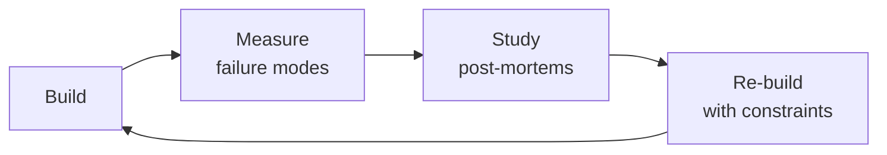

# Hardware Architect

Hardware architecture and electronic system-level design — from SoC selection through PCB stackup to compliance testing. Covers the critical architectural decisions that determine a product's cost, performance, power consumption, and time-to-market.

## Route the Request
<!-- QUICK: 30s -- ASCII decision tree to determine which skill handles the request -->

```
Request involves hardware design?
├── PCB layout, system architecture, SoC selection, memory/power/bus design
│   └── → Use hardware-architect (this skill)
├── Firmware running on an already-selected MCU — device drivers, RTOS, peripheral config
│   └── → Use embedded-engineer
├── Low-level device driver implementation, bootloader, HAL
│   └── → Use firmware-developer
├── Mechanical enclosure, thermal simulation (CFD), industrial design
│   └── → Mechanical engineer (not in library — consider general engineering guidance)
├── Electrical system design — schematics, component selection, power distribution
│   └── → Electrical engineer (not in library — consider general engineering guidance)
├── System-level architecture, product requirements, cost/power/performance tradeoffs
│   └── → Invoke `system-architect` for cross-disciplinary architecture decisions
├── Performance analysis, signal integrity, power integrity, thermal simulation
│   └── → Invoke `performance-engineer` for SI/PI simulation and EMC pre-compliance
├── Hardware documentation, architecture specifications, compliance test plans
│   └── → Invoke `documentation-engineer` for architecture specs and design decision logs
└── Unclear / need help routing
    └── → Default to hardware-architect and re-route if it's pure firmware
```

## Ground Rules — Read Before Anything Else
<!-- MANDATORY: Read before executing any task -->

1. **Design for manufacturing from day one** — a beautiful prototype that can't be produced is art, not engineering.
2. **BOM cost is a design constraint, not an afterthought** — every component decision impacts unit economics at scale.
3. **Thermal design is electrical design** — heat kills electronics. Thermal budget is as critical as power budget.
4. **Regulatory certification (FCC, CE, UL) adds 3-6 months** — plan for it from the start, not as a post-design checkbox.
5. **Every connector, every component, every trace needs a reason to exist** — if you can't justify it, remove it.


## The Expert's Mindset

Masters of hardware architect don't just build — they build **the right thing, at the right time, with the right trade-offs**. They think in systems, not tasks.

| Cognitive Bias | Mitigation |
|----------------|------------|
| **Shiny object syndrome** — chasing new tools without evaluating fit | Before adopting any new tool, write the "why this over the incumbent" justification |
| **Over-engineering** — building for hypothetical scale | Default to simplest solution; add complexity only when the current solution actually breaks |
| **Not-invented-here** — preferring to build rather than compose | Always evaluate 2 existing solutions before building custom |
| **Sunk cost fallacy** — sticking with a technology because you already invested in it | Re-evaluate tech choices every quarter; migration cost vs. staying cost |

### What Masters Know That Others Don't
- The **failure modes** of every component in their stack — not just the happy path
- When **not** to use their favorite tool (every tool has a misuse zone)
- That **data/model quality decays over time** — monitoring is not optional, it's foundational

### When to Break Your Own Rules
- **Move fast on reversible decisions.** Data format? Hard to change. Dashboard layout? Easy. Know the difference.
- **Skip the abstraction until the third use case.** Two is coincidence, three is a pattern.
## Operating at Different Levels

| Level | Scope | You... |
|-------|-------|--------|
| **L1** | Single component/module | Implement a well-defined piece following established patterns |
| **L2** | Feature or service | Design and build a complete feature; make tech choices within team conventions |
| **L3** | System or product area | Define architecture for a product area; set team tech standards; mentor L1-L2 |
| **L4** | Multiple systems / platform | Define org-wide architecture patterns; make build-vs-buy decisions; influence industry practice |
| **L5** | Industry / ecosystem | Create new architectural patterns adopted across the industry; redefine what's possible |

**Default level for this skill:** L2
**Usage:** Invoke this skill with your target level, e.g., "as an L3 hardware architect, design..."

For full level definitions, see `skills/00-framework/skill-levels/SKILL.md`.

## When to Use
<!-- QUICK: 30s -- scan the bullet list to decide if this skill fits -->

- Selecting a processor/SoC for your next embedded product — ARM Cortex-M vs -R vs -A, RISC-V, FPGA, or ASIC
- Defining memory architecture — what goes in SRAM, DRAM, Flash (NOR/NAND/eMMC/UFS), and external storage
- Designing the power tree — PMIC selection, LDO vs buck converter, power sequencing, battery management
- Choosing bus architecture — AMBA AXI vs AHB vs APB, peripheral interconnect, DMA topology
- Making PCB stackup and signal integrity decisions — layer count, impedance control, differential pairs, length matching
- Planning thermal management — heatsinking, airflow, thermal vias, junction temperature, TDP budget
- Evaluating EMC/EMI compliance path — pre-compliance testing, shielding, filtering, radiated emissions
- Making make-vs-buy decisions on IP blocks — licensing ARM cores, buying reference designs, custom silicon

**Use `/embedded-engineer` instead when:** You're implementing firmware on a chosen MCU — writing device drivers, configuring peripherals, optimizing for power. Hardware-architect picks the platform; embedded-engineer builds on it.

## Cross-Skill Coordination
<!-- QUICK: 30s — who to talk to, when, what to share -->

Hardware architecture decisions cascade through the entire product development lifecycle. A wrong SoC selection costs 6+ months and $100K+ in respins. Every architectural decision must be validated with downstream teams before committing to silicon.

### Coordinate With

| Coordinate With | When | What to Share/Ask | Decision Gate / Artifact |
|-----------------|------|-------------------|--------------------------|
| **System Architect** | Product requirements definition, system-level tradeoffs | Power budget, latency budgets, throughput requirements, cost targets | Gate: System architecture review before SoC downselect. Artifact: System requirements document with hardware constraints. |
| **Embedded Engineer** | MCU/MPU selection, peripheral assignment, pin muxing, clock tree | Peripheral conflict analysis, GPIO drive strength, ADC reference, ISR latency budget | Gate: Pin mux review before schematic freeze. Artifact: Pin assignment spreadsheet with alternate functions. |
| **Firmware Developer** | Memory map, boot pin strapping, secure element integration, flash partitioning | Flash/RAM sizing, external memory interface, secure element protocol, boot sequence | Gate: Memory map review before PCB layout. Artifact: Memory map document with linker script constraints. |
| **Performance Engineer** | Signal integrity analysis, power integrity, thermal simulation, EMC pre-compliance | PCB stackup, impedance targets, decoupling strategy, thermal budget | Gate: Signal integrity sign-off before fab. Artifact: SI/PI simulation report with margin analysis. |
| **Documentation Engineer** | Hardware architecture specification, design decisions log, compliance test plan | Architecture decisions, component selection rationale, regulatory requirements | Gate: Architecture spec finalized before detailed design. Artifact: Hardware architecture specification document. |

### Communication Triggers

| Trigger | Notify | Why | Decision Gate |
|---------|--------|-----|---------------|
| Silicon errata with no workaround | System Architect, Embedded Engineer, Firmware Developer | Chip reselection may be required | Gate: Reselection decision within 5 business days. |
| BOM cost exceeds target >15% | System Architect, Product Manager | Design-to-cost review; component substitution | Gate: Cost review board approval before proceeding. |
| EMC pre-compliance failure >6dB | Performance Engineer, Firmware Developer | PCB respin or shielding design | Gate: Fix-or-respin decision with VP Engineering. |
| Power budget exceeded >20% | Embedded Engineer, Firmware Developer | PMIC reselection; power tree redesign | Gate: Power tree review before next prototype. |
| Component EOL with no drop-in replacement | System Architect, Embedded Engineer | Redesign or lifetime buy | Gate: Redesign decision within 10 business days. |

### Escalation Path

```
Silicon errata, no workaround? → System Architect → Chip reselection → +8 weeks schedule impact
EMC failure >6dB over limit? → Performance Engineer → PCB respin → $15K-50K + 4-6 weeks
BOM cost >25% over target? → Product Manager → Redesign or pricing adjustment
Thermal junction temp exceeds rating? → Performance Engineer → Heatsink redesign or clock reduction
```

### Cross-Skill Chain

```bash
# System Architecture → Hardware Architecture → Embedded bring-up → Firmware → QA
/system-architect && /hardware-architect && /embedded-engineer && /firmware-developer && /qa-engineer
```

## Proactive Triggers

| Trigger | Action | Why |
|---|---|---|
| Silicon errata published for selected MCU/MPU — affects a peripheral in your design | Evaluate workaround feasibility within 48 hours: classify as firmware-workaroundable, hardware-respin-required, or acceptable-degradation; notify embedded and firmware teams | Ignoring errata leads to field failures that appear intermittent and take months to root-cause |
| Key component shows lead time >20 weeks on distributor check | Identify alternative component immediately; if no drop-in replacement, initiate redesign feasibility assessment within 1 week | 52-week lead times have killed production schedules — component availability must be validated before schematic freeze, not at BOM release |
| EMC pre-compliance scan shows emissions >3dB over limit on any frequency | Root-cause before PCB fab: check return paths, decoupling, stackup; 3dB margin is the minimum — aim for 6dB to absorb production variation | Fixing EMC after tooling is 10x more expensive than during design; every dB over limit adds weeks to certification |
| Thermal simulation shows junction temperature within 10°C of maximum rating | Redesign thermal solution: larger heatsink, better airflow, or clock reduction; 10°C margin is consumed by manufacturing variation and dust accumulation | Junction temp at 90% of max in simulation = field failures at 18 months when dust and ambient conditions degrade cooling |
| BOM cost exceeds target by >15% at component selection phase | Initiate design-to-cost review: identify top 5 cost drivers; evaluate cheaper alternatives with equivalent specs; present trade-offs to product manager | Cost overruns discovered after design freeze are locked in — early intervention preserves margin without compromising schedule |
| Second-source supplier discontinues pin-compatible alternative to your primary IC | Flag as single-source risk immediately; if primary supplier also has constrained capacity, start redesign feasibility for alternative architecture | Losing second-source turns a managed risk into a single point of failure — treat as severity 1 supply chain incident |
| Firmware team reports flash/RAM >85% on current build with features still in development | Trigger memory optimization review: evaluate feature deferral, compression, or chip upgrade; flash exhaustion discovered post-design = PCB respin | Flash/RAM headroom is an architectural constraint set during chip selection — running out means the architecture was wrong |
| >2 field returns show same component failure (same batch, same failure mode) | Suspect component quality issue or design margin problem; halt production if failure rate suggests systemic defect; initiate root cause analysis with supplier | Pattern of identical failures is never coincidence — every day of continued production compounds the liability |

## Decision Trees
<!-- QUICK: 30s -- follow the ASCII tree to your scenario -->

### Processor Architecture Selection

```
                      ┌──────────────────────────┐
                      │ START: What are your      │
                      │ compute requirements?     │
                      └───────────┬──────────────┘
                                  │
                    ┌─────────────▼─────────────┐
                    │ Real-time deterministic    │
                    │ response required?         │
                    └────┬─────────────────┬────┘
                         │ YES (≤1μs jitter)│ NO
                    ┌────▼──────────┐ ┌─────▼──────────────────────┐
                    │ Is compute    │ │ Running Linux or rich OS?  │
                    │ moderate?     │ └────┬─────────────────┬─────┘
                    │ (sensor fusion │      │ YES             │ NO
                    │ motor control,  │ ┌────▼──────────┐ ┌───▼──────────┐
                    │ closed-loop)    │ │ Cortex-A or   │ │ Cortex-M     │
                    └────┬──────────┘ │ RISC-V U54.   │ │ (M0-M7) or   │
                         │ YES        │ MMU required   │ │ RISC-V E31   │
                    ┌────▼──────────┐ │ for memory     │ │ or RISC-V    │
                    │ Cortex-R or   │ │ management.    │ │ based MCU.   │
                    │ RISC-V R      │ └────────────────┘ └──────────────┘
                    │ series.       │
                    │ Lockstep      │
                    │ cores for     │
                    │ safety.       │
                    └───────────────┘
```

**Cortex-M** (M0-M7): MCU class. No MMU, typically FreeRTOS/Zephyr or bare-metal. Power µA to mA. For sensors, wearables, IoT endpoints. **Cortex-R:** Real-time, deterministic, lockstep for safety. For automotive, industrial, medical. **Cortex-A:** Application processor with MMU. Runs Linux/Android. For gateways, HMI, cameras. **RISC-V:** Emerging. No licensing fees, but ecosystem maturity depends on vendor (SiFive, Bouffalo, ESP32-C).

**FPGA vs ASIC decision:** < 10K units → FPGA. 10K-100K → FPGA or structured ASIC. > 100K → custom ASIC. ASIC NRE is $2-10M+ for 28nm and below — only if volume justifies it.

### Memory Architecture Decision

```
                     ┌──────────────────────────┐
                     │ START: What's the primary │
                     │ execution memory?         │
                     └───────────┬──────────────┘
                                 │
                   ┌─────────────▼─────────────┐
                   │ Code executes from?        │
                   └────┬─────────────────┬────┘
                        │ Flash (XIP)     │ RAM
                   ┌────▼──────────┐ ┌─────▼──────────────────────┐
                   │ NOR Flash for  │ │ Need > 512MB?             │
                   │ XIP. Lower     │ └────┬─────────────────┬────┘
                   │ density (up to │ │ YES             │ NO
                   │ 256MB), faster │ ┌────▼──────────┐ ┌───▼──────────┐
                   │ random read.   │ │ DDR3/DDR4     │ │ SRAM or      │
                   │ Typical for    │ │ or LPDDR4.    │ │ SDRAM.       │
                   │ MCU apps.      │ │ DRAM needs    │ │ SRAM is      │
                   └────────────────┘ │ refresh +     │ │ fastest +     │
                        │ NAND Flash  │ longer boot. │ │ lowest power. │
                   ┌────▼──────────┐ └───────────────┘ └──────────────┘
                   │ NAND/eMMC for │
                   │ storage.      │
                   │ Multi-level   │
                   │ (MLC/TLC) for │
                   │ density, SLC  │
                   │ for reliabil- │
                   │ ity. eMMC     │
                   │ simplifies    │
                   │ management.   │
                   └────────────────┘
```

**SRAM:** Fastest, lowest power, most expensive ($10-50+/MB). For cache, < 1MB scratchpad. **SDRAM:** Good balance for MCU applications with > 64KB needs. **DDR:** For application processors. LPDDR for battery-powered. **NOR Flash:** For XIP (eXecute In Place). No boot RAM needed. 1-256MB. **NAND Flash:** For storage. TLC/QLC for density, SLC for reliability. eMMC handles bad block management and wear leveling for you.

## Core Workflow
<!-- QUICK: 30s -- scan phase titles to understand the process -->
<!-- DEEP: 10+min -->

### Phase 1 (~20 min): Requirements Capture
**Steps:** 1) Define compute requirements: MIPS/DMIPS, real-time guarantees, determinism needs, FPU requirement, DSP capability 2) Define I/O requirements: peripheral count (SPI, I2C, UART, CAN, USB, Ethernet), GPIO count, ADC channels/rate, display interface 3) Define power budget: active current, sleep current, peak current, thermal envelope, battery life target 4) Define environmental: operating temperature, vibration, humidity, IP rating, safety certification (IEC 61508, ISO 26262, DO-254) 5) Define cost targets: BOM cost, tooling/NRE, development time, volume ramp plan
**What good looks like:** Requirements document with 5 specific constraints (compute, I/O, power, environmental, cost) — all quantified with ranges, not absolutes.

### Phase 2 (~30 min): SoC/Processor Selection
**Steps:** 1) Map requirements to processor class using the decision tree above 2) Create a shortlist of 3-5 processor families (e.g., STM32H7, NXP i.MX RT, TI AM64x) 3) Compare on: performance, power, price, ecosystem (tools, SDK, community), availability (lead time, lifecycle status), security features (secure boot, TRNG, crypto accelerator) 4) Check for second-sourcing options — what happens if this chip has a 52-week lead time? 5) Select and document rationale — keep the alternatives section for when the chosen chip goes EOL
**What good looks like:** Selection document with 5 processor candidates, scored on 7 criteria (performance, power, price, ecosystem, availability, security, second-source), with the winner and runner-up documented. A new engineer understands why this chip was chosen.

### Phase 3 (~25 min): Memory & Storage Architecture
**Steps:** 1) Determine execution memory (XIP Flash vs DRAM) using decision tree 2) Size Flash: firmware image size × 2 (for OTA dual-bank) + file system (if needed) + bootloader + factory test + 30% headroom 3) Size RAM: stack + heap + buffers (DMA, display, audio) + OS kernel + application data + 30% headroom. Actual measurement beats estimation — build a prototype and measure. 4) Select storage: eMMC for ease (5.1 recommended) vs raw NAND (cheaper but requires ECC + bad block management) vs SDCard (removable but slower) 5) Consider external memory interface: QSPI vs OSPI vs parallel NOR vs DDR
**What good looks like:** Memory map document: base address, size, purpose, and timing requirements for every memory region. No region with "TBD" size.

### Phase 4 (~20 min): Power Tree Design
**Steps:** 1) Calculate total power budget: sum of all rail currents × voltages. Add 30% margin. 2) Choose regulator topology: PMIC (integrated, small footprint) vs discrete LDOs (low noise, analog) vs discrete buck converters (efficient > 100mA). Each rail gets a decision. 3) Define power sequencing: which rails come up in what order, with what delays. Use a sequencer IC or PMIC with configurable sequencing. 4) Define sleep modes: which rails stay on during sleep, wake sources, wake time budget. Measure actual sleep current early — datasheet typicals assume perfect conditions. 5) Battery management: charge IC (linear vs switching), fuel gauge (voltage vs coulomb counting vs impedance track), protection (over-current, over-temperature, under-voltage lockout)
**What good looks like:** Power tree diagram showing every voltage rail, the regulator feeding it, maximum current, sequencing order, and sleep mode state. Measured power consumption at each state (active/idle/sleep/deep sleep) within 10% of estimate.

### Phase 5 (~15 min): PCB & Signal Integrity Planning
**Steps:** 1) Determine layer count based on signal density and impedance requirements: 2-layer (simple, cheap, but SI poor), 4-layer (good SI, dedicated power plane), 6+ (high-speed, many supplies) 2) Define stackup: signal layer order, reference plane assignment, dielectric thickness, target impedance (50Ω single-ended, 90Ω differential, 100Ω differential) 3) Identify critical nets requiring length matching: DDR, high-speed serial (USB 3.0, PCIe, MIPI), differential pairs 4) Plan decoupling: bulk capacitance per rail, high-frequency decoupling per IC, placement proximity 5) Review with layout engineer — paper review before routing saves weeks
**What good looks like:** PCB stackup document with layer stack, target impedance, critical net list, decoupling strategy, and placement guidance. Layout engineer can start routing with zero questions about constraints.

### Phase 6 (~10 min): Compliance & Certification Planning
**Steps:** 1) Identify required certifications: FCC Part 15 (USA), CE (EU), UKCA, ISED (Canada), VCCI (Japan) — plus industry-specific (medical: IEC 60601, automotive: ISO 26262, industrial: IEC 61000) 2) Pre-compliance testing: evaluate radiated emissions, conducted emissions, ESD, surge, and immunity in-house before sending to certified lab. Pre-compliance catches 80% of issues at 10% of the cost. 3) Plan certification timeline: lab reservation (4-8 weeks lead), testing (1-2 weeks), remediation (variable, often 4-8 weeks). FCC certification typically 8-16 weeks from first submission. 4) Budget: FCC/CE pre-compliance $3-5K, full compliance $15-30K per product variant. Add 50% for first product.
**What good looks like:** Compliance plan with required certifications per target market, test house booked, pre-compliance schedule budgeted, and timeline mapped backward from launch date.

## Best Practices
<!-- STANDARD: 3min -- rules extracted from hardware engineering experience -->

- **Measure power, don't estimate.** Datasheet typical currents assume perfect conditions. Your firmware driving every peripheral will be 20-50% higher. Measure actual current on the first prototype — build a power measurement test point into every design.
- **Derate every component.** 50V capacitor on a 12V rail: OK. 25V capacitor on a 12V rail with 10% tolerance: 2.5V headroom — reliability risk. Derate capacitors 50% (use 16V on 5V, 25V on 12V). Derate resistors 20%. Derate MOSFETs 50% on Vds and Id.
- **Start thermal simulation before the PCB layout.** A 10°C rise in junction temperature reduces component lifetime by 50% (Arrhenius). Identify hot components (regulators, processors, power amplifiers) early and plan for heatsinking, airflow, and thermal vias.
- **Clock generation is a design choice, not an afterthought.** External crystal: most accurate (±10-50ppm), but requires PCB area and two load capacitors. Internal oscillator: saves pins and BOM, but ±1-5% accuracy — too loose for USB, CAN, or high-speed serial without PLL.
- **Test at temperature extremes.** Products that work at 25°C but fail at -20°C or +60°C are the most common field failure pattern. Test all critical interfaces (DDR timing, USB negotiation, ADC accuracy) at minimum and maximum rated temperature.
- **Design for test (DFT) saves development time.** Add test points for every power rail, critical signal, and programming interface. Include a UART debug header. Add an LED that the bootloader toggles — when the device won't boot, that LED tells you whether the bootloader ran.
- **Have a BOM risk plan.** Mark every component: single-source (risk), multi-source (safe), or EOL-risk (obsolete). For single-source parts, have an alternative part identified before the design review. Lead times > 20 weeks should trigger a back-up plan.

## Anti-Patterns

| ❌ Anti-Pattern | ✅ Do This Instead |
|---|---|
| Selecting an SoC because "it's what we've always used" without evaluating alternatives | Create a scored selection matrix: interfaces, power, cost, ecosystem maturity, lifecycle guarantee, second-source availability — score 3+ options before committing |
| Using datasheet typical current for power budgeting without measurement | Budget using max numbers + 20% regulator derating; measure actual current on first prototype at -20°C, 25°C, 60°C across all power modes |
| Skipping thermal simulation because "the enclosure has vents" | Run thermal simulation before PCB layout; model worst-case: max ambient + max power + 20% margin; identify hot components and plan heatsinking |
| Selecting single-source components without documented alternatives | Mark every BOM line: single-source (risk), multi-source (safe), EOL-risk; for single-source, identify alternative and document in design review |
| Running EMC pre-compliance after PCB fabrication | Run EMC pre-compliance at prototype/breadboard stage; include EMC engineer in PCB layout review; budget for at least 1 EMC-related respin |
| Designing without DFT (Design for Test) provisions | Add test points for every power rail, critical signal, and programming interface; include UART debug header and bootloader-status LED on every board |
| Selecting clock source without analyzing accuracy requirements | Match clock to interface requirements: USB/CAN need ±0.25% (crystal required); UART at 115200 needs ±2%; internal oscillator at ±5% is not enough for most protocols |
| Committing to PCB fabrication before pin mux review with firmware team | Every pin assignment must pass firmware team review before schematic freeze — pin conflict discovered after fab = PCB respin ($15K-50K + 4-6 weeks) |

<!-- DEEP: 10+min -- hardware architecture failures in the wild -->

## Error Decoder

| Problem | Root Cause | Fix | Lesson |
|---------|------------|-----|--------|
| Device crashes randomly in the field | Watchdog timer not configured or reset incorrectly | Configure the hardware watchdog timer with a proper reset handler. The watchdog must be kicked (reset) only in the main loop after all critical subsystems have reported healthy. Never kick the watchdog in an interrupt handler — it masks the crash. | Never kick watchdog in interrupt handler — it masks the crash. |
| I2C bus locks up after 24 hours of operation | No bus recovery mechanism on lock condition | Implement I2C bus recovery: if the bus is busy for >100ms without a stop condition, toggle SCL 9 times to reset slave devices. Add a bus health monitor that detects lockups and triggers re-initialization. Missing this is the #1 cause of "works in the lab, fails in the field." | 9-clock-pulse recovery is essential. Works in lab, fails in field without it. |
| Firmware OTA update bricks 5% of devices | No rollback mechanism in bootloader | Every OTA update requires: dual-bank flash with a confirmed-good fallback image, CRC check before applying the update, and a bootloader that boots the previous image if the new one fails to start. If the bootloader can't roll back, every OTA is a potential bricking event. | No rollback = potential bricking of every device. Dual-bank flash is mandatory. |
| ADC readings drift with temperature | No temperature compensation in firmware | Add a temperature sensor near the ADC reference. Read temperature at each conversion cycle and apply a compensation curve. If the ADC has an internal temperature sensor, use it. ADC drift without compensation can be 10-50% across the operating temperature range. | ADC drift can be 50% across temp range. Compensate or use external reference. |
| Production test fails 30% of units, all pass in re-test | Test fixture has poor contact or timing issues | Review test fixture: pogo pin alignment, contact resistance, settling time after power-up. Add a "pretest" sequence that checks fixture contact before running tests. The first test after a power cycle should be a known-good reference measurement. | Test fixture contact issues are #1 cause of false failures. Reference measurement first. |
| Interrupt latency causes missed events | Shared interrupt priority or long critical sections | Assign interrupt priorities carefully: time-critical interrupts (timers, communication) get highest priority. Limit critical section duration to <10μs. Use a real-time trace (logic analyzer or Segger SystemView) to measure worst-case interrupt latency. If latency exceeds your timing budget, restructure critical sections. | Measure worst-case latency with logic analyzer. <10μs critical sections. |
| Power budget exceeded by 40% | Sleep mode not configured for peripherals | Every peripheral must be in its lowest power state when not in use. GPIO pins should not float (internal pull-up/down or driven). Use the MCU's lowest sleep mode that can wake from the required source. Measure actual current at the PSU, not the datasheet typical — it's always higher. | Always measure actual current at PSU. Datasheet typical is always lower. |
| Chip selection limited by supply chain — lead time 52 weeks | Selected niche IC without checking availability; sole-source component with no alternative | Always identify 2+ sources for every critical component before schematic release. Check lead times at selection, not at BOM release. Document alternates in design review. | A hardware startup designed their PCB around a specific STM32 MCU with 52-week lead time. By the time they were ready for production, the chip was unobtainable. Redesign cost: $120K and 6 months. |
| Thermal design causing throttling under load — performance drops 40% | No thermal simulation done; heat sink undersized for worst-case ambient temperature | Run thermal simulation before PCB layout. Model worst-case: max ambient temp + max power draw. Include 20% margin. Test in thermal chamber before production signoff. | A security camera would throttle after 30 minutes in direct sunlight (45°C ambient). The SoC junction temp hit 110°C. Fix required a heatsink redesign and a 3-month production delay. |
| Power budget exceeded by 30% | Used datasheet "typical" power numbers instead of maximum; didn't account for regulator inefficiency | Budget power using max (not typical) numbers from datasheets. Add 20% regulator derating. Include all power domains. Measure at the battery terminal, not the PMIC output. | An IoT device claimed 2-year battery life on a CR2032. Real life: 4 months. Root cause: datasheet said BLE SoC was 5µA sleep but real was 12µA, and the voltage regulator was 85% efficient, not 95%. |
| PCB respin required for EMC failure — 8-week delay | EMC pre-compliance done too late (after PCB fab); fixes required layout changes | Run EMC pre-compliance at breadboard/prototype stage. Include EMC engineer in PCB layout review. Budget for at least 1 EMC-related spin. | A consumer device passed EMC pre-compliance on the dev kit but failed on the production PCB. Root cause: the PCB layout had a long return path on the high-speed trace. Cost: $40K respin + 8 weeks delay. |
| Production yield 60% — 40% of boards failed functional test | Test coverage was incomplete; boundary scan and in-circuit test not implemented | Implement boundary scan (JTAG) for solder joint verification. Add ICT test points. Achieve >90% test coverage before production signoff. | A medical device had 40% failure rate at contract manufacturer. Root cause: a single BGA ball on the main SoC wasn't soldered (head-in-pillow defect). Boundary scan would have caught it. Cost: $500K in scrapped boards. |


## Production Checklist
<!-- QUICK: 30s -- binary pass/fail. All must pass before PCB fab. -->

- [ ] **[H1]** SoC/processor selected with documented rationale, alternatives considered, and second-source option identified
- [ ] **[H2]** Memory architecture documented: memory map, type, size, timing requirements for each region
- [ ] **[H3]** Power tree calculated with 30% margin and simulation or bench measurement confirming estimates
- [ ] **[H4]** Power sequencing defined: rail order, ramp timing, and sleep mode configuration
- [ ] **[H5]** Critical nets identified for length matching: DDR, high-speed serial, differential pairs
- [ ] **[H6]** PCB stackup defined: layer count, layer order, dielectric material, target impedance
- [ ] **[H7]** Decoupling strategy documented: bulk capacitance per rail, high-frequency decoupling per IC, placement
- [ ] **[H8]** Thermal simulation completed: junction temperature of all hot components within spec under worst-case ambient
- [ ] **[H9]** Derating review completed for all critical components (caps, resistors, MOSFETs, connectors)
- [ ] **[H10]** Pre-compliance EMC test scheduled or completed: radiated emissions, conducted emissions, ESD
- [ ] **[H11]** Certification plan documented: required certifications per target market, budget, timeline
- [ ] **[H12]** BOM risk assessment completed: single-source parts identified with backup alternatives
- [ ] **[H13]** Test points included for: all power rails, critical signals, programming interface, UART debug
- [ ] **[H14]** Schematics peer-reviewed, layout constraints documented for layout engineer handoff

## Cross-Skill Integration
<!-- QUICK: 30s -- table of who to talk to when -->

| Step | Skill | What It Produces |
|------|-------|-----------------|
| **Before** | `embedded-engineer` | Firmware requirements, peripheral usage patterns, interrupt priorities → informs processor selection |
| **Before** | `firmware-developer` | Bootloader requirements, memory map needs, OTA architecture → informs memory sizing |
| **This** | `hardware-architect` | SoC selection, memory architecture, power tree, PCB stackup, compliance plan |
| **After** | `performance-engineer` | Hardware performance targets (clock speed, memory bandwidth, power budget) → performance baseline |
| **After** | `documentation-engineer` | Hardware architecture document, memory map, power tree → forms the hardware section of the product documentation |
| **After** | `qa-engineer` | Test requirements (thermal testing, EMC pre-compliance, HALT) → test plan input |

## Scale Depth: Solo → Small → Medium → Enterprise

### Solo
Single developer, dev kits and breadboards, hobbyist EDA (KiCad/EAGLE). Focus: proof of concept, basic functionality. Skip: full compliance testing, DFM optimization. Coordination: with hardware architect on component selection for manufacturability.

### Small Team
Small engineering team, custom PCB, professional EDA (Altium/OrCAD). Focus: first production run, basic EMC pre-compliance. Coordination: with firmware on HAL API contracts, with test on production fixture design.

### Medium Team
Cross-functional hardware team (HW, FW, ME, test), contract manufacturing. Focus: DFM, full compliance certification (FCC/CE/UL). Coordination: with supply chain on BOM cost optimization, with ops on NPI, with QA on reliability testing.

### Enterprise
Multi-product platform architecture, global regulatory compliance, automated test infrastructure. Focus: supply chain resilience, silicon validation. Coordination: with manufacturing partners globally, with regulatory affairs on country-specific certifications, with security on hardware root of trust.

### Transition Triggers
| From → To | Trigger |
|-----------|---------|
| Solo → Small | First 100-unit production run; customer requires CE/FCC marking |
| Small → Medium | Product expansion to multiple SKUs; >10 engineering headcount |
| Medium → Enterprise | Operating in 5+ regulated jurisdictions; automotive/medical safety-critical certification |

## What Good Looks Like

A well-designed hardware architecture is invisible when it's right — the product works reliably across temperature, meets power targets on the first spin, and passes EMC with margin. Specifically:
- **The first prototype boots and communicates.** No power rail sequencing bugs, no clock configuration that needs a bodge wire, no "turns out this pin doesn't support that function." The SoC selection was right.
- **Power consumption is within 10% of estimate.** The power tree model, simulation, and measurement converge. No last-minute LDO swap because the regulator overheats.
- **EMC passes with margin on the first compliance test.** Pre-compliance caught the issues (bad clock routing, missing ferrites, poorly filtered I/O) before the expensive lab test.
- **Memory map is stable from day one.** No firmware rewrites because the memory architecture changed. The map had headroom for growth.
- **The hardware architecture document is the single source of truth.** A new engineer can read it and understand every decision: why this SoC, why this memory topology, why this regulator topology, why this stackup. The alternatives section explains what was rejected and why.


## Footguns
<!-- DEEP: 10+min — war stories from hardware architecture -->

| Footgun | What Happened | Root Cause | How to Prevent |
|---------|---------------|------------|----------------|
| Selected a "perfect" SoC that went EOL 6 months into production — 12,000 units in backlog, no pin-compatible replacement, 9-month redesign | A hardware architect selected an NXP i.MX 6SoloX for an IoT gateway in 2021. The selection matrix scored it highest on peripheral count, power, and BOM cost. The product launched in Q1 2022. In Q3 2022, NXP issued a PDN (Product Discontinuance Notice) — the part had been NRND (Not Recommended for New Designs) since Q2 2020, 9 months BEFORE the selection. Nobody checked lifecycle status. The last-time-buy window was 6 months, and the contract manufacturer could only secure 2,000 units. The redesign to an i.MX 8M Mini took 9 months, including schematic, layout, EMC re-certification, and firmware porting. Revenue loss: $3.2M. | The component selection process had no lifecycle status check. The architect searched for "i.MX 6SoloX datasheet" on Google, found the product page (which didn't prominently display NRND status), and used the part. The procurement team assumed engineering had checked lifecycle. | **Check lifecycle status BEFORE adding any component to the BOM.** Every distributor (Digi-Key, Mouser, Avnet) shows lifecycle status. For MCUs/SoCs: check the manufacturer's product longevity program commitment (NXP: 10-15 years for i.MX, ST: 10 years for STM32, TI: "select products"). Add a BOM review gate: every part must have documented lifecycle status, minimum 5-year availability from planned production end. Prefer parts in manufacturers' "longevity" programs. |
| DDR3 layout passed SI simulation at 25°C — failed in production at 0°C because PCB dielectric constant shifted 12%, breaking timing margin by 85ps | A 4-layer PCB with DDR3-800 was simulated in HyperLynx at 25°C with the FR-4 dielectric constant (Dk) at the manufacturer's nominal 4.2. Simulation showed 180ps of timing margin — comfortable against the 165ps requirement. The first 500 production boards worked at room temperature. When deployed in outdoor enclosures at winter temperatures (-5°C to 5°C), 30% of boards experienced intermittent DDR3 training failures. Root cause: FR-4 Dk increased from 4.2 at 25°C to 4.7 at 0°C (a 12% increase), which increased propagation delay by ~85ps on the longest traces — consuming half the timing margin. Boards that were marginal at room temperature became failures in the cold. | The simulation used a single Dk value at room temperature. FR-4's dielectric constant is temperature-dependent: Dk changes ~0.01-0.02 per °C. A 25°C swing = Dk delta of 0.25-0.5. The timing budget assumed ideal conditions — no temperature derating, no manufacturing variation, no aging effects. | **Simulate at Dk_min and Dk_max, not nominal.** Request the PCB manufacturer's Dk vs. temperature curve for your specific laminate (Isola FR408HR, Panasonic Megtron 6, etc.). Run SI simulations at -40°C, 25°C, and 85°C. Add a timing margin budget: subtract 10% for temperature, 5% for manufacturing variation (etch factor, dielectric thickness tolerance), and 5% for aging. If margin is negative at any corner, re-route or reduce clock speed. |
| Power tree: 3.3V rail had 500mV ripple at 2A load because the LDO dropout voltage spec was read at 100mA — at full load, the LDO wasn't regulating at all | A hardware architect selected an LDO with "300mV dropout at 2A" from the datasheet's first page. The input was 3.8V (LiPo battery), output was 3.3V — 500mV of headroom, seemed fine. In production, the 3.3V rail measured 3.3V at light load (MCU in sleep, 50mA) but dropped to 3.0V with 450mV of 100kHz ripple at full load (MCU + GSM + sensors, 1.8A). The dropout spec was 300mV TYPICAL at 2A — the MAXIMUM dropout across temperature (-40°C to 85°C) was 650mV. At 3.8V input with 650mV dropout, the output couldn't maintain 3.3V above 1.5A. The ripple was the LDO cycling in and out of dropout at the GSM transmit burst rate (217Hz on GSM). | The architect used the typical value from the front page, not the maximum value from the electrical characteristics table. The dropout voltage increases with temperature (higher Rds(on) in the pass transistor). The input voltage wasn't derated for battery end-of-charge (3.4V for LiPo), where there's only 100mV of headroom against the max dropout. | **Always design to MAX specs, not typical.** For every power component: (1) read the full electrical characteristics table, not the front-page summary; (2) derate input voltage for battery end-of-charge and connector/wire losses; (3) add 20% margin to the max dropout spec for aging. If `V_in_min - V_out < V_dropout_max × 1.2`, the LDO won't regulate — use a buck converter or a different LDO with lower dropout. Simulate in SPICE with the manufacturer's model at -40°C, 25°C, and 85°C corners. |
| EMC compliance test at $6K/day — failed radiated emissions at 480MHz because a 24MHz clock trace ran under a connector with no guard ring | A medical device went to a certified EMC lab for FCC Part 15 testing. The 24MHz HSE clock trace ran 15mm on layer 3, directly under a DB-9 connector on the top layer. The connector acted as an antenna, radiating the 20th harmonic (480MHz) at 12dB above the Class B limit. The fix: cut the trace, run a bodge wire around the connector, add copper tape with conductive adhesive for shielding. Retest cost: $6,000 + 3 weeks schedule delay. The original layout had passed the SI review (signal looked clean) but never had an EMC review. | The SI review checked the clock waveform at the load, not the radiated field 3 meters away. The trace ran under a connector because "it was the shortest path" and the PCB designer prioritized signal integrity over EMC. No pre-compliance scan was done with a near-field probe before sending to the certified lab. | **Run a pre-compliance EMC scan BEFORE the $6K lab visit.** Use a near-field probe (H-field and E-field) and a spectrum analyzer ($2K investment that pays for itself on the first avoided retest). Scan every clock trace, every switching regulator, and every connector for emissions. If a clock harmonic is within 6dB of the limit with a near-field probe, it WILL fail at 3 meters. For clock traces: (1) route on inner layers between reference planes, (2) add guard traces/vias on both sides, (3) never route under connectors or near board edges, (4) add series termination to slow edge rates. |
| Chose a 0.5mm pitch QFN package because it was $0.12 cheaper than QFP — 8% of boards failed functional test because the CM couldn't inspect solder joints, rework costs exceeded BOM savings by 20× | A hardware architect selected a QFN-32 package for an STM32 MCU at $1.87/unit vs. the QFP-32 at $1.99/unit — $0.12 savings × 50,000 units/year = $6,000 annual savings. The contract manufacturer's AOI (Automated Optical Inspection) couldn't inspect QFN joints because they're under the package — X-ray inspection was required but only sampled at 5%. 8% of boards had open or marginal QFN solder joints that passed AOI but failed functional test. Rework cost per board: $38 (diagnosis + rework + retest). Annual rework cost: 4,000 failed boards × $38 = $152,000. The $6,000 BOM savings cost $152,000 in rework. | The component selection criteria included unit price, availability, and electrical specs — but NOT manufacturability. Nobody asked the CM: "Can you inspect this package? What's your defect rate for QFN vs. QFP?" The CM had the capability on paper but not the process control in practice. | **Include DFM (Design for Manufacturing) in the component selection matrix.** For each package option, ask your CM: (1) what inspection method? (2) typical first-pass yield? (3) rework process and cost? Add a column to your selection matrix: "CM yield risk." Prefer packages with inspectable leads (QFP, SOIC) over hidden-lead packages (QFN, BGA, LGA) unless you've verified your CM's process capability with data from the last 3 production runs. The per-unit BOM savings must exceed the per-unit rework cost × expected defect rate. |

## Calibration — How to Know Your Level
<!-- STANDARD: 3min — honest self-assessment -->

| You Know You're Stuck at L1 When... | You Know You've Reached L2 When... | You Know You're L3 When... |
|---|---|---|
| You can read a datasheet and select a part but don't know why two identical-spec LDOs behave differently — one oscillates at 200mA because its output capacitor ESR is wrong | You've taken a design from concept through FCC/CE/ISED certification and into production; your power tree estimates are within 15% of bench measurements; your first PCB spin boots without bodge wires | A contract manufacturer hands you a board that "works sometimes" — you find the marginal timing violation, the ground bounce issue, and the ESD susceptibility in a 2-hour bench session without schematics |
| You route a PCB by connecting pins but don't understand why a 50mm trace at 100MHz is a transmission line, not a wire | You can calculate impedance, length-match to within 2mm, and know when a signal needs termination — and your layouts pass EMC on the first lab visit | You review a competitor's teardown and identify every cost-reduction opportunity, every EMC compromise, and the design philosophy behind their architecture — in 30 minutes |
| You select components by searching "popular MCU for IoT" on Google | You maintain a personal component database with lifecycle status, second-source alternatives, and per-unit pricing at 1K/10K/100K volumes — updated quarterly | A chip shortage hits (like the 2020-2022 STM32 crisis) — you have a pin-compatible alternative designed into the BOM as an alternate population option, and production switches within 4 weeks |

**The Litmus Test:** Can you review a 12-layer PCB layout for a high-speed digital design and identify every signal integrity, power integrity, and EMI risk — before it goes to fab — without running a simulation? If you need the SI tool to find the obvious problems (missing termination, reference plane splits, antenna loops under connectors), you're not L3 yet.

## Deliberate Practice



| Level | Practice | Frequency |
|-------|----------|-----------|
| **Novice** | Rebuild an existing system from scratch, then compare your design with the original | Monthly |
| **Competent** | Add a new constraint (10x data, zero downtime, etc.) to a familiar design and re-architect | Quarterly |
| **Expert** | Design the same system under 3 conflicting constraint sets; write a decision record for each | Quarterly |
| **Master** | Teach a junior to design a system; your role is to ask questions, not give answers | Monthly |

**The One Highest-Leverage Activity:** Every quarter, take a system you built 6+ months ago and redesign it from scratch with what you know now. Write down what changed and why.

## References
<!-- STANDARD: 3min -->

- **system-architect, embedded-engineer, firmware-developer** and others — for upstream design decisions, specifications, and architectural context that inform Hardware architecture design and component specification
- **embedded-engineer, firmware-developer, documentation-engineer** and others — downstream skills that consume outputs from this skill for implementation and execution
