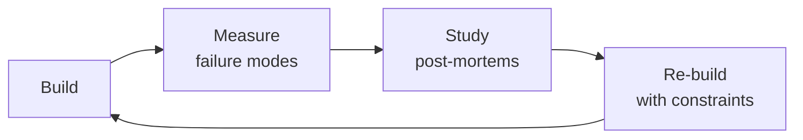

# Hardware Architect
> **Portability target:** Spec-level (runs on Claude Code, Copilot, Gemini CLI, Codex, Cursor). No vendor-specific frontmatter fields.

Hardware architecture and electronic system-level design — from SoC selection through PCB stackup to compliance testing. Covers the critical architectural decisions that determine a product's cost, performance, power consumption, and time-to-market.

## Route the Request

<!-- QUICK: 30s -- auto-route first, then intent-route -->

### Auto-Route (No User Input Required)
Evaluate these file-system conditions in order. First match wins — jump immediately.

| # | Condition | Action |
|---|-----------|--------|
| A1 | `file_exists("*.kicad_sch")` OR `file_exists("*.sch")` OR `file_contains("*", "(PCB.layout\|pcb.stackup\|layer.count\|impedance.control)")` | This is your skill. Jump to **Core Workflow** — Phase 1: Requirements & Architecture. |
| A2 | `file_exists("*.kicad_pcb")` OR `file_exists("*.brd")` AND `file_contains("*", "(BGA\|DDR\|high.speed.serial\|differential.pair)")` | Jump to **Core Workflow** — Phase 2: PCB Architecture & Stackup. |
| A3 | `file_exists("BOM*.csv|BOM*.xlsx|bill.of.materials*")` AND `file_contains("BOM*", "(supply.chain\|lead.time\|alternate\|second.source)")` | Jump to **Decision Trees** — Component Selection & BOM Risk. |
| A4 | `file_contains("*", "(thermal.simulation\|CFD\|junction.temp\|heatsink\|thermal.via)")` OR `file_contains("*", "(85.*C\|105.*C\|125.*C\|ambient.*temp)")` | Jump to **Core Workflow** — Phase 3: Thermal Design. |
| A5 | `file_contains("*", "(EMC\|EMI\|FCC\|CE.mark\|radiated.emission\|conducted.emission\|ESD.*test)")` | Jump to **Error Decoder** — EMC-related rows. |
| A6 | `file_contains("*", "(power.tree\|power.sequencing\|voltage.rail\|regulator\|LDO\|PMIC)")` AND NOT `file_contains("*", "PCB.*layout\|stackup")` | Jump to **Core Workflow** — Phase 4: Power Architecture. |
| A7 | `file_contains("*", "(MCU.*C\|FPGA\|SoC.*selection\|processor.*selection)")` AND `file_contains("*", "(interface\|peripheral\|IO.count\|GPIO)")` | Jump to **Decision Trees** — SoC/Processor Selection. |
| A8 | `file_contains("*", "(schematic.*review\|layout.*review\|design.*review\|DFM.*check)")` | Jump to **Production Checklist** — pre-fab signoff items. |

### Intent Route (Ask the User)
If no auto-route matched, use this intent tree:

## Ground Rules — Read Before Anything Else

<!-- QUICK: 30s -- negative constraints, mechanically triggered -->

| # | Negative Constraint | Mechanical Trigger | Violation Response |
|---|---------------------|--------------------|---------------------|
| G1 | **REFUSE to commit to PCB fabrication without pin mux review by firmware team.** | `file_exists("*.kicad_pcb")` OR `file_exists("*.brd")` AND NOT `file_exists("*pin-mux-review*")` | STOP. Every pin assignment must pass firmware team review before schematic freeze. Pin conflict = PCB respin ($15K-50K + 4-6 weeks). |
| G2 | **STOP if BOM uses single-source components without documented alternatives.** | `grep -c "single.source\|sole.source\|no.alternate" BOM*.csv` > 0 | HALT. Mark every BOM line: single-source (risk), multi-source (safe), EOL-risk. For single-source, identify and document alternative. |
| G3 | **DETECT datasheet typical power used for budgeting instead of max + derating.** | `file_contains("*", "typical.*µA\|typical.*mA\|datasheet.*typical\|typ\..*current")` AND NOT `file_contains("*", "max.*current\|derating\|20%.*margin")` | STOP. Budget using MAX numbers + 20% regulator derating. Measure actual at -20°C, 25°C, 60°C on first prototype. |
| G4 | **REFUSE to skip thermal simulation because "enclosure has vents."** | `file_exists("*thermal*")` AND `file_contains("*thermal*", "passive\|natural.convection\|vents.*enough")` AND NOT `file_exists("*thermal-simulation*")` | HALT. Run thermal simulation before PCB layout. Model worst-case: max ambient + max power + 20% margin. Identify hot components. |
| G5 | **STOP if EMC pre-compliance is deferred until after PCB fabrication.** | `user_message_contains("EMC.*after\|compliance.*later\|certification.*post")` AND `file_exists("*.kicad_pcb")` | HALT. EMC pre-compliance at prototype/breadboard stage. Budget for at least 1 EMC-related respin. Include EMC engineer in layout review. |
| G6 | **DETECT chip selection without evaluating 3+ alternatives in scored matrix.** | `file_contains("*", "selected.*processor\|chose.*SoC\|pick.*MCU")` AND NOT `file_contains("*", "(selection.matrix\|scored\|alternative.*compared\|3.*option)")` | STOP. Create scored selection matrix: interfaces, power, cost, ecosystem, lifecycle, second-source. Score 3+ options before commit. |
| G7 | **REFUSE to ship without DFT (Design for Test) provisions.** | `file_exists("*.kicad_sch")` AND NOT `grep -q "test.point\|debug.header\|UART.*debug\|bootloader.*LED" *.kicad_sch` | STOP. Add test points for every power rail, critical signal, programming interface, UART debug header, bootloader-status LED. |

## The Expert's Mindset

Masters of hardware architect don't just build — they build **the right thing, at the right time, with the right trade-offs**. They think in systems, not tasks.

| Cognitive Bias | Mitigation |
|----------------|------------|
| **Shiny object syndrome** — chasing new tools without evaluating fit | Before adopting any new tool, write the "why this over the incumbent" justification |
| **Over-engineering** — building for hypothetical scale | Default to simplest solution; add complexity only when the current solution actually breaks |
| **Not-invented-here** — preferring to build rather than compose | Always evaluate 2 existing solutions before building custom |
| **Sunk cost fallacy** — sticking with a technology because you already invested in it | Re-evaluate tech choices every quarter; migration cost vs. staying cost |

### What Masters Know That Others Don't
- The **failure modes** of every component in their stack — not just the happy path
- When **not** to use their favorite tool (every tool has a misuse zone)
- That **data/model quality decays over time** — monitoring is not optional, it's foundational

### When to Break Your Own Rules
- **Move fast on reversible decisions.** Data format? Hard to change. Dashboard layout? Easy. Know the difference.
- **Skip the abstraction until the third use case.** Two is coincidence, three is a pattern.

## Operating at Different Levels

| Level | Scope | You... |
|-------|-------|--------|
| **L1** | Single component/module | Implement a well-defined piece following established patterns |
| **L2** | Feature or service | Design and build a complete feature; make tech choices within team conventions |
| **L3** | System or product area | Define architecture for a product area; set team tech standards; mentor L1-L2 |
| **L4** | Multiple systems / platform | Define org-wide architecture patterns; make build-vs-buy decisions; influence industry practice |
| **L5** | Industry / ecosystem | Create new architectural patterns adopted across the industry; redefine what's possible |

**Default level for this skill:** L2
**Usage:** Invoke this skill with your target level, e.g., "as an L3 hardware architect, design..."

For full level definitions, see `skills/00-framework/skill-levels/SKILL.md`.

## When to Use

<!-- QUICK: 30s -- scan the bullet list to decide if this skill fits -->

- Selecting a processor/SoC for your next embedded product — ARM Cortex-M vs -R vs -A, RISC-V, FPGA, or ASIC
- Defining memory architecture — what goes in SRAM, DRAM, Flash (NOR/NAND/eMMC/UFS), and external storage
- Designing the power tree — PMIC selection, LDO vs buck converter, power sequencing, battery management
- Choosing bus architecture — AMBA AXI vs AHB vs APB, peripheral interconnect, DMA topology
- Making PCB stackup and signal integrity decisions — layer count, impedance control, differential pairs, length matching
- Planning thermal management — heatsinking, airflow, thermal vias, junction temperature, TDP budget
- Evaluating EMC/EMI compliance path — pre-compliance testing, shielding, filtering, radiated emissions
- Making make-vs-buy decisions on IP blocks — licensing ARM cores, buying reference designs, custom silicon

**Use `/embedded-engineer` instead when:** You're implementing firmware on a chosen MCU — writing device drivers, configuring peripherals, optimizing for power. Hardware-architect picks the platform; embedded-engineer builds on it.

## Cross-Skill Coordination

<!-- QUICK: 30s — who to talk to, when, what to share -->

Hardware architecture decisions cascade through the entire product development lifecycle. A wrong SoC selection costs 6+ months and $100K+ in respins. Every architectural decision must be validated with downstream teams before committing to silicon.

### Coordinate With

| Coordinate With | When | What to Share/Ask | Decision Gate / Artifact |
|-----------------|------|-------------------|--------------------------|
| **System Architect** | Product requirements definition, system-level tradeoffs | Power budget, latency budgets, throughput requirements, cost targets | Gate: System architecture review before SoC downselect. Artifact: System requirements document with hardware constraints. |
| **Embedded Engineer** | MCU/MPU selection, peripheral assignment, pin muxing, clock tree | Peripheral conflict analysis, GPIO drive strength, ADC reference, ISR latency budget | Gate: Pin mux review before schematic freeze. Artifact: Pin assignment spreadsheet with alternate functions. |
| **Firmware Developer** | Memory map, boot pin strapping, secure element integration, flash partitioning | Flash/RAM sizing, external memory interface, secure element protocol, boot sequence | Gate: Memory map review before PCB layout. Artifact: Memory map document with linker script constraints. |
| **Performance Engineer** | Signal integrity analysis, power integrity, thermal simulation, EMC pre-compliance | PCB stackup, impedance targets, decoupling strategy, thermal budget | Gate: Signal integrity sign-off before fab. Artifact: SI/PI simulation report with margin analysis. |
| **Documentation Engineer** | Hardware architecture specification, design decisions log, compliance test plan | Architecture decisions, component selection rationale, regulatory requirements | Gate: Architecture spec finalized before detailed design. Artifact: Hardware architecture specification document. |

### Communication Triggers

| Trigger | Notify | Why | Decision Gate |
|---------|--------|-----|---------------|
| Silicon errata with no workaround | System Architect, Embedded Engineer, Firmware Developer | Chip reselection may be required | Gate: Reselection decision within 5 business days. |
| BOM cost exceeds target >15% | System Architect, Product Manager | Design-to-cost review; component substitution | Gate: Cost review board approval before proceeding. |
| EMC pre-compliance failure >6dB | Performance Engineer, Firmware Developer | PCB respin or shielding design | Gate: Fix-or-respin decision with VP Engineering. |
| Power budget exceeded >20% | Embedded Engineer, Firmware Developer | PMIC reselection; power tree redesign | Gate: Power tree review before next prototype. |
| Component EOL with no drop-in replacement | System Architect, Embedded Engineer | Redesign or lifetime buy | Gate: Redesign decision within 10 business days. |

### Escalation Path

```
Silicon errata, no workaround? → System Architect → Chip reselection → +8 weeks schedule impact
EMC failure >6dB over limit? → Performance Engineer → PCB respin → $15K-50K + 4-6 weeks
BOM cost >25% over target? → Product Manager → Redesign or pricing adjustment
Thermal junction temp exceeds rating? → Performance Engineer → Heatsink redesign or clock reduction
```

### Cross-Skill Chain

```bash
# System Architecture → Hardware Architecture → Embedded bring-up → Firmware → QA
/system-architect && /hardware-architect && /embedded-engineer && /firmware-developer && /qa-engineer
```

## Proactive Triggers

| Trigger | Action | Why |
|---|---|---|
| Silicon errata published for selected MCU/MPU — affects a peripheral in your design | Evaluate workaround feasibility within 48 hours: classify as firmware-workaroundable, hardware-respin-required, or acceptable-degradation; notify embedded and firmware teams | Ignoring errata leads to field failures that appear intermittent and take months to root-cause |
| Key component shows lead time >20 weeks on distributor check | Identify alternative component immediately; if no drop-in replacement, initiate redesign feasibility assessment within 1 week | 52-week lead times have killed production schedules — component availability must be validated before schematic freeze, not at BOM release |
| EMC pre-compliance scan shows emissions >3dB over limit on any frequency | Root-cause before PCB fab: check return paths, decoupling, stackup; 3dB margin is the minimum — aim for 6dB to absorb production variation | Fixing EMC after tooling is 10x more expensive than during design; every dB over limit adds weeks to certification |
| Thermal simulation shows junction temperature within 10°C of maximum rating | Redesign thermal solution: larger heatsink, better airflow, or clock reduction; 10°C margin is consumed by manufacturing variation and dust accumulation | Junction temp at 90% of max in simulation = field failures at 18 months when dust and ambient conditions degrade cooling |
| BOM cost exceeds target by >15% at component selection phase | Initiate design-to-cost review: identify top 5 cost drivers; evaluate cheaper alternatives with equivalent specs; present trade-offs to product manager | Cost overruns discovered after design freeze are locked in — early intervention preserves margin without compromising schedule |
| Second-source supplier discontinues pin-compatible alternative to your primary IC | Flag as single-source risk immediately; if primary supplier also has constrained capacity, start redesign feasibility for alternative architecture | Losing second-source turns a managed risk into a single point of failure — treat as severity 1 supply chain incident |
| Firmware team reports flash/RAM >85% on current build with features still in development | Trigger memory optimization review: evaluate feature deferral, compression, or chip upgrade; flash exhaustion discovered post-design = PCB respin | Flash/RAM headroom is an architectural constraint set during chip selection — running out means the architecture was wrong |
| >2 field returns show same component failure (same batch, same failure mode) | Suspect component quality issue or design margin problem; halt production if failure rate suggests systemic defect; initiate root cause analysis with supplier | Pattern of identical failures is never coincidence — every day of continued production compounds the liability |

## Decision Trees

<!-- QUICK: 30s -- follow the ASCII tree to your scenario -->

### Processor Architecture Selection

```
                      ┌──────────────────────────┐
                      │ START: What are your      │
                      │ compute requirements?     │
                      └───────────┬──────────────┘
                                  │
                    ┌─────────────▼─────────────┐
                    │ Real-time deterministic    │
                    │ response required?         │
                    └────┬─────────────────┬────┘
                         │ YES (≤1μs jitter)│ NO
                    ┌────▼──────────┐ ┌─────▼──────────────────────┐
                    │ Is compute    │ │ Running Linux or rich OS?  │
                    │ moderate?     │ └────┬─────────────────┬─────┘
                    │ (sensor fusion │      │ YES             │ NO
                    │ motor control,  │ ┌────▼──────────┐ ┌───▼──────────┐
                    │ closed-loop)    │ │ Cortex-A or   │ │ Cortex-M     │
                    └────┬──────────┘ │ RISC-V U54.   │ │ (M0-M7) or   │
                         │ YES        │ MMU required   │ │ RISC-V E31   │
                    ┌────▼──────────┐ │ for memory     │ │ or RISC-V    │
                    │ Cortex-R or   │ │ management.    │ │ based MCU.   │
                    │ RISC-V R      │ └────────────────┘ └──────────────┘
                    │ series.       │
                    │ Lockstep      │
                    │ cores for     │
                    │ safety.       │
                    └───────────────┘
```

**Cortex-M** (M0-M7): MCU class. No MMU, typically FreeRTOS/Zephyr or bare-metal. Power µA to mA. For sensors, wearables, IoT endpoints. **Cortex-R:** Real-time, deterministic, lockstep for safety. For automotive, industrial, medical. **Cortex-A:** Application processor with MMU. Runs Linux/Android. For gateways, HMI, cameras. **RISC-V:** Emerging. No licensing fees, but ecosystem maturity depends on vendor (SiFive, Bouffalo, ESP32-C).

**FPGA vs ASIC decision:** < 10K units → FPGA. 10K-100K → FPGA or structured ASIC. > 100K → custom ASIC. ASIC NRE is $2-10M+ for 28nm and below — only if volume justifies it.

### Memory Architecture Decision

```
                     ┌──────────────────────────┐
                     │ START: What's the primary │
                     │ execution memory?         │
                     └───────────┬──────────────┘
                                 │
                   ┌─────────────▼─────────────┐
                   │ Code executes from?        │
                   └────┬─────────────────┬────┘
                        │ Flash (XIP)     │ RAM
                   ┌────▼──────────┐ ┌─────▼──────────────────────┐
                   │ NOR Flash for  │ │ Need > 512MB?             │
                   │ XIP. Lower     │ └────┬─────────────────┬────┘
                   │ density (up to │ │ YES             │ NO
                   │ 256MB), faster │ ┌────▼──────────┐ ┌───▼──────────┐
                   │ random read.   │ │ DDR3/DDR4     │ │ SRAM or      │
                   │ Typical for    │ │ or LPDDR4.    │ │ SDRAM.       │
                   │ MCU apps.      │ │ DRAM needs    │ │ SRAM is      │
                   └────────────────┘ │ refresh +     │ │ fastest +     │
                        │ NAND Flash  │ longer boot. │ │ lowest power. │
                   ┌────▼──────────┐ └───────────────┘ └──────────────┘
                   │ NAND/eMMC for │
                   │ storage.      │
                   │ Multi-level   │
                   │ (MLC/TLC) for │
                   │ density, SLC  │
                   │ for reliabil- │
                   │ ity. eMMC     │
                   │ simplifies    │
                   │ management.   │
                   └────────────────┘
```

**SRAM:** Fastest, lowest power, most expensive ($10-50+/MB). For cache, < 1MB scratchpad. **SDRAM:** Good balance for MCU applications with > 64KB needs. **DDR:** For application processors. LPDDR for battery-powered. **NOR Flash:** For XIP (eXecute In Place). No boot RAM needed. 1-256MB. **NAND Flash:** For storage. TLC/QLC for density, SLC for reliability. eMMC handles bad block management and wear leveling for you.

## Core Workflow

<!-- QUICK: 30s -- scan phase titles to understand the process -->
<!-- DEEP: 10+min -->

### Phase 1 (~20 min): Requirements Capture
**Steps:** 1) Define compute requirements: MIPS/DMIPS, real-time guarantees, determinism needs, FPU requirement, DSP capability 2) Define I/O requirements: peripheral count (SPI, I2C, UART, CAN, USB, Ethernet), GPIO count, ADC channels/rate, display interface 3) Define power budget: active current, sleep current, peak current, thermal envelope, battery life target 4) Define environmental: operating temperature, vibration, humidity, IP rating, safety certification (IEC 61508, ISO 26262, DO-254) 5) Define cost targets: BOM cost, tooling/NRE, development time, volume ramp plan
**What good looks like:** Requirements document with 5 specific constraints (compute, I/O, power, environmental, cost) — all quantified with ranges, not absolutes.

### Phase 2 (~30 min): SoC/Processor Selection
**Steps:** 1) Map requirements to processor class using the decision tree above 2) Create a shortlist of 3-5 processor families (e.g., STM32H7, NXP i.MX RT, TI AM64x) 3) Compare on: performance, power, price, ecosystem (tools, SDK, community), availability (lead time, lifecycle status), security features (secure boot, TRNG, crypto accelerator) 4) Check for second-sourcing options — what happens if this chip has a 52-week lead time? 5) Select and document rationale — keep the alternatives section for when the chosen chip goes EOL
**What good looks like:** Selection document with 5 processor candidates, scored on 7 criteria (performance, power, price, ecosystem, availability, security, second-source), with the winner and runner-up documented. A new engineer understands why this chip was chosen.

### Phase 3 (~25 min): Memory & Storage Architecture
**Steps:** 1) Determine execution memory (XIP Flash vs DRAM) using decision tree 2) Size Flash: firmware image size × 2 (for OTA dual-bank) + file system (if needed) + bootloader + factory test + 30% headroom 3) Size RAM: stack + heap + buffers (DMA, display, audio) + OS kernel + application data + 30% headroom. Actual measurement beats estimation — build a prototype and measure. 4) Select storage: eMMC for ease (5.1 recommended) vs raw NAND (cheaper but requires ECC + bad block management) vs SDCard (removable but slower) 5) Consider external memory interface: QSPI vs OSPI vs parallel NOR vs DDR
**What good looks like:** Memory map document: base address, size, purpose, and timing requirements for every memory region. No region with "TBD" size.

### Phase 4 (~20 min): Power Tree Design
**Steps:** 1) Calculate total power budget: sum of all rail currents × voltages. Add 30% margin. 2) Choose regulator topology: PMIC (integrated, small footprint) vs discrete LDOs (low noise, analog) vs discrete buck converters (efficient > 100mA). Each rail gets a decision. 3) Define power sequencing: which rails come up in what order, with what delays. Use a sequencer IC or PMIC with configurable sequencing. 4) Define sleep modes: which rails stay on during sleep, wake sources, wake time budget. Measure actual sleep current early — datasheet typicals assume perfect conditions. 5) Battery management: charge IC (linear vs switching), fuel gauge (voltage vs coulomb counting vs impedance track), protection (over-current, over-temperature, under-voltage lockout)
**What good looks like:** Power tree diagram showing every voltage rail, the regulator feeding it, maximum current, sequencing order, and sleep mode state. Measured power consumption at each state (active/idle/sleep/deep sleep) within 10% of estimate.

### Phase 5 (~15 min): PCB & Signal Integrity Planning
**Steps:** 1) Determine layer count based on signal density and impedance requirements: 2-layer (simple, cheap, but SI poor), 4-layer (good SI, dedicated power plane), 6+ (high-speed, many supplies) 2) Define stackup: signal layer order, reference plane assignment, dielectric thickness, target impedance (50Ω single-ended, 90Ω differential, 100Ω differential) 3) Identify critical nets requiring length matching: DDR, high-speed serial (USB 3.0, PCIe, MIPI), differential pairs 4) Plan decoupling: bulk capacitance per rail, high-frequency decoupling per IC, placement proximity 5) Review with layout engineer — paper review before routing saves weeks
**What good looks like:** PCB stackup document with layer stack, target impedance, critical net list, decoupling strategy, and placement guidance. Layout engineer can start routing with zero questions about constraints.

### Phase 6 (~10 min): Compliance & Certification Planning
**Steps:** 1) Identify required certifications: FCC Part 15 (USA), CE (EU), UKCA, ISED (Canada), VCCI (Japan) — plus industry-specific (medical: IEC 60601, automotive: ISO 26262, industrial: IEC 61000) 2) Pre-compliance testing: evaluate radiated emissions, conducted emissions, ESD, surge, and immunity in-house before sending to certified lab. Pre-compliance catches 80% of issues at 10% of the cost. 3) Plan certification timeline: lab reservation (4-8 weeks lead), testing (1-2 weeks), remediation (variable, often 4-8 weeks). FCC certification typically 8-16 weeks from first submission. 4) Budget: FCC/CE pre-compliance $3-5K, full compliance $15-30K per product variant. Add 50% for first product.
**What good looks like:** Compliance plan with required certifications per target market, test house booked, pre-compliance schedule budgeted, and timeline mapped backward from launch date.

## Cross-Skill Integration

<!-- QUICK: 30s -- table of who to talk to when -->

| Step | Skill | What It Produces |
|------|-------|-----------------|
| **Before** | `embedded-engineer` | Firmware requirements, peripheral usage patterns, interrupt priorities → informs processor selection |
| **Before** | `firmware-developer` | Bootloader requirements, memory map needs, OTA architecture → informs memory sizing |
| **This** | `hardware-architect` | SoC selection, memory architecture, power tree, PCB stackup, compliance plan |
| **After** | `performance-engineer` | Hardware performance targets (clock speed, memory bandwidth, power budget) → performance baseline |
| **After** | `documentation-engineer` | Hardware architecture document, memory map, power tree → forms the hardware section of the product documentation |
| **After** | `qa-engineer` | Test requirements (thermal testing, EMC pre-compliance, HALT) → test plan input |

## What Good Looks Like

A well-designed hardware architecture is invisible when it's right — the product works reliably across temperature, meets power targets on the first spin, and passes EMC with margin. Specifically:
- **The first prototype boots and communicates.** No power rail sequencing bugs, no clock configuration that needs a bodge wire, no "turns out this pin doesn't support that function." The SoC selection was right.
- **Power consumption is within 10% of estimate.** The power tree model, simulation, and measurement converge. No last-minute LDO swap because the regulator overheats.
- **EMC passes with margin on the first compliance test.** Pre-compliance caught the issues (bad clock routing, missing ferrites, poorly filtered I/O) before the expensive lab test.
- **Memory map is stable from day one.** No firmware rewrites because the memory architecture changed. The map had headroom for growth.
- **The hardware architecture document is the single source of truth.** A new engineer can read it and understand every decision: why this SoC, why this memory topology, why this regulator topology, why this stackup. The alternatives section explains what was rejected and why.

## Deliberate Practice



| Level | Practice | Frequency |
|-------|----------|-----------|
| **Novice** | Rebuild an existing system from scratch, then compare your design with the original | Monthly |
| **Competent** | Add a new constraint (10x data, zero downtime, etc.) to a familiar design and re-architect | Quarterly |
| **Expert** | Design the same system under 3 conflicting constraint sets; write a decision record for each | Quarterly |
| **Master** | Teach a junior to design a system; your role is to ask questions, not give answers | Monthly |

**The One Highest-Leverage Activity:** Every quarter, take a system you built 6+ months ago and redesign it from scratch with what you know now. Write down what changed and why.

## Gotchas

- **Decoupling capacitor distance** — a 100nF cap 5mm from the IC pin filters noise at ~100MHz. At 10mm, it filters ~50MHz due to trace inductance. At 20mm, it's useless because the parasitic inductance forms a tank circuit at a different frequency. Place caps as close as physically possible — every millimeter matters.
- **I2C pull-up resistor sizing** — 10KΩ works on a bench with one slave and 10cm traces. At 400kHz with 4 slaves and 50cm traces, the bus capacitance is ~200pF and RC rise time = 2.2µs, longer than the 1.25µs bit period. Dropping to 2.2KΩ gets you 480ns rise time but increases power consumption. Calculate, don't guess.
- **Switching regulator layout** — the hot loop (input capacitor → regulator → output inductor → output capacitor → ground) carries 2A switching at 2MHz. If this loop encloses 1cm² of area, it's a 2MHz antenna broadcasting EMI into your analog sensors. Minimize hot loop area — every square millimeter is an antenna.
- **USB 3.0 SuperSpeed differential pairs** — at 5Gbps, a 2mm length mismatch between the differential pair creates a 10ps skew, closing the eye diagram by 5%. At 10mm mismatch, the eye is completely closed and the link drops to USB 2.0 speed. Length-match differential pairs to within 0.25mm.
- **Thermal design with junction-to-ambient (θJA)** — the datasheet says θJA = 40°C/W, so 2W = 80°C rise. But θJA assumes a 4-layer board with 1oz copper, specific via density, and still air. Your 2-layer board with different copper weight has a θJA of 80°C/W. 2W = 160°C rise = junction exceeds Tj_max. Measure, don't trust datasheet θJA.


## References

Detailed reference material loaded on demand:

- **Anti-Patterns**: See [anti-patterns.md](references/anti-patterns.md)
- **Best Practices**: See [best-practices.md](references/best-practices.md)
- **Calibration — How to Know Your Level**: See [calibration.md](references/calibration.md)
- **Production Checklist**: See [checklist.md](references/checklist.md)
- **Error Decoder**: See [error-decoder.md](references/error-decoder.md)
- **Footguns**: See [footguns.md](references/footguns.md)
- **Scale Depth: Solo → Small → Medium → Enterprise**: See [scale-depth.md](references/scale-depth.md)

