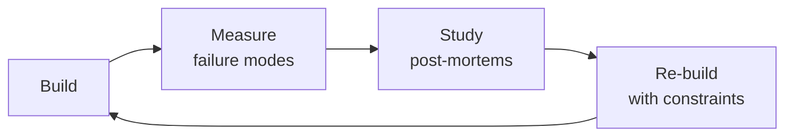

# Hardware Architect
> **Portability target:** Spec-level (runs on Claude Code, Copilot, Gemini CLI, Codex, Cursor). No vendor-specific frontmatter fields.

Hardware architecture and electronic system-level design — from SoC selection through PCB stackup to compliance testing. Covers the critical architectural decisions that determine a product's cost, performance, power consumption, and time-to-market.

## Route the Request

<!-- QUICK: 30s -- auto-route first, then intent-route -->

### Auto-Route (No User Input Required)
Evaluate these file-system conditions in order. First match wins — jump immediately.

| # | Condition | Action |
|---|-----------|--------|
| A1 | `file_exists("*.kicad_sch")` OR `file_exists("*.sch")` OR `file_contains("*", "(PCB.layout\|pcb.stackup\|layer.count\|impedance.control)")` | This is your skill. Jump to **Core Workflow** — Phase 1: Requirements & Architecture. |
| A2 | `file_exists("*.kicad_pcb")` OR `file_exists("*.brd")` AND `file_contains("*", "(BGA\|DDR\|high.speed.serial\|differential.pair)")` | Jump to **Core Workflow** — Phase 2: PCB Architecture & Stackup. |
| A3 | `file_exists("BOM*.csv|BOM*.xlsx|bill.of.materials*")` AND `file_contains("BOM*", "(supply.chain\|lead.time\|alternate\|second.source)")` | Jump to **Decision Trees** — Component Selection & BOM Risk. |
| A4 | `file_contains("*", "(thermal.simulation\|CFD\|junction.temp\|heatsink\|thermal.via)")` OR `file_contains("*", "(85.*C\|105.*C\|125.*C\|ambient.*temp)")` | Jump to **Core Workflow** — Phase 3: Thermal Design. |
| A5 | `file_contains("*", "(EMC\|EMI\|FCC\|CE.mark\|radiated.emission\|conducted.emission\|ESD.*test)")` | Jump to **Error Decoder** — EMC-related rows. |
| A6 | `file_contains("*", "(power.tree\|power.sequencing\|voltage.rail\|regulator\|LDO\|PMIC)")` AND NOT `file_contains("*", "PCB.*layout\|stackup")` | Jump to **Core Workflow** — Phase 4: Power Architecture. |
| A7 | `file_contains("*", "(MCU.*C\|FPGA\|SoC.*selection\|processor.*selection)")` AND `file_contains("*", "(interface\|peripheral\|IO.count\|GPIO)")` | Jump to **Decision Trees** — SoC/Processor Selection. |
| A8 | `file_contains("*", "(schematic.*review\|layout.*review\|design.*review\|DFM.*check)")` | Jump to **Production Checklist** — pre-fab signoff items. |

### Intent Route (Ask the User)
If no auto-route matched, use this intent tree:

## Ground Rules — Read Before Anything Else

<!-- QUICK: 30s -- negative constraints, mechanically triggered -->

| # | Negative Constraint | Mechanical Trigger | Violation Response |
|---|---------------------|--------------------|---------------------|
| G1 | **REFUSE to commit to PCB fabrication without pin mux review by firmware team.** | `file_exists("*.kicad_pcb")` OR `file_exists("*.brd")` AND NOT `file_exists("*pin-mux-review*")` | STOP. Every pin assignment must pass firmware team review before schematic freeze. Pin conflict = PCB respin ($15K-50K + 4-6 weeks). |
| G2 | **STOP if BOM uses single-source components without documented alternatives.** | `grep -c "single.source\|sole.source\|no.alternate" BOM*.csv` > 0 | HALT. Mark every BOM line: single-source (risk), multi-source (safe), EOL-risk. For single-source, identify and document alternative. |
| G3 | **DETECT datasheet typical power used for budgeting instead of max + derating.** | `file_contains("*", "typical.*µA\|typical.*mA\|datasheet.*typical\|typ\..*current")` AND NOT `file_contains("*", "max.*current\|derating\|20%.*margin")` | STOP. Budget using MAX numbers + 20% regulator derating. Measure actual at -20°C, 25°C, 60°C on first prototype. |
| G4 | **REFUSE to skip thermal simulation because "enclosure has vents."** | `file_exists("*thermal*")` AND `file_contains("*thermal*", "passive\|natural.convection\|vents.*enough")` AND NOT `file_exists("*thermal-simulation*")` | HALT. Run thermal simulation before PCB layout. Model worst-case: max ambient + max power + 20% margin. Identify hot components. |
| G5 | **STOP if EMC pre-compliance is deferred until after PCB fabrication.** | `user_message_contains("EMC.*after\|compliance.*later\|certification.*post")` AND `file_exists("*.kicad_pcb")` | HALT. EMC pre-compliance at prototype/breadboard stage. Budget for at least 1 EMC-related respin. Include EMC engineer in layout review. |
| G6 | **DETECT chip selection without evaluating 3+ alternatives in scored matrix.** | `file_contains("*", "selected.*processor\|chose.*SoC\|pick.*MCU")` AND NOT `file_contains("*", "(selection.matrix\|scored\|alternative.*compared\|3.*option)")` | STOP. Create scored selection matrix: interfaces, power, cost, ecosystem, lifecycle, second-source. Score 3+ options before commit. |
| G7 | **REFUSE to ship without DFT (Design for Test) provisions.** | `file_exists("*.kicad_sch")` AND NOT `grep -q "test.point\|debug.header\|UART.*debug\|bootloader.*LED" *.kicad_sch` | STOP. Add test points for every power rail, critical signal, programming interface, UART debug header, bootloader-status LED. |
| **R1** | **ANCHOR to runtime versions before generating framework-specific code.** Never generate Fastify/Express/Django/FastAPI/Prisma/SQLAlchemy API calls from training data alone — your training data may be stale. | Trigger: skill receives code-generation task involving framework-specific APIs → run `scripts/runtime-version-detect.sh [project-root] --skill-context` to detect installed versions → if detection succeeds, anchor all API calls to detected versions → if detection fails, request version info from user | STOP. Respond: "Detected: {runtime}@{version}, {frameworks}@{versions}. Anchoring all API calls to these versions. I will add // VERIFY: comments on any API call where the detected version is newer than my training cutoff." |
| **R2** | **RUN the ROI Gate before any non-emergency code change.** Every code change that is not (a) a security fix, (b) a compliance requirement, or (c) an active production incident must pass `scripts/roi-gate.sh`. If the gate returns negative, refuse to write the code. | Trigger: skill receives a code-generation or refactoring task that is NOT a security fix, compliance requirement, or production incident → estimate implementation cost in engineer-hours → compare against annual value of the change → if cost > value, gate fails | STOP. Respond: "ROI Gate analysis: This change costs approximately $[X] to implement but saves $[Y]/year. Payback period: [N] years. If payback > 2 years, I recommend declining this work. See `scripts/roi-gate.sh` for the full formula." |


- **Admit uncertainty — never fabricate.** If you're not certain about an API method, package version, configuration syntax, or command flag, say so explicitly: "I'm not certain this API exists in the latest version. Check the official docs at [URL]." Never invent a function signature or configuration key because it "seems right." Hallucinated code costs hours of debugging.
- **Flag your knowledge cutoff.** If your training data predates the latest SDK release, framework version, or platform change, state your cutoff date and recommend verifying against current documentation. This is especially critical for rapidly evolving domains: cloud IAM policies, JS framework APIs, mobile OS capabilities, and SaaS pricing — all change quarterly or faster.
- **Never guess security configurations.** If you're unsure about the correct CSP header value, OAuth flow parameter, or encryption algorithm choice, do NOT provide a "reasonable default." Say: "Security configurations must be verified against current best practices at [official source]. I cannot provide a definitive answer without current documentation."
- **Distinguish between what you know and what you infer.** Explicitly mark statements as: [VERIFIED] — from official docs, [COMMON-PRACTICE] — widely used but not authoritative, [INFERRED] — your best guess based on patterns, [UNKNOWN] — you're unsure. This helps the user calibrate trust in your output.
## The Expert's Mindset

Masters of hardware architect don't just build — they build **the right thing, at the right time, with the right trade-offs**. They think in systems, not tasks.

| Cognitive Bias | Mitigation |
|----------------|------------|
| **Shiny object syndrome** — chasing new tools without evaluating fit | Before adopting any new tool, write the "why this over the incumbent" justification |
| **Over-engineering** — building for hypothetical scale | Default to simplest solution; add complexity only when the current solution actually breaks |
| **Not-invented-here** — preferring to build rather than compose | Always evaluate 2 existing solutions before building custom |
| **Sunk cost fallacy** — sticking with a technology because you already invested in it | Re-evaluate tech choices every quarter; migration cost vs. staying cost |

### What Masters Know That Others Don't
- The **failure modes** of every component in their stack — not just the happy path
- When **not** to use their favorite tool (every tool has a misuse zone)
- That **data/model quality decays over time** — monitoring is not optional, it's foundational

### When to Break Your Own Rules
- **Move fast on reversible decisions.** Data format? Hard to change. Dashboard layout? Easy. Know the difference.
- **Skip the abstraction until the third use case.** Two is coincidence, three is a pattern.

## Operating at Different Levels

| Level | Scope | You... |
|-------|-------|--------|
| **L1** | Single component/module | Implement a well-defined piece following established patterns |
| **L2** | Feature or service | Design and build a complete feature; make tech choices within team conventions |
| **L3** | System or product area | Define architecture for a product area; set team tech standards; mentor L1-L2 |
| **L4** | Multiple systems / platform | Define org-wide architecture patterns; make build-vs-buy decisions; influence industry practice |
| **L5** | Industry / ecosystem | Create new architectural patterns adopted across the industry; redefine what's possible |

**Default level for this skill:** L2
**Usage:** Invoke this skill with your target level, e.g., "as an L3 hardware architect, design..."

For full level definitions, see `skills/00-framework/skill-levels/SKILL.md`.

## When to Use

<!-- QUICK: 30s -- scan the bullet list to decide if this skill fits -->

- Selecting a processor/SoC for your next embedded product — ARM Cortex-M vs -R vs -A, RISC-V, FPGA, or ASIC
- Defining memory architecture — what goes in SRAM, DRAM, Flash (NOR/NAND/eMMC/UFS), and external storage
- Designing the power tree — PMIC selection, LDO vs buck converter, power sequencing, battery management
- Choosing bus architecture — AMBA AXI vs AHB vs APB, peripheral interconnect, DMA topology
- Making PCB stackup and signal integrity decisions — layer count, impedance control, differential pairs, length matching
- Planning thermal management — heatsinking, airflow, thermal vias, junction temperature, TDP budget
- Evaluating EMC/EMI compliance path — pre-compliance testing, shielding, filtering, radiated emissions
- Making make-vs-buy decisions on IP blocks — licensing ARM cores, buying reference designs, custom silicon

**Use `/embedded-engineer` instead when:** You're implementing firmware on a chosen MCU — writing device drivers, configuring peripherals, optimizing for power. Hardware-architect picks the platform; embedded-engineer builds on it.


## Error Recovery

**(STANDARD)**

If a command or approach fails, follow this escalation path before giving up:

| Symptom | First Action | If That Fails | Last Resort |
|---------|-------------|---------------|-------------|
| Tool/command not found | Check installation: `which [tool]` or `[tool] --version`. Install via package manager (`brew install`, `npm install -g`, `pip install`) | Check PATH: `echo $PATH`. Verify the tool binary is in a PATH directory. Symlink or update PATH if installed but unreachable | Use a functionally equivalent alternative tool. If `rg` is unavailable, use `grep -r`. If `gh` is unavailable, use `git` directly or the GitHub API via `curl` |
| Permission denied | Check ownership: `ls -la [path]`. Fix with `chmod` or `sudo` if appropriate. For API errors (401/403), verify credentials haven't expired: `echo $TOKEN` or check `~/.netrc` | Refresh credentials: re-authenticate with the service. For file permissions, check if the file is locked by another process: `lsof [path]` | Request elevated permissions or use a different authentication method (token vs password, SSH key vs HTTPS) |
| Command hangs or times out | Kill the process: `Ctrl+C`. Re-run with a timeout: `timeout 30 [command]` or `gtimeout` on macOS. Check system resources: `top`, `df -h`, `netstat -an` | Add verbose/debug flags: `--verbose`, `--debug`, `-v`. Check logs: `tail -f [logfile]`. Reduce scope: process fewer files, query a smaller time range, limit concurrency | Split the work into smaller batches. Implement a retry loop with exponential backoff (1s, 2s, 4s, 8s). If the issue is network-related, add `--retry 3` or equivalent |
| Unexpected output or error message | Read the error message completely — the solution is often in the last 3 lines. Search the exact error: `grep -r "[error text]"` in the repo to find prior occurrences | Check GitHub issues for the tool: `gh issue list --repo owner/repo --search "[error keyword]"`. Check Stack Overflow | Simplify the approach. If the complex one-liner fails, break it into 3 sequential commands. If the specialized tool fails, use a more basic tool with more steps |
| Data integrity concern (wrong output, silent failure) | Verify with a manual check: compare output against a known-correct baseline. Add assertions: `[command] | grep -q "[expected]" && echo "OK" || echo "FAIL"` | Run the operation on a smaller subset first. Compare checksums: `shasum`, `md5`. Check for silent truncation: `wc -l` before and after | Abort and flag for human review. Do not proceed past data integrity failures — the cost of propagating bad data exceeds the cost of delay |

**Hard failure boundary:** If 3 different approaches all fail, STOP. Do not iterate infinitely. Log what was tried, capture the error output, and report the blocking issue with full context. Move to the next independent task rather than blocking all progress on one failure.

## Error Decoder — War Stories from the Trenches

**(STANDARD)**

When this domain goes wrong, it goes wrong in predictable ways. Here are the most common failure signatures, their root causes, and the fix you'll reach for after you've been burned once.

| Symptom | Root Cause | Fix | Lesson |
|---------|-----------|-----|--------|
| PCB passes DRC but first prototype run has 30% boards where the BGA won't reflow properly | The BGA pad geometry passed the fab house's design rules but the paste mask aperture was 1:1 with the pad — no reduction. During reflow, excess solder caused bridging on 0.5mm pitch BGAs at the board edges where thermal profile was uneven. | Reduce paste mask apertures to 80-90% of pad size for fine-pitch BGAs. Work with the assembly house on their specific paste mask recommendations — they know their stencil process. Add thermal reliefs near board edges. | PCB design rules pass the board house check but not the assembly house reality. Fine-pitch BGA paste mask design is as critical as trace routing. |
| Product fails EMI compliance testing 2 weeks before launch — the noise source is a switching regulator that passed simulation | The SPICE simulation of the switching regulator assumed ideal ground and no parasitic inductance. In the actual PCB, the ground return path for the switcher shared a via with a high-speed data line, creating a 200mV ground bounce at 2MHz that radiated through the power cable. | Never share ground vias between switching regulators and sensitive signals. Add a dedicated ground plane under the switcher with a solid return path. Simulate with parasitic extraction (not ideal SPICE). Pre-scan for EMI at a local lab before formal compliance testing. | EMI simulations without parasitic extraction are optimistic by 10-20 dB. The difference between "passes simulation" and "passes the chamber" is your ground return path design. |
| Prototype BOM cost is $127/unit but the target was $85 — the 3 most expensive parts were spec'd by the EE based on datasheet "typical application circuit" values | The EE selected components using the datasheet's reference design which uses premium parts (automotive-grade capacitors, extended-temperature inductors) to guarantee published performance. The product only needs commercial temperature range (0-70°C) and the reference design was over-spec'd. | Review every BOM line item against actual requirements, not datasheet recommendations. For each component, ask: (1) what's the actual operating temperature range? (2) what's the actual tolerance needed? (3) is there a commodity-grade equivalent? Target 80% of reference design cost for production. | Reference designs are marketing tools for component vendors. They spec premium parts to make their IC look good. Production BOMs need cost-optimized alternatives. |
| Enclosure tooling costs $85K but the mechanical team designed for a process the vendor doesn't support | The ID team designed snap-fit features requiring a 4-slide mold action. The chosen vendor's largest machine is 2-slide. The design needs a complete rework or a new (more expensive) vendor — both options add 8 weeks and $30K. | Send preliminary DFM (Design for Manufacturing) review to the molding vendor before finalizing the mechanical design. Get their feedback on: draft angles, undercuts, wall thickness, gate placement, and mold action count. Don't let the industrial design outrun manufacturing reality. | Tooling vendors know their machines better than you do. A 1-hour DFM review before design freeze saves $50K and 2 months of rework. |
| WiFi range is 40% below spec because the antenna matching network was tuned with the enclosure open | The RF engineer tuned the pi-network with a VNA on an open bench. When the enclosure was closed, the plastic housing detuned the antenna by 150MHz because its dielectric constant shifted the resonant frequency. | Tune antenna matching with the enclosure fully assembled, including all internal shields, battery, and LCD — everything that sits near the antenna. The closed-enclosure impedance is the real impedance. Document the tuning values for both open and closed states so you know the delta for future designs. | Antennas are part of the system, not the board. Tune with the enclosure closed or your matching network is solving the wrong problem. |
| Production yield drops from 98% to 72% after changing to a "pin-compatible" alternate IC due to supply shortage | The alternate op-amp was "pin-compatible" (same package, same pinout) but had different input bias current (10nA vs 1nA in the original). At the 500KΩ input impedance of the sensor front-end, the bias current created a 5mV offset that pushed 30% of units outside the calibration range. | Never accept "pin-compatible" at face value. Create a parameter comparison checklist: input bias current, offset voltage, GBW, slew rate, noise density, PSRR. For analog parts, simulate the alternate in the actual circuit, not just the datasheet. Qualify alternates on a pilot production run before full switchover. | "Pin-compatible" means the pinout matches, not that the circuit works. Analog IC substitutions need full requalification — parasitic parameters that were negligible at 1nA become showstoppers at 10nA. |

## Best Practices

1. **Design the PCB stackup before placing the first component.** Define layer count, copper weight, dielectric thickness, and impedance targets before schematic completion. A 4-layer board with solid ground and power planes is the minimum for any design with >10MHz signals. Specify controlled impedance for differential pairs (USB, Ethernet, PCIe, DDR) with ±10% tolerance. The stackup drives trace geometry, which drives layout — not the other way around.

2. **Perform signal integrity analysis on every high-speed interface before tape-out.** Pre-layout: simulate insertion loss, return loss, and crosstalk. Post-layout: extract S-parameters from the routed board and verify eye diagrams with IBIS models at worst-case PVT (process, voltage, temperature) corners. Length-match differential pairs to within 0.25mm for USB 3.0 (5Gbps) and 0.1mm for PCIe Gen4 (16Gbps). A 5mm mismatch on USB 3.0 closes the eye completely — the link drops to USB 2.0 speed.

3. **Budget junction temperature (Tj) for every power component under worst-case conditions.** Tj = T_ambient_max + (θJA × P_dissipation). The datasheet θJA assumes a specific board (4-layer, 1oz Cu, specific via density, still air). Your board's actual θJA may be 2x worse. Characterize θJA on your actual board with a thermal camera or thermocouple. Add 15°C margin below Tj_max. A component running at Tj_max continuously has a MTBF measured in months, not years.

4. **Select components with lifecycle analysis, not just electrical specs.** Check: production status (active/NRND/EOL), projected availability (5+ years from design-in), second-source availability (pin-compatible alternative from different manufacturer), and PCN (Product Change Notification) history. Single-source components require a documented risk assessment and mitigation plan. Subscribe to manufacturer EOL alerts. A $2 single-source regulator that goes EOL at month 4 of a 24-month production run = $150K-$500K redesign.

5. **Design for manufacturing (DFM) with your CM's capabilities in mind, not your lab's.** Ask your contract manufacturer for their DFM rules: minimum trace/space, minimum drill size, annular ring requirements, solder mask web minimums, and copper-to-edge clearance. Design to their rules, not the PCB fab's absolute minimums. A board that passes fab DRC but violates CM assembly rules has lower yield and higher rework. Test point coverage: ≥95% of nets accessible on the bottom side for bed-of-nails or flying probe.

6. **Design for test (DFT) as a first-class requirement.** Every voltage rail gets a test point. Critical signals (clocks, resets, serial buses) get test points. Include JTAG/SWD chain for all programmable devices. Add boundary scan (JTAG) coverage for interconnects between BGA devices where physical probing is impossible. A board without test points that fails functional test = a board you cannot debug. The cost of adding test points is $0.00 per board; the cost of debugging without them is hours per failure.

7. **Perform power integrity analysis — PDN design is not "add some decoupling caps and hope."** Model the power distribution network: VRM output impedance, plane inductance, decoupling capacitor placement, and IC package parasitics. Simulate the PDN impedance vs frequency — target <100mΩ from DC to 100MHz. Place decoupling capacitors as close as physically possible to IC power pins (every millimeter adds ~1nH of inductance). A 100nF cap at 20mm distance has ~20nH loop inductance and resonates at ~112MHz — useless for a 500MHz CPU core.

8. **Design EMC compliance in from the schematic, not patched at the test chamber.** Identify noise sources (switching regulators, clock oscillators, high-speed buses) and victims (analog sensors, radios, external cables). Apply: local decoupling at noise sources, series ferrite beads on power inputs, common-mode chokes on external cables, ground stitching vias along board edges, and continuous ground planes. Pre-compliance testing at a local lab ($500-$2K) catches issues before the $10K+ formal compliance test. Failures at the chamber cost 5-10x more to fix than pre-compliance findings.

9. **Apply high-speed design rules with discipline, not hope.** Controlled impedance traces: route over continuous reference plane, avoid splits and gaps. Differential pairs: length-match within tolerance, maintain constant spacing, minimize vias. DDR memory: match data byte lanes, match address/command/control to clock. Avoid right-angle turns (use 45° or arc routing). Via stitching along high-speed traces: ground vias every λ/10 (at 5GHz, λ = 6cm, via spacing = 6mm max). One missed rule on a DDR bus = intermittent memory corruption under specific temperature and voltage conditions.

10. **Invest in reliability engineering before field deployment.** HALT (Highly Accelerated Life Testing): stress prototypes with rapid thermal cycling (-40°C to +125°C), 6-axis vibration, and voltage margining until failures occur. Fix root causes, not symptoms. Accelerated life testing: operate at elevated temperature and voltage to compress 5 years of aging into weeks. Calculate MTBF with actual component failure rates (MIL-HDBK-217 or Telcordia), not datasheet marketing numbers. A product with a 2% annual failure rate on 100K units generates 2,000 returns per year — each costing $75-$150 in logistics alone.

## Error Decoder

| Error Message / Situation | Root Cause | Fix | Lesson |
|--------------------------|------------|-----|--------|
| Decoupling cap too far from IC pin (20mm = useless) | Trace inductance from cap to IC pin is ~20nH at 20mm. Combined with the cap's ESL, the loop inductance forms a resonant tank at a much lower frequency than intended — the cap provides zero decoupling at the IC's operating frequency | Place decoupling caps on the same side as the IC, within 3mm of power pins. Use multiple via pairs (power + ground) directly at the capacitor pad to minimize loop inductance. For BGAs, place caps on the opposite side directly under the IC with microvias | Every millimeter of trace between capacitor and IC pin adds ~1nH of inductance. At 500MHz, 1nH = 3.14Ω impedance — the decoupling cap is electrically invisible. Placement is the dominant factor, not capacitance value |
| I2C pull-up too weak for 400kHz with 4 slaves | Bus capacitance scales with slave count and trace length. 4 slaves + 50cm traces ≈ 200pF. With 10KΩ pull-ups, RC rise time = 2.2µs > 1.25µs bit period at 400kHz — SDA never reaches logic high before the next clock edge | Calculate Rp(min) and Rp(max): Rp(max) = tr / (0.8473 × Cbus) for the required rise time. For 400kHz with 200pF: Rp(max) ≈ 2.4KΩ. Verify with an oscilloscope on the actual board — SCL and SDA must reach V_IH with margin | I2C pull-up calculation is mandatory, not optional. The 10KΩ default works on a breadboard with one slave at 100kHz but fails in real systems. Every bus configuration requires calculation and oscilloscope verification |
| Switching regulator hot loop is a 2MHz antenna | The high di/dt loop (input cap → switch node → inductor → output cap → ground) encloses physical area on the PCB. If the loop area exceeds 10mm², the magnetic field radiation couples into nearby analog traces and external cables | Minimize hot loop area: place input capacitor directly adjacent to regulator pins, use a solid ground plane on layer 2, keep the switch node copper area as small as possible (it's the primary radiator). Use a shielded inductor. Verify with near-field probe and spectrum analyzer | Switching regulator layout is an antenna design problem. The hot loop radiates at the switching frequency and harmonics. Good layout achieves CISPR 22 Class B with margin; bad layout fails by 20dB. The schematic is identical — the layout is everything |
| USB 3.0 differential pair length mismatched by 10mm | At 5Gbps, intra-pair skew tolerance is tight. 10mm mismatch ≈ 50ps skew at ~150ps/25mm propagation delay in FR4. The eye diagram closes by >25% — the receiver can't reliably distinguish 0 from 1, and the link negotiates down to USB 2.0 speed (480Mbps) | Length-match SuperSpeed differential pairs to within 0.25mm. Use serpentine routing (accordion pattern) on the shorter trace to add length. Verify in PCB CAD with the "length tuning" tool. Post-layout: extract and simulate eye diagram with IBIS-AMI models | A USB 3.0 port that runs at USB 2.0 speed has all the cost of SuperSpeed routing with none of the benefit. Length matching is a go/no-go criterion — there is no "close enough" at 5Gbps+ |
| Thermal simulation trusted datasheet theta-JA | Datasheet θJA is measured on a JEDEC standard board (4-layer, 1oz Cu, specific copper area, still air). Your 2-layer board with different copper weight and airflow has θJA 1.5x-3x higher. At 2W dissipation, the 40°C/W datasheet θJA predicts 80°C rise; actual board sees 120°C rise = junction exceeds Tj_max | Characterize θJA on your actual board. Use a thermal camera during operation or attach thermocouple to IC case and calculate Tj = T_case + (θJC × P). Run worst-case: max ambient + max load + minimum airflow. If margin is <15°C, add heatsink, thermal vias, or copper area | Datasheet θJA is a comparison metric between packages, not a design value. It's measured under idealized conditions that your board doesn't replicate. Always characterize actual thermal performance — semiconductor lifetime halves for every 10°C rise above rated |
| Single-source component goes EOL at month 4 of 24-month production | No lifecycle analysis was performed at design-in. The component was already NRND (Not Recommended for New Design) when the schematic was captured. The manufacturer issued a PCN with a 6-month last-time-buy window, but no one was subscribed to alerts | Every BOM component at design-in must: check lifecycle status (active/NRND/EOL), verify projected availability (5+ years), identify second-source alternatives (pin-compatible, different manufacturer), subscribe to manufacturer PCN alerts. Quarterly BOM health review flags any component within 12 months of projected EOL | A single $2 component that goes EOL triggers a $150K-$500K redesign cycle (engineering + respin + tooling + lost production). Component lifecycle management is not procurement's job — it's the design engineer's responsibility at component selection time |

## Cross-Skill Coordination

<!-- QUICK: 30s — who to talk to, when, what to share -->

Hardware architecture decisions cascade through the entire product development lifecycle. A wrong SoC selection costs 6+ months and $100K+ in respins. Every architectural decision must be validated with downstream teams before committing to silicon.

### Coordinate With

| Coordinate With | When | What to Share/Ask | Decision Gate / Artifact |
|-----------------|------|-------------------|--------------------------|
| **System Architect** | Product requirements definition, system-level tradeoffs | Power budget, latency budgets, throughput requirements, cost targets | Gate: System architecture review before SoC downselect. Artifact: System requirements document with hardware constraints. |
| **Embedded Engineer** | MCU/MPU selection, peripheral assignment, pin muxing, clock tree | Peripheral conflict analysis, GPIO drive strength, ADC reference, ISR latency budget | Gate: Pin mux review before schematic freeze. Artifact: Pin assignment spreadsheet with alternate functions. |
| **Firmware Developer** | Memory map, boot pin strapping, secure element integration, flash partitioning | Flash/RAM sizing, external memory interface, secure element protocol, boot sequence | Gate: Memory map review before PCB layout. Artifact: Memory map document with linker script constraints. |
| **Performance Engineer** | Signal integrity analysis, power integrity, thermal simulation, EMC pre-compliance | PCB stackup, impedance targets, decoupling strategy, thermal budget | Gate: Signal integrity sign-off before fab. Artifact: SI/PI simulation report with margin analysis. |
| **Documentation Engineer** | Hardware architecture specification, design decisions log, compliance test plan | Architecture decisions, component selection rationale, regulatory requirements | Gate: Architecture spec finalized before detailed design. Artifact: Hardware architecture specification document. |

### Communication Triggers

| Trigger | Notify | Why | Decision Gate |
|---------|--------|-----|---------------|
| Silicon errata with no workaround | System Architect, Embedded Engineer, Firmware Developer | Chip reselection may be required | Gate: Reselection decision within 5 business days. |
| BOM cost exceeds target >15% | System Architect, Product Manager | Design-to-cost review; component substitution | Gate: Cost review board approval before proceeding. |
| EMC pre-compliance failure >6dB | Performance Engineer, Firmware Developer | PCB respin or shielding design | Gate: Fix-or-respin decision with VP Engineering. |
| Power budget exceeded >20% | Embedded Engineer, Firmware Developer | PMIC reselection; power tree redesign | Gate: Power tree review before next prototype. |
| Component EOL with no drop-in replacement | System Architect, Embedded Engineer | Redesign or lifetime buy | Gate: Redesign decision within 10 business days. |

### Escalation Path

```
Silicon errata, no workaround? → System Architect → Chip reselection → +8 weeks schedule impact
EMC failure >6dB over limit? → Performance Engineer → PCB respin → $15K-50K + 4-6 weeks
BOM cost >25% over target? → Product Manager → Redesign or pricing adjustment
Thermal junction temp exceeds rating? → Performance Engineer → Heatsink redesign or clock reduction

```

### Cross-Skill Chain

```bash
# System Architecture → Hardware Architecture → Embedded bring-up → Firmware → QA
/system-architect && /hardware-architect && /embedded-engineer && /firmware-developer && /qa-engineer

```


| Upstream Skill | What You Receive | When to Involve |
|---|---|---|
| `system-architect` | Hardware-software boundaries, communication protocols, constraints | Before designing embedded or firmware systems |
| `embedded-engineer` | Microcontroller selection, RTOS, peripheral interfaces | Before writing firmware or hardware-specific code |


## Proactive Triggers

| Trigger | Action | Why |
|---|---|---|
| Silicon errata published for selected MCU/MPU — affects a peripheral in your design | Evaluate workaround feasibility within 48 hours: classify as firmware-workaroundable, hardware-respin-required, or acceptable-degradation; notify embedded and firmware teams | Ignoring errata leads to field failures that appear intermittent and take months to root-cause |
| Key component shows lead time >20 weeks on distributor check | Identify alternative component immediately; if no drop-in replacement, initiate redesign feasibility assessment within 1 week | 52-week lead times have killed production schedules — component availability must be validated before schematic freeze, not at BOM release |
| EMC pre-compliance scan shows emissions >3dB over limit on any frequency | Root-cause before PCB fab: check return paths, decoupling, stackup; 3dB margin is the minimum — aim for 6dB to absorb production variation | Fixing EMC after tooling is 10x more expensive than during design; every dB over limit adds weeks to certification |
| Thermal simulation shows junction temperature within 10°C of maximum rating | Redesign thermal solution: larger heatsink, better airflow, or clock reduction; 10°C margin is consumed by manufacturing variation and dust accumulation | Junction temp at 90% of max in simulation = field failures at 18 months when dust and ambient conditions degrade cooling |
| BOM cost exceeds target by >15% at component selection phase | Initiate design-to-cost review: identify top 5 cost drivers; evaluate cheaper alternatives with equivalent specs; present trade-offs to product manager | Cost overruns discovered after design freeze are locked in — early intervention preserves margin without compromising schedule |
| Second-source supplier discontinues pin-compatible alternative to your primary IC | Flag as single-source risk immediately; if primary supplier also has constrained capacity, start redesign feasibility for alternative architecture | Losing second-source turns a managed risk into a single point of failure — treat as severity 1 supply chain incident |
| Firmware team reports flash/RAM >85% on current build with features still in development | Trigger memory optimization review: evaluate feature deferral, compression, or chip upgrade; flash exhaustion discovered post-design = PCB respin | Flash/RAM headroom is an architectural constraint set during chip selection — running out means the architecture was wrong |
| >2 field returns show same component failure (same batch, same failure mode) | Suspect component quality issue or design margin problem; halt production if failure rate suggests systemic defect; initiate root cause analysis with supplier | Pattern of identical failures is never coincidence — every day of continued production compounds the liability |

## Decision Trees

**(QUICK)**

<!-- QUICK: 30s -- follow the ASCII tree to your scenario -->

### Processor Architecture Selection

```
                      ┌──────────────────────────┐
                      │ START: What are your      │
                      │ compute requirements?     │
                      └───────────┬──────────────┘
                                  │
                    ┌─────────────▼─────────────┐
                    │ Real-time deterministic    │
                    │ response required?         │
                    └────┬─────────────────┬────┘
                         │ YES (≤1μs jitter)│ NO
                    ┌────▼──────────┐ ┌─────▼──────────────────────┐
                    │ Is compute    │ │ Running Linux or rich OS?  │
                    │ moderate?     │ └────┬─────────────────┬─────┘
                    │ (sensor fusion │      │ YES             │ NO
                    │ motor control,  │ ┌────▼──────────┐ ┌───▼──────────┐
                    │ closed-loop)    │ │ Cortex-A or   │ │ Cortex-M     │
                    └────┬──────────┘ │ RISC-V U54.   │ │ (M0-M7) or   │
                         │ YES        │ MMU required   │ │ RISC-V E31   │
                    ┌────▼──────────┐ │ for memory     │ │ or RISC-V    │
                    │ Cortex-R or   │ │ management.    │ │ based MCU.   │
                    │ RISC-V R      │ └────────────────┘ └──────────────┘
                    │ series.       │
                    │ Lockstep      │
                    │ cores for     │
                    │ safety.       │
                    └───────────────┘
```

**Cortex-M** (M0-M7): MCU class. No MMU, typically FreeRTOS/Zephyr or bare-metal. Power µA to mA. For sensors, wearables, IoT endpoints. **Cortex-R:** Real-time, deterministic, lockstep for safety. For automotive, industrial, medical. **Cortex-A:** Application processor with MMU. Runs Linux/Android. For gateways, HMI, cameras. **RISC-V:** Emerging. No licensing fees, but ecosystem maturity depends on vendor (SiFive, Bouffalo, ESP32-C).

**FPGA vs ASIC decision:** < 10K units → FPGA. 10K-100K → FPGA or structured ASIC. > 100K → custom ASIC. ASIC NRE is $2-10M+ for 28nm and below — only if volume justifies it.

### Memory Architecture Decision

```
                     ┌──────────────────────────┐
                     │ START: What's the primary │
                     │ execution memory?         │
                     └───────────┬──────────────┘
                                 │
                   ┌─────────────▼─────────────┐
                   │ Code executes from?        │
                   └────┬─────────────────┬────┘
                        │ Flash (XIP)     │ RAM
                   ┌────▼──────────┐ ┌─────▼──────────────────────┐
                   │ NOR Flash for  │ │ Need > 512MB?             │
                   │ XIP. Lower     │ └────┬─────────────────┬────┘
                   │ density (up to │ │ YES             │ NO
                   │ 256MB), faster │ ┌────▼──────────┐ ┌───▼──────────┐
                   │ random read.   │ │ DDR3/DDR4     │ │ SRAM or      │
                   │ Typical for    │ │ or LPDDR4.    │ │ SDRAM.       │
                   │ MCU apps.      │ │ DRAM needs    │ │ SRAM is      │
                   └────────────────┘ │ refresh +     │ │ fastest +     │
                        │ NAND Flash  │ longer boot. │ │ lowest power. │
                   ┌────▼──────────┐ └───────────────┘ └──────────────┘
                   │ NAND/eMMC for │
                   │ storage.      │
                   │ Multi-level   │
                   │ (MLC/TLC) for │
                   │ density, SLC  │
                   │ for reliabil- │
                   │ ity. eMMC     │
                   │ simplifies    │
                   │ management.   │
                   └────────────────┘
```

**SRAM:** Fastest, lowest power, most expensive ($10-50+/MB). For cache, < 1MB scratchpad. **SDRAM:** Good balance for MCU applications with > 64KB needs. **DDR:** For application processors. LPDDR for battery-powered. **NOR Flash:** For XIP (eXecute In Place). No boot RAM needed. 1-256MB. **NAND Flash:** For storage. TLC/QLC for density, SLC for reliability. eMMC handles bad block management and wear leveling for you.

## Core Workflow

**(STANDARD)**

<!-- QUICK: 30s -- scan phase titles to understand the process -->
<!-- DEEP: 10+min -->

### Phase 1 (~20 min): Requirements Capture
**Steps:** 1) Define compute requirements: MIPS/DMIPS, real-time guarantees, determinism needs, FPU requirement, DSP capability 2) Define I/O requirements: peripheral count (SPI, I2C, UART, CAN, USB, Ethernet), GPIO count, ADC channels/rate, display interface 3) Define power budget: active current, sleep current, peak current, thermal envelope, battery life target 4) Define environmental: operating temperature, vibration, humidity, IP rating, safety certification (IEC 61508, ISO 26262, DO-254) 5) Define cost targets: BOM cost, tooling/NRE, development time, volume ramp plan
**What good looks like:** Requirements document with 5 specific constraints (compute, I/O, power, environmental, cost) — all quantified with ranges, not absolutes.

### Phase 2 (~30 min): SoC/Processor Selection
**Steps:** 1) Map requirements to processor class using the decision tree above 2) Create a shortlist of 3-5 processor families (e.g., STM32H7, NXP i.MX RT, TI AM64x) 3) Compare on: performance, power, price, ecosystem (tools, SDK, community), availability (lead time, lifecycle status), security features (secure boot, TRNG, crypto accelerator) 4) Check for second-sourcing options — what happens if this chip has a 52-week lead time? 5) Select and document rationale — keep the alternatives section for when the chosen chip goes EOL
**What good looks like:** Selection document with 5 processor candidates, scored on 7 criteria (performance, power, price, ecosystem, availability, security, second-source), with the winner and runner-up documented. A new engineer understands why this chip was chosen.

### Phase 3 (~25 min): Memory & Storage Architecture
**Steps:** 1) Determine execution memory (XIP Flash vs DRAM) using decision tree 2) Size Flash: firmware image size × 2 (for OTA dual-bank) + file system (if needed) + bootloader + factory test + 30% headroom 3) Size RAM: stack + heap + buffers (DMA, display, audio) + OS kernel + application data + 30% headroom. Actual measurement beats estimation — build a prototype and measure. 4) Select storage: eMMC for ease (5.1 recommended) vs raw NAND (cheaper but requires ECC + bad block management) vs SDCard (removable but slower) 5) Consider external memory interface: QSPI vs OSPI vs parallel NOR vs DDR
**What good looks like:** Memory map document: base address, size, purpose, and timing requirements for every memory region. No region with "TBD" size.

### Phase 4 (~20 min): Power Tree Design
**Steps:** 1) Calculate total power budget: sum of all rail currents × voltages. Add 30% margin. 2) Choose regulator topology: PMIC (integrated, small footprint) vs discrete LDOs (low noise, analog) vs discrete buck converters (efficient > 100mA). Each rail gets a decision. 3) Define power sequencing: which rails come up in what order, with what delays. Use a sequencer IC or PMIC with configurable sequencing. 4) Define sleep modes: which rails stay on during sleep, wake sources, wake time budget. Measure actual sleep current early — datasheet typicals assume perfect conditions. 5) Battery management: charge IC (linear vs switching), fuel gauge (voltage vs coulomb counting vs impedance track), protection (over-current, over-temperature, under-voltage lockout)
**What good looks like:** Power tree diagram showing every voltage rail, the regulator feeding it, maximum current, sequencing order, and sleep mode state. Measured power consumption at each state (active/idle/sleep/deep sleep) within 10% of estimate.

### Phase 5 (~15 min): PCB & Signal Integrity Planning
**Steps:** 1) Determine layer count based on signal density and impedance requirements: 2-layer (simple, cheap, but SI poor), 4-layer (good SI, dedicated power plane), 6+ (high-speed, many supplies) 2) Define stackup: signal layer order, reference plane assignment, dielectric thickness, target impedance (50Ω single-ended, 90Ω differential, 100Ω differential) 3) Identify critical nets requiring length matching: DDR, high-speed serial (USB 3.0, PCIe, MIPI), differential pairs 4) Plan decoupling: bulk capacitance per rail, high-frequency decoupling per IC, placement proximity 5) Review with layout engineer — paper review before routing saves weeks
**What good looks like:** PCB stackup document with layer stack, target impedance, critical net list, decoupling strategy, and placement guidance. Layout engineer can start routing with zero questions about constraints.

### Phase 6 (~10 min): Compliance & Certification Planning
**Steps:** 1) Identify required certifications: FCC Part 15 (USA), CE (EU), UKCA, ISED (Canada), VCCI (Japan) — plus industry-specific (medical: IEC 60601, automotive: ISO 26262, industrial: IEC 61000) 2) Pre-compliance testing: evaluate radiated emissions, conducted emissions, ESD, surge, and immunity in-house before sending to certified lab. Pre-compliance catches 80% of issues at 10% of the cost. 3) Plan certification timeline: lab reservation (4-8 weeks lead), testing (1-2 weeks), remediation (variable, often 4-8 weeks). FCC certification typically 8-16 weeks from first submission. 4) Budget: FCC/CE pre-compliance $3-5K, full compliance $15-30K per product variant. Add 50% for first product.
**What good looks like:** Compliance plan with required certifications per target market, test house booked, pre-compliance schedule budgeted, and timeline mapped backward from launch date.

## Cross-Skill Integration

<!-- QUICK: 30s -- table of who to talk to when -->

| Step | Skill | What It Produces |
|------|-------|-----------------|
| **Before** | `embedded-engineer` | Firmware requirements, peripheral usage patterns, interrupt priorities → informs processor selection |
| **Before** | `firmware-developer` | Bootloader requirements, memory map needs, OTA architecture → informs memory sizing |
| **This** | `hardware-architect` | SoC selection, memory architecture, power tree, PCB stackup, compliance plan |
| **After** | `performance-engineer` | Hardware performance targets (clock speed, memory bandwidth, power budget) → performance baseline |
| **After** | `documentation-engineer` | Hardware architecture document, memory map, power tree → forms the hardware section of the product documentation |
| **After** | `qa-engineer` | Test requirements (thermal testing, EMC pre-compliance, HALT) → test plan input |


## State Log

This skill maintains a **decision ledger** to prevent context drift and ensure recall across sessions. Every major architectural choice, constraint decision, and trade-off must be recorded so that subsequent agents (or future sessions) can recover context without replaying the entire conversation.
## What Good Looks Like

A well-designed hardware architecture is invisible when it's right — the product works reliably across temperature, meets power targets on the first spin, and passes EMC with margin. Specifically:
- **The first prototype boots and communicates.** No power rail sequencing bugs, no clock configuration that needs a bodge wire, no "turns out this pin doesn't support that function." The SoC selection was right.
- **Power consumption is within 10% of estimate.** The power tree model, simulation, and measurement converge. No last-minute LDO swap because the regulator overheats.
- **EMC passes with margin on the first compliance test.** Pre-compliance caught the issues (bad clock routing, missing ferrites, poorly filtered I/O) before the expensive lab test.
- **Memory map is stable from day one.** No firmware rewrites because the memory architecture changed. The map had headroom for growth.
- **The hardware architecture document is the single source of truth.** A new engineer can read it and understand every decision: why this SoC, why this memory topology, why this regulator topology, why this stackup. The alternatives section explains what was rejected and why.

## Deliberate Practice


```mermaid
graph LR
    A[Build] --> B[Measure<br/>failure modes] --> C[Study<br/>post-mortems] --> D[Re-build<br/>with constraints] --> A

```

| Level | Practice | Frequency |
|-------|----------|-----------|
| **Novice** | Rebuild an existing system from scratch, then compare your design with the original | Monthly |
| **Competent** | Add a new constraint (10x data, zero downtime, etc.) to a familiar design and re-architect | Quarterly |
| **Expert** | Design the same system under 3 conflicting constraint sets; write a decision record for each | Quarterly |
| **Master** | Teach a junior to design a system; your role is to ask questions, not give answers | Monthly |

**The One Highest-Leverage Activity:** Every quarter, take a system you built 6+ months ago and redesign it from scratch with what you know now. Write down what changed and why.

## Anti-Rationalization — No Excuses

| Rationalization | Reality |
|---|---|
| "It works on the bench — we'll validate in the field" | Lab conditions (25°C, clean power, 30cm cables) hide 80% of field failure modes. Temperature extremes, voltage transients, EMI from nearby equipment, and vibration expose design flaws that bench testing never catches. Every hardware rev from field failures costs 3-6 months and $50K-$200K in re-spin. **Total cost: $150K-$500K per recall cycle — field failures found post-deployment are 10-50x more expensive to fix than pre-production validation.** |
| "Firmware updates are rare — we can require physical access for updates" | The average IoT device receives 3-5 security patches per year. Without OTA, each patch requires a technician visit ($150-$500/visit) or physical recall ($15-$40/unit in shipping + labor). At 50K deployed units and 3 patches/year: $7.5M-$75M annually in update logistics. Without updates, devices become vulnerable — and unpatched devices face liability. **Total cost: $2.25M-$75M/year in physical update costs for a 50K-unit fleet, or catastrophic liability from unpatched vulnerabilities.** |
| "Security through obscurity — no one will reverse-engineer our protocol" | Every consumer IoT device is reverse-engineered within weeks of release. Protocol dumps appear on GitHub, Shodan indexes your devices, and attackers automate exploitation. A $30 logic analyzer and open-source tools can extract firmware, find hardcoded keys, and map your protocol. Security through obscurity provides zero protection against any competent attacker. **Total cost: $500K-$5M in incident response, firmware rebuild, and brand damage when obscurity fails — which it always does.** |
| "The BOM cost is fixed — we can't afford better components" | A $0.50 capacitor instead of a $2.00 rated one saves $1.50/unit upfront. But a 2% field failure rate on 100K units = 2,000 returns at $75/unit in shipping, diagnosis, and replacement = $150K. The "$1.50 savings" cost $75K more than using the right part. Design-to-cost must account for total lifecycle cost, not just BOM. **Total cost: $100K-$500K in warranty claims and field returns from component cost-cutting that ignores reliability impact.** |
| "We'll fix it in the next hardware revision" | Hardware revisions take 3-6 months and $50K-$200K in engineering + tooling + certification. Meanwhile, every unit shipped with the known issue generates warranty claims, support tickets, and customer churn. A $5 PCB respin becomes $50K when factoring in compliance recertification (FCC, CE, UL). If the issue causes field failures, add recall logistics. Fix it in THIS revision. **Total cost: $50K-$500K per deferred fix — "next revision" fixes cost 10-100x more than fixing it now, plus accumulated warranty and support costs on already-shipped units.** |

## Anti-Patterns

- **Decoupling capacitor distance** — a 100nF cap 5mm from the IC pin filters noise at ~100MHz. At 10mm, it filters ~50MHz due to trace inductance. At 20mm, it's useless because the parasitic inductance forms a tank circuit at a different frequency. Place caps as close as physically possible — every millimeter matters.
- **I2C pull-up resistor sizing** — 10KΩ works on a bench with one slave and 10cm traces. At 400kHz with 4 slaves and 50cm traces, the bus capacitance is ~200pF and RC rise time = 2.2µs, longer than the 1.25µs bit period. Dropping to 2.2KΩ gets you 480ns rise time but increases power consumption. Calculate, don't guess.
- **Switching regulator layout** — the hot loop (input capacitor → regulator → output inductor → output capacitor → ground) carries 2A switching at 2MHz. If this loop encloses 1cm² of area, it's a 2MHz antenna broadcasting EMI into your analog sensors. Minimize hot loop area — every square millimeter is an antenna.
- **USB 3.0 SuperSpeed differential pairs** — at 5Gbps, a 2mm length mismatch between the differential pair creates a 10ps skew, closing the eye diagram by 5%. At 10mm mismatch, the eye is completely closed and the link drops to USB 2.0 speed. Length-match differential pairs to within 0.25mm.
- **Thermal design with junction-to-ambient (θJA)** — the datasheet says θJA = 40°C/W, so 2W = 80°C rise. But θJA assumes a 4-layer board with 1oz copper, specific via density, and still air. Your 2-layer board with different copper weight has a θJA of 80°C/W. 2W = 160°C rise = junction exceeds Tj_max. Measure, don't trust datasheet θJA.
- **Single-source components without lifecycle management** — a $2 voltage regulator from a single supplier goes EOL (end-of-life) with a 6-month last-time-buy window. Your product is only 4 months into a planned 24-month production run. Redesign costs: $50K in engineering, $100K in board respin and tooling, 3 months of lost production at $200K/month = $600K revenue impact. Alternative parts exist but have different pinouts — no drop-in replacement. **Total cost: $150K-$500K per single-source EOL event — a single $2 component choice triggering a six-figure redesign.** Fix: every BOM component must have a lifecycle status check at design-in. Single-source parts get a documented risk assessment and mitigation plan (last-time-buy buffer, pin-compatible second source, or redesign trigger at EOL notification). Subscribe to manufacturer PCN (Product Change Notification) alerts. Quarterly BOM health review flags any component within 12 months of projected EOL.
- **Not testing across the full operating temperature range before production** — board passes all tests at 25°C lab ambient. First winter field deployment: -20°C causes timing closure failures because clock tree skew exceeds margins. Summer: 85°C internal enclosure temperature triggers thermal runaway in the voltage regulator because quiescent current doubles. Field failures discovered after 5,000 units are already installed at customer sites. The OEM customer withholds payment on the entire shipment and demands rework at your expense. **Total cost: $200K-$1M in recall logistics (shipping, rework labor, expedited replacement boards) plus reputational damage — that OEM now requires a 12-month requalification period for any new design from your company.** Fix: design verification testing includes -40°C, +25°C, and +85°C (or your product's rated range) for all critical functions — power sequencing, timing, analog accuracy. Run a 24-hour thermal soak at each extreme before testing. Budget for a thermal chamber in prototype phase ($5K-$15K), far less than one recall.
- **Ground bounce in high-speed parallel buses** — 32 data lines switch from 0 to 1 simultaneously. The return current through the shared ground plane inductance (a few nH) creates a ground bounce of 0.8V. A receiver on the same ground reference sees 0.8V instead of 0V — and interprets a valid logic '0' as a logic '1'. The failure is intermittent: it only happens when all 32 bits switch together, which is 1% of data patterns. Passes bench testing, fails 1% of field operations. **Total cost: $75K-$300K in engineering debug time (3 engineers × 6 weeks hunting an intermittent signal integrity issue) and 2 months of delayed production ramp — $500K in revenue delay.** Fix: add ground return vias adjacent to every signal via (1:1 ratio for high-speed buses). Simulate simultaneous switching noise (SSN) in pre-layout SI simulation. Use series termination resistors to slow edge rates. On prototype, use a high-bandwidth oscilloscope with differential probes to measure ground bounce during worst-case switching patterns.

## Verification

- [ ] Schematic review: DRC (Design Rule Check) passes — zero violations
- [ ] Power budget: sum of all component max currents × voltage < power supply rating × 0.8 (20% margin)
- [ ] Signal integrity: differential pairs length-matched within 0.25mm, impedance controlled to spec (±10%)
- [ ] Thermal simulation: junction temperatures at max ambient + max load — all components within Tj_max
- [ ] EMC pre-compliance: conducted and radiated emissions test — within 6dB of target limits (margin for production variance)
- [ ] BOM review: all components have second-source alternative OR documented single-source risk with mitigation

## Verification Guardrails

Before delivering work, the agent must verify:

- [ ] **Self-check against What Good Looks Like:** All deliverables meet the quality bar defined above
- [ ] **No broken references:** All file paths, URLs, and skill references resolve correctly
- [ ] **Continuity with State Log:** No prior decisions contradicted without documented rationale
- [ ] **Anti-hallucination check:** No fabricated APIs, version numbers, or capabilities asserted
- [ ] **Error Recovery paths exercised:** Failure modes documented and recovery steps tested
- [ ] **Cross-skill dependencies satisfied:** All upstream skill outputs consumed as documented

If any checkbox fails, revise before delivering. When all pass, add to the state log.

## Production Checklist

**(STANDARD)**

- [ ] **[HW1]** Schematic DRC complete: design rule check passes with zero violations, all ERC (electrical rule check) warnings resolved, netlist matches schematic
- [ ] **[HW2]** Power budget verified: sum of all component max currents × voltage < power supply rating × 0.8 (20% margin), inrush current within supply limits, each voltage rail within tolerance at max load
- [ ] **[HW3]** Signal integrity analysis: differential pairs length-matched within tolerance (0.25mm for USB 3.0, 0.1mm for PCIe), impedance controlled to spec ±10%, eye diagrams simulated at worst-case PVT corners with IBIS models, crosstalk within budget
- [ ] **[HW4]** Thermal simulation complete: junction temperatures at max ambient + max load simulated for all power components, θJA characterized on actual board (not datasheet), all Tj within spec with ≥15°C margin, hotspot identified and mitigated
- [ ] **[HW5]** EMC pre-compliance tested: conducted emissions within 6dB of limits, radiated emissions within 6dB of limits, ESD tested at ±8kV contact / ±15kV air on all exposed connectors, immunity tested to applicable standards — formal compliance test has ≥90% probability of passing
- [ ] **[HW6]** BOM lifecycle verified: every component checked for active production status, projected availability 5+ years from design-in, second-source alternative identified for all single-source parts, PCN alerts subscribed, quarterly BOM health review scheduled
- [ ] **[HW7]** DFM review with contract manufacturer: board meets CM minimums for trace/space, drill size, annular ring, solder mask web, copper-to-edge, panelization and fiducials confirmed, CM sign-off obtained
- [ ] **[HW8]** DFT coverage verified: ≥95% net test point coverage on bottom side, JTAG/SWD chain accessible for all programmable devices, boundary scan coverage for BGA interconnects, every voltage rail has test point, critical signals (clocks, resets, buses) testable
- [ ] **[HW9]** Impedance control specified and verified: stackup documented with target impedance per layer, fab drawing specifies controlled impedance traces with tolerance, TDR measurement on first articles confirms impedance within ±10%
- [ ] **[HW10]** Decoupling analysis complete: PDN impedance simulated from DC to 100MHz, target <100mΩ, decoupling capacitors placed within 3mm of IC power pins, multiple via pairs per capacitor, bulk + ceramic + low-ESL capacitor mix appropriate for frequency range
- [ ] **[HW11]** Regulatory checklist: applicable standards identified (FCC Part 15, CE RED/EMC, UL/IEC 62368-1 safety, RoHS/REACH), test lab engaged, pre-compliance results reviewed, certification timeline integrated with production schedule
- [ ] **[HW12]** Reliability testing: HALT performed on prototypes with thermal cycling (-40°C to +125°C), 6-axis vibration, and voltage margining, failures root-caused and fixed, MTBF calculated with MIL-HDBK-217 or Telcordia, accelerated life test in progress — no field-deployment blockers

## References

Detailed reference material loaded on demand:

- **Anti-Patterns**: See [anti-patterns.md](references/anti-patterns.md)
- **Best Practices**: See [best-practices.md](references/best-practices.md)
- **Calibration — How to Know Your Level**: See [calibration.md](references/calibration.md)
- **Production Checklist**: See [checklist.md](references/checklist.md)
- **Error Decoder**: See [error-decoder.md](references/error-decoder.md)
- **Footguns**: See [footguns.md](references/footguns.md)
- **Scale Depth: Solo → Small → Medium → Enterprise**: See [scale-depth.md](references/scale-depth.md)

