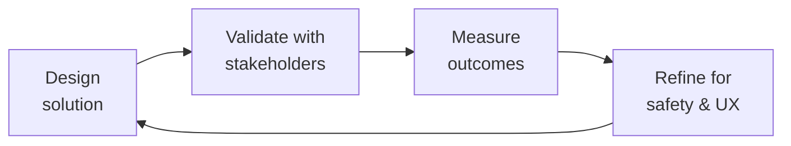

---
name: clinical-informatics-specialist
description: >
  Use when designing FHIR R4/R5 resources, integrating EHR systems (Epic, Cerner),
  mapping clinical terminologies (SNOMED CT, LOINC, ICD-10-CM, RxNorm), building
  health data exchange pipelines (HIE, TEFCA), modeling patient-reported outcomes
  (PROMIS, PRO-CTCAE), or implementing consent management for patient data sharing.
  Handles FHIR/HL7 interoperability, clinical data mapping, real-world evidence
  pipelines, rare disease registry data exchange, and HTC workflow integration.
  Do NOT use for general API development, UI/frontend work, or non-healthcare
  data integration.
license: MIT
author: Sandeep Kumar Penchala
type: health-clinical
status: stable
version: 1.1.0
updated: 2026-07-23
tags:
- clinical-informatics
- fhir
- hl7
- ehr
- healthcare-interoperability
- hemophilia
- patient-reported-outcomes
- real-world-evidence
token_budget: 4000
chain:
  consumes_from:
  - backend-developer
  - compliance-officer
  - patient-experience-researcher
  - regulatory-specialist
  feeds_into:
  - ai-safety-health-reviewer
  - data-engineer
  - health-regulatory-submission
  - medical-content-reviewer
  - patient-experience-researcher
  - patient-health-educator
  - product-manager
------
# Clinical Informatics Specialist

> **Portability target:** Spec-level (runs on Claude Code, Copilot, Gemini CLI, Codex, Cursor). No vendor-specific frontmatter fields.

Design, implement, and govern health data interoperability systems that bridge clinical workflows, EHR platforms, and research pipelines. This skill covers the full clinical informatics lifecycle — from FHIR resource modeling and EHR integration to real-world evidence data pipelines and patient consent management — with specialized depth in rare disease registries and patient-reported outcomes.

## Route the Request
<!-- QUICK: 30s -- auto-route first, then intent-route -->

### Auto-Route (No User Input Required)
Evaluate these file-system conditions in order. First match wins — jump immediately.

| # | Condition | Action |
|---|-----------|--------|
| A1 | `file_contains("*.fsh", "Profile:")` OR `file_exists("fsh/")` OR `file_contains("*.json", "\"resourceType\": \"StructureDefinition\"")` | FHIR profiling task. Jump to **Decision Trees > FHIR Resource Selection**. |
| A2 | `file_contains("*", "Epic")` OR `file_contains("*", "Cerner")` OR `file_exists("*.smart.config")` | EHR integration task. Jump to **Decision Trees > EHR Integration Path**. |
| A3 | `file_contains("*", "HIE")` OR `file_contains("*", "TEFCA")` OR `file_contains("*", "Direct Secure Messaging")` | Health data exchange task. Jump to **Decision Trees > Data Standard Selection**. |
| A4 | `file_contains("*", "Questionnaire")` OR `file_contains("*", "PROMIS")` OR `file_contains("*", "PRO-CTCAE")` OR `file_contains("*", "patient.reported")` | PRO pipeline task. Jump to **Core Workflow > Phase 2 (PRO Data Standards)**. |
| A5 | `file_contains("*", "SNOMED")` OR `file_contains("*", "LOINC")` OR `file_contains("*", "ICD-10")` OR `file_contains("*", "ValueSet")` | Terminology mapping task. Jump to **Core Workflow > Phase 3 (Terminology Mapping)**. |
| A6 | `file_contains("*", "Consent")` OR `file_contains("*", "consent.provision")` OR `file_contains("*", "purpose.of.use")` | Consent management task. Jump to **Core Workflow > Phase 4 (Consent & Governance)**. |
| A7 | `file_contains("*", "RWE")` OR `file_contains("*", "real.world.evidence")` OR `file_contains("*", "SDTM")` OR `file_contains("*", "ADaM")` | RWE pipeline task. Jump to **Best Practices > Real-World Evidence Pipelines**. |
| A8 | `file_exists("*.hipaa.config")` OR `file_contains("*", "HIPAA")` OR `file_contains("*", "regulatory")` | Compliance/regulatory task. Invoke `compliance-officer` skill. |

### Intent Route (Fallback — When No Auto-Route Matched)
```
What are you trying to do?
├── Design FHIR resources or profiles → Start at "Decision Trees > FHIR Resource Selection"
├── Integrate with an EHR system (Epic, Cerner) → Jump to "Decision Trees > EHR Integration Path"
├── Set up health data exchange (HIE, TEFCA) → Go to "Decision Trees > Data Standard Selection"
├── Build a patient-reported outcome (PRO) pipeline → Jump to "Core Workflow > Phase 2 (PRO Data Standards)"
├── Map clinical terminology (SNOMED, LOINC, ICD-10) → Go to "Core Workflow > Phase 3 (Terminology Mapping)"
├── Design consent management flows → Jump to "Core Workflow > Phase 4 (Consent & Governance)"
├── Build an RWE pipeline for pharma → Go to "Best Practices > Real-World Evidence Pipelines"
├── Need HIPAA compliance or regulatory guidance → Invoke `compliance-officer` skill instead
├── Need medical content clinical accuracy review? → Invoke `medical-content-reviewer` for evidence-based content validation
├── Need patient experience research or PROM validation? → Invoke `patient-experience-researcher` for patient journey mapping and PRO instrument selection
├── Need regulatory/safety review of clinical data flows? → Invoke `regulatory-specialist` for FDA/EU regulatory pathway guidance
├── Need AI safety validation for health content? → Invoke `ai-safety-health-reviewer` for clinical AI guardrail testing
├── Need backend integration for FHIR server? → Invoke `backend-developer` for FHIR API implementation
└── Don't know where to start? → Describe the clinical data source and target system and I'll route you
```
Do not read the entire skill. Follow the route above and read only the sections it points to.

## Ground Rules — Read Before Anything Else

These rules apply to *every* response this skill produces.

| # | Negative Constraint | Mechanical Trigger (detect before executing) | Violation Response |
|---|-------------------|---------------------------------------------|-------------------|
| **R1** | **REFUSE to design FHIR resources without a documented clinical workflow.** A resource models a real clinical interaction — without understanding the prescribing context (inpatient vs outpatient, specialty pharmacy, prior auth), the resource is a data skeleton, not a clinical asset. | Trigger: `file_contains("*", "StructureDefinition")` AND NOT `file_contains("*", "clinical.workflow")` AND NOT `file_contains("*", "use.case")`. | STOP. Respond: "I cannot design a FHIR resource without understanding the clinical workflow it supports. Please describe: (1) the clinical interaction (e.g., outpatient prescription, inpatient order, lab result), (2) the actors involved (patient, provider, pharmacist), and (3) the data flow direction. Then I'll model the resource." |
| **R2** | **REFUSE to exchange patient data without a traceable consent artifact.** Every data exchange must map to a valid Consent resource. Missing consent mapping is a HIPAA violation — not a technical gap. | Trigger: `file_contains("*", "data.exchange")` OR `file_contains("*", "$export")` AND NOT `file_contains("*", "Consent")` AND NOT `file_contains("*", "consent.provision")`. | STOP. Respond: "Patient data exchange requires a computable consent directive. I need: (1) the consent scope (treatment/payment/operations vs research), (2) granularity (all records vs specific encounters vs specific data categories), and (3) the jurisdiction's consent framework. I cannot proceed without these." |
| **R3** | **REFUSE to map terminology codes without version-pinning the ValueSet.** A SNOMED CT code for 'bleeding disorder' (64779008) is not 'hemophilia A' (28293008). Mapping without versioned ValueSets produces clinical decision support failures. | Trigger: `file_contains("*", "SNOMED")` OR `file_contains("*", "LOINC")` AND NOT `file_contains("*", "ValueSet.version")` AND NOT `file_contains("*", "terminology.edition")`. | STOP. Respond: "Terminology mapping requires versioned ValueSet authorities. I need: (1) the terminology edition (e.g., SNOMED CT 2025-03 International Edition), (2) the ValueSet canonical URI and version, and (3) the use case (diagnosis coding, lab ordering, clinical decision support). Code-level rigor prevents downstream harm." |
| **R4** | **REFUSE to deploy a PRO instrument without target-population validation.** A PROMIS-29 validated in adults with osteoarthritis does not apply to adolescents with hemophilia. Validation population, language, and literacy level must match the target. | Trigger: `file_contains("*", "Questionnaire")` OR `file_contains("*", "PRO")` AND NOT `file_contains("*", "validation.population")` AND NOT `file_contains("*", "PROMIS")` AND NOT `file_contains("*", "PRO-CTCAE")`. | STOP. Respond: "I need the PRO instrument's validation evidence for your target population. Provide: (1) the instrument name and version, (2) the validation study population (condition, age range, language, literacy), and (3) your target population demographics. I cannot deploy unvalidated PRO measures." |
| **R5** | **DETECT and flag real-world data pipelines that conflate correlation with causation.** RWE pipelines that skip confounder adjustment, lack negative controls, or omit sensitivity analyses produce conclusions that mislead clinical decisions and regulatory submissions. | Trigger: `file_contains("*", "RWE")` OR `file_contains("*", "real.world")` AND NOT `file_contains("*", "confounder")` AND NOT `file_contains("*", "negative.control")`. | FLAG. Respond: "This RWE pipeline design is incomplete. Real-world evidence requires: (1) confounder identification and adjustment strategy, (2) negative control outcomes to calibrate bias, and (3) sensitivity analyses (E-value, tipping-point). I'll proceed with the pipeline but annotate all outputs with a warning: 'Unadjusted RWE — do not use for regulatory or clinical decision-making.'" |
| **R6** | **REFUSE to generate a CCDA document from raw XML concatenation.** CCDA must be produced from a validated FHIR Composition via a canonical mapping table. String-concatenated CCDA fails ONC schematron validation and breaks interoperability. | Trigger: `file_contains("*", "CCDA")` OR `file_contains("*", "C-CDA")` AND NOT `file_contains("*", "Composition.section")` AND NOT `file_contains("*", "FHIR.Composition")`. | STOP. Respond: "CCDA generation requires a FHIR Composition as the source of truth. I need: (1) the FHIR Composition resource or its structure, (2) the CCDA document type (e.g., Continuity of Care Document, Referral Note), and (3) the ONC certification edition. I'll transform Composition.section entries via the canonical mapping table." |


## The Expert's Mindset

Master clinical informatics specialists carry a dual responsibility: technical excellence AND human impact. Every decision ripples through to patient outcomes, regulatory standing, and clinical trust.

| Cognitive Bias | Mitigation |
|----------------|------------|
| **Automation complacency** — over-trusting systems in high-stakes contexts | Every automated output gets a qualified human review before clinical action |
| **False precision** — treating uncertain data as exact because it's in a database | Always report confidence intervals; never present a single number without its range |
| **Normalcy bias** — assuming things will continue as they always have | Build "what if this fails?" scenarios into every rollout plan |
| **Documentation asymmetry** — over-documenting the routine, under-documenting the exceptions | Exceptions are the most valuable documentation; they teach the model, not just the rule |

### What Masters Know That Others Don't
- **The difference between statistical significance and clinical significance** — a p-value is not a treatment decision
- **Where the regulatory landmines are buried** — the 3 things that will trigger an audit versus the 30 things that won't
- **That patient experience and clinical accuracy are not trade-offs** — bad UX causes medical errors; good UX prevents them

### When to Break Your Own Rules
- **Escalate for safety, not for process.** If patient safety is at risk, bypass the chain of command.
- **Simplify for the patient.** Clinical precision means nothing if the patient can't understand or act on it.
## Operating at Different Levels

| Level | Scope | You... |
|-------|-------|--------|
| **L1** | Single deliverable | Execute defined procedures under supervision; follow protocols exactly |
| **L2** | Feature / study | Own a feature or study component; work within established regulatory frameworks |
| **L3** | System / program | Design systems that balance clinical needs, regulatory requirements, and technical constraints |
| **L4** | Product / therapeutic area | Define regulatory strategy; shape clinical development approach; influence industry guidance |
| **L5** | Industry / public health | Shape regulatory frameworks; define standards of care through evidence generation |

**Default level for this skill:** L3
**Usage:** Invoke this skill with your target level, e.g., "as an L3 clinical informatics specialist, design..."

For full level definitions, see `skills/00-framework/skill-levels/SKILL.md`.

## When to Use
<!-- QUICK: 30s -- scan the bullet list to decide if this skill fits -->
- Designing FHIR R4/R5 resource profiles for clinical data exchange
- Integrating with EHR systems (Epic/MyChart, Cerner) via FHIR APIs, HL7v2, or proprietary interfaces
- Building health data exchange pipelines (HIE networks, TEFCA, Direct Secure Messaging)
- Mapping clinical data from source systems to FHIR resources and internal data models
- Implementing patient-reported outcome (PRO) data collection with PROMIS or PRO-CTCAE
- Designing consent management workflows for granular patient data sharing
- Building real-world evidence (RWE) data pipelines for pharma and research partnerships
- Modeling rare disease registry data (e.g., Hemophilia Treatment Center workflows)
- Standardizing clinical terminology across SNOMED CT, LOINC, ICD-10-CM, RxNorm, and MedDRA

## Decision Trees
<!-- QUICK: 30s -- follow the ASCII tree to your scenario -->
### EHR Integration Path
```
                     ┌──────────────────────────────┐
                     │ START: EHR integration needed  │
                     └────────────┬─────────────────┘
                                  │
                    ┌─────────────▼─────────────┐
                    │ Is the target an Epic or   │
                    │ Cerner instance?           │
                    └────┬──────────────────┬────┘
                         │ YES              │ NO
                    ┌────▼────────┐   ┌─────▼──────────────┐
                    │ Use vendor-  │   │ Does the EHR expose │
                    │ specific     │   │ a FHIR R4 endpoint? │
                    │ FHIR APIs +  │   └────┬──────────┬─────┘
                    │ Epic App      │        │ YES      │ NO
                    │ Orchard /     │   ┌────▼────┐ ┌──▼────────┐
                    │ Cerner        │   │ SMART on │ │ HL7v2 or  │
                    │ Millennium    │   │ FHIR +   │ │ custom API│
                    │ APIs          │   │ USCDI    │ │ with      │
                    └───────────────┘   │ profiles │ │ mapping   │
                                        └──────────┘ └───────────┘
```
**When to use vendor-specific APIs:** Epic (App Orchard, MyChart Bedside, Epic FHIR) or Cerner (Millennium FHIR, PowerChart). >80% of US hospital EHR market. Leverage vendor-specific extensions for scheduling, medications, and provider directories that FHIR base resources don't cover. **When to use SMART on FHIR:** EHR-agnostic integration, single sign-on via OAuth2/OIDC, app launch from within EHR. Required for ONC Health IT Certification. **When to use HL7v2:** Legacy EHR systems without FHIR support, lab results (ORU^R01), ADT feeds (ADT^A01-A08). Map to FHIR as an intermediate normalization layer.

### Data Standard Selection
```
                     ┌──────────────────────────────┐
                     │ START: Health data exchange    │
                     │ standard selection             │
                     └────────────┬─────────────────┘
                                  │
                    ┌─────────────▼─────────────┐
                    │ Nationwide interoperability │
                    │ required (US)?              │
                    └────┬──────────────────┬─────┘
                         │ YES              │ NO
                    ┌────▼────────────┐  ┌──▼──────────────────┐
                    │ TEFCA + USCDI   │  │ Direct data exchange │
                    │ v4 (qualified   │  │ between known         │
                    │ health info      │  │ organizations?        │
                    │ networks)        │  └──┬───────────────┬────┘
                    └─────────────────┘     │ YES           │ NO
                                       ┌────▼────────┐ ┌───▼──────────┐
                                       │ Direct       │ │ HIE network  │
                                       │ Secure       │ │ (regional/   │
                                       │ Messaging    │ │ state-level) │
                                       │ (XDR/XDM)    │ │ via IHE       │
                                       └──────────────┘ │ profiles      │
                                                        └──────────────┘
```
**When to choose TEFCA:** National-scale interoperability, multi-network health data exchange, ONC compliance for Qualified Health Information Networks (QHINs). Use USCDI v4 data classes for minimum required data elements. **When to choose Direct Secure Messaging:** Point-to-point provider communication, transition of care (CCDA documents), known recipient endpoints. Simpler than HIE but doesn't scale to population health. **When to choose HIE network:** Regional or state-level data exchange, existing HIE infrastructure, population health analytics. Use IHE profiles (XCA, XDS.b, XCPD) for document query and patient discovery.

## Core Workflow
<!-- QUICK: 30s -- scan phase titles to understand the process -->
### Phase 1 (~25 min): FHIR Resource Design and Profiling
1. Identify the clinical use case and map it to FHIR resource types: Patient, Encounter, Observation, Condition, MedicationRequest, Procedure, CarePlan, Questionnaire/QuestionnaireResponse for PRO data.
2. Select FHIR version: R4 for broad EHR compatibility (Epic, Cerner support R4), R5 for new projects (improved Questionnaire, Subscription, Evidence-based medicine resources). R4 is production-safe; R5 is forward-looking.
3. Profile resources using FHIR StructureDefinition: constrain cardinality (0..1 → 1..1 for mandatory fields), bind ValueSets to coded elements (e.g., Condition.code bound to US Core Condition Codes), define extensions for custom data elements not in base resources.
4. Validate profiles against base FHIR specification using the FHIR validator (`org.hl7.fhir.validator`). Run `StructureDefinition.snapshot` generation to ensure differential constraints produce valid snapshots.
5. Document each profile with: clinical context, ValueSet bindings with OIDs, example instances, and mapping to source EHR fields. Share profiles via a FHIR ImplementationGuide on a public registry (Simplifier.net or local FHIR server).

### Phase 2 (~25 min): PRO Data Standards and ePRO Implementation
1. Select the appropriate PRO instrument for the clinical context: PROMIS (generic + domain-specific banks for physical function, pain, fatigue, depression), PRO-CTCAE (symptomatic adverse events in clinical trials), disease-specific instruments (e.g., Haem-A-QoL for hemophilia, HAL for hemophilia activities).
2. Model PRO instruments as FHIR Questionnaires: each item → Questionnaire.item, response options → answerValueSet, scoring logic → extension for scoring algorithm. Map responses to FHIR QuestionnaireResponse resources.
3. For electronic PRO (ePRO): design the administration schedule (daily diary, weekly assessment, pre-visit, post-treatment), configure reminders and adherence tracking, set up alert thresholds for clinician review (e.g., pain score >7 triggers nurse notification).
4. Validate the PRO instrument in the target population: check the validation study's sample size, demographics, language, literacy level, and condition match. Document the validation evidence with the instrument selection rationale.
5. Build the data flow: ePRO app → FHIR QuestionnaireResponse → FHIR server → Observation resources (scored items) → analytics pipeline. Ensure each scored item maps to a LOINC code for interoperability.

### Phase 3 (~30 min): Clinical Terminology Mapping and Normalization
1. Inventory all coded clinical data elements in the source system and identify the target terminology for each: diagnoses → SNOMED CT (or ICD-10-CM for billing), lab results → LOINC, medications → RxNorm, adverse events → MedDRA, procedures → SNOMED CT or CPT.
2. Build terminology maps using standard resources: UMLS Metathesaurus for cross-terminology mapping, NIH Value Set Authority Center (VSAC) for regulated ValueSets, FHIR ConceptMap resources for reusable mappings.
3. Handle code system versioning: each code must include the system URI (e.g., `http://snomed.info/sct`), code, and display. Track terminology version (e.g., SNOMED CT US Edition 2024-09-01) — codes can be retired, renamed, or reclassified across versions.
4. Implement terminology validation: all coded fields must validate against the declared ValueSet. Reject or quarantine data with codes outside the ValueSet. Log unmapped codes for manual curation.
5. For rare disease terminologies (hemophilia): supplement standard terminologies with Orphanet codes, HTC-specific extensions, and World Federation of Hemophilia (WFH) bleeding assessment tools mapped to SNOMED CT concepts.

### Phase 4 (~25 min): Consent Management and Data Governance
1. Model patient consent using FHIR Consent resources: define scope (treatment, payment, operations, research), actor (patient, legal guardian, authorized representative), provision (allow/deny by data type, purpose, recipient, time period).
2. Implement granular consent for HIE data sharing: patient can consent to share all records, specific encounter types only, exclude sensitive categories (mental health, substance use, HIV status, genetic data), or opt out entirely.
3. Integrate consent decisions into data access enforcement: every data access request checks the active Consent resource before returning data. Cache consent decisions for performance but invalidate on consent change.
4. For research and RWE use cases: ensure consent covers secondary use of data. De-identification (Safe Harbor or Expert Determination under HIPAA) may be required even with research consent. Document the legal basis for data use (consent, IRB waiver, HIPAA authorization).
5. Design consent revocation workflows: patient revokes consent → all downstream consumers notified → data access revoked within SLA (24 hours for HIE, immediate for EHR portal). Maintain an audit trail of consent changes.

### Phase 5 (~30 min): FHIR Implementation Patterns

FHIR is a specification, not a recipe. These patterns translate the spec into working code for the most common clinical integration scenarios.

**Epic/Cerner FHIR Endpoint Patterns:**

```python
# Epic FHIR R4 base URL convention
EPIC_BASE = "https://fhir.epic.com/interconnect-fhir-oauth/api/FHIR/R4"
# Cerner Millennium FHIR R4
CERNER_BASE = "https://fhir-ehr-code.cerner.com/r4/{tenant_id}"

# SMART on FHIR endpoint discovery via .well-known
# GET https://{ehr_base}/.well-known/smart-configuration
# Returns: authorization_endpoint, token_endpoint, scopes_supported, capabilities

# Patient-specific endpoints
def patient_endpoint(base_url: str, patient_id: str, resource: str) -> str:
    """Build patient-scoped FHIR endpoint."""
    return f"{base_url}/{resource}?patient={patient_id}"

# Example: all observations for a patient
# GET /Observation?patient=12345&category=laboratory&_lastUpdated=ge2024-01-01
```

**SMART on FHIR Authentication Flow:**

```python
# Standalone Launch (patient-facing apps)
# 1. Register app with EHR vendor → get client_id, client_secret
# 2. Redirect to EHR authorization endpoint
standalone_params = {
    "response_type": "code",
    "client_id": "{registered_client_id}",
    "redirect_uri": "https://myapp.com/callback",
    "scope": "launch/patient openid fhirUser patient/Observation.rs "
            "patient/MedicationRequest.rs patient/Condition.rs "
            "offline_access",  # for refresh tokens
    "aud": "{ehr_fhir_base_url}",
    "state": "{csrf_token}"
}
# 3. Exchange authorization code for access token
# POST /token → access_token + patient context (patient ID)

# EHR Launch (clinician-facing, launched from within EHR)
ehr_launch_params = {
    "response_type": "code",
    "client_id": "{registered_client_id}",
    "redirect_uri": "https://myapp.com/callback",
    "scope": "launch openid fhirUser patient/Observation.rs "
            "patient/MedicationRequest.rs user/Observation.rs",
    "aud": "{ehr_fhir_base_url}",
    "launch": "{launch_token_from_ehr}",
    "state": "{csrf_token}"
}
# EHR passes launch token — context includes current patient + user
```

**CDA/CCDA Generation from FHIR Composition:**

```python
# CCDA generation pipeline: FHIR Composition → CCDA XML
# Step 1: Fetch the Composition with all referenced resources
# GET /Composition/{id}?_include=*&_revinclude=*

# Step 2: Transform Composition sections to CCDA structured body
# Composition.section mapping:
CCDA_SECTION_MAP = {
    "allergies":   "2.16.840.1.113883.10.20.22.2.6",   # Allergies
    "medications": "2.16.840.1.113883.10.20.22.2.1",   # Medications
    "problems":    "2.16.840.1.113883.10.20.22.2.5.1", # Problem List
    "results":     "2.16.840.1.113883.10.20.22.2.3.1", # Results
    "vitals":      "2.16.840.1.113883.10.20.22.2.4.1", # Vital Signs
}

# Step 3: Use FHIR to CCDA transformation (e.g., XSLT or FHIRPath-based)
# Validate CCDA output against ONC 2015 Edition Cures Update schematron
# Run: schematron validate -s ccda.sch -d output.xml
```

**Bulk FHIR Export ($export):**

```python
# Bulk FHIR Export — population-level data export
# Step 1: Kick off export (async operation)
# GET /Patient/$export
# Or Group-level export for a defined cohort:
# GET /Group/{cohort_id}/$export
# Parameters: _type=Patient,Observation,Condition,MedicationRequest
#             _since=2024-01-01T00:00:00Z

# Step 2: Poll status endpoint from Content-Location header
# GET /_operations/export/{job_id}
# Response: { "transactionTime": "...", "request": "...",
#             "requiresAccessToken": true, "output": [...] }

# Step 3: Download NDJSON files
# Each output entry: { "url": "https://.../Patient.ndjson", "type": "Patient" }
# Download → validate format → process incrementally

# Step 4: NDJSON handling pattern
import ndjson
def process_bulk_export(file_url: str, access_token: str):
    """Stream NDJSON output from bulk export."""
    with requests.get(file_url, headers={
        "Authorization": f"Bearer {access_token}"
    }, stream=True) as r:
        for line in r.iter_lines():
            resource = ndjson.loads(line)
            yield resource  # process one resource at a time
```

**FHIR Resource Validation Against US Core Profiles:**

```python
# US Core profile conformance validation
# Option A: FHIR $validate operation against server
# POST /Observation/$validate
# Body: Observation resource
# Returns: OperationOutcome with issues[]

# Option B: Validate using FHIR Validator CLI (HAPI-based)
# java -jar org.hl7.fhir.validator.jar resource.json
#   -ig hl7.fhir.us.core#6.1.0
#   -profile http://hl7.org/fhir/us/core/StructureDefinition/us-core-observation-lab

# Option C: FHIRPath-based validation for specific constraints
fhirpath_checks = [
    # US Core Lab Observation: must have category of "laboratory"
    "Observation.category.where(coding.system='http://terminology.hl7.org/CodeSystem/"
    "observation-category' and coding.code='laboratory').exists()",

    # US Core Patient: must have identifier with system and value
    "Patient.identifier.where(system.exists() and value.exists()).exists()",

    # US Core Vital Signs: must have a numeric valueQuantity
    "Observation.value.ofType(Quantity).exists()",

    # US Core Condition: clinicalStatus is required
    "Condition.clinicalStatus.exists()",

    # MustSupport validation: check all MS elements are present
    "conformsTo('http://hl7.org/fhir/us/core/StructureDefinition/"
    "us-core-patient')"
]
```

**Key takeaway:** FHIR endpoints are predictable (`.well-known/smart-configuration`), authentication follows OAuth2 patterns, CCDA generation maps Composition sections to template OIDs, bulk export is async with NDJSON output, and US Core profile validation can be done server-side or client-side. Validate early — a resource that fails US Core conformance will break every downstream consumer.

## Cross-Skill Coordination
<!-- QUICK: 30s -- table of who to talk to when -->
Clinical informatics sits at the intersection of clinical workflows, data engineering, and regulatory compliance. Coordination ensures FHIR resources reflect clinical reality, data pipelines preserve semantic meaning, and consent frameworks meet legal requirements.

### Coordinate With

| Coordinate With | When | What to Share/Ask |
|-----------------|------|-------------------|
| **Health Compliance** | Consent design, HIPAA compliance, data sharing agreements | Consent model, data use purposes, HIPAA minimum necessary standard, BAAs with data recipients |
| **API Designer** | FHIR API design, SMART on FHIR endpoints, authentication | FHIR resource profiles, search parameters, operations ($validate, $match, $everything), OAuth2 scopes |
| **Database Designer** | Source-to-FHIR data mapping, terminology storage, audit trails | Source system schemas, terminology table design, consent storage model, audit log schema |
| **Data Engineer** | ETL pipelines for clinical data, FHIR server ingestion, RWE pipelines | FHIR resource schemas, mapping logic, terminology codes, data quality rules, refresh frequency |
| **Analytics Engineer** | Clinical data models for analytics, PRO score aggregation, RWE cohorts | FHIR-to-analytics mapping, PRO scoring algorithms, cohort definitions, terminology codes for filters |
| **Security Engineer** | Data access controls, encryption, audit logging | Patient data classification, consent-based access rules, de-identification requirements, audit trail retention |
| **UX Researcher** | ePRO instrument usability, patient portal experience, consent UX | PRO instrument design, consent flow usability, patient-facing terminology, health literacy considerations |

### Communication Triggers — When to Proactively Notify

| Trigger | Notify | Why |
|---------|--------|-----|
| FHIR resource schema change (new required field, breaking cardinality change) | Data Engineer, Analytics Engineer, API Designer | Downstream pipeline breakage; API version update |
| New terminology version released (SNOMED CT, LOINC, ICD-10-CM) | Data Engineer, Analytics Engineer | Remap codes; re-validate existing data; update ValueSets |
| Consent framework change (new regulation, updated policy) | Health Compliance, Security Engineer | Update Consent resources; re-validate access controls |
| PRO instrument change (new version, updated scoring) | Analytics Engineer, UX Researcher | Update scoring pipeline; re-validate patient-facing instruments |
| EHR vendor API deprecation | API Designer, Data Engineer | Migration timeline; alternative integration path |

### Escalation Path

```
Data sharing violation (unauthorized data release)? → Health Compliance → Legal Advisor → CEO
Interoperability failure (data exchange down > SLA)? → Data Engineer → System Architect → CTO
Clinical terminology mapping error (wrong code → wrong decision support)? → Clinical lead → Health Compliance
Patient consent system failure (consent not enforced)? → Security Engineer → Health Compliance → Legal Advisor
```

### Regulatory Handoffs & Clinical Validation Gates

| Handoff Trigger | Route To | Protocol | Regulatory Timeline |
|----------------|----------|----------|---------------------|
| New FHIR profile created for clinical data exchange | `compliance-officer` → `security-engineer` | Profile validation → HIPAA minimum necessary review → Data use purpose alignment → Consent mapping | Before profile deployment to production |
| Terminology mapping error discovered (wrong code → wrong clinical decision) | `medical-content-reviewer` → clinical lead | Quarantine affected data → Correct mapping → Re-validate downstream systems → Notify impacted analytics | Within 24 hours of discovery |
| EHR integration endpoint returns PHI without proper authorization | `security-engineer` → `compliance-officer` → `legal-advisor` | Halt data flow → Audit access logs → Patient notification assessment → Corrective action | Within 4 hours |
| Consent framework update required (new regulation, policy change) | `compliance-officer` → `legal-advisor` | Review regulatory requirement → Update Consent resource definitions → Re-validate existing consents → Deploy | Per regulatory deadline |
| PRO instrument changed (new version, updated scoring algorithm) | `patient-experience-researcher` → `data-engineer` | Validate new scoring → Update pipeline → Backfill historical scores → Notify analytics consumers | Before next data collection cycle |
| Real-world evidence (RWE) data sharing with pharma partner | `compliance-officer` → `legal-advisor` | De-identification verification → Data use agreement review → Patient consent scope validation → Audit trail setup | Before first data transfer |

**Clinical Validation Gates:**
- **FHIR profile validation gate:** Every FHIR StructureDefinition must pass FHIR validator before any integration code is written. Validated profile catches 80% of interoperability issues at design time. Artifact: FHIR validation report.
- **Terminology code accuracy gate:** All SNOMED CT, LOINC, ICD-10-CM codes validated against ValueSet authority for the target use case. "Close enough" code = clinical decision support failure. Artifact: Terminology mapping validation report.
- **Consent enforcement gate:** Every data exchange must trace to a valid, unexpired Consent resource with matching purpose-of-use and data scope. Missing consent = HIPAA violation. Artifact: Consent validation log per data exchange.
- **PRO instrument validation gate:** PRO instrument must be validated for target population (condition, age, language, literacy level). Unvalidated instrument = unreliable data. Artifact: PRO validation evidence summary.
- **De-identification verification gate:** Expert Determination or Safe Harbor verification before any data leaves the clinical environment. Re-identification risk must be certified as "very small." Artifact: De-identification certification.

## Proactive Triggers
<!-- QUICK: 30s -- "when X happens, do Y" -->

These triggers activate when a specific symptom or scenario emerges during clinical informatics work. Follow the diagnostic action immediately — don't wait for the problem to compound.

| Trigger | Immediate Diagnostic Action |
|---------|----------------------------|
| "Lab results aren't flowing into the EHR" | Check FHIR endpoint connectivity: verify `GET /metadata` returns capability statement, confirm `GET /Observation?category=laboratory&_lastUpdated=gt{last_seen}` returns results, validate OAuth2 token hasn't expired, and check EHR outbound interface queue for stuck messages. |
| "Patient data mapping is wrong — demographics don't match" | Run terminology server validation: check that the Patient.identifier system URI matches the assigning authority OID, verify demographics were mapped against the source EMPI (Enterprise Master Patient Index), and confirm no cross-patient merge/unmerge events changed the target record. |
| "FHIR resource validation fails with profile errors" | Execute US Core profile conformance check: run `$validate` against the targeted US Core profile, check `StructureDefinition.snapshot` for contradictory constraints, verify all MustSupport elements are populated, and ensure ValueSet bindings match the profile's strength (required vs extensible). |
| "Consent is blocking legitimate data access" | Audit the Consent.provision scope: check whether the provision's `purpose` and `data` scope are narrower than intended, verify the consent hasn't expired, confirm the patient's HIE opt-in status at the source EHR, and trace the consent decision path through the authorization service logs. |
| "PRO completion rate dropped below 60%" | Investigate the ePRO delivery pipeline: check whether reminder notifications are firing, verify the questionnaire is rendering correctly on all target device/browser combinations, audit for items with unusual skip patterns or 0% response, and review recent instrument version changes that may have introduced usability regressions. |
| "EHR API suddenly returns 403 for previously working calls" | Check app registration status: verify the SMART app hasn't been disabled or rotated by the EHR vendor, confirm the OAuth2 scopes haven't been narrowed, check for IP allowlist changes or rate-limit throttling, and review the EHR vendor's API changelog for breaking endpoint deprecations. |
| "Terminology service returns 'code not found' for known valid codes" | Audit terminology edition alignment: compare the code system version in the ValueSet expansion against the source data's code system version, check for code deprecation or replacement events in the terminology release notes, and verify the terminology server's loaded edition matches the expected version date. |
| "Bulk FHIR export job completes but NDJSON files are empty or truncated" | Diagnose the export pipeline: verify `_type` parameter includes the intended resource types, check `_since` filter isn't excluding all records, validate that NDJSON output files match the manifest's `output` array, and confirm the export client has read access (`patient/*.rs` or `system/*.rs` scopes) for the requested resources. |

## Best Practices
<!-- DEEP: 10+min -->
<!-- STANDARD: 3min -- rules extracted from production experience -->
- **Profile before you implement.** Write the FHIR StructureDefinition and validate it against the FHIR validator before writing any integration code. A validated profile catches 80% of interoperability issues at design time.
- **Use USCDI as your minimum data baseline.** USCDI v4 defines the minimum data classes required for nationwide interoperability. Start there, then extend with domain-specific profiles (e.g., Hemophilia IG, mCODE for oncology).
- **Map once, use everywhere.** Build a centralized terminology service with canonical mappings (SNOMED ↔ ICD-10-CM ↔ local codes). Every downstream system queries the terminology service — never duplicate mapping logic.
- **Consent is not a checkbox.** Consent is a FHIR Consent resource with computable provisions that downstream systems enforce programmatically. A checkbox in a UI without a backend Consent resource is a compliance gap.
- **PRO measures degrade without monitoring.** Track PRO completion rates, floor/ceiling effects, and response patterns. A PRO instrument with <60% completion rate or >20% ceiling effect is not producing valid data.
- **De-identification is not anonymous re-identification.** Expert Determination under HIPAA requires a qualified statistician to certify re-identification risk is very small. Safe Harbor (18 identifiers removed) is safer but may strip clinically useful data. Choose method based on use case.
- **Test with real clinical data shapes, not synthetic data.** Synthetic FHIR data misses edge cases — missing required fields, codes outside ValueSets, contradictory clinical statements. Use de-identified real data for integration testing.
- **Version everything.** FHIR profiles, terminology ValueSets, consent policies, PRO instruments, mapping tables — all versioned. A pipeline processing data from 2024 with 2026 terminology codes produces garbage.

## Anti-Patterns
<!-- STANDARD: 2min -- what to avoid and what to do instead -->

| ❌ Anti-Pattern | ✅ Do This Instead | 🔍 Detect (grep / lint) | 🛡️ Auto-Prevent |
|-----------------|---------------------|--------------------------|-------------------|
| Treating FHIR as a direct relational database — using `_include` and `_revinclude` like SQL JOINs across hundreds of resources | Model FHIR interactions as RESTful queries. Use `_include` sparingly (≤2 levels). For complex queries, use `$everything` or bulk export patterns, then post-process. | `grep -r '_include=' --include='*.http'` OR `grep -r '_revinclude=' --include='*.http'` — flag any request with >2 chained includes | Pre-commit hook: reject `.http` files with >2 `_include`/`_revinclude` parameters. Max-depth enforcer. |
| Hardcoding SNOMED CT or LOINC codes directly into application logic without a terminology service layer | Centralize all code lookups in a terminology service. Reference codes by display name or concept ID, resolve at runtime against the versioned ValueSet. Swap the ValueSet version without code changes. | `grep -rn '"code":\s*"[0-9]+"' --include='*.py' --include='*.ts' --include='*.js'` — flag raw numeric codes in source (not config) | Pre-commit hook: block numeric code literals in source files; require `terminology.resolve('displayName')` pattern |
| Copying patient data across systems without creating a Consent resource — relying on a checkbox or paper form alone | Model every data sharing authorization as a FHIR Consent resource with computable `provision` elements. The Consent resource is the source of truth; the UI is just the collection mechanism. | `grep -r 'data.exchange\|$export\|BulkData' --include='*.py' --include='*.ts' \| grep -v 'Consent'` — flag data exchange code lacking Consent references | Pre-commit hook: any data export module must import or reference `Consent` resource; block otherwise |
| Generating CCDA documents by manually string-concatenating XML templates without FHIR Composition as the source of truth | Start from a validated FHIR Composition. Transform Composition.section entries to CCDA structured body using a canonical mapping table. Validate output against ONC schematron rules. | `grep -r 'xml.etree\|ElementTree\|lxml\|<ClinicalDocument' --include='*.py' --include='*.ts' \| grep -v 'Composition'` — flag CCDA generation that doesn't reference FHIR Composition | CI gate: run `$validate` against US Core Composition profile before CCDA transform; block if validation fails |
| Creating one monolithic FHIR ImplementationGuide that covers every use case across the organization | Create modular, domain-scoped IGs: one for lab exchange, one for PRO capture, one for rare disease registry. Each IG defines only the profiles and ValueSets relevant to its clinical domain. | `grep -r 'ImplementationGuide' sushi-config.yaml \| wc -l` — flag if single IG defines >20 profiles across >3 clinical domains | Sushi linter rule: error if `sushi-config.yaml` defines profiles spanning >3 distinct clinical domains |
| Assuming the EHR vendor's default US Core profile implementation matches the published US Core spec exactly | Validate against the canonical US Core IG on every deployment. Vendors introduce custom extensions, relaxed cardinality, and proprietary search parameter modifiers. Profile conformance doesn't guarantee semantic conformance. | `grep -r 'USCore\|us-core' --include='*.json' \| grep -v 'canonical\|http://hl7.org/fhir/us/core'` — flag US Core references that don't use canonical URLs | CI pipeline: run `$validate` against canonical US Core IG (not vendor IG) on every deployment; block on non-conformance |
| Skipping $validate calls in CI/CD because "the FHIR server will catch errors at runtime" | Run `$validate` against US Core profiles as a CI gate. Catch conformance errors at build time — a resource that fails profile validation should never reach a production FHIR server. | `grep -r '\$validate\|validate' .github/workflows/` — flag CI configs that omit FHIR validation steps | CI gate: `fhir-validator` step required in every pipeline touching FHIR resources; block deployment if absent |

## Error Decoder
<!-- DEEP: 10+min -->

| 🖥️ Console Match (grep pattern) | Symptom | Root Cause | Fix | 🔄 Auto-Recovery Loop |
|--------------------------------|---------|------------|-----|----------------------|
| `Unknown extension.*not found` OR `Unable to resolve extension` | FHIR validator rejects resource with unknown extension | Unregistered extension URL — no StructureDefinition exists at the canonical URL | Register extension in StructureDefinition or IG; ensure canonical URL resolves to a valid definition | 1. `grep 'extension.*url'` the resource → 2. Check if URL resolves (`curl -I <url>`) → 3. If 404: `fhir-create-structuredefinition --url <url>` → 4. Re-validate: `fhir-validate --profile <url> <resource>` → 5. If still failing, check IG package dependency |
| `401 Unauthorized` OR `Bearer error="invalid_token"` | EHR API returns 401 for SMART on FHIR request | Expired or mis-scoped OAuth2 token; token doesn't include requested FHIR resource type scope | Refresh token; verify scopes include requested FHIR resource type; check EHR app registration in vendor portal | 1. `grep 'scope'` in token response → 2. Verify scopes include `patient/*.read` or the specific resource → 3. `curl -X POST <token-endpoint> -d 'grant_type=refresh_token&refresh_token=<token>'` → 4. Re-test with new token → 5. If still 401: check EHR app registration enabled for that resource type |
| `Code.*not found in ValueSet.*` OR `Unknown code.*in.*system` | Terminology service rejects code as not in ValueSet | Code from newer/older terminology edition than the bound ValueSet; deprecated code; or code from wrong code system | Update ValueSet to current terminology edition; add mapping for deprecated codes to active equivalents; quarantine unmapped data for manual review | 1. `grep 'ValueSet.version'` to verify edition → 2. Check code in UMLS/SNOMED browser for current status → 3. If deprecated: add `designation` with `deprecated` use context → 4. If wrong system: add `conceptMap` entry → 5. Re-run `$validate-code` → 6. If persistent: quarantine to `unmapped_codes` table for manual review |
| `completion rate.*0%` OR `score.*null` for specific PRO item | PRO data has 0% completion for a specific item across all patients | Item wording is unclear, embarrassing, or technically broken in ePRO rendering on target devices | Review item wording with UX Researcher; check ePRO rendering on iOS/Android; run cognitive debriefing with 3-5 patients; test on lowest-spec target device | 1. `grep 'null\|0%\|missing'` in PRO response data → 2. Isolate the specific item with 0% completion → 3. Render item on target device (real device, not emulator) → 4. Run cognitive debriefing with 3 patients: "What does this question mean to you?" → 5. If wording issue: revise and re-pilot → 6. If technical: fix ePRO rendering, re-deploy |
| `Consent.provision` returns `deny` for expected access OR data query returns empty | Consent resource silently blocks expected data access | Consent provision scope too narrow (wrong date range, wrong purpose-of-use code, wrong data category) or consent has expired | Review Consent.provision with compliance officer; verify date range vs query date, purpose-of-use codes match access intent; check consent status = `active` | 1. `grep 'Consent.status'` — must be `active` → 2. `grep 'Consent.provision.period'` — verify `start` ≤ today ≤ `end` → 3. `grep 'Consent.provision.purpose'` — verify matches access intent → 4. If provision mismatch: create new Consent version with corrected scope → 5. Notify downstream systems of consent change → 6. Re-run blocked query |

## Production Checklist
<!-- QUICK: 30s -- binary pass/fail items. All must pass. -->

| ID | Checklist Item | Validation Command | Auto-Fix |
|----|---------------|-------------------|----------|
| [CL1] | FHIR profiles (StructureDefinitions) created, validated, and published in an ImplementationGuide | `fhir-validate --profile http://hl7.org/fhir/us/core *.json && sushi build` | Run `sushi init` to scaffold IG; auto-generate StructureDefinition from spreadsheet |
| [CL2] | All coded elements bound to ValueSets with canonical URIs and version tracking | `grep -r 'binding' --include='*.fsh' \| grep -v 'canonical\|version'` — flag unversioned bindings | Run `fhir-add-valueset-version --edition 2025-03` to auto-pin all ValueSets to edition |
| [CL3] | EHR integration endpoint documented: vendor, FHIR version, authentication method, rate limits | `grep -r 'endpoint\|baseUrl' --include='*.config' --include='*.env'` — must return vendor + version entries | Run `fhir-doc-endpoint --vendor <name> --version <r4\|r5>` to generate endpoint config doc |
| [CL4] | SMART on FHIR app registered with EHR vendor; OAuth2/OIDC scopes defined per resource type | `grep -r 'scope' smart.config.json \| grep 'patient\|user\|system'` — must include resource-level scopes | Run `smart-register --scopes patient/Observation.read,patient/MedicationRequest.read` auto-scaffold |
| [CL5] | USCDI v4 data classes mapped and supported for all patient-facing data exchange | `grep -r 'USCDI\|uscdi' --include='*.fsh' --include='*.json' \| wc -l` — must cover ≥16 data classes | Run `uscdi-gap-report` to auto-identify missing data classes and generate stub profiles |
| [CL6] | Terminology service deployed with canonical mappings: SNOMED CT, LOINC, ICD-10-CM, RxNorm, MedDRA | `curl -s <terminology-server>/fhir/CodeSystem \| jq '.entry[].resource.url' \| wc -l` — must have ≥5 code systems | Run `terminology-bootstrap --systems SNOMED,LOINC,ICD10,RxNorm,MedDRA` to seed service |
| [CL7] | PRO instruments modeled as FHIR Questionnaires; scoring algorithms documented and validated | `grep -r 'Questionnaire' --include='*.json' \| grep 'item' \| wc -l` — each PRO must have ≥1 Questionnaire with items | Run `pro-to-fhir-questionnaire --instrument PROMIS-29 --scoring-file scores.csv` to auto-generate |
| [CL8] | Consent resources modeled with computable provisions; consent decisions enforced at data access layer | `grep -r 'Consent.provision' --include='*.json' \| grep 'purpose\|class\|code'` — each consent must have ≥1 computable provision | Run `consent-provision-validate` to auto-check provision completeness; flag empty provisions |
| [CL9] | Consent revocation workflow tested end-to-end; SLA met for downstream notification | `grep -r 'revoke\|revocation' --include='*.test.*'` — must have test covering revocation → downstream cascade | Run `consent-revocation-test --sla 3600` to auto-test revocation propagation within SLA window |
| [CL10] | Data mapping pipeline documented: source system → FHIR resource → internal data model | `grep -r 'mapping\|transform' --include='*.md' --include='*.csv'` — must produce mapping table artifact | Run `mapping-doc-generate --source <system> --target FHIR` to auto-generate mapping doc from code |
| [CL11] | De-identification method documented (Safe Harbor or Expert Determination); re-identification risk assessed | `grep -r 'de.identif\|Safe.Harbor\|Expert.Determination' --include='*.md' --include='*.config'` — method must be declared | Run `deid-audit --method <safe-harbor\|expert>` to auto-verify 18-identifier removal or expert cert |
| [CL12] | HIE/TEFCA connection configured with patient discovery and document query tested | `grep -r 'TEFCA\|QHIN\|IHE' --include='*.config'` — must have connection endpoint and test results | Run `tefca-connection-test --endpoint <url>` to auto-validate patient discovery + doc query round-trip |
| [CL13] | RWE pipeline data quality checks passing: completeness, plausibility, conformance, temporal consistency | `grep -r 'data.quality\|dq.check' --include='*.py' --include='*.sql'` — must cover all 4 dimensions | Run `rwe-dq-suite --checks completeness,plausibility,conformance,temporal` to auto-run DQ tests |
| [CL14] | Audit trail for all data access, consent changes, and terminology updates operational | `grep -r 'audit\|AuditEvent' --include='*.py' --include='*.ts'` — must log all 3 categories | Run `audit-trail-bootstrap` to auto-configure FHIR AuditEvent logging for access, consent, terminology |

## Scale Depth: Solo → Small → Medium → Enterprise
<!-- DEEP: 10+min -->

### Solo (1 person, 0-100 patients)
- **What changes**: Use open-source FHIR server (HAPI FHIR, Microsoft FHIR Server OSS). Map to USCDI v4 minimum data classes only. Terminology: manual SNOMED CT and LOINC lookups via UMLS browser. Consent: paper or simple electronic consent (no granular provisions). PRO: Google Forms or REDCap with manual FHIR mapping. No HIE connection.
- **What to skip**: Custom FHIR profiles beyond US Core. SMART on FHIR app registration (unless required by EHR). Automated terminology validation. TEFCA connection. RWE pipelines. Granular consent.
- **Coordination**: You are the informaticist + developer + data mapper. Document mappings in a spreadsheet.

### Small Team (2-10 people, 100-10K patients)
- **What changes**: FHIR server (HAPI or Azure API for FHIR) with custom profiles for rare disease extensions. EHR integration via SMART on FHIR with 1-2 vendor APIs. Terminology service (Ontoserver or custom) with automated validation. PRO via validated ePRO platform. Consent: FHIR Consent resources with basic provisions. Regional HIE connection.
- **What to skip**: TEFCA QHIN connection. Multi-terminology crosswalk automation. Automated PRO alerting. Granular consent beyond category-level. RWE pipelines for pharma.
- **Coordination**: Weekly clinical informatics review. Monthly terminology update review. Quarterly consent audit.

### Medium Team (10-50 people, 10K-100K patients)
- **What changes**: Enterprise FHIR server (Google Cloud Healthcare API, InterSystems IRIS for Health). Full SMART on FHIR app ecosystem. Multi-EHR integration (Epic + Cerner + athenahealth). Terminology service with UMLS integration and automated crosswalks. PRO platform with automated alerting and clinician dashboard. Consent: granular, computable provisions with auto-enforcement. HIE: TEFCA QHIN connection or multi-HIE federation. RWE: de-identified pipeline for pharma partnerships.
- **What to skip**: Full FHIR R5 migration (unless greenfield). Patient-mediated data exchange (SMART Health Cards). AI-driven terminology mapping.
- **Coordination**: Bi-weekly informatics council. Monthly data quality review. Quarterly RWE pipeline audit. Consent governance board.

### Enterprise (50+ people, 100K+ patients)
- **What changes**: Multi-region FHIR server infrastructure. FHIR R5 for new clinical domains (Evidence-based medicine, genomic reporting). SMART on FHIR with patient-mediated exchange. Terminology service with ML-assisted mapping and real-time code updates. PRO platform integrated with EHR and clinical decision support. Consent: patient-facing consent dashboard with dynamic policy updates. HIE: QHIN participant with national-scale exchange. RWE: FDA-grade real-world evidence pipelines with CDISC standards (SDTM, ADaM).
- **What's full production**: Annual FHIR IG publishing cycle. Continuous terminology update pipeline. PRO instrument lifecycle management (validation → adoption → sunset). Consent policy automation. RWE FDA submission readiness.

### Transition Triggers
- **Solo → Small**: First EHR integration required. >500 patients. Multiple PRO instruments in use.
- **Small → Medium**: Multi-EHR integration. TEFCA connection. Pharma partnership requiring RWE. >10K patients.
- **Medium → Enterprise**: National-scale data exchange. FDA RWE submission. Genomic data integration. >100K patients.

## What Good Looks Like

Clinical data flows seamlessly between EHRs, patient apps, and pharma partners. FHIR APIs are the backbone — not afterthoughts. Clinicians trust the data because mappings are validated and provenance is traceable. Real-world evidence pipelines generate insights without manual data wrangling.

## Footguns
<!-- DEEP: 10+min — war stories from clinical informatics -->

| Footgun | What Happened | Root Cause | How to Prevent |
|---------|---------------|------------|----------------|
| Mapped 14,000 SNOMED CT codes to FHIR Condition resources using the wrong edition — 2,300 codes were deprecated, and 840 conditions silently resolved to "Other" | A rare disease registry ingested 3 years of HTC clinical data. The mapping pipeline used SNOMED CT International Edition January 2022, but the source EHR was on the US Edition September 2021. Codes for "hereditary factor IX deficiency with inhibitor" mapped to parent code "factor IX deficiency" — erasing inhibitor status from 840 patient records. The pharma partner detected the anomaly during an RWE analysis 8 months later. | Terminology edition mismatch: the pipeline assumed all Snomed editions were backward-compatible. The US Edition contains codes not in International, and the reverse. No edition check was built into the ETL. | **Pin every ValueSet to a specific terminology edition with a version URL.** Validate inbound codes against the pinned edition, not the "latest." Add an automated reconciliation step: after every mapping run, compare condition counts per code against the previous run. A 10%+ shift in any condition bucket triggers a halt and manual review. |
| Built a SMART on FHIR app with `patient/*.read` scope — discovered at launch that Epic's MyChart sandbox grants this but production requires individual resource scopes | A digital therapeutic company spent 6 months building a patient-facing app that pulls medications, conditions, and observations from Epic via SMART on FHIR. They tested end-to-end in Epic's sandbox with `patient/*.read` and it worked. At go-live with a 1,200-patient health system, every API call returned `401 Unauthorized`. The health system's production Epic instance required `patient/Medication.read`, `patient/Condition.read`, `patient/Observation.read` as explicit scopes. Launch delayed 3 weeks while the app was re-registered with granular scopes. | Sandbox environments often accept wildcard scopes that production instances reject. The test environment didn't match the security posture of the target deployment. | **Request the EHR vendor's production scope policy document before writing a single line of SMART auth code.** Test with the exact scopes required in production, not convenience wildcards. Build a scope validation step in the launch checklist: "Have granular scopes been confirmed with the target health system's IT security team?" |
| Consent resource with `provision.type = "permit"` and no `provision.period.end` — when the patient died, the consent lived forever and blocked research data purge | A hemophilia registry used FHIR Consent resources to manage patient data-sharing preferences for research. The consent template set `provision.period.start` but left `provision.period.end` null — interpreted as "indefinite permit." When 23 patients died over 5 years, their families requested data removal per the institutional data retention policy. The consent system interpreted "indefinite permit" as an active consent that overrode the deletion request. The data remained in the research pipeline for 14 months until a manual override was applied. | Consent expiry was treated as optional — `null` end date meant "forever" in the system's interpretation. No reconciliation between consent lifecycle and patient lifecycle existed. | **Every Consent resource must have an explicit `provision.period.end` date.** If the consent is intended to be perpetual, set it to a reasonable maximum (e.g., 10 years from signature) with a renewal workflow. Build a reconciliation job that flags consents where the patient's death date (from EHR) precedes the consent end date. |
| Deployed a PRO pipeline for PROMIS-29 that calculated domain T-scores using the wrong reference population — scores for pediatric patients were off by 1.2 SD on average | A remote monitoring app collected PROMIS-29 data from 850 hemophilia patients and displayed T-scores on a clinician dashboard. The scoring algorithm used the US general population reference (mean=50, SD=10) for all patients, including 215 pediatric patients aged 8-17. PROMIS pediatric instruments require age- and sex-specific reference tables. A 14-year-old patient with a raw physical function score of 38 showed as T=45 (average range) on the dashboard; the correct pediatric T-score was T=32 (significantly impaired). The clinician missed a referral to physical therapy for 6 months. | The scoring pipeline used a single reference population table. No age-based routing to the correct PROMIS reference set was implemented. The assumption was "PROMIS-29 scores the same way for everyone." | **Route PRO scoring through age- and condition-specific reference tables.** For PROMIS: adult forms use the US general population reference; pediatric forms use age-stratified reference tables; condition-specific short forms may require custom calibrations. Add a validation rule: if the patient's age is <18 and the reference table isn't pediatric-flagged, block scoring and alert the informatics team. |
| Migrated from FHIR R4 to R5 for the Observation resource — broke 3 downstream systems that had hardcoded R4 structure definitions | An enterprise health data platform adopted FHIR R5 for new clinical domains (genomics, SDOH). They migrated Observation resources first, converting `Observation.component.code` from a required CodeableConcept in R4 to an element that now contains both `code` and `value`. Three downstream analytics pipelines — built by separate teams over 2 years — had hardcoded R4 JSON paths: `$.component[0].code.text`. In R5, this field was at `$.component[0].code.coding[0].display`. The analytics dashboards went blank for 3 days while each team patched their parsers. | Backward compatibility was assumed without verification. The migration plan didn't include a dependency map of downstream consumers. | **Before any FHIR version migration, build a consumer dependency map listing every system that reads each resource type.** Run a canary: deploy the R5 version alongside R4 for 30 days with a parallel-read validation pipeline that compares outputs. Any system that can't validate its output against the R4 baseline doesn't migrate. |

## Calibration — How to Know Your Level
<!-- STANDARD: 3min — honest self-assessment -->

| You Know You're Stuck at L1 When... | You Know You've Reached L2 When... | You Know You're L3 When... |
|---|---|---|
| You can create a FHIR Patient resource but can't explain why US Core requires `Patient.extension:race` and `Patient.extension:ethnicity` even though the base FHIR spec doesn't | You've designed a FHIR Implementation Guide with custom extensions, published it on a FHIR registry, and at least one external system successfully validates against your profiles | An EHR vendor's interoperability architect asks you to review their FHIR API design before they publish their IG — and your feedback is incorporated into the final specification |
| You know SNOMED CT and LOINC exist but can't explain when to use `372066002 | You've built a terminology service that maps between SNOMED CT, LOINC, ICD-10-CM, and RxNorm — and the mapping accuracy is >98% when spot-audited against manual clinical review | You catch a terminology error in a published clinical guideline because the coded value doesn't match the clinical intent — and the guideline author issues a correction based on your finding |
| You can query an EHR's FHIR API with Postman but have never launched a SMART on FHIR app with OAuth2/OIDC in a production health system | You've integrated with 2+ EHR vendors (e.g., Epic + Cerner) in production, handling their different authentication, scoping, and rate-limit quirks without a single 401 incident | A health system with 50,000+ patients asks you to design their FHIR middleware layer — and 12 months later, their data exchange volume doubles without a single interoperability outage |

**The Litmus Test:** A clinical director hands you a spreadsheet of 5,000 patient records with ICD-9-CM diagnoses, LOINC lab codes from 3 different versions, and free-text medication names. They need this converted to FHIR R4 resources with valid SNOMED CT conditions, current LOINC observations, and RxNorm-coded medications — within 2 weeks. If you can design the mapping pipeline, write the validation rules, and deliver a 100% pass rate against the FHIR validator at launch, you're L3. If you need to look up more than 3 of the terminology systems, you're not there yet.

## Deliberate Practice



| Level | Practice | Frequency |
|-------|----------|-----------|
| **Novice** | Shadow a clinician or patient for a day; document every moment of friction in their workflow | Quarterly |
| **Competent** | Review a past project that had a safety or compliance issue; map the chain of decisions that led there | Monthly |
| **Expert** | Design a solution under 3 conflicting regulatory regimes (e.g., FDA, EMA, PMDA); identify where they diverge | Quarterly |
| **Master** | Contribute to industry guidelines or regulatory frameworks; move from following rules to shaping them | Annually |

**The One Highest-Leverage Activity:** Every project post-mortem must include a "patient impact" section. If you can't trace your work to a patient outcome, you're building in the dark.

## References
<!-- QUICK: 30s -- links to deeper reading -->
- **api-designer** — for FHIR API design patterns, OAuth2/OIDC, and API versioning
- **database-designer** — for clinical data model design, terminology storage, and audit trail schemas
- **data-engineer** — for ETL pipelines from EHR to FHIR server to analytics
- **analytics-engineer** — for clinical data models, PRO score aggregation, and RWE cohort building
- **security-engineer** — for data access controls, consent enforcement, and de-identification
- [HL7 FHIR R4 Specification](https://hl7.org/fhir/R4/) — Resource definitions, profiling, operations
- [US Core Implementation Guide](https://hl7.org/fhir/us/core/) — USCDI-aligned FHIR profiles
- [SMART on FHIR](https://docs.smarthealthit.org/) — App launch, authorization, EHR integration
- [TEFCA Framework](https://www.healthit.gov/topic/interoperability/trusted-exchange-framework-and-common-agreement) — ONC trusted exchange
- [PROMIS HealthMeasures](https://www.healthmeasures.net/explore-measurement-systems/promis) — Validated PRO instruments
- [SNOMED CT](https://www.snomed.org/) — Clinical terminology standard
- [LOINC](https://loinc.org/) — Lab and clinical observation terminology
