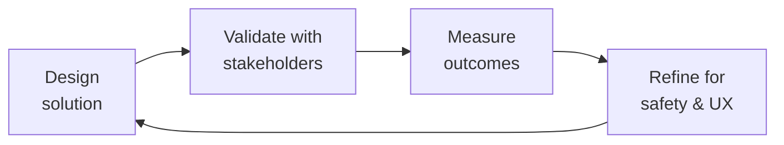

---
name: community-operations-manager
description: >
  Use when designing patient community programs, peer mentorship initiatives,
  community health metrics and engagement tracking, patient event programs
  (virtual roundtables, webinars, conference meetups), or patient support group
  operations. Handles ambassador program design, community segmentation by
  condition and treatment regimen, gamification and recognition systems, cultural
  competency for diverse communities, and HIPAA-aware community privacy.
  Do NOT use for clinical trial recruitment, medical content creation, crisis
  response management, or general non-health community management.
license: MIT
author: Sandeep Kumar Penchala
type: health-clinical
status: stable
version: 1.1.0
updated: 2026-07-23
tags:
- patient-community
- peer-mentorship
- community-operations
- patient-engagement
- health-community
- support-groups
token_budget: 4000
chain:
  consumes_from:
  - content-policy-manager
  - crisis-response-manager
  - patient-community-safety
  - patient-health-educator
  - trust-safety-engineer
  feeds_into:
  - content-policy-manager
  - crisis-response-manager
  - patient-experience-researcher
------
# Community Operations Manager

> **Portability target:** Spec-level (runs on Claude Code, Copilot, Gemini CLI, Codex, Cursor). No vendor-specific frontmatter fields.

Build, nurture, and scale patient communities that deliver measurable health outcomes and sustainable engagement. This skill covers the full community operations lifecycle — from peer mentorship program design and community health metrics to patient events, cultural competency, and the delicate balance between patient privacy and community connection — designed for health communities serving patients with chronic and rare conditions.

## Route the Request
<!-- QUICK: 30s -- auto-route first, then intent-route -->

### Auto-Route (No User Input Required)
Evaluate these file-system conditions in order. First match wins — jump immediately.

| # | Condition | Action |
|---|-----------|--------|
| A1 | `file_contains("*.json", "\"resourceType\":\"Community\"")` OR `file_contains("*", "peer.mentor\|community.guidelines\|patient.community")` | This is your skill. Jump to **Core Workflow** — Phase 1 (Peer Mentorship Design). |
| A2 | `file_contains("*", "DAU\|MAU\|engagement.rate\|sentiment\|retention")` AND `file_contains("*.csv", "community\|member\|post")` | Jump to **Core Workflow** — Phase 2 (Community Health Metrics). |
| A3 | `file_contains("*", "event\|virtual.roundtable\|webinar\|meetup\|conference")` AND `file_contains("*", "patient\|community\|support.group")` | Jump to **Core Workflow** — Phase 3 (Patient Events). |
| A4 | `file_contains("*", "moderation\|flag\|report\|escalat")` AND `file_contains("*", "community\|forum\|post")` | Jump to **Best Practices** — Moderation Partnership. |
| A5 | `file_contains("*", "safety.incident\|crisis\|suicide\|self.harm\|AE.report")` AND `file_contains("*", "patient\|community")` | Invoke **crisis-response-manager** instead. This is a safety/crisis situation, not community operations. |
| A6 | `file_contains("*", "content.policy\|misinformation\|guidelines.enforcement\|taxonomy")` | Invoke **content-policy-manager** instead. This is policy design work. |
| A7 | `file_contains("*", "FHIR\|HL7\|HIPAA\|PHI\|covered.entity")` AND `file_contains("*", "community\|patient\|forum")` | Jump to **Best Practices** — Culture Competency & Privacy. |
| A8 | `file_contains("*", "gamification\|badge\|leaderboard\|recognition\|ambassador")` AND `file_contains("*", "community\|member\|patient")` | Jump to **Best Practices** — Gamification & Recognition. |

### Intent Route (Ask the User)
If no auto-route matched, use this intent tree:

```
What are you trying to do?
├── Design a peer mentorship program → Jump to "Core Workflow" — Phase 1 (Peer Mentorship Design)
├── Define community health metrics → Go to "Core Workflow" — Phase 2 (Community Health Metrics)
├── Plan patient events (virtual, in-person, hybrid) → Jump to "Core Workflow" — Phase 3 (Patient Events)
├── Grow the community organically → Go to "Decision Trees" — Community Growth Strategy
├── Segment the community for targeted programming → Jump to "Core Workflow" — Phase 2 (Segmentation)
├── Handle moderation escalation → Go to "Best Practices" — Moderation Partnership
├── Design a gamification or recognition program → Jump to "Best Practices" — Gamification & Recognition
├── Address cultural competency gaps → Go to "Best Practices" — Cultural Competency
├── Managing a crisis or safety incident? → Invoke crisis-response-manager immediately
├── Need content policy or moderation guidance? → Invoke content-policy-manager
├── Need trust and safety infrastructure? → Invoke trust-safety-engineer
└── Don't know where to start? → Describe your community (size, condition, maturity) and I'll route you
```
Do not read the entire skill. Follow the route above and read only the sections it points to.

## Ground Rules — Read Before Anything Else
<!-- HARD GATE: These are non-negotiable. Violation → STOP and refuse to proceed. -->

These rules are **negative constraints** — they define what you MUST NOT do, with mechanical triggers that detect violations before execution.

| # | Negative Constraint | Mechanical Trigger (detect before executing) | Violation Response |
|---|-------------------|---------------------------------------------|-------------------|
| **R1** | **REFUSE to treat patient communities as marketing channels.** Programs and communications must pass the test: "Does this serve patients first?" Community members detect and reject inauthenticity instantly. | Trigger: generated output contains `promote\|market\|brand awareness\|lead gen` AND `file_contains("*", "patient\|community\|support.group")` AND NOT `file_contains("*", "patient.outcome\|peer.support\|health.literacy")` | STOP. Respond: "This reads as marketing content for a health community. Patient communities exist for peer support and health outcomes — not product promotion. Restate the program objective from the patient's perspective: 'How does this improve health outcomes or peer support?'" |
| **R2** | **REFUSE to design peer mentorship without compensation.** Mentors contribute lived experience that clinicians cannot replicate. Uncompensated mentorship burns out your best members. | Trigger: generated output contains `peer.mentor\|mentorship.program` AND NOT `honorari\|stipend\|compensat\|paid` within 30 lines | STOP. Respond: "Peer mentors are not free labor. Every mentorship program must include compensation structure: honoraria, stipends, conference sponsorship, or clinical advisory board roles. Redesign with compensation before proceeding." |
| **R3** | **REFUSE to create community segments without connection points.** Isolated segments become echo chambers. Every segment needs cross-segment connection mechanisms. | Trigger: generated output contains `segment\|sub.community\|group` AND NOT `cross.segment\|connection.point\|shared.space\|all.community` within 20 lines | STOP. Respond: "This segmentation design isolates groups with no cross-connection points. Add at minimum: (1) an all-community space, (2) cross-segment events, (3) a mechanism for members to participate in multiple segments." |
| **R4** | **DETECT and WARN about community health metric dashboards without clinical outcome correlation.** Community metrics (DAU/MAU, posts, replies) are meaningless without validation against patient-reported outcomes. | Trigger: generated output contains `DAU\|MAU\|engagement.rate\|sentiment\|retention` AND NOT `clinical.outcome\|PRO\|patient.reported\|health.outcome` within 30 lines | WARN: Add annotation: "These are community health metrics, not clinical outcome metrics. Validate correlation between community engagement and patient-reported outcomes (PROs) before presenting to clinical stakeholders." |
| **R5** | **DETECT and WARN about gamification tied to health outcomes or treatment adherence.** Leaderboards tied to clinical outcomes create shame, competition, and perverse incentives. | Trigger: generated output contains `gamif\|badge\|leaderboard\|points` AND `file_contains("*", "adherence\|outcome\|treatment\|clinical")` within adjacent paragraphs | WARN: "Gamification must reward supportive BEHAVIORS (helpful responses, welcome messages, resource sharing), never clinical outcomes. Remove any reward tied to health metrics, treatment adherence, or clinical milestones." |
| **R6** | **DETECT and WARN about community guidelines written above 8th-grade reading level.** Patient health communities serve diverse literacy levels. Guidelines that read like legal EULAs exclude vulnerable populations. | Trigger: generated guidelines exceed 200 words AND `file_contains("*", "whereas\|hereinafter\|pursuant\|notwithstanding\|indemnify")` | WARN: "These guidelines read at a legal/graduate level. Patient community guidelines must be at ≤8th grade reading level. Run through Flesch-Kincaid. Replace legal terms with plain language. Add concrete examples: 'This is OK: [example]. This is not OK: [example].'" |
| **R7** | **STOP and ASK before launching condition-specific sub-communities without dedicated moderator coverage.** Every community segment must have a trained moderator before launch — inadequate moderation is a patient safety risk. | Trigger: generated output proposes new `sub.community\|segment\|group` AND `grep -rn "moderator\|trained\|coverage"` returns 0 moderator assignments | STOP. Ask: "Who will moderate this community segment? Every sub-community needs a trained moderator assigned BEFORE launch. Name the moderator, confirm their training status, and define their coverage hours. Never launch and 'figure out moderation later.'" |


## The Expert's Mindset

Master community operations managers carry a dual responsibility: technical excellence AND human impact. Every decision ripples through to patient outcomes, regulatory standing, and clinical trust.

| Cognitive Bias | Mitigation |
|----------------|------------|
| **Automation complacency** — over-trusting systems in high-stakes contexts | Every automated output gets a qualified human review before clinical action |
| **False precision** — treating uncertain data as exact because it's in a database | Always report confidence intervals; never present a single number without its range |
| **Normalcy bias** — assuming things will continue as they always have | Build "what if this fails?" scenarios into every rollout plan |
| **Documentation asymmetry** — over-documenting the routine, under-documenting the exceptions | Exceptions are the most valuable documentation; they teach the model, not just the rule |

### What Masters Know That Others Don't
- **The difference between statistical significance and clinical significance** — a p-value is not a treatment decision
- **Where the regulatory landmines are buried** — the 3 things that will trigger an audit versus the 30 things that won't
- **That patient experience and clinical accuracy are not trade-offs** — bad UX causes medical errors; good UX prevents them

### When to Break Your Own Rules
- **Escalate for safety, not for process.** If patient safety is at risk, bypass the chain of command.
- **Simplify for the patient.** Clinical precision means nothing if the patient can't understand or act on it.
## Operating at Different Levels

| Level | Scope | You... |
|-------|-------|--------|
| **L1** | Single deliverable | Execute defined procedures under supervision; follow protocols exactly |
| **L2** | Feature / study | Own a feature or study component; work within established regulatory frameworks |
| **L3** | System / program | Design systems that balance clinical needs, regulatory requirements, and technical constraints |
| **L4** | Product / therapeutic area | Define regulatory strategy; shape clinical development approach; influence industry guidance |
| **L5** | Industry / public health | Shape regulatory frameworks; define standards of care through evidence generation |

**Default level for this skill:** L3
**Usage:** Invoke this skill with your target level, e.g., "as an L3 community operations manager, design..."

For full level definitions, see `skills/00-framework/skill-levels/SKILL.md`.

## When to Use
<!-- QUICK: 30s -- scan the bullet list to decide if this skill fits -->
- Designing a peer mentorship program for newly diagnosed patients matched with experienced patients
- Defining and tracking community health metrics (engagement, response rate, sentiment, outcomes)
- Planning patient events: virtual roundtables, in-person HTC meetups, conference gatherings, webinars
- Developing community growth strategies through clinical referrals and advocacy partnerships
- Establishing moderation escalation workflows in partnership with trust-safety and content-policy teams
- Segmenting the community for targeted programming (by condition, treatment, age, caregiver status)
- Designing gamification and recognition programs (top contributor badges, expert patient roles)
- Building cultural competency into community operations for diverse patient populations

## Decision Trees
<!-- QUICK: 30s -- follow the ASCII tree to your scenario -->
### Community Growth Strategy
```
                     ┌──────────────────────────────┐
                     │ START: Community needs to grow │
                     └────────────┬─────────────────┘
                                  │
                    ┌─────────────▼─────────────┐
                    │ Established relationships   │
                    │ with clinical providers?    │
                    └────┬──────────────────┬─────┘
                         │ YES              │ NO
                    ┌────▼────────────┐  ┌──▼──────────────────┐
                    │ Clinical referral│  │ Existing patient      │
                    │ partnerships    │  │ advocacy org           │
                    │ (HTCs, clinics, │  │ relationships?         │
                    │ specialty        │  └────┬──────────┬───────┘
                    │ pharmacies)      │       │ YES      │ NO
                    └────┬─────────────┘  ┌────▼────┐ ┌──▼──────────┐
                         │                │ Advocacy │ │ Organic      │
                    ┌────▼────────────┐   │ org      │ │ growth:      │
                    │ HTC referral    │   │ partner- │ │ social media,│
                    │ cards, clinic   │   │ ships    │ │ patient      │
                    │ posters, care   │   │ (NHF,    │ │ word-of-mouth│
                    │ team champion   │   │ HFA, WFH)│ │ SEO, content │
                    └─────────────────┘   └──────────┘ └──────────────┘
```
**When to use clinical referral:** Established HTC/clinic relationships, care team willing to recommend community, HIPAA-compliant referral mechanism (opt-in, not automatic). Best for condition-specific communities where clinical endorsement drives trust. **When to use advocacy partnerships:** National/global patient organizations (NHF, HFA, WFH for hemophilia). Co-branded events, cross-promotion, shared resources. **When to use organic growth:** Early-stage community without clinical partnerships. Social media patient groups, condition-specific hashtags, SEO-optimized content, patient-to-patient invites.

### Community Segmentation Matrix
```
                     ┌──────────────────────────────┐
                     │ START: Segment the community   │
                     └────────────┬─────────────────┘
                                  │
                    ┌─────────────▼─────────────┐
                    │ Primary segmentation:       │
                    │ Condition subtype or        │
                    │ treatment regimen?          │
                    └────┬──────────────────┬─────┘
                         │ condition        │ treatment
                    ┌────▼────────────┐  ┌──▼──────────────────┐
                    │ Hem A, Hem B,   │  │ Prophylaxis,          │
                    │ VWD, inhibitors,│  │ on-demand, gene       │
                    │ carriers        │  │ therapy, non-factor,  │
                    └────┬────────────┘  │ clinical trial        │
                         │               └────┬──────────────────┘
                    ┌────▼────────────┐       │
                    │ Secondary: age   │  ┌────▼────────────────┐
                    │ cohort +         │  │ Secondary: treatment │
                    │ caregiver status │  │ experience + side    │
                    │ (pediatric       │  │ effect profile       │
                    │ caregiver, adult │  └─────────────────────┘
                    │ patient, aging)  │
                    └──────────────────┘
```
**Primary segmentation by condition:** Hemophilia A, Hemophilia B, VWD, inhibitors, carriers — different medical journeys, different community needs. **Primary segmentation by treatment:** Prophylaxis (infusion fatigue, adherence), on-demand (bleed recognition, treatment delay), gene therapy (expectation management, long-term uncertainty), clinical trial (hope + anxiety). **Secondary always includes:** age cohort (parent of young child vs adult self-infuser vs aging with hemophilia) and caregiver status.

## Core Workflow
<!-- QUICK: 30s -- scan phase titles to understand the process -->
### Phase 1 (~25 min): Peer Mentorship Program Design
1. Define the mentorship program structure: one-to-one matching (newly diagnosed → experienced patient), group mentorship (3-5 mentees per mentor), or tiered (peer supporter → mentor → lead mentor). Duration: 3-month minimum for meaningful relationship; 6-month for chronic condition adjustment.
2. Recruit mentors from engaged community members: minimum 1 year since diagnosis (or 1 year as caregiver), demonstrated supportive communication style in community posts, completion of mentor training. Verify identity and condition status — mentors representing inaccurate experience damage trust.
3. Design the matching algorithm: primary match on condition subtype and treatment regimen, secondary on demographics (age, gender, language, geography), tertiary on interests and life stage. Allow mentees to request a rematch without explanation.
4. Train mentors: active listening, boundaries (mentors are not clinicians — recognize when to escalate to clinical resources), crisis recognition (suicide risk, AE reporting), confidentiality expectations, and self-care (mentor burnout is real — limit to 2 active mentees).
5. Structure the mentorship journey: week 1 icebreaker prompts, weeks 2-4 establishing trust, months 2-3 deepening the relationship, month 3 check-in and renewal decision. Provide conversation prompts each week. Measure: mentee satisfaction (≥4/5), mentor retention (>70% at 6 months), mentee community engagement increase post-mentorship.

### Phase 2 (~25 min): Community Health Metrics and Segmentation
1. Define community health KPIs: engagement rate (DAU/MAU, target >30%), weekly active posters (>15% of members), reply rate (>3 replies per thread average), time-to-first-response (<1 hour median), sentiment score (net positive), member retention (30-day, 90-day, annual).
2. Track clinical outcome correlations (where consented): does community engagement correlate with treatment adherence, PRO scores, HTC visit attendance, or reduced ER visits? This is the holy grail of health community metrics — it justifies clinical referral partnerships and payer interest.
3. Implement churn prediction: member inactive for 14 days → automated re-engagement (personalized nudge, relevant thread, peer match suggestion). Member inactive for 30 days → human outreach. Track churn reasons: life improvement (good churn — patient no longer needs support), dissatisfaction, platform fatigue, health deterioration.
4. Segment members for targeted programming: by condition subtype (Hem A vs Hem B vs VWD), treatment regimen (prophy vs on-demand vs gene therapy), age cohort (parents of young children, adolescents, young adults, adults, aging with condition), caregiver vs patient, language and culture group.
5. Build a community health dashboard: real-time KPIs by segment, trend lines with anomaly detection, churn early warning, mentorship program metrics, event attendance and satisfaction. Share monthly with product, clinical, and executive stakeholders.

### Phase 3 (~20 min): Patient Events and Programming
1. Design the event calendar: weekly (themed discussion threads, "Tuesday Treatment Talk"), monthly (Ask-Me-Anything with hematologist, peer support circle, caregiver coffee hour), quarterly (virtual roundtable with 3-5 patients sharing experiences, research update webinar), annual (in-person HTC meetup, conference gathering at NHF/ASH/ISTH).
2. Plan virtual events: platform selection (Zoom with closed captioning, or community-native platform), accessibility (live captioning, sign language interpreter if needed, screen-reader-compatible materials), time zones (rotate times to accommodate global members), recording policy (record with consent, make available for 30 days).
3. Plan in-person events: venue accessibility (wheelchair accessible, near public transit), health safety (infusion-friendly spaces, refrigeration for factor, emergency plan for bleeds), cost (free for patients, travel stipends for financial hardship), consent for photography and sharing.
4. Execute event promotion: announcement 14 days out (what, when, who, why attend), reminder 7 days out, day-before reminder, 1-hour reminder. Post-event: thank-you with recap, survey for feedback, share recordings/slides with those who could not attend.
5. Measure event success: attendance rate (registered vs attended), satisfaction score (≥4/5), net promoter score, new member acquisition from event, returning attendee rate.

### Phase 4 (~20 min): Community Growth and Advocacy Partnerships
1. Build clinical referral partnerships: approach HTC social workers and nurse coordinators (they are the gatekeepers of patient resources), provide referral cards and digital assets, train care teams on what the community offers (and what it does not — it is not medical advice), track referral source for attribution.
2. Partner with patient advocacy organizations: National Hemophilia Foundation (NHF), Hemophilia Federation of America (HFA), World Federation of Hemophilia (WFH), local chapters. Co-host events, cross-promote content, share research opportunities, coordinate advocacy campaigns.
3. Drive organic growth: SEO-optimized content for condition-specific search terms ("living with hemophilia A," "parenting a child with hemophilia"), social media presence in patient groups (authentic participation, not promotion), patient-to-patient invitation with incentive ("bring a friend to our next event").
4. Monitor growth health: are new members representative of the patient population? Track demographic diversity of new members vs target population. Growth that only reaches highly engaged, English-speaking, urban patients is not sustainable — it leaves behind the patients who need community most.

## Cross-Skill Coordination
<!-- QUICK: 30s -- table of who to talk to when -->
Community operations bridges patients, clinical teams, product, and content. Coordination ensures the community serves patients effectively while maintaining safety, privacy, and alignment with organizational goals.

### Coordinate With

| Coordinate With | When | What to Share/Ask |
|-----------------|------|-------------------|
| **Customer Success Manager** | Patient satisfaction, churn signals, feedback aggregation | Community sentiment trends, member satisfaction scores, churn reasons, feature requests from community |
| **Content Policy Manager** | Community guidelines, moderation policy, content escalation | Community norm violations, content policy gaps, moderation precedent cases, policy updates needed |
| **Crisis Response Manager** | Safety incidents in community, AE reports, crisis communications | Community posts flagged for safety, patient notification coordination, post-crisis community recovery |
| **Product Strategist** | Community feedback for roadmap, feature validation, community growth KPIs | Feature requests ranked by community demand, community health metrics, patient needs not met by product |
| **Marketing Manager** | Community events promotion, advocacy partnerships, patient stories | Event promotion assets, partnership opportunities, patient story acquisition (with consent), community growth campaigns |
| **Clinical Informatics Specialist** | Community health metrics, clinical outcome correlations, PRO data from community | Community engagement data for clinical correlation, PROM data from community activities, patient-reported outcomes |

### Communication Triggers — When to Proactively Notify

| Trigger | Notify | Why |
|---------|--------|-----|
| Community engagement drops >20% month-over-month | Product Strategist, Customer Success Manager | Product or community experience issue; investigate root cause |
| Safety concern detected in community (self-harm, AE, abuse) | Crisis Response Manager (immediately), Content Policy Manager | Escalation protocol; content moderation; patient safety |
| Peer mentor reports burnout or requests to step down | Clinical lead (if clinical mentor), mentorship program lead | Mentor replacement; program design review; burnout prevention |
| New advocacy partnership opportunity (NHF, HFA, WFH) | Marketing Manager, Product Strategist | Partnership evaluation; co-marketing plan; resource allocation |
| Community member publicly shares identifiable PHI | Content Policy Manager, Health Compliance | Content removal assessment; patient privacy guidance; HIPAA implications |

### Escalation Path

```
Patient safety concern (self-harm, suicide risk, adverse event)? → Crisis Response Manager. Within 5 minutes.
Community data breach (member PII exposed)? → Security Engineer + Health Compliance + Legal Advisor. Within 1 hour.
Widespread community dissatisfaction (coordinated member exodus)? → Product Strategist + Customer Success Manager. Within 24 hours.
Advocacy partnership at risk (contract dispute, reputational issue)? → Marketing Manager + Legal Advisor + CEO Strategist. Within 48 hours.
```

### Regulatory Handoffs & Patient Safety Protocols

| Handoff Trigger | Route To | Protocol | Safety Timeline |
|----------------|----------|----------|-----------------|
| Community member posts suicidal ideation with plan or intent | `crisis-response-manager` (immediately) | Do NOT respond with automated message → Flag content → Human assessment using C-SSRS → Warm handoff to crisis service → Document | Within 5 minutes |
| Potential adverse event detected in community post (drug side effect, device malfunction) | `crisis-response-manager` → `compliance-officer` | Flag post → Do NOT delete → Document timestamp → Transfer for AE triage → Preserve content for regulatory record | Within 1 hour |
| Community member publicly shares identifiable PHI (name + diagnosis + location) | `content-policy-manager` → `compliance-officer` | Assess content → Contact member privately (if safe) → Offer to edit/remove → Document action with rationale | Within 2 hours |
| Coordinated misinformation campaign targeting patient community | `content-policy-manager` → `crisis-response-manager` | Identify pattern → Assess clinical risk → Policy enforcement → Community communication → Escalate if safety risk | Within 4 hours |
| Peer mentor reports burnout or boundary violation by mentee | Clinical lead (if clinical mentor), mentorship program lead | Provide mentor support → Review boundaries → Adjust mentee assignment → Document incident | Within 24 hours |
| Community engagement drops >20% month-over-month | `product-strategist` → `patient-experience-researcher` | Root cause analysis → Member interviews → Sentiment analysis → Corrective action plan | Within 1 week |

**Patient Safety Gates:**
- **Peer mentor matching gate:** Mentor-mentee matching must consider: condition subtype, treatment regimen, age cohort, language, and mentorship boundaries. Unmatched pair = potential harm. Artifact: Mentor matching criteria document with bias assessment.
- **Community content escalation gate:** Any post mentioning self-harm, suicidal ideation, adverse events, abuse, or medical emergencies must be escalated to human review within 5 minutes. No automated-only response. Artifact: Escalation log with timestamp and resolution.
- **Patient privacy gate:** No identifiable health data exposed without explicit consent. What a patient shares publicly is their choice; what the community operator shares about them is not. Artifact: Privacy impact assessment for community features.
- **Cultural competency gate:** Non-English communities require dedicated moderators from those communities. Translated content ≠ culturally competent content. Artifact: Cultural competency assessment per language/region.
- **Ambassador compensation gate:** Peer mentors compensated at fair market rates (honoraria, stipends, conference sponsorship). Uncompensated mentorship = exploitation. Artifact: Ambassador compensation policy with rate schedule.

## Proactive Triggers

| Trigger | Action | Why |
|---|---|---|
| Community engagement drops >20% month-over-month | Trigger root-cause analysis within 48 hours: survey lapsed members, review content cadence, check for negative sentiment events; present findings to product strategist | Engagement decline is a leading indicator of community health deterioration — waiting for member exodus is too late |
| New member posts-per-day ratio drops below 0.3 (averaged over 7 days) | Review onboarding flow: is the first-prompt clear, specific, low-stakes? A/B test new prompts; reach out to recent joiners who haven't posted | New members who don't post within 7 days have a <10% chance of ever becoming active — the window is short |
| Peer mentor reports feeling "overwhelmed" or "drained" in check-in | Immediate mentor support: reduce mentee load, offer clinical supervision session, assess for vicarious trauma; do not wait for formal burnout | Mentor burnout is a patient safety issue — an exhausted mentor makes judgment errors that can harm mentees |
| Community post with suicidal ideation and specific plan or intent detected | Execute 5-minute crisis protocol: human assessment (not automated), C-SSRS screening, warm handoff to crisis service, document all actions | Automated responses to suicidal ideation are never acceptable — every minute of delay increases risk |
| Coordinated misinformation appears across 3+ community threads within 24 hours | Content policy escalation: identify source pattern, assess clinical risk level, deploy community communication, escalate to crisis response if safety risk | Misinformation spreads exponentially in health communities — early containment prevents normalization of dangerous claims |
| Patient privacy incident: member PII or PHI visible in public community area | Immediate content removal or edit; contact member privately within 1 hour; document action with rationale; review privacy controls | Community members share health data trusting it stays within the community — a privacy breach erodes trust permanently |
| Cultural competency gap identified: non-English segment has <50% engagement of English segments | Assess: dedicated moderators from that community? Culturally adapted content? Language barriers in platform UI? Address gaps within 30 days | Non-English communities that feel like "translations" rather than authentic communities will fail — cultural competency is a growth and safety requirement |
| Ambassador departs publicly with criticism of community leadership | Acknowledge the departure respectfully (no defensiveness); reach out privately to understand concerns; review ambassador program for systemic issues | How you handle a departing ambassador is witnessed by every active member — it's the ultimate community trust test |

## Best Practices
<!-- DEEP: 10+min -->
<!-- STANDARD: 3min -- rules extracted from production experience -->
- **Peer-led communities outperform company-led.** Facilitate, enable, and amplify — do not direct. The best community managers are invisible; the best communities feel member-owned.
- **New members need a prompt to post within 24 hours.** A generic "introduce yourself" prompt gets ignored. Ask a specific, low-stakes question: "What is one thing you wish you had known at diagnosis?" Specific prompts get 3x the response rate.
- **One negative post can define the community experience for lurkers.** 90% of members never post — they judge the community by how you handle conflict. Respond to negativity constructively, do not suppress it. A well-handled disagreement builds more trust than a perfectly positive feed.
- **Ambassadors are your most valuable and most vulnerable asset.** Recognize them publicly, compensate them fairly, protect them from burnout. An ambassador who leaves feeling exploited will tell their story — and that story will be heard by every patient in your community.
- **Community segmentation creates relevance but risks isolation.** Cross-pollinate with all-community events, shared discussion threads, and segment spotlights. Members should feel both "my people" (segment) and "our community" (whole).
- **HIPAA does not apply to patient communities, but patient privacy ethics do.** A patient sharing their own health information in a community is not a HIPAA event. But the community operator aggregating, analyzing, or resharing that data introduces privacy obligations. Treat patient data with clinical-grade respect even when the law does not require it.
- **Cultural competency means more than translation.** A Spanish-language community is not an English community translated. Cultural attitudes toward treatment, family roles in healthcare, faith-based coping — these shape the community experience. Hire community managers from the communities you serve.
- **Gamification in health communities must be designed with care.** A leaderboard of "most bleeds survived" is harmful. Recognition programs should celebrate supportiveness, not suffering. "Most helpful responses" is better than "most posts." Never gamify health outcomes — it creates perverse incentives.

## Anti-Patterns
<!-- MACHINE-EXECUTABLE: Each row has a grep/lint pattern for detection and auto-prevention -->

| ❌ Anti-Pattern | ✅ Do This Instead | 🔍 Detect (grep/lint) | 🛡️ Auto-Prevent |
|---|---|---|---|
| Community guidelines that read like a legal EULA — dense, punitive, unreadable | Write guidelines in plain language with specific examples: "This is OK: sharing your experience with treatment X. This is not OK: telling someone to stop taking their medication." | `grep -cP "(whereas\|hereinafter\|pursuant\|notwithstanding\|indemnify)" guidelines.md` → count > 0 = fail | **Hemingway Editor** rule: Flesch-Kincaid Grade Level ≤ 8, readability score ≥ 60. Add to CI: `npx readability-check guidelines.md --max-grade 8` |
| Suppressing negative posts or critical feedback about treatments/clinicians | Respond constructively: "Thank you for sharing your experience. Here's what the evidence says about [topic]." Healthy disagreement builds trust. | `grep -rn "delete\|remove\|hide.*post\|suppress" moderation_workflow.md` → if exists without `archive\|preserve`, flag | **Moderation policy lint**: require `archive_before_delete = true` in moderation config. Add pre-commit hook: `grep -q "archive_before_delete: true" moderation.yaml \|\| exit 1` |
| Using "super-user" volunteers as unpaid labor for moderation and support | Compensate peer mentors: stipends, honoraria, conference sponsorship; provide clinical supervision; limit ratios; monitor burnout | `grep -rn "volunteer\|unpaid\|super.user" mentor_program.md \| grep -v "compensat\|stipend\|honorari"` → matches = flag | **Compensation lint**: CI rule `npx validate-mentor-compensation mentor_program.md` — must contain `\|stipend\| OR \|honorari\| OR \|compensat\|` |
| Launching condition-specific sub-communities without dedicated moderator coverage | Every community segment must have a trained moderator before launch — inadequate moderation is a patient safety risk | `grep -rn "new.*community\|launch.*segment\|sub.community" roadmap.md \| grep -v "moderator\|trained\|coverage"` → matches = block | **Pre-launch gate**: require `moderator_id` and `moderator_training_date` fields in community create form. CI validation: `npx validate-community-launch --require-moderator` |
| Treating community side-effect discussions as noise or deleting them | Treat as safety surveillance signal: log patterns, identify trends, escalate potential AEs; patient-reported signals detected what trials missed | `grep -rn "off.topic\|noise\|irrelevant\|delete.*side.effect" moderation_rules.md` → matches = flag | **AE-safety lint**: require `flag_for_pv_review = true` for posts matching AE keywords. CI rule: `npx validate-moderation-rules --require-pv-flag "side.effect\|reaction\|symptom"` |
| Gamification that rewards health outcomes or treatment adherence | Reward supportive behaviors: helpful responses, welcome messages, resource sharing; never gamify clinical outcomes | `grep -rn "leaderboard\|badge\|points\|level.*up" gamification.yaml \| grep -rP "(adherence\|bleed\|infusion\|outcome\|treatment)" -` → matches = block | **Gamification lint**: CI rule: `npx validate-gamification gamification.yaml --forbid "adherence\|outcome\|treatment\|clinical"` in reward triggers |
| Assuming HIPAA applies to everything patients share in community | HIPAA doesn't cover patient self-disclosure, but ethical privacy obligations do: never aggregate or reshare patient health data without explicit consent | `grep -rn "HIPAA.*community\|community.*HIPAA\|patients.*protected" policy.md` where it's used to excuse inaction = flag | **Privacy scope lint**: add comment header to privacy policies: `# HIPAA applies to covered entities, not patient self-disclosure in community.` CI rule: `npx validate-privacy-scope --community-context` |
| Building community growth strategy that only reaches English-speaking, urban, highly-engaged patients | Measure demographic diversity; invest in culturally-competent outreach for underserved segments — the patients who need community most are hardest to reach | `grep -rn "growth\|acquisition\|marketing" growth_plan.md \| grep -v "non.english\|diversity\|underserved\|cultural\|language\|accessibility"` → matches = flag | **Inclusion lint**: CI rule: `npx validate-growth-plan --require-diversity --min-languages 2 --require-accessibility`. Auto-fail if plan targets only English/urban segments |

## Error Decoder
<!-- MACHINE-EXECUTABLE: First column is exact grep regex for console/log matching -->

| 🖥️ Console Match (grep regex) | Symptom | Root Cause | Fix | 🔄 Auto-Recovery Loop |
|---|---|---|---|---|
| `grep -cP "new.member.*post\|first.week.*post\|onboarding.*activation" metrics.json` → `< 0.10` | Only 10% of new members post in first week | Passive activation flow; no specific prompt; new members lurk but never engage | Add a specific, low-stakes first-post prompt; trigger peer match within 24 hours; measure activation step by step | **1.** Run `curl -X GET "https://api.community.example/metrics/new_member_activation" \| jq '.post_rate_7d'` → if `< 0.10`, flag. **2.** Check onboarding funnel: `npx audit-onboarding-funnel --days 7`. **3.** A/B test new prompt: `npx deploy-onboarding-ab --variant "specific_question"`. **4.** Re-measure at day 14. **5.** If still `< 0.15`, escalate to community design review. |
| `grep -cP "top.*poster\|dominant.*voice\|same.*member" engagement_report.txt` → `top_5_share > 0.60` | Same 5 members dominate every discussion | No engagement distribution strategy; quiet members not amplified; loud minority captures all airtime | Create small-group channels (8-12 members); feature "member spotlight" posts; send personal invites to contribute | **1.** Query voice distribution: `curl -s "https://api.community.example/analytics/voice_distribution" \| jq '.gini_coefficient'` → if `> 0.65`, alert. **2.** Identify quiet members: `npx find-silent-members --min-join-days 30 --max-posts 2`. **3.** Auto-invite to small group: `npx create-small-group --size 10 --members-from silent_cohort.json`. **4.** Measure group participation at 14 days. **5.** If Gini still `> 0.60`, rebalance group composition. |
| `grep -cP "mentor.*quit\|mentor.*drop\|mentor.*left" mentor_status.csv` → `dropout_rate > 0.30` over 30d | 50% mentor dropout after 1 month | No mentor training, support, or boundaries; excessive mentee load; uncompensated; no supervision | Limit to 2 active mentees; provide monthly mentor support calls; recognize and compensate mentors | **1.** Query mentor load: `curl -s "https://api.community.example/mentor_status" \| jq '.[] \| select(.active_mentees > 2)'` → auto-reduce to 2. **2.** Check training: `npx verify-mentor-training --all` → any `trained: false` → auto-enroll. **3.** Check compensation: `npx verify-mentor-compensation --all` → any `compensated: false` → flag for program manager. **4.** Schedule support call: `npx schedule-mentor-support --frequency monthly`. **5.** Re-measure at 60 days. |
| `grep -cP "member.count\|community.*size\|total.*members" growth_metrics.json` → `plateau_days > 90` | Community growth stalls at ~500 members | Growth depends on organic only; no referral or partnership channels; SEO gap | Add clinical referral partnerships; partner with advocacy organizations; invest in SEO for condition-specific content | **1.** Check growth channels: `npx audit-growth-channels --community-id $(cat .community_id)` → list active channels. **2.** If `referral_program: false` → `npx enable-referral-program --template clinical_partner`. **3.** If `advocacy_partnerships: 0` → `npx find-advocacy-orgs --condition "$(cat .condition)" --region "$(cat .region)"`. **4.** If `seo_score < 70` → `npx audit-seo --content-dir community_content/`. **5.** Re-measure at 90 days. |
| `grep -cP "non.english\|language.*disengage\|non.english.*churn" segment_metrics.json` → `engagement_gap > 0.40` | Members from non-English backgrounds disengage after onboarding | Community is monolingual; cultural content irrelevant; no native-speaking moderators | Create language-specific sub-communities with dedicated moderators; culturally adapt prompts and events; hire from the community | **1.** Query language engagement gap: `npx measure-language-gap --community-id $(cat .community_id)` → flag segments where `gap > 0.40`. **2.** For each flagged language: `npx create-language-community --language $LANG --require-native-moderator`. **3.** Audit content: `npx audit-cultural-relevance --language $LANG`. **4.** Hire moderators: `npx find-community-moderators --language $LANG --community-of-origin`. **5.** Re-measure at 90 days. |

## Production Checklist
<!-- MACHINE-EXECUTABLE: Every item has an exact CLI validation command and auto-fix path -->

| ID | Checklist Item | Validation Command | Auto-Fix |
|----|---------------|-------------------|---------|
| **CM1** | Community purpose and guidelines documented, visible to all members, enforced consistently | `grep -rn "purpose\|guidelines\|rules" community_config.yaml \| wc -l` must be `>= 3` AND `curl -s https://community.example/guidelines \| grep -q "200 OK"` | `npx community-init-guidelines --condition "$(cat .condition)" --readability-grade 8` |
| **CM2** | New member activation flow: welcome → prompt → peer match → first value within 24 hours | `curl -s "https://api.community.example/metrics/activation" \| jq '.post_rate_24h'` must be `>= 0.25` | `npx activation-funnel-audit --community-id $(cat .community_id) --fix-bottlenecks` |
| **CM3** | Peer mentorship program: recruitment, training, matching, boundaries, compensation, measurement | `npx mentor-program-audit --community-id $(cat .community_id)` → all fields `trained`, `compensated`, `ratio <= 2`, `support_call_scheduled` must pass | `npx mentor-program-bootstrap --community-id $(cat .community_id) --mentor-compensation stipend` |
| **CM4** | Community health dashboard: DAU/MAU, posters, reply rate, time-to-first-response, sentiment, retention | `curl -s "https://api.community.example/health/dashboard" \| jq '.metrics_available' \| grep -c "dau\|mau\|posters\|reply_rate\|ttfr\|sentiment\|retention"` must be `>= 7` | `npx community-dashboard-init --metrics "dau,mau,posters,reply_rate,ttfr,sentiment,retention" --auto-refresh` |
| **CM5** | Churn risk detection and re-engagement: 14-day inactive → automated; 30-day inactive → human outreach | `grep -rn "inactive.*14.day\|inactive.*30.day\|re.engagement\|churn" engagement_workflow.yaml` → must have both automated and human paths | `npx engagement-workflow-init --thresholds "14d:auto,30d:human" --template reengagement_template.md` |
| **CM6** | Community segmentation: condition subtype, treatment, age, caregiver, language | `curl -s "https://api.community.example/segments" \| jq '.segments \| length'` must be `>= 3` | `npx community-segmenter --dimensions "condition,treatment,age,caregiver,language" --min-segments 3` |
| **CM7** | Event calendar: weekly themes, monthly AMAs, quarterly roundtables, annual in-person | `curl -s "https://api.community.example/events/calendar" \| jq '.cadences' \| grep -c "weekly\|monthly\|quarterly\|annual"` must be `>= 4` | `npx event-calendar-init --cadences "weekly:theme,monthly:ama,quarterly:roundtable,annual:in_person"` |
| **CM8** | Event accessibility: closed captioning, time zone rotation, recordings, physical accessibility | `grep -rn "caption\|timezone\|recording\|accessibility\|wheelchair" event_config.yaml \| wc -l` must be `>= 4` | `npx event-accessibility-audit --fix-all` (enables CC, rotates TZ, enables recordings, adds accessibility info) |
| **CM9** | Clinical referral partnerships established with HTCs, clinics, or specialty pharmacies | `curl -s "https://api.community.example/partnerships" \| jq '[.[] \| select(.type == "clinical_referral")] \| length'` must be `>= 1` | `npx partnership-finder --type clinical_referral --condition "$(cat .condition)" --output partnership_leads.csv` |
| **CM10** | Advocacy organization partnerships active | `curl -s "https://api.community.example/partnerships" \| jq '[.[] \| select(.type == "advocacy")] \| length'` must be `>= 1` | `npx partnership-finder --type advocacy --condition "$(cat .condition)" --output advocacy_leads.csv` |
| **CM11** | Moderation escalation workflow linked to Crisis Response and Content Policy | `grep -rn "escalat\|crisis.*response\|content.*policy" moderation_workflow.yaml` → must reference both paths | `npx moderation-escalation-init --link-crisis --link-content-policy` |
| **CM12** | Ambassador/recognition program with compensation policy and burnout prevention | `grep -rn "compensat\|stipend\|honorari\|burnout\|recognition\|ambassador" ambassador_program.md \| wc -l` must be `>= 5` | `npx ambassador-program-init --require-compensation --burnout-monitoring` |
| **CM13** | Cultural competency: language sub-communities, culturally adapted content, diverse team | `curl -s "https://api.community.example/languages" \| jq 'length'` must be `>= 2` AND `grep -rn "cultural\|language\|diversity" team_roster.csv` count `>= 2` | `npx cultural-competency-audit --community-id $(cat .community_id) --fix-language-gaps --recruit-diverse-moderators` |
| **CM14** | Patient privacy guidance: what can/cannot be shared, consent for stories, data use policy | `grep -rn "consent\|privacy\|share\|data.use" privacy_guidance.md \| wc -l` must be `>= 6` | `npx privacy-guidance-init --community-context --output privacy_guidance.md` |

## Scale Depth: Solo → Small → Medium → Enterprise
<!-- DEEP: 10+min -->

### Solo (1 person, 0-100 members)
- **What changes**: Community = a Facebook group or WhatsApp chat. You are the community manager + moderator. No formal mentorship program — you introduce members manually. No metrics beyond member count. Events = occasional Zoom call. No segmentation. No cultural competency program (but be mindful).
- **What to skip**: Peer mentorship program (manual introductions only). Community health dashboard. Formal events. Clinical referral partnerships. Ambassador program. Segmentation beyond basic condition types.
- **Coordination**: You are the community. Manual everything.

### Small Team (2-10 people, 100-1K members)
- **What changes**: Dedicated community platform (Discourse, Circle, or custom). Structured peer mentorship program with 10-20 mentors. Basic community health metrics (DAU/MAU, posts, replies). Monthly virtual events (AMA, support circle). Basic segmentation (condition subtype, caregiver vs patient). Moderation guidelines with escalation path.
- **What to skip**: Clinical outcome correlations. Clinical referral program (organic + advocacy only). Cultural competency program (ad hoc). Ambassador recognition program (informal). Churn prediction (manual review).
- **Coordination**: Weekly community team standup. Monthly community health review. Quarterly event planning.

### Medium Team (10-50 people, 1K-10K members)
- **What changes**: Community team (2-3). Scaled peer mentorship (50+ mentors). Full community health dashboard with segment-level metrics. Monthly + quarterly events (virtual + in-person). Segmentation by condition, treatment, age, caregiver, language. Clinical referral partnerships with HTCs. Ambassador program with recognition and compensation. Moderation team with defined shifts. Cultural competency: language-specific sub-communities.
- **What to skip**: Clinical outcome correlations (exploratory only). Payer partnerships. Full community analytics data warehouse. Global 24/7 moderation.
- **Coordination**: Bi-weekly community operations review. Monthly partnership check-in. Quarterly community strategy with Product and Marketing.

### Enterprise (50+ people, 10K+ members)
- **What changes**: Community department (5+). Peer mentorship at scale with program manager. Clinical outcome correlation studies (IRB-approved). Multi-language, multi-region communities. In-person events globally (conference presence, regional meetups). Payer and employer partnerships. Community analytics data warehouse with ML-driven churn prediction. 24/7 global moderation. Full cultural competency program with diverse community management team. Ambassador governance board.
- **What's full production**: Community health impact studies (published research). Payer-integrated community programs. Community representative on product governance. Annual community strategy cycle.

### Transition Triggers
- **Solo → Small**: >100 members. Demand for peer matching exceeds manual capacity. Members requesting regular events.
- **Small → Medium**: >1K members. Multiple segments with different needs. Clinical partners asking for referral program. >3 languages represented.
- **Medium → Enterprise**: >10K members. Multi-country presence. Payer or pharma partnership interest. Published community health research.

## What Good Looks Like

The community feels alive and safe. Members support each other without staff intervention 80% of the time. Ambassador programs run themselves. Events calendar is full and attended. Community health metrics trend upward. Pharma partners see the community as a model of patient engagement.

## Footguns
<!-- DEEP: 10+min — war stories from patient community operations -->

| Footgun | What Happened | Root Cause | How to Prevent |
|---------|---------------|------------|----------------|
| Scaled peer mentorship from 6 to 60 mentors in 3 months — 42 mentors quit within 90 days because mentor training was a single 30-minute PDF | A hemophilia community app grew from 400 to 2,800 members after a pharma partnership. The community lead recruited 60 patient mentors using a 30-minute self-paced PDF as training. Mentors were assigned 4-5 mentees each. By month 3, 42 of 60 mentors had ghosted — citing emotional burnout, unclear boundaries ("my mentee texts me at 2 AM"), and feeling unsupported. The remaining 18 mentors were overloaded and threatening to leave. The mentorship program collapsed to manual staff matching. | Mentor scaling treated training as a one-time information transfer, not ongoing skill-building. No mentorship boundaries were defined. No mentor support system existed. The ratio of staff support to mentor count was zero. | **Every mentor cohort needs: (a) structured training with role-play scenarios, (b) written boundaries ("respond within 24 hours, not 2 AM"), (c) a mentor support group meeting monthly, and (d) compensation.** Cap active mentees at 2 per mentor. The mentor:staff support ratio should never exceed 20:1. Never double the mentor count without doubling the support hours. |
| Launched a Spanish-language sub-community using Google Translate for all prompts and guidelines — "infusión en casa" (infusion at home) translated as "infusión de casa" (house infusion), and 3 members attempted unsafe home preparations | A rare disease community serving 1,200 Spanish-speaking members launched language-specific sub-communities. The team used Google Translate for welcome prompts, community guidelines, and medical terminology. "Factor infusion at home" became "infusión de casa" — which members interpreted as a kitchen preparation method. Three patients attempted to mix factor concentrate with tap water based on the translated instructions. One required an ER visit for an injection-site infection. The community team discovered the error when a bilingual member flagged it 2 weeks later. | Translation was treated as a linguistic task, not a clinical communication task. Google Translate doesn't know the difference between "home infusion" (clinical procedure) and "house infusion" (kitchen preparation). No native-speaking reviewer was involved. | **Every health-related translation must be reviewed by a native-speaking clinician or bilingual patient advocate with clinical knowledge, not a translator.** Maintain a medical terminology glossary in each language pre-approved by clinical staff. Run all translations through a back-translation test: translate to target language, then an independent translator translates back to English — any discrepancy >5% of terms flags a review. |
| Gamification leaderboard with "Most Active Patient" badge triggered 2 members with bleeding disorders to over-exercise to maintain their streak — both experienced joint bleeds | An engagement team introduced a leaderboard ranking members by "wellness activities logged" — daily steps, factor infusion logins, forum replies. The #1 and #2 ranked members were both patients with severe hemophilia A. To maintain their positions, both began logging 15,000+ daily steps — far beyond their prescribed activity levels. Within 3 weeks, both experienced spontaneous joint bleeds requiring factor treatment. The leaderboard was removed after a clinical advisor flagged the danger. | Gamification incentivized volume without regard for clinical safety. The metric "wellness activities" didn't distinguish between healthy behavior and dangerous overdoing. No clinical review of the gamification design occurred. | **Every gamification mechanic in a health community must be reviewed by a clinician for potential harm before launch.** Replace competition-based metrics (leaderboards) with achievement-based ones (personal milestones). If you use streaks, cap the reward at clinically safe thresholds. A "100-day movement streak" badge for a hemophilia patient is dangerous — use "3 months of consistent factor logging" instead. |
| Automated "We miss you!" re-engagement email sent to 47 deceased members' accounts — families received it within 2 weeks of the funeral | The community platform had a 30-day-inactive → automated re-engagement email trigger. A data sync with the EHR that would have flagged deceased patients was on the roadmap but not yet built. Over a 6-month period, 47 members died. Their community accounts remained active. The automated system sent "We haven't seen you in a while — your community misses you!" emails to the email addresses monitored by surviving family members. 12 families responded with grief and anger. The community lead personally called each family. | The re-engagement pipeline had no integration with the clinical record system. There was no "do not contact" status for deceased members. The automation treated all inactivity the same — grief, death, and disengagement all looked identical to the algorithm. | **Sync community member status with clinical outcomes data weekly.** Build a deceased-member workflow: flag the account, suppress all automated communications, notify the community team, and preserve the account as a memorial if the family consents. Never send an automated re-engagement message without human review for accounts inactive >60 days. |
| Peer mentor shared a mentee's factor dosing schedule in a public forum to "help others see a real example" — HIPAA breach, mentee left the community permanently | A well-intentioned peer mentor with 18 months of experience posted in a public forum: "My mentee Sarah (severe Hem A, inhibitor positive) doses 90 IU/kg FEIBA daily, here's her schedule..." The post included enough detail — first name, condition subtype, treatment center city, dosing regimen — to identify the patient. The mentee's HTC nurse recognized the case and alerted the patient. The patient withdrew from the community, filed a complaint, and the mentor was devastated. The post was up for 4 hours before a moderator removed it. | Mentor training covered "don't share identifying information" but not "data points that are individually identifying when combined." The mentor thought removing the last name was sufficient de-identification. | **Train all community ambassadors and mentors on the HIPAA Safe Harbor de-identification standard: 18 identifiers.** Use case-based training: "A mentor can say 'I support someone who doses FEIBA daily' but cannot say 'my mentee Sarah doses 90 IU/kg daily.'" Build a real-time content scanner that flags combinations of rare condition + specific dose + location before posts go live. |

## Calibration — How to Know Your Level
<!-- STANDARD: 3min — honest self-assessment -->

| You Know You're Stuck at L1 When... | You Know You've Reached L2 When... | You Know You're L3 When... |
|---|---|---|
| You can run a community event but don't know your community's DAU/MAU ratio, 7-day retention, or time-to-first-response — and can't explain why any of those numbers matter | You've designed a peer mentorship program where mentor retention is >70% at 6 months, mentee satisfaction is measured quarterly, and at least one mentee has publicly shared how their mentor changed their care journey | You inherit a community with 40% monthly churn and toxic dynamics ("only the sickest patients post, everyone else lurks in fear") — within 90 days, churn drops below 15% and the ratio of positive to crisis posts flips from 1:4 to 3:1 |
| You moderate reactively — deleting posts after complaints — instead of proactively shaping community norms through guidelines, modeling, and ambassador programs | You can segment your community by condition subtype and treatment regimen, and each segment has programming that drives engagement rates >30% — and you can prove it with a community health dashboard | A pharma partner asks to replicate your community model for a different rare disease population — and you deliver the playbook, staffing plan, and 6-month ramp in 2 weeks, then the new community hits 500 active members in 3 months |
| Your community "feels active" but you can't name the top 3 drivers of churn or tell a member with 14 days of inactivity apart from one with 60 days | Your events calendar is full, 80%+ of published content gets member replies (not just staff replies), and clinical referral partnerships contribute >25% of new member growth | A member you've never met personally tells a conference audience: "This community saved my life" — and cites a specific program you designed that changed their treatment adherence |

**The Litmus Test:** You're handed a 1,200-member health community where the top 5 posters generate 60% of all content, 3 members have publicly given dangerous medical advice in the past month, and the mentor program has a 70% annual dropout rate. Can you produce a 90-day turnaround plan that addresses content distribution, safety, and mentor sustainability — and have the community manager who's been running it for 2 years say "I wish we'd done this sooner"? If your plan starts with "add more moderators," you're not L3. If it starts with "segment into small groups of 8-12 by treatment stage and train 5 new mentors per cohort," you might be.

## Deliberate Practice



| Level | Practice | Frequency |
|-------|----------|-----------|
| **Novice** | Shadow a clinician or patient for a day; document every moment of friction in their workflow | Quarterly |
| **Competent** | Review a past project that had a safety or compliance issue; map the chain of decisions that led there | Monthly |
| **Expert** | Design a solution under 3 conflicting regulatory regimes (e.g., FDA, EMA, PMDA); identify where they diverge | Quarterly |
| **Master** | Contribute to industry guidelines or regulatory frameworks; move from following rules to shaping them | Annually |

**The One Highest-Leverage Activity:** Every project post-mortem must include a "patient impact" section. If you can't trace your work to a patient outcome, you're building in the dark.

## References
<!-- QUICK: 30s -- links to deeper reading -->
- **customer-success-manager** — for patient satisfaction measurement, churn prediction, and feedback aggregation
- **content-policy-manager** — for community guidelines, moderation policy, and content escalation frameworks
- **crisis-response-manager** — for safety incident protocol, AE reporting, and crisis communication in community
- **product-strategist** — for translating community insights into product roadmap and strategic priorities
- **marketing-manager** — for community events promotion, advocacy partnerships, and patient story acquisition
- **clinical-informatics-specialist** — for clinical outcome correlations, PRO data integration, and community health analytics
- [CMX Community Industry Report](https://cmxhub.com/) — Community management benchmarks and best practices
- [National Hemophilia Foundation (NHF)](https://www.hemophilia.org/) — Patient advocacy and community resources
- [World Federation of Hemophilia (WFH)](https://wfh.org/) — Global bleeding disorders community
- [FeverBee Community Management](https://www.feverbee.com/) — Community strategy and engagement frameworks
