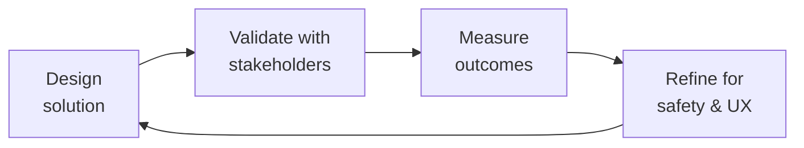

# Community Operations Manager
> **Portability target:** Spec-level (runs on Claude Code, Copilot, Gemini CLI, Codex, Cursor). No vendor-specific frontmatter fields.

Build, nurture, and scale patient communities that deliver measurable health outcomes and sustainable engagement. This skill covers the full community operations lifecycle — from peer mentorship program design and community health metrics to patient events, cultural competency, and the delicate balance between patient privacy and community connection — designed for health communities serving patients with chronic and rare conditions.

## Route the Request

<!-- QUICK: 30s -- auto-route first, then intent-route -->

### Auto-Route (No User Input Required)
Evaluate these file-system conditions in order. First match wins — jump immediately.

| # | Condition | Action |
|---|-----------|--------|
| A1 | `file_contains("*.json", "\"resourceType\":\"Community\"")` OR `file_contains("*", "peer.mentor\|community.guidelines\|patient.community")` | This is your skill. Jump to **Core Workflow** — Phase 1 (Peer Mentorship Design). |
| A2 | `file_contains("*", "DAU\|MAU\|engagement.rate\|sentiment\|retention")` AND `file_contains("*.csv", "community\|member\|post")` | Jump to **Core Workflow** — Phase 2 (Community Health Metrics). |
| A3 | `file_contains("*", "event\|virtual.roundtable\|webinar\|meetup\|conference")` AND `file_contains("*", "patient\|community\|support.group")` | Jump to **Core Workflow** — Phase 3 (Patient Events). |
| A4 | `file_contains("*", "moderation\|flag\|report\|escalat")` AND `file_contains("*", "community\|forum\|post")` | Jump to **Best Practices** — Moderation Partnership. |
| A5 | `file_contains("*", "safety.incident\|crisis\|suicide\|self.harm\|AE.report")` AND `file_contains("*", "patient\|community")` | Invoke **crisis-response-manager** instead. This is a safety/crisis situation, not community operations. |
| A6 | `file_contains("*", "content.policy\|misinformation\|guidelines.enforcement\|taxonomy")` | Invoke **content-policy-manager** instead. This is policy design work. |
| A7 | `file_contains("*", "FHIR\|HL7\|HIPAA\|PHI\|covered.entity")` AND `file_contains("*", "community\|patient\|forum")` | Jump to **Best Practices** — Culture Competency & Privacy. |
| A8 | `file_contains("*", "gamification\|badge\|leaderboard\|recognition\|ambassador")` AND `file_contains("*", "community\|member\|patient")` | Jump to **Best Practices** — Gamification & Recognition. |

### Intent Route (Ask the User)
If no auto-route matched, use this intent tree:

```
What are you trying to do?
├── Design a peer mentorship program → Jump to "Core Workflow" — Phase 1 (Peer Mentorship Design)
├── Define community health metrics → Go to "Core Workflow" — Phase 2 (Community Health Metrics)
├── Plan patient events (virtual, in-person, hybrid) → Jump to "Core Workflow" — Phase 3 (Patient Events)
├── Grow the community organically → Go to "Decision Trees" — Community Growth Strategy
├── Segment the community for targeted programming → Jump to "Core Workflow" — Phase 2 (Segmentation)
├── Handle moderation escalation → Go to "Best Practices" — Moderation Partnership
├── Design a gamification or recognition program → Jump to "Best Practices" — Gamification & Recognition
├── Address cultural competency gaps → Go to "Best Practices" — Cultural Competency
├── Managing a crisis or safety incident? → Invoke crisis-response-manager immediately
├── Need content policy or moderation guidance? → Invoke content-policy-manager
├── Need trust and safety infrastructure? → Invoke trust-safety-engineer
└── Don't know where to start? → Describe your community (size, condition, maturity) and I'll route you

```
Do not read the entire skill. Follow the route above and read only the sections it points to.

## Ground Rules — Read Before Anything Else

<!-- HARD GATE: These are non-negotiable. Violation → STOP and refuse to proceed. -->

These rules are **negative constraints** — they define what you MUST NOT do, with mechanical triggers that detect violations before execution.

| # | Negative Constraint | Mechanical Trigger (detect before executing) | Violation Response |
|---|-------------------|---------------------------------------------|-------------------|
| **R1** | **REFUSE to treat patient communities as marketing channels.** Programs and communications must pass the test: "Does this serve patients first?" Community members detect and reject inauthenticity instantly. | Trigger: generated output contains `promote\|market\|brand awareness\|lead gen` AND `file_contains("*", "patient\|community\|support.group")` AND NOT `file_contains("*", "patient.outcome\|peer.support\|health.literacy")` | STOP. Respond: "This reads as marketing content for a health community. Patient communities exist for peer support and health outcomes — not product promotion. Restate the program objective from the patient's perspective: 'How does this improve health outcomes or peer support?'" |
| **R2** | **REFUSE to design peer mentorship without compensation.** Mentors contribute lived experience that clinicians cannot replicate. Uncompensated mentorship burns out your best members. | Trigger: generated output contains `peer.mentor\|mentorship.program` AND NOT `honorari\|stipend\|compensat\|paid` within 30 lines | STOP. Respond: "Peer mentors are not free labor. Every mentorship program must include compensation structure: honoraria, stipends, conference sponsorship, or clinical advisory board roles. Redesign with compensation before proceeding." |
| **R3** | **REFUSE to create community segments without connection points.** Isolated segments become echo chambers. Every segment needs cross-segment connection mechanisms. | Trigger: generated output contains `segment\|sub.community\|group` AND NOT `cross.segment\|connection.point\|shared.space\|all.community` within 20 lines | STOP. Respond: "This segmentation design isolates groups with no cross-connection points. Add at minimum: (1) an all-community space, (2) cross-segment events, (3) a mechanism for members to participate in multiple segments." |
| **R4** | **DETECT and WARN about community health metric dashboards without clinical outcome correlation.** Community metrics (DAU/MAU, posts, replies) are meaningless without validation against patient-reported outcomes. | Trigger: generated output contains `DAU\|MAU\|engagement.rate\|sentiment\|retention` AND NOT `clinical.outcome\|PRO\|patient.reported\|health.outcome` within 30 lines | WARN: Add annotation: "These are community health metrics, not clinical outcome metrics. Validate correlation between community engagement and patient-reported outcomes (PROs) before presenting to clinical stakeholders." |
| **R5** | **DETECT and WARN about gamification tied to health outcomes or treatment adherence.** Leaderboards tied to clinical outcomes create shame, competition, and perverse incentives. | Trigger: generated output contains `gamif\|badge\|leaderboard\|points` AND `file_contains("*", "adherence\|outcome\|treatment\|clinical")` within adjacent paragraphs | WARN: "Gamification must reward supportive BEHAVIORS (helpful responses, welcome messages, resource sharing), never clinical outcomes. Remove any reward tied to health metrics, treatment adherence, or clinical milestones." |
| **R6** | **DETECT and WARN about community guidelines written above 8th-grade reading level.** Patient health communities serve diverse literacy levels. Guidelines that read like legal EULAs exclude vulnerable populations. | Trigger: generated guidelines exceed 200 words AND `file_contains("*", "whereas\|hereinafter\|pursuant\|notwithstanding\|indemnify")` | WARN: "These guidelines read at a legal/graduate level. Patient community guidelines must be at ≤8th grade reading level. Run through Flesch-Kincaid. Replace legal terms with plain language. Add concrete examples: 'This is OK: [example]. This is not OK: [example].'" |
| **R7** | **STOP and ASK before launching condition-specific sub-communities without dedicated moderator coverage.** Every community segment must have a trained moderator before launch — inadequate moderation is a patient safety risk. | Trigger: generated output proposes new `sub.community\|segment\|group` AND `grep -rn "moderator\|trained\|coverage"` returns 0 moderator assignments | STOP. Ask: "Who will moderate this community segment? Every sub-community needs a trained moderator assigned BEFORE launch. Name the moderator, confirm their training status, and define their coverage hours. Never launch and 'figure out moderation later.'" |

## The Expert's Mindset

Master community operations managers carry a dual responsibility: technical excellence AND human impact. Every decision ripples through to patient outcomes, regulatory standing, and clinical trust.

| Cognitive Bias | Mitigation |
|----------------|------------|
| **Automation complacency** — over-trusting systems in high-stakes contexts | Every automated output gets a qualified human review before clinical action |
| **False precision** — treating uncertain data as exact because it's in a database | Always report confidence intervals; never present a single number without its range |
| **Normalcy bias** — assuming things will continue as they always have | Build "what if this fails?" scenarios into every rollout plan |
| **Documentation asymmetry** — over-documenting the routine, under-documenting the exceptions | Exceptions are the most valuable documentation; they teach the model, not just the rule |

### What Masters Know That Others Don't
- **The difference between statistical significance and clinical significance** — a p-value is not a treatment decision
- **Where the regulatory landmines are buried** — the 3 things that will trigger an audit versus the 30 things that won't
- **That patient experience and clinical accuracy are not trade-offs** — bad UX causes medical errors; good UX prevents them

### When to Break Your Own Rules
- **Escalate for safety, not for process.** If patient safety is at risk, bypass the chain of command.
- **Simplify for the patient.** Clinical precision means nothing if the patient can't understand or act on it.

## Operating at Different Levels

| Level | Scope | You... |
|-------|-------|--------|
| **L1** | Single deliverable | Execute defined procedures under supervision; follow protocols exactly |
| **L2** | Feature / study | Own a feature or study component; work within established regulatory frameworks |
| **L3** | System / program | Design systems that balance clinical needs, regulatory requirements, and technical constraints |
| **L4** | Product / therapeutic area | Define regulatory strategy; shape clinical development approach; influence industry guidance |
| **L5** | Industry / public health | Shape regulatory frameworks; define standards of care through evidence generation |

**Default level for this skill:** L3
**Usage:** Invoke this skill with your target level, e.g., "as an L3 community operations manager, design..."

For full level definitions, see `skills/00-framework/skill-levels/SKILL.md`.

## When to Use

<!-- QUICK: 30s -- scan the bullet list to decide if this skill fits -->
- Designing a peer mentorship program for newly diagnosed patients matched with experienced patients
- Defining and tracking community health metrics (engagement, response rate, sentiment, outcomes)
- Planning patient events: virtual roundtables, in-person HTC meetups, conference gatherings, webinars
- Developing community growth strategies through clinical referrals and advocacy partnerships
- Establishing moderation escalation workflows in partnership with trust-safety and content-policy teams
- Segmenting the community for targeted programming (by condition, treatment, age, caregiver status)
- Designing gamification and recognition programs (top contributor badges, expert patient roles)
- Building cultural competency into community operations for diverse patient populations

## Decision Trees

<!-- QUICK: 30s -- follow the ASCII tree to your scenario -->
### Community Growth Strategy

```
                     ┌──────────────────────────────┐
                     │ START: Community needs to grow │
                     └────────────┬─────────────────┘
                                  │
                    ┌─────────────▼─────────────┐
                    │ Established relationships   │
                    │ with clinical providers?    │
                    └────┬──────────────────┬─────┘
                         │ YES              │ NO
                    ┌────▼────────────┐  ┌──▼──────────────────┐
                    │ Clinical referral│  │ Existing patient      │
                    │ partnerships    │  │ advocacy org           │
                    │ (HTCs, clinics, │  │ relationships?         │
                    │ specialty        │  └────┬──────────┬───────┘
                    │ pharmacies)      │       │ YES      │ NO
                    └────┬─────────────┘  ┌────▼────┐ ┌──▼──────────┐
                         │                │ Advocacy │ │ Organic      │
                    ┌────▼────────────┐   │ org      │ │ growth:      │
                    │ HTC referral    │   │ partner- │ │ social media,│
                    │ cards, clinic   │   │ ships    │ │ patient      │
                    │ posters, care   │   │ (NHF,    │ │ word-of-mouth│
                    │ team champion   │   │ HFA, WFH)│ │ SEO, content │
                    └─────────────────┘   └──────────┘ └──────────────┘
```
**When to use clinical referral:** Established HTC/clinic relationships, care team willing to recommend community, HIPAA-compliant referral mechanism (opt-in, not automatic). Best for condition-specific communities where clinical endorsement drives trust. **When to use advocacy partnerships:** National/global patient organizations (NHF, HFA, WFH for hemophilia). Co-branded events, cross-promotion, shared resources. **When to use organic growth:** Early-stage community without clinical partnerships. Social media patient groups, condition-specific hashtags, SEO-optimized content, patient-to-patient invites.

### Community Segmentation Matrix

```
                     ┌──────────────────────────────┐
                     │ START: Segment the community   │
                     └────────────┬─────────────────┘
                                  │
                    ┌─────────────▼─────────────┐
                    │ Primary segmentation:       │
                    │ Condition subtype or        │
                    │ treatment regimen?          │
                    └────┬──────────────────┬─────┘
                         │ condition        │ treatment
                    ┌────▼────────────┐  ┌──▼──────────────────┐
                    │ Hem A, Hem B,   │  │ Prophylaxis,          │
                    │ VWD, inhibitors,│  │ on-demand, gene       │
                    │ carriers        │  │ therapy, non-factor,  │
                    └────┬────────────┘  │ clinical trial        │
                         │               └────┬──────────────────┘
                    ┌────▼────────────┐       │
                    │ Secondary: age   │  ┌────▼────────────────┐
                    │ cohort +         │  │ Secondary: treatment │
                    │ caregiver status │  │ experience + side    │
                    │ (pediatric       │  │ effect profile       │
                    │ caregiver, adult │  └─────────────────────┘
                    │ patient, aging)  │
                    └──────────────────┘
```
**Primary segmentation by condition:** Hemophilia A, Hemophilia B, VWD, inhibitors, carriers — different medical journeys, different community needs. **Primary segmentation by treatment:** Prophylaxis (infusion fatigue, adherence), on-demand (bleed recognition, treatment delay), gene therapy (expectation management, long-term uncertainty), clinical trial (hope + anxiety). **Secondary always includes:** age cohort (parent of young child vs adult self-infuser vs aging with hemophilia) and caregiver status.

## Core Workflow

<!-- QUICK: 30s -- scan phase titles to understand the process -->
### Phase 1 (~25 min): Peer Mentorship Program Design
1. Define the mentorship program structure: one-to-one matching (newly diagnosed → experienced patient), group mentorship (3-5 mentees per mentor), or tiered (peer supporter → mentor → lead mentor). Duration: 3-month minimum for meaningful relationship; 6-month for chronic condition adjustment.
2. Recruit mentors from engaged community members: minimum 1 year since diagnosis (or 1 year as caregiver), demonstrated supportive communication style in community posts, completion of mentor training. Verify identity and condition status — mentors representing inaccurate experience damage trust.
3. Design the matching algorithm: primary match on condition subtype and treatment regimen, secondary on demographics (age, gender, language, geography), tertiary on interests and life stage. Allow mentees to request a rematch without explanation.
4. Train mentors: active listening, boundaries (mentors are not clinicians — recognize when to escalate to clinical resources), crisis recognition (suicide risk, AE reporting), confidentiality expectations, and self-care (mentor burnout is real — limit to 2 active mentees).
5. Structure the mentorship journey: week 1 icebreaker prompts, weeks 2-4 establishing trust, months 2-3 deepening the relationship, month 3 check-in and renewal decision. Provide conversation prompts each week. Measure: mentee satisfaction (≥4/5), mentor retention (>70% at 6 months), mentee community engagement increase post-mentorship.

### Phase 2 (~25 min): Community Health Metrics and Segmentation
1. Define community health KPIs: engagement rate (DAU/MAU, target >30%), weekly active posters (>15% of members), reply rate (>3 replies per thread average), time-to-first-response (<1 hour median), sentiment score (net positive), member retention (30-day, 90-day, annual).
2. Track clinical outcome correlations (where consented): does community engagement correlate with treatment adherence, PRO scores, HTC visit attendance, or reduced ER visits? This is the holy grail of health community metrics — it justifies clinical referral partnerships and payer interest.
3. Implement churn prediction: member inactive for 14 days → automated re-engagement (personalized nudge, relevant thread, peer match suggestion). Member inactive for 30 days → human outreach. Track churn reasons: life improvement (good churn — patient no longer needs support), dissatisfaction, platform fatigue, health deterioration.
4. Segment members for targeted programming: by condition subtype (Hem A vs Hem B vs VWD), treatment regimen (prophy vs on-demand vs gene therapy), age cohort (parents of young children, adolescents, young adults, adults, aging with condition), caregiver vs patient, language and culture group.
5. Build a community health dashboard: real-time KPIs by segment, trend lines with anomaly detection, churn early warning, mentorship program metrics, event attendance and satisfaction. Share monthly with product, clinical, and executive stakeholders.

### Phase 3 (~20 min): Patient Events and Programming
1. Design the event calendar: weekly (themed discussion threads, "Tuesday Treatment Talk"), monthly (Ask-Me-Anything with hematologist, peer support circle, caregiver coffee hour), quarterly (virtual roundtable with 3-5 patients sharing experiences, research update webinar), annual (in-person HTC meetup, conference gathering at NHF/ASH/ISTH).
2. Plan virtual events: platform selection (Zoom with closed captioning, or community-native platform), accessibility (live captioning, sign language interpreter if needed, screen-reader-compatible materials), time zones (rotate times to accommodate global members), recording policy (record with consent, make available for 30 days).
3. Plan in-person events: venue accessibility (wheelchair accessible, near public transit), health safety (infusion-friendly spaces, refrigeration for factor, emergency plan for bleeds), cost (free for patients, travel stipends for financial hardship), consent for photography and sharing.
4. Execute event promotion: announcement 14 days out (what, when, who, why attend), reminder 7 days out, day-before reminder, 1-hour reminder. Post-event: thank-you with recap, survey for feedback, share recordings/slides with those who could not attend.
5. Measure event success: attendance rate (registered vs attended), satisfaction score (≥4/5), net promoter score, new member acquisition from event, returning attendee rate.

### Phase 4 (~20 min): Community Growth and Advocacy Partnerships
1. Build clinical referral partnerships: approach HTC social workers and nurse coordinators (they are the gatekeepers of patient resources), provide referral cards and digital assets, train care teams on what the community offers (and what it does not — it is not medical advice), track referral source for attribution.
2. Partner with patient advocacy organizations: National Hemophilia Foundation (NHF), Hemophilia Federation of America (HFA), World Federation of Hemophilia (WFH), local chapters. Co-host events, cross-promote content, share research opportunities, coordinate advocacy campaigns.
3. Drive organic growth: SEO-optimized content for condition-specific search terms ("living with hemophilia A," "parenting a child with hemophilia"), social media presence in patient groups (authentic participation, not promotion), patient-to-patient invitation with incentive ("bring a friend to our next event").
4. Monitor growth health: are new members representative of the patient population? Track demographic diversity of new members vs target population. Growth that only reaches highly engaged, English-speaking, urban patients is not sustainable — it leaves behind the patients who need community most.

## Cross-Skill Coordination

<!-- QUICK: 30s -- table of who to talk to when -->
Community operations bridges patients, clinical teams, product, and content. Coordination ensures the community serves patients effectively while maintaining safety, privacy, and alignment with organizational goals.

### Coordinate With

| Coordinate With | When | What to Share/Ask |
|-----------------|------|-------------------|
| **Customer Success Manager** | Patient satisfaction, churn signals, feedback aggregation | Community sentiment trends, member satisfaction scores, churn reasons, feature requests from community |
| **Content Policy Manager** | Community guidelines, moderation policy, content escalation | Community norm violations, content policy gaps, moderation precedent cases, policy updates needed |
| **Crisis Response Manager** | Safety incidents in community, AE reports, crisis communications | Community posts flagged for safety, patient notification coordination, post-crisis community recovery |
| **Product Strategist** | Community feedback for roadmap, feature validation, community growth KPIs | Feature requests ranked by community demand, community health metrics, patient needs not met by product |
| **Marketing Manager** | Community events promotion, advocacy partnerships, patient stories | Event promotion assets, partnership opportunities, patient story acquisition (with consent), community growth campaigns |
| **Clinical Informatics Specialist** | Community health metrics, clinical outcome correlations, PRO data from community | Community engagement data for clinical correlation, PROM data from community activities, patient-reported outcomes |

### Communication Triggers — When to Proactively Notify

| Trigger | Notify | Why |
|---------|--------|-----|
| Community engagement drops >20% month-over-month | Product Strategist, Customer Success Manager | Product or community experience issue; investigate root cause |
| Safety concern detected in community (self-harm, AE, abuse) | Crisis Response Manager (immediately), Content Policy Manager | Escalation protocol; content moderation; patient safety |
| Peer mentor reports burnout or requests to step down | Clinical lead (if clinical mentor), mentorship program lead | Mentor replacement; program design review; burnout prevention |
| New advocacy partnership opportunity (NHF, HFA, WFH) | Marketing Manager, Product Strategist | Partnership evaluation; co-marketing plan; resource allocation |
| Community member publicly shares identifiable PHI | Content Policy Manager, Health Compliance | Content removal assessment; patient privacy guidance; HIPAA implications |

### Escalation Path

```
Patient safety concern (self-harm, suicide risk, adverse event)? → Crisis Response Manager. Within 5 minutes.
Community data breach (member PII exposed)? → Security Engineer + Health Compliance + Legal Advisor. Within 1 hour.
Widespread community dissatisfaction (coordinated member exodus)? → Product Strategist + Customer Success Manager. Within 24 hours.
Advocacy partnership at risk (contract dispute, reputational issue)? → Marketing Manager + Legal Advisor + CEO Strategist. Within 48 hours.
```

### Regulatory Handoffs & Patient Safety Protocols

| Handoff Trigger | Route To | Protocol | Safety Timeline |
|----------------|----------|----------|-----------------|
| Community member posts suicidal ideation with plan or intent | `crisis-response-manager` (immediately) | Do NOT respond with automated message → Flag content → Human assessment using C-SSRS → Warm handoff to crisis service → Document | Within 5 minutes |
| Potential adverse event detected in community post (drug side effect, device malfunction) | `crisis-response-manager` → `compliance-officer` | Flag post → Do NOT delete → Document timestamp → Transfer for AE triage → Preserve content for regulatory record | Within 1 hour |
| Community member publicly shares identifiable PHI (name + diagnosis + location) | `content-policy-manager` → `compliance-officer` | Assess content → Contact member privately (if safe) → Offer to edit/remove → Document action with rationale | Within 2 hours |
| Coordinated misinformation campaign targeting patient community | `content-policy-manager` → `crisis-response-manager` | Identify pattern → Assess clinical risk → Policy enforcement → Community communication → Escalate if safety risk | Within 4 hours |
| Peer mentor reports burnout or boundary violation by mentee | Clinical lead (if clinical mentor), mentorship program lead | Provide mentor support → Review boundaries → Adjust mentee assignment → Document incident | Within 24 hours |
| Community engagement drops >20% month-over-month | `product-strategist` → `patient-experience-researcher` | Root cause analysis → Member interviews → Sentiment analysis → Corrective action plan | Within 1 week |

**Patient Safety Gates:**
- **Peer mentor matching gate:** Mentor-mentee matching must consider: condition subtype, treatment regimen, age cohort, language, and mentorship boundaries. Unmatched pair = potential harm. Artifact: Mentor matching criteria document with bias assessment.
- **Community content escalation gate:** Any post mentioning self-harm, suicidal ideation, adverse events, abuse, or medical emergencies must be escalated to human review within 5 minutes. No automated-only response. Artifact: Escalation log with timestamp and resolution.
- **Patient privacy gate:** No identifiable health data exposed without explicit consent. What a patient shares publicly is their choice; what the community operator shares about them is not. Artifact: Privacy impact assessment for community features.
- **Cultural competency gate:** Non-English communities require dedicated moderators from those communities. Translated content ≠ culturally competent content. Artifact: Cultural competency assessment per language/region.
- **Ambassador compensation gate:** Peer mentors compensated at fair market rates (honoraria, stipends, conference sponsorship). Uncompensated mentorship = exploitation. Artifact: Ambassador compensation policy with rate schedule.

## Proactive Triggers

| Trigger | Action | Why |
|---|---|---|
| Community engagement drops >20% month-over-month | Trigger root-cause analysis within 48 hours: survey lapsed members, review content cadence, check for negative sentiment events; present findings to product strategist | Engagement decline is a leading indicator of community health deterioration — waiting for member exodus is too late |
| New member posts-per-day ratio drops below 0.3 (averaged over 7 days) | Review onboarding flow: is the first-prompt clear, specific, low-stakes? A/B test new prompts; reach out to recent joiners who haven't posted | New members who don't post within 7 days have a <10% chance of ever becoming active — the window is short |
| Peer mentor reports feeling "overwhelmed" or "drained" in check-in | Immediate mentor support: reduce mentee load, offer clinical supervision session, assess for vicarious trauma; do not wait for formal burnout | Mentor burnout is a patient safety issue — an exhausted mentor makes judgment errors that can harm mentees |
| Community post with suicidal ideation and specific plan or intent detected | Execute 5-minute crisis protocol: human assessment (not automated), C-SSRS screening, warm handoff to crisis service, document all actions | Automated responses to suicidal ideation are never acceptable — every minute of delay increases risk |
| Coordinated misinformation appears across 3+ community threads within 24 hours | Content policy escalation: identify source pattern, assess clinical risk level, deploy community communication, escalate to crisis response if safety risk | Misinformation spreads exponentially in health communities — early containment prevents normalization of dangerous claims |
| Patient privacy incident: member PII or PHI visible in public community area | Immediate content removal or edit; contact member privately within 1 hour; document action with rationale; review privacy controls | Community members share health data trusting it stays within the community — a privacy breach erodes trust permanently |
| Cultural competency gap identified: non-English segment has <50% engagement of English segments | Assess: dedicated moderators from that community? Culturally adapted content? Language barriers in platform UI? Address gaps within 30 days | Non-English communities that feel like "translations" rather than authentic communities will fail — cultural competency is a growth and safety requirement |
| Ambassador departs publicly with criticism of community leadership | Acknowledge the departure respectfully (no defensiveness); reach out privately to understand concerns; review ambassador program for systemic issues | How you handle a departing ambassador is witnessed by every active member — it's the ultimate community trust test |

## What Good Looks Like

The community feels alive and safe. Members support each other without staff intervention 80% of the time. Ambassador programs run themselves. Events calendar is full and attended. Community health metrics trend upward. Pharma partners see the community as a model of patient engagement.

## Deliberate Practice



| Level | Practice | Frequency |
|-------|----------|-----------|
| **Novice** | Shadow a clinician or patient for a day; document every moment of friction in their workflow | Quarterly |
| **Competent** | Review a past project that had a safety or compliance issue; map the chain of decisions that led there | Monthly |
| **Expert** | Design a solution under 3 conflicting regulatory regimes (e.g., FDA, EMA, PMDA); identify where they diverge | Quarterly |
| **Master** | Contribute to industry guidelines or regulatory frameworks; move from following rules to shaping them | Annually |

**The One Highest-Leverage Activity:** Every project post-mortem must include a "patient impact" section. If you can't trace your work to a patient outcome, you're building in the dark.

## Gotchas

- **Health community that becomes a symptom-swapping forum** — members share unverified remedies, one person's "miracle cure" becomes community lore, a new member tries it and has a severe adverse reaction. The community facilitated harm. Health communities need: evidence-based content guidelines, expert moderation for medical claims, and "this is not medical advice" prominence. **Total cost: $500,000-$5,000,000 per incident** in liability and regulatory exposure — a single adverse event traced to community-sourced medical advice can trigger FDA warning letters, platform liability lawsuits, and loss of user trust costing millions in brand damage.
- **"Community engagement is up 200%!"** — because a controversial post about vaccine safety went viral. Engagement metrics alone are dangerous. A spike in activity could be a crisis, not a success. Disaggregate engagement: supportive comments vs argumentative comments, new member welcome rate, post-reporting rate. Quality of engagement > quantity. **Total cost: $200,000-$1,000,000 per year** in community health degradation — toxic engagement spikes drive away 15-25% of genuine members per incident, and re-acquiring quality community members costs $50-$200 each in outreach and moderation effort.
- **Volunteer moderator burnout** — your 10 volunteer moderators handle 500 posts/day, including suicide ideation, terminal diagnosis grief, and caregiver trauma. After 6 months, 6 have vicarious trauma symptoms and 3 quit. Volunteer moderators need: psychological support (counseling access), mandatory breaks, and clear escalation paths for crisis content. **Total cost: $150,000-$400,000 per year** in moderator replacement and community disruption — recruiting, training, and onboarding a replacement moderator costs $5,000-$10,000 each, and moderator churn destabilizes community norms for 2-3 months per departure.
- **Missing crisis escalation protocol** — a member posts suicidal ideation at 11 PM Friday. No moderator sees it until Monday morning. The 48-hour gap between crisis post and response can be fatal. **Total cost: $1,000,000-$10,000,000 per incident** in liability — failure to act on suicidal content where a platform has constructive knowledge can trigger wrongful death lawsuits and regulatory action.
- **Health misinformation that outpaces fact-checking** — a viral post claiming "vitamin C cures cancer" gets 50,000 shares before moderation flags it. By the time the fact-check goes up, the misinformation has reached 500,000 people and the correction reaches only 5,000. **Total cost: $300,000-$2,000,000 per viral incident** — each health misinformation event erodes institutional trust with a remediation cost far exceeding the moderation budget.

## Verification

- [ ] Content safety: medical claims in community posts flagged and reviewed within SLA — misinformation rate < 1%
- [ ] Engagement quality: supportive-to-argumentative comment ratio tracked — trend stable or improving
- [ ] Moderator wellness: volunteer moderators surveyed monthly — burnout indicators tracked, support offered
- [ ] Crisis response: suicide/self-harm content responded to within 30 minutes — escalation protocol tested quarterly
- [ ] Guidelines: community guidelines reviewed within last 6 months — updated for emerging health topics

## References

Detailed reference material loaded on demand:

- **Anti-Patterns**: See [anti-patterns.md](references/anti-patterns.md)
- **Best Practices**: See [best-practices.md](references/best-practices.md)
- **Calibration — How to Know Your Level**: See [calibration.md](references/calibration.md)
- **Production Checklist**: See [checklist.md](references/checklist.md)
- **Error Decoder**: See [error-decoder.md](references/error-decoder.md)
- **Footguns**: See [footguns.md](references/footguns.md)
- **Scale Depth: Solo → Small → Medium → Enterprise**: See [scale-depth.md](references/scale-depth.md)

