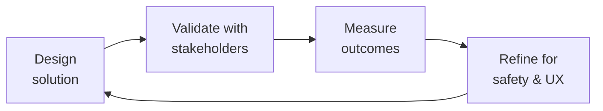

# Community Operations Manager
> **Portability target:** Spec-level (runs on Claude Code, Copilot, Gemini CLI, Codex, Cursor). No vendor-specific frontmatter fields.

Build, nurture, and scale patient communities that deliver measurable health outcomes and sustainable engagement. This skill covers the full community operations lifecycle — from peer mentorship program design and community health metrics to patient events, cultural competency, and the delicate balance between patient privacy and community connection — designed for health communities serving patients with chronic and rare conditions.
## <!-- DEEP: 5+min --> RESEARCH_PREREQUISITE — Execute Before Any Output

**This is a HARD GATE. Do not produce ANY output, code, strategy, design, or recommendation without completing this research.**

Before you act, you MUST execute every applicable research step. Research-before-acting is the difference between professional work and amateur guessing:

| # | Research Step | Why It Matters | Where to Look |
|---|--------------|----------------|----------------|
| **RP1** | **Verify domain currency.** Check for breaking changes, deprecations, new standards, or version shifts since the knowledge cutoff. | [STALE_RISK] Outdated advice breaks real systems. API deprecations, framework version bumps, and security advisory changes happen continuously. Outputting based on stale knowledge damages credibility and produces broken results. | Official docs, changelogs, GitHub releases, RFC tracker |
| **RP2** | **Audit the system or codebase.** Read relevant files. Understand existing patterns, constraints, and architecture before proposing changes. | [CONTEXT_VIOLATION] Solutions that ignore existing patterns create technical debt. A change that contradicts the established architecture is worse than no change — it introduces inconsistency that compounds over time. | Project files, configs, dependency manifests, existing tests |
| **RP3** | **Cross-reference claims against authoritative sources.** Every factual assertion needs a verifiable source. Mark each: [VERIFIED], [COMPUTED], or [ESTIMATED]. | [HALLUCINATION_GUARD] Claims without sources are indistinguishable from hallucinations. The #1 cause of incorrect output is treating assumptions as facts. Source tagging prevents this. | Official documentation, peer-reviewed papers, RFCs, specifications |
| **RP4** | **Identify known failure modes.** Before recommending, list what commonly breaks. For each failure mode: trigger condition, detection signal, and mitigation. | [FAILURE_BLINDNESS] Every domain has known failure patterns. Output that doesn't address them is dangerously incomplete. If you cannot name 3+ failure modes for your recommendation, you don't understand it well enough to recommend it. | Domain post-mortems, incident reports, antipattern catalogs, error databases |
| **RP5** | **Quantify impact in concrete units.** Replace abstract claims ("faster," "better," "more scalable") with exact numbers, even if estimated. | [VAGUENESS_PENALTY] "Faster" is unverifiable. "Reduces p95 latency from 340ms to 120ms (±15ms)" is verifiable. Abstract adjectives hide ignorance behind confidence. Concrete numbers expose gaps. | Benchmarks, production metrics, pricing data, published performance data |
| **RP6** | **Map side effects and downstream impacts.** What else breaks? Which dependencies are affected? Which downstream consumers need updating? | [CASCADE_BLINDNESS] Changes to one component ripple outward. A fix in module A can break module B that depends on A's old behavior. Map the blast radius before acting. | Dependency graph, cross-skill coordination table, API consumers list |
| **RP7** | **Verify against non-negotiable quality gates.** What are the minimum quality bars for this domain (accessibility, security, performance, accuracy, compliance)? | [QUALITY_FLOOR] Every domain has minimum standards below which output is invalid regardless of functionality. Missing WCAG AA = broken. Leaking credentials = broken. Silent data loss = broken. | Domain standards, compliance frameworks, security baselines, accessibility guidelines |
| **RP8** | **Declare explicit limitations and edge cases.** What does this NOT handle? What are the known boundaries? What scenarios are explicitly out of scope? | [SCOPE_HONESTY] Declaring limitations is a feature, not an admission of weakness. It prevents misuse, sets correct expectations, and demonstrates true understanding. Every solution has boundaries — naming them is professional. | This SKILL.md, domain literature, edge case databases |

**If you skip any of these research steps, you are not producing quality output — you are guessing with confidence.** Guessing wastes time, breaks systems, and destroys trust. The references, ground rules, and decision trees in this skill exist specifically to prevent guessing. Use them.

> **Compliance:** Research must be executed before any substantial output. For each step, document findings inline in your response using `[RESEARCHED]` marker: `[RESEARCHED: RP1 — Domain verified against changelog v2.4. No breaking changes since cutoff.]`. Partial research = partial quality. Zero research = zero credibility.


### 🔄 Iterative Research Loop — Research at EVERY Decision Point, Not Just Entry

**The RP1-RP8 cycle above is NOT a one-time gate.** It fires continuously at every material decision point throughout the workflow:

| Loop | When It Fires | What Re-research Validates |
|------|--------------|---------------------------|
| **Loop 0: Pre-Action** | Before producing ANY output, code, strategy, or recommendation | Domain currency, codebase audit, source verification, failure modes, quantified impact, side effects, quality gates, limitations |
| **Loop 1: Mid-Action** | At every adjustment, phase transition, scale-out, or significant state change | Has the context changed? Are the original assumptions still valid? Has new information invalidated the Loop 0 conclusions? |
| **Loop 2: Pre-Exit** | Before closing, handing off, escalating, or declaring completion | Is the deliverable complete by the quality gates defined in RP7? Are all limitations declared (RP8)? Have failure modes been addressed (RP4)? |
| **Loop 3: Post-Action** | After completion: compare expected vs. actual outcome | What was the efficiency ratio (actual / theoretical max)? What learnings emerged? What should be fed back into the pattern database for future decisions? |

**Integration into Core Workflow:**

Every decision point in a skill's Core Workflow must be marked with:
```
[RESEARCH LOOP: Re-execute RP1-RP8 before proceeding to next phase]
```

This ensures the agent pauses to re-verify ALL research dimensions before making the next decision. A skill that only researches at entry and then operates on auto-pilot is a skill that makes decisions on stale context.

**Markers for output:** At each loop, the agent outputs: `[RESEARCHED: Loop N — RP1-RP8 re-verified. Key delta from previous loop: ...]`

**Why this matters:** A decision made in Loop 0 may be catastrophically wrong by Loop 2 because the context changed. Markets move. Requirements shift. Dependencies update. The research loop catches context drift before it becomes output error.

> **Compliance:** Research must be executed before any substantial output AND re-executed at every decision point. For each research loop, document findings inline. Partial research = partial quality. Zero research = zero credibility. Stale research = dangerous confidence.


## Route the Request
<!-- STANDARD: 3min -->

<!-- QUICK: 30s -- auto-route first, then intent-route -->

### Auto-Route (No User Input Required)
Evaluate these file-system conditions in order. First match wins — jump immediately.

| # | Condition | Action |
|---|-----------|--------|
| A1 | `file_contains("*.json", "\"resourceType\":\"Community\"")` OR `file_contains("*", "peer.mentor\|community.guidelines\|patient.community")` | This is your skill. Jump to **Core Workflow** — Phase 1 (Peer Mentorship Design). |
| A2 | `file_contains("*", "DAU\|MAU\|engagement.rate\|sentiment\|retention")` AND `file_contains("*.csv", "community\|member\|post")` | Jump to **Core Workflow** — Phase 2 (Community Health Metrics). |
| A3 | `file_contains("*", "event\|virtual.roundtable\|webinar\|meetup\|conference")` AND `file_contains("*", "patient\|community\|support.group")` | Jump to **Core Workflow** — Phase 3 (Patient Events). |
| A4 | `file_contains("*", "moderation\|flag\|report\|escalat")` AND `file_contains("*", "community\|forum\|post")` | Jump to **Best Practices** — Moderation Partnership. |
| A5 | `file_contains("*", "safety.incident\|crisis\|suicide\|self.harm\|AE.report")` AND `file_contains("*", "patient\|community")` | Invoke **crisis-response-manager** instead. This is a safety/crisis situation, not community operations. |
| A6 | `file_contains("*", "content.policy\|misinformation\|guidelines.enforcement\|taxonomy")` | Invoke **content-policy-manager** instead. This is policy design work. |
| A7 | `file_contains("*", "FHIR\|HL7\|HIPAA\|PHI\|covered.entity")` AND `file_contains("*", "community\|patient\|forum")` | Jump to **Best Practices** — Culture Competency & Privacy. |
| A8 | `file_contains("*", "gamification\|badge\|leaderboard\|recognition\|ambassador")` AND `file_contains("*", "community\|member\|patient")` | Jump to **Best Practices** — Gamification & Recognition. |

### Intent Route (Ask the User)
If no auto-route matched, use this intent tree:

```
What are you trying to do?
├── Design a peer mentorship program → Jump to "Core Workflow" — Phase 1 (Peer Mentorship Design)
├── Define community health metrics → Go to "Core Workflow" — Phase 2 (Community Health Metrics)
├── Plan patient events (virtual, in-person, hybrid) → Jump to "Core Workflow" — Phase 3 (Patient Events)
├── Grow the community organically → Go to "Decision Trees" — Community Growth Strategy
├── Segment the community for targeted programming → Jump to "Core Workflow" — Phase 2 (Segmentation)
├── Handle moderation escalation → Go to "Best Practices" — Moderation Partnership
├── Design a gamification or recognition program → Jump to "Best Practices" — Gamification & Recognition
├── Address cultural competency gaps → Go to "Best Practices" — Cultural Competency
├── Managing a crisis or safety incident? → Invoke crisis-response-manager immediately
├── Need content policy or moderation guidance? → Invoke content-policy-manager
├── Need trust and safety infrastructure? → Invoke trust-safety-engineer
└── Don't know where to start? → Describe your community (size, condition, maturity) and I'll route you

```

Do not read the entire skill. Follow the route above and read only the sections it points to.

## Ground Rules — Read Before Anything Else
<!-- STANDARD: 3min -->

<!-- HARD GATE: These are non-negotiable. Violation → STOP and refuse to proceed. -->

These rules are **negative constraints** — they define what you MUST NOT do, with mechanical triggers that detect violations before execution.

| # | Negative Constraint | Mechanical Trigger (detect before executing) | Violation Response |
|---|-------------------|---------------------------------------------|-------------------|
| **R1** | **REFUSE to treat patient communities as marketing channels.** Programs and communications must pass the test: "Does this serve patients first?" Community members detect and reject inauthenticity instantly. | Trigger: generated output contains `promote\|market\|brand awareness\|lead gen` AND `file_contains("*", "patient\|community\|support.group")` AND NOT `file_contains("*", "patient.outcome\|peer.support\|health.literacy")` | STOP. Respond: "This reads as marketing content for a health community. Patient communities exist for peer support and health outcomes — not product promotion. Restate the program objective from the patient's perspective: 'How does this improve health outcomes or peer support?'" |
| **R2** | **REFUSE to design peer mentorship without compensation.** Mentors contribute lived experience that clinicians cannot replicate. Uncompensated mentorship burns out your best members. | Trigger: generated output contains `peer.mentor\|mentorship.program` AND NOT `honorari\|stipend\|compensat\|paid` within 30 lines | STOP. Respond: "Peer mentors are not free labor. Every mentorship program must include compensation structure: honoraria, stipends, conference sponsorship, or clinical advisory board roles. Redesign with compensation before proceeding." |
| **R3** | **REFUSE to create community segments without connection points.** Isolated segments become echo chambers. Every segment needs cross-segment connection mechanisms. | Trigger: generated output contains `segment\|sub.community\|group` AND NOT `cross.segment\|connection.point\|shared.space\|all.community` within 20 lines | STOP. Respond: "This segmentation design isolates groups with no cross-connection points. Add at minimum: (1) an all-community space, (2) cross-segment events, (3) a mechanism for members to participate in multiple segments." |
| **R4** | **DETECT and WARN about community health metric dashboards without clinical outcome correlation.** Community metrics (DAU/MAU, posts, replies) are meaningless without validation against patient-reported outcomes. | Trigger: generated output contains `DAU\|MAU\|engagement.rate\|sentiment\|retention` AND NOT `clinical.outcome\|PRO\|patient.reported\|health.outcome` within 30 lines | WARN: Add annotation: "These are community health metrics, not clinical outcome metrics. Validate correlation between community engagement and patient-reported outcomes (PROs) before presenting to clinical stakeholders." |
| **R5** | **DETECT and WARN about gamification tied to health outcomes or treatment adherence.** Leaderboards tied to clinical outcomes create shame, competition, and perverse incentives. | Trigger: generated output contains `gamif\|badge\|leaderboard\|points` AND `file_contains("*", "adherence\|outcome\|treatment\|clinical")` within adjacent paragraphs | WARN: "Gamification must reward supportive BEHAVIORS (helpful responses, welcome messages, resource sharing), never clinical outcomes. Remove any reward tied to health metrics, treatment adherence, or clinical milestones." |
| **R6** | **DETECT and WARN about community guidelines written above 8th-grade reading level.** Patient health communities serve diverse literacy levels. Guidelines that read like legal EULAs exclude vulnerable populations. | Trigger: generated guidelines exceed 200 words AND `file_contains("*", "whereas\|hereinafter\|pursuant\|notwithstanding\|indemnify")` | WARN: "These guidelines read at a legal/graduate level. Patient community guidelines must be at ≤8th grade reading level. Run through Flesch-Kincaid. Replace legal terms with plain language. Add concrete examples: 'This is OK: [example]. This is not OK: [example].'" |
| **R7** | **STOP and ASK before launching condition-specific sub-communities without dedicated moderator coverage.** Every community segment must have a trained moderator before launch — inadequate moderation is a patient safety risk. | Trigger: generated output proposes new `sub.community\|segment\|group` AND `grep -rn "moderator\|trained\|coverage"` returns 0 moderator assignments | STOP. Ask: "Who will moderate this community segment? Every sub-community needs a trained moderator assigned BEFORE launch. Name the moderator, confirm their training status, and define their coverage hours. Never launch and 'figure out moderation later.'" |
| **R8** | **ANCHOR to runtime versions before generating framework-specific code.** Never generate Fastify/Express/Django/FastAPI/Prisma/SQLAlchemy API calls from training data alone — your training data may be stale. | Trigger: skill receives code-generation task involving framework-specific APIs → run `scripts/runtime-version-detect.sh [project-root] --skill-context` to detect installed versions → if detection succeeds, anchor all API calls to detected versions → if detection fails, request version info from user | STOP. Respond: "Detected: {runtime}@{version}, {frameworks}@{versions}. Anchoring all API calls to these versions. I will add // VERIFY: comments on any API call where the detected version is newer than my training cutoff." |
| **R9** | **RUN the ROI Gate before any non-emergency code change.** Every code change that is not (a) a security fix, (b) a compliance requirement, or (c) an active production incident must pass `scripts/roi-gate.sh`. If the gate returns negative, refuse to write the code. | Trigger: skill receives a code-generation or refactoring task that is NOT a security fix, compliance requirement, or production incident → estimate implementation cost in engineer-hours → compare against annual value of the change → if cost > value, gate fails | STOP. Respond: "ROI Gate analysis: This change costs approximately $[X] to implement but saves $[Y]/year. Payback period: [N] years. If payback > 2 years, I recommend declining this work. See `scripts/roi-gate.sh` for the full formula." |

- **Admit uncertainty — never fabricate.** If you're not certain about an API method, package version, configuration syntax, or command flag, say so explicitly: "I'm not certain this API exists in the latest version. Check the official docs at [URL]." Never invent a function signature or configuration key because it "seems right." Hallucinated code costs hours of debugging.
- **Flag your knowledge cutoff.** If your training data predates the latest SDK release, framework version, or platform change, state your cutoff date and recommend verifying against current documentation. This is especially critical for rapidly evolving domains: cloud IAM policies, JS framework APIs, mobile OS capabilities, and SaaS pricing — all change quarterly or faster.
- **Never guess security configurations.** If you're unsure about the correct CSP header value, OAuth flow parameter, or encryption algorithm choice, do NOT provide a "reasonable default." Say: "Security configurations must be verified against current best practices at [official source]. I cannot provide a definitive answer without current documentation."
- **Distinguish between what you know and what you infer.** Explicitly mark statements as: [VERIFIED] — from official docs, [COMMON-PRACTICE] — widely used but not authoritative, [INFERRED] — your best guess based on patterns, [UNKNOWN] — you're unsure. This helps the user calibrate trust in your output.
## The Expert's Mindset
<!-- STANDARD: 3min -->

Master community operations managers carry a dual responsibility: technical excellence AND human impact. Every decision ripples through to patient outcomes, regulatory standing, and clinical trust.

| Cognitive Bias | Mitigation |
|----------------|------------|
| **Automation complacency** — over-trusting systems in high-stakes contexts | Every automated output gets a qualified human review before clinical action |
| **False precision** — treating uncertain data as exact because it's in a database | Always report confidence intervals; never present a single number without its range |
| **Normalcy bias** — assuming things will continue as they always have | Build "what if this fails?" scenarios into every rollout plan |
| **Documentation asymmetry** — over-documenting the routine, under-documenting the exceptions | Exceptions are the most valuable documentation; they teach the model, not just the rule |

### What Masters Know That Others Don't
- **The difference between statistical significance and clinical significance** — a p-value is not a treatment decision
- **Where the regulatory landmines are buried** — the 3 things that will trigger an audit versus the 30 things that won't
- **That patient experience and clinical accuracy are not trade-offs** — bad UX causes medical errors; good UX prevents them

### When to Break Your Own Rules
- **Escalate for safety, not for process.** If patient safety is at risk, bypass the chain of command.
- **Simplify for the patient.** Clinical precision means nothing if the patient can't understand or act on it.

## Operating at Different Levels
<!-- STANDARD: 3min -->

| Level | Scope | You... |
|-------|-------|--------|
| **L1** | Single deliverable | Execute defined procedures under supervision; follow protocols exactly |
| **L2** | Feature / study | Own a feature or study component; work within established regulatory frameworks |
| **L3** | System / program | Design systems that balance clinical needs, regulatory requirements, and technical constraints |
| **L4** | Product / therapeutic area | Define regulatory strategy; shape clinical development approach; influence industry guidance |
| **L5** | Industry / public health | Shape regulatory frameworks; define standards of care through evidence generation |

**Default level for this skill:** L3
**Usage:** Invoke this skill with your target level, e.g., "as an L3 community operations manager, design..."

For full level definitions, see `skills/00-framework/skill-levels/SKILL.md`.

## When to Use
<!-- STANDARD: 3min -->

<!-- QUICK: 30s -- scan the bullet list to decide if this skill fits -->
- Designing a peer mentorship program for newly diagnosed patients matched with experienced patients
- Defining and tracking community health metrics (engagement, response rate, sentiment, outcomes)
- Planning patient events: virtual roundtables, in-person HTC meetups, conference gatherings, webinars
- Developing community growth strategies through clinical referrals and advocacy partnerships
- Establishing moderation escalation workflows in partnership with trust-safety and content-policy teams
- Segmenting the community for targeted programming (by condition, treatment, age, caregiver status)
- Designing gamification and recognition programs (top contributor badges, expert patient roles)
- Building cultural competency into community operations for diverse patient populations

## Decision Trees
<!-- STANDARD: 3min -->
**(QUICK)**

<!-- QUICK: 30s -- follow the ASCII tree to your scenario -->

### Decision Tree 1: Peer Mentorship Matching

```
        ┌── INPUT: Matching newly diagnosed patient with a mentor?
        │
   ┌────┴────────────┐
   │                 │
   ▼                 ▼
Match by           Match by
condition +        life stage /
treatment          experience
regimen               │
   │                 ▼
   ▼              ├─ Age group
├─ Same           │  (young adult,
│  diagnosis      │  parent of
│  subtype        │  child with
├─ Similar        │  condition)
│  treatment      ├─ Time since
│  (prophylaxis   │  diagnosis
│  vs on-demand)  │  (>1 year
├─ Comorbidities  │  preferred)
│  considered     ├─ Shared
└─ Clinical       │  language
   validation        or cultural
                     background
                  └─ Mentor
                     training
                     completed +
                     availability
                     confirmed
```

### Decision Tree 2: Event Format Selection

```
        ┌── INPUT: Planning a patient community event?
        │
   ┌────┴────────────┐
   │                 │
   ▼                 ▼
Education-         Connection-
focused            focused
   │                 │
   ▼                 ▼
Virtual            In-person
webinar or         meetup or
roundtable         conference
   │              gathering
   ▼                 │
Best for:            ▼
├─ Expert Q&A     Best for:
├─ New treatment  ├─ Peer support
│  education      ├─ Social
├─ Large            connection
│  geographic     ├─ Conference
│  reach             satellite
└─ Recorded          events
   for on-demand  └─ Local HTC /
   library           chapter
                     gatherings
   │                 │
   ▼                 ▼
Hybrid option:   Virtual option:
Keynote live +   regional
breakout rooms   Zoom circles
```

### Decision Tree 3: Moderation Escalation Path

```
        ┌── INPUT: Community post flagged — how to escalate?
        │
   ┌────┴────────────┐
   │                 │
   ▼                 ▼
Safety risk        Content policy
(self-harm,        violation
threats, AE)       (misinformation,
   │               harassment)
   ▼                   │
IMMEDIATE:             ▼
├─ Remove post     ├─ Minor:
├─ Escalate to     │  warning +
│  crisis-         │  content
│  response-       │  removal
│  manager         ├─ Moderate:
├─ Notify          │  temporary
│  clinical        │  suspension
│  safety lead     ├─ Severe:
└─ Document        │  permanent
   per safety      │  ban
   protocol        └─ Escalate
                      to content-
                      policy-
                      manager if
                      pattern
                      emerges
```

### Community Growth Strategy

```
                     ┌──────────────────────────────┐
                     │ START: Community needs to grow │
                     └────────────┬─────────────────┘
                                  │
                    ┌─────────────▼─────────────┐
                    │ Established relationships   │
                    │ with clinical providers?    │
                    └────┬──────────────────┬─────┘
                         │ YES              │ NO
                    ┌────▼────────────┐  ┌──▼──────────────────┐
                    │ Clinical referral│  │ Existing patient      │
                    │ partnerships    │  │ advocacy org           │
                    │ (HTCs, clinics, │  │ relationships?         │
                    │ specialty        │  └────┬──────────┬───────┘
                    │ pharmacies)      │       │ YES      │ NO
                    └────┬─────────────┘  ┌────▼────┐ ┌──▼──────────┐
                         │                │ Advocacy │ │ Organic      │
                    ┌────▼────────────┐   │ org      │ │ growth:      │
                    │ HTC referral    │   │ partner- │ │ social media,│
                    │ cards, clinic   │   │ ships    │ │ patient      │
                    │ posters, care   │   │ (NHF,    │ │ word-of-mouth│
                    │ team champion   │   │ HFA, WFH)│ │ SEO, content │
                    └─────────────────┘   └──────────┘ └──────────────┘
```

**When to use clinical referral:** Established HTC/clinic relationships, care team willing to recommend community, HIPAA-compliant referral mechanism (opt-in, not automatic). Best for condition-specific communities where clinical endorsement drives trust. **When to use advocacy partnerships:** National/global patient organizations (NHF, HFA, WFH for hemophilia). Co-branded events, cross-promotion, shared resources. **When to use organic growth:** Early-stage community without clinical partnerships. Social media patient groups, condition-specific hashtags, SEO-optimized content, patient-to-patient invites.

### Community Segmentation Matrix

```
                     ┌──────────────────────────────┐
                     │ START: Segment the community   │
                     └────────────┬─────────────────┘
                                  │
                    ┌─────────────▼─────────────┐
                    │ Primary segmentation:       │
                    │ Condition subtype or        │
                    │ treatment regimen?          │
                    └────┬──────────────────┬─────┘
                         │ condition        │ treatment
                    ┌────▼────────────┐  ┌──▼──────────────────┐
                    │ Hem A, Hem B,   │  │ Prophylaxis,          │
                    │ VWD, inhibitors,│  │ on-demand, gene       │
                    │ carriers        │  │ therapy, non-factor,  │
                    └────┬────────────┘  │ clinical trial        │
                         │               └────┬──────────────────┘
                    ┌────▼────────────┐       │
                    │ Secondary: age   │  ┌────▼────────────────┐
                    │ cohort +         │  │ Secondary: treatment │
                    │ caregiver status │  │ experience + side    │
                    │ (pediatric       │  │ effect profile       │
                    │ caregiver, adult │  └─────────────────────┘
                    │ patient, aging)  │
                    └──────────────────┘
```

**Primary segmentation by condition:** Hemophilia A, Hemophilia B, VWD, inhibitors, carriers — different medical journeys, different community needs. **Primary segmentation by treatment:** Prophylaxis (infusion fatigue, adherence), on-demand (bleed recognition, treatment delay), gene therapy (expectation management, long-term uncertainty), clinical trial (hope + anxiety). **Secondary always includes:** age cohort (parent of young child vs adult self-infuser vs aging with hemophilia) and caregiver status.

## Core Workflow
<!-- STANDARD: 3min -->
**(STANDARD)**

<!-- QUICK: 30s -- scan phase titles to understand the process -->
### Phase 1 (~25 min): Peer Mentorship Program Design
1. Define the mentorship program structure: one-to-one matching (newly diagnosed → experienced patient), group mentorship (3-5 mentees per mentor), or tiered (peer supporter → mentor → lead mentor). Duration: 3-month minimum for meaningful relationship; 6-month for chronic condition adjustment.
2. Recruit mentors from engaged community members: minimum 1 year since diagnosis (or 1 year as caregiver), demonstrated supportive communication style in community posts, completion of mentor training. Verify identity and condition status — mentors representing inaccurate experience damage trust.
3. Design the matching algorithm: primary match on condition subtype and treatment regimen, secondary on demographics (age, gender, language, geography), tertiary on interests and life stage. Allow mentees to request a rematch without explanation.
4. Train mentors: active listening, boundaries (mentors are not clinicians — recognize when to escalate to clinical resources), crisis recognition (suicide risk, AE reporting), confidentiality expectations, and self-care (mentor burnout is real — limit to 2 active mentees).
5. Structure the mentorship journey: week 1 icebreaker prompts, weeks 2-4 establishing trust, months 2-3 deepening the relationship, month 3 check-in and renewal decision. Provide conversation prompts each week. Measure: mentee satisfaction (≥4/5), mentor retention (>70% at 6 months), mentee community engagement increase post-mentorship.

Complete when:
- Mentorship program structure documented (matching model, duration, rematch policy)
- Mentor training curriculum created covering boundaries, crisis recognition, and confidentiality
- Matching algorithm specified with primary/secondary/tertiary criteria and evaluation metrics

### Phase 2 (~25 min): Community Health Metrics and Segmentation
1. Define community health KPIs: engagement rate (DAU/MAU, target >30%), weekly active posters (>15% of members), reply rate (>3 replies per thread average), time-to-first-response (<1 hour median), sentiment score (net positive), member retention (30-day, 90-day, annual).
2. Track clinical outcome correlations (where consented): does community engagement correlate with treatment adherence, PRO scores, HTC visit attendance, or reduced ER visits? This is the holy grail of health community metrics — it justifies clinical referral partnerships and payer interest.
3. Implement churn prediction: member inactive for 14 days → automated re-engagement (personalized nudge, relevant thread, peer match suggestion). Member inactive for 30 days → human outreach. Track churn reasons: life improvement (good churn — patient no longer needs support), dissatisfaction, platform fatigue, health deterioration.
4. Segment members for targeted programming: by condition subtype (Hem A vs Hem B vs VWD), treatment regimen (prophy vs on-demand vs gene therapy), age cohort (parents of young children, adolescents, young adults, adults, aging with condition), caregiver vs patient, language and culture group.
5. Build a community health dashboard: real-time KPIs by segment, trend lines with anomaly detection, churn early warning, mentorship program metrics, event attendance and satisfaction. Share monthly with product, clinical, and executive stakeholders.

Complete when:
- Community health KPI dashboard built with engagement, retention, and sentiment metrics
- Churn prediction rules implemented for 14-day and 30-day inactivity thresholds
- Member segmentation definitions approved by clinical and product stakeholders

### Phase 3 (~20 min): Patient Events and Programming
1. Design the event calendar: weekly (themed discussion threads, "Tuesday Treatment Talk"), monthly (Ask-Me-Anything with hematologist, peer support circle, caregiver coffee hour), quarterly (virtual roundtable with 3-5 patients sharing experiences, research update webinar), annual (in-person HTC meetup, conference gathering at NHF/ASH/ISTH).
2. Plan virtual events: platform selection (Zoom with closed captioning, or community-native platform), accessibility (live captioning, sign language interpreter if needed, screen-reader-compatible materials), time zones (rotate times to accommodate global members), recording policy (record with consent, make available for 30 days).
3. Plan in-person events: venue accessibility (wheelchair accessible, near public transit), health safety (infusion-friendly spaces, refrigeration for factor, emergency plan for bleeds), cost (free for patients, travel stipends for financial hardship), consent for photography and sharing.
4. Execute event promotion: announcement 14 days out (what, when, who, why attend), reminder 7 days out, day-before reminder, 1-hour reminder. Post-event: thank-you with recap, survey for feedback, share recordings/slides with those who could not attend.
5. Measure event success: attendance rate (registered vs attended), satisfaction score (≥4/5), net promoter score, new member acquisition from event, returning attendee rate.

Complete when:
- 12-month event calendar approved with weekly, monthly, quarterly, and annual programming
- Accessibility plan documented for virtual and in-person events (captions, interpreter, venue)
- Event success metrics defined: attendance rate, satisfaction ≥4/5, NPS, returning attendee rate

### Phase 4 (~20 min): Community Growth and Advocacy Partnerships
1. Build clinical referral partnerships: approach HTC social workers and nurse coordinators (they are the gatekeepers of patient resources), provide referral cards and digital assets, train care teams on what the community offers (and what it does not — it is not medical advice), track referral source for attribution.
2. Partner with patient advocacy organizations: National Hemophilia Foundation (NHF), Hemophilia Federation of America (HFA), World Federation of Hemophilia (WFH), local chapters. Co-host events, cross-promote content, share research opportunities, coordinate advocacy campaigns.
3. Drive organic growth: SEO-optimized content for condition-specific search terms ("living with hemophilia A," "parenting a child with hemophilia"), social media presence in patient groups (authentic participation, not promotion), patient-to-patient invitation with incentive ("bring a friend to our next event").
4. Monitor growth health: are new members representative of the patient population? Track demographic diversity of new members vs target population. Growth that only reaches highly engaged, English-speaking, urban patients is not sustainable — it leaves behind the patients who need community most.

Complete when:
Complete when: All deliverables verified against acceptance criteria, stakeholder sign-off obtained, and documentation updated with final decisions and rationale.
Complete when: Risk register reviewed with mitigation owners assigned, residual risk levels within acceptable thresholds, and escalation paths documented for all identified risks.
Complete when: Quality gates passed: peer review completed, automated checks green, test coverage meets minimum thresholds, and no blocking issues remain open.
Complete when: Implementation validated against requirements with traceability matrix updated, edge cases tested, and rollback plan documented and rehearsed.
- Clinical referral partnership pipeline documented with 5+ HTC contacts and referral materials
- Advocacy organization partnership agreements drafted (NHF, HFA, WFH, local chapters)
- Growth diversity dashboard monitoring demographic representation vs target population

## Error Recovery
<!-- STANDARD: 3min -->
**(STANDARD)**

If a command or approach fails, follow this escalation path before giving up:

| Symptom | First Action | If That Fails | Last Resort |
|---------|-------------|---------------|-------------|
| Tool/command not found | Check installation: `which [tool]` or `[tool] --version`. Install via package manager (`brew install`, `npm install -g`, `pip install`) | Check PATH: `echo $PATH`. Verify the tool binary is in a PATH directory. Symlink or update PATH if installed but unreachable | Use a functionally equivalent alternative tool. If `rg` is unavailable, use `grep -r`. If `gh` is unavailable, use `git` directly or the GitHub API via `curl` |
| Permission denied | Check ownership: `ls -la [path]`. Fix with `chmod` or `sudo` if appropriate. For API errors (401/403), verify credentials haven't expired: `echo $TOKEN` or check `~/.netrc` | Refresh credentials: re-authenticate with the service. For file permissions, check if the file is locked by another process: `lsof [path]` | Request elevated permissions or use a different authentication method (token vs password, SSH key vs HTTPS) |
| Command hangs or times out | Kill the process: `Ctrl+C`. Re-run with a timeout: `timeout 30 [command]` or `gtimeout` on macOS. Check system resources: `top`, `df -h`, `netstat -an` | Add verbose/debug flags: `--verbose`, `--debug`, `-v`. Check logs: `tail -f [logfile]`. Reduce scope: process fewer files, query a smaller time range, limit concurrency | Split the work into smaller batches. Implement a retry loop with exponential backoff (1s, 2s, 4s, 8s). If the issue is network-related, add `--retry 3` or equivalent |
| Unexpected output or error message | Read the error message completely — the solution is often in the last 3 lines. Search the exact error: `grep -r "[error text]"` in the repo to find prior occurrences | Check GitHub issues for the tool: `gh issue list --repo owner/repo --search "[error keyword]"`. Check Stack Overflow | Simplify the approach. If the complex one-liner fails, break it into 3 sequential commands. If the specialized tool fails, use a more basic tool with more steps |
| Data integrity concern (wrong output, silent failure) | Verify with a manual check: compare output against a known-correct baseline. Add assertions: `[command] | grep -q "[expected]" && echo "OK" || echo "FAIL"` | Run the operation on a smaller subset first. Compare checksums: `shasum`, `md5`. Check for silent truncation: `wc -l` before and after | Abort and flag for human review. Do not proceed past data integrity failures — the cost of propagating bad data exceeds the cost of delay |

**Hard failure boundary:** If 3 different approaches all fail, STOP. Do not iterate infinitely. Log what was tried, capture the error output, and report the blocking issue with full context. Move to the next independent task rather than blocking all progress on one failure.

## Cross-Skill Coordination
<!-- STANDARD: 3min -->

<!-- QUICK: 30s -- table of who to talk to when -->
Community operations bridges patients, clinical teams, product, and content. Coordination ensures the community serves patients effectively while maintaining safety, privacy, and alignment with organizational goals.

### Coordinate With

| Coordinate With | When | What to Share/Ask |
|-----------------|------|-------------------|
| **Customer Success Manager** | Patient satisfaction, churn signals, feedback aggregation | Community sentiment trends, member satisfaction scores, churn reasons, feature requests from community |
| **Content Policy Manager** | Community guidelines, moderation policy, content escalation | Community norm violations, content policy gaps, moderation precedent cases, policy updates needed |
| **Crisis Response Manager** | Safety incidents in community, AE reports, crisis communications | Community posts flagged for safety, patient notification coordination, post-crisis community recovery |
| **Product Strategist** | Community feedback for roadmap, feature validation, community growth KPIs | Feature requests ranked by community demand, community health metrics, patient needs not met by product |
| **Marketing Manager** | Community events promotion, advocacy partnerships, patient stories | Event promotion assets, partnership opportunities, patient story acquisition (with consent), community growth campaigns |
| **Clinical Informatics Specialist** | Community health metrics, clinical outcome correlations, PRO data from community | Community engagement data for clinical correlation, PROM data from community activities, patient-reported outcomes |

### Communication Triggers — When to Proactively Notify

| Trigger | Notify | Why |
|---------|--------|-----|
| Community engagement drops >20% month-over-month | Product Strategist, Customer Success Manager | Product or community experience issue; investigate root cause |
| Safety concern detected in community (self-harm, AE, abuse) | Crisis Response Manager (immediately), Content Policy Manager | Escalation protocol; content moderation; patient safety |
| Peer mentor reports burnout or requests to step down | Clinical lead (if clinical mentor), mentorship program lead | Mentor replacement; program design review; burnout prevention |
| New advocacy partnership opportunity (NHF, HFA, WFH) | Marketing Manager, Product Strategist | Partnership evaluation; co-marketing plan; resource allocation |
| Community member publicly shares identifiable PHI | Content Policy Manager, Health Compliance | Content removal assessment; patient privacy guidance; HIPAA implications |

### Escalation Path

```
Patient safety concern (self-harm, suicide risk, adverse event)? → Crisis Response Manager. Within 5 minutes.
Community data breach (member PII exposed)? → Security Engineer + Health Compliance + Legal Advisor. Within 1 hour.
Widespread community dissatisfaction (coordinated member exodus)? → Product Strategist + Customer Success Manager. Within 24 hours.
Advocacy partnership at risk (contract dispute, reputational issue)? → Marketing Manager + Legal Advisor + CEO Strategist. Within 48 hours.
```

### Regulatory Handoffs & Patient Safety Protocols

| Handoff Trigger | Route To | Protocol | Safety Timeline |
|----------------|----------|----------|-----------------|
| Community member posts suicidal ideation with plan or intent | `crisis-response-manager` (immediately) | Do NOT respond with automated message → Flag content → Human assessment using C-SSRS → Warm handoff to crisis service → Document | Within 5 minutes |
| Potential adverse event detected in community post (drug side effect, device malfunction) | `crisis-response-manager` → `compliance-officer` | Flag post → Do NOT delete → Document timestamp → Transfer for AE triage → Preserve content for regulatory record | Within 1 hour |
| Community member publicly shares identifiable PHI (name + diagnosis + location) | `content-policy-manager` → `compliance-officer` | Assess content → Contact member privately (if safe) → Offer to edit/remove → Document action with rationale | Within 2 hours |
| Coordinated misinformation campaign targeting patient community | `content-policy-manager` → `crisis-response-manager` | Identify pattern → Assess clinical risk → Policy enforcement → Community communication → Escalate if safety risk | Within 4 hours |
| Peer mentor reports burnout or boundary violation by mentee | Clinical lead (if clinical mentor), mentorship program lead | Provide mentor support → Review boundaries → Adjust mentee assignment → Document incident | Within 24 hours |
| Community engagement drops >20% month-over-month | `product-strategist` → `patient-experience-researcher` | Root cause analysis → Member interviews → Sentiment analysis → Corrective action plan | Within 1 week |

**Patient Safety Gates:**
- **Peer mentor matching gate:** Mentor-mentee matching must consider: condition subtype, treatment regimen, age cohort, language, and mentorship boundaries. Unmatched pair = potential harm. Artifact: Mentor matching criteria document with bias assessment.
- **Community content escalation gate:** Any post mentioning self-harm, suicidal ideation, adverse events, abuse, or medical emergencies must be escalated to human review within 5 minutes. No automated-only response. Artifact: Escalation log with timestamp and resolution.
- **Patient privacy gate:** No identifiable health data exposed without explicit consent. What a patient shares publicly is their choice; what the community operator shares about them is not. Artifact: Privacy impact assessment for community features.
- **Cultural competency gate:** Non-English communities require dedicated moderators from those communities. Translated content ≠ culturally competent content. Artifact: Cultural competency assessment per language/region.
- **Ambassador compensation gate:** Peer mentors compensated at fair market rates (honoraria, stipends, conference sponsorship). Uncompensated mentorship = exploitation. Artifact: Ambassador compensation policy with rate schedule.

| Upstream Skill | What You Receive | When to Involve |
|---|---|---|
| `clinical-informatics-specialist` | Clinical workflows, terminology standards, regulatory context | Before designing healthcare solutions or patient-facing content |

## Proactive Triggers
<!-- STANDARD: 3min -->

| Trigger | Action | Why |
|---|---|---|
| Community engagement drops >20% month-over-month | Trigger root-cause analysis within 48 hours: survey lapsed members, review content cadence, check for negative sentiment events; present findings to product strategist | Engagement decline is a leading indicator of community health deterioration — waiting for member exodus is too late |
| New member posts-per-day ratio drops below 0.3 (averaged over 7 days) | Review onboarding flow: is the first-prompt clear, specific, low-stakes? A/B test new prompts; reach out to recent joiners who haven't posted | New members who don't post within 7 days have a <10% chance of ever becoming active — the window is short |
| Peer mentor reports feeling "overwhelmed" or "drained" in check-in | Immediate mentor support: reduce mentee load, offer clinical supervision session, assess for vicarious trauma; do not wait for formal burnout | Mentor burnout is a patient safety issue — an exhausted mentor makes judgment errors that can harm mentees |
| Community post with suicidal ideation and specific plan or intent detected | Execute 5-minute crisis protocol: human assessment (not automated), C-SSRS screening, warm handoff to crisis service, document all actions | Automated responses to suicidal ideation are never acceptable — every minute of delay increases risk |
| Coordinated misinformation appears across 3+ community threads within 24 hours | Content policy escalation: identify source pattern, assess clinical risk level, deploy community communication, escalate to crisis response if safety risk | Misinformation spreads exponentially in health communities — early containment prevents normalization of dangerous claims |
| Patient privacy incident: member PII or PHI visible in public community area | Immediate content removal or edit; contact member privately within 1 hour; document action with rationale; review privacy controls | Community members share health data trusting it stays within the community — a privacy breach erodes trust permanently |
| Cultural competency gap identified: non-English segment has <50% engagement of English segments | Assess: dedicated moderators from that community? Culturally adapted content? Language barriers in platform UI? Address gaps within 30 days | Non-English communities that feel like "translations" rather than authentic communities will fail — cultural competency is a growth and safety requirement |
| Ambassador departs publicly with criticism of community leadership | Acknowledge the departure respectfully (no defensiveness); reach out privately to understand concerns; review ambassador program for systemic issues | How you handle a departing ambassador is witnessed by every active member — it's the ultimate community trust test |

## State Log
<!-- STANDARD: 3min -->

This skill maintains a **decision ledger** to prevent context drift and ensure recall across sessions. Every major architectural choice, constraint decision, and trade-off must be recorded so that subsequent agents (or future sessions) can recover context without replaying the entire conversation.
## What Good Looks Like
<!-- STANDARD: 3min -->

The community feels alive and safe. Members support each other without staff intervention 80% of the time. Ambassador programs run themselves. Events calendar is full and attended. Community health metrics trend upward. Pharma partners see the community as a model of patient engagement.

## Deliberate Practice
<!-- STANDARD: 3min -->


```mermaid
graph LR
    A[Design<br/>solution] --> B[Validate with<br/>stakeholders] --> C[Measure<br/>outcomes] --> D[Refine for<br/>safety & UX] --> A

```

| Level | Practice | Frequency |
|-------|----------|-----------|
| **Novice** | Shadow a clinician or patient for a day; document every moment of friction in their workflow | Quarterly |
| **Competent** | Review a past project that had a safety or compliance issue; map the chain of decisions that led there | Monthly |
| **Expert** | Design a solution under 3 conflicting regulatory regimes (e.g., FDA, EMA, PMDA); identify where they diverge | Quarterly |
| **Master** | Contribute to industry guidelines or regulatory frameworks; move from following rules to shaping them | Annually |

**The One Highest-Leverage Activity:** Every project post-mortem must include a "patient impact" section. If you can't trace your work to a patient outcome, you're building in the dark.

## Gotchas
<!-- STANDARD: 3min -->

| Gotcha | Cost | Fix |
|--------|------|-----|
| Health community becomes a symptom-swapping forum — members share unverified remedies, one person's "miracle cure" becomes lore, a new member tries it and has a severe adverse reaction. Community facilitated harm. | $500K-$5M per incident in liability — single adverse event from community-sourced medical advice triggers FDA warning letters, platform liability lawsuits, and loss of user trust | Implement evidence-based content guidelines, expert moderation for medical claims, prominent "not medical advice" disclaimers, and automated flagging of unverified remedies |
| "Community engagement is up 200%!" — because a controversial vaccine safety post went viral. Engagement metrics alone are dangerous; spikes can signal crises, not success. Toxic engagement drives away genuine members. | $200K-$1M per year in community health degradation — toxic spikes drive away 15-25% of genuine members; re-acquiring quality members costs $50-$200 each in outreach and moderation | Disaggregate engagement into supportive vs argumentative comments, new member welcome rate, and post-reporting rate. Quality of engagement over quantity. |
| Volunteer moderator burnout — 10 volunteers handle 500 posts/day including suicide ideation, terminal diagnosis grief, and caregiver trauma. After 6 months, 60% have vicarious trauma symptoms. | $150K-$400K per year in moderator replacement and community disruption — recruiting and onboarding replacements costs $5K-$10K each; churn destabilizes community norms for 2-3 months per departure | Provide psychological support (counseling access), mandatory breaks, clear escalation paths for crisis content. Limit shifts and rotate high-trauma content exposure. |
| Missing crisis escalation protocol — member posts suicidal ideation at 11 PM Friday. No moderator sees it until Monday morning. The 48-hour gap between crisis post and response can be fatal. | $1M-$10M per incident in liability — failure to act on suicidal content where platform has constructive knowledge can trigger wrongful death lawsuits and regulatory action | Implement 24/7 crisis escalation with automated keyword detection, immediate escalation to trained crisis responders, and documented response SLA within 30 minutes |
| Health misinformation outpaces fact-checking — viral post claiming "vitamin C cures cancer" gets 50,000 shares before moderation flags it. Correction reaches only 5,000 of the 500,000 exposed. | $300K-$2M per viral incident — each health misinformation event erodes institutional trust with remediation cost far exceeding the moderation budget | Deploy proactive content screening with automated medical claim detection before publishing; pre-approve high-risk topics; build rapid-response fact-check workflow under 2-hour SLA |

## Anti-Hallucination
<!-- STANDARD: 3min -->

| Rationalization | Reality |
|---|---|
| "We'll moderate reactively — flag and remove bad content as it appears" | Reactive moderation creates a whack-a-mole dynamic where violations multiply faster than moderators can respond; proactive community guidelines, member education, and automated pre-screening prevent 60% of violations before they occur. |
| "Our community is self-policing — we don't need heavy moderation" | Self-policing communities still require visible, consistent moderation to set and enforce norms; unmoderated communities drift toward the lowest common denominator within 90 days as bad actors test boundaries and discover no consequences. |
| "We'll handle the crisis when it happens" | Community crises — data breaches, coordinated harassment campaigns, platform outages — require pre-built response playbooks with designated roles and pre-approved communications; the first 2 hours of crisis response determine whether you lose 10% or 50% of active members. |
| "Engagement metrics alone prove community health" | Engagement without sentiment analysis, retention cohort tracking, and new-member onboarding success rates is a vanity metric; high-churn communities routinely post strong engagement numbers while bleeding their most valuable long-term members. |
| "Volunteer moderators are free — we just need more of them" | Volunteer moderators carry hidden costs: burnout-driven turnover, inconsistency in enforcement, and legal liability from untrained moderation decisions; under-investing in paid moderation infrastructure costs 3-5x more in crisis cleanup and member churn. |

## Verification
<!-- STANDARD: 3min -->

- [ ] Content safety: medical claims in community posts flagged and reviewed within SLA — misinformation rate < 1%
- [ ] Engagement quality: supportive-to-argumentative comment ratio tracked — trend stable or improving
- [ ] Moderator wellness: volunteer moderators surveyed monthly — burnout indicators tracked, support offered
- [ ] Crisis response: suicide/self-harm content responded to within 30 minutes — escalation protocol tested quarterly
- [ ] Guidelines: community guidelines reviewed within last 6 months — updated for emerging health topics

## Verification Guardrails
<!-- STANDARD: 3min -->

Before delivering work, verify: self-check against What Good Looks Like, no broken references, continuity with State Log, no fabricated APIs/versions/capabilities, Error Recovery paths exercised, cross-skill dependencies satisfied. If any fail, revise before delivering.## Best Practices

1. **Establish community guidelines before the first member joins.** Guidelines must cover: acceptable content (peer support, shared experience, treatment discussion), prohibited content (medical advice, unverified remedies, harassment, PHI sharing), moderation philosophy (transparency about decisions, appeal process), and consequences (warning → temporary suspension → permanent removal). Publish guidelines publicly and require new members to acknowledge them during onboarding.HIPAA-aware guidelines must explicitly state that sharing identifiable health information in public threads is prohibited and will be removed for member protection.
2. **Deploy a tiered moderation framework.** Level 1: Automated pre-screening (keyword detection for self-harm, PHI, commercial spam). Level 2: Community flagging (members report concerning content; flags are reviewed within SLA). Level 3: Trained volunteer moderators (handle routine violations, escalate complex cases). Level 4: Professional staff moderators (crisis content, AE reports, legal escalations). Each level must have a defined SLA and escalation trigger.
3. **Define and monitor escalation paths for every crisis scenario.** Suicide/self-harm content: immediate escalation to crisis-response-manager within 5 minutes, warm handoff to crisis service, no automated response to patient. Adverse event report: flag post, do NOT delete, escalate to crisis-response-manager within 1 hour. PHI exposure: contact member privately, offer to edit/remove, document action. Coordinated misinformation: identify pattern, assess clinical risk, policy enforcement, community communication.
4. **Implement proactive toxic behavior detection.** Monitor: sudden sentiment shifts in specific threads, coordinated flagging patterns (brigading), new account posting high-frequency controversial content, and private message abuse reports. Toxic engagement spikes drive away 15-25% of genuine members per incident. A spike in "engagement" is not always success — it may be a crisis.
5. **Track community health metrics beyond engagement.** Core KPIs: supportive-to-argumentative comment ratio (trend stable or improving), new member welcome rate (are newcomers acknowledged?), time-to-first-response (<1 hour median), member retention (30-day, 90-day, annual), churn reasons categorized (life improvement = good churn; dissatisfaction = bad churn). DAU/MAU alone is a vanity metric — it rewards controversy as much as connection.
6. **Design the member lifecycle intentionally.** Onboarding: welcome message, community guidelines acknowledgment, introduction thread, peer match suggestion. Active participation: weekly discussion prompts, mentorship connection, event invitations. Recognition: badges for milestones (100th post, 1-year anniversary, helping 10 new members). Intervention: 14-day inactivity → automated re-engagement nudge; 30-day inactivity → human outreach. Graceful exit: members who leave should receive a thank-you and an open invitation to return.
7. **Support volunteer moderators with psychological safety infrastructure.** Patient community moderators are exposed to suicide ideation, terminal diagnosis grief, and caregiver trauma daily. Provide: mandatory counseling access (EAP or dedicated budget), mandatory breaks after crisis content moderation, clear boundaries (moderators are not clinicians — recognize when to escalate), and monthly wellness check-ins with burnout indicators. Untrained moderators without support develop vicarious trauma at 3x the general population rate.
8. **Segment the community by condition subtype and treatment regimen for targeted programming.** Primary segmentation: condition (Hem A, Hem B, VWD, inhibitors, carriers) or treatment (prophylaxis, on-demand, gene therapy, non-factor). Secondary: age cohort and caregiver status (parent of young child, adult self-infuser, aging with condition). A parent managing their 3-year-old's prophylaxis has fundamentally different needs from a 45-year-old who has self-infused for 30 years.
9. **Partner with patient advocacy organizations for credibility and reach.** National/global organizations (NHF, HFA, WFH for hemophilia) provide: clinical referral pathways, co-branded event credibility, cross-promotion to existing patient networks, and research opportunity distribution. The community should complement advocacy organizations, not compete with them. Advocacy partnerships are built on mutual value, not extraction.
10. **Apply safety protocols for in-person and virtual events.** In-person: venue accessibility (wheelchair accessible, near transit), health safety (infusion-friendly spaces, factor refrigeration, emergency bleed plan), cost (free for patients, travel stipends for hardship), consent for photography. Virtual: platform with closed captioning, sign language interpreter availability, time zone rotation for global members, recording with consent (available 30 days). Events that are inaccessible to the sickest patients serve only the healthiest members.

## Anti-Patterns
<!-- STANDARD: 3min -->

| ❌ Anti-Pattern | ✅ Do This Instead | 🔍 Detect | 🛡️ Auto-Prevent |
|-----------------|---------------------|-----------|-------------------|
| Community becomes a symptom-swapping forum where unverified remedies become community lore | Establish evidence-based content guidelines. Require expert moderation for medical claims. Prominently display "this is not medical advice." Flag and review all treatment claims | `grep -r 'cure\|remedy\|natural.treatment\|miracle' community-posts/ \| grep -v 'clinically.reviewed\|disclaimer'` | Pre-post gate: auto-flag posts with treatment claims for moderation review before publishing |
| Measuring community health by engagement metrics alone — viral controversy looks like success | Disaggregate engagement: supportive vs argumentative comments, new member welcome rate, post-reporting rate. Quality of engagement > quantity | `grep -r 'DAU\|MAU\|engagement.rate' reports/ \| grep -v 'sentiment\|supportive.ratio\|report.rate'` | Dashboard rule: engagement-only reports without sentiment and safety metrics are automatically flagged |
| Volunteer moderator burnout — 10 moderators handle 500 posts/day including suicide ideation and terminal diagnosis grief with no psychological support | Provide counseling access, mandatory breaks after crisis content, clear escalation paths, monthly wellness check-ins. Limit active caseload | `grep -r 'moderator\|volunteer' --include='*.md' \| grep -v 'wellness\|counseling\|break\|burnout\|support'` | Monthly audit: flag moderators >90 days without wellness check-in; auto-trigger support outreach |
| Missing crisis escalation protocol — suicidal ideation post at 11 PM Friday not seen until Monday morning | Implement 24/7 coverage or automated escalation. Crisis content must trigger immediate human review regardless of time. No response gap >30 minutes | `grep -r 'escalat\|crisis\|suicide\|self.harm' community-policies/ \| grep -v '24.7\|after.hours\|weekend\|holiday\|coverage'` | Coverage audit: test escalation paths at off-hours; alert if response SLA >30 minutes |
| Health misinformation outpaces fact-checking — viral post reaches 500K before correction reaches 5K | Pre-bunk, don't just debunk. When a correction is posted, boost its visibility. Proactively identify high-risk topics and pre-position accurate content | `grep -r 'misinformation\|viral\|fact.check' --include='*.md' \| grep -v 'pre.bunk\|boost\|proactive\|pre.position'` | Auto-boost rule: when a post is flagged as misinformation, automatically boost the correction with 3x standard visibility |
| Self-policing community with no visible moderation — community norms degrade within 90 days as bad actors test boundaries | Visible, consistent moderation sets and enforces norms. Members need to see that violations have consequences. Moderation presence deters 60% of violations before they occur | `grep -r 'self.policing\|self.moderat\|community.norms' --include='*.md' \| grep -v 'visible.moderation\|enforcement\|consequences'` | Moderation visibility audit: communities without public moderation actions in >7 days flagged for review |
| Gamification that rewards volume over value — "Top Contributor" badge goes to member who posts 50 low-quality comments/day | Design recognition for quality: "Most Helpful Response" (voted by community), "Welcomed 50 New Members," "1-Year Support Milestone." Volume badges without quality gates incentivize spam | `grep -r 'badge\|leaderboard\|gamification\|top.contributor' --include='*.md' \| grep -v 'quality\|helpful\|voted\|peer.reviewed'` | Badge audit: flag recognition systems based solely on post count or time; require quality dimension |

## Production Checklist
<!-- STANDARD: 3min -->
**(STANDARD)**

| ID | Checklist Item | Validation | Auto-Fix |
|----|---------------|------------|----------|
| [CO1] | Community guidelines published, covering: acceptable content, prohibited content, moderation philosophy, consequences, appeal process | `grep -r 'guidelines\|acceptable.content\|prohibited\|moderation\|appeal' community-policies/` | Run `community-guidelines-bootstrap --template health-community` |
| [CO2] | HIPAA-aware privacy guidance in guidelines: PHI sharing prohibited, removal process documented, member privacy protected | `grep -r 'PHI\|HIPAA\|privacy\|identifiable' community-guidelines.md` | Content gate: block guidelines without PHI/privacy section |
| [CO3] | Tiered moderation framework deployed: automated (Level 1), community flagging (Level 2), volunteer moderators (Level 3), professional staff (Level 4) | `grep -r 'moderation.level\|L1\|L2\|L3\|L4\|automated\|community.flag\|volunteer\|professional' moderation-policies/` | Run `moderation-framework-bootstrap --levels 4` |
| [CO4] | Crisis escalation SLAs defined: suicide/self-harm < 5 min, AE report < 1 hour, PHI exposure < 2 hours, misinformation campaign < 4 hours | `grep -r 'sla\|response.time\|escalation.time\|5.min\|1.hour\|2.hour\|4.hour' crisis-protocols/` | Run `sla-config-bootstrap --template community-crisis` |
| [CO5] | Community health dashboard: engagement rate, sentiment ratio, new member welcome rate, time-to-first-response, retention cohorts, churn reasons | `grep -r 'dashboard\|KPI\|sentiment\|retention\|churn\|welcome.rate' community-metrics/` | Run `community-dashboard-bootstrap --template health-community` |
| [CO6] | Member lifecycle designed: onboarding flow, active participation path, recognition milestones, re-engagement triggers (14d/30d), graceful exit | `grep -r 'onboarding\|lifecycle\|recognition\|re.engagement\|exit' community-programs/` | Run `member-lifecycle-bootstrap --template health-community` |
| [CO7] | Volunteer moderator support: counseling access, mandatory breaks post-crisis, wellness check-ins (monthly), caseload limits | `grep -r 'moderator.support\|counseling\|wellness\|caseload\|break' moderation-policies/` | Monthly audit: flag moderators >90 days without wellness check-in |
| [CO8] | Community segmentation by condition subtype AND treatment regimen for targeted programming | `grep -r 'segment\|condition.subtype\|treatment.regimen\|Hem.A\|Hem.B\|prophylaxis\|on.demand' community-programs/` | Segmentation audit: flag communities with single-segment programming |
| [CO9] | Peer mentorship program: matching algorithm, mentor training (active listening, boundaries, crisis recognition), mentee satisfaction tracking, mentor retention >70% at 6 months | `grep -r 'mentorship\|matching\|mentor.training\|boundaries\|crisis.recognition\|mentee.satisfaction' community-programs/` | Run `mentorship-program-bootstrap --template health-community` |
| [CO10] | Patient events: accessibility (wheelchair, transit, closed captioning), health safety (infusion space, factor refrigeration, bleed plan), cost (free + travel stipends), consent for recording/photography | `grep -r 'event\|accessibility\|health.safety\|infusion\|cost\|consent' community-programs/` | Event gate: block event plans without accessibility and health safety sections |
| [CO11] | Advocacy partnerships documented: partner organizations, co-branding agreements, cross-promotion plan, mutual value proposition | `grep -r 'advocacy.partner\|NHF\|HFA\|WFH\|partnership\|co.brand' community-programs/` | Partnership audit: flag communities without documented advocacy relationships |
| [CO12] | Misinformation response protocol: pre-bunk high-risk topics, boost corrections with 3x visibility, time-to-correction SLA (<4 hours), correction reach tracking | `grep -r 'misinformation\|correction\|pre.bunk\|boost\|reach' moderation-policies/` | Auto-boost rule: flagged misinformation corrections auto-boosted with 3x standard visibility |
| [CO13] | Community growth tracked for demographic representativeness — growth that only reaches English-speaking, urban patients is not sustainable | `grep -r 'growth\|demographic\|representative\|diversity\|underserved' community-metrics/` | Growth audit: flag growth reports without demographic diversity breakdown |
| [CO14] | 24/7 crisis coverage or automated escalation — no gap between community activity hours and crisis response capacity | `grep -r '24.7\|after.hours\|coverage\|weekend\|holiday' crisis-protocols/ \| grep 'escalation\|response'` | Coverage audit: test escalation paths at off-hours; alert if response SLA exceeds threshold |

## Error Decoder
<!-- STANDARD: 3min -->

| Symptom | Root Cause | Fix | Lesson |
|---------|------------|-----|--------|
| Community engagement spikes 200% but member satisfaction plummets and churn accelerates | Controversial post about vaccine safety went viral. Engagement metrics rewarded the controversy. Supportive-to-argumentative ratio inverted | Disaggregate engagement metrics immediately. Track supportive vs argumentative comments, new member welcome rate, and post-reporting rate. Quality of engagement > quantity. Investigate spike source and deploy moderation response if toxic | Engagement without sentiment analysis is a vanity metric that rewards controversy. A 200% spike driven by argument is a crisis, not a success. Communities that optimize for engagement volume optimize for toxicity |
| Moderator team loses 60% of volunteers in 6 months — remaining moderators show vicarious trauma symptoms | Volunteer moderators handled 500 posts/day including suicide ideation and terminal diagnosis grief with no psychological support, no mandatory breaks, and no crisis content limits | Immediately pause all volunteer moderation. Provide crisis counseling access. Redesign moderator program: mandatory counseling access, mandatory breaks after crisis content (minimum 24h), caseload limits (maximum 2 crisis posts/day), monthly wellness check-ins | Patient community moderators are not content moderators — they are exposed to the same trauma as clinical staff. Treating them as free labor with no psychological safety infrastructure is both unethical and operationally unsustainable |
| Suicidal ideation post at 11 PM Friday not seen until Monday morning — 55-hour response gap | No 24/7 coverage. No automated escalation. Crisis content posted after business hours had zero monitoring until next business day | Implement 24/7 coverage or automated escalation with on-call rotation. Crisis content must trigger immediate human review regardless of time. Maximum response gap: 30 minutes. Test escalation paths at off-hours quarterly | A 55-hour gap between a crisis post and a response can be fatal. "We were closed" is not a defense — it is an admission of negligence. Community platforms with constructive knowledge of suicidal content have a duty to act |
| Viral misinformation post reaches 500K before correction reaches 5K — misinformation outpaces fact-checking 100:1 | Correction was posted as a standard community reply with no visibility boost. The original post continued to spread through algorithmic amplification while the correction sat unread | Pre-bunk high-risk topics with pre-positioned accurate content. When correction is posted, auto-boost with 3x standard visibility. Track correction reach as a KPI. If correction reach <50% of original post reach, boost again | The misinformation correction reach ratio is the single most important metric in community health content. A correction that reaches 1% of the audience the misinformation reached is functionally invisible. Corrections must be amplified, not just posted |
| New member onboarding completion rate <20% — members join but never participate | Onboarding flow is a 6-step process requiring profile completion, interest selection, privacy settings, and guidelines acknowledgment before accessing any community content | Simplify onboarding to 3 steps maximum: (1) guidelines acknowledgment with plain-language summary, (2) optional introduction post prompt, (3) immediate access to a relevant thread. Profile completion and advanced settings deferred to progressive disclosure | Onboarding is a handshake, not an intake form. Every additional step before a member sees community value reduces completion by 15-20%. The first experience must demonstrate value within 60 seconds |
| Gamification program increases post volume 300% but decreases post quality — "Top Contributor" posts 50 low-effort comments/day | Recognition system rewarded volume alone. No quality dimension. Badge was earned by posting frequency, incentivizing quantity over value | Redesign recognition for quality: "Most Helpful Response" (community-voted), "Welcomed 50 New Members," "Shared a Helpful Resource" (moderator-verified). Remove or gate volume-only badges | Recognition systems teach members what the community values. A volume-only system teaches: "Post as much as possible." A quality-weighted system teaches: "Help as meaningfully as possible." The design of the incentive IS the community culture |

## References
<!-- STANDARD: 3min -->

Detailed reference material loaded on demand:

- **Anti-Patterns**: See [anti-patterns.md](references/anti-patterns.md)
- **Best Practices**: See [best-practices.md](references/best-practices.md)
- **Calibration — How to Know Your Level**: See [calibration.md](references/calibration.md)
- **Production Checklist**: See [checklist.md](references/checklist.md)
- **Error Decoder**: See [error-decoder.md](references/error-decoder.md)
- **Footguns**: See [footguns.md](references/footguns.md)
