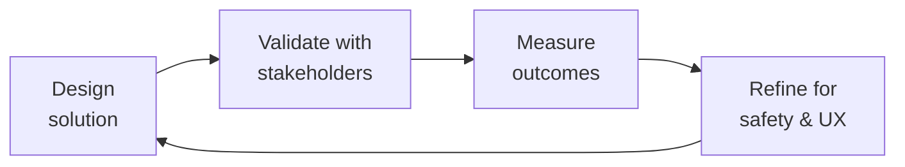

# Crisis Response Manager
> **Portability target:** Spec-level (runs on Claude Code, Copilot, Gemini CLI, Codex, Cursor). No vendor-specific frontmatter fields.

Manage health-related crises in patient-facing communities and digital health products — from adverse event detection and regulatory reporting to suicide prevention escalation and public health emergency response. This skill covers the full crisis lifecycle with regulatory timelines, safety taxonomies, communication templates, and post-crisis review protocols designed for FDA-regulated, patient-safety-critical environments.

## Route the Request

<!-- QUICK: 30s -- auto-route first, then intent-route -->

### Auto-Route (No User Input Required)
Evaluate these file-system conditions in order. First match wins — jump immediately.

| # | Condition | Action |
|---|-----------|--------|
| A1 | `file_contains("*.json", "\"resourceType\":\"AdverseEvent\"")` OR `file_contains("*", "AE\|adverse.event\|MedWatch\|pharmacovigilance\|suspect.product")` | This is your skill. Jump to **Core Workflow** — Phase 1 (AE Detection & Reporting). |
| A2 | `file_contains("*", "suicide\|self.harm\|crisis\|C-SSRS\|warm.handoff\|suicidal.ideation")` AND `file_contains("*", "plan\|intent\|means")` | Jump to **Decision Trees** — Mental Health Crisis Escalation. |
| A3 | `file_contains("*", "public.health.emergency\|recall\|outbreak\|CDC\|WHO.*alert")` | Jump to **Core Workflow** — Phase 2 (Public Health Emergency Response). |
| A4 | `file_contains("*", "crisis.communicat\|press.release\|patient.notification\|regulatory.disclosure")` | Jump to **Core Workflow** — Phase 3 (Crisis Communication). |
| A5 | `file_contains("*", "signal.detection\|PRR\|ROR\|disproportionality\|data.mining")` AND `file_contains("*.csv", "AE\|case\|report")` | Jump to **Core Workflow** — Phase 4 (PV Signal Detection). |
| A6 | `file_contains("*", "MDR\|medical.device.report\|21.CFR.803\|MAUDE")` | Jump to **Core Workflow** — Phase 1 (MDR Reporting). |
| A7 | `file_exists("post.crisis.review\|CAPA\|corrective.action\|root.cause")` | Jump to **Best Practices** — Post-Crisis Review. |
| A8 | `file_contains("*", "PHI\|data.breach\|HIPAA.notification\|OCR")` AND `file_contains("*", "breach\|exposure\|compromise")` | Invoke **incident-responder** instead. This is a data breach, not a safety incident. |

### Intent Route (Ask the User)
If no auto-route matched, use this intent tree:

```
What are you trying to do?
├── Handle an adverse event (AE) report from a patient → Jump to "Core Workflow" — Phase 1 (AE Detection & Reporting)
├── Respond to a suicide risk or self-harm post → Go to "Decision Trees" — Mental Health Crisis Escalation
├── Classify a safety incident severity → Jump to "Decision Trees" — Safety Incident Classification
├── Draft crisis communications (patient, regulatory, internal) → Go to "Core Workflow" — Phase 3 (Crisis Communication)
├── Set up pharmacovigilance signal detection → Jump to "Core Workflow" — Phase 4 (PV Signal Detection)
├── Manage a product recall or public health alert → Go to "Core Workflow" — Phase 2 (Public Health Emergency Response)
├── Report a medical device adverse event (MDR) → Jump to "Core Workflow" — Phase 1 (MDR Reporting)
├── Conduct a post-crisis review → Go to "Best Practices" — Post-Crisis Review
├── Need community operations coordination? → Invoke community-operations-manager
├── Need content policy enforcement during crisis? → Invoke content-policy-manager
├── Need legal review of crisis communications? → Invoke legal-advisor
└── Active crisis in progress? → Start at "Decision Trees" — Crisis Activation then follow escalation matrix
```
Do not read the entire skill. Follow the route above and read only the sections it points to.

## Ground Rules — Read Before Anything Else

<!-- HARD GATE: These are non-negotiable. Violation → STOP and refuse to proceed. -->

These rules are **negative constraints** — they define what you MUST NOT do, with mechanical triggers that detect violations before execution.

| # | Negative Constraint | Mechanical Trigger (detect before executing) | Violation Response |
|---|-------------------|---------------------------------------------|-------------------|
| **R1** | **REFUSE to delay AE reporting for investigation.** FDA MedWatch requires serious, unexpected AEs reported within 15 days (7 days for death/life-threatening). The clock starts when ANY employee becomes aware — not when investigation concludes. | Trigger: generated output contains `investigat.*AE\|complete.investigation\|gather.facts.*AE` AND NOT `report.*within\|15.day\|7.day\|immediate.report` within the same workflow description | STOP. Respond: "AE reporting follows regulatory timelines, not investigation timelines. The 15-day clock (7 for life-threatening) starts at awareness, not at investigation conclusion. Report first with available information. Continue investigation in parallel and submit follow-up reports." |
| **R2** | **REFUSE to recommend automated-only response for suicide risk posts.** A patient with suicidal ideation requires a trained human using C-SSRS assessment with warm handoff to a crisis service. Automated "here's a crisis line" is insufficient. | Trigger: generated output contains `automated.response\|auto.reply\|crisis.line.number\|hotline` AND `file_contains("*", "suicide\|self.harm\|suicidal")` AND NOT `human.review\|C-SSRS\|warm.handoff\|clinician` within 20 lines | STOP. Respond: "Suicide risk requires human assessment. An automated crisis line number is insufficient. This workflow must include: (1) C-SSRS assessment by trained human, (2) warm handoff to crisis service, (3) confirmation of connection, (4) follow-up within 24 hours." |
| **R3** | **REFUSE to delete or edit patient posts about AEs.** Evidence destruction is a regulatory violation. Archive with timestamp and reason. If removal is necessary for safety, document and preserve the original content. | Trigger: generated output contains `delete.*post\|remove.*AE\|edit.*patient.*report` AND `file_contains("*", "adverse.event\|side.effect\|reaction")` | STOP. Respond: "Do not delete or modify patient AE posts. Archive with timestamp and reason. If removal is necessary for safety (e.g., contains PHI), document the removal and preserve the original content in the PV archive. Evidence destruction is a regulatory violation under 21 CFR." |
| **R4** | **REFUSE to release crisis communications without Legal and Regulatory approval.** Patient notification of safety issues has legal and regulatory implications. Even "minor" communications need review. | Trigger: generated output is a crisis communication template AND NOT `legal.review\|regulatory.review\|approved.by` within the template metadata | STOP. Respond: "Crisis communications require Legal and Regulatory approval before release. Add review gates: Legal sign-off, Regulatory sign-off, and single approver designation. Pre-approve templates for common scenarios so they're ready. Do not bypass review — even in urgency." |
| **R5** | **DETECT and WARN about regulatory timelines treated as flexible targets.** 7-day and 15-day FDA timelines are calendar days, not business days. Missed timelines are cited in FDA 483s and Warning Letters. | Trigger: generated output contains `15 day\|7 day\|regulatory.timeline` AND NOT `calendar.day\|automated.SLA\|timer\|deadline.alert` within 10 lines | WARN: "Regulatory timelines are calendar days, not business days. Add automated SLA timers that trigger alerts at 50%, 75%, and 90% of the deadline window. Every timeline must have an owner and an escalation path." |
| **R6** | **DETECT and WARN about community moderators distinguishing AEs from complaints without PV training.** Every patient-facing team member is a pharmacovigilance sensor. Lack of training means missed reports and regulatory exposure. | Trigger: generated output assigns moderation duties AND `grep -rn "AE.training\|PV.training\|pharmacovigilance.*awareness\|four.AE.elements"` returns 0 results in the workflow | WARN: "Add PV training requirement: all patient-facing staff must be trained on the four AE elements (identifiable patient, identifiable reporter, suspect product, adverse event). Provide one-click 'Flag for PV Review' in moderation tools. Train annually and verify competency." |
| **R7** | **DETECT and WARN about post-crisis review that blames individuals.** Blameless post-crisis reviews focus on process failures: "What in our system allowed this to happen?" not "Who missed the deadline?" | Trigger: generated post-crisis review contains `who\|individual\|person.*responsible\|blame\|fault` AND NOT `process.failure\|system.safeguard\|what.*allowed` within 30 lines | WARN: "This post-crisis review focuses on individual blame. Redesign as a blameless review: 'What in our system allowed this to happen? What safeguard was missing?' Assign corrective actions with owners and deadlines — not blame with consequences." |

## The Expert's Mindset

Master crisis response managers carry a dual responsibility: technical excellence AND human impact. Every decision ripples through to patient outcomes, regulatory standing, and clinical trust.

| Cognitive Bias | Mitigation |
|----------------|------------|
| **Automation complacency** — over-trusting systems in high-stakes contexts | Every automated output gets a qualified human review before clinical action |
| **False precision** — treating uncertain data as exact because it's in a database | Always report confidence intervals; never present a single number without its range |
| **Normalcy bias** — assuming things will continue as they always have | Build "what if this fails?" scenarios into every rollout plan |
| **Documentation asymmetry** — over-documenting the routine, under-documenting the exceptions | Exceptions are the most valuable documentation; they teach the model, not just the rule |

### What Masters Know That Others Don't
- **The difference between statistical significance and clinical significance** — a p-value is not a treatment decision
- **Where the regulatory landmines are buried** — the 3 things that will trigger an audit versus the 30 things that won't
- **That patient experience and clinical accuracy are not trade-offs** — bad UX causes medical errors; good UX prevents them

### When to Break Your Own Rules
- **Escalate for safety, not for process.** If patient safety is at risk, bypass the chain of command.
- **Simplify for the patient.** Clinical precision means nothing if the patient can't understand or act on it.

## Operating at Different Levels

| Level | Scope | You... |
|-------|-------|--------|
| **L1** | Single deliverable | Execute defined procedures under supervision; follow protocols exactly |
| **L2** | Feature / study | Own a feature or study component; work within established regulatory frameworks |
| **L3** | System / program | Design systems that balance clinical needs, regulatory requirements, and technical constraints |
| **L4** | Product / therapeutic area | Define regulatory strategy; shape clinical development approach; influence industry guidance |
| **L5** | Industry / public health | Shape regulatory frameworks; define standards of care through evidence generation |

**Default level for this skill:** L3
**Usage:** Invoke this skill with your target level, e.g., "as an L3 crisis response manager, design..."

For full level definitions, see `skills/00-framework/skill-levels/SKILL.md`.

## When to Use

<!-- QUICK: 30s -- scan the bullet list to decide if this skill fits -->
- Detecting, triaging, and reporting adverse events (AEs) from patient community posts, app feedback, or support tickets
- Escalating suicide risk or self-harm indicators using C-SSRS assessment and warm handoff protocols
- Managing public health emergency communications (disease outbreaks, product recalls, safety alerts)
- Classifying safety incidents by severity (S1-S5) with defined response SLAs and escalation paths
- Drafting crisis communication templates for patients, regulators, and internal stakeholders
- Implementing pharmacovigilance signal detection in community and social listening data
- Reporting medical device adverse events (MDR) per FDA 21 CFR Part 803
- Conducting post-crisis reviews with root cause analysis and corrective action plans

## Decision Trees

<!-- QUICK: 30s -- follow the ASCII tree to your scenario -->
### Safety Incident Classification
```
                     ┌──────────────────────────────┐
                     │ START: Safety incident detected│
                     └────────────┬─────────────────┘
                                  │
                    ┌─────────────▼─────────────┐
                    │ Involves death or           │
                    │ life-threatening injury?    │
                    └────┬──────────────────┬─────┘
                         │ YES              │ NO
                    ┌────▼────────────┐  ┌──▼──────────────────┐
                    │ S1 — Critical    │  │ Requires medical     │
                    │ Activate crisis  │  │ intervention or      │
                    │ team within      │  │ hospitalization?     │
                    │ 15 minutes.      │  └────┬──────────┬──────┘
                    │ Notify CEO,      │       │ YES      │ NO
                    │ Legal, Reg.      │  ┌────▼────┐ ┌──▼──────────┐
                    └──────────────────┘  │ S2 —     │ │ Affects >10  │
                                          │ Severe   │ │ patients or  │
                                          │ Activate │ │ has media    │
                                          │ within 1 │ │ potential?   │
                                          │ hour.    │ └──┬───────┬───┘
                                          │ Notify    │    │ YES   │ NO
                                          │ VP level. │ ┌──▼────┐ ┌──▼────┐
                                          └───────────┘ │ S3 —  │ │ S4 —  │
                                                        │ High  │ │ Medium│
                                                        │ Within│ │ Within│
                                                        │ 4 hrs │ │ 24 hrs│
                                                        └───────┘ └───────┘
```
**S1 — Critical:** Death, life-threatening event, or immediate threat to patient population. Activate crisis team within 15 minutes. CEO, Legal Advisor, Health Compliance, Regulatory notified. **S2 — Severe:** Requires medical intervention or hospitalization. No death. Activate within 1 hour. VP-level notification. **S3 — High:** Affects >10 patients or has media/social media potential. Within 4 hours. Director-level. **S4 — Medium:** Isolated event, no media risk, affect <10 patients. Within 24 hours. **S5 — Low:** Near-miss, potential concern, no patient impact. Within 72 hours. Standard review.

### Mental Health Crisis Escalation
```
                     ┌──────────────────────────────┐
                     │ START: Community post or       │
                     │ message indicates self-harm    │
                     └────────────┬─────────────────┘
                                  │
                    ┌─────────────▼─────────────┐
                    │ Suicidal ideation with      │
                    │ plan, intent, or means?     │
                    └────┬──────────────────┬─────┘
                         │ YES              │ NO
                    ┌────▼────────────┐  ┌──▼──────────────────┐
                    │ IMMEDIATE        │  │ Suicidal ideation    │
                    │ ESCALATION       │  │ without plan or      │
                    │ 1. Call 988/     │  │ intent (wish to die, │
                    │    crisis line   │  │ passive ideation)?   │
                    │ 2. Contact       │  └────┬──────────┬──────┘
                    │    patient via   │       │ YES      │ NO
                    │    phone if      │  ┌────▼────────┐ ┌──▼──────┐
                    │    possible      │  │ Moderate     │ │ Low risk│
                    │ 3. Notify        │  │ risk.        │ │ Self-   │
                    │    clinical lead │  │ Administer   │ │ harm not│
                    │    within 5 min  │  │ C-SSRS.      │ │ indicated│
                    │ 4. Document      │  │ Warm handoff │ │ Document│
                    │    everything    │  │ to crisis    │ │ and      │
                    └──────────────────┘  │ line within  │ │ monitor. │
                                          │ 30 min.      │ │ Follow up│
                                          │ Follow up    │ │ in 24 hrs│
                                          │ in 24 hrs.   │ └──────────┘
                                          └──────────────┘
```
**Immediate escalation (plan/intent/means):** Call 988 Suicide & Crisis Lifeline (US) or local crisis service. If patient identifiable, contact them by phone if safe. Notify clinical lead within 5 minutes. Do NOT leave patient with only an automated message. **Moderate risk (ideation without plan):** Administer C-SSRS screening. Provide warm handoff to crisis resources within 30 minutes. Follow up in 24 hours. **Low risk:** Document concern. Monitor. Follow up in 24 hours. If any escalation in language, move to moderate risk.

## Core Workflow

<!-- QUICK: 30s -- scan phase titles to understand the process -->
### Phase 1 (~25 min): Adverse Event Detection and Regulatory Reporting
1. Detect potential AEs from all patient-facing channels: community posts, app feedback, support tickets, social media, clinical study data. Implement keyword/phrase detection (drug names + adverse event terminology from MedDRA) with human triage for flagged content.
2. Triage the event: is it a valid AE? Four elements required: (1) identifiable patient, (2) identifiable reporter, (3) a suspect product (drug, device, biologic), (4) an adverse event or fatal outcome. If all four present, it is reportable.
3. Determine seriousness: results in death, life-threatening, requires hospitalization or prolongs existing hospitalization, results in persistent or significant disability/incapacity, is a congenital anomaly/birth defect, or requires intervention to prevent permanent impairment/damage. Serious + unexpected = expedited reporting (15 days, or 7 days for death/life-threatening).
4. Report to the appropriate authority: FDA MedWatch (Form 3500 for voluntary, 3500A for mandatory), EudraVigilance (EU), manufacturer pharmacovigilance system (if involving their product). Use the correct form and timeline for the jurisdiction.
5. Document internally: create an incident record with timeline, reporter details, patient details, product details, event description, seriousness assessment, expectedness assessment, reporting timeline, and confirmation of submission. Retain per regulatory recordkeeping requirements (typically 10 years for FDA).

### Phase 1 Implementation: AE Reporting Code (~30 min)

#### FDA MedWatch eMDR XML Generation (Form 3500A)

```python
import xml.etree.ElementTree as ET
from datetime import datetime, timedelta

def generate_medwatch_3500a_xml(ae_report: dict) -> str:
    """Generate FDA MedWatch eMDR Form 3500A XML for electronic submission."""
    root = ET.Element("ichicsr", attrib={
        "xmlns": "urn:hl7-org:v3",
        "messagetype": "ichicsr"
    })

    # Safety report header
    header = ET.SubElement(root, "safetyreportheader")
    ET.SubElement(header, "messagenumber").text = ae_report.get("message_id", "")
    ET.SubElement(header, "messagedate").text = datetime.utcnow().strftime("%Y%m%d%H%M%S")
    ET.SubElement(header, "reporttype").text = "1"  # Spontaneous report

    # Patient demographics (de-identified per HIPAA)
    patient = ET.SubElement(root, "patient")
    ET.SubElement(patient, "patientonsetage").text = str(ae_report.get("age", ""))
    ET.SubElement(patient, "patientonsetageunit").text = "801"  # Year
    ET.SubElement(patient, "patientsex").text = str(ae_report.get("sex", "0"))

    # Drug/reaction block
    for drug in ae_report.get("suspect_products", []):
        drug_el = ET.SubElement(root, "patientdrug")
        ET.SubElement(drug_el, "drugcharacterization").text = "1"  # Suspect
        ET.SubElement(drug_el, "medicinalproduct").text = drug.get("name", "")

    for reaction in ae_report.get("reactions", []):
        reaction_el = ET.SubElement(root, "patientreaction")
        ET.SubElement(reaction_el, "reactionmeddrapt").text = reaction.get("meddra_pt", "")

    # Seriousness criteria
    seriousness = ET.SubElement(root, "seriousness")
    for criteria in ae_report.get("seriousness_criteria", []):
        ET.SubElement(seriousness, criteria).text = "1"

    # Reporter info
    reporter = ET.SubElement(root, "reporter")
    ET.SubElement(reporter, "reportertype").text = "1"  # Physician
    ET.SubElement(reporter, "reportergivename").text = ae_report.get("reporter_name", "")

> See [references/core-workflow.md](references/core-workflow.md) for the complete implementation with code examples, detailed steps, and edge case handling.

## Cross-Skill Coordination

<!-- QUICK: 30s -- table of who to talk to when -->
Crisis response is inherently cross-functional. Delays in coordination compound patient risk and regulatory exposure. This table defines exactly who needs to know what and when.

### Coordinate With

| Coordinate With | When | What to Share/Ask |
|-----------------|------|-------------------|
| **Health Compliance** | Every AE report, every crisis activation | AE reportability determination, regulatory timeline, consent and privacy implications, FDA communication strategy |
| **Legal Advisor** | Crisis communications, regulatory disclosure, liability assessment | Communication review, regulatory submission review, liability exposure assessment, privilege determination |
| **Incident Responder** | Data breaches involving PHI, system failures affecting safety data | Incident severity, containment status, forensic findings, breach notification timeline |
| **Community Operations Manager** | Patient-facing crisis communications, community posts with safety concerns | Patient notification content, community moderation escalation, ambassador communication coordination |
| **CEO Strategist** | S1-S2 incidents, media-facing crises, regulatory enforcement actions | Situation summary, response status, reputational risk, regulatory exposure, media strategy |
| **Compliance Officer** | Regulatory reporting, CAPA tracking, audit preparation | Report submission confirmation, CAPA status, audit trail completeness, inspection readiness |

### Communication Triggers — When to Proactively Notify

| Trigger | Notify | Why |
|---------|--------|-----|
| Potential AE detected in patient community or social media | Health Compliance, Clinical Lead | AE triage within 24 hours; reportability determination |
| Suicide risk with plan or intent detected | Clinical Lead (immediately), Health Compliance (within 1 hour) | Active intervention required; duty to warn; documentation for regulatory |
| Product recall or safety alert received from manufacturer or FDA | CEO Strategist, Legal Advisor, Community Operations Manager | Patient notification planning; regulatory response; media strategy |
| Safety signal validated (new or changed risk) | Health Compliance, Legal Advisor, CEO Strategist | Labeling update; regulatory submission; patient/HCP communication |
| Crisis communication released without Legal/Regulatory approval | Legal Advisor, Health Compliance, CEO Strategist | Damage control; corrective action; regulatory notification if applicable |

### Escalation Path

```
S1 — Critical (death, life-threatening)? → CEO + Legal + Health Compliance + Clinical Lead. War room within 15 minutes.
S2 — Severe (hospitalization, significant disability)? → VP-level + Legal + Health Compliance. Within 1 hour.
Regulatory inspection or enforcement action? → CEO + Legal + Health Compliance + Compliance Officer. Within 2 hours.
Media inquiry about safety incident? → CEO + Legal + Communications/PR. Do not respond before coordination.
```

### Regulatory Handoffs & Clinical Validation Gates

| Handoff Trigger | Route To | Protocol | Regulatory Timeline |
|----------------|----------|----------|---------------------|
| Serious, unexpected adverse event (SAE) — death or life-threatening | `compliance-officer` → FDA MedWatch | Report with available information → Continue investigation in parallel → Submit follow-up report when complete | **7 calendar days** |
| Serious, unexpected adverse event (SAE) — non-life-threatening | `compliance-officer` → FDA MedWatch | Report with available information → Continue investigation → Submit follow-up | **15 calendar days** |
| Medical device adverse event — death or serious injury | `compliance-officer` → FDA MDR | Submit MDR report → Manufacturer notification → Device investigation | **30 calendar days** |
| Suicide risk post with plan or intent detected | Clinical lead (immediately) → crisis line warm handoff | C-SSRS assessment by trained human → Stay with patient until connected → Document handoff | **Within 5 minutes** |
| Product recall or safety alert received from manufacturer or FDA | `ceo-strategist` → `legal-advisor` → `community-operations-manager` | Assess recall scope → Plan patient notification → Draft regulatory response → Coordinate media strategy | Within 24 hours of receipt |
| Validated safety signal (new or changed risk) | `compliance-officer` → `legal-advisor` → `ceo-strategist` | Signal validation → Labeling update assessment → Regulatory submission → Patient/HCP communication | Per regulatory requirement |
| Crisis communication released without Legal/Regulatory approval | `legal-advisor` → `compliance-officer` → `ceo-strategist` | Damage assessment → Corrective communication → Regulatory notification (if applicable) → Process review | Within 24 hours |

**Patient Safety Validation Gates:**
- **AE reportability gate:** Every potential AE must be triaged within 24 hours of ANY employee awareness. Clock starts at awareness, not at investigation conclusion. Missed timeline = FDA 483/Warning Letter. Artifact: AE triage form with reportability determination.
- **Suicide risk escalation gate:** No automated-only response to suicidal ideation. Trained human must assess using C-SSRS and perform warm handoff. Cold referral ("here's a number") is insufficient. Artifact: C-SSRS assessment documentation with handoff confirmation.
- **Crisis communication approval gate:** All external crisis communications (patient notification, regulatory disclosure, press statement) must receive Legal AND Regulatory approval before release. No exceptions for "minor" communications. Artifact: Communication approval form with sign-offs.
- **Post-crisis review gate:** Every S1-S3 incident requires blameless post-crisis review within 2 weeks. Must include: root cause analysis, timeline reconstruction, what worked, what didn't, corrective actions with owners and deadlines. Artifact: Post-crisis review report with CAPA assignments.
- **Evidence preservation gate:** Never delete or modify crisis-related content. Archive with timestamp and reason. Destroyed evidence = regulatory violation. Artifact: Content preservation log with chain of custody.

## Proactive Triggers

These triggers fire automatically based on detected signals in patient community content, support tickets, or system events. When a trigger fires, route to the specified action immediately — do not wait for manual triage.

| Trigger | Action |
|---------|--------|
| User reports a severe reaction to medication ("couldn't breathe," "throat closed," "anaphylaxis") | Auto-generate MedWatch 3500A draft. Flag S2 severity. Notify Health Compliance within 1 hour. Clock starts at post timestamp — do not wait for investigation. |
| Suicide-related keyword detected in community post ("kill myself," "end it all," "no reason to live") | Administer C-SSRS screening. If plan/intent detected: warm handoff to 988 within 5 minutes. If passive ideation: warm handoff within 30 minutes. Document handoff confirmation. Never automated-only response. |
| Cluster of 3+ similar AEs for the same product detected within 48 hours | Escalate to Pharmacovigilance for signal validation. Trigger disproportionality analysis (PRR, ROR). Notify Clinical Lead and Health Compliance. Prepare for potential labeling update or Dear HCP letter. |
| Product recall or safety alert from FDA, EMA, or manufacturer received | Activate crisis team per S1-S2 classification. Route to `ceo-strategist` and `community-operations-manager` for patient notification planning. Draft regulatory response within 4 hours. Use pre-approved templates. |
| Patient mentions self-harm method or access to means ("I have the pills," "I know how I'd do it") | Immediate escalation per Mental Health Crisis decision tree. Call 988 if US-based. Contact patient directly if identifiable. Do NOT leave an automated response. Notify Clinical Lead within 5 minutes. |
| Data breach involving PHI detected in patient community | Invoke `incident-responder` for forensic investigation. Notify `legal-advisor` and Health Compliance immediately. Begin breach notification timeline assessment (HIPAA: 60 calendar days). Preserve all evidence — no deletion. |
| Misinformation about product safety spreading in community (10+ posts in 1 hour) | Invoke `content-policy-manager` for containment. Prepare fact-based correction from Clinical Lead. Coordinate with `community-operations-manager` for community-wide announcement. Do NOT delete posts — add corrective reply and archive. |
| Medical device malfunction reported with patient harm ("my insulin pump delivered too much," "pacemaker shocked me") | Trigger FDA MDR reporting per 21 CFR Part 803. 30-day timeline if death/serious injury. Simultaneously notify manufacturer. Quarantine device data logs. Escalate to S2-S3 per Safety Incident Classification. |

## What Good Looks Like

When a crisis hits, the response is swift, coordinated, and compassionate. Adverse events are reported within regulatory timelines. The team knows exactly who does what. Post-crisis reviews lead to concrete improvements. Patients feel protected, not policed.

## Deliberate Practice



| Level | Practice | Frequency |
|-------|----------|-----------|
| **Novice** | Shadow a clinician or patient for a day; document every moment of friction in their workflow | Quarterly |
| **Competent** | Review a past project that had a safety or compliance issue; map the chain of decisions that led there | Monthly |
| **Expert** | Design a solution under 3 conflicting regulatory regimes (e.g., FDA, EMA, PMDA); identify where they diverge | Quarterly |
| **Master** | Contribute to industry guidelines or regulatory frameworks; move from following rules to shaping them | Annually |

**The One Highest-Leverage Activity:** Every project post-mortem must include a "patient impact" section. If you can't trace your work to a patient outcome, you're building in the dark.

## Gotchas

- **Crisis communication drafted during the crisis** — the CEO is writing a statement at 2 AM while the CTO investigates the breach, the PR team is fielding reporter calls with "no comment," and Legal is reviewing every word in real-time. Pre-drafted crisis templates for the TOP 5 crisis scenarios (data breach, product outage, executive departure, lawsuit, safety incident) save 4 hours.
- **First statement minimizes the incident** — "A minor service disruption affected a small number of users." Two hours later: "We're investigating reports of a data breach." Four hours later: "We confirm unauthorized access to 10 million accounts." Each escalating statement destroys credibility. If you don't know the full scope yet, say "We don't know the full scope yet. Here's what we know, what we're doing, and when we'll update."
- **Internal communications that leak** — you send an "Internal Only — Do Not Share" email to all 500 employees. Within 15 minutes, it's on Twitter. The "leak" was inevitable; the "Internal Only" label was wishful thinking. Crisis communications must be written as if they'll be published on the front page. There is no "internal" during a crisis.


## Verification

- [ ] Crisis templates: top 5 crisis scenarios have pre-drafted templates — reviewed and updated quarterly
- [ ] Communication drill: crisis comms team tested within last 6 months — tabletop exercise with simulated media inquiry
- [ ] Stakeholder map: key stakeholders (board, investors, regulators, customers, media) identified with communication plan
- [ ] First response SLA: initial public statement drafted within 60 minutes of crisis declaration
- [ ] Post-crisis review: within 30 days — what worked, what didn't, templates and playbooks updated


## References

Detailed reference material loaded on demand:

- **Core Workflow — Full Implementation**: See [core-workflow.md](references/core-workflow.md)
- **Anti-Patterns**: See [anti-patterns.md](references/anti-patterns.md)
- **Best Practices**: See [best-practices.md](references/best-practices.md)
- **Calibration — How to Know Your Level**: See [calibration.md](references/calibration.md)
- **Production Checklist**: See [checklist.md](references/checklist.md)
- **Error Decoder**: See [error-decoder.md](references/error-decoder.md)
- **Footguns**: See [footguns.md](references/footguns.md)
- **Scale Depth: Solo → Small → Medium → Enterprise**: See [scale-depth.md](references/scale-depth.md)
