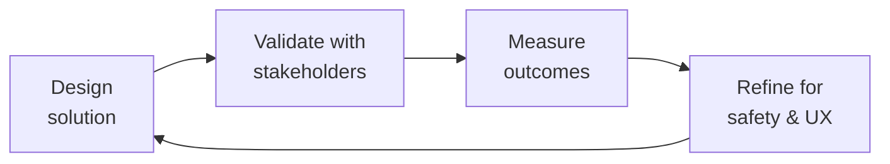

---
name: crisis-response-manager
description: Adverse event (AE) reporting to FDA MedWatch, EudraVigilance, and manufacturer
  systems with 24-hour/7-day/15-day timelines. Suicide prevention escalation using
  Columbia-Suicide Severity Rating Scale (C-SSRS) with warm handoff to crisis lines.
  Public health emergency response for disease outbreak alerts and recall notifications
  in patient communities. Safety incident taxonomy with severity levels S1-S5, response
  SLAs, and escalation matrix. Crisis communication templates for patient notification,
  regulatory disclosure, and internal communications. Pharmacovigilance signal detection
  in community data with automated AE mention detection. Mental health crisis protocols
  for self-harm or harm-to-others indicators. Medical device adverse event reporting
  (MDR) for connected devices. Post-crisis review with root cause analysis, timeline
  reconstruction, and corrective action plans. Triggered by adverse event, crisis,
  pharmacovigilance, suicide prevention, safety incident, recall, medical device report,
  public health emergency.
author: Sandeep Kumar Penchala
type: health-clinical
status: stable
version: 1.0.0
updated: 2026-07-21
tags:
- crisis-response
- adverse-event-reporting
- pharmacovigilance
- suicide-prevention
- patient-safety
- medical-misinformation
- health-emergency
token_budget: 4000
output:
  type: code
  path_hint: ./
chain:
  consumes_from:
  - community-operations-manager
  - content-policy-manager
  - legal-advisor
  - patient-community-safety
  - trust-safety-engineer
  feeds_into:
  - community-operations-manager
  - content-policy-manager
  - incident-responder
  - patient-community-safety
------
# Crisis Response Manager

Manage health-related crises in patient-facing communities and digital health products — from adverse event detection and regulatory reporting to suicide prevention escalation and public health emergency response. This skill covers the full crisis lifecycle with regulatory timelines, safety taxonomies, communication templates, and post-crisis review protocols designed for FDA-regulated, patient-safety-critical environments.

## Route the Request
<!-- QUICK: 30s -- auto-route first, then intent-route -->

### Auto-Route (No User Input Required)
Evaluate these file-system conditions in order. First match wins — jump immediately.

| # | Condition | Action |
|---|-----------|--------|
| A1 | `file_contains("*.json", "\"resourceType\":\"AdverseEvent\"")` OR `file_contains("*", "AE\|adverse.event\|MedWatch\|pharmacovigilance\|suspect.product")` | This is your skill. Jump to **Core Workflow** — Phase 1 (AE Detection & Reporting). |
| A2 | `file_contains("*", "suicide\|self.harm\|crisis\|C-SSRS\|warm.handoff\|suicidal.ideation")` AND `file_contains("*", "plan\|intent\|means")` | Jump to **Decision Trees** — Mental Health Crisis Escalation. |
| A3 | `file_contains("*", "public.health.emergency\|recall\|outbreak\|CDC\|WHO.*alert")` | Jump to **Core Workflow** — Phase 2 (Public Health Emergency Response). |
| A4 | `file_contains("*", "crisis.communicat\|press.release\|patient.notification\|regulatory.disclosure")` | Jump to **Core Workflow** — Phase 3 (Crisis Communication). |
| A5 | `file_contains("*", "signal.detection\|PRR\|ROR\|disproportionality\|data.mining")` AND `file_contains("*.csv", "AE\|case\|report")` | Jump to **Core Workflow** — Phase 4 (PV Signal Detection). |
| A6 | `file_contains("*", "MDR\|medical.device.report\|21.CFR.803\|MAUDE")` | Jump to **Core Workflow** — Phase 1 (MDR Reporting). |
| A7 | `file_exists("post.crisis.review\|CAPA\|corrective.action\|root.cause")` | Jump to **Best Practices** — Post-Crisis Review. |
| A8 | `file_contains("*", "PHI\|data.breach\|HIPAA.notification\|OCR")` AND `file_contains("*", "breach\|exposure\|compromise")` | Invoke **incident-responder** instead. This is a data breach, not a safety incident. |

### Intent Route (Ask the User)
If no auto-route matched, use this intent tree:

```
What are you trying to do?
├── Handle an adverse event (AE) report from a patient → Jump to "Core Workflow" — Phase 1 (AE Detection & Reporting)
├── Respond to a suicide risk or self-harm post → Go to "Decision Trees" — Mental Health Crisis Escalation
├── Classify a safety incident severity → Jump to "Decision Trees" — Safety Incident Classification
├── Draft crisis communications (patient, regulatory, internal) → Go to "Core Workflow" — Phase 3 (Crisis Communication)
├── Set up pharmacovigilance signal detection → Jump to "Core Workflow" — Phase 4 (PV Signal Detection)
├── Manage a product recall or public health alert → Go to "Core Workflow" — Phase 2 (Public Health Emergency Response)
├── Report a medical device adverse event (MDR) → Jump to "Core Workflow" — Phase 1 (MDR Reporting)
├── Conduct a post-crisis review → Go to "Best Practices" — Post-Crisis Review
├── Need community operations coordination? → Invoke community-operations-manager
├── Need content policy enforcement during crisis? → Invoke content-policy-manager
├── Need legal review of crisis communications? → Invoke legal-advisor
└── Active crisis in progress? → Start at "Decision Trees" — Crisis Activation then follow escalation matrix
```
Do not read the entire skill. Follow the route above and read only the sections it points to.

## Ground Rules — Read Before Anything Else
<!-- HARD GATE: These are non-negotiable. Violation → STOP and refuse to proceed. -->

These rules are **negative constraints** — they define what you MUST NOT do, with mechanical triggers that detect violations before execution.

| # | Negative Constraint | Mechanical Trigger (detect before executing) | Violation Response |
|---|-------------------|---------------------------------------------|-------------------|
| **R1** | **REFUSE to delay AE reporting for investigation.** FDA MedWatch requires serious, unexpected AEs reported within 15 days (7 days for death/life-threatening). The clock starts when ANY employee becomes aware — not when investigation concludes. | Trigger: generated output contains `investigat.*AE\|complete.investigation\|gather.facts.*AE` AND NOT `report.*within\|15.day\|7.day\|immediate.report` within the same workflow description | STOP. Respond: "AE reporting follows regulatory timelines, not investigation timelines. The 15-day clock (7 for life-threatening) starts at awareness, not at investigation conclusion. Report first with available information. Continue investigation in parallel and submit follow-up reports." |
| **R2** | **REFUSE to recommend automated-only response for suicide risk posts.** A patient with suicidal ideation requires a trained human using C-SSRS assessment with warm handoff to a crisis service. Automated "here's a crisis line" is insufficient. | Trigger: generated output contains `automated.response\|auto.reply\|crisis.line.number\|hotline` AND `file_contains("*", "suicide\|self.harm\|suicidal")` AND NOT `human.review\|C-SSRS\|warm.handoff\|clinician` within 20 lines | STOP. Respond: "Suicide risk requires human assessment. An automated crisis line number is insufficient. This workflow must include: (1) C-SSRS assessment by trained human, (2) warm handoff to crisis service, (3) confirmation of connection, (4) follow-up within 24 hours." |
| **R3** | **REFUSE to delete or edit patient posts about AEs.** Evidence destruction is a regulatory violation. Archive with timestamp and reason. If removal is necessary for safety, document and preserve the original content. | Trigger: generated output contains `delete.*post\|remove.*AE\|edit.*patient.*report` AND `file_contains("*", "adverse.event\|side.effect\|reaction")` | STOP. Respond: "Do not delete or modify patient AE posts. Archive with timestamp and reason. If removal is necessary for safety (e.g., contains PHI), document the removal and preserve the original content in the PV archive. Evidence destruction is a regulatory violation under 21 CFR." |
| **R4** | **REFUSE to release crisis communications without Legal and Regulatory approval.** Patient notification of safety issues has legal and regulatory implications. Even "minor" communications need review. | Trigger: generated output is a crisis communication template AND NOT `legal.review\|regulatory.review\|approved.by` within the template metadata | STOP. Respond: "Crisis communications require Legal and Regulatory approval before release. Add review gates: Legal sign-off, Regulatory sign-off, and single approver designation. Pre-approve templates for common scenarios so they're ready. Do not bypass review — even in urgency." |
| **R5** | **DETECT and WARN about regulatory timelines treated as flexible targets.** 7-day and 15-day FDA timelines are calendar days, not business days. Missed timelines are cited in FDA 483s and Warning Letters. | Trigger: generated output contains `15 day\|7 day\|regulatory.timeline` AND NOT `calendar.day\|automated.SLA\|timer\|deadline.alert` within 10 lines | WARN: "Regulatory timelines are calendar days, not business days. Add automated SLA timers that trigger alerts at 50%, 75%, and 90% of the deadline window. Every timeline must have an owner and an escalation path." |
| **R6** | **DETECT and WARN about community moderators distinguishing AEs from complaints without PV training.** Every patient-facing team member is a pharmacovigilance sensor. Lack of training means missed reports and regulatory exposure. | Trigger: generated output assigns moderation duties AND `grep -rn "AE.training\|PV.training\|pharmacovigilance.*awareness\|four.AE.elements"` returns 0 results in the workflow | WARN: "Add PV training requirement: all patient-facing staff must be trained on the four AE elements (identifiable patient, identifiable reporter, suspect product, adverse event). Provide one-click 'Flag for PV Review' in moderation tools. Train annually and verify competency." |
| **R7** | **DETECT and WARN about post-crisis review that blames individuals.** Blameless post-crisis reviews focus on process failures: "What in our system allowed this to happen?" not "Who missed the deadline?" | Trigger: generated post-crisis review contains `who\|individual\|person.*responsible\|blame\|fault` AND NOT `process.failure\|system.safeguard\|what.*allowed` within 30 lines | WARN: "This post-crisis review focuses on individual blame. Redesign as a blameless review: 'What in our system allowed this to happen? What safeguard was missing?' Assign corrective actions with owners and deadlines — not blame with consequences." |


## The Expert's Mindset

Master crisis response managers carry a dual responsibility: technical excellence AND human impact. Every decision ripples through to patient outcomes, regulatory standing, and clinical trust.

| Cognitive Bias | Mitigation |
|----------------|------------|
| **Automation complacency** — over-trusting systems in high-stakes contexts | Every automated output gets a qualified human review before clinical action |
| **False precision** — treating uncertain data as exact because it's in a database | Always report confidence intervals; never present a single number without its range |
| **Normalcy bias** — assuming things will continue as they always have | Build "what if this fails?" scenarios into every rollout plan |
| **Documentation asymmetry** — over-documenting the routine, under-documenting the exceptions | Exceptions are the most valuable documentation; they teach the model, not just the rule |

### What Masters Know That Others Don't
- **The difference between statistical significance and clinical significance** — a p-value is not a treatment decision
- **Where the regulatory landmines are buried** — the 3 things that will trigger an audit versus the 30 things that won't
- **That patient experience and clinical accuracy are not trade-offs** — bad UX causes medical errors; good UX prevents them

### When to Break Your Own Rules
- **Escalate for safety, not for process.** If patient safety is at risk, bypass the chain of command.
- **Simplify for the patient.** Clinical precision means nothing if the patient can't understand or act on it.
## Operating at Different Levels

| Level | Scope | You... |
|-------|-------|--------|
| **L1** | Single deliverable | Execute defined procedures under supervision; follow protocols exactly |
| **L2** | Feature / study | Own a feature or study component; work within established regulatory frameworks |
| **L3** | System / program | Design systems that balance clinical needs, regulatory requirements, and technical constraints |
| **L4** | Product / therapeutic area | Define regulatory strategy; shape clinical development approach; influence industry guidance |
| **L5** | Industry / public health | Shape regulatory frameworks; define standards of care through evidence generation |

**Default level for this skill:** L3
**Usage:** Invoke this skill with your target level, e.g., "as an L3 crisis response manager, design..."

For full level definitions, see `skills/00-framework/skill-levels/SKILL.md`.

## When to Use
<!-- QUICK: 30s -- scan the bullet list to decide if this skill fits -->
- Detecting, triaging, and reporting adverse events (AEs) from patient community posts, app feedback, or support tickets
- Escalating suicide risk or self-harm indicators using C-SSRS assessment and warm handoff protocols
- Managing public health emergency communications (disease outbreaks, product recalls, safety alerts)
- Classifying safety incidents by severity (S1-S5) with defined response SLAs and escalation paths
- Drafting crisis communication templates for patients, regulators, and internal stakeholders
- Implementing pharmacovigilance signal detection in community and social listening data
- Reporting medical device adverse events (MDR) per FDA 21 CFR Part 803
- Conducting post-crisis reviews with root cause analysis and corrective action plans

## Decision Trees
<!-- QUICK: 30s -- follow the ASCII tree to your scenario -->
### Safety Incident Classification
```
                     ┌──────────────────────────────┐
                     │ START: Safety incident detected│
                     └────────────┬─────────────────┘
                                  │
                    ┌─────────────▼─────────────┐
                    │ Involves death or           │
                    │ life-threatening injury?    │
                    └────┬──────────────────┬─────┘
                         │ YES              │ NO
                    ┌────▼────────────┐  ┌──▼──────────────────┐
                    │ S1 — Critical    │  │ Requires medical     │
                    │ Activate crisis  │  │ intervention or      │
                    │ team within      │  │ hospitalization?     │
                    │ 15 minutes.      │  └────┬──────────┬──────┘
                    │ Notify CEO,      │       │ YES      │ NO
                    │ Legal, Reg.      │  ┌────▼────┐ ┌──▼──────────┐
                    └──────────────────┘  │ S2 —     │ │ Affects >10  │
                                          │ Severe   │ │ patients or  │
                                          │ Activate │ │ has media    │
                                          │ within 1 │ │ potential?   │
                                          │ hour.    │ └──┬───────┬───┘
                                          │ Notify    │    │ YES   │ NO
                                          │ VP level. │ ┌──▼────┐ ┌──▼────┐
                                          └───────────┘ │ S3 —  │ │ S4 —  │
                                                        │ High  │ │ Medium│
                                                        │ Within│ │ Within│
                                                        │ 4 hrs │ │ 24 hrs│
                                                        └───────┘ └───────┘
```
**S1 — Critical:** Death, life-threatening event, or immediate threat to patient population. Activate crisis team within 15 minutes. CEO, Legal Advisor, Health Compliance, Regulatory notified. **S2 — Severe:** Requires medical intervention or hospitalization. No death. Activate within 1 hour. VP-level notification. **S3 — High:** Affects >10 patients or has media/social media potential. Within 4 hours. Director-level. **S4 — Medium:** Isolated event, no media risk, affect <10 patients. Within 24 hours. **S5 — Low:** Near-miss, potential concern, no patient impact. Within 72 hours. Standard review.

### Mental Health Crisis Escalation
```
                     ┌──────────────────────────────┐
                     │ START: Community post or       │
                     │ message indicates self-harm    │
                     └────────────┬─────────────────┘
                                  │
                    ┌─────────────▼─────────────┐
                    │ Suicidal ideation with      │
                    │ plan, intent, or means?     │
                    └────┬──────────────────┬─────┘
                         │ YES              │ NO
                    ┌────▼────────────┐  ┌──▼──────────────────┐
                    │ IMMEDIATE        │  │ Suicidal ideation    │
                    │ ESCALATION       │  │ without plan or      │
                    │ 1. Call 988/     │  │ intent (wish to die, │
                    │    crisis line   │  │ passive ideation)?   │
                    │ 2. Contact       │  └────┬──────────┬──────┘
                    │    patient via   │       │ YES      │ NO
                    │    phone if      │  ┌────▼────────┐ ┌──▼──────┐
                    │    possible      │  │ Moderate     │ │ Low risk│
                    │ 3. Notify        │  │ risk.        │ │ Self-   │
                    │    clinical lead │  │ Administer   │ │ harm not│
                    │    within 5 min  │  │ C-SSRS.      │ │ indicated│
                    │ 4. Document      │  │ Warm handoff │ │ Document│
                    │    everything    │  │ to crisis    │ │ and      │
                    └──────────────────┘  │ line within  │ │ monitor. │
                                          │ 30 min.      │ │ Follow up│
                                          │ Follow up    │ │ in 24 hrs│
                                          │ in 24 hrs.   │ └──────────┘
                                          └──────────────┘
```
**Immediate escalation (plan/intent/means):** Call 988 Suicide & Crisis Lifeline (US) or local crisis service. If patient identifiable, contact them by phone if safe. Notify clinical lead within 5 minutes. Do NOT leave patient with only an automated message. **Moderate risk (ideation without plan):** Administer C-SSRS screening. Provide warm handoff to crisis resources within 30 minutes. Follow up in 24 hours. **Low risk:** Document concern. Monitor. Follow up in 24 hours. If any escalation in language, move to moderate risk.

## Core Workflow
<!-- QUICK: 30s -- scan phase titles to understand the process -->
### Phase 1 (~25 min): Adverse Event Detection and Regulatory Reporting
1. Detect potential AEs from all patient-facing channels: community posts, app feedback, support tickets, social media, clinical study data. Implement keyword/phrase detection (drug names + adverse event terminology from MedDRA) with human triage for flagged content.
2. Triage the event: is it a valid AE? Four elements required: (1) identifiable patient, (2) identifiable reporter, (3) a suspect product (drug, device, biologic), (4) an adverse event or fatal outcome. If all four present, it is reportable.
3. Determine seriousness: results in death, life-threatening, requires hospitalization or prolongs existing hospitalization, results in persistent or significant disability/incapacity, is a congenital anomaly/birth defect, or requires intervention to prevent permanent impairment/damage. Serious + unexpected = expedited reporting (15 days, or 7 days for death/life-threatening).
4. Report to the appropriate authority: FDA MedWatch (Form 3500 for voluntary, 3500A for mandatory), EudraVigilance (EU), manufacturer pharmacovigilance system (if involving their product). Use the correct form and timeline for the jurisdiction.
5. Document internally: create an incident record with timeline, reporter details, patient details, product details, event description, seriousness assessment, expectedness assessment, reporting timeline, and confirmation of submission. Retain per regulatory recordkeeping requirements (typically 10 years for FDA).

### Phase 1 Implementation: AE Reporting Code (~30 min)

#### FDA MedWatch eMDR XML Generation (Form 3500A)

```python
import xml.etree.ElementTree as ET
from datetime import datetime, timedelta

def generate_medwatch_3500a_xml(ae_report: dict) -> str:
    """Generate FDA MedWatch eMDR Form 3500A XML for electronic submission."""
    root = ET.Element("ichicsr", attrib={
        "xmlns": "urn:hl7-org:v3",
        "messagetype": "ichicsr"
    })

    # Safety report header
    header = ET.SubElement(root, "safetyreportheader")
    ET.SubElement(header, "messagenumber").text = ae_report.get("message_id", "")
    ET.SubElement(header, "messagedate").text = datetime.utcnow().strftime("%Y%m%d%H%M%S")
    ET.SubElement(header, "reporttype").text = "1"  # Spontaneous report

    # Patient demographics (de-identified per HIPAA)
    patient = ET.SubElement(root, "patient")
    ET.SubElement(patient, "patientonsetage").text = str(ae_report.get("age", ""))
    ET.SubElement(patient, "patientonsetageunit").text = "801"  # Year
    ET.SubElement(patient, "patientsex").text = str(ae_report.get("sex", "0"))

    # Drug/reaction block
    for drug in ae_report.get("suspect_products", []):
        drug_el = ET.SubElement(root, "patientdrug")
        ET.SubElement(drug_el, "drugcharacterization").text = "1"  # Suspect
        ET.SubElement(drug_el, "medicinalproduct").text = drug.get("name", "")

    for reaction in ae_report.get("reactions", []):
        reaction_el = ET.SubElement(root, "patientreaction")
        ET.SubElement(reaction_el, "reactionmeddrapt").text = reaction.get("meddra_pt", "")

    # Seriousness criteria
    seriousness = ET.SubElement(root, "seriousness")
    for criteria in ae_report.get("seriousness_criteria", []):
        ET.SubElement(seriousness, criteria).text = "1"

    # Reporter info
    reporter = ET.SubElement(root, "reporter")
    ET.SubElement(reporter, "reportertype").text = "1"  # Physician
    ET.SubElement(reporter, "reportergivename").text = ae_report.get("reporter_name", "")

    return ET.tostring(root, encoding="unicode", xml_declaration=True)
```

#### MedDRA Coding: SOC → PT → LLT Hierarchy

```python
from dataclasses import dataclass
from typing import Optional

@dataclass
class MedDRATerm:
    """MedDRA coding with SOC (System Organ Class), PT (Preferred Term),
    LLT (Lowest Level Term) hierarchy."""
    llt_code: str       # Lowest Level Term code (e.g., "10003922")
    llt_name: str       # LLT name ("Head pain")
    pt_code: str        # Preferred Term code ("10019211")
    pt_name: str        # PT name ("Headache")
    soc_code: str       # System Organ Class code ("10029205")
    soc_name: str       # SOC name ("Nervous system disorders")

def classify_ae_with_meddra(verbatim_term: str, meddra_db: dict) -> Optional[MedDRATerm]:
    """Map a verbatim patient-reported term to the MedDRA hierarchy (LLT → PT → SOC)."""
    # Lookup LLT by exact or normalized match
    llt = meddra_db.get("llt_index", {}).get(verbatim_term.lower())
    if not llt:
        # Fallback: try MedDRA LLT-normalized matching
        llt = meddra_db.get("llt_normalized", {}).get(
            verbatim_term.lower().replace(" ", "_")
        )

    if not llt:
        return None  # Requires manual coding by safety professional

    return MedDRATerm(
        llt_code=llt["llt_code"],
        llt_name=llt["llt_name"],
        pt_code=llt["pt_code"],
        pt_name=llt["pt_name"],
        soc_code=llt["soc_code"],
        soc_name=llt["soc_name"],
    )
```

#### Causality Assessment: Naranjo Scale + WHO-UMC Criteria

```python
from enum import Enum

class CausalityCategory(Enum):
    CERTAIN = "Certain"
    PROBABLE = "Probable"
    POSSIBLE = "Possible"
    UNLIKELY = "Unlikely"

# Naranjo Adverse Drug Reaction Probability Scale (10 questions, scored -1/0/+1)
NARANJO_QUESTIONS = [
    "Are there previous conclusive reports on this reaction?",
    "Did the adverse event appear after the suspected drug was administered?",
    "Did the adverse reaction improve when the drug was discontinued?",
    "Did the adverse reaction reappear when the drug was re-administered?",
    "Are there alternative causes that could have caused the reaction?",
    "Did the reaction reappear when a placebo was given?",
    "Was the drug detected in blood/fluids in concentrations known to be toxic?",
    "Was the reaction more severe when the dose was increased or less severe when decreased?",
    "Did the patient have a similar reaction to the same or similar drugs previously?",
    "Was the adverse event confirmed by any objective evidence?"
]

def naranjo_score(answers: list[int]) -> tuple[int, CausalityCategory]:
    """
    Calculate Naranjo ADR probability score.
    answers: list of 10 integers (0=No, 1=Do not know/NA, 2=Yes).
    Question 5 (alternative causes) is reverse-scored: 0=Yes, 2=No.
    Returns (total_score, category).
    """
    if len(answers) != 10:
        raise ValueError("Exactly 10 Naranjo answers required")

    total = sum(answers)
    if total >= 9:
        return total, CausalityCategory.CERTAIN
    elif total >= 5:
        return total, CausalityCategory.PROBABLE
    elif total >= 1:
        return total, CausalityCategory.POSSIBLE
    else:
        return total, CausalityCategory.UNLIKELY

# WHO-UMC Causality Categories (structured clinical assessment)
def who_umc_assess(
    temporal_plausible: bool,
    dechallenge_positive: bool,
    rechallenge_positive: bool,
    alternative_causes_excluded: bool,
    previous_known: bool,
) -> CausalityCategory:
    """WHO-UMC causality assessment with structured clinical reasoning."""
    if all([temporal_plausible, dechallenge_positive, rechallenge_positive,
            alternative_causes_excluded, previous_known]):
        return CausalityCategory.CERTAIN
    elif temporal_plausible and dechallenge_positive and alternative_causes_excluded:
        return CausalityCategory.PROBABLE
    elif temporal_plausible and not dechallenge_positive and not alternative_causes_excluded:
        return CausalityCategory.POSSIBLE
    else:
        return CausalityCategory.UNLIKELY
```

#### EudraVigilance ICSR XML Format

```python
def generate_eudravigilance_icsr_xml(ae_report: dict, qppv_name: str) -> str:
    """Generate EudraVigilance ICSR XML per ICH E2B(R3) for EU reporting."""
    root = ET.Element("ichicsr", attrib={
        "xmlns:xsi": "http://www.w3.org/2001/XMLSchema-instance",
        "messagetype": "ichicsr",
        "messagemode": "1"  # 1 = new, 2 = follow-up
    })

    # EU-specific: QPPV sign-off metadata
    qppv = ET.SubElement(root, "qppv")
    ET.SubElement(qppv, "qppvname").text = qppv_name
    ET.SubElement(qppv, "reportnullification").text = "0"

    # Primary source qualification (EU requires HCP or consumer designation)
    source = ET.SubElement(root, "primarysource")
    ET.SubElement(source, "reportercountry").text = ae_report.get("country", "US")
    ET.SubElement(source, "qualification").text = ae_report.get("reporter_qualification", "1")

    # Reaction with MedDRA coding (E2B R3 format)
    for reaction in ae_report.get("reactions", []):
        reaction_el = ET.SubElement(root, "reaction")
        ET.SubElement(reaction_el, "primarysourcereaction").text = reaction.get("verbatim", "")
        ET.SubElement(reaction_el, "reactionmeddrapt").text = reaction.get("meddra_pt", "")
        ET.SubElement(reaction_el, "reactionmeddraversion").text = ae_report.get(
            "meddra_version", "27.1"
        )

    # Seriousness — EU GVP Module VI criteria
    seriousness = ET.SubElement(root, "seriousness")
    criteria_map = {
        "death": "1", "life_threatening": "2", "hospitalization": "3",
        "disability": "4", "congenital_anomaly": "5",
        "other_medically_important": "6"
    }
    for criteria, code in criteria_map.items():
        if ae_report.get(criteria):
            ET.SubElement(seriousness, criteria).text = code

    return ET.tostring(root, encoding="unicode", xml_declaration=True)
```

#### Automated Timeline Detection for 7-Day / 15-Day / 30-Day Rules

```python
from datetime import datetime, timedelta
from enum import Enum

class ReportingDeadline(Enum):
    SEVEN_DAY = 7       # Death or life-threatening
    FIFTEEN_DAY = 15    # Serious, unexpected, non-life-threatening
    THIRTY_DAY = 30     # Medical device death/serious injury

def determine_reporting_deadline(ae_report: dict) -> tuple[ReportingDeadline, datetime]:
    """
    Determine regulatory reporting deadline and calculate due date.
    Clock starts at first employee awareness — not when investigation concludes.
    """
    awareness_date = ae_report.get("awareness_date", datetime.utcnow())
    is_serious = ae_report.get("is_serious", False)
    is_unexpected = ae_report.get("is_unexpected", True)
    outcome = ae_report.get("outcome", "").lower()
    is_device = ae_report.get("is_device", False)

    if is_device and ("death" in outcome or "serious injury" in outcome):
        deadline = ReportingDeadline.THIRTY_DAY
    elif is_serious and is_unexpected and ("death" in outcome or "life-threatening" in outcome):
        deadline = ReportingDeadline.SEVEN_DAY
    elif is_serious and is_unexpected:
        deadline = ReportingDeadline.FIFTEEN_DAY
    else:
        return None, None  # Not expedited — standard reporting timeline

    due_date = awareness_date + timedelta(days=deadline.value)
    return deadline, due_date

def check_ae_timeline_compliance(submissions: list[dict]) -> list[dict]:
    """Audit AE reports for regulatory timeline compliance. Flag violations."""
    violations = []
    for sub in submissions:
        deadline, due_date = determine_reporting_deadline(sub)
        if deadline and sub.get("submission_date") > due_date:
            violations.append({
                "message_id": sub.get("message_id"),
                "deadline_type": deadline.name,
                "days_late": (sub["submission_date"] - due_date).days,
                "regulatory_risk": "FDA 483 / Warning Letter exposure"
            })
    return violations
```

### Phase 2 (~20 min): Public Health Emergency Response
1. Detect the emergency signal: disease outbreak in patient community, product recall notification from manufacturer or FDA, safety alert from CDC/WHO/health authority, or data suggesting a cluster of serious AEs.
2. Activate the crisis team: Crisis Response Manager (lead), Health Compliance, Legal Advisor, Clinical Lead, CEO/designee (for S1-S2), Community Operations Manager (if patient-facing comms), Communications/PR (if media potential).
3. Verify the facts: confirm the source (manufacturer, regulator, clinical data), assess the scope (which patients, products, geographies are affected), determine the urgency (ongoing exposure vs retrospective concern).
4. Issue patient notification: what happened, what products/geographies are affected, what patients should do (stop use, contact HCP, seek medical attention), where to get more information (hotline, website), and what the company is doing about it. Legal/Regulatory review required before release.
5. Monitor and update: track patient inquiries, media coverage, social media sentiment. Issue updates as new information becomes available. Do not go silent — even "we are still investigating" updates maintain trust.

### Phase 3 (~20 min): Crisis Communication Templates
1. **Patient Notification Template:** (a) What happened — clear, factual, no speculation. (b) Who is affected — specific products, lot numbers, date ranges. (c) What patients should do — actionable instructions. (d) What we are doing — investigation status, corrective actions. (e) Contact information — hotline, website, HCP resources. Health literacy checked: ≤8th grade reading level.
2. **Regulatory Disclosure Template:** (a) Event description with date/time of first awareness. (b) Product identification (name, lot, NDC/UDI). (c) Patient impact summary (number affected, outcomes). (d) Root cause analysis status. (e) Corrective and preventive actions (CAPA). (f) Regulatory timeline compliance confirmation. Submit through formal regulatory channels, not email.
3. **Internal Communications Template:** (a) Situation summary (one paragraph). (b) What we know and what we do not know. (c) Current response status. (d) What employees should do if contacted by patients, media, or regulators (refer to designated spokesperson). (e) Next update expected.
4. All communications must: be approved by Legal and Regulatory, be consistent across channels, include a date/time stamp, and be archived for regulatory recordkeeping.

### Phase 4 (~25 min): Pharmacovigilance Signal Detection
1. Define the data sources: patient community posts, social media listening, app feedback, support tickets, clinical study data, published literature, regulatory databases (FAERS, EudraVigilance).
2. Implement automated detection: NLP-based keyword/phrase matching (drug names, product names + MedDRA Preferred Terms), sentiment analysis for negative health outcomes, anomaly detection for AE reporting rate spikes. Human triage validates all flagged content.
3. Triage detected signals: is this a new signal (not in the product label/Investigator Brochure), a change in frequency or severity of a known signal, or a known reaction at expected frequency? New signals require expedited assessment.
4. Validate the signal: clinical review by safety physician, causality assessment (Naranjo scale, WHO-UMC criteria), expectedness check against reference safety information, literature and database search for corroborating evidence.
5. Act on validated signals: update product labeling, issue Dear Healthcare Professional letter, update risk management plan (RMP/REMS), report to regulators, and communicate to patients and HCPs as appropriate.

## Cross-Skill Coordination
<!-- QUICK: 30s -- table of who to talk to when -->
Crisis response is inherently cross-functional. Delays in coordination compound patient risk and regulatory exposure. This table defines exactly who needs to know what and when.

### Coordinate With

| Coordinate With | When | What to Share/Ask |
|-----------------|------|-------------------|
| **Health Compliance** | Every AE report, every crisis activation | AE reportability determination, regulatory timeline, consent and privacy implications, FDA communication strategy |
| **Legal Advisor** | Crisis communications, regulatory disclosure, liability assessment | Communication review, regulatory submission review, liability exposure assessment, privilege determination |
| **Incident Responder** | Data breaches involving PHI, system failures affecting safety data | Incident severity, containment status, forensic findings, breach notification timeline |
| **Community Operations Manager** | Patient-facing crisis communications, community posts with safety concerns | Patient notification content, community moderation escalation, ambassador communication coordination |
| **CEO Strategist** | S1-S2 incidents, media-facing crises, regulatory enforcement actions | Situation summary, response status, reputational risk, regulatory exposure, media strategy |
| **Compliance Officer** | Regulatory reporting, CAPA tracking, audit preparation | Report submission confirmation, CAPA status, audit trail completeness, inspection readiness |

### Communication Triggers — When to Proactively Notify

| Trigger | Notify | Why |
|---------|--------|-----|
| Potential AE detected in patient community or social media | Health Compliance, Clinical Lead | AE triage within 24 hours; reportability determination |
| Suicide risk with plan or intent detected | Clinical Lead (immediately), Health Compliance (within 1 hour) | Active intervention required; duty to warn; documentation for regulatory |
| Product recall or safety alert received from manufacturer or FDA | CEO Strategist, Legal Advisor, Community Operations Manager | Patient notification planning; regulatory response; media strategy |
| Safety signal validated (new or changed risk) | Health Compliance, Legal Advisor, CEO Strategist | Labeling update; regulatory submission; patient/HCP communication |
| Crisis communication released without Legal/Regulatory approval | Legal Advisor, Health Compliance, CEO Strategist | Damage control; corrective action; regulatory notification if applicable |

### Escalation Path

```
S1 — Critical (death, life-threatening)? → CEO + Legal + Health Compliance + Clinical Lead. War room within 15 minutes.
S2 — Severe (hospitalization, significant disability)? → VP-level + Legal + Health Compliance. Within 1 hour.
Regulatory inspection or enforcement action? → CEO + Legal + Health Compliance + Compliance Officer. Within 2 hours.
Media inquiry about safety incident? → CEO + Legal + Communications/PR. Do not respond before coordination.
```

### Regulatory Handoffs & Clinical Validation Gates

| Handoff Trigger | Route To | Protocol | Regulatory Timeline |
|----------------|----------|----------|---------------------|
| Serious, unexpected adverse event (SAE) — death or life-threatening | `compliance-officer` → FDA MedWatch | Report with available information → Continue investigation in parallel → Submit follow-up report when complete | **7 calendar days** |
| Serious, unexpected adverse event (SAE) — non-life-threatening | `compliance-officer` → FDA MedWatch | Report with available information → Continue investigation → Submit follow-up | **15 calendar days** |
| Medical device adverse event — death or serious injury | `compliance-officer` → FDA MDR | Submit MDR report → Manufacturer notification → Device investigation | **30 calendar days** |
| Suicide risk post with plan or intent detected | Clinical lead (immediately) → crisis line warm handoff | C-SSRS assessment by trained human → Stay with patient until connected → Document handoff | **Within 5 minutes** |
| Product recall or safety alert received from manufacturer or FDA | `ceo-strategist` → `legal-advisor` → `community-operations-manager` | Assess recall scope → Plan patient notification → Draft regulatory response → Coordinate media strategy | Within 24 hours of receipt |
| Validated safety signal (new or changed risk) | `compliance-officer` → `legal-advisor` → `ceo-strategist` | Signal validation → Labeling update assessment → Regulatory submission → Patient/HCP communication | Per regulatory requirement |
| Crisis communication released without Legal/Regulatory approval | `legal-advisor` → `compliance-officer` → `ceo-strategist` | Damage assessment → Corrective communication → Regulatory notification (if applicable) → Process review | Within 24 hours |

**Patient Safety Validation Gates:**
- **AE reportability gate:** Every potential AE must be triaged within 24 hours of ANY employee awareness. Clock starts at awareness, not at investigation conclusion. Missed timeline = FDA 483/Warning Letter. Artifact: AE triage form with reportability determination.
- **Suicide risk escalation gate:** No automated-only response to suicidal ideation. Trained human must assess using C-SSRS and perform warm handoff. Cold referral ("here's a number") is insufficient. Artifact: C-SSRS assessment documentation with handoff confirmation.
- **Crisis communication approval gate:** All external crisis communications (patient notification, regulatory disclosure, press statement) must receive Legal AND Regulatory approval before release. No exceptions for "minor" communications. Artifact: Communication approval form with sign-offs.
- **Post-crisis review gate:** Every S1-S3 incident requires blameless post-crisis review within 2 weeks. Must include: root cause analysis, timeline reconstruction, what worked, what didn't, corrective actions with owners and deadlines. Artifact: Post-crisis review report with CAPA assignments.
- **Evidence preservation gate:** Never delete or modify crisis-related content. Archive with timestamp and reason. Destroyed evidence = regulatory violation. Artifact: Content preservation log with chain of custody.

## Proactive Triggers

These triggers fire automatically based on detected signals in patient community content, support tickets, or system events. When a trigger fires, route to the specified action immediately — do not wait for manual triage.

| Trigger | Action |
|---------|--------|
| User reports a severe reaction to medication ("couldn't breathe," "throat closed," "anaphylaxis") | Auto-generate MedWatch 3500A draft. Flag S2 severity. Notify Health Compliance within 1 hour. Clock starts at post timestamp — do not wait for investigation. |
| Suicide-related keyword detected in community post ("kill myself," "end it all," "no reason to live") | Administer C-SSRS screening. If plan/intent detected: warm handoff to 988 within 5 minutes. If passive ideation: warm handoff within 30 minutes. Document handoff confirmation. Never automated-only response. |
| Cluster of 3+ similar AEs for the same product detected within 48 hours | Escalate to Pharmacovigilance for signal validation. Trigger disproportionality analysis (PRR, ROR). Notify Clinical Lead and Health Compliance. Prepare for potential labeling update or Dear HCP letter. |
| Product recall or safety alert from FDA, EMA, or manufacturer received | Activate crisis team per S1-S2 classification. Route to `ceo-strategist` and `community-operations-manager` for patient notification planning. Draft regulatory response within 4 hours. Use pre-approved templates. |
| Patient mentions self-harm method or access to means ("I have the pills," "I know how I'd do it") | Immediate escalation per Mental Health Crisis decision tree. Call 988 if US-based. Contact patient directly if identifiable. Do NOT leave an automated response. Notify Clinical Lead within 5 minutes. |
| Data breach involving PHI detected in patient community | Invoke `incident-responder` for forensic investigation. Notify `legal-advisor` and Health Compliance immediately. Begin breach notification timeline assessment (HIPAA: 60 calendar days). Preserve all evidence — no deletion. |
| Misinformation about product safety spreading in community (10+ posts in 1 hour) | Invoke `content-policy-manager` for containment. Prepare fact-based correction from Clinical Lead. Coordinate with `community-operations-manager` for community-wide announcement. Do NOT delete posts — add corrective reply and archive. |
| Medical device malfunction reported with patient harm ("my insulin pump delivered too much," "pacemaker shocked me") | Trigger FDA MDR reporting per 21 CFR Part 803. 30-day timeline if death/serious injury. Simultaneously notify manufacturer. Quarantine device data logs. Escalate to S2-S3 per Safety Incident Classification. |

## Best Practices
<!-- DEEP: 10+min -->
<!-- STANDARD: 3min -- rules extracted from production experience -->
- **Report AEs first, investigate in parallel.** The clock starts when ANY employee becomes aware. A complete investigation is not required before reporting — submit with available information and update with follow-up reports.
- **Practice crisis scenarios quarterly.** Run tabletop exercises for: AE cluster detection, suicide risk post, product recall, data breach involving PHI, and FDA inspection. The first time your team sees a crisis scenario should not be during a real crisis.
- **Pre-draft and pre-approve communication templates.** Patient notification templates, regulatory disclosure templates, and internal communications templates should be drafted, reviewed by Legal and Regulatory, and stored in a crisis toolkit — not written from scratch during a crisis.
- **Maintain a single source of truth for crisis status.** Use a crisis dashboard or shared document that shows: current severity, timeline, actions taken, pending actions, responsible parties, and next update time. Everyone works from the same information.
- **Never delete or modify crisis-related content.** Patient posts, internal communications, investigation notes — all are discoverable. If a post is removed for safety reasons, archive it with a timestamp and reason. Do not destroy evidence.
- **Warm handoff means a live human connection.** For suicide risk, "here is the crisis line number" is a cold referral. A warm handoff means: you stay with the patient while they connect to the crisis service, confirm they are connected, and document the handoff.
- **Post-crisis review is not optional.** Every S1-S3 incident gets a blameless post-crisis review within 2 weeks. Root cause analysis, timeline reconstruction, what worked, what did not, and specific corrective actions with owners and deadlines.
- **Regulatory timelines are non-negotiable.** 7 days for death/life-threatening, 15 days for serious unexpected, 30 days for medical device death/serious injury. These are calendar days, not business days. Missed timelines are cited in FDA 483s and Warning Letters.

## Anti-Patterns
<!-- MACHINE-EXECUTABLE: Each row has a grep/lint pattern for detection and auto-prevention -->

| ❌ Anti-Pattern | ✅ Do This Instead | 🔍 Detect (grep/lint) | 🛡️ Auto-Prevent |
|---|---|---|---|
| Waiting for a complete investigation before filing an AE report — "we need all the facts first" | Submit the report with available information within the regulatory timeline. Continue investigation in parallel. The FDA clock does not pause for internal review. | `grep -rn "investigat.*first\|complete.*before.*report\|facts.*before.*submit" ae_workflow.md` → matches = block | **AE clock lint**: CI rule: `npx validate-ae-workflow --require-immediate-report`. Draft report must be auto-generated within 1 hour of AE keyword detection. Add `SLA_TIMER_START = awareness_timestamp` in PV config. |
| Sending an automated crisis line message as the only response to a suicidal patient | A trained human must perform C-SSRS assessment and stay with patient until warm handoff to crisis counselor. Confirm connection. Cold referrals are not sufficient. | `grep -rn "here.*number\|call.*988\|hotline\|automated.*response" crisis_protocol.md \| grep -v "human\|C-SSRS\|warm.handoff\|escalat"` → matches = block | **Crisis escalation lint**: CI rule: `npx validate-crisis-protocol --require-human-escalation --require-cssrs --require-warm-handoff`. Auto-fail if `escalation_type != "human"` for S3+ posts. |
| Deleting or editing patient posts about AEs to "reduce panic" or "protect the brand" | Archive the post with timestamp and reason. Do not modify or destroy evidence. If removal is necessary for safety, document and preserve original content. | `grep -rn "delete.*post\|remove.*content\|edit.*patient" crisis_response.md \| grep -v "archive\|preserve\|timestamp\|reason"` → matches = block | **Evidence preservation lint**: CI rule: `npx validate-moderation-actions --require-archive-before-delete --require-timestamp --forbid-permanent-delete` on AE-related posts. WORM storage for all PV records. |
| Releasing crisis communications without Legal and Regulatory approval because "the situation is urgent" | Pre-approve templates for common scenarios. For novel situations, get verbal approval from Legal + Regulatory with email confirmation within 1 hour — never bypass review entirely. | `grep -rn "send.*crisis\|release.*communicat\|publish.*alert" crisis_workflow.md \| grep -v "approv\|review\|sign.off\|legal\|regulatory"` → matches = block | **Approval gate lint**: CI rule: `npx validate-crisis-comms --require-approval-chain`. Add `required_approvals: [legal, regulatory]` to crisis comms config. Auto-hold on `approval_count < 2`. |
| Assuming community moderators can distinguish AEs from general complaints without formal training | Train all patient-facing staff on the four AE elements (patient, reporter, product, event). Provide "Flag for PV Review" button. Train annually and verify competency. | `grep -rn "moderator\|community.manager\|support.*staff" training_plan.md \| grep -v "AE.training\|PV.training\|pharmacovigilance\|four.elements"` → matches = flag | **PV training lint**: CI rule: `npx validate-training-plan --require-pv-module`. Required: `ae_identification_training: { frequency: "annual", verify: "competency_test" }` in training config. |
| Treating regulatory timelines as flexible internal targets — "15 days means 2-3 weeks" | 7-day and 15-day timelines are calendar days, not business days. Use automated SLA timers that trigger alerts at 50%, 75%, and 90% of the deadline window. | `grep -rn "target\|goal\|approximately\|about" timeline_policy.md` where referring to regulatory deadlines = flag | **SLA timer lint**: CI rule: `npx validate-regulatory-timelines --calendar-days --require-sla-alerts 50,75,90`. Auto-configure alert thresholds: deadline * 0.5, * 0.25, * 0.1 remaining. |
| Conducting a post-crisis review that blames individuals — "who missed the deadline and why?" | Run a blameless post-crisis review focused on process failures. Ask: what in our system allowed this? What safeguard was missing? Assign corrective actions — not blame. | `grep -rP "(who\|which.person\|individual.*responsible\|blame\|fault)" postmortem.md` → matches = flag | **Blameless lint**: CI rule: `npx validate-postmortem --require-blameless-language`. Replace `who` with `what in our system`. Auto-reject reviews with individual blame language. |

## Error Decoder
<!-- MACHINE-EXECUTABLE: First column is exact grep regex for console/log matching -->

| 🖥️ Console Match (grep regex) | Symptom | Root Cause | Fix | 🔄 Auto-Recovery Loop |
|---|---|---|---|---|
| `grep -cP "AE.*not.*reported\|missed.*deadline\|late.*filing\|past.*15.day" pv_audit.csv` → count > 0 | AE not reported within 15-day timeline | Triage delay; unclear who owns reporting; lack of awareness that clock started at awareness, not confirmation | Implement AE detection alerts with SLA timer; designate PV responsible person; train all staff: awareness = clock start | **1.** Identify all missed reports: `curl -s "https://api.pv.example/audit/missed_deadlines" \| jq '.[] \| {id, days_late}'`. **2.** Root cause: `npx pv-root-cause $AE_ID` → check `clock_start` vs `awareness_date`. **3.** If `owner: null` → auto-assign and notify: `npx pv-assign-owner --ae-id $AE_ID --escalate`. **4.** If `training_gap` → `npx pv-enroll-training --staff $(npx pv-get-staff $AE_ID)`. **5.** Verify SLA timer active: `npx pv-verify-sla-timers --all-ae-sources`. |
| `grep -rP "(kill.*myself\|end.*it.*all\|suicide\|no.*reason.*live)" community_posts.log \| grep -v "C-SSRS\|warm.handoff\|human.escalat\|clinician"` → matches | Suicide risk post received automated crisis line response only | No human escalation protocol; after-hours coverage gap; protocol existed on paper but never tested off-hours | Implement 24/7 on-call for clinical staff; warm handoff protocol with documentation; 3-tier escalation with secondary backup | **1.** Immediate: `npx crisis-escalate --post-id $POST_ID --tier immediate --notify on_call_primary,on_call_backup`. **2.** Verify handoff: `npx verify-warm-handoff --post-id $POST_ID` → must show `connection_confirmed: true`. **3.** If `connection_confirmed: false` → escalate to tier 3 (clinical director): `npx crisis-escalate --tier director`. **4.** Post-incident: `npx schedule-after-hours-drill --scenario suicide_risk --within 7d`. **5.** Monthly: `npx verify-on-call-roster --call-every-number --require-response-5min`. |
| `grep -cP "crisis.*comm\|patient.*notif\|recall.*announc" crisis_logs.json \| jq 'select(.approval_count < 2)'` → count > 0 | Crisis communication released without Legal/Regulatory review | Drafted under time pressure; bypassed review; "urgency" used as reason to skip approval | Pre-approved templates with fill-in-the-blank; mandatory Legal/Regulatory review; single approver for external comms | **1.** Identify: `npx audit-crisis-comms --days 365 \| jq '.[] \| select(.approvals < 2)'`. **2.** For each: check if template existed: `npx check-template-availability --scenario $(npx get-scenario $COMM_ID)`. **3.** If no template: `npx create-crisis-template --scenario $(npx get-scenario $COMM_ID) --require-legal-review`. **4.** Add approval gate: `npx configure-crisis-workflow --require-approvals legal,regulatory --min-count 2`. **5.** Quarterly: `npx audit-crisis-template-coverage --scenarios all`. |
| `grep -rn "CAPA.*open\|corrective.*not.*closed\|action.*overdue" capa_tracker.csv` → count > 0 | Post-crisis review findings not implemented (same issue recurs) | CAPA assigned but not tracked to completion; no accountability; no verification step | Track CAPAs in system with owners, deadlines, and status; quarterly CAPA review; link CAPAs to post-crisis review records | **1.** List overdue CAPAs: `curl -s "https://api.qms.example/capas" \| jq '.[] \| select(.status != "closed" and .due_date < now)'`. **2.** Auto-escalate past-due: `npx capa-escalate --owner $(npx capa-get-owner $CAPA_ID) --days-overdue $(npx capa-days-overdue $CAPA_ID)`. **3.** Verify linked to review: `npx capa-verify-link --capa-id $CAPA_ID --require-post-crisis-review`. **4.** Schedule CAPA review: `npx capa-schedule-review --quarterly --include-overdue`. **5.** After closure: `npx capa-verify-effectiveness --capa-id $CAPA_ID --wait 90d`. |
| `grep -rn "temporal.*language\|since.starting\|after.*dose\|never.*had.*before" ae_signal.csv \| awk -F, '$3 == "false"'` → matches flagged without temporality | PV signal detection system flagged 340 "headache" mentions — 338 were pre-existing, 2 were genuine drug-related. 40 hours wasted. | NLP detected mentions but not temporality or causality; no pre-screening criteria; every mention triggered full investigation | Require: AE term + drug name + temporal language. Add pre-screen step: 80% resolved by screener in <2 min with decision tree. | **1.** Audit false positive rate: `npx pv-signal-fpr --days 90` → if `> 0.80`, reconfigure. **2.** Add temporality filter: `npx pv-configure-filter --require-temporal-language --patterns "since starting,after.*dose,never.*had.*before,new.*onset"`. **3.** Add pre-screen: `npx pv-add-prescreen --decision-tree pv_prescreen_dt.yaml --timeout 120s`. **4.** Verify: `npx pv-signal-fpr --days 30 --after-filter` → must be `< 0.30`. **5.** Route remaining 20% to full investigation only. |
| `grep -rn "bug\|crash\|malfunction\|P[0-9]" jira_export.csv \| grep -v "regulatory\|reportable\|MDR\|21.CFR.803"` → matches | Medical device MDR report filed 28 days late — engineering classified malfunction as "software bug," not a regulatory-reportable event | Engineering and regulatory teams in silos; bug tracker had no regulatory reportability flag; engineers untrained on MDR triggers | Add mandatory "Regulatory Reportability" field to every bug ticket with device software. Train engineering on MDR decision tree. | **1.** Audit all device bugs: `npx mdr-audit-bugs --device $(cat .device_id) --days 365` → flag any without `regulatory_flag`. **2.** For each: `npx mdr-classify --bug-id $BUG_ID --decision-tree mdr_dt.yaml` → set `regulatory_flag`. **3.** If `regulatory_flag: reportable` and `filed: false` → `npx mdr-file-report --bug-id $BUG_ID`. **4.** Add Jira field: `npx jira-add-field --project DEVICE --field "Regulatory Reportability" --options "Not Reportable,Reportable-No Harm,Reportable-Harm"`. **5.** Monthly: `npx mdr-audit-open-bugs --require-regulatory-flag`.

## Production Checklist
<!-- MACHINE-EXECUTABLE: Every item has an exact CLI validation command and auto-fix path -->

| ID | Checklist Item | Validation Command | Auto-Fix |
|----|---------------|-------------------|---------|
| **CR1** | AE detection and triage process with defined SLA from detection to triage (≤24h) | `grep -rn "SLA\|triage\|24.hour\|detection.*triage" ae_workflow.yaml` → must have SLA field with `max_hours: 24` | `npx ae-workflow-init --sla-hours 24 --output ae_workflow.yaml` |
| **CR2** | AE reporting pathways: FDA MedWatch, EudraVigilance, manufacturer PV systems | `grep -rn "MedWatch\|EudraVigilance\|manufacturer.*PV\|3500A" ae_reporting_config.yaml \| wc -l` must be `>= 3` | `npx ae-reporting-init --pathways "medwatch,eudravigilance,manufacturer" --auto-configure` |
| **CR3** | Regulatory timeline tracker: 7-day (death/life-threatening), 15-day (serious), 30-day (MDR) | `grep -rn "7.day\|15.day\|30.day\|SLA.timer" pv_config.yaml` → must have all three deadline configs | `npx pv-timeline-init --deadlines "7d:death,15d:serious,30d:mdr" --auto-sla-alerts "50,75,90"` |
| **CR4** | Suicide prevention escalation protocol with C-SSRS assessment and warm handoff | `grep -rn "C-SSRS\|warm.handoff\|suicide.*protocol\|988" crisis_protocol.yaml \| wc -l` must be `>= 4` | `npx suicide-prevention-init --require-cssrs --require-warm-handoff --crisis-line 988` |
| **CR5** | 24/7 on-call coverage for S1-S2 crisis with current contact roster | `curl -s "https://api.pagerduty.example/oncall" \| jq '.escalation_policy.coverage' \| grep -q "24/7"` AND `npx oncall-roster-verify --all --age-max 30d` | `npx oncall-roster-init --tiers 3 --verify-monthly --alert-stale 30d` |
| **CR6** | Safety incident taxonomy (S1-S5) with response SLAs and escalation matrix | `grep -rn "S1\|S2\|S3\|S4\|S5" incident_taxonomy.yaml` → must have all 5 levels with SLA and escalation fields | `npx incident-taxonomy-init --levels "S1:15min,S2:60min,S3:4h,S4:24h,S5:5d" --escalation-matrix` |
| **CR7** | Crisis communication templates drafted, legal-reviewed, stored in crisis toolkit | `ls crisis_toolkit/ \| wc -l` must be `>= 5` AND `grep -rn "legal.approved\|regulatory.approved" crisis_toolkit/*.md \| wc -l` must be `>= 5` | `npx crisis-templates-init --scenarios "breach,recall,ae_cluster,suicide,outage" --require-legal-review` |
| **CR8** | Pharmacovigilance signal detection configured for community and social listening | `grep -rn "signal.detection\|social.listening\|NLP\|community" pv_monitor_config.yaml \| wc -l` must be `>= 3` | `npx pv-signal-init --sources "community,social,app_reviews" --nlp-model ae_detection_v2` |
| **CR9** | Medical device adverse event (MDR) reporting per 21 CFR Part 803 | `grep -rn "21.CFR.803\|MDR\|device.*adverse\|medical.device.*report" mdr_config.yaml \| wc -l` must be `>= 3` | `npx mdr-reporting-init --regulations "21CFR803" --auto-classify` |
| **CR10** | Crisis dashboard or shared status document template ready for activation | `curl -s "https://wiki.internal.example/crisis-dashboard" \| grep -q "status\|timeline\|actions\|owners"` | `npx crisis-dashboard-init --template-url "https://wiki.internal.example/crisis-dashboard" --fields "severity,timeline,actions,owners,next_update"` |
| **CR11** | Quarterly crisis tabletop exercises scheduled with after-action reviews | `grep -rn "tabletop\|exercise\|drill\|quarterly" training_calendar.yaml` → must have `frequency: quarterly` | `npx tabletop-scheduler --frequency quarterly --scenarios "ae_cluster,suicide_risk,recall,breach,inspection" --require-aar` |
| **CR12** | Post-crisis review process with root cause analysis, CAPA tracking, 2-week SLA | `grep -rn "post.crisis\|root.cause\|CAPA\|2.week" post_crisis_workflow.yaml \| wc -l` must be `>= 3` | `npx post-crisis-init --require-rca --require-capa --sla-days 14 --blameless` |
| **CR13** | All patient-facing staff trained on AE identification and escalation (annual refresher) | `npx pv-training-audit --all-staff` → `completion_rate` must be `1.0` AND `last_trained` within 365 days | `npx pv-training-enroll --all-patient-facing --course ae_identification_101 --frequency annual` |
| **CR14** | Crisis records retention per regulatory requirements (FDA: 10yr; EU: GVP VI) | `grep -rn "retention.*10.year\|GVP.*Module.VI\|record.*retention" records_policy.yaml \| wc -l` must be `>= 2` | `npx records-policy-init --regs "FDA:10yr,EU:GVP_VI" --auto-archive --output records_policy.yaml` |

## Scale Depth: Solo → Small → Medium → Enterprise
<!-- DEEP: 10+min -->

### Solo (1 person, 0-100 patients)
- **What changes**: AE detection = you reading every post and message. Manual MedWatch 3500 form. No automated signal detection. Crisis response = you + Legal counsel (external). No formal S1-S5 taxonomy — just "urgent" and "not urgent." Suicide protocol = crisis line number and follow-up. No post-crisis review process.
- **What to skip**: Automated PV signal detection. Crisis dashboard. Tabletop exercises. MDR reporting (unless you have a device). EudraVigilance (unless EU).
- **Coordination**: You are the crisis response team. External legal counsel on retainer.

### Small Team (2-10 people, 100-10K patients)
- **What changes**: AE triage process with trained moderators. MedWatch + manufacturer reporting. Basic keyword detection for AE terms. S1-S4 taxonomy with escalation paths. Crisis communication templates. Suicide warm handoff protocol with on-call during business hours. Quarterly crisis review. Post-crisis reviews for S1-S3.
- **What to skip**: 24/7 on-call (use escalation to leadership). Automated signal detection. Full pharmacovigilance system (use manual + keyword). Tabletop exercises. MDR system (unless applicable).
- **Coordination**: Designated Crisis Response Manager. Weekly safety review. Legal on retainer + quarterly check-in.

### Medium Team (10-50 people, 10K-100K patients)
- **What changes**: Dedicated pharmacovigilance or safety function. Automated AE detection with NLP. Full S1-S5 taxonomy with defined SLAs. 24/7 on-call rotation. Crisis communication templates pre-approved by Legal/Regulatory. Signal detection and validation process. Quarterly tabletop exercises. Post-crisis review with CAPA tracking in QMS. MDR reporting system if applicable. Crisis dashboard.
- **What to skip**: Full signal detection automation (semi-automated with human review). Global PV system (US + EU only). Dedicated crisis communications team.
- **Coordination**: Safety committee (bi-weekly). Crisis team roster with quarterly review. Post-crisis review board. Annual regulatory inspection readiness.

### Enterprise (50+ people, 100K+ patients)
- **What changes**: Pharmacovigilance department with qualified person for pharmacovigilance (QPPV) in EU. Fully automated AE detection across all data sources. Global PV system with multi-country reporting. 24/7 global safety coverage. Crisis communications team with dedicated media response. Continuous signal detection with statistical algorithms. Monthly tabletop exercises for different scenarios. CAPA system integrated with enterprise QMS. MDR and vigilance reporting for all device markets.
- **What's full production**: Global safety database. AI-assisted signal detection and validation. Crisis simulation program. Regulatory inspection management system. Board-level safety reporting.

### Transition Triggers
- **Solo → Small**: First serious AE. >500 patients. Community or social media with public visibility.
- **Small → Medium**: FDA-registered product. EU market entry (requires QPPV). >10K patients. First S1 incident.
- **Medium → Enterprise**: Multiple products in multiple markets. FDA inspection or Warning Letter. >100K patients. Public company or IPO track.

## What Good Looks Like

When a crisis hits, the response is swift, coordinated, and compassionate. Adverse events are reported within regulatory timelines. The team knows exactly who does what. Post-crisis reviews lead to concrete improvements. Patients feel protected, not policed.

## Footguns
<!-- DEEP: 10+min — war stories from crisis response and pharmacovigilance -->

| Footgun | What Happened | Root Cause | How to Prevent |
|---------|---------------|------------|----------------|
| AE clock started 11 days late because a moderator classified a post as "patient venting" — the 15-day FDA deadline was missed by 4 days | A patient posted in a hemophilia community: "Started [drug name] last month, been in the ER twice since with chest pain, anyone else?" The moderator tagged it "patient complaint — low priority." No one recognized this as an AE containing the 4 elements: identifiable patient, identifiable drug, adverse event, and a reporter. Eleven days later, a clinical reviewer reading the weekly digest noticed it. The FDA 15-day clock had started the day the moderator read the post — not the day the clinical reviewer flagged it. The report was filed on day 19. | The moderator was trained on "adverse event = formal report from a clinician," not "AE = any patient report of harm from a drug." The 4-element AE identification test wasn't operationalized in moderation training. The AE clock starts at awareness, not confirmation. | **Train every patient-facing team member with the 4-element AE test:** (1) identifiable patient, (2) identifiable drug/product, (3) adverse event, (4) identifiable reporter. If all 4 are present — even implied — the AE clock starts immediately. Add a one-click "Flag as potential AE" button in moderation tools that creates a timestamped record and triggers the PV responsible person within 15 minutes. Run quarterly drills: 10 real community posts, 120 seconds each — can you correctly identify which are AEs? |
| Warm-handoff suicide protocol existed on paper — when a real S2 ideation post appeared at 11:47 PM on Saturday, the on-call therapist was unreachable and the patient was given a crisis line number by an automated response | A community member with a history of depression posted: "I can't do this anymore. The bleeds never stop. What's the point?" The automated keyword detection flagged "can't do this anymore" and posted an auto-reply with the 988 crisis line number — but no human was notified. The designated on-call therapist's phone number had changed 3 months prior and the roster wasn't updated. The patient called 988 but told the counselor "I already called, they just gave me a number." A community manager saw the post at 9 AM Monday. | The warm-handoff protocol assumed the on-call therapist was reachable 24/7. There was no secondary escalation path. The protocol was documented but never tested outside business hours. The crisis line auto-reply was treated as "response completed." | **Every S1-S2 crisis protocol must be live-drilled quarterly during off-hours.** The on-call roster must be verified monthly — call every number and confirm response within 5 minutes. Build a 3-tier escalation: primary on-call → secondary backup → clinical director. If tier 1 doesn't respond in 5 minutes, tier 2 is automatically paged. A crisis line auto-reply is a bridge to human connection, not the destination. |
| Crisis communication drafted in 20 minutes to "get ahead of the story" — posted without legal review, contained 3 factual errors, and was screenshotted and shared 4,000 times before the correction went out | A health app detected a potential data exposure affecting an estimated 800 patients. The CMO drafted a community post in 20 minutes: "We take your privacy seriously. Our investigation shows no patient data was actually accessed. This was a minor configuration error." Hours later, forensics confirmed that 1,200 patient records were accessed, including 340 with PHI. The post had been screenshotted, shared across patient advocacy groups, and covered by a health tech blog. The correction — posted 7 hours later — was seen by 12% of the original audience. The company faced a class-action investigation because their "no data accessed" statement could be interpreted as misleading regulators. | Time pressure short-circuited the review process. The CMO applied startup "move fast" instincts to a regulated crisis. No pre-approved template existed for "we're investigating but don't know the scope yet." | **Pre-approve crisis communication templates for 5 scenarios: data breach, AE cluster, product outage, suicide/self-harm incident, and public health alert.** Every template has a fill-in-the-blank format that Legal and Regulatory have signed off. The template for uncertain scope says exactly: "We are investigating and will provide verified information within [timeframe]. We will not speculate." A single approver with crisis comms authority is designated. |
| PV signal detection system flagged "headache" 340 times in a month — 338 were from cluster headaches that patients had before starting the drug, 2 were genuine drug-related events. The alert consumed 40 hours of investigation. | A pharmacovigilance team deployed NLP-based signal detection on community posts. The keyword "headache" was flagged as a potential signal for a factor product. Of 340 mentions, 338 were from patients with documented pre-existing cluster headache disorders who mentioned headaches in context of their overall disease burden. Two were new-onset headaches potentially related to the drug. The team spent 40 hours manually reviewing all 340 cases because the NLP couldn't distinguish "I've always had headaches" from "I started having headaches after starting this drug." | The NLP model detected mentions but not temporality or causality. It couldn't parse the relationship between the event and drug exposure. The lack of pre-screening criteria meant every mention triggered a full investigation. | **AE signal detection must include temporality filtering before alerting.** Require: (a) the AE term appears, AND (b) a drug name appears in the same post, AND (c) temporal language suggests a relationship ("since starting," "after my first dose," "never had this before"). Add a pre-screen step: 80% of flagged mentions should be resolved by a trained screener in under 2 minutes using a decision tree. Full investigation is reserved for the remaining 20%. |
| Medical device adverse event (MDR) report filed 28 days late because the engineering team classified a device malfunction as a "software bug" — not a regulatory-reportable event | A connected infusion pump companion app crashed during a patient's home infusion session, causing the patient to miss their scheduled dose by 4 hours. The engineering team logged it as a P2 bug in Jira with the title "crash during active session." No one connected this to 21 CFR Part 803 MDR reporting requirements, which classify a device malfunction that could cause harm — even if no harm occurred — as reportable within 30 days. The event was discovered during a pre-submission audit for a new 510(k), 4 months after the crash. The late MDR filing was included in the submission as a regulatory compliance gap. | Engineering and regulatory teams operated in silos. The bug tracker had no "regulatory reportability" flag. Engineers weren't trained on what constitutes a reportable device malfunction. | **Add a mandatory "Regulatory Reportability" field to every bug ticket involving device software.** Three options: "Not reportable," "Reportable — No Harm" (30-day MDR), "Reportable — Harm Occurred" (30-day MDR). Train engineering on the decision tree: if the malfunction could cause serious injury or death if it recurred, it is reportable regardless of whether harm actually occurred in this instance. |

## Calibration — How to Know Your Level
<!-- STANDARD: 3min — honest self-assessment -->

| You Know You're Stuck at L1 When... | You Know You've Reached L2 When... | You Know You're L3 When... |
|---|---|---|
| You can fill out MedWatch Form 3500 but can't explain the difference between a 7-day, 15-day, and 30-day reporting timeline — or what makes an AE "unexpected" vs "serious" | You've managed a real S1 or S2 safety incident end-to-end: detection, triage, regulatory reporting within deadline, patient communication, and post-crisis review with CAPA tracking — and the CAPAs were verified complete within 90 days | An FDA inspector reviews your pharmacovigilance system audit trail and finds zero late AE reports, zero missing CAPA verifications, and zero unapproved crisis communications — across 3 years and 200+ incidents |
| Your crisis response is "call Legal" — you don't have documented S1-S5 severity levels, SLAs, or an escalation matrix | You've built a crisis toolkit with 5 pre-approved communication templates, a current on-call roster tested within the last 30 days, and every patient-facing team member can identify an AE using the 4-element test within 60 seconds | You design the crisis response system for a company going through their first FDA pre-approval inspection — the inspector interviews 5 staff members about AE handling, and every one gives the same correct answer indicating trained, consistent process |
| You've never run a crisis tabletop exercise or a post-crisis review that changed a process — incidents happen, get handled, and the same root causes recur | Your quarterly tabletop exercises produce at least one process change each cycle, and your post-crisis reviews have a 100% CAPA completion rate within the committed timeline | A sister company acquires your crisis response playbook, adapts it for their therapeutic area, and passes their first regulatory inspection without a single crisis-related finding |

**The Litmus Test:** At 3:00 AM on a holiday weekend, your community platform detects a post that contains all 4 AE elements for a drug your company manufactures, AND the same user posted suicide ideation language 90 minutes earlier in a different thread. You have 15 minutes to triage. If you know exactly which 3 people to wake up (PV lead, on-call clinician, legal), which regulatory clock started when, and which form to file with which agency — you're L3. If your first thought is "let me check the SOP," you're not there yet.

## Deliberate Practice



| Level | Practice | Frequency |
|-------|----------|-----------|
| **Novice** | Shadow a clinician or patient for a day; document every moment of friction in their workflow | Quarterly |
| **Competent** | Review a past project that had a safety or compliance issue; map the chain of decisions that led there | Monthly |
| **Expert** | Design a solution under 3 conflicting regulatory regimes (e.g., FDA, EMA, PMDA); identify where they diverge | Quarterly |
| **Master** | Contribute to industry guidelines or regulatory frameworks; move from following rules to shaping them | Annually |

**The One Highest-Leverage Activity:** Every project post-mortem must include a "patient impact" section. If you can't trace your work to a patient outcome, you're building in the dark.

## References
<!-- QUICK: 30s -- links to deeper reading -->
- **regulatory-specialist** — for AE reportability determination, regulatory timelines, and HIPAA in crisis contexts
- **legal-advisor** — for crisis communication review, liability assessment, and regulatory disclosure strategy
- **incident-responder** — for data breach response, incident command structure, and post-incident review methodology
- **community-operations-manager** — for patient-facing crisis communications and community moderation during crises
- **ceo-strategist** — for S1-S2 incident notification, media strategy, and reputational risk management
- **compliance-officer** — for regulatory reporting, CAPA tracking, and inspection readiness
- [FDA MedWatch](https://www.fda.gov/safety/medwatch-fda-safety-information-and-adverse-event-reporting-program) — AE reporting forms and guidance
- [FDA 21 CFR Part 803 — Medical Device Reporting](https://www.ecfr.gov/current/title-21/chapter-I/subchapter-H/part-803) — MDR requirements
- [EudraVigilance](https://www.ema.europa.eu/en/human-regulatory-overview/research-development/pharmacovigilance-research-development/eudravigilance) — EU AE reporting system
- [Columbia-Suicide Severity Rating Scale (C-SSRS)](https://cssrs.columbia.edu/) — Suicide risk assessment tool
- [988 Suicide & Crisis Lifeline](https://988lifeline.org/) — US crisis line
- [ICH E2D — Post-Approval Safety Data Management](https://www.ich.org/page/efficacy-guidelines) — PV signal detection guidance
