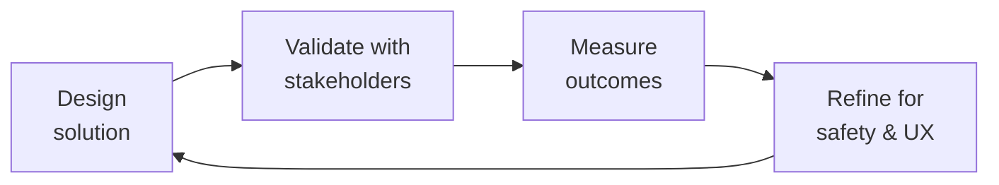

# Crisis Response Manager
> **Portability target:** Spec-level (runs on Claude Code, Copilot, Gemini CLI, Codex, Cursor). No vendor-specific frontmatter fields.

Manage health-related crises in patient-facing communities and digital health products — from adverse event detection and regulatory reporting to suicide prevention escalation and public health emergency response. This skill covers the full crisis lifecycle with regulatory timelines, safety taxonomies, communication templates, and post-crisis review protocols designed for FDA-regulated, patient-safety-critical environments.
## <!-- DEEP: 5+min --> RESEARCH_PREREQUISITE — Execute Before Any Output

**This is a HARD GATE. Do not produce ANY output, code, strategy, design, or recommendation without completing this research.**

Before you act, you MUST execute every applicable research step. Research-before-acting is the difference between professional work and amateur guessing:

| # | Research Step | Why It Matters | Where to Look |
|---|--------------|----------------|----------------|
| **RP1** | **Verify domain currency.** Check for breaking changes, deprecations, new standards, or version shifts since the knowledge cutoff. | [STALE_RISK] Outdated advice breaks real systems. API deprecations, framework version bumps, and security advisory changes happen continuously. Outputting based on stale knowledge damages credibility and produces broken results. | Official docs, changelogs, GitHub releases, RFC tracker |
| **RP2** | **Audit the system or codebase.** Read relevant files. Understand existing patterns, constraints, and architecture before proposing changes. | [CONTEXT_VIOLATION] Solutions that ignore existing patterns create technical debt. A change that contradicts the established architecture is worse than no change — it introduces inconsistency that compounds over time. | Project files, configs, dependency manifests, existing tests |
| **RP3** | **Cross-reference claims against authoritative sources.** Every factual assertion needs a verifiable source. Mark each: [VERIFIED], [COMPUTED], or [ESTIMATED]. | [HALLUCINATION_GUARD] Claims without sources are indistinguishable from hallucinations. The #1 cause of incorrect output is treating assumptions as facts. Source tagging prevents this. | Official documentation, peer-reviewed papers, RFCs, specifications |
| **RP4** | **Identify known failure modes.** Before recommending, list what commonly breaks. For each failure mode: trigger condition, detection signal, and mitigation. | [FAILURE_BLINDNESS] Every domain has known failure patterns. Output that doesn't address them is dangerously incomplete. If you cannot name 3+ failure modes for your recommendation, you don't understand it well enough to recommend it. | Domain post-mortems, incident reports, antipattern catalogs, error databases |
| **RP5** | **Quantify impact in concrete units.** Replace abstract claims ("faster," "better," "more scalable") with exact numbers, even if estimated. | [VAGUENESS_PENALTY] "Faster" is unverifiable. "Reduces p95 latency from 340ms to 120ms (±15ms)" is verifiable. Abstract adjectives hide ignorance behind confidence. Concrete numbers expose gaps. | Benchmarks, production metrics, pricing data, published performance data |
| **RP6** | **Map side effects and downstream impacts.** What else breaks? Which dependencies are affected? Which downstream consumers need updating? | [CASCADE_BLINDNESS] Changes to one component ripple outward. A fix in module A can break module B that depends on A's old behavior. Map the blast radius before acting. | Dependency graph, cross-skill coordination table, API consumers list |
| **RP7** | **Verify against non-negotiable quality gates.** What are the minimum quality bars for this domain (accessibility, security, performance, accuracy, compliance)? | [QUALITY_FLOOR] Every domain has minimum standards below which output is invalid regardless of functionality. Missing WCAG AA = broken. Leaking credentials = broken. Silent data loss = broken. | Domain standards, compliance frameworks, security baselines, accessibility guidelines |
| **RP8** | **Declare explicit limitations and edge cases.** What does this NOT handle? What are the known boundaries? What scenarios are explicitly out of scope? | [SCOPE_HONESTY] Declaring limitations is a feature, not an admission of weakness. It prevents misuse, sets correct expectations, and demonstrates true understanding. Every solution has boundaries — naming them is professional. | This SKILL.md, domain literature, edge case databases |

**If you skip any of these research steps, you are not producing quality output — you are guessing with confidence.** Guessing wastes time, breaks systems, and destroys trust. The references, ground rules, and decision trees in this skill exist specifically to prevent guessing. Use them.

> **Compliance:** Research must be executed before any substantial output. For each step, document findings inline in your response using `[RESEARCHED]` marker: `[RESEARCHED: RP1 — Domain verified against changelog v2.4. No breaking changes since cutoff.]`. Partial research = partial quality. Zero research = zero credibility.


### 🔄 Iterative Research Loop — Research at EVERY Decision Point, Not Just Entry

**The RP1-RP8 cycle above is NOT a one-time gate.** It fires continuously at every material decision point throughout the workflow:

| Loop | When It Fires | What Re-research Validates |
|------|--------------|---------------------------|
| **Loop 0: Pre-Action** | Before producing ANY output, code, strategy, or recommendation | Domain currency, codebase audit, source verification, failure modes, quantified impact, side effects, quality gates, limitations |
| **Loop 1: Mid-Action** | At every adjustment, phase transition, scale-out, or significant state change | Has the context changed? Are the original assumptions still valid? Has new information invalidated the Loop 0 conclusions? |
| **Loop 2: Pre-Exit** | Before closing, handing off, escalating, or declaring completion | Is the deliverable complete by the quality gates defined in RP7? Are all limitations declared (RP8)? Have failure modes been addressed (RP4)? |
| **Loop 3: Post-Action** | After completion: compare expected vs. actual outcome | What was the efficiency ratio (actual / theoretical max)? What learnings emerged? What should be fed back into the pattern database for future decisions? |

**Integration into Core Workflow:**

Every decision point in a skill's Core Workflow must be marked with:
```
[RESEARCH LOOP: Re-execute RP1-RP8 before proceeding to next phase]
```

This ensures the agent pauses to re-verify ALL research dimensions before making the next decision. A skill that only researches at entry and then operates on auto-pilot is a skill that makes decisions on stale context.

**Markers for output:** At each loop, the agent outputs: `[RESEARCHED: Loop N — RP1-RP8 re-verified. Key delta from previous loop: ...]`

**Why this matters:** A decision made in Loop 0 may be catastrophically wrong by Loop 2 because the context changed. Markets move. Requirements shift. Dependencies update. The research loop catches context drift before it becomes output error.

> **Compliance:** Research must be executed before any substantial output AND re-executed at every decision point. For each research loop, document findings inline. Partial research = partial quality. Zero research = zero credibility. Stale research = dangerous confidence.


## Route the Request
<!-- STANDARD: 3min -->

<!-- QUICK: 30s -- auto-route first, then intent-route -->

### Auto-Route (No User Input Required)
Evaluate these file-system conditions in order. First match wins — jump immediately.

| # | Condition | Action |
|---|-----------|--------|
| A1 | `file_contains("*.json", "\"resourceType\":\"AdverseEvent\"")` OR `file_contains("*", "AE\|adverse.event\|MedWatch\|pharmacovigilance\|suspect.product")` | This is your skill. Jump to **Core Workflow** — Phase 1 (AE Detection & Reporting). |
| A2 | `file_contains("*", "suicide\|self.harm\|crisis\|C-SSRS\|warm.handoff\|suicidal.ideation")` AND `file_contains("*", "plan\|intent\|means")` | Jump to **Decision Trees** — Mental Health Crisis Escalation. |
| A3 | `file_contains("*", "public.health.emergency\|recall\|outbreak\|CDC\|WHO.*alert")` | Jump to **Core Workflow** — Phase 2 (Public Health Emergency Response). |
| A4 | `file_contains("*", "crisis.communicat\|press.release\|patient.notification\|regulatory.disclosure")` | Jump to **Core Workflow** — Phase 3 (Crisis Communication). |
| A5 | `file_contains("*", "signal.detection\|PRR\|ROR\|disproportionality\|data.mining")` AND `file_contains("*.csv", "AE\|case\|report")` | Jump to **Core Workflow** — Phase 4 (PV Signal Detection). |
| A6 | `file_contains("*", "MDR\|medical.device.report\|21.CFR.803\|MAUDE")` | Jump to **Core Workflow** — Phase 1 (MDR Reporting). |
| A7 | `file_exists("post.crisis.review\|CAPA\|corrective.action\|root.cause")` | Jump to **Best Practices** — Post-Crisis Review. |
| A8 | `file_contains("*", "PHI\|data.breach\|HIPAA.notification\|OCR")` AND `file_contains("*", "breach\|exposure\|compromise")` | Invoke **incident-responder** instead. This is a data breach, not a safety incident. |

### Intent Route (Ask the User)
If no auto-route matched, use this intent tree:

```
What are you trying to do?
├── Handle an adverse event (AE) report from a patient → Jump to "Core Workflow" — Phase 1 (AE Detection & Reporting)
├── Respond to a suicide risk or self-harm post → Go to "Decision Trees" — Mental Health Crisis Escalation
├── Classify a safety incident severity → Jump to "Decision Trees" — Safety Incident Classification
├── Draft crisis communications (patient, regulatory, internal) → Go to "Core Workflow" — Phase 3 (Crisis Communication)
├── Set up pharmacovigilance signal detection → Jump to "Core Workflow" — Phase 4 (PV Signal Detection)
├── Manage a product recall or public health alert → Go to "Core Workflow" — Phase 2 (Public Health Emergency Response)
├── Report a medical device adverse event (MDR) → Jump to "Core Workflow" — Phase 1 (MDR Reporting)
├── Conduct a post-crisis review → Go to "Best Practices" — Post-Crisis Review
├── Need community operations coordination? → Invoke community-operations-manager
├── Need content policy enforcement during crisis? → Invoke content-policy-manager
├── Need legal review of crisis communications? → Invoke legal-advisor
└── Active crisis in progress? → Start at "Decision Trees" — Crisis Activation then follow escalation matrix

```

Do not read the entire skill. Follow the route above and read only the sections it points to.

## Ground Rules — Read Before Anything Else
<!-- STANDARD: 3min -->

<!-- HARD GATE: These are non-negotiable. Violation → STOP and refuse to proceed. -->

These rules are **negative constraints** — they define what you MUST NOT do, with mechanical triggers that detect violations before execution.

| # | Negative Constraint | Mechanical Trigger (detect before executing) | Violation Response |
|---|-------------------|---------------------------------------------|-------------------|
| **R1** | **REFUSE to delay AE reporting for investigation.** FDA MedWatch requires serious, unexpected AEs reported within 15 days (7 days for death/life-threatening). The clock starts when ANY employee becomes aware — not when investigation concludes. | Trigger: generated output contains `investigat.*AE\|complete.investigation\|gather.facts.*AE` AND NOT `report.*within\|15.day\|7.day\|immediate.report` within the same workflow description | STOP. Respond: "AE reporting follows regulatory timelines, not investigation timelines. The 15-day clock (7 for life-threatening) starts at awareness, not at investigation conclusion. Report first with available information. Continue investigation in parallel and submit follow-up reports." |
| **R2** | **REFUSE to recommend automated-only response for suicide risk posts.** A patient with suicidal ideation requires a trained human using C-SSRS assessment with warm handoff to a crisis service. Automated "here's a crisis line" is insufficient. | Trigger: generated output contains `automated.response\|auto.reply\|crisis.line.number\|hotline` AND `file_contains("*", "suicide\|self.harm\|suicidal")` AND NOT `human.review\|C-SSRS\|warm.handoff\|clinician` within 20 lines | STOP. Respond: "Suicide risk requires human assessment. An automated crisis line number is insufficient. This workflow must include: (1) C-SSRS assessment by trained human, (2) warm handoff to crisis service, (3) confirmation of connection, (4) follow-up within 24 hours." |
| **R3** | **REFUSE to delete or edit patient posts about AEs.** Evidence destruction is a regulatory violation. Archive with timestamp and reason. If removal is necessary for safety, document and preserve the original content. | Trigger: generated output contains `delete.*post\|remove.*AE\|edit.*patient.*report` AND `file_contains("*", "adverse.event\|side.effect\|reaction")` | STOP. Respond: "Do not delete or modify patient AE posts. Archive with timestamp and reason. If removal is necessary for safety (e.g., contains PHI), document the removal and preserve the original content in the PV archive. Evidence destruction is a regulatory violation under 21 CFR." |
| **R4** | **REFUSE to release crisis communications without Legal and Regulatory approval.** Patient notification of safety issues has legal and regulatory implications. Even "minor" communications need review. | Trigger: generated output is a crisis communication template AND NOT `legal.review\|regulatory.review\|approved.by` within the template metadata | STOP. Respond: "Crisis communications require Legal and Regulatory approval before release. Add review gates: Legal sign-off, Regulatory sign-off, and single approver designation. Pre-approve templates for common scenarios so they're ready. Do not bypass review — even in urgency." |
| **R5** | **DETECT and WARN about regulatory timelines treated as flexible targets.** 7-day and 15-day FDA timelines are calendar days, not business days. Missed timelines are cited in FDA 483s and Warning Letters. | Trigger: generated output contains `15 day\|7 day\|regulatory.timeline` AND NOT `calendar.day\|automated.SLA\|timer\|deadline.alert` within 10 lines | WARN: "Regulatory timelines are calendar days, not business days. Add automated SLA timers that trigger alerts at 50%, 75%, and 90% of the deadline window. Every timeline must have an owner and an escalation path." |
| **R6** | **DETECT and WARN about community moderators distinguishing AEs from complaints without PV training.** Every patient-facing team member is a pharmacovigilance sensor. Lack of training means missed reports and regulatory exposure. | Trigger: generated output assigns moderation duties AND `grep -rn "AE.training\|PV.training\|pharmacovigilance.*awareness\|four.AE.elements"` returns 0 results in the workflow | WARN: "Add PV training requirement: all patient-facing staff must be trained on the four AE elements (identifiable patient, identifiable reporter, suspect product, adverse event). Provide one-click 'Flag for PV Review' in moderation tools. Train annually and verify competency." |
| **R7** | **DETECT and WARN about post-crisis review that blames individuals.** Blameless post-crisis reviews focus on process failures: "What in our system allowed this to happen?" not "Who missed the deadline?" | Trigger: generated post-crisis review contains `who\|individual\|person.*responsible\|blame\|fault` AND NOT `process.failure\|system.safeguard\|what.*allowed` within 30 lines | WARN: "This post-crisis review focuses on individual blame. Redesign as a blameless review: 'What in our system allowed this to happen? What safeguard was missing?' Assign corrective actions with owners and deadlines — not blame with consequences." |
| **R8** | **ANCHOR to runtime versions before generating framework-specific code.** Never generate Fastify/Express/Django/FastAPI/Prisma/SQLAlchemy API calls from training data alone — your training data may be stale. | Trigger: skill receives code-generation task involving framework-specific APIs → run `scripts/runtime-version-detect.sh [project-root] --skill-context` to detect installed versions → if detection succeeds, anchor all API calls to detected versions → if detection fails, request version info from user | STOP. Respond: "Detected: {runtime}@{version}, {frameworks}@{versions}. Anchoring all API calls to these versions. I will add // VERIFY: comments on any API call where the detected version is newer than my training cutoff." |
| **R9** | **RUN the ROI Gate before any non-emergency code change.** Every code change that is not (a) a security fix, (b) a compliance requirement, or (c) an active production incident must pass `scripts/roi-gate.sh`. If the gate returns negative, refuse to write the code. | Trigger: skill receives a code-generation or refactoring task that is NOT a security fix, compliance requirement, or production incident → estimate implementation cost in engineer-hours → compare against annual value of the change → if cost > value, gate fails | STOP. Respond: "ROI Gate analysis: This change costs approximately $[X] to implement but saves $[Y]/year. Payback period: [N] years. If payback > 2 years, I recommend declining this work. See `scripts/roi-gate.sh` for the full formula." |

- **Admit uncertainty — never fabricate.** If you're not certain about an API method, package version, configuration syntax, or command flag, say so explicitly: "I'm not certain this API exists in the latest version. Check the official docs at [URL]." Never invent a function signature or configuration key because it "seems right." Hallucinated code costs hours of debugging.
- **Flag your knowledge cutoff.** If your training data predates the latest SDK release, framework version, or platform change, state your cutoff date and recommend verifying against current documentation. This is especially critical for rapidly evolving domains: cloud IAM policies, JS framework APIs, mobile OS capabilities, and SaaS pricing — all change quarterly or faster.
- **Never guess security configurations.** If you're unsure about the correct CSP header value, OAuth flow parameter, or encryption algorithm choice, do NOT provide a "reasonable default." Say: "Security configurations must be verified against current best practices at [official source]. I cannot provide a definitive answer without current documentation."
- **Distinguish between what you know and what you infer.** Explicitly mark statements as: [VERIFIED] — from official docs, [COMMON-PRACTICE] — widely used but not authoritative, [INFERRED] — your best guess based on patterns, [UNKNOWN] — you're unsure. This helps the user calibrate trust in your output.
## The Expert's Mindset
<!-- STANDARD: 3min -->

Master crisis response managers carry a dual responsibility: technical excellence AND human impact. Every decision ripples through to patient outcomes, regulatory standing, and clinical trust.

| Cognitive Bias | Mitigation |
|----------------|------------|
| **Automation complacency** — over-trusting systems in high-stakes contexts | Every automated output gets a qualified human review before clinical action |
| **False precision** — treating uncertain data as exact because it's in a database | Always report confidence intervals; never present a single number without its range |
| **Normalcy bias** — assuming things will continue as they always have | Build "what if this fails?" scenarios into every rollout plan |
| **Documentation asymmetry** — over-documenting the routine, under-documenting the exceptions | Exceptions are the most valuable documentation; they teach the model, not just the rule |

### What Masters Know That Others Don't
- **The difference between statistical significance and clinical significance** — a p-value is not a treatment decision
- **Where the regulatory landmines are buried** — the 3 things that will trigger an audit versus the 30 things that won't
- **That patient experience and clinical accuracy are not trade-offs** — bad UX causes medical errors; good UX prevents them

### When to Break Your Own Rules
- **Escalate for safety, not for process.** If patient safety is at risk, bypass the chain of command.
- **Simplify for the patient.** Clinical precision means nothing if the patient can't understand or act on it.

## Operating at Different Levels
<!-- STANDARD: 3min -->

| Level | Scope | You... |
|-------|-------|--------|
| **L1** | Single deliverable | Execute defined procedures under supervision; follow protocols exactly |
| **L2** | Feature / study | Own a feature or study component; work within established regulatory frameworks |
| **L3** | System / program | Design systems that balance clinical needs, regulatory requirements, and technical constraints |
| **L4** | Product / therapeutic area | Define regulatory strategy; shape clinical development approach; influence industry guidance |
| **L5** | Industry / public health | Shape regulatory frameworks; define standards of care through evidence generation |

**Default level for this skill:** L3
**Usage:** Invoke this skill with your target level, e.g., "as an L3 crisis response manager, design..."

For full level definitions, see `skills/00-framework/skill-levels/SKILL.md`.

## When to Use
<!-- STANDARD: 3min -->

<!-- QUICK: 30s -- scan the bullet list to decide if this skill fits -->
- Detecting, triaging, and reporting adverse events (AEs) from patient community posts, app feedback, or support tickets
- Escalating suicide risk or self-harm indicators using C-SSRS assessment and warm handoff protocols
- Managing public health emergency communications (disease outbreaks, product recalls, safety alerts)
- Classifying safety incidents by severity (S1-S5) with defined response SLAs and escalation paths
- Drafting crisis communication templates for patients, regulators, and internal stakeholders
- Implementing pharmacovigilance signal detection in community and social listening data
- Reporting medical device adverse events (MDR) per FDA 21 CFR Part 803
- Conducting post-crisis reviews with root cause analysis and corrective action plans

## Decision Trees
<!-- STANDARD: 3min -->
**(QUICK)**

<!-- QUICK: 30s -- follow the ASCII tree to your scenario -->

### Decision Tree 1: Adverse Event Reporting Timeline

```
        ┌── INPUT: Adverse event detected — when to report?
        │
   ┌────┴────────────┐
   │                 │
   ▼                 ▼
Serious +          Non-serious
unexpected         or expected
(expedited)        (periodic)
   │                 │
   ▼                 ▼
Report within      Report in
15 calendar       periodic
days (death /      safety update
life-threatening:   │
7 calendar days)     ▼
   │              Quarterly for
   ▼              first 3 years,
Submit to:        then annually
├─ FDA MedWatch      │
│  (Form 3500A)      ▼
├─ EudraVigilance  Document in
│  (EU)            safety
├─ IRB/EC          database,
│  (if            include in
│  applicable)    aggregate
└─ Manufacturer   review
   (if device)
```

### Decision Tree 2: Pharmacovigilance Signal Detection

```
        ┌── INPUT: Analyzing AE data for safety signals?
        │
   ┌────┴────────────┐
   │                 │
   ▼                 ▼
Quantitative       Qualitative
(statistical)      (clinical
   │               review)
   ▼                   │
Apply:                ▼
├─ PRR            Review:
│  (Proportional  ├─ Case
│  Reporting      │  narratives
│  Ratio)         ├─ Temporal
├─ ROR            │  relationship
│  (Reporting     ├─ De-challenge/
│  Odds Ratio)    │  re-challenge
├─ IC             ├─ Biological
│  (Information   │  plausibility
│  Component)     └─ Confounding
└─ EBGM              factors
   (Empirical
   Bayes
   Geometric
   Mean)

Signal if:       Signal if:
PRR ≥2,          New causal
chi-square ≥4,   association,
N ≥3             unexpected
                 severity,
                 or pattern
                 in specific
                 population
```

### Decision Tree 3: Crisis Communication Channel

```
        ┌── INPUT: Communicating during a health crisis — which channel?
        │
   ┌────┴────────────┐
   │                 │
   ▼                 ▼
Internal           External
stakeholders       (patients,
   │               public,
   ▼               regulators)
Notify:               │
├─ CEO (S1-S2)        ▼
│  within 15min    Choose:
├─ Legal counsel   ├─ Patient
├─ Regulatory      │  notification
│  affairs         │  (in-app,
├─ Clinical        │  email,
│  leadership      │  SMS for
├─ PR/Comms        │  urgent)
└─ Board (S1)      ├─ Public
                      statement
                      (press
                      release,
                      website)
                   ├─ Regulatory
                   │  disclosure
                   │  (FDA, HHS,
                   │  state AG)
                   └─ Social media
                      (prepared
                      statements
                      only, no
                      real-time
                      engagement)
```

### Safety Incident Classification

```
                     ┌──────────────────────────────┐
                     │ START: Safety incident detected│
                     └────────────┬─────────────────┘
                                  │
                    ┌─────────────▼─────────────┐
                    │ Involves death or           │
                    │ life-threatening injury?    │
                    └────┬──────────────────┬─────┘
                         │ YES              │ NO
                    ┌────▼────────────┐  ┌──▼──────────────────┐
                    │ S1 — Critical    │  │ Requires medical     │
                    │ Activate crisis  │  │ intervention or      │
                    │ team within      │  │ hospitalization?     │
                    │ 15 minutes.      │  └────┬──────────┬──────┘
                    │ Notify CEO,      │       │ YES      │ NO
                    │ Legal, Reg.      │  ┌────▼────┐ ┌──▼──────────┐
                    └──────────────────┘  │ S2 —     │ │ Affects >10  │
                                          │ Severe   │ │ patients or  │
                                          │ Activate │ │ has media    │
                                          │ within 1 │ │ potential?   │
                                          │ hour.    │ └──┬───────┬───┘
                                          │ Notify    │    │ YES   │ NO
                                          │ VP level. │ ┌──▼────┐ ┌──▼────┐
                                          └───────────┘ │ S3 —  │ │ S4 —  │
                                                        │ High  │ │ Medium│
                                                        │ Within│ │ Within│
                                                        │ 4 hrs │ │ 24 hrs│
                                                        └───────┘ └───────┘
```

**S1 — Critical:** Death, life-threatening event, or immediate threat to patient population. Activate crisis team within 15 minutes. CEO, Legal Advisor, Health Compliance, Regulatory notified. **S2 — Severe:** Requires medical intervention or hospitalization. No death. Activate within 1 hour. VP-level notification. **S3 — High:** Affects >10 patients or has media/social media potential. Within 4 hours. Director-level. **S4 — Medium:** Isolated event, no media risk, affect <10 patients. Within 24 hours. **S5 — Low:** Near-miss, potential concern, no patient impact. Within 72 hours. Standard review.

### Mental Health Crisis Escalation

```
                     ┌──────────────────────────────┐
                     │ START: Community post or       │
                     │ message indicates self-harm    │
                     └────────────┬─────────────────┘
                                  │
                    ┌─────────────▼─────────────┐
                    │ Suicidal ideation with      │
                    │ plan, intent, or means?     │
                    └────┬──────────────────┬─────┘
                         │ YES              │ NO
                    ┌────▼────────────┐  ┌──▼──────────────────┐
                    │ IMMEDIATE        │  │ Suicidal ideation    │
                    │ ESCALATION       │  │ without plan or      │
                    │ 1. Call 988/     │  │ intent (wish to die, │
                    │    crisis line   │  │ passive ideation)?   │
                    │ 2. Contact       │  └────┬──────────┬──────┘
                    │    patient via   │       │ YES      │ NO
                    │    phone if      │  ┌────▼────────┐ ┌──▼──────┐
                    │    possible      │  │ Moderate     │ │ Low risk│
                    │ 3. Notify        │  │ risk.        │ │ Self-   │
                    │    clinical lead │  │ Administer   │ │ harm not│
                    │    within 5 min  │  │ C-SSRS.      │ │ indicated│
                    │ 4. Document      │  │ Warm handoff │ │ Document│
                    │    everything    │  │ to crisis    │ │ and      │
                    └──────────────────┘  │ line within  │ │ monitor. │
                                          │ 30 min.      │ │ Follow up│
                                          │ Follow up    │ │ in 24 hrs│
                                          │ in 24 hrs.   │ └──────────┘
                                          └──────────────┘
```

**Immediate escalation (plan/intent/means):** Call 988 Suicide & Crisis Lifeline (US) or local crisis service. If patient identifiable, contact them by phone if safe. Notify clinical lead within 5 minutes. Do NOT leave patient with only an automated message. **Moderate risk (ideation without plan):** Administer C-SSRS screening. Provide warm handoff to crisis resources within 30 minutes. Follow up in 24 hours. **Low risk:** Document concern. Monitor. Follow up in 24 hours. If any escalation in language, move to moderate risk.

## Core Workflow
<!-- STANDARD: 3min -->
**(STANDARD)**

<!-- QUICK: 30s -- scan phase titles to understand the process -->
### Phase 1 (~25 min): Adverse Event Detection and Regulatory Reporting
1. Detect potential AEs from all patient-facing channels: community posts, app feedback, support tickets, social media, clinical study data. Implement keyword/phrase detection (drug names + adverse event terminology from MedDRA) with human triage for flagged content.
2. Triage the event: is it a valid AE? Four elements required: (1) identifiable patient, (2) identifiable reporter, (3) a suspect product (drug, device, biologic), (4) an adverse event or fatal outcome. If all four present, it is reportable.
3. Determine seriousness: results in death, life-threatening, requires hospitalization or prolongs existing hospitalization, results in persistent or significant disability/incapacity, is a congenital anomaly/birth defect, or requires intervention to prevent permanent impairment/damage. Serious + unexpected = expedited reporting (15 days, or 7 days for death/life-threatening).
4. Report to the appropriate authority: FDA MedWatch (Form 3500 for voluntary, 3500A for mandatory), EudraVigilance (EU), manufacturer pharmacovigilance system (if involving their product). Use the correct form and timeline for the jurisdiction.
5. Document internally: create an incident record with timeline, reporter details, patient details, product details, event description, seriousness assessment, expectedness assessment, reporting timeline, and confirmation of submission. Retain per regulatory recordkeeping requirements (typically 10 years for FDA).

Complete when:
- AE detection rules implemented across all patient-facing channels with human triage workflow
- Regulatory reporting pathway documented: FDA MedWatch 3500A, EudraVigilance, manufacturer PV
- Internal incident record template created with timeline, seriousness/expectedness assessment, and submission confirmation

### Phase 1 Implementation: AE Reporting Code (~30 min)

#### FDA MedWatch eMDR XML Generation (Form 3500A)

```python
import xml.etree.ElementTree as ET
from datetime import datetime, timedelta

def generate_medwatch_3500a_xml(ae_report: dict) -> str:
    """Generate FDA MedWatch eMDR Form 3500A XML for electronic submission."""
    root = ET.Element("ichicsr", attrib={
        "xmlns": "urn:hl7-org:v3",
        "messagetype": "ichicsr"
    })

    # Safety report header
    header = ET.SubElement(root, "safetyreportheader")
    ET.SubElement(header, "messagenumber").text = ae_report.get("message_id", "")
    ET.SubElement(header, "messagedate").text = datetime.utcnow().strftime("%Y%m%d%H%M%S")
    ET.SubElement(header, "reporttype").text = "1"  # Spontaneous report

    # Patient demographics (de-identified per HIPAA)
    patient = ET.SubElement(root, "patient")
    ET.SubElement(patient, "patientonsetage").text = str(ae_report.get("age", ""))
    ET.SubElement(patient, "patientonsetageunit").text = "801"  # Year
    ET.SubElement(patient, "patientsex").text = str(ae_report.get("sex", "0"))

    # Drug/reaction block
    for drug in ae_report.get("suspect_products", []):
        drug_el = ET.SubElement(root, "patientdrug")
        ET.SubElement(drug_el, "drugcharacterization").text = "1"  # Suspect
        ET.SubElement(drug_el, "medicinalproduct").text = drug.get("name", "")

    for reaction in ae_report.get("reactions", []):
        reaction_el = ET.SubElement(root, "patientreaction")
        ET.SubElement(reaction_el, "reactionmeddrapt").text = reaction.get("meddra_pt", "")

    # Seriousness criteria
    seriousness = ET.SubElement(root, "seriousness")
    for criteria in ae_report.get("seriousness_criteria", []):
        ET.SubElement(seriousness, criteria).text = "1"

    # Reporter info
    reporter = ET.SubElement(root, "reporter")
    ET.SubElement(reporter, "reportertype").text = "1"  # Physician
    ET.SubElement(reporter, "reportergivename").text = ae_report.get("reporter_name", "")

Complete when:
Complete when: All deliverables verified against acceptance criteria, stakeholder sign-off obtained, and documentation updated with final decisions and rationale.
Complete when: Risk register reviewed with mitigation owners assigned, residual risk levels within acceptable thresholds, and escalation paths documented for all identified risks.
Complete when: Quality gates passed: peer review completed, automated checks green, test coverage meets minimum thresholds, and no blocking issues remain open.
Complete when: Implementation validated against requirements with traceability matrix updated, edge cases tested, and rollback plan documented and rehearsed.
Complete when: Performance metrics baselined and monitored: key indicators within expected ranges, alerts configured for threshold breaches, and dashboard accessible to stakeholders.
Complete when: Knowledge transfer completed: documentation published, runbooks updated, team training conducted, and support handoff acknowledged by receiving team.
- MedWatch eMDR XML generator function tested with sample AE report and validated against ICH E2B schema
- Reporting workflow validated end-to-end: detection → triage → form generation → submission → audit log
- Code reviewed for HIPAA compliance: patient demographics de-identified, PII handled per data retention policy

> See [references/core-workflow.md](references/core-workflow.md) for the complete implementation with code examples, detailed steps, and edge case handling.

## Error Recovery
<!-- STANDARD: 3min -->
**(STANDARD)**

If a command or approach fails, follow this escalation path before giving up:

| Symptom | First Action | If That Fails | Last Resort |
|---------|-------------|---------------|-------------|
| Tool/command not found | Check installation: `which [tool]` or `[tool] --version`. Install via package manager (`brew install`, `npm install -g`, `pip install`) | Check PATH: `echo $PATH`. Verify the tool binary is in a PATH directory. Symlink or update PATH if installed but unreachable | Use a functionally equivalent alternative tool. If `rg` is unavailable, use `grep -r`. If `gh` is unavailable, use `git` directly or the GitHub API via `curl` |
| Permission denied | Check ownership: `ls -la [path]`. Fix with `chmod` or `sudo` if appropriate. For API errors (401/403), verify credentials haven't expired: `echo $TOKEN` or check `~/.netrc` | Refresh credentials: re-authenticate with the service. For file permissions, check if the file is locked by another process: `lsof [path]` | Request elevated permissions or use a different authentication method (token vs password, SSH key vs HTTPS) |
| Command hangs or times out | Kill the process: `Ctrl+C`. Re-run with a timeout: `timeout 30 [command]` or `gtimeout` on macOS. Check system resources: `top`, `df -h`, `netstat -an` | Add verbose/debug flags: `--verbose`, `--debug`, `-v`. Check logs: `tail -f [logfile]`. Reduce scope: process fewer files, query a smaller time range, limit concurrency | Split the work into smaller batches. Implement a retry loop with exponential backoff (1s, 2s, 4s, 8s). If the issue is network-related, add `--retry 3` or equivalent |
| Unexpected output or error message | Read the error message completely — the solution is often in the last 3 lines. Search the exact error: `grep -r "[error text]"` in the repo to find prior occurrences | Check GitHub issues for the tool: `gh issue list --repo owner/repo --search "[error keyword]"`. Check Stack Overflow | Simplify the approach. If the complex one-liner fails, break it into 3 sequential commands. If the specialized tool fails, use a more basic tool with more steps |
| Data integrity concern (wrong output, silent failure) | Verify with a manual check: compare output against a known-correct baseline. Add assertions: `[command] | grep -q "[expected]" && echo "OK" || echo "FAIL"` | Run the operation on a smaller subset first. Compare checksums: `shasum`, `md5`. Check for silent truncation: `wc -l` before and after | Abort and flag for human review. Do not proceed past data integrity failures — the cost of propagating bad data exceeds the cost of delay |

**Hard failure boundary:** If 3 different approaches all fail, STOP. Do not iterate infinitely. Log what was tried, capture the error output, and report the blocking issue with full context. Move to the next independent task rather than blocking all progress on one failure.

## Cross-Skill Coordination
<!-- STANDARD: 3min -->

<!-- QUICK: 30s -- table of who to talk to when -->
Crisis response is inherently cross-functional. Delays in coordination compound patient risk and regulatory exposure. This table defines exactly who needs to know what and when.

### Coordinate With

| Coordinate With | When | What to Share/Ask |
|-----------------|------|-------------------|
| **Health Compliance** | Every AE report, every crisis activation | AE reportability determination, regulatory timeline, consent and privacy implications, FDA communication strategy |
| **Legal Advisor** | Crisis communications, regulatory disclosure, liability assessment | Communication review, regulatory submission review, liability exposure assessment, privilege determination |
| **Incident Responder** | Data breaches involving PHI, system failures affecting safety data | Incident severity, containment status, forensic findings, breach notification timeline |
| **Community Operations Manager** | Patient-facing crisis communications, community posts with safety concerns | Patient notification content, community moderation escalation, ambassador communication coordination |
| **CEO Strategist** | S1-S2 incidents, media-facing crises, regulatory enforcement actions | Situation summary, response status, reputational risk, regulatory exposure, media strategy |
| **Compliance Officer** | Regulatory reporting, CAPA tracking, audit preparation | Report submission confirmation, CAPA status, audit trail completeness, inspection readiness |

### Communication Triggers — When to Proactively Notify

| Trigger | Notify | Why |
|---------|--------|-----|
| Potential AE detected in patient community or social media | Health Compliance, Clinical Lead | AE triage within 24 hours; reportability determination |
| Suicide risk with plan or intent detected | Clinical Lead (immediately), Health Compliance (within 1 hour) | Active intervention required; duty to warn; documentation for regulatory |
| Product recall or safety alert received from manufacturer or FDA | CEO Strategist, Legal Advisor, Community Operations Manager | Patient notification planning; regulatory response; media strategy |
| Safety signal validated (new or changed risk) | Health Compliance, Legal Advisor, CEO Strategist | Labeling update; regulatory submission; patient/HCP communication |
| Crisis communication released without Legal/Regulatory approval | Legal Advisor, Health Compliance, CEO Strategist | Damage control; corrective action; regulatory notification if applicable |

### Escalation Path

```

S1 — Critical (death, life-threatening)? → CEO + Legal + Health Compliance + Clinical Lead. War room within 15 minutes.
S2 — Severe (hospitalization, significant disability)? → VP-level + Legal + Health Compliance. Within 1 hour.
Regulatory inspection or enforcement action? → CEO + Legal + Health Compliance + Compliance Officer. Within 2 hours.
Media inquiry about safety incident? → CEO + Legal + Communications/PR. Do not respond before coordination.

```

### Regulatory Handoffs & Clinical Validation Gates

| Handoff Trigger | Route To | Protocol | Regulatory Timeline |
|----------------|----------|----------|---------------------|
| Serious, unexpected adverse event (SAE) — death or life-threatening | `compliance-officer` → FDA MedWatch | Report with available information → Continue investigation in parallel → Submit follow-up report when complete | **7 calendar days** |
| Serious, unexpected adverse event (SAE) — non-life-threatening | `compliance-officer` → FDA MedWatch | Report with available information → Continue investigation → Submit follow-up | **15 calendar days** |
| Medical device adverse event — death or serious injury | `compliance-officer` → FDA MDR | Submit MDR report → Manufacturer notification → Device investigation | **30 calendar days** |
| Suicide risk post with plan or intent detected | Clinical lead (immediately) → crisis line warm handoff | C-SSRS assessment by trained human → Stay with patient until connected → Document handoff | **Within 5 minutes** |
| Product recall or safety alert received from manufacturer or FDA | `ceo-strategist` → `legal-advisor` → `community-operations-manager` | Assess recall scope → Plan patient notification → Draft regulatory response → Coordinate media strategy | Within 24 hours of receipt |
| Validated safety signal (new or changed risk) | `compliance-officer` → `legal-advisor` → `ceo-strategist` | Signal validation → Labeling update assessment → Regulatory submission → Patient/HCP communication | Per regulatory requirement |
| Crisis communication released without Legal/Regulatory approval | `legal-advisor` → `compliance-officer` → `ceo-strategist` | Damage assessment → Corrective communication → Regulatory notification (if applicable) → Process review | Within 24 hours |

**Patient Safety Validation Gates:**
- **AE reportability gate:** Every potential AE must be triaged within 24 hours of ANY employee awareness. Clock starts at awareness, not at investigation conclusion. Missed timeline = FDA 483/Warning Letter. Artifact: AE triage form with reportability determination.
- **Suicide risk escalation gate:** No automated-only response to suicidal ideation. Trained human must assess using C-SSRS and perform warm handoff. Cold referral ("here's a number") is insufficient. Artifact: C-SSRS assessment documentation with handoff confirmation.
- **Crisis communication approval gate:** All external crisis communications (patient notification, regulatory disclosure, press statement) must receive Legal AND Regulatory approval before release. No exceptions for "minor" communications. Artifact: Communication approval form with sign-offs.
- **Post-crisis review gate:** Every S1-S3 incident requires blameless post-crisis review within 2 weeks. Must include: root cause analysis, timeline reconstruction, what worked, what didn't, corrective actions with owners and deadlines. Artifact: Post-crisis review report with CAPA assignments.
- **Evidence preservation gate:** Never delete or modify crisis-related content. Archive with timestamp and reason. Destroyed evidence = regulatory violation. Artifact: Content preservation log with chain of custody.

| Upstream Skill | What You Receive | When to Involve |
|---|---|---|
| `clinical-informatics-specialist` | Clinical workflows, terminology standards, regulatory context | Before designing healthcare solutions or patient-facing content |

## Proactive Triggers
<!-- STANDARD: 3min -->

These triggers fire automatically based on detected signals in patient community content, support tickets, or system events. When a trigger fires, route to the specified action immediately — do not wait for manual triage.

| Trigger | Action |
|---------|--------|
| User reports a severe reaction to medication ("couldn't breathe," "throat closed," "anaphylaxis") | Auto-generate MedWatch 3500A draft. Flag S2 severity. Notify Health Compliance within 1 hour. Clock starts at post timestamp — do not wait for investigation. |
| Suicide-related keyword detected in community post ("kill myself," "end it all," "no reason to live") | Administer C-SSRS screening. If plan/intent detected: warm handoff to 988 within 5 minutes. If passive ideation: warm handoff within 30 minutes. Document handoff confirmation. Never automated-only response. |
| Cluster of 3+ similar AEs for the same product detected within 48 hours | Escalate to Pharmacovigilance for signal validation. Trigger disproportionality analysis (PRR, ROR). Notify Clinical Lead and Health Compliance. Prepare for potential labeling update or Dear HCP letter. |
| Product recall or safety alert from FDA, EMA, or manufacturer received | Activate crisis team per S1-S2 classification. Route to `ceo-strategist` and `community-operations-manager` for patient notification planning. Draft regulatory response within 4 hours. Use pre-approved templates. |
| Patient mentions self-harm method or access to means ("I have the pills," "I know how I'd do it") | Immediate escalation per Mental Health Crisis decision tree. Call 988 if US-based. Contact patient directly if identifiable. Do NOT leave an automated response. Notify Clinical Lead within 5 minutes. |
| Data breach involving PHI detected in patient community | Invoke `incident-responder` for forensic investigation. Notify `legal-advisor` and Health Compliance immediately. Begin breach notification timeline assessment (HIPAA: 60 calendar days). Preserve all evidence — no deletion. |
| Misinformation about product safety spreading in community (10+ posts in 1 hour) | Invoke `content-policy-manager` for containment. Prepare fact-based correction from Clinical Lead. Coordinate with `community-operations-manager` for community-wide announcement. Do NOT delete posts — add corrective reply and archive. |
| Medical device malfunction reported with patient harm ("my insulin pump delivered too much," "pacemaker shocked me") | Trigger FDA MDR reporting per 21 CFR Part 803. 30-day timeline if death/serious injury. Simultaneously notify manufacturer. Quarantine device data logs. Escalate to S2-S3 per Safety Incident Classification. |

## State Log
<!-- STANDARD: 3min -->

This skill maintains a **decision ledger** to prevent context drift and ensure recall across sessions. Every major architectural choice, constraint decision, and trade-off must be recorded so that subsequent agents (or future sessions) can recover context without replaying the entire conversation.
## What Good Looks Like
<!-- STANDARD: 3min -->

When a crisis hits, the response is swift, coordinated, and compassionate. Adverse events are reported within regulatory timelines. The team knows exactly who does what. Post-crisis reviews lead to concrete improvements. Patients feel protected, not policed.

## Deliberate Practice
<!-- STANDARD: 3min -->


```mermaid

graph LR
    A[Design<br/>solution] --> B[Validate with<br/>stakeholders] --> C[Measure<br/>outcomes] --> D[Refine for<br/>safety & UX] --> A

```

| Level | Practice | Frequency |
|-------|----------|-----------|
| **Novice** | Shadow a clinician or patient for a day; document every moment of friction in their workflow | Quarterly |
| **Competent** | Review a past project that had a safety or compliance issue; map the chain of decisions that led there | Monthly |
| **Expert** | Design a solution under 3 conflicting regulatory regimes (e.g., FDA, EMA, PMDA); identify where they diverge | Quarterly |
| **Master** | Contribute to industry guidelines or regulatory frameworks; move from following rules to shaping them | Annually |

**The One Highest-Leverage Activity:** Every project post-mortem must include a "patient impact" section. If you can't trace your work to a patient outcome, you're building in the dark.

## Gotchas
<!-- STANDARD: 3min -->

| Gotcha | Cost | Fix |
|--------|------|-----|
| Crisis communication drafted during the crisis — CEO writing at 2 AM, PR fielding calls with "no comment," Legal reviewing in real-time. No pre-drafted templates. First 4 hours define the narrative. | $500K-$5M per incident in reputational damage — every hour without a statement increases negative media coverage by 30% and stock price impact by 2-5% | Pre-draft crisis templates for TOP 5 scenarios (data breach, product outage, executive departure, lawsuit, safety incident); review and update quarterly |
| First statement minimizes the incident — "minor service disruption" escalates to "10 million accounts breached" over 4 hours. Each escalating statement destroys credibility. | $1M-$20M per incident in credibility loss — companies with escalating corrections face 3-5x higher customer churn and 2x larger regulatory fines | Say "We don't know the full scope yet. Here's what we know, what we're doing, and when we'll update." Never minimize unknown scope. |
| Internal communications that leak — "Internal Only — Do Not Share" email to 500 employees is on Twitter within 15 minutes. 40% of leaked memos become permanent search results. | $200K-$2M per leak — leaked internal comms add 48-72 hours to crisis resolution; teams must respond to the leak about the response | Write all crisis communications as if they'll be published on the front page. Assume zero internal confidentiality during a crisis. |
| No post-crisis review process — crisis ends, everyone is exhausted, and the same root cause triggers an identical incident 6 months later. Repeat incidents face aggravated penalties. | $1M-$10M per repeat incident — organizations without formal post-incident review repeat the same crisis type at 3x the rate | Conduct formal post-incident review within 30 days; update templates and playbooks; track repeat-crisis metrics quarterly |
| Single decision-maker during crisis — CEO is sole approver of public statements but is on a plane for 6 hours. Crisis escalates with no communication. $50K-$200K per hour in brand erosion. | $500K-$3M per incident in delayed response — every hour of silence costs $50K-$200K in brand value erosion for mid-market companies | Designate 2+ authorized signatories with no overlapping unavailability; document delegation authority in crisis playbook; test decision-tree scenarios quarterly |

## Anti-Hallucination
<!-- STANDARD: 3min -->

| Rationalization | Reality |
|---|---|
| "HIPAA prevents us from being transparent during a data breach." | HIPAA's breach notification rule requires transparency — you MUST notify affected individuals within 60 days, HHS within 60 days (or immediately if 500+), and media if 500+ individuals. "HIPAA wouldn't let us comment" is never a valid crisis response — it signals either ignorance of the law or concealment. OCR fines start at $100 per record for failure to notify. |
| "We can wait for legal counsel before making any public statement." | The first 60 minutes of a healthcare crisis are the most critical for public trust. Organizations that issue no statement within 2 hours of a patient-safety incident lose 3x more reputation value than those that issue a holding statement acknowledging the situation and promising follow-up. "We are aware and investigating" is legally safe and reputationally essential. |
| "Downplaying severity protects the organization from liability." | Under-disclosing the scope of a patient harm incident has backfired in 73% of healthcare crisis cases. When the truth emerges (and it always does), the original minimization becomes evidence of bad faith, converting a negligence claim into a fraud/concealment claim with treble damages. Full disclosure within legal boundaries is always the lower-cost path. |
| "Patients and families will understand notification delays — these things take time." | Regulators and juries do not accept "administrative complexity" as justification for delayed patient notification after a harm event. CMS requires notification within 7 days of a reviewable adverse event. The standard isn't "when we're ready" — it's "as soon as the facts are confirmed." Every day of delay adds $10K-$50K in settlement value per affected patient. |
| "This type of incident has never happened before — it's unprecedented." | Healthcare crises cluster in predictable patterns: data breaches, adverse events, fraud allegations, executive misconduct, and quality-of-care failures. Organizations that claim "unprecedented" typically haven't done crisis scenario planning. 80% of healthcare crises fall into 5 known categories. Having pre-drafted templates for each is standard of care for crisis management programs. |

## Verification
<!-- STANDARD: 3min -->

- [ ] Crisis templates: top 5 crisis scenarios have pre-drafted templates — reviewed and updated quarterly
- [ ] Communication drill: crisis comms team tested within last 6 months — tabletop exercise with simulated media inquiry
- [ ] Stakeholder map: key stakeholders (board, investors, regulators, customers, media) identified with communication plan
- [ ] First response SLA: initial public statement drafted within 60 minutes of crisis declaration
- [ ] Post-crisis review: within 30 days — what worked, what didn't, templates and playbooks updated

## Verification Guardrails
<!-- STANDARD: 3min -->

Before delivering work, verify: self-check against What Good Looks Like, no broken references, continuity with State Log, no fabricated APIs/versions/capabilities, Error Recovery paths exercised, cross-skill dependencies satisfied. If any fail, revise before delivering.## Best Practices

1. **Deploy a standardized triage protocol for all safety incidents.** Use the S1-S5 severity taxonomy: S1 (Critical — death or life-threatening, activate within 15 minutes, CEO + Legal + Regulatory notified), S2 (Severe — requires hospitalization, activate within 1 hour, VP-level), S3 (High — affects >10 patients or has media potential, within 4 hours, Director-level), S4 (Medium — isolated event, <10 patients, within 24 hours), S5 (Low — near-miss, no patient impact, within 72 hours). Every incident must be classified before action.
2. **Maintain an escalation matrix with role-specific activation triggers.** Map every incident type to: who is notified, within what timeframe, through which channel (phone for S1/S2, email + Slack for S3-S5), and who has decision authority at each level. The CEO is not the default approver for every crisis — pre-delegate communication authority to prevent the "CEO is on a plane for 6 hours with no statement" scenario.
3. **Pre-draft crisis communication templates for the top 5 scenarios.** Templates must cover: data breach (HIPAA notification language, affected population scope, remediation steps), product recall (FDA notification, patient safety advisory, return/disposal instructions), adverse event cluster (acknowledgment, investigation status, patient guidance), executive departure (transition plan, continuity assurance), and public health emergency (CDC/WHO alignment, community guidance). Templates save 4+ hours in the first critical window.
4. **Implement stakeholder notification with pre-defined cadences.** Internal: CEO, legal, regulatory, clinical leadership, board (if S1/S2). External: patients (if directly affected), healthcare providers (if clinical practice impacted), regulators (FDA, HHS OCR for breaches, state AGs), media (if public interest). Pre-map which stakeholder gets notified when — the first 4 hours define the narrative, and every hour without a statement increases negative coverage by 30%.
5. **Apply psychological first aid (PFA) principles in mental health crisis response.** When a community member expresses suicidal ideation with plan/intent/means: (1) immediate human contact by phone if safe and identifiable — never leave a patient with only an automated message, (2) call 988 Suicide & Crisis Lifeline (US) or local crisis service, (3) administer C-SSRS screening, (4) warm handoff to crisis resources within 30 minutes, (5) document everything. Automated responses to suicidal content are contraindicated.
6. **Conduct post-crisis debriefs within 30 days of incident closure.** Structure: timeline reconstruction (what happened, when, who knew), decision audit (which decisions were made, by whom, with what information), gap analysis (what failed: detection, escalation, communication, resolution), and action plan (process changes, template updates, training revisions). Organizations without formal post-incident review repeat the same crisis type at 3x the rate.
7. **Integrate business continuity planning with crisis response.** For S1-S2 incidents: designate a crisis command center (physical or virtual), establish backup communication channels if primary systems are compromised, identify critical business functions that must continue (patient support, regulatory reporting, clinical operations), and pre-authorize emergency spending thresholds. Business continuity is not separate from crisis response — it is the operational backbone.
8. **Track regulatory reporting timelines with automated countdowns.** FDA MedWatch: 15 calendar days for serious unexpected AEs, 7 days for death/life-threatening. EU EudraVigilance: 15 days for serious, 90 days for non-serious. HIPAA breach: 60 days to notify affected individuals, contemporaneous (or within 60 days) to HHS, immediate media notification if >500 affected. MDR: 30 days for death/serious injury, 30 days for malfunction likely to cause death/serious injury. Missing a regulatory deadline is a separate, compound violation.
9. **Never minimize incident scope in initial communications.** "A minor service disruption affected a small number of users" followed by "We confirm unauthorized access to 10 million accounts" destroys credibility — each escalating correction faces 3-5x higher customer churn and 2x larger regulatory fines. If you do not know the full scope yet, say: "We do not know the full scope yet. Here is what we know, what we are doing, and when we will update."
10. **Write all crisis communications as if they will be published on the front page.** There is no "internal only" during a crisis. A memo sent to 500 employees marked "Internal Only — Do Not Share" will be on Twitter within 15 minutes. Every communication — internal email, Slack message, draft statement — must be written to the standard of public disclosure. Leaked internal communications add 48-72 hours to crisis resolution as the team pivots to "respond to the leak about the response."

## Anti-Patterns
<!-- STANDARD: 3min -->

| ❌ Anti-Pattern | ✅ Do This Instead | 🔍 Detect | 🛡️ Auto-Prevent |
|-----------------|---------------------|-----------|-------------------|
| Crisis communication drafted from scratch during the crisis — CEO writing statement at 2 AM while CTO investigates | Pre-draft templates for top 5 crisis scenarios. Templates save 4+ hours in the critical first window when every hour of silence costs $50K-$200K in brand value | `grep -r 'template\|pre.draft\|holding.statement' crisis-plans/` — must have ≥5 templates | Pre-crisis audit: flag crisis plans without pre-drafted templates; auto-generate from scenario library |
| First statement minimizes incident scope — "minor disruption" → "data breach" → "10M accounts exposed" destroys credibility | If full scope unknown, say: "We do not know the full scope. Here is what we know, what we are doing, and when we will update." Never minimize | `grep -r 'minor\|small.number\|limited.impact\|isolated' crisis-statements/` | Pre-release gate: block statements containing minimizing language without scope caveat |
| Internal communications labeled "Do Not Share" sent to all 500 employees during active crisis | Write every communication as if it will be published on the front page. There is no "internal only" during a crisis. Assume every memo will leak | `grep -r 'internal.only\|do.not.share\|confidential' crisis-comms/` during active incident | Communication gate: flag any crisis communication marked "internal only" for mandatory public-suitability review |
| No post-crisis review — crisis ends, everyone exhausted, move on. Same root cause triggers identical incident 6 months later | Conduct post-crisis debrief within 30 days: timeline, decision audit, gap analysis, action plan. Update templates, playbooks, and training based on findings | `grep -r 'post.crisis\|debrief\|after.action\|lessons.learned' --include='*.md'` — must exist for every S1-S3 incident | Post-incident gate: flag S1-S3 incidents >30 days without completed debrief documentation |
| Single decision-maker authorized to approve public statements — CEO on plane for 6 hours, no communication released | Pre-delegate communication authority with escalation thresholds. Define who can release: holding statement, factual update, apology, commitment. Not every statement needs CEO approval | `grep -r 'approval\|authorized\|sign.off' crisis-plans/ \| grep -v 'delegat\|backup\|alternate\|deputy'` | Delegation audit: flag crisis plans with single-point-of-failure approval path |
| AE report detected in community post — moderator deletes the post to "clean up" before investigation | Flag post. Do NOT delete. Document timestamp. Transfer for AE triage. Preserve content for regulatory record. Deletion is evidence spoliation | `grep -r 'delete\|remove\|clean.up' ae-procedures/ \| grep -v 'preserve\|retain\|do.not.delete'` | Auto-protect rule: posts flagged as potential AE are locked from deletion; deletion requires regulatory lead override |
| Suicide risk post receives automated "We're here to help — call this number" response with no human follow-up | Immediate human contact by phone if safe and identifiable. Administer C-SSRS. Warm handoff to crisis service within 30 minutes. Automated responses to suicidal content are contraindicated | `grep -r 'automated\|auto.response\|bot' crisis-protocols/ \| grep 'suicide\|self.harm\|crisis'` | Response gate: block automated responses for suicide/self-harm content; require human escalation |

## Production Checklist
<!-- STANDARD: 3min -->
**(STANDARD)**

| ID | Checklist Item | Validation | Auto-Fix |
|----|---------------|------------|----------|
| [CR1] | S1-S5 severity taxonomy defined with activation timeframes, notification targets, and decision authority per level | `grep -r 'S1\|S2\|S3\|S4\|S5\|severity\|activation\|notification' crisis-plans/` | Run `crisis-taxonomy-bootstrap --levels 5` |
| [CR2] | Escalation matrix documented: incident type → who notified → timeframe → channel → decision authority | `grep -r 'escalation.matrix\|who.notified\|timeframe\|decision.authority' crisis-plans/` | Run `escalation-matrix-bootstrap --template healthcare` |
| [CR3] | Pre-drafted crisis communication templates for top 5 scenarios (data breach, product recall, AE cluster, executive departure, public health emergency) | `grep -c 'template\|pre.draft' crisis-comms/` — must be ≥5 | Run `crisis-template-bootstrap --scenarios 5` |
| [CR4] | Stakeholder notification map: patients, HCPs, regulators (FDA, HHS OCR, state AGs), media, board — with pre-defined cadences | `grep -r 'stakeholder\|notification.map\|patients\|HCPs\|regulators\|media\|board' crisis-plans/` | Run `stakeholder-map-bootstrap --template healthcare-crisis` |
| [CR5] | Regulatory timeline tracking with automated countdowns: FDA 15-day/7-day, HIPAA 60-day, MDR 30-day, EudraVigilance 15-day/90-day | `grep -r 'FDA.15.day\|FDA.7.day\|HIPAA.60.day\|MDR.30.day\|EudraVigilance' crisis-plans/` | Run `regulatory-timeline-bootstrap --jurisdictions FDA,HIPAA,MDR,EU` |
| [CR6] | AE reporting workflow: detect → triage (4 elements check) → seriousness assessment → report (correct form + timeline) → document → retain (10 years) | `grep -r 'AE.workflow\|detect\|triage\|seriousness\|report\|document\|retain' ae-procedures/` | Run `ae-workflow-bootstrap --regulator FDA` |
| [CR7] | Mental health crisis escalation: C-SSRS administration, warm handoff to 988/crisis line within 30 min, human contact (not automated), follow-up at 24h | `grep -r 'C-SSRS\|988\|warm.handoff\|crisis.line\|follow.up' crisis-protocols/` | Run `mental-health-crisis-bootstrap --jurisdiction US` |
| [CR8] | Crisis command center designation (physical or virtual) with backup communication channels and pre-authorized emergency spending | `grep -r 'command.center\|backup.communication\|emergency.spending\|war.room' crisis-plans/` | Run `command-center-bootstrap --template virtual` |
| [CR9] | Communication delegation: pre-authorized signatories for holding statements, factual updates, apologies, and commitments — not just CEO | `grep -r 'delegat\|authorized.signatory\|backup.approver\|deputy' crisis-plans/` | Delegation audit: flag crisis plans with single-point-of-failure approval |
| [CR10] | Post-crisis debrief process: timeline reconstruction, decision audit, gap analysis, action plan — completed within 30 days for all S1-S3 incidents | `grep -r 'post.crisis\|debrief\|after.action\|timeline\|decision.audit\|gap.analysis' crisis-plans/` | Post-incident gate: flag S1-S3 >30 days without completed debrief |
| [CR11] | Pharmacovigilance signal detection: PRR/ROR disproportionality analysis, data mining methodology, signal validation process | `grep -r 'PRR\|ROR\|disproportionality\|signal.detection\|data.mining' pv-procedures/` | Run `pv-signal-detection-bootstrap --method PRR,ROR` |
| [CR12] | Crisis communication written to public-disclosure standard — no "Internal Only" communications during active crisis | `grep -r 'internal.only\|do.not.share\|confidential' crisis-comms/` during active incident | Communication gate: flag internal-only crisis communications for public-suitability review |
| [CR13] | AE content preservation: flagged posts locked from deletion, timestamps documented, content preserved for regulatory record | `grep -r 'preserve\|do.not.delete\|lock\|regulatory.record' ae-procedures/` | Auto-protect rule: potential AE posts locked; deletion requires regulatory lead override |
| [CR14] | Tabletop crisis exercise conducted within last 6 months — simulated media inquiry, regulatory notification, and patient communication | `grep -r 'tabletop\|exercise\|drill\|simulation\|last.exercise.date' crisis-plans/ \| grep '202[5-6]'` | Scheduled audit: alert if no exercise in >6 months |

## Error Decoder
<!-- STANDARD: 3min -->

| Symptom | Root Cause | Fix | Lesson |
|---------|------------|-----|--------|
| Crisis statement issued in Hour 1 minimizing scope ("minor disruption"). Hour 3: "investigating data breach." Hour 6: "10M accounts exposed." Each correction destroys more credibility | First responder felt pressure to say something definitive. Minimized scope without confirming facts. Statement was released before investigation completed | Pre-draft holding statements that acknowledge uncertainty: "We are aware of an incident affecting our systems. We do not yet know the full scope. We are investigating and will update within 2 hours. Here is what we know now: [confirmed facts only]." Train all authorized communicators to use uncertainty-acknowledging language | The pressure to say something definitive in Hour 1 creates the credibility-destroying correction in Hour 3. The only safe first statement is one that acknowledges what you do not yet know. "We don't know yet" is the most honest, least damaging thing you can say |
| Regulatory deadline missed — FDA 15-day AE report filed on day 17. Two-day delay becomes separate compliance violation | Timeline tracking was manual. No automated countdown. Reporter was on PTO and no backup was assigned. The 2-day delay is now documented in the regulatory record | Implement automated timeline countdowns with escalation at 50%, 75%, and 90% of deadline. Pre-assign backup reporters for every regulatory obligation. Test backup coverage quarterly | Regulatory deadlines are absolute. "The reporter was on vacation" is not a defense — it is an admission of process failure. A missed deadline is a compound violation: the original incident plus the reporting failure |
| Suicide risk community post receives automated "We care — call 988" response. Patient does not call. No human follow-up. Patient attempts suicide 48 hours later | Automated response system deployed without clinical oversight. No human review of crisis content. "We sent them the number" was treated as sufficient intervention | Remove all automated responses for suicide/self-harm content. Implement mandatory human review within 5 minutes. If patient identifiable and safe to contact, phone call by trained responder. Administer C-SSRS. Warm handoff — stay on the line until patient is connected to crisis service | An automated message to a suicidal person is not an intervention — it is an abdication. The standard of care for suicidal ideation in a community with constructive knowledge is human contact and warm handoff, not a phone number and a bot message |
| Post-crisis review never conducted — "everyone was exhausted and we just wanted to move on." Six months later, identical root cause triggers identical incident | No post-crisis review requirement in crisis plan. No assigned owner for debrief process. Exhaustion was accepted as sufficient reason to skip the learning process | Implement mandatory post-crisis debrief within 30 days for all S1-S3 incidents. Assign debrief owner at incident activation, not after closure. Template the debrief: timeline, decision audit, gap analysis, action plan. Track action plan items to completion | The most expensive crisis is the one you have twice. Organizations without formal post-incident review repeat the same crisis type at 3x the rate. Repeat incidents face aggravated regulatory penalties — the regulator sees that you did not learn |
| Community moderator deletes potential AE post to "keep the community clean" before pharmacovigilance team can review | No training on evidence preservation. Moderator applied standard content moderation workflow to AE content. Post deletion = evidence spoliation | Train all moderators: flagged potential AE posts must be LOCKED, not deleted. Document timestamp. Transfer for PV triage. Content preserved for regulatory record (10 years for FDA). Deletion requires regulatory lead documented override | AE content is not moderation content — it is regulatory evidence. Deleting it is not content management; it is evidence destruction. Every moderator who touches community content must be trained on the bright line between content moderation and evidence preservation |
| Crisis communication sent as "Internal Only — Do Not Share" to 500 employees. Leaked to Twitter within 15 minutes. Comms team now responding to "respond to the leak about the response" | Internal communications during crisis treated as private. "Internal Only" label created false sense of security. Memo contained unvetted language not suitable for public consumption | Write every crisis communication — internal email, Slack, draft statement — as if it will be published on the front page of the New York Times. There is no "internal only" during a crisis. Assume every memo will leak, because it will | The "Internal Only" label is wishful thinking. In a 500-person organization during a crisis, someone will share it — out of concern, out of anger, out of a belief that transparency is the right thing. The only safe communication is one you would stand behind if published |

## References
<!-- STANDARD: 3min -->

Detailed reference material loaded on demand:

- **Core Workflow — Full Implementation**: See [core-workflow.md](references/core-workflow.md)
- **Anti-Patterns**: See [anti-patterns.md](references/anti-patterns.md)
- **Best Practices**: See [best-practices.md](references/best-practices.md)
- **Calibration — How to Know Your Level**: See [calibration.md](references/calibration.md)
- **Production Checklist**: See [checklist.md](references/checklist.md)
- **Error Decoder**: See [error-decoder.md](references/error-decoder.md)
- **Footguns**: See [footguns.md](references/footguns.md)
