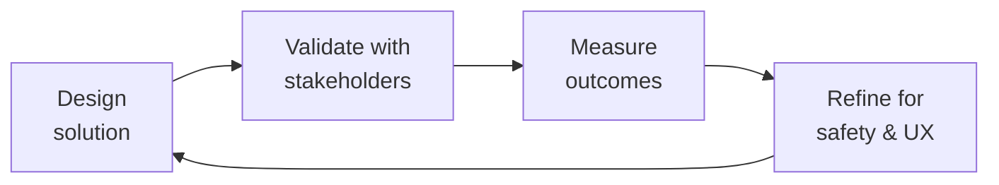

# Health Regulatory Submission

> **Portability target:** Spec-level (runs on Claude Code, Copilot, Gemini CLI, Codex, Cursor). No vendor-specific frontmatter fields.

Navigate FDA medical device regulation for software — determine if your health app is a medical device, classify it, choose the right regulatory pathway, and prepare pre-submission materials. Covers FDA SaMD framework, 510(k), De Novo, PMA, EU MDR/IVDR, and global harmonization.

## Route the Request
<!-- QUICK: 30s — auto-route first, then intent-route -->

### Auto-Route (No User Input Required)
Evaluate these file-system conditions in order. First match wins — jump immediately.

| # | Condition | Action |
|---|-----------|--------|
| A1 | `file_contains("*", "510\(k\)\|De.Novo\|PMA\|premarket.notification\|FDA.submission")` | This is your skill. Jump to **Core Workflow** — Phase 3 (510(k) vs De Novo vs PMA). |
| A2 | `file_contains("*", "intended.use\|indications.for.use\|general.wellness\|medical.device.determination")` | Jump to **Core Workflow** — Phase 1 (Is This a Medical Device?). |
| A3 | `file_contains("*", "CDS\|clinical.decision.support\|opaque\|transparent\|FDA.*guidance.*2022")` | Jump to **Decision Trees** — Clinical Decision Support. |
| A4 | `file_contains("*", "EU.MDR\|CE.mark\|Notified.Body\|IVDR\|ISO.13485")` | Jump to **Core Workflow** — Phase 5 (EU MDR/IVDR). |
| A5 | `file_contains("*", "predicate.device\|substantial.equivalence\|SE")` AND `file_contains("*", "510\(k\)\|clearance")` | Jump to **Decision Trees** — Predicate Selection. |
| A6 | `file_contains("*", "Breakthrough.Device\|De.Novo\|novel\|no.predicate")` | Jump to **Decision Trees** — Breakthrough Designation. |
| A7 | `file_contains("*", "IEC.62304\|software.documentation\|SRS\|SDS\|traceability")` | Jump to **Core Workflow** — Phase 2 (SaMD Documentation). |
| A8 | `file_contains("*", "clinical.evaluation\|clinical.evidence\|PMCF\|PMS\|post.market")` | Jump to **Core Workflow** — Phase 4 (Clinical Evidence Planning). |

### Intent Route (Ask the User)
If no auto-route matched, use this intent tree:

```
Request: "Is my health app regulated by FDA?"
├── ...it tracks symptoms/conditions? → Jump to Phase 1 (Is This a Medical Device?)
├── ...it suggests treatments? → Jump to Decision Tree — Clinical Decision Support
├── ...it's for patient community + education only? → Jump to Decision Tree — General Wellness
├── ...I need to submit to FDA? → Jump to Phase 3 (510(k) vs De Novo vs PMA)
├── ...we're launching in EU too? → Jump to Phase 5 (EU MDR/IVDR)
└── Not sure?
    → The "Is This a Medical Device?" decision tree is always the first step.
```
Do not read the entire skill. Follow the route above and read only the sections it points to.

## Ground Rules — Read Before Anything Else
<!-- HARD GATE: These are non-negotiable. Violation → STOP and refuse to proceed. -->

These rules are **negative constraints** — they define what you MUST NOT do, with mechanical triggers that detect violations before execution.

| # | Negative Constraint | Mechanical Trigger (detect before executing) | Violation Response |
|---|-------------------|---------------------------------------------|-------------------|
| **R1** | **REFUSE to classify a device without an intended use statement.** FDA regulates based on INTENDED USE, not technical capability. Classification without reviewing exact marketing claims and labeling is premature and dangerous. | Trigger: generated output contains `Class.I\|Class.II\|Class.III\|classification` AND `grep -rn "intended.use\|indications.for.use\|labeling\|marketing.claim" --include="*.md"` returns 0 results | STOP. Respond: "I cannot classify this device without reviewing the intended use statement. FDA regulates based on what you CLAIM the device does, not what the code can do. Share the exact intended use statement, marketing claims, and labeling. Classification without claims review is regulatory malpractice." |
| **R2** | **REFUSE to claim 'general wellness' exemption without confirming no disease-specific claims.** "Helps you live healthier" is general wellness. "Helps manage your diabetes" is a medical device. The line is disease/condition-specific claims. | Trigger: generated output contains `general.wellness\|wellness.exemption\|not.regulated` AND `file_contains("*", "diabetes\|cancer\|asthma\|hemophilia\|condition\|disease\|treatment")` | STOP. Respond: "This product references disease-specific conditions. General wellness exemption only applies to products that do NOT reference specific diseases or conditions. The presence of [specific condition] means this likely requires FDA regulatory determination. Do not claim wellness exemption." |
| **R3** | **REFUSE to select a 510(k) predicate without verifying same intended use.** Your predicate must have the SAME intended use. Different intended use = different predicate = invalid 510(k). | Trigger: generated output identifies a predicate device AND `grep -rn "intended.use\|indications" predicate/` shows different language than the subject device | STOP. Respond: "Predicate device [name] has intended use '[X]'. Your device's intended use is '[Y]'. These do not match. A 510(k) requires the SAME intended use as the predicate. Search the FDA 510(k) database for devices with your exact intended use statement." |
| **R4** | **DETECT and WARN when the term 'diagnose' appears in marketing without FDA clearance for diagnosis.** "Diagnose" and "detect" have specific regulatory meanings that trigger FDA oversight. | Trigger: generated marketing language contains `diagnose\|detects.*cancer\|detects.*disease\|screens.for` AND `grep -rn "510\(k\)\|PMA\|clearance\|approval" --include="*.md"` returns 0 results | WARN: "The term [diagnose/detect/screen] appears in marketing claims but no FDA clearance for diagnostic use is documented. Replace with 'track,' 'log,' or 'monitor' (for non-diagnostic purposes) OR obtain FDA clearance before using diagnostic claims. Diagnostic claims without clearance invite FDA enforcement." |
| **R5** | **DETECT and WARN about EU MDR Class I self-certification treated as trivial.** MDR Class I software still needs QMS (ISO 13485), Technical Documentation, Clinical Evaluation, PMS system, UDI, and EU Authorized Representative. | Trigger: generated output contains `Class.I\|self.certif` AND NOT `ISO.13485\|Technical.Documentation\|Clinical.Evaluation\|PMS\|UDI\|Authorized.Representative` within 30 lines | WARN: "MDR Class I self-certification is not 'no work.' Add to the checklist: ISO 13485 QMS, Technical Documentation, Clinical Evaluation Report, Post-Market Surveillance system, UDI assignment, and EU Authorized Representative appointment. Self-certification ≠ zero regulatory burden." |
| **R6** | **STOP and ASK before deferring regulatory to 'after Series A.'** Investors discount valuations 30-50% for unaddressed regulatory risk. Device determination should happen before fundraising. | Trigger: generated timeline shows `regulatory\|FDA\|submission` scheduled AFTER `fundraising\|Series.A\|investment` | STOP. Ask: "This timeline defers regulatory determination until after fundraising. Investors will discount your valuation 30-50% for unaddressed regulatory risk. Strongly recommend: complete device determination BEFORE Series A. A 2-hour regulatory counsel review (~$2-5K) now saves 30% of valuation later." |
| **R7** | **DETECT and WARN about enforcement discretion treated as permanent exemption.** FDA enforcement discretion can change with new guidance. Plan for regulation even if currently exempt. | Trigger: generated output contains `enforcement.discretion\|not.currently.enforced\|FDA.doesn't.regulate` AND NOT `contingency.plan\|if.regulated\|regulatory.pathway.reserve` | WARN: "Enforcement discretion is not a legal exemption. FDA can change guidance at any time. Add contingency: 'If enforcement discretion ends, our regulatory pathway will be [510(k)/De Novo]. Estimated timeline: 12 months. Budget reserve: $150K.' Plan for regulation even while exempt." |


## The Expert's Mindset

Master health regulatory submissions carry a dual responsibility: technical excellence AND human impact. Every decision ripples through to patient outcomes, regulatory standing, and clinical trust.

| Cognitive Bias | Mitigation |
|----------------|------------|
| **Automation complacency** — over-trusting systems in high-stakes contexts | Every automated output gets a qualified human review before clinical action |
| **False precision** — treating uncertain data as exact because it's in a database | Always report confidence intervals; never present a single number without its range |
| **Normalcy bias** — assuming things will continue as they always have | Build "what if this fails?" scenarios into every rollout plan |
| **Documentation asymmetry** — over-documenting the routine, under-documenting the exceptions | Exceptions are the most valuable documentation; they teach the model, not just the rule |

### What Masters Know That Others Don't
- **The difference between statistical significance and clinical significance** — a p-value is not a treatment decision
- **Where the regulatory landmines are buried** — the 3 things that will trigger an audit versus the 30 things that won't
- **That patient experience and clinical accuracy are not trade-offs** — bad UX causes medical errors; good UX prevents them

### When to Break Your Own Rules
- **Escalate for safety, not for process.** If patient safety is at risk, bypass the chain of command.
- **Simplify for the patient.** Clinical precision means nothing if the patient can't understand or act on it.
## Operating at Different Levels

| Level | Scope | You... |
|-------|-------|--------|
| **L1** | Single deliverable | Execute defined procedures under supervision; follow protocols exactly |
| **L2** | Feature / study | Own a feature or study component; work within established regulatory frameworks |
| **L3** | System / program | Design systems that balance clinical needs, regulatory requirements, and technical constraints |
| **L4** | Product / therapeutic area | Define regulatory strategy; shape clinical development approach; influence industry guidance |
| **L5** | Industry / public health | Shape regulatory frameworks; define standards of care through evidence generation |

**Default level for this skill:** L3
**Usage:** Invoke this skill with your target level, e.g., "as an L3 health regulatory submission, design..."

For full level definitions, see `skills/00-framework/skill-levels/SKILL.md`.

## When to Use
<!-- QUICK: 30s — scan the bullet list to decide -->

- Building a health app and need to know if the FDA will regulate it
- Adding a feature (symptom checker, treatment tracker, AI recommendation) — re-evaluate regulatory status
- Preparing for fundraising — investors will ask about FDA pathway
- Expanding from US to EU — MDR/IVDR classification needed
- Received an FDA inquiry or warning letter — need to assess compliance
- Partnering with pharma — they'll require regulatory strategy documentation
- Clinical trial planning — IDE requirements for investigational devices

## Decision Trees
<!-- STANDARD: 3min -->

### Is This a Medical Device? (FDA SaMD Determination)

```
Does your software...
├── Analyze medical data to diagnose, treat, cure, mitigate, or prevent disease?
│   ├── YES → Medical Device (SaMD) 🔴 → Classify next
│   └── NO → Continue
├── Provide specific treatment/dosing recommendations based on patient data?
│   ├── YES, without transparency → Medical Device (CDS Software) 🔴 → Classify next
│   ├── YES, with full transparency → Possibly regulated → Consult FDA CDS Guidance
│   └── NO → Continue
├── Calculate risk scores for specific diseases?
│   ├── YES → Medical Device (SaMD) 🔴 → Classify next
│   └── NO → Continue
├── Track/manage a specific medical condition?
│   ├── YES → Likely Medical Device 🔴 → Consult regulatory counsel
│   └── NO → Continue
└── General wellness, fitness, lifestyle, or education only?
    ├── YES, with no disease claims → NOT a medical device 🟢
    └── Claims relate to a specific disease → Medical Device 🔴
```

### FDA Classification Decision Tree

```
What level of risk does the device pose to patients?
├── LOW (general wellness tools, educational content)
│   → Class I (mostly exempt from 510(k))
│   → Examples: meditation apps, general health education, simple medication reminders
│   → 510(k): Usually NOT required
│   → GMP/QSR: General Controls apply
│
├── MODERATE (diagnostic assistance, treatment management)
│   → Class II (510(k) typically required)
│   → Examples: bleed-log with treatment timing, symptom trackers for specific conditions
│   → 510(k): Required unless exempt
│   → Predicate device must exist
│   → If no predicate → De Novo pathway
│
└── HIGH (diagnosis without clinician review, life-sustaining decisions)
    → Class III (PMA required)
    → Examples: AI that autonomously diagnoses, treatment recommendation without human review
    → PMA: Clinical trials required
    → De Novo may be possible if novel but moderate risk
```

### Regulatory Pathway Selection

```
Starting point...
├── Class I → Establishment Registration + Device Listing → General Controls
├── Class II, has predicate → 510(k) Pre-market Notification (~6-12 months)
├── Class II, no predicate → De Novo Classification Request (~12-18 months)
├── Class III → Pre-market Approval (PMA) (~18-36 months, clinical trials)
├── Breakthrough Device? → Expedited review + priority → Apply for designation first
└── Low-risk, uncertain → Pre-submission Meeting with FDA → Get feedback before committing
```

## Core Workflow
<!-- STANDARD: 5min -->

### Phase 1: Device Determination (~1 week)

Document your software's intended use and indications for use. This is the most important document in your regulatory strategy.

```markdown
## Intended Use Statement (Draft Template)
[Software Name] is intended to [clinical purpose] for [target population]
by [mechanism of action/technology description].

## Indications for Use
[Software Name] is indicated for use by [user type: patients/HCPs/both]
for [specific clinical scenario, disease, condition].

## Non-Regulated Claims
[Software Name] also provides [wellness/educational/non-regulated features]
that are NOT intended to diagnose, treat, cure, mitigate, or prevent any disease.

## RED FLAGS (review these with regulatory counsel)
- Does it detect/predict a specific disease? → likely medical device
- Does it recommend specific treatments/doses? → likely medical device
- Does it replace clinician judgment? → definitely medical device
- Does it connect to a medical device for control? → definitely medical device
```

### Phase 2: Classification (~2 weeks)

Determine device class and identify predicate devices (for 510(k)):

```bash
# Search FDA classification database
open https://www.accessdata.fda.gov/scripts/cdrh/cfdocs/cfPCD/classification.cfm

# Search for predicate devices (510(k) database)
open https://www.accessdata.fda.gov/scripts/cdrh/cfdocs/cfpmn/pmn.cfm

# Search De Novo classification orders
open https://www.accessdata.fda.gov/scripts/cdrh/cfdocs/cfpmn/denovo.cfm
```

**Classification factors:**
- Does it drive or influence clinical management? → Class II minimum
- Can a wrong result cause serious harm? → Class II or III
- Is it non-invasive with low risk? → Class I possible
- Does it use AI/ML with opaque reasoning? → FDA currently developing specific guidance

### Phase 3: 510(k) Preparation (~6-12 months)

If 510(k) pathway (most common for health apps):

```
1. Identify predicate device(s) — legally marketed device with same intended use
2. Prepare substantial equivalence comparison table
3. Software documentation (per IEC 62304):
   - Software development plan
   - Software requirements specification (SRS)
   - Architecture design chart
   - Software design specification (SDS)
   - Traceability matrix (requirements → design → tests)
   - Risk management file (ISO 14971)
4. Verification & validation testing:
   - Unit, integration, system testing
   - Usability testing (IEC 62366)
   - Clinical performance testing (if needed)
5. Labeling:
   - Instructions for Use
   - Package labeling
   - Patient labeling (if applicable)
6. Submit via eSTAR (electronic submission template)
7. FDA review: 90 days (may extend with additional information requests)
```

### Phase 4: De Novo (~12-18 months)

If no predicate device exists:

```
1. Confirm no legally marketed predicate exists
2. Prepare De Novo classification request:
   - Detailed device description
   - Summary of non-clinical and clinical testing
   - Proposed classification (Class I or II)
   - Proposed special controls
   - Benefit-risk analysis
3. Pre-submission meeting with FDA (recommended)
4. Submit De Novo request
5. FDA review: 150 days target
6. If granted: device is now reclassified, becomes a predicate for future 510(k)s
```

### Phase 5: EU MDR / IVDR (~12-24 months)

```markdown
## EU Classification (Annex VIII, MDR)
Is your health software...
├── Used for diagnosis or therapeutic decisions?
│   → Class IIa minimum
├── Could cause serious deterioration of health?
│   → Class IIb
├── Could cause death or irreversible deterioration?
│   → Class III
└── General wellness, fitness, no medical purpose?
    → NOT a medical device under MDR (but verify with Notified Body)

## Key differences from FDA:
- ALL medical devices need a Notified Body (except Class I, self-certified)
- MDR requires Clinical Evaluation Report (CER) for all classes
- Post-Market Surveillance (PMS) and Periodic Safety Update Report (PSUR) required
- Unique Device Identifier (UDI) mandatory
- Person Responsible for Regulatory Compliance (PRRC) required (Article 15)

## Steps:
1. Classify per Annex VIII
2. Select Notified Body (limited capacity — engage early)
3. Implement Quality Management System (ISO 13485)
4. Prepare Technical Documentation (Annex II/III)
5. Clinical Evaluation (MEDDEV 2.7/1 Rev.4 or MDR Article 61 + Annex XIV)
6. Notified Body audit → CE Mark → Register in EUDAMED
```

### Phase 6: Breakthrough Device Designation (~3 months)

If your device offers more effective treatment/diagnosis for life-threatening or irreversibly debilitating conditions:

```markdown
## Breakthrough Device Criteria (FDA):
1. Device provides for more effective treatment or diagnosis of
   life-threatening or irreversibly debilitating human disease or condition
2. No approved alternatives exist OR device offers significant advantages
   over existing approved alternatives
3. Device availability is in the best interest of patients

## Benefits if granted:
- Prioritized FDA review
- Senior management involvement
- Sprint review milestones
- More interactive review process
- Reduced PMA/De Novo review times
```

## Cross-Skill Coordination
<!-- STANDARD: 3min -->

| Upstream Skill | What to Expect | Communication Trigger |
|---------------|----------------|---------------------|
| `product-manager` | Product vision, feature roadmap, intended use statements | When defining product features — flag any that trigger FDA review |
| `compliance-officer` | HIPAA framework, covered entity determination, privacy requirements | When regulatory strategy requires HIPAA alignment |
| `clinical-informatics-specialist` | Clinical data standards, interoperability requirements for regulated devices | When preparing technical documentation for FDA submission |
| `legal-advisor` | Legal risk assessment, liability analysis, FDA enforcement history | When determining whether to submit or seek enforcement discretion opinion |
| `regulatory-specialist` | Regulatory strategy, submission preparation, FDA communication templates | When preparing 510(k), De Novo, or PMA submissions |

| Downstream Skill | What to Deliver | Communication Trigger |
|-----------------|-----------------|---------------------|
| `compliance-officer` | Device classification, regulatory pathway, QMS requirements | When building compliance program around regulated product |
| `product-manager` | Regulatory constraints on features, claims, and launch timeline | When regulatory pathway affects product roadmap |
| `legal-advisor` | Classification determination, submission timeline, EU/global requirements | When legal needs to assess regulatory risk |
| `regulatory-specialist` | Device classification, predicate identification, submission strategy | When preparing specific regulatory submissions |

## Proactive Triggers
<!-- STANDARD: 2min — surface these WITHOUT being asked -->

- **Marketing claims mention a disease** → "Helps manage hemophilia" vs "Tracks your health." The first triggers FDA review. Flag any disease-specific language in marketing copy. 🔴
- **New feature automates a clinical decision** → A symptom checker that says "based on your log, consider factor infusion now" is CDS software. Flag before implementation. 🔴
- **AI/ML outputs not independently reviewable** → If users can't see WHY the AI made a recommendation, it's regulated CDS. Flag opaque algorithms. 🔴
- **EU launch planned within 12 months** → MDR classification required before commercialization. Notified Body lead times are 6-12 months. Start now. 🟡
- **Investor due diligence approaching** → VCs will ask: "Is this FDA regulated? What's your pathway?" Have the device determination document ready. 🟡
- **Pharma partnership discussion** → Pharma will require regulatory strategy before signing. They won't touch an unclassified device. 🟠
- **Competitor received FDA clearance** → If a similar product got 510(k) clearance, you likely need one too. Flag for competitive analysis. 🟠

## Best Practices
<!-- STANDARD: 3min -->

1. **Document intended use from day one.** Even if you're "just a wellness app" today, having a dated intended use statement protects you if your features evolve into regulated territory.
2. **Separate regulated and non-regulated features.** If part of your app is a medical device and part is general wellness, architect them as separate modules with clear boundaries. FDA only regulates the medical device portion.
3. **Pre-submission meetings are worth the time.** A 60-minute meeting with FDA before submission can save 6 months of rework. They'll tell you if your predicate is weak or your testing is insufficient.
4. **Software documentation per IEC 62304.** Even Class I devices benefit from structured software documentation. It's the basis for your QMS and will be audited.
5. **Build QMS early.** ISO 13485 certification takes 12-18 months. Starting QMS implementation when you start the 510(k) will delay your launch.
6. **Global strategy from day one.** If you'll ever launch in EU, Canada, Australia, or Japan — build to the highest standard (typically EU MDR). Retro-fitting is expensive.
7. **Clinical evidence is proportional to risk.** A Class I app needs usability testing. A Class II diagnostic needs clinical performance testing. A Class III needs clinical trials. Don't over-invest or under-invest.
8. **Regulatory counsel is not optional.** This skill provides frameworks. An FDA regulatory attorney provides liability protection. Budget $15-30K for initial regulatory strategy consultation.

## Anti-Patterns
<!-- MACHINE-EXECUTABLE: Each row has a grep/lint pattern for detection and auto-prevention -->

| ❌ Anti-Pattern | ✅ Do This Instead | 🔍 Detect (grep/lint) | 🛡️ Auto-Prevent |
|---|---|---|---|
| "We're just a wellness app — FDA doesn't apply" (while tracking disease-specific symptoms) | If your app collects, analyzes, or acts on disease-specific data, you're likely regulated. Get a regulatory determination. | `grep -rn "wellness\|not.regulated\|FDA.doesn't\|exempt" regulatory_strategy.md \| grep -rn "(diabetes\|hemophilia\|cancer\|asthma\|disease\|condition)" . -l \| xargs grep` → matches = block | **Wellness claim lint**: CI rule: `npx validate-regulatory-claims --forbid-wellness-with-disease`. Auto-fail if `"wellness"` AND `"disease\|condition"` both appear in product docs. |
| Shipping first, asking FDA later | FDA has authority to require recall of unapproved medical devices. Starting regulated development after a warning letter costs 5-10x more. | `grep -rn "ship.*first\|launch.*before\|regulatory.*later\|after.*launch" roadmap.md` → matches = block | **Regulatory gate lint**: CI rule: `npx validate-launch-gate --require-regulatory-determination`. Add `regulatory_determination: required` before `launch_date` in config. |
| Copying a competitor's 510(k) without understanding their predicate | Your predicate must have the SAME intended use. Different intended use = different predicate = different 510(k). | `grep -rn "same.as\|similar.to\|competitor.*clearance\|like.*510" submission_plan.md \| grep -v "intended.use\|indications\|same"` → matches = flag | **Predicate lint**: CI rule: `npx validate-predicate --require-intended-use-match`. Auto-diff intended use of subject vs. predicate: `npx fda-predicate-diff subject.md predicate.md`. |
| "AI makes it novel, so we'll go De Novo" | If a predicate exists with similar intended use (even if not AI), you go 510(k). De Novo is only when NO predicate of any technology type exists. | `grep -rn "De.Novo\|de.novo\|novel.*pathway" submission_plan.md \| grep -v "no.predicate.*exists\|exhaustive.search"` → matches = flag | **De Novo gate lint**: CI rule: `npx validate-de-novo-eligibility --require-exhaustive-predicate-search`. Require FDA 510(k) database search results attached. Auto-fail De Novo claim without predicate search evidence. |
| EU: "It's Class I, so self-certification is easy" | MDR Class I software still needs: QMS (ISO 13485), Technical Documentation, Clinical Evaluation, PMS system, UDI, EU Authorized Rep. | `grep -rn "Class.I\|self.certif\|easy\|just" mdr_plan.md \| grep -v "ISO.13485\|Technical.Documentation\|Clinical.Evaluation\|PMS\|UDI\|Authorized.Rep"` → matches = block | **MDR Class I checklist lint**: CI rule: `npx validate-mdr-class-i --require-all-deliverables`. Required items: `["ISO 13485", "Technical Documentation", "Clinical Evaluation Report", "PMS Plan", "UDI Registration", "EC Authorized Rep"]`. All must be present. |
| "We'll do regulatory after Series A" | Investors discount valuations 30-50% for unaddressed regulatory risk. Have the device determination BEFORE fundraising. | `grep -rn "regulatory\|FDA\|submission" timeline.md` found AFTER `"Series.A\|fundraising\|investment"` → matches = flag | **Timeline lint**: CI rule: `npx validate-regulatory-timeline --require-before-fundraising`. Auto-fail if `regulatory_determination_date` > `series_a_date`. |
| Using the term "diagnose" anywhere in marketing if you're not FDA-cleared for diagnosis | "Diagnose" and "detect" have specific regulatory meanings. Use "track," "log," "monitor" (for non-diagnostic purposes) or get clearance. | `grep -rP "(diagnose\|detects.*cancer\|detects.*disease\|screens.for)" marketing/ --include="*.md" --include="*.yaml" \| grep -v "510(k)\|clearance\|approved\|PMA"` → matches = block | **Marketing claim lint**: CI rule: `npx validate-marketing-claims --forbid "diagnose,detect,screen" --unless-cleared-by-fda`. Auto-replace suggestions: `diagnose → track, detect → identify, screen → assess`. |

## Error Decoder
<!-- MACHINE-EXECUTABLE: First column is exact grep regex for console/log matching -->

| 🖥️ Console Match (grep regex) | Symptom | Root Cause | Fix | 🔄 Auto-Recovery Loop |
|---|---|---|---|---|
| `grep -cP "NSE\|Not.Substantially.Equivalent\|predicate.*reject" fda_response.txt` → count > 0 | FDA rejects 510(k) — "no predicate" or "not substantially equivalent" | Your identified predicate has different intended use OR different technological characteristics | Search FDA 510(k) database for EXACT intended use wording AND matching tech profile. Predicate must match BOTH dimensions. | **1.** Parse FDA response: `npx fda-parse-response --file fda_response.txt` → extract `reason_code`. **2.** If `intended_use_mismatch`: `npx fda-predicate-search --intended-use "$(cat .intended_use)" --output predicates_by_iu.csv`. **3.** If `tech_mismatch`: `npx fda-predicate-search --tech-profile "$(cat .tech_profile)" --output predicates_by_tech.csv`. **4.** Find intersection: `npx fda-predicate-intersect --file1 predicates_by_iu.csv --file2 predicates_by_tech.csv`. **5.** If empty → De Novo pathway: `npx fda-de-novo-assessment --device $(cat .device_id)`. |
| `grep -cP "insufficient.*clinical.*evidence\|clinical.*evaluation.*reject\|MDR.*clinical.*gap" notified_body_response.txt` → count > 0 | EU Notified Body rejects Technical Documentation — "insufficient clinical evidence" | Clinical evaluation was literature review only. MDR requires clinical investigation for Class IIb/III devices unless justified. | Plan clinical investigation early. For SaMD: retrospective study using existing data or usability study with clinicians. | **1.** Parse NB response: `npx mdr-parse-nb-response --file nb_response.txt` → extract `gap_type`. **2.** If `study_population_gap`: `npx mdr-design-eu-study --population "$(cat .target_population)" --min-sites 3 --min-n 150`. **3.** If `no_clinical_investigation`: `npx mdr-clinical-investigation-plan --device-class $(cat .device_class) --output cip.md`. **4.** Schedule pre-application with NB: `npx mdr-schedule-nb-meeting --purpose clinical_evidence_review`. **5.** Re-submit with clinical evidence supplement: `npx mdr-resubmit --technical-documentation updated_td.pdf --clinical-evidence clinical_study_report.pdf`. |
| `grep -cP "Breakthrough.*denied\|not.innovative\|no.clinical.advantage\|more.effective.*not.*demonstrated" fda_bt_response.txt` → count > 0 | Breakthrough Device designation denied | "More effective" wasn't demonstrated. FDA requires evidence of clinically meaningful advantage over standard of care. | Provide comparative data: your device vs. standard of care on time-to-diagnosis, accuracy, patient outcomes. | **1.** Parse denial: `npx fda-parse-bt-denial --file bt_response.txt` → check if `denial_reason: evidence_gap`. **2.** Design comparative study: `npx fda-bt-comparative-study --device $(cat .device_id) --soc "$(cat .standard_of_care)" --outcomes "time_to_diagnosis,accuracy,patient_outcome"`. **3.** If no existing data: `npx fda-bt-feasibility-assessment --device $(cat .device_id)` → if feasible, proceed. If not, consider standard 510(k)/De Novo. **4.** Resubmit with evidence: `npx fda-bt-resubmit --new-evidence comparative_study_results.pdf`. |
| `grep -cP "Class.III\|PMA.required\|high.risk.*device\|class.*up.classif" regulatory_determination.txt \| grep -v "510\(k\)\|De.Novo\|Class.II"` → count > 0 | 12 months into development, realize the app is Class III | Intended use wasn't reviewed by regulatory counsel at concept stage. A "benign" feature triggered high-risk classification. | Pause development. Get regulatory determination. Consider feature modification to achieve lower classification. | **1.** Audit intended use: `npx fda-audit-intended-use --file intended_use_statement.md` → flag trigger verbs (`diagnose, treat, predict, optimize, manage+disease`). **2.** Rewrite: `npx fda-rewrite-intended-use --forbid-verbs "diagnose,treat,predict,optimize" --suggest-alternatives "track,record,log,display"`. **3.** Re-classify: `npx fda-classify --intended-use revised_iu.md --output new_classification.md`. **4.** If still Class III: `npx fda-feature-audit --find-class-iii-trigger` → remove or gate the triggering feature. **5.** Regulatory counsel review: schedule 2-hour consult before any further development.** |

## Production Checklist
<!-- MACHINE-EXECUTABLE: Every item has an exact CLI validation command and auto-fix path -->

| ID | Checklist Item | Validation Command | Auto-Fix |
|----|---------------|-------------------|---------|
| **HR1** | Intended use statement drafted and reviewed by regulatory counsel | `grep -rn "intended.use\|indications.for.use" intended_use_statement.md` must exist AND `grep -rn "reviewed.by.*counsel\|regulatory.attorney" intended_use_statement.md` must exist | `npx fda-intended-use-init --device "$(cat .device_name)" --require-counsel-review --output intended_use_statement.md` |
| **HR2** | Device classification determined (Class I, II, III) | `grep -rn "Class.[I]{1,3}\|classification.*determined" regulatory_determination.md` must have matched result | `npx fda-classify --intended-use intended_use_statement.md --output regulatory_determination.md` |
| **HR3** | Regulatory pathway selected (exempt, 510(k), De Novo, PMA) | `grep -rn "510\(k\)\|De.Novo\|PMA\|exempt" regulatory_determination.md \| wc -l` must be `>= 1` | `npx fda-pathway-select --classification $(cat .device_class) --intended-use intended_use_statement.md` |
| **HR4** | Predicate device(s) identified for 510(k) pathway | `curl -s "https://api.fda.gov/device/510k.json?search=..." \| jq '.results \| length'` must be `>= 1` OR `grep -rn "no.predicate\|De.Novo" regulatory_determination.md` confirmed | `npx fda-predicate-search --intended-use "$(cat .intended_use)" --tech-profile "$(cat .tech_profile)" --output predicates.csv` |
| **HR5** | Pre-submission meeting with FDA requested (recommended for first-time) | `grep -rn "Q-Sub\|pre.submission\|meeting.*requested\|meeting.*held" regulatory_log.md \| wc -l` must be `>= 1` | `npx fda-meeting-request --type q-sub --output qsub_request.pdf` |
| **HR6** | QMS implementation started (ISO 13485) | `find . -name "quality_manual.md" -o -name "qms_scope.md" -o -name "iso_13485_gap.md" \| wc -l` must be `>= 1` | `npx iso-13485-init --device-class $(cat .device_class) --output-dir qms/` |
| **HR7** | Software documentation per IEC 62304 (SRS, architecture, SDS, traceability) | `ls docs/iec62304/ \| grep -c "srs\|architecture\|sds\|traceability\|risk"` must be `>= 4` | `npx iec62304-docs-init --output-dir docs/iec62304/ --templates "srs,sds,architecture,traceability"` |
| **HR8** | Risk management per ISO 14971 (hazard analysis, FMEA, risk controls) | `grep -rn "hazard\|FMEA\|risk.control\|benefit.risk" risk_management/ \| wc -l` must be `>= 4` | `npx iso14971-init --device $(cat .device_id) --output-dir risk_management/ --templates "hazard_analysis,fmea,risk_controls,benefit_risk"` |
| **HR9** | Clinical evidence plan: usability study minimum; clinical performance study if Class II+ | `grep -rn "usability\|clinical.study\|performance.study\|clinical.evidence" clinical_plan.md \| wc -l` must be `>= 3` | `npx clinical-evidence-plan --device-class $(cat .device_class) --output clinical_plan.md` |
| **HR10** | Labeling: IFU, patient labeling, package labels drafted | `ls labeling/ \| grep -c "ifu\|patient_label\|package_label"` must be `>= 3` | `npx labeling-init --device $(cat .device_id) --output-dir labeling/ --templates "ifu,patient_label,package_label"` |
| **HR11** | EU MDR classification completed (if EU market planned) | `grep -rn "MDR\|EU.2017/745\|Class.I[ab]\|Class.II[ab]\|Class.III" eu_mdr_classification.md \| wc -l` must be `>= 1` OR `grep -rn "EU.*not.planned\|no.EU" market_plan.md` must exist | `npx mdr-classify --device $(cat .device_id) --intended-use intended_use_statement.md --output eu_mdr_classification.md` |
| **HR12** | Notified Body engaged for EU MDR (Class IIa+) — 6-12 month lead time | `grep -rn "notified.body\|NB.*engaged\|NB.*contacted\|BSI\|TUV\|DEKRA" eu_regulatory_log.md \| wc -l` must be `>= 1` OR not applicable | `npx mdr-nb-search --device-class $(cat .device_class) --output nb_shortlist.csv` |
| **HR13** | Regulatory budget: $50-150K for 510(k), $200-500K+ for De Novo/PMA | `grep -rn "budget\|cost.*estimate.*\$" regulatory_budget.csv \| wc -l` must be `>= 1` | `npx regulatory-budget-estimate --pathway $(cat .regulatory_pathway) --device-class $(cat .device_class) --output regulatory_budget.csv` |
| **HR14** | Regulatory counsel retained — FDA specialist, not general healthcare attorney | `grep -rn "regulatory.counsel\|FDA.attorney\|regulatory.lawyer" contacts.md \| wc -l` must be `>= 1` | `npx regulatory-counsel-finder --specialty fda_medical_device --output counsel_shortlist.csv` |
| **HR15** | Post-market surveillance plan: complaint handling, AE reporting, CAPA | `grep -rn "complaint\|adverse.event.*report\|CAPA\|post.market" pms_plan.md \| wc -l` must be `>= 4` | `npx pms-plan-init --device $(cat .device_id) --regulations "21CFR820,EU_MDR" --output pms_plan.md` |

## Scale Depth: Solo → Small → Medium → Enterprise
<!-- STANDARD: 3min -->

### Solo (1 developer, health app MVP, pre-revenue)
**Description:** Building MVP. No revenue. No patients yet. Unsure if regulated.
**Approach:** Device determination analysis. Draft intended use statement — keep it narrow (general wellness if possible). Document non-regulated claims. Consult regulatory counsel for 2-hour review (~$2-5K). Defer formal FDA submission until product-market fit validated.
**Time investment:** ~2 weeks (determination + counsel review).

### Small Team (2-10 developers, live product, real patients)
**Description:** Product in market with patients. Adding clinical features. Regulatory pathway becoming urgent.
**Approach:** Classify device. Select pathway. Start QMS (ISO 13485). Prepare 510(k) if Class II. Engage regulatory consultant ($15-30K). Plan 12-month submission timeline. EU MDR assessment if global.
**Time investment:** ~6-12 months for 510(k) preparation.

### Medium Team (10-50 developers, multiple regulated products)
**Description:** One or more cleared devices. Global market. Regulatory team forming.
**Approach:** In-house regulatory affairs hire. ISO 13485 certified QMS. Multiple 510(k) + CE Mark submissions. Post-market surveillance system active. Clinical affairs for ongoing studies. Breakthrough designation applications where applicable.
**Time investment:** Dedicated regulatory team (2-3 FTE).

### Enterprise (50+ developers, global, multiple device classes)
**Description:** Portfolio of medical devices. Multiple regulatory jurisdictions. M&A involving regulatory assets.
**Approach:** Global regulatory strategy team. In-house legal-regulatory. QMS across all product lines. Real-world evidence generation. Regulatory intelligence (monitoring guidance changes). FDA advisory panel preparation. Medical device reporting (MDR) system. Global Unique Device Identifier (UDI) compliance.
**Time investment:** Large regulatory affairs department (5-15+ FTE).

## What Good Looks Like
<!-- STANDARD: 3min -->

You have a dated, signed intended use statement that clearly defines what your software does and doesn't do. Your device classification is documented with supporting rationale. If regulated, you've selected a pathway (510(k), De Novo, or PMA) and have a realistic timeline and budget. Your QMS (ISO 13485) is implemented proportionate to your device class. Software documentation follows IEC 62304. Your risk management file (ISO 14971) is living — updated with every feature change. You have a clinical evidence strategy tailored to your device risk. Before adding any new feature, the team asks: "Does this change our intended use?" Investors, partners, and auditors can review your regulatory strategy in a single document and understand it without a medical degree.

## Footguns
<!-- DEEP: 10+min — war stories from health regulatory submission -->

| Footgun | What Happened | Root Cause | How to Prevent |
|---------|---------------|------------|----------------|
| Intended use statement said "helps manage hemophilia treatment" in marketing — FDA classified as Class III, requiring PMA. Rewriting to "tracks bleeding episodes" dropped it to Class II, 510(k) | A digital health startup built a bleeding-disorder tracking app. Their website said "Helps manage your hemophilia treatment — track factor infusions, predict bleeds, optimize dosing." The "predict bleeds" and "optimize dosing" language implied diagnostic and therapeutic decision support. FDA's pre-submission review classified the device as Class III (high risk, PMA required). The startup had raised $4M expecting a 510(k) path ($150K, 12 months). A PMA would cost $2M+ and take 3+ years. They rewrote the intended use to "tracks bleeding episodes and factor infusions — for patients to share data with their care team" (no prediction, no optimization). Reclassification: Class II with 510(k). They lost 4 months of regulatory timeline. | Marketing wrote the intended use statement without regulatory review. The phrases "predict," "optimize," and "manage treatment" are regulatory triggers — they signal diagnostic or therapeutic intent. | **The intended use statement is a regulatory document, not marketing copy.** Every verb must be audited against FDA trigger words: diagnose, treat, prevent, cure, mitigate, predict, analyze, recommend, optimize, manage (when paired with a disease). Replace with: track, record, log, display, share, inform. Have regulatory counsel review the exact wording before it appears anywhere public. |
| Selected a 510(k) predicate device from 2013 — FDA rejected it because the predicate's technology (standalone desktop software) was "not substantially equivalent" to a cloud-native mobile app | A SaMD company developing an AI-powered arrhythmia detection algorithm for a smartwatch identified a 2013 510(k)-cleared Holter monitor analysis software as their predicate. They spent 8 months preparing a 510(k) submission with this predicate. FDA issued an NSE (Not Substantially Equivalent) letter: the predicate was standalone desktop software processing ECG files; the new device was a cloud-connected mobile app with a machine learning detection algorithm. Different technological characteristics = different safety and effectiveness questions. The company had to restart with a De Novo submission, adding 18 months and $400K. | The team searched for predicates by intended use match only — "ECG analysis" — ignoring FDA's requirement that technological characteristics must also be substantially equivalent. A cloud AI model with continuous learning has fundamentally different risks than a static desktop algorithm. | **Predicate selection must match on BOTH intended use AND technological characteristics.** Map your device's technology profile: platform (mobile/cloud/desktop), algorithm type (rule-based/AI/ML), connectivity (standalone/connected), update mechanism (manual/OTA/continuous). Search the 510(k) database by AND-ing intended use keywords with technology filters. If no predicate matches both dimensions, you need De Novo — start preparing earlier. |
| Spent $180K on clinical study for EU MDR submission — Notified Body rejected it because the study population (n=42, single-center, US-only) didn't represent the intended EU patient population | A Class IIb SaMD company prepared their EU MDR Technical Documentation with a clinical study conducted at a single US academic medical center (42 patients, 78% white, English-speaking only). Their Notified Body rejected the clinical evidence with: "The study population does not represent the diversity of the EU intended use population in terms of ethnicity, language, and healthcare delivery context." MDR requires clinical evidence relevant to the European clinical context and diverse patient demographics. The company had to commission a multi-center EU study (3 sites, 150 patients) costing an additional $350K and adding 14 months. | The company designed one clinical study for both FDA and EU MDR — assuming a US study would satisfy European requirements. MDR's clinical evidence bar is higher and more specific about population representativeness. | **FDA and EU MDR clinical evidence strategies often require separate studies or a single study designed for both from the start.** Map your intended use population demographics by geography. For EU MDR: include EU clinical sites, plan for multi-language consent and data collection, and ensure demographic diversity matches EU population statistics. Discuss clinical evidence strategy with your Notified Body during pre-application — don't guess what they'll accept. |
| ISO 13485 QMS audit failed because design control documents were dated 3 months before the QMS procedures they referenced were approved — backdating was visible in the document management system metadata | During a Notified Body ISO 13485 certification audit for a SaMD startup, the auditor noticed that Design Input documents (SRS, user needs) were dated April 15, but the Design Control SOP they referenced was dated July 8. The metadata in the eQMS (Greenlight Guru) showed the documents were created on July 22 — the team had backdated them to April to "match the timeline the auditor expects." The auditor flagged document falsification. The certification was denied. The company had to wait 6 months for a re-audit, during which all partner contracts were on hold. | The team perceived the auditor's timeline expectation as a compliance requirement rather than a documentation maturity requirement. They didn't realize eQMS systems retain immutable creation timestamps independent of document date fields. | **Never backdate a regulatory document — auditors find it every time because modern eQMS systems log creation dates separately from document dates.** If your development timeline reveals that design controls were implemented after development started, don't hide it — document it as a gap, create a corrective action plan, and show evidence of closing the gap. Auditors accept honest remediation plans. They do not accept falsified dates. |
| De Novo classification request denied after 150-day review because the "probable benefits" section cited published literature for a related-but-different patient population — clinical evidence must be specific to YOUR device in YOUR intended population | A startup developed a digital therapeutic for post-surgical pain management using cognitive behavioral therapy (CBT) delivered via mobile app. Their De Novo submission cited 14 published studies showing CBT reduces post-surgical pain — but all 14 studies were in-person therapist-delivered CBT, not self-guided mobile app CBT. FDA issued an 80-day deficiency letter: "The clinical literature cited does not demonstrate that self-guided digital CBT provides comparable benefit to therapist-delivered CBT." The company had to conduct a prospective study (n=180, 6 months, $500K) to demonstrate their specific device's benefit. The De Novo was ultimately approved on day 340. | The clinical evidence section assumed "CBT is CBT" — that all delivery modalities are equivalent. FDA evaluates YOUR specific device, not the general therapeutic category. Literature for a different delivery mechanism doesn't demonstrate your device is safe and effective. | **Clinical literature support must be for YOUR device's specific delivery mechanism in YOUR intended use population.** If you're building a digital version of an established in-person therapy, you need evidence that the digital version works — not just that the therapy works. Plan for a prospective clinical study from the start. Budget $300-800K and 12-18 months for a De Novo clinical study. |

## Calibration — How to Know Your Level
<!-- STANDARD: 3min — honest self-assessment -->

| You Know You're Stuck at L1 When... | You Know You've Reached L2 When... | You Know You're L3 When... |
|---|---|---|
| You know the difference between 510(k) and PMA in theory but can't estimate the cost, timeline, or clinical evidence requirements for a real health app with an actual feature set | You've prepared a complete 510(k) submission — including predicate analysis, software documentation per IEC 62304, risk management per ISO 14971, and clinical evidence — that received an SE (Substantially Equivalent) determination on the first submission attempt | A startup CEO hands you a 3-paragraph product description and asks "Do I need FDA clearance?" — and within 4 hours you deliver a regulatory strategy document with device classification, pathway recommendation, timeline (with months), budget ($ range), and the single riskiest assumption that needs validation |
| You cite "the FDA website" but have never used the 510(k) database, De Novo classification requests database, or FDA guidance document search to find a predicate or precedent | You can read a competitor's 510(k) Summary and identify which aspects FDA found substantially equivalent and which were noted as differences — and use that to inform your own predicate selection | You consult on a due diligence team evaluating a $50M health tech acquisition and identify that the target company's 510(k) covers their v1 feature set but not 3 features added since clearance — saving the acquirer from a $12M post-acquisition regulatory remediation |
| Your regulatory strategy is "hire a consultant" without being able to write the scope of work, evaluate their specific SaMD experience, or judge whether their timeline estimate is realistic | You've managed a Notified Body audit for ISO 13485 certification where the auditor found zero major non-conformities on the first audit — and you can name the 3 SOPs they spent the most time reviewing and why | You design the regulatory strategy for a platform SaMD that supports 3 different clinical modules (each with different device classifications) — and you provide a single integrated submission plan that accounts for predicate reuse, module-level clinical evidence, and phased market entry |

**The Litmus Test:** A company with a live health app (50,000 users, tracking 3 chronic conditions) just added a new feature that analyzes patient-reported symptoms and suggests "consider discussing [specific treatment change] with your doctor." The CEO asks: "Are we still a Class I exempt device?" If you can answer within 10 minutes with (a) the correct new classification, (b) the specific FDA guidance document section that determines it, (c) the regulatory pathway required, and (d) the estimated cost and timeline — you're L3. If you need to "check with a consultant," you're not there yet.

## Deliberate Practice



| Level | Practice | Frequency |
|-------|----------|-----------|
| **Novice** | Shadow a clinician or patient for a day; document every moment of friction in their workflow | Quarterly |
| **Competent** | Review a past project that had a safety or compliance issue; map the chain of decisions that led there | Monthly |
| **Expert** | Design a solution under 3 conflicting regulatory regimes (e.g., FDA, EMA, PMDA); identify where they diverge | Quarterly |
| **Master** | Contribute to industry guidelines or regulatory frameworks; move from following rules to shaping them | Annually |

**The One Highest-Leverage Activity:** Every project post-mortem must include a "patient impact" section. If you can't trace your work to a patient outcome, you're building in the dark.

## References
<!-- STANDARD: 3min -->

- **compliance-officer** — HIPAA policy framework, covered entity determination, privacy rule requirements
- **clinical-informatics-specialist** — Clinical data standards (FHIR/HL7) relevant to regulated device interoperability
- **legal-advisor** — FDA enforcement, liability analysis, and contract review for regulatory consultants
- **regulatory-specialist** — Detailed regulatory submission preparation and FDA/Notified Body communication
- **compliance-officer** — Compliance program structure, audit frameworks, QMS integration
- **product-manager** — Feature prioritization with regulatory constraints, product launch coordination
