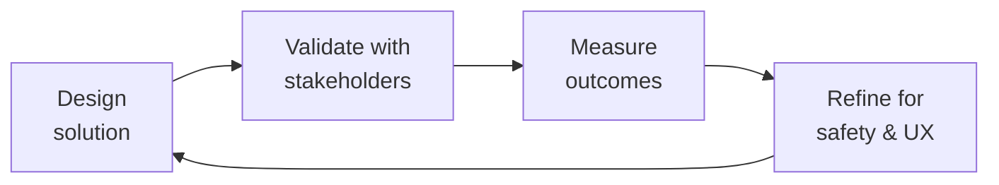

# Health Regulatory Submission

Navigate FDA medical device regulation for software — determine if your health app is a medical device, classify it, choose the right regulatory pathway, and prepare pre-submission materials. Covers FDA SaMD framework, 510(k), De Novo, PMA, EU MDR/IVDR, and global harmonization.

## Route the Request
<!-- QUICK: 30s — pick your path, skip the rest -->

```
Request: "Is my health app regulated by FDA?"
├── ...it tracks symptoms/conditions? → Jump to Phase 1 (Is This a Medical Device?)
├── ...it suggests treatments? → Jump to Decision Tree → Clinical Decision Support
├── ...it's for patient community + education only? → Jump to Decision Tree → General Wellness
├── ...I need to submit to FDA? → Jump to Phase 3 (510(k) vs De Novo vs PMA)
├── ...we're launching in EU too? → Jump to Phase 5 (EU MDR/IVDR)
└── Not sure?
    → The "Is This a Medical Device?" decision tree is always the first step.
```

## Ground Rules — Read Before Anything Else
<!-- STANDARD: 3min -->

1. **FDA regulates based on INTENDED USE, not technical capability.** If your marketing says "helps manage diabetes" — you're a medical device. If you say "tracks wellness" but the algorithm detects arrhythmias — you're a medical device. Claims matter more than code.
2. **Clinical Decision Support (CDS) software is regulated if it's opaque.** FDA's 2022 CDS Guidance: software that uses patient-specific data to generate a specific treatment recommendation (and the user can't independently review the basis) = medical device. Transparent, non-automated CDS = not regulated.
3. **General wellness = low risk, narrow lane.** "Helps you live healthier" is general wellness. "Helps manage your hemophilia treatment" is a medical device. The line is disease/condition-specific claims.
4. **Enforcement discretion ≠ legal exemption.** FDA may exercise enforcement discretion for certain low-risk devices (e.g., mobile apps that automate simple medical calculations). This can change with new guidance. Plan for regulation even if currently exempt.
5. **EU MDR is stricter than FDA for software.** Many apps exempt from FDA regulation are Class I or higher under EU MDR. If you have EU users, plan for MDR from day one.


## The Expert's Mindset

Master health regulatory submissions carry a dual responsibility: technical excellence AND human impact. Every decision ripples through to patient outcomes, regulatory standing, and clinical trust.

| Cognitive Bias | Mitigation |
|----------------|------------|
| **Automation complacency** — over-trusting systems in high-stakes contexts | Every automated output gets a qualified human review before clinical action |
| **False precision** — treating uncertain data as exact because it's in a database | Always report confidence intervals; never present a single number without its range |
| **Normalcy bias** — assuming things will continue as they always have | Build "what if this fails?" scenarios into every rollout plan |
| **Documentation asymmetry** — over-documenting the routine, under-documenting the exceptions | Exceptions are the most valuable documentation; they teach the model, not just the rule |

### What Masters Know That Others Don't
- **The difference between statistical significance and clinical significance** — a p-value is not a treatment decision
- **Where the regulatory landmines are buried** — the 3 things that will trigger an audit versus the 30 things that won't
- **That patient experience and clinical accuracy are not trade-offs** — bad UX causes medical errors; good UX prevents them

### When to Break Your Own Rules
- **Escalate for safety, not for process.** If patient safety is at risk, bypass the chain of command.
- **Simplify for the patient.** Clinical precision means nothing if the patient can't understand or act on it.
## Operating at Different Levels

| Level | Scope | You... |
|-------|-------|--------|
| **L1** | Single deliverable | Execute defined procedures under supervision; follow protocols exactly |
| **L2** | Feature / study | Own a feature or study component; work within established regulatory frameworks |
| **L3** | System / program | Design systems that balance clinical needs, regulatory requirements, and technical constraints |
| **L4** | Product / therapeutic area | Define regulatory strategy; shape clinical development approach; influence industry guidance |
| **L5** | Industry / public health | Shape regulatory frameworks; define standards of care through evidence generation |

**Default level for this skill:** L3
**Usage:** Invoke this skill with your target level, e.g., "as an L3 health regulatory submission, design..."

For full level definitions, see `skills/00-framework/skill-levels/SKILL.md`.

## When to Use
<!-- QUICK: 30s — scan the bullet list to decide -->

- Building a health app and need to know if the FDA will regulate it
- Adding a feature (symptom checker, treatment tracker, AI recommendation) — re-evaluate regulatory status
- Preparing for fundraising — investors will ask about FDA pathway
- Expanding from US to EU — MDR/IVDR classification needed
- Received an FDA inquiry or warning letter — need to assess compliance
- Partnering with pharma — they'll require regulatory strategy documentation
- Clinical trial planning — IDE requirements for investigational devices

## Decision Trees
<!-- STANDARD: 3min -->

### Is This a Medical Device? (FDA SaMD Determination)

```
Does your software...
├── Analyze medical data to diagnose, treat, cure, mitigate, or prevent disease?
│   ├── YES → Medical Device (SaMD) 🔴 → Classify next
│   └── NO → Continue
├── Provide specific treatment/dosing recommendations based on patient data?
│   ├── YES, without transparency → Medical Device (CDS Software) 🔴 → Classify next
│   ├── YES, with full transparency → Possibly regulated → Consult FDA CDS Guidance
│   └── NO → Continue
├── Calculate risk scores for specific diseases?
│   ├── YES → Medical Device (SaMD) 🔴 → Classify next
│   └── NO → Continue
├── Track/manage a specific medical condition?
│   ├── YES → Likely Medical Device 🔴 → Consult regulatory counsel
│   └── NO → Continue
└── General wellness, fitness, lifestyle, or education only?
    ├── YES, with no disease claims → NOT a medical device 🟢
    └── Claims relate to a specific disease → Medical Device 🔴
```

### FDA Classification Decision Tree

```
What level of risk does the device pose to patients?
├── LOW (general wellness tools, educational content)
│   → Class I (mostly exempt from 510(k))
│   → Examples: meditation apps, general health education, simple medication reminders
│   → 510(k): Usually NOT required
│   → GMP/QSR: General Controls apply
│
├── MODERATE (diagnostic assistance, treatment management)
│   → Class II (510(k) typically required)
│   → Examples: bleed-log with treatment timing, symptom trackers for specific conditions
│   → 510(k): Required unless exempt
│   → Predicate device must exist
│   → If no predicate → De Novo pathway
│
└── HIGH (diagnosis without clinician review, life-sustaining decisions)
    → Class III (PMA required)
    → Examples: AI that autonomously diagnoses, treatment recommendation without human review
    → PMA: Clinical trials required
    → De Novo may be possible if novel but moderate risk
```

### Regulatory Pathway Selection

```
Starting point...
├── Class I → Establishment Registration + Device Listing → General Controls
├── Class II, has predicate → 510(k) Pre-market Notification (~6-12 months)
├── Class II, no predicate → De Novo Classification Request (~12-18 months)
├── Class III → Pre-market Approval (PMA) (~18-36 months, clinical trials)
├── Breakthrough Device? → Expedited review + priority → Apply for designation first
└── Low-risk, uncertain → Pre-submission Meeting with FDA → Get feedback before committing
```

## Core Workflow
<!-- STANDARD: 5min -->

### Phase 1: Device Determination (~1 week)

Document your software's intended use and indications for use. This is the most important document in your regulatory strategy.

```markdown
## Intended Use Statement (Draft Template)
[Software Name] is intended to [clinical purpose] for [target population]
by [mechanism of action/technology description].

## Indications for Use
[Software Name] is indicated for use by [user type: patients/HCPs/both]
for [specific clinical scenario, disease, condition].

## Non-Regulated Claims
[Software Name] also provides [wellness/educational/non-regulated features]
that are NOT intended to diagnose, treat, cure, mitigate, or prevent any disease.

## RED FLAGS (review these with regulatory counsel)
- Does it detect/predict a specific disease? → likely medical device
- Does it recommend specific treatments/doses? → likely medical device
- Does it replace clinician judgment? → definitely medical device
- Does it connect to a medical device for control? → definitely medical device
```

### Phase 2: Classification (~2 weeks)

Determine device class and identify predicate devices (for 510(k)):

```bash
# Search FDA classification database
open https://www.accessdata.fda.gov/scripts/cdrh/cfdocs/cfPCD/classification.cfm

# Search for predicate devices (510(k) database)
open https://www.accessdata.fda.gov/scripts/cdrh/cfdocs/cfpmn/pmn.cfm

# Search De Novo classification orders
open https://www.accessdata.fda.gov/scripts/cdrh/cfdocs/cfpmn/denovo.cfm
```

**Classification factors:**
- Does it drive or influence clinical management? → Class II minimum
- Can a wrong result cause serious harm? → Class II or III
- Is it non-invasive with low risk? → Class I possible
- Does it use AI/ML with opaque reasoning? → FDA currently developing specific guidance

### Phase 3: 510(k) Preparation (~6-12 months)

If 510(k) pathway (most common for health apps):

```
1. Identify predicate device(s) — legally marketed device with same intended use
2. Prepare substantial equivalence comparison table
3. Software documentation (per IEC 62304):
   - Software development plan
   - Software requirements specification (SRS)
   - Architecture design chart
   - Software design specification (SDS)
   - Traceability matrix (requirements → design → tests)
   - Risk management file (ISO 14971)
4. Verification & validation testing:
   - Unit, integration, system testing
   - Usability testing (IEC 62366)
   - Clinical performance testing (if needed)
5. Labeling:
   - Instructions for Use
   - Package labeling
   - Patient labeling (if applicable)
6. Submit via eSTAR (electronic submission template)
7. FDA review: 90 days (may extend with additional information requests)
```

### Phase 4: De Novo (~12-18 months)

If no predicate device exists:

```
1. Confirm no legally marketed predicate exists
2. Prepare De Novo classification request:
   - Detailed device description
   - Summary of non-clinical and clinical testing
   - Proposed classification (Class I or II)
   - Proposed special controls
   - Benefit-risk analysis
3. Pre-submission meeting with FDA (recommended)
4. Submit De Novo request
5. FDA review: 150 days target
6. If granted: device is now reclassified, becomes a predicate for future 510(k)s
```

### Phase 5: EU MDR / IVDR (~12-24 months)

```markdown
## EU Classification (Annex VIII, MDR)
Is your health software...
├── Used for diagnosis or therapeutic decisions?
│   → Class IIa minimum
├── Could cause serious deterioration of health?
│   → Class IIb
├── Could cause death or irreversible deterioration?
│   → Class III
└── General wellness, fitness, no medical purpose?
    → NOT a medical device under MDR (but verify with Notified Body)

## Key differences from FDA:
- ALL medical devices need a Notified Body (except Class I, self-certified)
- MDR requires Clinical Evaluation Report (CER) for all classes
- Post-Market Surveillance (PMS) and Periodic Safety Update Report (PSUR) required
- Unique Device Identifier (UDI) mandatory
- Person Responsible for Regulatory Compliance (PRRC) required (Article 15)

## Steps:
1. Classify per Annex VIII
2. Select Notified Body (limited capacity — engage early)
3. Implement Quality Management System (ISO 13485)
4. Prepare Technical Documentation (Annex II/III)
5. Clinical Evaluation (MEDDEV 2.7/1 Rev.4 or MDR Article 61 + Annex XIV)
6. Notified Body audit → CE Mark → Register in EUDAMED
```

### Phase 6: Breakthrough Device Designation (~3 months)

If your device offers more effective treatment/diagnosis for life-threatening or irreversibly debilitating conditions:

```markdown
## Breakthrough Device Criteria (FDA):
1. Device provides for more effective treatment or diagnosis of
   life-threatening or irreversibly debilitating human disease or condition
2. No approved alternatives exist OR device offers significant advantages
   over existing approved alternatives
3. Device availability is in the best interest of patients

## Benefits if granted:
- Prioritized FDA review
- Senior management involvement
- Sprint review milestones
- More interactive review process
- Reduced PMA/De Novo review times
```

## Cross-Skill Coordination
<!-- STANDARD: 3min -->

| Upstream Skill | What to Expect | Communication Trigger |
|---------------|----------------|---------------------|
| `product-manager` | Product vision, feature roadmap, intended use statements | When defining product features — flag any that trigger FDA review |
| `compliance-officer` | HIPAA framework, covered entity determination, privacy requirements | When regulatory strategy requires HIPAA alignment |
| `clinical-informatics-specialist` | Clinical data standards, interoperability requirements for regulated devices | When preparing technical documentation for FDA submission |
| `legal-advisor` | Legal risk assessment, liability analysis, FDA enforcement history | When determining whether to submit or seek enforcement discretion opinion |
| `regulatory-specialist` | Regulatory strategy, submission preparation, FDA communication templates | When preparing 510(k), De Novo, or PMA submissions |

| Downstream Skill | What to Deliver | Communication Trigger |
|-----------------|-----------------|---------------------|
| `compliance-officer` | Device classification, regulatory pathway, QMS requirements | When building compliance program around regulated product |
| `product-manager` | Regulatory constraints on features, claims, and launch timeline | When regulatory pathway affects product roadmap |
| `legal-advisor` | Classification determination, submission timeline, EU/global requirements | When legal needs to assess regulatory risk |
| `regulatory-specialist` | Device classification, predicate identification, submission strategy | When preparing specific regulatory submissions |

## Proactive Triggers
<!-- STANDARD: 2min — surface these WITHOUT being asked -->

- **Marketing claims mention a disease** → "Helps manage hemophilia" vs "Tracks your health." The first triggers FDA review. Flag any disease-specific language in marketing copy. 🔴
- **New feature automates a clinical decision** → A symptom checker that says "based on your log, consider factor infusion now" is CDS software. Flag before implementation. 🔴
- **AI/ML outputs not independently reviewable** → If users can't see WHY the AI made a recommendation, it's regulated CDS. Flag opaque algorithms. 🔴
- **EU launch planned within 12 months** → MDR classification required before commercialization. Notified Body lead times are 6-12 months. Start now. 🟡
- **Investor due diligence approaching** → VCs will ask: "Is this FDA regulated? What's your pathway?" Have the device determination document ready. 🟡
- **Pharma partnership discussion** → Pharma will require regulatory strategy before signing. They won't touch an unclassified device. 🟠
- **Competitor received FDA clearance** → If a similar product got 510(k) clearance, you likely need one too. Flag for competitive analysis. 🟠

## Best Practices
<!-- STANDARD: 3min -->

1. **Document intended use from day one.** Even if you're "just a wellness app" today, having a dated intended use statement protects you if your features evolve into regulated territory.
2. **Separate regulated and non-regulated features.** If part of your app is a medical device and part is general wellness, architect them as separate modules with clear boundaries. FDA only regulates the medical device portion.
3. **Pre-submission meetings are worth the time.** A 60-minute meeting with FDA before submission can save 6 months of rework. They'll tell you if your predicate is weak or your testing is insufficient.
4. **Software documentation per IEC 62304.** Even Class I devices benefit from structured software documentation. It's the basis for your QMS and will be audited.
5. **Build QMS early.** ISO 13485 certification takes 12-18 months. Starting QMS implementation when you start the 510(k) will delay your launch.
6. **Global strategy from day one.** If you'll ever launch in EU, Canada, Australia, or Japan — build to the highest standard (typically EU MDR). Retro-fitting is expensive.
7. **Clinical evidence is proportional to risk.** A Class I app needs usability testing. A Class II diagnostic needs clinical performance testing. A Class III needs clinical trials. Don't over-invest or under-invest.
8. **Regulatory counsel is not optional.** This skill provides frameworks. An FDA regulatory attorney provides liability protection. Budget $15-30K for initial regulatory strategy consultation.

## Anti-Patterns
<!-- STANDARD: 2min -->

| ❌ Anti-Pattern | ✅ Do This Instead |
|----------------|-------------------|
| "We're just a wellness app — FDA doesn't apply" (while tracking disease-specific symptoms) | If your app collects, analyzes, or acts on disease-specific data, you're likely regulated. Get a regulatory determination. |
| Shipping first, asking FDA later | FDA has authority to require recall of unapproved medical devices. Starting regulated development after a warning letter costs 5-10x more. |
| Copying a competitor's 510(k) without understanding their predicate | Your predicate must have the SAME intended use. A different intended use = different predicate = different 510(k). |
| "AI makes it novel, so we'll go De Novo" | If a predicate exists with similar intended use (even if not AI), you go 510(k). De Novo is only when NO predicate of any technology type exists. |
| EU: "It's Class I, so self-certification is easy" | MDR Class I software still needs: QMS (ISO 13485), Technical Documentation, Clinical Evaluation, PMS system, UDI, and EU Authorized Representative. Self-certification ≠ no work. |
| "We'll do regulatory after Series A" | Investors will discount your valuation by 30-50% for unaddressed regulatory risk. Have the device determination BEFORE fundraising. |
| Using the term "diagnose" anywhere in marketing if you're not FDA-cleared for diagnosis | "Diagnose" and "detect" have specific regulatory meanings. Use "track," "log," "monitor" (for non-diagnostic purposes) or get clearance. |

## Error Decoder
<!-- STANDARD: 3min -->

| Symptom | Root Cause | Fix | Lesson |
|---------|-----------|-----|--------|
| FDA rejects 510(k) — "no predicate" | Your identified predicate has a different intended use. "General health tracking" ≠ "diabetes management tracking." | Search the FDA 510(k) database for your EXACT intended use statement wording. Predicate must match intended use, not just technology. | Intended use determines classification. Two apps with identical code but different marketing claims can have different regulatory pathways. |
| EU Notified Body rejects Technical Documentation — "insufficient clinical evidence" | Clinical evaluation was a literature review only. MDR requires clinical investigation for Class IIb/III devices unless justified. | Plan clinical investigation early. For SaMD, this often means a retrospective study using existing data or a usability study with clinicians. | MDR raised the bar for clinical evidence. What passed under MDD (93/42/EEC) may not pass under MDR (2017/745). |
| Breakthrough Device designation denied | "More effective" wasn't demonstrated. FDA requires evidence that your device provides a clinically meaningful advantage. | Provide comparative data: your device vs. standard of care. Time-to-diagnosis, accuracy improvement, patient outcome data. | Breakthrough is for genuinely innovative devices, not "faster 510(k)." Most SaMD won't qualify. |
| 12 months into development, realize the app is Class III | Intended use wasn't reviewed by regulatory counsel at the concept stage. A feature that seemed benign is actually high-risk. | Pause development. Get regulatory determination. Consider feature modification to achieve lower classification. | The cheapest time to determine regulatory pathway is before a single line of code is written. |

## Production Checklist
<!-- STANDARD: 3min -->

| ID | Item | Status |
|----|------|--------|
| HR1 | Intended use statement drafted and reviewed by regulatory counsel | ☐ |
| HR2 | Device classification determined (Class I, II, III) | ☐ |
| HR3 | Regulatory pathway selected (exempt, 510(k), De Novo, PMA) | ☐ |
| HR4 | Predicate device(s) identified (for 510(k) pathway) | ☐ |
| HR5 | Pre-submission meeting with FDA requested (recommended for first-time submitters) | ☐ |
| HR6 | QMS implementation started (ISO 13485) | ☐ |
| HR7 | Software documentation per IEC 62304 initiated (SRS, architecture, SDS, traceability) | ☐ |
| HR8 | Risk management per ISO 14971 — hazard analysis, FMEA, risk control measures | ☐ |
| HR9 | Clinical evidence plan: usability study minimum, clinical performance study if Class II+ | ☐ |
| HR10 | Labeling: Instructions for Use, patient labeling, package labels drafted | ☐ |
| HR11 | EU MDR classification completed (if EU market planned) | ☐ |
| HR12 | Notified Body engaged (for EU Class IIa+) — 6-12 month lead time | ☐ |
| HR13 | Regulatory budget: $50-150K for 510(k), $200-500K+ for De Novo/PMA (including clinical) | ☐ |
| HR14 | Regulatory counsel retained — FDA specialist, not general healthcare attorney | ☐ |
| HR15 | Post-market surveillance plan drafted (complaint handling, adverse event reporting, CAPA) | ☐ |

## Scale Depth: Solo → Small → Medium → Enterprise
<!-- STANDARD: 3min -->

### Solo (1 developer, health app MVP, pre-revenue)
**Description:** Building MVP. No revenue. No patients yet. Unsure if regulated.
**Approach:** Device determination analysis. Draft intended use statement — keep it narrow (general wellness if possible). Document non-regulated claims. Consult regulatory counsel for 2-hour review (~$2-5K). Defer formal FDA submission until product-market fit validated.
**Time investment:** ~2 weeks (determination + counsel review).

### Small Team (2-10 developers, live product, real patients)
**Description:** Product in market with patients. Adding clinical features. Regulatory pathway becoming urgent.
**Approach:** Classify device. Select pathway. Start QMS (ISO 13485). Prepare 510(k) if Class II. Engage regulatory consultant ($15-30K). Plan 12-month submission timeline. EU MDR assessment if global.
**Time investment:** ~6-12 months for 510(k) preparation.

### Medium Team (10-50 developers, multiple regulated products)
**Description:** One or more cleared devices. Global market. Regulatory team forming.
**Approach:** In-house regulatory affairs hire. ISO 13485 certified QMS. Multiple 510(k) + CE Mark submissions. Post-market surveillance system active. Clinical affairs for ongoing studies. Breakthrough designation applications where applicable.
**Time investment:** Dedicated regulatory team (2-3 FTE).

### Enterprise (50+ developers, global, multiple device classes)
**Description:** Portfolio of medical devices. Multiple regulatory jurisdictions. M&A involving regulatory assets.
**Approach:** Global regulatory strategy team. In-house legal-regulatory. QMS across all product lines. Real-world evidence generation. Regulatory intelligence (monitoring guidance changes). FDA advisory panel preparation. Medical device reporting (MDR) system. Global Unique Device Identifier (UDI) compliance.
**Time investment:** Large regulatory affairs department (5-15+ FTE).

## What Good Looks Like
<!-- STANDARD: 3min -->

You have a dated, signed intended use statement that clearly defines what your software does and doesn't do. Your device classification is documented with supporting rationale. If regulated, you've selected a pathway (510(k), De Novo, or PMA) and have a realistic timeline and budget. Your QMS (ISO 13485) is implemented proportionate to your device class. Software documentation follows IEC 62304. Your risk management file (ISO 14971) is living — updated with every feature change. You have a clinical evidence strategy tailored to your device risk. Before adding any new feature, the team asks: "Does this change our intended use?" Investors, partners, and auditors can review your regulatory strategy in a single document and understand it without a medical degree.

## Deliberate Practice



| Level | Practice | Frequency |
|-------|----------|-----------|
| **Novice** | Shadow a clinician or patient for a day; document every moment of friction in their workflow | Quarterly |
| **Competent** | Review a past project that had a safety or compliance issue; map the chain of decisions that led there | Monthly |
| **Expert** | Design a solution under 3 conflicting regulatory regimes (e.g., FDA, EMA, PMDA); identify where they diverge | Quarterly |
| **Master** | Contribute to industry guidelines or regulatory frameworks; move from following rules to shaping them | Annually |

**The One Highest-Leverage Activity:** Every project post-mortem must include a "patient impact" section. If you can't trace your work to a patient outcome, you're building in the dark.

## References
<!-- STANDARD: 3min -->

- **compliance-officer** — HIPAA policy framework, covered entity determination, privacy rule requirements
- **clinical-informatics-specialist** — Clinical data standards (FHIR/HL7) relevant to regulated device interoperability
- **legal-advisor** — FDA enforcement, liability analysis, and contract review for regulatory consultants
- **regulatory-specialist** — Detailed regulatory submission preparation and FDA/Notified Body communication
- **compliance-officer** — Compliance program structure, audit frameworks, QMS integration
- **product-manager** — Feature prioritization with regulatory constraints, product launch coordination
