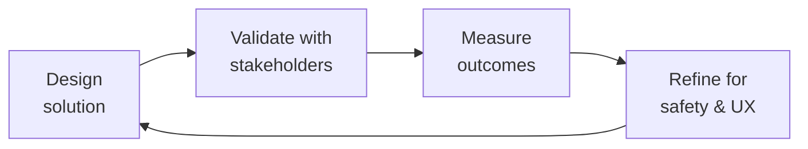

# Health Regulatory Submission
> **Portability target:** Spec-level (runs on Claude Code, Copilot, Gemini CLI, Codex, Cursor). No vendor-specific frontmatter fields.

Navigate FDA medical device regulation for software — determine if your health app is a medical device, classify it, choose the right regulatory pathway, and prepare pre-submission materials. Covers FDA SaMD framework, 510(k), De Novo, PMA, EU MDR/IVDR, and global harmonization.

## Route the Request

<!-- QUICK: 30s — auto-route first, then intent-route -->

### Auto-Route (No User Input Required)
Evaluate these file-system conditions in order. First match wins — jump immediately.

| # | Condition | Action |
|---|-----------|--------|
| A1 | `file_contains("*", "510\(k\)\|De.Novo\|PMA\|premarket.notification\|FDA.submission")` | This is your skill. Jump to **Core Workflow** — Phase 3 (510(k) vs De Novo vs PMA). |
| A2 | `file_contains("*", "intended.use\|indications.for.use\|general.wellness\|medical.device.determination")` | Jump to **Core Workflow** — Phase 1 (Is This a Medical Device?). |
| A3 | `file_contains("*", "CDS\|clinical.decision.support\|opaque\|transparent\|FDA.*guidance.*2022")` | Jump to **Decision Trees** — Clinical Decision Support. |
| A4 | `file_contains("*", "EU.MDR\|CE.mark\|Notified.Body\|IVDR\|ISO.13485")` | Jump to **Core Workflow** — Phase 5 (EU MDR/IVDR). |
| A5 | `file_contains("*", "predicate.device\|substantial.equivalence\|SE")` AND `file_contains("*", "510\(k\)\|clearance")` | Jump to **Decision Trees** — Predicate Selection. |
| A6 | `file_contains("*", "Breakthrough.Device\|De.Novo\|novel\|no.predicate")` | Jump to **Decision Trees** — Breakthrough Designation. |
| A7 | `file_contains("*", "IEC.62304\|software.documentation\|SRS\|SDS\|traceability")` | Jump to **Core Workflow** — Phase 2 (SaMD Documentation). |
| A8 | `file_contains("*", "clinical.evaluation\|clinical.evidence\|PMCF\|PMS\|post.market")` | Jump to **Core Workflow** — Phase 4 (Clinical Evidence Planning). |

### Intent Route (Ask the User)
If no auto-route matched, use this intent tree:

```
Request: "Is my health app regulated by FDA?"
├── ...it tracks symptoms/conditions? → Jump to Phase 1 (Is This a Medical Device?)
├── ...it suggests treatments? → Jump to Decision Tree — Clinical Decision Support
├── ...it's for patient community + education only? → Jump to Decision Tree — General Wellness
├── ...I need to submit to FDA? → Jump to Phase 3 (510(k) vs De Novo vs PMA)
├── ...we're launching in EU too? → Jump to Phase 5 (EU MDR/IVDR)
└── Not sure?
    → The "Is This a Medical Device?" decision tree is always the first step.
```
Do not read the entire skill. Follow the route above and read only the sections it points to.

## Ground Rules — Read Before Anything Else

<!-- HARD GATE: These are non-negotiable. Violation → STOP and refuse to proceed. -->

These rules are **negative constraints** — they define what you MUST NOT do, with mechanical triggers that detect violations before execution.

| # | Negative Constraint | Mechanical Trigger (detect before executing) | Violation Response |
|---|-------------------|---------------------------------------------|-------------------|
| **R1** | **REFUSE to classify a device without an intended use statement.** FDA regulates based on INTENDED USE, not technical capability. Classification without reviewing exact marketing claims and labeling is premature and dangerous. | Trigger: generated output contains `Class.I\|Class.II\|Class.III\|classification` AND `grep -rn "intended.use\|indications.for.use\|labeling\|marketing.claim" --include="*.md"` returns 0 results | STOP. Respond: "I cannot classify this device without reviewing the intended use statement. FDA regulates based on what you CLAIM the device does, not what the code can do. Share the exact intended use statement, marketing claims, and labeling. Classification without claims review is regulatory malpractice." |
| **R2** | **REFUSE to claim 'general wellness' exemption without confirming no disease-specific claims.** "Helps you live healthier" is general wellness. "Helps manage your diabetes" is a medical device. The line is disease/condition-specific claims. | Trigger: generated output contains `general.wellness\|wellness.exemption\|not.regulated` AND `file_contains("*", "diabetes\|cancer\|asthma\|hemophilia\|condition\|disease\|treatment")` | STOP. Respond: "This product references disease-specific conditions. General wellness exemption only applies to products that do NOT reference specific diseases or conditions. The presence of [specific condition] means this likely requires FDA regulatory determination. Do not claim wellness exemption." |
| **R3** | **REFUSE to select a 510(k) predicate without verifying same intended use.** Your predicate must have the SAME intended use. Different intended use = different predicate = invalid 510(k). | Trigger: generated output identifies a predicate device AND `grep -rn "intended.use\|indications" predicate/` shows different language than the subject device | STOP. Respond: "Predicate device [name] has intended use '[X]'. Your device's intended use is '[Y]'. These do not match. A 510(k) requires the SAME intended use as the predicate. Search the FDA 510(k) database for devices with your exact intended use statement." |
| **R4** | **DETECT and WARN when the term 'diagnose' appears in marketing without FDA clearance for diagnosis.** "Diagnose" and "detect" have specific regulatory meanings that trigger FDA oversight. | Trigger: generated marketing language contains `diagnose\|detects.*cancer\|detects.*disease\|screens.for` AND `grep -rn "510\(k\)\|PMA\|clearance\|approval" --include="*.md"` returns 0 results | WARN: "The term [diagnose/detect/screen] appears in marketing claims but no FDA clearance for diagnostic use is documented. Replace with 'track,' 'log,' or 'monitor' (for non-diagnostic purposes) OR obtain FDA clearance before using diagnostic claims. Diagnostic claims without clearance invite FDA enforcement." |
| **R5** | **DETECT and WARN about EU MDR Class I self-certification treated as trivial.** MDR Class I software still needs QMS (ISO 13485), Technical Documentation, Clinical Evaluation, PMS system, UDI, and EU Authorized Representative. | Trigger: generated output contains `Class.I\|self.certif` AND NOT `ISO.13485\|Technical.Documentation\|Clinical.Evaluation\|PMS\|UDI\|Authorized.Representative` within 30 lines | WARN: "MDR Class I self-certification is not 'no work.' Add to the checklist: ISO 13485 QMS, Technical Documentation, Clinical Evaluation Report, Post-Market Surveillance system, UDI assignment, and EU Authorized Representative appointment. Self-certification ≠ zero regulatory burden." |
| **R6** | **STOP and ASK before deferring regulatory to 'after Series A.'** Investors discount valuations 30-50% for unaddressed regulatory risk. Device determination should happen before fundraising. | Trigger: generated timeline shows `regulatory\|FDA\|submission` scheduled AFTER `fundraising\|Series.A\|investment` | STOP. Ask: "This timeline defers regulatory determination until after fundraising. Investors will discount your valuation 30-50% for unaddressed regulatory risk. Strongly recommend: complete device determination BEFORE Series A. A 2-hour regulatory counsel review (~$2-5K) now saves 30% of valuation later." |
| **R7** | **DETECT and WARN about enforcement discretion treated as permanent exemption.** FDA enforcement discretion can change with new guidance. Plan for regulation even if currently exempt. | Trigger: generated output contains `enforcement.discretion\|not.currently.enforced\|FDA.doesn't.regulate` AND NOT `contingency.plan\|if.regulated\|regulatory.pathway.reserve` | WARN: "Enforcement discretion is not a legal exemption. FDA can change guidance at any time. Add contingency: 'If enforcement discretion ends, our regulatory pathway will be [510(k)/De Novo]. Estimated timeline: 12 months. Budget reserve: $150K.' Plan for regulation even while exempt." |

## The Expert's Mindset

Master health regulatory submissions carry a dual responsibility: technical excellence AND human impact. Every decision ripples through to patient outcomes, regulatory standing, and clinical trust.

| Cognitive Bias | Mitigation |
|----------------|------------|
| **Automation complacency** — over-trusting systems in high-stakes contexts | Every automated output gets a qualified human review before clinical action |
| **False precision** — treating uncertain data as exact because it's in a database | Always report confidence intervals; never present a single number without its range |
| **Normalcy bias** — assuming things will continue as they always have | Build "what if this fails?" scenarios into every rollout plan |
| **Documentation asymmetry** — over-documenting the routine, under-documenting the exceptions | Exceptions are the most valuable documentation; they teach the model, not just the rule |

### What Masters Know That Others Don't
- **The difference between statistical significance and clinical significance** — a p-value is not a treatment decision
- **Where the regulatory landmines are buried** — the 3 things that will trigger an audit versus the 30 things that won't
- **That patient experience and clinical accuracy are not trade-offs** — bad UX causes medical errors; good UX prevents them

### When to Break Your Own Rules
- **Escalate for safety, not for process.** If patient safety is at risk, bypass the chain of command.
- **Simplify for the patient.** Clinical precision means nothing if the patient can't understand or act on it.

## Operating at Different Levels

| Level | Scope | You... |
|-------|-------|--------|
| **L1** | Single deliverable | Execute defined procedures under supervision; follow protocols exactly |
| **L2** | Feature / study | Own a feature or study component; work within established regulatory frameworks |
| **L3** | System / program | Design systems that balance clinical needs, regulatory requirements, and technical constraints |
| **L4** | Product / therapeutic area | Define regulatory strategy; shape clinical development approach; influence industry guidance |
| **L5** | Industry / public health | Shape regulatory frameworks; define standards of care through evidence generation |

**Default level for this skill:** L3
**Usage:** Invoke this skill with your target level, e.g., "as an L3 health regulatory submission, design..."

For full level definitions, see `skills/00-framework/skill-levels/SKILL.md`.

## When to Use

<!-- QUICK: 30s — scan the bullet list to decide -->

- Building a health app and need to know if the FDA will regulate it
- Adding a feature (symptom checker, treatment tracker, AI recommendation) — re-evaluate regulatory status
- Preparing for fundraising — investors will ask about FDA pathway
- Expanding from US to EU — MDR/IVDR classification needed
- Received an FDA inquiry or warning letter — need to assess compliance
- Partnering with pharma — they'll require regulatory strategy documentation
- Clinical trial planning — IDE requirements for investigational devices

## Decision Trees

<!-- STANDARD: 3min -->

### Is This a Medical Device? (FDA SaMD Determination)

```
Does your software...
├── Analyze medical data to diagnose, treat, cure, mitigate, or prevent disease?
│   ├── YES → Medical Device (SaMD) 🔴 → Classify next
│   └── NO → Continue
├── Provide specific treatment/dosing recommendations based on patient data?
│   ├── YES, without transparency → Medical Device (CDS Software) 🔴 → Classify next
│   ├── YES, with full transparency → Possibly regulated → Consult FDA CDS Guidance
│   └── NO → Continue
├── Calculate risk scores for specific diseases?
│   ├── YES → Medical Device (SaMD) 🔴 → Classify next
│   └── NO → Continue
├── Track/manage a specific medical condition?
│   ├── YES → Likely Medical Device 🔴 → Consult regulatory counsel
│   └── NO → Continue
└── General wellness, fitness, lifestyle, or education only?
    ├── YES, with no disease claims → NOT a medical device 🟢
    └── Claims relate to a specific disease → Medical Device 🔴
```

### FDA Classification Decision Tree

```
What level of risk does the device pose to patients?
├── LOW (general wellness tools, educational content)
│   → Class I (mostly exempt from 510(k))
│   → Examples: meditation apps, general health education, simple medication reminders
│   → 510(k): Usually NOT required
│   → GMP/QSR: General Controls apply
│
├── MODERATE (diagnostic assistance, treatment management)
│   → Class II (510(k) typically required)
│   → Examples: bleed-log with treatment timing, symptom trackers for specific conditions
│   → 510(k): Required unless exempt
│   → Predicate device must exist
│   → If no predicate → De Novo pathway
│
└── HIGH (diagnosis without clinician review, life-sustaining decisions)
    → Class III (PMA required)
    → Examples: AI that autonomously diagnoses, treatment recommendation without human review
    → PMA: Clinical trials required
    → De Novo may be possible if novel but moderate risk
```

### Regulatory Pathway Selection

```
Starting point...
├── Class I → Establishment Registration + Device Listing → General Controls
├── Class II, has predicate → 510(k) Pre-market Notification (~6-12 months)
├── Class II, no predicate → De Novo Classification Request (~12-18 months)
├── Class III → Pre-market Approval (PMA) (~18-36 months, clinical trials)
├── Breakthrough Device? → Expedited review + priority → Apply for designation first
└── Low-risk, uncertain → Pre-submission Meeting with FDA → Get feedback before committing
```

## Core Workflow

<!-- STANDARD: 5min -->

### Phase 1: Device Determination (~1 week)

Document your software's intended use and indications for use. This is the most important document in your regulatory strategy.

```markdown

## Cross-Skill Coordination

<!-- STANDARD: 3min -->

| Upstream Skill | What to Expect | Communication Trigger |
|---------------|----------------|---------------------|
| `product-manager` | Product vision, feature roadmap, intended use statements | When defining product features — flag any that trigger FDA review |
| `compliance-officer` | HIPAA framework, covered entity determination, privacy requirements | When regulatory strategy requires HIPAA alignment |
| `clinical-informatics-specialist` | Clinical data standards, interoperability requirements for regulated devices | When preparing technical documentation for FDA submission |
| `legal-advisor` | Legal risk assessment, liability analysis, FDA enforcement history | When determining whether to submit or seek enforcement discretion opinion |
| `regulatory-specialist` | Regulatory strategy, submission preparation, FDA communication templates | When preparing 510(k), De Novo, or PMA submissions |

| Downstream Skill | What to Deliver | Communication Trigger |
|-----------------|-----------------|---------------------|
| `compliance-officer` | Device classification, regulatory pathway, QMS requirements | When building compliance program around regulated product |
| `product-manager` | Regulatory constraints on features, claims, and launch timeline | When regulatory pathway affects product roadmap |
| `legal-advisor` | Classification determination, submission timeline, EU/global requirements | When legal needs to assess regulatory risk |
| `regulatory-specialist` | Device classification, predicate identification, submission strategy | When preparing specific regulatory submissions |

## Proactive Triggers

<!-- STANDARD: 2min — surface these WITHOUT being asked -->

- **Marketing claims mention a disease** → "Helps manage hemophilia" vs "Tracks your health." The first triggers FDA review. Flag any disease-specific language in marketing copy. 🔴
- **New feature automates a clinical decision** → A symptom checker that says "based on your log, consider factor infusion now" is CDS software. Flag before implementation. 🔴
- **AI/ML outputs not independently reviewable** → If users can't see WHY the AI made a recommendation, it's regulated CDS. Flag opaque algorithms. 🔴
- **EU launch planned within 12 months** → MDR classification required before commercialization. Notified Body lead times are 6-12 months. Start now. 🟡
- **Investor due diligence approaching** → VCs will ask: "Is this FDA regulated? What's your pathway?" Have the device determination document ready. 🟡
- **Pharma partnership discussion** → Pharma will require regulatory strategy before signing. They won't touch an unclassified device. 🟠
- **Competitor received FDA clearance** → If a similar product got 510(k) clearance, you likely need one too. Flag for competitive analysis. 🟠

## What Good Looks Like

<!-- STANDARD: 3min -->

You have a dated, signed intended use statement that clearly defines what your software does and doesn't do. Your device classification is documented with supporting rationale. If regulated, you've selected a pathway (510(k), De Novo, or PMA) and have a realistic timeline and budget. Your QMS (ISO 13485) is implemented proportionate to your device class. Software documentation follows IEC 62304. Your risk management file (ISO 14971) is living — updated with every feature change. You have a clinical evidence strategy tailored to your device risk. Before adding any new feature, the team asks: "Does this change our intended use?" Investors, partners, and auditors can review your regulatory strategy in a single document and understand it without a medical degree.

## Deliberate Practice



| Level | Practice | Frequency |
|-------|----------|-----------|
| **Novice** | Shadow a clinician or patient for a day; document every moment of friction in their workflow | Quarterly |
| **Competent** | Review a past project that had a safety or compliance issue; map the chain of decisions that led there | Monthly |
| **Expert** | Design a solution under 3 conflicting regulatory regimes (e.g., FDA, EMA, PMDA); identify where they diverge | Quarterly |
| **Master** | Contribute to industry guidelines or regulatory frameworks; move from following rules to shaping them | Annually |

**The One Highest-Leverage Activity:** Every project post-mortem must include a "patient impact" section. If you can't trace your work to a patient outcome, you're building in the dark.

## Intended Use Statement (Draft Template)

[Software Name] is intended to [clinical purpose] for [target population]
by [mechanism of action/technology description].

## Indications for Use

[Software Name] is indicated for use by [user type: patients/HCPs/both]
for [specific clinical scenario, disease, condition].

## Non-Regulated Claims

[Software Name] also provides [wellness/educational/non-regulated features]
that are NOT intended to diagnose, treat, cure, mitigate, or prevent any disease.

## RED FLAGS (review these with regulatory counsel)

- Does it detect/predict a specific disease? → likely medical device
- Does it recommend specific treatments/doses? → likely medical device
- Does it replace clinician judgment? → definitely medical device
- Does it connect to a medical device for control? → definitely medical device
```

### Phase 2: Classification (~2 weeks)

Determine device class and identify predicate devices (for 510(k)):

```bash
# Search FDA classification database
open https://www.accessdata.fda.gov/scripts/cdrh/cfdocs/cfPCD/classification.cfm

# Search for predicate devices (510(k) database)
open https://www.accessdata.fda.gov/scripts/cdrh/cfdocs/cfpmn/pmn.cfm

# Search De Novo classification orders
open https://www.accessdata.fda.gov/scripts/cdrh/cfdocs/cfpmn/denovo.cfm
```

**Classification factors:**
- Does it drive or influence clinical management? → Class II minimum
- Can a wrong result cause serious harm? → Class II or III
- Is it non-invasive with low risk? → Class I possible
- Does it use AI/ML with opaque reasoning? → FDA currently developing specific guidance

### Phase 3: 510(k) Preparation (~6-12 months)

If 510(k) pathway (most common for health apps):

```
1. Identify predicate device(s) — legally marketed device with same intended use
2. Prepare substantial equivalence comparison table
3. Software documentation (per IEC 62304):
   - Software development plan
   - Software requirements specification (SRS)
   - Architecture design chart
   - Software design specification (SDS)
   - Traceability matrix (requirements → design → tests)
   - Risk management file (ISO 14971)
4. Verification & validation testing:
   - Unit, integration, system testing
   - Usability testing (IEC 62366)
   - Clinical performance testing (if needed)
5. Labeling:
   - Instructions for Use
   - Package labeling
   - Patient labeling (if applicable)
6. Submit via eSTAR (electronic submission template)
7. FDA review: 90 days (may extend with additional information requests)
```

### Phase 4: De Novo (~12-18 months)

If no predicate device exists:

```
1. Confirm no legally marketed predicate exists
2. Prepare De Novo classification request:
   - Detailed device description
   - Summary of non-clinical and clinical testing
   - Proposed classification (Class I or II)
   - Proposed special controls
   - Benefit-risk analysis
3. Pre-submission meeting with FDA (recommended)
4. Submit De Novo request
5. FDA review: 150 days target
6. If granted: device is now reclassified, becomes a predicate for future 510(k)s
```

### Phase 5: EU MDR / IVDR (~12-24 months)

```markdown

## EU Classification (Annex VIII, MDR)

Is your health software...
├── Used for diagnosis or therapeutic decisions?
│   → Class IIa minimum
├── Could cause serious deterioration of health?
│   → Class IIb
├── Could cause death or irreversible deterioration?
│   → Class III
└── General wellness, fitness, no medical purpose?
    → NOT a medical device under MDR (but verify with Notified Body)

## Key differences from FDA:

- ALL medical devices need a Notified Body (except Class I, self-certified)
- MDR requires Clinical Evaluation Report (CER) for all classes
- Post-Market Surveillance (PMS) and Periodic Safety Update Report (PSUR) required
- Unique Device Identifier (UDI) mandatory
- Person Responsible for Regulatory Compliance (PRRC) required (Article 15)

## Steps:

1. Classify per Annex VIII
2. Select Notified Body (limited capacity — engage early)
3. Implement Quality Management System (ISO 13485)
4. Prepare Technical Documentation (Annex II/III)
5. Clinical Evaluation (MEDDEV 2.7/1 Rev.4 or MDR Article 61 + Annex XIV)
6. Notified Body audit → CE Mark → Register in EUDAMED
```

### Phase 6: Breakthrough Device Designation (~3 months)

If your device offers more effective treatment/diagnosis for life-threatening or irreversibly debilitating conditions:

```markdown

## Breakthrough Device Criteria (FDA):

1. Device provides for more effective treatment or diagnosis of
   life-threatening or irreversibly debilitating human disease or condition
2. No approved alternatives exist OR device offers significant advantages
   over existing approved alternatives
3. Device availability is in the best interest of patients

## Benefits if granted:

- Prioritized FDA review
- Senior management involvement
- Sprint review milestones
- More interactive review process
- Reduced PMA/De Novo review times
```

## References

Detailed reference material loaded on demand:

- **Anti-Patterns**: See [anti-patterns.md](references/anti-patterns.md)
- **Best Practices**: See [best-practices.md](references/best-practices.md)
- **Calibration — How to Know Your Level**: See [calibration.md](references/calibration.md)
- **Production Checklist**: See [checklist.md](references/checklist.md)
- **Error Decoder**: See [error-decoder.md](references/error-decoder.md)
- **Footguns**: See [footguns.md](references/footguns.md)
- **Scale Depth: Solo → Small → Medium → Enterprise**: See [scale-depth.md](references/scale-depth.md)

