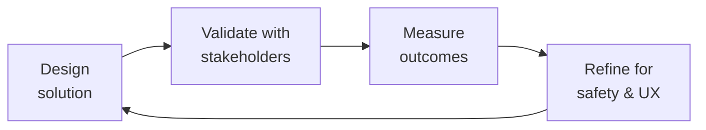

# Health Regulatory Submission
> **Portability target:** Spec-level (runs on Claude Code, Copilot, Gemini CLI, Codex, Cursor). No vendor-specific frontmatter fields.

Navigate FDA medical device regulation for software — determine if your health app is a medical device, classify it, choose the right regulatory pathway, and prepare pre-submission materials. Covers FDA SaMD framework, 510(k), De Novo, PMA, EU MDR/IVDR, and global harmonization.

## Route the Request

<!-- QUICK: 30s — auto-route first, then intent-route -->

### Auto-Route (No User Input Required)
Evaluate these file-system conditions in order. First match wins — jump immediately.

| # | Condition | Action |
|---|-----------|--------|
| A1 | `file_contains("*", "510\(k\)\|De.Novo\|PMA\|premarket.notification\|FDA.submission")` | This is your skill. Jump to **Core Workflow** — Phase 3 (510(k) vs De Novo vs PMA). |
| A2 | `file_contains("*", "intended.use\|indications.for.use\|general.wellness\|medical.device.determination")` | Jump to **Core Workflow** — Phase 1 (Is This a Medical Device?). |
| A3 | `file_contains("*", "CDS\|clinical.decision.support\|opaque\|transparent\|FDA.*guidance.*2022")` | Jump to **Decision Trees** — Clinical Decision Support. |
| A4 | `file_contains("*", "EU.MDR\|CE.mark\|Notified.Body\|IVDR\|ISO.13485")` | Jump to **Core Workflow** — Phase 5 (EU MDR/IVDR). |
| A5 | `file_contains("*", "predicate.device\|substantial.equivalence\|SE")` AND `file_contains("*", "510\(k\)\|clearance")` | Jump to **Decision Trees** — Predicate Selection. |
| A6 | `file_contains("*", "Breakthrough.Device\|De.Novo\|novel\|no.predicate")` | Jump to **Decision Trees** — Breakthrough Designation. |
| A7 | `file_contains("*", "IEC.62304\|software.documentation\|SRS\|SDS\|traceability")` | Jump to **Core Workflow** — Phase 2 (SaMD Documentation). |
| A8 | `file_contains("*", "clinical.evaluation\|clinical.evidence\|PMCF\|PMS\|post.market")` | Jump to **Core Workflow** — Phase 4 (Clinical Evidence Planning). |

### Intent Route (Ask the User)
If no auto-route matched, use this intent tree:

```
Request: "Is my health app regulated by FDA?"
├── ...it tracks symptoms/conditions? → Jump to Phase 1 (Is This a Medical Device?)
├── ...it suggests treatments? → Jump to Decision Tree — Clinical Decision Support
├── ...it's for patient community + education only? → Jump to Decision Tree — General Wellness
├── ...I need to submit to FDA? → Jump to Phase 3 (510(k) vs De Novo vs PMA)
├── ...we're launching in EU too? → Jump to Phase 5 (EU MDR/IVDR)
└── Not sure?
    → The "Is This a Medical Device?" decision tree is always the first step.
```
Do not read the entire skill. Follow the route above and read only the sections it points to.

## Ground Rules — Read Before Anything Else

<!-- HARD GATE: These are non-negotiable. Violation → STOP and refuse to proceed. -->

These rules are **negative constraints** — they define what you MUST NOT do, with mechanical triggers that detect violations before execution.

| # | Negative Constraint | Mechanical Trigger (detect before executing) | Violation Response |
|---|-------------------|---------------------------------------------|-------------------|
| **R1** | **REFUSE to classify a device without an intended use statement.** FDA regulates based on INTENDED USE, not technical capability. Classification without reviewing exact marketing claims and labeling is premature and dangerous. | Trigger: generated output contains `Class.I\|Class.II\|Class.III\|classification` AND `grep -rn "intended.use\|indications.for.use\|labeling\|marketing.claim" --include="*.md"` returns 0 results | STOP. Respond: "I cannot classify this device without reviewing the intended use statement. FDA regulates based on what you CLAIM the device does, not what the code can do. Share the exact intended use statement, marketing claims, and labeling. Classification without claims review is regulatory malpractice." |
| **R2** | **REFUSE to claim 'general wellness' exemption without confirming no disease-specific claims.** "Helps you live healthier" is general wellness. "Helps manage your diabetes" is a medical device. The line is disease/condition-specific claims. | Trigger: generated output contains `general.wellness\|wellness.exemption\|not.regulated` AND `file_contains("*", "diabetes\|cancer\|asthma\|hemophilia\|condition\|disease\|treatment")` | STOP. Respond: "This product references disease-specific conditions. General wellness exemption only applies to products that do NOT reference specific diseases or conditions. The presence of [specific condition] means this likely requires FDA regulatory determination. Do not claim wellness exemption." |
| **R3** | **REFUSE to select a 510(k) predicate without verifying same intended use.** Your predicate must have the SAME intended use. Different intended use = different predicate = invalid 510(k). | Trigger: generated output identifies a predicate device AND `grep -rn "intended.use\|indications" predicate/` shows different language than the subject device | STOP. Respond: "Predicate device [name] has intended use '[X]'. Your device's intended use is '[Y]'. These do not match. A 510(k) requires the SAME intended use as the predicate. Search the FDA 510(k) database for devices with your exact intended use statement." |
| **R4** | **DETECT and WARN when the term 'diagnose' appears in marketing without FDA clearance for diagnosis.** "Diagnose" and "detect" have specific regulatory meanings that trigger FDA oversight. | Trigger: generated marketing language contains `diagnose\|detects.*cancer\|detects.*disease\|screens.for` AND `grep -rn "510\(k\)\|PMA\|clearance\|approval" --include="*.md"` returns 0 results | WARN: "The term [diagnose/detect/screen] appears in marketing claims but no FDA clearance for diagnostic use is documented. Replace with 'track,' 'log,' or 'monitor' (for non-diagnostic purposes) OR obtain FDA clearance before using diagnostic claims. Diagnostic claims without clearance invite FDA enforcement." |
| **R5** | **DETECT and WARN about EU MDR Class I self-certification treated as trivial.** MDR Class I software still needs QMS (ISO 13485), Technical Documentation, Clinical Evaluation, PMS system, UDI, and EU Authorized Representative. | Trigger: generated output contains `Class.I\|self.certif` AND NOT `ISO.13485\|Technical.Documentation\|Clinical.Evaluation\|PMS\|UDI\|Authorized.Representative` within 30 lines | WARN: "MDR Class I self-certification is not 'no work.' Add to the checklist: ISO 13485 QMS, Technical Documentation, Clinical Evaluation Report, Post-Market Surveillance system, UDI assignment, and EU Authorized Representative appointment. Self-certification ≠ zero regulatory burden." |
| **R6** | **STOP and ASK before deferring regulatory to 'after Series A.'** Investors discount valuations 30-50% for unaddressed regulatory risk. Device determination should happen before fundraising. | Trigger: generated timeline shows `regulatory\|FDA\|submission` scheduled AFTER `fundraising\|Series.A\|investment` | STOP. Ask: "This timeline defers regulatory determination until after fundraising. Investors will discount your valuation 30-50% for unaddressed regulatory risk. Strongly recommend: complete device determination BEFORE Series A. A 2-hour regulatory counsel review (~$2-5K) now saves 30% of valuation later." |
| **R7** | **DETECT and WARN about enforcement discretion treated as permanent exemption.** FDA enforcement discretion can change with new guidance. Plan for regulation even if currently exempt. | Trigger: generated output contains `enforcement.discretion\|not.currently.enforced\|FDA.doesn't.regulate` AND NOT `contingency.plan\|if.regulated\|regulatory.pathway.reserve` | WARN: "Enforcement discretion is not a legal exemption. FDA can change guidance at any time. Add contingency: 'If enforcement discretion ends, our regulatory pathway will be [510(k)/De Novo]. Estimated timeline: 12 months. Budget reserve: $150K.' Plan for regulation even while exempt." |
| **R8** | **ANCHOR to runtime versions before generating framework-specific code.** Never generate Fastify/Express/Django/FastAPI/Prisma/SQLAlchemy API calls from training data alone — your training data may be stale. | Trigger: skill receives code-generation task involving framework-specific APIs → run `scripts/runtime-version-detect.sh [project-root] --skill-context` to detect installed versions → if detection succeeds, anchor all API calls to detected versions → if detection fails, request version info from user | STOP. Respond: "Detected: {runtime}@{version}, {frameworks}@{versions}. Anchoring all API calls to these versions. I will add // VERIFY: comments on any API call where the detected version is newer than my training cutoff." |
| **R9** | **RUN the ROI Gate before any non-emergency code change.** Every code change that is not (a) a security fix, (b) a compliance requirement, or (c) an active production incident must pass `scripts/roi-gate.sh`. If the gate returns negative, refuse to write the code. | Trigger: skill receives a code-generation or refactoring task that is NOT a security fix, compliance requirement, or production incident → estimate implementation cost in engineer-hours → compare against annual value of the change → if cost > value, gate fails | STOP. Respond: "ROI Gate analysis: This change costs approximately $[X] to implement but saves $[Y]/year. Payback period: [N] years. If payback > 2 years, I recommend declining this work. See `scripts/roi-gate.sh` for the full formula." |


- **Admit uncertainty — never fabricate.** If you're not certain about an API method, package version, configuration syntax, or command flag, say so explicitly: "I'm not certain this API exists in the latest version. Check the official docs at [URL]." Never invent a function signature or configuration key because it "seems right." Hallucinated code costs hours of debugging.
- **Flag your knowledge cutoff.** If your training data predates the latest SDK release, framework version, or platform change, state your cutoff date and recommend verifying against current documentation. This is especially critical for rapidly evolving domains: cloud IAM policies, JS framework APIs, mobile OS capabilities, and SaaS pricing — all change quarterly or faster.
- **Never guess security configurations.** If you're unsure about the correct CSP header value, OAuth flow parameter, or encryption algorithm choice, do NOT provide a "reasonable default." Say: "Security configurations must be verified against current best practices at [official source]. I cannot provide a definitive answer without current documentation."
- **Distinguish between what you know and what you infer.** Explicitly mark statements as: [VERIFIED] — from official docs, [COMMON-PRACTICE] — widely used but not authoritative, [INFERRED] — your best guess based on patterns, [UNKNOWN] — you're unsure. This helps the user calibrate trust in your output.
## The Expert's Mindset

Master health regulatory submissions carry a dual responsibility: technical excellence AND human impact. Every decision ripples through to patient outcomes, regulatory standing, and clinical trust.

| Cognitive Bias | Mitigation |
|----------------|------------|
| **Automation complacency** — over-trusting systems in high-stakes contexts | Every automated output gets a qualified human review before clinical action |
| **False precision** — treating uncertain data as exact because it's in a database | Always report confidence intervals; never present a single number without its range |
| **Normalcy bias** — assuming things will continue as they always have | Build "what if this fails?" scenarios into every rollout plan |
| **Documentation asymmetry** — over-documenting the routine, under-documenting the exceptions | Exceptions are the most valuable documentation; they teach the model, not just the rule |

### What Masters Know That Others Don't
- **The difference between statistical significance and clinical significance** — a p-value is not a treatment decision
- **Where the regulatory landmines are buried** — the 3 things that will trigger an audit versus the 30 things that won't
- **That patient experience and clinical accuracy are not trade-offs** — bad UX causes medical errors; good UX prevents them

### When to Break Your Own Rules
- **Escalate for safety, not for process.** If patient safety is at risk, bypass the chain of command.
- **Simplify for the patient.** Clinical precision means nothing if the patient can't understand or act on it.

## Operating at Different Levels

| Level | Scope | You... |
|-------|-------|--------|
| **L1** | Single deliverable | Execute defined procedures under supervision; follow protocols exactly |
| **L2** | Feature / study | Own a feature or study component; work within established regulatory frameworks |
| **L3** | System / program | Design systems that balance clinical needs, regulatory requirements, and technical constraints |
| **L4** | Product / therapeutic area | Define regulatory strategy; shape clinical development approach; influence industry guidance |
| **L5** | Industry / public health | Shape regulatory frameworks; define standards of care through evidence generation |

**Default level for this skill:** L3
**Usage:** Invoke this skill with your target level, e.g., "as an L3 health regulatory submission, design..."

For full level definitions, see `skills/00-framework/skill-levels/SKILL.md`.

## When to Use

<!-- QUICK: 30s — scan the bullet list to decide -->

- Building a health app and need to know if the FDA will regulate it
- Adding a feature (symptom checker, treatment tracker, AI recommendation) — re-evaluate regulatory status
- Preparing for fundraising — investors will ask about FDA pathway
- Expanding from US to EU — MDR/IVDR classification needed
- Received an FDA inquiry or warning letter — need to assess compliance
- Partnering with pharma — they'll require regulatory strategy documentation
- Clinical trial planning — IDE requirements for investigational devices

## Decision Trees
**(QUICK)**

<!-- STANDARD: 3min -->

### Is This a Medical Device? (FDA SaMD Determination)

```
Does your software...
├── Analyze medical data to diagnose, treat, cure, mitigate, or prevent disease?
│   ├── YES → Medical Device (SaMD) 🔴 → Classify next
│   └── NO → Continue
├── Provide specific treatment/dosing recommendations based on patient data?
│   ├── YES, without transparency → Medical Device (CDS Software) 🔴 → Classify next
│   ├── YES, with full transparency → Possibly regulated → Consult FDA CDS Guidance
│   └── NO → Continue
├── Calculate risk scores for specific diseases?
│   ├── YES → Medical Device (SaMD) 🔴 → Classify next
│   └── NO → Continue
├── Track/manage a specific medical condition?
│   ├── YES → Likely Medical Device 🔴 → Consult regulatory counsel
│   └── NO → Continue
└── General wellness, fitness, lifestyle, or education only?
    ├── YES, with no disease claims → NOT a medical device 🟢
    └── Claims relate to a specific disease → Medical Device 🔴
```

### FDA Classification Decision Tree

```
What level of risk does the device pose to patients?
├── LOW (general wellness tools, educational content)
│   → Class I (mostly exempt from 510(k))
│   → Examples: meditation apps, general health education, simple medication reminders
│   → 510(k): Usually NOT required
│   → GMP/QSR: General Controls apply
│
├── MODERATE (diagnostic assistance, treatment management)
│   → Class II (510(k) typically required)
│   → Examples: bleed-log with treatment timing, symptom trackers for specific conditions
│   → 510(k): Required unless exempt
│   → Predicate device must exist
│   → If no predicate → De Novo pathway
│
└── HIGH (diagnosis without clinician review, life-sustaining decisions)
    → Class III (PMA required)
    → Examples: AI that autonomously diagnoses, treatment recommendation without human review
    → PMA: Clinical trials required
    → De Novo may be possible if novel but moderate risk

```

### Regulatory Pathway Selection

```
Starting point...
├── Class I → Establishment Registration + Device Listing → General Controls
├── Class II, has predicate → 510(k) Pre-market Notification (~6-12 months)
├── Class II, no predicate → De Novo Classification Request (~12-18 months)
├── Class III → Pre-market Approval (PMA) (~18-36 months, clinical trials)
├── Breakthrough Device? → Expedited review + priority → Apply for designation first
└── Low-risk, uncertain → Pre-submission Meeting with FDA → Get feedback before committing

```

## Core Workflow
**(STANDARD)**

<!-- STANDARD: 5min -->

### Phase 1: Device Determination (~1 week)

Document your software's intended use and indications for use. This is the most important document in your regulatory strategy.

```markdown


## Error Decoder — War Stories from the Trenches

**(STANDARD)**

When this domain goes wrong, it goes wrong in predictable ways. Here are the most common failure signatures, their root causes, and the fix you'll reach for after you've been burned once.

| Symptom | Root Cause | Fix | Lesson |
|---------|-----------|-----|--------|
| FDA 510(k) submission rejected because the predicate device comparison uses a device that was recalled 2 years ago | The regulatory team identified a predicate device in 2020 but never re-checked its FDA status before submission. The predicate was voluntarily recalled for safety issues in 2022. | Verify predicate device status within 30 days of submission: check the FDA 510(k) database for recalls, withdrawals, and adverse events. Maintain a predicate watchlist with quarterly status checks. Have 2-3 backup predicates identified. | Regulatory status changes. A valid predicate in 2020 may be recalled in 2024. Always re-verify immediately before submission. |
| eCTD submission fails validation at FDA gateway because the XML backbone references a DTD version that was deprecated 6 months ago | The submission team used last year's eCTD template. The FDA updated the DTD specification in the interim and the gateway's validator rejects old versions. | Subscribe to FDA eCTD update notifications. Maintain a pre-submission checklist that includes DTD version verification against the current FDA specification page. Run the FDA's free eCTD validator locally before uploading. | Regulatory submission templates have expiration dates. Always download the current version from the agency's website, not your shared drive. |
| Clinical evaluation report (CER) rejected because it cites 3 studies by authors with undisclosed financial ties to a competitor | The literature search captured all relevant studies but no one screened for conflicts of interest. Two of the 3 cited studies were funded by a company whose device was recalled. | Add a conflict-of-interest screen to the literature review protocol: check ClinicalTrials.gov for sponsor information, search for author disclosures, and flag studies funded by competitors with adverse regulatory history. | Under EU MDR, "state of the art" means impartial evidence. Citing competitor-funded studies without disclosure undermines your CER's credibility. |
| IVDR technical documentation rejected because performance evaluation doesn't include data from the intended patient population | The clinical evidence was collected from healthy volunteers at an academic medical center. The intended use population includes immunocompromised patients and pediatric cases. | Verify that clinical evidence demographics match the intended use population before writing the performance evaluation. If gaps exist, either narrow your intended use statement or collect additional data. Submit a gap analysis table showing evidence-population alignment. | Your intended use statement drives your evidence requirements. If your evidence doesn't cover the population you claim to serve, either collect more evidence or narrow your claim. |
| Submission deadline missed because the notified body's query arrived during summer holiday and the 14-day response window expired | The notified body sent 12 clarification questions on July 28. The entire regulatory team was on PTO until August 15. The clock ran out and the submission was administratively withdrawn. | Maintain regulatory coverage year-round. Identify at least 2 authorized signatories with no overlapping PTO during submission windows. Set up an out-of-office escalation protocol: notified body emails get auto-forwarded to a coverage person. | Notified bodies don't care about your vacation schedule. The response clock starts when they send the question, not when you read it. |
| Post-market surveillance report flagged by competent authority because adverse event trending used the wrong denominator | The PMS report calculated adverse event rates as events per units sold. The competent authority expects events per patient-years of use — devices sold 5 years ago have 5x the exposure of devices sold this year. | Use patient-years (or device-years) as the denominator for adverse event rates in PMS reports. Document the exposure calculation methodology. If exposure data is incomplete, state the limitation and provide a worst-case sensitivity analysis. | AE rate calculation is not simple division. Time-at-risk matters — a device implanted for 5 years has 5x more opportunity to fail than one implanted for 1 year. |

## Best Practices
**(STANDARD)**

1. **Start every regulatory engagement with a written, dated intended use statement.** FDA regulates based on INTENDED USE, not technical capability. The intended use statement should specify: clinical purpose, target population, mechanism of action, and user type (patient, HCP, or both). Without this document, classification is impossible — and classification without reviewing claims is regulatory malpractice. Update the intended use statement after every feature change that could affect clinical claims.

2. **Submit a 513(g) Request for Classification for novel devices before committing to a pathway.** For devices that don't cleanly fit existing classification regulations, a 513(g) provides a binding FDA classification determination for a modest fee (~$5K-$10K). This de-risks the regulatory strategy before investing in a 510(k) or De Novo. Expect 60-90 days for FDA response.

3. **Select predicate devices with identical intended use, not similar technology.** A 510(k) requires the SAME intended use as the predicate — technology can differ if it doesn't raise new safety/effectiveness questions. Different intended use = different predicate = invalid 510(k). Search the FDA 510(k) database with exact intended use language, not product category.

4. **Write the Statistical Analysis Plan (SAP) before enrolling the first patient.** Pre-specify primary and secondary endpoints, analysis methods, handling of missing data, multiplicity adjustments, and subgroup analyses. Date-stamp and archive the SAP. Post-hoc selection of favorable methods is p-hacking and FDA will reject the submission. Have the SAP reviewed by an independent statistician blinded to the data.

5. **Prepare clinical evidence proportionate to device risk — not minimum viable data.** Class I devices may need only bench testing; Class II typically requires analytical validation + clinical performance data; Class III demands pivotal clinical trials. Over-collecting costs money; under-collecting costs the submission. Map each claim in the intended use statement to the clinical evidence supporting it.

6. **Validate eCTD submissions on a Linux environment before filing.** FDA's review systems run on Linux. Hyperlinks using Windows-style backslashes (`\`) break. SAS transport files (`.xpt`) have 8-character variable name limits. Run the FDA eCTD Validator and test all hyperlinks on a Linux VM before the submission date.

7. **Engage a Notified Body for EU MDR at least 12 months before planned CE marking.** Notified Body capacity is severely limited post-MDR transition — some have 12-18 month waitlists. Designation scope (which device types they can certify) is narrow. Contact 3+ Notified Bodies simultaneously, confirm they have capacity and scope for your device class, and budget for 6-12 months of review after submission.

8. **Maintain a living risk management file (ISO 14971) updated with every design change.** The risk management file is not a one-time submission document — it's a living record of hazards, harms, risk controls, and residual risk. Every software update, new feature, or post-market complaint should trigger a risk file review. FDA and Notified Body auditors will review the risk file for evidence of continuous risk management, not just initial assessment.

9. **Implement a promotional review committee before the first marketing claim goes public.** Establish a review committee (regulatory, legal, marketing) that reviews ALL external communications against cleared indications. Create a "claims matrix" mapping every marketing claim to exact clearance language. FDA Warning Letters for off-label promotion are public, permanently damaging, and can trigger consent decrees.

10. **Plan for post-market surveillance (PMS) from Day 1 of commercialization, not after launch.** FDA requires PMS for PMA devices; EU MDR requires PMS for all classes. Define PMS data sources (complaints, literature, registries, social media monitoring), analysis frequency (PSUR/PMSR schedule), and signal detection thresholds. PMS is not passive monitoring — it's an active system for detecting safety signals before they become recalls.

## Error Recovery
**(STANDARD)**

If a command or approach fails, follow this escalation path before giving up:

| Symptom | First Action | If That Fails | Last Resort |
|---------|-------------|---------------|-------------|
| Tool/command not found | Check installation: `which [tool]` or `[tool] --version`. Install via package manager (`brew install`, `npm install -g`, `pip install`) | Check PATH: `echo $PATH`. Verify the tool binary is in a PATH directory. Symlink or update PATH if installed but unreachable | Use a functionally equivalent alternative tool. If `rg` is unavailable, use `grep -r`. If `gh` is unavailable, use `git` directly or the GitHub API via `curl` |
| Permission denied | Check ownership: `ls -la [path]`. Fix with `chmod` or `sudo` if appropriate. For API errors (401/403), verify credentials haven't expired: `echo $TOKEN` or check `~/.netrc` | Refresh credentials: re-authenticate with the service. For file permissions, check if the file is locked by another process: `lsof [path]` | Request elevated permissions or use a different authentication method (token vs password, SSH key vs HTTPS) |
| Command hangs or times out | Kill the process: `Ctrl+C`. Re-run with a timeout: `timeout 30 [command]` or `gtimeout` on macOS. Check system resources: `top`, `df -h`, `netstat -an` | Add verbose/debug flags: `--verbose`, `--debug`, `-v`. Check logs: `tail -f [logfile]`. Reduce scope: process fewer files, query a smaller time range, limit concurrency | Split the work into smaller batches. Implement a retry loop with exponential backoff (1s, 2s, 4s, 8s). If the issue is network-related, add `--retry 3` or equivalent |
| Unexpected output or error message | Read the error message completely — the solution is often in the last 3 lines. Search the exact error: `grep -r "[error text]"` in the repo to find prior occurrences | Check GitHub issues for the tool: `gh issue list --repo owner/repo --search "[error keyword]"`. Check Stack Overflow | Simplify the approach. If the complex one-liner fails, break it into 3 sequential commands. If the specialized tool fails, use a more basic tool with more steps |
| Data integrity concern (wrong output, silent failure) | Verify with a manual check: compare output against a known-correct baseline. Add assertions: `[command] | grep -q "[expected]" && echo "OK" || echo "FAIL"` | Run the operation on a smaller subset first. Compare checksums: `shasum`, `md5`. Check for silent truncation: `wc -l` before and after | Abort and flag for human review. Do not proceed past data integrity failures — the cost of propagating bad data exceeds the cost of delay |

**Hard failure boundary:** If 3 different approaches all fail, STOP. Do not iterate infinitely. Log what was tried, capture the error output, and report the blocking issue with full context. Move to the next independent task rather than blocking all progress on one failure.

## Cross-Skill Coordination

<!-- STANDARD: 3min -->

| Upstream Skill | What to Expect | Communication Trigger |
|---------------|----------------|---------------------|
| `product-manager` | Product vision, feature roadmap, intended use statements | When defining product features — flag any that trigger FDA review |
| `compliance-officer` | HIPAA framework, covered entity determination, privacy requirements | When regulatory strategy requires HIPAA alignment |
| `clinical-informatics-specialist` | Clinical data standards, interoperability requirements for regulated devices | When preparing technical documentation for FDA submission |
| `legal-advisor` | Legal risk assessment, liability analysis, FDA enforcement history | When determining whether to submit or seek enforcement discretion opinion |
| `regulatory-specialist` | Regulatory strategy, submission preparation, FDA communication templates | When preparing 510(k), De Novo, or PMA submissions |

| Downstream Skill | What to Deliver | Communication Trigger |
|-----------------|-----------------|---------------------|
| `compliance-officer` | Device classification, regulatory pathway, QMS requirements | When building compliance program around regulated product |
| `product-manager` | Regulatory constraints on features, claims, and launch timeline | When regulatory pathway affects product roadmap |
| `legal-advisor` | Classification determination, submission timeline, EU/global requirements | When legal needs to assess regulatory risk |
| `regulatory-specialist` | Device classification, predicate identification, submission strategy | When preparing specific regulatory submissions |

## Proactive Triggers

<!-- STANDARD: 2min — surface these WITHOUT being asked -->

- **Marketing claims mention a disease** → "Helps manage hemophilia" vs "Tracks your health." The first triggers FDA review. Flag any disease-specific language in marketing copy. 🔴
- **New feature automates a clinical decision** → A symptom checker that says "based on your log, consider factor infusion now" is CDS software. Flag before implementation. 🔴
- **AI/ML outputs not independently reviewable** → If users can't see WHY the AI made a recommendation, it's regulated CDS. Flag opaque algorithms. 🔴
- **EU launch planned within 12 months** → MDR classification required before commercialization. Notified Body lead times are 6-12 months. Start now. 🟡
- **Investor due diligence approaching** → VCs will ask: "Is this FDA regulated? What's your pathway?" Have the device determination document ready. 🟡
- **Pharma partnership discussion** → Pharma will require regulatory strategy before signing. They won't touch an unclassified device. 🟠
- **Competitor received FDA clearance** → If a similar product got 510(k) clearance, you likely need one too. Flag for competitive analysis. 🟠


## State Log

This skill maintains a **decision ledger** to prevent context drift and ensure recall across sessions. Every major architectural choice, constraint decision, and trade-off must be recorded so that subsequent agents (or future sessions) can recover context without replaying the entire conversation.
## What Good Looks Like

<!-- STANDARD: 3min -->

You have a dated, signed intended use statement that clearly defines what your software does and doesn't do. Your device classification is documented with supporting rationale. If regulated, you've selected a pathway (510(k), De Novo, or PMA) and have a realistic timeline and budget. Your QMS (ISO 13485) is implemented proportionate to your device class. Software documentation follows IEC 62304. Your risk management file (ISO 14971) is living — updated with every feature change. You have a clinical evidence strategy tailored to your device risk. Before adding any new feature, the team asks: "Does this change our intended use?" Investors, partners, and auditors can review your regulatory strategy in a single document and understand it without a medical degree.

## Deliberate Practice


```mermaid
graph LR
    A[Design<br/>solution] --> B[Validate with<br/>stakeholders] --> C[Measure<br/>outcomes] --> D[Refine for<br/>safety & UX] --> A

```

| Level | Practice | Frequency |
|-------|----------|-----------|
| **Novice** | Shadow a clinician or patient for a day; document every moment of friction in their workflow | Quarterly |
| **Competent** | Review a past project that had a safety or compliance issue; map the chain of decisions that led there | Monthly |
| **Expert** | Design a solution under 3 conflicting regulatory regimes (e.g., FDA, EMA, PMDA); identify where they diverge | Quarterly |
| **Master** | Contribute to industry guidelines or regulatory frameworks; move from following rules to shaping them | Annually |

**The One Highest-Leverage Activity:** Every project post-mortem must include a "patient impact" section. If you can't trace your work to a patient outcome, you're building in the dark.

## Intended Use Statement (Draft Template)

[Software Name] is intended to [clinical purpose] for [target population]
by [mechanism of action/technology description].

## Indications for Use

[Software Name] is indicated for use by [user type: patients/HCPs/both]
for [specific clinical scenario, disease, condition].

## Non-Regulated Claims

[Software Name] also provides [wellness/educational/non-regulated features]
that are NOT intended to diagnose, treat, cure, mitigate, or prevent any disease.

## RED FLAGS (review these with regulatory counsel)

- Does it detect/predict a specific disease? → likely medical device
- Does it recommend specific treatments/doses? → likely medical device
- Does it replace clinician judgment? → definitely medical device
- Does it connect to a medical device for control? → definitely medical device

```
  Complete when: Intended use statement documented, dated, and reviewed by regulatory counsel.

### Phase 2: Classification (~2 weeks)

Determine device class and identify predicate devices (for 510(k)):

```bash
# Search FDA classification database
open https://www.accessdata.fda.gov/scripts/cdrh/cfdocs/cfPCD/classification.cfm

# Search for predicate devices (510(k) database)
open https://www.accessdata.fda.gov/scripts/cdrh/cfdocs/cfpmn/pmn.cfm

# Search De Novo classification orders
open https://www.accessdata.fda.gov/scripts/cdrh/cfdocs/cfpmn/denovo.cfm

```

**Classification factors:**
- Does it drive or influence clinical management? → Class II minimum
- Can a wrong result cause serious harm? → Class II or III
- Is it non-invasive with low risk? → Class I possible
- Does it use AI/ML with opaque reasoning? → FDA currently developing specific guidance
  Complete when: Device class determined with documented rationale; predicate device(s) identified if 510(k) pathway.

### Phase 3: 510(k) Preparation (~6-12 months)

If 510(k) pathway (most common for health apps):

```
1. Identify predicate device(s) — legally marketed device with same intended use
2. Prepare substantial equivalence comparison table
3. Software documentation (per IEC 62304):
   - Software development plan
   - Software requirements specification (SRS)
   - Architecture design chart
   - Software design specification (SDS)
   - Traceability matrix (requirements → design → tests)
   - Risk management file (ISO 14971)
4. Verification & validation testing:
   - Unit, integration, system testing
   - Usability testing (IEC 62366)
   - Clinical performance testing (if needed)
5. Labeling:
   - Instructions for Use
   - Package labeling
   - Patient labeling (if applicable)
6. Submit via eSTAR (electronic submission template)
7. FDA review: 90 days (may extend with additional information requests)
```
  Complete when: 510(k) submission package complete with predicate comparison table, IEC 62304 documentation, and verification and validation testing results.

### Phase 4: De Novo (~12-18 months)

If no predicate device exists:

```
1. Confirm no legally marketed predicate exists
2. Prepare De Novo classification request:
   - Detailed device description
   - Summary of non-clinical and clinical testing
   - Proposed classification (Class I or II)
   - Proposed special controls
   - Benefit-risk analysis
3. Pre-submission meeting with FDA (recommended)
4. Submit De Novo request
5. FDA review: 150 days target
6. If granted: device is now reclassified, becomes a predicate for future 510(k)s

```
  Complete when: De Novo classification request prepared with device description, testing summary, proposed special controls, and benefit-risk analysis.

### Phase 5: EU MDR / IVDR (~12-24 months)

```markdown

## EU Classification (Annex VIII, MDR)

Is your health software...
├── Used for diagnosis or therapeutic decisions?
│   → Class IIa minimum
├── Could cause serious deterioration of health?
│   → Class IIb
├── Could cause death or irreversible deterioration?
│   → Class III
└── General wellness, fitness, no medical purpose?
    → NOT a medical device under MDR (but verify with Notified Body)

## Key differences from FDA:

- ALL medical devices need a Notified Body (except Class I, self-certified)
- MDR requires Clinical Evaluation Report (CER) for all classes
- Post-Market Surveillance (PMS) and Periodic Safety Update Report (PSUR) required
- Unique Device Identifier (UDI) mandatory
- Person Responsible for Regulatory Compliance (PRRC) required (Article 15)

## Steps:

1. Classify per Annex VIII
2. Select Notified Body (limited capacity — engage early)
3. Implement Quality Management System (ISO 13485)
4. Prepare Technical Documentation (Annex II/III)
5. Clinical Evaluation (MEDDEV 2.7/1 Rev.4 or MDR Article 61 + Annex XIV)
6. Notified Body audit → CE Mark → Register in EUDAMED

```
  Complete when: EU MDR/IVDR classification determined per Annex VIII, Notified Body engaged with confirmed scope and capacity, technical documentation prepared.

### Phase 6: Breakthrough Device Designation (~3 months)

If your device offers more effective treatment/diagnosis for life-threatening or irreversibly debilitating conditions:

```markdown

## Breakthrough Device Criteria (FDA):

1. Device provides for more effective treatment or diagnosis of
   life-threatening or irreversibly debilitating human disease or condition
2. No approved alternatives exist OR device offers significant advantages
   over existing approved alternatives
3. Device availability is in the best interest of patients

## Benefits if granted:

- Prioritized FDA review
- Senior management involvement
- Sprint review milestones
- More interactive review process
- Reduced PMA/De Novo review times

```
  Complete when: Breakthrough Device Designation criteria confirmed and application submitted, or documentation that criteria were not met.

## Anti-Patterns
**(STANDARD)**

- **FDA submission with incomplete data — the "we'll file and supplement later" trap.** You submit a 510(k) or PMA with 90% of the required biocompatibility data, reasoning that the FDA will issue a deficiency letter and you'll respond with the missing 10%. Instead, the FDA issues a Refuse to Accept (RTA) or Not Substantially Equivalent (NSE) determination, which resets the review clock entirely. A 510(k) that could have cleared in 90 days now takes 180-270 days for resubmission, and every month of delay costs $50K-$150K in lost market revenue if you're second-to-market, plus $30K-$80K in additional regulatory consulting and testing fees. For PMA submissions, the cost escalates dramatically due to advisory panel rescheduling and manufacturing facility re-inspections. **Total cost: $500K-$2M in rejection, resubmission, and delayed market entry when the FDA rejects an incomplete submission outright.** Run a pre-submission completeness checklist against the most recent FDA guidance for your submission type, and have an independent regulatory consultant audit the package before filing — the $15K-$25K audit cost is cheap insurance against a rejection.
- **Missing predicate device analysis in 510(k) submission — "we assumed equivalence was obvious."** You identify a predicate device in the FDA's 510(k) database but don't perform a detailed side-by-side comparison of indications, technological characteristics, and performance testing. The FDA reviewer identifies a material difference — your device uses a different sensor technology that wasn't in the predicate — and issues an Additional Information (AI) letter requesting justification or new testing. The 90-day review clock stops, and responding with the required bench testing takes 4-6 months, during which competitors with properly documented equivalence capture the market. Each month of delay costs $25K-$80K in lost revenue for a mid-market device, plus $15K-$30K in retesting and regulatory support. **Total cost: $100K-$500K in delayed 510(k) clearance and lost first-mover advantage.** Perform a comprehensive predicate comparison table covering intended use, technological characteristics, materials, performance specifications, and labeling before submission preparation begins — and submit a pre-submission (Q-Sub) to the FDA if any characteristic is not clearly identical.
- **Incorrect device classification leading to the wrong submission pathway.** A startup classifies their AI-powered diagnostic tool as a Class I 510(k)-exempt device because "it's just software," and goes to market without FDA clearance. Two years later, during Series B due diligence, the investor's regulatory counsel identifies that the device performs computer-aided detection (CADe) — a Class III function requiring PMA. The company must either halt sales immediately (losing $2M-$5M in ARR), conduct a retrospective PMA submission ($500K-$1M and 12-18 months), or restructure the product. **Total cost: $500,000-$5,000,000 in sales halt, retrospective regulatory filing, and potential enforcement action from misclassified devices.** Fix: Obtain a formal device classification determination from an FDA regulatory consultant BEFORE product development; submit a 513(g) Request for Classification to the FDA for novel devices; document the classification rationale in a regulatory strategy memo reviewed by external counsel; re-evaluate classification after any feature change introducing new indications.
- **Clinical data collected without a pre-specified statistical analysis plan (SAP).** A medical device company conducts a 200-patient pivotal study to support a 510(k) submission. Only after completion does the statistician write the SAP — which specifies an analysis method producing p=0.08 instead of the p=0.03 the team assumed they'd get. The FDA requires the pre-specified analysis (post-hoc selection of favorable methods is p-hacking), and the submission is rejected. A new study costs $400K-$800K and takes 12-18 months. **Total cost: $500,000-$2,000,000 in rejected submissions, repeat clinical studies, and lost market position from retrospective statistical analysis.** Fix: Write, date-stamp, and archive the SAP BEFORE the first patient is enrolled; the SAP must specify primary and secondary endpoints, analysis methods, handling of missing data, and multiplicity adjustments; any deviation must be documented as a protocol amendment and justified; have the SAP reviewed by an independent statistician blinded to the data.
- **Labeling that makes claims beyond the cleared indications for use.** A device receives 510(k) clearance for "adjunctive screening" — a supplementary tool, not a standalone diagnostic. Marketing creates a product page titled "AI-Powered Diagnosis for Skin Cancer" and sales collateral stating the device "detects melanoma with 95% accuracy" — both exceeding cleared indications. A competitor files an FDA complaint, the FDA issues a Warning Letter for off-label promotion, and the company must issue corrective communications, retrain the sales force, and potentially submit a new 510(k) under enhanced FDA scrutiny. **Total cost: $200,000-$1,000,000 in FDA enforcement actions, corrective communications, legal fees, and reputational damage to the regulatory relationship.** Fix: Establish a promotional review committee (regulatory, legal, marketing) reviewing ALL external communications against cleared indications; create a "claims matrix" mapping every marketing claim to exact clearance language; train sales and marketing on the distinction between cleared and off-label claims; if the market demands expanded claims, submit a new 510(k) — don't stretch existing clearance language.
- **eCTD (electronic Common Technical Document) hyperlinks** that work on your Windows machine but break on the FDA's Linux-based review system — you used backslashes (`\`) in file paths because your tool converted them. The FDA reviewer clicks a hyperlink and gets "File not found." Validate ALL hyperlinks on a Linux VM before submission.
- **Dataset variable names** in `xpt` (SAS transport) format — variable names are truncated to 8 characters. `PATIENT_IDENTIFIER` becomes `PATIENT_` and `PATIENT_INTAKE_DATE` also becomes `PATIENT_`. Two different variables with the same name in the FDA's analysis tools. Define unique names within 8 characters: `PTID`, `PTINTDT`.
- **Submission "day 0" vs "day 1"** — the clock starts at submission receipt, but if FDA has a question on day 28 and you respond on day 35, the clock STOPPED on day 28 and resumed on day 35. You didn't lose 7 days. But if you miss the response deadline by 1 calendar day, you DO lose those 7 days + penalties. Submission calendar management is non-trivial.
- **"Reference Listed Drug" (RLD) in your ANDA** — you list a product that was discontinued, and the FDA can't obtain samples for bioequivalence testing. Your application is delayed 18 months while they figure it out. Verify the RLD is CURRENTLY MARKETED (check the Orange Book "RLD" flag AND "Discontinued" flag), not just approved.

## Production Checklist
**(STANDARD)**

- [ ] Intended use statement written, dated, and reviewed by regulatory counsel — defines clinical purpose, population, mechanism, and user type
- [ ] Device classification determined (Class I/II/III) with documented rationale and supporting FDA guidance references
- [ ] Regulatory pathway selected: 510(k) with identified predicate(s), De Novo with special controls proposal, or PMA with clinical trial plan
- [ ] 513(g) submitted for novel devices where classification is uncertain — FDA response received and documented
- [ ] Predicate device comparison table completed: intended use, technological characteristics, materials, performance specs, labeling side-by-side
- [ ] Statistical Analysis Plan (SAP) written, date-stamped, archived, and reviewed by independent statistician before first patient enrolled
- [ ] Clinical evidence plan maps every intended use claim to supporting data source (bench, analytical validation, clinical performance, or pivotal trial)
- [ ] eCTD submission validated with FDA eSTAR template — zero errors on eCTD Validator, all hyperlinks tested on Linux VM
- [ ] SAS transport files validated: variable names unique within 8 characters, formats applied, labels present
- [ ] EU MDR/IVDR classification completed per Annex VIII — Notified Body engaged with confirmed scope and capacity
- [ ] ISO 13485 Quality Management System implemented proportionate to device class — internal audit completed within last 12 months
- [ ] IEC 62304 software documentation prepared: development plan, SRS, architecture design, SDS, traceability matrix, version history
- [ ] ISO 14971 risk management file current — updated after every design change, post-market complaint, and software update
- [ ] Promotional review committee established — claims matrix mapped to cleared indications, training completed for sales and marketing
- [ ] Post-market surveillance plan documented: data sources, analysis cadence, signal detection thresholds, PSUR/PMSR schedule

## Anti-Rationalization — No Excuses

| Rationalization | Reality |
|---|---|
| "We'll fix the formatting after the initial submission — the science is what matters." | FDA refuses-to-file (RTF) decisions happen within 74 days and are based on formatting completeness, not scientific merit. A single missing table of contents or broken hyperlink triggers RTF. Each RTF costs $2M-$5M in lost time, rework, and 6-month average resubmission delay. |
| "The reviewer will understand what we intended — minor ambiguities are fine." | FDA reviewers are trained to assume nothing. Ambiguous efficacy endpoints, missing statistical analysis plans, or unclear inclusion criteria result in Complete Response Letters (CRLs). 32% of CRLs cite inadequate evidence or unclear endpoints. A CRL costs $50M-$500M in market cap loss and 12-18 month delay. |
| "Our previous 3 submissions passed — this one will follow the same pattern." | FDA guidance documents change an average of 4 times per year per therapeutic area. What passed in 2023 may be non-compliant in 2026. Each submission must be validated against the CURRENT version of all applicable guidances. $10M+ costs when sponsors resubmit using outdated eCTD specifications. |
| "The data gap is small — we'll address it in the 120-day response." | FDA cannot approve based on promised future data. If a pivotal trial has a 15% dropout rate and your SAP didn't pre-specify sensitivity analysis for missing data, the entire study may be deemed inconclusive. Address ALL data gaps pre-submission or expect a CRL. |
| "We don't need a pre-submission meeting — we know what the division wants." | Skipping a Type B pre-NDA meeting is the #1 cause of RTF decisions for first-time sponsors. The meeting costs $50K and takes 60 days; the RTF costs $2M+ and 6 months. Sponsors who skip pre-submission meetings have a 3x higher RTF rate. |

## Gotchas

| Gotcha | Cost | Fix |
|--------|------|-----|
| Incorrect device classification leading to the wrong submission pathway — AI diagnostic tool classified as Class I exempt when CADe functionality requires PMA. Sales halted during Series B due diligence. | $500K-$5M in sales halt, retrospective filing, and potential enforcement action from misclassified devices | Obtain formal classification from FDA regulatory consultant BEFORE development; submit 513(g) for novel devices; re-evaluate after any feature change affecting indications |
| 510(k) submission rejected because predicate device was recalled — team identified predicate in 2020 but never re-checked FDA status. Predicate recalled for safety issues. | $500K-$2M in rejection, resubmission costs, and 6-12 month delayed market entry | Verify predicate device status within 30 days of submission; maintain predicate watchlist with quarterly checks; identify 2-3 backup predicates |
| eCTD submission fails FDA gateway validation because XML references deprecated DTD version — team used last year's template. FDA validator rejects old versions. | $100K-$500K in submission delay and rework — each failed validation attempt costs 2-4 weeks of review clock | Subscribe to FDA eCTD update notifications; run FDA's free eCTD validator locally before upload; maintain pre-submission checklist with DTD version verification |
| Clinical evidence demographics don't match intended use population — evidence from healthy volunteers but device targets immunocompromised and pediatric patients. CER rejected. | $500K-$2M in rejected submissions and repeat clinical studies costing $400K-$800K each | Verify clinical evidence demographics match intended use population before writing performance evaluation; submit gap analysis table showing evidence-population alignment |
| Post-market surveillance report flagged because AE trending used wrong denominator — events per units sold instead of per patient-years of use. Devices sold 5 years ago have 5x the exposure. | $200K-$1M in regulatory non-compliance findings and potential missed safety signals due to understated AE rates | Use patient-years or device-years as denominator; document exposure calculation methodology; provide worst-case sensitivity analysis if exposure data incomplete |

## Verification

- [ ] eCTD validation: FDA's `eCTD Validator` tool passes with zero errors (not just "accepted with warnings")
- [ ] Hyperlinks: every hyperlink tested on a Linux-based viewer — zero broken links
- [ ] Dataset compliance: `xpt` files validated with `SAS XPORT` validator — variable names unique within 8 characters
- [ ] Submission calendar: all clock-stop and response-deadline dates calculated and double-checked
- [ ] RLD verification: Orange Book checked within last 30 days — RLD is currently marketed, not discontinued

## Verification Guardrails

Before delivering work, verify: self-check against What Good Looks Like, no broken references, continuity with State Log, no fabricated APIs/versions/capabilities, Error Recovery paths exercised, cross-skill dependencies satisfied. If any fail, revise before delivering.### Scale Depth

#### Solo / Startup (Pre-Seed)
- **Scope:** Device determination only. Is this regulated? Classification guess. Regulatory budget estimate.
- **Architecture:** One-page regulatory strategy memo. Intended use statement draft. FDA guidance document collection for relevant product codes.
- **Constraints:** No regulatory budget. Rely on FDA guidance documents and public 510(k) summaries. Seed-stage: complete device determination before fundraising.
- **Deliverable:** "Is this FDA-regulated? What pathway? Rough timeline and budget?"

#### Small / Seed-Stage
- **Scope:** Single-market regulatory strategy (US-only). 510(k) preparation if Class II. QMS implementation (ISO 13485 light). Clinical evidence strategy for clearance.
- **Architecture:** Regulatory strategy document. Predicate comparison table. eSTAR template populated. QMS SOPs for design control, CAPA, complaint handling. Clinical evidence plan (analytical validation + small clinical performance study).
- **New concerns:** Investor due diligence readiness. FDA pre-submission meeting preparation. Labeling strategy (cleared claims vs marketing language). First BAA negotiations for cloud infrastructure.
- **Deliverable:** "510(k) ready for submission. QMS auditable. Clinical evidence collected."

#### Medium / Series A-B (Growth)
- **Scope:** Multi-market regulatory strategy (US + EU). De Novo or PMA if applicable. Breakthrough Device Designation application. Clinical trial design with regulatory endpoints. Notified Body engagement for CE marking.
- **Architecture:** Global regulatory strategy document. FDA Q-Sub meeting package. EU MDR Technical Documentation (Annex II/III). Clinical Evaluation Report (MEDDEV 2.7/1 Rev.4). ISO 13485 full QMS with design controls. Post-market surveillance system operational.
- **New concerns:** Multi-jurisdiction clinical evidence harmonization. Notified Body audit preparation. UDI system implementation. Supply chain quality agreements. Pharma partnership regulatory requirements.
- **Deliverable:** "FDA clearance + CE Mark strategy. Clinical trial protocol FDA-aligned. PMS system active."

#### Enterprise / Series C+ (Scale)
- **Scope:** Global regulatory portfolio (US, EU, Japan/PMDA, China/NMPA, Australia/TGA). Multiple product lines with different classifications. Post-market surveillance at scale. Regulatory intelligence function monitoring guidance changes across jurisdictions.
- **Architecture:** Regulatory portfolio management system. eQMS with global design controls. Clinical evidence generation program (multiple trials, registries, publications). Health economics and reimbursement (HEOR) function integrated with regulatory. Regulatory intelligence dashboard tracking guidance changes, enforcement actions, and competitor clearances.
- **New concerns:** Labeling harmonization across jurisdictions (different intended use statements allowed). Supply chain regulatory compliance (ISO 13485 across all suppliers). Mergers & acquisitions regulatory due diligence. FDA enforcement action response capability.
- **Deliverable:** "Multi-product, multi-jurisdiction regulatory portfolio. Proactive regulatory intelligence. HEOR evidence for payer negotiations."

**Transition Triggers:**
- **Solo → Small:** Fundraising planned within 6 months → complete device determination. First customer asks "Are you FDA cleared?" → initiate regulatory pathway.
- **Small → Medium:** EU launch planned within 18 months → begin MDR compliance. No predicate device exists → initiate De Novo strategy. Competitor receives FDA clearance → accelerate submission timeline.
- **Medium → Enterprise:** Third product line launched → implement regulatory portfolio management. First FDA inspection → upgrade QMS to enterprise scale. Japan/Australia market entry → add PMDA/TGA regulatory expertise.

## Error Decoder
**(DEEP)**

| Symptom | Real-World Cause | Diagnostic Steps | Resolution |
|---------|-----------------|------------------|------------|
| FDA Refuse to Accept (RTA) letter received 74 days after submission | Missing or incomplete eSTAR section — formatting/administrative deficiency, not scientific review. Most common: missing table of contents, broken hyperlinks, unsigned forms | Review RTA letter for specific section deficiencies. Check eSTAR template completion status against FDA checklist. Verify all signatures, dates, and pagination. | Complete missing sections per FDA deficiency list. Re-validate entire submission with FDA eCTD Validator. Re-submit with cover letter addressing each RTA item. Expected delay: 60-90 days to re-submission + 90-day review clock restart. |
| 510(k) held for Additional Information (AI) — review clock stops at Day 75 | FDA reviewer identified a gap in predicate comparison or performance testing. The difference between subject and predicate device in technological characteristics wasn't adequately addressed. | Review AI letter for specific questions. Map each question to the submission section it references. Determine if additional testing is needed or if existing data can be re-analyzed to address the question. | Prepare AI response letter addressing each question point-by-point. If new testing required, estimate timeline and communicate to FDA. Submit AI response — review clock resumes. Budget 4-6 months for AI response if testing needed. |
| De Novo classification request denied — FDA determines device is Class III (requires PMA) | The benefit-risk analysis didn't demonstrate that special controls adequately mitigate risks. FDA determined the device poses a potential unreasonable risk of illness or injury that general + special controls cannot reduce. | Review FDA's denial rationale. Assess if additional clinical data could support De Novo classification. Determine if PMA is feasible (cost, timeline, clinical evidence requirements). | Options: (1) Collect additional clinical evidence and resubmit De Novo with stronger benefit-risk case, (2) Transition to PMA pathway (18-36 months, $1M-$5M+), or (3) Pivot product design to reduce risk profile to Class II level. |
| EU Notified Body audit identifies major non-conformity — CE marking delayed | QMS gap discovered during initial certification audit. Most common: incomplete design controls (IEC 62304), risk management not linked to design inputs, or clinical evaluation not updated with latest literature. | Review non-conformity report for root cause. Assess whether NC is systemic (process failure) or isolated (documentation gap). Determine if QMS requires process redesign or just documentation updates. | Submit corrective action plan within Notified Body's required timeframe (typically 30 days). Implement corrective actions. Schedule follow-up audit. Expected delay: 3-6 months depending on NC severity. Systemic NCs require evidence of process effectiveness over time. |
| FDA Warning Letter received for off-label promotion | Marketing materials or sales communications made claims beyond cleared indications. Competitor complaint or FDA surveillance detected the violation. | Review all marketing materials, website content, sales collateral, and social media for claims exceeding cleared indications. Identify the specific language that triggered the Warning Letter. Audit sales training materials. | Issue corrective communications (retraction, website updates). Retrain sales force on cleared vs off-label claims. Submit response to FDA within 15 business days describing corrective actions. May require new 510(k) if expanded claims are desired. Warning Letter is public and permanently searchable. |
| Post-market surveillance detects safety signal that may require field action | Adverse event trend in complaint data exceeds expected rate. PMS data source (MAUDE, literature, social media) shows emerging risk not documented in IFU. | Conduct health hazard evaluation (HHE) per ISO 14971. Classify severity and probability. Determine if risk exceeds acceptable thresholds in risk management file. Assess affected population size. | If risk is unacceptable: initiate correction or removal. Report to FDA (806 Report of Correction/Removal within 10 days). Update risk management file. Issue field safety notice. If recall: classify (Class I/II/III), notify FDA, notify affected customers. Recalls are public — transparency and speed reduce long-term reputational damage. |

## References

Detailed reference material loaded on demand:

- **Anti-Patterns**: See [anti-patterns.md](references/anti-patterns.md)
- **Best Practices**: See [best-practices.md](references/best-practices.md)
- **Calibration — How to Know Your Level**: See [calibration.md](references/calibration.md)
- **Production Checklist**: See [checklist.md](references/checklist.md)
- **Error Decoder**: See [error-decoder.md](references/error-decoder.md)
- **Footguns**: See [footguns.md](references/footguns.md)
- **Scale Depth: Solo → Small → Medium → Enterprise**: See [scale-depth.md](references/scale-depth.md)

