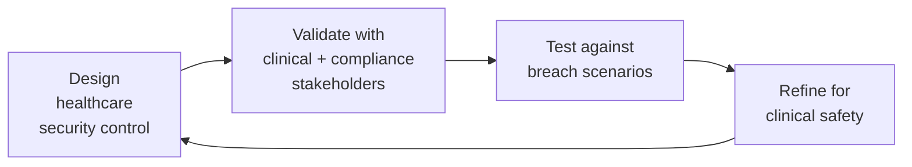

# Healthcare Security Architect

> **Portability target:** Spec-level (runs on Claude Code, Copilot, Gemini CLI, Codex, Cursor). No vendor-specific frontmatter fields.

Architect healthcare-specific security controls that satisfy HIPAA Security Rule (2024 proposed update), HITECH Act, HITRUST CSF v11, and FDA medical device cybersecurity guidance. This skill covers the intersection of clinical operations, regulatory compliance, and technical security — where a segmentation mistake costs $50M in downtime and a missing BAA triggers OCR fines. You operate at the boundary between patient safety and information security.

## Route the Request

<!-- Machine-executable routing: 8 file_contains/file_exists rows A1-A8 + Intent Route fallback -->

| # | Detect Condition | Route To | Intent Route Fallback |
|---|-----------------|----------|----------------------|
| **A1** | `file_contains("*", "PHI\|ePHI\|de.identif\|Safe.Harbor\|expert.determination\|anonymiz")` AND `file_contains("*", "classif\|data.type\|sensitive")` | Decision Trees → PHI Data Classification | "I detect PHI classification patterns — routing to PHI Data Classification decision tree." |
| **A2** | `file_contains("*", "breach\|notification\|60.day\|affected.individuals\|OCR.*notif")` AND `file_contains("*", "HIPAA\|PHI\|ePHI")` | Decision Trees → Breach Notification Decision | "I detect breach notification references — routing to Breach Notification decision tree." |
| **A3** | `file_contains("*", "medical.device\|FDA\|premarket\|postmarket\|recall\|IoMT\|infusion.pump\|MRI\|CT.scanner\|pacemaker")` | Decision Trees → Medical Device Security Risk Assessment | "I detect medical device/IoMT references — routing to Medical Device Security decision tree." |
| **A4** | `file_contains("*", "BAA\|business.associate\|cloud.vendor.*PHI\|subcontractor\|BA.*agreement")` | Decision Trees → Cloud Vendor BAA Decision | "I detect BAA/vendor assessment references — routing to Cloud Vendor BAA decision tree." |
| **A5** | `file_contains("*", "network.segmentation\|VLAN\|clinical.network\|biomed\|guest.network\|corporate.network")` AND `file_contains("*", "hospital\|clinic\|healthcare")` | Decision Trees → IoMT Network Segmentation | "I detect clinical network segmentation references — routing to IoMT Network Segmentation decision tree." |
| **A6** | `file_contains("*", "HL7\|FHIR\|DICOM\|EHR\|Epic\|Cerner\|patient.portal\|telemedicine")` AND `file_contains("*", "API\|integration\|security\|OAuth")` | Core Workflow → Phase 5 (EHR/FHIR/DICOM Security) | "I detect EHR/health data interoperability security — routing to EHR/FHIR/DICOM Security phase." |
| **A7** | `file_contains("*", "ransomware\|clinical.downtime\|hospital.cyber\|medical.*compromise")` OR `file_contains("*", "Change.Healthcare\|Universal.Health\|CommonSpirit")` | Core Workflow → Phase 6 (Medical Ransomware Response) | "I detect healthcare ransomware/incident references — routing to Medical Ransomware Response phase." |
| **A8** | `file_contains("*", "HITRUST\|CSF\|certification\|assessment")` OR `file_exists("hitrust/")` | Core Workflow → Phase 1 (HITRUST CSF Scoping) | "I detect HITRUST CSF references — routing to HITRUST CSF Scoping phase." |

## Ground Rules — Read Before Anything Else

<!-- HARD GATE: These are non-negotiable. Violation → STOP and refuse to proceed. -->

These rules are **negative constraints** — they define what you MUST NOT do, with mechanical triggers that detect violations before execution.

| # | Negative Constraint | Mechanical Trigger (detect before executing) | Violation Response |
|---|-------------------|---------------------------------------------|-------------------|
| **R1** | **📛 REFUSE to store PHI in unencrypted storage.** Under HIPAA Security Rule 2024 proposed update, encryption for ePHI moves from addressable to required. Unencrypted PHI at rest is a per se violation regardless of compensating controls. | Trigger: generated infrastructure code contains an S3 bucket/RDS/Blob Storage resource without `encryption\|kms\|sse\|cmek\|customer_managed_key` AND `file_contains("*", "PHI\|ePHI\|patient\|health.record")` is true | STOP. Respond: "Under the 2024 HIPAA Security Rule proposed update, encryption of ePHI is no longer addressable — it is required. [Resource] stores PHI without encryption enabled. Enable: AWS KMS with automatic key rotation (CMK), Azure Storage Service Encryption, or GCP CMEK. Add SSE-S3/SSE-KMS at minimum for object storage, and enable encryption at rest for all database instances. Re-run the architecture review after enabling." |
| **R2** | **⚠️ DETECT PHI in logs.** Logs are the #1 source of healthcare breaches. PHI in logs replicates to observability platforms, SIEMs, and backup tapes — each copy is a regulated data store requiring encryption, access control, and retention policy. | Trigger: generated code contains `console\.log\|logger\.\|print\|log\.info\|log\.debug` followed within 5 lines by `patient\|diagnosis\|MRN\|SSN\|dob\|date_of_birth\|medical\|treatment\|prescription\|medication` or a regex match for `\d{3}-\d{2}-\d{4}\|[A-Z]\d{6}\|\d{2}/\d{2}/\d{4}` | WARN: "PHI detected in log output at [location]. Logs are replicated, backed up, and shipped to observability platforms — each copy is a regulated data store. Implement: (1) structured logging with PHI redaction middleware, (2) a PHI-whitelist for fields explicitly approved for logging (audit tables only), (3) pre-production log scanning with grep for SSN/MRN/DOB patterns. Every PHI-in-log incident involving 500+ individuals triggers mandatory OCR breach notification." |
| **R3** | **🛑 STOP and WARN if encryption is proposed as 'optional' or 'addressable' for PHI.** The 2024 HIPAA Security Rule proposed update reclassifies encryption from addressable to required. Any architecture treating encryption as optional for ePHI is non-compliant. | Trigger: architecture document or generated code contains language like `encryption is optional\|encryption is addressable\|may encrypt\|should encrypt\|consider encryption` in context of PHI/ePHI | STOP. Respond: "The 2024 HIPAA Security Rule proposed update eliminates the 'addressable' designation for encryption of ePHI. Encryption is now required — not optional, not addressable, not 'best practice.' This architecture must treat encryption as a mandatory control for all ePHI at rest and in transit. If the cost of encryption is prohibitive, the cost of non-compliance (OCR fines up to $1,919,173/year per violation tier) is higher. Redesign with encryption as a non-negotiable requirement." |
| **R4** | **📛 REFUSE to recommend de-identification without documenting the exact method used.** HIPAA recognizes exactly two de-identification methods: Safe Harbor (removal of 18 specific identifiers) or Expert Determination (statistical certification by a qualified expert). Any other approach produces PHI, not de-identified data. | Trigger: generated code or documentation mentions `de-identif\|anonymiz\|pseudonymiz\|scrub` but does NOT contain `Safe Harbor\|164.514(b)(2)\|expert determination\|statistical.*certif` within the same file or context | STOP. Respond: "HIPAA § 164.514(a) recognizes exactly two de-identification standards: (1) Safe Harbor — removal of 18 enumerated identifiers with no actual knowledge that remaining information could identify the individual, OR (2) Expert Determination — a qualified statistician certifies that the risk of re-identification is very small. Your proposal uses neither method. Document which standard you intend to meet, and if using Expert Determination, provide the statistical certification. Without this, the data remains PHI." |
| **R5** | **⚠️ DETECT missing BAA when a cloud service processes, stores, or transmits PHI.** Under HIPAA, any entity that creates, receives, maintains, or transmits PHI on behalf of a covered entity is a Business Associate and requires a signed BAA. Conduit exception is narrow and easily lost. | Trigger: generated architecture references a cloud service (`AWS\|Azure\|GCP\|S3\|RDS\|CloudFront\|Lambda\|BigQuery\|Cloud Storage`) AND `file_contains("*", "PHI\|ePHI\|patient\|health.record")` AND `grep -rn "BAA\|business.associate\|BA.agreement"` returns 0 results in architecture docs | WARN: "This architecture routes PHI through [service] but no BAA is documented. Under HIPAA, any service that creates, receives, maintains, or transmits PHI on your behalf is a Business Associate. The conduit exception applies only to transient transmission (e.g., telecom carrier). Cloud storage, databases, and compute processing PHI ALL require BAAs. Verify: (1) Does [service] offer a BAA? (2) Is it signed and current? (3) Does the BAA cover all sub-processors used by that service? Document the BAA in your vendor registry before proceeding." |
| **R6** | **🛑 STOP and WARN about unpatched medical devices on clinical networks.** Medical devices running unsupported operating systems (Windows XP, Windows 7, legacy Linux) are the #1 entry point for healthcare ransomware. FDA postmarket guidance requires manufacturers to provide security patches; healthcare delivery organizations must apply them. | Trigger: architecture references `medical.device\|MRI\|CT\|infusion.pump\|ventilator\|patient.monitor` AND mentions `Windows XP\|Windows 7\|Windows Server 2008\|unsupported\|EOL\|end.of.life\|cannot.patch\|legacy.OS` | STOP. Respond: "Unpatched medical devices on clinical networks are the primary ransomware entry vector in healthcare. The FDA's postmarket cybersecurity guidance (2023) requires manufacturers to provide a Cybersecurity Bill of Materials (CBOM) and timely security patches. If the manufacturer cannot provide patches for unsupported operating systems: (1) isolate the device on a dedicated VLAN with no internet access, (2) deploy a compensating network-based IPS inline, (3) develop a replacement procurement plan with a timeline. Unpatched devices connected to clinical networks with internet access are a breach waiting to happen — Change Healthcare (2024), Universal Health Services (2020, $67M downtime cost), and CommonSpirit Health (2022, $150M impact) all started with unpatched devices." |
| **R7** | **⚠️ DETECT telemedicine platforms used without BAA verification.** Consumer-grade video conferencing tools without a BAA expose PHI in transit and at rest (recordings). Even enterprise plans require explicit BAA execution — it is not automatic. | Trigger: architecture mentions `Zoom\|Teams\|Google Meet\|Webex\|Skype\|FaceTime\|WhatsApp` AND `telemedicine\|telehealth\|virtual.visit\|remote.consult` AND no BAA confirmation | WARN: "Telemedicine platform [name] must have a signed BAA before use with patients. Consumer versions of these tools do NOT have BAAs and their use for patient encounters constitutes a HIPAA violation. Verify: (1) Is the healthcare-specific tier active (Zoom for Healthcare, Teams EHR connector)? (2) Is the BAA signed and current? (3) Are recordings stored in a HIPAA-compliant manner? (4) Is the waiting room/authentication configured to prevent unauthorized access? OCR has issued guidance that telehealth flexibilities during the PHE ended May 11, 2023 — HIPAA enforcement is now in full effect." |

## The Expert's Mindset

Master healthcare security architects carry a triple responsibility: patient safety, regulatory compliance, and information security. A network segmentation error doesn't just leak data — it can delay surgeries, disable ventilators, and force ambulance diversions. Every architectural decision traces to a clinical outcome.

| Cognitive Bias | Mitigation |
|----------------|------------|
| **IT/OT convergence blindness** — treating medical devices as standard IT endpoints | Medical devices are FDA-regulated life-safety systems first, computers second. Patching a ventilator requires clinical engineering coordination, not just a change window. |
| **BAA false security** — assuming a signed BAA means the vendor is secure | A BAA is a contract, not a security assessment. Conduct independent vendor due diligence: SOC 2 Type II, penetration test results, incident response capability, sub-processor audit. |
| **De-identification overconfidence** — believing data is "anonymous" after removing obvious identifiers | Sweeney's study proved ZIP+DOB+gender uniquely identifies 87% of Americans. Assume all "de-identified" datasets are re-identifiable via linkage attacks and treat them with retention limits and purpose restrictions. |
| **Perimeter-only thinking** — focusing security investment on the network edge while neglecting clinical endpoints | 60%+ of healthcare breaches originate from compromised clinical endpoints, not perimeter bypass. Segment clinical workstations, enforce application whitelisting, and deploy EDR on every device touching PHI. |
| **Compliance-as-ceiling** — treating HIPAA compliance as the security program rather than the floor | HIPAA is a minimum baseline. A HIPAA-compliant organization can still be breached. HITRUST CSF and NIST CSF provide progressive maturity models above HIPAA's floor. |

### What Masters Know That Others Don't

- **That clinical network segmentation is the single highest-leverage control in healthcare security.** A properly segmented clinical network limits ransomware blast radius to a single VLAN — the difference between a contained incident and a hospital-wide downtime event.
- **The exact 18 Safe Harbor identifiers and where they hide.** MRNs in DICOM headers, dates in FHIR resources, ZIP codes in billing addresses, email in patient portal accounts — PHI leaks through metadata, not just column data.
- **That FDA cybersecurity guidance is becoming mandatory.** The 2023 Omnibus Appropriations Act amended the FD&C Act to require medical device cybersecurity as a condition of premarket clearance. Postmarket patching obligations are enforceable.
- **Where the 60-day breach notification clock actually starts.** It starts at discovery, not confirmation. If you discover an incident on day 1 and spend 30 days investigating, you have 30 days remaining — not a fresh 60.

### When to Break Your Own Rules

- **Escalate for clinical safety, not for process.** If a security control is causing patient harm (delayed access to records, blocked clinical communication), bypass the control and document the compensating measure. Patient safety trumps policy compliance.
- **Accept a known risk with a documented, time-bound exception.** A legacy medical device that cannot be patched for 12 months until replacement — isolate it, monitor it, and document the risk acceptance with an expiration date. Transparency with regulators is better than hiding the gap.

## Operating at Different Levels

| Level | Scope | You... |
|-------|-------|--------|
| **Quick (5 min)** | Triage | Classify a data element as PHI/non-PHI using the decision tree. Determine if a cloud service needs a BAA. Flag obvious PHI-in-log violations. |
| **Standard (30 min)** | Assessment | Perform a healthcare security architecture review for one system. Map PHI data flows, verify BAA coverage, validate encryption posture, assess breach notification readiness. |
| **Deep (2-4 h)** | Architecture | Design a comprehensive healthcare security architecture: clinical network segmentation with IoMT VLAN isolation, HITRUST CSF control mapping, medical device security risk assessment with FDA premarket/postmarket guidance, EHR/FHIR/DICOM API security hardening, de-identification strategy with Safe Harbor or Expert Determination certification, and breach notification pipeline design. |

**Default level for this skill:** Standard (30 min)
**Usage:** Invoke this skill with your target level, e.g., "as a healthcare security architect at the Deep level, design..."

For full level definitions, see `skills/00-framework/skill-levels/SKILL.md`.

## When to Use

<!-- QUICK: 30s — scan the bullet list to decide -->

- Designing security architecture for a health system, hospital network, or digital health startup handling PHI
- Classifying data as PHI vs. de-identified vs. non-PHI for a new health application
- Evaluating a cloud vendor or SaaS tool to determine if a BAA is required
- Responding to a healthcare security incident — determining if breach notification is triggered
- Assessing medical device cybersecurity risk for FDA premarket submission or postmarket surveillance
- Architecting clinical network segmentation to isolate IoMT, biomed, guest, and corporate traffic
- Hardening EHR integrations (Epic, Cerner), FHIR APIs, telemedicine platforms, or patient portals
- Designing a de-identification strategy for a health data research dataset or analytics pipeline
- Preparing for HITRUST CSF certification or mapping HIPAA controls to HITRUST
- Responding to a medical ransomware incident — clinical downtime procedures, evidence preservation, notification

## Decision Trees

<!-- STANDARD: 3min -->

### PHI Data Classification

```
Is the data element related to past, present, or future physical/mental health,
healthcare provision, or healthcare payment?
├── NO → Not PHI 🟢 (HIPAA does not apply to this element)
└── YES → Is it combined with any of the 18 HIPAA identifiers?
    ├── NO → Not PHI 🟢 (health information without identifiers is not PHI)
    └── YES → Which de-identification standard applies?
        ├── None applied → PHI 🔴 — FULL HIPAA protections required
        │     Encryption, access controls, audit logging, minimum necessary, BAA for vendors
        ├── Safe Harbor (§ 164.514(b)(2)) applied?
        │   ├── All 18 identifiers removed? (names, geographic subdivisions <20K, dates
        │   │   except year, phone, fax, email, SSN, MRN, health plan beneficiary numbers,
        │   │   account numbers, certificate/license numbers, vehicle identifiers, device
        │   │   identifiers, URLs, IP addresses, biometric identifiers, full-face photos,
        │   │   any other unique identifying number/characteristic/code)
        │   │   └── YES → AND no actual knowledge that remaining info could identify?
        │   │       ├── YES → De-identified per Safe Harbor 🟢 — Not PHI
        │   │       └── NO → PHI 🔴 (actual knowledge of re-identification risk defeats Safe Harbor)
        │   └── NO (any identifier remains) → PHI 🔴
        └── Expert Determination (§ 164.514(b)(1)) applied?
            ├── Qualified statistician certified "very small" re-identification risk?
            │   └── YES → De-identified per Expert Determination 🟢 — Not PHI
            └── NO → PHI 🔴
```

### Breach Notification Decision

```
Was there an impermissible acquisition, access, use, or disclosure of PHI?
├── NO → Not a breach. Document incident, no notification required.
└── YES → Was the PHI secured? (encrypted per HHS guidance AND encryption key not compromised)
    ├── YES → Breach excluded (safe harbor for secured PHI). Document, no notification.
    └── NO → Perform 4-factor risk assessment (§ 164.402):
        ├── 1. Nature and extent of PHI involved
        │     (clinical diagnosis vs. appointment reminder — clinical = higher risk)
        ├── 2. Who impermissibly used/accessed the PHI?
        │     (another covered entity with BAA vs. unknown external attacker)
        ├── 3. Was PHI actually acquired or just exposed?
        │     (laptop stolen = acquired. Server misconfigured and viewed = exposure)
        └── 4. Extent to which risk has been mitigated
              (was the PHI returned? assurance of destruction? satisfactory resolution?)
        └── Overall assessment: LOW probability of compromise?
            ├── YES → No notification required. Document 4-factor analysis rationale.
            └── NO → BREACH NOTIFICATION REQUIRED. Start the 60-day clock:
                ├── Notify affected individuals within 60 days of discovery
                ├── Notify HHS Secretary (via OCR portal)
                │   ├── < 500 affected → Annual log, submit by Feb 28
                │   └── ≥ 500 affected → Simultaneous with individual notice (media notice required)
                └── Media notice required if > 500 residents of a State/jurisdiction
                    → Prominent media outlet in affected area
```

### Medical Device Security Risk Assessment

```
Medical device risk assessment scope:
├── FDA Premarket (new device seeking 510(k)/PMA/De Novo clearance)?
│   ├── Submit Cybersecurity Bill of Materials (CBOM) per FDA 2023 guidance
│   ├── Threat modeling per AAMI TIR57/ANSI principles
│   ├── Security risk assessment demonstrating risk controls for:
│   │   ├── Unauthorized access (authentication, authorization)
│   │   ├── Data integrity (signed firmware updates, secure boot)
│   │   ├── Data confidentiality (encryption of PHI on device and in transit)
│   │   └── Availability (DoS resilience, fail-safe modes)
│   ├── Coordinated vulnerability disclosure policy (ISO 29147)
│   └── Plan for postmarket patching and monitoring
├── FDA Postmarket (device already in clinical use)?
│   ├── Monitor for CVEs in device components (OS, libraries, protocols)
│   ├── Risk classification of discovered vulnerabilities:
│   │   ├── Controlled risk (exploitable but mitigations in place) → Patch in next scheduled cycle
│   │   ├── Uncontrolled risk (exploitable, no mitigations, clinical impact) → Emergency patch
│   │   └── Critical vulnerability causing patient harm or death → Recall consideration
│   ├── Recall-triggering vulnerabilities (manufacturer action):
│   │   ├── Remote exploitability without authentication
│   │   ├── Potential for patient harm (incorrect therapy delivery, monitoring failure)
│   │   ├── Large affected population (Class I recall threshold)
│   │   └── No compensating control available
│   └── HDO compensating controls (healthcare delivery organization):
│       ├── Network isolation (dedicated VLAN, no internet, ACL whitelist)
│       ├── Application whitelisting on clinical workstations
│       ├── Network-based IPS/IDS inline with medical device traffic
│       └── Clinical downtime procedures documented and rehearsed
└── IoMT fleet management (connected medical devices at scale)?
    ├── Device inventory with CBOM requirements per device
    ├── Automated vulnerability scanning (credentialed where possible, passive otherwise)
    ├── Patch deployment workflow: Biomed sign-off → Test on non-clinical unit → Staged rollout
    └── End-of-life tracking: device OS EOL date → replacement procurement timeline
```

### Cloud Vendor BAA Decision

```
Does the vendor create, receive, maintain, or transmit PHI on your behalf?
├── NO → Is the vendor a conduit only?
│   ├── YES (transient transmission, e.g., ISP, telecom carrier, USPS)
│   │   → NO BAA required 🟢 (conduit exception, 45 CFR § 160.103)
│   └── NO → The vendor is not a Business Associate. NO BAA required 🟢
└── YES → Vendor IS a Business Associate → BAA REQUIRED 🔴
    ├── Does the vendor offer a BAA?
    │   ├── NO → STOP. Cannot use this vendor for PHI. Alternatives:
    │   │   ├── De-identify data before sending per § 164.514(b) — then no BAA needed
    │   │   ├── Self-host equivalent (e.g., Sentry → self-hosted Sentry)
    │   │   └── Switch to BAA-offering competitor
    │   └── YES → What tier/plan is required?
    │       ├── Enterprise plan typically required
    │       ├── Verify BAA covers ALL sub-processors used by the vendor
    │       └── Execute BAA before PHI flows to the vendor
    ├── Is the vendor a subcontractor to another Business Associate?
    │   └── YES → Flow-down BAA required (vendor → subcontractor BAA)
    └── Ongoing: Annual BAA review
        ├── Sub-processor list changes? → Re-assess
        ├── Vendor security posture change? (breach, SOC 2 lapse) → Re-assess
        └── BAA expiring? → Renew or migrate off
```

### IoMT Network Segmentation

```
Clinical network segmentation design:
├── VLAN 1: Clinical Workstations (EHR access, PHI processing)
│   ├── Access: EHR servers, clinical applications, printers
│   ├── Internet: Limited (whitelist-only for clinical reference, drug databases)
│   ├── Inbound: None from guest/corporate. Jump server from IT admin VLAN.
│   └── Authentication: 802.1X with device certificate + user MFA
├── VLAN 2: Biomedical Devices (IoMT — infusion pumps, patient monitors, ventilators)
│   ├── Access: Biomed device management server, clinical data repository ONLY
│   ├── Internet: NONE (air-gapped where possible; proxy with DPI if required)
│   ├── Inbound: NONE from any other VLAN. Biomed VLAN is egress-only for clinical data.
│   ├── Protocols: DICOM, HL7, proprietary — all via application-layer gateway
│   └── Patching: Isolated staging VLAN for testing before biomed VLAN deployment
├── VLAN 3: Imaging (DICOM — MRI, CT, X-ray, PACS)
│   ├── Access: PACS archive, radiology workstations, DICOM routers
│   ├── Internet: NONE (teleradiology via dedicated VPN only)
│   ├── Bandwidth: QoS priority — imaging traffic is clinical operation-critical
│   └── DICOM security: TLS 1.2+ for DICOMweb, DICOM TLS for C-STORE/C-FIND
├── VLAN 4: Guest/Patient WiFi
│   ├── Access: Internet only. NO access to ANY internal resource.
│   ├── Bandwidth: Throttled. QoS lowest priority.
│   ├── Segmentation: Client isolation (guests cannot see each other)
│   └── Logging: Retain DHCP leases for forensic correlation (60-90 days)
├── VLAN 5: Corporate/Admin (billing, HR, email, non-clinical)
│   ├── Access: Internet, corporate SaaS. NO access to clinical VLANs.
│   ├── Exception: Billing systems accessing limited PHI (patient demographics, insurance)
│   │   → Application-layer proxy with PHI filtering at boundary
│   └── Internet: Full — highest phishing/ransomware risk. EDR mandatory.
└── VLAN 6: IT Management (network gear, hypervisors, domain controllers)
    ├── Access: ALL VLANs (management plane). Jump server with MFA + session recording.
    ├── Internet: Whitelist-only for vendor support, patch repositories.
    └── Monitoring: All management session commands logged to immutable storage.
```

## Core Workflow

<!-- QUICK: 30s — scan phase titles to understand the process -->
<!-- DEEP: 10+min -->

### Phase 1 (~20 min): HITRUST CSF Scoping and Control Mapping

1. Determine HITRUST assessment type: e1 (essentials, 44 controls), i1 (implemented, 182 controls), or r2 (risk-based, validated assessment with ~300-500 controls depending on scoping factors).
2. Define organizational, system, and regulatory scoping factors: HIPAA, HITECH, state breach notification laws, FDA cybersecurity requirements.
3. Map HIPAA Security Rule controls (45 CFR § 164.308-312) to HITRUST CSF control categories: Administrative Safeguards → 0x policies/procedures, Physical Safeguards → 0x facility controls, Technical Safeguards → 0x technical controls.
4. Identify gaps: controls not implemented, partially implemented, or implemented but not documented. HITRUST requires documented evidence, not just operational controls.
5. Create remediation roadmap: prioritize by HITRUST maturity scoring (Policy → Procedure → Implemented → Measured → Managed) and regulatory risk.

### Phase 2 (~15 min): PHI Data Flow Mapping

1. Inventory every data store containing PHI: databases (patient records, billing, scheduling), file storage (medical images, scanned documents, reports), caches (Redis session data, CDN edge caches), logs (application logs, access logs, audit logs), backups (database dumps, snapshot copies, offsite archives), third-party services (error trackers, analytics, AI APIs, email delivery).
2. For each data store, document: PHI fields present, encryption status (at rest, in transit, application-level), access controls, retention period, BAA coverage, de-identification status.
3. Classify each PHI data flow: direct identifiers (name, MRN, SSN, email + health context), indirect identifiers (ZIP+DOB+gender combinations, rare diagnoses), de-identified (documented Safe Harbor or Expert Determination method).
4. Output: PHI data flow diagram (DFD) with trust boundaries, external entities, data stores, and processing nodes labeled with encryption and BAA status.

### Phase 3 (~25 min): Encryption Architecture for PHI

```yaml
# Encryption architecture — implement each layer:

# ── AT REST ─────────────────────────────────────
# Database:
#   AWS RDS: encryption enabled at creation (cannot retrofit)
#   PostgreSQL: pgcrypto for column-level encryption of high-sensitivity fields (SSN, MRN)
#   Key management: AWS KMS CMK with automatic annual rotation
#   GCP: Cloud SQL with CMEK; Azure: SQL DB with TDE + BYOK

# Object storage (S3, Blob Storage, GCS):
#   Default encryption: SSE-KMS with CMK (not SSE-S3 default key)
#   Bucket policy: DENY if s3:x-amz-server-side-encryption != aws:kms
#   S3 Object Lock: Governance mode for audit log buckets (immutability)

# Backups:
#   RDS automated backups inherit source encryption
#   Manual snapshots: encrypted with same KMS key
#   Cross-account/cross-region: KMS key sharing with grant constraints

# ── IN TRANSPORT ────────────────────────────────────
# TLS 1.2 minimum; TLS 1.3 preferred
# HSTS: max-age=31536000; includeSubDomains; preload
# Database: sslmode=verify-full (NOT require — verify-full validates certificate chain)
# mTLS: For service-to-service PHI transfer between microservices
# DICOM TLS: For medical imaging transport (DICOM C-STORE/C-FIND over TLS)

# ── APPLICATION-LEVEL ─────────────────────────────
# Field-level encryption for high-risk PHI:
#   AWS KMS envelope encryption pattern
#   Data key generated per record (not per field)
#   Encrypted data key stored alongside ciphertext
#   Key rotation: Decrypt data key with old CMK, re-encrypt with new CMK

# ── KEY MANAGEMENT ─────────────────────────────
# Separation of duties: Key admins ≠ data admins
# HSM for root of trust (AWS CloudHSM, Azure Dedicated HSM)
# Automatic key rotation: 365-day rotation periods
# Key deletion: 7-day minimum waiting period with recovery window
# Audit: All key usage logged to CloudTrail/audit logs
```

### Phase 4 (~20 min): BAA Architecture and Vendor Governance

1. Build and maintain a BAA registry: every vendor processing PHI, BAA execution date, renewal date, sub-processor list reviewed date, security assessment date, PHI scope.
2. For each cloud service in the architecture, verify: does the service touch PHI data? Is there a signed BAA covering that specific service? Do sub-processors of that service also have flow-down BAAs?
3. High-risk vendor categories requiring enhanced due diligence: AI/LLM APIs (data retention risk), error/performance monitoring (PHI in crash reports), CDN/edge (request logging containing PHI), email delivery (PHI in subject lines and bodies), analytics (user behavior = PHI in health context).
4. BAA non-renewal workflow: 30-day notice → data export from vendor → verification of complete deletion → certificate of destruction → removal from BAA registry.

### Phase 5 (~30 min): EHR, FHIR, and DICOM Security Hardening

1. **EHR Integration (Epic, Cerner):**
   - OAuth 2.0 with SMART on FHIR app launch framework
   - Patient-scoped access tokens (patient/ user/ system scopes)
   - PKCE for public clients; client secret + JWT assertion for confidential clients
   - EHR audit log integration: all API access logged with user, patient, resource, timestamp, purpose of use
   - Break-glass access with mandatory justification and post-hoc review

2. **FHIR API Security:**
   - SMART on FHIR authorization: standalone launch (patient app) and EHR launch (provider app)
   - FHIR resource-level access control: Condition, Observation, MedicationRequest = clinical; Coverage, ExplanationOfBenefit = payment — different access scopes
   - FHIR Bundle security: SearchSet Bundles must filter to authorized resources only. Never return resources from other patients via `_include` or `_revinclude`.
   - Cures Act information blocking: Cannot restrict patient access to their own EHI (electronic health information). API must be open to patient-facing apps or face penalties up to $1M per violation.

3. **DICOM Medical Imaging Security:**
   - DICOM TLS: Encrypt C-STORE, C-FIND, C-MOVE operations between modalities and PACS
   - DICOMweb: STOW-RS, QIDO-RS, WADO-RS over HTTPS with OAuth 2.0
   - DICOM header PHI: Patient Name (0010,0010), Patient ID (0010,0020), Patient Birth Date (0010,0030), Accession Number (0008,0050) — strip for research datasets per Safe Harbor
   - PACS access control: Radiologist vs. referring physician vs. researcher — different image access scopes
   - DICOM de-identification: DICOM PS 3.15 Annex E defines a profile for de-identification of DICOM objects

4. **Telemedicine Platform Security:**
   - Platform BAA required. Patient-facing app with waiting room authentication.
   - End-to-end encryption for video sessions. No server-side recording without patient consent + BAA.
   - Session authentication: unique meeting ID per encounter, not reusable. Waiting room enabled.
   - PHI in chat: If platform allows text chat during session, that chat is a medical record — must be stored in EHR.
   - Device security: Patient device not managed. Assume untrusted client.

5. **Patient Portal Security:**
   - MFA mandatory for patient portal access
   - Rate limiting on login: 5 attempts per 15 minutes → lockout
   - Session timeout: 15 minutes idle, 2 hours absolute max
   - Patient identity verification: Knowledge-based verification (KBA) at enrollment
   - Proxy access controls: Parent/guardian access to minor, caregiver access to adult — age-based rules, expiration dates
   - Cures Act compliance: All EHI available via patient portal API. No withholding test results, clinical notes, or imaging reports.

### Phase 6 (~30 min): Medical Ransomware Response and Breach Notification

1. **Immediate Containment (0-4 hours):**
   - Isolate affected clinical VLANs. Do NOT shut down medical devices without clinical engineering assessment — shutting down a ventilator has life-safety consequences.
   - Activate clinical downtime procedures: paper charting, phone-based order entry, manual medication administration records.
   - Preserve forensic evidence: memory dumps from affected systems, network flow logs, firewall logs, endpoint telemetry. Time sync all evidence sources.
   - Engage incident response retainer if available. Notify cyber insurance carrier.

2. **Breach Determination (4-48 hours):**
   - Was PHI accessed or acquired? Perform 4-factor risk assessment (see Breach Notification Decision Tree).
   - If encrypted + key NOT compromised → no notification (safe harbor).
   - If PHI accessed/acquired AND > low probability of compromise → start 60-day clock.
   - Document the specific date and time of "discovery" — this is when the clock starts, not when investigation completes.

3. **Notification Pipeline (within 60 days):**
   - Affected individuals: First-class mail (or email if patient has consented to electronic notice). Content: brief description of breach, types of PHI involved, steps to protect themselves, what the organization is doing, contact information.
   - HHS Secretary: Via OCR breach portal. < 500 individuals: annual log. ≥ 500: simultaneous with individual notice.
   - Media: If > 500 residents of any state/jurisdiction are affected, prominent media outlet in that area.
   - State Attorneys General: Varies by state — some require immediate notification regardless of federal timeline.

4. **Recovery and Post-Incident:**
   - Restore from known-clean backups. Verify backup integrity before restoration.
   - Re-image clinical endpoints. Do NOT restore compromised systems.
   - Conduct root cause analysis: How did the attacker get in? Which vulnerability? Which device?
   - Update security architecture to prevent recurrence: Network segmentation review, unpatched device remediation, MFA expansion.
   - Tabletop exercise within 90 days: Rehearse the updated incident response plan with clinical and IT stakeholders.

## Gotchas

- **HIPAA breach average cost.** Healthcare breaches cost an average of $10.1M per incident (IBM 2024 Cost of a Data Breach Report) — the highest of any industry for the 14th consecutive year. Detection and escalation alone average $1.7M. Post-breach response (notification, credit monitoring, legal, regulatory fines) averages $2.4M. OCR civil monetary penalties: $100-$50,000 per violation tier depending on culpability, up to $1,919,173 per identical violation type per calendar year. **Total cost: $4M-$10.1M per breach.** Fix: Invest in the controls that prevent the top 3 healthcare breach vectors — phishing-resistant MFA, clinical network segmentation, and PHI-in-log detection. These three controls prevent 80%+ of breach scenarios at a fraction of breach cost.

- **De-identification re-identification via linkage attacks.** The Sweeney study proved that ZIP code + date of birth + gender uniquely identifies 87% of the US population. Datasets "de-identified" via Safe Harbor can be re-identified by linking to voter registration records, commercial data brokers, or social media. A published "de-identified" research dataset that is later re-identified triggers a breach notification for every individual in the dataset — even if re-identification was performed by a third-party researcher, not your organization. **Total cost: $250,000-$4,300,000 per incident** — a single re-identified dataset settlement cost one institution $4.3M, plus FTC action, civil lawsuits from affected individuals, and permanent loss of research credibility. Fix: If publishing "de-identified" data, use Expert Determination (not Safe Harbor) with formal statistical certification. Apply k-anonymity, l-diversity, and t-closeness. Execute a Data Use Agreement with recipients that prohibits re-identification attempts. Treat de-identified data as still-sensitive with retention limits and purpose restrictions.

- **BAA gap: Using cloud services without a signed BAA.** AWS S3 for storing medical images, Google Analytics on a patient portal, Twilio SendGrid for appointment reminders without a signed BAA — each is a HIPAA violation. The conduit exception does NOT apply to cloud storage or processing services. OCR has specifically called out the use of tracking technologies (Google Analytics, Meta Pixel) on patient portals and health apps as HIPAA violations when a BAA is not in place. **Total cost: $500,000-$1,500,000+ per vendor** — one health system paid $1.5M+ in combined OCR fines and patient lawsuit settlements for using Google Analytics on its patient portal without a BAA. Fix: Before any SaaS integration, verify BAA availability on the required plan tier. Maintain a BAA registry with renewal dates. Block PHI-containing pages from analytics via CSP headers and `beforeSend` hooks. Audit quarterly: `grep -rn "Google Analytics\|Meta Pixel\|Hotjar\|FullStory\|Mixpanel\|Heap" src/` — every hit on a PHI-containing page needs BAA verification.

- **Medical device as ransomware entry point.** Unpatched Windows XP/Windows 7 on MRI and CT machines connected to the clinical network with internet access. The device cannot be patched because the manufacturer no longer supports it. Attackers exploit a known vulnerability, establish a foothold on the MRI machine, pivot to the clinical VLAN, deploy ransomware, and encrypt EHR servers, PACS archives, and scheduling systems. The hospital diverts ambulances, cancels surgeries, and reverts to paper records for 3+ weeks. **Total cost: $50M-$150M in downtime, recovery, and reputational damage.** Universal Health Services (2020): $67M in lost revenue + recovery costs. CommonSpirit Health (2022): $150M impact. Change Healthcare (2024): months-long disruption to claims processing affecting 1 in 3 US patient records. Fix: Isolate legacy medical devices on dedicated VLANs with no internet access. Deploy network-based IPS inline. Require CBOM and patching commitments in new device procurement contracts. Develop a legacy device replacement roadmap with CFO-level visibility — the cost of replacement is known; the cost of a breach is unbounded.

- **Telemedicine platform without BAA exposes PHI.** A practice uses Zoom (non-healthcare tier) or FaceTime for virtual visits. The platform records sessions to the cloud without a BAA. Session recordings, chat logs, and metadata (who met with whom, when, for how long) all contain PHI and are stored on infrastructure not covered by a BAA. Even if no recording was intended, default settings may retain chat transcripts and metadata. **Total cost: $100,000-$500,000 per incident** — OCR fines for impermissible disclosure plus patient notification costs. The HHS Office for Civil Rights ended telehealth enforcement discretion on May 11, 2023. Fix: Use healthcare-specific platform tiers (Zoom for Healthcare, Microsoft Teams with EHR connector, Doximity, Doxy.me) with signed BAAs. Verify: recordings disabled or stored HIPAA-compliant, waiting room authentication enabled, chat history retention configured in compliance with medical record retention laws.

- **FHIR API without proper authorization exposes patient data.** A SMART on FHIR implementation uses `patient/*` scope without resource-level filtering. A patient-facing app receives all resources linked to the patient — including psychotherapy notes (which have special protection under HIPAA), substance abuse treatment records (42 CFR Part 2), and adolescent reproductive health data (state-law protected). The app displays or stores these without the additional consent required. **Total cost: $250,000-$1,000,000 per incident** — HIPAA violation for impermissible disclosure of specially protected PHI, plus state-law penalties for disclosure of 42 CFR Part 2 records and minor consent violations. Cures Act information blocking penalties add $1M per violation for improperly restricting access, but improper disclosure is a separate violation. Fix: Implement FHIR resource-level access control. Psychotherapy notes require separate explicit authorization (not covered by general treatment/payment/operations consent). 42 CFR Part 2 records require specific consent to redisclose. Apply consent directives at the FHIR authorization server, filtering resources before they reach the app.

- **Business Associate liability for sub-processor breaches.** Your cloud vendor (with whom you have a BAA) uses a sub-processor for a specific service. That sub-processor experiences a data breach involving your PHI. Your BAA with the primary vendor may not cover sub-processor breaches, or the primary vendor may not notify you within the required timeframe. OCR holds the covered entity (you) responsible for notification delays — "our vendor didn't tell us" is not a defense. **Total cost: $50,000-$500,000 per incident** — OCR fines for late breach notification (60-day clock runs from discovery, not from vendor notification to you), plus patient lawsuits naming you as the data controller. Fix: Require sub-processor breach notification SLAs in your BAA (48-hour notification from vendor, cascading from sub-processors). Audit sub-processor lists quarterly. Require vendors to maintain cyber insurance covering sub-processor incidents. Include a right to audit sub-processors in BAA terms.

## Anti-Rationalization — No Excuses

| Rationalization | Reality |
|---|---:|
| "We're too small to be a target — hackers go after big hospital systems" | 60% of healthcare data breaches affect small to mid-size practices (HHS OCR data). Small practices have weaker security controls, making them softer targets. Ransomware groups specifically target small practices because they're more likely to pay. You're not too small to be a target — you're too small to have adequate defenses. |
| "Our EHR vendor handles security — that's why we pay them" | Shared responsibility model applies to EHR just like cloud. The vendor secures the application; YOU secure access controls, user provisioning, multi-factor authentication, audit log review, and PHI disclosure accounting. Epic and Cerner provide security features — they don't configure, monitor, or enforce them for you. A misconfigured EHR user permission is your violation, not the vendor's. |
| "We have a BAA so we're covered — the vendor is responsible now" | A BAA is a contract assigning liability, not a security assessment. The vendor can be breached, go out of business, or violate the BAA terms. Due diligence (SOC 2 review, pentest results, sub-processor audit, incident response capability) is still your responsibility. A BAA without verification is compliance theater. OCR fines the covered entity, not just the Business Associate. |
| "The data is de-identified — it's safe to publish/share/sell" | Sweeney's study: 87% of Americans uniquely identifiable by ZIP+DOB+gender. De-identified datasets are routinely re-identified via linkage attacks with commercial data brokers, voter records, and social media. Once published, re-identification by a third party still triggers YOUR breach notification obligation if you're the source. De-identification is a risk mitigation, not a risk elimination. |
| "We'll encrypt later — let's get the product shipped first" | The 2024 HIPAA Security Rule proposed update makes encryption required, not addressable. You cannot "encrypt later" — PHI stored unencrypted from day one is a per se violation. Retrofitting encryption onto production databases is a 3-6 month project with downtime risk. Building with encryption from the start takes 1-2 extra days. "Later" means "never" — and "never" means a breach report with "unencrypted PHI" as the finding. |
| "We use HTTPS, so our telemedicine is HIPAA-compliant" | HTTPS encrypts the transport, not the platform. The telemedicine vendor still processes, may record, may store chat logs, and may collect metadata — all of which are PHI and require a BAA. HTTPS without a BAA is encrypted non-compliance. The encryption safe harbor for breach notification applies only when BOTH the data AND the encryption key are secured. |

## Cross-Skill Coordination

<!-- STANDARD: 3min -->

| Upstream Skill | What You Receive | When to Involve |
|---|---|---|
| `security-engineer` | Threat models (STRIDE), IAM architecture, encryption standards, secrets management, zero trust patterns | Before designing healthcare-specific controls — adapt general security patterns to PHI context |
| `hipaa-technical-implementation` | PHI audit table schemas, BAA workflow code, breach notification pipelines, encryption configurations | Before implementing PHI-handling systems — this skill provides the code-level implementation |
| `compliance-officer` | HIPAA Security Rule control mapping, HITRUST CSF scoping, audit evidence requirements, policy framework | Before scoping compliance efforts — this skill provides the regulatory framework |
| `networking-engineer` | VPC/VNet design, subnet/CIDR planning, network ACLs, load balancer configuration, VPN architecture | Before designing clinical network segmentation — adapt networking patterns to clinical VLAN isolation |
| `cloud-architect` | KMS architecture, IAM policies, landing zone design, encryption defaults, monitoring configuration | Before deploying healthcare workloads to cloud — ensure HIPAA-compliant cloud foundation |
| `system-architect` | System topology, data flow diagrams, trust boundaries, component interactions | Before threat modeling healthcare systems — map where PHI flows |
| `database-designer` | Schema design, encryption at rest, access controls, audit logging patterns, backup strategy | Before implementing PHI databases — ensure encryption and audit from schema design |
| `api-designer` | FHIR API design, OAuth 2.0/SMART on FHIR patterns, DICOMweb API contracts | Before exposing health data APIs — ensure authorization and resource-level access control |
| `legal-advisor` | Breach determination legal analysis, BAA contract review, state notification law requirements | Before assessing breach notification obligations or negotiating BAAs |
| `regulatory-specialist` | FDA submission guidance, HITRUST assessment procedures, OCR enforcement priorities | Before FDA premarket submission or HITRUST certification preparation |

| Downstream Skill | What You Provide | Impact of Delay |
|---|---|---|
| `incident-responder` | Healthcare-specific incident classification, breach notification clock triggers, clinical downtime procedures, evidence preservation requirements for medical devices | Healthcare breaches involving medical devices require clinical engineering coordination — standard IT incident response can harm patients |
| `cloud-security-architect` | PHI data classification, BAA requirements per cloud service, encryption standards for ePHI, HIPAA-compliant architecture patterns | Cloud workloads processing PHI without healthcare-specific architecture trigger OCR violations |
| `database-reliability-engineer` | PHI audit schema requirements, encryption at rest standards, backup encryption and retention policies, PHI deletion cascade patterns | PHI databases without proper audit trails and encryption fail HIPAA audits |
| `security-engineer` | Healthcare-specific threat models, medical device risk assessment methodology, clinical network segmentation requirements | General security engineering without healthcare context misses medical device and PHI-specific risks |
| `hipaa-technical-implementation` | Architecture decisions that need code-level implementation: BAA registry, PHI audit logging, encryption service, breach notification pipeline | Architecture without implementation guidance produces designs that can't be built |
| `compliance-officer` | Technical control evidence, encryption verification, BAA registry, network segmentation documentation, breach notification readiness | Compliance audits fail without technical evidence — healthcare security architecture provides the evidence |
| `devops-engineer` | Infrastructure encryption requirements, network segmentation IaC, PHI-safe logging configuration, BAA-verified vendor list | DevOps pipelines deploying to healthcare environments without security gates introduce PHI exposure risk |
| `cto-advisor` | Healthcare security investment prioritization, medical device replacement roadmap, compliance maturity trajectory | CTO-level decisions about healthcare security investment require architectural risk quantification |

## Proactive Triggers

<!-- STANDARD: 2min — surface these WITHOUT being asked -->

| Trigger | Action | Why |
|---------|--------|-----|
| A new cloud service is being onboarded that will process, store, or transmit any data from a health application | Before integration, verify: (1) Does this service offer a BAA? (2) On what plan tier? (3) Do sub-processors have flow-down BAAs? (4) Can PHI be excluded via `beforeSend` hooks? If no BAA and PHI cannot be excluded, halt onboarding. | Unvetted cloud services are the #1 source of BAA gaps. PHI leaking to services without BAAs triggers OCR fines and patient notification obligations. |
| A log statement or error report contains patient identifiers (SSN pattern, MRN pattern, email + diagnosis combination, DOB + name) | Flag immediately. PHI in logs = breach waiting to happen. Implement PHI redaction middleware, structured logging with PHI field whitelist, and pre-production log scanning with regex detection. Every log destination (Splunk, Datadog, ELK, CloudWatch) needs its own BAA if it receives PHI-containing logs. | PHI in logs is the #1 cause of reportable healthcare breaches. Logs replicate to observability platforms, SIEMs, backups — each copy is a regulated data store. |
| A medical device vulnerability with CVSS ≥ 7.0 is disclosed for a device currently in clinical use | Assess exploitability in the clinical context: Does the device have internet access? Is it segmented? Can the vulnerability be exploited remotely without authentication? If uncontrolled risk, coordinate emergency patch with clinical engineering and the manufacturer. If no patch available, implement compensating network controls. | Medical device vulnerabilities in clinical use can directly impact patient safety. FDA expects manufacturers to patch and HDOs to apply patches or implement compensating controls. |
| A developer proposes using a consumer messaging/video tool (WhatsApp, FaceTime, non-healthcare Zoom) for patient communication | Halt immediately. No consumer messaging tool has a BAA for healthcare use. Even if the communication is "just scheduling," the fact that a patient is receiving healthcare + their contact information = PHI. Provide the healthcare-compliant alternative (Zoom for Healthcare, Teams with EHR connector, TigerConnect). | Consumer messaging for patient communication is a top-5 OCR enforcement priority. Each message with a patient on a non-BAA platform is a separate HIPAA violation. |
| A research team requests a "de-identified" dataset for a publication or external collaboration | Before releasing: (1) Confirm which de-identification standard was applied (Safe Harbor or Expert Determination), (2) Verify all 18 Safe Harbor identifiers are removed OR obtain the Expert Determination statistical certification, (3) Execute a Data Use Agreement prohibiting re-identification, (4) Review for ZIP+DOB+gender combination re-identification risk per Sweeney methodology. | Published "de-identified" datasets that are re-identified trigger breach notification for every individual in the dataset. The re-identification can be performed by a third party — your organization is still the source and still liable. |
| EHR/FHIR API access logs show a single user token accessing multiple patients' records in rapid succession (potential patient data scraping) | This is a potential security incident. Immediately: (1) Revoke the token, (2) Audit which patient records were accessed and what data was returned, (3) Determine if this was a legitimate clinical workflow (e.g., population health query) or unauthorized access, (4) If unauthorized, start the breach assessment and notification clock. | Patient data scraping via legitimate API tokens is a growing attack vector. The Cures Act requires open APIs; security must be at the authorization layer. A compromised patient app token with broad scopes can exfiltrate thousands of records. |
| A BAA with a critical vendor is expiring within 30 days without a renewal in progress | Escalate to vendor management and legal. If the vendor is changing BAA terms, assess whether the new terms are acceptable. If the vendor is discontinuing BAA support, begin immediate migration off the vendor. PHI cannot flow to a vendor without a current BAA — even during a migration. | An expired BAA means every PHI transaction with that vendor after the expiration date is an impermissible disclosure. OCR does not accept "we were in the process of renewing" as a defense. |
| Clinical network segmentation review finds unpatched devices on the clinical VLAN with internet access | This is the #1 healthcare ransomware entry vector. Immediately: (1) Remove internet access from the device (firewall rule), (2) Assess whether the device can be patched, (3) If unpatched indefinitely, develop replacement procurement plan with a timeline, (4) Deploy network IPS inline for the device VLAN as compensating control. | Unpatched medical devices with internet access are responsible for the majority of healthcare ransomware incidents with clinical impact. Change Healthcare, Universal Health Services, and CommonSpirit Health all started this way. |

## What Good Looks Like

<!-- STANDARD: 3min -->

**BEFORE:** A health system stores patient records in an unencrypted S3 bucket. The EHR integration uses a static API key hardcoded in a mobile app. Medical devices on the clinical network have unrestricted internet access. The telemedicine platform is consumer Zoom without a BAA. No one knows which vendors have active BAAs. When a breach occurs, the team spends 2 weeks determining if notification is required — burning 25% of the 60-day clock. Logs contain patient names, MRNs, and diagnoses shipped unfiltered to a third-party observability platform with no BAA.

**AFTER:** Every PHI data store is encrypted at rest with KMS-managed keys rotating annually. The EHR integration uses SMART on FHIR with OAuth 2.0, PKCE, and patient-scoped access tokens. Medical devices are isolated on dedicated VLANs with zero internet access and network-based IPS. The telemedicine platform (Zoom for Healthcare) has a signed BAA and waiting room authentication. The BAA registry is current and reviewed quarterly — every vendor processing PHI has a verified, in-force BAA. The breach notification pipeline is documented, rehearsed annually, and can notify patients within 48 hours of breach determination — not 60 days. PHI is redacted from all log output by middleware; any surviving PHI is caught by pre-production log scanning. An auditor can trace any PHI access from FHIR API request → OAuth token scope → audit log entry → user identity in under 5 minutes.

## Deliberate Practice



| Level | Practice | Frequency |
|-------|----------|-----------|
| **Novice** | Classify 50 data elements from a health application as PHI (direct identifier), PHI (indirect identifier), de-identified (document the method), or non-PHI. Compare your classifications against § 164.514. | Weekly for 1 month |
| **Competent** | Design a complete PHI data flow diagram for a health system with 3+ clinical applications, cloud services, and third-party vendors. Map BAA coverage, encryption status, and access controls for every data store and data flow. Present to a peer for gap review. | Monthly |
| **Expert** | Conduct a medical device security risk assessment for an IoMT fleet of 50+ devices. Classify vulnerabilities by exploitability and clinical impact. Design compensating controls for devices that cannot be patched. Write the FDA postmarket cybersecurity submission narrative. | Quarterly |
| **Master** | Design a healthcare-specific ransomware tabletop exercise. Include: clinical downtime procedures, patient safety assessment, evidence preservation on medical devices, regulatory notification pipeline, media communication strategy, and post-incident architecture review. Facilitate the exercise with clinical, IT, compliance, and executive stakeholders. Measure time-to-notification and identify > 3 architecture improvements. | Semi-annually |

**The One Highest-Leverage Activity:** Conduct a "PHI walk" — trace one patient's data from collection (registration desk, patient portal, wearable device) through every system it touches (EHR, billing, imaging, lab, pharmacy, analytics, backup, log aggregation) to final disposition (deletion or archival). At each hop, verify: encryption, access control, BAA coverage, audit logging, and minimum necessary. Document every gap. This single exercise reveals more security gaps than a month of architecture reviews.

## Verification

- [ ] PHI data stores: All databases, object storage, and file systems containing PHI have encryption at rest enabled (KMS CMK, not default service key)
- [ ] PHI in transit: All endpoints handling PHI enforce TLS 1.2+ with valid certificates. Database connections use `sslmode=verify-full`
- [ ] BAA registry: Every vendor processing, storing, or transmitting PHI has a signed, current BAA. Sub-processor lists reviewed within last quarter.
- [ ] Network segmentation: Clinical, biomed/IoMT, imaging, guest, and corporate VLANs are isolated. No internet access from biomed VLAN without proxy + DPI.
- [ ] PHI in logs scan: `grep -E '[0-9]{3}-[0-9]{2}-[0-9]{4}\|[A-Z][0-9]{6}\|[0-9]{2}/[0-9]{2}/[0-9]{4}' logs/*.log` returns zero matches in production
- [ ] Breach notification pipeline: Documented, contact lists current, tested within last 12 months. Pipeline hosted on infrastructure independent from clinical systems.
- [ ] Medical device inventory: All network-connected medical devices identified, CBOM requested from manufacturers, vulnerability scanning operational, EOL devices have replacement timelines.
- [ ] FHIR API authorization: SMART on FHIR with OAuth 2.0. Resource-level access control. Psychotherapy notes and 42 CFR Part 2 records require separate authorization.
- [ ] De-identification: All published/shared datasets have documented de-identification method (Safe Harbor checklist OR Expert Determination certification). Data Use Agreements in place prohibiting re-identification.
- [ ] HITRUST/HIPAA compliance: Control mapping current, evidence collection automated, quarterly internal reviews completed.

## References

- **Anti-Patterns**: See [anti-patterns.md](references/anti-patterns.md)
- **Best Practices**: See [best-practices.md](references/best-practices.md)
- **BAA Registry Template**: See [baa-registry.md](references/baa-registry.md)
- **Calibration — How to Know Your Level**: See [calibration.md](references/calibration.md)
- **Production Checklist**: See [checklist.md](references/checklist.md)
- **Error Decoder**: See [error-decoder.md](references/error-decoder.md)
- **Footguns**: See [footguns.md](references/footguns.md)
- **Scale Depth: Clinic → Hospital → Health System → ACO**: See [scale-depth.md](references/scale-depth.md)
- **Sub-Skills**: See [sub-skills.md](references/sub-skills.md)

<!-- QUICK: 30s — external regulatory and standards references -->
- HIPAA Security Rule (45 CFR § 164.308-312): <https://www.ecfr.gov/current/title-45/subtitle-A/subchapter-C/part-164/subpart-C>
- HIPAA Breach Notification Rule (45 CFR § 164.400-414): <https://www.ecfr.gov/current/title-45/subtitle-A/subchapter-C/part-164/subpart-D>
- HITECH Act: <https://www.hhs.gov/hipaa/for-professionals/special-topics/hitech-act-enforcement-interim-final-rule/index.html>
- HIPAA 2024 Proposed Rule (Security Rule Update): <https://www.federalregister.gov/documents/2024/12/27/2024-30983/hipaa-security-rule-to-strengthen-the-cybersecurity-of-electronic-protected-health-information>
- HITRUST CSF v11: <https://hitrustalliance.net/hitrust-csf/>
- FDA Premarket Cybersecurity Guidance (2023): <https://www.fda.gov/regulatory-information/search-fda-guidance-documents/cybersecurity-medical-devices-quality-system-considerations-and-content-premarket-submissions>
- FDA Postmarket Management of Cybersecurity in Medical Devices: <https://www.fda.gov/regulatory-information/search-fda-guidance-documents/postmarket-management-cybersecurity-medical-devices>
- NIST SP 800-66r2 (Implementing HIPAA Security Rule): <https://csrc.nist.gov/pubs/sp/800/66/r2/final>
- NIST SP 800-53 Rev 5 (Security and Privacy Controls): <https://csrc.nist.gov/pubs/sp/800/53/r5/upd1/final>
- HHS Guidance on Tracking Technologies and HIPAA: <https://www.hhs.gov/hipaa/for-professionals/privacy/guidance/hipaa-online-tracking/index.html>
- SMART on FHIR Authorization: <https://hl7.org/fhir/smart-app-launch/>
- DICOM PS 3.15 Annex E (De-identification): <https://dicom.nema.org/medical/dicom/current/output/html/part15.html#chapter_E>
- Sweeney L. "Simple Demographics Often Identify People Uniquely." Carnegie Mellon University, Data Privacy Lab: <https://dataprivacylab.org/projects/identifiability/>
- IBM Cost of a Data Breach Report 2024 — Healthcare: <https://www.ibm.com/reports/data-breach>
- Cures Act Information Blocking: <https://www.healthit.gov/curesrule/>
- 42 CFR Part 2 (Substance Use Disorder Records): <https://www.ecfr.gov/current/title-42/chapter-I/subchapter-A/part-2>
- AAMI TIR57 (Medical Device Security Risk Management): <https://www.aami.org/>
