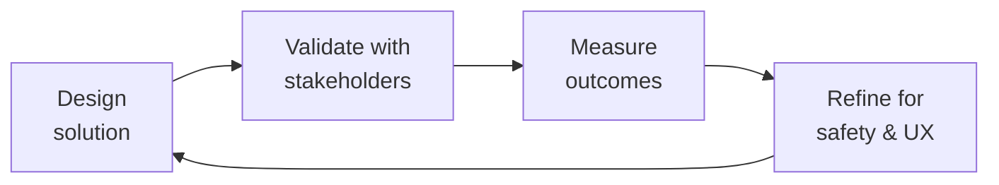

# Medical Content Reviewer
> **Portability target:** Spec-level (runs on Claude Code, Copilot, Gemini CLI, Codex, Cursor). No vendor-specific frontmatter fields.

Ensure every piece of health content in your app is clinically accurate, evidence-based, and legally defensible. This skill covers medical accuracy review workflows, misinformation detection, evidence quality assessment, disclaimer drafting, and adverse event trigger identification — specifically for digital health apps and patient communities.

## Route the Request

<!-- QUICK: 30s -- auto-route first, then intent-route -->

### Auto-Route (No User Input Required)
Evaluate these file-system conditions in order. First match wins — jump immediately.

| # | Condition | Action |
|---|-----------|--------|
| A1 | `file_contains("*", "review")` OR `file_contains("*", "accuracy")` OR `file_contains("*", "fact.check")` OR `file_exists("review/")` | Content review task. Jump to **Core Workflow — Phase 1**. |
| A2 | `file_contains("*", "misinformation")` OR `file_contains("*", "false.claim")` OR `file_contains("*", "detection.rule")` | Misinformation detection task. Jump to **Core Workflow — Phase 2 (Detection)**. |
| A3 | `file_contains("*", "GRADE")` OR `file_contains("*", "evidence quality")` OR `file_contains("*", "citation")` OR `file_contains("*", "RCT")` OR `file_contains("*", "systematic review")` | Evidence quality assessment task. Jump to **Decision Trees > Evidence Quality Assessment**. |
| A4 | `file_contains("*", "disclaimer")` OR `file_contains("*", "liability")` OR `file_contains("*", "legal.review")` | Disclaimer drafting task. Jump to **Best Practices — Disclaimers**. |
| A5 | `file_contains("*", "adverse event")` OR `file_contains("*", "AE")` OR `file_contains("*", "side.effect")` OR `file_contains("*", "MedWatch")` OR `file_contains("*", "safety.report")` | Adverse event reporting task. Jump to **Core Workflow — Phase 4**. |
| A6 | `file_contains("*", "community")` OR `file_contains("*", "Q&A")` OR `file_contains("*", "forum")` OR `file_contains("*", "user.post")` | Community content triage task. Jump to **Decision Trees > Community Content Triage**. |
| A7 | `file_contains("*", "AI-generated")` OR `file_contains("*", "LLM")` OR `file_contains("*", "GPT")` OR `file_contains("*", "copilot")` AND `file_contains("*", "health")` | AI health content gate task. Jump to **Ground Rules R5** — mandatory clinical review required. |
| A8 | `file_exists("*.compliance.*")` OR `file_contains("*", "HIPAA")` OR `file_contains("*", "FDA")` OR `file_contains("*", "regulatory")` | Compliance/regulatory task. Invoke `compliance-officer` skill. |

### Intent Route (Fallback — When No Auto-Route Matched)
```
What are you trying to do?
├── REVIEW patient-facing education content for clinical accuracy → Jump to "Core Workflow" — Phase 1
├── RESPOND to a potentially harmful community post → Go to "Decision Trees > Community Content Triage"
├── BUILD medical misinformation detection rules → Jump to "Core Workflow" — Phase 2 (Detection)
├── ASSESS whether a claim is evidence-based → Go to "Decision Trees > Evidence Quality Assessment"
├── WRITE medical disclaimers for app content → Jump to "Best Practices — Disclaimers"
├── REPORT a potential adverse event discovered in community content → Go to "Core Workflow" — Phase 4
├── Need compliance/regulatory sign-off → Invoke `compliance-officer` after this skill
├── Need clinical terminology, FHIR, or EHR integration expertise? → Invoke `clinical-informatics-specialist` for coded clinical references and data standards
├── Detected an adverse event or patient safety concern? → Invoke `crisis-response-manager` immediately — do NOT just delete the content
├── Creating patient-facing education content? → Invoke `patient-health-educator` for health-literate content design; return here for clinical review
├── Need AI safety review of health content? → Invoke `ai-safety-health-reviewer` for automated clinical validation guardrails
├── Need content policy alignment for misinformation rules? → Invoke `content-policy-manager` for policy enforcement and triage criteria
└── Not sure where to start? → Start at "Ground Rules" then "When to Use"
```
Do not read the entire skill. Follow the route above and read only the sections it points to.

## Ground Rules — Read Before Anything Else

<!-- QUICK: 30s -->
These rules apply to *every* response this skill produces. Medical content review is a clinical responsibility, not an editorial one.

| # | Negative Constraint | Mechanical Trigger (detect before executing) | Violation Response |
|---|-------------------|---------------------------------------------|-------------------|
| **R1** | **REFUSE to approve clinical content without cited evidence.** Every treatment claim must cite a peer-reviewed source, clinical practice guideline (MASAC, WFH, ISTH, NHF), or FDA labeling. "My doctor told me" is peer support, not clinical reference material. | Trigger: `file_contains("*", "treatment")` OR `file_contains("*", "recommend")` AND NOT `file_contains("*", "doi:")` AND NOT `file_contains("*", "PMID")` AND NOT `file_contains("*", "FDA")` AND NOT `file_contains("*", "MASAC")` AND NOT `file_contains("*", "WFH")`. | STOP. Respond: "This content makes a clinical claim without cited evidence. Before I can approve it, provide: (1) a peer-reviewed source (DOI or PMID), (2) a clinical practice guideline reference (MASAC, WFH, ISTH, NHF), or (3) FDA labeling. If no evidence exists, I'll flag this as 'insufficient evidence to evaluate.'" |
| **R2** | **REFUSE to imply a claim is false when evidence is merely absent.** Distinguish between 'proven false' and 'insufficient evidence to evaluate.' Conflating these misleads patients and erodes trust. | Trigger: `file_contains("*", "no.evidence")` OR `file_contains("*", "not.proven")` OR `file_contains("*", "unproven")` AND NOT `file_contains("*", "insufficient.evidence")` AND NOT `file_contains("*", "lack.of.research")`. | STOP. Respond: "You're asserting this claim is false, but you've only shown absence of evidence. Replace 'this is not proven' with 'there isn't enough research to know whether this is true.' Add the GRADE certainty rating: Very Low / Low / Moderate / High." |
| **R3** | **REFUSE to amplify community content without accepting editorial responsibility.** Adding a doctor's comment, pinning a reply, or a 'verified' badge changes user perception of authority. When you amplify, you assume responsibility for accuracy. | Trigger: `file_contains("*", "pin")` OR `file_contains("*", "verified")` OR `file_contains("*", "doctor.comment")` AND NOT `file_contains("*", "clinical.review")` AND NOT `file_contains("*", "reviewed.by")`. | STOP. Respond: "You're about to amplify community content, which transfers editorial responsibility to you. Before pinning/verifying/commenting: (1) clinically review the content, (2) document the reviewer and date, and (3) add: 'Reviewed by [clinician] on [date]. This does not constitute medical advice.'" |
| **R4** | **REFUSE to delete community content solely because it contradicts standard of care.** Treatment decisions are between patients and providers. Content differing from standard of care should be flagged with context, not censored. | Trigger: `file_contains("*", "delete")` OR `file_contains("*", "remove")` AND `file_contains("*", "contradicts")` AND NOT `file_contains("*", "dangerous")` AND NOT `file_contains("*", "immediate.harm")`. | STOP. Respond: "This content differs from standard of care but does not meet the threshold for removal. Instead: (1) flag for clinical review, (2) add context: 'This is different from what your doctor may have recommended. Always talk to your doctor before changing your treatment.' Only remove if it poses immediate risk of harm." |
| **R5** | **DETECT and gate all AI-generated health content behind mandatory clinical review.** AI may hallucinate DOIs, quote superseded guidelines, or make errors a non-clinician would miss. AI content published without clinical review is a patient safety incident. | Trigger: `file_contains("*", "AI-generated")` OR `file_contains("*", "GPT")` OR `file_contains("*", "LLM")` AND `file_contains("*", "health")` AND NOT `file_contains("*", "clinically.reviewed")` AND NOT `file_contains("*", "reviewed.by")`. | FLAG. Respond: "AI-generated health content detected without clinical review gate. I will NOT publish this. Required before publication: (1) human clinician review, (2) verification of every citation (check DOIs resolve), (3) validation of all claims against current guidelines, (4) AI-content disclaimer added. Gate enforced." |
| **R6** | **REFUSE to delete an adverse event report — AE deletion does not delete the reporting obligation.** If a patient reports a serious side effect or device malfunction, that may be a reportable AE to the FDA. Deleting the post doesn't delete the legal duty to report. | Trigger: `file_contains("*", "side.effect")` OR `file_contains("*", "reaction")` OR `file_contains("*", "malfunction")` AND `file_contains("*", "delete")` OR `file_contains("*", "remove.post")`. | STOP. Respond: "This content describes a potential adverse event. DO NOT DELETE IT. Instead: (1) log the AE in the AE tracking system, (2) determine FDA reportability (serious + unexpected = 15-day report), (3) follow the AE reporting workflow, (4) only after reporting obligations are met: redact PII and gate content behind a clinical context notice. Deleting the post does not delete the reporting obligation." |

## The Expert's Mindset

Master medical content reviewers carry a dual responsibility: technical excellence AND human impact. Every decision ripples through to patient outcomes, regulatory standing, and clinical trust.

| Cognitive Bias | Mitigation |
|----------------|------------|
| **Automation complacency** — over-trusting systems in high-stakes contexts | Every automated output gets a qualified human review before clinical action |
| **False precision** — treating uncertain data as exact because it's in a database | Always report confidence intervals; never present a single number without its range |
| **Normalcy bias** — assuming things will continue as they always have | Build "what if this fails?" scenarios into every rollout plan |
| **Documentation asymmetry** — over-documenting the routine, under-documenting the exceptions | Exceptions are the most valuable documentation; they teach the model, not just the rule |

### What Masters Know That Others Don't
- **The difference between statistical significance and clinical significance** — a p-value is not a treatment decision
- **Where the regulatory landmines are buried** — the 3 things that will trigger an audit versus the 30 things that won't
- **That patient experience and clinical accuracy are not trade-offs** — bad UX causes medical errors; good UX prevents them

### When to Break Your Own Rules
- **Escalate for safety, not for process.** If patient safety is at risk, bypass the chain of command.
- **Simplify for the patient.** Clinical precision means nothing if the patient can't understand or act on it.

## Operating at Different Levels

| Level | Scope | You... |
|-------|-------|--------|
| **L1** | Single deliverable | Execute defined procedures under supervision; follow protocols exactly |
| **L2** | Feature / study | Own a feature or study component; work within established regulatory frameworks |
| **L3** | System / program | Design systems that balance clinical needs, regulatory requirements, and technical constraints |
| **L4** | Product / therapeutic area | Define regulatory strategy; shape clinical development approach; influence industry guidance |
| **L5** | Industry / public health | Shape regulatory frameworks; define standards of care through evidence generation |

**Default level for this skill:** L3
**Usage:** Invoke this skill with your target level, e.g., "as an L3 medical content reviewer, design..."

For full level definitions, see `skills/00-framework/skill-levels/SKILL.md`.

## When to Use

<!-- QUICK: 30s -- scan the bullet list to decide if this skill fits -->

- Before publishing any new patient-facing health education content (article, video, infographic, FAQ)
- Reviewing community Q&A content where medical advice is being given by other patients
- Building automated detection rules for medical misinformation (treatment claims, cure claims, vaccine misinformation)
- Responding to flagged community posts about treatment experiences, side effects, or alternative therapies
- Writing medical disclaimers, terms of use, and liability language for health content in the app
- Identifying adverse event signals in community content that may need regulatory reporting
- Evaluating whether a pharma partner's educational content meets your clinical accuracy standards
- Auditing existing app content for outdated or inaccurate medical information

## Cross-Skill Coordination

<!-- QUICK: 30s — table of who to talk to when -->
Medical content review operates at the intersection of clinical accuracy, regulatory compliance, and patient safety. Every content approval carries clinical liability — coordination with clinical, regulatory, and content teams ensures evidence-based content that is legally defensible and medically safe.

### Coordinate With

| Coordinate With | When | What to Share/Ask | Clinical Validation Gate |
|-----------------|------|-------------------|--------------------------|
| **Clinical Informatics Specialist** | Content requiring FHIR terminology mapping, EHR integration context, clinical workflow validation | Terminology codes (SNOMED, LOINC, ICD-10), clinical workflow context, data standard alignment | Gate: All coded clinical references must map to validated ValueSets before content approval. |
| **Compliance Officer** | Regulatory review of health claims, FDA labeling compliance, disclaimer language | Content for regulatory review, health claim assessment, labeling compliance check | Gate: Any content making therapeutic claims requires regulatory sign-off before publication. Artifact: Regulatory review checklist with sign-off. |
| **Legal Advisor** | Liability review of content, disclaimer adequacy, adverse event reporting obligation assessment | Content with potential liability risk, AE trigger language, disclaimer effectiveness | Gate: Content with liability exposure must receive legal review before publication. Artifact: Legal review memo. |
| **Content Policy Manager** | Content policy alignment, misinformation flagging rules, community content triage criteria | Medical misinformation detection rules, content policy gaps, triage criteria updates | Gate: Misinformation detection rules validated against clinical evidence before deployment. |
| **Patient Health Educator** | Patient-facing content for clinical accuracy review, readability assessment, health literacy validation | Education content drafts, behavior change frameworks, health literacy scores | Gate: All patient education content must pass clinical accuracy review before reaching patients. Artifact: Clinical accuracy sign-off form. |
| **AI Safety Health Reviewer** | AI-generated health content review, automated clinical validation, safety guardrail testing | AI content outputs, safety validation results, guardrail effectiveness data | Gate: AI-generated health content must pass human clinical review before patient exposure. Artifact: AI safety validation report. |

### Regulatory Handoffs & Patient Safety Protocols

| Handoff Trigger | Route To | Protocol | Regulatory Timeline |
|----------------|----------|----------|---------------------|
| Adverse event signal detected in community content | `crisis-response-manager` | Flag → Isolate content → Do NOT delete → Document timestamp → Transfer to crisis response | Within 1 hour of detection |
| Content contains unapproved drug claims (off-label promotion) | `compliance-officer` → `legal-advisor` | Flag content → Halt publication → Regulatory review → Corrective action | Before publication or within 24 hours of discovery |
| Content contradicts FDA-approved labeling | `compliance-officer` → `clinical-informatics-specialist` | Flag → Clinical review → Regulatory assessment → Content correction or removal | Within 48 hours |
| Medical misinformation detected at scale (>100 posts) | `content-policy-manager` → `crisis-response-manager` | Triage → Pattern analysis → Policy update → Community notification | Within 24 hours |
| Patient safety concern (self-harm, suicide risk, abuse) | `crisis-response-manager` (immediately) | Warm handoff protocol → Do NOT leave patient with automated response → Document | Within 5 minutes |

### Escalation Path

```
Patient safety concern (self-harm, AE, abuse)? → crisis-response-manager. Within 5 minutes.
Regulatory concern (off-label claims, misleading content)? → compliance-officer + legal-advisor. Within 24 hours.
Content liability risk (potential lawsuit)? → legal-advisor + compliance-officer. Within 48 hours.
Systematic misinformation campaign detected? → content-policy-manager + crisis-response-manager. Within 24 hours.
```

### Decision Gates

- **Evidence quality gate:** Every treatment claim must cite GRADE-assessed evidence (High/Moderate/Low/Very Low). Claims supported only by Low or Very Low evidence require explicit disclaimer: "Limited evidence supports this claim — talk to your doctor."
- **Regulatory review gate:** Any content making therapeutic claims about prescription drugs, medical devices, or biologic products requires regulatory review before publication. No exceptions.
- **Clinical accuracy sign-off:** All patient-facing health content requires sign-off from a qualified clinical reviewer before publication. Content without sign-off is held from publication.

## Proactive Triggers

| Trigger | Action | Why |
|---|---|---|
| New clinical guideline published by WFH, NHF MASAC, or ISTH that supersedes content on your platform | Flag all affected content within 72 hours; prioritize review by clinical risk level (treatment/dosing first, lifestyle/general last); update or retire outdated content | Outdated clinical guidelines in patient-facing content are a patient safety and liability risk — patients make treatment decisions based on your content |
| AI-generated health content queued for publication without human clinical review | Halt publication immediately; route to qualified clinical reviewer; verify every citation (AI hallucinates DOIs); check against current guidelines | AI-generated health content without human review is indistinguishable from reviewed content to patients — and it can contain dangerous, subtle errors |
| Adverse event signal pattern detected across 3+ community posts mentioning same drug + same side effect | Flag for AE triage within 1 hour; preserve all source content (do not delete); escalate to crisis response manager; document for regulatory record | Community-detected AE signals have identified safety issues that formal pharmacovigilance missed — this is not noise, it's surveillance data |
| Content makes therapeutic claim about a prescription drug without regulatory review sign-off | Halt publication; route to compliance officer for FDA labeling review; add appropriate disclaimers or remove claim if unsupported | Unapproved drug claims expose the organization to FDA warning letters and patient harm — regulatory review is never optional |
| Medical misinformation detected at scale (>100 posts across multiple threads) | Activate misinformation response protocol: triage → pattern analysis → clinical risk assessment → policy update → community notification within 24 hours | Misinformation at scale normalizes dangerous beliefs — speed of response determines whether it becomes "common knowledge" in the community |
| Content review backlog exceeds 48 hours for high-risk content (treatment, dosing, procedures) | Escalate to medical director; bring in additional reviewers; prioritize by clinical risk — low-risk lifestyle content can wait, treatment content cannot | A 48-hour delay on treatment content review means patients may see unverified claims for 2 days — that's unacceptable for high-risk content |
| Off-label use discussed in patient community without clinical context | Do NOT delete; add moderator note with balanced information: "This medication is FDA-approved for [indication]. Some doctors prescribe it off-label for [other use]. Here's what the evidence says. Talk to your doctor." | Patients discuss off-label use because they're seeking options — suppressing the conversation drives it underground; balanced context serves safety |
| Reviewer disagreement on content accuracy between two qualified clinicians | Route to third reviewer (medical director or specialist) within 48 hours; document the disagreement and resolution; use as training case for future reviews | Disagreement between qualified reviewers is not failure — it surfaces genuine clinical nuance that patients benefit from understanding |

## Decision Trees

<!-- QUICK: 30s -- follow the ASCII tree to your scenario -->

### Community Content Triage

```
                    ┌──────────────────────────────┐
                    │ START: A community post is    │
                    │ flagged for medical content   │
                    └──────────────┬───────────────┘
                                   │
                     ┌─────────────▼─────────────┐
                     │ Does the post contain a    │
                     │ specific treatment claim?  │
                     └────┬─────────────────┬────┘
                          │ YES             │ NO
                     ┌────▼──────────┐ ┌─────▼──────────────────────┐
                     │ Is the claim   │ │ Personal experience /     │
                     │ about a pre-   │ │ peer support? → Allow,    │
                     │ scription drug,│ │ add "individual results   │
                     │ dosage, or     │ │ vary" disclaimer on the   │
                     │ medical device?│ │ thread. No removal unless │
                     └────┬──────────┘ │ it's dangerous (see right).│
                          │ YES        └────────────────────────────┘
                     ┌────▼──────────┐
                     │ Does it match  │
                     │ FDA-approved   │
                     │ labeling?      │
                     └────┬──────────┘
                     ┌─────┴──────┐
                     │ NO         │ YES
                  ┌──▼──┐     ┌───▼───┐
                  │ Is  │     │ Allow │
                  │ the  │     │ with  │
                  │ claim│     │ dis-  │
                  │ dan- │     │ claim-│
                  │ ger- │     │ er +  │
                  │ ous? │     │ "not │
                  └──┬───┘     │ medi- │
                ┌────┴────┐    │ cal   │
                │ YES     │ NO │ adv-  │
             ┌──▼──┐  ┌──▼──┐ │ ice for│
             │ Re-  │  │ Add │ │ *you  │
             │ move │  │ flag│ │ spe-  │
             │ +    │  │: "ⓘ │ │ cifi- │
             │ warn │  │ This │ │ cally.│
             │ +    │  │ may  │ └───────┘
             │ re-  │  │ not  │
             │ port │  │ apply│
             │ AE if│  │ to   │
             │ harm │  │ ev-  │
             │ re-  │  │ ery- │
             │ port-│  │ one."│
             │ ed   │  └──────┘
             └──────┘
```

**Dangerous claims (remove immediately):** "Stop taking your factor — I switched to herb X and I'm cured." "Here's how to compound your own factor at home." "Children don't need prophylaxis; it's overprescribed." These cause direct harm. **Off-label but not dangerous (flag with context):** "My doctor prescribed X for my chronic synovitis" — off-label but may be legitimate. Add context, don't remove.

## Core Workflow

<!-- QUICK: 30s -- scan phase titles to understand the process -->

### Phase 1 (~20 min): Clinical Accuracy Review of Published Content
**Steps:** 1) Read every clinical claim in the content — highlight all disease, treatment, dosage, prognosis, and prevention statements 2) For each claim, verify against primary source: FDA label, NIH/PubMed, Cochrane Review, or clinical practice guideline (MASAC, WFH, NHF, ISTH). Secondary sources (WebMD, Wikipedia) are starting points, not evidence. 3) Classify each claim: Evidence-supported (✅), Insufficient evidence (⚠️ needs qualifier like "some studies suggest..."), Contradicted by evidence (❌ needs correction or removal), Outdated (⏳ guideline changed, needs update) 4) Add clinical context: "While this study shows X, the WFH guidelines note Y as the recommended approach" 5) Document review: claim, source, classification, action taken. Keep a permanent audit trail.

**What good looks like:** Content with 100% of clinical claims cited to primary sources. A review document showing every claim classified (✅/⚠️/❌/⏳) with source citations. No unverified treatment claims. Audit trail complete.

### Phase 2 (~25 min): Misinformation Detection Rules
**Steps:** 1) Define harm levels: Level 1 (dangerous — immediate removal, possible AE report), Level 2 (misleading — flag with corrective context), Level 3 (unsubstantiated — add "not enough research" note), Level 4 (personal experience — no action beyond threading disclaimer) 2) Build keyword and pattern rules: "cure" + "hemophilia" = Level 2 (no known cure). "Stop taking" + medication name = Level 1. "Natural treatment" + condition = Level 2. 3) Add context-aware rules: "My doctor switched me to X" = personal experience (Level 4) vs "Everyone should try X instead of Y" = medical advice (Level 2) 4) Set up escalation: level 1 → immediate removal + clinical review + AE assessment. Level 2 → 24-hour clinical review. Level 3-4 → flag but no removal. 5) Review and iterate on rules monthly — misinformation tactics evolve faster than your ruleset

**What good looks like:** Detection rule library with 20+ rules at multiple harm levels. Auto-triage catches 80% of Level 1 content before a human sees it. Human reviewers handle levels 2-4. Monthly rule update cadence.

### Phase 3 (~15 min): Disclaimer and Liability Language
**Steps:** 1) Primary disclaimer: "This content is for informational purposes only and is not medical advice. Always consult your healthcare provider about your specific condition and treatment." — REQUIRED on every education page 2) Community content disclaimer: "Posts in this community are from people with hemophilia and their caregivers. They reflect personal experiences, not medical advice. Always talk to your doctor before changing your treatment." — REQUIRED at the top of every community thread 3) AI-generated content disclaimer (if applicable): "This content was generated with the assistance of AI and has been reviewed by a clinician for accuracy." — REQUIRED for any AI-assisted health content 4) Adverse event reporting notice: "If you experience a serious side effect or device malfunction, report it to your doctor and to the FDA at MedWatch: 1-800-FDA-1088." — ADD to any page discussing treatment side effects

**What good looks like:** Disclaimers on every health content page, community thread, and AI-generated content. Legal reviewed and approved. Consistent placement and wording across the app.

### Phase 4 (~15 min): Adverse Event Signal Detection
**Steps:** 1) Define AE triggers: mention of hospitalization, ER visit, serious side effect, device failure, death, or permanent injury related to a treatment 2) When an AE signal is detected in community content, collect: what happened, what product/device was involved, when it happened, was it reported to the manufacturer or FDA? 3) Determine reportability: serious and unexpected AEs may be reportable to FDA within 15 days (if you are a manufacturer or have reporting obligations under your pharma partnership) 4) If reportable: document all available information, send to the appropriate party (FDA MedWatch, manufacturer, your legal team). Do NOT delete the post until the reporting obligation is fulfilled. 5) Non-reportable: document in your AE log for trend analysis. Multiple similar reports may indicate a safety signal.

**What good looks like:** AE detection workflow documented and understood by content moderation team. AE log maintained. Reportable AEs submitted within regulatory timelines. Privacy maintained throughout (no patient identity shared unless required by regulation).

## Cross-Skill Integration

<!-- QUICK: 30s -- table of who to talk to when -->

| Step | Skill | What It Produces |
|------|-------|-----------------|
| **Before** | `patient-health-educator` | Patient education modules → needs clinical accuracy review before publication |
| **Before** | `content-strategist` | Health blog content, social media content → needs clinical fact-checking |
| **Before** | `trust-safety-engineer` | Flagged community posts with medical content → needs clinical triage |
| **This** | `medical-content-reviewer` | Clinical accuracy review, misinformation detection, AE signal detection, disclaimers |
| **After** | `compliance-officer` | Reviewed content, AE report log, disclaimer documentation → feeds compliance audit |
| **After** | `legal-advisor` | Disclaimer language, AE reporting obligations, liability review → legal sign-off |
| **After** | `product-manager` | Clinical accuracy findings → informs feature decisions (e.g., community Q&A redesign) |

## What Good Looks Like

- **Every piece of health content published in the app has been clinically reviewed** with documented source citations. A user reading "Factor VIII prophylaxis reduces bleeds by 87%" sees a footnote linking to the clinical trial. No unverified claims exist in the app.
- **A community post claiming "essential oils cured my hemophilia" is detected and removed within 3 minutes** — the misinformation detection rules catch it, a reviewer confirms it's Level 1 dangerous content, and the user who posted it receives a private message explaining why and offering verified information.
- **A concerning pattern of patients reporting similar side effects triggers a safety signal investigation.** The AE log reveals 8 reports of the same issue in 2 months. The clinical team investigates and contacts the manufacturer. Patients are not harmed because the signal was detected early.
- **The app's health content passes a legal audit** with no liability gaps. Disclaimers are present where they should be. AI-generated content is clearly labeled. The adverse event reporting workflow is documented and followed. The company is protected against claims of practicing medicine without a license.

## Deliberate Practice



| Level | Practice | Frequency |
|-------|----------|-----------|
| **Novice** | Shadow a clinician or patient for a day; document every moment of friction in their workflow | Quarterly |
| **Competent** | Review a past project that had a safety or compliance issue; map the chain of decisions that led there | Monthly |
| **Expert** | Design a solution under 3 conflicting regulatory regimes (e.g., FDA, EMA, PMDA); identify where they diverge | Quarterly |
| **Master** | Contribute to industry guidelines or regulatory frameworks; move from following rules to shaping them | Annually |

**The One Highest-Leverage Activity:** Every project post-mortem must include a "patient impact" section. If you can't trace your work to a patient outcome, you're building in the dark.

## Gotchas

- **"Statistically significant (p < 0.05)" without effect size** — a study with 500,000 participants finds that Drug X reduces systolic BP by 0.3 mmHg (p = 0.04). Statistically significant, but clinically meaningless (minimum clinically important difference for BP is 2-5 mmHg). Review must report BOTH p-value AND effect size with clinical relevance threshold.
- **Absolute vs relative risk** in marketing — "Drug X reduces heart attack risk by 50%!" sounds impressive. If the baseline risk is 2% over 10 years, 50% relative reduction = 1% absolute reduction. Number Needed to Treat (NNT) = 100. 100 people must take the drug for 10 years to prevent 1 heart attack. Always present absolute risk AND NNT.
- **Conflict of interest hidden in acknowledgments** — the paper says "funded by PharmaCo" at the end, but the lead author is also on PharmaCo's advisory board (disclosed in a separate conflicts page you didn't load). Cross-reference clinicaltrials.gov for sponsor information and check author disclosures on ALL co-authors, not just first/last.
- **Preprint (medRxiv/bioRxiv) cited as evidence** — preprints are NOT peer-reviewed. A high-profile preprint was retracted 6 months later after peer review found fabricated data. The content that cited the preprint is now evidence-free. Cite published, peer-reviewed sources. If preprint is the only source, flag it as "awaiting peer review."

## Verification

- [ ] Source audit: every claim linked to a specific published, peer-reviewed source — no preprints cited as fact
- [ ] Statistics: every "X% reduction" claim accompanied by absolute risk and NNT
- [ ] Conflict check: all authors on cited papers checked for industry disclosures in addition to declared conflicts
- [ ] Readability: patient-facing content at ≤ 6th grade reading level (Flesch-Kincaid or SMOG verified)
- [ ] Date check: all cited sources published within last 5 years (or documented why older source is authoritative)

## References

Detailed reference material loaded on demand:

- **Anti-Patterns**: See [anti-patterns.md](references/anti-patterns.md)
- **Best Practices**: See [best-practices.md](references/best-practices.md)
- **Calibration — How to Know Your Level**: See [calibration.md](references/calibration.md)
- **Production Checklist**: See [checklist.md](references/checklist.md)
- **Error Decoder**: See [error-decoder.md](references/error-decoder.md)
- **Footguns**: See [footguns.md](references/footguns.md)
- **Scale Depth**: See [scale-depth.md](references/scale-depth.md)

