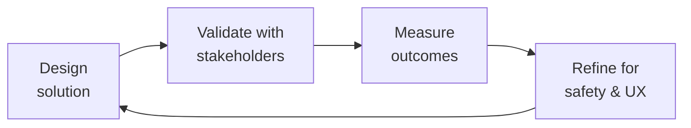

---
name: medical-content-reviewer
description: Clinical accuracy review of health content — medical misinformation detection
  and prevention, evidence-based content validation (use of citations, GRADE framework
  for evidence quality), community Q&A medical accuracy, health claims fact-checking,
  clinical guideline compliance, disclaimer and liability language, adverse event
  reporting triggers. Use when reviewing patient-facing content for clinical accuracy,
  building medical misinformation detection rules, or establishing a content review
  workflow.
author: Sandeep Kumar Penchala
type: health-clinical
status: stable
version: 1.0.0
updated: 2026-07-22
tags:
- medical-content-review
- clinical-accuracy
- misinformation
- evidence-based-medicine
- health-content
token_budget: 3500
output:
  type: document
  path_hint: review/
chain:
  consumes_from:
  - ai-safety-engineer
  - clinical-informatics-specialist
  - compliance-officer
  - legal-advisor
  feeds_into:
  - ai-safety-health-reviewer
  - content-policy-manager
  - medical-illustrator
  - patient-community-safety
  - patient-health-educator
  alternatives:
  - compliance-officer
------
# Medical Content Reviewer

Ensure every piece of health content in your app is clinically accurate, evidence-based, and legally defensible. This skill covers medical accuracy review workflows, misinformation detection, evidence quality assessment, disclaimer drafting, and adverse event trigger identification — specifically for digital health apps and patient communities.

## Route the Request
<!-- QUICK: 30s -- pick your path, skip the rest -->
```
What are you trying to do?
├── REVIEW patient-facing education content for clinical accuracy → Jump to "Core Workflow" — Phase 1
├── RESPOND to a potentially harmful community post → Go to "Decision Trees > Community Content Triage"
├── BUILD medical misinformation detection rules → Jump to "Core Workflow" — Phase 2 (Detection)
├── ASSESS whether a claim is evidence-based → Go to "Decision Trees > Evidence Quality Assessment"
├── WRITE medical disclaimers for app content → Jump to "Best Practices — Disclaimers"
├── REPORT a potential adverse event discovered in community content → Go to "Core Workflow" — Phase 4
├── Need compliance/regulatory sign-off → Invoke `compliance-officer` after this skill
├── Need clinical terminology, FHIR, or EHR integration expertise? → Invoke `clinical-informatics-specialist` for coded clinical references and data standards
├── Detected an adverse event or patient safety concern? → Invoke `crisis-response-manager` immediately — do NOT just delete the content
├── Creating patient-facing education content? → Invoke `patient-health-educator` for health-literate content design; return here for clinical review
├── Need AI safety review of health content? → Invoke `ai-safety-health-reviewer` for automated clinical validation guardrails
├── Need content policy alignment for misinformation rules? → Invoke `content-policy-manager` for policy enforcement and triage criteria
└── Not sure where to start? → Start at "Ground Rules" then "When to Use"
```
Do not read the entire skill. Follow the route above and read only the sections it points to.

## Ground Rules — Read Before Anything Else
<!-- QUICK: 30s -->
These rules apply to *every* response this skill produces. Medical content review is a clinical responsibility, not an editorial one.

- **Never approve clinical content without cited evidence.** Every treatment claim must cite a peer-reviewed source, clinical practice guideline (MASAC, WFH, ISTH, NHF), or FDA labeling. "My doctor told me" is not evidence for content — it's a signal for peer support, not clinical reference material.
- **The absence of evidence is not evidence of absence.** If no study supports or refutes a claim, say "there isn't enough research to know" rather than implying the claim is false. Distinguish between "proven false" and "insufficient evidence to evaluate."
- **Community content is not medical advice unless you make it so.** Adding a doctor's comment, pinning a reply, or "verified" badge to a community post changes the user's perception of authority. When you amplify community content, you assume responsibility for its accuracy.
- **Treatment decisions are between patients and their providers.** Content that contradicts a patient's prescribed treatment plan should be flagged and reviewed, but never removed solely because it differs from standard of care. Note: "This is different from what your doctor may have recommended. Always talk to your doctor before changing your treatment."
- **Adverse events must be reported, not just deleted.** If a patient reports a serious side effect or device malfunction in community content, that may be a reportable adverse event to the FDA (or equivalent regulator). Deleting the post does not delete the reporting obligation. Follow the AE reporting workflow.


## The Expert's Mindset

Master medical content reviewers carry a dual responsibility: technical excellence AND human impact. Every decision ripples through to patient outcomes, regulatory standing, and clinical trust.

| Cognitive Bias | Mitigation |
|----------------|------------|
| **Automation complacency** — over-trusting systems in high-stakes contexts | Every automated output gets a qualified human review before clinical action |
| **False precision** — treating uncertain data as exact because it's in a database | Always report confidence intervals; never present a single number without its range |
| **Normalcy bias** — assuming things will continue as they always have | Build "what if this fails?" scenarios into every rollout plan |
| **Documentation asymmetry** — over-documenting the routine, under-documenting the exceptions | Exceptions are the most valuable documentation; they teach the model, not just the rule |

### What Masters Know That Others Don't
- **The difference between statistical significance and clinical significance** — a p-value is not a treatment decision
- **Where the regulatory landmines are buried** — the 3 things that will trigger an audit versus the 30 things that won't
- **That patient experience and clinical accuracy are not trade-offs** — bad UX causes medical errors; good UX prevents them

### When to Break Your Own Rules
- **Escalate for safety, not for process.** If patient safety is at risk, bypass the chain of command.
- **Simplify for the patient.** Clinical precision means nothing if the patient can't understand or act on it.
## Operating at Different Levels

| Level | Scope | You... |
|-------|-------|--------|
| **L1** | Single deliverable | Execute defined procedures under supervision; follow protocols exactly |
| **L2** | Feature / study | Own a feature or study component; work within established regulatory frameworks |
| **L3** | System / program | Design systems that balance clinical needs, regulatory requirements, and technical constraints |
| **L4** | Product / therapeutic area | Define regulatory strategy; shape clinical development approach; influence industry guidance |
| **L5** | Industry / public health | Shape regulatory frameworks; define standards of care through evidence generation |

**Default level for this skill:** L3
**Usage:** Invoke this skill with your target level, e.g., "as an L3 medical content reviewer, design..."

For full level definitions, see `skills/00-framework/skill-levels/SKILL.md`.

## When to Use
<!-- QUICK: 30s -- scan the bullet list to decide if this skill fits -->

- Before publishing any new patient-facing health education content (article, video, infographic, FAQ)
- Reviewing community Q&A content where medical advice is being given by other patients
- Building automated detection rules for medical misinformation (treatment claims, cure claims, vaccine misinformation)
- Responding to flagged community posts about treatment experiences, side effects, or alternative therapies
- Writing medical disclaimers, terms of use, and liability language for health content in the app
- Identifying adverse event signals in community content that may need regulatory reporting
- Evaluating whether a pharma partner's educational content meets your clinical accuracy standards
- Auditing existing app content for outdated or inaccurate medical information

## Cross-Skill Coordination
<!-- QUICK: 30s — table of who to talk to when -->
Medical content review operates at the intersection of clinical accuracy, regulatory compliance, and patient safety. Every content approval carries clinical liability — coordination with clinical, regulatory, and content teams ensures evidence-based content that is legally defensible and medically safe.

### Coordinate With

| Coordinate With | When | What to Share/Ask | Clinical Validation Gate |
|-----------------|------|-------------------|--------------------------|
| **Clinical Informatics Specialist** | Content requiring FHIR terminology mapping, EHR integration context, clinical workflow validation | Terminology codes (SNOMED, LOINC, ICD-10), clinical workflow context, data standard alignment | Gate: All coded clinical references must map to validated ValueSets before content approval. |
| **Compliance Officer** | Regulatory review of health claims, FDA labeling compliance, disclaimer language | Content for regulatory review, health claim assessment, labeling compliance check | Gate: Any content making therapeutic claims requires regulatory sign-off before publication. Artifact: Regulatory review checklist with sign-off. |
| **Legal Advisor** | Liability review of content, disclaimer adequacy, adverse event reporting obligation assessment | Content with potential liability risk, AE trigger language, disclaimer effectiveness | Gate: Content with liability exposure must receive legal review before publication. Artifact: Legal review memo. |
| **Content Policy Manager** | Content policy alignment, misinformation flagging rules, community content triage criteria | Medical misinformation detection rules, content policy gaps, triage criteria updates | Gate: Misinformation detection rules validated against clinical evidence before deployment. |
| **Patient Health Educator** | Patient-facing content for clinical accuracy review, readability assessment, health literacy validation | Education content drafts, behavior change frameworks, health literacy scores | Gate: All patient education content must pass clinical accuracy review before reaching patients. Artifact: Clinical accuracy sign-off form. |
| **AI Safety Health Reviewer** | AI-generated health content review, automated clinical validation, safety guardrail testing | AI content outputs, safety validation results, guardrail effectiveness data | Gate: AI-generated health content must pass human clinical review before patient exposure. Artifact: AI safety validation report. |

### Regulatory Handoffs & Patient Safety Protocols

| Handoff Trigger | Route To | Protocol | Regulatory Timeline |
|----------------|----------|----------|---------------------|
| Adverse event signal detected in community content | `crisis-response-manager` | Flag → Isolate content → Do NOT delete → Document timestamp → Transfer to crisis response | Within 1 hour of detection |
| Content contains unapproved drug claims (off-label promotion) | `compliance-officer` → `legal-advisor` | Flag content → Halt publication → Regulatory review → Corrective action | Before publication or within 24 hours of discovery |
| Content contradicts FDA-approved labeling | `compliance-officer` → `clinical-informatics-specialist` | Flag → Clinical review → Regulatory assessment → Content correction or removal | Within 48 hours |
| Medical misinformation detected at scale (>100 posts) | `content-policy-manager` → `crisis-response-manager` | Triage → Pattern analysis → Policy update → Community notification | Within 24 hours |
| Patient safety concern (self-harm, suicide risk, abuse) | `crisis-response-manager` (immediately) | Warm handoff protocol → Do NOT leave patient with automated response → Document | Within 5 minutes |

### Escalation Path

```
Patient safety concern (self-harm, AE, abuse)? → crisis-response-manager. Within 5 minutes.
Regulatory concern (off-label claims, misleading content)? → compliance-officer + legal-advisor. Within 24 hours.
Content liability risk (potential lawsuit)? → legal-advisor + compliance-officer. Within 48 hours.
Systematic misinformation campaign detected? → content-policy-manager + crisis-response-manager. Within 24 hours.
```

### Decision Gates

- **Evidence quality gate:** Every treatment claim must cite GRADE-assessed evidence (High/Moderate/Low/Very Low). Claims supported only by Low or Very Low evidence require explicit disclaimer: "Limited evidence supports this claim — talk to your doctor."
- **Regulatory review gate:** Any content making therapeutic claims about prescription drugs, medical devices, or biologic products requires regulatory review before publication. No exceptions.
- **Clinical accuracy sign-off:** All patient-facing health content requires sign-off from a qualified clinical reviewer before publication. Content without sign-off is held from publication.

## Proactive Triggers

| Trigger | Action | Why |
|---|---|---|
| New clinical guideline published by WFH, NHF MASAC, or ISTH that supersedes content on your platform | Flag all affected content within 72 hours; prioritize review by clinical risk level (treatment/dosing first, lifestyle/general last); update or retire outdated content | Outdated clinical guidelines in patient-facing content are a patient safety and liability risk — patients make treatment decisions based on your content |
| AI-generated health content queued for publication without human clinical review | Halt publication immediately; route to qualified clinical reviewer; verify every citation (AI hallucinates DOIs); check against current guidelines | AI-generated health content without human review is indistinguishable from reviewed content to patients — and it can contain dangerous, subtle errors |
| Adverse event signal pattern detected across 3+ community posts mentioning same drug + same side effect | Flag for AE triage within 1 hour; preserve all source content (do not delete); escalate to crisis response manager; document for regulatory record | Community-detected AE signals have identified safety issues that formal pharmacovigilance missed — this is not noise, it's surveillance data |
| Content makes therapeutic claim about a prescription drug without regulatory review sign-off | Halt publication; route to compliance officer for FDA labeling review; add appropriate disclaimers or remove claim if unsupported | Unapproved drug claims expose the organization to FDA warning letters and patient harm — regulatory review is never optional |
| Medical misinformation detected at scale (>100 posts across multiple threads) | Activate misinformation response protocol: triage → pattern analysis → clinical risk assessment → policy update → community notification within 24 hours | Misinformation at scale normalizes dangerous beliefs — speed of response determines whether it becomes "common knowledge" in the community |
| Content review backlog exceeds 48 hours for high-risk content (treatment, dosing, procedures) | Escalate to medical director; bring in additional reviewers; prioritize by clinical risk — low-risk lifestyle content can wait, treatment content cannot | A 48-hour delay on treatment content review means patients may see unverified claims for 2 days — that's unacceptable for high-risk content |
| Off-label use discussed in patient community without clinical context | Do NOT delete; add moderator note with balanced information: "This medication is FDA-approved for [indication]. Some doctors prescribe it off-label for [other use]. Here's what the evidence says. Talk to your doctor." | Patients discuss off-label use because they're seeking options — suppressing the conversation drives it underground; balanced context serves safety |
| Reviewer disagreement on content accuracy between two qualified clinicians | Route to third reviewer (medical director or specialist) within 48 hours; document the disagreement and resolution; use as training case for future reviews | Disagreement between qualified reviewers is not failure — it surfaces genuine clinical nuance that patients benefit from understanding | 

## Decision Trees
<!-- QUICK: 30s -- follow the ASCII tree to your scenario -->

### Community Content Triage

```
                    ┌──────────────────────────────┐
                    │ START: A community post is    │
                    │ flagged for medical content   │
                    └──────────────┬───────────────┘
                                   │
                     ┌─────────────▼─────────────┐
                     │ Does the post contain a    │
                     │ specific treatment claim?  │
                     └────┬─────────────────┬────┘
                          │ YES             │ NO
                     ┌────▼──────────┐ ┌─────▼──────────────────────┐
                     │ Is the claim   │ │ Personal experience /     │
                     │ about a pre-   │ │ peer support? → Allow,    │
                     │ scription drug,│ │ add "individual results   │
                     │ dosage, or     │ │ vary" disclaimer on the   │
                     │ medical device?│ │ thread. No removal unless │
                     └────┬──────────┘ │ it's dangerous (see right).│
                          │ YES        └────────────────────────────┘
                     ┌────▼──────────┐
                     │ Does it match  │
                     │ FDA-approved   │
                     │ labeling?      │
                     └────┬──────────┘
                     ┌─────┴──────┐
                     │ NO         │ YES
                  ┌──▼──┐     ┌───▼───┐
                  │ Is  │     │ Allow │
                  │ the  │     │ with  │
                  │ claim│     │ dis-  │
                  │ dan- │     │ claim-│
                  │ ger- │     │ er +  │
                  │ ous? │     │ "not │
                  └──┬───┘     │ medi- │
                ┌────┴────┐    │ cal   │
                │ YES     │ NO │ adv-  │
             ┌──▼──┐  ┌──▼──┐ │ ice for│
             │ Re-  │  │ Add │ │ *you  │
             │ move │  │ flag│ │ spe-  │
             │ +    │  │: "ⓘ │ │ cifi- │
             │ warn │  │ This │ │ cally.│
             │ +    │  │ may  │ └───────┘
             │ re-  │  │ not  │
             │ port │  │ apply│
             │ AE if│  │ to   │
             │ harm │  │ ev-  │
             │ re-  │  │ ery- │
             │ port-│  │ one."│
             │ ed   │  └──────┘
             └──────┘
```

**Dangerous claims (remove immediately):** "Stop taking your factor — I switched to herb X and I'm cured." "Here's how to compound your own factor at home." "Children don't need prophylaxis; it's overprescribed." These cause direct harm. **Off-label but not dangerous (flag with context):** "My doctor prescribed X for my chronic synovitis" — off-label but may be legitimate. Add context, don't remove.

## Core Workflow
<!-- QUICK: 30s -- scan phase titles to understand the process -->

### Phase 1 (~20 min): Clinical Accuracy Review of Published Content
**Steps:** 1) Read every clinical claim in the content — highlight all disease, treatment, dosage, prognosis, and prevention statements 2) For each claim, verify against primary source: FDA label, NIH/PubMed, Cochrane Review, or clinical practice guideline (MASAC, WFH, NHF, ISTH). Secondary sources (WebMD, Wikipedia) are starting points, not evidence. 3) Classify each claim: Evidence-supported (✅), Insufficient evidence (⚠️ needs qualifier like "some studies suggest..."), Contradicted by evidence (❌ needs correction or removal), Outdated (⏳ guideline changed, needs update) 4) Add clinical context: "While this study shows X, the WFH guidelines note Y as the recommended approach" 5) Document review: claim, source, classification, action taken. Keep a permanent audit trail.

**What good looks like:** Content with 100% of clinical claims cited to primary sources. A review document showing every claim classified (✅/⚠️/❌/⏳) with source citations. No unverified treatment claims. Audit trail complete.

### Phase 2 (~25 min): Misinformation Detection Rules
**Steps:** 1) Define harm levels: Level 1 (dangerous — immediate removal, possible AE report), Level 2 (misleading — flag with corrective context), Level 3 (unsubstantiated — add "not enough research" note), Level 4 (personal experience — no action beyond threading disclaimer) 2) Build keyword and pattern rules: "cure" + "hemophilia" = Level 2 (no known cure). "Stop taking" + medication name = Level 1. "Natural treatment" + condition = Level 2. 3) Add context-aware rules: "My doctor switched me to X" = personal experience (Level 4) vs "Everyone should try X instead of Y" = medical advice (Level 2) 4) Set up escalation: level 1 → immediate removal + clinical review + AE assessment. Level 2 → 24-hour clinical review. Level 3-4 → flag but no removal. 5) Review and iterate on rules monthly — misinformation tactics evolve faster than your ruleset

**What good looks like:** Detection rule library with 20+ rules at multiple harm levels. Auto-triage catches 80% of Level 1 content before a human sees it. Human reviewers handle levels 2-4. Monthly rule update cadence.

### Phase 3 (~15 min): Disclaimer and Liability Language
**Steps:** 1) Primary disclaimer: "This content is for informational purposes only and is not medical advice. Always consult your healthcare provider about your specific condition and treatment." — REQUIRED on every education page 2) Community content disclaimer: "Posts in this community are from people with hemophilia and their caregivers. They reflect personal experiences, not medical advice. Always talk to your doctor before changing your treatment." — REQUIRED at the top of every community thread 3) AI-generated content disclaimer (if applicable): "This content was generated with the assistance of AI and has been reviewed by a clinician for accuracy." — REQUIRED for any AI-assisted health content 4) Adverse event reporting notice: "If you experience a serious side effect or device malfunction, report it to your doctor and to the FDA at MedWatch: 1-800-FDA-1088." — ADD to any page discussing treatment side effects

**What good looks like:** Disclaimers on every health content page, community thread, and AI-generated content. Legal reviewed and approved. Consistent placement and wording across the app.

### Phase 4 (~15 min): Adverse Event Signal Detection
**Steps:** 1) Define AE triggers: mention of hospitalization, ER visit, serious side effect, device failure, death, or permanent injury related to a treatment 2) When an AE signal is detected in community content, collect: what happened, what product/device was involved, when it happened, was it reported to the manufacturer or FDA? 3) Determine reportability: serious and unexpected AEs may be reportable to FDA within 15 days (if you are a manufacturer or have reporting obligations under your pharma partnership) 4) If reportable: document all available information, send to the appropriate party (FDA MedWatch, manufacturer, your legal team). Do NOT delete the post until the reporting obligation is fulfilled. 5) Non-reportable: document in your AE log for trend analysis. Multiple similar reports may indicate a safety signal.

**What good looks like:** AE detection workflow documented and understood by content moderation team. AE log maintained. Reportable AEs submitted within regulatory timelines. Privacy maintained throughout (no patient identity shared unless required by regulation).

## Best Practices
<!-- DEEP: 10+min -->
<!-- STANDARD: 3min -- rules extracted from health content review experience -->

- **One clinician reviewer is not enough for high-risk content.** For any content about treatment decisions, dosing, or procedural instructions, have two independent reviewers. Disagreements go to a third reviewer (medical director or specialist). A single reviewer can miss subtle errors.
- **Update content when guidelines change.** WFH (World Federation of Hemophilia) guidelines are updated every 4-5 years. NHF MASAC recommendations are updated annually. Set a content review schedule aligned with guideline update cycles. Outdated guidelines in patient-facing content are a liability.
- **Distinguish between "not approved by FDA" and "not proven."** Many treatments used in hemophilia care are used off-label (e.g., emicizumab was used off-label for some indications before full approval). Off-label ≠ unsafe. Flag off-label use with context, not alarm.
- **Language matters in health content.** "Prophylaxis prevents bleeds" is accurate. "Prophylaxis guarantees you won't bleed" is not. Always include appropriate qualifiers: may, can, some patients, in clinical trials, depending on your specific condition. Absolute statements in health content are almost always wrong.
- **Community content about side effects is both a risk and an opportunity.** Risk: unverified claims may scare patients away from effective treatments. Opportunity: real-world side effect patterns that clinical trials missed may be detected early. Treat community side effect discussion as safety surveillance, not noise.
- **AI-generated health content must meet the same standard as human-written content.** Never publish AI-generated health content without clinical review. The AI may cite papers that don't exist (hallucinated DOIs), quote guidelines that have been superseded, or make subtle errors that a non-clinician would miss.

## Anti-Patterns

| ❌ Anti-Pattern | ✅ Do This Instead |
|---|---|
| Single clinician reviews high-risk content (treatment, dosing, procedures) without second review | Two independent reviewers for all treatment/dosing/procedure content; disagreements go to medical director or specialist for tie-breaking |
| Publishing content with absolute statements about health outcomes | Always include appropriate qualifiers: "may," "can," "some patients," "in clinical trials" — absolute statements in health content are almost always wrong |
| Treating all off-label drug discussions as policy violations | Distinguish between "not FDA-approved" and "not proven"; add balanced clinical context rather than deleting — patients discuss off-label use because they're seeking options |
| Content review schedule not aligned with guideline update cycles | Map all content to governing guidelines (WFH: every 4-5 years; NHF MASAC: annually); schedule re-review when guidelines update; flag content referencing superseded guidance |
| AI-generated health content published without human clinical verification | Every AI-generated health output must pass human clinical review; verify every citation (AI hallucinates DOIs); check all claims against current guidelines before publication |
| Dismissing community side-effect discussions as anecdotal noise | Treat community side-effect reports as safety surveillance data: log patterns, track frequencies, escalate clusters — patient-reported signals have detected issues clinical trials missed |
| Content flagged as medically inaccurate but left online pending "review cycle" | Remove or gate inaccurate content immediately if it poses clinical risk; the review cycle can wait — patient safety cannot |
| Using complex medical terminology in patient-facing content without plain-language alternatives | Every clinical term must have a plain-language equivalent on first use; target 6th-8th grade reading level; validate with health literacy assessment tool | 

## Error Decoder
<!-- DEEP: 10+min -->

| Symptom | Root Cause | Fix | Lesson |
|---------|------------|------|
| Patient follows bad advice from community post and is harmed | Misinformation detection missed the post or escalated too slowly | Audit detection rules for that type of content. Add the trigger term. Re-train moderation team on harm levels. Ensure all Level 1 triage is sub-5 minute response time. | Sub-5-minute triage for Level 1 content is not a nice-to-have — it is a patient safety requirement. Every second of delay increases the chance that someone acts on the bad advice. |
| Legal flags a disclaimer as insufficient for regulatory liability | Disclaimer doesn't specify it's not medical advice or doesn't include AE reporting info | Use the disclaimer language from Phase 3 verbatim. Have legal review all disclaimer text before publication. Add AE reporting notice on any page that mentions specific medications. | Disclaimers are a regulatory requirement, not a liability shield — use the exact language reviewed by legal and place it on every page with medication-specific content. |
| Clinician reviewer finds an error in content that was already reviewed and published | Single-reviewer process missed an edge case | Add second reviewer requirement. Implement pre-publication hold: content cannot publish until 2 reviewers sign off. Retroactively fix all published content in that category. | A single reviewer is a single point of failure for clinical content — two-reviewer requirement is the minimum standard when patient safety is at stake. |
| Pharma partner complains that community content contradicts their product label | Community personal experiences may not match FDA label — which is expected and legal | Add contextual disclaimer on the specific thread: "This member's experience may differ from the FDA-approved labeling for [product]. Always follow your healthcare provider's guidance." Do not remove the post unless it's dangerous. | Patient experiences that differ from FDA labels are real and legal — add context, do not censor. Trust is built by letting members share honestly while providing professional perspective. |
| User reports that AI-generated health advice caused them harm | AI-generated content wasn't clinically reviewed before publication | Immediately remove ALL AI-generated health content from the app. Implement mandatory clinical review gate before any AI content is published. Add AI content disclaimer when restored. | AI-generated health content without clinical review is a patient safety incident waiting to happen — gate all AI content behind clinical review before publication. |
| Community post about a side effect goes viral, causing treatment discontinuation | No context was added to the post, and no clinician response was provided | Proactive protocol: when a side-effect post gains traction, have a clinician respond publicly within 24 hours. "We understand this member experienced X. If you're experiencing a side effect, talk to your doctor. Do not stop your medication without consulting them." | A viral side-effect post without clinician context is a treatment-adherence crisis — every health community needs a 24-hour clinician response protocol for trending medical content. |

## Production Checklist
<!-- QUICK: 30s -- all must pass before clinical content review is operational -->

- [ ] **[M1]** Clinical content review workflow documented: claim extraction → source verification → classification → action
- [ ] **[M2]** Review covered by at least 1 clinician (2 for treatment/dosing/procedural content)
- [ ] **[M3]** Misinformation detection rule library built with minimum 20 rules across all 4 harm levels
- [ ] **[M4]** Disclaimers placed on all health education pages, community threads, and AI-generated content
- [ ] **[M5]** Legal reviewed and approved all disclaimer and liability language
- [ ] **[M6]** Adverse event detection workflow documented: triggers identified, reporting obligations understood, AE log active
- [ ] **[M7]** Content review schedule aligned with clinical guideline update cycles (WFH, NHF MASAC, ISTH)
- [ ] **[M8]** AI-generated health content gate: mandatory clinical review before publication
- [ ] **[M9]** Community content triage response SLAs defined: Level 1 < 5 min, Level 2 < 24h, Level 3-4 < 72h
- [ ] **[M10]** Audit trail maintained for all clinical content reviews (claim, source, classification, action, reviewer)
- [ ] **[M11]** Second reviewer required for high-risk content (treatment decisions, dosing, procedures)
- [ ] **[M12]** Cultural and language adaptation reviewed for diverse patient populations

## Cross-Skill Integration
<!-- QUICK: 30s -- table of who to talk to when -->

| Step | Skill | What It Produces |
|------|-------|-----------------|
| **Before** | `patient-health-educator` | Patient education modules → needs clinical accuracy review before publication |
| **Before** | `content-strategist` | Health blog content, social media content → needs clinical fact-checking |
| **Before** | `trust-safety-engineer` | Flagged community posts with medical content → needs clinical triage |
| **This** | `medical-content-reviewer` | Clinical accuracy review, misinformation detection, AE signal detection, disclaimers |
| **After** | `compliance-officer` | Reviewed content, AE report log, disclaimer documentation → feeds compliance audit |
| **After** | `legal-advisor` | Disclaimer language, AE reporting obligations, liability review → legal sign-off |
| **After** | `product-manager` | Clinical accuracy findings → informs feature decisions (e.g., community Q&A redesign) |

## Scale Depth
<!-- DEEP: 10+min -->
<!-- QUICK: 30s -- how this skill changes as the company grows -->

### Solo (0-10 users, 1 person)
**Description:** Single reviewer checks all content manually
**When to use:** Accuracy above all — don't publish bad info
**Approach:** One clinician reviews everything; manual checklist; no tooling

### Small Team (10-100 users, 2-5 people)
**Description:** Review team + style guide, basic content management
**When to use:** Scale review throughput, build consistency
**Approach:** Multiple reviewers; documented guidelines; editorial calendar; version control

### Medium Team (100-10K users, 5-20 people)
**Description:** Specialized reviewers by content type, automated checks
**When to use:** Deep expertise, automated first-pass screening
**Approach:** Cardiology reviewer vs. endocrinology reviewer; automated fact-checking; AE signal detection

### Enterprise (10K+ users, 20+ people)
**Description:** Clinical review board, regulatory-grade process, published content governance
**When to use:** Institutional credibility, regulatory defense
**Approach:** Medical director + review board; SOPs for every content type; FDA/EMA-compliant process; content audit trail

### Transition Triggers
- Move from Solo to Small Team when: Single reviewer becomes a bottleneck; multiple content types require specialized review; manual process can't keep up with content volume
- Move from Small Team to Medium Team when: Review team struggles with content volume; need specialized domain reviewers; automated first-pass screening becomes necessary for efficiency
- Move from Medium Team to Enterprise when: Regulatory compliance requires formal governance; auditability and institutional credibility become paramount; medical director oversight and FDA/EMA-compliant processes are needed

## What Good Looks Like
- **Every piece of health content published in the app has been clinically reviewed** with documented source citations. A user reading "Factor VIII prophylaxis reduces bleeds by 87%" sees a footnote linking to the clinical trial. No unverified claims exist in the app.
- **A community post claiming "essential oils cured my hemophilia" is detected and removed within 3 minutes** — the misinformation detection rules catch it, a reviewer confirms it's Level 1 dangerous content, and the user who posted it receives a private message explaining why and offering verified information.
- **A concerning pattern of patients reporting similar side effects triggers a safety signal investigation.** The AE log reveals 8 reports of the same issue in 2 months. The clinical team investigates and contacts the manufacturer. Patients are not harmed because the signal was detected early.
- **The app's health content passes a legal audit** with no liability gaps. Disclaimers are present where they should be. AI-generated content is clearly labeled. The adverse event reporting workflow is documented and followed. The company is protected against claims of practicing medicine without a license.


## Footguns
<!-- DEEP: 10+min — war stories from medical content review -->

| Footgun | What Happened | Root Cause | How to Prevent |
|---------|---------------|------------|----------------|
| Community post "My son's inhibitor disappeared after I switched him to a raw food diet — ask me how!" stayed up for 72 hours because misinformation rules flagged "essential oils" and "homeopathy" but not dietary cure claims | A parent posted in a hemophilia community claiming a raw food diet eliminated their child's factor VIII inhibitor — a documented, life-threatening complication where the immune system destroys infused clotting factor. The post received 340 upvotes and 87 comments before removal. Three parents reported discontinuing immune tolerance induction therapy to "try the diet first." The misinformation detection rulebook had 20 patterns covering supplements and alternative medicine, but none for "dietary cure for immune-mediated condition." The post was only flagged when a hematologist member reported it. | The detection rules were built from a list of known pseudoscience categories (essential oils, homeopathy) rather than harm patterns. "Diet cured my [condition]" didn't match any existing rule because it's a claim structure, not a pseudoscience category. | **Build misinformation detection rules from harm patterns, not just content categories.** A harm-pattern rule: "Any claim that a non-medical intervention eliminated or cured [diagnosed condition] without clinical evidence." This catches dietary cures, energy healing, and future pseudoscience categories you haven't encountered yet. Review the rulebook quarterly against actual removed content — if a post that was eventually removed wasn't caught by any rule, write a new harm-pattern rule for it. |
| AI-generated "Ask Dr. AI" feature went live without clinical review gate — answered a patient's question about factor dosing with a recommendation 40% above the standard weight-based calculation | A health app deployed an LLM-powered Q&A feature where patients could ask medical questions. The prompt engineering was done by the ML team; clinical review was "on the roadmap." A patient with hemophilia B asked: "I weigh 72 kg and take 50 IU/kg of BeneFIX. Is this right?" The AI responded: "Based on your weight, you would need approximately 5,040 IU per dose" — it multiplied 72 × 50 correctly to 3,600, then added 40% with a hallucinated "loading dose adjustment." The actual standard dosing is 50 IU/kg = 3,600 IU. The patient administered 5,000 IU, experienced no adverse event, but the incident was reported by the patient's HTC when they mentioned the AI's advice during a clinic visit. The feature was taken offline within 2 hours of the report. The company self-reported to FDA. | AI content was treated as an engineering feature, not a clinical content publication. No clinical review gate existed. The ML team had no medical training and couldn't evaluate whether the output was clinically dangerous. | **All AI-generated health content must pass through a clinical review gate before any patient sees it.** The gate has three levels: (1) automated safety check — does the output contain dosing numbers? If yes, flag for human review. (2) Clinical reviewer evaluates accuracy against standard guidelines. (3) Post-publication monitoring: track patient reports about AI content. No AI health feature launches without all three. The ML team cannot self-certify clinical safety. |
| Legal disclaimer "This is not medical advice" placed at the bottom of a page recommending specific factor dosing — court ruled the disclaimer didn't negate the substantive medical advice in the body of the content | A health app published an article titled "How to Dose Factor VIII for a Joint Bleed" with specific dose calculations by weight and bleed severity. The footer said "This content is for informational purposes only and does not constitute medical advice." A patient followed the article's dosing table for an ankle bleed, under-dosed by 30% because they misread their weight category, and experienced a target joint deterioration requiring 6 months of physical therapy. The patient sued. The court ruled: "A disclaimer does not immunize the publisher when the substantive content provides specific medical instructions — the content IS medical advice regardless of the label." The case settled for $380K. | The team believed a disclaimer transforms medical advice into general information. It doesn't. Courts evaluate the substance of content, not the legal labels attached to it. If you provide specific dosing instructions, you are giving medical advice regardless of your disclaimer. | **Disclaimers protect against informational content being misinterpreted as medical advice — they do NOT protect specific treatment instructions.** Audit all content: does it say "do X dose for Y condition"? If yes, either (a) remove the specific instruction and replace with "talk to your doctor about dosing," or (b) accept that you are giving medical advice and ensure it meets the standard of care, is reviewed by a licensed clinician, and your liability insurance covers it. No disclaimer makes a dosing table safe. |
| Single clinician reviewed 100% of content for 18 months — after they went on medical leave, a backlog of 47 unreviewed articles accumulated, and 3 contained outdated treatment protocols reflecting guidelines from 2018 | A patient education platform relied on one part-time hematologist to review all clinical content. The review process had no backup. When the hematologist took a 3-month medical leave, content continued to publish on schedule — bypassing review because "the pipeline can't stop." Of 47 articles published during the gap, 3 referenced treatment protocols from the 2018 WFH guidelines that were superseded by the 2023 edition: one recommended a lower prophylaxis dose than current standard, one omitted extended half-life products as a treatment option, and one used outdated inhibitor management algorithms. These articles were live for 5 months before a second reviewer was hired and caught the errors. An estimated 2,400 patients read the outdated content. | Single point of failure in clinical review. No mechanism to pause publication when review capacity is unavailable. No content version tracking linked to guideline edition dates. | **Clinical content review requires minimum 2 reviewers — not for every article, but for the system to have redundancy.** Each article is tagged with the guideline edition it references. A quarterly audit checks: are any published articles referencing a guideline edition older than the current one? If yes, flag for re-review. The publication pipeline has an emergency stop: if no clinical reviewer is available, content does NOT publish. Patient safety > content calendar. |
| Pharma-sponsored content about a new extended half-life product published without sponsor disclosure — patients trusted it as independent education, and 3 switched products based on the article | A pharma company sponsored a series of patient education articles about extended half-life factor products. The sponsorship agreement included editorial independence: the pharma company couldn't control content. But the articles didn't disclose the sponsorship. An article titled "Is Extended Half-Life Factor Right for You?" presented one product's PK data prominently while summarizing competitors' data in a footnote. Three patients asked their HTCs to switch to the featured product. An advocacy organization flagged the missing disclosure. The company added disclosures retroactively but lost credibility with patient advocates and the medical advisory board. | The editorial team believed "we maintained editorial independence, so no disclosure is needed." Independence and transparency are separate requirements. Patients have a right to know who funded the content, even if the funder didn't influence it. | **Every sponsored, partnered, or grant-funded health content piece must carry a disclosure in the header, not the footer.** Format: "This article was developed with support from [company]. The sponsor had no editorial control over content." If the sponsor provided data, add: "Clinical data for [product] was provided by the sponsor and independently reviewed by our medical team." No disclosure = no publication, regardless of editorial independence. |

## Calibration — How to Know Your Level
<!-- STANDARD: 3min — honest self-assessment -->

| You Know You're Stuck at L1 When... | You Know You've Reached L2 When... | You Know You're L3 When... |
|---|---|---|
| You can spot obvious misinformation ("essential oils cure cancer") but can't distinguish between a GRADE A recommendation (multiple RCTs) and a GRADE C recommendation (expert opinion only) — and you cite them with equal weight | You've built a misinformation detection rulebook with 30+ harm-pattern rules that catches >95% of flagged content on first pass, and your false-positive rate is under 3% (posts incorrectly flagged as dangerous) | A health publisher asks you to audit their 3,000-article content library for clinical accuracy — you produce a prioritized remediation list with correct classification of harm levels, and your top 10 findings all receive "this should have been caught" agreement from their medical director |
| You review content but can't name the specific clinical guideline, edition year, and recommendation strength behind every factual claim you approve | You can review a community post with a drug claim, identify the 4 AE elements within 60 seconds, and trigger the pharmacovigilance workflow before the post reaches 10 views | You design the clinical review process for a company's IPO readiness audit — the external auditor reviews 200 randomly selected content items and finds zero clinical errors, zero missing citations, and zero undisclosed pharma relationships |
| Your default action for questionable content is "delete it" — you haven't developed the judgment to distinguish between "removable dangerous advice" and "patient experience that disagrees with FDA labeling but is legally protected speech" | Your reviews have caught at least one clinical error that, if published, would have directly harmed a patient — and you can describe the specific error, the harm pathway, and the correction you made | You're deposed as an expert witness in a case about patient harm from online health content — and your testimony about clinical review standards is cited in the court's ruling as the standard of care for digital health platforms |

**The Litmus Test:** A community member posts: "My doctor says I have a factor VIII inhibitor, but I've been taking St. John's Wort for 6 months and my last Bethesda assay was 0.0 BU. My doctor doesn't know about the St. John's Wort. Should I tell her?" Within 60 seconds you identify that this post (a) contains a potentially dangerous treatment-discontinuation signal, (b) requires a clinician response — not just removal, and (c) needs an AE flag because the patient reports a drug-herb interaction affecting a lab result. If you can write the exact moderator response that balances safety, empathy, and regulatory compliance in under 3 minutes, you're L3. If you default to "delete and warn," you're not there yet.

## Deliberate Practice



| Level | Practice | Frequency |
|-------|----------|-----------|
| **Novice** | Shadow a clinician or patient for a day; document every moment of friction in their workflow | Quarterly |
| **Competent** | Review a past project that had a safety or compliance issue; map the chain of decisions that led there | Monthly |
| **Expert** | Design a solution under 3 conflicting regulatory regimes (e.g., FDA, EMA, PMDA); identify where they diverge | Quarterly |
| **Master** | Contribute to industry guidelines or regulatory frameworks; move from following rules to shaping them | Annually |

**The One Highest-Leverage Activity:** Every project post-mortem must include a "patient impact" section. If you can't trace your work to a patient outcome, you're building in the dark.

## References
<!-- STANDARD: 3min -->

- **ai-safety-engineer, clinical-informatics-specialist, compliance-officer** and others — for upstream design decisions, specifications, and architectural context that inform Medical content accuracy review and clinical validation
- **ai-safety-health-reviewer, content-policy-manager, medical-illustrator** and others — downstream skills that consume outputs from this skill for implementation and execution
