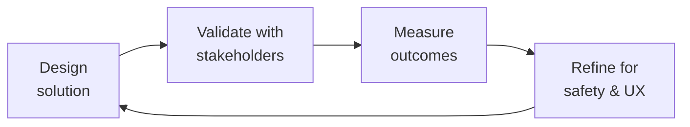

# Medical Content Reviewer
> **Portability target:** Spec-level (runs on Claude Code, Copilot, Gemini CLI, Codex, Cursor). No vendor-specific frontmatter fields.

Ensure every piece of health content in your app is clinically accurate, evidence-based, and legally defensible. This skill covers medical accuracy review workflows, misinformation detection, evidence quality assessment, disclaimer drafting, and adverse event trigger identification — specifically for digital health apps and patient communities.
## <!-- DEEP: 5+min --> RESEARCH_PREREQUISITE — Execute Before Any Output

**This is a HARD GATE. Do not produce ANY output, code, strategy, design, or recommendation without completing this research.**

Before you act, you MUST execute every applicable research step. Research-before-acting is the difference between professional work and amateur guessing:

| # | Research Step | Why It Matters | Where to Look |
|---|--------------|----------------|----------------|
| **RP1** | **Verify domain currency.** Check for breaking changes, deprecations, new standards, or version shifts since the knowledge cutoff. | [STALE_RISK] Outdated advice breaks real systems. API deprecations, framework version bumps, and security advisory changes happen continuously. Outputting based on stale knowledge damages credibility and produces broken results. | Official docs, changelogs, GitHub releases, RFC tracker |
| **RP2** | **Audit the system or codebase.** Read relevant files. Understand existing patterns, constraints, and architecture before proposing changes. | [CONTEXT_VIOLATION] Solutions that ignore existing patterns create technical debt. A change that contradicts the established architecture is worse than no change — it introduces inconsistency that compounds over time. | Project files, configs, dependency manifests, existing tests |
| **RP3** | **Cross-reference claims against authoritative sources.** Every factual assertion needs a verifiable source. Mark each: [VERIFIED], [COMPUTED], or [ESTIMATED]. | [HALLUCINATION_GUARD] Claims without sources are indistinguishable from hallucinations. The #1 cause of incorrect output is treating assumptions as facts. Source tagging prevents this. | Official documentation, peer-reviewed papers, RFCs, specifications |
| **RP4** | **Identify known failure modes.** Before recommending, list what commonly breaks. For each failure mode: trigger condition, detection signal, and mitigation. | [FAILURE_BLINDNESS] Every domain has known failure patterns. Output that doesn't address them is dangerously incomplete. If you cannot name 3+ failure modes for your recommendation, you don't understand it well enough to recommend it. | Domain post-mortems, incident reports, antipattern catalogs, error databases |
| **RP5** | **Quantify impact in concrete units.** Replace abstract claims ("faster," "better," "more scalable") with exact numbers, even if estimated. | [VAGUENESS_PENALTY] "Faster" is unverifiable. "Reduces p95 latency from 340ms to 120ms (±15ms)" is verifiable. Abstract adjectives hide ignorance behind confidence. Concrete numbers expose gaps. | Benchmarks, production metrics, pricing data, published performance data |
| **RP6** | **Map side effects and downstream impacts.** What else breaks? Which dependencies are affected? Which downstream consumers need updating? | [CASCADE_BLINDNESS] Changes to one component ripple outward. A fix in module A can break module B that depends on A's old behavior. Map the blast radius before acting. | Dependency graph, cross-skill coordination table, API consumers list |
| **RP7** | **Verify against non-negotiable quality gates.** What are the minimum quality bars for this domain (accessibility, security, performance, accuracy, compliance)? | [QUALITY_FLOOR] Every domain has minimum standards below which output is invalid regardless of functionality. Missing WCAG AA = broken. Leaking credentials = broken. Silent data loss = broken. | Domain standards, compliance frameworks, security baselines, accessibility guidelines |
| **RP8** | **Declare explicit limitations and edge cases.** What does this NOT handle? What are the known boundaries? What scenarios are explicitly out of scope? | [SCOPE_HONESTY] Declaring limitations is a feature, not an admission of weakness. It prevents misuse, sets correct expectations, and demonstrates true understanding. Every solution has boundaries — naming them is professional. | This SKILL.md, domain literature, edge case databases |

**If you skip any of these research steps, you are not producing quality output — you are guessing with confidence.** Guessing wastes time, breaks systems, and destroys trust. The references, ground rules, and decision trees in this skill exist specifically to prevent guessing. Use them.

> **Compliance:** Research must be executed before any substantial output. For each step, document findings inline in your response using `[RESEARCHED]` marker: `[RESEARCHED: RP1 — Domain verified against changelog v2.4. No breaking changes since cutoff.]`. Partial research = partial quality. Zero research = zero credibility.


### 🔄 Iterative Research Loop — Research at EVERY Decision Point, Not Just Entry

**The RP1-RP8 cycle above is NOT a one-time gate.** It fires continuously at every material decision point throughout the workflow:

| Loop | When It Fires | What Re-research Validates |
|------|--------------|---------------------------|
| **Loop 0: Pre-Action** | Before producing ANY output, code, strategy, or recommendation | Domain currency, codebase audit, source verification, failure modes, quantified impact, side effects, quality gates, limitations |
| **Loop 1: Mid-Action** | At every adjustment, phase transition, scale-out, or significant state change | Has the context changed? Are the original assumptions still valid? Has new information invalidated the Loop 0 conclusions? |
| **Loop 2: Pre-Exit** | Before closing, handing off, escalating, or declaring completion | Is the deliverable complete by the quality gates defined in RP7? Are all limitations declared (RP8)? Have failure modes been addressed (RP4)? |
| **Loop 3: Post-Action** | After completion: compare expected vs. actual outcome | What was the efficiency ratio (actual / theoretical max)? What learnings emerged? What should be fed back into the pattern database for future decisions? |

**Integration into Core Workflow:**

Every decision point in a skill's Core Workflow must be marked with:
```
[RESEARCH LOOP: Re-execute RP1-RP8 before proceeding to next phase]
```

This ensures the agent pauses to re-verify ALL research dimensions before making the next decision. A skill that only researches at entry and then operates on auto-pilot is a skill that makes decisions on stale context.

**Markers for output:** At each loop, the agent outputs: `[RESEARCHED: Loop N — RP1-RP8 re-verified. Key delta from previous loop: ...]`

**Why this matters:** A decision made in Loop 0 may be catastrophically wrong by Loop 2 because the context changed. Markets move. Requirements shift. Dependencies update. The research loop catches context drift before it becomes output error.

> **Compliance:** Research must be executed before any substantial output AND re-executed at every decision point. For each research loop, document findings inline. Partial research = partial quality. Zero research = zero credibility. Stale research = dangerous confidence.


## Route the Request
<!-- STANDARD: 3min -->

<!-- QUICK: 30s -- auto-route first, then intent-route -->

### Auto-Route (No User Input Required)
Evaluate these file-system conditions in order. First match wins — jump immediately.

| # | Condition | Action |
|---|-----------|--------|
| A1 | `file_contains("*", "review")` OR `file_contains("*", "accuracy")` OR `file_contains("*", "fact.check")` OR `file_exists("review/")` | Content review task. Jump to **Core Workflow — Phase 1**. |
| A2 | `file_contains("*", "misinformation")` OR `file_contains("*", "false.claim")` OR `file_contains("*", "detection.rule")` | Misinformation detection task. Jump to **Core Workflow — Phase 2 (Detection)**. |
| A3 | `file_contains("*", "GRADE")` OR `file_contains("*", "evidence quality")` OR `file_contains("*", "citation")` OR `file_contains("*", "RCT")` OR `file_contains("*", "systematic review")` | Evidence quality assessment task. Jump to **Decision Trees > Evidence Quality Assessment**. |
| A4 | `file_contains("*", "disclaimer")` OR `file_contains("*", "liability")` OR `file_contains("*", "legal.review")` | Disclaimer drafting task. Jump to **Best Practices — Disclaimers**. |
| A5 | `file_contains("*", "adverse event")` OR `file_contains("*", "AE")` OR `file_contains("*", "side.effect")` OR `file_contains("*", "MedWatch")` OR `file_contains("*", "safety.report")` | Adverse event reporting task. Jump to **Core Workflow — Phase 4**. |
| A6 | `file_contains("*", "community")` OR `file_contains("*", "Q&A")` OR `file_contains("*", "forum")` OR `file_contains("*", "user.post")` | Community content triage task. Jump to **Decision Trees > Community Content Triage**. |
| A7 | `file_contains("*", "AI-generated")` OR `file_contains("*", "LLM")` OR `file_contains("*", "GPT")` OR `file_contains("*", "copilot")` AND `file_contains("*", "health")` | AI health content gate task. Jump to **Ground Rules R5** — mandatory clinical review required. |
| A8 | `file_exists("*.compliance.*")` OR `file_contains("*", "HIPAA")` OR `file_contains("*", "FDA")` OR `file_contains("*", "regulatory")` | Compliance/regulatory task. Invoke `compliance-officer` skill. |

### Intent Route (Fallback — When No Auto-Route Matched)

```
What are you trying to do?
├── REVIEW patient-facing education content for clinical accuracy → Jump to "Core Workflow" — Phase 1
├── RESPOND to a potentially harmful community post → Go to "Decision Trees > Community Content Triage"
├── BUILD medical misinformation detection rules → Jump to "Core Workflow" — Phase 2 (Detection)
├── ASSESS whether a claim is evidence-based → Go to "Decision Trees > Evidence Quality Assessment"
├── WRITE medical disclaimers for app content → Jump to "Best Practices — Disclaimers"
├── REPORT a potential adverse event discovered in community content → Go to "Core Workflow" — Phase 4
├── Need compliance/regulatory sign-off → Invoke `compliance-officer` after this skill
├── Need clinical terminology, FHIR, or EHR integration expertise? → Invoke `clinical-informatics-specialist` for coded clinical references and data standards
├── Detected an adverse event or patient safety concern? → Invoke `crisis-response-manager` immediately — do NOT just delete the content
├── Creating patient-facing education content? → Invoke `patient-health-educator` for health-literate content design; return here for clinical review
├── Need AI safety review of health content? → Invoke `ai-safety-health-reviewer` for automated clinical validation guardrails
├── Need content policy alignment for misinformation rules? → Invoke `content-policy-manager` for policy enforcement and triage criteria
└── Not sure where to start? → Start at "Ground Rules" then "When to Use"
```

Do not read the entire skill. Follow the route above and read only the sections it points to.

## Ground Rules — Read Before Anything Else
<!-- STANDARD: 3min -->

<!-- QUICK: 30s -->
These rules apply to *every* response this skill produces. Medical content review is a clinical responsibility, not an editorial one.

| # | Negative Constraint | Mechanical Trigger (detect before executing) | Violation Response |
|---|-------------------|---------------------------------------------|-------------------|
| **R1** | **REFUSE to approve clinical content without cited evidence.** Every treatment claim must cite a peer-reviewed source, clinical practice guideline (MASAC, WFH, ISTH, NHF), or FDA labeling. "My doctor told me" is peer support, not clinical reference material. | Trigger: `file_contains("*", "treatment")` OR `file_contains("*", "recommend")` AND NOT `file_contains("*", "doi:")` AND NOT `file_contains("*", "PMID")` AND NOT `file_contains("*", "FDA")` AND NOT `file_contains("*", "MASAC")` AND NOT `file_contains("*", "WFH")`. | STOP. Respond: "This content makes a clinical claim without cited evidence. Before I can approve it, provide: (1) a peer-reviewed source (DOI or PMID), (2) a clinical practice guideline reference (MASAC, WFH, ISTH, NHF), or (3) FDA labeling. If no evidence exists, I'll flag this as 'insufficient evidence to evaluate.'" |
| **R2** | **REFUSE to imply a claim is false when evidence is merely absent.** Distinguish between 'proven false' and 'insufficient evidence to evaluate.' Conflating these misleads patients and erodes trust. | Trigger: `file_contains("*", "no.evidence")` OR `file_contains("*", "not.proven")` OR `file_contains("*", "unproven")` AND NOT `file_contains("*", "insufficient.evidence")` AND NOT `file_contains("*", "lack.of.research")`. | STOP. Respond: "You're asserting this claim is false, but you've only shown absence of evidence. Replace 'this is not proven' with 'there isn't enough research to know whether this is true.' Add the GRADE certainty rating: Very Low / Low / Moderate / High." |
| **R3** | **REFUSE to amplify community content without accepting editorial responsibility.** Adding a doctor's comment, pinning a reply, or a 'verified' badge changes user perception of authority. When you amplify, you assume responsibility for accuracy. | Trigger: `file_contains("*", "pin")` OR `file_contains("*", "verified")` OR `file_contains("*", "doctor.comment")` AND NOT `file_contains("*", "clinical.review")` AND NOT `file_contains("*", "reviewed.by")`. | STOP. Respond: "You're about to amplify community content, which transfers editorial responsibility to you. Before pinning/verifying/commenting: (1) clinically review the content, (2) document the reviewer and date, and (3) add: 'Reviewed by [clinician] on [date]. This does not constitute medical advice.'" |
| **R4** | **REFUSE to delete community content solely because it contradicts standard of care.** Treatment decisions are between patients and providers. Content differing from standard of care should be flagged with context, not censored. | Trigger: `file_contains("*", "delete")` OR `file_contains("*", "remove")` AND `file_contains("*", "contradicts")` AND NOT `file_contains("*", "dangerous")` AND NOT `file_contains("*", "immediate.harm")`. | STOP. Respond: "This content differs from standard of care but does not meet the threshold for removal. Instead: (1) flag for clinical review, (2) add context: 'This is different from what your doctor may have recommended. Always talk to your doctor before changing your treatment.' Only remove if it poses immediate risk of harm." |
| **R5** | **DETECT and gate all AI-generated health content behind mandatory clinical review.** AI may hallucinate DOIs, quote superseded guidelines, or make errors a non-clinician would miss. AI content published without clinical review is a patient safety incident. | Trigger: `file_contains("*", "AI-generated")` OR `file_contains("*", "GPT")` OR `file_contains("*", "LLM")` AND `file_contains("*", "health")` AND NOT `file_contains("*", "clinically.reviewed")` AND NOT `file_contains("*", "reviewed.by")`. | FLAG. Respond: "AI-generated health content detected without clinical review gate. I will NOT publish this. Required before publication: (1) human clinician review, (2) verification of every citation (check DOIs resolve), (3) validation of all claims against current guidelines, (4) AI-content disclaimer added. Gate enforced." |
| **R6** | **REFUSE to delete an adverse event report — AE deletion does not delete the reporting obligation.** If a patient reports a serious side effect or device malfunction, that may be a reportable AE to the FDA. Deleting the post doesn't delete the legal duty to report. | Trigger: `file_contains("*", "side.effect")` OR `file_contains("*", "reaction")` OR `file_contains("*", "malfunction")` AND `file_contains("*", "delete")` OR `file_contains("*", "remove.post")`. | STOP. Respond: "This content describes a potential adverse event. DO NOT DELETE IT. Instead: (1) log the AE in the AE tracking system, (2) determine FDA reportability (serious + unexpected = 15-day report), (3) follow the AE reporting workflow, (4) only after reporting obligations are met: redact PII and gate content behind a clinical context notice. Deleting the post does not delete the reporting obligation." |
| **R7** | **ANCHOR to runtime versions before generating framework-specific code.** Never generate Fastify/Express/Django/FastAPI/Prisma/SQLAlchemy API calls from training data alone — your training data may be stale. | Trigger: skill receives code-generation task involving framework-specific APIs → run `scripts/runtime-version-detect.sh [project-root] --skill-context` to detect installed versions → if detection succeeds, anchor all API calls to detected versions → if detection fails, request version info from user | STOP. Respond: "Detected: {runtime}@{version}, {frameworks}@{versions}. Anchoring all API calls to these versions. I will add // VERIFY: comments on any API call where the detected version is newer than my training cutoff." |
| **R8** | **RUN the ROI Gate before any non-emergency code change.** Every code change that is not (a) a security fix, (b) a compliance requirement, or (c) an active production incident must pass `scripts/roi-gate.sh`. If the gate returns negative, refuse to write the code. | Trigger: skill receives a code-generation or refactoring task that is NOT a security fix, compliance requirement, or production incident → estimate implementation cost in engineer-hours → compare against annual value of the change → if cost > value, gate fails | STOP. Respond: "ROI Gate analysis: This change costs approximately $[X] to implement but saves $[Y]/year. Payback period: [N] years. If payback > 2 years, I recommend declining this work. See `scripts/roi-gate.sh` for the full formula." |

- **Admit uncertainty — never fabricate.** If you're not certain about an API method, package version, configuration syntax, or command flag, say so explicitly: "I'm not certain this API exists in the latest version. Check the official docs at [URL]." Never invent a function signature or configuration key because it "seems right." Hallucinated code costs hours of debugging.
- **Flag your knowledge cutoff.** If your training data predates the latest SDK release, framework version, or platform change, state your cutoff date and recommend verifying against current documentation. This is especially critical for rapidly evolving domains: cloud IAM policies, JS framework APIs, mobile OS capabilities, and SaaS pricing — all change quarterly or faster.
- **Never guess security configurations.** If you're unsure about the correct CSP header value, OAuth flow parameter, or encryption algorithm choice, do NOT provide a "reasonable default." Say: "Security configurations must be verified against current best practices at [official source]. I cannot provide a definitive answer without current documentation."
- **Distinguish between what you know and what you infer.** Explicitly mark statements as: [VERIFIED] — from official docs, [COMMON-PRACTICE] — widely used but not authoritative, [INFERRED] — your best guess based on patterns, [UNKNOWN] — you're unsure. This helps the user calibrate trust in your output.
## The Expert's Mindset
<!-- STANDARD: 3min -->

Master medical content reviewers carry a dual responsibility: technical excellence AND human impact. Every decision ripples through to patient outcomes, regulatory standing, and clinical trust.

| Cognitive Bias | Mitigation |
|----------------|------------|
| **Automation complacency** — over-trusting systems in high-stakes contexts | Every automated output gets a qualified human review before clinical action |
| **False precision** — treating uncertain data as exact because it's in a database | Always report confidence intervals; never present a single number without its range |
| **Normalcy bias** — assuming things will continue as they always have | Build "what if this fails?" scenarios into every rollout plan |
| **Documentation asymmetry** — over-documenting the routine, under-documenting the exceptions | Exceptions are the most valuable documentation; they teach the model, not just the rule |

### What Masters Know That Others Don't
- **The difference between statistical significance and clinical significance** — a p-value is not a treatment decision
- **Where the regulatory landmines are buried** — the 3 things that will trigger an audit versus the 30 things that won't
- **That patient experience and clinical accuracy are not trade-offs** — bad UX causes medical errors; good UX prevents them

### When to Break Your Own Rules
- **Escalate for safety, not for process.** If patient safety is at risk, bypass the chain of command.
- **Simplify for the patient.** Clinical precision means nothing if the patient can't understand or act on it.

## Operating at Different Levels
<!-- STANDARD: 3min -->

| Level | Scope | You... |
|-------|-------|--------|
| **L1** | Single deliverable | Execute defined procedures under supervision; follow protocols exactly |
| **L2** | Feature / study | Own a feature or study component; work within established regulatory frameworks |
| **L3** | System / program | Design systems that balance clinical needs, regulatory requirements, and technical constraints |
| **L4** | Product / therapeutic area | Define regulatory strategy; shape clinical development approach; influence industry guidance |
| **L5** | Industry / public health | Shape regulatory frameworks; define standards of care through evidence generation |

**Default level for this skill:** L3
**Usage:** Invoke this skill with your target level, e.g., "as an L3 medical content reviewer, design..."

For full level definitions, see `skills/00-framework/skill-levels/SKILL.md`.

## When to Use
<!-- STANDARD: 3min -->

<!-- QUICK: 30s -- scan the bullet list to decide if this skill fits -->

- Before publishing any new patient-facing health education content (article, video, infographic, FAQ)
- Reviewing community Q&A content where medical advice is being given by other patients
- Building automated detection rules for medical misinformation (treatment claims, cure claims, vaccine misinformation)
- Responding to flagged community posts about treatment experiences, side effects, or alternative therapies
- Writing medical disclaimers, terms of use, and liability language for health content in the app
- Identifying adverse event signals in community content that may need regulatory reporting
- Evaluating whether a pharma partner's educational content meets your clinical accuracy standards
- Auditing existing app content for outdated or inaccurate medical information

## Error Recovery
<!-- STANDARD: 3min -->
**(STANDARD)**

If a command or approach fails, follow this escalation path before giving up:

| Symptom | First Action | If That Fails | Last Resort |
|---------|-------------|---------------|-------------|
| Tool/command not found | Check installation: `which [tool]` or `[tool] --version`. Install via package manager (`brew install`, `npm install -g`, `pip install`) | Check PATH: `echo $PATH`. Verify the tool binary is in a PATH directory. Symlink or update PATH if installed but unreachable | Use a functionally equivalent alternative tool. If `rg` is unavailable, use `grep -r`. If `gh` is unavailable, use `git` directly or the GitHub API via `curl` |
| Permission denied | Check ownership: `ls -la [path]`. Fix with `chmod` or `sudo` if appropriate. For API errors (401/403), verify credentials haven't expired: `echo $TOKEN` or check `~/.netrc` | Refresh credentials: re-authenticate with the service. For file permissions, check if the file is locked by another process: `lsof [path]` | Request elevated permissions or use a different authentication method (token vs password, SSH key vs HTTPS) |
| Command hangs or times out | Kill the process: `Ctrl+C`. Re-run with a timeout: `timeout 30 [command]` or `gtimeout` on macOS. Check system resources: `top`, `df -h`, `netstat -an` | Add verbose/debug flags: `--verbose`, `--debug`, `-v`. Check logs: `tail -f [logfile]`. Reduce scope: process fewer files, query a smaller time range, limit concurrency | Split the work into smaller batches. Implement a retry loop with exponential backoff (1s, 2s, 4s, 8s). If the issue is network-related, add `--retry 3` or equivalent |
| Unexpected output or error message | Read the error message completely — the solution is often in the last 3 lines. Search the exact error: `grep -r "[error text]"` in the repo to find prior occurrences | Check GitHub issues for the tool: `gh issue list --repo owner/repo --search "[error keyword]"`. Check Stack Overflow | Simplify the approach. If the complex one-liner fails, break it into 3 sequential commands. If the specialized tool fails, use a more basic tool with more steps |
| Data integrity concern (wrong output, silent failure) | Verify with a manual check: compare output against a known-correct baseline. Add assertions: `[command] | grep -q "[expected]" && echo "OK" || echo "FAIL"` | Run the operation on a smaller subset first. Compare checksums: `shasum`, `md5`. Check for silent truncation: `wc -l` before and after | Abort and flag for human review. Do not proceed past data integrity failures — the cost of propagating bad data exceeds the cost of delay |

**Hard failure boundary:** If 3 different approaches all fail, STOP. Do not iterate infinitely. Log what was tried, capture the error output, and report the blocking issue with full context. Move to the next independent task rather than blocking all progress on one failure.

## Cross-Skill Coordination
<!-- STANDARD: 3min -->

<!-- QUICK: 30s — table of who to talk to when -->
Medical content review operates at the intersection of clinical accuracy, regulatory compliance, and patient safety. Every content approval carries clinical liability — coordination with clinical, regulatory, and content teams ensures evidence-based content that is legally defensible and medically safe.

### Coordinate With

| Coordinate With | When | What to Share/Ask | Clinical Validation Gate |
|-----------------|------|-------------------|--------------------------|
| **Clinical Informatics Specialist** | Content requiring FHIR terminology mapping, EHR integration context, clinical workflow validation | Terminology codes (SNOMED, LOINC, ICD-10), clinical workflow context, data standard alignment | Gate: All coded clinical references must map to validated ValueSets before content approval. |
| **Compliance Officer** | Regulatory review of health claims, FDA labeling compliance, disclaimer language | Content for regulatory review, health claim assessment, labeling compliance check | Gate: Any content making therapeutic claims requires regulatory sign-off before publication. Artifact: Regulatory review checklist with sign-off. |
| **Legal Advisor** | Liability review of content, disclaimer adequacy, adverse event reporting obligation assessment | Content with potential liability risk, AE trigger language, disclaimer effectiveness | Gate: Content with liability exposure must receive legal review before publication. Artifact: Legal review memo. |
| **Content Policy Manager** | Content policy alignment, misinformation flagging rules, community content triage criteria | Medical misinformation detection rules, content policy gaps, triage criteria updates | Gate: Misinformation detection rules validated against clinical evidence before deployment. |
| **Patient Health Educator** | Patient-facing content for clinical accuracy review, readability assessment, health literacy validation | Education content drafts, behavior change frameworks, health literacy scores | Gate: All patient education content must pass clinical accuracy review before reaching patients. Artifact: Clinical accuracy sign-off form. |
| **AI Safety Health Reviewer** | AI-generated health content review, automated clinical validation, safety guardrail testing | AI content outputs, safety validation results, guardrail effectiveness data | Gate: AI-generated health content must pass human clinical review before patient exposure. Artifact: AI safety validation report. |

### Regulatory Handoffs & Patient Safety Protocols

| Handoff Trigger | Route To | Protocol | Regulatory Timeline |
|----------------|----------|----------|---------------------|
| Adverse event signal detected in community content | `crisis-response-manager` | Flag → Isolate content → Do NOT delete → Document timestamp → Transfer to crisis response | Within 1 hour of detection |
| Content contains unapproved drug claims (off-label promotion) | `compliance-officer` → `legal-advisor` | Flag content → Halt publication → Regulatory review → Corrective action | Before publication or within 24 hours of discovery |
| Content contradicts FDA-approved labeling | `compliance-officer` → `clinical-informatics-specialist` | Flag → Clinical review → Regulatory assessment → Content correction or removal | Within 48 hours |
| Medical misinformation detected at scale (>100 posts) | `content-policy-manager` → `crisis-response-manager` | Triage → Pattern analysis → Policy update → Community notification | Within 24 hours |
| Patient safety concern (self-harm, suicide risk, abuse) | `crisis-response-manager` (immediately) | Warm handoff protocol → Do NOT leave patient with automated response → Document | Within 5 minutes |

### Escalation Path

```
Patient safety concern (self-harm, AE, abuse)? → crisis-response-manager. Within 5 minutes.
Regulatory concern (off-label claims, misleading content)? → compliance-officer + legal-advisor. Within 24 hours.
Content liability risk (potential lawsuit)? → legal-advisor + compliance-officer. Within 48 hours.
Systematic misinformation campaign detected? → content-policy-manager + crisis-response-manager. Within 24 hours.
```

### Decision Gates

- **Evidence quality gate:** Every treatment claim must cite GRADE-assessed evidence (High/Moderate/Low/Very Low). Claims supported only by Low or Very Low evidence require explicit disclaimer: "Limited evidence supports this claim — talk to your doctor."
- **Regulatory review gate:** Any content making therapeutic claims about prescription drugs, medical devices, or biologic products requires regulatory review before publication. No exceptions.
- **Clinical accuracy sign-off:** All patient-facing health content requires sign-off from a qualified clinical reviewer before publication. Content without sign-off is held from publication.

| Upstream Skill | What You Receive | When to Involve |
|---|---|---|
| `clinical-informatics-specialist` | Clinical workflows, terminology standards, regulatory context | Before designing healthcare solutions or patient-facing content |

## Proactive Triggers
<!-- STANDARD: 3min -->

| Trigger | Action | Why |
|---|---|---|
| New clinical guideline published by WFH, NHF MASAC, or ISTH that supersedes content on your platform | Flag all affected content within 72 hours; prioritize review by clinical risk level (treatment/dosing first, lifestyle/general last); update or retire outdated content | Outdated clinical guidelines in patient-facing content are a patient safety and liability risk — patients make treatment decisions based on your content |
| AI-generated health content queued for publication without human clinical review | Halt publication immediately; route to qualified clinical reviewer; verify every citation (AI hallucinates DOIs); check against current guidelines | AI-generated health content without human review is indistinguishable from reviewed content to patients — and it can contain dangerous, subtle errors |
| Adverse event signal pattern detected across 3+ community posts mentioning same drug + same side effect | Flag for AE triage within 1 hour; preserve all source content (do not delete); escalate to crisis response manager; document for regulatory record | Community-detected AE signals have identified safety issues that formal pharmacovigilance missed — this is not noise, it's surveillance data |
| Content makes therapeutic claim about a prescription drug without regulatory review sign-off | Halt publication; route to compliance officer for FDA labeling review; add appropriate disclaimers or remove claim if unsupported | Unapproved drug claims expose the organization to FDA warning letters and patient harm — regulatory review is never optional |
| Medical misinformation detected at scale (>100 posts across multiple threads) | Activate misinformation response protocol: triage → pattern analysis → clinical risk assessment → policy update → community notification within 24 hours | Misinformation at scale normalizes dangerous beliefs — speed of response determines whether it becomes "common knowledge" in the community |
| Content review backlog exceeds 48 hours for high-risk content (treatment, dosing, procedures) | Escalate to medical director; bring in additional reviewers; prioritize by clinical risk — low-risk lifestyle content can wait, treatment content cannot | A 48-hour delay on treatment content review means patients may see unverified claims for 2 days — that's unacceptable for high-risk content |
| Off-label use discussed in patient community without clinical context | Do NOT delete; add moderator note with balanced information: "This medication is FDA-approved for [indication]. Some doctors prescribe it off-label for [other use]. Here's what the evidence says. Talk to your doctor." | Patients discuss off-label use because they're seeking options — suppressing the conversation drives it underground; balanced context serves safety |
| Reviewer disagreement on content accuracy between two qualified clinicians | Route to third reviewer (medical director or specialist) within 48 hours; document the disagreement and resolution; use as training case for future reviews | Disagreement between qualified reviewers is not failure — it surfaces genuine clinical nuance that patients benefit from understanding |

## Decision Trees
<!-- STANDARD: 3min -->
**(QUICK)**

<!-- QUICK: 30s -- follow the ASCII tree to your scenario -->

### Decision Tree 1: Evidence Quality Assessment

        ┌── INPUT: A health claim needs
        │   evidence grading
        │
   ┌────┴────────────────────┐
   │                         │
   ▼                         ▼
Multiple RCTs            Only observational
or meta-analyses?        studies or expert
   │                     opinion available?
   ▼                         │
GRADE High/Mod           ┌────┴────┐
→ Accept claim           │         │
with confidence          ▼         ▼
level noted          Consistent    Conflicting
                     findings?     or anecdotal?
                        │              │
                        ▼              ▼
                   GRADE Low      GRADE Very Low
                   → Publish      → Flag for SME
                   with caveat    review; do not
                                  publish as-is

### Decision Tree 2: Adverse Event Detection

        ┌── INPUT: Content describes a health
        │   outcome temporally linked to a product
        │
   ┌────┴────────────┐
   │                 │
   ▼                 ▼
Outcome is       Outcome is
SERIOUS?         unexpected given
(death,          labeling/
hospitalization, known profile?
disability)          │
   │            ┌────┴────┐
   ▼            │         │
YES →          YES       NO →
Report as      → Flag    Likely
SAE per        for       not an
protocol       safety    AE; note
               monitor   for trend
                         tracking

### Decision Tree 3: Escalation Path

        ┌── INPUT: Reviewer encounters
        │   ambiguous clinical content
        │
   ┌────┴────────────────────┐
   │                         │
   ▼                         ▼
Involves off-label       Requires specialist
use or treatment         domain knowledge
comparison?              (rare disease, etc.)?
   │                         │
   ▼                         ▼
YES → Route to           YES → Route to
medical director         clinical SME
for balanced             for targeted
context + risk           consult within
assessment               48 hours
   │                         │
   ▼                         ▼
NO → Apply standard      NO → Reviewer
disclaimer; publish      decides per
with caveat              standard protocol

### Community Content Triage

```
                    ┌──────────────────────────────┐
                    │ START: A community post is    │
                    │ flagged for medical content   │
                    └──────────────┬───────────────┘
                                   │
                     ┌─────────────▼─────────────┐
                     │ Does the post contain a    │
                     │ specific treatment claim?  │
                     └────┬─────────────────┬────┘
                          │ YES             │ NO
                     ┌────▼──────────┐ ┌─────▼──────────────────────┐
                     │ Is the claim   │ │ Personal experience /     │
                     │ about a pre-   │ │ peer support? → Allow,    │
                     │ scription drug,│ │ add "individual results   │
                     │ dosage, or     │ │ vary" disclaimer on the   │
                     │ medical device?│ │ thread. No removal unless │
                     └────┬──────────┘ │ it's dangerous (see right).│
                          │ YES        └────────────────────────────┘
                     ┌────▼──────────┐
                     │ Does it match  │
                     │ FDA-approved   │
                     │ labeling?      │
                     └────┬──────────┘
                     ┌─────┴──────┐
                     │ NO         │ YES
                  ┌──▼──┐     ┌───▼───┐
                  │ Is  │     │ Allow │
                  │ the  │     │ with  │
                  │ claim│     │ dis-  │
                  │ dan- │     │ claim-│
                  │ ger- │     │ er +  │
                  │ ous? │     │ "not │
                  └──┬───┘     │ medi- │
                ┌────┴────┐    │ cal   │
                │ YES     │ NO │ adv-  │
             ┌──▼──┐  ┌──▼──┐ │ ice for│
             │ Re-  │  │ Add │ │ *you  │
             │ move │  │ flag│ │ spe-  │
             │ +    │  │: "ⓘ │ │ cifi- │
             │ warn │  │ This │ │ cally.│
             │ +    │  │ may  │ └───────┘
             │ re-  │  │ not  │
             │ port │  │ apply│
             │ AE if│  │ to   │
             │ harm │  │ ev-  │
             │ re-  │  │ ery- │
             │ port-│  │ one."│
             │ ed   │  └──────┘
             └──────┘
```

**Dangerous claims (remove immediately):** "Stop taking your factor — I switched to herb X and I'm cured." "Here's how to compound your own factor at home." "Children don't need prophylaxis; it's overprescribed." These cause direct harm. **Off-label but not dangerous (flag with context):** "My doctor prescribed X for my chronic synovitis" — off-label but may be legitimate. Add context, don't remove.

## Core Workflow
<!-- STANDARD: 3min -->
**(STANDARD)**

<!-- QUICK: 30s -- scan phase titles to understand the process -->

### Phase 1 (~20 min): Clinical Accuracy Review of Published Content
**Steps:** 1) Read every clinical claim in the content — highlight all disease, treatment, dosage, prognosis, and prevention statements 2) For each claim, verify against primary source: FDA label, NIH/PubMed, Cochrane Review, or clinical practice guideline (MASAC, WFH, NHF, ISTH). Secondary sources (WebMD, Wikipedia) are starting points, not evidence. 3) Classify each claim: Evidence-supported (✅), Insufficient evidence (⚠️ needs qualifier like "some studies suggest..."), Contradicted by evidence (❌ needs correction or removal), Outdated (⏳ guideline changed, needs update) 4) Add clinical context: "While this study shows X, the WFH guidelines note Y as the recommended approach" 5) Document review: claim, source, classification, action taken. Keep a permanent audit trail.

**What good looks like:** Content with 100% of clinical claims cited to primary sources. A review document showing every claim classified (✅/⚠️/❌/⏳) with source citations. No unverified treatment claims. Audit trail complete.

Complete when:
- All clinical claims classified (✅/⚠️/❌/⏳) with primary source citations and audit trail
- No unverified treatment claims remain in published content
- Review document complete with claim-by-claim classification, source, and action taken

### Phase 2 (~25 min): Misinformation Detection Rules
**Steps:** 1) Define harm levels: Level 1 (dangerous — immediate removal, possible AE report), Level 2 (misleading — flag with corrective context), Level 3 (unsubstantiated — add "not enough research" note), Level 4 (personal experience — no action beyond threading disclaimer) 2) Build keyword and pattern rules: "cure" + "hemophilia" = Level 2 (no known cure). "Stop taking" + medication name = Level 1. "Natural treatment" + condition = Level 2. 3) Add context-aware rules: "My doctor switched me to X" = personal experience (Level 4) vs "Everyone should try X instead of Y" = medical advice (Level 2) 4) Set up escalation: level 1 → immediate removal + clinical review + AE assessment. Level 2 → 24-hour clinical review. Level 3-4 → flag but no removal. 5) Review and iterate on rules monthly — misinformation tactics evolve faster than your ruleset

**What good looks like:** Detection rule library with 20+ rules at multiple harm levels. Auto-triage catches 80% of Level 1 content before a human sees it. Human reviewers handle levels 2-4. Monthly rule update cadence.

Complete when:
- Misinformation detection rule library with 20+ rules across all four harm levels deployed
- Auto-triage catching ≥80% of Level 1 content before human review
- Monthly rule review cadence established with version-controlled rule updates

### Phase 3 (~15 min): Disclaimer and Liability Language
**Steps:** 1) Primary disclaimer: "This content is for informational purposes only and is not medical advice. Always consult your healthcare provider about your specific condition and treatment." — REQUIRED on every education page 2) Community content disclaimer: "Posts in this community are from people with hemophilia and their caregivers. They reflect personal experiences, not medical advice. Always talk to your doctor before changing your treatment." — REQUIRED at the top of every community thread 3) AI-generated content disclaimer (if applicable): "This content was generated with the assistance of AI and has been reviewed by a clinician for accuracy." — REQUIRED for any AI-assisted health content 4) Adverse event reporting notice: "If you experience a serious side effect or device malfunction, report it to your doctor and to the FDA at MedWatch: 1-800-FDA-1088." — ADD to any page discussing treatment side effects

**What good looks like:** Disclaimers on every health content page, community thread, and AI-generated content. Legal reviewed and approved. Consistent placement and wording across the app.

Complete when:
- Primary disclaimer on every health education page, community thread, and AI-generated content
- Legal review completed and signed off on all disclaimer language
- Consistency audit passed: identical wording and placement across all disclaimers

### Phase 4 (~15 min): Adverse Event Signal Detection
**Steps:** 1) Define AE triggers: mention of hospitalization, ER visit, serious side effect, device failure, death, or permanent injury related to a treatment 2) When an AE signal is detected in community content, collect: what happened, what product/device was involved, when it happened, was it reported to the manufacturer or FDA? 3) Determine reportability: serious and unexpected AEs may be reportable to FDA within 15 days (if you are a manufacturer or have reporting obligations under your pharma partnership) 4) If reportable: document all available information, send to the appropriate party (FDA MedWatch, manufacturer, your legal team). Do NOT delete the post until the reporting obligation is fulfilled. 5) Non-reportable: document in your AE log for trend analysis. Multiple similar reports may indicate a safety signal.

**What good looks like:** AE detection workflow documented and understood by content moderation team. AE log maintained. Reportable AEs submitted within regulatory timelines. Privacy maintained throughout (no patient identity shared unless required by regulation).

Complete when:
Complete when: All deliverables verified against acceptance criteria, stakeholder sign-off obtained, and documentation updated with final decisions and rationale.
Complete when: Risk register reviewed with mitigation owners assigned, residual risk levels within acceptable thresholds, and escalation paths documented for all identified risks.
Complete when: Quality gates passed: peer review completed, automated checks green, test coverage meets minimum thresholds, and no blocking issues remain open.
Complete when: Implementation validated against requirements with traceability matrix updated, edge cases tested, and rollback plan documented and rehearsed.
- AE detection triggers defined with clinical criteria for severity assessment
- Detection workflow documented and understood by content moderation team
- AE log established with trend analysis capability and regulatory timeline compliance

## Cross-Skill Integration
<!-- STANDARD: 3min -->

<!-- QUICK: 30s -- table of who to talk to when -->

| Step | Skill | What It Produces |
|------|-------|-----------------|
| **Before** | `patient-health-educator` | Patient education modules → needs clinical accuracy review before publication |
| **Before** | `content-strategist` | Health blog content, social media content → needs clinical fact-checking |
| **Before** | `trust-safety-engineer` | Flagged community posts with medical content → needs clinical triage |
| **This** | `medical-content-reviewer` | Clinical accuracy review, misinformation detection, AE signal detection, disclaimers |
| **After** | `compliance-officer` | Reviewed content, AE report log, disclaimer documentation → feeds compliance audit |
| **After** | `legal-advisor` | Disclaimer language, AE reporting obligations, liability review → legal sign-off |
| **After** | `product-manager` | Clinical accuracy findings → informs feature decisions (e.g., community Q&A redesign) |

## State Log
<!-- STANDARD: 3min -->

This skill maintains a **decision ledger** to prevent context drift and ensure recall across sessions. Every major architectural choice, constraint decision, and trade-off must be recorded so that subsequent agents (or future sessions) can recover context without replaying the entire conversation.
## What Good Looks Like
<!-- STANDARD: 3min -->

- **Every piece of health content published in the app has been clinically reviewed** with documented source citations. A user reading "Factor VIII prophylaxis reduces bleeds by 87%" sees a footnote linking to the clinical trial. No unverified claims exist in the app.
- **A community post claiming "essential oils cured my hemophilia" is detected and removed within 3 minutes** — the misinformation detection rules catch it, a reviewer confirms it's Level 1 dangerous content, and the user who posted it receives a private message explaining why and offering verified information.
- **A concerning pattern of patients reporting similar side effects triggers a safety signal investigation.** The AE log reveals 8 reports of the same issue in 2 months. The clinical team investigates and contacts the manufacturer. Patients are not harmed because the signal was detected early.
- **The app's health content passes a legal audit** with no liability gaps. Disclaimers are present where they should be. AI-generated content is clearly labeled. The adverse event reporting workflow is documented and followed. The company is protected against claims of practicing medicine without a license.

## Deliberate Practice
<!-- STANDARD: 3min -->


```mermaid
graph LR
    A[Design<br/>solution] --> B[Validate with<br/>stakeholders] --> C[Measure<br/>outcomes] --> D[Refine for<br/>safety & UX] --> A

```

| Level | Practice | Frequency |
|-------|----------|-----------|
| **Novice** | Shadow a clinician or patient for a day; document every moment of friction in their workflow | Quarterly |
| **Competent** | Review a past project that had a safety or compliance issue; map the chain of decisions that led there | Monthly |
| **Expert** | Design a solution under 3 conflicting regulatory regimes (e.g., FDA, EMA, PMDA); identify where they diverge | Quarterly |
| **Master** | Contribute to industry guidelines or regulatory frameworks; move from following rules to shaping them | Annually |

**The One Highest-Leverage Activity:** Every project post-mortem must include a "patient impact" section. If you can't trace your work to a patient outcome, you're building in the dark.

## Anti-Hallucination
<!-- STANDARD: 3min -->

| Rationalization | Reality |
|---|---|
| "HIPAA doesn't apply to us — we're not a covered entity" | HIPAA applies to business associates too. If you touch PHI for a covered entity, you're liable. A BAA doesn't absolve you — it shares liability. OCR fines start at $50K per violation category, capped at $1.9M/year. Ignorance of BA status is not a defense. **Total cost: $50K-$1.9M in HIPAA fines per violation category, plus mandatory breach notification costs.** |
| "We de-identified the data, so privacy rules don't apply" | HIPAA de-identification requires removing ALL 18 identifiers, including dates more granular than year, ZIP codes (first 3 digits if population <20K), and any "other unique identifying characteristic." One missed field = not de-identified. Re-identification attacks succeed against 87% of Americans using only ZIP, birth date, and gender. **Total cost: $250K-$1.5M in OCR fines if de-identification is found inadequate, plus patient notification costs at $100-$200 per record.** |
| "It's just a wellness app — health regulations don't apply to us" | The FTC Health Breach Notification Rule applies to wellness apps, fitness trackers, and any app collecting health data — even if HIPAA doesn't. The FTC has enforced against period trackers, mental health apps, and genetic testing companies. Penalties: $50,120 per violation under FTC Act Section 5, with each day of non-compliance as a separate violation. **Total cost: $100K-$10M in FTC penalties, consent decrees requiring 20-year privacy programs, and mandatory data deletion orders.** |
| "Patient data isn't that sensitive — it's just demographics and vitals" | A medical record sells for $250-$1,000 on the dark web (vs $5 for a credit card). Medical identity theft takes 2-3x longer to detect than financial identity theft. Patients with compromised medical records face incorrect diagnoses, wrong medications, and insurance fraud that can take years to resolve. One breach of 10,000 records at $400/record = $4M. **Total cost: $4M+ per breach of 10K records (IBM/Ponemon average $400/healthcare record breached), plus class-action settlements typically $2M-$5M.** |
| "We're too small to be targeted — attackers go after hospitals, not us" | 60% of healthcare data breaches target small and mid-sized organizations. They have fewer security resources, weaker detection, and are often the entry point to larger partners' networks (supply chain attacks). Small clinic breaches average 3.5 months to detection vs 15 days at large hospitals. Attackers automate scanning — your size doesn't make you invisible, it makes you an easy target. **Total cost: $500K-$3M per breach for small healthcare orgs — 60% of breached small healthcare orgs close within 6 months.** |

## Gotchas
<!-- STANDARD: 3min -->

| Gotcha | Cost | Fix |
|--------|------|-----|
| "Statistically significant (p < 0.05)" without effect size — study with 500K participants finds 0.3 mmHg BP reduction (p=0.04). Statistically significant but clinically meaningless (MCID is 2-5 mmHg). Content overstates clinical significance. | $500K-$5M per review cycle in regulatory risk — misleading promotion triggers FDA untitled letters, Corrective Action Plans, and product liability exposure | Report BOTH p-value AND effect size with clinical relevance threshold; require MCID (minimum clinically important difference) for all clinical outcome claims |
| Absolute vs relative risk in marketing — "Drug X reduces heart attack risk by 50%!" Baseline is 2% over 10 years, so 50% relative = 1% absolute reduction. NNT = 100. 100 people must take drug for 10 years to prevent 1 heart attack. | $1M-$10M per enforcement action — FDA OPDP warning letters trigger mandatory corrective advertising at $250K-$500K per campaign plus 3-5 years enhanced regulatory scrutiny | Always present absolute risk reduction AND Number Needed to Treat (NNT) alongside relative risk; train marketing on the absolute vs relative distinction |
| Conflict of interest hidden in acknowledgments — paper says "funded by PharmaCo" but lead author is also on PharmaCo's advisory board (disclosed on separate page not loaded). Citing conflicted study as unbiased evidence taints content library. | $200K-$2M per content piece — retractions, loss of HCP credibility, potential PhRMA Code and FDA fair balance violations | Cross-reference ClinicalTrials.gov for sponsor information; check disclosures on ALL co-authors; require conflict-of-interest table for every cited study |
| Preprint (medRxiv/bioRxiv) cited as evidence — preprint retracted 6 months later when peer review found fabricated data. Content citing it becomes evidence-free. | $100K-$500K per retraction cascade — each retraction forces downstream content review at $5K-$15K per piece in medical-legal-regulatory re-review | Only cite published, peer-reviewed sources. If preprint is the only source, flag prominently as "awaiting peer review" and update within 30 days of journal publication |
| Off-label promotion disguised as education — "disease state education" piece mentions only symptoms treatable by your product without naming it. FDA and DOJ treat as off-label promotion with False Claims Act exposure. | $500K-$3B per enforcement action — DOJ settlements range from $50M (single drug) to $3B (systemic practice), plus 5-year Corporate Integrity Agreements | Establish promotional review committee reviewing ALL external communications; create claims matrix mapping every marketing claim to exact clearance language |

## Verification
<!-- STANDARD: 3min -->

- [ ] Source audit: every claim linked to a specific published, peer-reviewed source — no preprints cited as fact
- [ ] Statistics: every "X% reduction" claim accompanied by absolute risk and NNT
- [ ] Conflict check: all authors on cited papers checked for industry disclosures in addition to declared conflicts
- [ ] Readability: patient-facing content at ≤ 6th grade reading level (Flesch-Kincaid or SMOG verified)
- [ ] Date check: all cited sources published within last 5 years (or documented why older source is authoritative)

## Verification Guardrails
<!-- STANDARD: 3min -->

Before delivering work, verify: self-check against What Good Looks Like, no broken references, continuity with State Log, no fabricated APIs/versions/capabilities, Error Recovery paths exercised, cross-skill dependencies satisfied. If any fail, revise before delivering.## Best Practices

1. **Grade evidence using the GRADE framework.** Classify every clinical claim by evidence quality: High (RCTs, systematic reviews), Moderate (downgraded RCTs, upgraded observational studies), Low (observational studies), Very Low (case reports, expert opinion). Content citing Very Low evidence must include a qualifier such as "limited evidence suggests" and should not be presented as established fact.
2. **Apply Oxford CEBM levels for treatment claims.** Level 1 (systematic reviews of RCTs) through Level 5 (expert opinion without critical appraisal). Patient-facing content should preferentially cite Level 1-2 evidence. Level 4-5 evidence must be explicitly qualified as "expert opinion, not proven by clinical trials."
3. **Conduct independent peer review for all treatment-related content.** Minimum two clinician reviewers must sign off on content involving drug dosing, treatment protocols, or procedural instructions before publication. Disagreements escalate to a medical director for binding adjudication. Single-reviewer sign-off on high-risk content is a regulatory liability.
4. **Disclose all reviewer conflicts of interest.** Every clinical reviewer must disclose pharma relationships, advisory board participation, research funding, and equity holdings from the past 36 months (aligned with ICMJE disclosure standards). Content reviewed by a conflicted reviewer who failed to disclose requires retroactive re-review by an unconflicted reviewer.
5. **Verify medical terminology against controlled vocabularies.** Cross-reference clinical terms against MeSH (Medical Subject Headings), SNOMED CT, or MedDRA. "Heart attack" must map to "myocardial infarction" (MeSH D009203), not "cardiac arrest" (MeSH D006323). Terminology errors mislead both patients and search/discovery algorithms.
6. **Check drug-drug interactions for all medication mentions.** When content references two or more medications, verify against a drug interaction database (DailyMed, Drugs.com, or Micromedex). Flag interactions classified as "major" or "contraindicated" for immediate clinical review before publication. Document the interaction check in the audit trail.
7. **Attribute every factual health claim to a specific, retrievable source.** Every claim must cite: author, publication year, journal/guideline name, and DOI or URL. "Studies show..." without a citation is unacceptable. Prefer primary sources (original research, FDA labels, clinical practice guidelines) over secondary sources (news articles, press releases, patient advocacy websites).
8. **Assess readability with validated tools.** All patient-facing content must score ≤6th grade on Flesch-Kincaid and ≤8th grade on SMOG. Content intended for newly diagnosed patients should target 5th grade. Run readability checks before clinical review so reviewers evaluate the final version patients will see, not a draft that will be simplified later.
9. **Flag preprint citations explicitly.** Content citing medRxiv or bioRxiv preprints must include: "This research has not yet been peer-reviewed. Findings may change after review." Set a 6-month re-check reminder — if the preprint remains unpublished, escalate for content update or removal, as the underlying evidence may have been rejected in peer review.
10. **Maintain a living, timestamped audit trail.** Every review decision must be logged with: reviewer identity, review date, claims verified, sources consulted, evidence classification (✅/⚠️/❌/⏳), and action taken. Retain audit trails per regulatory requirements — FDA recommends minimum 2 years for promotional content, EU MDR requires 10+ years for device-related content.

## Anti-Patterns
<!-- STANDARD: 3min -->

| ❌ Anti-Pattern | ✅ Do This Instead | 🔍 Detect | 🛡️ Auto-Prevent |
|-----------------|---------------------|-----------|-------------------|
| Single clinician reviews high-risk content (treatment, dosing, procedures) without second review | Two independent reviewers for all treatment/dosing/procedure content; disagreements go to medical director for adjudication | `grep -r 'reviewed.by' --include='*.md' \| grep -c 'reviewed.by'` — flag files where count = 1 for high-risk topics | Pre-commit hook: reject files tagged `high-risk` with <2 `reviewed.by` signatures |
| Publishing content with absolute statements about health outcomes ("guarantees," "cures," "eliminates") | Always include qualifiers: "may," "can," "some patients," "in clinical trials." Absolute statements in health content are almost always wrong | `grep -rn 'guarantees\|always\|never\|cures\|eliminates\|100%' --include='*.md'` | Pre-commit hook: block absolute health claims; suggest qualifier alternatives |
| Treating off-label drug discussions as automatic policy violations | Distinguish "not FDA-approved" from "not proven." Add balanced clinical context rather than deleting — patients discuss off-label use because they are seeking options their approved treatments may not address | `grep -r 'off.label\|off-label' --include='*.md' \| grep 'violation\|delete\|remove'` | CI gate: off-label content flagged for deletion must pass clinical review override before removal |
| Content review schedule not aligned with guideline update cycles | Map all content to governing guidelines (WFH: every 4-5 years; NHF MASAC: annually). Schedule re-review when guidelines update | `grep -r 'guideline\|MASAC\|WFH\|ISTH' --include='*.md' \| grep -v '202[4-6]'` | Scheduled CI job: scan content quarterly against guideline registry; auto-flag content >6 months past guideline update |
| AI-generated health content published without human clinical verification | Every AI-generated health output must pass human clinical review. Verify every citation (AI hallucinates DOIs). Check all claims against current guidelines before publication | `grep -r 'AI-generated\|GPT\|LLM' --include='*.md' \| grep -v 'clinically.reviewed\|reviewed.by'` | Pre-publish gate: block any file tagged `ai-generated` unless accompanied by `clinically.reviewed` metadata |
| Dismissing community side-effect discussions as anecdotal noise | Treat community side-effect reports as safety surveillance data. Log patterns, track frequencies, escalate clusters — patient-reported signals have detected issues clinical trials missed | `grep -r 'anecdotal\|just.noise\|ignore' --include='*.md' \| grep 'side.effect\|AE\|reaction'` | Auto-escalation rule: any side-effect discussion with ≥5 unique patient reports in 30 days triggers safety signal review |
| Content flagged as medically inaccurate but left online pending "review cycle" | Remove or gate inaccurate content immediately if it poses clinical risk. The review cycle can wait — patient safety cannot | `grep -r 'flagged\|inaccurate\|pending.review' --include='*.md' \| grep -v 'removed\|gated\|hidden'` | Auto-gate rule: content with `accuracy_risk = high` → immediately set visibility to `clinician_only` until review complete |

## Production Checklist
<!-- STANDARD: 3min -->
**(STANDARD)**

| ID | Checklist Item | Validation | Auto-Fix |
|----|---------------|------------|----------|
| [MC1] | Clinical content review workflow documented: claim extraction → source verification → evidence classification → action | `grep -r 'claim.extraction\|source.verification\|classification\|action' --include='*.md'` — must have all 4 stages | Run `review-workflow-bootstrap --template clinical-content` |
| [MC2] | Minimum 2 clinician reviewers for high-risk content (treatment, dosing, procedures); 1 reviewer for general education | `grep -c 'reviewed.by' <content-file>` — must be ≥2 for high-risk, ≥1 for standard | `add-reviewer-requirement --min 1 --high-risk-min 2` |
| [MC3] | Misinformation detection rule library with ≥20 rules across all 4 harm levels (LI-L4) | `grep -c 'rule:' misinformation-rules.yaml` — must be ≥20; verify coverage of all levels | Run `misinfo-rule-scaffold --min-rules 20` |
| [MC4] | Disclaimers on all health education pages, community threads, and AI-generated content | `grep -rL 'disclaimer\|not.medical.advice' health-content/` — list files missing disclaimers | `disclaimer-audit --target health-content/` auto-injects missing templates |
| [MC5] | Legal reviewed and approved all disclaimer and liability language; approval dates documented | `grep -r 'legal.approved\|legal.review.date' disclaimers/` — every disclaimer must have approval metadata | `add-legal-review-check --path disclaimers/` flags unapproved content |
| [MC6] | Adverse event detection workflow: triggers identified, reporting obligations understood, AE log active | `grep -r 'AE.workflow\|adverse.event.triggers\|reporting.obligation' --include='*.md'` | Run `ae-workflow-bootstrap --regulator FDA` |
| [MC7] | Content review schedule aligned with clinical guideline update cycles (WFH, NHF MASAC, ISTH) | `grep -r 'review.schedule\|next.review' --include='*.md' \| grep -v '202[5-6]'` — flag stale review dates | `review-schedule-sync --guidelines WFH,MASAC,ISTH` |
| [MC8] | AI-generated health content gate: mandatory clinical review before publication | `grep -r 'ai-generated' --include='*.md' \| grep -v 'clinically.reviewed'` — must return empty | CI gate: block deployment of AI-tagged files lacking `clinically.reviewed` |
| [MC9] | Community content triage response SLAs: Level 1 < 5 min, Level 2 < 24h, Level 3-4 < 72h | `grep -r 'sla\|response.time\|triage.sla' --include='*.yaml'` — must define SLAs for all 4 levels | `sla-config-bootstrap --template community-triage` |
| [MC10] | Audit trail for all clinical content reviews (claim, source, classification, action, reviewer, timestamp) | `grep -r 'audit.log\|AuditEvent\|review.audit' --include='*.py' --include='*.ts'` | `audit-trail-bootstrap --template clinical-review` |
| [MC11] | Evidence grading applied to every clinical claim — GRADE or Oxford CEBM classification documented | `grep -r 'GRADE\|CEBM\|evidence.level' --include='*.md'` — every claim must have evidence classification | Pre-commit hook: block claims without `evidence_level` metadata |
| [MC12] | Cultural and language adaptation reviewed for diverse patient populations | `grep -r 'cultural.adaptation\|localization.review' --include='*.md' \| grep -v 'complete\|approved'` | `cultural-adaptation-audit --languages all` |
| [MC13] | All cited sources are published and peer-reviewed; preprints flagged with disclaimer | `grep -r 'medrxiv\|biorxiv\|preprint' --include='*.md' \| grep -v 'not.yet.peer.reviewed'` | Pre-commit hook: block preprint citations without required disclaimer |
| [MC14] | Readability verified (Flesch-Kincaid ≤6th grade, SMOG ≤8th grade) for all patient-facing content | `flesch-kincaid --max 6 patient-content/ && smog --max 8 patient-content/` | Pre-commit hook: `readability-check --max-grade 6`; block content exceeding threshold |

## Error Decoder
<!-- STANDARD: 3min -->

| Symptom | Root Cause | Fix | Lesson |
|---------|------------|-----|--------|
| Patient harmed after following community post advice | Misinformation detection missed the post or escalated too slowly (triage SLA breach) | Audit detection rules for that content category. Add missing trigger terms to detection library. Retrain moderation team on harm levels. Verify Level 1 triage is sub-5-minute | Detection rules must be continuously updated — misinformation tactics evolve faster than static rule libraries. Every Level 1 miss is a process failure, not an edge case |
| Legal flags disclaimer as insufficient for regulatory liability | Disclaimer does not specify "not medical advice" or does not include AE reporting contact information | Apply disclaimer template from Core Workflow Phase 3 verbatim. Have legal review all disclaimer text before publication. Add AE reporting notice on any page mentioning specific medications | Disclaimer language is not boilerplate — it must be jurisdiction-specific, content-type-specific, and legally reviewed. A generic disclaimer is worse than none because it creates false confidence |
| Clinician finds error in already-reviewed, published content | Single-reviewer process missed an edge case or the reviewer lacked domain-specific expertise | Fix content immediately. Implement dual-reviewer requirement for that content category. Retroactively audit all single-reviewed content in the same category. Add the missed edge case to reviewer training materials | Single-reviewer processes are inherently fragile. The cost of a missed error (patient harm, regulatory action, reputational damage) exceeds the cost of a second reviewer by 100-1000x |
| Pharma partner complains community content contradicts product label | Community member shared a personal experience that differs from FDA-approved labeling — which is legal and expected | Add contextual disclaimer: "This member's experience may differ from FDA-approved labeling. Always follow your healthcare provider's guidance." Do NOT delete unless content is actually dangerous | Patient experience data and FDA labeling are complementary, not contradictory. Pharma complaints about label-consistent community content must be handled with clinical independence, not automatic compliance |
| AI-generated health advice causes patient harm | AI content was published without clinical review — hallucinated citations or subtle clinical errors reached patients | Immediately gate ALL AI-generated health content to `clinician_only` visibility. Audit the specific output that caused harm. Implement permanent CI gate: no AI health content deploys without `clinically.reviewed` metadata. Add AI disclaimer to every restored piece | AI content gates must be enforced at the deployment pipeline level, not by policy alone. Policy without automation is aspiration. Every AI health output must be treated as unverified until a human clinician confirms it |
| Community side-effect post goes viral, causing treatment discontinuation spike | No clinical response was provided to contextualize the side-effect report. The post was allowed to stand as the sole narrative | Proactive protocol: when a side-effect post exceeds 1,000 views/24h, auto-escalate to clinical response team. Post a clinician response within 24 hours contextualizing the report. Monitor treatment adherence metrics for 7 days post-response | Community content about side effects is not noise — it is real-world evidence. Ignoring it creates an information vacuum that patient anecdotes fill, often with alarming and inaccurate conclusions |

## References
<!-- STANDARD: 3min -->

Detailed reference material loaded on demand:

- **Anti-Patterns**: See [anti-patterns.md](references/anti-patterns.md)
- **Best Practices**: See [best-practices.md](references/best-practices.md)
- **Calibration — How to Know Your Level**: See [calibration.md](references/calibration.md)
- **Production Checklist**: See [checklist.md](references/checklist.md)
- **Error Decoder**: See [error-decoder.md](references/error-decoder.md)
- **Footguns**: See [footguns.md](references/footguns.md)
