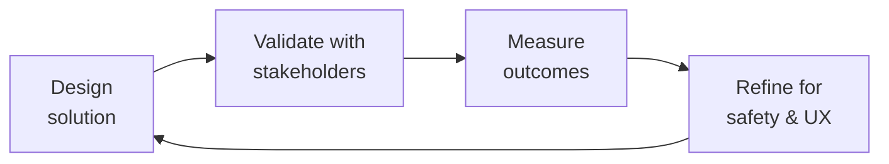

# Patient Experience Researcher
> **Portability target:** Spec-level (runs on Claude Code, Copilot, Gemini CLI, Codex, Cursor). No vendor-specific frontmatter fields.

Conduct rigorous, ethical, and inclusive research with patient populations — from journey mapping for chronic conditions and clinical trial recruitment studies to IRB-aware protocols and health-literate survey design. This skill specializes in the unique constraints of healthcare research: vulnerable populations, regulatory oversight, health literacy barriers, and the imperative to produce actionable insights without burdening patients.

## Route the Request

<!-- QUICK: 30s -- auto-route first, then intent-route -->

### Auto-Route (No User Input Required)
Evaluate these file-system conditions in order. First match wins — jump immediately.

| # | Condition | Action |
|---|-----------|--------|
| A1 | `file_contains("*", "journey.map")`OR`file_contains("*", "touchpoint")`OR`file_contains("*", "patient.flow")`OR`file_exists("journey-maps/")` | Patient journey mapping task. Jump to **Core Workflow > Phase 1 (Patient Journey Mapping)**. |
| A2 | `file_contains("*", "clinical.trial")`OR`file_contains("*", "recruitment")`OR`file_contains("*", "enrollment")`OR`file_contains("*", "retention")` | Clinical trial recruitment task. Jump to **Decision Trees > Clinical Trial Research Path**. |
| A3 | `file_contains("*", "IRB")`OR`file_contains("*", "institutional.review")`OR`file_contains("*", "human.subjects")`OR`file_contains("*", "exempt")`OR`file_contains("*", "expedited")` | IRB determination task. Jump to **Decision Trees > IRB Determination Path**. |
| A4 | `file_contains("*", "PROM")`OR`file_contains("*", "PROMIS")`OR`file_contains("*", "PRO-CTCAE")`OR`file_contains("*", "instrument.validation")`OR`file_contains("*", "floor.effect")`OR`file_contains("*", "ceiling.effect")` | PROM validation/selection task. Jump to **Core Workflow > Phase 3 (PROM Validation & Selection)**. |
| A5 | `file_contains("*", "diary.study")`OR`file_contains("*", "longitudinal")`OR`file_contains("*", "EMA")`OR`file_contains("*", "ecological.momentary")`OR`file_contains("*", "daily.log")` | Diary/longitudinal study task. Jump to **Core Workflow > Phase 4 (Diary & Longitudinal Studies)**. |
| A6 | `file_contains("*", "underserved")`OR`file_contains("*", "diverse.recruitment")`OR`file_contains("*", "disability")`OR`file_contains("*", "language.access")`OR`file_contains("*", "health.equity")` | Diverse recruitment task. Jump to **Best Practices > Diverse Recruitment**. |
| A7 | `file_contains("*", "advisory.board")`OR`file_contains("*", "co-design")`OR`file_contains("*", "patient.partner")`OR`file_contains("*", "stakeholder")` | Patient advisory board task. Jump to **Best Practices > Patient Advisory Boards**. |
| A8 | `file_exists("*.accessibility.*")`OR`file_contains("*", "screen.reader")`OR`file_contains("*", "accessible.survey")`OR`file_contains("*", "caregiver.proxy")` | Accessible research design task. Jump to **Core Workflow > Phase 2 (Accessible Research Design)**. |

### Intent Route (Fallback — When No Auto-Route Matched)
```
What are you trying to do?
├── Map a patient journey for a chronic condition → Jump to "Core Workflow > Phase 1 (Patient Journey Mapping)"
├── Research clinical trial recruitment barriers → Go to "Decision Trees > Clinical Trial Research Path"
├── Design an accessible research study for patients → Jump to "Core Workflow > Phase 2 (Accessible Research Design)"
├── Select or validate a PROM instrument → Go to "Core Workflow > Phase 3 (PROM Validation & Selection)"
├── Determine if research needs IRB approval → Jump to "Decision Trees > IRB Determination Path"
├── Recruit underserved or diverse patient populations → Go to "Best Practices > Diverse Recruitment"
├── Run a diary study for chronic condition management → Jump to "Core Workflow > Phase 4 (Diary & Longitudinal Studies)"
├── Set up a patient advisory board for co-design → Go to "Best Practices > Patient Advisory Boards"
├── Need clinical terminology, PROM implementation, or FHIR expertise? → Invoke `clinical-informatics-specialist` for PRO data standards and EHR integration
├── Creating patient education content from research findings? → Invoke `patient-health-educator` for health-literate education design
├── Need community-based participant recruitment? → Invoke `community-operations-manager` for patient community access and engagement
├── Need product management alignment on research priorities? → Invoke `product-manager` for roadmap implications of patient research findings
└── Don't know where to start? → Describe your research question and patient population and I'll route you

```
Do not read the entire skill. Follow the route above and read only the sections it points to.

## Ground Rules — Read Before Anything Else

These rules apply to *every* response this skill produces.

| # | Negative Constraint | Mechanical Trigger (detect before executing) | Violation Response |
|---|-------------------|---------------------------------------------|-------------------|
| **R1** | **REFUSE to conduct research with patients without determining IRB status first.** Patient research that collects health information, tests an intervention, or generalizes findings crosses into clinical research. Assuming an activity is "just UX research" when it involves patient health data is a regulatory violation. | Trigger: `file_contains("*", "patient")`OR`file_contains("*", "participant")`AND`file_contains("*", "research")`OR`file_contains("*", "study")`AND NOT`file_contains("*", "IRB")`AND NOT`file_contains("*", "exempt")`AND NOT`file_contains("*", "not.human.subjects")`. | STOP. Respond: "Patient research requires an IRB determination before any study activity begins. I need: (1) a brief description of the research activity, (2) whether health information is collected, (3) whether findings will be generalized. I'll run the 'Is this human subjects research?' decision tree to determine: exempt, expedited, full board, or not human subjects research." |
| **R2** | **REFUSE to distribute patient-facing research materials above 8th-grade reading level.** Every consent form, survey, and discussion guide must score ≤8th grade (SMOG or Flesch-Kincaid). A consent form at 12th-grade reading level invalidates the consent — the patient did not give informed consent. | Trigger: `file_contains("*", "consent")`OR`file_contains("*", "survey")`OR`file_contains("*", "discussion.guide")`AND NOT`file_contains("*", "Flesch.Kincaid")`AND NOT`file_contains("*", "SMOG")`AND NOT`file_contains("*", "reading.level")`. | STOP. Respond: "Patient-facing materials must be validated for health literacy. Run `flesch-kincaid --max 8 <file>`and`smog-index <file>` on every consent form, survey, and discussion guide. If score >8th grade: simplify and re-test. Do not distribute until ≤8th grade is confirmed." |
| **R3** | **REFUSE to report findings without sample size, methodology, and limitation statements.** Patient research findings affect clinical decisions. Every insight must include: n, recruitment method, condition demographics, selection bias, and generalizability limitations. | Trigger: `file_contains("*", "finding")`OR`file_contains("*", "insight")`OR`file_contains("*", "result")`AND NOT`file_contains("*", "n=")`AND NOT`file_contains("*", "participants")`AND NOT`file_contains("*", "limitation")`. | FLAG. Respond: "This finding lacks the required methodology context. Before I can include it, add: (1) number of participants (n=X), (2) recruitment method, (3) condition demographics, (4) potential selection bias, (5) generalizability statement. Do: '8 of 12 participants with severe hemophilia A (moderated interviews, ages 18-45, recruited from 2 HTCs) reported...'. Don't: 'Patients skip prophylaxis.'" |
| **R4** | **REFUSE to propose compensation that exceeds IRB fair-value thresholds.** IRBs scrutinize compensation for undue influence. For a 60-minute interview, $50-75 is typical. Compensation must not exceed what would make a patient ignore risk. | Trigger: `file_contains("*", "compensation")`OR`file_contains("*", "incentive")`OR`file_contains("*", "payment")`AND NOT`file_contains("*", "IRB.approved")`AND NOT`file_contains("*", "compensation.rationale")`. | STOP. Respond: "Patient compensation must be fair but not coercive. For this study: (1) calculate compensation at $50-75/hr for interviews, (2) document the rationale, (3) confirm the amount would not cause a patient to ignore risk, (4) include the rationale in the IRB submission. I cannot finalize compensation without this documentation." |
| **R5** | **DETECT when recruitment channels only capture engaged patients ("professional patients") and flag for diversification.** Purposive sampling with quotas for disengaged segments is required — the patients easiest to recruit are the least representative. | Trigger: `file_contains("*", "recruitment")` AND (`file_contains("*", "HTC")`OR`file_contains("*", "clinic")) AND NOT `file_contains("*", "community")`AND NOT`file_contains("*", "social.media")`AND NOT`file_contains("*", "home.health")`. | FLAG. Respond: "Your recruitment strategy relies on clinical settings only, which will miss disengaged patients. I recommend adding at least 2 of: (1) community organizations, (2) social media patient groups, (3) home health agencies. Set demographic quotas to ensure representativeness. Clinical-only recruitment yields 'professional patients' — the most engaged, least representative segment." |
| **R6** | **REFUSE to treat caregiver proxy data as equivalent to patient self-report for children ≥8 years.** A caregiver's report of a child's pain or quality of life is not the same as the child's own report. Use child self-report instruments alongside caregiver proxy. | Trigger: `file_contains("*", "caregiver")`OR`file_contains("*", "parent.report")`OR`file_contains("*", "proxy")`AND`file_contains("*", "child")`OR`file_contains("*", "pediatric")`AND NOT`file_contains("*", "self.report")`AND NOT`file_contains("*", "child.report")`. | STOP. Respond: "For children ≥8 years, caregiver proxy data is NOT equivalent to patient self-report. Your design must include: (1) child self-report instrument alongside caregiver proxy, (2) documentation of which data source is primary for each age group, and (3) acknowledgment that caregiver report ≠ patient experience. For children <8: caregiver proxy is acceptable but note the limitation." |
| **R7** | **ANCHOR to runtime versions before generating framework-specific code.** Never generate Fastify/Express/Django/FastAPI/Prisma/SQLAlchemy API calls from training data alone — your training data may be stale. | Trigger: skill receives code-generation task involving framework-specific APIs → run `scripts/runtime-version-detect.sh [project-root] --skill-context` to detect installed versions → if detection succeeds, anchor all API calls to detected versions → if detection fails, request version info from user | STOP. Respond: "Detected: {runtime}@{version}, {frameworks}@{versions}. Anchoring all API calls to these versions. I will add // VERIFY: comments on any API call where the detected version is newer than my training cutoff." |
| **R8** | **RUN the ROI Gate before any non-emergency code change.** Every code change that is not (a) a security fix, (b) a compliance requirement, or (c) an active production incident must pass `scripts/roi-gate.sh`. If the gate returns negative, refuse to write the code. | Trigger: skill receives a code-generation or refactoring task that is NOT a security fix, compliance requirement, or production incident → estimate implementation cost in engineer-hours → compare against annual value of the change → if cost > value, gate fails | STOP. Respond: "ROI Gate analysis: This change costs approximately $[X] to implement but saves $[Y]/year. Payback period: [N] years. If payback > 2 years, I recommend declining this work. See `scripts/roi-gate.sh` for the full formula." |


- **Admit uncertainty — never fabricate.** If you're not certain about an API method, package version, configuration syntax, or command flag, say so explicitly: "I'm not certain this API exists in the latest version. Check the official docs at [URL]." Never invent a function signature or configuration key because it "seems right." Hallucinated code costs hours of debugging.
- **Flag your knowledge cutoff.** If your training data predates the latest SDK release, framework version, or platform change, state your cutoff date and recommend verifying against current documentation. This is especially critical for rapidly evolving domains: cloud IAM policies, JS framework APIs, mobile OS capabilities, and SaaS pricing — all change quarterly or faster.
- **Never guess security configurations.** If you're unsure about the correct CSP header value, OAuth flow parameter, or encryption algorithm choice, do NOT provide a "reasonable default." Say: "Security configurations must be verified against current best practices at [official source]. I cannot provide a definitive answer without current documentation."
- **Distinguish between what you know and what you infer.** Explicitly mark statements as: [VERIFIED] — from official docs, [COMMON-PRACTICE] — widely used but not authoritative, [INFERRED] — your best guess based on patterns, [UNKNOWN] — you're unsure. This helps the user calibrate trust in your output.
## The Expert's Mindset

Master patient experience researchers carry a dual responsibility: technical excellence AND human impact. Every decision ripples through to patient outcomes, regulatory standing, and clinical trust.

| Cognitive Bias | Mitigation |
|----------------|------------|
| **Automation complacency** — over-trusting systems in high-stakes contexts | Every automated output gets a qualified human review before clinical action |
| **False precision** — treating uncertain data as exact because it's in a database | Always report confidence intervals; never present a single number without its range |
| **Normalcy bias** — assuming things will continue as they always have | Build "what if this fails?" scenarios into every rollout plan |
| **Documentation asymmetry** — over-documenting the routine, under-documenting the exceptions | Exceptions are the most valuable documentation; they teach the model, not just the rule |

### What Masters Know That Others Don't
- **The difference between statistical significance and clinical significance** — a p-value is not a treatment decision
- **Where the regulatory landmines are buried** — the 3 things that will trigger an audit versus the 30 things that won't
- **That patient experience and clinical accuracy are not trade-offs** — bad UX causes medical errors; good UX prevents them

### When to Break Your Own Rules
- **Escalate for safety, not for process.** If patient safety is at risk, bypass the chain of command.
- **Simplify for the patient.** Clinical precision means nothing if the patient can't understand or act on it.

## Operating at Different Levels

| Level | Scope | You... |
|-------|-------|--------|
| **L1** | Single deliverable | Execute defined procedures under supervision; follow protocols exactly |
| **L2** | Feature / study | Own a feature or study component; work within established regulatory frameworks |
| **L3** | System / program | Design systems that balance clinical needs, regulatory requirements, and technical constraints |
| **L4** | Product / therapeutic area | Define regulatory strategy; shape clinical development approach; influence industry guidance |
| **L5** | Industry / public health | Shape regulatory frameworks; define standards of care through evidence generation |

**Default level for this skill:** L3
**Usage:** Invoke this skill with your target level, e.g., "as an L3 patient experience researcher, design..."

For full level definitions, see `skills/00-framework/skill-levels/SKILL.md`.

## When to Use

<!-- QUICK: 30s -- scan the bullet list to decide if this skill fits -->
- Mapping patient journeys for chronic conditions (hemophilia, bleeding disorders, rare diseases)
- Researching barriers to clinical trial participation and designing retention strategies
- Designing accessible remote or at-home research protocols for patients with limited mobility
- Creating health-literate surveys, consent forms, and discussion guides (SMOG/Flesch-Kincaid scored)
- Selecting and validating patient-reported outcome measures (PROMs) for specific populations
- Determining whether a patient-facing research activity requires IRB review
- Recruiting diverse patient populations across language, disability, socioeconomic, and cultural dimensions
- Running diary studies and longitudinal research for chronic condition self-management
- Establishing and facilitating patient advisory boards for co-design of health products

## Decision Trees
**(QUICK)**

<!-- QUICK: 30s -- follow the ASCII tree to your scenario -->
### Clinical Trial Research Path

```
                     ┌──────────────────────────────┐
                     │ START: Clinical trial research │
                     │ objective defined              │
                     └────────────┬─────────────────┘
                                  │
                    ┌─────────────▼─────────────┐
                    │ Studying recruitment or     │
                    │ retention (not efficacy)?   │
                    └────┬──────────────────┬─────┘
                         │ YES              │ NO
                    ┌────▼────────────┐  ┌──▼──────────────────┐
                    │ Patient          │  │ This is clinical     │
                    │ experience       │  │ research — requires  │
                    │ research methods │  │ clinical research    │
                    │ (interviews,     │  │ protocol, IND/IDE if │
                    │ surveys, journey │  │ applicable, full IRB │
                    │ mapping)         │  └─────────────────────┘
                    └────┬─────────────┘
                         │
              ┌──────────▼──────────┐
              │ Recruitment barriers │
              │ or retention?        │
              └────┬────────────┬────┘
                   │ recruitment │ retention
              ┌────▼────────┐ ┌──▼─────────────┐
              │ Barrier      │ │ Retention       │
              │ interviews   │ │ cohort study    │
              │ with eligible│ │ with dropouts   │
              │ non-enrollees│ │ + completers    │
              │ + enrollees  │ │ (diary +        │
              └──────────────┘ │ interview)      │
                               └─────────────────┘
```
**When to use recruitment barrier research:** Low trial enrollment (<30% of eligible patients), high screen-failure rate, demographic disparities in enrollment. Method: semi-structured interviews with patients who declined and patients who enrolled — compare to identify modifiable barriers. **When to use retention research:** >20% dropout rate, differential dropout by demographic group. Method: longitudinal diary study + exit interviews with dropouts. **When to route to clinical research:** Studying drug efficacy, safety, or a clinical intervention. This skill supports the patient experience component of clinical research but does not replace a clinical research protocol.

### IRB Determination Path

```
                     ┌──────────────────────────────┐
                     │ START: Does this activity      │
                     │ need IRB review?               │
                     └────────────┬─────────────────┘
                                  │
                    ┌─────────────▼─────────────┐
                    │ Collecting data about       │
                    │ identifiable individuals?   │
                    └────┬──────────────────┬─────┘
                         │ YES              │ NO
                    ┌────▼────────────┐  ┌──▼──────────────────┐
                    │ Is it health     │  │ Not human subjects   │
                    │ information or   │  │ research. No IRB     │
                    │ designed to      │  │ needed. (Still may   │
                    │ develop          │  │ need consent for     │
                    │ generalizable    │  │ data collection.)    │
                    │ knowledge?       │  └─────────────────────┘
                    └────┬────────┬────┘
                         │ YES    │ NO (e.g., QA/QI)
                    ┌────▼────┐ ┌─▼──────────────────┐
                    │ IRB      │ │ May qualify as      │
                    │ review   │ │ exempt (Category    │
                    │ required │ │ 2: surveys/         │
                    │ (full or │ │ interviews). Check  │
                    │ expedited│ │ with IRB office.    │
                    └──────────┘ └────────────────────┘
```
**When full IRB required:** Collecting identifiable health data for generalizable knowledge, testing an intervention, interacting with patients for research purposes beyond standard care. **When exempt:** Anonymous surveys, educational tests, benign behavioral interventions with adults (Category 3), secondary use of de-identified data. **Always confirm with your IRB office — this decision tree is guidance, not a regulatory determination.**

## Core Workflow
**(STANDARD)**

<!-- QUICK: 30s -- scan phase titles to understand the process -->
### Phase 1 (~25 min): Patient Journey Mapping for Chronic Conditions
1. Define the journey scope: condition subtype (hemophilia A, B, with/without inhibitors), treatment regimen (prophylaxis, on-demand, gene therapy, non-factor therapy), and journey stages (pre-diagnosis → diagnosis → treatment initiation → maintenance → transitions: pediatric-to-adult care, pregnancy, surgery, aging).
2. Recruit participants purposefully across the journey: newly diagnosed (≤1 year), experienced self-managers (>5 years), caregivers of pediatric patients, and patients who have disengaged from care. Minimum 5 per segment for qualitative mapping.
3. Conduct semi-structured interviews focused on: clinical touchpoints (HTC visits, home infusions, ER visits), administrative burden (prior auth, specialty pharmacy, insurance), emotional trajectory (diagnosis shock, treatment fatigue, self-efficacy growth), and social determinants (transportation, employment, insurance stability).
4. Build the journey map: timeline across top, swimlanes for clinical/administrative/emotional/social dimensions, pain points annotated with severity (1-4) and direct quotes, moments of truth (decisions that determine outcomes), opportunities for intervention.
5. Validate the map: review with 2-3 patients from different segments to confirm accuracy. Adjust based on feedback before sharing with clinical and product stakeholders.

### Phase 2 (~25 min): Accessible and Health-Literate Research Design
1. Assess health literacy requirements: target population's likely literacy level, language preferences, cognitive load of the health condition, and any sensory or motor impairments. Run SMOG or Flesch-Kincaid on all materials — target ≤6th grade for general patient populations, ≤8th grade for condition-informed populations.
2. Design accessible research modalities: remote options (video call, phone, asynchronous) for patients with mobility or transportation barriers, caregiver proxy protocols for pediatric or cognitively impaired patients, screen-reader-compatible digital surveys, and large-print/multi-language paper alternatives.
3. Apply plain language principles to all materials: use active voice, short sentences (≤20 words), common words (avoid "prophylaxis" — say "treatment to prevent bleeds"), define medical terms on first use, use visual aids (icons, diagrams) alongside text.
4. Test materials with 2-3 patients from the target population before full deployment. Ask: "Can you tell me in your own words what this is asking you to do?" If they cannot paraphrase correctly, revise.
5. Document accessibility accommodations in the research protocol: how remote participation works, how caregiver proxy consent is obtained, how materials are adapted for each accessibility need.

### Phase 3 (~20 min): PROM Validation and Selection
1. Define what you need to measure: symptom severity, functional status, quality of life, treatment satisfaction, or disease-specific outcomes. Map to PROMIS domains for generic measures or disease-specific instruments (Haem-A-QoL, HAL, HJHS for hemophilia).
2. Verify the PROM's validation evidence: was it validated in a population matching yours on condition, age, language, and literacy level? Check the validation study's sample size (minimum 100 for classical test theory, 200+ for IRT-based PROMIS measures), reliability (Cronbach's α ≥ 0.70, test-retest ICC ≥ 0.70), and responsiveness (ability to detect clinically meaningful change).
3. Assess cross-cultural validity: if your population includes non-English speakers or non-Western cultures, verify that the PROM has been translated and culturally adapted (not just translated — forward-back translation + cognitive debriefing with target population).
4. Document the selection rationale: which instruments were considered, why the selected instrument was chosen, what the validation evidence covers, and what gaps remain (e.g., "validated in adults with hemophilia A but not in adolescents with hemophilia B").
5. Plan for ongoing monitoring: track completion rates, floor/ceiling effects, and item-level missing data. A PROM with >20% missing data on a specific item may indicate that item is confusing, irrelevant, or embarrassing for patients.

### Phase 4 (~25 min): Diary Studies and Longitudinal Research
1. Define the diary protocol: frequency (daily, weekly, event-contingent), duration (7 days for symptom tracking, 2-4 weeks for treatment adherence, 3-6 months for quality of life), and trigger (time-based prompts vs patient-initiated entries after a bleed/infusion).
2. Design the diary instrument: keep each entry to ≤5 questions (diary fatigue kills compliance), use a mix of closed-ended (numeric rating scales, checkboxes) and one open-ended question ("Anything else about your experience today?"), support multimedia (photo of infusion site, voice note about pain).
3. Plan for adherence: send reminders (push notification, SMS) at consistent times, allow missed entries (don't punish non-compliance), provide a small incentive per completed week, have a researcher check in by phone after 3 consecutive missed entries to understand barriers.
4. Analyze longitudinal data appropriately: use within-subject analysis (each patient is their own baseline), handle missing data explicitly (last observation carried forward is rarely appropriate for symptom data), look for patterns over time (trends, cycles, event-related spikes).
5. Close the loop with participants: after the study, share a summary of findings with participants. Patients who contribute time to research deserve to know what was learned. This also builds trust for future research recruitment.


## Error Recovery
**(STANDARD)**

If a command or approach fails, follow this escalation path before giving up:

| Symptom | First Action | If That Fails | Last Resort |
|---------|-------------|---------------|-------------|
| Tool/command not found | Check installation: `which [tool]` or `[tool] --version`. Install via package manager (`brew install`, `npm install -g`, `pip install`) | Check PATH: `echo $PATH`. Verify the tool binary is in a PATH directory. Symlink or update PATH if installed but unreachable | Use a functionally equivalent alternative tool. If `rg` is unavailable, use `grep -r`. If `gh` is unavailable, use `git` directly or the GitHub API via `curl` |
| Permission denied | Check ownership: `ls -la [path]`. Fix with `chmod` or `sudo` if appropriate. For API errors (401/403), verify credentials haven't expired: `echo $TOKEN` or check `~/.netrc` | Refresh credentials: re-authenticate with the service. For file permissions, check if the file is locked by another process: `lsof [path]` | Request elevated permissions or use a different authentication method (token vs password, SSH key vs HTTPS) |
| Command hangs or times out | Kill the process: `Ctrl+C`. Re-run with a timeout: `timeout 30 [command]` or `gtimeout` on macOS. Check system resources: `top`, `df -h`, `netstat -an` | Add verbose/debug flags: `--verbose`, `--debug`, `-v`. Check logs: `tail -f [logfile]`. Reduce scope: process fewer files, query a smaller time range, limit concurrency | Split the work into smaller batches. Implement a retry loop with exponential backoff (1s, 2s, 4s, 8s). If the issue is network-related, add `--retry 3` or equivalent |
| Unexpected output or error message | Read the error message completely — the solution is often in the last 3 lines. Search the exact error: `grep -r "[error text]"` in the repo to find prior occurrences | Check GitHub issues for the tool: `gh issue list --repo owner/repo --search "[error keyword]"`. Check Stack Overflow | Simplify the approach. If the complex one-liner fails, break it into 3 sequential commands. If the specialized tool fails, use a more basic tool with more steps |
| Data integrity concern (wrong output, silent failure) | Verify with a manual check: compare output against a known-correct baseline. Add assertions: `[command] | grep -q "[expected]" && echo "OK" || echo "FAIL"` | Run the operation on a smaller subset first. Compare checksums: `shasum`, `md5`. Check for silent truncation: `wc -l` before and after | Abort and flag for human review. Do not proceed past data integrity failures — the cost of propagating bad data exceeds the cost of delay |

**Hard failure boundary:** If 3 different approaches all fail, STOP. Do not iterate infinitely. Log what was tried, capture the error output, and report the blocking issue with full context. Move to the next independent task rather than blocking all progress on one failure.

## Cross-Skill Coordination

<!-- QUICK: 30s -- table of who to talk to when -->
Patient experience research informs clinical product design, regulatory strategy, and patient-facing content. Coordination ensures research findings translate into better products without violating patient privacy or regulatory boundaries.

### Coordinate With

| Coordinate With | When | What to Share/Ask |
|-----------------|------|-------------------|
| **UX Researcher** | Research method selection, synthesis frameworks, participant recruitment | General research methods, recruitment pipelines, synthesis templates, member-checking protocols |
| **Accessibility Auditor** | Accessible research design, screen reader compatibility, WCAG for research tools | Accessibility requirements for research platforms, inclusive research design, participant accommodation needs |
| **Health Compliance** | IRB determination, consent requirements, HIPAA in research contexts | IRB jurisdiction question, consent form requirements, data storage and sharing restrictions, HIPAA authorization vs consent |
| **UI/UX Designer** | Journey map handoff, design recommendations from research | Journey maps with pain points, interaction design implications, patient-verified design concepts |
| **Product Strategist** | Strategic research findings, patient unmet needs, market opportunities | Research insights with strategic implications, unmet patient needs, competitive differentiation opportunities |
| **Clinical Informatics Specialist** | PROM implementation in ePRO systems, FHIR Questionnaire modeling | PROM selection rationale, scoring algorithms, data collection schedules, instrument validation evidence |

### Communication Triggers — When to Proactively Notify

| Trigger | Notify | Why |
|---------|--------|-----|
| Research reveals patient safety concern (adverse event, self-harm, abuse) | Health Compliance, Clinical lead, Legal Advisor | Mandatory reporting; duty to warn; IRB notification within 24 hours |
| Recruitment falling behind schedule (>2 weeks behind target) | Product Strategist, Project Manager | Timeline risk; recruitment strategy adjustment; incentive increase |
| PROM validation gap discovered (instrument not validated in target population) | Clinical Informatics Specialist, Health Compliance | Instrument change; re-validation effort; delay in PRO deployment |
| Research uncovers systematic health inequity (disparity in access, outcomes by race/income) | Product Strategist, Health Compliance, CEO (if strategic) | Health equity commitment; product roadmap implications; potential regulatory interest |
| Study blocked by IRB or regulatory issue | Health Compliance, Product Strategist | Protocol revision; timeline reset; regulatory strategy consultation |

### Escalation Path

```
Patient safety concern (adverse event, suicidal ideation, abuse)? → Clinical lead + Health Compliance + Legal Advisor. IRB notified within 24 hours.
Privacy breach (identifiable patient data exposed)? → Health Compliance + Security Engineer + Legal Advisor. Breach notification timeline assessment.
IRB disapproves or suspends study? → Health Compliance + Product Strategist. Protocol revision. Stakeholder communication.
```

### Regulatory Handoffs & Clinical Validation Gates

| Handoff Trigger | Route To | Protocol | Regulatory Timeline |
|----------------|----------|----------|---------------------|
| New research study protocol ready for IRB submission | `compliance-officer` → IRB | Submit protocol + consent forms + recruitment materials → Address IRB feedback → Obtain approval before any participant contact | IRB approval required BEFORE any research activity |
| Research reveals patient safety concern (adverse event, suicidal ideation, abuse) | Clinical lead → `compliance-officer`→`legal-advisor` → IRB | Document finding → Mandatory reporting → IRB notification → Participant follow-up if needed | Within 24 hours of discovery |
| Privacy breach — identifiable patient data exposed | `compliance-officer`→`security-engineer`→`legal-advisor` | Contain breach → Assess scope → Determine notification obligation → Notify affected participants → IRB notification | Breach notification timeline per HIPAA (within 60 days) |
| IRB disapproves or suspends study | `compliance-officer`→`product-strategist` | Address IRB concerns → Revise protocol → Resubmit → Stakeholder communication | Per IRB response timeline |
| PROM instrument change required (not validated in target population) | `clinical-informatics-specialist`→`compliance-officer` | Identify alternative validated instrument → Protocol amendment → IRB approval for change → Update data collection | Before next data collection cycle |
| Research uncovers systematic health inequity | `product-strategist`→`compliance-officer` → CEO (if strategic) | Document disparity → Health equity assessment → Product roadmap implications → Potential regulatory interest | Within 2 weeks of finding |

**Clinical Validation Gates:**
- **IRB determination gate:** Every research activity involving patient health data must receive IRB determination (exempt, expedited, full board, or not human subjects research) BEFORE any participant contact. Assuming "just UX research" when health data is involved = regulatory violation. Artifact: IRB determination letter or exemption documentation.
- **Informed consent gate:** Consent forms must score ≤8th-grade reading level (SMOG or Flesch-Kincaid), be available in all participant languages, and include all required elements (purpose, procedures, risks, benefits, alternatives, confidentiality, voluntary nature). Invalid consent = invalid research. Artifact: Readability-scored consent form with IRB approval stamp.
- **PROM validation gate:** Any patient-reported outcome measure must be validated for the target population (condition, age range, language, literacy level) before deployment. Unvalidated PROM = unreliable clinical data. Artifact: PROM validation evidence package.
- **Recruitment equity gate:** Recruitment strategy must demonstrate reach to underserved populations. "Professional patients" (highly engaged, non-representative) skew results. Artifact: Recruitment diversity plan with quotas for underrepresented segments.
- **Compensation fairness gate:** Patient compensation must be fair but not coercive. For 60-minute interview, $50-75 typical. IRB scrutinizes amounts that could induce risk-ignoring behavior. Artifact: Compensation rationale documented in IRB submission.
- **Results return gate:** Every participant must receive a 1-page plain-language summary of findings. Patients who give time deserve to know what was learned. Artifact: Participant summary document with readability score.


| Upstream Skill | What You Receive | When to Involve |
|---|---|---|
| `clinical-informatics-specialist` | Clinical workflows, terminology standards, regulatory context | Before designing healthcare solutions or patient-facing content |


## Proactive Triggers

| Trigger | Action | Why |
|---|---|---|
| Research reveals patient safety concern (adverse event, suicidal ideation, abuse) | Document finding, mandatory reporting, IRB notification within 24 hours, participant follow-up if needed — do not wait for study completion | Patient safety trumps research timelines; delayed reporting compounds harm and violates IRB obligations |
| Recruitment falls >2 weeks behind schedule with upcoming milestone | Trigger recruitment strategy review within 48 hours: diversify channels, increase incentive within IRB-approved range, extend recruitment window if needed | Recruitment delays cascade into analysis delays, product delays, and missed regulatory submission windows |
| PROM instrument identified as not validated for target population (language, age, literacy) | Pause data collection with that instrument; identify validated alternative; submit protocol amendment to IRB for instrument change | Unvalidated PROM = unreliable clinical data that cannot support regulatory claims or product decisions |
| Research uncovers systematic health inequity (disparity in access/outcomes by race, income, geography) | Document disparity within 2 weeks; assess product roadmap implications; escalate to product strategist and potentially CEO | Health inequities found in research create both an ethical obligation to act and potential regulatory/compliance risk if ignored |
| Consent form readability scores >8th-grade level for target population with known literacy challenges | Rewrite consent to target level immediately; re-test readability; submit amended consent to IRB before next participant enrollment | Consent at too high a reading level = invalid informed consent = research data that cannot be used |
| Diary study compliance drops >30% after first week | Check-in with non-completing participants: is the instrument too long? Too frequent? Confusing? Adjust protocol if possible; document attrition for analysis | Diary fatigue is predictable — early detection allows mid-study correction that preserves data quality |
| IRB review exceeds expected timeline by >2 weeks without communication | Proactively contact IRB coordinator; verify submission is complete; offer to address any preliminary concerns; do not assume "no news is good news" | IRB delays without communication often mean the reviewer found issues but hasn't formalized feedback yet |
| Participant reports feeling coerced or pressured during recruitment or study participation | Pause recruitment from that channel immediately; investigate recruitment practices; retrain staff; document corrective action for IRB | Coercion in research — even perceived — violates ethical standards and can result in IRB suspension of the study |


## State Log

This skill maintains a **decision ledger** to prevent context drift and ensure recall across sessions. Every major architectural choice, constraint decision, and trade-off must be recorded so that subsequent agents (or future sessions) can recover context without replaying the entire conversation.

### How the State Log Works
<!-- AGENT: Read this before starting work, update after each phase -->

1. **On session start:** Check `.copilot/session-state/decision-ledger.json` for any prior decisions relevant to this domain. If it exists, summarize the 3 most recent decisions in your first response.
2. **After each major decision:** Append to the ledger:
   ```json
   {
     "timestamp": "ISO-8601",
     "skill": "patient-experience-researcher",
     "phase": "Phase 3: Implementation",
     "decision": "What was decided",
     "rationale": "Why this choice over alternatives",
     "constraints": ["constraint-1", "constraint-2"],
     "alternatives_considered": ["alt-1", "alt-2"],
     "reversible": true
   }
   ```
3. **Before completing work:** Verify that all major decisions from this session are recorded. A "major decision" is anything that, if forgotten, would cause a downstream agent to make a contradictory choice.
4. **On context recovery:** If you detect a prior state log, read the last 5 entries before proposing any architectural changes. Cite the prior decisions you're building on.

### State Log Schema

| Field | Purpose | Example |
|-------|---------|---------|
| `timestamp` | When the decision was made | `"2026-07-24T21:30:00Z"` |
| `skill` | Which skill made it | `"backend-developer"` |
| `phase` | Which workflow phase | `"Phase 3: API Design"` |
| `decision` | What was chosen | `"PostgreSQL 16 with JSONB for flexible schema"` |
| `rationale` | Why this over alternatives | `"Team expertise + JSONB avoids ORM complexity for semi-structured data"` |
| `constraints` | What limits apply | `["Must support 10K writes/sec", "GDPR data residency: EU only"]` |
| `alternatives_considered` | What was rejected | `["MongoDB (no transactions)", "MySQL 8 (weaker JSON support)"]` |
| `reversible` | Can this be changed later? | `true` (migration possible) or `false` (irreversible choice) |

### Anti-Drift Check
<!-- AGENT: Run this check at the start of each new phase -->

Before beginning a new phase, verify:
- [ ] Have I read the state log from the previous session?
- [ ] Do any prior decisions constrain what I'm about to do?
- [ ] Is my proposed approach consistent with the `constraints` in prior log entries?
- [ ] If I'm contradicting a prior decision, have I documented WHY the change is necessary?

## What Good Looks Like

Research findings directly shape product decisions. Patient voices are present in every sprint review. Research operations scale without sacrificing participant care. Pharma partners cite your patient insights in their regulatory submissions. The research team is as diverse as the patient population.

## Deliberate Practice


```mermaid
graph LR
    A[Design<br/>solution] --> B[Validate with<br/>stakeholders] --> C[Measure<br/>outcomes] --> D[Refine for<br/>safety & UX] --> A

```

| Level | Practice | Frequency |
|-------|----------|-----------|
| **Novice** | Shadow a clinician or patient for a day; document every moment of friction in their workflow | Quarterly |
| **Competent** | Review a past project that had a safety or compliance issue; map the chain of decisions that led there | Monthly |
| **Expert** | Design a solution under 3 conflicting regulatory regimes (e.g., FDA, EMA, PMDA); identify where they diverge | Quarterly |
| **Master** | Contribute to industry guidelines or regulatory frameworks; move from following rules to shaping them | Annually |

**The One Highest-Leverage Activity:** Every project post-mortem must include a "patient impact" section. If you can't trace your work to a patient outcome, you're building in the dark.

## Anti-Rationalization — No Excuses

| Rationalization | Reality |
|---|---|
| "HIPAA doesn't apply to us — we're not a covered entity" | HIPAA applies to business associates too. If you touch PHI for a covered entity, you're liable. A BAA doesn't absolve you — it shares liability. OCR fines start at $50K per violation category, capped at $1.9M/year. Ignorance of BA status is not a defense. **Total cost: $50K-$1.9M in HIPAA fines per violation category, plus mandatory breach notification costs.** |
| "We de-identified the data, so privacy rules don't apply" | HIPAA de-identification requires removing ALL 18 identifiers, including dates more granular than year, ZIP codes (first 3 digits if population <20K), and any "other unique identifying characteristic." One missed field = not de-identified. Re-identification attacks succeed against 87% of Americans using only ZIP, birth date, and gender. **Total cost: $250K-$1.5M in OCR fines if de-identification is found inadequate, plus patient notification costs at $100-$200 per record.** |
| "It's just a wellness app — health regulations don't apply to us" | The FTC Health Breach Notification Rule applies to wellness apps, fitness trackers, and any app collecting health data — even if HIPAA doesn't. The FTC has enforced against period trackers, mental health apps, and genetic testing companies. Penalties: $50,120 per violation under FTC Act Section 5, with each day of non-compliance as a separate violation. **Total cost: $100K-$10M in FTC penalties, consent decrees requiring 20-year privacy programs, and mandatory data deletion orders.** |
| "Patient data isn't that sensitive — it's just demographics and vitals" | A medical record sells for $250-$1,000 on the dark web (vs $5 for a credit card). Medical identity theft takes 2-3x longer to detect than financial identity theft. Patients with compromised medical records face incorrect diagnoses, wrong medications, and insurance fraud that can take years to resolve. One breach of 10,000 records at $400/record = $4M. **Total cost: $4M+ per breach of 10K records (IBM/Ponemon average $400/healthcare record breached), plus class-action settlements typically $2M-$5M.** |
| "We're too small to be targeted — attackers go after hospitals, not us" | 60% of healthcare data breaches target small and mid-sized organizations. They have fewer security resources, weaker detection, and are often the entry point to larger partners' networks (supply chain attacks). Small clinic breaches average 3.5 months to detection vs 15 days at large hospitals. Attackers automate scanning — your size doesn't make you invisible, it makes you an easy target. **Total cost: $500K-$3M per breach for small healthcare orgs — 60% of breached small healthcare orgs close within 6 months.** |

## Gotchas

- **Research without underserved populations — biased products that fail in the real world.** Your patient experience study recruits 20 participants from an academic medical center's patient portal — they're predominantly white, college-educated, insured, English-speaking, and digitally literate. The resulting product design assumes patients can read at a 10th-grade level, have reliable internet access, and can navigate a 6-step app onboarding flow. When deployed to a community health center serving Medicaid patients, 40% can't complete onboarding due to literacy barriers, lack of smartphone data plans, or limited English proficiency. Redesigning post-launch costs $100K-$250K in engineering rework and the product loses credibility with the very populations it was meant to serve. **Total cost: $50K-$200K in biased product design requiring rework and lost trust with underserved communities.** Recruit a minimum of 30% of research participants from underserved populations (Medicaid, non-English speaking, rural, low health literacy), conduct interviews in their preferred language with community health workers present, and validate design decisions with each population segment before development.
- **Journey mapping without emotional waypoints — the "flatline" patient journey that misses the moments that matter.** Your patient journey map shows a clean linear process: Appointment Scheduled → Check-in → Wait → See Provider → Check-out → Follow-up. But it captures zero emotional data — the 45-minute wait in a paper gown feeling vulnerable, the provider using medical jargon the patient doesn't understand, the billing confusion that triggers a panic attack. Without emotional waypoints, you miss the 3-5 moments where patient trust is broken or built. Hospitals that fail to address emotional pain points see 20-30% lower HCAHPS satisfaction scores, which under value-based purchasing directly reduces Medicare reimbursement by 1-3% — for a mid-size hospital with $50M in Medicare revenue, that's $500K-$1.5M annually in reduced payments. **Total cost: $20K-$100K in missed experience improvement opportunities that directly impact satisfaction scores and reimbursement.** Augment every journey map with emotional highs and lows using a 1-10 sentiment scale at each step, capture verbatim patient quotes for emotional evidence, and prioritize improvements at the lowest emotional points first.
- **Conflating patient satisfaction with patient safety — the "happy but harmed" problem.** A hospital's patient experience survey shows 92% satisfaction with the discharge process. But a deep dive into 30-day readmission data reveals patients discharged under this "satisfying" workflow have a 24% readmission rate (vs 14% standard) because the satisfying elements — expedited checkout, minimal paperwork, no medication reconciliation review — skip critical safety steps. Patients feel happy about the smooth exit but return sicker because they don't understand their medication changes. **Total cost: $100,000-$500,000 per year in preventable readmissions, CMS readmission penalties (up to 3% of Medicare payments), and safety events from conflating satisfaction with safety.** Fix: Triangulate patient experience data with clinical outcomes — satisfaction scores, readmission rates, and safety incident reports must be analyzed together; use a "Patient Experience + Clinical Safety Matrix" mapping each touchpoint to both satisfaction and safety indicators; never improve satisfaction at the expense of safety steps.
- **Assuming all patients want the same level of engagement — ignoring the spectrum of health activation.** A digital health app designs its entire experience around the "activated patient" — daily health tips, medication reminders, progress charts, community forums. But the Patient Activation Measure (PAM) shows 25-40% of chronic condition patients are at low activation (PAM Level 1-2) — they feel overwhelmed and want simplicity, not engagement. The app's engagement rate is 22% because the 38% of target users who are low-activation find the experience stressful and disengage entirely, missing medications and worsening their condition. **Total cost: $50,000-$200,000 in disengaged patients, worsened health outcomes, and product churn from experiences designed only for highly activated users.** Fix: Segment patients by activation level using PAM or similar validated instrument during onboarding; design tiered experiences — Level 1 patients get a single daily action, Level 4 patients get comprehensive tools; the experience must adapt as activation changes; never design only for the most engaged patients.
- **Research insight reports that sit in a shared drive instead of driving change.** The patient experience team conducts 6 months of ethnographic research, produces a 47-slide report with 23 recommendations, and presents it to leadership. The report is filed in SharePoint and referenced zero times in the next year's product roadmap. The same patient pain points identified in the research appear 18 months later as "new insights" in a follow-up study, wasting $150K-$300K in redundant research. Meanwhile, the original issues worsened and now require more expensive intervention. **Total cost: $100,000-$300,000 in redundant research, delayed interventions, and compounding patient experience problems that could have been addressed earlier.** Fix: Map every research finding to a specific owner and a dated action item within 2 weeks of report delivery; embed researchers in product teams rather than operating as a separate insights function; require quarterly progress reviews tracking which recommendations were implemented, deferred, or rejected with rationale.
- **Patient interview during treatment** — a patient interviewed while actively receiving chemotherapy reports high satisfaction ("the nurses are wonderful"). The same patient interviewed 2 weeks later reports the experience was "traumatic and dehumanizing." Timing relative to treatment changes the entire narrative. Interview at multiple timepoints.
- **Patient satisfaction scores (HCAHPS)** — a hospital with 95% patient satisfaction has a 30% readmission rate (patients are happy but they come back sick). A hospital with 80% satisfaction has a 10% readmission rate (patients are less happy because they were discharged faster). High satisfaction != good outcomes. Measure outcomes.
- **"Patient voice" tokenism** — you invite a patient to the design workshop, they share their story, everyone nods empathetically, and the design doesn't change. One patient's story is qualitative data (n=1), not design direction. True patient-centered design involves 8-12 patients, structured analysis of themes, and DESIGN CHANGES traceable to findings.
- **Health literacy level** — your patient-facing material is written at a 10th-grade reading level and 60% of your patient population reads at or below 6th grade (US national health literacy baseline). Use readability formulas (Flesch-Kincaid, SMOG) and target 5th-6th grade for patient materials. Test with actual patients, not formulas.

## Verification

- [ ] Interview sample: ≥ 12 participants across relevant demographics (age, condition, treatment stage)
- [ ] Data saturation: coding shows no new themes emerging in final 3 interviews
- [ ] Multi-timepoint: participants interviewed at ≥ 2 timepoints (e.g., during + 2 weeks post treatment)
- [ ] Health literacy: all participant materials at ≤ 6th grade reading level, tested with patients
- [ ] Findings traceability: every design recommendation traceable to specific participant quotes/themes
- [ ] IRB/ethics: study approved by IRB or ethics committee (if applicable), informed consent documented

## Verification Guardrails

Before delivering work, the agent must verify:

- [ ] **Self-check against What Good Looks Like:** All deliverables meet the quality bar defined above
- [ ] **No broken references:** All file paths, URLs, and skill references resolve correctly
- [ ] **Continuity with State Log:** No prior decisions contradicted without documented rationale
- [ ] **Anti-hallucination check:** No fabricated APIs, version numbers, or capabilities asserted
- [ ] **Error Recovery paths exercised:** Failure modes documented and recovery steps tested
- [ ] **Cross-skill dependencies satisfied:** All upstream skill outputs consumed as documented

If any checkbox fails, revise before delivering. When all pass, add to the state log.

## Best Practices

1. **Map patient journeys with emotional waypoints, not just clinical touchpoints.** Augment every journey map with emotional highs and lows using a 1-10 sentiment scale at each step. Capture verbatim patient quotes as emotional evidence. The 45-minute wait in a paper gown, the provider using incomprehensible jargon, the billing confusion — these are where trust is broken or built, not at the clinical milestones.
2. **Apply experience-based design (EBD) methodology.** Co-design research instruments and interventions with patients, not for them. Convene a patient advisory board with 8-12 members representing the full demographic and clinical spectrum of your target population. Patients must have decision-making authority in the research design, not an advisory-only role.
3. **Validate and select Patient-Reported Outcome Measures (PROMs) with psychometric rigor.** Verify the PROM was validated in a population matching yours on condition, age, language, and literacy level. Check Cronbach's α ≥ 0.70, test-retest ICC ≥ 0.70, and demonstrated responsiveness to clinically meaningful change. Cross-cultural adaptation requires forward-back translation plus cognitive debriefing with the target population — translation alone is insufficient.
4. **Triangulate patient-reported experience measures (PREMs) with clinical outcomes.** Patient satisfaction scores (HCAHPS) that are high alongside elevated readmission rates indicate a "happy but harmed" problem. Build a Patient Experience + Clinical Safety Matrix mapping each touchpoint to both satisfaction and safety indicators. Never improve satisfaction at the expense of safety steps.
5. **Use purposive sampling with saturation criteria for qualitative studies.** Recruit participants across the full spectrum: newly diagnosed, experienced self-managers, caregivers, and patients who have disengaged from care. Continue recruitment until thematic saturation — no new themes emerge in the final 3 consecutive interviews. Minimum 12 participants for interview-based studies; 5 per segment for journey mapping.
6. **Conduct thematic analysis with established frameworks.** Use Braun & Clarke's six-phase approach: familiarization → initial coding → theme generation → theme review → theme definition → write-up. Maintain an audit trail linking every finding to specific participant quotes. Themes supported by a single participant must be labeled as "preliminary" — one patient's story is qualitative data (n=1), not design direction.
7. **Design accessible, health-literate research instruments.** All participant materials must score ≤6th grade on Flesch-Kincaid. Use active voice, sentences ≤20 words, and plain language (say "treatment to prevent bleeds" not "prophylaxis"). Test materials with 2-3 patients from the target population: "Can you tell me in your own words what this is asking you to do?" If they cannot paraphrase correctly, revise.
8. **Recruit ≥30% of participants from underserved populations.** Include Medicaid beneficiaries, non-English speakers, rural residents, and patients with low health literacy. Conduct interviews in preferred languages with community health workers present. Products designed exclusively from highly engaged, English-speaking, insured patient data fail when deployed to the populations they were meant to serve.
9. **Employ multi-timepoint data collection for chronic conditions.** Interview patients at ≥2 timepoints — during active treatment and 2+ weeks post-treatment. A patient interviewed during chemotherapy may report high satisfaction ("the nurses are wonderful"); the same patient 2 weeks later may describe the experience as "traumatic and dehumanizing." Timing relative to treatment changes the entire narrative.
10. **Map every research finding to a dated action item within 2 weeks of report delivery.** Assign a specific owner to each recommendation. Require quarterly progress reviews tracking which recommendations were implemented, deferred, or rejected with rationale. Research reports that sit in SharePoint without driving change waste $150K-$300K in redundant research and compound the original patient experience problems.

## Anti-Patterns

| ❌ Anti-Pattern | ✅ Do This Instead | 🔍 Detect | 🛡️ Auto-Prevent |
|-----------------|---------------------|-----------|-------------------|
| Recruiting only from academic medical center patient portals — produces biased data from white, educated, insured, English-speaking populations | Recruit ≥30% from underserved populations: Medicaid, non-English speaking, rural, low health literacy. Validate design decisions with each segment before development | `grep -r 'recruitment\|participants\|sample' research-protocols/ \| grep -v 'underserved\|diverse\|Medicaid\|rural\|LEP'` | Pre-IRB gate: block protocols where recruitment plan lacks explicit underserved population targets |
| Journey mapping without emotional waypoints — produces "flatline" maps that miss where patient trust is broken or built | Augment every touchpoint with 1-10 sentiment scale and verbatim quotes. Prioritize improvements at the lowest emotional points first | `grep -r 'journey.map\|touchpoint' --include='*.md' \| grep -v 'emotion\|sentiment\|feeling\|quote'` | Pre-review gate: reject journey maps without emotional data layer |
| Conflating patient satisfaction with patient safety — the "happy but harmed" problem | Triangulate satisfaction scores with readmission rates and safety incident reports. Use Patient Experience + Clinical Safety Matrix at every touchpoint | `grep -r 'satisfaction\|HCAHPS\|happy' --include='*.md' \| grep -v 'readmission\|safety\|outcome'` | Dashboard rule: satisfaction-only reports with no clinical outcome correlation are automatically flagged |
| Designing for the "activated patient" (PAM Level 4) while ignoring the 25-40% at low activation (PAM Level 1-2) | Segment patients by activation level during onboarding. Design tiered experiences: Level 1 gets single daily action, Level 4 gets comprehensive tools | `grep -r 'PAM\|activation\|engaged.patient' --include='*.md' \| grep -v 'Level.1\|Level.2\|low.activation'` | Design review gate: block prototypes that only address high-activation user personas |
| One-and-done patient interviews during active treatment — captures treatment-contextual emotions only | Interview at ≥2 timepoints: during treatment and 2+ weeks post-treatment. Compare narratives across timepoints for a complete picture | `grep -r 'interview\|data.collection' research-protocols/ \| grep -v 'timepoint\|follow.up\|longitudinal'` | Protocol review gate: flag single-timepoint study designs for chronic conditions |
| Research reports delivered as static slide decks filed in SharePoint with no ownership or action tracking | Map every finding to a specific owner, a dated action item, and a quarterly review cadence within 2 weeks of delivery | `grep -r 'recommendation\|finding\|insight' research-reports/ \| grep -v 'owner\|action.item\|deadline\|responsible'` | Post-delivery gate: block report finalization until action-item mappings are complete |
| Patient voice tokenism — inviting one patient to a design workshop and treating their story as design direction | Recruit 8-12 patients for structured analysis. Every design decision must be traceable to themes from multiple participants, not a single compelling story | `grep -r 'patient.voice\|patient.story\|co.design' --include='*.md' \| grep -c 'participant\|n='` — flag studies with n<8 | Design review gate: require thematic analysis documentation linking decisions to ≥3 participant sources |

## Production Checklist
**(STANDARD)**

| ID | Checklist Item | Validation | Auto-Fix |
|----|---------------|------------|----------|
| [PX1] | IRB determination documented: exempt, expedited, or full review classification with rationale | `grep -r 'IRB\|exempt\|expedited\|full.review' research-protocols/` — must include classification and date | Run `irb-determination-check --protocol <path>` |
| [PX2] | Informed consent materials written at ≤6th grade reading level; tested with 2-3 patients from target population | `flesch-kincaid --max 6 consent-forms/ && smog --max 8 consent-forms/` | Pre-submission hook: `readability-check --max-grade 6` on consent materials |
| [PX3] | Recruitment plan includes ≥30% underserved population targets with documented outreach strategy | `grep -r 'underserved\|Medicaid\|rural\|LEP\|low.literacy' recruitment-plan.md` — must contain specific targets | Protocol gate: block recruitment plans without explicit underserved population percentages |
| [PX4] | Participant sample ≥12 for interview studies; ≥5 per segment for journey mapping; saturation documented | `grep -r 'n=\|participants\|sample.size' research-protocols/` — verify minimums met | Protocol gate: flag studies below minimum sample thresholds |
| [PX5] | Multi-timepoint data collection for chronic condition studies (≥2 timepoints, separated by ≥2 weeks) | `grep -r 'timepoint\|T1\|T2\|follow.up' research-protocols/` — must specify ≥2 collection points | Protocol gate: flag single-timepoint chronic condition studies |
| [PX6] | PROM selection documented with validation evidence: population match, reliability (α ≥ 0.70), responsiveness | `grep -r 'PROM\|PRO-CTCAE\|PROMIS\|validation' research-protocols/` — must include psychometric evidence | `prom-validator --check <instrument>` verifies validation evidence |
| [PX7] | Cross-cultural adaptation includes forward-back translation + cognitive debriefing, not translation alone | `grep -r 'translation\|cultural.adaptation' research-protocols/ \| grep -v 'cognitive.debriefing\|forward.back'` | Protocol gate: block translations without cognitive debriefing step |
| [PX8] | Research materials tested with 2-3 target population members; paraphrase comprehension verified | `grep -r 'pilot.test\|cognitive.interview\|comprehension' research-protocols/` | Pre-deployment gate: block untested materials |
| [PX9] | Data saturation documented: no new themes emerging in final 3 consecutive interviews | `grep -r 'saturation\|no.new.themes' analysis/` — must include saturation statement | Analysis gate: flag thematic analyses without saturation documentation |
| [PX10] | Every research finding mapped to a specific owner, dated action item, and quarterly review cadence | `grep -r 'finding\|recommendation' research-reports/ \| grep -v 'owner\|action.item\|deadline'` | Post-delivery gate: block report finalization until action-item mappings complete |
| [PX11] | Patient advisory board includes 8-12 members spanning demographic and clinical spectrum | `grep -r 'advisory.board\|patient.partner' --include='*.md' \| grep -c 'member\|participant'` | Board charter gate: require ≥8 members with documented diversity |
| [PX12] | Accessibility accommodations documented: remote options, caregiver proxy, screen-reader compatibility, multi-language | `grep -r 'accessibility\|screen.reader\|caregiver.proxy\|remote\|language' research-protocols/` | Protocol gate: block protocols without accessibility section |
| [PX13] | Diary study protocol includes adherence plan: reminders, missed-entry handling, researcher check-in after 3 consecutive misses | `grep -r 'diary\|EMA\|ecological.momentary' research-protocols/ \| grep -v 'adherence\|reminder\|missed.entry'` | Protocol gate: block diary protocols without adherence plan |
| [PX14] | Findings shared back with participants: summary of what was learned distributed within 30 days of study completion | `grep -r 'participant.feedback\|findings.shared\|results.summary' research-protocols/` | Post-study gate: flag studies >30 days past completion without participant summary |

### Scale Depth

<!-- DEEP: 10+min -->
<!-- QUICK: 30s -- how patient research capacity evolves with organizational scale -->

#### Solo (1 researcher, 1-2 studies/year)
**Approach:** Single researcher conducts all phases — recruitment, interviews, analysis, reporting. Manual processes. IRB handled personally. Research serves immediate product decisions.
**When to graduate:** Research demand exceeds 2 studies/year; studies require specialized populations (pediatric, rare disease, non-English speaking); IRB complexity increases.

#### Small Team (2-5 researchers, 3-10 studies/year)
**Approach:** Team with mixed methods expertise (qual + quant). Dedicated recruitment coordinator. Basic research operations (consent management, incentive processing). Reusable templates for IRB, consent, interview guides.
**When to graduate:** Research portfolio spans multiple product lines; need for longitudinal/outcomes research capability; demand for publication-quality rigor.

#### Medium Team (5-15 researchers, 10-30 studies/year)
**Approach:** Specialized by method (qualitative, quantitative, diary/longitudinal) and population (pediatric, rare disease, health equity). Research operations function. Centralized participant registry with re-contact consent. Integrated with clinical outcomes data. Regular patient advisory board.
**When to graduate:** Research drives regulatory submissions or publication; need for dedicated health equity research function; cross-product research synthesis required.

#### Enterprise (15+ researchers, 30+ studies/year)
**Approach:** Full research institute capability. IRB reliance agreements with multiple institutions. Published research contributing to the evidence base. Patient experience research integrated into clinical development. Dedicated health equity and accessibility research teams. Research governance board with external patient representatives.

#### Transition Triggers
- **Solo → Small Team:** >2 studies/year; specialized populations needed; IRB complexity exceeds single-researcher capacity
- **Small Team → Medium Team:** Multiple product lines; longitudinal research demand; publication-quality rigor required
- **Medium Team → Enterprise:** Regulatory submission evidence generation; cross-institutional IRB reliance; dedicated health equity function

## Error Decoder

| Symptom | Root Cause | Fix | Lesson |
|---------|------------|-----|--------|
| Research findings fail to drive any product changes 18 months after delivery | Report was delivered as static slide deck with no ownership assignments, no action items, and no follow-up cadence. Same pain points appear in next study as "new insights" | Map every finding to a specific owner and dated action item within 2 weeks. Require quarterly progress reviews tracking implementation status. Embed researchers in product teams rather than operating as separate insights function | Research without action tracking is reconnaissance, not research. The deliverable is not the report — it is the changed product. Reports that sit in SharePoint cost $150K-$300K in redundant research |
| Product fails in real-world deployment with underserved populations despite strong pilot results | Pilot recruited exclusively from academic medical center patient portal — white, educated, insured, English-speaking. Product design assumed 10th-grade literacy, reliable internet, and digital literacy | Recruit ≥30% of participants from underserved populations in all studies. Validate design decisions with each population segment before development. Conduct interviews in preferred languages | Products designed from homogeneous samples carry hidden assumptions that fail at scale. Diversity in research is not a nice-to-have — it is a product safety requirement |
| High patient satisfaction scores coexist with elevated 30-day readmission rates | "Happy but harmed" — satisfaction was measured in isolation without clinical outcome correlation. Expedited checkout and minimal paperwork increased satisfaction but skipped safety-critical steps | Triangulate satisfaction with readmission rates and safety incident reports. Build Patient Experience + Clinical Safety Matrix at every touchpoint. Never improve satisfaction at the expense of safety | Patient experience without clinical context is a vanity metric. Satisfaction that masks harm is worse than dissatisfaction that reveals it |
| Diary study compliance collapses after week 1 (<30% of participants still logging) | Protocol required 10+ questions per entry with no reminder system, no incentive, and no researcher follow-up for missed entries. Diary fatigue was designed into the protocol | Limit entries to ≤5 questions. Send reminders at consistent times. Allow missed entries without penalty. Provide small incentive per completed week. Researcher calls after 3 consecutive missed entries | Diary burden, not patient motivation, is the primary driver of non-compliance. Protocols that punish non-compliance lose the participants they most need to retain |
| PROM shows >20% missing data on a specific item across all participants | The item is confusing, irrelevant, or embarrassing for patients. It may have been translated literally without cognitive debriefing, missing cultural meaning | Analyze item-level missing data patterns. Conduct cognitive interviews with 5-10 participants specifically about the problematic item. Revise or remove based on findings | Missing data is data. Patterns of non-response reveal instrument flaws that psychometric validation in a different population would never detect |
| Single IRB rejection delays study launch by 3+ months with no backup plan | IRB determination was sought after protocol was finalized. No exempt/expedited pathway was evaluated as fallback. No multi-site IRB reliance agreement was in place | Begin IRB consultation during protocol design, not after. Evaluate exempt and expedited pathways before defaulting to full review. Establish IRB reliance agreements for multi-site studies before they are needed | IRB is a design constraint, not a post-design hurdle. Treating it as the last step guarantees it becomes the bottleneck |

## References

Detailed reference material loaded on demand:

- **Anti-Patterns**: See [anti-patterns.md](references/anti-patterns.md)
- **Best Practices**: See [best-practices.md](references/best-practices.md)
- **Calibration — How to Know Your Level**: See [calibration.md](references/calibration.md)
- **Production Checklist**: See [checklist.md](references/checklist.md)
- **Error Decoder**: See [error-decoder.md](references/error-decoder.md)
- **Footguns**: See [footguns.md](references/footguns.md)
- **Scale Depth: Solo → Small → Medium → Enterprise**: See [scale-depth.md](references/scale-depth.md)

