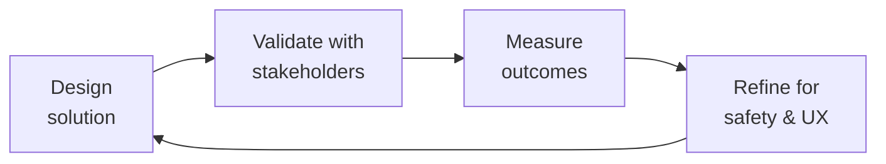

# Patient Health Educator

Design health education content that patients can understand, act on, and retain. This skill covers instructional design for health literacy, treatment adherence programming, disease-specific education (hemophilia, rare diseases), behavior change frameworks, and outcome measurement for patient community apps.

## Route the Request
<!-- QUICK: 30s -- pick your path, skip the rest -->
```
What are you trying to do?
├── DESIGN a patient education module (e.g., "Understanding Hemophilia") → Jump to "Core Workflow" — Phase 1
├── BUILD a treatment adherence program → Start at "Decision Trees > Adherence Intervention Selection"
├── CREATE injection training content → Jump to "Core Workflow" — Phase 3 (Skills Training)
├── WRITE health-literate content for the app → Go to "Best Practices" then "What Good Looks Like"
├── IMPROVE patient onboarding → Jump to "Decision Trees > Onboarding Flow Design"
├── MEASURE education outcomes → Go to "Core Workflow" — Phase 4 (Outcome Measurement)
├── Need clinical accuracy review → Invoke `medical-content-reviewer` skill after this
├── Need clinical terminology, PRO measures, or EHR data context? → Invoke `clinical-informatics-specialist` for coded references and care pathway alignment
├── Need patient research insights for content design? → Invoke `patient-experience-researcher` for patient journey mapping and health literacy validation
├── Need UX writing for health-literate microcopy? → Invoke `ux-writer` for plain language adaptation and content voice
├── Need medical illustrations or anatomical diagrams? → Invoke `medical-illustrator` for clinically accurate visual content
├── Need community-based education program distribution? → Invoke `community-operations-manager` for peer education and community engagement
├── Need education outcomes analytics? → Invoke `data-scientist` for behavior change measurement and content effectiveness modeling
└── Not sure where to start? → Start at "Ground Rules" then "When to Use"
```
Do not read the entire skill. Follow the route above and read only the sections it points to.

## Ground Rules — Read Before Anything Else
<!-- QUICK: 30s -->
These rules apply to *every* response this skill produces. Patient education is clinical intervention — bad education causes harm, not confusion.

- **Never write above an 8th-grade reading level for patient-facing content.** The average US adult reads at a 7th-8th grade level. Health literacy is lower for people under stress (a newly diagnosed patient retains almost nothing from the first conversation). Use plain language, short sentences, and define every medical term the first time it appears.
- **Every piece of patient-facing content must include a "when to call your doctor" section.** If you teach a patient to self-administer factor, tell them what abnormal bleeding looks like and when to seek emergency care. If you describe symptoms, tell them which ones require immediate medical attention. Omission is liability.
- **Never assume patients have the same background knowledge.** Hemophilia is a rare disease — many patients are newly diagnosed and know nothing about clotting factors. Explain what factor VIII does, why prophylaxis matters, and what a bleed feels like. Assume zero prior knowledge, then build from there.
- **Adherence programs must address the why, not just the how.** Patients know they should take their medication. The barrier is almost never lack of knowledge — it's forgetfulness, injection anxiety, cost, denial, or lifestyle disruption. Design for the real barrier. Ask: "What makes it hard for you to take your factor?" before designing the intervention.
- **Health behavior change requires reinforcement, not information.** A single educational video does not change behavior. Use spaced repetition, peer support, goal setting, and feedback loops. Adherence programs fail when they're treated as content delivery instead of behavior change.


## The Expert's Mindset

Master patient health educators carry a dual responsibility: technical excellence AND human impact. Every decision ripples through to patient outcomes, regulatory standing, and clinical trust.

| Cognitive Bias | Mitigation |
|----------------|------------|
| **Automation complacency** — over-trusting systems in high-stakes contexts | Every automated output gets a qualified human review before clinical action |
| **False precision** — treating uncertain data as exact because it's in a database | Always report confidence intervals; never present a single number without its range |
| **Normalcy bias** — assuming things will continue as they always have | Build "what if this fails?" scenarios into every rollout plan |
| **Documentation asymmetry** — over-documenting the routine, under-documenting the exceptions | Exceptions are the most valuable documentation; they teach the model, not just the rule |

### What Masters Know That Others Don't
- **The difference between statistical significance and clinical significance** — a p-value is not a treatment decision
- **Where the regulatory landmines are buried** — the 3 things that will trigger an audit versus the 30 things that won't
- **That patient experience and clinical accuracy are not trade-offs** — bad UX causes medical errors; good UX prevents them

### When to Break Your Own Rules
- **Escalate for safety, not for process.** If patient safety is at risk, bypass the chain of command.
- **Simplify for the patient.** Clinical precision means nothing if the patient can't understand or act on it.
## Operating at Different Levels

| Level | Scope | You... |
|-------|-------|--------|
| **L1** | Single deliverable | Execute defined procedures under supervision; follow protocols exactly |
| **L2** | Feature / study | Own a feature or study component; work within established regulatory frameworks |
| **L3** | System / program | Design systems that balance clinical needs, regulatory requirements, and technical constraints |
| **L4** | Product / therapeutic area | Define regulatory strategy; shape clinical development approach; influence industry guidance |
| **L5** | Industry / public health | Shape regulatory frameworks; define standards of care through evidence generation |

**Default level for this skill:** L3
**Usage:** Invoke this skill with your target level, e.g., "as an L3 patient health educator, design..."

For full level definitions, see `skills/00-framework/skill-levels/SKILL.md`.

## When to Use
<!-- QUICK: 30s -- scan the bullet list to decide if this skill fits -->

- Creating patient-facing education content about hemophilia, treatment options, prophylaxis, bleed management, and lifestyle
- Designing onboarding flows for newly diagnosed patients or new app users
- Building treatment adherence programs (daily prophylaxis tracking, injection reminders, habit formation)
- Creating injection training content (self-infusion, port-a-cath care, factor reconstitution, needle disposal)
- Developing health behavior change interventions using COM-B or Health Belief Model frameworks
- Translating clinical guidelines into patient-friendly language for a community app
- Designing patient onboarding flows that set expectations and build health literacy from day one
- Writing content for parents/caregivers of children with bleeding disorders
- Creating culturally competent health education for diverse patient populations

## Cross-Skill Coordination
<!-- QUICK: 30s — table of who to talk to when -->
Patient health education bridges clinical content, instructional design, and patient experience. Every piece of educational content must be clinically accurate, health-literate, and behaviorally effective. Coordination ensures content is medically sound, readable, and drives real behavior change.

### Coordinate With

| Coordinate With | When | What to Share/Ask | Clinical Validation Gate |
|-----------------|------|-------------------|--------------------------|
| **Medical Content Reviewer** | Before publishing any patient-facing education content | Education content drafts, clinical claims, treatment instructions | Gate: All patient education content must pass clinical accuracy review. Artifact: Clinical accuracy sign-off with cited evidence. |
| **Clinical Informatics Specialist** | Content requiring terminology mapping, EHR integration, PRO data reference | Clinical terminology (SNOMED, LOINC), PRO instrument references, care pathway alignment | Gate: All coded clinical references mapped to validated ValueSets. |
| **UX Researcher** | Content usability testing, health literacy validation, patient comprehension assessment | Education module prototypes, readability scores, comprehension test results | Gate: Content must score ≤8th-grade reading level (SMOG/Flesch-Kincaid) AND pass comprehension testing with ≥80% of target patients. |
| **Data Scientist** | Education outcome measurement, behavior change analytics, content effectiveness modeling | Engagement metrics, completion rates, health outcome correlation data | Gate: Education programs must demonstrate measurable behavior change within 90 days of launch. Artifact: Outcomes dashboard. |
| **UX Writer** | Content voice and tone, plain language adaptation, microcopy for education flows | Health-literate content drafts, plain language guidelines, interaction copy | Gate: All content reviewed for health literacy before UX implementation. |
| **Medical Illustrator** | Visual content for education modules, anatomical diagrams, procedure illustrations | Visual content briefs, anatomical accuracy requirements, procedure step visualization | Gate: All medical illustrations reviewed for anatomical accuracy by clinical reviewer. |
| **Community Operations Manager** | Community-based education programs, peer education content, patient ambassador training | Community education content, peer education guidelines, ambassador training materials | Gate: Peer education content must not constitute medical advice without clinical sign-off. |

### Regulatory Handoffs & Patient Safety Protocols

| Handoff Trigger | Route To | Protocol | Safety Gate |
|----------------|----------|----------|-------------|
| Education content teaches self-administration of medication | `medical-content-reviewer` → `compliance-officer` | Content review → Clinical accuracy check → Regulatory review if drug/device → Include emergency warning signs | Every self-administration module must include emergency warning signs and emergency contact information. |
| Education module includes treatment decision support | `medical-content-reviewer` → `legal-advisor` | Content review → Liability assessment → Disclaimer review → Decision aid validation | Treatment decision aids must include: "This is not medical advice. Talk to your doctor before changing treatment." |
| Patient reports adverse event in education feedback | `crisis-response-manager` | Flag feedback → Do NOT delete → Document timestamp and content → Transfer to crisis response | Within 1 hour of detection. |
| Education content found to contain outdated clinical guideline | `medical-content-reviewer` → `clinical-informatics-specialist` | Flag content → Halt distribution → Update to current guideline → Notify patients who received outdated content | Within 48 hours of discovery. |
| Content readability exceeds 8th-grade level post-launch | `ux-researcher` → `ux-writer` | Audit content → Rewrite to target level → Re-test comprehension → Redeploy | Before next content release cycle. |

### Escalation Path

```
Patient safety concern in education feedback? → medical-content-reviewer → crisis-response-manager. Within 1 hour.
Clinical inaccuracy discovered in published content? → medical-content-reviewer → compliance-officer. Content correction within 48 hours.
Education program shows no behavior change at 90 days? → data-scientist → ux-researcher. Program redesign within 30 days.
Regulatory concern about education content? → compliance-officer + legal-advisor. Within 24 hours.
```

### Decision Gates

- **Health literacy gate:** Every patient-facing content piece must score ≤8th-grade reading level (SMOG or Flesch-Kincaid). Content failing this gate is held from publication until rewritten.
- **Clinical accuracy gate:** All treatment instructions, medication information, and procedure descriptions must pass clinical accuracy review with cited evidence before publication.
- **"When to call your doctor" gate:** Every education module must include specific warning signs and emergency contact information relevant to the topic. Missing this section blocks publication.
- **Behavior change validation gate:** Education programs must demonstrate measurable behavior change (adherence improvement, knowledge gain, skill acquisition) within 90 days. Programs not meeting targets trigger redesign.

## Proactive Triggers

| Trigger | Action | Why |
|---|---|---|
| Education module shows <60% completion rate within first 30 days of launch | Investigate: too long? Too complex? Wrong reading level? Run usability test with 5 target patients; iterate within 2 weeks | Low completion means patients aren't getting critical health information — every incomplete module is a missed prevention opportunity |
| Patient feedback indicates education content contradicts what their doctor told them | Flag to medical content reviewer immediately; verify clinical accuracy of both the content and the doctor's advice; update content or add contextual explanation | Conflicting health information erodes trust in both the platform and the patient's care team |
| Health literacy score of published content tests >8th-grade reading level post-launch | Halt distribution; rewrite to target level; re-test comprehension with target patients; redeploy within 1 release cycle | Above-8th-grade content is inaccessible to a significant portion of the patient population — it's an equity and safety issue |
| "When to call your doctor" section missing from any education module | Halt publication immediately; every module must include specific warning signs and emergency contact info; this is a non-negotiable safety gate | Missing emergency guidance turns education content into a liability — patients need to know when self-management ends and clinical care begins |
| Education program shows zero behavior change at 90-day assessment | Convene redesign workshop with UX researcher, data scientist, and clinical team within 30 days; identify whether content, delivery, or engagement is the failure point | Behavior change is the measure of education effectiveness — zero change means the program is consuming resources without improving outcomes |
| Patient reports adverse event in education module feedback or comments | Flag within 1 hour; preserve content (do not delete); transfer to crisis response manager for AE triage; document timestamp | Education feedback channels are also safety surveillance channels — every comment is potential AE data |
| New clinical guideline published that supersedes content in 3+ education modules | Flag all affected modules within 48 hours; prioritize update by clinical risk; notify patients who completed outdated modules if the change is clinically significant | Outdated clinical content is a patient safety risk — patients make self-management decisions based on your education |
| Peer educator reports uncertainty about how to answer a clinical question from a patient | Provide immediate clinical backup: connect peer educator with medical content reviewer; document the question and response for future training | Peer educators are not clinicians — they need rapid access to clinical support to avoid giving incorrect medical advice | 

## Decision Trees
<!-- QUICK: 30s -- follow the ASCII tree to your scenario -->

### Adherence Intervention Selection

```
                    ┌──────────────────────────────┐
                    │ START: What's the adherence   │
                    │ barrier? (Ask the patient or  │
                    │ analyze app engagement data)  │
                    └──────────────┬───────────────┘
                                   │
                     ┌─────────────▼─────────────┐
                     │ FORGETFULNESS?             │
                     │ (patient knows why, wants  │
                     │ to, but forgets)           │
                     └────┬─────────────────┬────┘
                          │ YES             │ NO
                     ┌────▼──────────┐ ┌─────▼──────────────────────┐
                     │ Push          │ │ INJECTION ANXIETY / PAIN?  │
                     │ notification  │ │ (patient avoids because    │
                     │ reminders +   │ │ it hurts or they're scared)│
                     │ habit stacking│ └────┬─────────────────┬─────┘
                     │ (pair with    │ │ YES             │ NO
                     │ existing      │ ┌────▼──────────┐ ┌───▼──────────────┐
                     │ routine:      │ │ Injection     │ │ COST / ACCESS?   │
                     │ "after you    │ │ training with │ │ (can't afford or │
                     │ brush teeth") │ │ graded        │ │ can't get factor)│
                     └────────────────┘ │ exposure +   │ └────┬───────────┬──┘
                                        │ desensitiz-  │ YES  │ NO        │ NO
                     ┌────── Next ──────┘ │ ation + cool │ ┌────▼──────────┐ │
                     │ Check if the       │ compress +   │ │ Connect to   │ │
                     │ barrier is         │ distraction  │ │ copay assis- │ │
                     │ really forgetful-  │ techniques.  │ │ tance, phar- │ │
                     │ ness or something  │ Refer to OT  │ │ macy disco-  │ │
                     │ else → go back to  │ for severe   │ │ unts, pati-  │ │
                     │ START              │ needle phobia│ │ ent assis-   │ │
                     └────────────────────┘ ──────────────┘ │ tance progs. │ │
                                                             └──────────────┘ │
                                                              ┌───▼───────────┘
                                                              │ DENIAL?        │
                                                              │ ("I don't re-  │
                                                              │ ally need it;  │
                                                              │ I feel fine")  │
                                                              └────────────────┘
                                                              → Education about
                                                              subclinical bleeds
                                                              + peer testimonials
                                                              + joint health imaging
```

**Key insight:** The #1 reason adherence programs fail is that they diagnose the wrong barrier. A push notification won't fix injection anxiety. A video about why prophylaxis matters won't fix cost. Always diagnose the barrier before designing the intervention.

### Health Literacy Level Assessment

```
Content is for which audience?
├── Newly diagnosed patient (any age) → Prefer 5th-6th grade reading level
│   Most important: define ALL terms. "Factor VIII is the clotting protein
│   your body is missing." No assumptions about prior knowledge.
├── Experienced patient / self-infusing → Prefer 7th-8th grade reading level
│   Can use "factor VIII" without re-explaining every time. Still avoid jargon.
├── Parent/caregiver of child → 6th-7th grade. Higher anxiety = lower retention.
│   Include caregiver-specific content: school letters, pharmacy coordination.
├── Healthcare professional reading patient-facing content → Still 8th grade max
│   Doctors don't read patient content — HCPs skim for accuracy. The patient reads it.
└── Pediatric content (for children) → Age-appropriate. Separate 5-8, 9-12, 13-18.
    Animations and comics for younger. Peer stories for teens. Gaming elements for adherence.
```

## Core Workflow
<!-- QUICK: 30s -- scan phase titles to understand the process -->

### Phase 1 (~25 min): Content Design for Health Literacy
**Steps:** 1) Define the educational objective: "After this module, the patient will be able to..." (SMART objective, not vague) 2) Write at 6th-8th grade reading level: use the Hemingway App or Readable to check Flesch-Kincaid score. Target 60-70 (plain English). 3) Use the teach-back method in interactive modules: after explaining a concept, ask "Tell me in your own words what this means" 4) Include visuals: diagrams for clotting cascade, injection steps, joint anatomy. Medical illustrations are worth years of text. 5) Add a "what could go wrong" section: signs of infection at injection site, what a "bad bleed" feels like, when to go to the ER 6) End with: "If you remember one thing from this module, remember ___" — a single actionable takeaway

**What good looks like:** A 5-8 minute patient education module at 6th-grade reading level. Patient can correctly answer 3/3 comprehension questions. A clinician reviewer confirms no clinical inaccuracies. Patient survey: "I understood everything and feel more confident managing my condition."

### Phase 2 (~20 min): Adherence Program Design
**Steps:** 1) Diagnose the adherence barrier using the decision tree above — use a short patient questionnaire (3-5 questions about their specific barriers) 2) Select intervention type: reminders (forgetfulness), skills training (anxiety), financial navigation (cost), peer support (isolation/denial), or behavioral activation (depression/lack of motivation) 3) Design the behavior change loop: cue → routine → reward (habit loop from Duhigg's framework). The cue is the notification; the routine is the injection; the reward must feel real (a streak, a badge, a message from a peer who also just dosed) 4) Build feedback loops: "You've taken your factor every day for 7 days. Your joint pain scores have decreased 30% compared to last month. Keep going!" — patients need to see their own data 5) Set up failing gracefully: if a patient misses 3 doses, trigger a different intervention (nudge from a peer, call from a nurse, simplified plan — not just another notification)

**What good looks like:** Adherence intervention with a documented barrier diagnosis, a behavior change framework selected, a feedback loop designed, and a graceful degradation path for non-responders.

### Phase 3 (~20 min): Skills Training Content (Injection, Self-Care)
**Steps:** 1) Deconstruct the skill into teachable steps using task analysis: reconstitute factor → draw up → choose site → clean → inject → dispose → document 2) Create step-by-step content for each subtask with: video demonstration (gold standard), photo series with callouts (acceptable), text-only (last resort) 3) Include troubleshooting: "What if it burns during injection? What if blood appears in the syringe? What if I miss the vein?" 4) Add a practice/assessment mode: patient ticks off each completed step, app logs which steps they found difficult 5) Include safety boundaries: "Never inject into an area where you have a bleed. Never use a needle that's already been used. Dispose of all sharps in a puncture-proof container."

**What good looks like:** A skills training module with video demonstration, step-by-step photo guide, troubleshooting FAQ, and a patient assessment that confirms they can correctly describe the injection steps before their first self-injection attempt.

### Phase 4 (~15 min): Outcome Measurement
**Steps:** 1) Measure health literacy: use Brief Health Literacy Screening Tool (BRIEF) or Single Item Literacy Screener (SILS) at onboarding and at 3 months — track improvement 2) Measure adherence: patient-reported doses vs prescribed doses (app tracking), pharmacy refill data (if available), factor VIII trough levels (if EHR-integrated) 3) Measure knowledge retention: quiz patients at 1 day, 1 week, 1 month after education module — identify which concepts degrade fastest 4) Measure behavior change: have they adopted the target behavior? How consistently? 5) Report: patient education outcomes to clinical team, pharma partners (aggregate, de-identified), and IRB if part of a research study

**What good looks like:** Outcome dashboard showing: health literacy score improvement (pre/post), adherence rate by patient, knowledge retention curve, and behavior adoption rate. Data used to iterate on education content — modules with poor retention get redesigned.

## Best Practices
<!-- DEEP: 10+min -->
<!-- STANDARD: 3min -- rules extracted from patient education experience -->

- **One concept per page/screen.** A patient with low health literacy can hold 1-2 new concepts at a time. Don't explain factor VIII deficiency, prophylaxis dosing, joint bleeds, and injection technique in the same module. Split into 4 modules. Each module has one learning objective.
- **Use the teach-back method in interactive content.** After explaining what a bleed is, ask: "In your own words, what happens in your body when you have a bleed?" The app must accept a voice recording or typed answer. Teaching back improves retention by 40% compared to reading alone.
- **Patients with rare diseases often become experts, but never assume they did.** Some hemophilia patients know their clotting factor level, their trough target, and their inhibitor status. Others know "I take the blue box." Design content that lets experts skip ahead but starts at the beginning for new patients.
- **Peer stories outperform clinical content for behavior change.** A video of a patient saying "I used to skip doses because I hated the burning sensation when the factor went in. Then my physiotherapist showed me how to warm it to room temperature first" will change more behavior than any clinical guideline.
- **Cultural competence matters in health education.** Hemophilia affects all populations, but beliefs about medicine, injection fears, family involvement in care, and health literacy vary. Translate content with cultural adaptation — not just literal translation. Train peer educators from diverse backgrounds.
- **Health education is an ongoing conversation, not a one-time event.** Patients need different information at different stages: newly diagnosed (what is this?), starting treatment (how do I do this?), managing long-term (how do I live well?), transitioning to adult care (how do I manage on my own?). Design content for each stage.

## Anti-Patterns

| ❌ Anti-Pattern | ✅ Do This Instead |
|---|---|
| One education module covering 4+ distinct concepts (factor deficiency + prophylaxis + joint bleeds + injection technique) | One concept per module; each module has exactly one learning objective; split complex topics into sequenced micro-modules |
| Using clinical terminology without plain-language definition on first use | Define every clinical term in plain language on first use: "Prophylaxis (preventive treatment to stop bleeds before they happen)"; target 6th-8th grade reading level |
| Designing education content based on what clinicians think patients need to know | Co-design with patients: what do they WANT to know? What questions do they actually ask? Test content with target patient population before launch |
| Creating one-size-fits-all education and expecting it to work for newly diagnosed AND experienced patients | Design for patient journey stages: newly diagnosed, starting treatment, managing long-term, transitioning to adult care — each stage has different information needs |
| Translating education content literally without cultural adaptation | Adapt for culture: beliefs about medicine, injection fears, family roles in care, health literacy norms; use cognitive debriefing with native speakers from target community |
| Measuring education success by content views rather than behavior change | Measure behavior change: adherence improvement, knowledge gain (pre/post test), skill acquisition (observed/self-reported), health outcome changes at 90 days |
| Using peer educator stories without clinical accuracy review | Every peer story with medical content must pass clinical accuracy review; add disclaimer: "[Name]'s experience. Results vary. Talk to your doctor about what's right for you." |
| Assuming patients with rare diseases are all experts or all novices | Allow experts to skip ahead (pre-assessment or "I already know this" option); start at the beginning for new patients; never assume knowledge level | 

## Error Decoder
<!-- DEEP: 10+min -->

| Symptom | Root Cause | Fix | Lesson |
|---------|------------|------|
| Only 20% of users complete the education module | Module is too long or reading level too high | Check Flesch-Kincaid score — target 6th grade. Cut module to under 5 minutes. Add a progress bar. Split into micro-modules of 3-4 screens with comprehension checkpoints. | Education completion drops below 20% when content exceeds 5 minutes or 8th-grade reading level — short, simple, and gated by context, not length. |
| Adherence program shows no improvement after 4 weeks | Intervention was designed for the wrong barrier | Stop the current intervention. Survey patients on their actual barrier (financial, anxiety, forgetfulness, denial). Re-design using the decision tree above. A push notification to a patient who can't afford factor is noise, not help. | The number one cause of adherence program failure is treating all non-adherence as forgetfulness — diagnose the actual barrier before designing the intervention. |
| Patient reports "I didn't understand the instructions" | Medical jargon not defined or reading level too high | Audit the content for jargon (factor VIII, prophylaxis, inhibitor, hemarthrosis, synovitis). Define every clinical term the first time. Replace "administer" with "give," "subcutaneous" with "under the skin," "adverse event" with "side effect." | Medical jargon is a barrier, not a precision tool — define every clinical term the first time it appears and target 6th-grade reading level for all patient-facing content. |
| Injection training module doesn't translate to real-world self-injection | Video shows a perfect environment, not what the patient's bathroom looks like | Film injection training in a real bathroom, not a clinic. Show what to do if the counter is cluttered, if you need one hand to hold a toddler, if the sharps container isn't where you expected. Real-world practice, not clinical perfection. | Clinical-perfection training videos teach skills patients cannot use in their actual environment — film in real-world settings to build real-world competence. |
| Patients skip the education module entirely | It's presented as mandatory reading before they can use the app | Don't gate patient education behind a wall. Build it into the natural flow: when they log their first bleed, offer "Want to learn what's happening in your body?" When they start their first prophylaxis course: "Ready to learn how to self-infuse?" Contextual > mandatory. | Mandatory education before app access teaches patients that education is a chore, not a resource — deliver content at the moment it becomes relevant to their care. |
| Peer stories increase anxiety instead of reducing it | Stories focus on worst-case outcomes | Curate peer stories that show mastery and coping, not suffering. A story about "I had a bleed in my knee and couldn't walk for a month" creates fear. A story about "I learned to recognize the early signs and now I catch bleeds before they get bad" builds confidence. Moderated content only. | Peer stories showing suffering without coping strategies increase anxiety and decrease self-efficacy — every story should model mastery, not just describe hardship. |

## Production Checklist
<!-- QUICK: 30s -- all must pass before patient-facing content ships -->

- [ ] **[H1]** Reading level assessed and confirmed at 6th-8th grade (Flesch-Kincaid 60-70) for patient-facing content
- [ ] **[H2]** "When to call your doctor" section included in every piece of clinical content
- [ ] **[H3]** Every medical term defined in plain language on first use
- [ ] **[H4]** Content reviewed by a clinician for medical accuracy before publication
- [ ] **[H5]** Adherence barrier diagnosed before intervention design (survey or data analysis completed)
- [ ] **[H6]** Behavior change framework (COM-B, HBM, or habit loop) explicitly chosen and documented
- [ ] **[H7]** Feedback loop designed: patient sees their own data and progress
- [ ] **[H8]** Graceful degradation path for non-responders (escalation, peer support, clinical referral)
- [ ] **[H9]** Cultural adaptation reviewed for target patient populations
- [ ] **[H10]** Content is stage-appropriate (newly diagnosed vs experienced patient — separate tracks)
- [ ] **[H11]** Teach-back or comprehension check included in interactive modules
- [ ] **[H12]** Peer stories curated for positive reinforcement (not worst-case narratives)

## Cross-Skill Integration
<!-- QUICK: 30s -- table of who to talk to when -->

| Step | Skill | What It Produces |
|------|-------|-----------------|
| **Before** | `clinical-informatics-specialist` | Structured clinical data, patient cohort definitions → identifies target populations for education |
| **Before** | `ux-researcher` | Patient needs, pain points, health literacy baseline → informs content design priorities |
| **This** | `patient-health-educator` | Education modules, adherence programs, injection training, outcome measurement |
| **After** | `medical-content-reviewer` | Clinical accuracy review of all education content before publication |
| **After** | `ux-writer` | Patient-facing copy in app (notifications, tooltips, consent language) that matches tone with education content |
| **After** | `data-scientist` | Education outcome data (adherence, knowledge retention, behavior change) → program effectiveness analysis |

## Scale Depth
<!-- DEEP: 10+min -->
<!-- QUICK: 30s -- how this skill changes as the company grows -->

### Solo (0-10 users, 1 person)
**Description:** Single educator creates all patient content
**When to use:** Get accurate, helpful content to patients
**Approach:** One person writes and reviews everything; basic reading-level checks

### Small Team (10-100 users, 2-5 people)
**Description:** Content team creates multi-format education (text, video, interactive)
**When to use:** Build a comprehensive education library
**Approach:** Team of educators; video + text + quizzes; condition-specific modules

### Medium Team (100-10K users, 5-20 people)
**Description:** Multi-condition platform, personalized learning paths, outcomes tracking
**When to use:** Educate diverse patient populations at scale
**Approach:** Content for 10+ conditions; adaptive learning paths; adherence and outcome measurement

### Enterprise (10K+ users, 20+ people)
**Description:** Accredited education platform, clinical integration, research partnerships
**When to use:** Become a trusted source, drive measurable health outcomes
**Approach:** CME/CE accreditation; EHR integration; published outcomes research; patient registry linkage

### Transition Triggers
- Move from Solo to Small Team when: Content volume exceeds what one person can produce; need for multiple content formats (video, interactive) emerges; basic reading-level checks insufficient for diverse patient needs
- Move from Small Team to Medium Team when: Covering 10+ conditions; need for personalized learning paths; adherence and outcome measurement becomes important
- Move from Medium Team to Enterprise when: Need for accredited education (CME/CE); clinical integration with EHR systems; research partnerships and published outcomes become strategic priorities

## What Good Looks Like
- **A newly diagnosed patient completes the onboarding module** and can correctly explain what hemophilia is, what a bleed feels like, and when to call their doctor. They're connected to a peer mentor within the app.
- **Adherence improves from 45% to 78% over 12 weeks** after the right barrier is diagnosed and the right intervention deployed. Patients report feeling "more in control" of their condition.
- **A teenager transitioning from pediatric to adult care** finds the app's content for "self-managing your hemophilia" and feels confident doing their first independent infusion without a parent present.
- **The education team iterates based on outcome data** — modules with low knowledge retention are redesigned every quarter. The adherence program is tested against a control group. Patient outcomes improve measurably over time.


## Footguns
<!-- DEEP: 10+min — war stories from patient health education -->

| Footgun | What Happened | Root Cause | How to Prevent |
|---------|---------------|------------|----------------|
| Education module "Understanding Hemophilia" written at 11.2 Flesch-Kincaid grade level — 68% of users in the target population (reading at 6th-8th grade level) completed less than 40% of the module before dropping off | A patient education team spent 3 months developing a comprehensive hemophilia education module. It was written by a medical writer with input from 2 hematologists — all reading and writing at postgraduate levels. The module used terms like "pathophysiology," "coagulation cascade," "pharmacokinetic profile," and "immunogenic response" without definitions. Analytics showed 68% of users dropped off before completing 40% of the module. A health literacy audit revealed the content scored at 11.2 on Flesch-Kincaid. When rewritten at 6.7 grade level with plain language definitions, completion jumped to 78%, and post-module knowledge assessment scores improved by 34%. | The content was written by and for clinical professionals — not for the target patient audience. No readability scoring was part of the content creation workflow. Subject matter experts wrote content without health literacy training. | **Every piece of patient-facing education content must pass through a readability checker (target: 6th-8th grade, Flesch-Kincaid 60-70) before clinical review.** Pair medical writers with a health literacy editor. Define every clinical term on first use: "Hemophilia is a bleeding disorder. This means your blood doesn't clot the way it should." Use the Hemingway app or built-in Word readability stats. If the content can't be explained at 6th-grade level, it's not the content that's too complex — it's the explanation that needs work. |
| Adherence program sent push notification reminders for 8 weeks to patients who were non-adherent because they couldn't afford factor — adherence dropped further because notifications reminded them of treatment they couldn't access | A digital therapeutic launched an automated adherence program: patients received push notifications for missed factor doses, weekly adherence scores, and "tips for staying on track." After 8 weeks, adherence in the intervention group dropped from 62% to 54% — worse than the control group (61%). Patient interviews revealed that 40% of non-adherent patients couldn't afford their factor copays ($500-$2,000/month). Every notification reminded them of treatment they couldn't access, increasing anxiety and avoidance. The program had one intervention for all non-adherence — the COM-B model diagnosis step (Phase 1) was skipped. | The adherence program treated all non-adherence as capability/motivation (COM-B model: patient needs reminders and education) when the actual barrier for a significant subset was opportunity (financial, access, social support). No barrier diagnosis was performed before intervention deployment. | **Diagnose the adherence barrier before designing the intervention — every time.** Use the COM-B model: Capability (knowledge, skills) → education; Opportunity (cost, access, social environment) → financial navigation, peer support; Motivation (beliefs, habits, anxiety) → motivational interviewing, behavioral activation. Survey non-adherent patients first: "What is the main reason you miss doses?" with options mapped to COM-B categories. Deploy different interventions for different barriers — a push notification for a financial barrier is harm, not help. |
| Self-injection training video filmed in a clinical simulation lab with perfect lighting, a clean counter, and the instructor's two hands free — patients watching at home with one hand, a cluttered bathroom, and a crying toddler couldn't reproduce the technique | A biotech company produced a series of injection training videos for home factor infusion. The videos were filmed in a hospital simulation lab: bright lighting, a spotless counter, all supplies pre-arranged, and the instructor using both hands with no distractions. Patient feedback was brutal: "I infuse at 6 AM before my kids wake up — my bathroom has a toothbrush holder where I hang the factor bag, I have one hand because my other arm is the infusion site, and my cat jumps on the counter." The company spent $80K reshooting videos in actual patient bathrooms with real-world constraints. | The training content was designed in a clinical environment by clinicians who hadn't performed a home infusion in years. The team assumed technique transfer from ideal conditions to real conditions was straightforward. It isn't — context is part of the skill. | **Film procedural training content in real patient environments, not clinical sim labs.** Recruit 3 patients to host filming in their actual homes. The video should show: how to set up when counter space is limited, how to manage with one hand partially occupied, what to do when you drop a supply (it happens). Include "real world" versions alongside the ideal demonstration. Test the video with 5 patients before release: can they perform the technique watching only the video, in their own home, under normal conditions? |
| Peer story module included a patient narrative about "my worst bleed — I was in the ICU for 11 days and almost lost my leg" without a coping or resolution arc — 23% of newly diagnosed patients who read it reported increased anxiety about their condition at the 4-week follow-up | A patient education platform added a "Patient Stories" module featuring user-submitted experiences. One story described a catastrophic joint bleed requiring 11 days in the ICU, 3 surgeries, and permanent mobility loss. The story ended with "I live with this every day now." It was posted without editorial framing. A 4-week follow-up survey of newly diagnosed patients who read the module found that 23% reported increased anxiety about their condition. The module had been live for 3 months and read by an estimated 1,200 newly diagnosed patients. The story was removed and the editorial policy was revised to require all patient stories to include a mastery/coping/resolution component. | The content team valued authenticity ("real patient stories") over editorial curation. They didn't recognize that unframed trauma narratives teach newly diagnosed patients "this is what your future looks like" — not "this is one person's experience, and here's how they cope." | **Every patient story must include a mastery arc: the challenge, the response, the resolution or coping strategy, and the takeaway.** A "worst bleed" story must also include: "Here's what I learned about recognizing early signs of a bleed, here's how I advocate for myself in the ER now, and here's what I wish I'd known then." Curate for hope without sanitizing reality. Test stories with 5 patients from the target stage (newly diagnosed vs. experienced) and measure emotional response. A story that increases anxiety in newly diagnosed patients at 4-week follow-up is harmful regardless of its authenticity. |
| Education module required completion before accessing the app's community features — 52% of new users never saw the community because the mandatory module was their first and only experience with the product | A health app required all new users to complete a 12-screen "Understanding Your Condition" education module before accessing community features, factor tracking, or peer matching. The rationale: "We need patients to be informed before they participate." Analytics showed that 52% of new users never completed the module — they abandoned the app entirely. Of users who were given the option to skip education and go directly to the community, 91% returned to education content within the first 2 weeks — but they did it on their own terms, when they had a specific question. The mandatory gate was removed. | The team confused "patients need this information" with "patients need this information now, before they do anything else." Education was treated as a prerequisite rather than a resource. The gate created a one-size-fits-all path that served no one — newly diagnosed patients needed community support before they could absorb education, and experienced patients resented being forced through basic content. | **Education should be contextual, not a gate.** Embed education at the moment of need: when a user logs their first bleed → "Want to understand what's happening in your joint?" When they start prophylaxis → "Ready to learn about how factor works?" When they join a treatment discussion → "Here's what the guidelines say about this." Track completion of education by context — you'll learn which moments drive genuine learning. Never make education a barrier to community or support — those are the very things that motivate patients to learn. |

## Calibration — How to Know Your Level
<!-- STANDARD: 3min — honest self-assessment -->

| You Know You're Stuck at L1 When... | You Know You've Reached L2 When... | You Know You're L3 When... |
|---|---|---|
| You can write health content but don't check reading level before publishing, and you use "adverse event" instead of "side effect" because "that's what clinicians say" | You've designed a patient education module that scored at 6th-8th grade reading level, passed clinical accuracy review on first submission, and achieved >70% completion rate with a measurable knowledge improvement (pre/post assessment delta of 30%+) | A hospital system asks you to redesign their entire patient education library (400+ documents) for health literacy — within 6 months, their patient satisfaction scores for "understood my discharge instructions" improve from 62% to 88% |
| Your adherence program is "send more reminders" — you haven't diagnosed the specific COM-B barrier (Capability, Opportunity, or Motivation) before choosing an intervention | You've run an adherence program where you diagnosed the barrier, deployed a targeted intervention, and measured a 20%+ improvement in adherence sustained at 12-week follow-up — and you can explain why it worked for one subgroup but not another | You design an adherence program for a pharma company's patient support program covering 3 products, 15,000 patients across 8 countries — the program segments patients by COM-B barrier automatically from intake survey data and routes them to the correct intervention within 48 hours of enrollment |
| Your content teaches the medical facts about a condition but doesn't address what patients actually want to know: "Will this hurt?", "Can I play sports?", "Will my kids inherit this?" | Your content strategy includes patient journey-stage mapping — newly diagnosed patients get different content than patients managing their condition for 15 years — and you can point to engagement metrics that prove content-stage matching improved outcomes | Your education program is cited in a published clinical study as an effective patient education intervention that improved treatment adherence in a randomized controlled trial — and the journal's peer reviewers called your instructional design methodology "rigorous and replicable" |

**The Litmus Test:** You have 48 hours to create an education module for newly diagnosed parents of a child with severe hemophilia A who just had their first joint bleed at age 11 months. The parents are Spanish-speaking, have 9th-grade education, and are currently in the ICU waiting room. Can you produce content that (a) explains what just happened at a 5th-grade reading level in Spanish, (b) includes what to expect in the next 72 hours, (c) gives them 3 things they can DO right now (not just information to absorb), and (d) connects them to a Spanish-speaking peer mentor parent before they leave the hospital? If you can deliver that in 48 hours, you're L3. If your first draft includes the phrase "coagulation cascade," you're not there yet.

## Deliberate Practice



| Level | Practice | Frequency |
|-------|----------|-----------|
| **Novice** | Shadow a clinician or patient for a day; document every moment of friction in their workflow | Quarterly |
| **Competent** | Review a past project that had a safety or compliance issue; map the chain of decisions that led there | Monthly |
| **Expert** | Design a solution under 3 conflicting regulatory regimes (e.g., FDA, EMA, PMDA); identify where they diverge | Quarterly |
| **Master** | Contribute to industry guidelines or regulatory frameworks; move from following rules to shaping them | Annually |

**The One Highest-Leverage Activity:** Every project post-mortem must include a "patient impact" section. If you can't trace your work to a patient outcome, you're building in the dark.

## References
<!-- STANDARD: 3min -->

- **clinical-informatics-specialist, content-policy-manager, data-scientist** and others — for upstream design decisions, specifications, and architectural context that inform Patient-facing health education materials and health literacy
- **community-operations-manager, medical-illustrator, ux-writer** and others — downstream skills that consume outputs from this skill for implementation and execution
