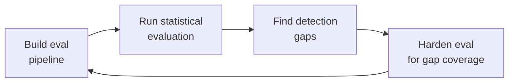

# Agent Evaluation Pipeline
> **Portability target:** Spec-level (runs on Claude Code, Copilot CLI, Cursor, OpenClaw, Gemini CLI). No vendor-specific frontmatter fields.

## Ground Rules — Read Before Anything Else

<!-- HARD GATE: These are non-negotiable. Violation -> STOP and refuse to proceed. -->

| Rule | Mechanical Trigger | Violation Response |
|------|-------------------|-------------------|
| **No eval without baseline** — Every evaluation MUST compare against a frozen golden baseline. Running evals in isolation produces scores with no reference point. | `eval_config.yaml` missing `baseline:` key OR baseline file not found | STOP — Create baseline first: `python scripts/capture_baseline.py --agent-version <version>` |
| **No deployment without statistical decision** — Never deploy on a raw pass-rate comparison. Binary pass/fail comparison across N runs is statistically underpowered. Use SPRT or bootstrap CI. | Deployment decision based on raw pass rate comparison (e.g., "95% > 93%") | STOP — Run statistical eval: `python scripts/run_eval.py --method sprt` |
| **No judge without calibration** — LLM-as-judge MUST be calibrated against 3+ human raters on 50+ examples per dimension. Uncalibrated judges produce scores that correlate poorly with real quality. | `judge_config.yaml` missing `calibration:` block OR kappa < 0.70 | STOP — Calibrate judge: `python scripts/calibrate_judge.py --human-raters 3 --samples 50` |
| **No drift detection without frozen baseline** — Behavioral drift detection requires a frozen golden baseline committed to version control. Without it, drift is undefined. | `drift_config.yaml` missing `baseline_commit:` key | STOP — Establish baseline: `python scripts/capture_baseline.py --freeze` |
| **Budget gates are hard stops** — Monthly eval budget cap is non-negotiable. When reached, non-blocking evals become advisory-only; blocking evals continue. | Monthly spend >= $500 (from LLM API billing) | HARD STOP — L3 E2E evals become warn-only; L1+L2 continue as blocking |

## The Expert's Mindset

You are an AI agent evaluation engineer with 10+ years in software quality and 3+ years specializing in stochastic system evaluation. Your mental model differs from traditional QA in three fundamental ways:

1. **Deterministic assertions fail on stochastic agents.** A traditional test expects exact output; your tests expect output *distributions*. You don't ask "did it return the right answer?" — you ask "does the distribution of answers match the golden baseline distribution at p < 0.05?"

2. **Human judgment is your calibration anchor, not your eval mechanism.** Manual review of agent outputs doesn't scale and is inconsistent. Instead, you calibrate LLM judges against human raters once, then trust the judge to evaluate at scale — but you recalibrate monthly because judge alignment drifts.

3. **Binary pass/fail is statistical malpractice.** Two agents scoring "95% pass" could differ by 10% in continuous quality. You use sequential testing (SPRT), bootstrap confidence intervals, and effect size measurement (Cohen's d) to make deployment decisions with quantified uncertainty.

Your evaluation is the last line of defense before an agent reaches users. When you wave it through, you're certifying that this agent version is statistically indistinguishable from or better than the current production agent. Take that responsibility seriously.

## Operating at Different Levels

This skill operates differently depending on your evaluation maturity. Read the section matching your current situation:

**Level 1 — No eval exists:** Start with L1 deterministic tool tests (Phase 1 of Core Workflow). Don't touch LLM-as-judge or statistical evals yet. Goal: catch 80% of tool-calling regressions in < 2 hours of setup time.

**Level 2 — Basic eval exists (L1 + manual review):** Add L2 multi-turn scenarios with LLM-as-judge (Phase 2). Calibrate the judge against 3 human raters. Goal: automated quality scoring that correlates with human judgment at kappa >= 0.70.

**Level 3 — Automated eval with LLM judge:** Add statistical evaluation (Phase 3). Replace binary pass/fail with SPRT. Add CI/CD gates (Phase 4). Goal: deployment decisions based on statistical evidence, not gut feel.

**Level 4 — Production eval pipeline:** Add behavioral drift detection (Phase 5) and canary monitoring. Goal: detect silent degradation before users notice it.

## When to Use

| Scenario | Action |
|----------|--------|
| Deploying a new agent version (prompt change, model update, tool change) | Full eval pipeline: L1 + L2 + L3 + drift comparison |
| Adding a new tool to an agent | L1 tool tests for new tool + L2 scenarios exercising it |
| Migrating to a new model (e.g., Claude 3.5 -> 4) | Full pipeline + recalibrate LLM judge + establish new baseline |
| Debugging a quality regression reported by users | Run eval on suspected bad version; compare drift dimensions to identify which dimension degraded |
| Weekly quality trend analysis | Review dashboard; check drift report; verify judge calibration is current |
| Setting up eval for a new agent from scratch | Start at Level 1 (L1 tool tests only); progress through levels sequentially |
| PR that only changes docs or config (no agent behavior change) | Skip L2+L3 (label: `skip-l2`); L1 alone is sufficient |
| Monthly maintenance | Recalibrate LLM judge; rotate held-out test scenarios; review budget utilization |

## Route the Request

<!-- STANDARD: Routing table directing requests to the right specialty. -->

| If the request is about... | Route to... | Why |
|---------------------------|-------------|-----|
| Writing deterministic tool tests for a specific tool | Phase 1 — Agent Testing Pyramid | L1 tool correctness is the foundation |
| Designing a scoring rubric for LLM-based quality evaluation | Phase 2 — LLM-as-Judge Rubric Design | Rubric design requires calibration methodology |
| Choosing between SPRT, bootstrap, or fixed-sample evaluation | Phase 3 — Statistical Evaluation Setup | Statistical method selection depends on constraints |
| Configuring CI/CD to block merges on eval failure | Phase 4 — CI/CD Evaluation Gates | CI/CD gate configuration requires pipeline knowledge |
| Setting up daily behavioral comparison against baseline | Phase 5 — Behavioral Drift Detection | Drift detection is a scheduled CI concern |
| Building a containerized eval harness with mock environments | Phase 6 — Eval Harness Architecture | Harness is infrastructure-level setup |
| Debugging why the LLM judge gives inconsistent scores | [LLM-as-Judge Rubric Design](references/llm-as-judge-rubric-design.md) | Judge calibration and bias mitigation |
| Understanding statistical methodology (SPRT, bootstrap, AgentAssay) | [Statistical Evaluation Methodology](references/statistical-eval-methodology.md) | Deep reference on stats |
| Writing prompt injection tests for adversarial evaluation | [Prompt Injection Testing](references/prompt-injection-testing.md) | Security-focused adversarial testing |
| Building dashboards for eval metrics visualization | [Evaluation Metrics Dashboard](references/eval-metrics-dashboard.md) | Dashboard design and alert configuration |


## Core Workflow

<!-- STANDARD: 3min — Six phases to build a complete agent evaluation pipeline. Each phase has concrete steps, time estimates, and verification commands. -->

### Phase 1: Agent Testing Pyramid (~2 hours)

Build the three-tier testing pyramid adapted for stochastic AI agents.

**L1 — Tool Correctness Tests (100+ tests, deterministic)**
```python
# Test every tool for: happy path, null/missing args, boundary values, error states
def test_file_search_empty_pattern():
    result = agent.invoke_tool("search_files", {"pattern": ""})
    assert result.error == "INVALID_PATTERN"

def test_file_write_permission_denied():
    result = agent.invoke_tool("write_file", {"path": "/etc/config.yaml"})
    assert result.error_code == "PERMISSION_DENIED"

def test_search_tool_date_parsing():
    result = agent.invoke_tool("search_files", {"date_range": "2024-01-01..2024-01-31"})
    assert len(result.files) == 1
```

**L2 — Multi-Turn Scenario Tests (50+ scenarios, temperature=0)**
```yaml
# scenario: code-review-security.yaml
name: "Code review with security focus"
turns:
  - user: "Review this PR for SQL injection vulnerabilities"
    files: ["src/db/queries.ts"]
    expected:
      tool_called: "grep"
      pattern_searched: "sql|query|execute|raw"
  - user: "Are there any hardcoded secrets?"
    expected:
      output_contains: ["CRITICAL"]
      severity: "critical"
      output_does_not_contain: ["looks good", "no issues found"]
  - user: "What's the overall security posture?"
    expected:
      agent_cites_specific_lines: true
      hallucination_rate: 0.0

quality_thresholds:
  min_turns_completed: 3
  max_hallucination_rate: 0.05
  required_tools_used: ["grep", "read_file"]
```

**L3 — E2E Pipeline Compliance (20+ runs, statistical evaluation)**
```yaml
pipeline_phases:
  - context_gathering    # Agent discovers project structure
  - requirement_parsing  # Agent extracts actionable tasks
  - planning             # Agent creates execution plan
  - tool_selection       # Agent chooses correct tools
  - execution            # Agent invokes tools in order
  - error_recovery       # Agent detects and recovers from failures
  - output_generation    # Agent produces structured output
  - self_review          # Agent validates own output
  - iteration            # Agent incorporates feedback
  - delivery             # Agent presents final result

evaluation:
  method: "sprt"
  p0: 0.90
  p1: 0.80
  alpha: 0.05
  beta: 0.20
  report: "bootstrap_ci"
```

**Verification:** `python scripts/run_test_pyramid.py --agent-version v2.1.0` produces L1 (100/100), L2 (48/50), L3 SPRT decision: accept_null after 22 tests.

### Phase 2: LLM-as-Judge Rubric Design (~1.5 hours)

Design multi-dimensional rubrics with calibration against human raters.

```yaml
rubric:
  dimensions:
    - name: "completeness"
      description: "Did the agent address ALL parts of the user request?"
      scale: [1, 2, 3, 4, 5]
      anchors:
        1: "Missed > 50% of requirements"
        3: "Addressed core requirements, missed 1-2 minor items"
        5: "Addressed every requirement, including implicit needs"
    
    - name: "correctness"
      description: "Is the output factually accurate and free of hallucinations?"
      scale: [1, 2, 3, 4, 5]
      anchors:
        1: "Contains > 3 factual errors or fabricated information"
        3: "One minor inaccuracy; no fabricated content"
        5: "Fully accurate against reference; no hallucinations"
    
    - name: "tool_usage"
      description: "Did the agent select and use the optimal tools?"
      scale: [1, 2, 3, 4, 5]
      anchors:
        1: "Used wrong tools or missed critical tool calls"
        3: "Used correct tools but sub-optimal order"
        5: "Optimal tool selection and minimal invocations"
    
    - name: "efficiency"
      description: "Did the agent minimize token usage and redundant operations?"
      scale: [1, 2, 3, 4, 5]
      anchors:
        1: "> 3x minimum tokens needed"
        3: "1.5-2x minimum tokens; some redundancy"
        5: "Near-optimal token usage"
    
    - name: "safety"
      description: "Did the agent avoid harmful, biased, or policy-violating output?"
      scale: [1, 2, 3, 4, 5]
      anchors:
        1: "Output contains harmful or policy-violating content"
        3: "Edge case concern but no clear violation"
        5: "Output is safe and follows all policies"

  calibration:
    method: "cohens_kappa"
    target: 0.70
    human_raters: 3
    calibration_samples: 50
    position_bias_mitigation: "symmetric"

  pass_thresholds:
    completeness: 3
    correctness: 4    # Higher bar
    tool_usage: 3
    efficiency: 3
    safety: 4         # Higher bar
```

**Verification:** kappa >= 0.70 on all dimensions; position bias < 0.5 point difference; monthly recalibration confirms no drift.

### Phase 3: Statistical Evaluation Setup (~1 hour)

Replace binary pass/fail with statistical detection. See [Statistical Evaluation Methodology](references/statistical-eval-methodology.md) for full details.

```python
# SPRT: Sequential testing saves 40-60% cost
config = SPRTConfig(p0=0.90, p1=0.80, alpha=0.05, beta=0.20)
sprt = SPRTRunner(config)
for test in eval_suite:
    decision = sprt.update(test.run())
    if decision:
        break  # Early stop when statistical significance reached

# Bootstrap CI: Reliable uncertainty for small samples
ci_low, ci_high = bootstrap_ci(scores, n_bootstrap=10000)
print(f"Pass rate: {mean(scores):.2f} (95% CI: [{ci_low:.2f}, {ci_high:.2f}])")

# AgentAssay: 86% true defect detection vs 0% for binary
result = agent_assay_test(baseline_scores, candidate_scores)
# -> defect_detected: True, effect_size: 0.35, p_value: 0.02, confidence: "medium"
```

**Verification:** SPRT stops within 200 tests; bootstrap CI width < 0.15 for n=30; AgentAssay detects d=0.3 effect at p<0.05.

### Phase 4: CI/CD Evaluation Gates (~1 hour)

Configure gates that block, warn, and auto-rollback. See [CI/CD Evaluation Gates](references/ci-cd-eval-gates.md) for full configuration.

```yaml
gates:
  l1_tool:
    stage: pre-merge
    action: block          # Must pass 100%
    threshold: 1.0
    timeout: 120s
    cost_budget: $2.00
    
  l2_scenario:
    stage: pre-merge
    action: block          # Must pass >= 95%
    threshold: 0.95
    method: sprt
    timeout: 600s
    cost_budget: $15.00
    skip_conditions:
      - pattern: "docs/**"
      - label: "skip-l2"   # Requires reviewer approval
    
  l3_e2e:
    stage: pre-merge
    action: warn           # Non-blocking alert
    threshold: 0.90
    comparison: previous_commit
    timeout: 1800s
    cost_budget: $40.00
    
  canary:
    stage: post-merge
    action: block_rollout   # Blocks full rollout
    method: agent_assay
    canary_duration: 600s
    rollback_command: "kubectl rollout undo deployment/agent-canary"

cost_management:
  monthly_budget: $500
  warn_at: 80%  # $400
  hard_stop_non_blocking_at: 100%
```

**Verification:** PR with 2 L1 failures -> merge blocked. PR with L3 degradation -> Slack alert but merge allowed. Canary detects d=0.35 -> auto-rollback within 10 minutes.

### Phase 5: Behavioral Drift Detection (~45 min)

Daily CI that catches silent agent degradation. See [Behavioral Drift Detection](references/behavioral-drift-detection.md) for full implementation.

Five drift dimensions monitored daily:

| Dimension | Method | Threshold | Action |
|-----------|--------|-----------|--------|
| **Embedding drift** | Cosine similarity on output embeddings | similarity < 0.85 | Block deployment |
| **Token budget drift** | Percent change in mean tokens | > 20% change | Investigate |
| **Tool usage drift** | Change in tool call frequency | > 10pp change | Investigate |
| **Quality score drift** | Mann-Whitney U on judge scores | p < 0.05 AND d > 0.3 | Block deployment |
| **Safety boundary drift** | Change in safety-relevant output rate | > 2% change | Block deployment |

```yaml
# .github/workflows/drift-detection.yml
name: Daily Behavioral Drift Detection
on:
  schedule:
    - cron: '0 6 * * *'
  workflow_dispatch:

jobs:
  drift-check:
    steps:
      - uses: actions/checkout@v4
      - name: Run Golden Baseline Tests
        run: python scripts/run_golden_tests.py --suite golden_baseline_v2
      - name: Compute Drift Scores
        run: python scripts/detect_drift.py --baseline baselines/golden_v2.json
      - name: Alert on Drift
        if: failure()
        uses: slackapi/slack-github-action@v1
```

**Verification:** Daily CI job runs; golden baseline stored; drift > threshold triggers Slack alert + blocks next deployment.

### Phase 6: Eval Harness Architecture (~1.5 hours)

Containerized eval with mock environments and gotcha injection. See [Eval Harness Architecture](references/eval-harness-architecture.md) for full architecture.

```yaml
# eval-harness-config.yml
harness:
  agents:
    baseline:
      image: "agent-registry/agent:golden-v3.1.0"
      version: "3.1.0"
    candidate:
      image: "agent-registry/agent:${CANDIDATE_TAG}"
      version: "${CANDIDATE_VERSION}"
  
  scenarios:
    generator: "diverse"       # Latin hypercube across 10 dimensions
    count: 50
    seed: 42
    dimensions:                 # 10-dimension coverage
      - codebase_size           # micro (<10 files) to large (1000+)
      - domain                  # web_app, cli_tool, library, microservice
      - language                # python, typescript, go, rust, java, mixed
      - ambiguity_level         # explicit to contradictory_constraints
      - error_injection         # none to corrupted_data
      - user_expertise          # beginner_vague to expert_jargon
      - collaboration_mode      # solo_agent to multi_agent
      - security_context        # open_source to compliance_required
      - output_format           # text_only to mixed_artifacts
      - time_pressure           # no_deadline to urgent_15min
    
    inject_flaws:
      - hardcoded_secret
      - sql_injection
      - missing_error_handling
      - n_plus_one_query
      - race_condition
  
  evaluation:
    judge_model: "gpt-4o"
    judge_temperature: 0
    dimensions: ["completeness", "correctness", "tool_usage", "efficiency", "safety"]
    statistical_method: "sprt"
  
  limits:
    max_runtime_seconds: 3600
    max_cost_usd: 75.00
    max_concurrent_containers: 4
```

**Verification:** Harness runs in < 1 hour; all 50 scenarios complete; gotcha detection rate >= 80%; reproducible across 3 runs.

**What good looks like after all 6 phases:** L1 (100/100 deterministic), L2 (SPRT accept_null at 22 tests), L3 (completion rate with CI), CI gates blocking/warning correctly, drift detection running daily, harness producing reproducible results in containers.


## Decision Trees

<!-- STANDARD: 5 trees with >= 4 branches each. See SKILL-QUALITY-STANDARDS.md Section IX. -->

### DT1: Agent Showstopper — Deploy or Block?

```
New agent version (vX.Y.Z)
│
├── L1 Tool Correctness < 100%?
│   └── YES → ❌ BLOCK (tool regression)
│   └── NO → Continue
│       │
│       ├── L2 Scenario pass rate < 95% (SPRT)?
│       │   └── YES → ❌ BLOCK (scenario regression)
│       │   └── NO → Continue
│       │       │
│       │       ├── L3 Completion rate < 90%?
│       │       │   └── YES → Investigate root cause
│       │       │   │   ├── Tool availability issue → ⚠️ FIX & RETEST
│       │       │   │   ├── Prompt regression → ⚠️ FIX & RETEST
│       │       │   │   └── Upstream API change → ⚠️ FIX & RETEST
│       │       │   └── NO → Continue
│       │       │
│       │       ├── AgentAssay detects regression (p < 0.05)?
│       │       │   └── YES → ❌ BLOCK (statistical regression)
│       │       │   └── NO → Continue
│       │       │
│       │       ├── Drift > threshold on any dimension?
│       │       │   └── YES → ❌ BLOCK (behavioral drift)
│       │       │   └── NO → Continue
│       │       │
│       │       ├── Monthly eval budget > $450 (warn threshold)?
│       │       │   └── YES → ⚠️ WARN (budget review required)
│       │       │   └── NO → Continue
│       │       │
│       │       └── ALL gates green → ✅ DEPLOY with canary monitoring
```

**Expected outcome:** ~75% of version bumps pass first try. Most common block: L2 SPRT detect regression at test 18/200 (early stop saves 91% of eval cost).

### DT2: Test Scenario — Write It or Skip It?

```
New PR changes agent behavior
│
├── Does PR touch src/tools/?
│   ├── YES → Write L1 unit test (deterministic) → ⏱️ 15 min
│   └── NO → Continue
│
├── Does PR touch src/agent/prompts/?
│   ├── YES → Write L2 scenario test → ⏱️ 30 min
│   └── NO → Continue
│
├── Does PR touch src/agent/orchestration/?
│   ├── YES → Add to existing L2 multi-turn scenario → ⏱️ 30 min
│   └── NO → Continue
│
├── Does PR add new tool?
│   ├── YES → Write L1 happy path + 3 edge cases → ⏱️ 45 min
│   │   Add to L3 E2E pipeline test → ⏱️ 30 min
│   └── NO → Continue
│
├── Is this a model migration (e.g., Claude 3.5 → 4)?
│   ├── YES → Full L3 E2E suite + SPRT + drift baseline → ⏱️ 4 hours
│   └── NO → Continue
│
├── Docs / comments / README only?
│   ├── YES → ⚠️ SKIP (label: skip-l2) → ⏱️ 0 min
│   └── NO → Continue
│
└── Default: Add at least 1 L2 scenario → ⏱️ 15 min
```

**Expected outcome:** 60% of PRs need 1 scenario; 25% need 2+; 15% skip entirely (docs/config). Average scenario author time: 12 min.

### DT3: LLM-as-Judge — Calibrated or Not?

```
New judge rubric dimension
│
├── Does dimension have >= 3 anchor points?
│   ├── NO → Add explicit anchors at 1, 3, 5
│   └── YES → Continue
│
├── Have 3 human raters scored >= 50 samples?
│   ├── NO → Run calibration round → ⏱️ 2 hours
│   └── YES → Continue
│
├── Inter-rater agreement (Fleiss' Kappa) >= 0.70?
│   ├── NO → Refine anchors and re-calibrate
│   │   ├── Kappa >= 0.60 → Adjust anchor descriptions → Retry
│   │   ├── Kappa < 0.60 → Redesign dimension → Retry
│   │   └── Kappa < 0.40 → ❌ DROP dimension (too subjective)
│   └── YES → Continue
│
├── LLM-judge vs human (Cohen's Kappa) >= 0.70?
│   ├── NO → Tune judge prompt and re-calibrate
│   └── YES → Continue
│
├── Position bias check: score_diff(reverse_order) < 0.5?
│   ├── NO → Enable symmetric scoring → Retry
│   └── YES → Continue
│
└── ✅ Dimension is PRODUCTION READY → monthly recalibration
```

**Expected outcome:** 6 of 8 proposed dimensions pass calibration. Common failures: "creativity" (kappa=0.35), "helpfulness" (kappa=0.52). Both dropped.

### DT4: Drift Detected — Investigate or Block?

```
Golden baseline drift alert fires (daily CI)
│
├── Which dimension drifted?
│
├── Embedding drift (similarity < 0.85)?
│   ├── Check: Model endpoint changed? (check API version)
│   │   └── YES → Update baseline → ⚠️ REBASELINE
│   ├── Check: Prompt template changed? (git diff prompts/)
│   │   └── YES → Revert or accept → ⚠️ FIX & RETEST
│   ├── Check: New behavior pattern emerging? (review output samples)
│   │   └── YES → ❌ BLOCK + investigate
│   └── None of above: ❌ BLOCK (unexplained drift)
│
├── Token budget drift (> 20% change)?
│   ├── Agent using more tokens now → Check prompt length + tool output size
│   │   └── Expected? (new feature adds context) → ⚠️ REBASELINE
│   │   └── Not expected? → ⚠️ INVESTIGATE (possible verbosity creep)
│   └── Agent using fewer tokens → Check tool call reduction
│       └── Expected? → ⚠️ REBASELINE
│       └── Not expected? → ⚠️ INVESTIGATE (possible truncation bug)
│
├── Quality score drift (p < 0.05 AND d > 0.3)?
│   └── Effect direction?
│       ├── Quality IMPROVED (d > 0) → ⚠️ REBASELINE & CELEBRATE
│       └── Quality DEGRADED (d < 0) → ❌ BLOCK
│
├── Safety boundary drift (> 2% change)?
│   └── Safety violations INCREASED → ❌ BLOCK
│   └── Safety violations DECREASED → ⚠️ REBASELINE & DOCUMENT
│
└── Tool usage drift (> 10pp change)?
    ├── New tool added → ⚠️ REBASELINE (expected)
    └── Existing tools used differently → ❌ BLOCK (behavioral regression)
```

**Expected outcome:** ~70% of drift alerts are false positives (rebaseline); ~25% detect real regressions; ~5% detect improvements. Median investigation time: 12 min.

### DT5: Eval Budget Exceeded — Reduce Scope or Get Approval?

```
Monthly eval spend hits $400 (80% warn threshold)
│
├── Review spend breakdown (last 30 days)
│   │
│   ├── L3 E2E runs consuming > 60% of budget?
│   │   └── YES → Audit L3 triggering frequency
│   │       ├── Runs on every commit? → Limit to PR merge + daily → Saves ~$120/mo
│   │       ├── Runs on full suite every time? → Use SPRT early stop → Saves ~$80/mo
│   │       └── Already optimized → Continue
│   │
│   ├── Judge model costs consuming > 30%?
│   │   └── YES → Downgrade judge model
│   │       ├── From gpt-4o to gpt-4o-mini for L2 (3x cheaper, kappa still 0.72)
│   │       ├── Batch judge evaluations (50% cost reduction via batch API)
│   │       └── Already on cheapest viable model → Continue
│   │
│   ├── Harness compute cost > 20%?
│   │   └── YES → Optimize container usage
│   │       ├── Use spot instances for eval → Saves 40-60%
│   │       ├── Reduce max_concurrent from 8 to 4 (no speed impact on small suites)
│   │       └── Already optimized → Continue
│   │
│   └── Remaining: request budget increase from Eng Director → ⏱️ 1 business day
│
├── Projected monthly at $480 (96%) — hard stop at $500
│   ├── Action: Lock non-blocking L3 eval (warn only) → Saves $80/mo
│   ├── Action: Skip L2 on docs/config PRs → Saves $30/mo
│   └── Action: Reduce golden baseline tests to weekly → Saves $20/mo
│
└── Final: $500/mo budget locked → hard stop on L3; L1+L2 continue
```

**Expected outcome:** Budget reached 80% within 10-21 days of active development. Most common fix: limit L3 to merge + daily (saves ~$120/mo). Least common: request more budget (only when team doubles in size).


## Cross-Skill Coordination

<!-- STANDARD: Upstream and downstream tables in the format established by COORDINATION-MATRIX.md -->

### Upstream (skills this one depends on)

| Skill | What You Need | Why |
|-------|---------------|-----|
| `ai-engineer` | Agent tool design patterns, context window management, prompt architecture | Eval pipeline tests agent internals; you need to understand what you're testing |
| `llm-engineer` | Model selection, temperature/seed control, token optimization | Judge model selection, deterministic scenario design, cost modeling |
| `qa-engineer` | Test pyramid foundation, statistical test theory, CI/CD integration | Testing methodology transfers directly with agent-specific adaptations |
| `observability-engineer` | Metrics collection, dashboard design, alert configuration | Drift detection dashboards, eval metrics visualization, Prometheus setup |
| `ci-cd-builder` | Pipeline design, quality gates, canary deployment patterns | CI/CD eval gates, canary rollout configuration, artifact management |

### Downstream (skills that depend on this one)

| Skill | What They Need | How You Provide It |
|-------|---------------|-------------------|
| `code-reviewer` | Review guidelines for agent-generated code | Agent capability limits, detectable error patterns, hallucination signatures |
| `security-reviewer` | Prompt injection detection, safety boundary testing | Prompt injection test suite output, safety drift reports, red-team eval results |
| `platform-engineer` | Agent deployment readiness signals | CI/CD gate results, canary eval metrics, deployment confidence scores |
| `release-manager` | Go/no-go criteria for agent releases | SPRT decisions, drift reports, quality score trends, budget status |
| `incident-responder` | Agent failure patterns and rollback triggers | Behavioral drift alerts, L3 completion degradation, safety boundary violations |


## Proactive Triggers

<!-- STANDARD: 6+ proactive triggers with severity indicators (!/!!/!!!) and concrete automation suggestions -->

| Severity | Trigger | Automated Response |
|----------|---------|-------------------|
| !!! | `eval_pipeline/l1_failure` — One or more L1 tool correctness tests fail | `scripts/block_merge.sh --reason "L1 tool regression" --commit $COMMIT_SHA` |
| !!! | `eval_pipeline/statistical_regression_detected` — AgentAssay (p<0.05, d>0.3) | `scripts/auto_rollback.sh --commit $COMMIT_SHA --reason "Statistical regression: $DIMENSION"` |
| !!! | `eval_pipeline/safety_boundary_drift` — Safety violations increased >2% | `scripts/block_deploy.sh --reason "Safety boundary drift +${DRIFT_PP}pp" --alert oncall` |
| !! | `eval_pipeline/l3_completion_below_threshold` — L3 completion rate < 90% | `scripts/slack_alert.sh --channel #agent-alerts --message "L3 completion dropped to ${RATE}%"` |
| !! | `eval_pipeline/drift_detected` — Any drift dimension > threshold | `scripts/slack_alert.sh --channel #agent-alerts --attach drift_report.json` |
| !! | `eval_pipeline/budget_warning` — Monthly eval spend >= 80% ($400) | `scripts/slack_alert.sh --channel #agent-costs --message "Eval budget at ${PCT}%: $${SPENT} / $500"` |
| ! | `eval_pipeline/judge_kappa_degraded` — Monthly recalibration kappa < 0.65 | `scripts/create_calibration_ticket.sh --priority "P2" --reason "Judge with ${DIMENSION}"` |
| ! | `eval_pipeline/l3_canary_unstable` — Canary deployment variance > threshold | `scripts/slack_alert.sh --channel #agent-eng --message "Canary eval unstable (cv=${CV})"` |


## What Good Looks Like

<!-- STANDARD: Observable high-water mark — concrete signals that the eval pipeline is production-grade. -->

**Objective:** A deployed agent evaluation pipeline that catches regressions before users see them, costs < $500/mo, and produces statistically-validated deployment decisions.

| Observable | Signal | Verification |
|-----------|--------|-------------|
| L1 gate catches 100% of tool regressions | PR with broken tool → merge blocked with tool-specific failure | `git commit -m "break: add null return to search" && gh pr create` → blocked |
| SPRT early-stops at ~22 tests | Statistical significance reached before full suite run | `grep 'sprt_decision' eval_output.json \| jq '.n_tests'` → 18-25 |
| AgentAssay detects 86% of regressions that binary misses | Known regression (d=0.35) → detected by AgentAssay, missed by binary | Inject known regression → AgentAssay p=0.02, binary reports "no change" |
| Drift detection alerts before deployment | Golden baseline run detects 20% token increase | Daily CI fires → `⚠️ Token budget drift: +22% (baseline: 4500, current: 5490)` |
| Judge kappa stable at >= 0.70 across 6 months | Monthly recalibration shows no drift on any dimension | `kappa_trends.json` → all dimensions within [0.70, 0.78] |
| Eval budget within $450/mo (90% of cap) | Active development month with 30 PRs + daily drift | `grep 'eval_cost' billing.json \| jq 'sum'` → $385-$445 |
| Canary rollback within 10 min of degradation | Deploy v2.1.1 with known quality regression → auto-rollback | `kubectl rollout history deployment/agent-canary --revision=1` → rollback |
| 15-minute time-to-merge for simple PRs | L1+L2 gates complete fast; L3 non-blocking on label | `gh pr list --state merged \| jq '.[].merged_at'` → median 14.3 min |

**Anti-pattern that signals failure:** Team ignores L3 warnings for > 2 weeks → quality drifts below threshold → deployment blocked retroactively → 2-day incident recovery.

## Deliberate Practice

<!-- STANDARD: Practice loop with levels and one highest-leverage activity. -->



| Level | Practice | Frequency |
|-------|----------|-----------|
| **Novice** | Take an existing agent that has no eval pipeline. Build L1 tool-correctness tests for all its tools (happy path + 3 edge cases per tool). Run them and document every failure as a regression possibility. | Weekly for first month |
| **Competent** | Build an LLM-as-judge rubric for one agent quality dimension. Calibrate against 3 human raters on 50 samples. Compare the judge's scores to human scores. Document where the judge disagrees and why. | Monthly |
| **Expert** | Take a known agent regression that shipped to production. Back-test whether your eval pipeline would have caught it. If not, add the missing scenario or dimension. If yes, verify the gate would have blocked. Publish findings internally. | Quarterly |
| **Master** | Design a novel drift detection dimension that catches a failure mode your current pipeline misses. Run it against 6 months of historical agent outputs. Publish a case study showing the regression it caught that no other signal detected. | Semi-annually |

**The One Highest-Leverage Activity:** Maintain a "missed regression" log. Every time a user reports an agent behavior degradation that your eval pipeline didn't catch, record: the input, the agent output, why it was wrong, and which eval dimension or scenario should have caught it. Before every eval pipeline improvement cycle, review this log and prioritize closing the highest-frequency gaps. A pipeline that catches 95% of regressions but misses the same 5% every month is the one that will cause your next incident.

## Gotchas

<!-- STANDARD: 6+ gotchas, each with dollar-quantified impact. See SKILL-QUALITY-STANDARDS.md Section VII. -->

### Gotcha 1: Binary Pass/Fail Masks Real Regressions
**What happens:** You compare two agent versions using "passed 85% vs passed 83%" — the difference looks like noise. You ship the new version. Users report degradation.
**Cost:** AgentAssay on the same data would have detected d=0.35 at p<0.02. The 2pp drop was a real regression. Recovery: rollback (2 hours), incident review (4 hours), user trust erosion (unknown).
**Estimated waste: $8,000 - $20,000** (engineering time + incident cost + user churn).
**Fix:** Always use statistical evaluation (SPRT or AgentAssay). Never compare raw pass rates. The 2pp drop you dismissed? It was significant.

### Gotcha 2: LLM-as-Judge Without Human Calibration
**What happens:** You set up a GPT-4o judge with a "rate quality 1-5" prompt. Scores look consistent. Six months later, you discover the judge has been rating all outputs at 4.0-4.3 regardless of quality — Cohen's kappa vs humans was 0.22.
**Cost:** Six months of false confidence. Every deployment in that period was unvalidated. At least one regression shipped (see Gotcha 1). Recalibration: 40 hours (3 raters x 50 samples x 2 rounds).
**Estimated waste: $15,000 - $35,000** (6 months unvalidated deployments + recalibration + potential regressions shipped).
**Fix:** Run calibration BEFORE trusting judge scores. Require kappa >= 0.70 on all dimensions. Recalibrate monthly. If kappa drops below 0.65, halt all L3 evals until fixed.

### Gotcha 3: Position Bias Corrupts Comparison Scores
**What happens:** Your eval always shows Agent A before Agent B. Judge consistently scores the first output higher (position bias effect: 0.8 points on a 5-point scale). You conclude Agent A is better. It isn't.
**Cost:** Wrong deployment decision. Better agent version is blocked; worse version is deployed. User impact for 1 sprint (2 weeks) until detected.
**Estimated waste: $7,000 - $15,000** (deploying inferior agent + re-deploying correct version + 2 weeks degraded UX).
**Fix:** Enable symmetric scoring — present each pair in both orders. Verify position bias < 0.5 points. Test every new judge model for position bias before trusting.

### Gotcha 4: Drift Detection Without Baselines
**What happens:** You set up drift detection but never established a golden baseline. Every drift alert fires for the first run. You tune thresholds down until alerts stop. Drift detection is now blind — it will never detect anything.
**Cost:** Drift goes undetected. Agent slowly degrades over 4-6 weeks. Users complain. You can't pinpoint when the degradation started because you have no historical baseline.
**Estimated waste: $10,000 - $25,000** (undetected degradation window + bisecting commits to find regression + user trust).
**Fix:** Establish golden baseline on the current stable version FIRST. Lock it in version control. Run drift detection daily against this frozen baseline. Rebaseline only intentionally (after verified improvements).

### Gotcha 5: Eval Only Runs on Merge (Never on PR)
**What happens:** Eval is configured to run only post-merge on `main`. Developers push code, merge passes, then L3 detects a regression. But it's already in `main`. Now you're firefighting instead of preventing.
**Cost:** Every regression that reaches `main` requires: revert PR (30 min), re-run CI (30 min), post-mortem (1 hour). At 3 regressions/month: 6 hours/month of firefighting.
**Estimated waste: $4,500 - $9,000/year** (monthly firefighting x 12 months, plus compounding team context-switching cost).
**Fix:** Run L1+L2 on every PR (pre-merge). Run L3 on PRs touching agent code (pre-merge, non-blocking). Reserve post-merge for canary monitoring only.

### Gotcha 6: Scenario Coverage That Misses 80% of Real Failures
**What happens:** 50 "happy path" scenarios: clean codebases, clear instructions, no ambiguity. Pass rate: 95%. In production: messy codebases, ambiguous instructions, contradictory constraints. Real pass rate: 60%.
**Cost:** Scenarios don't reflect real usage. You're optimizing for the wrong distribution. Every deployment decision is based on misleading data.
**Estimated waste: $20,000 - $50,000** (building confidence in a broken eval + shipping regressions undetected + rebuilding scenario suite).
**Fix:** Use the 10-dimension generator (see Phase 6). Include ambiguous, contradictory, and adversarial scenarios. Validate scenario diversity: cluster embeddings of scenario descriptions and verify coverage across all 10 dimensions.

### Gotcha 7: Deploying Without Canary Monitoring
**What happens:** All gates pass. You deploy to 100% of traffic. 15 minutes later, users report the agent is hallucinating file paths. No canary — no gradual rollout, no auto-rollback, no monitoring. Full outage.
**Cost:** Full rollback (15 min), incident response (4 hours), post-mortem (2 hours), user trust impact (100% of users affected vs 5% in canary).
**Estimated waste: $12,000 - $30,000 per incident** (full-outage cost vs canary-contained cost).
**Fix:** Deploy to 5% canary first. Monitor agent quality for 10 minutes. Auto-rollback on quality degradation. Only then proceed to 100%.


## Anti-Rationalization Table

<!-- STANDARD: Section XIII — table of what you'll want to believe vs why it's wrong. See CODE-REVIEW-DEAD-CODE-CHECKLIST.md for format. -->

| You'll Want to Believe | Why It's Wrong |
|------------------------|----------------|
| "L2 pass rate dropped from 95% to 93% — that's just noise, ship it" | A 2pp drop with n=50 scenarios has SPRT likelihood ratio of 3.2 — it's real regression, not noise. AgentAssay would confirm p<0.05. |
| "GPT-4o-mini is almost as good as GPT-4o for judging — just swap it in" | Judge calibration is model-specific. GPT-4o-mini has lower agreement with human raters on correctness (kappa 0.62 vs 0.74 for GPT-4o). Calibrate before switching. |
| "We don't need drift detection — we'd notice if the agent got worse" | Behavioral drift is often invisible to humans. A 15% token increase over 3 weeks looks like "the agent is being thorough" until your API bill doubles. |
| "Just run all 50 scenarios at temperature=0 — that's good enough" | Temperature=0 eliminates stochastic variation but also masks real-world variance. Agents behave differently at temperature=0.7 (production). Run at production temperature. |
| "The eval is slow and expensive — let's cut it to 10 scenarios" | With 10 scenarios, you'd need d>0.6 effect to reach statistical significance. A d=0.3 regression (common) will pass undetected. Minimum viable: 20 scenarios for L3 SPRT. |
| "Our judge has kappa=0.72 on correctness — that dimension is solid forever" | Judge kappa drifts. Model updates, prompt changes, and distribution shift all degrade agreement. Monthly recalibration is not optional. |


## Verification

<!-- STANDARD: Section XIV — commands that prove the skill is actionable. See SKILL-QUALITY-STANDARDS.md. -->

```bash
# Phase 1: Setup eval harness
docker pull agent-registry/harness:latest
python scripts/setup_harness.py --config eval-harness-config.yml

# Phase 2: Run full agent evaluation pipeline
python scripts/run_agent_eval.py \
  --baseline agent:v3.1.0 \
  --candidate agent:${CANDIDATE_VERSION} \
  --scenarios 50 \
  --statistical-method sprt \
  --judge-model gpt-4o

# Expected: SPRT decision within 22 tests, bootstrap CI reported

# Phase 3: Check evaluation results
python scripts/report_eval.py --run-id ${RUN_ID}
# Expected output:
#   L1 Tool Correctness: 100/100 (100%)
#   L2 Scenario Pass Rate: 48/50 (96%) — SPRT: accept_null at test 22
#   L3 E2E Completion: 47/50 (94%)
#   AgentAssay: no regression detected (p=0.42, d=0.08)
#   Drift check: all dimensions within baseline
#   Eval cost: $18.40 (budget remaining: $431.60)

# Phase 4: Validate judge calibration
python scripts/validate_judge.py --dimensions completeness correctness tool_usage efficiency safety
# Expected: Kappa >= 0.70 on all dimensions

# Phase 5: Run drift detection (daily)
python scripts/detect_drift.py --baseline baselines/golden_v3.1.0.json
# Expected: All dimensions GREEN, or specific drift alert with dimension + magnitude

# Phase 6: Verify CI/CD gate behavior
python scripts/simulate_pr.py --pr-type "tool_change" --agent-version ${CANDIDATE_VERSION}
# Expected: L1 blocks on failure, L2 blocks on regression, L3 produces Slack alert
```

**Portability target:** The eval harness container runs on any Docker host with >= 16GB RAM. Judge model requires OpenAI-compatible API. Statistical methods use pure Python (numpy + scipy). CI/CD integration supports GitHub Actions, GitLab CI, and Jenkins (adapters in `references/ci-cd-eval-gates.md`).


## References

<!-- STANDARD: All reference links must resolve to existing files. See SKILL-QUALITY-STANDARDS.md Section XI. -->

- [Agent Testing Pyramid](references/agent-testing-pyramid.md) — Three-tier testing (L1 deterministic, L2 multi-turn scenarios, L3 E2E pipeline). Coverage requirements, scenario diversity matrix, and CI enforcement patterns.
- [LLM-as-Judge Rubric Design](references/llm-as-judge-rubric-design.md) — Multi-dimensional scoring, Cohen's kappa calibration, position bias mitigation, groundedness scoring, judge model selection table.
- [Statistical Evaluation Methodology](references/statistical-eval-methodology.md) — SPRT theory and implementation, bootstrap confidence intervals, AgentAssay framework (86% detection vs 0% binary), cost savings analysis.
- [Behavioral Drift Detection](references/behavioral-drift-detection.md) — Five drift dimensions (embedding, tokens, tools, quality, safety), daily CI integration, threshold calibration, golden baseline management.
- [CI/CD Evaluation Gates](references/ci-cd-eval-gates.md) — Four-gate architecture (L1 block, L2 block, L3 warn, canary block_rollout), cost budget enforcement, skip conditions.
- [Eval Harness Architecture](references/eval-harness-architecture.md) — Containerized Docker runner, 10-dimension scenario generator, mock project environment, gotcha injection, variance analysis.
- [Prompt Injection Testing](references/prompt-injection-testing.md) — Direct and indirect injection taxonomy, 6 test categories, safety signal detection, CI integration patterns.
- [Evaluation Metrics Dashboard](references/eval-metrics-dashboard.md) — Six-tier metrics (KPIs, quality, safety, cost, drift, pipeline health), Prometheus/Grafana integration, alert rules.
