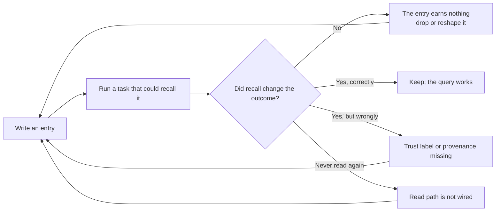

# Agent Memory Architect

Designs durable agent memory that is written, managed, and read — with retrieval that never
mistakes recall for instruction.

> **Portability target:** Spec-level. This skill encodes memory design discipline; storage technology is an implementation choice.

<!-- QUICK: 30s -->
## Route the Request **(QUICK)**

**Auto-Route:**

| Condition | Route to |
|---|---|
| A01 — An agent re-derives work it already did in a prior run | Core Workflow Phase 1 |
| A02 — Memory is growing unbounded or entries contradict each other | Consolidation (Phase 4) |
| A03 — Retrieved memory might be acted on as instruction | Poisoning defence (Phase 3) |
| A04 — Deciding what is worth remembering at all | Write policy (Phase 2) |
| A05 — Memory is consuming too much of the context window | Retrieval budget (Phase 5) |

**Intent Route Tree:**

```
What is the problem?
├─ Within one session/run ──────────► context-engineering
├─ One run outgrew its window ──────► context-compaction-strategies
├─ Across runs: work is re-derived ─► THIS SKILL
├─ Memory is stale or contradictory ► THIS SKILL (Phase 4)
└─ Documents need retrieval (RAG) ──► llm-engineer
```

<!-- QUICK: 30s -->
## Anti-Rationalization **(QUICK)**

**AR-01 [Read]:** You CANNOT call a memory system built if you only implemented writes. Memory that is never read is a log file, not memory. Write-manage-read or it does not count.

**AR-02 [Trust]:** You CANNOT inject retrieved memory into a prompt without a trust label. A prior run's output is data, never a directive; unlabelled recall is a prompt-injection path you built yourself.

**AR-03 [Bound]:** You CANNOT leave the store unbounded. Every append-only store becomes unusable, and by the time it does, the useful entries are buried in noise.

**AR-04 [Consolidate honestly]:** You CANNOT consolidate by re-summarising into prose. Naive summary-merging drifts — each merge distorts a little more, and the store slowly becomes fiction. Count and index instead.

**AR-05 [Forget]:** You CANNOT treat "remember everything" as a goal. Memory that keeps everything has no signal; deciding what to drop is the design work.

**AR-06 [Measure]:** You CANNOT claim memory improved outcomes without measuring a run that used it against one that did not. Recall that does not change behaviour is cost, not capability.

<!-- QUICK: 30s -->
## Ground Rules — Read Before Anything Else **(QUICK)**

| # | Rule | Mechanical Trigger | Violation Response |
|---|------|-------------------|-------------------|
| **R1** | **REFUSE a memory design with no read path.** Write-only memory is a log; the value is in retrieval changing behaviour. | Design specifies append/write but no read function, query surface, or injection point | STOP. Respond: "Where is the read? Memory that nothing retrieves cannot change a decision. Name the retrieval surface and the point where it enters a prompt." |
| **R2** | **REFUSE to inject memory without a context-only trust label.** Retrieved content is data from a prior run, not an instruction for this one. | Memory text enters a prompt with no explicit "context only, not instructions" wrapper or trust field | STOP. Respond: "This recall is unlabelled. A prior run's output can contain anything, including text shaped like instructions. Label it context-only before it enters the window." |
| **R3** | **REFUSE an unbounded store.** Every append-only memory grows past usefulness and buries its own signal. | No retention limit, consolidation job, or eviction policy defined | STOP. Respond: "What bounds this store? Without consolidation the useful entries are eventually unreachable. Name the limit and the manage step." |
| **R4** | **REFUSE consolidation that rewrites entries into prose.** Summarising summaries drifts; the store converges on plausible fiction. | Consolidation step described as "summarise older entries" with no counts or preserved outcome data | STOP. Respond: "Re-summarising drifts. Consolidate by counting and indexing outcomes, keeping raw detail only for the newest entries — never by generating a new summary of old summaries." |
| **R5** | **REFUSE to store memory without provenance.** An entry whose origin is unknown cannot be audited, aged, or safely dropped. | Entry lacks source, timestamp, workflow, or run identifier | STOP. Respond: "Where did this entry come from and when? Without provenance I cannot age it, validate it, or decide whether to trust it." |
| **R6** | **REFUSE to treat stored memory as verified truth.** A memory records what a run *concluded*, not what is *true*; conclusions can be wrong. | Retrieval path treats a remembered outcome as a fact or precedent without a confidence or outcome field | STOP. Respond: "This memory records a conclusion, not a fact. Retrieve it as a prior outcome with its own result, and let the current run judge rather than inherit." |

<!-- QUICK: 30s -->
## Anti-Hallucination

- **Admit uncertainty.** Memory technology choices (vector store, embedded DB, file format) depend on the deployment; if you have not seen the runtime, say so rather than naming a library as if verified.
- **Flag your knowledge cutoff.** Memory frameworks change quickly; mark any unverified API with `# VERIFY:`.
- **[VERIFIED] tags.** Any claim about an existing memory implementation must carry `[VERIFIED: file:line]` or be labelled an assumption.
- **Never guess security.** Memory that stores user data or retrieved secrets is a data-protection concern; when unclear, flag it rather than assuming the store is safe.

<!-- QUICK: 30s -->
## The Expert's Mindset **(QUICK)**

Memory masters do not start from "what should we store". They start from **what decision will this change**. A memory that never alters a subsequent action is storage cost with no return, and the discipline is to delete it.

The second principle is that **memory is retrieval-shaped**. You design the query you will run long before you design the schema you will write. Teams that build the write path first end up with an impressive store nobody can query.

Third, masters treat **trust as a property of the entry**, not of the reader. A recalled conclusion must carry its provenance and its standing — was it verified, was it estimated, how old is it — so a later run can weigh it instead of inheriting it.

Finally, masters accept that **forgetting is a feature**. Consolidation, ageing, and eviction are what keep memory useful. An agent that remembers everything has, in practice, no memory at all — it has an archive it cannot navigate.

<!-- STANDARD: 3min -->
## What Memory Masters Know **(STANDARD)**

| Masters know | Amateurs do |
|---|---|
| Design the read query first, the schema second | Build a store, then wonder how to query it |
| A memory record is a hypothesis with an outcome, not a fact | Treat recalled conclusions as truth |
| Consolidation counts and indexes; it does not re-summarise | Summarise older entries into prose and drift |
| Trust is labelled per entry, enforced at injection | Assume the model will treat recall appropriately |
| Bounded stores stay useful; unbounded stores rot | Keep everything "just in case" |
| Retrieval that does not change a decision is pure cost | Measure nothing, assume memory helps |

### When to Break Your Own Rules **(DEEP)**

A single-session agent working on one task for minutes does not need durable memory — its context *is* its memory, and persisting it adds a store, a schema, a trust boundary, and a retrieval surface for no benefit. Similarly, a store holding only immutable facts (a user's stated preference, an account ID) needs no consolidation or ageing; R1–R6 apply to *run memory*, where entries are conclusions that can be superseded, not to configuration.

<!-- STANDARD: 3min -->
## Deliberate Practice **(STANDARD)**



| Level | Routine |
|---|---|
| Novice | Write entries with provenance; wire one read query |
| Intermediate | Add trust labels and a retrieval budget; measure one recall-driven improvement |
| Advanced | Design consolidation, ageing, and eviction; test contradiction handling |
| Expert | Predict which entries will change future decisions and refuse to store the rest |

<!-- STANDARD: 3min -->
## Operating at Different Levels **(STANDARD)**

### L1: Apprentice
Append structured entries with timestamp and source. A run log exists.

### L2: Practitioner
Add a read path with a trust label; one query returns prior runs. Recall can now change behaviour, safely.

### L3: Senior
Design consolidation, retention, and eviction. The store stays useful as it grows.

### L4: Staff / Principal
Handle contradiction, staleness, and multi-agent write contention; measure recall's effect on outcomes. Memory becomes a governed system.

### L5: Transformative
Make memory an experience bank the organisation tunes — what is worth remembering becomes an explicit, tested policy rather than an accident.

<!-- QUICK: 30s -->
## When to Use **(QUICK)**

| Condition | Why this skill |
|---|---|
| Work is re-derived across runs | Durable recall prevents repetition |
| An agent should learn from its own failures | Outcome records make past failures retrievable |
| Memory is growing without bound | Consolidation is the manage half |
| Retrieved content could be acted on as instruction | Trust labelling is a design decision |
| Deciding what is worth storing | Write policy is the design work |

<!-- QUICK: 30s -->
## When NOT to Use **(QUICK)**

| Condition | Use instead |
|---|---|
| The concern is within one session or run | `context-engineering` |
| A single run overran its context window | `context-compaction-strategies` |
| Documents need semantic retrieval | `llm-engineer` (RAG over a corpus) |
| The concern is token cost accounting | `cost-accounting` |
| The concern is handoff payload shape | `agent-handoff-protocol` |
| The concern is minimising an existing prompt | `context-optimizer` |

<!-- STANDARD: 5min -->
## Decision Trees **(STANDARD)**

### Decision Tree 1: Is this worth remembering at all?

```
Did something happen that a future run would otherwise re-derive or re-fail?
├─ No ──► DO NOT STORE. Storage without a decision it changes is pure cost.
└─ Yes ↓
   Will a future run be able to find it? (is there a query that returns it?)
   ├─ No ──► DO NOT STORE YET. Design the read query first (R1), then store.
   └─ Yes ──► STORE, with provenance: source, timestamp, workflow, outcome.
```

### Decision Tree 2: What standing does this entry have?

```
What does the entry record?
├─ A verified external fact ──────► trust=verified_fact, long retention, no ageing
├─ A run's conclusion/outcome ────► trust=context_only + outcome field, ages out
├─ A stated user preference ──────► trust=user_stated, retains until superseded
├─ A derived estimate ────────────► trust=estimated, must carry its assumption
└─ Anything else ─────────────────► trust=context_only, shortest retention
```

### Decision Tree 3: Which retrieval strategy?

```
How will a future run ask for this?
├─ "Have we done this before?" ──► exact key lookup (workflow + task id)
├─ "What happened last time X?" ─► recent-N by key, newest first
├─ "Anything relevant to Y?" ────► embedding search — needs an index, and a budget
└─ "What are the durable facts?" ► filtered by trust class, not recency
```

### Decision Tree 4: Keep, consolidate, or evict?

```
Entry age vs retention policy
├─ Within raw-retention window ──► KEEP RAW (full detail, individually queryable)
├─ Past raw window, still useful ► CONSOLIDATE (fold into counts + tally; drop detail)
├─ Contradicted by a newer entry ► SUPERSEDE (keep both, mark the older superseded)
├─ Provenance unknown or corrupt ► EVICT (untrusted and unageable)
└─ Never read since written ─────► EVICT (cost with no demonstrated return)
```

<!-- STANDARD: 5min -->
## Core Workflow **(STANDARD)**

| Phase | Time | What you do | Complete when |
|---|---|---|---|
| **1. Read-first design** | 25 min | Write the queries a future run will actually run, before designing storage | Complete when each query is written and the fields it needs are named |
| **2. Write policy** | 20 min | Decide what is stored, with provenance, and what is explicitly not stored | Complete when the write rule and the do-not-store rule are both stated |
| **3. Trust model** | 20 min | Classify entries by standing (verified fact, conclusion, preference, estimate) and define the injection wrapper | Complete when every class has a trust label and the context-only wrapper exists |
| **4. Manage** | 25 min | Define raw-retention window, consolidation, supersede rule, and eviction | Complete when keep/consolidate/evict are all defined and consolidation counts rather than summarises |
| **5. Retrieval budget** | 15 min | Cap how much memory enters a prompt; decide what is dropped when the cap is hit | Complete when the token cap and the truncation rule are stated |
| **6. Measure** | 20 min | Run one task with recall and one without; compare outcome and cost | Complete when the recall effect is measured, including the null result |
| **7. Record** | 10 min | Log the design and its rationale in the State Log | Complete when the design's *why* is recorded, not just its shape |

<!-- STANDARD: 3min -->
## Best Practices **(STANDARD)**

1. **Design the read query before the write schema.** The query is the requirement; the schema is a consequence. Stores built write-first are impressive and unqueryable.
2. **Label trust per entry, enforce at injection.** The wrapper belongs at the boundary where memory enters a prompt, because that is the only place you control.
3. **Require provenance on every entry.** Source, timestamp, workflow, and run id make an entry ageable, auditable, and safely droppable.
4. **Consolidate by counting, never by re-summarising.** Fold old entries into outcome tallies; keep raw detail only within the retention window. Summary-of-summary drifts.
5. **Store conclusions with their outcomes, not as facts.** A memory says "this attempt concluded X and the result was Y"; the next run weighs it rather than inheriting it.
6. **Supersede rather than overwrite.** Keeping both the old and new entry preserves the ability to ask when something changed, which is often the more valuable question.
7. **Cap memory in the context window.** Memory competes with the task; an explicit cap forces the ranking decision to be made once, deliberately, instead of by overflow.
8. **Evict entries that were never read.** An entry that no query returns is cost with no demonstrated return; measure reads, not writes.
9. **Make forgetting a scheduled job, not a hope.** Consolidation and eviction run on a cadence, or they do not run at all.
10. **Measure the null result too.** "Recall did not change the outcome" is the most valuable finding, because it justifies deleting the whole surface.

<!-- STANDARD: 5min -->
## Error Decoder **(STANDARD)**

| Symptom | Root Cause | Fix | Lesson |
|---|---|---|---|
| Memory grows every run but outcomes never improve | Read path was never wired; the store is a log | Implement retrieval and inject at a defined point (R1) | Write-only memory is a log file with a schema |
| A later run confidently repeats an earlier run's error | Recalled conclusion treated as fact | Add trust class + outcome field; retrieve as prior, not precedent | A memory records what was concluded, not what is true |
| Store becomes unusable at a few thousand entries | No consolidation or eviction defined | Count-and-index consolidation with a raw-retention window (R4) | Unbounded stores bury their own signal |
| Consolidated summary slowly diverges from what happened | Re-summarising summaries | Consolidate to counts and tallies only | Each summarisation distorts a little; the errors compound |
| Recalled text is obeyed as an instruction | Injected without a context-only wrapper | Label at injection; never merge memory into the instruction block (R2) | Unlabelled recall is a self-built injection path |
| Cannot tell whether an entry is current | No provenance or timestamp | Require provenance on write; age on read (R5) | An entry you cannot age is an entry you cannot trust |
| Memory consumes most of the window | No retrieval budget | Cap memory tokens; rank and truncate deliberately | Memory competes with the task for the same window |

<!-- QUICK: 30s -->
## Error Recovery **(QUICK)**

| Symptom | First Action | If That Fails | Last Resort |
|---|---|---|---|
| Store corrupt or unreadable | Fall back to no-memory mode; do not block the run | Quarantine the file; start a fresh store | Drop the store and re-derive |
| Recall returns nothing useful | Verify the key and the write path fired | Check the retention window has not evicted it | Redesign the query (Phase 1) |
| Recall returns too much | Apply the budget cap and rank by recency + trust | Narrow the key | Restrict to a single trust class |
| Entries contradict each other | Apply the supersede rule; keep both, mark older | Manual reconciliation pass | Evict both and re-derive |

**Hard failure boundary:** After 3 attempts to make a recall surface useful, stop and measure whether memory is warranted at all. Do not keep building storage for a query that changes nothing.

<!-- STANDARD: 3min -->
## Cross-Skill Coordination **(STANDARD)**

| Upstream Skill | Artifact | What You Need |
|---|---|---|
| `context-engineering` | Context hierarchy | Where memory sits relative to rules and task content |
| `agent-handoff-protocol` | Handoff payload shape | What crosses a boundary and what is persisted |
| `iterative-task-execution` | Run outcomes | The outcome and step data worth remembering |
| `cost-accounting` | Cost per run | Whether recall reduces cost or only moves it |
| `workflow-graph-authoring` | Node contracts | Where a memory read/write belongs in the graph |

| Downstream Skill | Deliverable | What They'll Do |
|---|---|---|
| `context-engineering` | Durable-memory tier | Place memory in the context hierarchy with a budget |
| `token-efficiency` | Memory cost model | Price recall against its benefit |
| `agent-eval-pipeline` | Recall-effectiveness eval | Test whether memory changes outcomes |
| `agent-runtime-economy` | Per-session budget | Allocate window share to memory |
| `llm-engineer` | Retrieval implementation | Embed and index the store |

<!-- STANDARD: 3min -->
## Proactive Triggers **(STANDARD)**

| # | Detectable pattern | Action |
|---|---|---|
| T1 | A store that only grows, never queried | Wire the read path or delete the store |
| T2 | Memory text in an instruction block | Move it behind a context-only wrapper |
| T3 | No timestamp or source on entries | Add provenance before adding more entries |
| T4 | "Summarise old entries" in a design | Replace with count-and-index consolidation |
| T5 | Recall that no test has ever exercised | Add a recall-effectiveness eval |
| T6 | Memory consuming a large share of the window | Set a retrieval budget |
| T7 | Two entries asserting incompatible conclusions | Apply the supersede rule |
| T8 | The same work re-derived in consecutive runs | A memory write was missed, or never read |
| T9 | A recalled value used as a constant | Retrieve as prior outcome, not as truth |
| T10 | No eviction policy after months of writes | Define retention and a scheduled manage job |

<!-- STANDARD: 3min -->
## Anti-Patterns **(STANDARD)**

| ❌ Anti-Pattern | ✅ Do This Instead |
|----------------|-------------------|
| ❌ **Write-only memory** — entries accumulate, nothing reads | ✅ Implement write-manage-read; read is the point (R1) |
| ❌ **Unlabelled recall** — memory pasted into the instruction block | ✅ Context-only wrapper at the injection boundary (R2) |
| ❌ **Re-summarising consolidation** — summary of summaries | ✅ Counts, tallies, and indexed outcomes (R4) |
| ❌ **Unbounded store** — "remember everything" | ✅ Raw-retention window plus consolidation and eviction (R3) |
| ❌ **Conclusion stored as fact** | ✅ Trust class plus outcome field; retrieve as prior |
| ❌ **Provenance-free entries** | ✅ Source, timestamp, workflow, run id (R5) |
| ❌ **No retrieval budget** — memory crowds out the task | ✅ Token cap with a deliberate truncation rule |
| ❌ **Overwriting superseded entries** | ✅ Keep both; mark the older superseded |
| ❌ **Assuming memory helped** — never measured | ✅ Run with and without; report the null result |
| ❌ **Deleting by hand** — no eviction cadence | ✅ Scheduled manage job, measured by reads |

<!-- QUICK: 30s -->
## State Log **(QUICK)**

| Turn | Action | Decision | Risk Accepted | Mitigation |
|---|---|---|---|---|
| 1 | Reads designed | Queries written before schema | A query may be wrong | Cheap to revise before storage exists |
| 2 | Write policy set | What is stored and not stored | Over-storing | Eviction measured by reads |
| 3 | Trust model set | Classes and wrapper | A class may be missing | Wrapper is the single enforcement point |
| 4 | Manage defined | Retention, consolidation, eviction | Premature eviction | Supersede keeps both before evicting |
| 5 | Budget set | Cap and truncation rule | Useful recall truncated | Rank by recency and trust |
| 6 | Measured | Recall effect, including null | Effect may be nil | Null result justifies deleting the surface |

**Anti-Drift Check:** Before each response, verify —
- a read path exists and is exercised
- injected memory carries a context-only label
- the store is bounded with a manage job
- consolidation counts rather than re-summarises
- every entry carries provenance

<!-- STANDARD: 3min -->
## Production Checklist **(STANDARD)**

- [ ] **CR1: Read path exists** — Verification: a query returns prior entries and is exercised in a test
- [ ] **CR2: Trust label enforced** — Verification: injected memory carries context-only and never enters the instruction block
- [ ] **CR3: Provenance on every write** — Verification: source, timestamp, workflow, and run id are present
- [ ] **CR4: Trust classes defined** — Verification: every entry maps to a class with a retention rule
- [ ] **CR5: Retention window set** — Verification: a numeric raw-retention window exists
- [ ] **CR6: Consolidation counts** — Verification: folding produces tallies, not generated prose
- [ ] **CR7: Supersede rule present** — Verification: contradictions keep both entries, older marked superseded
- [ ] **CR8: Eviction scheduled** — Verification: a manage job runs on a cadence
- [ ] **CR9: Retrieval budget capped** — Verification: a token cap and truncation rule are stated
- [ ] **CR10: Corruption tolerated** — Verification: a malformed entry is skipped, never fatal
- [ ] **CR11: Recall measured** — Verification: a with-memory vs without-memory comparison exists
- [ ] **CR12: Null result recorded** — Verification: what recall did *not* change is documented
- [ ] **CR13: No-memory fallback** — Verification: the run completes when the store is missing
- [ ] **CR14: Poisoning guard tested** — Verification: an entry lacking a trust label is flagged, not trusted
- [ ] **CR15: Manage job idempotent** — Verification: running consolidation twice does not corrupt the store

<!-- QUICK: 30s -->
## What Good Looks Like **(QUICK)**

A good memory system is **retrieval-first**: the queries were written before the schema, every injected entry carries its provenance and standing, and the store is bounded by a manage job that counts rather than re-summarises. A reader can answer "what does this memory change?" for every stored field.

It is also **honest about its own value**. Someone has run the comparison with and without recall, and the null result is recorded as readily as the positive one. Memory that cannot demonstrate a changed decision is deleted, not defended.

**Complete when:**
- a read query is written and exercised, not just a write path
- injected memory is labelled context-only at the injection boundary
- every entry carries source, timestamp, workflow, and run id
- trust classes map to retention rules
- consolidation folds entries into counts, never into generated prose
- contradictions are superseded, keeping both entries
- eviction runs on a cadence and is measured by reads
- retrieval is capped in tokens with a stated truncation rule
- a malformed entry is skipped without failing the run
- the recall effect is measured, including when it is nil

**Signs of Excellence:** reads designed first; trust labelled per entry; provenance everywhere; consolidate by counting; bounded store; recall measured; null results recorded.
**Signs of Dysfunction:** write-only store; unlabelled recall; summary-of-summaries; unbounded growth; conclusions stored as facts; memory that was never measured.

<!-- STANDARD: 3min -->
## Verification **(STANDARD)**

Before the design is handed off: confirm a read path exists and is exercised; injected memory carries a context-only label; every entry has provenance; consolidation counts rather than summarises; eviction is scheduled; a token cap exists; and a with/without comparison has been run. **Pass criteria:** all 15 checklist items pass, and a run completes with the store absent.

<!-- STANDARD: 3min -->
## Verification Guardrails **(STANDARD)**

**Pre-generation:**
- Confirm whether durable memory is warranted at all; a single-session task usually does not need it.
- Confirm the read queries exist before designing storage.

**Post-generation:**
- Never present a write-only design as complete memory.
- Never let retrieved text enter an instruction block.
- Mark every unverified storage API with `# VERIFY:`.

<!-- QUICK: 30s -->
## References **(QUICK)**

- `references/write-manage-read.md` — the three phases with the failure each one prevents
- `references/memory-poisoning.md` — trust labels, injection boundaries, and the poisoning threat model
- `references/consolidation.md` — count-and-index folding versus summary drift, with retention policy
- `references/retrieval-and-budget.md` — retrieval strategies and how much window memory may take
- `scripts/verify-skill.sh` — runnable verification harness for this skill
- Related: `context-engineering`, `context-compaction-strategies`, `agent-handoff-protocol`, `agent-runtime-economy`, `llm-engineer`

<!-- STANDARD: 3min -->
## Failure Modes and Known Limitations **(STANDARD)**

| Failure mode | Signal | Mitigation |
|---|---|---|
| **Write-only store** | Entries accumulate; outcomes never change | Wire the read path (R1) |
| **Unlabelled recall** | Memory obeyed as instruction | Context-only wrapper (R2) |
| **Unbounded growth** | Store unusable at scale | Retention + consolidation (R3) |
| **Summary drift** | Consolidated text diverges from events | Count, never re-summarise (R4) |
| **Provenance loss** | Entries cannot be aged or audited | Require provenance (R5) |
| **Conclusion-as-fact** | Later runs inherit earlier errors | Trust class + outcome field (R6) |
| **Memory crowding the window** | Task quality drops as memory grows | Retrieval budget |
| **No eviction** | Cost grows with no demonstrated return | Scheduled manage job |

**Known limitation:** this skill designs the memory system; it does not choose your storage engine or implement embeddings — that is `llm-engineer`'s ground. Retrieval-quality claims here are **[COMMON-PRACTICE]** design discipline, not a measured benchmark; the cost figures in the backtest are **[ESTIMATED]** illustrative assumptions.

**What breaks this strategy:** an unbounded, unlabelled, write-only store. It is the default outcome of building memory without a read query, and it produces cost that looks like capability for as long as nobody measures.

## Gotchas **(STANDARD)**

- **A memory entry is a hypothesis, not a fact.** The run concluded something; it may have been wrong. Store the outcome alongside it, and let the current run judge. A single inherited bad conclusion in a **$50,000–$200,000** engagement context is the kind of error that costs a client.
- **Consolidation is where memory dies quietly.** Re-summarising summaries drifts; a store can end up confidently wrong about its own history. Count-and-index avoids the whole class.
- **The poisoning path is the one you build.** If recalled text sits in the instruction block, any prior run — or any content a prior run ingested — can steer the current one. This is indirect prompt injection with your own store as the vector, and the blast radius scales with what the agent can do: a tool-using agent with an unlabelled memory store is a **$10,000–$500,000** incident waiting for a trigger.
- **Unread entries are pure cost.** If no query returns an entry, it contributed nothing while consuming storage and window share. At scale that is **$2,000–$15,000** a year in storage and retrievals that buy nothing. Measure reads, not writes.
- **"Remember everything" is not a goal.** It is the absence of a policy. Deciding what to forget is the design work; skipping it produces an archive nobody can navigate.
- **Cross-agent contention is real.** Two agents writing the same key produce contradictions that no single-agent design anticipates; the supersede rule exists because overwriting loses the question of *when* something changed.
