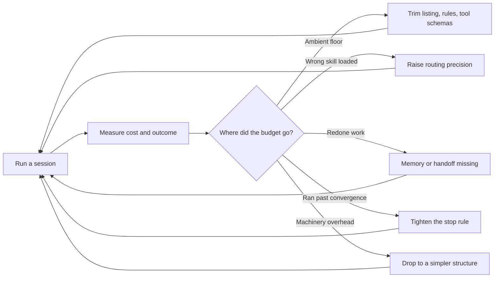

# Agent Runtime Economy

Budgets the agent's own operating loop — what a session may spend, what it holds before work
starts, and when it must stop.

> **Portability target:** Spec-level. This skill encodes runtime-economy discipline; the accounting numbers come from your own runtime.

<!-- QUICK: 30s -->
## Route the Request **(QUICK)**

**Auto-Route:**

| Condition | Route to |
|---|---|
| A01 — A session spends most of its window before doing any work | Ambient accounting (Phase 1) |
| A02 — "What may this session spend?" has no answer | Budget declaration (Phase 2) |
| A03 — The wrong skill keeps loading | Routing precision (Phase 3) |
| A04 — Unclear whether to inline, delegate, or build a workflow | Delegation threshold (Phase 4) |
| A05 — A session that should have stopped kept going | Stop rule (Phase 5) |

**Intent Route Tree:**

```
What is expensive?
├─ A model/provider bill ──────────► cost-accounting
├─ One prompt or payload ──────────► context-optimizer
├─ One skill's own size ───────────► token-efficiency
├─ Memory storage and recall ──────► agent-memory-architect
└─ The session as a whole ─────────► THIS SKILL
```

<!-- QUICK: 30s -->
## Anti-Rationalization **(QUICK)**

**AR-01 [Ambient first]:** You CANNOT optimise a loaded skill before accounting for what is present *before* any skill loads. The ambient listing is paid every session; a body is paid once.

**AR-02 [Budget exists]:** You CANNOT run an unbounded session and call the result efficient. An unstated budget is not an unlimited budget; it is an unmade decision.

**AR-03 [Stop rule]:** You CANNOT define efficiency without a stop condition. Work that has stopped improving but has not stopped running is the most expensive state there is.

**AR-04 [Measure both axes]:** You CANNOT claim a session got cheaper without checking it did not get worse. A cheaper wrong answer is not a saving.

**AR-05 [Precision is efficiency]:** You CANNOT treat wrong-skill loading as a quality bug only. Loading the wrong skill is the most expensive possible outcome: you pay for it and still do the work again.

**AR-06 [Right size]:** You CANNOT reach for a workflow when a single call would do, or inline work that needs isolation. Complexity that does not earn its cost is inefficiency with extra parts.

<!-- QUICK: 30s -->
## Ground Rules — Read Before Anything Else **(QUICK)**

| # | Rule | Mechanical Trigger | Violation Response |
|---|------|-------------------|-------------------|
| **R1** | **REFUSE to optimise below the ambient line without measuring it first.** What is always present sets the floor on every session; optimising anything else first is wasted effort. | Discussion of efficiency with no measured ambient cost (listing, rules, memory, tool schemas) | STOP. Respond: "What is present before the first task token? Without the ambient number I cannot tell whether the real cost is the skill you are optimising or the floor under it." |
| **R2** | **REFUSE an unbounded session.** Every session needs a stated token, turn, or time budget. | No budget declared for tokens, turns, or wall-clock | STOP. Respond: "What may this session spend, and what happens when it is reached? An unstated budget is an unmade decision, not an unlimited one." |
| **R3** | **REFUSE a budget with no stop rule.** A budget without a stop condition spends to the cap regardless of whether it is converging. | Budget declared with no convergence or stop condition | STOP. Respond: "What ends this early? A cap alone spends to the cap on a task that stopped improving ten turns ago." |
| **R4** | **REFUSE to count a saving without checking quality.** Cost reduction that degrades the outcome is not efficiency. | Efficiency claim with no paired quality or success metric | STOP. Respond: "Cheaper at what quality? Show the success metric alongside the cost, or the saving is unproven." |
| **R5** | **REFUSE to ignore routing precision as a cost.** The wrong skill loads, consumes budget, and the work is redone. | Routing accuracy unmeasured while claiming session efficiency | STOP. Respond: "How often does the right skill load first? A miss costs the loaded skill plus a redo — that is the largest single line in this budget." |
| **R6** | **REFUSE to add orchestration that does not earn its cost.** A workflow, subagent, or graph must be justified against the single-call baseline. | Multi-step machinery with no comparison to the simple baseline | STOP. Respond: "What does this structure buy over one call? If the answer is not measurable, the structure is cost without a return." |

<!-- QUICK: 30s -->
## Anti-Hallucination

- **Admit uncertainty.** Runtime token accounting depends on the host's reporting; if you have not seen real usage data, say so rather than quoting a number as measured.
- **Flag your knowledge cutoff.** Pricing and context limits change; mark any figure not read from the current runtime with `# VERIFY:`.
- **Never guess security.** Budgets that bound tool access or spend are control surfaces; when unclear, treat them as a security decision rather than a tuning knob.
- **[VERIFIED] tags.** Any claim about a live session's cost must carry `[VERIFIED: measurement]` or be labelled an estimate.

<!-- QUICK: 30s -->
## The Expert's Mindset **(QUICK)**

Runtime masters account **from the outside in**: what is present before any work begins, then what the routing decision costs, then what the task itself costs, and only last what the individual payload costs. Most teams optimise in the exact reverse order — shrinking a skill body while a 43k-token ambient listing sits unexamined under everything.

The second discipline is that **precision is efficiency**. A router that picks the wrong skill does not merely annoy: the session pays for the wrong skill and then pays again to do the work properly. At scale, routing accuracy is the largest single efficiency lever there is, and it is almost always measured last.

Third, masters treat **the budget as a decision, not a constraint**. Declaring what a session may spend forces the question the team has been avoiding: what is this actually worth? A budget that was never set is a decision that was never made.

Finally, masters know that **stopping is the cheapest optimisation available**. A loop that has converged but keeps iterating burns the budget to buy nothing. The stop rule is not a guardrail bolted on at the end; it is the definition of efficiency.

<!-- STANDARD: 3min -->
## What Runtime Masters Know **(STANDARD)**

| Masters know | Amateurs do |
|---|---|
| The ambient line sets the floor on every session | Optimise the thing that is easiest to see |
| Routing misses cost twice: the wrong load plus the redo | Treat routing as a quality concern only |
| A budget is a business decision about worth | Treat a cap as an arbitrary limit to raise |
| Stopping early is the cheapest win available | Run to the cap by default |
| Delegation costs setup; it must beat inlining | Delegate because it sounds more capable |
| Cheaper must be paired with a success metric | Report the saving, skip the outcome |

### When to Break Your Own Rules **(DEEP)**

A one-shot question with a short answer does not need a declared budget or a delegation analysis — the framing cost exceeds the task. R1–R6 exist because agent sessions recur and their costs compound; for a genuinely single, small interaction, the discipline is overhead. The judgement is whether this session is one of many (apply the rules) or a one-off (answer and move on).

<!-- STANDARD: 3min -->
## Deliberate Practice **(STANDARD)**



| Level | Routine |
|---|---|
| Novice | Measure the ambient floor; declare one budget |
| Intermediate | Add a stop rule; measure routing accuracy |
| Advanced | Account per phase; set delegation thresholds by measurement |
| Expert | Predict which lever dominates for a given task class, and size the structure to the task |

<!-- STANDARD: 3min -->
## Operating at Different Levels **(STANDARD)**

### L1: Apprentice
State one budget for the session. Spend is now bounded and visible.

### L2: Practitioner
Measure the ambient floor and add a stop rule. The two largest uncontrolled costs are now accounted.

### L3: Senior
Account per phase and measure routing accuracy. Efficiency work becomes targeted rather than general.

### L4: Staff / Principal
Set delegation thresholds from measurement; size structure to task class. Cost and quality are traded deliberately.

### L5: Transformative
Define the organisation's runtime economy standard — what a session may spend becomes a shared, measured contract rather than a per-team guess.

<!-- QUICK: 30s -->
## When to Use **(QUICK)**

| Condition | Why this skill |
|---|---|
| Sessions cost more than the work seems worth | Budget declaration forces the worth question |
| Most of the window is gone before work starts | Ambient accounting |
| The wrong skill or tool keeps loading | Routing precision is the biggest lever |
| Unclear whether to inline or delegate | Delegation threshold |
| A session kept going after it had converged | Stop rule |

<!-- QUICK: 30s -->
## When NOT to Use **(QUICK)**

| Condition | Use instead |
|---|---|
| The concern is a model or provider bill | `cost-accounting` |
| The concern is one prompt or payload | `context-optimizer` |
| The concern is one skill's own budget | `token-efficiency` |
| The concern is durable memory | `agent-memory-architect` |
| The concern is choosing single-call vs graph | `agentic-complexity-ladder` |
| The concern is handoff payload shape | `agent-handoff-protocol` |

<!-- STANDARD: 5min -->
## Decision Trees **(STANDARD)**

### Decision Tree 1: Where is the budget actually going?

```
Session cost, largest first
├─ Present before any task token? ──► AMBIENT (listing, rules, memory, tool schemas)
│                                     Usually the largest and least examined
├─ Spent choosing what to load? ────► ROUTING (wrong skill = pay twice)
├─ Spent re-deriving prior work? ───► MEMORY/HANDOFF missing
├─ Spent iterating after convergence? ► STOP RULE missing
└─ Spent on structure overhead? ────► MACHINERY (workflow where a call would do)
```

### Decision Tree 2: Inline, delegate, or build a workflow?

```
Is the work a single well-scoped step?
├─ Yes, fits one context ────────────► INLINE (cheapest; no setup cost)
├─ Yes, but would pollute the main context ─► SUBAGENT (isolation is the point)
├─ No, multiple dependent steps ─────► PIPELINE (fixed order)
├─ No, needs retry/verification gates ► WORKFLOW (control flow must be explicit)
└─ No, and the shape is unknown ─────► INVESTIGATE FIRST (wayfinder), do not build
```

### Decision Tree 3: Is this session still making progress?

```
Last N turns
├─ Improved a measured outcome? ─────► CONTINUE (budget permitting)
├─ Produced new information? ────────► CONTINUE once more; watch the next turn
├─ Repeated a prior attempt? ────────► STOP (loop without progress)
├─ Reduced to re-reading its own context? ► STOP (context rot)
└─ Cannot say what "done" means ─────► STOP and ask (goal was never defined)
```

### Decision Tree 4: Which lever first?

```
Cheapest change with the largest effect?
├─ Ambient floor unmeasured? ────────► MEASURE IT FIRST (R1) — it bounds everything
├─ Routing accuracy unknown? ────────► MEASURE IT (largest single lever)
├─ No stop rule? ────────────────────► ADD ONE (cheapest win available)
├─ No budget at all? ────────────────► DECLARE ONE (forces the worth question)
└─ All accounted; per-payload only ──► NOW optimise payloads (context-optimizer)
```

<!-- STANDARD: 5min -->
## Core Workflow **(STANDARD)**

| Phase | Time | What you do | Complete when |
|---|---|---|---|
| **1. Ambient accounting** | 20 min | Measure what is present before the first task token: listing, rules, memory, tool schemas | Complete when one ambient number exists and is recorded |
| **2. Budget declaration** | 15 min | Declare token, turn, and time budgets and what each means for the outcome | Complete when all three are stated with a rationale for the number |
| **3. Routing precision** | 25 min | Measure how often the correct skill or tool loads first; treat a miss as double cost | Complete when routing accuracy is measured against a held-out set |
| **4. Delegation threshold** | 20 min | Decide inline vs subagent vs workflow against the single-call baseline | Complete when the threshold is stated and justified per task class |
| **5. Stop rule** | 15 min | Define convergence and the condition that ends the session early | Complete when a measurable stop condition exists |
| **6. Quality pairing** | 20 min | Pair every cost figure with a success metric so cheapness cannot hide degradation | Complete when a cost and a success number are reported together |
| **7. Record** | 10 min | Log the budget, the stop rule, and the measured levers in the State Log | Complete when the reasoning behind each number is recorded |

<!-- STANDARD: 3min -->
## Best Practices **(STANDARD)**

1. **Measure the ambient floor first.** It is paid every session and bounds every other optimisation; anything measured before it is measured against an unknown.
2. **Declare budgets in all three dimensions.** Tokens, turns, and wall-clock fail differently — a turn budget misses a slow call, a token budget misses a spinning loop.
3. **Treat a routing miss as double cost.** The wrong skill consumes budget and the work is redone; this is usually the largest single line item.
4. **Pair every cost with a success metric.** Report them together or the saving is unproven.
5. **Define convergence before you need it.** A stop rule written during a stuck session is written too late and under pressure.
6. **Scale structure to task class.** Single call for one step, subagent for isolation, workflow only when control flow must be explicit and retried.
7. **Cap memory and listing in the window.** Both compete with the task for the same space; the cap forces the ranking decision once.
8. **Front-load the risky step to fail cheaply.** Cheap failure is a budget strategy, not just a planning one.
9. **Report the null result.** "This lever moved nothing" prevents the next team repeating the measurement.
10. **Re-measure after every structural change.** Adding a workflow, a memory surface, or a tool changes the ambient line and the routing surface.

<!-- STANDARD: 5min -->
## Error Decoder **(STANDARD)**

| Symptom | Root Cause | Fix | Lesson |
|---|---|---|---|
| Optimised a skill body; session cost barely moved | Ambient floor dominates and was never measured | Account ambient first (R1) | The floor under everything is the first thing to measure |
| Session cheaper, answers worse | Saving claimed with no paired success metric | Report cost and quality together (R4) | Cheaper at lower quality is not efficiency |
| Same task costs wildly different amounts run to run | Routing accuracy varies; some runs load the wrong skill | Measure rank-1 accuracy; treat a miss as double cost | Variance in cost is usually variance in routing |
| Budget spent on a task that stopped improving | No stop rule; the cap was the only end condition | Define convergence (R3) | A cap spends to the cap regardless of progress |
| A workflow costs more than the task | Structure added without a single-call baseline | Compare against inline (R6) | Orchestration must earn its setup cost |
| Agent re-reads its own earlier turns | Context accumulated past usefulness; no pruning | Prune or hand off a payload instead of a transcript | Re-reading is the visible symptom of context rot |
| Memory and listing crowd out the task | No cap on ambient share | Budget the ambient share explicitly | Ambient context competes with the task for the same window |

<!-- QUICK: 30s -->
## Error Recovery **(QUICK)**

| Symptom | First Action | If That Fails | Last Resort |
|---|---|---|---|
| Cost measured but not explainable | Split the session by phase and re-measure | Instrument the routing decision | Fall back to a single-call baseline as a floor |
| Budget hit on every task | Check whether the budget or the task is wrong | Re-baseline the budget from real runs | Escalate the worth question to a human |
| Routing accuracy unknown | Run a held-out task-to-skill set | Measure top-N instead of rank-1 | Treat routing as unmeasured and label it so |
| No useful lever found | Re-run the ambient measurement | Measure per phase | Conclude the task class needs no optimisation |

**Hard failure boundary:** After 3 attempts to attribute cost to a lever, stop and report the session as not-yet-accounted. Do not claim an efficiency win you cannot attribute.

<!-- STANDARD: 3min -->
## Cross-Skill Coordination **(STANDARD)**

| Upstream Skill | Artifact | What You Need |
|---|---|---|
| `context-engineering` | Context hierarchy | Which tiers are always present |
| `token-efficiency` | Skill token budgets | The per-skill cost of what loads |
| `cost-accounting` | Run cost and attribution | Real spend per run and per node |
| `agent-memory-architect` | Memory budget | How much window memory may take |
| `agentic-complexity-ladder` | Structure justification | Whether the machinery is warranted |
| `using-agent-skills` | Routing surface | The listing that sets the ambient floor |

| Downstream Skill | Deliverable | What They'll Do |
|---|---|---|
| `context-engineering` | Ambient cap and tiers | Rebalance the context hierarchy |
| `token-efficiency` | Session budget | Size skills against the real budget |
| `cost-accounting` | Per-session attribution | Price the session against its outcome |
| `agent-eval-pipeline` | Efficiency regression test | Gate cost per successful outcome |
| `iterative-task-execution` | Stop rule | Terminate runs that have converged |

<!-- STANDARD: 3min -->
## Proactive Triggers **(STANDARD)**

| # | Detectable pattern | Action |
|---|---|---|
| T1 | A session with no stated budget | Declare token, turn, and time budgets |
| T2 | Efficiency work with no ambient measurement | Measure the floor first |
| T3 | Routing accuracy never measured | Measure rank-1 against a held-out set |
| T4 | Cost reported without a success metric | Pair them before claiming a win |
| T5 | A workflow or subagent with no single-call baseline | Compare, or drop the structure |
| T6 | Turns repeating a prior attempt | Stop; the loop has no progress |
| T7 | Agent re-reading its own context | Prune or hand off a payload, not a transcript |
| T8 | Memory or listing consuming a large window share | Set an ambient cap |
| T9 | Budget raised whenever it is hit | Re-baseline from real runs instead |
| T10 | Every session hitting its cap | The cap is wrong, or the task is mis-sized |

<!-- STANDARD: 3min -->
## Anti-Patterns **(STANDARD)**

| ❌ Anti-Pattern | ✅ Do This Instead |
|----------------|-------------------|
| ❌ **Optimising the visible payload** while the ambient floor is unmeasured | ✅ Account the floor first (R1) |
| ❌ **No declared budget** — "it'll be fine" | ✅ State tokens, turns, and time (R2) |
| ❌ **Cap without a stop rule** — spends to the cap regardless | ✅ Define convergence (R3) |
| ❌ **Cost claim without a quality metric** | ✅ Report both together (R4) |
| ❌ **Routing accuracy unmeasured** | ✅ Measure rank-1; a miss costs double (R5) |
| ❌ **Workflow where a call would do** | ✅ Compare to the single-call baseline (R6) |
| ❌ **Raising the budget whenever it is hit** | ✅ Re-baseline from measured runs |
| ❌ **Transcript handoffs instead of payloads** | ✅ Carry state and evidence, not conversation |
| ❌ **Re-reading context as "review"** | ✅ Prune; re-reading is context rot |
| ❌ **Reporting only wins** | ✅ Report the null result too |

<!-- QUICK: 30s -->
## State Log **(QUICK)**

| Turn | Action | Decision | Risk Accepted | Mitigation |
|---|---|---|---|---|
| 1 | Ambient measured | Floor recorded | Measurement may miss a tier | Re-measure after structural change |
| 2 | Budget declared | Token/turn/time caps | Caps may be wrong | Re-baseline from real runs |
| 3 | Routing measured | Accuracy recorded | Held-out set may not generalise | Track over time |
| 4 | Thresholds set | Inline vs delegate rule | Mis-sized for an unusual class | Revisit per task class |
| 5 | Stop rule set | Convergence defined | Premature stop | Pair with the success metric |
| 6 | Paired metrics | Cost + quality reported | Metric may be the wrong one | Revisit the metric itself |

**Anti-Drift Check:** Before each response, verify —
- the ambient floor is measured, not assumed
- a budget exists in all three dimensions
- a stop rule exists and is measurable
- every cost claim is paired with a success metric
- routing accuracy is measured or explicitly labelled unmeasured

<!-- STANDARD: 3min -->
## Production Checklist **(STANDARD)**

- [ ] **CR1: Ambient measured** — Verification: one number covers listing, rules, memory, and tool schemas
- [ ] **CR2: Budget declared** — Verification: token, turn, and time budgets are all stated
- [ ] **CR3: Budget rationale** — Verification: each number traces to a measured or business basis
- [ ] **CR4: Stop rule defined** — Verification: a measurable convergence condition exists
- [ ] **CR5: Routing measured** — Verification: rank-1 accuracy measured on a held-out set
- [ ] **CR6: Miss cost modelled** — Verification: a routing miss is costed as load plus redo
- [ ] **CR7: Delegation threshold** — Verification: inline vs delegate is justified per task class
- [ ] **CR8: Baseline comparison** — Verification: any structure is compared to the single-call baseline
- [ ] **CR9: Cost paired with quality** — Verification: every saving has a success metric alongside
- [ ] **CR10: Ambient capped** — Verification: a maximum window share for ambient context exists
- [ ] **CR11: Memory capped** — Verification: memory's window share is bounded
- [ ] **CR12: Null results recorded** — Verification: levers that moved nothing are documented
- [ ] **CR13: Re-measurement trigger** — Verification: a structural change forces a re-measure
- [ ] **CR14: Unattributed spend labelled** — Verification: cost that cannot be attributed is marked, not guessed
- [ ] **CR15: Outcome-per-cost tracked** — Verification: cost per successful outcome is a tracked number

<!-- QUICK: 30s -->
## What Good Looks Like **(QUICK)**

A good runtime economy is **accounted from the outside in**: the ambient floor is a measured number, the budget is a decision with a rationale, routing accuracy is known, and every structural choice is compared against the simplest baseline that could work. A reader can point at any session and say where the budget went.

It is also **paired**: no cost figure appears without its success metric, and no saving is claimed without checking the outcome held. Null results are recorded as readily as wins, because "this lever moved nothing" is what stops the next team repeating the measurement.

**Complete when:**
- the ambient floor is measured, not estimated
- token, turn, and time budgets are all declared with a rationale
- a measurable stop rule ends sessions that have converged
- routing accuracy is measured against a held-out set
- a routing miss is modelled as load plus redo
- delegation is justified per task class against the inline baseline
- every structural choice is compared to a single call
- every cost claim is paired with a success metric
- ambient context has a maximum window share
- null results are recorded and unattributed spend is labelled

**Signs of Excellence:** ambient measured first; budget with a rationale; stop rule measurable; routing accuracy known; structures justified; cost and quality paired; null results recorded.
**Signs of Dysfunction:** payload optimised before the floor; no budget; cap without convergence; cost without quality; routing unmeasured; a workflow nobody compared to a single call.

<!-- STANDARD: 3min -->
## Verification **(STANDARD)**

Before an efficiency claim is made: confirm the ambient floor is measured; a budget exists in all three dimensions; a stop rule is measurable; routing accuracy is measured or labelled unmeasured; no structural choice lacks a single-call comparison; and every cost figure is paired with a success metric. **Pass criteria:** all 15 checklist items pass, and no cost claim appears without its paired outcome.

<!-- STANDARD: 3min -->
## Verification Guardrails **(STANDARD)**

**Pre-generation:**
- Confirm whether this is a recurring session (apply the budget) or a genuine one-off (answer and move on).
- Confirm the ambient floor before proposing any optimisation.

**Post-generation:**
- Never state a saving without its paired success metric.
- Never present an attribution you did not measure; label unattributed spend as such.
- Mark every unverified runtime or pricing figure with `# VERIFY:`.

<!-- QUICK: 30s -->
## References **(QUICK)**

- `references/ambient-accounting.md` — what is present before the first task token, and how to measure it
- `references/budget-and-stop-rule.md` — the three budget dimensions and how convergence is defined
- `references/routing-economics.md` — why a routing miss costs double, and how to measure precision
- `references/delegation-thresholds.md` — inline vs subagent vs workflow, with the baseline comparison
- `scripts/verify-skill.sh` — runnable verification harness for this skill
- Related: `context-engineering`, `token-efficiency`, `cost-accounting`, `agent-memory-architect`, `agentic-complexity-ladder`

<!-- STANDARD: 3min -->
## Failure Modes and Known Limitations **(STANDARD)**

| Failure mode | Signal | Mitigation |
|---|---|---|
| **Payload optimised, floor ignored** | Session cost barely moves | Measure ambient first (R1) |
| **No budget** | Spend unbounded and unexamined | Declare token/turn/time (R2) |
| **Cap without convergence** | Budget spent on a stalled task | Add a stop rule (R3) |
| **Cheap but wrong** | Cost down, quality down | Pair metrics (R4) |
| **Routing unmeasured** | Unexplained cost variance | Measure rank-1 (R5) |
| **Structure without baseline** | Workflow costs more than the task | Compare to inline (R6) |
| **Ambient uncapped** | Task crowded out of the window | Cap ambient share |
| **Transcript handoffs** | Context grows every hop | Carry payloads, not conversation |

**Known limitation:** this skill budgets and attributes the session; it does not price a model or produce a provider bill — that is `cost-accounting`. The specific token figures here are **[ESTIMATED]** illustrative assumptions, and the accounting techniques are **[COMMON-PRACTICE]** runtime discipline rather than a measured benchmark.

**What breaks this strategy:** optimising what is visible instead of what is large. The ambient floor and routing accuracy dominate session cost and are the two things teams measure last; everything else is a rounding error by comparison.

## Gotchas **(STANDARD)**

- **The ambient floor is the bill nobody itemises.** It is paid on every session whether or not any work happens, and it sets the floor under every other optimisation. Getting it wrong by a factor of two misdirects an entire **$20,000–$150,000** a year of efficiency work.
- **A routing miss costs double and looks like a quality bug.** You pay for the wrong skill, then pay again to redo the work. At a 25% miss rate on a high-volume agent this dwarfs every payload optimisation combined.
- **Budgets get raised instead of examined.** The first time a cap binds, the reflex is to lift it — which discards the only signal the cap ever produced. A cap that always fires is a prediction, not a limit.
- **Cheap-and-wrong ships as a win.** Without a paired success metric, a cost reduction that degraded quality reports as a saving. In a customer-facing agent that is a **$10,000–$100,000** churn exposure disguised as an efficiency gain.
- **Structure is added to look capable.** A workflow or subagent has a setup cost, and it must beat one call. Orchestration that was never compared to the simple baseline is the most expensive way to look sophisticated.
- **A stalled loop is billed as effort.** Turns that repeat an attempt burn budget while producing nothing; the stop rule is the cheapest optimisation available and usually the one nobody wrote.
- **Re-reading is context rot, not review.** An agent revisiting its own earlier turns is paying to be confused; pruning or handing off a payload is the fix. On a long-running agent that habit alone runs **$5,000–$40,000** a year in re-read tokens.
