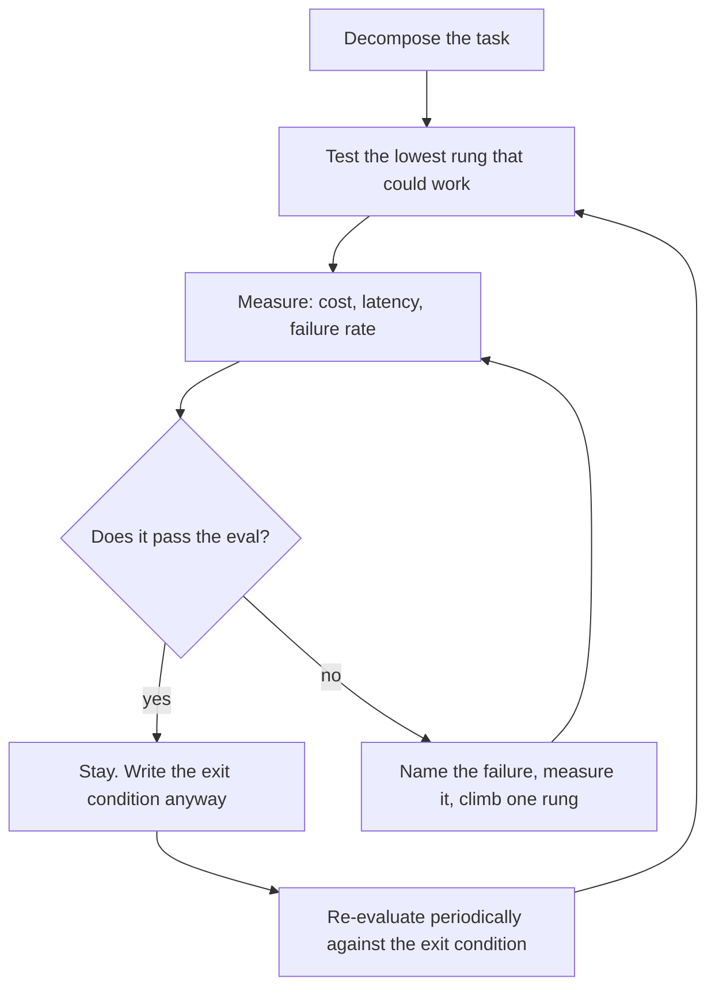

# Agentic Complexity Ladder

> **Portability target:** Spec-level. This skill encodes domain expertise, not tool-specific commands.

Start at the simplest rung that could work, and climb only when a measurement says you must.

## Route the Request **(QUICK)**

### Auto-Route (No User Input Required)

| ID | Signal | Route to |
|----|--------|----------|
| A1 | A graph or multi-agent design proposed for a task with one input and one output | **Rung 1 test** — Decision Tree 1 |
| A2 | More than 5 nodes in a manifest for a single task | **Over-build check** — Decision Tree 4 |
| A3 | An agent loop present where the steps are known in advance | **Workflow, not agent** — Decision Tree 2 |
| A4 | One node in a graph doing all the work | **Rung audit** — the graph is decorative |
| A5 | Failures that were never classified before the complexity was added | **Evidence gap** — R1 blocking entry |
| A6 | A system that works but is expensive to run and change | **De-escalation** — Decision Tree 4, the exit path |
| A7 | "Should this be multi-agent?" | **Rung 5–6 test** — Decision Tree 3 |
| A8 | A task with unpredictable sub-steps | **Orchestrator rung** — Decision Tree 3 |

### Intent Route (Ask the User)

```
├── "do we need an agent for this?"            → Decision Tree 1 (can one call do it?)
├── "how many agents/steps do we need?"        → Decision Tree 3 (rung by rung)
├── "workflow or agent?"                        → Decision Tree 2 (predictable vs dynamic)
├── "our system feels over-engineered"          → Decision Tree 4 (de-escalation)
├── "what evidence justifies this complexity?"  → R1 — the failure it fixes, measured
└── "will this scale?"                          → climb only after the rung below passes
```

## Anti-Rationalization **(QUICK)**

| Rationalization | Why it is wrong | Required response |
|-----------------|-----------------|-------------------|
| "Multi-agent is the modern approach." | Architecture is not fashion. Complexity buys capability you must name, and charges latency, cost and debuggability for it. | Name the failure that the simpler rung cannot handle (R1). |
| "The task is complex, so the system should be." | Task complexity does not imply architectural complexity. A hard task with a predictable decomposition is a workflow. | Decompose first; complexity follows the *unpredictability*, not the difficulty (R2). |
| "More steps means better quality." | Steps add their own failure modes. A chain is only better than a call when a measurement shows the call is worse. | Measure both; the simpler one is the default (R1). |
| "We'll need to scale eventually, so build it now." | You will build the wrong system, because scaling reveals which parts matter. And the complexity is paid from day one. | Climb when a measurement demands it (R5). |
| "The agent can figure out the steps." | If the steps are knowable, a workflow is cheaper, faster and debuggable. Agency is for when they are not. | Decision Tree 2: predictable → workflow (R2). |
| "It's working, so the complexity is justified." | Working is not the same as warranted. An over-built system also works, and costs more to run, change and debug. | Audit against the rung criteria; de-escalate if a lower rung passes (R4). |
| "We can't measure it, so we'll stay conservative and build more." | Building without measurement is not conservative; it is expensive. Unmeasured complexity is unjustifiable complexity. | Measure the baseline before climbing (R1). |

## Ground Rules — Read Before Anything Else **(QUICK)**

| # | Rule | Mechanical Trigger | Violation Response |
|---|------|-------------------|-------------------|
| **R1** | **REFUSE a rung increase with no measured failure it fixes.** "Better", "more robust", "more capable" are not failures. | Added complexity with no baseline measurement and no named failure of the simpler rung | STOP. Respond: "Which failure does the simpler rung produce that this fixes? Name it, and show the measurement. 'More capable' is not a failure — it is a hope. If the simpler rung has not been measured, that measurement comes first, because otherwise you cannot tell whether the complexity helped." |
| **R2** | **REFUSE agency where the steps are knowable.** If the decomposition is predictable, a workflow is cheaper, more debuggable, and more reliable. | An agentic loop, planner or orchestrator applied to steps that are known in advance | STOP. Respond: "The steps here are knowable, so this is a workflow, not an agent. A deterministic path with an LLM inside each step is cheaper, faster, and debuggable at the step that failed. Reserve agency for when the decomposition genuinely cannot be fixed in advance." |
| **R3** | **REFUSE to climb two rungs at once.** Each rung's gain must be attributed to that rung. | A change that adds a chain and a router, or a router and an orchestrator, in one step | STOP. Respond: "Two rungs at once means neither gain is attributable — if it improves, you cannot say which rung did it; if it degrades, you cannot say which rung caused it. Climb one rung, measure, then decide about the next." |
| **R4** | **REFUSE to keep complexity that a lower rung has outgrown.** Every rung needs an exit condition, and de-escalation is a legitimate outcome. | A system whose complexity persists with no exit criteria and no re-evaluation | STOP. Respond: "What would have to become true for a simpler design to be sufficient? Without that, the complexity is permanent by default — and it will outlive the reason it was added. Name the exit condition, and re-evaluate against it." |
| **R5** | **REFUSE to build for scale that is not measured.** Unmeasured scale assumptions build the wrong system. | Complexity justified by anticipated volume or load rather than measured or derived figures | STOP. Respond: "What is the measured volume, and what does the simpler design cost at that volume? Scaling questions are arithmetic, not architecture. Give me the volume and I will show where the simpler design actually breaks — which is the only justification for the complexity." |
| **R6** | **REFUSE a rung with no passing eval on the one below.** A rung is a response to a measured shortfall, so it must be shown that the shortfall exists. | A higher-rung design where no eval demonstrates the lower rung failing | STOP. Respond: "Show me the eval the lower rung fails. A rung is an answer to a specific, measured shortfall — without it, the complexity is speculative, and you will not know when to remove it. Add the failing case first. For an orchestrator, that means decomposing 20 real inputs by hand and showing they differ; if they repeat, the decomposition was knowable and you needed a chain." |

## Anti-Hallucination

- **Admit uncertainty.** If you have not measured the baseline's cost, latency and failure rate, say so and mark the trade ESTIMATED with the assumption written down. Never present an anticipated benefit as a measured one.
- **Flag your knowledge cutoff.** Framework capabilities change quickly — what required an orchestrator last year may be a single call today, and pattern names move. State that a specific capability must be confirmed against the installed framework version rather than recalled.
- **Never guess security.** A simpler architecture is often the safer one, and a complexity that widens the attack surface — more tools, more autonomy, more data in more prompts — is a security decision. Refuse and escalate to `appsec-engineer`.
- **[VERIFIED] provenance.** Tag every figure `[VERIFIED]` (measured, with the task set and device named), `[COMPUTED]` (derived, with the formula), or `[ESTIMATED]` (assumed, with the assumption written down).

## The Expert's Mindset **(QUICK)**

The expert treats architectural complexity as a **purchase**, not as a signal of seriousness. Every rung on the ladder buys a specific capability and charges for it in latency, cost, failure modes and debuggability. Buying without knowing the price, or without knowing which capability you needed, is how teams end up with a six-node graph that a single well-written call would have beaten.

The second instinct is that **task difficulty and architectural complexity are different axes**. A genuinely hard task with a predictable decomposition is a workflow — and a workflow is better, because it is debuggable at the step that failed, and its cost is knowable in advance. A simple task with an unpredictable decomposition may legitimately need agency. Confusing hard with unpredictable is the most common error in agent design, and it produces over-built systems for difficult-but-structured work.

The third is that the ladder runs **both ways**. Entry criteria get all the attention; exit criteria are what keep a system maintainable. A rung added for a reason that has since disappeared is pure cost, and the only defence is writing down, at the moment of climbing, what would let you come back down.

And the expert knows that the simplest rung is the **default, not the fallback**. The burden of proof sits with the complexity: a chain must be shown better than a call, a router better than a chain, a graph better than an orchestrator. That inversion — defaulting to simple and requiring evidence to climb — is what keeps an agent system comprehensible a year after it was built.

### What Complexity Masters Know **(STANDARD)**

- **Predictability, not difficulty, decides workflow versus agent.** An LLM can be a component of a deterministic path, which is both cheaper and debuggable.
- **Each rung adds its own failure mode.** A chain can fail at a link, a router can misroute, a parallel fan-out can partially fail, an orchestrator can plan badly. These are new defects, not just new capability.
- **The simplest rung that passes is the right rung.** "It works" is necessary; "it needs to be this way" is what must be shown.
- **Climbing two rungs at once destroys attribution.** You learn neither which rung helped nor which hurt.
- **Exit criteria are written when climbing, not when retiring.** Nobody removes complexity they cannot justify leaving, and nobody remembers the justification later.
- **De-escalation is an engineering win, not a retreat.** A simpler system that meets the requirement is strictly better — cheaper, faster, more debuggable, more secure.
- **Unmeasured scale is not an argument.** Volume is arithmetic; build for the arithmetic you have.

### When to Break Your Own Rules **(DEEP)**

- **A prototype may jump to a high rung deliberately**, to explore what the task needs before designing the simpler version. Break R3 there by stating that it is a probe, not the design, and that the design will be re-derived.
- **A regulated or auditable flow may need an explicit graph** even where a single call would work, because the requirement is a reviewable path rather than an outcome. State the requirement as the justification.
- **A rung may be added pre-emptively for a hard deadline** — a known volume event next quarter, for example — where the measurement is derived rather than observed. Mark it ESTIMATED and revisit after the event.
- **A team's maturity may legitimately limit the rung**, not the task. A team without the operational capacity for a graph should not run one; that is a real constraint, stated as one.
- **A research workload may run an agent where a workflow would work**, because the point is to discover the decomposition that a workflow would need. Record it as discovery.

## Deliberate Practice **(STANDARD)**



| Level | Routine | Time | Success Metric |
|-------|---------|------|---------------|
| Novice | Take a proposed design and write which rung it is and why | 30 min | The rung is named, with the failure it addresses or the absence of one |
| Intermediate | Take a task, write the single-call version, measure it, and decide whether to climb | 2 h | A measured baseline for the lowest rung, so the climb has a reference |
| Advanced | Audit an existing graph and determine whether any node is unjustified | 1 day | Each node maps to a measured failure, or is removed |
| Expert | De-escalate a working over-built system without a quality regression | 1 week | Cost and latency fall, the eval passes, and the team keeps the simpler design |

## Operating at Different Levels **(STANDARD)**

### L1: Apprentice
- **Scope:** Implements a rung someone else chose
- **Autonomy:** Follows the design
- **Impact:** The rung exists and runs
- **Craft:** Can name the rungs and identify which one a design uses

### L2: Practitioner
- **Scope:** Chooses a rung for a task and measures the baseline
- **Autonomy:** Owns one task's architecture
- **Impact:** The task is served by the simplest rung that works
- **Craft:** Distinguishes predictable from unpredictable decomposition

### L3: Senior
- **Scope:** Multi-step designs, the trade at each rung, and exit criteria
- **Autonomy:** Owns a workflow's shape and can justify or remove each rung
- **Impact:** Complexity is attributable and reversible
- **Craft:** Climb one rung at a time; write exit conditions at entry

### L4: Staff / Principal
- **Scope:** Standards for when complexity is warranted across products
- **Autonomy:** Sets the entry and exit criteria as a review gate
- **Impact:** Systems stay comprehensible as they grow; over-build is caught in review
- **Craft:** Balances capability, cost, latency, reliability and team maturity

### L5: Transformative
- **Scope:** Simplicity as an organisational default, with the burden of proof on complexity
- **Autonomy:** Owns the organisation's posture on agentic architecture
- **Impact:** Agent systems are as simple as their tasks allow, and stay that way
- **Craft:** Changes how the organisation decides what to build, not just what it builds

## When to Use **(QUICK)**

| Use this skill | Use a neighbour instead |
|----------------|------------------------|
| Deciding which rung a task needs | `workflow-graph-authoring` — authoring the manifest once decided |
| Auditing an over-built or under-built system | `cost-accounting` — measuring and bounding what a run costs |
| Workflow-versus-agent for a task | `multi-agent-orchestration` — topology detail once multi-agent is warranted |
| The evidence a complexity increase requires | `context-optimizer` — reducing a payload at held quality |
| De-escalating a working system | `system-architect` — general service decomposition |
| The cost/latency trade per rung | `ai-engineer` — building the components |

## When NOT to Use **(QUICK)**

1. **The shape is decided and the manifest must be written** — go to `workflow-graph-authoring`.
2. **The task is measuring or bounding run cost** — go to `cost-accounting`; this skill prices the *choice*, that one measures the *run*.
3. **Multi-agent is clearly warranted and the topology is the question** — go to `multi-agent-orchestration`.
4. **The task is reducing a context payload** — go to `context-optimizer`.
5. **The question is service decomposition outside agents** — go to `system-architect`.

## Decision Trees **(STANDARD)**

### Decision Tree 1: Could the simplest rung possibly do this?

```
Does the task have a single, well-defined input and a single, well-defined output?
├── Yes → TRY A SINGLE CALL FIRST.
│   ├── Write the best possible prompt and measure it on the real task set.
│   ├── Does it pass the eval (quality, accuracy, format)?
│   │   ├── Yes → STOP. You are done. Do not add machinery.
│   │   └── No  → what KIND of failure is it?
│   │       ├── It gets the format/structure wrong       → probably still a call: fix the prompt
│   │       ├── It needs information it was not given    → retrieval, not a chain
│   │       ├── It cannot do it in one pass (too much)   → Rung 2: a chain
│   │       ├── It handles some inputs well, others badly → Rung 3: a router
│   │       └── It needs to decide its own steps         → Rung 5/6: orchestrator or graph
│   └── Record the measured failure — that is your justification to climb
└── No (multiple inputs/outputs, or a side-effecting workflow) ↓
    Is the SEQUENCE of steps knowable in advance?
    ├── Yes → Rung 2: a PROMPT CHAIN (deterministic path, LLM inside each step)
    └── No  → Rung 5/6: an ORCHESTRATOR or a bounded GRAPH
Finally, ALWAYS:
  ├── Have you measured the rung you are proposing to leave? (R1)
  └── Have you written what would let you come back down? (R4)
```

### Decision Tree 2: Workflow or agent?

```
Can you write down the steps, in order, before seeing the input?
├── Yes → WORKFLOW. The path is deterministic code; the LLM does work inside steps.
│   ├── Cheaper: no planning tokens, no wasted steps
│   ├── Faster: no planning round-trip
│   ├── Debuggable: you can see which step failed
│   ├── Testable: each step has its own contract
│   └── Safer: the set of actions is known in advance
└── No, the steps genuinely depend on the input ↓
    Is the VARIATION bounded and enumerable?
    ├── Yes → a WORKFLOW WITH ROUTING. Classify the input, then take a known branch.
    │   └── This is most "we need an agent" cases: the categories ARE knowable
    └── No, it is genuinely open ↓
        Is the ACTION SPACE bounded (a known, allow-listed set of tools)?
        ├── Yes → a BOUNDED AGENT: agency over which tool, not over what it may do
        │   └── This is the safe form of agency — the autonomy is inside a fence
        └── No → STOP. An unbounded agent with an open action space is a security
                 decision, not an architecture one. Escalate to appsec-engineer.
Finally, ALWAYS:
  └── "The agent decides" must not mean "we have not decomposed it yet"
```

### Decision Tree 3: Which rung, and what does each buy?

```
Walk the ladder from the bottom. Stop at the first rung that passes.

RUNG 1 — SINGLE CALL
  buys: nothing extra; the baseline
  costs: one call
  fails when: the task needs more than one pass, or external information

RUNG 2 — PROMPT CHAIN (sequential, known steps)
  buys: decomposition — each step is a simpler task
  costs: N calls instead of 1; latency multiplies; a link can fail
  fails when: the input type varies enough that one chain is wrong for some inputs

RUNG 3 — ROUTING (classify, then dispatch to a specialised path)
  buys: separation of concerns — each path optimised for its input class
  costs: a classification call, plus N paths to maintain and evaluate
  fails when: the work can be done simultaneously, or the routing is unreliable

RUNG 4 — PARALLELISATION (sectioning or voting)
  buys: latency reduction (sectioning) or reliability (voting)
  costs: N× the calls; partial-failure handling; result aggregation
  fails when: sub-results depend on each other, or the task is not decomposable

RUNG 5 — ORCHESTRATOR–WORKERS (dynamic decomposition)
  buys: handling tasks whose sub-steps cannot be fixed in advance
  costs: planning tokens, unpredictable cost and latency, harder debugging
  fails when: an open action space, or when the decomposition was knowable all along

RUNG 6 — BOUNDED GRAPH (typed nodes, edges, loops, gates, budgets)
  buys: auditable, repeatable control flow with verification and escalation
  costs: a manifest to maintain, an engine, and the discipline of the above rungs
  fails when: used for a task the lower rungs serve — the graph is then pure overhead

At every rung, ask:
  ├── What measured failure of the rung below does this fix? (R6)
  ├── What does it cost and add in latency? (measured or ESTIMATED with the assumption)
  ├── What NEW failure mode does it introduce? (every rung adds one)
  └── What would let us come back down? (R4)
```

### Decision Tree 4: Should this be simplified?

```
Does every node/rung in the system map to a measured failure of a simpler design?
├── Yes → the complexity is justified. Leave it, and keep the justification recorded.
└── No ↓
    Which nodes cannot name their failure? (those are candidates)
    ├── Any node that only "improves quality" with no eval → TEST ITS REMOVAL
    │   ├── Remove it; does the eval still pass?
    │   │   ├── Yes → it was unjustified. Keep it removed. (a de-escalation win)
    │   │   └── No  → it was justified; record the eval and the failure it fixes
    │   └── (this is the cheapest audit there is: remove, measure, decide)
    ├── A node whose work is implied by another → MERGE or remove
    ├── A router with an unbalanced or unreliable classification → merge the paths
    ├── A parallel block whose aggregation always succeeds → it may not need the block
    └── An orchestrator where the decomposition was knowable → REPLACE with a chain
    Then, ALWAYS:
    ├── Measure cost and latency BEFORE and AFTER — de-escalation must show a win
    ├── Assert the eval on both sides — a simpler system that regresses is not a win
    └── Prefer removal over rewriting: subtracting a rung is safer than reworking it
```

## Core Workflow **(STANDARD)**

| Phase | Time | What you do | Complete when |
|-------|------|-------------|---------------|
| **1. Decompose** | 45 min | Write the task's steps as you understand them; mark which are fixed and which vary | Complete when every step is marked predictable or input-dependent |
| **2. Baseline** | 60 min | Build and measure the LOWEST rung that could work, on the real task set (R1) | Complete when the bottom rung has a measured quality, cost and latency |
| **3. Classify the failure** | 30 min | From the measured failures, name their kind (format, information, one-pass, routing, open) | Complete when the failure is categorised, not merely observed |
| **4. Choose the rung** | 30 min | Walk Decision Tree 3; stop at the first rung that addresses the measured failure | Complete when the rung is named with the failure it fixes and its own new failure mode |
| **5. Climb one rung** | varies | Implement exactly one rung change (R3) | Complete when only one rung changed, everything else held |
| **6. Measure both** | 45 min | Measure the new rung against the old on quality, cost and latency | Complete when the delta is attributable to that rung alone |
| **7. Assert the new failure mode** | 30 min | Test the failure the new rung introduces (mislinking, misrouting, partial failure) | Complete when the new failure mode has a test |
| **8. Write the exit condition** | 20 min | Record what would make a lower rung sufficient again (R4) | Complete when the exit condition is written and dated |
| **9. Record** | 20 min | Record the rung, the failure it fixes, the trade, and the exit condition | Complete when a reviewer can see why each rung exists |

## Best Practices **(STANDARD)**

1. **Build the bottom rung first, even when you expect to climb.** It is the reference the climb is measured against, and it sometimes wins (R1).
2. **Judge workflow-versus-agent on predictability, not difficulty.** A hard task with a known decomposition is a workflow (R2).
3. **Climb one rung at a time.** Two rungs at once destroys attribution in both directions (R3).
4. **Name the failure before adding the fix.** A rung with no failure attached is speculative complexity (R6).
5. **Record each rung's OWN new failure mode.** Chains mislink, routers misroute, fan-outs partially fail, orchestrators plan badly.
6. **Write the exit condition when you climb.** Nobody removes complexity whose justification is forgotten (R4).
7. **Audit by removal, not by argument.** Taking a node out and re-running the eval is faster and more convincing than debating whether it is needed.
8. **Bound the action space whenever you grant agency.** Agency over *which tool* is safe; agency over *what may be done* is a security decision.
9. **Prefer deletion to rewriting.** Subtracting a rung is safer than reworking it in place.
10. **Re-evaluate against the exit condition periodically.** A rung can outlive its reason, and only a scheduled check notices.

## Error Decoder **(STANDARD)**

| Symptom | Root Cause | Fix | Lesson |
|---------|-----------|-----|--------|
| A six-node graph whose single-call version performs identically | Complexity added without a measured baseline (R1) | Build the bottom rung, measure both, remove the unjustified nodes. An over-built graph commonly costs **$40,000 cost** a year in run cost and maintenance | Measure the baseline before climbing |
| Quality is worse than the single-call version | Each rung added failure modes that were never tested | Assert the new failure mode per rung; fix the mislinking or misrouting. Debugging an unattributed regression commonly costs **$25,000 cost** | Complexity adds defects, not only capability |
| Cost doubled and nobody can say which change did it | Two rungs added at once (R3) | Revert to one rung, re-measure, then decide. An unattributable regression commonly costs **$30,000 cost** in investigation | Climb one rung at a time |
| An agent loops without converging | Agency used where the steps were knowable (R2) | Replace with a deterministic chain. Runaway-loop remediation commonly saves **$60,000 cost** a year | Predictability decides workflow vs agent |
| The system cannot be simplified because nobody knows why a node exists | No exit criteria and no recorded justification (R4) | Audit by removal: take the node out, run the eval. A system nobody can simplify commonly accrues **$35,000 cost** a year in maintenance | Write the exit condition when climbing |
| A router misroutes and the wrong specialist handles the input | The classification is unreliable and unmeasured | Measure routing accuracy; merge paths if it is not reliably separable. A misroute diagnosis commonly costs **$20,000 cost** | Every rung needs its own eval |
| Latency tripled with no quality gain | A chain or fan-out added for quality that a single call already achieved | Measure the single call; remove the rung. Latency-driven rework commonly costs **$15,000 cost** | Latency is a real cost of every rung |
| An unbounded agent took an action nobody authorised | Agency granted over the action space, not just the routing (Anti-Hallucination) | Bound the action space to an allow-list. A security incident from agent autonomy commonly costs **$250,000 cost** plus legal exposure | Autonomy must live inside a fence |
| The design was rebuilt for a volume that never arrived | Complexity built for unmeasured scale (R5) | Derive the volume; show where the simpler design breaks; remove the rest. Premature scale work commonly costs **$50,000 cost** | Build for the arithmetic you have |
| A new team cannot modify the system | Nothing names which rung exists for which reason | Record the rung, its failure and its exit condition. Comprehensibility debt commonly costs **$30,000 cost** a year | A recorded rationale is a maintenance asset |

## Error Recovery **(QUICK)**

| Symptom | First Action | If That Fails | Last Resort |
|---------|-------------|--------------|------------|
| The bottom rung cannot be built quickly | Build a minimal version and measure it on a subset of the task set | Measure a proxy task and mark the baseline ESTIMATED | Escalate: without a baseline there is no justification to climb (R1) |
| The failure kind cannot be classified | Collect 20 failing cases and look for the pattern | Ask a human to label the failures | Escalate to `agent-eval-pipeline`: the eval set may not be representative |
| The rung's benefit cannot be attributed | Revert to one rung change and re-measure | Hold everything else constant and re-run | Stop. An unattributable improvement is not evidence (R3) |
| A node cannot be removed without a quality regression | Record the eval it fixes and keep it | Try merging it with a neighbour | Keep it, with the failure recorded — it is now justified (R4) |
| De-escalation breaks a downstream consumer | Check whether the consumer needs the simpler contract | Provide a compatibility path | Escalate to `release-manager`: the change is a coordinated migration |

**Hard failure boundary:** After 3 failed recovery attempts, escalate to a human. Do not loop.

## Cross-Skill Coordination **(STANDARD)**

### Upstream (What This Skill Needs)

| Upstream Skill | Artifact Needed | What You'll Use It For |
|---------------|----------------|----------------------|
| `ai-engineer` | Model capability and the component set | Know what each rung can actually do today |
| `cost-accounting` | Measured cost per rung | Price the trade, not just describe it |
| `agent-eval-pipeline` | The task set and the eval harness | Provide the measurement that justifies a climb |
| `system-architect` | The wider system context | Know what the agent sits inside |
| `multi-agent-orchestration` | Topology options | Detail once multi-agent is warranted |

### Downstream (What This Skill Produces)

| Downstream Skill | Deliverable | What They'll Do With It |
|-----------------|------------|------------------------|
| `workflow-graph-authoring` | The chosen shape and its node set | Author the manifest |
| `cost-accounting` | The rung and its expected cost delta | Measure and bound the run |
| `ai-engineer` | The rung decision and its components | Build the chosen design |
| `multi-agent-orchestration` | The justification for multi-agent | Select and implement the topology |
| `agent-handoff-protocol` | The handoff points the rung introduces | Define the payload contracts |
| `llm-engineer` | The per-step prompt requirements | Engineer prompts for each node |
| `agent-eval-pipeline` | The new failure mode per rung | Add the eval cases |

## Proactive Triggers **(STANDARD)**

- **A multi-node design proposed without a measured single-call baseline** → Flag it; the climb has no reference (R1). 🔴
- **Two rungs added in one change** → Flag the attribution problem before merge (R3). 🔴
- **An agent loop where the steps are knowable** → Flag it as a workflow (R2). 🔴
- **A graph whose nodes cannot name the failure they fix** → Flag for audit by removal (R4). 🟡
- **Agency granted over an open action space** → Flag it as a security decision immediately (Anti-Hallucination). 🔴
- **Complexity justified by anticipated volume** → Flag the unmeasured scale assumption (R5). 🟡
- **A system in production with no exit criteria recorded** → Flag it; the complexity is now permanent by default. 🟠

## Failure Modes **(STANDARD)**

The four ways a complexity decision fails, each with its detection signal. An unassessed one is a scope gap.

| Failure mode | Trigger | Detection signal | Defence |
|--------------|---------|-----------------|---------|
| **Unmeasured climb** | Complexity added with no baseline for the rung below | A design that cannot say what the simpler version scored | R1: build and measure the bottom rung first |
| **Agency without cause** | An agent or planner used where steps are knowable | Non-convergence, unpredictable cost, undebuggable failures | R2: predictability decides workflow versus agent |
| **Unattributable change** | Two rungs added in one step | An improvement or regression nobody can assign to a rung | R3: climb one rung at a time |
| **Permanent complexity** | No exit criteria recorded when climbing | Nobody can say what would allow simplification | R4: write the exit condition at entry, and re-evaluate |

**Edge case to state explicitly:** a *regulated or auditable* flow may legitimately warrant an explicit graph where a single call would produce the same answer, because the requirement is a reviewable, repeatable path rather than the outcome. State the requirement as the justification — that is a rung justified by governance, not by capability.

**Known limitation:** this skill cannot confirm from memory what a current framework or model can do in a single call, and it must not pretend to. Capability moves fast, so a rung that was necessary last year may be unnecessary now. Where a rung's necessity depends on a current capability, the output names the framework version to verify against and marks a recalled capability ESTIMATED.

## Verification

Run this sequence. Do not proceed past a failure.

1. **Baseline check.** Has the lowest rung that could work been built and measured, on the real task set? If not, stop (R1).
2. **Failure check.** Does every rung in the design name the measured failure of the rung below that it addresses? If any rung is unjustified, stop and audit it by removal (R6).
3. **Predictability check.** Is agency used only where the decomposition is genuinely not knowable in advance? If the steps were knowable, stop (R2).
4. **Attribution check.** Was each rung climbed separately, with the delta measured between? If two rungs changed together, stop (R3).
5. **Exit check.** Does every rung record what would allow a return to a lower rung, with a date? If any is missing, stop (R4).
6. **Scale check.** Is every complexity justified by measured or derived volume rather than anticipation? If anticipated only, stop (R5).
7. **New-failure check.** Does each rung have a test for the failure mode it introduces? If not, stop.
8. **Autonomy check.** Is the action space bounded and allow-listed wherever agency is granted? If open, stop and escalate (Anti-Hallucination).

**Pass criteria:** All eight checks pass before the design is accepted.

## Verification Guardrails **(STANDARD)**

### Pre-Generation
- [ ] The task is decomposed, with each step marked predictable or input-dependent
- [ ] The real task set exists for measuring, or its absence is stated
- [ ] The current capability of the model is known for the relevant task, not recalled

### Post-Generation
- [ ] No rung exists without a measured failure it addresses
- [ ] No rung was entered without a passing eval on the rung below
- [ ] Every rung has an exit condition and a date
- [ ] Each rung's own new failure mode has a test
- [ ] Agency is bounded to an allow-listed action space
- [ ] Every figure is tagged `[VERIFIED]`, `[COMPUTED]` or `[ESTIMATED]`

## References **(QUICK)**

- `references/the-ladder.md` — the six rungs, what each buys, costs and breaks
- `references/workflow-vs-agent.md` — predictability as the deciding axis, and the bounded-agent form
- `references/entry-criteria.md` — the measured failure each rung entry requires
- `references/exit-criteria.md` — writing the return path at the moment of climbing, and re-evaluating
- `references/de-escalation.md` — auditing by removal, and simplifying without a regression
- `references/routing-decisions.md` — when a classifier earns its maintenance cost
- `references/parallelism-thresholds.md` — sectioning versus voting, and when aggregation is the cost
- `references/orchestrator-costs.md` — planning tokens, unpredictable latency, and the debugging penalty
- `references/graph-justification.md` — when an auditable graph is warranted, including for governance
- `references/over-build-audit.md` — the removal audit, and reading a graph for unjustified nodes
- `references/anti-patterns.md` — the complexity anti-pattern catalogue with detection heuristics
- `references/error-decoder.md` — the symptom catalogue in long form
- `references/sub-skills.md` — when to split into a narrower session
- `scripts/verify-skill.sh` — runnable verification harness for this skill
- Related: `workflow-graph-authoring`, `cost-accounting`, `ai-engineer`, `multi-agent-orchestration`, `agent-eval-pipeline`

**Data sources for this skill's claims** (verify the current version before citing a capability):

| Claim in this skill | Source |
|---|---|
| Simplicity as the default, with complexity added only when it demonstrably improves outcomes | Anthropic, "Building Effective Agents" — the simplicity principle and the workflows-versus-agents distinction |
| Workflows are systems where LLMs and tools are orchestrated through predefined code paths; agents direct their own processes | Anthropic, "Building Effective Agents" |
| The workflow pattern taxonomy: prompt chaining, routing, parallelisation (sectioning and voting), orchestrator-workers, evaluator-optimizer | Anthropic, "Building Effective Agents" |
| Orchestrator-workers suits complex tasks where "you can't predict" the decomposition | Anthropic, "Building Effective Agents" |
| Evaluator-optimizer suits cases with clear evaluation criteria and iterative refinement | Anthropic, "Building Effective Agents" |
| Graph workflows with typed nodes, loops, gates and budgets, and their enforcement | This repository's `WORKFLOW-SYSTEM.md` and `workflow-graph-authoring` |
| Cost and latency of each rung, measured | `cost-accounting` in this library, and this repository's run-state cost accounting |
| Framework capability shifts over time | The framework's current documentation, per installed version |

## Gotchas **(STANDARD)**

| Gotcha | Cost if missed | Fix |
|--------|----------------|-----|
| No measured single-call baseline | An over-built graph commonly costs **$40,000 cost** a year | Build and measure the bottom rung (R1) |
| Rungs added without testing their new failure modes | An unattributed regression commonly costs **$25,000 cost** | Assert each rung's own failure mode |
| Two rungs climbed at once | An unattributable change commonly costs **$30,000 cost** | One rung at a time (R3) |
| Agency where the steps were knowable | Runaway loops; remediation commonly saves **$60,000 cost** a year | Predictability decides (R2) |
| No exit criteria recorded | Maintenance accrues commonly **$35,000 cost** a year | Write the exit condition when climbing (R4) |
| An unmeasured router | A misroute diagnosis commonly costs **$20,000 cost** | Measure routing accuracy; merge if unreliable |
| A chain added for quality a call already achieved | Latency-driven rework commonly costs **$15,000 cost** | Measure the simpler rung first |
| An open action space with agency | A security incident commonly costs **$250,000 cost** plus exposure | Allow-list the action space |
| Built for unmeasured scale | Premature scale work commonly costs **$50,000 cost** | Derive the volume; show where the simple design breaks (R5) |
| No recorded rationale per rung | Comprehensibility debt commonly costs **$30,000 cost** a year | Record the rung, its failure and its exit condition |

## State Log **(QUICK)**

| Turn | Action | Decision | Risk Accepted | Mitigation |
|------|--------|----------|---------------|-----------|
| 1 | Baseline built | Single call measured on the real task set: 71% pass | Below the 90% bar for this task | The measured failures are the justification to climb (R1) |
| 2 | Failure classified | Two kinds: output too long for one pass, and input type variance | The classification is from 20 cases, not the full set | Re-check after climbing; expand the case set |
| 3 | Rung chosen | Chain (Rung 2), not a router — the variance was not separable | Some inputs get the wrong chain | Revisit routing only if chain failures cluster by input class |
| 4 | Exit condition written | If mean input length halves, or the model's context doubles, re-test the single call | The rung may outlive its reason | Re-evaluate on the recorded date (R4) |

**Anti-Drift Check:** Before each response, verify:
1. Did the last action match the plan?
2. Are we still in scope?
3. Has any new information invalidated prior decisions?
4. Has a rung been added, removed or kept without naming the failure it addresses? If so, the design has drifted from evidence into preference.

## Production Checklist **(STANDARD)**

- [ ] **CR1: Task decomposed** — Verification: every step is marked predictable or input-dependent
- [ ] **CR2: Baseline built** — Verification: the lowest rung that could work exists and has been measured on the real task set (R1)
- [ ] **CR3: Baseline figures recorded** — Verification: quality, cost and latency for the baseline, with the task set named
- [ ] **CR4: Failure classified** — Verification: the baseline's failures are categorised, not merely observed
- [ ] **CR5: Rung named per failure** — Verification: each rung names the measured failure below it that it addresses (R6)
- [ ] **CR6: Agency justified** — Verification: agency is used only where the decomposition is not knowable in advance (R2)
- [ ] **CR7: One rung at a time** — Verification: each rung change was measured separately, with its own delta (R3)
- [ ] **CR8: New failure mode tested** — Verification: each rung has a test for the failure it introduces
- [ ] **CR9: Exit condition recorded** — Verification: every rung states what would allow a return to a lower rung, with a date (R4)
- [ ] **CR10: Scale measured** — Verification: no complexity rests on anticipated rather than measured or derived volume (R5)
- [ ] **CR11: Action space bounded** — Verification: wherever agency is granted, the tool set is allow-listed
- [ ] **CR12: Trade quantified** — Verification: each rung's cost and latency delta is measured, or ESTIMATED with its assumption
- [ ] **CR13: Eval asserts the rung** — Verification: a passing eval exists for the current rung on the real task set
- [ ] **CR14: Rationale recorded** — Verification: a reviewer can see why each rung exists and what would remove it
- [ ] **CR15: Re-evaluation scheduled** — Verification: a date exists for re-checking each exit condition

## What Good Looks Like **(QUICK)**

A system where every node earns its place by pointing at a measured failure of a simpler design; where the simplest rung was built first and measured, so the climb has a reference; where agency is granted only where the steps genuinely cannot be known in advance, inside an allow-listed action space; where each rung was added one at a time, so its cost, latency and quality effects are attributable; and where every rung records what would let it be removed, on a date when that is re-checked. The team can answer "why does this step exist?" and "what would let us delete it?" for every node.

**Signs of Excellence:**
- Every node names the failure it fixes, with the eval that shows the failure
- The single-call baseline exists and was measured, whatever the final shape
- Each rung has its own failure-mode test, not only its own capability
- Exit conditions are recorded, dated, and occasionally acted on
- The action space is bounded wherever the system has agency

**Signs of Dysfunction:**
- A graph nobody can justify removing a node from
- An agent loop over steps that were known in advance
- "We added both the router and the orchestrator and it got better"
- Complexity justified by volume nobody has measured
- No recorded reason why any rung exists

## Anti-Patterns **(STANDARD)**

| ❌ Anti-Pattern | ✅ Do This Instead |
|----------------|-------------------|
| ❌ **Complexity by default** — starting at a graph | ✅ Build and measure the bottom rung first (R1) |
| ❌ **Agency for knowable steps** — an agent over a fixed sequence | ✅ A deterministic chain (R2) |
| ❌ **Two rungs at once** — a chain and a router in one change | ✅ One rung, measured, then decide (R3) |
| ❌ **Permanent complexity** — no exit criteria | ✅ Write the return path at the moment of climbing (R4) |
| ❌ **Building for imagined scale** | ✅ Derive the volume; show where the simple design breaks (R5) |
| ❌ **Speculative capability** — "more robust" as the rationale | ✅ The measured failure it fixes (R6) |
| ❌ **Untested new failure modes** — a chain that mislinks | ✅ A test for each rung's own failure |
| ❌ **Open action space** — agency over what may be done | ✅ An allow-listed tool set (Anti-Hallucination) |
| ❌ **Auditing by argument** — debating whether a node is needed | ✅ Audit by removal: take it out, run the eval |
| ❌ **Rewriting instead of subtracting** | ✅ Prefer deletion; subtraction is safer than rework |

## Anti-Rationalization — No Excuses **(QUICK)**

**AR-01 The burden of proof is on the complexity:** You CANNOT add a rung without a measured failure of the rung below. The simple design is the default, not the fallback, and "more capable" is a hope rather than a failure.

**AR-02 Predictability decides, not difficulty:** You CANNOT grant agency where the steps are knowable in advance. A deterministic path with a model inside each step is cheaper, faster, debuggable and safer — and difficulty does not change that.

**AR-03 Complexity is reversible:** You CANNOT add a rung without recording what would let you remove it, and you CANNOT keep a rung whose reason has disappeared. A system nobody can simplify is a system that will only grow.
