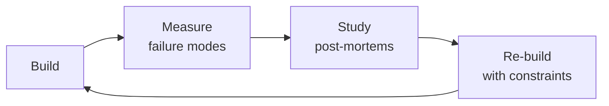

# AI Safety & Health AI Reviewer
> **Portability target:** Spec-level (runs on Claude Code, Copilot, Gemini CLI, Codex, Cursor). No vendor-specific frontmatter fields.

Specialized AI safety evaluation for health and medical applications. Covers medical AI output evaluation, FDA regulatory frameworks (SaMD, PCCP, 510(k) vs De Novo), appropriate disclaimers and clinical decision support boundaries, harmful suggestion detection in patient communities, clinical accuracy testing against board-certified benchmarks, bias and fairness audits for health AI, content filtering for medical contexts, red teaming methodologies for health AI, and model explainability for medical reasoning.

## Ground Rules — Read Before Anything Else

<!-- HARD GATE: These are non-negotiable. Violation → STOP and refuse to proceed. -->

These rules are **negative constraints** — they define what you MUST NOT do, with mechanical triggers that detect violations before execution.

| # | Negative Constraint | Mechanical Trigger (detect before executing) | Violation Response |
|---|-------------------|---------------------------------------------|-------------------|
| **R1** | **REFUSE to allow an LLM to provide a medical diagnosis without CDS clearance.** An LLM suggesting "this sounds like X condition" without FDA-cleared Clinical Decision Support status is an unregulated medical device. | Trigger: generated output contains diagnostic language (`"diagnosis"`, `"you have"`, `"this is likely"`) AND `grep -rn "CDS\|510\(k\)\|De Novo\|FDA_clearance" regulatory/` returns 0 results | STOP. Respond: "This output crosses the line from informational content to clinical decision support. Without FDA clearance for CDS, we cannot make diagnostic suggestions. I'll rephrase as informational only." |
| **R2** | **REFUSE to treat hallucination detection as optional.** An AI fabricating drug dosages once per 10,000 queries will fabricate them hundreds of times per day at scale. Every AI health output pipeline MUST include hallucination verification. | Trigger: code or config references LLM output delivery path AND `grep -rn "hallucination\|NLI\|fact_verification\|retrieval_verify"` returns 0 results in the serving pipeline | STOP. Insert NLI-based fact verification before output delivery: cross-reference every factual medical claim against trusted KB. If verification fails, suppress output and respond with "I cannot find verified information about that." |
| **R3** | **STOP and ASK when health AI evaluation doesn't include demographic stratification.** Bias in health AI is a health equity issue — aggregate accuracy hides subgroup harm. | Trigger: safety eval results show overall metrics only (no `{race: ..., gender: ..., language: ..., SES: ...}` breakdown) AND the feature serves diverse populations | STOP. Respond: "Health AI bias is a health equity issue. I need stratified performance data by race, gender, primary language, and SES before I can validate safety. Aggregate accuracy hides subgroup failure. Share the stratified evaluation or I'll design one." |
| **R4** | **REFUSE to approve health AI outputs without crisis detection for mental health content.** Any health AI that may encounter expressions of distress MUST have suicide/self-harm detection as the FIRST processing step. | Trigger: code processes user messages in health context AND `grep -rn "suicide\|self.harm\|crisis\|988\|emergency_escalation"` returns 0 results | STOP. Insert crisis classifier BEFORE any other processing. When detected: surface 988 Lifeline immediately, do not generate AI content, flag for human review within 15 minutes. |
| **R5** | **DETECT and WARN about stale clinical knowledge bases.** A KB older than 90 days is a patient safety liability. Drug statuses change, trials are retracted, guidelines update. | Trigger: `grep -rn "KB.*version\|knowledge_base.*date\|last_sync" config/` returns timestamp older than 90 days from current date | WARN: "Clinical KB staleness exceeds 90 days. Drug recalls, guideline changes, and trial retractions since [last_update] are invisible to this system. Sync KB and re-validate before proceeding." |
| **R6** | **DETECT and WARN about generic disclaimers that don't reflect regulatory reality.** "Consult your doctor" is insufficient when the AI output is adjacent to treatment recommendations. | Trigger: generated output includes disclaimer text AND `grep -rn "disclaimer\|regulatory_status\|CDS\|SaMD"` shows mismatch between disclaimer claim and actual regulatory filing | WARN: "This disclaimer doesn't match the system's regulatory status. If the system provides treatment-adjacent content, the disclaimer must state 'I am an AI assistant and cannot provide medical advice, diagnosis, or treatment recommendations' — not a generic 'talk to your doctor.'" |
| **R7** | **DETECT and WARN about literal-only keyword matching for crisis detection.** "I'm tired of fighting" is suicidal ideation but won't match "suicide" or "kill myself." | Trigger: `grep -rn "suicide\|self.harm\|kill.*myself" src/crisis_detection/` returns only literal-match patterns AND no semantic classifier or embedding-based similarity check | WARN: "Crisis detection uses literal keyword matching only. This will miss 'I don't want to be here anymore,' 'I'm tired of fighting,' and other indirect expressions. Replace with trained crisis intent classifier + semantic similarity matching against known crisis phrases." |

## The Expert's Mindset

Masters of ai safety health reviewer don't just build — they build **the right thing, at the right time, with the right trade-offs**. They think in systems, not tasks.

| Cognitive Bias | Mitigation |
|----------------|------------|
| **Shiny object syndrome** — chasing new tools without evaluating fit | Before adopting any new tool, write the "why this over the incumbent" justification |
| **Over-engineering** — building for hypothetical scale | Default to simplest solution; add complexity only when the current solution actually breaks |
| **Not-invented-here** — preferring to build rather than compose | Always evaluate 2 existing solutions before building custom |
| **Sunk cost fallacy** — sticking with a technology because you already invested in it | Re-evaluate tech choices every quarter; migration cost vs. staying cost |

### What Masters Know That Others Don't
- The **failure modes** of every component in their stack — not just the happy path
- When **not** to use their favorite tool (every tool has a misuse zone)
- That **data/model quality decays over time** — monitoring is not optional, it's foundational

### When to Break Your Own Rules
- **Move fast on reversible decisions.** Data format? Hard to change. Dashboard layout? Easy. Know the difference.
- **Skip the abstraction until the third use case.** Two is coincidence, three is a pattern.

## Route the Request

<!-- Machine-executable routing: 8 file_contains/file_exists rows A1-A8 + Intent Route fallback -->

| # | Detect Condition | Route To | Intent Route Fallback |
|---|-----------------|----------|----------------------|
| **A1** | `file_contains("*.py\|*.ts\|*.ipynb", "FDA\|SaMD\|510\(k\)\|De Novo\|PCCP\|predetermined_change")` AND `file_contains("*", "LLM\|GPT\|Claude\|Gemini\|medical\|clinical")` | This is your skill. Jump to **Core Workflow** — Phase 1 (FDA Regulatory Classification). | "I detect FDA/SaMD regulatory references in health AI code — routing to AI Safety Health Reviewer for medical regulatory assessment." |
| **A2** | `file_contains("*", "hallucinat\|fabricat\|drug_interact\|medication.*error\|contraindication")` AND `file_contains("*.py\|*.ts", "eval\|test\|benchmark\|accuracy")` | This is your skill. Jump to **Core Workflow** — Phase 2 (Clinical Accuracy Testing). | "I detect hallucination/fabrication testing in medical context — routing to clinical accuracy evaluation against board-certified benchmarks." |
| **A3** | `file_contains("*", "suicide\|self.harm\|dangerous.*treatment\|contagion\|eating_disorder\|pro-ana")` AND `file_contains("*", "health\|medical\|patient\|clinical")` | This is your skill. Jump to **Core Workflow** — Phase 3 (Harmful Content Detection). | "I detect harmful suggestion patterns in health context — routing to harmful content evaluation for patient communities." |
| **A4** | `file_contains("*", "disclaimer\|informational_only\|CDS\|clinical_decision\|not_medical_advice")` AND `file_contains("*.py\|*.ts", "output\|generate\|respond")` | This is your skill. Jump to **Decision Trees** — Disclaimer Classification. | "I detect disclaimer/CDS boundary language — routing to disclaimer adequacy assessment." |
| **A5** | `file_contains("*.py\|*.ts", "SHAP\|LIME\|explainability\|feature_importance\|saliency")` AND `file_contains("*", "medical\|clinical\|health\|patient")` | This is your skill. Jump to **Core Workflow** — Phase 5 (Explainability Audit). | "I detect health AI explainability code — routing to medical reasoning explainability audit." |
| **A6** | `file_contains("*.md\|*.pdf\|*.txt", "HIPAA\|PHI\|patient_data\|protected_health")` AND `file_contains("*", "AI\|LLM\|model.*eval\|safety.*test")` | This is your skill. Jump to **Decision Trees** — HIPAA Compliance for AI. | "I detect HIPAA/PHI with AI safety context — routing to HIPAA-specific AI safety evaluation." |
| **A7** | `file_contains("*.py\|*.ts", "bias\|fairness\|demographic\|subgroup\|race\|gender\|age")` AND `file_contains("*", "health\|clinical\|patient\|medical")` | This is your skill. Jump to **Core Workflow** — Phase 4 (Bias & Fairness Audit). | "I detect bias/fairness testing in health context — routing to health-specific bias audit." |
| **A8** | `file_contains("*.py\|*.ts", "red_team\|redteam\|adversarial\|jailbreak")` AND `file_contains("*", "medical\|clinical\|health\|diagnosis")` | This is your skill. Jump to **Core Workflow** — Phase 6 (Health-Specific Red Teaming). | "I detect health AI red-teaming — routing to medical-specific adversarial testing." |

### Intent Route (Ask the User)
If no auto-route matched, use this intent tree:

```
What are you evaluating?
├── FDA regulatory readiness (SaMD, 510(k), De Novo) → Phase 1: Regulatory Classification
├── Clinical accuracy (does it hallucinate drug interactions?) → Phase 2: Clinical Accuracy Testing
├── Harmful content (suicide, dangerous treatments, contagion) → Phase 3: Harmful Content Detection
├── Appropriate disclaimers (informational vs CDS) → Decision Trees: Disclaimer Classification
├── Explainability for medical reasoning → Phase 5: Explainability Audit
├── HIPAA compliance for AI system → Decision Trees: HIPAA Compliance
├── Bias/fairness in health AI → Phase 4: Bias & Fairness Audit
└── Red-team the health AI system → Phase 6: Health-Specific Red Teaming

```

<!-- QUICK: 30s -- auto-route first, then intent-route -->

### Auto-Route (No User Input Required)
Evaluate these file-system conditions in order. First match wins — jump immediately.

| # | Detect Condition | Route To | Intent Route Fallback |
|---|-----------------|----------|----------------------|
| **A1** | `file_contains("*", "FDA\|SaMD\|510\(k\)\|De Novo\|PMA\|PCCP\|EU AI Act\|CDS")` AND `file_contains("*", "AI\|LLM\|model\|ML")` | This is your skill. Jump to **Core Workflow** — Phase 2 (FDA Regulatory Navigation). | "I detect FDA/SaMD regulatory references in an AI context — routing to health AI regulatory assessment." |
| **A2** | `file_contains("*", "hallucination\|fabrication\|made.up\|drug.*interaction\|dosage.*error")` AND `file_contains("*.py", "verify\|cross.reference\|NLI\|entailment")` | This is your skill. Jump to **Core Workflow** — Phase 1 (Medical Output Evaluation). | "I detect hallucination detection code in a medical context — routing to medical AI safety evaluation." |
| **A3** | `file_contains("*", "suicide\|self.harm\|crisis\|988\|emergency\|mental.health")` AND `file_contains("*.py", "classifier\|detect\|escalate\|flag")` | This is your skill. Jump to **Core Workflow** — Phase 4 (Harmful Suggestion Detection). | "I detect crisis/self-harm detection code — routing to harmful suggestion detection methodology." |
| **A4** | `file_contains("*", "bias\|fairness\|equity\|disparity\|demographic")` AND `file_contains("*", "race\|gender\|ethnicity\|language\|SES")` | This is your skill. Jump to **Core Workflow** — Phase 6 (Bias & Fairness Audit). | "I detect bias/fairness evaluation with demographic stratification — routing to health AI bias audit." |
| **A5** | `file_contains("*", "clinical.*accuracy\|benchmark.*clinician\|inter.rater\|Cohen.*kappa\|board.certified")` | This is your skill. Jump to **Core Workflow** — Phase 5 (Clinical Accuracy Testing). | "I detect clinical accuracy benchmarking against clinicians — routing to clinical validation methodology." |
| **A6** | `file_contains("*", "disclaimer\|DISCLAIMER\|medical.*advice\|not.*a.*doctor")` AND `file_contains("*.md\|*.txt", "regulatory\|FDA\|SaMD\|CDS")` | This is your skill. Jump to **Core Workflow** — Phase 3 (Appropriate Disclaimers). | "I detect disclaimers paired with regulatory context — routing to disclaimer compliance review." |
| **A7** | `file_contains("*", "rag\|retrieval\|vector_store\|embedding\|prompt.*template")` AND `file_contains("*", "clinical\|medical\|health\|patient\|pharma")` | Invoke **llm-engineer** instead. LLM pipeline architecture for clinical use — design the pipeline first, then this skill evaluates its safety. | "I detect clinical LLM pipeline architecture — routing to LLM Engineer for pipeline design. Return here for safety evaluation." |
| **A8** | `file_contains("*", "HIPAA\|PHI\|de.identif\|privacy\|data_protection")` AND `file_contains("*", "AI\|LLM\|model")` | Invoke **compliance-officer** instead. Privacy and data protection for AI features needs legal/compliance review before safety evaluation. | "I detect HIPAA/privacy concerns with AI context — routing to Compliance Officer for privacy impact assessment." |

### Alternative Route (Ask the User)
If no auto-route matched, use this intent tree:

```
What are you trying to do?
├── Evaluate medical AI outputs for safety → Jump to "Core Workflow > Phase 1"
├── Navigate FDA AI/ML regulatory requirements → Jump to "Core Workflow > Phase 2"
├── Determine appropriate disclaimers for AI health features → Jump to "Core Workflow > Phase 3"
├── Detect harmful suggestions in patient communities → Jump to "Core Workflow > Phase 4"
├── Test clinical accuracy against benchmarks → Jump to "Core Workflow > Phase 5"
├── Audit for bias and fairness in health AI → Jump to "Core Workflow > Phase 6"
├── Design content filtering for medical context → Jump to "Core Workflow > Phase 7"
├── Conduct red teaming for health AI → Jump to "Core Workflow > Phase 8"
├── Need LLM pipeline design for this? → Invoke llm-engineer skill instead
├── Need regulatory compliance review? → Invoke compliance-officer skill instead
└── Not sure? → Describe the problem in plain language and I'll route you

```
Do not read the entire skill. Follow the route above and read only the sections it points to.
Do not read the entire skill. Follow the route above and read only the sections it points to.

## Operating at Different Levels

| Level | Scope | You... |
|-------|-------|--------|
| **L1** | Single component/module | Implement a well-defined piece following established patterns |
| **L2** | Feature or service | Design and build a complete feature; make tech choices within team conventions |
| **L3** | System or product area | Define architecture for a product area; set team tech standards; mentor L1-L2 |
| **L4** | Multiple systems / platform | Define org-wide architecture patterns; make build-vs-buy decisions; influence industry practice |
| **L5** | Industry / ecosystem | Create new architectural patterns adopted across the industry; redefine what's possible |

**Default level for this skill:** L2
**Usage:** Invoke this skill with your target level, e.g., "as an L3 ai safety health reviewer, design..."

For full level definitions, see `skills/00-framework/skill-levels/SKILL.md`.

## When to Use

<!-- QUICK: 30s — five reasons to invoke this skill -->

- **Safety-reviewing an AI-powered health feature** — Your app uses LLMs to answer patient questions, summarize clinical notes, or generate treatment recommendations. You need a structured review process to catch hallucinations, guardrail bypasses, and regulatory gaps before launch.
- **Responding to a safety incident (near-miss or actual harm)** — A user received incorrect medical advice from your AI and acted on it. You need immediate triage (disable, assess, contain) followed by root cause analysis and CAPA.
- **Preparing for FDA / regulatory submission involving AI/ML** — Your product qualifies as a SaMD (Software as a Medical Device) or is subject to Section 1557/ONC health IT certification. You need to document the safety evaluation, validation strategy, and monitoring plan.
- **Implementing or auditing AI guardrails for clinical content** — You're deploying a patient-facing chatbot, clinical decision support tool, or community health AI. You need input/output guardrails, content filtering, and refusal policies tailored to medical context.
- **Evaluating an existing AI health feature for bias or demographic performance gaps** — Your AI performs well overall but you suspect (or have user reports of) worse outcomes for non-English speakers, elderly patients, or specific racial/ethnic groups. You need bias testing methodology and remediation strategies.

## Cross-Skill Coordination

<!-- STANDARD: 3min -->

<!-- NEIGHBORS: Health AI safety review bridges clinical, regulatory, and engineering — coordinate before assumptions become risks -->

| Upstream Skill | What You Receive | Decision Gate |
|---|---|---|
| `clinical-informatics-specialist` | Clinical data models, FHIR/HL7 schemas, medical terminology standards, clinical workflow context | Validate AI output against clinical knowledge representation before safety sign-off |
| `llm-engineer` | LLM pipeline architecture, prompt templates, model evaluation results, RAG retrieval patterns | Review prompt safety and retrieval quality; flag hallucination-prone patterns |
| `medical-content-reviewer` | Clinical accuracy assessments, evidence standards, content policy classifications | Incorporate clinical review findings into safety evaluation criteria |
| `compliance-officer` | HIPAA compliance requirements for AI, FDA SaMD classification guidance, EU AI Act risk tiers | Determine regulatory pathway for AI features based on safety evaluation |
| `regulatory-specialist` | FDA AI/ML framework updates, PCCP requirements, 510(k) vs De Novo guidance, SaMD classification | Map AI feature risk profile to appropriate regulatory pathway |

| Downstream Skill | What You Provide | Artifacts |
|---|---|---|
| `ai-safety-engineer` | Clinical safety evaluation criteria, medical hallucination benchmarks, health-specific red-team scenarios | Medical safety test suites, clinical accuracy thresholds, hallucination detection heuristics |
| `legal-advisor` | AI liability risk assessments, regulatory gap analyses, adverse event reporting triggers | Safety incident classification, liability exposure memos, FDA reporting readiness |
| `content-policy-manager` | AI output safety tiers, medical misinformation risk classifications, harmful content detection criteria | Safety-tiered content policies, clinical accuracy requirements for AI-generated content |
| `product-manager` | AI feature safety ratings, clinical risk assessments, go/no-go recommendations for health AI | Health AI safety scorecards, risk-benefit analyses, launch condition documentation |

**Coordination cadence:**
- **Pre-evaluation:** Align with `clinical-informatics-specialist` on clinical benchmarks and ground truth sources
- **Weekly:** Sync with `llm-engineer` on model updates and new prompt patterns
- **Bi-weekly:** Clinical review with `medical-content-reviewer` on AI output accuracy trends
- **Monthly:** Regulatory alignment with `compliance-officer` and `regulatory-specialist`
- **Per red-team cycle:** Safety findings handoff to `ai-safety-engineer` for guardrail implementation

## Proactive Triggers

| Trigger | Action | Why |
|---|---|---|
| New model version or fine-tuning run completed without red-team evaluation | Halt deployment; run domain-specific red-team scenarios (drug-seeking, symptom exaggeration, contraindication probing, pediatric dosing) before any patient-facing release | Red-team pass rates are a release gate — skipping this step means untested safety risks reach patients |
| Emergency keyword detected in AI output (suicidal ideation, self-harm, chest pain, stroke symptoms, anaphylaxis) | Trigger immediate crisis protocol regardless of context; show crisis resources; do not attempt to "verify" the emergency — false positive cost is near zero, false negative cost is catastrophic | Zero false-negative tolerance for emergency keywords — the cost asymmetry is so extreme that any hesitation is negligence |
| Clinical knowledge base version exceeds 90-day staleness SLA | Trigger automatic review: audit KB for guideline changes, drug recalls, trial retractions; update before next safety decision is made | Medical knowledge decays — a 90-day-stale KB can reference retracted studies and superseded guidelines |
| NLI hallucination detector flags >5% of factual medical claims as unverifiable | Investigate: is the KB stale, or is the model hallucinating at an elevated rate? Halt deployment if >10% unverifiable; surface findings to model team | Unverifiable medical claims at scale = systematic safety failure, not edge case noise |
| AI output contains differential diagnosis that could anchor patient on single condition | Flag for human review; ensure output presents multiple possibilities with explicit uncertainty language and direction to in-person evaluation | Diagnostic anchoring delays appropriate care — AI outputs that sound definitive can be more dangerous than no output at all |
| User query matches pediatric/adolescent profile + sensitive topic (eating disorder, self-harm, gender identity, abuse) | Route through pediatric guardrail layer FIRST (before adult safety checks): age-appropriate language, parental consent flags, mandatory escalation, specialized crisis resources (Trevor Project for LGBTQ+ youth) | Children have distinct safety profiles — applying adult guardrails to pediatric queries is a systematic vulnerability |
| Domain-specific confidence threshold breached (e.g., mental health triage <95%) | Suppress output or route to human review; never surface raw confidence scores to patients; log for model improvement | A 90% confidence in dermatology is not the same as 90% in mental health — domain-calibrated thresholds are essential |
| Third-party medical AI evaluation or certification framework published (e.g., FDA guidance, NICE framework, WHO AI ethics) | Review within 2 weeks; assess gaps between framework requirements and current safety practices; publish gap analysis and remediation timeline | Regulatory frameworks evolve — proactive alignment demonstrates good-faith safety commitment to regulators |

## Core Workflow

<!-- STANDARD: 3min -->

### Phase 1 (~30 min): Medical AI Output Evaluation

#### Preventing Hallucinated Medical Advice

1. **Drug interaction fabrication detection** — LLMs frequently invent drug-drug interactions that don't exist:
   - Cross-reference every claimed drug interaction against established databases (DrugBank, SIDER, DailyMed)
   - Pattern: LLM says "Drug A + Drug B causes condition X" → verify in drug interaction database → flag if not found
   - **High-risk categories**: warfarin interactions, CYP450 enzyme interactions, QT-prolonging drug combinations

2. **Treatment recommendation accuracy** — LLMs may recommend inappropriate treatments:
   - Verify treatment recommendations against clinical practice guidelines (UpToDate, AAFP, NICE guidelines)
   - Check for contraindications: pregnancy, pediatric, geriatric, renal/hepatic impairment
   - Flag any recommendation outside standard of care without explicit disclaimer

3. **Symptom misinterpretation** — LLMs may incorrectly interpret symptom descriptions:
   - "Chest pain" requires cardiac workup mention — LLM must not dismiss as anxiety without caveats
   - Neurological symptoms (sudden weakness, vision changes) require stroke warning
   - Fever + neck stiffness requires meningitis warning

4. **Dosage fabrication** — LLMs may invent specific dosages:
   - Never allow an LLM to recommend a specific medication dosage
   - Flag any numeric dosage + drug name pair for human review
   - Default response: "Dosage must be determined by a licensed prescriber based on patient-specific factors"

#### Verification Protocol

For every medical claim in an AI output:
```
┌─────────────────────────────────────────────────────┐
│ Medical Claim Verification Protocol                  │
├─────────────────────────────────────────────────────┤
│ 1. Identify all factual medical claims in output     │
│ 2. For each claim:                                   │
│    ├── Drug interaction? → Check DrugBank/SIDER       │
│    ├── Treatment rec? → Check UpToDate/NICE           │
│    ├── Epidemiology? → Check CDC/WHO/PubMed           │
│    ├── Anatomy/Physiology? → Check Gray's/Netter's    │
│    └── Can't verify? → Flag as UNVERIFIED            │
│ 3. Classification:                                    │
│    ├── VERIFIED: found in authoritative source        │
│    ├── UNVERIFIED: no source found → flag for review  │
│    └── CONTRADICTED: source disagrees → BLOCK         │
└─────────────────────────────────────────────────────┘
```

### Phase 2 (~30 min): FDA AI/ML Regulatory Framework

#### SaMD (Software as Medical Device)

- **Definition**: software intended to be used for medical purposes without being part of a hardware medical device

> See [references/core-workflow.md](references/core-workflow.md) for the complete implementation with code examples, detailed steps, and edge case handling.

## Cross-Skill Integration

<!-- STANDARD: 3min -->

| Step | Skill | What it produces |
|------|-------|------------------|
| **Before** | llm-engineer | LLM pipeline with guardrails, evaluation framework, and prompt versioning |
| **Before** | regulatory-specialist | HIPAA compliance framework, BAA requirements, PHI handling procedures |
| **Before** | security-reviewer | Threat model, vulnerability assessment, injection defense review |
| **This** | ai-safety-health-reviewer | Medical safety evaluation, regulatory pathway guidance, red team report |
| **After** | crisis-response-manager | Incident response protocols for AI safety failures, user harm escalation |
| **After** | legal-advisor | FDA regulatory submission strategy, liability assessment, disclaimer legal review |
| **After** | compliance-officer | FDA audit preparation, quality system documentation, regulatory submission tracking |

Common chains:
- **Chain**: llm-engineer → ai-safety-health-reviewer → crisis-response-manager — LLM pipeline design passes through medical safety review; crisis protocols are established for safety incidents
- **Chain**: regulatory-specialist → ai-safety-health-reviewer → legal-advisor — HIPAA framework informs safety evaluation scope; legal reviews FDA pathway and liability exposure
- **Chain**: security-reviewer → ai-safety-health-reviewer → compliance-officer — Security assessment feeds into safety review; compliance officer tracks regulatory obligations

## Decision Trees

<!-- QUICK: 60s -- flowchart-style logic for fork-in-the-road decisions -->

### When to Escalate a Model Output Concern
<!-- Decision tree for determining escalation path based on output severity and context -->

```
START: AI model generates health-related output
  │
  ├─ Does the output contain a treatment recommendation?
  │    ├─ YES → ESCALATE to clinical advisor immediately. Do not surface to user.
  │    └─ NO → Continue
  │
  ├─ Does the output mention a specific medication, dosage, or drug interaction?
  │    ├─ YES → FLAG for pharmacist review. Surface only after clinical verification.
  │    └─ NO → Continue
  │
  ├─ Does the output suggest a diagnosis or prognosis for an individual?
  │    ├─ YES → ESCALATE to medical director. Block output.
  │    └─ NO → Continue
  │
  ├─ Does the output reference a clinical trial, study, or statistic?
  │    ├─ YES → Verify against source. If hallucinated → INCIDENT. Log and block.
  │    └─ NO → Continue
  │
  ├─ Does the output contain suicidal ideation, self-harm, or crisis language?
  │    ├─ YES → CRISIS PROTOCOL. Replace output with crisis resources (988 Lifeline).
  │    └─ NO → Continue
  │
  ├─ Does the output reference a discontinued or off-label treatment?
  │    ├─ YES → FLAG. Suppress and notify medical review board.
  │    └─ NO → Continue
  │
  └─ Does the output target pediatric, adolescent, or vulnerable populations?
       ├─ YES → Route through pediatric/adolescent guardrails. Extra review.
       └─ NO → Standard safety review → APPROVE with disclaimer

```

### Severity Triage for Health AI Outputs
<!-- Severity classification matrix for evaluating medical AI outputs in a patient community -->

| Severity | Criteria | Response | Example |
|----------|----------|----------|---------|
| **Critical (P0)** | Output could cause immediate physical harm, death, or severe psychological distress | 24/7 incident response: block output, notify clinical safety officer, trigger crisis protocol, file FDA report if cleared device | Model recommends lethal dosage; misses suicidal ideation; suggests contraindicated drug combination |
| **High (P1)** | Output could cause delayed harm, misdiagnosis, or inappropriate self-treatment | Block output, escalate to clinical advisor within 1 hour, root cause analysis, retrain content filter | Model invents a clinical trial and encourages enrollment; recommends unproven supplement protocol |
| **Medium (P2)** | Output contains medically inaccurate but not immediately dangerous information | Flag for review within 24 hours, add to false-claim database, schedule content filter update | Model misstates disease prevalence; exaggerates drug efficacy; outdated guideline referenced |
| **Low (P3)** | Output is technically correct but poorly contextualized, ambiguous, or missing nuance | Log for quality improvement, review during weekly safety meeting, update prompt templates | Model omits relevant contraindications; provides correct info without appropriate caveats; tone inappropriate for clinical context |
| **Informational (P4)** | Output is safe and accurate but missing optimal formatting or disclaimers | Automated correction via template, track in periodic content audit | Missing disclaimer on educational content; formatting deviates from style guide |

## What Good Looks Like

<!-- QUICK: 30s -- aspirational north star for this skill -->

> AI safety in health is not about preventing every possible harm — it's about building systems where patients are never worse off for having interacted with the AI. A health AI that erodes trust in medicine, delays appropriate care, or creates false reassurance is failing even if it never causes direct physical harm. **What good looks like**: every health AI output is verified against current clinical knowledge, every output carries appropriate uncertainty communication, every vulnerable population has dedicated guardrails, every safety incident is treated as a system failure (not a user error), and every patient — regardless of language, literacy, or socioeconomic status — receives equally safe and trustworthy information. The goal is not a perfect system; it is a system that earns and maintains the trust patients place in it, and that trust is verified by transparent, published safety metrics rather than assumed.

## Deliberate Practice



| Level | Practice | Frequency |
|-------|----------|-----------|
| **Novice** | Rebuild an existing system from scratch, then compare your design with the original | Monthly |
| **Competent** | Add a new constraint (10x data, zero downtime, etc.) to a familiar design and re-architect | Quarterly |
| **Expert** | Design the same system under 3 conflicting constraint sets; write a decision record for each | Quarterly |
| **Master** | Teach a junior to design a system; your role is to ask questions, not give answers | Monthly |

**The One Highest-Leverage Activity:** Every quarter, take a system you built 6+ months ago and redesign it from scratch with what you know now. Write down what changed and why.

## Gotchas

- **AI health advice that's "generally correct" but dangerous for THIS patient** — "Light exercise helps manage hypertension" is generally correct but dangerous for a patient with unstable angina. The AI lacks the patient's full medical history. Every AI-generated health statement must be preceded by "Consult your doctor" AND must flag general vs personalized advice.
- **Benchmark leakage** — your medical QA model scores 95% on MedQA because the training data contained MedQA questions (or near-duplicates scraped from forums discussing MedQA answers). The model hasn't learned medicine; it's memorized the test. Decontaminate training data against benchmark test sets AND their discussion forums.
- **Equity in health AI** — a dermatology model trained on images of light-skinned patients has 95% accuracy for light skin and 70% for dark skin. The model is "92% accurate overall" but systematically misdiagnoses Black patients. Disaggregate performance metrics by demographic: accuracy, sensitivity, specificity for EACH group separately.
- **"Symptom checker says I'm fine"** — the AI says "your symptoms are consistent with a common cold, monitor at home." The patient has meningitis (same early symptoms). They don't seek care until it's severe. The AI didn't include "go to the ER if X, Y, Z develop" because the safety net was in the fine print. Safety nets must be prominent, not footnotes.

## Verification

- [ ] Performance: accuracy, sensitivity, and specificity disaggregated by age, gender, race/ethnicity, and language
- [ ] Data contamination: training data checked against all benchmark test sets — overlap < 1%
- [ ] Safety nets: for every "likely benign" output, safety net conditions are prominently displayed
- [ ] Clinical review: outputs reviewed by a board-certified clinician for safety — documented review cadence
- [ ] Regulatory: model intended use, limitations, and performance characteristics documented per FDA/EMA guidance

## References

Detailed reference material loaded on demand:

- **Core Workflow — Full Implementation**: See [core-workflow.md](references/core-workflow.md)
- **Anti-Patterns**: See [anti-patterns.md](references/anti-patterns.md)
- **Best Practices**: See [best-practices.md](references/best-practices.md)
- **Calibration — How to Know Your Level**: See [calibration.md](references/calibration.md)
- **Production Checklist**: See [checklist.md](references/checklist.md)
- **Error Decoder**: See [error-decoder.md](references/error-decoder.md)
- **Footguns**: See [footguns.md](references/footguns.md)
- **Scale Depth: Solo → Small → Medium → Enterprise**: See [scale-depth.md](references/scale-depth.md)
- **Sub-Skills**: See [sub-skills.md](references/sub-skills.md)

