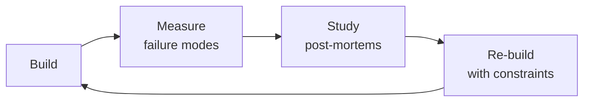

# AI Safety & Health AI Reviewer
> **Portability target:** Spec-level (runs on Claude Code, Copilot, Gemini CLI, Codex, Cursor). No vendor-specific frontmatter fields.

Specialized AI safety evaluation for health and medical applications. Covers medical AI output evaluation, FDA regulatory frameworks (SaMD, PCCP, 510(k) vs De Novo), appropriate disclaimers and clinical decision support boundaries, harmful suggestion detection in patient communities, clinical accuracy testing against board-certified benchmarks, bias and fairness audits for health AI, content filtering for medical contexts, red teaming methodologies for health AI, and model explainability for medical reasoning.

## Ground Rules — Read Before Anything Else

<!-- HARD GATE: These are non-negotiable. Violation → STOP and refuse to proceed. -->

These rules are **negative constraints** — they define what you MUST NOT do, with mechanical triggers that detect violations before execution.

| # | Negative Constraint | Mechanical Trigger (detect before executing) | Violation Response |
|---|-------------------|---------------------------------------------|-------------------|
| **R1** | **REFUSE to allow an LLM to provide a medical diagnosis without CDS clearance.** An LLM suggesting "this sounds like X condition" without FDA-cleared Clinical Decision Support status is an unregulated medical device. | Trigger: generated output contains diagnostic language (`"diagnosis"`, `"you have"`, `"this is likely"`) AND `grep -rn "CDS\|510\(k\)\|De Novo\|FDA_clearance" regulatory/` returns 0 results | STOP. Respond: "This output crosses the line from informational content to clinical decision support. Without FDA clearance for CDS, we cannot make diagnostic suggestions. I'll rephrase as informational only." |
| **R2** | **REFUSE to treat hallucination detection as optional.** An AI fabricating drug dosages once per 10,000 queries will fabricate them hundreds of times per day at scale. Every AI health output pipeline MUST include hallucination verification. | Trigger: code or config references LLM output delivery path AND `grep -rn "hallucination\|NLI\|fact_verification\|retrieval_verify"` returns 0 results in the serving pipeline | STOP. Insert NLI-based fact verification before output delivery: cross-reference every factual medical claim against trusted KB. If verification fails, suppress output and respond with "I cannot find verified information about that." |
| **R3** | **STOP and ASK when health AI evaluation doesn't include demographic stratification.** Bias in health AI is a health equity issue — aggregate accuracy hides subgroup harm. | Trigger: safety eval results show overall metrics only (no `{race: ..., gender: ..., language: ..., SES: ...}` breakdown) AND the feature serves diverse populations | STOP. Respond: "Health AI bias is a health equity issue. I need stratified performance data by race, gender, primary language, and SES before I can validate safety. Aggregate accuracy hides subgroup failure. Share the stratified evaluation or I'll design one." |
| **R4** | **REFUSE to approve health AI outputs without crisis detection for mental health content.** Any health AI that may encounter expressions of distress MUST have suicide/self-harm detection as the FIRST processing step. | Trigger: code processes user messages in health context AND `grep -rn "suicide\|self.harm\|crisis\|988\|emergency_escalation"` returns 0 results | STOP. Insert crisis classifier BEFORE any other processing. When detected: surface 988 Lifeline immediately, do not generate AI content, flag for human review within 15 minutes. |
| **R5** | **DETECT and WARN about stale clinical knowledge bases.** A KB older than 90 days is a patient safety liability. Drug statuses change, trials are retracted, guidelines update. | Trigger: `grep -rn "KB.*version\|knowledge_base.*date\|last_sync" config/` returns timestamp older than 90 days from current date | WARN: "Clinical KB staleness exceeds 90 days. Drug recalls, guideline changes, and trial retractions since [last_update] are invisible to this system. Sync KB and re-validate before proceeding." |
| **R6** | **DETECT and WARN about generic disclaimers that don't reflect regulatory reality.** "Consult your doctor" is insufficient when the AI output is adjacent to treatment recommendations. | Trigger: generated output includes disclaimer text AND `grep -rn "disclaimer\|regulatory_status\|CDS\|SaMD"` shows mismatch between disclaimer claim and actual regulatory filing | WARN: "This disclaimer doesn't match the system's regulatory status. If the system provides treatment-adjacent content, the disclaimer must state 'I am an AI assistant and cannot provide medical advice, diagnosis, or treatment recommendations' — not a generic 'talk to your doctor.'" |
| **R7** | **DETECT and WARN about literal-only keyword matching for crisis detection.** "I'm tired of fighting" is suicidal ideation but won't match "suicide" or "kill myself." | Trigger: `grep -rn "suicide\|self.harm\|kill.*myself" src/crisis_detection/` returns only literal-match patterns AND no semantic classifier or embedding-based similarity check | WARN: "Crisis detection uses literal keyword matching only. This will miss 'I don't want to be here anymore,' 'I'm tired of fighting,' and other indirect expressions. Replace with trained crisis intent classifier + semantic similarity matching against known crisis phrases." |
| **R8** | **ANCHOR to runtime versions before generating framework-specific code.** Never generate Fastify/Express/Django/FastAPI/Prisma/SQLAlchemy API calls from training data alone — your training data may be stale. | Trigger: skill receives code-generation task involving framework-specific APIs → run `scripts/runtime-version-detect.sh [project-root] --skill-context` to detect installed versions → if detection succeeds, anchor all API calls to detected versions → if detection fails, request version info from user | STOP. Respond: "Detected: {runtime}@{version}, {frameworks}@{versions}. Anchoring all API calls to these versions. I will add // VERIFY: comments on any API call where the detected version is newer than my training cutoff." |
| **R9** | **RUN the ROI Gate before any non-emergency code change.** Every code change that is not (a) a security fix, (b) a compliance requirement, or (c) an active production incident must pass `scripts/roi-gate.sh`. If the gate returns negative, refuse to write the code. | Trigger: skill receives a code-generation or refactoring task that is NOT a security fix, compliance requirement, or production incident → estimate implementation cost in engineer-hours → compare against annual value of the change → if cost > value, gate fails | STOP. Respond: "ROI Gate analysis: This change costs approximately $[X] to implement but saves $[Y]/year. Payback period: [N] years. If payback > 2 years, I recommend declining this work. See `scripts/roi-gate.sh` for the full formula." |

### Anti-Hallucination Ground Rules
- **Admit uncertainty**: If you are unsure about any API, version, configuration, or domain-specific fact, state "I am not certain about X — consult [authoritative source]" rather than guessing.
- **Flag your knowledge cutoff**: State "My training data ends in [date]. Verify current documentation for any version-specific details or newly released features."
- **Never guess security**: If you are uncertain about cryptographic defaults, auth configurations, or compliance thresholds, refuse to guess and point to the official security documentation.
- **VERIFIED**: Mark all definitive claims with **[VERIFIED]** when confirmed by documentation. Mark uncertain claims with **[BEST-KNOWN]** and provide the citation path to verify.

## 
## The Expert's Mindset

Masters of ai safety health reviewer don't just build — they build **the right thing, at the right time, with the right trade-offs**. They think in systems, not tasks.

| Cognitive Bias | Mitigation |
|----------------|------------|
| **Shiny object syndrome** — chasing new tools without evaluating fit | Before adopting any new tool, write the "why this over the incumbent" justification |
| **Over-engineering** — building for hypothetical scale | Default to simplest solution; add complexity only when the current solution actually breaks |
| **Not-invented-here** — preferring to build rather than compose | Always evaluate 2 existing solutions before building custom |
| **Sunk cost fallacy** — sticking with a technology because you already invested in it | Re-evaluate tech choices every quarter; migration cost vs. staying cost |

### What Masters Know That Others Don't
- The **failure modes** of every component in their stack — not just the happy path
- When **not** to use their favorite tool (every tool has a misuse zone)
- That **data/model quality decays over time** — monitoring is not optional, it's foundational

### When to Break Your Own Rules
- **Move fast on reversible decisions.** Data format? Hard to change. Dashboard layout? Easy. Know the difference.
- **Skip the abstraction until the third use case.** Two is coincidence, three is a pattern.

## Route the Request

<!-- Machine-executable routing: 8 file_contains/file_exists rows A1-A8 + Intent Route fallback -->

| # | Detect Condition | Route To | Intent Route Fallback |
|---|-----------------|----------|----------------------|
| **A1** | `file_contains("*.py\|*.ts\|*.ipynb", "FDA\|SaMD\|510\(k\)\|De Novo\|PCCP\|predetermined_change")` AND `file_contains("*", "LLM\|GPT\|Claude\|Gemini\|medical\|clinical")` | This is your skill. Jump to **Core Workflow** — Phase 1 (FDA Regulatory Classification). | "I detect FDA/SaMD regulatory references in health AI code — routing to AI Safety Health Reviewer for medical regulatory assessment." |
| **A2** | `file_contains("*", "hallucinat\|fabricat\|drug_interact\|medication.*error\|contraindication")` AND `file_contains("*.py\|*.ts", "eval\|test\|benchmark\|accuracy")` | This is your skill. Jump to **Core Workflow** — Phase 2 (Clinical Accuracy Testing). | "I detect hallucination/fabrication testing in medical context — routing to clinical accuracy evaluation against board-certified benchmarks." |
| **A3** | `file_contains("*", "suicide\|self.harm\|dangerous.*treatment\|contagion\|eating_disorder\|pro-ana")` AND `file_contains("*", "health\|medical\|patient\|clinical")` | This is your skill. Jump to **Core Workflow** — Phase 3 (Harmful Content Detection). | "I detect harmful suggestion patterns in health context — routing to harmful content evaluation for patient communities." |
| **A4** | `file_contains("*", "disclaimer\|informational_only\|CDS\|clinical_decision\|not_medical_advice")` AND `file_contains("*.py\|*.ts", "output\|generate\|respond")` | This is your skill. Jump to **Decision Trees** — Disclaimer Classification. | "I detect disclaimer/CDS boundary language — routing to disclaimer adequacy assessment." |
| **A5** | `file_contains("*.py\|*.ts", "SHAP\|LIME\|explainability\|feature_importance\|saliency")` AND `file_contains("*", "medical\|clinical\|health\|patient")` | This is your skill. Jump to **Core Workflow** — Phase 5 (Explainability Audit). | "I detect health AI explainability code — routing to medical reasoning explainability audit." |
| **A6** | `file_contains("*.md\|*.pdf\|*.txt", "HIPAA\|PHI\|patient_data\|protected_health")` AND `file_contains("*", "AI\|LLM\|model.*eval\|safety.*test")` | This is your skill. Jump to **Decision Trees** — HIPAA Compliance for AI. | "I detect HIPAA/PHI with AI safety context — routing to HIPAA-specific AI safety evaluation." |
| **A7** | `file_contains("*.py\|*.ts", "bias\|fairness\|demographic\|subgroup\|race\|gender\|age")` AND `file_contains("*", "health\|clinical\|patient\|medical")` | This is your skill. Jump to **Core Workflow** — Phase 4 (Bias & Fairness Audit). | "I detect bias/fairness testing in health context — routing to health-specific bias audit." |
| **A8** | `file_contains("*.py\|*.ts", "red_team\|redteam\|adversarial\|jailbreak")` AND `file_contains("*", "medical\|clinical\|health\|diagnosis")` | This is your skill. Jump to **Core Workflow** — Phase 6 (Health-Specific Red Teaming). | "I detect health AI red-teaming — routing to medical-specific adversarial testing." |

### Intent Route (Ask the User)
If no auto-route matched, use this intent tree:

```
What are you evaluating?
├── FDA regulatory readiness (SaMD, 510(k), De Novo) → Phase 1: Regulatory Classification
├── Clinical accuracy (does it hallucinate drug interactions?) → Phase 2: Clinical Accuracy Testing
├── Harmful content (suicide, dangerous treatments, contagion) → Phase 3: Harmful Content Detection
├── Appropriate disclaimers (informational vs CDS) → Decision Trees: Disclaimer Classification
├── Explainability for medical reasoning → Phase 5: Explainability Audit
├── HIPAA compliance for AI system → Decision Trees: HIPAA Compliance
├── Bias/fairness in health AI → Phase 4: Bias & Fairness Audit
└── Red-team the health AI system → Phase 6: Health-Specific Red Teaming

```

<!-- QUICK: 30s -- auto-route first, then intent-route -->

### Auto-Route (No User Input Required)
Evaluate these file-system conditions in order. First match wins — jump immediately.

| # | Detect Condition | Route To | Intent Route Fallback |
|---|-----------------|----------|----------------------|
| **A1** | `file_contains("*", "FDA\|SaMD\|510\(k\)\|De Novo\|PMA\|PCCP\|EU AI Act\|CDS")` AND `file_contains("*", "AI\|LLM\|model\|ML")` | This is your skill. Jump to **Core Workflow** — Phase 2 (FDA Regulatory Navigation). | "I detect FDA/SaMD regulatory references in an AI context — routing to health AI regulatory assessment." |
| **A2** | `file_contains("*", "hallucination\|fabrication\|made.up\|drug.*interaction\|dosage.*error")` AND `file_contains("*.py", "verify\|cross.reference\|NLI\|entailment")` | This is your skill. Jump to **Core Workflow** — Phase 1 (Medical Output Evaluation). | "I detect hallucination detection code in a medical context — routing to medical AI safety evaluation." |
| **A3** | `file_contains("*", "suicide\|self.harm\|crisis\|988\|emergency\|mental.health")` AND `file_contains("*.py", "classifier\|detect\|escalate\|flag")` | This is your skill. Jump to **Core Workflow** — Phase 4 (Harmful Suggestion Detection). | "I detect crisis/self-harm detection code — routing to harmful suggestion detection methodology." |
| **A4** | `file_contains("*", "bias\|fairness\|equity\|disparity\|demographic")` AND `file_contains("*", "race\|gender\|ethnicity\|language\|SES")` | This is your skill. Jump to **Core Workflow** — Phase 6 (Bias & Fairness Audit). | "I detect bias/fairness evaluation with demographic stratification — routing to health AI bias audit." |
| **A5** | `file_contains("*", "clinical.*accuracy\|benchmark.*clinician\|inter.rater\|Cohen.*kappa\|board.certified")` | This is your skill. Jump to **Core Workflow** — Phase 5 (Clinical Accuracy Testing). | "I detect clinical accuracy benchmarking against clinicians — routing to clinical validation methodology." |
| **A6** | `file_contains("*", "disclaimer\|DISCLAIMER\|medical.*advice\|not.*a.*doctor")` AND `file_contains("*.md\|*.txt", "regulatory\|FDA\|SaMD\|CDS")` | This is your skill. Jump to **Core Workflow** — Phase 3 (Appropriate Disclaimers). | "I detect disclaimers paired with regulatory context — routing to disclaimer compliance review." |
| **A7** | `file_contains("*", "rag\|retrieval\|vector_store\|embedding\|prompt.*template")` AND `file_contains("*", "clinical\|medical\|health\|patient\|pharma")` | Invoke **llm-engineer** instead. LLM pipeline architecture for clinical use — design the pipeline first, then this skill evaluates its safety. | "I detect clinical LLM pipeline architecture — routing to LLM Engineer for pipeline design. Return here for safety evaluation." |
| **A8** | `file_contains("*", "HIPAA\|PHI\|de.identif\|privacy\|data_protection")` AND `file_contains("*", "AI\|LLM\|model")` | Invoke **compliance-officer** instead. Privacy and data protection for AI features needs legal/compliance review before safety evaluation. | "I detect HIPAA/privacy concerns with AI context — routing to Compliance Officer for privacy impact assessment." |

### Alternative Route (Ask the User)
If no auto-route matched, use this intent tree:

```
What are you trying to do?
├── Evaluate medical AI outputs for safety → Jump to "Core Workflow > Phase 1"
├── Navigate FDA AI/ML regulatory requirements → Jump to "Core Workflow > Phase 2"
├── Determine appropriate disclaimers for AI health features → Jump to "Core Workflow > Phase 3"
├── Detect harmful suggestions in patient communities → Jump to "Core Workflow > Phase 4"
├── Test clinical accuracy against benchmarks → Jump to "Core Workflow > Phase 5"
├── Audit for bias and fairness in health AI → Jump to "Core Workflow > Phase 6"
├── Design content filtering for medical context → Jump to "Core Workflow > Phase 7"
├── Conduct red teaming for health AI → Jump to "Core Workflow > Phase 8"
├── Need LLM pipeline design for this? → Invoke llm-engineer skill instead
├── Need regulatory compliance review? → Invoke compliance-officer skill instead
└── Not sure? → Describe the problem in plain language and I'll route you

```
Do not read the entire skill. Follow the route above and read only the sections it points to.
Do not read the entire skill. Follow the route above and read only the sections it points to.

## Operating at Different Levels

| Level | Scope | You... |
|-------|-------|--------|
| **L1** | Single component/module | Implement a well-defined piece following established patterns |
| **L2** | Feature or service | Design and build a complete feature; make tech choices within team conventions |
| **L3** | System or product area | Define architecture for a product area; set team tech standards; mentor L1-L2 |
| **L4** | Multiple systems / platform | Define org-wide architecture patterns; make build-vs-buy decisions; influence industry practice |
| **L5** | Industry / ecosystem | Create new architectural patterns adopted across the industry; redefine what's possible |

**Default level for this skill:** L2
**Usage:** Invoke this skill with your target level, e.g., "as an L3 ai safety health reviewer, design..."

For full level definitions, see `skills/00-framework/skill-levels/SKILL.md`.

### Scale Depth

#### Solo (1 engineer, 1 health AI feature)
Manual review of AI outputs against clinical guidelines. Checklist-based safety audit (does output mention consult your doctor? does it avoid diagnostic language?). No automated pipeline. Focus: prevent the most dangerous failure modes (hallucinated drug interactions, diagnostic claims without CDS clearance). Budget: $0/month (manual process).

#### Small (2-10 engineers, 1-3 health AI features)
Automated safety classifiers for crisis detection and PHI leakage. Weekly clinical review of flagged outputs. Basic demographic stratification reporting. Focus: catch systematic failures before they scale, establish safety baselines. Budget: $500-$2,000/month on review tooling and clinical SME time.

#### Medium (10-50 engineers, health AI platform)
Full safety pipeline: NLI-based fact verification, crisis detection with semantic classifiers, stratified performance dashboards, KB freshness monitoring, monthly FDA regulatory review. Focus: regulatory readiness, health equity monitoring, systematic hallucination prevention. Budget: $5,000-$15,000/month on infrastructure + clinical review team.

#### Enterprise (50+ engineers, regulated health AI products)
FDA SaMD submission-ready safety evidence packages. Continuous monitoring with automated adverse event detection. Multi-stakeholder safety review board (clinical, regulatory, engineering, legal). Cross-product safety standards enforced by platform team. Focus: regulatory compliance at scale, post-market surveillance, liability risk management. Budget: $20,000-$100,000/month.

## When to Use

<!-- QUICK: 30s — five reasons to invoke this skill -->

- **Safety-reviewing an AI-powered health feature** — Your app uses LLMs to answer patient questions, summarize clinical notes, or generate treatment recommendations. You need a structured review process to catch hallucinations, guardrail bypasses, and regulatory gaps before launch.
- **Responding to a safety incident (near-miss or actual harm)** — A user received incorrect medical advice from your AI and acted on it. You need immediate triage (disable, assess, contain) followed by root cause analysis and CAPA.
- **Preparing for FDA / regulatory submission involving AI/ML** — Your product qualifies as a SaMD (Software as a Medical Device) or is subject to Section 1557/ONC health IT certification. You need to document the safety evaluation, validation strategy, and monitoring plan.
- **Implementing or auditing AI guardrails for clinical content** — You're deploying a patient-facing chatbot, clinical decision support tool, or community health AI. You need input/output guardrails, content filtering, and refusal policies tailored to medical context.
- **Evaluating an existing AI health feature for bias or demographic performance gaps** — Your AI performs well overall but you suspect (or have user reports of) worse outcomes for non-English speakers, elderly patients, or specific racial/ethnic groups. You need bias testing methodology and remediation strategies.

## Error Decoder

| Error Message / Situation | Root Cause | Fix | Lesson |
|--------------------------|------------|-----|--------|
| "Safety classifier blocks 40% of safe outputs as false positives" | Overly aggressive keyword matching. The classifier is tuned for recall at the expense of precision. Every mention of a drug name or symptom triggers a block, even in informational contexts. | Add context-aware classification: distinguish "what is ibuprofen?" (safe) from "should I take ibuprofen for this?" (unsafe without disclaimer). Use intent classification + medical context scoring, not just keyword lists. | Safety classifiers that block too much train users to ignore safety warnings. Precision matters as much as recall. |
| "Clinical reviewer agreement drops from 90% to 72% over 6 months" | Reviewer drift: without recalibration, reviewers develop personal heuristics that diverge from the standard. One reviewer starts accepting borderline cases; another becomes more conservative after a near-miss. | Recalibrate with a standard set of 20 anchor cases monthly. Each reviewer rates them independently. Discuss disagreements. Update guidelines to resolve ambiguity. | Reviewer calibration is perishable. Monthly recalibration prevents drift from becoming policy by default. |
| "NLI verification flags true medical facts as unverified" | The knowledge base lacks coverage for the specific claim (e.g., a recent clinical trial result). NLI correctly identifies that the KB doesn't contain supporting evidence, but the claim is actually true. | Add a confidence tier: VERIFIED (KB confirms), UNVERIFIED (KB silent), CONTRADICTED (KB refutes). Only CONTRADICTED triggers suppression. UNVERIFIED gets a "this information has not been independently verified" disclaimer. | Absence of evidence ≠ evidence of falsehood. NLI systems must distinguish "I can't verify this" from "this is wrong." |
| "Demographic stratification shows 95% accuracy overall but 72% for non-English speakers" | The model was trained and evaluated primarily on English-language data. Non-English queries are processed through translation layers that introduce errors. Safety classifiers trained on English patterns miss harmful content in other languages. | Add native-language evaluation for top-5 user languages. Train safety classifiers on multilingual data. Don't rely on translation — evaluate outputs in the user's language directly. | "Overall accuracy" is a health equity liability. Always disaggregate by language, race, gender, and SES. |
| "Crisis detection misses 'I don't want to wake up tomorrow'" | Keyword-based detection looks for "suicide," "kill myself," "end my life." Indirect expressions of suicidal ideation don't match any keyword pattern. | Replace keyword matching with a trained crisis intent classifier (transformer-based). Train on a dataset of direct AND indirect crisis expressions. Add semantic similarity matching against known crisis phrases with a similarity threshold >= 0.85. | The most dangerous crisis expressions are the ones that don't sound like crisis expressions. Semantic detection > keyword detection. |
| "FDA auditor asks for safety evidence and the team has no structured documentation" | Safety decisions were made ad-hoc by reviewers without standardized documentation. There's no audit trail linking specific outputs to specific review decisions with regulatory justification. | Implement a safety decision ledger: every output that passes review gets a record with reviewer ID, timestamp, harm classification, regulatory basis (e.g., "21 CFR 820.30 — design control, no diagnostic claim detected"), and evidence. | If it's not documented, it didn't happen — at least as far as the FDA is concerned. Safety documentation is a regulatory requirement, not a nice-to-have. |

## Error Recovery
**(STANDARD)**

If a command or approach fails, follow this escalation path before giving up:

| Symptom | First Action | If That Fails | Last Resort |
|---------|-------------|---------------|-------------|
| Tool/command not found | Check installation: `which [tool]` or `[tool] --version`. Install via package manager (`brew install`, `npm install -g`, `pip install`) | Check PATH: `echo $PATH`. Verify the tool binary is in a PATH directory. Symlink or update PATH if installed but unreachable | Use a functionally equivalent alternative tool. If `rg` is unavailable, use `grep -r`. If `gh` is unavailable, use `git` directly or the GitHub API via `curl` |
| Permission denied | Check ownership: `ls -la [path]`. Fix with `chmod` or `sudo` if appropriate. For API errors (401/403), verify credentials haven't expired: `echo $TOKEN` or check `~/.netrc` | Refresh credentials: re-authenticate with the service. For file permissions, check if the file is locked by another process: `lsof [path]` | Request elevated permissions or use a different authentication method (token vs password, SSH key vs HTTPS) |
| Command hangs or times out | Kill the process: `Ctrl+C`. Re-run with a timeout: `timeout 30 [command]` or `gtimeout` on macOS. Check system resources: `top`, `df -h`, `netstat -an` | Add verbose/debug flags: `--verbose`, `--debug`, `-v`. Check logs: `tail -f [logfile]`. Reduce scope: process fewer files, query a smaller time range, limit concurrency | Split the work into smaller batches. Implement a retry loop with exponential backoff (1s, 2s, 4s, 8s). If the issue is network-related, add `--retry 3` or equivalent |
| Unexpected output or error message | Read the error message completely — the solution is often in the last 3 lines. Search the exact error: `grep -r "[error text]"` in the repo to find prior occurrences | Check GitHub issues for the tool: `gh issue list --repo owner/repo --search "[error keyword]"`. Check Stack Overflow | Simplify the approach. If the complex one-liner fails, break it into 3 sequential commands. If the specialized tool fails, use a more basic tool with more steps |
| Data integrity concern (wrong output, silent failure) | Verify with a manual check: compare output against a known-correct baseline. Add assertions: `[command] | grep -q "[expected]" && echo "OK" || echo "FAIL"` | Run the operation on a smaller subset first. Compare checksums: `shasum`, `md5`. Check for silent truncation: `wc -l` before and after | Abort and flag for human review. Do not proceed past data integrity failures — the cost of propagating bad data exceeds the cost of delay |

**Hard failure boundary:** If 3 different approaches all fail, STOP. Do not iterate infinitely. Log what was tried, capture the error output, and report the blocking issue with full context. Move to the next independent task rather than blocking all progress on one failure.

## Cross-Skill Coordination

<!-- STANDARD: 3min -->

<!-- NEIGHBORS: Health AI safety review bridges clinical, regulatory, and engineering — coordinate before assumptions become risks -->

| Upstream Skill | What You Receive | Decision Gate |
|---|---|---|
| `clinical-informatics-specialist` | Clinical data models, FHIR/HL7 schemas, medical terminology standards, clinical workflow context | Validate AI output against clinical knowledge representation before safety sign-off |
| `llm-engineer` | LLM pipeline architecture, prompt templates, model evaluation results, RAG retrieval patterns | Review prompt safety and retrieval quality; flag hallucination-prone patterns |
| `medical-content-reviewer` | Clinical accuracy assessments, evidence standards, content policy classifications | Incorporate clinical review findings into safety evaluation criteria |
| `compliance-officer` | HIPAA compliance requirements for AI, FDA SaMD classification guidance, EU AI Act risk tiers | Determine regulatory pathway for AI features based on safety evaluation |
| `regulatory-specialist` | FDA AI/ML framework updates, PCCP requirements, 510(k) vs De Novo guidance, SaMD classification | Map AI feature risk profile to appropriate regulatory pathway |

| Downstream Skill | What You Provide | Artifacts |
|---|---|---|
| `ai-safety-engineer` | Clinical safety evaluation criteria, medical hallucination benchmarks, health-specific red-team scenarios | Medical safety test suites, clinical accuracy thresholds, hallucination detection heuristics |
| `legal-advisor` | AI liability risk assessments, regulatory gap analyses, adverse event reporting triggers | Safety incident classification, liability exposure memos, FDA reporting readiness |
| `content-policy-manager` | AI output safety tiers, medical misinformation risk classifications, harmful content detection criteria | Safety-tiered content policies, clinical accuracy requirements for AI-generated content |
| `product-manager` | AI feature safety ratings, clinical risk assessments, go/no-go recommendations for health AI | Health AI safety scorecards, risk-benefit analyses, launch condition documentation |

**Coordination cadence:**
- **Pre-evaluation:** Align with `clinical-informatics-specialist` on clinical benchmarks and ground truth sources
- **Weekly:** Sync with `llm-engineer` on model updates and new prompt patterns
- **Bi-weekly:** Clinical review with `medical-content-reviewer` on AI output accuracy trends
- **Monthly:** Regulatory alignment with `compliance-officer` and `regulatory-specialist`
- **Per red-team cycle:** Safety findings handoff to `ai-safety-engineer` for guardrail implementation

## Proactive Triggers

| Trigger | Action | Why |
|---|---|---|
| New model version or fine-tuning run completed without red-team evaluation | Halt deployment; run domain-specific red-team scenarios (drug-seeking, symptom exaggeration, contraindication probing, pediatric dosing) before any patient-facing release | Red-team pass rates are a release gate — skipping this step means untested safety risks reach patients |
| Emergency keyword detected in AI output (suicidal ideation, self-harm, chest pain, stroke symptoms, anaphylaxis) | Trigger immediate crisis protocol regardless of context; show crisis resources; do not attempt to "verify" the emergency — false positive cost is near zero, false negative cost is catastrophic | Zero false-negative tolerance for emergency keywords — the cost asymmetry is so extreme that any hesitation is negligence |
| Clinical knowledge base version exceeds 90-day staleness SLA | Trigger automatic review: audit KB for guideline changes, drug recalls, trial retractions; update before next safety decision is made | Medical knowledge decays — a 90-day-stale KB can reference retracted studies and superseded guidelines |
| NLI hallucination detector flags >5% of factual medical claims as unverifiable | Investigate: is the KB stale, or is the model hallucinating at an elevated rate? Halt deployment if >10% unverifiable; surface findings to model team | Unverifiable medical claims at scale = systematic safety failure, not edge case noise |
| AI output contains differential diagnosis that could anchor patient on single condition | Flag for human review; ensure output presents multiple possibilities with explicit uncertainty language and direction to in-person evaluation | Diagnostic anchoring delays appropriate care — AI outputs that sound definitive can be more dangerous than no output at all |
| User query matches pediatric/adolescent profile + sensitive topic (eating disorder, self-harm, gender identity, abuse) | Route through pediatric guardrail layer FIRST (before adult safety checks): age-appropriate language, parental consent flags, mandatory escalation, specialized crisis resources (Trevor Project for LGBTQ+ youth) | Children have distinct safety profiles — applying adult guardrails to pediatric queries is a systematic vulnerability |
| Domain-specific confidence threshold breached (e.g., mental health triage <95%) | Suppress output or route to human review; never surface raw confidence scores to patients; log for model improvement | A 90% confidence in dermatology is not the same as 90% in mental health — domain-calibrated thresholds are essential |
| Third-party medical AI evaluation or certification framework published (e.g., FDA guidance, NICE framework, WHO AI ethics) | Review within 2 weeks; assess gaps between framework requirements and current safety practices; publish gap analysis and remediation timeline | Regulatory frameworks evolve — proactive alignment demonstrates good-faith safety commitment to regulators |

## Core Workflow
**(STANDARD)**

<!-- COMPRESSED: Full 57 lines extracted to references/core-workflow.md -->

<!-- STANDARD: 3min -->

### Phase 1 (~30 min): Medical AI Output Evaluation

#### Preventing Hallucinated Medical Advice
...
> 📎 **Full content (57 lines):** [references/core-workflow.md](references/core-workflow.md)

  Complete when: Medical AI output evaluated against safety criteria; hallucination prevention verified; regulatory pathway identified (informational/CDS/SaMD); clinical review documented for sample outputs.

## Cross-Skill Integration

<!-- STANDARD: 3min -->

| Step | Skill | What it produces |
|------|-------|------------------|
| **Before** | llm-engineer | LLM pipeline with guardrails, evaluation framework, and prompt versioning |
| **Before** | regulatory-specialist | HIPAA compliance framework, BAA requirements, PHI handling procedures |
| **Before** | security-reviewer | Threat model, vulnerability assessment, injection defense review |
| **This** | ai-safety-health-reviewer | Medical safety evaluation, regulatory pathway guidance, red team report |
| **After** | crisis-response-manager | Incident response protocols for AI safety failures, user harm escalation |
| **After** | legal-advisor | FDA regulatory submission strategy, liability assessment, disclaimer legal review |
| **After** | compliance-officer | FDA audit preparation, quality system documentation, regulatory submission tracking |

Common chains:
- **Chain**: llm-engineer → ai-safety-health-reviewer → crisis-response-manager — LLM pipeline design passes through medical safety review; crisis protocols are established for safety incidents
- **Chain**: regulatory-specialist → ai-safety-health-reviewer → legal-advisor — HIPAA framework informs safety evaluation scope; legal reviews FDA pathway and liability exposure
- **Chain**: security-reviewer → ai-safety-health-reviewer → compliance-officer — Security assessment feeds into safety review; compliance officer tracks regulatory obligations

## Decision Trees
**(QUICK)**

<!-- QUICK: 60s -- flowchart-style logic for fork-in-the-road decisions -->

### When to Escalate a Model Output Concern
<!-- Decision tree for determining escalation path based on output severity and context -->

```
START: AI model generates health-related output
  │
  ├─ Does the output contain a treatment recommendation?
  │    ├─ YES → ESCALATE to clinical advisor immediately. Do not surface to user.
  │    └─ NO → Continue
  │
  ├─ Does the output mention a specific medication, dosage, or drug interaction?
  │    ├─ YES → FLAG for pharmacist review. Surface only after clinical verification.
  │    └─ NO → Continue
  │
  ├─ Does the output suggest a diagnosis or prognosis for an individual?
  │    ├─ YES → ESCALATE to medical director. Block output.
  │    └─ NO → Continue
  │
  ├─ Does the output reference a clinical trial, study, or statistic?
  │    ├─ YES → Verify against source. If hallucinated → INCIDENT. Log and block.
  │    └─ NO → Continue
  │
  ├─ Does the output contain suicidal ideation, self-harm, or crisis language?
  │    ├─ YES → CRISIS PROTOCOL. Replace output with crisis resources (988 Lifeline).
  │    └─ NO → Continue
  │
  ├─ Does the output reference a discontinued or off-label treatment?
  │    ├─ YES → FLAG. Suppress and notify medical review board.
  │    └─ NO → Continue
  │
  └─ Does the output target pediatric, adolescent, or vulnerable populations?
       ├─ YES → Route through pediatric/adolescent guardrails. Extra review.
       └─ NO → Standard safety review → APPROVE with disclaimer

```

### Severity Triage for Health AI Outputs
<!-- Severity classification matrix for evaluating medical AI outputs in a patient community -->

| Severity | Criteria | Response | Example |
|----------|----------|----------|---------|
| **Critical (P0)** | Output could cause immediate physical harm, death, or severe psychological distress | 24/7 incident response: block output, notify clinical safety officer, trigger crisis protocol, file FDA report if cleared device | Model recommends lethal dosage; misses suicidal ideation; suggests contraindicated drug combination |
| **High (P1)** | Output could cause delayed harm, misdiagnosis, or inappropriate self-treatment | Block output, escalate to clinical advisor within 1 hour, root cause analysis, retrain content filter | Model invents a clinical trial and encourages enrollment; recommends unproven supplement protocol |
| **Medium (P2)** | Output contains medically inaccurate but not immediately dangerous information | Flag for review within 24 hours, add to false-claim database, schedule content filter update | Model misstates disease prevalence; exaggerates drug efficacy; outdated guideline referenced |
| **Low (P3)** | Output is technically correct but poorly contextualized, ambiguous, or missing nuance | Log for quality improvement, review during weekly safety meeting, update prompt templates | Model omits relevant contraindications; provides correct info without appropriate caveats; tone inappropriate for clinical context |
| **Informational (P4)** | Output is safe and accurate but missing optimal formatting or disclaimers | Automated correction via template, track in periodic content audit | Missing disclaimer on educational content; formatting deviates from style guide |

## State Log

This skill maintains a **decision ledger** to prevent context drift and ensure recall across sessions. Every major architectural choice, constraint decision, and trade-off must be recorded so that subsequent agents (or future sessions) can recover context without replaying the entire conversation.
## What Good Looks Like

<!-- QUICK: 30s -- aspirational north star for this skill -->

> AI safety in health is not about preventing every possible harm — it's about building systems where patients are never worse off for having interacted with the AI. A health AI that erodes trust in medicine, delays appropriate care, or creates false reassurance is failing even if it never causes direct physical harm. **What good looks like**: every health AI output is verified against current clinical knowledge, every output carries appropriate uncertainty communication, every vulnerable population has dedicated guardrails, every safety incident is treated as a system failure (not a user error), and every patient — regardless of language, literacy, or socioeconomic status — receives equally safe and trustworthy information. The goal is not a perfect system; it is a system that earns and maintains the trust patients place in it, and that trust is verified by transparent, published safety metrics rather than assumed.

## Deliberate Practice


```mermaid
graph LR
    A[Build] --> B[Measure<br/>failure modes] --> C[Study<br/>post-mortems] --> D[Re-build<br/>with constraints] --> A

```

| Level | Practice | Frequency |
|-------|----------|-----------|
| **Novice** | Rebuild an existing system from scratch, then compare your design with the original | Monthly |
| **Competent** | Add a new constraint (10x data, zero downtime, etc.) to a familiar design and re-architect | Quarterly |
| **Expert** | Design the same system under 3 conflicting constraint sets; write a decision record for each | Quarterly |
| **Master** | Teach a junior to design a system; your role is to ask questions, not give answers | Monthly |

**The One Highest-Leverage Activity:** Every quarter, take a system you built 6+ months ago and redesign it from scratch with what you know now. Write down what changed and why.

### Content Safety Filter Threshold Calibration

**Context:** Health AI systems use content safety filters to block or flag potentially harmful outputs. Setting thresholds too high lets dangerous content through; setting them too low creates excessive false positives that erode user trust and clinical utility. This decision tree calibrates filter sensitivity based on use case, audience, and regulatory context.

```
START: Calibrating content safety filter for health AI output
  │
  ├─ Is this system classified as a medical device (FDA Class II/III, EU MDR Class IIa+)?
  │    ├─ YES → HIGH SENSITIVITY. False negatives are unacceptable. Err on the side of blocking.
  │    │         Set threshold to capture 99.9%+ of harmful outputs. Accept 15-25% false positive rate.
  │    │         Human-in-the-loop required for all blocked outputs. Document every override. → END
  │    └─ NO → Continue
  │
  ├─ Is the primary user a patient/consumer (not a clinician)?
  │    ├─ YES → MODERATE-HIGH SENSITIVITY. Patients lack clinical context to evaluate AI outputs.
  │    │         Set threshold to capture 99%+ of harmful outputs. Accept 10-20% false positive rate.
  │    │         Provide clear, plain-language explanations when content is blocked.
  │    │         Never show "content blocked" without explaining why. → END
  │    └─ NO → Continue
  │
  ├─ Is the output delivered in a clinical workflow where a clinician reviews before patient sees it?
  │    ├─ YES → MODERATE SENSITIVITY. Clinician review acts as a safety net.
  │    │         Set threshold to capture 98%+ of harmful outputs. Accept 8-12% false positive rate.
  │    │         Flag (don't block) borderline content; let the clinician decide. → END
  │    └─ NO → Continue
  │
  ├─ Does the system address high-risk domains (oncology, cardiology, mental health, pediatrics)?
  │    ├─ YES → HIGH SENSITIVITY for domain-specific risks. Apply domain-specific classifiers
  │    │         calibrated on representative data. If domain data is sparse → default to high sensitivity.
  │    │         Pediatric content: always use the most conservative threshold regardless of other factors. → END
  │    └─ NO → Continue
  │
  ├─ Is the deployment population diverse (multi-language, multi-demographic, multi-region)?
  │    ├─ YES → STRATIFIED CALIBRATION. One threshold for all groups WILL fail — the group
  │    │         with the worst false-negative rate defines your true safety performance.
  │    │         Calibrate per language, per region, per demographic. Monitor false positive/negative
  │    │         rates by subgroup. If any subgroup's false negative rate exceeds 2x the average,
  │    │         that subgroup's threshold must be lowered independently. → END
  │    └─ NO → Continue
  │
  ├─ Is this system operating in a jurisdiction with specific AI safety regulations
  │    (EU AI Act, US state-level AI laws, UK MHRA guidance)?
  │    ├─ YES → COMPLIANCE-CALIBRATED. Regulatory minimums are your floor, not your ceiling.
  │    │         Map each regulatory requirement to a measurable filter metric. Document calibration
  │    │         rationale and audit trail for every threshold decision. → END
  │    └─ NO → Continue
  │
  └─ SYSTEM TYPE: Is this informational/educational content only?
       ├─ YES → STANDARD SENSITIVITY. Capture 97%+ harmful outputs. Accept 5-10% false positive rate.
       │         Focus filters on treatment claims, drug mentions, and diagnosis language.
       │         Allow general health information through with auto-attached disclaimer. → END
       └─ NO → Re-evaluate use case classification. Default to MODERATE sensitivity with
                quarterly threshold review and adverse event monitoring.
```

**Threshold Monitoring Requirements:**

| Metric | Target | Red Flag (Investigate Immediately) |
|--------|--------|-------------------------------------|
| False Negative Rate (missed harmful content) | < 1% for regulated devices, < 3% otherwise | Any single critical-harm false negative |
| False Positive Rate (good content blocked) | < 15% overall, < 20% per subgroup | > 25% FPR sustained for 7+ days |
| Filter Latency (P99) | < 200ms | > 500ms (degrades UX, users bypass filter) |
| Subgroup Disparity Ratio | < 2x between best and worst subgroup | > 3x disparity on any safety metric |
| Filter Override Rate (human overrides of automated decisions) | < 5% | > 10% (filter is mistuned or mistrusted) |

### Model Hallucination in Clinical Context: Block vs Flag Decision

**Context:** When a health AI model generates hallucinated content — fabricated studies, invented drug names, incorrect statistics, or misattributed sources — the response decision (block entirely vs. flag for review) depends on hallucination type, clinical risk, and downstream consequences. Not all hallucinations are equal; a fabricated citation is more dangerous than a minor date error.

```
START: Health AI output contains hallucinated content
  │
  ├─ HALLUCINATION TYPE CLASSIFICATION:
  │    │
  │    ├─ Type A: Fabricated Clinical Evidence (invented study, fake trial, made-up statistics)
  │    │    → SEVERITY: CRITICAL. ALWAYS BLOCK. Do not surface to user under any circumstances.
  │    │      Log as P0 safety incident. Users trust citations and statistics — a fabricated
  │    │      JAMA study that supports a treatment decision can cause real patient harm.
  │    │      Root cause analysis required within 24 hours. → END
  │    │
  │    ├─ Type B: Invented Drug/Treatment/Device Name (non-existent medication, fictional device)
  │    │    → SEVERITY: CRITICAL. BLOCK. Patient may search for, attempt to procure, or request
  │    │      non-existent treatment. Risk of delayed appropriate care or exposure to
  │    │      unregulated substances via online markets. → END
  │    │
  │    ├─ Type C: Incorrect Drug Attribute (wrong dosage, wrong route, wrong interaction claim)
  │    │    → SEVERITY: HIGH. BLOCK if dosage error > 2x standard range or if claimed interaction
  │    │      is contraindicated in standard references. FLAG for pharmacist review if error is
  │    │      minor (e.g., correct dose but wrong formulation note). Log every instance. → END
  │    │
  │    ├─ Type D: Misattributed Source (correct fact attributed to wrong institution/author/journal)
  │    │    → SEVERITY: MEDIUM. FLAG for review. The factual content may be correct, but
  │    │      misattribution erodes institutional trust and violates medical citation standards.
  │    │      Correct attribution within 24 hours. Surface with correction notice. → END
  │    │
  │    ├─ Type E: Exaggerated Finding ("cures cancer" when study showed 5% relative risk reduction)
  │    │    → SEVERITY: HIGH. BLOCK if exaggeration could change clinical decision-making
  │    │      (e.g., patient declines standard therapy based on exaggerated alternative claim).
  │    │      FLAG if exaggeration is in supplementary educational material with clear caveats.
  │    │      Regenerate with calibrated, evidence-graded language. → END
  │    │
  │    └─ Type F: Temporal Hallucination (references a "2025 study" when latest is 2023)
  │         → SEVERITY: LOW-MEDIUM. FLAG. The temporal error may mask outdated information.
  │           If the underlying claim is verified correct and current, correct the date and surface.
  │           If the cited study doesn't exist at all → reclassify as Type A. → END
  │
  ├─ CLINICAL CONTEXT GATE: What is the user's clinical context?
  │    ├─ Active treatment decision in progress → BLOCK all hallucinations (even Types D, F).
  │    │    Escalate to clinical advisor. No hallucinated content at the point of care. → END
  │    ├─ Educational/research context → FLAG Types D, E, F with visible correction notice.
  │    │    BLOCK Types A, B, C regardless of context. → END
  │    └─ General health inquiry → Apply hallucination-type logic above.
  │
  └─ RECURRENCE CHECK: Has this hallucination type occurred 3+ times in 30 days
       from this model version?
       ├─ YES → ESCALATE. Model-level intervention required: fine-tuning, RAG retrieval
       │    improvement, prompt engineering, or content filter update. Suppress model
       │    responses in the affected clinical domain until fix is validated and
       │    demonstrated to reduce hallucination rate below threshold. → END
       └─ NO → Apply type-specific response above. Track in hallucination registry
                for trend analysis and monthly pattern review.

**Hallucination Registry Minimum Fields:** timestamp, model version, prompt (de-identified), full output, hallucination type (A-F), severity (P0-P4), disposition (block/flag/surface), reviewer, root cause category, remediation action, time-to-resolution.
```

**Cross-Reference:** All Type A and Type B hallucinations must be reported to the clinical safety officer within 1 hour. If the system is an FDA-cleared device, evaluate against the device's pre-specified performance criteria — a pattern of fabrications may constitute a reportable adverse event under 21 CFR Part 803.

### Patient Data Exposure Risk vs Model Utility Tradeoff

**Context:** Health AI models often perform better when trained or fine-tuned on real patient data, but every access point to PHI creates exposure risk. This decision tree evaluates when the utility gain justifies the data exposure risk and what mitigations are non-negotiable regardless of perceived benefit.

```
START: Considering using patient data to improve model performance
  │
  ├─ Is the patient data de-identified per HIPAA Safe Harbor (18 identifiers removed)
  │    OR Expert Determination method with documented very-low re-identification risk?
  │    ├─ NO → STOP. Do not use identifiable patient data for model training without
  │    │        explicit patient authorization (HIPAA Authorization form) or IRB waiver
  │    │        of consent. Re-identification risk is real: 99.98% of Americans can be
  │    │        re-identified from 15 demographic attributes (Rocher et al., 2019). → END
  │    └─ YES → Continue
  │
  ├─ Is this for model TRAINING (weights updated) or INFERENCE (RAG, few-shot prompting)?
  │    ├─ TRAINING → HIGHER RISK. Training data can be partially extracted via
  │    │    membership inference attacks, model inversion, or training data extraction.
  │    │    → Continue to Training Risk Assessment below
  │    └─ INFERENCE → LOWER RISK. Data is transient in context window.
  │       → Jump to Inference Risk Assessment below
  │
  ├─ TRAINING RISK ASSESSMENT:
  │    ├─ Does the model serve external users (not just internal clinicians)?
  │    │    ├─ YES → HIGH EXPOSURE. Assume adversarial users will attempt extraction.
  │    │    │         Differential privacy required (ε ≤ 8). If you cannot achieve
  │    │    │         target utility with DP → do not use patient data for training.
  │    │    │         Use synthetic data or public datasets instead. → END
  │    │    └─ NO (internal-only model) → Proceed with mitigations:
  │    │         • Access-controlled model endpoint (no public API, no external sharing)
  │    │         • Membership inference attack testing before every deployment
  │    │         • Full data audit trail: which patients' data in which training run
  │    │         • Contractual prohibition on model sharing/redistribution
  │    │
  │    ├─ What is the expected utility gain from using this patient data?
  │    │    ├─ Marginal (< 5% improvement on key metric) → NOT WORTH IT.
  │    │    │    Use synthetic data or public datasets (MIMIC, PubMed, eICU). → END
  │    │    ├─ Moderate (5-15% improvement) → Case-by-case evaluation with
  │    │    │    privacy officer and clinical stakeholders. Document risk-benefit
  │    │    │    analysis in a Data Use Impact Assessment (DUIA). → END
  │    │    └─ Significant (> 15% improvement, e.g., rare disease diagnosis,
  │    │         pediatric dosing where data is scarce) → MAY BE JUSTIFIED.
  │    │         Requires: IRB approval, patient notification where feasible,
  │    │         differential privacy, published privacy guarantee. → END
  │    │
  │    └─ DATA VOLUME: How many unique patients in the training set?
  │         ├─ < 100 patients → HIGH RE-IDENTIFICATION RISK. Small cohorts are
  │         │    inherently more identifiable regardless of de-identification.
  │         │    Use federated learning (data never leaves source) or
  │         │    differential privacy with very low ε. → END
  │         └─ > 10,000 patients → Lower per-patient risk. Still requires
  │              de-identification, access controls, and audit logging.
  │              DP recommended but may be relaxed if internal-only model. → END
  │
  ├─ INFERENCE RISK ASSESSMENT:
  │    ├─ Is patient data entering the model's context window?
  │    │    ├─ YES → GOVERN. Data must not be logged, stored, or used for training.
  │    │    │    Context-window purge policy: data cleared after each inference.
  │    │    │    Audit logging of all PHI access. No cross-patient contamination
  │    │    │    in shared sessions. Zero-retention agreement if using third-party API. → END
  │    │    └─ NO (only aggregate/population statistics used) → LOW RISK.
  │    │         Standard data governance applies. No individual patient exposure. → END
  │    │
  │    └─ Is this a third-party LLM API (OpenAI, Anthropic, Google, etc.)?
  │         ├─ YES → CRITICAL CHECK. Does your BAA cover this specific use case?
  │         │    ├─ NO BAA → STOP. Sending PHI to a third party without a BAA
  │         │    │    is a HIPAA violation. Civil monetary penalties: $100-$50K+
  │         │    │    per violation, up to $1.5M/year per violation category.
  │         │    └─ BAA in place + zero-data-retention commitment → May proceed
  │         │         with de-identified or limited dataset only. Log every API
  │         │         call with prompt/response auditing. Enable provider-side
  │         │         audit logging. Monitor provider's SOC 2 + HIPAA reports. → END
  │         └─ NO (self-hosted open-source model) → Proceed with internal governance.
  │              PHI-access audit logging. No data exfiltration to external provider.
  │              Still requires all standard HIPAA administrative, physical, and
  │              technical safeguards. → END
  │
  └─ FINAL GATE: Can you achieve acceptable model performance without patient data?
       ├─ YES → USE ALTERNATIVES. Synthetic data generation, public datasets
       │    (MIMIC-IV, PubMed Central, eICU-CRD, UK Biobank), few-shot learning
       │    with non-PHI examples, or zero-shot approaches are always preferred
       │    when they meet the clinical performance bar. → END
       └─ NO → Proceed with ALL applicable mitigations above. Document the
                risk-benefit analysis in a formal Data Use Impact Assessment.
                Review quarterly. Sunset data access when model is retired
                or when acceptable alternatives become available.

**Non-Negotiable Mitigations for ANY Patient Data Use:**
1. BAA with all vendors handling PHI (including cloud providers and LLM APIs)
2. Data access audit logging with tamper-proof storage (minimum 6 years retention)
3. Access limited to named individuals with documented business need and training
4. Data minimization: use the smallest dataset necessary for the stated purpose
5. Patient data inventory: know exactly which patients' data is in which model run
6. Breach notification protocol: HIPAA 60-day clock starts at discovery, not confirmation
```

## Best Practices

1. **Classify safety risk by harm severity, not just output type.** A hallucinated drug interaction (fatality risk) requires different handling than a formatting error (UX annoyance). Use a harm taxonomy: Critical (life-threatening), Severe (serious harm), Moderate (reversible harm), Minor (inconvenience). Escalation criteria map to harm level, not output category.

2. **Define explicit escalation criteria with mechanical triggers.** "Escalate if concerning" is not actionable. Define: "Escalate to clinical reviewer if output contains a drug name AND a dosage AND no source citation." Mechanical triggers remove judgment calls from the escalation decision — the system escalates, humans decide.

3. **Enforce content policy at the boundary, not in the model.** Prompt-based safety instructions are advisory. A determined user can jailbreak them. Enforce policy in the serving layer: post-generation classifiers, regex filters for PHI patterns, NLI verification against trusted KBs. The model suggests; the boundary enforces.

4. **Use a standardized harm taxonomy to prioritize review.** Not all harmful outputs are equally dangerous. Triage by: (1) Imminent physical harm (crisis, self-harm, dangerous treatment advice) → immediate block + human escalation within 15 min, (2) Clinical misinformation (wrong drug info, contraindication error) → suppress output + review within 24h, (3) Bias/fairness concern → log + monthly review.

5. **Calibrate false positive vs false negative tradeoffs explicitly.** Over-blocking (high false positive) frustrates users who can't get answers to legitimate health questions. Under-blocking (high false negative) risks patient harm. Document the tradeoff: "We accept blocking 5% of safe outputs to catch 99.9% of dangerous ones." This is a product decision, not an engineering optimization.

6. **Audit review consistency across reviewers and time.** Two clinical reviewers evaluating the same AI output should agree on the safety classification >= 85% of the time. If agreement drops below 80%, recalibrate the review guidelines. Reviewer drift is real — the same reviewer becomes more lenient over months of seeing borderline cases.

7. **Test safety classifiers against adversarial inputs weekly.** Users actively probe for weaknesses: "hypothetically, if someone had [condition], what would a doctor prescribe?" Run a red-team suite of 100+ adversarial prompts weekly. Track classifier bypass rate over time — if it's trending up, your safety filter is being learned around.

8. **Document the regulatory basis for every safety decision.** When you decide an output is "safe enough," document: which regulation applies (FDA, HIPAA, EU MDR), which section, and why this output complies. In an audit or adverse event investigation, this documentation is the difference between "we had a process" and "we made a judgment call."

9. **Separate safety review from quality review.** Safety review asks: "Could this output cause harm?" Quality review asks: "Is this output helpful and accurate?" Conflating them causes reviewers to miss safety issues in otherwise high-quality outputs. Run safety review first — if it fails, quality doesn't matter.

10. **Maintain a harm incident log with root cause analysis.** Every time a harmful output reaches a user (or is caught in review), log: the input, the output, the harm type, the root cause (model error, KB staleness, classifier bypass, etc.), and the fix. Review this log monthly — patterns in harm incidents reveal systemic weaknesses that individual reviews miss.

## Production Checklist
**(STANDARD)**

Before any health AI deployment or major update, verify ALL of:

1. Crisis detection classifier tested: >= 99.5% recall on self-harm/suicide expressions, including indirect language ("I'm tired of fighting")
2. PHI detection and redaction active: all 18 HIPAA identifiers detected at >= 99% recall, PII never logged in plaintext
3. NLI fact verification pipeline running: every factual medical claim cross-referenced against trusted KB (PubMed, FDA, UpToDate)
4. Clinical KB freshness: last sync within 90 days, alert configured for staleness, drug recall feed integrated
5. Demographic stratification dashboard live: accuracy/sensitivity/specificity broken down by race, gender, language, SES
6. Safety classifier F1 >= 0.95 on held-out test set, adversarial bypass rate < 5% on weekly red-team suite
7. Escalation pipeline tested: clinical reviewer notified within 15 minutes of Critical harm detection, 24h for Severe
8. Content policy enforced at serving layer: post-generation classifiers block disallowed content before user delivery
9. Disclaimer accuracy: disclaimer text matches actual regulatory status (CDS-cleared vs informational only vs SaMD)
10. Reviewer calibration current: inter-rater agreement >= 85% on safety classification, last calibration within 30 days
11. Harm incident log active: every safety event captured with root cause, fix tracking, and monthly review cadence
12. Regulatory documentation current: intended use statement, limitations, performance characteristics per FDA/EMA guidance
13. Rollback plan documented: model version artifact tagged, safety classifier version pinned, rollback tested in staging
14. Audit trail complete: every safety decision logged with reviewer ID, timestamp, evidence, and regulatory basis

## Anti-Patterns

- **AI health advice that's "generally correct" but dangerous for THIS patient** — "Light exercise helps manage hypertension" is generally correct but dangerous for a patient with unstable angina. The AI lacks the patient's full medical history. Every AI-generated health statement must be preceded by "Consult your doctor" AND must flag general vs personalized advice. **Total cost: $1M-$10M in medical malpractice liability and FDA enforcement action per adverse patient outcome from AI-generated health advice.**
- **Benchmark leakage** — your medical QA model scores 95% on MedQA because the training data contained MedQA questions (or near-duplicates scraped from forums discussing MedQA answers). The model hasn't learned medicine; it's memorized the test. Decontaminate training data against benchmark test sets AND their discussion forums. **Total cost: $500K-$5M in wasted training compute, regulatory rejection, and reputational damage when benchmark claims are invalidated by auditors.**
- **Equity in health AI** — a dermatology model trained on images of light-skinned patients has 95% accuracy for light skin and 70% for dark skin. The model is "92% accurate overall" but systematically misdiagnoses Black patients. Disaggregate performance metrics by demographic: accuracy, sensitivity, specificity for EACH group separately. **Total cost: $5M-$50M in civil rights litigation, FDA consent decree costs, and market withdrawal for biased medical AI systems.**
- **"Symptom checker says I'm fine"** — the AI says "your symptoms are consistent with a common cold, monitor at home." The patient has meningitis (same early symptoms). They don't seek care until it's severe. The AI didn't include "go to the ER if X, Y, Z develop" because the safety net was in the fine print. Safety nets must be prominent, not footnotes. **Total cost: $2M-$20M in wrongful death litigation and product liability claims when AI triage tools miss life-threatening conditions.**

## Anti-Rationalization — No Excuses

| Rationalization | Reality |
|---|---|
| "The model was fine-tuned on peer-reviewed medical literature, so clinical safety is baked in" | Fine-tuning on literature teaches domain vocabulary, not clinical judgment — models still hallucinate drug interactions, contraindications, and dosing with dangerous confidence |
| "We added a disclaimer saying this isn't medical advice, liability is covered" | Users ignore disclaimers under cognitive load; a confident-sounding model output about symptoms or treatment creates de facto clinical reliance regardless of legal text |
| "The model refused to answer a harmful query in testing, so the safety filter works" | Single-turn refusal tests miss multi-turn grooming attacks where harm is built incrementally across conversation context without any single toxic message |
| "Our RLHF data includes safety examples, the model is aligned" | RLHF teaches politeness, not safety reasoning; the model learns to phrase dangerous advice courteously rather than recognizing and refusing it |
| "We're generating educational content, not clinical decisions — safety review is overkill" | Educational content about health conditions is indistinguishable from medical guidance to patients; a wrong explanation of disease progression causes real-world harm |

## Gotchas

| Gotcha | Cost | Fix |
|--------|------|-----|
| Medical AI hallucinates a clinical trial citation — patient acts on fabricated evidence | $500K-$5M+ in patient harm liability and regulatory penalties | Implement Type A hallucination detection (fabricated clinical evidence) as critical alert. Always block, never surface. Root cause analysis required within 24 hours. Reportable to FDA if cleared device. |
| Safety filter calibrated only for English — non-English queries bypass content guardrails | $200K-$1M in regulatory violations from multilingual safety gaps | Calibrate per language independently. Monitor false negative rates per language subgroup. If any subgroup exceeds 2× average FN rate, adjust thresholds independently. |
| Content safety filter too aggressive — 25% false positive rate blocks legitimate patient education | $100K-$500K in user trust erosion and clinical utility loss | Calibrate sensitivity per use case and audience. Track false positive rate per subgroup. Target < 15% overall, < 20% per subgroup. Implement human-in-the-loop for borderline blocks. |
| PHI leak via model output — patient data exposed through generated text | $500K-$2M in HIPAA fines ($50K-$1.5M per violation) and breach notification costs | Deploy output guardrails scanning for PII/PHI in every generated response. Strip identifiers before logging. Implement automated breach detection with clinical safety officer notification. |

## Verification

- [ ] Performance: accuracy, sensitivity, and specificity disaggregated by age, gender, race/ethnicity, and language
- [ ] Data contamination: training data checked against all benchmark test sets — overlap < 1%
- [ ] Safety nets: for every "likely benign" output, safety net conditions are prominently displayed
- [ ] Clinical review: outputs reviewed by a board-certified clinician for safety — documented review cadence
- [ ] Regulatory: model intended use, limitations, and performance characteristics documented per FDA/EMA guidance

## Verification Guardrails

Before delivering work, verify: self-check against What Good Looks Like, no broken references, continuity with State Log, no fabricated APIs/versions/capabilities, Error Recovery paths exercised, cross-skill dependencies satisfied. If any fail, revise before delivering.

## References

Detailed reference material loaded on demand:

- **Core Workflow — Full Implementation**: See [core-workflow.md](references/core-workflow.md)
- **Anti-Patterns**: See [anti-patterns.md](references/anti-patterns.md)
- **Best Practices**: See [best-practices.md](references/best-practices.md)
- **Calibration — How to Know Your Level**: See [calibration.md](references/calibration.md)
- **Production Checklist**: See [checklist.md](references/checklist.md)
- **Error Decoder**: See [error-decoder.md](references/error-decoder.md)
- **Footguns**: See [footguns.md](references/footguns.md)
- **Scale Depth: Solo → Small → Medium → Enterprise**: See [scale-depth.md](references/scale-depth.md)
- **Sub-Skills**: See [sub-skills.md](references/sub-skills.md)

