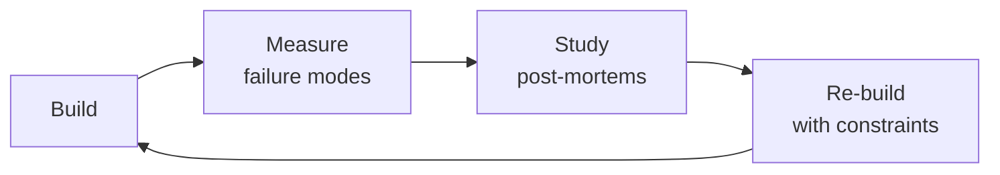

# Business Intelligence Engineer

> **Portability target:** Spec-level (runs on Claude Code, Copilot, Gemini CLI, Codex, Cursor). No vendor-specific frontmatter fields.

Strategic business intelligence engineering — from semantic layer design through board-ready reporting and embedded analytics. Covers metric definition with dbt MetricFlow and LookML, self-serve dashboard architecture, investor and board reporting with SaaS metrics (ARR, NRR, LTV/CAC, magic number), clinical outcomes analytics for healthcare, pharma partner reporting with real-world evidence dashboards, star schema data modeling, dbt transformation pipelines with testing and freshness SLAs, and embedded analytics for customer-facing dashboards.

## Routing — Auto-Route
<!-- Machine-executable routing: 8 file_contains/file_exists rows A1-A8 + Intent Route fallback -->

| # | Detect Condition | Route To | Intent Route Fallback |
|---|-----------------|----------|----------------------|
| **A1** | `file_contains("*.yml\|*.sql", "metric\|measure\|MetricFlow\|LookML")` AND `file_exists("**/models/**/*.yml")` | This is your skill. Jump to **Core Workflow** — Phase 1 (Semantic Layer Design). | "I detect dbt/LookML metric definitions — routing to BI Engineer for semantic layer design." |
| **A2** | `file_contains("*", "board\|investor\|Q[1-4]\|quarterly_report\|earnings")` AND `file_contains("*", "ARR\|NRR\|LTV\|CAC\|magic_number\|revenue")` | This is your skill. Jump to **Core Workflow** — Phase 2 (Board Reporting). | "I detect board/investor reporting language with SaaS metrics — routing to board-ready dashboard design." |
| **A3** | `file_contains("*.sql\|*.py", "fact_\|dim_\|star_schema\|SCD\|slowly_changing\|snapshot")` AND `file_exists("**/models/**/*.sql")` | This is your skill. Jump to **Core Workflow** — Phase 3 (Data Modeling). | "I detect star schema/dimensional modeling — routing to BI data modeling workflow." |
| **A4** | `file_contains("*", "clinical_outcome\|patient_reported\|PRO\|treatment_adherence\|quality_of_life")` AND `file_contains("*.sql", "patient\|encounter\|diagnosis\|procedure")` | This is your skill. Jump to **Core Workflow** — Phase 4 (Clinical Analytics). | "I detect clinical outcomes analytics — routing to healthcare BI with PHI de-identification." |
| **A5** | `file_contains("*.yml", "freshness\|staleness\|SLA\|data_delay` AND `file_contains("*.sql", "incremental\|materialized\|snapshot")` | This is your skill. Jump to **Decision Trees** — Freshness SLA Strategy. | "I detect data freshness/SLA configuration — routing to pipeline reliability assessment." |
| **A6** | `file_contains("*", "self.serve\|self_service\|governed\|certified\|dashboard_governance")` AND `file_exists("Looker\|Metabase\|Lightdash\|Holistics\|Superset")` | This is your skill. Jump to **Best Practices** — Self-Serve Governance. | "I detect BI self-serve architecture — routing to governance tier design." |
| **A7** | `file_contains("*.sql\|*.yml", "dbt_test\|great_expectations\|data_quality\|not_null\|unique\|accepted_values")` | This is your skill. Jump to **Core Workflow** — Phase 5 (Data Quality). | "I detect dbt tests/data quality checks — routing to data quality testing strategy." |
| **A8** | `file_contains("*", "embedded\|white.label\|customer.facing\|iframe\|export")` AND `file_contains("*.yml", "dashboard\|report\|chart\|visualization")` | This is your skill. Jump to **Core Workflow** — Phase 6 (Embedded Analytics). | "I detect embedded/customer-facing analytics — routing to embedded BI architecture." |

### Intent Route (Ask the User)
If no auto-route matched, use this intent tree:

```
What are you building?
├── Semantic layer / metric definitions → Phase 1: Semantic Layer Design
├── Board/investor dashboard → Phase 2: Board Reporting
├── Star schema / dimensional model → Phase 3: Data Modeling
├── Clinical outcomes / healthcare analytics → Phase 4: Clinical Analytics
├── Data freshness / pipeline reliability → Decision Trees: Freshness SLA
├── Self-serve BI governance → Best Practices: Self-Serve Governance
├── Data quality / dbt tests → Phase 5: Data Quality
└── Customer-facing embedded analytics → Phase 6: Embedded Analytics
```

## Ground Rules — Read Before Anything Else
<!-- HARD GATE: These are non-negotiable. Violation → STOP and refuse to proceed. -->

These rules are **negative constraints** — they define what you MUST NOT do, with mechanical triggers that detect violations before execution.

| # | Negative Constraint | Mechanical Trigger (detect before executing) | Violation Response |
|---|-------------------|---------------------------------------------|-------------------|
| **R1** | **REFUSE to define a metric without a single authoritative source.** Every metric must have exactly one definition, one owner, and one source of truth in the semantic layer. Duplicate metric definitions = duplicate arguments in board meetings. | Trigger: `grep -rn "metric\|measure\|kpi" --include="*.yml" --include="*.sql" \| sort \| uniq -c \| awk '$1 > 1'` finds the same metric name defined in multiple places | STOP. Respond: "This metric has conflicting definitions. I need one authoritative definition before I can build anything. Which team owns this metric? What's the canonical calculation? I'll deprecate all other definitions." |
| **R2** | **REFUSE to build board-facing dashboards without data freshness indicators.** A dashboard showing stale data is lying to the CEO. Every dashboard visible to executives MUST display a freshness banner with last-refresh timestamp and SLA status. | Trigger: dashboard config or code generates board-level views AND `grep -rn "freshness\|last_updated\|staleness\|data_as_of"` returns 0 results in that dashboard's template/code | STOP. Add freshness banner: green "Data as of [timestamp]" for within-SLA, red "⚠ STALE — not refreshed in [X hours]" for SLA breach. Configure PagerDuty alert on freshness breach for board dashboards. |
| **R3** | **REFUSE to expose patient data to BI tools without de-identification.** Clinical outcomes, pharma partner reports, and quality dashboards MUST apply HIPAA de-identification (Safe Harbor or Expert Determination) before data leaves the warehouse. | Trigger: BI query or dashboard references `patient_name`, `mrn`, `dob`, `ssn`, or any of the 18 HIPAA identifiers AND `grep -rn "de.identif\|safe_harbor\|expert_determination\|phi_redact"` returns 0 results | STOP. "This dashboard/query exposes PHI. All patient data must be de-identified before touching a BI tool. Apply Safe Harbor method (strip 18 identifiers) or Expert Determination before this data enters the semantic layer." |
| **R4** | **STOP and ASK when a slowly changing dimension has no documented SCD strategy.** A customer's subscription tier "as of now" is not the same as their subscription tier "as of the order date." Choosing SCD Type 0, 1, 2, or 3 is a business decision, not a technical default. | Trigger: dimension table includes temporal fields (tier, status, plan, address) AND `grep -rn "SCD\|slowly_changing\|type.*[0123]"` returns 0 results in the data model docs | STOP. Ask: "This dimension changes over time. How should historical reporting work? SCD Type 1 (overwrite — reports only current state), Type 2 (add new row — preserves history with effective dates), or Type 3 (add column — preserves previous value only)? The choice affects every downstream dashboard." |
| **R5** | **DETECT and WARN about self-serve without governance tiers.** Giving everyone the ability to create dashboards without certification tiers means anyone can present incorrect metrics to the board. | Trigger: BI tool config shows `everyone` or `all_users` with `can_create_dashboard` AND no `governed\|certified\|lock` tier found in access config | WARN: "Self-serve is enabled without governance tiers. Any user can create and share analyses — including to the board. Implement 3 tiers: Board (certified, locked), Operational (domain-managed), Exploratory (watermarked 'not board-reviewed')." |
| **R6** | **DETECT and WARN about dashboards querying raw fact tables with no aggregation layer.** A dashboard that runs `SELECT * FROM transactions WHERE ...` on every load will time out at scale. | Trigger: BI model or SQL contains `FROM transactions` or `FROM fact_*` without pre-aggregation (no `materialized\|incremental\|summary\|aggregate` reference nearby) | WARN: "This dashboard queries raw transaction-level fact tables. At scale (1M+ rows), load time will exceed 30 seconds. Add daily-aggregated summary tables with incremental materialization. Pre-compute KPIs as materialized views." |
| **R7** | **DETECT and WARN about non-idempotent incremental dbt models.** An incremental model without a unique key produces duplicate rows on re-run. | Trigger: `grep -rn "incremental" --include="*.sql" -A 10 \| grep -v "unique_key"` finds incremental configs with no deduplication key | WARN: "Incremental models without `unique_key` produce duplicate rows on re-run. Add: `{{ config(materialized='incremental', unique_key='id') }}`. Test idempotency: run `dbt run --full-refresh` and `dbt run` twice — row counts must match." |


## The Expert's Mindset

Masters of business intelligence engineer don't just build — they build **the right thing, at the right time, with the right trade-offs**. They think in systems, not tasks.

| Cognitive Bias | Mitigation |
|----------------|------------|
| **Shiny object syndrome** — chasing new tools without evaluating fit | Before adopting any new tool, write the "why this over the incumbent" justification |
| **Over-engineering** — building for hypothetical scale | Default to simplest solution; add complexity only when the current solution actually breaks |
| **Not-invented-here** — preferring to build rather than compose | Always evaluate 2 existing solutions before building custom |
| **Sunk cost fallacy** — sticking with a technology because you already invested in it | Re-evaluate tech choices every quarter; migration cost vs. staying cost |

### What Masters Know That Others Don't
- The **failure modes** of every component in their stack — not just the happy path
- When **not** to use their favorite tool (every tool has a misuse zone)
- That **data/model quality decays over time** — monitoring is not optional, it's foundational

### When to Break Your Own Rules
- **Move fast on reversible decisions.** Data format? Hard to change. Dashboard layout? Easy. Know the difference.
- **Skip the abstraction until the third use case.** Two is coincidence, three is a pattern.
## Route the Request
<!-- QUICK: 30s -- auto-route first, then intent-route -->

### Auto-Route (No User Input Required)
Evaluate these file-system conditions in order. First match wins — jump immediately.

| # | Detect Condition | Route To | Intent Route Fallback |
|---|-----------------|----------|----------------------|
| **A1** | `file_contains("*.yml", "metric\|measure\|semantic_layer\|MetricFlow\|LookML")` AND `file_exists("dbt_project.yml")` | This is your skill. Jump to **Core Workflow** — Phase 1 (Semantic Layer Design). | "I detect dbt with metric/semantic layer definitions — routing to semantic layer design." |
| **A2** | `file_contains("*", "ARR\|NRR\|LTV\|CAC\|magic_number\|burn_multiple\|investor\|board_report")` | This is your skill. Jump to **Core Workflow** — Phase 3 (Board/Investor Reporting). | "I detect SaaS metrics and board reporting — routing to investor reporting methodology." |
| **A3** | `file_contains("*", "clinical_outcome\|patient_reported\|MCID\|adherence\|quality_of_life\|PRO")` | This is your skill. Jump to **Core Workflow** — Phase 4 (Clinical Outcomes Analytics). | "I detect clinical outcomes analytics — routing to clinical outcomes methodology." |
| **A4** | `file_contains("*", "dashboard\|looker\|metabase\|lightdash\|holistics\|superset")` AND `file_contains("*", "governed\|certified\|tier\|self.serve")` | This is your skill. Jump to **Core Workflow** — Phase 2 (Self-Serve Dashboard Architecture). | "I detect BI dashboard configs with governance patterns — routing to self-serve architecture." |
| **A5** | `file_exists("dbt_project.yml")` AND `file_contains("*.sql", "materialized\|incremental\|snapshot\|SCD\|slowly_changing")` | This is your skill. Jump to **Core Workflow** — Phase 6 (Data Modeling for BI). | "I detect dbt with data modeling patterns — routing to BI data model design." |
| **A6** | `file_contains("*", "embedded\|whitelabel\|customer.facing\|partner.*dashboard\|tenant")` | This is your skill. Jump to **Core Workflow** — Phase 8 (Embedded Analytics). | "I detect embedded/customer-facing analytics — routing to embedded analytics patterns." |
| **A7** | `file_contains("*.sql", "CREATE TABLE\|ALTER TABLE\|raw_\|staging_\|ods_")` AND `file_contains("*", "pipeline\|ETL\|ELT\|orchestrat")` | Invoke **data-engineer** instead. Raw data pipelines and ingestion belong to data engineering before BI modeling. | "I detect raw data pipeline and table creation — routing to Data Engineer for ingestion and transformation." |
| **A8** | `file_contains("*", "financial_model\|forecast\|projection\|p&l\|balance_sheet\|cash_flow")` | Invoke **fp-and-a-analyst** instead. Financial modeling and forecasting is FP&A, not BI engineering. | "I detect financial modeling/forecasting — routing to FP&A Analyst for financial planning." |

### Intent Route (Ask the User)
If no auto-route matched, use this intent tree:

```
What are you trying to do?
├── Design a semantic layer → Jump to "Core Workflow > Phase 1"
├── Architect self-serve dashboards → Jump to "Core Workflow > Phase 2"
├── Build board/investor reporting → Jump to "Core Workflow > Phase 3"
├── Set up clinical outcomes analytics → Jump to "Core Workflow > Phase 4"
├── Build pharma partner reports → Jump to "Core Workflow > Phase 5"
├── Design data models for BI → Jump to "Core Workflow > Phase 6"
├── Build ETL/ELT for BI → Jump to "Core Workflow > Phase 7"
├── Implement embedded analytics → Jump to "Core Workflow > Phase 8"
├── Need raw data pipelines? → Invoke data-engineer skill instead
├── Need financial modeling? → Invoke fp-and-a-analyst skill instead
└── Not sure? → Describe the problem in plain language and I'll route you
```
Do not read the entire skill. Follow the route above and read only the sections it points to.

## Operating at Different Levels

| Level | Scope | You... |
|-------|-------|--------|
| **L1** | Single component/module | Implement a well-defined piece following established patterns |
| **L2** | Feature or service | Design and build a complete feature; make tech choices within team conventions |
| **L3** | System or product area | Define architecture for a product area; set team tech standards; mentor L1-L2 |
| **L4** | Multiple systems / platform | Define org-wide architecture patterns; make build-vs-buy decisions; influence industry practice |
| **L5** | Industry / ecosystem | Create new architectural patterns adopted across the industry; redefine what's possible |

**Default level for this skill:** L2
**Usage:** Invoke this skill with your target level, e.g., "as an L3 business intelligence engineer, design..."

For full level definitions, see `skills/00-framework/skill-levels/SKILL.md`.

## When to Use
<!-- QUICK: 30s — five reasons to invoke this skill -->

- **Designing a governed semantic layer for company metrics** — Different teams report different numbers for the same metric (ARR, churn, MAU). You need a single source of truth with MetricFlow, LookML, or similar to enforce consistent definitions across dashboards.
- **Building an executive dashboard that people actually use** — Your dashboard takes 45+ seconds to load or shows data so stale it's misleading. You need performance optimization, freshness SLAs, and progressive loading patterns.
- **Enabling self-serve analytics without chaos** — You want to give every team access to data, but you've seen what happens when sales reports incorrect numbers to the board. You need a governed self-serve tier model (Locked / Guided / Free).
- **Responding to "why don't these numbers match?"** — The CEO's dashboard shows $42M ARR, the CFO's shows $38M. You need metric reconciliation, definition audit, and a resolution process that prevents recurrence.
- **Tracking clinical outcomes or health equity metrics** — Your health platform needs to monitor patient outcomes, care quality scores, or demographic parity. You need a structured analytics approach that handles clinical data governance requirements.

## Cross-Skill Coordination
<!-- STANDARD: 3min -->

<!-- NEIGHBORS: BI sits at the intersection of data pipelines, analytics, and business decision-making -->

| Upstream Skill | What You Receive | Decision Gate |
|---|---|---|
| `data-engineer` | Raw data pipelines, data warehouse schemas, ETL/ELT job outputs, data freshness SLAs | Validate that BI data sources meet freshness and quality requirements before dashboarding |
| `analytics-engineer` | dbt models, transformed datasets, data marts, testing and documentation | Incorporate curated datasets into semantic layer; flag gaps in transformation coverage |
| `data-scientist` | Statistical models, predictive outputs, segmentation results, A/B test conclusions | Integrate model outputs into BI dashboards; validate model metrics are business-ready |

| Downstream Skill | What You Provide | Artifacts |
|---|---|---|
| `analytics-engineer` | Semantic layer definitions (MetricFlow, LookML), metric governance rules, data modeling requirements | Metric definitions, dimension tables, SCD type specifications |
| `data-scientist` | Curated datasets, metric definitions, self-serve exploration paths, business context for modeling | Semantic layer explores, governed datasets, business metric documentation |
| `growth-engineer` | Product analytics dashboards, user behavior metrics, conversion funnels, retention cohort analyses | Funnel dashboards, activation metrics, retention reports |
| `revops-manager` | Revenue dashboards, pipeline analytics, sales performance metrics, customer health scores | Revenue reporting, pipeline health dashboards, win/loss analytics |
| `fp-and-a-analyst` | Financial metrics, ARR/NRR dashboards, LTV/CAC analyses, budget vs actuals reporting | Board-ready metric reports, investor KPI dashboards, scenario models |

**Coordination cadence:**
- **Daily:** Data freshness monitoring with `data-engineer` — flag stale data before dashboards refresh
- **Weekly:** Sync with `analytics-engineer` on new dbt models and metric changes
- **Bi-weekly:** Review with `fp-and-a-analyst` on investor reporting accuracy
- **Monthly:** Alignment with `revops-manager` and `growth-engineer` on evolving business metric needs

## Proactive Triggers
<!-- DEEP: 10+min — when to intervene before someone asks -->

| Trigger | Action | Why |
|---------|--------|-----|
| CEO asks "what's our NRR?" and 3 teams produce 3 different numbers | Propose single-source-of-truth semantic layer (dbt MetricFlow/LookML) with governed metric definitions, one owner, one definition, one review date; sync with `analytics-engineer` on metric implementation and `fp-and-a-analyst` on financial definitions | Without governed metrics, every team calculates "NRR" differently; the semantic layer is not a technical convenience — it's the governance mechanism that prevents board-level metric disputes |
| Executive dashboard takes 45+ seconds to load; stakeholders stop checking it | Propose pre-aggregated summary tables with incremental materialization; progressive dashboard loading (KPIs first, trends second, drill tables last); query performance monitoring with P95<3s SLA; sync with `data-engineer` on materialized view strategy | A dashboard that takes 45 seconds to load is viewed 0 times per week; dashboard performance is a business metric — every second of load time costs stakeholder engagement |
| Product team requests a new dashboard but can't articulate the business question it answers | Propose stakeholder intake brief: business question, decision it informs, audience, refresh cadence, success criteria; reject "I'll know it when I see it" requests; sync with `product-manager` on metrics definition | Dashboards without clear purpose become "shelfware" — built and never used; a structured brief ensures every dashboard answers a specific business question for a specific decision-maker |
| Marketing and finance both report "Monthly Active Users" but numbers don't match (marketing: 142K, finance: 138K) | Propose metric governance with decision log: when metric definitions conflict, the tiebreaker is a written decision with rationale, not the loudest voice; sync with `fp-and-a-analyst` and `growth-engineer` on authoritative definitions | Metric disagreements are governance failures, not technical failures; a decision log prevents re-litigation of the same definition argument every quarter |
| Self-serve analytics enabled — sales leader presents board analysis with incorrect join producing 2.1% churn instead of 7.8% actual | Propose governed self-serve tiers: Board (certified, locked, peer-reviewed), Operational (domain-owner managed), Exploratory (user-created, watermarked "not board-reviewed"); sync with `data-engineer` on data access controls | Self-serve without governance distributes the ability to make mistakes at scale; the "exploratory" label is the cheapest safety net — it tells readers "verify before presenting" |
| Data freshness is unknown — stakeholders ask "is this from today or last quarter?" | Propose per-domain freshness SLAs with dashboard freshness banners: green (within SLA), yellow (approaching), red (⚠ STALE); automated PagerDuty on freshness breach for board/operational dashboards; sync with `data-engineer` on pipeline monitoring | A dashboard without a freshness indicator is lying to its users every second it displays stale data; freshness must be visible, per-domain, and actionable |
| Analytics team says "we need a data model" but has no dimensional modeling experience | Propose star schema with conformed dimensions: fact tables (quantitative, additive) + dimension tables (descriptive, slowly-changing); start with Kimball bus matrix for cross-functional alignment; sync with `analytics-engineer` on dbt model design | A star schema enables self-serve — users build queries by joining facts to dimensions without understanding 17 intermediate tables; conformed dimensions ensure "customer" means the same thing across all dashboards |
| Embedded analytics dashboard for enterprise customer times out during their quarterly business review | Propose tenant-isolated query pools with per-tenant concurrency limits and query timeouts; pre-compute tenant-specific aggregates nightly; sync with `data-engineer` on query performance and `backend-developer` on API isolation | In embedded analytics, your biggest customer's experience is only as good as your noisiest tenant's worst query; tenant isolation is not optional when contracts have SLA clauses |

## Core Workflow
<!-- STANDARD: 3min -->

### Phase 1 (~25 min): Semantic Layer Design

#### dbt Metrics with MetricFlow

```yaml
# models/semantic_layer/metrics/revenue.yml
semantic_models:
  - name: orders
    model: ref('fct_orders')
    entities:
      - name: order_id
        type: primary
      - name: customer_id
        type: foreign
    dimensions:
      - name: order_date
        type: time
        type_params:
          time_granularity: day
      - name: order_status
        type: categorical
    measures:
      - name: revenue
        agg: sum
        expr: net_revenue_amount
      - name: order_count
        agg: count
        expr: order_id

metrics:
  - name: net_revenue
    description: Total net revenue after discounts and refunds
    type: simple
    label: Net Revenue
    type_params:
      measure: revenue

  - name: net_revenue_mom_growth
    description: Month-over-month net revenue growth rate
    type: ratio
    label: Revenue MoM Growth
    type_params:
      numerator: net_revenue
      denominator: net_revenue
      numerator_offsets:
        month_offset: 0
      denominator_offsets:
        month_offset: -1
```

#### LookML Explores

```yaml
# orders.explore.lkml
explore: orders {
  label: "Order Analytics"
  from: fct_orders

  join: dim_customers {
    sql_on: ${orders.customer_id} = ${dim_customers.customer_id} ;;
    type: left_outer
    relationship: many_to_one
  }

  join: fct_order_lines {
    sql_on: ${orders.order_id} = ${fct_order_lines.order_id} ;;
    type: left_outer
    relationship: one_to_many
  }
}

# orders.view.lkml
view: fct_orders {
  sql_table_name: analytics.fct_orders ;;

  dimension: order_id { type: number primary_key: yes sql: ${TABLE}.order_id ;; }
  dimension: order_date { type: date sql: ${TABLE}.order_date ;; }
  dimension_group: created { type: time timeframes: [date, week, month, quarter, year] sql: ${TABLE}.created_at ;; }

  measure: net_revenue { type: sum sql: ${TABLE}.net_revenue_amount ;; value_format_name: usd }
  measure: order_count { type: count }
  measure: average_order_value { type: number sql: ${net_revenue} / NULLIF(${order_count}, 0) ;; value_format_name: usd }
}
```

#### Universal Semantic Layer Principles

- **MetricFlow** (dbt): code-first, version-controlled, git-friendly — best for dbt shops
- **LookML** (Looker): GUI + code hybrid, strong permission model, embedded analytics — best for Looker
- **Cube.js**: open-source, headless BI, REST/GraphQL API, caching layer — best for custom apps
- **Principles**: metrics defined once, used everywhere; dimensions drillable across metrics; time-over-time comparisons built into semantic layer, not dashboard-level calculations

### Phase 2 (~25 min): Self-Serve Dashboard Architecture

#### Tool Selection

| Tool | Best For | Pricing Model | Governance |
|------|----------|---------------|------------|
| Looker | Enterprise, embedded analytics | Per-user, expensive | Strong — LookML, folders, permissions |
| Metabase | Mid-market, simplicity | Open-source or hosted | Moderate — collections, permissions |
| Lightdash | dbt-native, developer-first | Open-source or cloud | Strong — dbt as source of truth |
| Holistics | Data modeling, governed self-serve | Per-user, mid-range | Strong — semantic modeling layer |
| Streamlit | Custom data apps, ML dashboards | Free, self-hosted | Custom — code-level |
| Preset (Superset) | Large-scale, FOSS | Open-source or cloud | Moderate — roles, datasets |

#### Governed Self-Service Model

```
┌────────────────────────────────────────────────────────────────┐
│ Governed Self-Service Architecture                              │
├────────────────────────────────────────────────────────────────┤
│                         LAYER 1: LOCKED                         │
│  ┌─────────────────────────────────────────────────────────┐   │
│  │  Semantic Layer (dbt / LookML / MetricFlow)              │   │
│  │  ────────────────────────────────────────                │   │
│  │  Metrics: defined by BI team, locked for editing         │   │
│  │  Dimensions: defined by BI team, governed joins          │   │
│  │  ⚠️  Users CANNOT create new metric definitions           │   │
│  └─────────────────────────────────────────────────────────┘   │
│                             ↕                                    │
│                         LAYER 2: GUIDED                         │
│  ┌─────────────────────────────────────────────────────────┐   │
│  │  Exploration Layer                                       │   │
│  │  ────────────────────────────────────────                │   │
│  │  Saved Explores: BI team creates starting points         │   │
│  │  Field picker: users combine locked metrics/dimensions   │   │
│  │  Filters: users apply any filter within governed fields  │   │
│  │  ✅ Users CAN explore, filter, visualize, save            │   │
│  └─────────────────────────────────────────────────────────┘   │
│                             ↕                                    │
│                         LAYER 3: FREE                           │
│  ┌─────────────────────────────────────────────────────────┐   │
│  │  Personal Analysis Layer                                 │   │
│  │  ────────────────────────────────────────                │   │
│  │  Personal dashboards: users create own visualizations    │   │
│  │  Personal collections: organized by user/team            │   │
│  │  Shared only with explicit approval                      │   │
│  │  ✅ Users CAN create personal dashboards, NOT new metrics │   │
│  └─────────────────────────────────────────────────────────┘   │
└────────────────────────────────────────────────────────────────┘
```

#### Dashboard Review Gates

- **Tier 1 — Board/Investor** (every number must be verified): peer review + stakeholder sign-off + reconciliation check
- **Tier 2 — Operational** (numbers inform daily decisions): peer review + automated freshness check
- **Tier 3 — Exploratory** (WIP, may have caveats): "DRAFT" label, creator's name, last updated date

### Phase 3 (~25 min): Board Reporting

#### Investor KPIs

1. **Annual Recurring Revenue (ARR)**:
   - **Definition**: total annualized value of active subscriptions at a point in time
   - **Calculation**: SUM(monthly_recurring_revenue × 12) or SUM(annual_contract_value)
   - **Nuance**: exclude one-time fees, professional services, usage overage unless contractual
   - **Visualization**: ARR over time with expansion (new + upsell) minus contraction (churn + downgrade)

2. **Net Revenue Retention (NRR)**:
   - **Definition**: % of revenue retained from existing customers, including expansion
   - **Calculation**: (beginning ARR − churn − downgrade + expansion) / beginning ARR
   - **Benchmarks**: >120% excellent, 100–120% good, <100% concerning
   - **Board question this answers**: "Are we growing even without new customers?"

3. **LTV/CAC Ratio**:
   - **Definition**: lifetime value of customer vs cost to acquire them
   - **Calculation**: (ARPU × gross margin %) / (monthly churn rate) ÷ CAC
   - **Benchmarks**: >3× healthy, <1× unsustainable
   - **Nuance**: LTV should use gross margin, not revenue; CAC should be fully loaded (marketing + sales + SDR compensation)

4. **Magic Number**:
   - **Definition**: sales efficiency — how much revenue each dollar of sales/marketing generates
   - **Calculation**: (current quarter ARR − previous quarter ARR) × 4 / previous quarter S&M spend
   - **Benchmarks**: >0.75 invest more, 0.5–0.75 maintain, <0.5 investigate
   - **Board question this answers**: "Should we pour more fuel on the fire, or fix the engine?"

5. **Operational Metrics**:
   - **Burn Multiple**: net burn / net new ARR — efficiency of growth spend
   - **Rule of 40**: revenue growth rate + profit margin — should sum to ≥40%
   - **CAC Payback Period**: CAC / (ARPU × gross margin) — months to recover acquisition cost

#### Report Architecture

```sql
-- Example: monthly board snapshot table
CREATE TABLE analytics.board_metrics_monthly (
    report_month DATE,
    metric_name VARCHAR,
    metric_value NUMERIC,
    metric_unit VARCHAR,
    prior_month_value NUMERIC,
    prior_year_value NUMERIC,
    mom_change_pct NUMERIC,
    yoy_change_pct NUMERIC,
    target_value NUMERIC,
    target_variance_pct NUMERIC,
    data_freshness_ts TIMESTAMP,
    reconciliation_status VARCHAR -- 'VERIFIED', 'PENDING', 'FLAGGED'
);
```

### Phase 4 (~25 min): Clinical Outcomes Analytics

#### Patient-Reported Outcome (PRO) Trends

1. **PRO instruments** — standardized questionnaires measuring patient health status:
   - **PROMIS-29**: physical function, anxiety, depression, fatigue, sleep, pain, social roles
   - **PHQ-9**: depression severity (score 0–27; ≥10 indicates moderate depression)
   - **GAD-7**: anxiety severity (score 0–21; ≥10 indicates moderate anxiety)
   - **EQ-5D-5L**: health-related quality of life across 5 dimensions

2. **Trend analysis**:
   - **Clinically meaningful change**: not just statistical significance — does the change exceed the minimal clinically important difference (MCID)?
   - PHQ-9 MCID: 5 points; GAD-7 MCID: 4 points; PROMIS Physical Function: 3–5 T-score points

3. **Treatment adherence patterns**:
   - Medication possession ratio (MPR): days supply dispensed / days in period
   - Proportion of days covered (PDC): days covered / days in period
   - Adherence threshold: PDC ≥0.80 considered adherent
   - **Analytics**: cohort by condition, adherence trend over time, adherence drop-off after month N

#### Quality-of-Life Indices

- **QALY (Quality-Adjusted Life Year)**: years of life × quality weight (0 = death, 1 = perfect health)
- **DALY (Disability-Adjusted Life Year)**: years lost to premature death + years lived with disability
- **Dashboard**: trend of QALY/DALY by condition cohort, pre/post intervention comparison

### Phase 5 (~25 min): Pharma Partner Reporting

#### Real-World Evidence (RWE) Dashboards

1. **Patient population analytics:**
   - Demographics: age distribution, gender, geography, comorbidities
   - Treatment patterns: first-line therapy → second-line → third-line (Sankey diagram)
   - Persistence: time on therapy before discontinuation (Kaplan-Meier curve)
   - Switching: % patients switching from Drug A to Drug B within N months

2. **De-identification requirements:**
   - **HIPAA Safe Harbor**: remove 18 identifiers (names, dates more specific than year, ZIP codes <20K population, etc.)
   - **Expert Determination**: statistician certifies re-identification risk is "very small"
   - **Minimum cell size**: suppress counts <11 (or per partner agreement; CMS uses <11)
   - **K-anonymity**: each record indistinguishable from at least K other records (K ≥ 5 typical)

3. **Data export compliance:**
   - No raw PHI in exports — aggregated only
   - Partner-specific data filtered by contract scope
   - Export audit log: who, what, when, for which partner
   - Encryption at rest and in transit for all exports

### Phase 6 (~20 min): Data Modeling for BI

#### Star Schema Design

```
                    ┌──────────────────┐
                    │   dim_patients    │
                    │──────────────────│
                    │ patient_key (PK)  │
                    │ patient_id (NK)   │
                    │ age_group         │
                    │ gender            │
                    │ region            │
                    │ insurance_type    │
                    │ first_visit_date  │
                    └────────┬─────────┘
                             │
    ┌──────────────────┐    │    ┌──────────────────┐
    │   dim_providers  │    │    │    dim_dates     │
    │──────────────────│    │    │──────────────────│
    │ provider_key (PK)│    │    │ date_key (PK)     │
    │ provider_id (NK) │    │    │ full_date         │
    │ specialty        │    │    │ year, quarter     │
    │ practice_type    │    │    │ month_name        │
    └────────┬─────────┘    │    │ is_holiday        │
             │              │    └────────┬──────────┘
             │              │             │
             ▼              ▼             ▼
        ┌────────────────────────────────────────┐
        │              fct_encounters             │
        │────────────────────────────────────────│
        │ encounter_key (PK)                      │
        │ patient_key (FK)                        │
        │ provider_key (FK)                       │
        │ encounter_date_key (FK)                 │
        │ encounter_type                          │
        │ primary_diagnosis_code                  │
        │ billed_amount                           │
        │ allowed_amount                          │
        │ patient_responsibility                  │
        └────────────────────────────────────────┘
```

#### Slowly Changing Dimensions (SCDs)

| SCD Type | Behavior | Use Case | Implementation |
|----------|----------|----------|---------------|
| Type 0 | Never changes | Birth date, original source | Preserve original value |
| Type 1 | Overwrite | Spelling corrections | UPDATE in place |
| Type 2 | Track history | Subscription tier, address | Add new row with effective/expiry dates |
| Type 3 | Track previous value | Territory reassignment | Add `previous_value` column |
| Type 6 | Hybrid (1+2+3) | Complex tracking | Current flag + previous + original |

#### Snapshots vs Incrementals

- **Snapshots**: capture full state at point in time (`dbt snapshot`); use for SCD Type 2
- **Incrementals**: append/merge new records since last run; use for fact tables, event streams
- **Decision rule**: if you need to answer "what did this look like on date X?", use snapshots; if you only need current state and recent deltas, incrementals suffice

### Phase 7 (~25 min): ETL for BI

#### dbt Transformation Patterns

```yaml
# dbt_project.yml
models:
  bi_reporting:
    staging:        # 1:1 with source tables, light cleaning
      +materialized: view
      +schema: staging
    intermediate:   # joins, aggregations, business logic
      +materialized: ephemeral
      +schema: intermediate
    marts:          # final tables consumed by BI tools
      +materialized: table
      +schema: marts

# Incremental model
-- models/marts/fct_daily_encounters.sql
{{
  config(
    materialized='incremental',
    unique_key='encounter_id',
    on_schema_change='sync_all_columns'
  )
}}
SELECT * FROM {{ ref('stg_encounters') }}

WHERE updated_at > (SELECT MAX(updated_at) FROM {{ this }})

```

#### Data Freshness SLAs

| Data Domain | Freshness SLA | Monitoring |
|-------------|--------------|------------|
| Board reports | 9 AM ET on report day | dbt source freshness |
| Operational dashboards | Hourly | Airflow/Dagster sensor |
| Clinical outcomes | Daily + 2 hours | Great Expectations |
| Pharma partner reports | Weekly (Monday 12 PM) | dbt Cloud job |
| Ad-hoc exploration | Stale after 24 hours | Warning only |

#### Testing Strategy

```yaml
# dbt tests in schema.yml
models:
  - name: fct_encounters
    columns:
      - name: encounter_id
        tests:
          - unique
          - not_null
      - name: patient_key
        tests:
          - not_null
          - relationships:
              to: ref('dim_patients')
              field: patient_key
      - name: billed_amount
        tests:
          - not_null
          - dbt_utils.accepted_range:
              min_value: 0
              max_value: 1000000
      - name: allowed_amount
        tests:
          - dbt_expectations.expect_column_values_to_be_between:
              min_value: 0
              max_value: "{{ 2 * billed_amount }}"
```

### Phase 8 (~20 min): Embedded Analytics

#### Customer-Facing Dashboards

- **Pattern**: embed analytics directly in product using iframe, React component, or API
- **Tools**: Looker Embed, Metabase Embed, Cube.js, custom with chart library
- **Authentication**: JWT-based SSO, row-level security enforced at query time
- **Performance**: pre-aggregate common queries, cache heavily, limit date range to 12 months default

#### White-Label Reporting

- **Multi-tenant architecture**: separate schema per tenant OR row-level security on shared tables
- **Branding**: custom logos, colors, fonts per tenant
- **Export formats**: PDF (paginated), CSV (raw data), Excel (formatted), API (JSON)
- **Scheduling**: tenant-configured report delivery (email, Slack, webhook)

#### Data Export Compliance

- **Audit trail**: every export logged (user, tenant, report, timestamp, row count, format)
- **Data minimization**: export only data the user has permission to see
- **Retention**: auto-delete exports older than N days (configurable per tenant)
- **Encryption**: exports encrypted at rest; download links expire; watermark PDFs with "CONFIDENTIAL — [Tenant Name] — [Date]"

## Cross-Skill Integration
<!-- STANDARD: 3min -->

| Step | Skill | What it produces |
|------|-------|------------------|
| **Before** | data-engineer | Clean, reliable data pipelines feeding the warehouse with freshness SLAs |
| **Before** | analytics-engineer | Dimensional models, transformed datasets, dbt lineage from raw to analytics-ready |
| **Before** | fp-and-a-analyst | Financial model, budget assumptions, forecast methodology, board deck structure |
| **This** | business-intelligence-engineer | Semantic layer, dashboards, board reports, partner analytics, embedded BI |
| **After** | ceo-strategist | Strategic decisions informed by accurate, timely metrics and board-ready reports |
| **After** | board-manager | Board presentation-ready metrics, variance analysis, KPI dashboards |
| **After** | investor-relations | Investor-facing metrics (ARR, NRR, LTV/CAC), quarterly reporting data, fundraising data room |

Common chains:
- **Chain**: data-engineer → analytics-engineer → business-intelligence-engineer → ceo-strategist — Raw data flows through transformation to semantic layer; CEO uses board-ready metrics for strategic decisions
- **Chain**: fp-and-a-analyst → business-intelligence-engineer → board-manager — Financial model defines key metrics; BI implements dashboards and reports for board presentation
- **Chain**: business-intelligence-engineer → investor-relations — BI provides verified metrics for investor reporting, due diligence, and fundraising materials

## Decision Trees
<!-- QUICK: 60s -- flowchart-style logic for fork-in-the-road decisions -->

### Self-Serve vs Curated Dashboards
<!-- Decision tree for choosing between governed self-serve exploration and curated, locked-down dashboards -->

```
START: Stakeholder requests new dashboard or data access
  │
  ├─ Is the audience the board of directors, investors, or external partners?
  │    ├─ YES → CURATED. Locked dashboard with approved metric definitions. No self-serve.
  │    └─ NO → Continue
  │
  ├─ Does the data contain PHI, individually identifiable financial data, or material non-public information?
  │    ├─ YES → CURATED. Row-level security, audit trail, export restrictions.
  │    └─ NO → Continue
  │
  ├─ Is the metric definition stable, well-documented, and governed in the semantic layer?
  │    ├─ NO → CURATED. Do not expose ungoverned metrics in self-serve. Define first, then expose.
  │    └─ YES → Continue
  │
  ├─ Does the stakeholder have data literacy to interpret metrics correctly (understands rate vs count, MoM vs YoY, statistical significance)?
  │    ├─ NO → CURATED with narrative. Provide interpreted report rather than raw exploration.
  │    └─ YES → Continue
  │
  ├─ Is the stakeholder a power analyst who needs ad-hoc drill-down, cohort building, or cross-domain joins?
  │    ├─ YES → SELF-SERVE (exploratory tier). Label as "exploratory — not board-reviewed." Creator attribution visible.
  │    └─ NO → SELF-SERVE (governed tier). Curated dataset. Locked metric tiles. Pre-built drill paths.
  │
  └─ FINAL GATE: Will a wrong number from this dashboard reach investors, regulators, or patients?
       ├─ YES → Require peer review and stakeholder sign-off before self-serve access.
       └─ NO → SELF-SERVE with freshness SLA label and "last reviewed" timestamp.
```

### When to Build a Semantic Layer vs Direct Queries
<!-- Decision tree for choosing between a governed semantic layer and direct database queries -->

```
START: Need to expose data for reporting or analysis
  │
  ├─ Will this metric be used by more than one person, team, or dashboard?
  │    ├─ YES → SEMANTIC LAYER. Define once, use everywhere.
  │    └─ NO → Continue
  │
  ├─ Is the metric business-critical (ARR, NRR, churn, gross margin, patient outcomes)?
  │    ├─ YES → SEMANTIC LAYER. Must have single authoritative definition with governance.
  │    └─ NO → Continue
  │
  ├─ Does the metric require calculation logic beyond simple aggregations (e.g., LTV/CAC, magic number, risk-adjusted outcomes)?
  │    ├─ YES → SEMANTIC LAYER. Complex logic should be versioned, tested, and governed.
  │    └─ NO → Continue
  │
  ├─ Is this a one-off analysis with a shelf life of <1 week (ad-hoc board question, urgent investor request)?
  │    ├─ YES → DIRECT QUERY with documentation. Promote to semantic layer if the question recurs.
  │    └─ NO → Continue
  │
  ├─ Are you exploring a new data source where metric definitions are still being iterated?
  │    ├─ YES → DIRECT QUERY in exploratory tier. Formalize when definitions stabilize.
  │    └─ NO → SEMANTIC LAYER.
  │
  └─ Does the query need to join across domains that have separate semantic layers?
       ├─ YES → SEMANTIC LAYER federation or cross-domain model. Do not bypass governance for cross-domain joins.
       └─ NO → SEMANTIC LAYER.
```

## Sub-Skills
<!-- QUICK: 30s -- table of deeper dives by topic -->
When this skill is invoked, the agent may need to drill into these specialized areas:

| Sub-Skill | When to Use |
|-----------|-------------|
| `semantic-layer-design` | Defining metrics in dbt MetricFlow, LookML, or Cube.js with governance |
| `dashboard-architecture` | Designing governed self-serve dashboards with tiered review gates |
| `investor-reporting` | Building ARR/NRR/LTV-CAC/magic number dashboards and board decks |
| `clinical-outcomes-analytics` | Analyzing patient-reported outcomes, treatment adherence, and quality-of-life indices |
| `pharma-reporting` | Designing RWE dashboards with de-identification and export compliance |
| `star-schema-modeling` | Designing fact/dimension schemas with SCD strategies and snapshot patterns |
| `dbt-pipelines` | Building dbt transformations with incremental strategies, testing, and freshness SLAs |
| `embedded-analytics` | Implementing customer-facing dashboards, white-label reporting, and export compliance |

## Best Practices
<!-- DEEP: 10+min -->

1. **Design the semantic layer for governance, not just convenience**: Every metric in the semantic layer should have exactly one definition, one owner, and one review date. MetricFlow/LookML files should be in version control with the same rigor as production code. Treat metric definition changes with the same review process as API contract changes — they affect every downstream consumer.

2. **Optimize queries at the aggregation layer, not the visualization layer**: Dashboard slowness usually traces to unoptimized SQL in the semantic layer, not the BI tool. Pre-aggregate large fact tables at the granularity stakeholders actually query (daily, not per-transaction). Use incremental materialization with unique keys. Profile every metric's query performance before exposing it in a dashboard.

3. **Design dashboards for scan time, not build time**: An executive should be able to understand the key takeaway from a dashboard in under 10 seconds. Put the most important metric top-left. Use sparklines for trends, not full time-series. Color-code: green for on-track, red for off-track, grey for "not applicable this period." Remove anything that doesn't answer a specific business question.

4. **Model data for self-serve success, not just analyst convenience**: Self-serve fails when users need to understand 17 joins to answer a simple question. Build wide, denormalized exploration tables with clear column names, descriptions, and relationships. Pre-join common paths. Document every column with a plain-English description and example value. If a business user can't understand the schema in 5 minutes, it's not self-serve ready.

5. **Standardize the stakeholder intake process with a brief, not a meeting**: Require every dashboard request to specify: the business question, the decision it informs, the audience, the refresh cadence needed, and how the stakeholder will know the dashboard is working. This brief becomes the acceptance criteria. Reject requests that say "I'll know it when I see it."

6. **Govern metric definitions with a decision log, not tribal knowledge**: When two teams disagree on how ARR or NRR is calculated, the tiebreaker must be a written decision with a rationale, not the loudest voice in the room. Maintain a metric decision log (what was decided, why, when, by whom). When the metric is inevitably questioned again, point to the log — don't re-litigate.

7. **Define data freshness SLAs per domain, not globally**: Clinical outcomes data may need <1 hour freshness. Board metrics may tolerate 24 hours. Exploratory sandboxes may tolerate 1 week. Each domain gets an SLA, and dashboards prominently display the last refresh timestamp. Stakeholders should never wonder "is this data from today or last quarter?"

8. **Design embedded analytics as a product, not a feature**: Customer-facing analytics need SSO, row-level security, rate limiting, white-labeling, export compliance, and SLA-backed availability. Plan for tenant isolation from day one — a slow query from one customer's dashboard should never degrade another customer's experience. Pre-compute tenant-specific aggregates. Monitor per-tenant performance and set usage quotas.

## Anti-Patterns
<!-- DEEP: 5min -- each anti-pattern includes machine-detectable patterns -->

| ❌ Anti-Pattern | ✅ Do This Instead | 🔍 Detect (grep / lint) | 🛡️ Auto-Prevent |
|-----------------|---------------------|--------------------------|-------------------|
| Building dashboards without a data model — BI tool connects directly to raw operational tables | Design semantic layer first: star schema with conformed dimensions (Kimball), dbt models for transformation, MetricFlow/LookML for governed metrics. Each metric has exactly one definition, one owner. | `grep -rn "FROM production\|FROM operational\|FROM raw_" --include="*.sql" \| grep -v "staging\|intermediate\|marts"` → finds queries against raw tables bypassing data models | CI lint: `scripts/check-data-model-layer.sh` — fails if any dashboard SQL references raw operational tables directly |
| No freshness indicators on dashboards — ops team made $180K staffing decision based on 11-day stale data | Display freshness banner on every dashboard: green "Data as of [time]" for within-SLA, red "⚠ STALE — not refreshed in [X hours]" for SLA breach. Per-domain SLAs with automated alerting. | `grep -rn "dashboard\|report\|board" --include="*.yml" \| grep -v "freshness\|last_updated\|staleness\|data_as_of\|refresh"` → finds dashboard configs without freshness tracking | CI gate: `scripts/require-freshness-banner.sh` — fails if any board/operational dashboard lacks freshness indicator |
| Self-serve without certification tiers — sales leader presented churn at 2.1% (actual: 7.8%) from incorrect JOIN | Implement governed tiers: Board (certified, locked, peer-reviewed), Operational (domain-managed, freshness-verified), Exploratory (user-created, watermarked "not board-reviewed"). | `grep -rn "can_create_dashboard\|create_permission\|explore_all" --include="*.yml" \| grep -v "governed\|certified\|locked\|exploratory\|tier"` → finds self-serve perms without tier enforcement | BI tool config: `scripts/enforce-governance-tiers.sh` — applies template restricting dashboard creation to governed tier assignments |
| Ad-hoc metrics without governance — "Active User" defined 4 different ways across 7 dashboards | Implement metric governance: single definition per metric in semantic layer, decision log for conflicts, metric dictionary with owner and review date. Deprecate unofficial definitions. | `grep -rn "metric\|measure\|kpi" --include="*.yml" --include="*.sql" \| sort \| uniq -d -c \| awk '$1 > 1 {print $2}'` → finds duplicate metric names with different definitions | Pre-commit hook: `scripts/check-metric-uniqueness.sh` — fails if same metric name has multiple definitions across semantic layer files |
| Embedded analytics without tenant isolation — Partner A's cohort analysis saturates shared query engine, Partner B's board review times out | Per-tenant query pools with concurrency limits and timeouts (30s interactive, 5min exports). Pre-compute tenant-specific aggregates nightly. Per-tenant performance monitoring. | `grep -rn "embedded\|tenant\|partner\|whitelabel" --include="*.yml" \| grep -v "isolation\|concurrency\|rate_limit\|query_pool\|row_level"` → finds embedded configs without isolation | CI gate: `scripts/check-tenant-isolation.sh` — fails if embedded analytics config lacks per-tenant resource limits |
| Dashboards querying raw fact tables with no aggregation — 200M-row scan on every page load, 45-second load time | Tiered caching: pre-aggregated summary tables (daily grain), materialized views for top-10 KPIs, query result caching (Redis). Progressive loading (KPIs first, trends second, details third). | `grep -rn "FROM.*fact_\|FROM.*transactions\|FROM.*events" --include="*.sql" \| grep -v "materialized\|incremental\|summary\|aggregate\|daily"` → finds unaggregated fact table queries | Lint: `scripts/check-aggregation-layer.sh` — requires all dashboard-facing models to reference pre-aggregated views, not raw facts |
| BI team as dashboard factory — 200+ dashboards, 80% never viewed after month 1 | Dashboard lifecycle management: 90-day view audit, auto-archive zero-view dashboards, consolidate overlapping dashboards. "No" is acceptable. | `grep -rn "create_dashboard\|new_dashboard" --include="*.yml" \| grep -v "lifecycle\|archive\|deprecate\|view_audit\|90.day"` → finds dashboard creation without lifecycle policy | BI tool: `scripts/audit-dashboard-views.sh` — weekly job that archives dashboards with 0 views in 90 days |

## Scale Depth: Solo → Small → Medium → Enterprise
<!-- DEEP: 10+min -->

### Solo (1 person, 0-100 users)
- **What changes**: Simple dashboards in Metabase/Lightdash. Manual metric definitions in a shared doc. Spreadsheet-based board reporting. No semantic layer. No data freshness monitoring. Manual data exports.
- **What to skip**: dbt, LookML, formal semantic layer, governed self-serve, clinical analytics dashboards, pharma partner reporting, embedded analytics, data export compliance framework.
- **Coordination**: You build the dashboards and present the numbers. Document metric definitions somewhere accessible.

### Small Team (2-10 people, 100-10K users)
- **What changes**: dbt with basic testing. Looker/Metabase/Lightdash with shared dashboards. Formal board deck metrics with reconciliation. Basic clinical outcomes tracking. Data freshness monitoring with dbt source freshness. Star schema data models.
- **What to skip**: Full MetricFlow semantic layer, governed self-serve tiers, pharma partner RWE dashboards, white-label embedded analytics, SCD Type 2 history tracking, automated data export compliance.
- **Coordination**: BI engineer owns semantic layer. Data engineer ensures pipeline reliability. Weekly stakeholder review of key dashboards.

### Medium Team (10-50 people, 10K-1M users)
- **What changes**: Full dbt MetricFlow semantic layer. Governed self-serve with tiered dashboards. Automated board reporting with variance analysis. Clinical outcomes analytics with MCID thresholds. Pharma partner RWE dashboards with de-identification. SCD Type 2 for key dimensions. Incremental dbt models. Embedded analytics with SSO.
- **What to skip**: Real-time operational dashboards, multi-tenant embedded analytics, HIPAA-certified export pipeline, automated board deck generation, investor data room.
- **Coordination**: BI team (2-3 engineers). Monthly data governance review. Quarterly board report dry run. Clinical analytics reviewed by medical director.

### Enterprise (50+ people, 1M+ users)
- **What changes**: Multi-tier semantic layer across business domains. Full governed self-serve with certification workflow. Automated board deck generation. Real-time clinical outcomes monitoring. HIPAA-compliant pharma reporting pipeline. Full SCD history for regulatory audit trails. Real-time operational dashboards. Multi-tenant white-label embedded analytics. Automated data export compliance with audit.
- **What's full production**: SOC 2 + HIPAA certified BI platform. Investor data room with live metrics. Published data dictionary. Data certification program. Embedded analytics serving 10K+ external users. Real-time alerting on KPI degradation.
- **Coordination**: BI platform team. Data governance committee. Clinical informatics team. Investor relations coordinator. Quarterly board materials review.

### Transition Triggers
- **Solo → Small**: Board asks "what's our NRR?" and you can't produce it in <1 day. >3 people need dashboards.
- **Small → Medium**: CEO presents wrong number to investors. Pharma partner requires de-identified population analytics. >50 dashboard viewers.
- **Medium → Enterprise**: IPO or late-stage fundraising requires auditable metrics. Multiple external partners requiring embedded analytics. SOC 2/HIPAA certification required.

## Error Decoder
<!-- DEEP: 5min -- each entry includes a console-string matcher for automatic recovery loops -->

| 🖥️ Console Match (grep pattern) | Symptom | Root Cause | Fix | 🔄 Auto-Recovery Loop |
|---|---|---|---|---|
| `dbt source freshness: FAIL \| source: clinical_ops \| staleness_hours: 264` + `grep -rn "freshness\|SLA" dbt/profiles.yml` shows no alert config | Clinical ops team made $180K staffing decision based on data from 11 days ago. ETL had silently failed. | dbt source freshness alerts went to unmonitored Slack channel. Dashboard displayed "Last updated" in tiny grey text. No freshness SLA per domain. No automated action on breach. | Define per-domain SLAs (clinical: 4h, finance: 24h, exploratory: 7d). Prominent freshness banner on every dashboard: green/yellow/red. PagerDuty on SLA breach. | 1. `dbt source freshness` → check for failures 2. If breach: `grep "error\|fail" dbt.log \| tail -20` 3. Fix ETL root cause 4. Add freshness banner to dashboard 5. Configure alert: `alert: staleness_hours > SLA_hours` |
| `Metric definition conflict: ARR found in 3 locations` + `grep -rn "\"ARR\"\|\"arr\"\|\"annual_recurring_revenue\"" metrics/ --include="*.yml" \| wc -l` returns > 1 | CEO presented $42M ARR. CFO showed $38M. $4M gap discovered during board meeting. Investor confidence shaken. | Marketing defined ARR as "contracted revenue including signed-not-live." Finance defined ARR as "recognized revenue under ASC 606." Both had dashboards showing "ARR." No semantic layer enforcement. | Single authoritative ARR definition in semantic layer with Finance as owner. Deprecate all others. Add metric definition to every dashboard title bar. Automated reconciliation checks between source systems and reported ARR. | 1. `grep -rn "ARR\|arr\|annual_recurring" metrics/` → find all definitions 2. Pick canonical definition, designate owner 3. Deprecate others: add `deprecated: true` 4. Run: `dbt run --select arr_metric` → verify single output 5. Add reconciliation: `SELECT source_arr - reported_arr AS gap FROM reconciliation` |
| `Dashboard load time: 45s \| rows_scanned: 200M` + `grep -rn "FROM.*fact_\|FROM.*transactions" --include="*.sql"` returns unaggregated queries | Executive dashboard timed out at 45 seconds. Executives stopped checking it. Churn spike went undetected for 6 weeks. | Dashboard queried raw 200M-row fact table on every load. No pre-aggregation. No incremental materialization. No progressive loading. | Build daily-aggregated summary tables with incremental materialization. Pre-compute top-10 KPIs as materialized views. Progressive loading (KPIs first, trends second, details third). P95 < 3s SLA. | 1. `grep "execution_time" query_log \| awk '{sum+=$NF; count++} END {print sum/count}'` → avg load time 2. If > 10s: create `daily_summary` model with `materialized='incremental'` 3. Add `depends_on: daily_summary` to dashboard model 4. Benchmark: `dbt run --select dashboard_model` must finish < 5s 5. Monitor P95 weekly |
| `Embedded analytics: PartnerB timeout \| query_pool_utilization: 100%` + `grep -rn "embedded\|tenant" config/ --include="*.yml" \| grep -v "isolation\|rate_limit\|concurrency"` | Pharma partner's embedded analytics timed out during quarterly business review with their own board. Another partner's cohort analysis saturated shared query engine. | Shared query engine across all tenants with no resource isolation. Heavy query from Partner A saturated pool. No per-tenant rate limiting or timeout. | Tenant-isolated query pools with per-tenant concurrency limits. Per-tenant timeouts (30s interactive, 5min exports). Pre-compute tenant-specific aggregates nightly. Per-tenant performance SLAs. | 1. `grep "tenant_id" query_log \| awk '{print $2}' \| sort \| uniq -c` → per-tenant query volume 2. Add per-tenant pool: `max_concurrent_queries: 5` per tenant 3. Add timeout: `query_timeout: 30s` interactive 4. Pre-aggregate: `CREATE MATERIALIZED VIEW tenant_{id}_summary AS ...` 5. Monitor: per-tenant P95 latency < 5s |
| `dbt incremental model: duplicate rows detected \| unique_key: null` + `grep -rn "materialized.*incremental" --include="*.sql" -A 5 \| grep -v "unique_key"` | Revenue report doubled for July after dbt retry. CFO caught discrepancy before board meeting. | Incremental model lacked `unique_key` — on re-run, the same rows were inserted again. Idempotency not enforced. No `unique` test on incremental key. | Add `unique_key` to incremental config. Add `unique` test on the key column. Add `not_null` test. Test idempotency: full-refresh → incremental run → incremental run → row counts must match. | 1. `grep "materialized.*incremental" models/ -rn -A 10 \| grep -v "unique_key"` → find broken models 2. Add: `unique_key='id'` in config block 3. Add test: `dbt test --select model_name` → `unique` must pass 4. Test: `dbt run --full-refresh && dbt run && dbt run` → row count unchanged on 2nd/3rd run |

## Production Checklist
<!-- QUICK: 30s -- binary pass/fail items. Each has a mechanical validation command. -->

| ID | Checklist Item | Validation Command | Auto-Fix |
|----|---------------|-------------------|----------|
| **[S1]** | Semantic layer: every metric has one authoritative definition; no duplicate or conflicting definitions | `grep -rn "metric\|measure\|kpi" models/ --include="*.yml" \| awk -F: '{print $NF}' \| sort \| uniq -d` → must return 0 duplicates | Pre-commit: `scripts/check-metric-uniqueness.sh` — blocks if duplicate metric names found |
| **[S2]** | Governed self-serve tiers: Board (certified), Operational (managed), Exploratory (watermarked) | `grep -rn "governed\|certified\|exploratory\|board" config/ --include="*.yml" \| wc -l` → must be >= 3 | CI: `scripts/enforce-governance-tiers.sh` — applies tier template if missing |
| **[S3]** | Board metrics reconciliation: ARR, NRR, LTV/CAC, magic number — all defined with calculation methodology | `grep -rn "calculation\|methodology\|formula" metrics/ --include="*.yml" \| wc -l` → must match metric count | Lint: `scripts/check-metric-documentation.sh` — fails if any metric lacks `calculation` field |
| **[S4]** | Data freshness: SLAs per domain, dbt source freshness active, alerts on breach | `dbt source freshness --output json \| jq '.nodes[] \| select(.freshness.status == "error")'` → must return 0 | CI gate: `dbt source freshness` in pipeline — fails build if sources are stale |
| **[S5]** | Data modeling: star schemas with fact/dimension tables, SCD strategy documented per dimension | `grep -rn "SCD\|slowly_changing\|type_[0123]" models/ --include="*.sql" --include="*.yml"` → must match dimension table count | — |
| **[S6]** | dbt testing: not_null, unique, relationships, accepted_values on all key columns | `dbt test --output json \| jq '.results[] \| select(.status != "pass")'` → must return 0 failures | CI gate: `dbt test` in pipeline — fails build on test failures |
| **[S7]** | Incremental strategy: large fact tables use incremental materialization with unique_key | `grep -rn "materialized.*table\|materialized.*view" models/ --include="*.sql" \| grep -v "incremental" \| wc -l` → must be 0 for tables > 1M rows | Lint: `scripts/check-incremental-strategy.sh` — warns on full-refresh-only tables |
| **[S8]** | Dashboard freshness banner: all board/operational dashboards show data-as-of timestamp | `grep -rn "freshness\|last_updated\|data_as_of\|stale" dashboards/ --include="*.yml" \| wc -l` → must match dashboard count | CI: `scripts/require-freshness-banner.sh` — fails if dashboards lack freshness |
| **[S9]** | Embedded analytics: SSO, row-level security, rate limiting, tenant-isolated query pools | `grep -rn "tenant\|isolation\|row_level\|RLS" config/embedded/ --include="*.yml" \| wc -l` → must be >= 4 | CI: `scripts/check-embedded-isolation.sh` — fails if tenant isolation missing |
| **[S10]** | Data export compliance: exports logged (who/what/when), PHI never in raw exports, retention policy enforced | `grep -rn "export.*audit\|export.*log\|PHI.*export\|retention.*export" config/ --include="*.yml"` → must return > 0 | Pre-commit: `scripts/check-export-compliance.sh` — scans for PHI in export configs |
- [ ] **[BI13]**  Documentation: data dictionary published, metric definitions accessible, dashboard inventory maintained, lineage tracked
- [ ] **[BI14]**  Reconciliation: board metrics reconciled against source systems monthly; discrepancies investigated and documented

## Footguns
<!-- DEEP: 10+min — war stories from business intelligence and analytics -->

| Footgun | What Happened | Root Cause | How to Prevent |
|---------|---------------|------------|----------------|
| The CEO presented monthly revenue as $14.2M to the board — it was actually $11.7M. The BI dashboard was summing invoice amounts, not recognized revenue under ASC 606. | A Series C SaaS company's BI team built a revenue dashboard by querying Stripe's `invoices` table. For 8 months, the board, investors, and leadership made decisions based on this number. When the controller reconciled for the year-end audit, recognized revenue was $11.7M vs the dashboard's $14.2M — a 21% gap. The dashboard had included annual prepaid contracts as full-month revenue instead of ratably recognizing them over 12 months. Two board members resigned, citing "materially misleading financial reporting." | The BI team consisted of data analysts, not accountants. They built the metric without consulting the finance team on revenue recognition rules. ASC 606 requires ratable recognition for SaaS contracts — the Stripe invoice amount is a cash metric, not a GAAP revenue metric. | **Every financial metric in a BI system must be co-defined with the controller or CFO.** Revenue metrics must comply with ASC 606 (ratable recognition, not invoice amounts). Build a monthly reconciliation: BI-reported revenue vs ERP-reported revenue. If the gap exceeds 1%, halt all board reporting until resolved. A BI dashboard is not a source of truth — it's a mirror of the ERP. If the mirror distorts, the organization flies blind. |
| Two VPs presented conflicting churn numbers in the same board meeting — one showed 3.2% (logo churn), the other showed 8.7% (revenue churn) — both were "the churn metric" | A B2B company's VP of Sales and VP of Customer Success each brought churn metrics to the Q4 2023 board meeting. Sales showed 3.2% monthly logo churn. CS showed 8.7% monthly revenue churn. Both called their number "the churn rate." The board spent 45 minutes debating which number was correct before realizing they were different metrics. The CEO lost credibility with the board for not catching this before the meeting. | The company had no data dictionary, no metric governance, and no single owner for metric definitions. Each department defined "churn" differently and built their own dashboard. Sales used logo churn (number of customers lost) while CS used revenue churn (MRR lost, which was higher because enterprise customers churned more volume). | **Every metric needs exactly one authoritative definition in a data dictionary.** "Churn" alone is not a metric — it's logo churn, revenue churn, or net revenue retention. The data dictionary must specify: the formula, the data source, the refresh cadence, and the owner. Before any board meeting, run a "metric reconciliation": does finance's revenue number match the BI dashboard? If two people show different numbers for the same metric name, someone is wrong — and it's the company's fault for not defining the metric. |
| A healthcare analytics dashboard showed patient readmission rates dropping from 14% to 8% — the CMO celebrated, but the "improvement" was a data pipeline bug that stopped ingesting readmissions from external hospitals | A hospital system deployed a BI dashboard tracking 30-day readmission rates in April 2024. The dashboard showed a steady decline from 14% to 8% over 6 months. The CMO presented the improvement at a national conference. In November, a data engineer discovered the pipeline ingesting external hospital readmissions had been silently failing since May — the readmission rate was actually 15%, slightly worse than baseline. The hospital had to issue a retraction at the conference and report the error to CMS. | The external hospital HL7 feed changed its schema. The ETL pipeline's error handling logged the parse failure but didn't halt the dashboard or alert anyone. The dashboard consumed a `readmission_count` column that contained only internal readmissions — the external ones were silently dropped. The downward trend was a data artifact, not a clinical improvement. | **Every metric needs a completeness check alongside the value.** Your dashboard should show: readmission rate = 8% AND completeness = 67% (missing 2 external hospitals). If completeness drops below 95%, the metric is flagged as unreliable. Monitor row counts per source system daily — a drop of >5% triggers investigation. Never present a trend without verifying the underlying volume is stable. A metric moving "in the right direction" without explanation is more likely a data pipeline issue than a genuine improvement. |
| The data team spent 3 months building a self-serve analytics platform — 18 months later, 80% of dashboards had zero active viewers | A 200-person fintech company invested $400K and 3 months building a Looker instance with 40+ dashboards. The Head of Data declared "self-serve analytics" achieved. Eighteen months later, a usage audit found: 32 of 40 dashboards had zero viewers in the last 90 days. The remaining 8 dashboards were used by 12 people — the same 12 people who used to request ad-hoc SQL queries. The data team had built dashboards nobody asked for, based on what they thought people needed. | The BI team built first, asked later. They designed dashboards by looking at the data schema and picking "interesting" metrics. No stakeholder interviews. No usage monitoring. No sunsetting policy. The "self-serve" platform was a museum of well-designed dashboards that answered questions nobody was asking. | **Never build a dashboard without a named stakeholder who commits to using it.** Require a "dashboard request form": who will use this? what decision will it inform? how often will they check it? Instrument dashboard usage: if a dashboard has zero active viewers for 60 days, archive it. If usage is declining, interview the users to understand why. A dashboard that's never viewed is not an asset — it's a monument to wasted effort. |
| A product analytics dashboard showed feature adoption at 62% — but it was counting every page load as "adoption" including bounce traffic that stayed < 3 seconds | A product team at a SaaS company tracked feature adoption via a BI dashboard built on Mixpanel events. The dashboard showed "Inventory Management" feature adoption at 62%. The VP Product presented this to the board as validation of the $2M investment in the feature. A skeptical board member asked: "Define adoption." Investigation revealed the metric was `unique users who triggered the page_load event` — it included users who landed on the feature page via a misclick and bounced in under 3 seconds. When redefined as "users who completed at least one meaningful action in the feature," adoption was 18%. | The BI team took the product team's event name at face value. "Page load" is not "adoption" — but nobody pushed back on the metric definition. The product team had an incentive to show high adoption; the BI team had no mandate to challenge metric definitions. | **BI must have the authority to challenge metric definitions, especially from teams with incentives to inflate numbers.** Define adoption in terms of meaningful action, not exposure: "completed a core workflow in the feature at least twice in 30 days." Before presenting any metric to the board, BI must independently verify it against the raw event data. If the metric can be gamed by changing the tracking implementation, it's not a metric — it's a vanity number. |

## Calibration — How to Know Your Level
<!-- STANDARD: 3min — honest self-assessment -->

| You Know You're Stuck at L1 When... | You Know You've Reached L2 When... | You Know You're L3 When... |
|---|---|---|
| You build a dashboard that looks beautiful but you can't trace any number on it back to a specific row in the source database | Every metric in your dashboards is traceable through documented lineage to the source system query that produced it — and you can demonstrate this in under 60 seconds for any metric | A regulator, auditor, or board member asks "how did you calculate this number?" and your response includes a lineage diagram, the SQL, and the reconciliation against the source system — and they accept it without follow-up questions |
| You define metrics based on what "makes sense" without consulting the business stakeholders who will use them | You co-define every metric with the accountable business leader (Controller for revenue, VP CS for churn, VP Product for adoption) and the definition is signed off in a data dictionary change log | You've designed a metric governance framework where any change to a metric definition requires approval from the metric owner AND notification of all dashboard consumers — and this framework is adopted as company policy, not just a BI team convention |
| Two different dashboards show two different numbers for "MRR" and you consider that normal | Your monitoring detects metric divergence across dashboards within 24 hours and your runbook resolves it before anyone asks | You've consolidated 15 competing definitions of "active user" into one authoritative definition, navigated the political pushback from teams who preferred their own definition, and enforced compliance with data quality monitors that alert when anyone queries a deprecated definition |

**The Litmus Test:** The CEO calls you at 8 PM on a Thursday and says: "I have a board meeting tomorrow at 9 AM. I need to know: what was our actual revenue last quarter, how does it compare to plan, and can you defend every number if a board member pushes back?" If your answer involves "let me pull some queries" rather than "the numbers are verified and here's the reconciliation report I ran this morning," you're building dashboards, not running BI. L3 BI engineers have the confidence to answer that call because they've already verified the numbers before anyone asked.

## What Good Looks Like
<!-- QUICK: 30s -- aspirational north star for this skill -->

> Business intelligence is not about building dashboards — it's about building a shared understanding of reality that the entire organization can trust and act on. **What good looks like**: every metric has exactly one definition that is discoverable, documented, and governed; every dashboard tells a clear story in under 10 seconds; every stakeholder — from the board to the front-line manager — trusts that the numbers they see are accurate, timely, and reconciled; analysts spend their time answering "why" questions, not "what is this number" questions; and when someone asks "where did this number come from?", the answer is a documented lineage trace, not a Slack thread of guesses. A BI practice that requires constant manual reconciliation, generates conflicting numbers, or produces dashboards nobody checks is failing, regardless of how many dashboards it has shipped.

## Deliberate Practice



| Level | Practice | Frequency |
|-------|----------|-----------|
| **Novice** | Rebuild an existing system from scratch, then compare your design with the original | Monthly |
| **Competent** | Add a new constraint (10x data, zero downtime, etc.) to a familiar design and re-architect | Quarterly |
| **Expert** | Design the same system under 3 conflicting constraint sets; write a decision record for each | Quarterly |
| **Master** | Teach a junior to design a system; your role is to ask questions, not give answers | Monthly |

**The One Highest-Leverage Activity:** Every quarter, take a system you built 6+ months ago and redesign it from scratch with what you know now. Write down what changed and why.

## References
<!-- QUICK: 30s -- links to deeper reading -->
- dbt Metrics / MetricFlow: https://docs.getdbt.com/docs/build/metrics
- Looker / LookML: https://cloud.google.com/looker/docs
- Lightdash: https://docs.lightdash.com/
- Cube.js: https://cube.dev/docs/
- Metabase: https://www.metabase.com/docs/
- Great Expectations: https://docs.greatexpectations.io/
- SaaS Metrics Guide (David Sacks): https://www.saastr.com/saastr-podcast-250-with-david-sacks/
- HIPAA De-identification: https://www.hhs.gov/hipaa/for-professionals/privacy/special-topics/de-identification/
- PROMIS Health Measures: https://www.healthmeasures.net/explore-measurement-systems/promis
- FDA Real-World Evidence: https://www.fda.gov/science-research/science-and-research-special-topics/real-world-evidence
- Kimball Dimensional Modeling: https://www.kimballgroup.com/data-warehouse-business-intelligence-resources/kimball-techniques/
