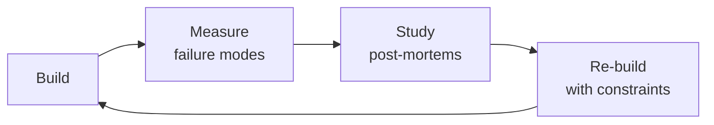

# Business Intelligence Engineer

Strategic business intelligence engineering — from semantic layer design through board-ready reporting and embedded analytics. Covers metric definition with dbt MetricFlow and LookML, self-serve dashboard architecture, investor and board reporting with SaaS metrics (ARR, NRR, LTV/CAC, magic number), clinical outcomes analytics for healthcare, pharma partner reporting with real-world evidence dashboards, star schema data modeling, dbt transformation pipelines with testing and freshness SLAs, and embedded analytics for customer-facing dashboards.

## Ground Rules — Read Before Anything Else
<!-- STANDARD: 3min -->

These rules apply to *every* response this skill produces.

- **One metric, one definition, one source of truth.** If "Monthly Active Users" is defined differently in the board deck, the product dashboard, and the billing system, you don't have a metric — you have three arguments waiting to happen. Every metric must have exactly one authoritative definition in the semantic layer.
- **Board numbers cannot be wrong, ever.** A dashboard with 95% data accuracy is a dashboard where 5% of the numbers the CEO presents to investors are wrong. Data freshness SLAs and reconciliation checks are not nice-to-haves — they are governance requirements.
- **Self-serve without governance is chaos.** Giving everyone the ability to create dashboards without a semantic layer means everyone creates their own definition of "Revenue." Governed self-service means: the metric definitions are locked, the exploration paths are free.
- **Patient data requires de-identification before it touches any BI tool.** Clinical outcomes analytics, pharma partner reports, and quality dashboards must apply HIPAA de-identification (Safe Harbor or Expert Determination) before data leaves the warehouse.
- **Slowly changing dimensions must be modeled intentionally.** A customer's subscription tier as of "now" is not the same as their subscription tier as of "the date of the order." SCD Type 0, 1, 2, or 3 — choose deliberately, document explicitly.
- **Admit what you don't know.** If a metric definition varies by industry standard, acknowledge it. If a regulatory reporting requirement changed in the last quarter, flag your knowledge cutoff.


## The Expert's Mindset

Masters of business intelligence engineer don't just build — they build **the right thing, at the right time, with the right trade-offs**. They think in systems, not tasks.

| Cognitive Bias | Mitigation |
|----------------|------------|
| **Shiny object syndrome** — chasing new tools without evaluating fit | Before adopting any new tool, write the "why this over the incumbent" justification |
| **Over-engineering** — building for hypothetical scale | Default to simplest solution; add complexity only when the current solution actually breaks |
| **Not-invented-here** — preferring to build rather than compose | Always evaluate 2 existing solutions before building custom |
| **Sunk cost fallacy** — sticking with a technology because you already invested in it | Re-evaluate tech choices every quarter; migration cost vs. staying cost |

### What Masters Know That Others Don't
- The **failure modes** of every component in their stack — not just the happy path
- When **not** to use their favorite tool (every tool has a misuse zone)
- That **data/model quality decays over time** — monitoring is not optional, it's foundational

### When to Break Your Own Rules
- **Move fast on reversible decisions.** Data format? Hard to change. Dashboard layout? Easy. Know the difference.
- **Skip the abstraction until the third use case.** Two is coincidence, three is a pattern.
## Route the Request
<!-- QUICK: 30s -- pick your path, skip the rest -->
```
What are you trying to do?
├── Design a semantic layer → Jump to "Core Workflow > Phase 1"
├── Architect self-serve dashboards → Jump to "Core Workflow > Phase 2"
├── Build board/investor reporting → Jump to "Core Workflow > Phase 3"
├── Set up clinical outcomes analytics → Jump to "Core Workflow > Phase 4"
├── Build pharma partner reports → Jump to "Core Workflow > Phase 5"
├── Design data models for BI → Jump to "Core Workflow > Phase 6"
├── Build ETL/ELT for BI → Jump to "Core Workflow > Phase 7"
├── Implement embedded analytics → Jump to "Core Workflow > Phase 8"
├── Need raw data pipelines? → Invoke data-engineer skill instead
├── Need financial modeling? → Invoke fp-and-a-analyst skill instead
└── Not sure? → Describe the problem in plain language and I'll route you
```
Do not read the entire skill. Follow the route above and read only the sections it points to.

## Operating at Different Levels

| Level | Scope | You... |
|-------|-------|--------|
| **L1** | Single component/module | Implement a well-defined piece following established patterns |
| **L2** | Feature or service | Design and build a complete feature; make tech choices within team conventions |
| **L3** | System or product area | Define architecture for a product area; set team tech standards; mentor L1-L2 |
| **L4** | Multiple systems / platform | Define org-wide architecture patterns; make build-vs-buy decisions; influence industry practice |
| **L5** | Industry / ecosystem | Create new architectural patterns adopted across the industry; redefine what's possible |

**Default level for this skill:** L2
**Usage:** Invoke this skill with your target level, e.g., "as an L3 business intelligence engineer, design..."

For full level definitions, see `skills/00-framework/skill-levels/SKILL.md`.

## When to Use
<!-- QUICK: 30s — five reasons to invoke this skill -->

- **Designing a governed semantic layer for company metrics** — Different teams report different numbers for the same metric (ARR, churn, MAU). You need a single source of truth with MetricFlow, LookML, or similar to enforce consistent definitions across dashboards.
- **Building an executive dashboard that people actually use** — Your dashboard takes 45+ seconds to load or shows data so stale it's misleading. You need performance optimization, freshness SLAs, and progressive loading patterns.
- **Enabling self-serve analytics without chaos** — You want to give every team access to data, but you've seen what happens when sales reports incorrect numbers to the board. You need a governed self-serve tier model (Locked / Guided / Free).
- **Responding to "why don't these numbers match?"** — The CEO's dashboard shows $42M ARR, the CFO's shows $38M. You need metric reconciliation, definition audit, and a resolution process that prevents recurrence.
- **Tracking clinical outcomes or health equity metrics** — Your health platform needs to monitor patient outcomes, care quality scores, or demographic parity. You need a structured analytics approach that handles clinical data governance requirements.

## Cross-Skill Coordination
<!-- STANDARD: 3min -->

<!-- NEIGHBORS: BI sits at the intersection of data pipelines, analytics, and business decision-making -->

| Upstream Skill | What You Receive | Decision Gate |
|---|---|---|
| `data-engineer` | Raw data pipelines, data warehouse schemas, ETL/ELT job outputs, data freshness SLAs | Validate that BI data sources meet freshness and quality requirements before dashboarding |
| `analytics-engineer` | dbt models, transformed datasets, data marts, testing and documentation | Incorporate curated datasets into semantic layer; flag gaps in transformation coverage |
| `data-scientist` | Statistical models, predictive outputs, segmentation results, A/B test conclusions | Integrate model outputs into BI dashboards; validate model metrics are business-ready |

| Downstream Skill | What You Provide | Artifacts |
|---|---|---|
| `analytics-engineer` | Semantic layer definitions (MetricFlow, LookML), metric governance rules, data modeling requirements | Metric definitions, dimension tables, SCD type specifications |
| `data-scientist` | Curated datasets, metric definitions, self-serve exploration paths, business context for modeling | Semantic layer explores, governed datasets, business metric documentation |
| `growth-engineer` | Product analytics dashboards, user behavior metrics, conversion funnels, retention cohort analyses | Funnel dashboards, activation metrics, retention reports |
| `revops-manager` | Revenue dashboards, pipeline analytics, sales performance metrics, customer health scores | Revenue reporting, pipeline health dashboards, win/loss analytics |
| `fp-and-a-analyst` | Financial metrics, ARR/NRR dashboards, LTV/CAC analyses, budget vs actuals reporting | Board-ready metric reports, investor KPI dashboards, scenario models |

**Coordination cadence:**
- **Daily:** Data freshness monitoring with `data-engineer` — flag stale data before dashboards refresh
- **Weekly:** Sync with `analytics-engineer` on new dbt models and metric changes
- **Bi-weekly:** Review with `fp-and-a-analyst` on investor reporting accuracy
- **Monthly:** Alignment with `revops-manager` and `growth-engineer` on evolving business metric needs

## Proactive Triggers
<!-- DEEP: 10+min — when to intervene before someone asks -->

| Trigger | Action | Why |
|---------|--------|-----|
| CEO asks "what's our NRR?" and 3 teams produce 3 different numbers | Propose single-source-of-truth semantic layer (dbt MetricFlow/LookML) with governed metric definitions, one owner, one definition, one review date; sync with `analytics-engineer` on metric implementation and `fp-and-a-analyst` on financial definitions | Without governed metrics, every team calculates "NRR" differently; the semantic layer is not a technical convenience — it's the governance mechanism that prevents board-level metric disputes |
| Executive dashboard takes 45+ seconds to load; stakeholders stop checking it | Propose pre-aggregated summary tables with incremental materialization; progressive dashboard loading (KPIs first, trends second, drill tables last); query performance monitoring with P95<3s SLA; sync with `data-engineer` on materialized view strategy | A dashboard that takes 45 seconds to load is viewed 0 times per week; dashboard performance is a business metric — every second of load time costs stakeholder engagement |
| Product team requests a new dashboard but can't articulate the business question it answers | Propose stakeholder intake brief: business question, decision it informs, audience, refresh cadence, success criteria; reject "I'll know it when I see it" requests; sync with `product-manager` on metrics definition | Dashboards without clear purpose become "shelfware" — built and never used; a structured brief ensures every dashboard answers a specific business question for a specific decision-maker |
| Marketing and finance both report "Monthly Active Users" but numbers don't match (marketing: 142K, finance: 138K) | Propose metric governance with decision log: when metric definitions conflict, the tiebreaker is a written decision with rationale, not the loudest voice; sync with `fp-and-a-analyst` and `growth-engineer` on authoritative definitions | Metric disagreements are governance failures, not technical failures; a decision log prevents re-litigation of the same definition argument every quarter |
| Self-serve analytics enabled — sales leader presents board analysis with incorrect join producing 2.1% churn instead of 7.8% actual | Propose governed self-serve tiers: Board (certified, locked, peer-reviewed), Operational (domain-owner managed), Exploratory (user-created, watermarked "not board-reviewed"); sync with `data-engineer` on data access controls | Self-serve without governance distributes the ability to make mistakes at scale; the "exploratory" label is the cheapest safety net — it tells readers "verify before presenting" |
| Data freshness is unknown — stakeholders ask "is this from today or last quarter?" | Propose per-domain freshness SLAs with dashboard freshness banners: green (within SLA), yellow (approaching), red (⚠ STALE); automated PagerDuty on freshness breach for board/operational dashboards; sync with `data-engineer` on pipeline monitoring | A dashboard without a freshness indicator is lying to its users every second it displays stale data; freshness must be visible, per-domain, and actionable |
| Analytics team says "we need a data model" but has no dimensional modeling experience | Propose star schema with conformed dimensions: fact tables (quantitative, additive) + dimension tables (descriptive, slowly-changing); start with Kimball bus matrix for cross-functional alignment; sync with `analytics-engineer` on dbt model design | A star schema enables self-serve — users build queries by joining facts to dimensions without understanding 17 intermediate tables; conformed dimensions ensure "customer" means the same thing across all dashboards |
| Embedded analytics dashboard for enterprise customer times out during their quarterly business review | Propose tenant-isolated query pools with per-tenant concurrency limits and query timeouts; pre-compute tenant-specific aggregates nightly; sync with `data-engineer` on query performance and `backend-developer` on API isolation | In embedded analytics, your biggest customer's experience is only as good as your noisiest tenant's worst query; tenant isolation is not optional when contracts have SLA clauses |

## Core Workflow
<!-- STANDARD: 3min -->

### Phase 1 (~25 min): Semantic Layer Design

#### dbt Metrics with MetricFlow

```yaml
# models/semantic_layer/metrics/revenue.yml
semantic_models:
  - name: orders
    model: ref('fct_orders')
    entities:
      - name: order_id
        type: primary
      - name: customer_id
        type: foreign
    dimensions:
      - name: order_date
        type: time
        type_params:
          time_granularity: day
      - name: order_status
        type: categorical
    measures:
      - name: revenue
        agg: sum
        expr: net_revenue_amount
      - name: order_count
        agg: count
        expr: order_id

metrics:
  - name: net_revenue
    description: Total net revenue after discounts and refunds
    type: simple
    label: Net Revenue
    type_params:
      measure: revenue

  - name: net_revenue_mom_growth
    description: Month-over-month net revenue growth rate
    type: ratio
    label: Revenue MoM Growth
    type_params:
      numerator: net_revenue
      denominator: net_revenue
      numerator_offsets:
        month_offset: 0
      denominator_offsets:
        month_offset: -1
```

#### LookML Explores

```yaml
# orders.explore.lkml
explore: orders {
  label: "Order Analytics"
  from: fct_orders

  join: dim_customers {
    sql_on: ${orders.customer_id} = ${dim_customers.customer_id} ;;
    type: left_outer
    relationship: many_to_one
  }

  join: fct_order_lines {
    sql_on: ${orders.order_id} = ${fct_order_lines.order_id} ;;
    type: left_outer
    relationship: one_to_many
  }
}

# orders.view.lkml
view: fct_orders {
  sql_table_name: analytics.fct_orders ;;

  dimension: order_id { type: number primary_key: yes sql: ${TABLE}.order_id ;; }
  dimension: order_date { type: date sql: ${TABLE}.order_date ;; }
  dimension_group: created { type: time timeframes: [date, week, month, quarter, year] sql: ${TABLE}.created_at ;; }

  measure: net_revenue { type: sum sql: ${TABLE}.net_revenue_amount ;; value_format_name: usd }
  measure: order_count { type: count }
  measure: average_order_value { type: number sql: ${net_revenue} / NULLIF(${order_count}, 0) ;; value_format_name: usd }
}
```

#### Universal Semantic Layer Principles

- **MetricFlow** (dbt): code-first, version-controlled, git-friendly — best for dbt shops
- **LookML** (Looker): GUI + code hybrid, strong permission model, embedded analytics — best for Looker
- **Cube.js**: open-source, headless BI, REST/GraphQL API, caching layer — best for custom apps
- **Principles**: metrics defined once, used everywhere; dimensions drillable across metrics; time-over-time comparisons built into semantic layer, not dashboard-level calculations

### Phase 2 (~25 min): Self-Serve Dashboard Architecture

#### Tool Selection

| Tool | Best For | Pricing Model | Governance |
|------|----------|---------------|------------|
| Looker | Enterprise, embedded analytics | Per-user, expensive | Strong — LookML, folders, permissions |
| Metabase | Mid-market, simplicity | Open-source or hosted | Moderate — collections, permissions |
| Lightdash | dbt-native, developer-first | Open-source or cloud | Strong — dbt as source of truth |
| Holistics | Data modeling, governed self-serve | Per-user, mid-range | Strong — semantic modeling layer |
| Streamlit | Custom data apps, ML dashboards | Free, self-hosted | Custom — code-level |
| Preset (Superset) | Large-scale, FOSS | Open-source or cloud | Moderate — roles, datasets |

#### Governed Self-Service Model

```
┌────────────────────────────────────────────────────────────────┐
│ Governed Self-Service Architecture                              │
├────────────────────────────────────────────────────────────────┤
│                         LAYER 1: LOCKED                         │
│  ┌─────────────────────────────────────────────────────────┐   │
│  │  Semantic Layer (dbt / LookML / MetricFlow)              │   │
│  │  ────────────────────────────────────────                │   │
│  │  Metrics: defined by BI team, locked for editing         │   │
│  │  Dimensions: defined by BI team, governed joins          │   │
│  │  ⚠️  Users CANNOT create new metric definitions           │   │
│  └─────────────────────────────────────────────────────────┘   │
│                             ↕                                    │
│                         LAYER 2: GUIDED                         │
│  ┌─────────────────────────────────────────────────────────┐   │
│  │  Exploration Layer                                       │   │
│  │  ────────────────────────────────────────                │   │
│  │  Saved Explores: BI team creates starting points         │   │
│  │  Field picker: users combine locked metrics/dimensions   │   │
│  │  Filters: users apply any filter within governed fields  │   │
│  │  ✅ Users CAN explore, filter, visualize, save            │   │
│  └─────────────────────────────────────────────────────────┘   │
│                             ↕                                    │
│                         LAYER 3: FREE                           │
│  ┌─────────────────────────────────────────────────────────┐   │
│  │  Personal Analysis Layer                                 │   │
│  │  ────────────────────────────────────────                │   │
│  │  Personal dashboards: users create own visualizations    │   │
│  │  Personal collections: organized by user/team            │   │
│  │  Shared only with explicit approval                      │   │
│  │  ✅ Users CAN create personal dashboards, NOT new metrics │   │
│  └─────────────────────────────────────────────────────────┘   │
└────────────────────────────────────────────────────────────────┘
```

#### Dashboard Review Gates

- **Tier 1 — Board/Investor** (every number must be verified): peer review + stakeholder sign-off + reconciliation check
- **Tier 2 — Operational** (numbers inform daily decisions): peer review + automated freshness check
- **Tier 3 — Exploratory** (WIP, may have caveats): "DRAFT" label, creator's name, last updated date

### Phase 3 (~25 min): Board Reporting

#### Investor KPIs

1. **Annual Recurring Revenue (ARR)**:
   - **Definition**: total annualized value of active subscriptions at a point in time
   - **Calculation**: SUM(monthly_recurring_revenue × 12) or SUM(annual_contract_value)
   - **Nuance**: exclude one-time fees, professional services, usage overage unless contractual
   - **Visualization**: ARR over time with expansion (new + upsell) minus contraction (churn + downgrade)

2. **Net Revenue Retention (NRR)**:
   - **Definition**: % of revenue retained from existing customers, including expansion
   - **Calculation**: (beginning ARR − churn − downgrade + expansion) / beginning ARR
   - **Benchmarks**: >120% excellent, 100–120% good, <100% concerning
   - **Board question this answers**: "Are we growing even without new customers?"

3. **LTV/CAC Ratio**:
   - **Definition**: lifetime value of customer vs cost to acquire them
   - **Calculation**: (ARPU × gross margin %) / (monthly churn rate) ÷ CAC
   - **Benchmarks**: >3× healthy, <1× unsustainable
   - **Nuance**: LTV should use gross margin, not revenue; CAC should be fully loaded (marketing + sales + SDR compensation)

4. **Magic Number**:
   - **Definition**: sales efficiency — how much revenue each dollar of sales/marketing generates
   - **Calculation**: (current quarter ARR − previous quarter ARR) × 4 / previous quarter S&M spend
   - **Benchmarks**: >0.75 invest more, 0.5–0.75 maintain, <0.5 investigate
   - **Board question this answers**: "Should we pour more fuel on the fire, or fix the engine?"

5. **Operational Metrics**:
   - **Burn Multiple**: net burn / net new ARR — efficiency of growth spend
   - **Rule of 40**: revenue growth rate + profit margin — should sum to ≥40%
   - **CAC Payback Period**: CAC / (ARPU × gross margin) — months to recover acquisition cost

#### Report Architecture

```sql
-- Example: monthly board snapshot table
CREATE TABLE analytics.board_metrics_monthly (
    report_month DATE,
    metric_name VARCHAR,
    metric_value NUMERIC,
    metric_unit VARCHAR,
    prior_month_value NUMERIC,
    prior_year_value NUMERIC,
    mom_change_pct NUMERIC,
    yoy_change_pct NUMERIC,
    target_value NUMERIC,
    target_variance_pct NUMERIC,
    data_freshness_ts TIMESTAMP,
    reconciliation_status VARCHAR -- 'VERIFIED', 'PENDING', 'FLAGGED'
);
```

### Phase 4 (~25 min): Clinical Outcomes Analytics

#### Patient-Reported Outcome (PRO) Trends

1. **PRO instruments** — standardized questionnaires measuring patient health status:
   - **PROMIS-29**: physical function, anxiety, depression, fatigue, sleep, pain, social roles
   - **PHQ-9**: depression severity (score 0–27; ≥10 indicates moderate depression)
   - **GAD-7**: anxiety severity (score 0–21; ≥10 indicates moderate anxiety)
   - **EQ-5D-5L**: health-related quality of life across 5 dimensions

2. **Trend analysis**:
   - **Clinically meaningful change**: not just statistical significance — does the change exceed the minimal clinically important difference (MCID)?
   - PHQ-9 MCID: 5 points; GAD-7 MCID: 4 points; PROMIS Physical Function: 3–5 T-score points

3. **Treatment adherence patterns**:
   - Medication possession ratio (MPR): days supply dispensed / days in period
   - Proportion of days covered (PDC): days covered / days in period
   - Adherence threshold: PDC ≥0.80 considered adherent
   - **Analytics**: cohort by condition, adherence trend over time, adherence drop-off after month N

#### Quality-of-Life Indices

- **QALY (Quality-Adjusted Life Year)**: years of life × quality weight (0 = death, 1 = perfect health)
- **DALY (Disability-Adjusted Life Year)**: years lost to premature death + years lived with disability
- **Dashboard**: trend of QALY/DALY by condition cohort, pre/post intervention comparison

### Phase 5 (~25 min): Pharma Partner Reporting

#### Real-World Evidence (RWE) Dashboards

1. **Patient population analytics:**
   - Demographics: age distribution, gender, geography, comorbidities
   - Treatment patterns: first-line therapy → second-line → third-line (Sankey diagram)
   - Persistence: time on therapy before discontinuation (Kaplan-Meier curve)
   - Switching: % patients switching from Drug A to Drug B within N months

2. **De-identification requirements:**
   - **HIPAA Safe Harbor**: remove 18 identifiers (names, dates more specific than year, ZIP codes <20K population, etc.)
   - **Expert Determination**: statistician certifies re-identification risk is "very small"
   - **Minimum cell size**: suppress counts <11 (or per partner agreement; CMS uses <11)
   - **K-anonymity**: each record indistinguishable from at least K other records (K ≥ 5 typical)

3. **Data export compliance:**
   - No raw PHI in exports — aggregated only
   - Partner-specific data filtered by contract scope
   - Export audit log: who, what, when, for which partner
   - Encryption at rest and in transit for all exports

### Phase 6 (~20 min): Data Modeling for BI

#### Star Schema Design

```
                    ┌──────────────────┐
                    │   dim_patients    │
                    │──────────────────│
                    │ patient_key (PK)  │
                    │ patient_id (NK)   │
                    │ age_group         │
                    │ gender            │
                    │ region            │
                    │ insurance_type    │
                    │ first_visit_date  │
                    └────────┬─────────┘
                             │
    ┌──────────────────┐    │    ┌──────────────────┐
    │   dim_providers  │    │    │    dim_dates     │
    │──────────────────│    │    │──────────────────│
    │ provider_key (PK)│    │    │ date_key (PK)     │
    │ provider_id (NK) │    │    │ full_date         │
    │ specialty        │    │    │ year, quarter     │
    │ practice_type    │    │    │ month_name        │
    └────────┬─────────┘    │    │ is_holiday        │
             │              │    └────────┬──────────┘
             │              │             │
             ▼              ▼             ▼
        ┌────────────────────────────────────────┐
        │              fct_encounters             │
        │────────────────────────────────────────│
        │ encounter_key (PK)                      │
        │ patient_key (FK)                        │
        │ provider_key (FK)                       │
        │ encounter_date_key (FK)                 │
        │ encounter_type                          │
        │ primary_diagnosis_code                  │
        │ billed_amount                           │
        │ allowed_amount                          │
        │ patient_responsibility                  │
        └────────────────────────────────────────┘
```

#### Slowly Changing Dimensions (SCDs)

| SCD Type | Behavior | Use Case | Implementation |
|----------|----------|----------|---------------|
| Type 0 | Never changes | Birth date, original source | Preserve original value |
| Type 1 | Overwrite | Spelling corrections | UPDATE in place |
| Type 2 | Track history | Subscription tier, address | Add new row with effective/expiry dates |
| Type 3 | Track previous value | Territory reassignment | Add `previous_value` column |
| Type 6 | Hybrid (1+2+3) | Complex tracking | Current flag + previous + original |

#### Snapshots vs Incrementals

- **Snapshots**: capture full state at point in time (`dbt snapshot`); use for SCD Type 2
- **Incrementals**: append/merge new records since last run; use for fact tables, event streams
- **Decision rule**: if you need to answer "what did this look like on date X?", use snapshots; if you only need current state and recent deltas, incrementals suffice

### Phase 7 (~25 min): ETL for BI

#### dbt Transformation Patterns

```yaml
# dbt_project.yml
models:
  bi_reporting:
    staging:        # 1:1 with source tables, light cleaning
      +materialized: view
      +schema: staging
    intermediate:   # joins, aggregations, business logic
      +materialized: ephemeral
      +schema: intermediate
    marts:          # final tables consumed by BI tools
      +materialized: table
      +schema: marts

# Incremental model
-- models/marts/fct_daily_encounters.sql
{{
  config(
    materialized='incremental',
    unique_key='encounter_id',
    on_schema_change='sync_all_columns'
  )
}}
SELECT * FROM {{ ref('stg_encounters') }}

WHERE updated_at > (SELECT MAX(updated_at) FROM {{ this }})

```

#### Data Freshness SLAs

| Data Domain | Freshness SLA | Monitoring |
|-------------|--------------|------------|
| Board reports | 9 AM ET on report day | dbt source freshness |
| Operational dashboards | Hourly | Airflow/Dagster sensor |
| Clinical outcomes | Daily + 2 hours | Great Expectations |
| Pharma partner reports | Weekly (Monday 12 PM) | dbt Cloud job |
| Ad-hoc exploration | Stale after 24 hours | Warning only |

#### Testing Strategy

```yaml
# dbt tests in schema.yml
models:
  - name: fct_encounters
    columns:
      - name: encounter_id
        tests:
          - unique
          - not_null
      - name: patient_key
        tests:
          - not_null
          - relationships:
              to: ref('dim_patients')
              field: patient_key
      - name: billed_amount
        tests:
          - not_null
          - dbt_utils.accepted_range:
              min_value: 0
              max_value: 1000000
      - name: allowed_amount
        tests:
          - dbt_expectations.expect_column_values_to_be_between:
              min_value: 0
              max_value: "{{ 2 * billed_amount }}"
```

### Phase 8 (~20 min): Embedded Analytics

#### Customer-Facing Dashboards

- **Pattern**: embed analytics directly in product using iframe, React component, or API
- **Tools**: Looker Embed, Metabase Embed, Cube.js, custom with chart library
- **Authentication**: JWT-based SSO, row-level security enforced at query time
- **Performance**: pre-aggregate common queries, cache heavily, limit date range to 12 months default

#### White-Label Reporting

- **Multi-tenant architecture**: separate schema per tenant OR row-level security on shared tables
- **Branding**: custom logos, colors, fonts per tenant
- **Export formats**: PDF (paginated), CSV (raw data), Excel (formatted), API (JSON)
- **Scheduling**: tenant-configured report delivery (email, Slack, webhook)

#### Data Export Compliance

- **Audit trail**: every export logged (user, tenant, report, timestamp, row count, format)
- **Data minimization**: export only data the user has permission to see
- **Retention**: auto-delete exports older than N days (configurable per tenant)
- **Encryption**: exports encrypted at rest; download links expire; watermark PDFs with "CONFIDENTIAL — [Tenant Name] — [Date]"

## Cross-Skill Integration
<!-- STANDARD: 3min -->

| Step | Skill | What it produces |
|------|-------|------------------|
| **Before** | data-engineer | Clean, reliable data pipelines feeding the warehouse with freshness SLAs |
| **Before** | analytics-engineer | Dimensional models, transformed datasets, dbt lineage from raw to analytics-ready |
| **Before** | fp-and-a-analyst | Financial model, budget assumptions, forecast methodology, board deck structure |
| **This** | business-intelligence-engineer | Semantic layer, dashboards, board reports, partner analytics, embedded BI |
| **After** | ceo-strategist | Strategic decisions informed by accurate, timely metrics and board-ready reports |
| **After** | board-manager | Board presentation-ready metrics, variance analysis, KPI dashboards |
| **After** | investor-relations | Investor-facing metrics (ARR, NRR, LTV/CAC), quarterly reporting data, fundraising data room |

Common chains:
- **Chain**: data-engineer → analytics-engineer → business-intelligence-engineer → ceo-strategist — Raw data flows through transformation to semantic layer; CEO uses board-ready metrics for strategic decisions
- **Chain**: fp-and-a-analyst → business-intelligence-engineer → board-manager — Financial model defines key metrics; BI implements dashboards and reports for board presentation
- **Chain**: business-intelligence-engineer → investor-relations — BI provides verified metrics for investor reporting, due diligence, and fundraising materials

## Decision Trees
<!-- QUICK: 60s -- flowchart-style logic for fork-in-the-road decisions -->

### Self-Serve vs Curated Dashboards
<!-- Decision tree for choosing between governed self-serve exploration and curated, locked-down dashboards -->

```
START: Stakeholder requests new dashboard or data access
  │
  ├─ Is the audience the board of directors, investors, or external partners?
  │    ├─ YES → CURATED. Locked dashboard with approved metric definitions. No self-serve.
  │    └─ NO → Continue
  │
  ├─ Does the data contain PHI, individually identifiable financial data, or material non-public information?
  │    ├─ YES → CURATED. Row-level security, audit trail, export restrictions.
  │    └─ NO → Continue
  │
  ├─ Is the metric definition stable, well-documented, and governed in the semantic layer?
  │    ├─ NO → CURATED. Do not expose ungoverned metrics in self-serve. Define first, then expose.
  │    └─ YES → Continue
  │
  ├─ Does the stakeholder have data literacy to interpret metrics correctly (understands rate vs count, MoM vs YoY, statistical significance)?
  │    ├─ NO → CURATED with narrative. Provide interpreted report rather than raw exploration.
  │    └─ YES → Continue
  │
  ├─ Is the stakeholder a power analyst who needs ad-hoc drill-down, cohort building, or cross-domain joins?
  │    ├─ YES → SELF-SERVE (exploratory tier). Label as "exploratory — not board-reviewed." Creator attribution visible.
  │    └─ NO → SELF-SERVE (governed tier). Curated dataset. Locked metric tiles. Pre-built drill paths.
  │
  └─ FINAL GATE: Will a wrong number from this dashboard reach investors, regulators, or patients?
       ├─ YES → Require peer review and stakeholder sign-off before self-serve access.
       └─ NO → SELF-SERVE with freshness SLA label and "last reviewed" timestamp.
```

### When to Build a Semantic Layer vs Direct Queries
<!-- Decision tree for choosing between a governed semantic layer and direct database queries -->

```
START: Need to expose data for reporting or analysis
  │
  ├─ Will this metric be used by more than one person, team, or dashboard?
  │    ├─ YES → SEMANTIC LAYER. Define once, use everywhere.
  │    └─ NO → Continue
  │
  ├─ Is the metric business-critical (ARR, NRR, churn, gross margin, patient outcomes)?
  │    ├─ YES → SEMANTIC LAYER. Must have single authoritative definition with governance.
  │    └─ NO → Continue
  │
  ├─ Does the metric require calculation logic beyond simple aggregations (e.g., LTV/CAC, magic number, risk-adjusted outcomes)?
  │    ├─ YES → SEMANTIC LAYER. Complex logic should be versioned, tested, and governed.
  │    └─ NO → Continue
  │
  ├─ Is this a one-off analysis with a shelf life of <1 week (ad-hoc board question, urgent investor request)?
  │    ├─ YES → DIRECT QUERY with documentation. Promote to semantic layer if the question recurs.
  │    └─ NO → Continue
  │
  ├─ Are you exploring a new data source where metric definitions are still being iterated?
  │    ├─ YES → DIRECT QUERY in exploratory tier. Formalize when definitions stabilize.
  │    └─ NO → SEMANTIC LAYER.
  │
  └─ Does the query need to join across domains that have separate semantic layers?
       ├─ YES → SEMANTIC LAYER federation or cross-domain model. Do not bypass governance for cross-domain joins.
       └─ NO → SEMANTIC LAYER.
```

## Sub-Skills
<!-- QUICK: 30s -- table of deeper dives by topic -->
When this skill is invoked, the agent may need to drill into these specialized areas:

| Sub-Skill | When to Use |
|-----------|-------------|
| `semantic-layer-design` | Defining metrics in dbt MetricFlow, LookML, or Cube.js with governance |
| `dashboard-architecture` | Designing governed self-serve dashboards with tiered review gates |
| `investor-reporting` | Building ARR/NRR/LTV-CAC/magic number dashboards and board decks |
| `clinical-outcomes-analytics` | Analyzing patient-reported outcomes, treatment adherence, and quality-of-life indices |
| `pharma-reporting` | Designing RWE dashboards with de-identification and export compliance |
| `star-schema-modeling` | Designing fact/dimension schemas with SCD strategies and snapshot patterns |
| `dbt-pipelines` | Building dbt transformations with incremental strategies, testing, and freshness SLAs |
| `embedded-analytics` | Implementing customer-facing dashboards, white-label reporting, and export compliance |

## Best Practices
<!-- DEEP: 10+min -->

1. **Design the semantic layer for governance, not just convenience**: Every metric in the semantic layer should have exactly one definition, one owner, and one review date. MetricFlow/LookML files should be in version control with the same rigor as production code. Treat metric definition changes with the same review process as API contract changes — they affect every downstream consumer.

2. **Optimize queries at the aggregation layer, not the visualization layer**: Dashboard slowness usually traces to unoptimized SQL in the semantic layer, not the BI tool. Pre-aggregate large fact tables at the granularity stakeholders actually query (daily, not per-transaction). Use incremental materialization with unique keys. Profile every metric's query performance before exposing it in a dashboard.

3. **Design dashboards for scan time, not build time**: An executive should be able to understand the key takeaway from a dashboard in under 10 seconds. Put the most important metric top-left. Use sparklines for trends, not full time-series. Color-code: green for on-track, red for off-track, grey for "not applicable this period." Remove anything that doesn't answer a specific business question.

4. **Model data for self-serve success, not just analyst convenience**: Self-serve fails when users need to understand 17 joins to answer a simple question. Build wide, denormalized exploration tables with clear column names, descriptions, and relationships. Pre-join common paths. Document every column with a plain-English description and example value. If a business user can't understand the schema in 5 minutes, it's not self-serve ready.

5. **Standardize the stakeholder intake process with a brief, not a meeting**: Require every dashboard request to specify: the business question, the decision it informs, the audience, the refresh cadence needed, and how the stakeholder will know the dashboard is working. This brief becomes the acceptance criteria. Reject requests that say "I'll know it when I see it."

6. **Govern metric definitions with a decision log, not tribal knowledge**: When two teams disagree on how ARR or NRR is calculated, the tiebreaker must be a written decision with a rationale, not the loudest voice in the room. Maintain a metric decision log (what was decided, why, when, by whom). When the metric is inevitably questioned again, point to the log — don't re-litigate.

7. **Define data freshness SLAs per domain, not globally**: Clinical outcomes data may need <1 hour freshness. Board metrics may tolerate 24 hours. Exploratory sandboxes may tolerate 1 week. Each domain gets an SLA, and dashboards prominently display the last refresh timestamp. Stakeholders should never wonder "is this data from today or last quarter?"

8. **Design embedded analytics as a product, not a feature**: Customer-facing analytics need SSO, row-level security, rate limiting, white-labeling, export compliance, and SLA-backed availability. Plan for tenant isolation from day one — a slow query from one customer's dashboard should never degrade another customer's experience. Pre-compute tenant-specific aggregates. Monitor per-tenant performance and set usage quotas.

## Anti-Patterns
<!-- DEEP: 10+min — mistakes that turn BI into misinformation delivery -->

| ❌ Anti-Pattern | ✅ Do This Instead |
|---|---|
| **Building dashboards without a data model** — BI tool connects directly to raw operational tables; every dashboard author writes their own 15-table JOIN; "monthly revenue" is calculated 4 different ways across 7 dashboards | Design semantic layer first: star schema with conformed dimensions (Kimball), dbt models for transformation, MetricFlow/LookML for governed metrics; every metric has exactly one definition, one owner; sync with `analytics-engineer` on data modeling |
| **No caching layer** — executive dashboard queries 200M-row fact table on every page load; 45-second load time; stakeholders stop opening the dashboard | Implement tiered caching: pre-aggregated summary tables (daily grain), materialized views for top-10 KPIs, query result caching (Redis); progressive loading (KPIs first, trends second, details third); sync with `data-engineer` on materialization strategy |
| **Ad-hoc metrics without governance** — marketing defines "Active User" as "logged in within 30 days"; product defines it as "performed any action within 7 days"; both publish dashboards with the same metric name | Implement metric governance: single definition per metric in semantic layer, decision log for conflicts, metric dictionary with owner and review date; deprecate unofficial definitions; sync with `fp-and-a-analyst` and `product-manager` on authoritative definitions |
| **Dashboards designed for build complexity, not scan time** — 14 dense charts on a single page, no visual hierarchy, stakeholder needs 5 minutes to find the answer to "are we on track?" | Design for 10-second scan time: most important KPI top-left, sparklines for trends, color-coding (green/red/grey), remove anything not answering a specific business question; progressive disclosure (summary → detail on click) |
| **BI team as dashboard factory** — every stakeholder request results in a new custom dashboard; 200+ dashboards, 80% never viewed after month 1, maintenance burden grows linearly | Implement dashboard lifecycle management: 90-day view audit, auto-archive zero-view dashboards, consolidate overlapping dashboards into governed tier; stakeholder intake brief gates creation; "no" is an acceptable answer to "can you build me a dashboard?" |
| **No freshness indicators on dashboards** — clinical ops team makes staffing decision based on stale data from 11 days ago because ETL silently failed; $180K in unnecessary staffing costs | Display freshness banner on every dashboard: green "Data as of [time]" for within-SLA, red "⚠ STALE — not refreshed in [X hours]" for SLA breach; per-domain SLAs with automated alerting; sync with `data-engineer` on pipeline monitoring |
| **Self-serve without certification tiers** — any user can create any analysis and present to the board; incorrect JOIN in user-created analysis reported churn at 2.1% (actual: 7.8%) | Implement governed self-serve tiers: Board (certified, locked), Operational (domain-managed), Exploratory (watermarked); certification workflow requires peer review for board/investor materials; sync with `data-engineer` on access controls |
| **Embedded analytics without tenant isolation** — Partner A's complex cohort analysis saturates the shared query engine; Partner B's dashboard times out during their board review; Partner B threatens contract cancellation | Implement per-tenant query pools with concurrency limits and timeouts (30s interactive, 5min exports); pre-compute tenant-specific aggregates; per-tenant performance monitoring; sync with `backend-developer` on API isolation and `data-engineer` on query optimization |

## Scale Depth: Solo → Small → Medium → Enterprise
<!-- DEEP: 10+min -->

### Solo (1 person, 0-100 users)
- **What changes**: Simple dashboards in Metabase/Lightdash. Manual metric definitions in a shared doc. Spreadsheet-based board reporting. No semantic layer. No data freshness monitoring. Manual data exports.
- **What to skip**: dbt, LookML, formal semantic layer, governed self-serve, clinical analytics dashboards, pharma partner reporting, embedded analytics, data export compliance framework.
- **Coordination**: You build the dashboards and present the numbers. Document metric definitions somewhere accessible.

### Small Team (2-10 people, 100-10K users)
- **What changes**: dbt with basic testing. Looker/Metabase/Lightdash with shared dashboards. Formal board deck metrics with reconciliation. Basic clinical outcomes tracking. Data freshness monitoring with dbt source freshness. Star schema data models.
- **What to skip**: Full MetricFlow semantic layer, governed self-serve tiers, pharma partner RWE dashboards, white-label embedded analytics, SCD Type 2 history tracking, automated data export compliance.
- **Coordination**: BI engineer owns semantic layer. Data engineer ensures pipeline reliability. Weekly stakeholder review of key dashboards.

### Medium Team (10-50 people, 10K-1M users)
- **What changes**: Full dbt MetricFlow semantic layer. Governed self-serve with tiered dashboards. Automated board reporting with variance analysis. Clinical outcomes analytics with MCID thresholds. Pharma partner RWE dashboards with de-identification. SCD Type 2 for key dimensions. Incremental dbt models. Embedded analytics with SSO.
- **What to skip**: Real-time operational dashboards, multi-tenant embedded analytics, HIPAA-certified export pipeline, automated board deck generation, investor data room.
- **Coordination**: BI team (2-3 engineers). Monthly data governance review. Quarterly board report dry run. Clinical analytics reviewed by medical director.

### Enterprise (50+ people, 1M+ users)
- **What changes**: Multi-tier semantic layer across business domains. Full governed self-serve with certification workflow. Automated board deck generation. Real-time clinical outcomes monitoring. HIPAA-compliant pharma reporting pipeline. Full SCD history for regulatory audit trails. Real-time operational dashboards. Multi-tenant white-label embedded analytics. Automated data export compliance with audit.
- **What's full production**: SOC 2 + HIPAA certified BI platform. Investor data room with live metrics. Published data dictionary. Data certification program. Embedded analytics serving 10K+ external users. Real-time alerting on KPI degradation.
- **Coordination**: BI platform team. Data governance committee. Clinical informatics team. Investor relations coordinator. Quarterly board materials review.

### Transition Triggers
- **Solo → Small**: Board asks "what's our NRR?" and you can't produce it in <1 day. >3 people need dashboards.
- **Small → Medium**: CEO presents wrong number to investors. Pharma partner requires de-identified population analytics. >50 dashboard viewers.
- **Medium → Enterprise**: IPO or late-stage fundraising requires auditable metrics. Multiple external partners requiring embedded analytics. SOC 2/HIPAA certification required.

## Error Decoder
<!-- DEEP: 10+min -->

| Symptom | Root Cause | Fix | Lesson |
|---------|-----------|-----|--------|
| CEO presented $42M ARR to the board. CFO's system showed $38M. The $4M gap was discovered during the board meeting. Investor confidence was shaken, and the board requested a full audit of all reported metrics. | Marketing defined ARR as "contracted annual recurring revenue including signed-but-not-yet-live contracts." Finance defined ARR as "recognized revenue under ASC 606 from active subscriptions only." Both teams had dashboards showing "ARR" with no definition documentation. No semantic layer enforced a single definition. | Established single authoritative ARR definition in the semantic layer (dbt MetricFlow) with Finance as the owner. Deprecated all other ARR definitions. Added metric definition to every dashboard title bar. Implemented automated reconciliation checks between source systems and reported ARR. Published a metric dictionary with definitions, owners, and calculation methodology. | If two teams can produce different numbers for the same metric, you don't have a metric — you have an argument waiting to happen. The semantic layer is not a technical convenience; it's a governance mechanism that prevents board-level embarrassment. |
| Executive dashboard took 45 seconds to load. Executives stopped checking it. Important metric degradations went unnoticed for 6 weeks. A critical churn spike was detected only when customer success manually flagged an unusual number of cancellation calls. | Dashboard queried raw transaction-level fact tables (200M+ rows) on every load. No pre-aggregation. No incremental materialization. dbt model was a full-refresh on every run. BI tool was rendering 14 heavy charts on a single page with no progressive loading. | Built daily-aggregated summary tables with incremental materialization. Pre-computed top-10 visualizations as materialized views. Implemented progressive loading (render KPIs first, then trend charts, then drill tables). Added load time monitoring with P95 <3 seconds SLA. Published a dashboard performance scorecard. | Dashboard performance is a business metric, not an engineering nice-to-have. A dashboard that takes 45 seconds to load is viewed 0 times per week. The most beautifully designed dashboard in the world is worthless if nobody waits for it to render. |
| BI team proudly announced "everyone has self-serve access!" Six months later, the sales leader was presenting a churn analysis to the board using a query that had an incorrect join, reporting churn at 2.1% when actual churn was 7.8%. The error was caught when a board member asked why churn didn't reconcile with the NRR trend on the same slide. | Self-serve was enabled without governance tiers. Users could join any tables, create any metrics, and export any results. No "exploratory" label to distinguish user-created analyses from governed dashboards. No peer review or certification process for analyses used in board materials. | Implemented governed self-serve tiers: Board dashboards (locked, certified, peer-reviewed), Operational dashboards (managed by domain owners, freshness-verified), Exploratory (user-created, labeled with creator and date, "not board-reviewed" watermark). Added a certification workflow: any analysis used in board or investor materials must be peer-reviewed and certified. | Self-serve without governance tiers is not empowerment — it's distributing the ability to make mistakes at scale. The label "exploratory" is the cheapest safety net in BI: it tells the reader "this was built by a human, not certified, verify before you present it." |
| Clinical operations team made a staffing decision based on a patient volume dashboard. What they didn't know: the ETL pipeline had been silently failing for 11 days, and the dashboard was showing stale data. They overstaffed by 30% based on volumes from two weeks ago, costing $180K in unnecessary float pool nurses. | dbt source freshness was configured but alerts went to a Slack channel nobody monitored. The dashboard displayed "Last updated: [timestamp]" in small grey text at the bottom. No freshness SLA was defined per domain. No automated action on freshness breach (dashboard should have shown a stale-data warning). | Defined per-domain SLAs (clinical ops: 4 hours, finance: 24 hours, exploratory: 7 days). Dashboards now prominently display a freshness banner: green "Data as of [time]" for within-SLA, yellow "Data is [X hours] old — last refresh [time]" for approaching SLA, red "⚠ STALE DATA — not refreshed in [X hours]" for SLA breach. Automated PagerDuty alert on freshness SLA breach for board/operational dashboards. | A freshness SLA without an alert that reaches a human who can act on it is a documentation artifact, not a reliability mechanism. The dashboard is lying to its users every second it displays stale data without a warning. |
| Pharma partner's embedded analytics dashboard timed out during their quarterly business review with their own board. The timeout was caused by another partner running a complex cohort analysis simultaneously. Both partners complained about "unreliable analytics" and one threatened contract cancellation. | Embedded analytics shared a single query engine across all tenants with no resource isolation. A heavy query from Partner A saturated the query pool. No per-tenant rate limiting, query timeout, or concurrency control. Pre-aggregations were global, not tenant-specific. | Implemented tenant-isolated query pools with per-tenant concurrency limits. Added per-tenant query timeouts (30 seconds for interactive, 5 minutes for exports). Pre-computed tenant-specific aggregates nightly. Added query cost attribution per tenant. Published per-tenant performance SLAs with uptime and latency commitments. | In embedded analytics, your biggest customer's experience is only as good as your noisiest tenant's worst query. Tenant isolation is not optional when contracts have SLA clauses. One partner's "quick analysis" can become another partner's contract termination. |

## Production Checklist
<!-- QUICK: 30s -- binary pass/fail items. All must pass. -->
- [ ] **[BI1]**  Semantic layer: every metric has one authoritative definition in dbt MetricFlow, LookML, or equivalent; no duplicate or conflicting definitions
- [ ] **[BI2]**  Self-serve dashboards: governed tiers (board, operational, exploratory); users can explore locked metrics but cannot create new definitions
- [ ] **[BI3]**  Board metrics: ARR, NRR, LTV/CAC, magic number, burn multiple — all defined with calculation methodology, benchmarks, and reconciliation checks
- [ ] **[BI4]**  Clinical outcomes: patient-reported outcomes tracked with MCID thresholds, adherence patterns with PDC calculations, quality-of-life indices defined
- [ ] **[BI5]**  Pharma reporting: RWE dashboards with de-identification (HIPAA Safe Harbor or Expert Determination), minimum cell size enforced, export audit logged
- [ ] **[BI6]**  Data modeling: star schemas with clearly defined fact and dimension tables, SCD strategy documented for each dimension
- [ ] **[BI7]**  dbt testing: not_null, unique, relationships, and accepted_values tests on all key columns; Great Expectations for complex validations
- [ ] **[BI8]**  Data freshness: SLAs defined per data domain; dbt source freshness or equivalent monitoring active; alerts on SLA breach
- [ ] **[BI9]**  Incremental strategy: large fact tables use incremental materialization with unique keys; idempotent merge logic; no full-refresh-only tables
- [ ] **[BI10]**  Dashboard review gates: board dashboards peer-reviewed and stakeholder-signed-off; operational dashboards freshness-checked; exploratory dashboards labeled with creator and last updated
- [ ] **[BI11]**  Embedded analytics: SSO integration, row-level security, rate limiting, pre-aggregation for performance
- [ ] **[BI12]**  Data export compliance: all exports logged (who, what, when, format); PHI never in raw exports; retention policy enforced
- [ ] **[BI13]**  Documentation: data dictionary published, metric definitions accessible, dashboard inventory maintained, lineage tracked
- [ ] **[BI14]**  Reconciliation: board metrics reconciled against source systems monthly; discrepancies investigated and documented

## What Good Looks Like
<!-- QUICK: 30s -- aspirational north star for this skill -->

> Business intelligence is not about building dashboards — it's about building a shared understanding of reality that the entire organization can trust and act on. **What good looks like**: every metric has exactly one definition that is discoverable, documented, and governed; every dashboard tells a clear story in under 10 seconds; every stakeholder — from the board to the front-line manager — trusts that the numbers they see are accurate, timely, and reconciled; analysts spend their time answering "why" questions, not "what is this number" questions; and when someone asks "where did this number come from?", the answer is a documented lineage trace, not a Slack thread of guesses. A BI practice that requires constant manual reconciliation, generates conflicting numbers, or produces dashboards nobody checks is failing, regardless of how many dashboards it has shipped.

## Deliberate Practice



| Level | Practice | Frequency |
|-------|----------|-----------|
| **Novice** | Rebuild an existing system from scratch, then compare your design with the original | Monthly |
| **Competent** | Add a new constraint (10x data, zero downtime, etc.) to a familiar design and re-architect | Quarterly |
| **Expert** | Design the same system under 3 conflicting constraint sets; write a decision record for each | Quarterly |
| **Master** | Teach a junior to design a system; your role is to ask questions, not give answers | Monthly |

**The One Highest-Leverage Activity:** Every quarter, take a system you built 6+ months ago and redesign it from scratch with what you know now. Write down what changed and why.

## References
<!-- QUICK: 30s -- links to deeper reading -->
- dbt Metrics / MetricFlow: https://docs.getdbt.com/docs/build/metrics
- Looker / LookML: https://cloud.google.com/looker/docs
- Lightdash: https://docs.lightdash.com/
- Cube.js: https://cube.dev/docs/
- Metabase: https://www.metabase.com/docs/
- Great Expectations: https://docs.greatexpectations.io/
- SaaS Metrics Guide (David Sacks): https://www.saastr.com/saastr-podcast-250-with-david-sacks/
- HIPAA De-identification: https://www.hhs.gov/hipaa/for-professionals/privacy/special-topics/de-identification/
- PROMIS Health Measures: https://www.healthmeasures.net/explore-measurement-systems/promis
- FDA Real-World Evidence: https://www.fda.gov/science-research/science-and-research-special-topics/real-world-evidence
- Kimball Dimensional Modeling: https://www.kimballgroup.com/data-warehouse-business-intelligence-resources/kimball-techniques/
