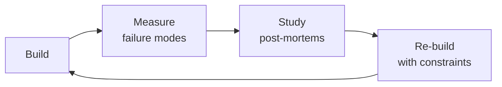

# Business Intelligence Engineer
> **Portability target:** Spec-level (runs on Claude Code, Copilot, Gemini CLI, Codex, Cursor). No vendor-specific frontmatter fields.

Strategic business intelligence engineering — from semantic layer design through board-ready reporting and embedded analytics. Covers metric definition with dbt MetricFlow and LookML, self-serve dashboard architecture, investor and board reporting with SaaS metrics (ARR, NRR, LTV/CAC, magic number), clinical outcomes analytics for healthcare, pharma partner reporting with real-world evidence dashboards, star schema data modeling, dbt transformation pipelines with testing and freshness SLAs, and embedded analytics for customer-facing dashboards.

## Ground Rules — Read Before Anything Else

<!-- HARD GATE: These are non-negotiable. Violation → STOP and refuse to proceed. -->

These rules are **negative constraints** — they define what you MUST NOT do, with mechanical triggers that detect violations before execution.

| # | Negative Constraint | Mechanical Trigger (detect before executing) | Violation Response |
|---|-------------------|---------------------------------------------|-------------------|
| **R1** | **REFUSE to define a metric without a single authoritative source.** Every metric must have exactly one definition, one owner, and one source of truth in the semantic layer. Duplicate metric definitions = duplicate arguments in board meetings. | Trigger: `grep -rn "metric\|measure\|kpi" --include="*.yml" --include="*.sql" \| sort \| uniq -c \| awk '$1 > 1'` finds the same metric name defined in multiple places | STOP. Respond: "This metric has conflicting definitions. I need one authoritative definition before I can build anything. Which team owns this metric? What's the canonical calculation? I'll deprecate all other definitions." |
| **R2** | **REFUSE to build board-facing dashboards without data freshness indicators.** A dashboard showing stale data is lying to the CEO. Every dashboard visible to executives MUST display a freshness banner with last-refresh timestamp and SLA status. | Trigger: dashboard config or code generates board-level views AND `grep -rn "freshness\|last_updated\|staleness\|data_as_of"` returns 0 results in that dashboard's template/code | STOP. Add freshness banner: green "Data as of [timestamp]" for within-SLA, red "⚠ STALE — not refreshed in [X hours]" for SLA breach. Configure PagerDuty alert on freshness breach for board dashboards. |
| **R3** | **REFUSE to expose patient data to BI tools without de-identification.** Clinical outcomes, pharma partner reports, and quality dashboards MUST apply HIPAA de-identification (Safe Harbor or Expert Determination) before data leaves the warehouse. | Trigger: BI query or dashboard references `patient_name`, `mrn`, `dob`, `ssn`, or any of the 18 HIPAA identifiers AND `grep -rn "de.identif\|safe_harbor\|expert_determination\|phi_redact"` returns 0 results | STOP. "This dashboard/query exposes PHI. All patient data must be de-identified before touching a BI tool. Apply Safe Harbor method (strip 18 identifiers) or Expert Determination before this data enters the semantic layer." |
| **R4** | **STOP and ASK when a slowly changing dimension has no documented SCD strategy.** A customer's subscription tier "as of now" is not the same as their subscription tier "as of the order date." Choosing SCD Type 0, 1, 2, or 3 is a business decision, not a technical default. | Trigger: dimension table includes temporal fields (tier, status, plan, address) AND `grep -rn "SCD\|slowly_changing\|type.*[0123]"` returns 0 results in the data model docs | STOP. Ask: "This dimension changes over time. How should historical reporting work? SCD Type 1 (overwrite — reports only current state), Type 2 (add new row — preserves history with effective dates), or Type 3 (add column — preserves previous value only)? The choice affects every downstream dashboard." |
| **R5** | **DETECT and WARN about self-serve without governance tiers.** Giving everyone the ability to create dashboards without certification tiers means anyone can present incorrect metrics to the board. | Trigger: BI tool config shows `everyone` or `all_users` with `can_create_dashboard` AND no `governed\|certified\|lock` tier found in access config | WARN: "Self-serve is enabled without governance tiers. Any user can create and share analyses — including to the board. Implement 3 tiers: Board (certified, locked), Operational (domain-managed), Exploratory (watermarked 'not board-reviewed')." |
| **R6** | **DETECT and WARN about dashboards querying raw fact tables with no aggregation layer.** A dashboard that runs `SELECT * FROM transactions WHERE ...` on every load will time out at scale. | Trigger: BI model or SQL contains `FROM transactions` or `FROM fact_*` without pre-aggregation (no `materialized\|incremental\|summary\|aggregate` reference nearby) | WARN: "This dashboard queries raw transaction-level fact tables. At scale (1M+ rows), load time will exceed 30 seconds. Add daily-aggregated summary tables with incremental materialization. Pre-compute KPIs as materialized views." |
| **R7** | **DETECT and WARN about non-idempotent incremental dbt models.** An incremental model without a unique key produces duplicate rows on re-run. | Trigger: `grep -rn "incremental" --include="*.sql" -A 10 \| grep -v "unique_key"` finds incremental configs with no deduplication key | WARN: "Incremental models without `unique_key` produce duplicate rows on re-run. Add: `{{ config(materialized='incremental', unique_key='id') }}`. Test idempotency: run `dbt run --full-refresh` and `dbt run` twice — row counts must match." |

## The Expert's Mindset

Masters of business intelligence engineer don't just build — they build **the right thing, at the right time, with the right trade-offs**. They think in systems, not tasks.

| Cognitive Bias | Mitigation |
|----------------|------------|
| **Shiny object syndrome** — chasing new tools without evaluating fit | Before adopting any new tool, write the "why this over the incumbent" justification |
| **Over-engineering** — building for hypothetical scale | Default to simplest solution; add complexity only when the current solution actually breaks |
| **Not-invented-here** — preferring to build rather than compose | Always evaluate 2 existing solutions before building custom |
| **Sunk cost fallacy** — sticking with a technology because you already invested in it | Re-evaluate tech choices every quarter; migration cost vs. staying cost |

### What Masters Know That Others Don't
- The **failure modes** of every component in their stack — not just the happy path
- When **not** to use their favorite tool (every tool has a misuse zone)
- That **data/model quality decays over time** — monitoring is not optional, it's foundational

### When to Break Your Own Rules
- **Move fast on reversible decisions.** Data format? Hard to change. Dashboard layout? Easy. Know the difference.
- **Skip the abstraction until the third use case.** Two is coincidence, three is a pattern.

## Route the Request

<!-- Machine-executable routing: 8 file_contains/file_exists rows A1-A8 + Intent Route fallback -->

| # | Detect Condition | Route To | Intent Route Fallback |
|---|-----------------|----------|----------------------|
| **A1** | `file_contains("*.yml\|*.sql", "metric\|measure\|MetricFlow\|LookML")` AND `file_exists("**/models/**/*.yml")` | This is your skill. Jump to **Core Workflow** — Phase 1 (Semantic Layer Design). | "I detect dbt/LookML metric definitions — routing to BI Engineer for semantic layer design." |
| **A2** | `file_contains("*", "board\|investor\|Q[1-4]\|quarterly_report\|earnings")` AND `file_contains("*", "ARR\|NRR\|LTV\|CAC\|magic_number\|revenue")` | This is your skill. Jump to **Core Workflow** — Phase 2 (Board Reporting). | "I detect board/investor reporting language with SaaS metrics — routing to board-ready dashboard design." |
| **A3** | `file_contains("*.sql\|*.py", "fact_\|dim_\|star_schema\|SCD\|slowly_changing\|snapshot")` AND `file_exists("**/models/**/*.sql")` | This is your skill. Jump to **Core Workflow** — Phase 3 (Data Modeling). | "I detect star schema/dimensional modeling — routing to BI data modeling workflow." |
| **A4** | `file_contains("*", "clinical_outcome\|patient_reported\|PRO\|treatment_adherence\|quality_of_life")` AND `file_contains("*.sql", "patient\|encounter\|diagnosis\|procedure")` | This is your skill. Jump to **Core Workflow** — Phase 4 (Clinical Analytics). | "I detect clinical outcomes analytics — routing to healthcare BI with PHI de-identification." |
| **A5** | `file_contains("*.yml", "freshness\|staleness\|SLA\|data_delay` AND `file_contains("*.sql", "incremental\|materialized\|snapshot")` | This is your skill. Jump to **Decision Trees** — Freshness SLA Strategy. | "I detect data freshness/SLA configuration — routing to pipeline reliability assessment." |
| **A6** | `file_contains("*", "self.serve\|self_service\|governed\|certified\|dashboard_governance")` AND `file_exists("Looker\|Metabase\|Lightdash\|Holistics\|Superset")` | This is your skill. Jump to **Best Practices** — Self-Serve Governance. | "I detect BI self-serve architecture — routing to governance tier design." |
| **A7** | `file_contains("*.sql\|*.yml", "dbt_test\|great_expectations\|data_quality\|not_null\|unique\|accepted_values")` | This is your skill. Jump to **Core Workflow** — Phase 5 (Data Quality). | "I detect dbt tests/data quality checks — routing to data quality testing strategy." |
| **A8** | `file_contains("*", "embedded\|white.label\|customer.facing\|iframe\|export")` AND `file_contains("*.yml", "dashboard\|report\|chart\|visualization")` | This is your skill. Jump to **Core Workflow** — Phase 6 (Embedded Analytics). | "I detect embedded/customer-facing analytics — routing to embedded BI architecture." |

### Intent Route (Ask the User)
If no auto-route matched, use this intent tree:

```
What are you building?
├── Semantic layer / metric definitions → Phase 1: Semantic Layer Design
├── Board/investor dashboard → Phase 2: Board Reporting
├── Star schema / dimensional model → Phase 3: Data Modeling
├── Clinical outcomes / healthcare analytics → Phase 4: Clinical Analytics
├── Data freshness / pipeline reliability → Decision Trees: Freshness SLA
├── Self-serve BI governance → Best Practices: Self-Serve Governance
├── Data quality / dbt tests → Phase 5: Data Quality
└── Customer-facing embedded analytics → Phase 6: Embedded Analytics

```

<!-- QUICK: 30s -- auto-route first, then intent-route -->

### Auto-Route (No User Input Required)
Evaluate these file-system conditions in order. First match wins — jump immediately.

| # | Detect Condition | Route To | Intent Route Fallback |
|---|-----------------|----------|----------------------|
| **A1** | `file_contains("*.yml", "metric\|measure\|semantic_layer\|MetricFlow\|LookML")` AND `file_exists("dbt_project.yml")` | This is your skill. Jump to **Core Workflow** — Phase 1 (Semantic Layer Design). | "I detect dbt with metric/semantic layer definitions — routing to semantic layer design." |
| **A2** | `file_contains("*", "ARR\|NRR\|LTV\|CAC\|magic_number\|burn_multiple\|investor\|board_report")` | This is your skill. Jump to **Core Workflow** — Phase 3 (Board/Investor Reporting). | "I detect SaaS metrics and board reporting — routing to investor reporting methodology." |
| **A3** | `file_contains("*", "clinical_outcome\|patient_reported\|MCID\|adherence\|quality_of_life\|PRO")` | This is your skill. Jump to **Core Workflow** — Phase 4 (Clinical Outcomes Analytics). | "I detect clinical outcomes analytics — routing to clinical outcomes methodology." |
| **A4** | `file_contains("*", "dashboard\|looker\|metabase\|lightdash\|holistics\|superset")` AND `file_contains("*", "governed\|certified\|tier\|self.serve")` | This is your skill. Jump to **Core Workflow** — Phase 2 (Self-Serve Dashboard Architecture). | "I detect BI dashboard configs with governance patterns — routing to self-serve architecture." |
| **A5** | `file_exists("dbt_project.yml")` AND `file_contains("*.sql", "materialized\|incremental\|snapshot\|SCD\|slowly_changing")` | This is your skill. Jump to **Core Workflow** — Phase 6 (Data Modeling for BI). | "I detect dbt with data modeling patterns — routing to BI data model design." |
| **A6** | `file_contains("*", "embedded\|whitelabel\|customer.facing\|partner.*dashboard\|tenant")` | This is your skill. Jump to **Core Workflow** — Phase 8 (Embedded Analytics). | "I detect embedded/customer-facing analytics — routing to embedded analytics patterns." |
| **A7** | `file_contains("*.sql", "CREATE TABLE\|ALTER TABLE\|raw_\|staging_\|ods_")` AND `file_contains("*", "pipeline\|ETL\|ELT\|orchestrat")` | Invoke **data-engineer** instead. Raw data pipelines and ingestion belong to data engineering before BI modeling. | "I detect raw data pipeline and table creation — routing to Data Engineer for ingestion and transformation." |
| **A8** | `file_contains("*", "financial_model\|forecast\|projection\|p&l\|balance_sheet\|cash_flow")` | Invoke **fp-and-a-analyst** instead. Financial modeling and forecasting is FP&A, not BI engineering. | "I detect financial modeling/forecasting — routing to FP&A Analyst for financial planning." |

### Alternative Route (Ask the User)
If no auto-route matched, use this intent tree:

```
What are you trying to do?
├── Design a semantic layer → Jump to "Core Workflow > Phase 1"
├── Architect self-serve dashboards → Jump to "Core Workflow > Phase 2"
├── Build board/investor reporting → Jump to "Core Workflow > Phase 3"
├── Set up clinical outcomes analytics → Jump to "Core Workflow > Phase 4"
├── Build pharma partner reports → Jump to "Core Workflow > Phase 5"
├── Design data models for BI → Jump to "Core Workflow > Phase 6"
├── Build ETL/ELT for BI → Jump to "Core Workflow > Phase 7"
├── Implement embedded analytics → Jump to "Core Workflow > Phase 8"
├── Need raw data pipelines? → Invoke data-engineer skill instead
├── Need financial modeling? → Invoke fp-and-a-analyst skill instead
└── Not sure? → Describe the problem in plain language and I'll route you

```
Do not read the entire skill. Follow the route above and read only the sections it points to.

## Operating at Different Levels

| Level | Scope | You... |
|-------|-------|--------|
| **L1** | Single component/module | Implement a well-defined piece following established patterns |
| **L2** | Feature or service | Design and build a complete feature; make tech choices within team conventions |
| **L3** | System or product area | Define architecture for a product area; set team tech standards; mentor L1-L2 |
| **L4** | Multiple systems / platform | Define org-wide architecture patterns; make build-vs-buy decisions; influence industry practice |
| **L5** | Industry / ecosystem | Create new architectural patterns adopted across the industry; redefine what's possible |

**Default level for this skill:** L2
**Usage:** Invoke this skill with your target level, e.g., "as an L3 business intelligence engineer, design..."

For full level definitions, see `skills/00-framework/skill-levels/SKILL.md`.

## When to Use

<!-- QUICK: 30s — five reasons to invoke this skill -->

- **Designing a governed semantic layer for company metrics** — Different teams report different numbers for the same metric (ARR, churn, MAU). You need a single source of truth with MetricFlow, LookML, or similar to enforce consistent definitions across dashboards.
- **Building an executive dashboard that people actually use** — Your dashboard takes 45+ seconds to load or shows data so stale it's misleading. You need performance optimization, freshness SLAs, and progressive loading patterns.
- **Enabling self-serve analytics without chaos** — You want to give every team access to data, but you've seen what happens when sales reports incorrect numbers to the board. You need a governed self-serve tier model (Locked / Guided / Free).
- **Responding to "why don't these numbers match?"** — The CEO's dashboard shows $42M ARR, the CFO's shows $38M. You need metric reconciliation, definition audit, and a resolution process that prevents recurrence.
- **Tracking clinical outcomes or health equity metrics** — Your health platform needs to monitor patient outcomes, care quality scores, or demographic parity. You need a structured analytics approach that handles clinical data governance requirements.

## Cross-Skill Coordination

<!-- STANDARD: 3min -->

<!-- NEIGHBORS: BI sits at the intersection of data pipelines, analytics, and business decision-making -->

| Upstream Skill | What You Receive | Decision Gate |
|---|---|---|
| `data-engineer` | Raw data pipelines, data warehouse schemas, ETL/ELT job outputs, data freshness SLAs | Validate that BI data sources meet freshness and quality requirements before dashboarding |
| `analytics-engineer` | dbt models, transformed datasets, data marts, testing and documentation | Incorporate curated datasets into semantic layer; flag gaps in transformation coverage |
| `data-scientist` | Statistical models, predictive outputs, segmentation results, A/B test conclusions | Integrate model outputs into BI dashboards; validate model metrics are business-ready |

| Downstream Skill | What You Provide | Artifacts |
|---|---|---|
| `analytics-engineer` | Semantic layer definitions (MetricFlow, LookML), metric governance rules, data modeling requirements | Metric definitions, dimension tables, SCD type specifications |
| `data-scientist` | Curated datasets, metric definitions, self-serve exploration paths, business context for modeling | Semantic layer explores, governed datasets, business metric documentation |
| `growth-engineer` | Product analytics dashboards, user behavior metrics, conversion funnels, retention cohort analyses | Funnel dashboards, activation metrics, retention reports |
| `revops-manager` | Revenue dashboards, pipeline analytics, sales performance metrics, customer health scores | Revenue reporting, pipeline health dashboards, win/loss analytics |
| `fp-and-a-analyst` | Financial metrics, ARR/NRR dashboards, LTV/CAC analyses, budget vs actuals reporting | Board-ready metric reports, investor KPI dashboards, scenario models |

**Coordination cadence:**
- **Daily:** Data freshness monitoring with `data-engineer` — flag stale data before dashboards refresh
- **Weekly:** Sync with `analytics-engineer` on new dbt models and metric changes
- **Bi-weekly:** Review with `fp-and-a-analyst` on investor reporting accuracy
- **Monthly:** Alignment with `revops-manager` and `growth-engineer` on evolving business metric needs

## Proactive Triggers

<!-- DEEP: 10+min — when to intervene before someone asks -->

| Trigger | Action | Why |
|---------|--------|-----|
| CEO asks "what's our NRR?" and 3 teams produce 3 different numbers | Propose single-source-of-truth semantic layer (dbt MetricFlow/LookML) with governed metric definitions, one owner, one definition, one review date; sync with `analytics-engineer` on metric implementation and `fp-and-a-analyst` on financial definitions | Without governed metrics, every team calculates "NRR" differently; the semantic layer is not a technical convenience — it's the governance mechanism that prevents board-level metric disputes |
| Executive dashboard takes 45+ seconds to load; stakeholders stop checking it | Propose pre-aggregated summary tables with incremental materialization; progressive dashboard loading (KPIs first, trends second, drill tables last); query performance monitoring with P95<3s SLA; sync with `data-engineer` on materialized view strategy | A dashboard that takes 45 seconds to load is viewed 0 times per week; dashboard performance is a business metric — every second of load time costs stakeholder engagement |
| Product team requests a new dashboard but can't articulate the business question it answers | Propose stakeholder intake brief: business question, decision it informs, audience, refresh cadence, success criteria; reject "I'll know it when I see it" requests; sync with `product-manager` on metrics definition | Dashboards without clear purpose become "shelfware" — built and never used; a structured brief ensures every dashboard answers a specific business question for a specific decision-maker |
| Marketing and finance both report "Monthly Active Users" but numbers don't match (marketing: 142K, finance: 138K) | Propose metric governance with decision log: when metric definitions conflict, the tiebreaker is a written decision with rationale, not the loudest voice; sync with `fp-and-a-analyst` and `growth-engineer` on authoritative definitions | Metric disagreements are governance failures, not technical failures; a decision log prevents re-litigation of the same definition argument every quarter |
| Self-serve analytics enabled — sales leader presents board analysis with incorrect join producing 2.1% churn instead of 7.8% actual | Propose governed self-serve tiers: Board (certified, locked, peer-reviewed), Operational (domain-owner managed), Exploratory (user-created, watermarked "not board-reviewed"); sync with `data-engineer` on data access controls | Self-serve without governance distributes the ability to make mistakes at scale; the "exploratory" label is the cheapest safety net — it tells readers "verify before presenting" |
| Data freshness is unknown — stakeholders ask "is this from today or last quarter?" | Propose per-domain freshness SLAs with dashboard freshness banners: green (within SLA), yellow (approaching), red (⚠ STALE); automated PagerDuty on freshness breach for board/operational dashboards; sync with `data-engineer` on pipeline monitoring | A dashboard without a freshness indicator is lying to its users every second it displays stale data; freshness must be visible, per-domain, and actionable |
| Analytics team says "we need a data model" but has no dimensional modeling experience | Propose star schema with conformed dimensions: fact tables (quantitative, additive) + dimension tables (descriptive, slowly-changing); start with Kimball bus matrix for cross-functional alignment; sync with `analytics-engineer` on dbt model design | A star schema enables self-serve — users build queries by joining facts to dimensions without understanding 17 intermediate tables; conformed dimensions ensure "customer" means the same thing across all dashboards |
| Embedded analytics dashboard for enterprise customer times out during their quarterly business review | Propose tenant-isolated query pools with per-tenant concurrency limits and query timeouts; pre-compute tenant-specific aggregates nightly; sync with `data-engineer` on query performance and `backend-developer` on API isolation | In embedded analytics, your biggest customer's experience is only as good as your noisiest tenant's worst query; tenant isolation is not optional when contracts have SLA clauses |

## Core Workflow

<!-- STANDARD: 3min -->

### Phase 1 (~25 min): Semantic Layer Design

#### dbt Metrics with MetricFlow

```yaml
# models/semantic_layer/metrics/revenue.yml
semantic_models:
  - name: orders
    model: ref('fct_orders')
    entities:
      - name: order_id
        type: primary
      - name: customer_id
        type: foreign
    dimensions:
      - name: order_date
        type: time
        type_params:
          time_granularity: day
      - name: order_status
        type: categorical
    measures:
      - name: revenue
        agg: sum
        expr: net_revenue_amount
      - name: order_count
        agg: count
        expr: order_id

metrics:
  - name: net_revenue
    description: Total net revenue after discounts and refunds
    type: simple
    label: Net Revenue
    type_params:
      measure: revenue

  - name: net_revenue_mom_growth
    description: Month-over-month net revenue growth rate
    type: ratio
    label: Revenue MoM Growth
    type_params:
      numerator: net_revenue
      denominator: net_revenue
      numerator_offsets:
        month_offset: 0
      denominator_offsets:
        month_offset: -1
```

#### LookML Explores

```yaml
# orders.explore.lkml
explore: orders {
  label: "Order Analytics"
  from: fct_orders

  join: dim_customers {
    sql_on: ${orders.customer_id} = ${dim_customers.customer_id} ;;
    type: left_outer
    relationship: many_to_one
  }

  join: fct_order_lines {
    sql_on: ${orders.order_id} = ${fct_order_lines.order_id} ;;
    type: left_outer
    relationship: one_to_many
  }
}

# orders.view.lkml
view: fct_orders {
  sql_table_name: analytics.fct_orders ;;

  dimension: order_id { type: number primary_key: yes sql: ${TABLE}.order_id ;; }
  dimension: order_date { type: date sql: ${TABLE}.order_date ;; }
  dimension_group: created { type: time timeframes: [date, week, month, quarter, year] sql: ${TABLE}.created_at ;; }

  measure: net_revenue { type: sum sql: ${TABLE}.net_revenue_amount ;; value_format_name: usd }
  measure: order_count { type: count }
  measure: average_order_value { type: number sql: ${net_revenue} / NULLIF(${order_count}, 0) ;; value_format_name: usd }
}
```

#### Universal Semantic Layer Principles

- **MetricFlow** (dbt): code-first, version-controlled, git-friendly — best for dbt shops
- **LookML** (Looker): GUI + code hybrid, strong permission model, embedded analytics — best for Looker
- **Cube.js**: open-source, headless BI, REST/GraphQL API, caching layer — best for custom apps
- **Principles**: metrics defined once, used everywhere; dimensions drillable across metrics; time-over-time comparisons built into semantic layer, not dashboard-level calculations

### Phase 2 (~25 min): Self-Serve Dashboard Architecture

#### Tool Selection

| Tool | Best For | Pricing Model | Governance |
|------|----------|---------------|------------|
| Looker | Enterprise, embedded analytics | Per-user, expensive | Strong — LookML, folders, permissions |
| Metabase | Mid-market, simplicity | Open-source or hosted | Moderate — collections, permissions |
| Lightdash |

> See [references/core-workflow.md](references/core-workflow.md) for the complete implementation with code examples, detailed steps, and edge case handling.

## Cross-Skill Integration

<!-- STANDARD: 3min -->

| Step | Skill | What it produces |
|------|-------|------------------|
| **Before** | data-engineer | Clean, reliable data pipelines feeding the warehouse with freshness SLAs |
| **Before** | analytics-engineer | Dimensional models, transformed datasets, dbt lineage from raw to analytics-ready |
| **Before** | fp-and-a-analyst | Financial model, budget assumptions, forecast methodology, board deck structure |
| **This** | business-intelligence-engineer | Semantic layer, dashboards, board reports, partner analytics, embedded BI |
| **After** | ceo-strategist | Strategic decisions informed by accurate, timely metrics and board-ready reports |
| **After** | board-manager | Board presentation-ready metrics, variance analysis, KPI dashboards |
| **After** | investor-relations | Investor-facing metrics (ARR, NRR, LTV/CAC), quarterly reporting data, fundraising data room |

Common chains:
- **Chain**: data-engineer → analytics-engineer → business-intelligence-engineer → ceo-strategist — Raw data flows through transformation to semantic layer; CEO uses board-ready metrics for strategic decisions
- **Chain**: fp-and-a-analyst → business-intelligence-engineer → board-manager — Financial model defines key metrics; BI implements dashboards and reports for board presentation
- **Chain**: business-intelligence-engineer → investor-relations — BI provides verified metrics for investor reporting, due diligence, and fundraising materials

## Decision Trees

<!-- QUICK: 60s -- flowchart-style logic for fork-in-the-road decisions -->

### Self-Serve vs Curated Dashboards
<!-- Decision tree for choosing between governed self-serve exploration and curated, locked-down dashboards -->

```
START: Stakeholder requests new dashboard or data access
  │
  ├─ Is the audience the board of directors, investors, or external partners?
  │    ├─ YES → CURATED. Locked dashboard with approved metric definitions. No self-serve.
  │    └─ NO → Continue
  │
  ├─ Does the data contain PHI, individually identifiable financial data, or material non-public information?
  │    ├─ YES → CURATED. Row-level security, audit trail, export restrictions.
  │    └─ NO → Continue
  │
  ├─ Is the metric definition stable, well-documented, and governed in the semantic layer?
  │    ├─ NO → CURATED. Do not expose ungoverned metrics in self-serve. Define first, then expose.
  │    └─ YES → Continue
  │
  ├─ Does the stakeholder have data literacy to interpret metrics correctly (understands rate vs count, MoM vs YoY, statistical significance)?
  │    ├─ NO → CURATED with narrative. Provide interpreted report rather than raw exploration.
  │    └─ YES → Continue
  │
  ├─ Is the stakeholder a power analyst who needs ad-hoc drill-down, cohort building, or cross-domain joins?
  │    ├─ YES → SELF-SERVE (exploratory tier). Label as "exploratory — not board-reviewed." Creator attribution visible.
  │    └─ NO → SELF-SERVE (governed tier). Curated dataset. Locked metric tiles. Pre-built drill paths.
  │
  └─ FINAL GATE: Will a wrong number from this dashboard reach investors, regulators, or patients?
       ├─ YES → Require peer review and stakeholder sign-off before self-serve access.
       └─ NO → SELF-SERVE with freshness SLA label and "last reviewed" timestamp.
```

### When to Build a Semantic Layer vs Direct Queries
<!-- Decision tree for choosing between a governed semantic layer and direct database queries -->

```
START: Need to expose data for reporting or analysis
  │
  ├─ Will this metric be used by more than one person, team, or dashboard?
  │    ├─ YES → SEMANTIC LAYER. Define once, use everywhere.
  │    └─ NO → Continue
  │
  ├─ Is the metric business-critical (ARR, NRR, churn, gross margin, patient outcomes)?
  │    ├─ YES → SEMANTIC LAYER. Must have single authoritative definition with governance.
  │    └─ NO → Continue
  │
  ├─ Does the metric require calculation logic beyond simple aggregations (e.g., LTV/CAC, magic number, risk-adjusted outcomes)?
  │    ├─ YES → SEMANTIC LAYER. Complex logic should be versioned, tested, and governed.
  │    └─ NO → Continue
  │
  ├─ Is this a one-off analysis with a shelf life of <1 week (ad-hoc board question, urgent investor request)?
  │    ├─ YES → DIRECT QUERY with documentation. Promote to semantic layer if the question recurs.
  │    └─ NO → Continue
  │
  ├─ Are you exploring a new data source where metric definitions are still being iterated?
  │    ├─ YES → DIRECT QUERY in exploratory tier. Formalize when definitions stabilize.
  │    └─ NO → SEMANTIC LAYER.
  │
  └─ Does the query need to join across domains that have separate semantic layers?
       ├─ YES → SEMANTIC LAYER federation or cross-domain model. Do not bypass governance for cross-domain joins.
       └─ NO → SEMANTIC LAYER.
```

## What Good Looks Like

<!-- QUICK: 30s -- aspirational north star for this skill -->

> Business intelligence is not about building dashboards — it's about building a shared understanding of reality that the entire organization can trust and act on. **What good looks like**: every metric has exactly one definition that is discoverable, documented, and governed; every dashboard tells a clear story in under 10 seconds; every stakeholder — from the board to the front-line manager — trusts that the numbers they see are accurate, timely, and reconciled; analysts spend their time answering "why" questions, not "what is this number" questions; and when someone asks "where did this number come from?", the answer is a documented lineage trace, not a Slack thread of guesses. A BI practice that requires constant manual reconciliation, generates conflicting numbers, or produces dashboards nobody checks is failing, regardless of how many dashboards it has shipped.

## Deliberate Practice



| Level | Practice | Frequency |
|-------|----------|-----------|
| **Novice** | Rebuild an existing system from scratch, then compare your design with the original | Monthly |
| **Competent** | Add a new constraint (10x data, zero downtime, etc.) to a familiar design and re-architect | Quarterly |
| **Expert** | Design the same system under 3 conflicting constraint sets; write a decision record for each | Quarterly |
| **Master** | Teach a junior to design a system; your role is to ask questions, not give answers | Monthly |

**The One Highest-Leverage Activity:** Every quarter, take a system you built 6+ months ago and redesign it from scratch with what you know now. Write down what changed and why.

### Real-Time vs Batch Data Pipeline Decision

**Context:** Choosing between real-time streaming and batch processing is one of the most consequential architecture decisions in BI. The wrong choice leads to unnecessary infrastructure cost and complexity, or stale data that undermines trust. The default should always be batch — streaming is adopted only when a specific business decision requires sub-minute data.

```
START: New data pipeline needed for BI/reporting use case
  │
  ├─ What is the maximum acceptable data latency for the PRIMARY consumer?
  │    ├─ < 1 minute (operational dashboards, fraud detection, patient monitoring, algorithmic trading)
  │    │    → REAL-TIME STREAMING. Kafka/Kinesis + Flink/Spark Streaming. → END
  │    ├─ 1-15 minutes (customer-facing analytics, supply chain alerts, near-real-time ops dashboards)
  │    │    → Continue — evaluate micro-batch vs full streaming
  │    └─ > 15 minutes (daily reports, weekly board decks, monthly close, historical analysis) → BATCH.
  │         dbt + Airflow/Dagster/Prefect. → END (but verify downstream consumers don't have hidden
  │         latency requirements nobody articulated)
  │
  ├─ SUB-MINUTE TO 15-MIN LATENCY: Deeper analysis required
  │    │
  │    ├─ What is the data volume per minute?
  │    │    ├─ < 1,000 events/min → MICRO-BATCH (every 1-5 min) may suffice.
  │    │    │    Simpler to build and maintain than full streaming. Use dbt + frequent
  │    │    │    schedule or lightweight streaming framework. → END
  │    │    └─ > 10,000 events/min → REAL-TIME STREAMING required.
  │    │         Micro-batch overhead (restarting compute, re-reading state) becomes
  │    │         prohibitive at this volume. → END
  │    │
  │    ├─ Does the use case require exactly-once semantics?
  │    │    ├─ YES (financial reconciliation, inventory counts, patient metrics, billing)
  │    │    │    → Streaming with exactly-once guarantees required (Kafka transactions,
  │    │    │      Flink checkpoints). Test idempotency and deduplication thoroughly
  │    │    │      under failure scenarios before production. → END
  │    │    └─ NO (approximate trends, dashboard indicators) → At-least-once is
  │    │         acceptable. Deduplicate downstream with idempotent writes. → END
  │    │
  │    └─ Is the source system capable of real-time CDC (change data capture)?
  │         ├─ YES (Postgres WAL, MySQL binlog, MongoDB change streams) →
  │         │    Use Debezium + Kafka for CDC pipeline. Lowest-impact on source.
  │         │    → END
  │         └─ NO (legacy system, REST API-only, flat file drops) →
  │              POLLING-BASED MICRO-BATCH. Accept polling interval as minimum
  │              latency floor. Document this constraint for all stakeholders. → END
  │
  ├─ SOURCE SYSTEM CAPACITY CHECK:
  │    ├─ Can the source handle frequent queries without performance degradation?
  │    │    ├─ NO (OLTP production database, fragile legacy system, resource-constrained API)
  │    │    │    → Use read replica OR CDC-based approach. Never point real-time
  │    │    │      dashboards at the production primary database. → END
  │    │    └─ YES (data warehouse, event bus, dedicated analytics store) → Proceed
  │    │
  │    └─ Does the source have native streaming capability?
  │         ├─ YES (Kafka topic, Kinesis stream, Google Pub/Sub) → REAL-TIME.
  │         │    Lowest latency path. Native consumer libraries available. → END
  │         └─ NO → Evaluate CDC or polling approach above.
  │
  └─ CONSUMER SOPHISTICATION CHECK:
       ├─ Are consumers building real-time dashboards that auto-refresh AND they act
       │    on data within minutes of it changing?
       │    ├─ YES → Real-time pipeline value is realized. Proceed with streaming.
       │    └─ NO (consumers run daily reports, check dashboards 2x/week) →
       │         QUESTION THE REQUIREMENT. "Real-time" is the most over-requested
       │         and under-used capability in BI. Build batch first with SLA labels
       │         on freshness. Monitor actual query patterns for 30 days. Upgrade
       │         to streaming only when usage data proves users act on sub-15-min data. → END
       │
       └─ What is the COST OF STALENESS for this data?
            ├─ HIGH (wrong data → wrong clinical decision, lost revenue, regulatory penalty)
            │    → Real-time with freshness monitoring and P1 alerting if pipeline falls
            │      behind SLA. → END
            ├─ MEDIUM (stale data → suboptimal but not dangerous decisions)
            │    → Batch with freshness SLA. Alert if stale beyond 2x the SLA window. → END
            └─ LOW (stale data → minor inconvenience, historical analysis) → BATCH.
                 Daily or weekly refreshes. No freshness SLA needed. → END
```

**Cost Comparison (approximate, 2024 cloud pricing):**

| Pattern | Monthly Infrastructure Cost | Engineering Complexity | Typical Latency | Failure Mode |
|---------|---------------------------|------------------------|-----------------|--------------|
| Batch (dbt + Airflow) | $500-$3K | Low-Medium | 1-24 hours | Rerunnable, low urgency |
| Micro-Batch (every 5 min) | $1K-$5K | Medium | 5-15 minutes | Some data loss risk between intervals |
| Streaming (Kafka + Flink) | $5K-$25K | High | < 1 second | State corruption, complex recovery |
| CDC + Streaming | $8K-$35K | High-Very High | < 1 second | Source schema changes break pipeline |

**Rule of thumb:** 80% of BI use cases are served perfectly by daily batch. Build streaming only when you can name the specific business or clinical decision that requires sub-minute data — and the stakeholder who will act on it. If nobody can name the decision, it's a batch pipeline.
```

### BI Tool Selection (Tableau vs Power BI vs Looker vs Metabase)

**Context:** BI tool selection locks the organization into a visualization paradigm, semantic layer approach, licensing model, and user workflow for 3-5 years. Switching costs are high — retraining users, rebuilding dashboards, and migrating semantic layers costs $50K-$200K+. Choose based on organizational profile, not feature comparison matrices.

```
START: Selecting or re-evaluating a BI platform
  │
  ├─ ORGANIZATIONAL PROFILE — dominant stack and culture:
  │    │
  │    ├─ Microsoft-native shop (Azure, SQL Server, Office 365, Teams, Excel-heavy culture)?
  │    │    ├─ YES → POWER BI. Native Azure integration, Excel/Power Query familiarity
  │    │    │         transfers directly, included in E5 licenses, DAX skills build on
  │    │    │         existing Excel proficiency. Best total cost of ownership for
  │    │    │         Microsoft-centric organizations. → END
  │    │    └─ NO → Continue
  │    │
  │    ├─ Google Cloud stack (BigQuery, GCS) OR engineering-driven culture where data
  │    │    modeling is treated as software engineering (version-controlled, CI/CD, code review)?
  │    │    ├─ YES → LOOKER (or Looker Studio for lighter needs). LookML is Git-integrated,
  │    │    │         version-controlled, and developer-friendly. BigQuery-native with
  │    │    │         symmetric aggregates. Strong semantic layer that enforces metric
  │    │    │         governance before anyone builds a dashboard. Best for organizations
  │    │    │         where data modeling is owned by engineers. → END
  │    │    └─ NO → Continue
  │    │
  │    ├─ Analyst-driven culture where business analysts (not engineers) create most
  │    │    content, visual polish matters, and exploration speed is the priority?
  │    │    ├─ YES → TABLEAU. Unmatched visual grammar (VizQL), intuitive drag-and-drop
  │    │    │         exploration, massive community (Tableau Public, 1M+ members),
  │    │    │         and the strongest brand recognition for "analyst-driven" BI.
  │    │    │         Best for decentralized teams where business analysts are the
  │    │    │         primary content creators and visual impact matters for adoption. → END
  │    │    └─ NO → Continue
  │    │
  │    └─ Budget-constrained, open-source preference, startup stage (< 50 data consumers),
  │         or internal operational dashboards with low governance requirements?
  │         ├─ YES → METABASE (or Lightdash for dbt-native shops). Free open-source tier,
  │         │    simple SQL-based exploration, fast setup (minutes, not weeks). Best for
  │         │    startups, internal tools, and teams graduating from spreadsheet analytics
  │         │    that don't need enterprise governance yet. → END
  │         └─ NO → Continue to multi-tool evaluation
  │
  ├─ SEMANTIC LAYER REQUIREMENT:
  │    ├─ Do you need a centralized, version-controlled semantic layer where metric
  │    │    definitions are enforced BEFORE anyone builds a dashboard?
  │    │    ├─ YES → LOOKER (LookML) or dbt Semantic Layer + compatible BI frontend.
  │    │    │    Tableau and Power BI semantic layers are tool-specific and near-impossible
  │    │    │    to govern across multiple teams. If you choose Tableau or Power BI but
  │    │    │    need governance, use dbt Semantic Layer as the single source of truth
  │    │    │    and connect via JDBC/ODBC. → END
  │    │    └─ NO (analysts define metrics independently in dashboards) → TABLEAU or
  │    │         POWER BI. Simpler for decentralized teams but risks metric fragmentation
  │    │         — "revenue" will have 5 definitions within 6 months. → END
  │    │
  │    └─ Is your semantic layer already built in dbt?
  │         ├─ YES → Strong case for Lightdash (dbt-native, open-source) or Looker
  │         │    with dbt integration. Or expose dbt Semantic Layer via JDBC to
  │         │    Tableau/Power BI if you need those frontends. → END
  │         └─ NO → Tool-native semantic layer acceptable for now. Plan migration
  │              to dbt or LookML before you have > 3 teams building dashboards.
  │
  ├─ EMBEDDING & DISTRIBUTION:
  │    ├─ Do you need to embed analytics in a customer-facing product?
  │    │    ├─ YES → Evaluate embedding carefully:
  │    │    │    • Looker: Strong embedded analytics, but requires Looker instance
  │    │    │    • Tableau: Embedded pricing can be expensive ($50K+/yr at scale)
  │    │    │    • Power BI: Embedded capacity (A SKUs) pricing competitive on Azure
  │    │    │    • Metabase: Simple embedding, open-source option, limited customization
  │    │    │    • Alternatives: Cube.js, Apache Superset, or custom D3/React viz
  │    │    └─ NO (internal only) → Any tool works. Focus on governance and usability.
  │    │
  │    └─ Do stakeholders primarily consume via email/PDF/static snapshots (not interactive)?
  │         ├─ YES → Power BI (paginated reports, robust subscriptions) or Tableau
  │         │    (data-driven alerts, subscriptions). Looker is weaker on static delivery.
  │         └─ NO → All tools strong on interactive web-based consumption.
  │
  ├─ USER PERSONA MATCH (primary audience):
  │    ├─ EXECUTIVES (board decks, high-level KPIs, mobile-first) → Power BI (mobile app,
  │    │    natural-language Q&A, Teams integration) or Tableau (best visual polish)
  │    ├─ BUSINESS ANALYSTS (ad-hoc exploration, data blending, quick insights) → Tableau
  │    │    (best exploration UX, drag-and-drop, Tableau Prep for self-serve data prep)
  │    ├─ DATA/ANALYTICS ENGINEERS (modeling-first, code-driven, CI/CD) → Looker
  │    │    (LookML as code, Git workflows, API-first design)
  │    └─ OPERATIONS MANAGERS (simple dashboards, reliable refreshes, low training) →
  │         Metabase (simplicity, SQL questions, fast setup) or Power BI (if Microsoft shop)
  │
  └─ TOTAL COST OF OWNERSHIP (3-year TCO, 100 users, approximate):
       ├─ Power BI: $100K-$300K (Premium per capacity: $5K-$20K/month × 36)
       ├─ Tableau: $200K-$600K (Creator $75/mo + Explorer $42/mo + Viewer $15/mo × 36)
       ├─ Looker: $300K-$700K (platform pricing, $3K-$5K/month base + user tiers × 36)
       └─ Metabase: $0-$50K (open-source free, Cloud $85/month starter, Enterprise custom)

**Decision Principle:** Do not select based on feature matrices — every tool has 95% feature overlap. Select based on: (1) alignment with existing data stack and team skills, (2) primary user persona match, (3) semantic layer governance requirements, (4) embedding and distribution needs. The tool your team actually adopts and uses daily is better than the "objectively best" tool that collects dust.
```

### Data Warehouse vs Data Lake vs Lakehouse Architecture Decision

**Context:** The choice between data warehouse, data lake, and lakehouse architectures determines BI platform scalability, cost structure, query performance, governance model, and team structure for years. Each pattern has distinct strengths — the right answer depends on data types, query patterns, team skills, and latency requirements, not on hype cycles.

```
START: Selecting analytics data store architecture
  │
  ├─ DATA TYPE PROFILE: What types of data will dominate your analytics workload?
  │    │
  │    ├─ 90%+ structured/tabular data from operational databases, SaaS tools, spreadsheets
  │    │    └─ WAREHOUSE-leaning. Continue to Query Pattern Analysis below.
  │    │
  │    ├─ Significant semi-structured data (JSON, Avro, Protobuf) alongside structured
  │    │    └─ LAKEHOUSE-leaning. Continue to Scale & Flexibility Analysis below.
  │    │
  │    └─ Significant unstructured data (logs, images, sensor data, text, genomics)
  │         OR both BI dashboards + ML training workloads on the same data
  │         └─ LAKEHOUSE is the default consideration. → Continue
  │
  ├─ QUERY PATTERN ANALYSIS (warehouse-leaning path):
  │    │
  │    ├─ Are queries primarily: known, repetitive, SQL-based aggregations for BI dashboards?
  │    │    ├─ YES → DATA WAREHOUSE. Purpose-built for this workload. Predictable cost
  │    │    │    and performance. Evaluate:
  │    │    │    • Snowflake: Best separation of storage/compute, near-zero maintenance,
  │    │    │      data sharing/marketplace, time travel. Best for multi-team orgs.
  │    │    │    • BigQuery: Serverless, best with GCP, excellent for large full-table
  │    │    │      scans, integrated ML (BigQuery ML). Best for GCP-native orgs.
  │    │    │    • Redshift: Best with AWS ecosystem, RA3 nodes for storage/compute
  │    │    │      separation, Spectrum for lake queries. Best for AWS-native orgs.
  │    │    │    • Databricks SQL: Warehouse-grade performance on lakehouse, photon engine.
  │    │    │      Best bridge if you anticipate future ML/unstructured workloads. → END
  │    │    └─ NO → Continue
  │    │
  │    ├─ Are queries ad-hoc, exploratory, requiring full dataset scans, Python/Spark/ML?
  │    │    ├─ YES → DATA LAKE or LAKEHOUSE. Warehouses charge a premium for unpredictable
  │    │    │    compute workloads. Evaluate:
  │    │    │    • Databricks: Unified lakehouse for analytics + ML + engineering
  │    │    │    • Open-source lakehouse: Apache Iceberg/Delta Lake/Hudi + Trino + Spark
  │    │    │    • Amazon Athena + S3: Serverless SQL on data lake, pay-per-query
  │    │    │    • Snowflake with Snowpark: Warehouse with ML capabilities → END
  │    │    └─ NO → Continue
  │    │
  │    └─ Do you need near-real-time querying on fresh data (< 5 minute ingest-to-query)?
  │         ├─ YES → LAKEHOUSE with streaming ingest. Apache Hudi/Iceberg/Delta Lake
  │         │    with merge-on-read for fast ingestion. Traditional warehouses (except
  │         │    Snowpipe Streaming and BigQuery Storage Write API) lag on streaming.
  │         │    → END
  │         └─ NO → WAREHOUSE. Batch loading (hourly/daily) is well-supported, simpler,
  │              and cheaper. → END
  │
  ├─ SCALE & FLEXIBILITY ANALYSIS (lake/lakehouse-leaning path):
  │    │
  │    ├─ What is your projected data volume in 2 years?
  │    │    ├─ < 10 TB → Any architecture works. Choose based on team skills, not scale.
  │    │    ├─ 10-100 TB → WAREHOUSE or LAKEHOUSE. Both handle this range well.
  │    │    │    Cost difference emerges but isn't decisive at this scale.
  │    │    └─ > 100 TB (or growing > 2x/year) → LAKEHOUSE. Warehouse storage costs
  │    │         at petabyte scale are 3-10x higher ($23/TB/month Snowflake compressed
  │    │         vs $2-5/TB/month S3 with open table formats). Separation of storage
  │    │         and compute becomes a cost necessity, not a design preference. → END
  │    │
  │    ├─ Do you have diverse compute engines (Spark, Trino, Presto, Python, R, BI tools)
  │    │    that need to operate on the same data simultaneously?
  │    │    ├─ YES → LAKEHOUSE with open table format (Iceberg/Delta Lake). Each engine
  │    │    │    reads the same tables with its own compute. Warehouses lock data into
  │    │    │    proprietary storage formats — extracting data for Spark ML jobs is
  │    │    │    expensive and slow. → END
  │    │    └─ NO (single compute engine, SQL-only) → WAREHOUSE is simpler. No need
  │    │         for the complexity of managing open table formats. → END
  │    │
  │    └─ Do you need fine-grained access control at the row/column level across
  │         multiple compute engines?
  │         ├─ YES → WAREHOUSE (mature, centralized RBAC) or Databricks Unity Catalog
  │         │    (lakehouse-native governance). Open-source lakehouse governance
  │         │    (Apache Ranger, Apache Atlas) is still maturing and requires
  │         │    significant engineering investment. → END
  │         └─ NO, coarse-grained access (schema/table level) is sufficient →
  │              LAKEHOUSE with Iceberg + basic IAM policies can work. → END
  │
  ├─ TEAM SKILLS & OPERATIONAL CAPACITY:
  │    │
  │    ├─ Team profile: Analytics engineers with strong SQL, limited Spark/Java experience
  │    │    └─ WAREHOUSE (Snowflake, BigQuery, Redshift). SQL-first, near-zero
  │    │       maintenance. Your team will be productive in days, not months. → END
  │    │
  │    ├─ Team profile: Data engineers with Spark/Scala/Java, comfortable managing
  │    │    infrastructure, strong DevOps practices
  │    │    └─ LAKEHOUSE (Databricks or open-source). Full flexibility. Higher
  │    │       operational burden but lower cost at scale. → END
  │    │
  │    └─ Team profile: Mix of both, growing from 3 to 15+ data practitioners
  │         └─ HYBRID: Warehouse for BI workloads + Lakehouse for ML/engineering.
  │           Connect them with federated queries (Trino, BigQuery Omni, Redshift
  │           Spectrum). Accept some duplication for team autonomy. Re-evaluate
  │           consolidation at 20+ practitioners. → END
  │
  └─ COST MODEL COMPARISON (100 TB, 50 concurrent users, moderate query complexity):

| Architecture | Annual Cost (approximate) | Primary Cost Driver | Cost Predictability |
|-------------|--------------------------|-------------------|-------------------|
| Snowflake (warehouse) | $150K-$400K | Compute credits (virtual warehouses) | Moderate — auto-suspend helps but unpredictable queries spike costs |
| BigQuery (warehouse) | $100K-$300K | Bytes scanned per query | Low — ad-hoc queries create unpredictable bills without slot reservations |
| Redshift (warehouse) | $80K-$200K | Provisioned cluster size (RA3 nodes) | High — provisioned capacity, predictable |
| Databricks (lakehouse) | $120K-$350K | DBUs (compute) + cloud infra | Moderate — job clusters auto-terminate, all-purpose clusters don't |
| Open-source lakehouse (Iceberg + Trino + Spark on S3) | $60K-$200K | Cloud infra (S3 + EC2/EMR) + engineering time | High on infra, low predictability on engineering effort |

**Decision Heuristic:**
- Structured data + SQL-only + < 50 TB + small team → WAREHOUSE (Snowflake or BigQuery)
- Structured + unstructured + ML workloads + > 100 TB → LAKEHOUSE (Databricks or open-source)
- Multi-engine + cost-sensitive at petabyte scale → LAKEHOUSE with open table formats
- Regulated industry + need mature governance now → WAREHOUSE or Databricks Unity Catalog
```

## Gotchas

- **Dashboard without actionability.** Dashboards that show "total revenue" or "daily active users" without segmentation, thresholds, or "what should I do about this?" context become wallpaper. Execs open them once, see a green number, and never return. **Total cost: $50K-$200K/year in BI team time, tooling costs, and data warehouse spend building dashboards with zero business impact. Industry surveys show 60-73% of enterprise dashboards go unused after the first month.** Fix: every dashboard tile must answer "who should take what action when this number changes?" Add thresholds (green/yellow/red), trend arrows, and links to the underlying data. Sunset dashboards with < 5 views/month.
- **BI tool proliferation.** Marketing buys Tableau, Finance buys Power BI, Product buys Looker, and Engineering builds Metabase — each with separate licensing, separate data extracts, separate semantic layers, and separate definitions of "revenue." **Total cost: $100K-$500K/year in redundant BI licenses ($1K-$3K/seat × 4 tools × overlapping user bases) plus the cost of reconciling conflicting numbers in executive meetings.** Fix: standardize on one BI platform for the organization. If multiple tools are unavoidable, enforce a single semantic layer (dbt metrics, LookML, or a metrics store) as the source of truth that all tools query.
- **Metrics without definitions.** When "revenue" means gross bookings to Sales, net recognized revenue to Finance, and MRR to Product, every cross-functional meeting starts with 15 minutes of "which revenue are we looking at?" Dashboards with undefined metrics fuel organizational disagreement instead of resolving it. **Total cost: $30K-$150K in meeting time debating metric definitions. A 50-person org with weekly cross-functional reviews spends 200-500 person-hours/year re-litigating what numbers mean.** Fix: create a metrics dictionary (data catalog or wiki) with SQL definitions, business owners, and update cadence for every metric appearing on a dashboard. The definition lives with the data team — not in individual BI tool semantic layers.

- **ETL pipelines without automated data quality monitoring.** Teams build executive dashboards and operational reports on top of pipelines that have no freshness checks, no null-rate monitors, no row-count validation, and no schema-change alerts. A source system silently renames a column, changes a field from `NOT NULL` to nullable, or fails entirely — the pipeline keeps running with zero matching rows or garbage data, producing "everything looks green" dashboards built on empty or corrupted datasets. No one notices until a quarterly board deck contradicts the operational reports. **Total cost: $100K-$1M in bad decisions made from silently-wrong data. Revenue forecasts, hiring plans, inventory commitments, and pricing changes based on broken pipelines create downstream damage that compounds for weeks or months before detection. One retail company lost $3M in markdown costs from inventory over-ordering based on a broken sales pipeline that ran empty for 6 weeks.** Fix: add automated data quality checks at every pipeline stage: freshness (did data arrive on schedule?), volume (row count within expected range?), schema (columns unchanged?), and content (null rates, uniqueness, referential integrity). Use dbt tests, Great Expectations, Monte Carlo, Soda, or Elementary. Alert on data quality failures BEFORE dashboards update — never let bad data reach decision-makers.

- **Connecting BI tools directly to production OLTP databases for "real-time" dashboards.** Teams point Tableau, Power BI, or Metabase at the primary production database so executives see "live" data. Every dashboard refresh fires analytical queries — `SELECT COUNT(DISTINCT user_id), SUM(amount) FROM transactions WHERE created_at > NOW() - INTERVAL '30 days'` — against the same database serving customer traffic. During business hours, dashboard users and paying customers compete for the same CPU, memory, and I/O, causing latency spikes in the user-facing application that are nearly impossible to diagnose because they correlate perfectly with "someone opened the revenue dashboard." **Total cost: $50K-$300K in degraded customer experience from production database saturation, emergency database instance upgrades (doubling costs overnight), and $20K-$100K in engineering time spent chasing "intermittent slowness" that was actually dashboard queries contending with application traffic.** Fix: replicate production data to a dedicated analytics store — a read replica, data warehouse (Snowflake, BigQuery, Redshift), or columnar engine. Never permit BI tools to connect to the OLTP primary. Enforce query timeouts (< 30 seconds) and concurrency limits on all BI-originated database connections. Schedule extract refreshes, never live-query production.

- **BI tool "live connection" mode** runs queries against the production database with the end user's permissions. A dashboard with 12 charts, each with a `SELECT * FROM orders` live query, fires 12 simultaneous scans on the production OLTP database. Use extracts or a read replica.
- **Looker PDTs (Persistent Derived Tables)** run on a schedule but don't auto-retry. If the 3 AM rebuild fails because the ETL ran 10 minutes late, the PDT is stale for the next 24 hours. Build a 15-minute buffer between ETL completion and PDT rebuild, or trigger-based rebuilds.
- **Tableau dashboard "actions" (filters that update other charts)** cascade: a filter change triggers EVERY chart on the dashboard to re-query. A dashboard with 8 charts and 3 filter actions = 24 queries per interaction. Disable auto-update on charts the filter doesn't affect.
- **Row-level security (RLS)** in Looker via `access_filters` applies at QUERY time, not at explore time. A user who can't see `region: APAC` can still see COUNT(DISTINCT region) = 5 and deduce the existence of hidden regions. Aggregate metrics leak information through cardinality.
- **Power BI `import mode`** loads the FULL dataset into memory. A 500MB dataset on a shared capacity node with 4GB RAM leaves 3.5GB for ALL other reports. One dataset can starve every other report on the node. Monitor dataset sizes and enforce refresh schedules to prevent overlap.

## Verification

- [ ] Dashboard load test: open dashboard in production — all charts render within 5 seconds
- [ ] Verify extracts: each extract has refresh schedule AND failure notification configured
- [ ] RLS (row-level security) test: login as user with restricted access — can only see authorized data, can't see unauthorized counts via aggregates
- [ ] Cross-filter behavior: click a bar chart segment — all other charts filter correctly, no broken interactions
- [ ] Mobile test: open dashboard on phone/tablet — layout adapts, all interactions work with touch
- [ ] Verify data freshness: `SELECT MAX(updated_at) FROM ${source}` — data is within freshness SLA (e.g., < 24 hours)

## References

Detailed reference material loaded on demand:

- **Core Workflow — Full Implementation**: See [core-workflow.md](references/core-workflow.md)
- **Anti-Patterns**: See [anti-patterns.md](references/anti-patterns.md)
- **Best Practices**: See [best-practices.md](references/best-practices.md)
- **Calibration — How to Know Your Level**: See [calibration.md](references/calibration.md)
- **Production Checklist**: See [checklist.md](references/checklist.md)
- **Error Decoder**: See [error-decoder.md](references/error-decoder.md)
- **Footguns**: See [footguns.md](references/footguns.md)
- **Scale Depth: Solo → Small → Medium → Enterprise**: See [scale-depth.md](references/scale-depth.md)
- **Sub-Skills**: See [sub-skills.md](references/sub-skills.md)

