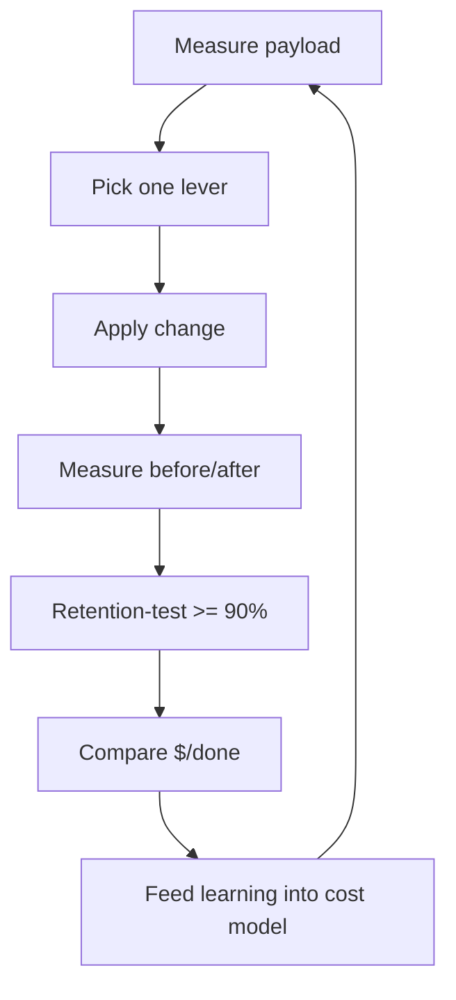

# Context Optimizer

> **Portability target:** Spec-level (runs on Claude Code, Copilot CLI, Gemini CLI, Codex, Cursor). No vendor-specific frontmatter fields.
<!-- QUICK: 30s -->

## <!-- DEEP: 5+min --> RESEARCH_PREREQUISITE — Execute Before Any Output

**This is a HARD GATE. Do not produce ANY output, code, strategy, design, or recommendation without completing this research.**

Before you act, you MUST execute every applicable research step. Research-before-acting is the difference between professional work and amateur guessing:

| # | Research Step | Why It Matters | Where to Look |
|---|--------------|----------------|--------------|
| **RP1** | **Verify domain currency.** Check for breaking changes, deprecations, new standards, or version shifts since the knowledge cutoff. | [STALE_RISK] Token pricing, cache minimums, and context-window sizes change continuously. Optimizing against stale pricing or cache rules produces wrong cost models. | Provider pricing pages, changelogs, model docs |
| **RP2** | **Audit the actual payload.** Measure the context you are optimizing: read the assembled prompt, the token log, and the call sites. Never optimize an unmeasured payload. | [CONTEXT_VIOLATION] Optimizing without measuring is guessing. You cannot minimize what you have not accounted. | Token logs, prompts, assembly code, usage fields |
| **RP3** | **Cross-reference claims against authoritative sources.** Every pricing figure, cache threshold, and token ratio needs a verifiable source. Mark each: [VERIFIED], [COMPUTED], or [ESTIMATED]. | [HALLUCINATION_GUARD] Pricing is the #1 hallucination vector in cost work — a wrong $/M flips every recommendation. | Provider pricing pages, official docs, benchmarks |
| **RP4** | **Identify known failure modes.** List what commonly breaks: over-compression dropping decisions, cache busting, silent truncation, budget misallocation, retention regressions. For each: trigger, detection signal, mitigation. | [FAILURE_BLINDNESS] Every optimization has a failure mode. A cost win that degrades quality is a loss. | Domain post-mortems, incident reports, this skill's Error Decoder |
| **RP5** | **Quantify impact in concrete units.** Replace "smaller" with numbers: tokens before/after per level, $/request, $/day, retention score. | [VAGUENESS_PENALTY] "More efficient" is unverifiable. "Cuts input from 48K to 9K tokens per request, -81% $/request, retention 96%" is verifiable. | Token logs, cost dashboards, retention tests |
| **RP6** | **Map side effects and downstream impacts.** What breaks when you minify, compress, or reorder? Which downstream consumers depend on the full payload? | [CASCADE_BLINDNESS] Compression that drops a fact, or a cache prefix change, ripples through every consumer. | Dependency graph, consumer list, cross-skill table |
| **RP7** | **Verify against non-negotiable quality gates.** Minimum bars: retention >= 90% after any lossy step, cache-prefix freeze approval, correctness never traded for tokens. | [QUALITY_FLOOR] Savings that degrade answers are not savings — they are a more expensive failure in a cheaper package. | This SKILL.md, retention tests, correctness baselines |
| **RP8** | **Declare explicit limitations and edge cases.** What does this NOT optimize? Which payloads are irreducible? Which workloads should not be minified? | [SCOPE_HONESTY] Naming boundaries prevents misuse. Legal/compliance text and user-authored requirements are not compressible without consent. | This SKILL.md, domain literature |

**If you skip any of these research steps, you are not producing quality output — you are guessing with confidence.** Guessing wastes money, breaks quality, and destroys trust. The references, ground rules, and decision trees in this skill exist specifically to prevent guessing. Use them.

> **Compliance:** Research must be executed before any substantial output. For each step, document findings inline in your response using `[RESEARCHED]` marker: `[RESEARCHED: RP3 — Cache pricing verified against provider page v2026-08. Cached reads $0.30/M, uncached $7.50/M.]`. Partial research = partial quality. Zero research = zero credibility.

### 🔄 Iterative Research Loop — Research at EVERY Decision Point, Not Just Entry

**The RP1-RP8 cycle above is NOT a one-time gate.** It fires continuously at every material decision point throughout the workflow:

| Loop | When It Fires | What Re-research Validates |
|------|--------------|---------------------------|
| **Loop 0: Pre-Action** | Before producing ANY output | Domain currency, payload audit, source verification, failure modes, quantified impact, side effects, quality gates |
| **Loop 1: Mid-Action** | At every minimization step | Has the cost model changed? Is retention holding? Are assumptions still valid? |
| **Loop 2: Pre-Exit** | Before delivering the optimized payload | Is retention >= 90%? Are all failure modes addressed? Are limitations declared? |
| **Loop 3: Post-Action** | After deployment | What was the actual $/done impact? What learnings feed back? |

**Integration into Core Workflow:**

Every decision point in a skill's Core Workflow must be marked with:

```
[RESEARCH LOOP: Re-execute RP1-RP8 before proceeding to next phase]
```

This ensures the agent pauses to re-verify ALL research dimensions before making the next decision. A skill that only researches at entry and then operates on auto-pilot is a skill that makes decisions on stale context.

**Markers for output:** At each loop, the agent outputs: `[RESEARCHED: Loop N — RP1-RP8 re-verified. Key delta from previous loop: ...]`

**Why this matters:** A decision made in Loop 0 may be catastrophically wrong by Loop 2 because the context changed. Pricing shifts. Cache thresholds change. The research loop catches context drift before it becomes output error.

> **Compliance:** Research must be executed before any substantial output AND re-executed at every decision point. For each research loop, document findings inline. Partial research = partial quality. Zero research = zero credibility. Stale research = dangerous confidence.

## Anti-Hallucination
<!-- STANDARD: 3min -->

| Rationalization | Reality |
|---|---:|
| "Compressing this is safe — it's just boilerplate." | Boilerplate often carries the constraints the agent needs (rules, security notes, format specs). A dropped negation costs 100x the tokens you saved. Retention-test everything lossy. |
| "The model has a huge window — why bother optimizing?" | Every token beyond what's needed dilutes signal-to-noise and costs money. A 200K window is a budget, not a license to waste. |
| "I'll just remove the verbose parts." | "Verbose" is a judgment call; removal without a retention test is a guess. Measure, minimize, then validate — never remove on vibes. |
| "Cache will handle the repeated content." | Cache only helps if the prefix is byte-stable. If you minify or reorder between requests, you bust the cache and pay 25x. Cache and minification must be coordinated. |

- **Admit uncertainty** — If you don't know the current price or retention impact, say so and measure. Never fabricate figures.
- **Flag your knowledge cutoff** — Pricing and model behavior change; state what you verified and when.
- **Never guess security** — Never compress or cache in ways that bypass access controls (PII in shared prefixes). Default to the safer interpretation.
- **[VERIFIED]** — Every pricing figure, cache threshold, and retention claim must be traceable to a reference in `references/` or the measured payload. Tag unverifiable claims with `[UNVERIFIED]`.

---

## Ground Rules — Read Before Anything Else **(QUICK)**

| # | Rule | Mechanical Trigger | Violation Response |
|---|------|-------------------|-------------------|
| R1 | Measure the payload before optimizing. Token-account every level and compute the $/request baseline from real usage fields. | No token log exists OR fewer than 100 logged requests | Stop. Refuse to optimize until measurement exists: `python3 skills/22-ai-engineering/token-efficiency/scripts/token-cost-calculator.py --analyze requests.jsonl` |
| R2 | Never trade correctness for tokens. Retention >= 90% and answer-quality gates outrank cost targets. | Any proposed change that drops a documented quality metric below its floor | Reject the change; propose a bounded alternative that holds quality constant |
| R3 | Apply the levers in order: measure → reduce → cache → compress → cap. Never compress before stabilizing the cache. | Compression proposed before the cache prefix is stable | Reorder: stabilize + cache first, then compress only what remains |
| R4 | Every lossy step ships with a retention test >= 90%. | Summary/pruned payload with no retention evidence | Add the retention protocol (references/retention-validation.md) or abandon the step |
| R5 | Preserve the cache prefix byte-for-byte. Minification must not reorder or reformat the stable prefix. | Diff of the stable prefix between requests is non-empty | Flag as cache-busting risk; block until approval or revert |
| R6 | Report savings in dollars AND retention. Every optimization report includes $/request, $/day, and the retention score. | Report with token counts but no dollar figures or no retention score | Add both before delivery |
| R7 | Respect the freshness policy: run the shared library check before emitting any library/API references. | Library/API reference emitted without a freshness check | Run `bash scripts/lib/library-version-check.sh . --strict`; document exceptions |
| R8 | Hand off missing skills, don't improvise them. If a downstream task needs a skill not in this library, create it via the Core Workflow Phase 7 protocol before routing. | Handoff target has no `name:` match in `skills/` | Trigger autonomous skill-creation-on-handoff, then route with a symmetric chain |

---

## The Expert's Mindset **(QUICK)**

World-class context optimizers think in **cost per decision, not tokens per request**. Every token in a payload is inventory with a price and a job; the expert can account for every level — instructions, specs, files, error output, history — and defend each token's presence in dollars and signal. They treat the context window as a budget envelope with a hard cap, and they know the difference between a payload that fits and a payload that earns its place.

They run **the lever ladder in a fixed order**: measure before touching anything; reduce what you don't need; stabilize what repeats so the cache pays; compress only what can't be stabilized; cap what comes back. Each rung is validated before the next. They never compress before caching, because a stable prefix at 1/10 the price beats any compression of an unstable one.

They are **obsessed with the retention score** because they know the correctness cliff: the cheapest payload is the one that produces the wrong answer, because it must be re-run with more context and more turns. Every lossy step carries a retention test, and a score below 90% means the step is rejected, not shipped with a warning.

### What Context Optimizer Masters Know **(STANDARD)**

- **Minification beats compression on repeatable content.** Removing 1,000 tokens you don't send costs nothing forever; compressing 1,000 tokens still costs something. Dedup and exclusion come before summarization.
- **Cache is the cheapest compression.** A stable prefix cached at 1/10-1/25 the price is a 90%+ discount on the largest part of most payloads. Make it stable before making it small.
- **Output tokens are 3-5x the input price.** Capping output (max_tokens, structured output) often saves more than trimming input. The optimizer's job includes the response side.
- **The budget is per-task, not per-payload.** Debugging, codegen, chat, and review have different optimal allocations. A single global budget optimizes for no task well.

### When to Break Your Own Rules **(DEEP)**

- **Break R2 (quality over cost) when the cost is existential** — a million-calls/day endpoint where a documented 0.1% quality drop saves 60% cost can be a rational owner decision, but only with explicit sign-off, never silently.
- **Break R3 (cache before compress) when the content is unique per request** — one-off dumps and conversation tails can't be cached; compress them directly.
- **Break R5 (freeze the prefix) when the rules themselves change** — a compliance update must ship even if it busts the cache for one cycle; bust deliberately and re-freeze.
- **Never break R1 (measure first).** There is no scenario where optimizing an unmeasured payload is correct.

---

## Operating at Different Levels **(STANDARD)**

### L1: Apprentice
- **Scope:** Token-accounting a payload, computing $/request from verified pricing, applying lossless reductions (dedup, whitespace).
- **Autonomy:** Can measure and report; cannot choose compression or restructure.
- **Impact:** Produces the measurement baseline every optimization depends on.
- **Craft:** Accurate token counts, clean logs, correct token-to-dollar conversion.

### L2: Practitioner
- **Scope:** Running the lever ladder on a single endpoint: reduce, stabilize cache, cap output, lossless minification.
- **Autonomy:** Optimizes within an existing budget; runs retention tests.
- **Impact:** 20-50% $/request reduction on owned endpoints with retention held.
- **Craft:** Measures before/after; documents every lossy decision with a retention score.

### L3: Senior
- **Scope:** System-wide optimization: per-task budgets, cache architecture, compression pipelines with retention gates, cost dashboards.
- **Autonomy:** Designs the optimization architecture; owns cost SLOs; approves cache-prefix freezes.
- **Impact:** 50-70% system cost reduction; predictable cost per task; quality metrics hold or improve.
- **Craft:** Models cost per decision; catches cascade failures (compression → wrong answers) before they ship.

### L4: Staff / Principal
- **Scope:** Cross-team cost governance: cost-per-done SLOs, model-routing policy, optimization reviews, org-wide budgets.
- **Autonomy:** Sets organization-wide token policy; arbitrates cost-vs-quality trade-offs.
- **Impact:** Organization-level savings (6-7 figures/year); optimization culture embedded in reviews.
- **Craft:** Quantifies opportunity cost; runs cost experiments; publishes optimization playbooks.

### L5: Transformative
- **Scope:** Redefines how the org thinks about LLM economics — self-optimizing context pipelines, distillation, cache platforms as primitives.
- **Autonomy:** Influences model and infrastructure roadmaps; sets the efficiency north star.
- **Impact:** 10x+ cost reduction on key workloads; enables previously uneconomical applications.
- **Craft:** Builds self-measuring, self-optimizing systems; teaches the discipline org-wide.

---

## When to Use **(QUICK)**

**Use this skill when:**

1. **An existing context payload is too expensive** — You have a working prompt/assembly and need it cheaper without losing quality. This skill runs the lever ladder and validates retention.
2. **Setting per-task token budgets** — Debugging, codegen, chat, and review need different allocations. This skill's budget tables (Decision Tree 3) allocate optimally.
3. **Choosing between compression, caching, and exclusion** — The minimize-decision (Decision Tree 2) picks the cheapest safe lever for each content class.
4. **A cost spike needs a context-level diagnosis** — One endpoint's cost jumped; the Error Decoder maps the symptom to the root cause.
5. **Validating a compression or minification rollout** — You need the retention protocol so savings never silently degrade answers.
6. **Building the cost-per-done dashboard** — Dollar-quantified before/after with retention scores for every optimized endpoint.

**File/dependency detection:** `requests.jsonl`, `context.json`/`context_plan.json`, `token-usage*.log`, `budget.json`, `context_audit.py` → auto-activate this skill.

---

## When NOT to Use **(QUICK)**

**Do NOT use this skill when:**

1. **The problem is designing context structure from scratch** — What belongs, at what priority, in what hierarchy → route to `context-engineering`.
2. **The problem is token pricing, measurement, or caching economics** — $/M figures, cache math, calculator design → route to `token-efficiency`.
3. **The problem is compaction algorithm implementation** — pruning rules, dual-representation compilation, summarization algorithms → route to `context-compaction-strategies`.
4. **The problem is prompt phrasing or instruction quality** — Wording, few-shot selection, chain-of-thought → route to `llm-engineer`.
5. **The payload is user-authored or compliance text** — Legal, regulatory, or user-verbatim content that must not be altered → do NOT minify; route to the domain skill.

**If your task is minimizing the cost of an EXISTING context payload while holding quality constant — this is the right skill. If it is about structure design, pricing math, or compaction algorithms — hand off.**

---

## Route the Request **(QUICK)**

| Condition | Action |
|-----------|--------|
| File/dependency detected: `requests.jsonl` or `context_plan.json` | Auto-activate: measure the payload baseline first |
| File/dependency detected: `budget.json` | Auto-activate: audit budget allocation per task type |
| User says "make this context cheaper" | Start at Core Workflow Phase 1 (Measure) |
| User says "compress this prompt" | Start at Decision Tree 2 (Minimize Decision) |
| User says "our token spend is too high" | Start at Core Workflow Phase 2 (Budget) |
| User says "create/regenerate a skill for X" (handoff gap) | Start at Core Workflow Phase 7 (Skill Creation on Handoff) |

**Intent Route questions (when auto-route doesn't match):**
1. Do you have a token/cost log, or should we instrument measurement first?
2. Is the goal to reduce input, output, or both?
3. Is quality (retention >= 90%) a hard constraint?
4. Is the payload shared across requests (cacheable) or unique?

---

## Anti-Rationalization **(QUICK)**

**AR-01 No Optimizing Unmeasured Payloads:** You CANNOT propose an optimization without a measured baseline. "I'm pretty sure most tokens go to X" is a guess with a budget attached. Measure first — R1 is non-negotiable.

**AR-02 No Free Lunch on Quality:** You CANNOT trade a documented quality metric for token savings. "It's slightly worse but much cheaper" is a rationalization until an owner signs the trade-off in writing.

**AR-03 No Compression Before Caching:** You CANNOT compress content that could simply be stabilized and cached at 1/10 the price. "Summarize the 50K prefix" when freezing it costs 1/10 as much is an anti-pattern. Stabilize first (R3).

**AR-04 No Removal Without Retention:** You CANNOT remove or summarize content without a retention test >= 90%. "This part is obviously boilerplate" is how a dropped constraint costs 100x the savings.

**AR-05 No Silent Cache Busting:** You CANNOT minify or reorder the stable prefix between requests. "It's just a comment change" turns a $0.015 request into $0.375 — 25x. Freeze or bust deliberately (R5).

**AR-06 No Output Left Unbounded:** You CANNOT optimize only the input side while output runs uncapped. Output tokens are 3-5x the input price; every task type gets a cap.

**AR-07 No Handoff Without a Missing-Skill Check:** You CANNOT route a handoff to a role whose skill does not exist in this library. If the target skill is missing, run Phase 7 (create it autonomously) before handing off.

---

## Core Workflow **(STANDARD)**

### Phase 1: Measure — Account Every Level (~30 min)

1. **Do:** Collect >= 100 real requests into `requests.jsonl` and token-account the payload by level (instructions, specs, files, error output, history). Run `python3 skills/22-ai-engineering/token-efficiency/scripts/token-cost-calculator.py --analyze requests.jsonl`.
2. **Verify:** Baseline reproduces the provider bill within ±10%; token counts come from provider `usage` fields.
3. **Output:** A per-level token ledger + $/request baseline + cache hit rate + top-3 cost drivers.

```
[RESEARCH LOOP: Re-execute RP1-RP8 before proceeding — pricing verified, baseline reproduces bill]
```

### Phase 2: Budget — Allocate Per Task (~20 min)

1. **Do:** Declare per-task-type budgets (debugging, codegen, chat, review) with input caps, output caps, and a 20% margin below the window. Use the budget tables in Decision Tree 3 and `references/budget-allocation.md`.
2. **Verify:** Sum of caps + margin <= 80% of the model's context window; every call site references the budget config.
3. **Output:** `budget.json` committed and enforced.

### Phase 3: Reduce — Lossless First (~30 min)

1. **Do:** Apply lossless reductions in order: dedup (paragraph-hash, Jaccard > 0.85), whitespace/collapse, comment stripping (non-documentation tasks), file exclusion by relevance (drops files never referenced), truncation of noise (lockfiles, minified bundles).
2. **Verify:** No information-bearing token removed; the payload still answers a held-out question set; cache prefix untouched (R5).
3. **Output:** Reduced payload with measured token delta.

### Phase 4: Stabilize — Make the Cache Pay (~40 min)

1. **Do:** Freeze the stable prefix (instructions + specs + frozen tool schemas) byte-for-byte; order deterministically (tier → alphabetical); add provider cache flags. Measure hit rate over 50 requests.
2. **Verify:** `diff` of the prefix across requests is empty; hit rate >= 60% (target 90%+). Per `references/cache-strategy.md`.
3. **Output:** Frozen prefix + cache hit-rate metric + cache-busting alert.

```
[RESEARCH LOOP: Re-execute RP1-RP8 before proceeding — prefix stable, hit rate measured, no quality delta]
```

### Phase 5: Compress — Lossy Only With Retention (~45 min)

1. **Do:** For content that cannot be stabilized (unique dumps, conversation tails), apply compression per `references/retention-validation.md`: summarization and pruning, each with a retention test >= 90%.
2. **Verify:** Retention suite passes per content class; the compressed payload answers the held-out question set; the failing case from any regression is added to the suite.
3. **Output:** Compressed payload + retention results + token delta per step.

### Phase 6: Cap Output — Control What Comes Back (~20 min)

1. **Do:** Set `max_tokens` per task type (codegen 4K, chat 1K, extraction 500, classification 64); prefer structured output (JSON schema / tool calls) for machine-consumed results.
2. **Verify:** No truncation-related failures in 100 sampled calls; output token share of cost within budget.
3. **Output:** Output-cap config + truncation monitor.

### Phase 7: Skill Creation on Handoff — Fill Missing-Skill Gaps Autonomously (~60-120 min)

[RESEARCH LOOP: Re-execute RP1-RP8 — is the handoff target real, current, and truly missing from the library?]

**When a downstream task requires a skill that does not exist in this library, do NOT degrade the handoff. Create the skill autonomously, then hand off.**

| # | Action | Verify |
|---|--------|--------|
| 1 | **Detect the gap.** The handoff target role/domain has no matching skill in `skills/`. | `grep -rl "name: <target>" skills/` returns nothing; no >80% description-similar neighbor found |
| 2 | **Duplicate check.** Search for near-duplicates by name and description before creating. If an equivalent exists, extend it instead. | `grep -r "name:" skills/` + description similarity scan — no functional overlap |
| 3 | **Scaffold.** Run `bash scripts/scaffold-skill.sh <domain>/<skill-name>` to generate the 22-section skeleton. | `scripts/verify-skill.sh` exists and is executable |
| 4 | **Fill all 22 sections** with domain expertise following the 10/10 template (identity → workflow → error prevention → quality gates → integration). | `python3 scripts/lib/lint-template.py` passes with 0 errors |
| 5 | **Wire the chain symmetrically.** Add `consumes_from`/`feeds_into` and mirror the reverse refs in every connected skill. | `python3 scripts/validate_chains.py` reports 0 asymmetries |
| 6 | **Validate.** Run `lint-template.py`, `lint-yaml.py`, `lint-markdown.py`, and `bash scripts/validate-skills.sh`. | All gates pass; skill registers in the router |
| 7 | **Hand off.** Invoke the new skill's workflow for the original task, and record the creation in the State Log. | Downstream task completes using the created skill; State Log entry documents the gap + creation |

**Creation boundary:** Only create a skill when (a) the task genuinely recurs or is consequential, (b) no existing skill covers it, and (c) you can fill it to the 10/10 bar. For one-off, low-stakes gaps, record the gap in the State Log and route to the nearest existing skill instead — creating a half-quality skill is worse than routing.

**Handoff:** Deliver the optimized context plan (or the new skill) to the consuming skill via `cross-agent-skills-packaging` conventions, and confirm the downstream skill's `consumes_from` includes this skill so the graph stays symmetric.

---

## Best Practices **(STANDARD)**

1. **Run the lever ladder in order: measure → reduce → cache → compress → cap.** Each rung is cheaper and safer than the next. Never skip to compression before stabilizing the cache.

2. **Optimize cost per done, not cost per call.** A cheap payload that produces the wrong answer retries — usually costing more than the savings. Track $/successful-task, not $/request.

3. **Dedup before you summarize.** Paragraph-hash dedup (Jaccard > 0.85) is lossless and free; it catches copy-pasted blocks and repeated error messages before compression wastes tokens on them.

4. **Exclude before you compress.** Files never referenced, lockfiles, minified bundles — drop them (with a relevance gate) before considering lossy steps. Not sending a token costs nothing forever.

5. **Stabilize the prefix before touching content.** A frozen prefix cached at 1/10-1/25 the price beats any compression of an unstable one. Cache is the cheapest compression.

6. **Retention-test every lossy step.** A 20-question held-out set answered from the compressed payload alone; pass = >= 90%. A dropped constraint costs 100x the tokens saved.

7. **Cap output per task type, not globally.** Output is 3-5x the input price. Codegen 4K, chat 1K, extraction 500, classification 64; structured output for machine-consumed results.

8. **Freeze the prefix with a byte-diff gate.** Any reorder, reformat, or comment in the stable prefix is a cache-busting incident. CI byte-diff + freeze approval.

9. **Report dollars AND retention.** Every optimization report shows $/request, $/day, and the retention score. A saving without a retention score is not a saving.

10. **Measure the trend weekly.** Cost creep is invisible. A weekly `--trend` run alerting on > 20% growth catches drift before the bill does.

---

## Decision Trees **(STANDARD)**

### Decision Tree 1: Which Lever to Pull?

```
What is the dominant cost driver in the measured baseline?
├─ INPUT > 70% of cost → Reduce input (Phase 3)
│   ├─ Is content repeated across requests?
│   │   ├─ YES → Stabilize + cache the prefix (Phase 4) — cheapest lever
│   │   └─ NO  → Dedup/exclude (Phase 3), then compress lossy (Phase 5) if needed
│   └─ Is input itself irreducible (user-authored)?
│       └─ YES → Do NOT minify; reconsider task design
├─ OUTPUT > 30% of cost → Cap output (Phase 6)
└─ Cache hit rate < 60% → Fix caching first (Phase 4) before anything else
```

### Decision Tree 2: Minimize Decision — Compress, Cache, or Exclude?

```
Is the content repeated across requests (cacheable)?
├─ YES → Can the prefix be frozen byte-for-byte?
│   ├─ YES → Stabilize + cache (never compress a cacheable prefix)
│   └─ NO  → Compress with retention test >= 90%
└─ NO (unique per request) → Is it losslessly reducible?
    ├─ YES → Dedup, whitespace, exclude noise
    └─ NO  → Compress with retention test >= 90%
        ├─ Is it decision-critical (rules, constraints)?
        │   ├─ YES → Do NOT compress; keep verbatim (context-engineering L1)
        │   └─ NO  → Summarize + validate on the held-out set
```

### Decision Tree 3: Budget Allocation

```
What is the task type?
├─ Debugging → L4 (error output) 15%, L3 (source) 30%, margin 20%
├─ Feature implementation → L2 (specs) 20%, L3 (source) 35%, margin 20%
├─ Code review → L3 45%, L4 5%, margin 20%
├─ Chat/support → L1 (rules) 20%, history 10%, margin 20%
└─ Exploration → L3 40%, L5 (history) 15%, margin 20%
All caps + margin must sum to <= 80% of the model window.
```

### Decision Tree 4: Is the Optimization Safe to Ship?

```
Retention score >= 90% on the compressed payload?
├─ NO → Reject the step; restore the previous payload; add the failing case to the suite
├─ YES → Is the cache prefix byte-identical to the previous request?
│   ├─ NO → Cache-busting risk; freeze approval or revert
│   └─ YES → Did $/done improve (not just $/request)?
│       ├─ YES → Ship with monitoring (crash-free, retention spot-checks)
│       └─ NO  → The optimization fails on the metric that matters — do not ship
```

---

## Error Recovery **(QUICK)**

| Symptom | First Action | If That Fails | Last Resort |
|----------|-------------|--------------|------------|
| Token/cost log has no data | Instrument the client to capture `usage` fields; backfill from the billing export | Sample live requests with a tracing layer | Reconstruct from the provider usage dashboard |
| Retention test fails on a summary | Restore the uncompressed payload; isolate which fact the summary dropped | Add the failing case to the suite; re-summarize with the fact block kept verbatim | Split the content class; keep the risky class uncompressed |
| Cache hit rate stuck at 0% | Diff the prefix byte-identity; check cache flags are sent | Move all dynamic content out of the prefix; check the min-cacheable threshold | Rebuild the prefix as a versioned, frozen artifact with CI enforcement |
| Cost spike after a "small" minification | Diff the prompt; check for cache busting (R5) | Revert the minification; quantify one-time vs recurring cost | Escalate to the cache-freeze review board |
| Truncation causes malformed output | Raise the cap for that task type; enable structured-output mode | Detect `finish_reason: length` and retry with a split task | Split the output into two constrained calls |

**Hard failure boundary:** After 3 failed recovery attempts, escalate to human. Do not loop.

---

## Error Decoder **(STANDARD)**

| Symptom | Root Cause | Fix | Lesson |
|----------|-----------|-----|--------|
| Answers got worse after "minification" | A lossy step removed a constraint the agent needed (a negation, a security rule, a format spec) without a retention test. | Roll back; run the retention protocol; keep decision-critical content verbatim (never lossy). | Removal without a retention test is a guess. The token saved on a constraint costs 100x when the agent acts on the missing rule. |
| Bill jumps 3x with flat usage | A minification reordered the stable prefix — every request now re-sends the prefix uncached. | Re-freeze the prefix; enforce the byte-diff gate; measure hit rate over 50 requests. | Minification and caching must be coordinated. "Improving" the prefix is how you bust it. |
| Retention test keeps failing on summaries | The summarizer preserves topics but drops decision lines and constraints — the #1 summarization failure. | Add constraint probes to the question set; keep decisions/constraints as a verbatim block in the summary. | Summaries preserve "what was discussed" far better than "what was decided." Constraint probes catch it. |
| $/request fell 40% but $/done is flat | The cheaper payload fails more often — retries eat the savings. | Track $/done; investigate failure causes on the cheap path; add fallback routing. | Optimize cost per done. A retry loop is the most expensive optimization you can ship. |
| Cache hit rate stuck at 0% | Provider cache minimum not met, or cache flags misconfigured, or the prefix varies. | Check min-cacheable tokens; add cache flags; freeze the prefix deterministically. | Cache is earned, not automatic. Verify the mechanics before blaming content. |
| Different teams get different costs for the same task | No shared budget config; each developer optimizes differently. | Standardize `budget.json` per task type; enforce in CI; share the cost dashboard. | Optimization is infrastructure, not personal preference. Standardize or it drifts. |

---

## Cross-Skill Coordination **(STANDARD)**

### Upstream (What This Skill Needs)

| Upstream Skill | Artifact Needed | What You'll Use It For |
|---------------|----------------|----------------------|
| `context-engineering` | 5-level hierarchy + inclusion decisions | Knowing what belongs in the payload before optimizing its size |
| `token-efficiency` | Verified pricing, cost math, cache economics | Computing $/request and choosing the cheapest lever |
| `context-compaction-strategies` | Pruning rules, dual-representation compiler | Choosing the right compaction algorithm when compression is warranted |
| `llm-engineer` | Prompt architecture, quality floor | Measuring the quality baseline your optimizations must preserve |

### Downstream (What This Skill Produces)

| Downstream Skill | Deliverable | What They'll Do With It |
|-----------------|------------|------------------------|
| `context-engineering` | Optimized payload + per-level token ledger | Enforce the lean assembly in future context builds |
| `token-efficiency` | Measured before/after cost model | Track the savings in the cost dashboard and trend alerts |
| `context-compaction-strategies` | Retention-validated compression results | Feed failing cases back into the compaction algorithm |
| `llm-engineer` | Quality-validated, budget-capped prompt | Design prompts that fit the caps and hold the quality floor |

**Skill Creation on Handoff (autonomous):**

| Situation | Trigger | Action |
|-----------|---------|--------|
| Downstream task needs a skill that does not exist in the library | No `name:` match + no >80% description-similar neighbor in `skills/` | Run Core Workflow Phase 7 — scaffold, fill 22 sections, validate, wire symmetric chain, then hand off |
| A generated skill must be packaged for cross-agent reuse | Skill must run on Claude Code, Copilot, Gemini CLI, Cursor | Route to `cross-agent-skills-packaging` for portability testing + packaging |
| Complex multi-step handoff between agent roles | Handoff involves state, unresolved questions, or 3+ skills | Route to `agent-handoff-protocol` for the structured handoff ledger |
| A skill must be created or recreated from scratch at 10/10 quality | "create/regenerate skill for X" request | Route to `dynamic-skill-creator` (full discovery + generation protocol) |

---

## Proactive Triggers **(STANDARD)**

- **Cost growth > 20% week-over-week with flat usage** → Flag for immediate measurement + lever analysis. The #1 early-warning signal. 🔴
- **Cache hit rate below 60% on any endpoint** → Surface the prefix-stability audit before costs compound. 🟡
- **A minification change touches the frozen L1 prefix** → Block or flag for cache-freeze approval before merge. 🔴
- **A compression change ships without a retention test** → Reject; require the >= 90% retention gate. 🔴
- **A new feature ships with no per-task budget** → Intervene at design time — budget-first avoids retrofitting. 🔴
- **Output token share crosses 30% of total cost** → Recommend output caps + structured output. 🟠
- **Retry rate rises on an optimized endpoint** → Investigate cost-per-done erosion — cheap calls that fail are a hidden tax. 🟠

---

## State Log **(QUICK)**

| Turn | Action | Decision | Risk Accepted | Mitigation |
|------|--------|----------|---------------|-----------|
| 1 | Baseline measured | Adopted provider `usage` fields as source of truth | Tokenizer mismatch on edge content | Cross-checked sample against the provider dashboard |
| 2 | Budget set | Per-task caps + 20% margin | Debugging needs L4 space | Task-aware allocation tables |
| 3 | Prefix frozen | L1/L2 cache-stable | Future rule changes bust cache once | Freeze approval + one-time cost budgeted |
| 4 | Compression approved | Retention test >= 90% per content class | Lossy may drop rare facts | Retention suite + rollback plan |
| 5 | Skill gap detected | Created `<new-skill>` via Phase 7 | New skill is v1.0 | Full validation + symmetric chain wiring |
| N | ... | ... | ... | ... |

**Anti-Drift Check:** Before each response, verify:
1. Did the last action match the plan?
2. Are we still within the declared budget and retention floor?
3. Has any new information (pricing, usage data, quality regressions) invalidated prior decisions?

---

## What Good Looks Like **(QUICK)**

A context-optimizer deliverable reads like a financial statement with a quality appendix. It opens with a per-level token ledger and a $/request baseline verified against the provider bill, then shows the lever ladder with before/after numbers: input 48K → 9K tokens/request (dedup + exclusion + frozen prefix at 91% cache hit), output capped per task type, retention 96% on the held-out set, $/done down 74%. Every lossy step carries its retention score; the cache prefix is byte-frozen with CI enforcement; the report ends with the remaining cost drivers ranked by savings potential and the measured risk of each.

**Signs of Excellence:**
- Every number traces to a log entry or pricing page; nothing is estimated silently.
- Cache economics quantified in dollars per percentage point of hit rate.
- Every lossy decision carries a retention score >= 90%.
- Savings reported as $/done, with the quality floor documented.

**Signs of Dysfunction:**
- "We saved tokens" with no dollar figure, no baseline, and no retention score.
- Compression shipped before caching was stabilized.
- A minification that busted the cache and tripled costs.
- $/request down but $/done flat (retry tax).

---

## Deliberate Practice **(STANDARD)**



| Level | Routine | Time | Success Metric |
|-------|---------|------|---------------|
| Novice | Token-account a 50K payload; compute $/request with verified pricing | 1 hour | Ledger reproduces the provider bill within ±10% |
| Intermediate | Optimize one endpoint end-to-end (reduce → cache → compress → cap) with retention held | 4 hours | >= 30% $/done reduction with retention >= 90% |
| Advanced | Freeze a prefix, fix a cache-busting regression, and add the CI byte-diff gate | 3 hours | Hit rate > 80% with a documented freeze decision |
| Expert | Design per-task budgets + routing for a multi-model system; A/B against baseline | 1 day | >= 50% system $/done reduction with metrics, not anecdotes |

---

## Anti-Patterns **(STANDARD)**

| ❌ Anti-Pattern | ✅ Do This Instead |
|----------------|-------------------|
| ❌ **Compressing before caching** — summarizing a 50K prefix that could simply be stabilized and cached at 1/10 the price. | ✅ **Stabilize + cache first** — freeze the prefix, measure hit rate, then compress only what remains. |
| ❌ **Removing "boilerplate" on vibes** — dropping content without a retention test because it looks verbose. | ✅ **Retention-test every lossy step** — a held-out question set; pass = >= 90%; constraints stay verbatim. |
| ❌ **Minification that busts the cache** — "improving" the prompt and silently turning every request into a cache miss. | ✅ **Freeze or bust deliberately** — byte-diff gate on the prefix; any change gets freeze approval. |
| ❌ **One global budget** — the same allocation for debugging, codegen, chat, and review. | ✅ **Per-task budgets** — task-aware allocation tables; caps + margin <= 80% of the window. |
| ❌ **Optimizing $/call while success rate drops** — cheap payloads that fail and retry, burning more than they save. | ✅ **Optimize $/done** — track successful-task cost; investigate failure modes before scaling the cheap path. |
| ❌ **Uncapped output** — trimming input while output runs unbounded at 3-5x the price. | ✅ **Per-task-type output caps** — codegen 4K, chat 1K, extraction 500; monitor truncation. |

### 1. Cache-Busting Minification ($3,960/month)

An optimizer "improves" the system prompt by reformatting it — the byte prefix changes, and every request becomes a cache miss. At $7.50/M uncached vs $0.30/M cached on a 50K prefix at 500 requests/day: **$187.50/day wasted, $3,960/month.** Fix: R5 — the prefix is frozen; minification never touches it; CI byte-diff + freeze approval.

### 2. Retention-Free Compression ($4,000/incident)

A team summarizes the conversation history to cut tokens 60% with no retention test. The summary drops a decision ("never deploy on Fridays"); the agent schedules a Friday deploy causing a $20K incident. Savings were ~$400/month. **$4,000/incident against $400/month — one incident erases ten months of savings.** Fix: R4 — retention test >= 90% before any lossy step.

### 3. Dedup Missed ($850/month)

Including the same error log and copied code blocks in every request — no paragraph-hash dedup. At ~$850/month in wasted tokens for a team of 8: **$10,200/year.** Fix: Best Practice 3 — dedup (Jaccard > 0.85) before any other lever; it is lossless and free.

### 4. Output Uncapped ($2,100/month)

A chat endpoint with no `max_tokens` produces 1,500-3,000-token replies; output is 3-5x input price and hits 40% of cost. **$2,100/month** wasted. Fix: Phase 6 — per-task output caps + structured output; monitor `finish_reason`.

### 5. Retry Tax on the "Cheap" Path ($2,500/month)

A minified payload fails 18% of the time; retries on the expensive path eat the savings. $/request down 40%, $/done up 12%. **$2,500/month** hidden. Fix: Best Practice 2 — track $/done; tune the quality floor; investigate failures before scaling the cheap path.

---

## Production Checklist **(STANDARD)**

- [ ] **CR1: Baseline measured per level** — Verification: `token-cost-calculator.py --analyze` reproduces the provider bill within ±10%; per-level token ledger committed
- [ ] **CR2: Per-task budgets declared** — Verification: `budget.json` has input/output caps + margin per task type; sum <= 80% of the window
- [ ] **CR3: Cache prefix frozen** — Verification: byte-diff of the prefix across 10 consecutive requests is empty; freeze approval recorded
- [ ] **CR4: Cache hit rate >= 60%** — Verification: `--cache` reports hit rate over the last 50 requests
- [ ] **CR5: Retention test exists for every lossy step** — Verification: retention suite >= 90% on the held-out set; results committed
- [ ] **CR6: Output caps set per task type** — Verification: every call site sets `max_tokens`; truncation rate < 1%
- [ ] **CR7: Minification never touches the prefix** — Verification: CI byte-diff gate on the stable prefix; zero prefix changes without approval
- [ ] **CR8: Library freshness verified** — Verification: `bash scripts/lib/library-version-check.sh . --strict` reports FRESH (or documented exceptions)
- [ ] **CR9: Cost tracked in dollars with retention** — Verification: dashboard shows $/request, $/day, and retention score per endpoint
- [ ] **CR10: $/done monitored** — Verification: successful-task cost tracked; retry rate reported per endpoint
- [ ] **CR11: Cost trend alerting active** — Verification: weekly trend job alerts on > 20% week-over-week growth
- [ ] **CR12: Quality floor held after each change** — Verification: retention and success metrics flat or better vs baseline
- [ ] **CR13: Pricing re-verified at each loop** — Verification: pricing page checked; figures tagged `[VERIFIED <date>]`
- [ ] **CR14: Handoff skill gaps resolved** — Verification: any required downstream skill missing from `skills/` was created via Phase 7 or the gap is recorded in the State Log

---

## Gotchas **(QUICK)**

| Gotcha | Cost | Fix |
|--------|------|-----|
| Cache prefix changes by one reformat — hit rate drops 70% → 10% | $100K-$400K/year in unnecessary token costs | Freeze the prefix; CI byte-diff; minification never touches it |
| Compression without a retention test drops a decision point | $50K-$200K/incident in wrong-answer remediation | Retention test >= 90% before any lossy step |
| Dedup missed — copied blocks re-sent every request | $20K-$60K/year in wasted tokens | Paragraph-hash dedup (Jaccard > 0.85) before other levers |
| Output uncapped on chat/verbose endpoints | $25K-$100K/year in 3-5x priced output tokens | Per-task output caps; monitor `finish_reason` |
| Cheap-path minification raises the retry rate | $30K-$100K/year in hidden retry cost | Track $/done; tune the quality floor; fallback routing |

---

## Verification **(STANDARD)**

| # | Complete when... | Verify |
|---|---|---|
| ☐ | Complete when the payload is measured per level: >= 100 requests logged, per-level token ledger, baseline reproduces the bill within ±10% | Verify `--analyze` output matches the provider dashboard for the sampled period |
| ☐ | Complete when budgets are declared per task type: input/output caps + margin in `budget.json`, sum <= 80% of the window | Verify budget config committed and referenced by all call sites |
| ☐ | Complete when the cache prefix is frozen and hit rate >= 60%: byte-stable across 10 requests, cache flags set, hit rate measured | Verify `diff` of the prefix is empty; `--cache` reports >= 60% |
| ☐ | Complete when every lossy step has a retention test >= 90%: held-out set answered from the compressed payload, accuracy >= 90% | Verify retention results committed; the failing case from any regression is in the suite |
| ☐ | Complete when output is capped per task type: `max_tokens` set everywhere, truncation < 1%, structured output for extraction | Verify `finish_reason` distribution; caps match the task-type table |
| ☐ | Complete when costs are tracked in dollars AND retention: $/request, $/day, retention score per endpoint; $/done monitored; trend alerts on > 20% growth | Verify the dashboard; pricing entries tagged `[VERIFIED]`; alert threshold tested |
| ☐ | Complete when handoff skill gaps are resolved: any downstream task requiring a missing skill was created via Phase 7 or logged with a routing decision | Verify `python3 scripts/validate_chains.py` reports 0 asymmetries for created skills; State Log has the gap entry |

---

## Verification Guardrails **(STANDARD)**

### Pre-Generation
- [ ] Confirm a measured baseline exists (or measurement is part of the deliverable) — never optimize an unmeasured payload
- [ ] Confirm pricing figures will be re-verified and tagged `[VERIFIED]`/`[COMPUTED]`/`[ESTIMATED]`
- [ ] Confirm the quality floor (retention, success rate) is captured before any change so regressions are detectable

### Post-Generation
- [ ] Re-run the cost calculator on the optimized payload; confirm $/done improved, not just $/request
- [ ] Confirm no cache-prefix or lossy change shipped without a measured hit-rate/retention check
- [ ] Confirm all cross-skill chain references are symmetric and handoff gaps are either created or logged

---

## References **(QUICK)**

- [Budget Allocation](../references/budget-allocation.md) — Per-task-type allocation tables and margin rules
- [Cache Strategy](../references/cache-strategy.md) — Prefix freezing, hit-rate economics, provider rules
- [Retention Validation](../references/retention-validation.md) — The >= 90% retention protocol for lossy steps
- [Minification Playbook](../references/minification-playbook.md) — Lossless reductions: dedup, exclusion, whitespace
- [Cost-per-Done](../references/cost-per-done.md) — Tracking successful-task cost and the retry tax
- [Output Control](../references/output-control.md) — Per-task caps and structured output
- [Measurement Protocol](../references/measurement-protocol.md) — Token accounting per level and bill reconciliation
- [Optimization ROI Worksheet](../references/optimization-roi-worksheet.md) — Dollar-quantified before/after template
- [Library Freshness Policy](../../scripts/references/library-freshness-policy.md) — Canonical "always use updated libraries" rule + shared checker

---

> **Skill version:** 1.0.0 | **Token budget:** 4500 | **Generated:** 2026-08-29
