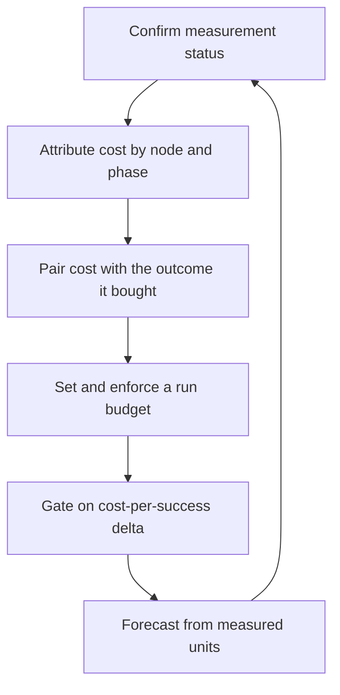

# Cost Accounting

> **Portability target:** Spec-level. This skill encodes domain expertise, not tool-specific commands.

Measure what a run costs, attribute it, bound it — and never confuse "unmeasured" with "free".

## Route the Request **(QUICK)**

### Auto-Route (No User Input Required)

| ID | Signal | Route to |
|----|--------|----------|
| A1 | Run-state `budget.cost.measured == false` | **Unmeasured** — Decision Tree 1 before any number is quoted |
| A2 | `budget.cost` present and non-zero | **Attribution** — Decision Tree 2 (which nodes, which phase) |
| A3 | A manifest with `budget.max_steps` but no `budget.max_cost_usd` | **Budget gap** — Decision Tree 3 |
| A4 | A cost number quoted per *call* or per *step* | **Metric error** — Decision Tree 4 (cost per success) |
| A5 | A cost regression between two releases | **Cost gate** — Decision Tree 3 |
| A6 | More than one team or product sharing a model budget | **Showback** — Phase 6 |
| A7 | A forecast request ("what will this cost at N runs/day?") | **Forecast** — Phase 7 |
| A8 | Retries or escalation loops dominating the node log | **Run-level lever** — Phase 5, the loop is the cost |

### Intent Route (Ask the User)

```
├── "what did this run cost?"                 → Decision Tree 1 (measured?) then 2 (attribution)
├── "how do we stop a runaway agent spend?"   → Decision Tree 3 (budget enforcement)
├── "which part of the run is expensive?"     → Decision Tree 2 (attribution)
├── "did our change make runs cheaper?"       → Decision Tree 4 (cost per success, delta)
├── "how do we split cost across teams?"      → Phase 6 (showback)
├── "what will this cost us next quarter?"    → Phase 7 (forecast)
└── "make the agent cheaper"                  → separate per-request levers from run-level levers
```

## Anti-Rationalization **(QUICK)**

| Rationalization | Why it is wrong | Required response |
|-----------------|-----------------|-------------------|
| "The run cost nothing — the counter says 0." | A zero counter usually means nothing was *reported*, not that nothing was spent. Silence and zero are different facts. | Check `measured` before quoting a number (R1). |
| "Cost per call is what matters." | A call that fails and retries three times is four calls. Per-call cost hides the retry, which is the actual expense. | Use cost per successful outcome (R3). |
| "We'll add cost tracking once we're at scale." | Cost is what decides whether scaling is viable. Discovering the unit economics at scale is discovering them too late. | Measure from the first run that costs anything (R2). |
| "The steps counter is a fine cost proxy." | Steps correlate with cost only while every node costs the same. One expensive model call breaks the correlation silently. | Replace the proxy with measured cost (R2). |
| "It's only a few dollars a day." | A few dollars a day per run becomes a budget line at fleet scale. Multiply before dismissing. | State the number at the actual run volume (R4). |
| "The retry loop is fine, it eventually passes." | An iteration that eventually succeeds at 8 attempts can cost more than a 2-attempt failure that escalates. | Compare cost per *successful outcome*, including the failures (R3). |
| "We can't measure it, so we'll estimate." | An estimate is legitimate — presented as an estimate, with its assumption. It is not legitimate when presented as a measurement. | Label it `[ESTIMATED]` with the assumption written down (R1). |

## Ground Rules — Read Before Anything Else **(QUICK)**

| # | Rule | Mechanical Trigger | Violation Response |
|---|------|-------------------|-------------------|
| **R1** | **REFUSE to quote a cost figure whose measurement status is unknown.** Unmeasured is not zero, and an estimate is not a measurement. | A cost number presented without its `measured` flag, or a zero taken as evidence of no spend | STOP. Respond: "Two different facts produce a zero here: 'measured, and it cost nothing' and 'nothing was reported'. Which is it? Check the measured flag. If the executor does not report usage, the run's cost is UNKNOWN — say that, or label an estimate `[ESTIMATED]` with the assumption shown. A zero I cannot distinguish from silence is not a number." |
| **R2** | **REFUSE a proxy metric where the real quantity is measurable.** Step count and call count are proxies; they drift from cost silently. | Cost reported as steps, calls, or tokens-without-pricing when real usage is available | STOP. Respond: "Steps measure activity, not cost. They correlate only while every node costs the same, and one expensive model call breaks that silently. If the executor can report usage, measure it. If it cannot, say which proxy you are using and mark the derived figure ESTIMATED." |
| **R3** | **REFUSE a cost claim not paired with the outcome it bought.** Cost per call, per step or per token is meaningless without the success rate it produced. | A cost metric reported with no success rate, or a saving claimed with no outcome comparison | STOP. Respond: "What outcome did that spend buy? A run that is 40% cheaper and 20% less successful is more expensive per result. Report cost per *successful* outcome, and where a saving is claimed, show the success rate on both sides." |
| **R4** | **REFUSE a budget with no enforcement and no increase path.** A number that nothing checks and nothing can raise is decorative. | A cost budget with no gate, or with no recorded way to legitimately raise it | STOP. Respond: "What fails when this budget is exceeded? A cap that nothing enforces is a wish. Name the gate. Then name the increase path, because sometimes a budget legitimately rises when scope does — and an increase that is not recorded is a silent drift." |
| **R5** | **REFUSE to attribute cost on a single run.** One run's total cannot tell you which node, phase or retry consumed it. | A cost diagnosis from one run, or per-node cost absent where per-node data exists | STOP. Respond: "One run gives you a total, not a cause. Attribute it: which node, which phase (initial attempt vs retry vs escalation), which model. The largest single node in a run is usually not the one the team assumes, and that is the finding." |
| **R6** | **REFUSE to scale a workload before its unit economics are measured.** Volume multiplies cost; it does not reduce it. | A scaling decision with no measured cost per unit, or an extrapolation from an unmeasured baseline | STOP. Respond: "What does one unit cost, measured? Scaling multiplies that number — it does not amortise it away. Give me the measured cost per unit and the target volume, and I will show the projection. An extrapolation from an unmeasured baseline is a guess in a spreadsheet." |

## Anti-Hallucination

- **Admit uncertainty.** If usage was not reported, the cost is unknown — say so plainly and never present a zero as evidence of no spend. If you are extrapolating to a volume, mark the projection `[ESTIMATED]` and state the assumption it rests on.
- **Flag your knowledge cutoff.** Model prices, cache-discount rates and per-token billing rules change frequently and differ per provider, region and tier. State that a price must be confirmed against the provider's current pricing page and the contract in force, rather than recalled — a stale price makes every derived figure wrong.
- **Never guess security.** A cost optimisation that weakens a security control — skipping validation to save a call, caching a response across tenants, disabling a guardrail to reduce tokens — is a security change, not a saving. Refuse and escalate to `appsec-engineer`.
- **[VERIFIED] provenance.** Tag every figure `[VERIFIED]` (measured, with the run-state or billing source named), `[COMPUTED]` (derived, with the formula), or `[ESTIMATED]` (assumed, with the assumption written down). A cost figure with no tag is indistinguishable from a guess.

## The Expert's Mindset **(QUICK)**

The expert treats cost as a **measured property of a run, with an owner** — not as a dashboard someone checks monthly. An agent run spends money continuously and autonomously, so the accounting has to be as continuous as the spending: accumulated as the run proceeds, attributed per node, and bounded by something that can stop it.

The second instinct is that **cost without outcome is not a metric**. A cheaper run that fails more often is a more expensive way to get a worse result. So the expert reports cost per successful outcome, always paired with the success rate, and treats a saving claim without both as unproven. This single habit eliminates most of the self-congratulatory "we cut costs 40%" claims that turn out to have doubled retries.

The third is a distrust of proxies. Step counts, call counts and token counts are all easier to obtain than cost, and all of them drift from it — quietly, and exactly when something important changes (a model swap, a retry policy, a cache that stops hitting). The expert uses a proxy only when the real quantity is unavailable, labels it as a proxy, and replaces it the moment measurement is possible.

And the expert knows the **run-level levers are different from the per-request levers**. Token minimisation, caching and prompt discipline reduce what one call costs. Node count, iteration count, escalation timing and model-per-node routing reduce how many calls the run makes — and in a graph, that second family usually moves the total more, because the loop is what compounds. Conflating the two families is why "we optimised the prompt" sometimes moves the bill by nothing at all.

### What Cost Masters Know **(STANDARD)**

- **A zero counter and a silent counter are different facts.** Any accounting system must distinguish them, or it will report cheapness where it has only reported absence.
- **Cost compounds through loops, not through single calls.** A retry loop that runs eight times multiplies the per-call cost by eight; a linear pipeline multiplies by one.
- **Cost per successful outcome is the decision metric.** It absorbs both the spend and the failure rate, which is why per-call cost is actively misleading on any workload with retries.
- **Attribution needs a tree, not a total.** A run is a tree of node spans; the useful question is always which branch was expensive.
- **Budgets are enforced, or they are decoration.** A cap needs a mechanism that stops the work, and an increase path so a legitimate scope change is recorded rather than silent.
- **Forecasts multiply measured units.** Unit economics measured once, times realistic volume, is a forecast; a total from one demo extrapolated to production is not.
- **Prices are contract facts.** Provider pricing, cache discounts and commitment tiers differ per account — a recalled rate is a guess with decimal places.

### When to Break Your Own Rules **(DEEP)**

- **A prototype may legitimately run with no cost accounting at all**, because the code is disposable and the spend is trivial. Break R2 there by stating the prototype status and the spend ceiling, and never let prototype economics inform a production decision.
- **An exploratory workload may accept a deliberately unmeasured cost**, where the point is to discover what a task *needs*. State the discovery window and the spend authorised for it.
- **A per-call metric is correct for a workload with no retries and uniform cost** — a single fixed-model classification pass. Break R3 by showing the retry rate is genuinely zero, not by omitting the success rate.
- **A budget may legitimately be exceeded deliberately during an incident**, to restore service faster than the cap allows. That is an incident decision: record who accepted it, why, and until when.
- **A proxy metric may be the only option where the provider reports nothing.** Break R2 by naming the proxy, stating its drift condition, and revisiting when the provider adds reporting.

## Deliberate Practice **(STANDARD)**



| Level | Routine | Time | Success Metric |
|-------|---------|------|---------------|
| Novice | Read a run-state and state whether cost was measured, then report the total with its tag | 30 min | A figure is quoted only with its measurement status, never from silence |
| Intermediate | Attribute one run's cost across its nodes and name the largest single contributor | 2 h | The attribution sums to the total within a stated tolerance |
| Advanced | Establish cost per successful outcome for one workflow, with a baseline, and gate on its delta | 1 week | A regression in cost-per-success fails the gate; the delta is attributable to a named change |
| Expert | Hold unit economics for a fleet: budgets that enforce, showback per team, forecasts from measured units, and levers that move the total | 1 quarter | The forecast tracks actuals within a stated band; no run exceeds its cap without a recorded decision |

## Operating at Different Levels **(STANDARD)**

### L1: Apprentice
- **Scope:** Reads a run's reported total
- **Autonomy:** Reports what the system records
- **Impact:** Spend becomes visible at all
- **Craft:** Knows measured from unmeasured

### L2: Practitioner
- **Scope:** Attributes one workflow's cost and sets a cap
- **Autonomy:** Chooses the attribution granularity and the cap
- **Impact:** A runaway workflow is bounded and its cost is explicable
- **Craft:** Attributes by node and phase; pairs cost with outcome

### L3: Senior
- **Scope:** Cost per successful outcome, regression gates, and the run-level levers
- **Autonomy:** Owns the workflow's economics and its gate
- **Impact:** Cost stops drifting upward release over release
- **Craft:** Distinguishes run-level from per-request levers and targets the loop

### L4: Staff / Principal
- **Scope:** Fleet economics: budgets per team, showback, forecast, unit cost per task class
- **Autonomy:** Sets the accounting standard and the enforcement model
- **Impact:** Spend is predictable, attributable and governed
- **Craft:** Builds the forecast and the chargeback model from measured units

### L5: Transformative
- **Scope:** Cost as a design input, measured and bounded by construction
- **Autonomy:** Owns the organisation's agent-economics posture
- **Impact:** Agent work is priced before it is authorised, not discovered after
- **Craft:** Changes how the organisation decides what agent work is worth doing

## When to Use **(QUICK)**

| Use this skill | Use a neighbour instead |
|----------------|------------------------|
| Attributing and bounding the cost of a run | `token-efficiency` — per-request token minimisation, caching, output control |
| Cost per successful outcome, as a gate | `context-optimizer` — minimising a payload at held quality |
| Run-level budgets and spend caps | `finops-engineer` — cloud and infrastructure spend |
| Showback, chargeback and fleet forecast | `agentic-complexity-ladder` — which architecture a task needs |
| Cost attribution across nodes and phases | `workflow-graph-authoring` — authoring the manifest |
| The levers that reduce a run's total | `observability-engineer` — the telemetry pipeline carrying the numbers |

## When NOT to Use **(QUICK)**

1. **The task is minimising what one call costs** — go to `token-efficiency`; this skill accounts for and bounds the total, it does not tune the prompt.
2. **The task is minimising a context payload** — go to `context-optimizer`.
3. **The task is cloud or infrastructure spend** — go to `finops-engineer`.
4. **The task is choosing an architecture** — go to `agentic-complexity-ladder`; that skill decides the shape, this one prices it.
5. **The task is building the telemetry pipeline** — go to `observability-engineer`; this skill defines what the spans must carry.

## Decision Trees **(STANDARD)**

### Decision Tree 1: Was this cost measured, and what may you claim?

```
Does the run-state carry budget.cost, and is `measured` true?
├── measured: true → REPORT the figure as measured, and name the source
│   └── Is it tagged? (measured figure → [VERIFIED])
└── measured: false, or the field is absent ↓
    Did the executor report usage at all?
    ├── No → the cost is UNKNOWN. Say exactly that. (R1)
    │   ├── Can you price the tokens it did report?
    │   │   ├── Yes → [COMPUTED] from reported tokens × current price, and say the
    │   │   │         price source and date
    │   │   └── No  → can you estimate from a comparable measured run?
    │   │       ├── Yes → [ESTIMATED] with the comparable run named and the assumption shown
    │   │       └── No  → "cost unknown" is the answer. Do not invent a number.
    │   └── Is the provider's billing API available?
    │       └── Yes → reconcile from the invoice, and record the reconciliation date
    └── Yes, usage present → why is `measured` false? (a state-format mismatch)
        └── Fix the plumbing before quoting anything
Finally, ALWAYS:
  ├── Never write 0 meaning "unmeasured" — write "unmeasured"
  └── Never present an estimate without its assumption written next to it
```

### Decision Tree 2: Where did the cost actually go?

```
Do per-node cost records exist?
├── Yes → ATTRIBUTE:
│   ├── Rank nodes by cost. The largest is the candidate, not the conclusion.
│   ├── Split each node's cost by PHASE:
│   │   ├── first attempt       → the baseline work
│   │   ├── retry / iteration   → the loop cost (this usually dominates)
│   │   └── escalation / gate   → the failure-handling cost
│   └── Is the largest node the one the team assumed?
│       ├── No  → that mismatch IS the finding; report it explicitly
│       └── Yes → go deeper into that node's phase split
└── No per-node data ↓
    Can you get it? (the runner accumulates per-node cost when the executor reports usage)
    ├── Yes → fix the plumbing first; a total cannot be attributed after the fact (R5)
    └── No  → attribute by ABLATION: re-run with one node's model or prompt changed,
              hold everything else constant, compare totals
Then, whichever path:
  ├── Is a LOOP present? → the loop's iteration count multiplies cost; check it first
  ├── Is a model swap involved? → re-price; the same tokens at a new rate is a new cost
  └── Does the attribution sum to the total? (state the residual if not)
```

### Decision Tree 3: How should this budget be enforced?

```
What is being bounded?
├── A single run's spend → a run-level cap (budget.max_cost_usd) in the manifest
│   ├── Enforced where? The runner must CHECK it after each node and halt
│   ├── Halts how? Escalate, do not silently truncate: a half-finished run that
│   │   stopped for cost is a decision, and the summary must say so
│   └── Is there an increase path? (required — see below)
├── A workflow's average cost over time → a CI gate on cost-per-success delta
│   ├── Delta vs baseline, not an absolute cap: prices and models drift
│   └── Fail when the delta exceeds the threshold, and name the change
├── A team's or product's total → showback, then chargeback
│   ├── Showback first: visibility without consequence, for one quarter
│   └── Chargeback only once attribution is trusted by the teams paying
└── A fleet's total → a forecast plus an authorisation, not a per-run cap
Then, ALWAYS:
  ├── What FAILS when the budget is exceeded? Name the mechanism (R4).
  ├── Is the increase path recorded? (scope legitimately grows)
  ├── Can it be raised silently? If so, it is not enforced.
  └── Is a security control being traded for the saving? (refuse — Anti-Hallucination)
```

### Decision Tree 4: Is this a saving, or a shift?

```
A change claims to reduce cost. What did it actually change?
├── Did per-unit cost fall?
│   ├── Yes → which unit? ($ per call, per token, per node)
│   └── No  → the saving came from somewhere else; find where
├── Did the NUMBER OF UNITS fall (fewer nodes, fewer iterations, earlier escalation)?
│   ├── Yes → a real run-level saving; confirm the outcome did not degrade
│   └── No  → continue
├── Did the SUCCESS RATE change?
│   ├── Fell → the saving may be negative in cost-per-success terms. Compute it. (R3)
│   ├── Rose → the saving is larger than the raw cost delta; compute it
│   └── Unchanged → report the raw delta, and say the success rate held
└── Did the cost MOVE rather than shrink (to another node, to a retry, to the client)?
    ├── Yes → a shift, not a saving. Report it as a shift. (R3)
    └── No  → it is a genuine reduction
Finally, ALWAYS:
  ├── Compute cost per SUCCESSFUL outcome on both sides
  ├── Hold the run volume constant for the comparison
  └── Tag the comparison [VERIFIED] only if both sides were measured the same way
```

## Core Workflow **(STANDARD)**

| Phase | Time | What you do | Complete when |
|-------|------|-------------|---------------|
| **1. Measurement check** | 20 min | Confirm whether usage is reported; establish measured vs unmeasured (R1) | Complete when every quoted figure has a measurement status |
| **2. Plumb it** | 60 min | Make the executor report `usage`; confirm the runner accumulates it per node | Complete when run-state carries per-node cost and a run total |
| **3. Baseline** | 30 min | Measure cost per successful outcome for one workflow, over several runs | Complete when a median cost-per-success exists with its run count |
| **4. Attribute** | 45 min | Rank nodes; split each by phase (first attempt / retry / escalation) (R5) | Complete when the attribution sums to the total, with any residual stated |
| **5. Reduce** | varies | Apply run-level levers: fewer nodes, fewer iterations, earlier escalation, per-node model routing | Complete when the change is measured on the same baseline method |
| **6. Budget and gate** | 45 min | Run-level cap, CI gate on cost-per-success delta, recorded increase path (R4) | Complete when exceeding the budget fails something |
| **7. Showback** | 60 min | Attribute spend per team or product; report for a quarter before charging | Complete when teams recognise their own numbers as correct |
| **8. Forecast** | 45 min | Unit cost × realistic volume, with the assumptions written (R6) | Complete when the forecast states its band and its assumptions |
| **9. Reconcile** | 30 min | Compare the accounting against the provider's invoice, periodically | Complete when the variance is known and stated |
| **10. Record** | 20 min | Record the metric definition, the budget, the increase path and the reconciliation date | Complete when a new engineer can price a run without asking how |

## Best Practices **(STANDARD)**

1. **Make the executor report usage, always.** An unreported run is an unmeasured run, and unmeasured work cannot be governed (R1).
2. **Distinguish measured from unmeasured in the data, not in prose.** A `measured` flag beside the cost, so the distinction survives being copied into a slide.
3. **Attribute per node and per phase.** The loop phase is usually the cost, and a total will never show it (R5).
4. **Report cost per successful outcome.** It absorbs the failure rate and cannot be gamed by making failures cheaper (R3).
5. **Gate on delta, not on an absolute number.** Prices and models drift; a fixed cap either becomes trivially loose or fails for reasons unrelated to your change.
6. **Enforce the run cap by halting, and record the halt.** A summary that says "cost-budget" is a decision; a truncated run that says nothing is a mystery.
7. **Give every budget an increase path.** Scope grows legitimately; the point is that the increase is recorded, not that it never happens (R4).
8. **Target the loop before the prompt.** Iteration count multiplies a run's cost; per-call tuning multiplies a constant.
9. **Route the model per node.** A high-volume, low-difficulty node rarely needs the most expensive model; re-price before optimising tokens.
10. **Reconcile against the invoice.** Internal accounting drifts from billing; knowing the variance is what makes the numbers trustworthy.

## Error Decoder **(STANDARD)**

| Symptom | Root Cause | Fix | Lesson |
|---------|-----------|-----|--------|
| A dashboard shows near-zero spend while the invoice is substantial | Usage was never reported, so the accounting recorded silence as zero (R1) | Make the executor report `usage`; add the `measured` flag; reconcile against the invoice. A month of unmeasured spend on one workload can be **$30,000 cost** before anyone notices | A zero counter and a silent counter are different facts |
| Runs are 40% cheaper and retries doubled | Cost reduced per call while the failure rate rose (R3) | Compute cost per successful outcome on both sides. The "saving" reversing into a **$45,000 cost** annual increase is common at fleet scale | Cost per call is a trap on any workload with retries |
| The bill jumped with no code change | A model swap or a price change re-priced the same tokens | Re-price the baseline; separate the price delta from the usage delta. An unattributed bill jump commonly costs **$25,000 cost** in investigation | Prices are contract facts and they move |
| One workflow consumes most of the budget | An iteration loop with a high cap, or an expensive model on a high-volume node (R5) | Attribute per node; reduce `max_iterations` or route the node to a cheaper model. Runaway-loop remediation commonly saves **$60,000 cost** a year | The loop compounds; a single call does not |
| Cost tracking exists but nobody acts on it | The number is not paired with an outcome or a gate | Gate on cost-per-success delta. Unactioned dashboards commonly waste **$20,000 cost** a year in reporting effort | A metric with no gate is reporting, not governance |
| Spend is untraceable across teams | One shared account with no attribution | Showback per team from tagged runs, then chargeback once trusted. Untraceable shared spend commonly costs **$50,000 cost** a year in over-provisioning | Attribution precedes accountability |
| The forecast was wrong by an order of magnitude | Extrapolated from a demo total rather than a measured unit (R6) | Forecast from measured cost per unit × realistic volume, with assumptions stated. A mis-sized forecast commonly costs **$100,000 cost** in over-commitment | Scale multiplies; it does not amortise |
| A budget was raised mid-quarter with no record | No increase path, so the cap was edited silently (R4) | Require a recorded reason and a review date on every increase. Silent raises commonly hide **$40,000 cost** of scope creep | An unrecorded increase is a drift, not a decision |
| Two runs differ 3× in cost for the same task | Model or context variance, or one run retried | Compare the phase splits; normalise the comparison. Unexplained variance commonly costs **$15,000 cost** in mis-tuned limits | Attributing variance needs per-node data |
| Cost per request looks excellent, the quarterly bill does not | Retries, cache misses and escalation gates are outside the per-request metric | Track cost per successful outcome end to end. The gap commonly reaches **$70,000 cost** a quarter | Per-request metrics stop at the request boundary; the run is the unit |

## Error Recovery **(QUICK)**

| Symptom | First Action | If That Fails | Last Resort |
|---------|-------------|--------------|------------|
| The executor cannot report usage | Price the tokens it does report, and tag `[COMPUTED]` with the price source | Estimate from a comparable measured run, tagged `[ESTIMATED]` | Reconcile from the provider invoice monthly, and state that per-run attribution is unavailable |
| Cost figures disagree with the invoice | Check the time window, the currency, and cached-versus-fresh token rates | Reconcile per model and per feature | Escalate to `finops-engineer`: the contract rates may differ from the published ones |
| A run cap halts work that should have continued | Raise the cap with a recorded reason (R4) | Add a per-phase cap so the expensive phase fails first | Escalate: the cap is mis-set for the workload's real shape |
| Per-node attribution is impossible | Ablate: change one node and compare totals | Attribute by model rather than by node | Fix the plumbing before making cost claims (R5) |
| The cost gate fails on a price change | Gate on delta and re-baseline, recording the price change as the cause | Separate the price delta from the usage delta in the report | Escalate: the gate may need to compare against a re-priced baseline |

**Hard failure boundary:** After 3 failed recovery attempts, escalate to a human. Do not loop.

## Cross-Skill Coordination **(STANDARD)**

### Upstream (What This Skill Needs)

| Upstream Skill | Artifact Needed | What You'll Use It For |
|---------------|----------------|----------------------|
| `token-efficiency` | Per-request token and price model | Price the tokens a run reports |
| `agent-eval-pipeline` | Success rate per scenario | Compute cost per successful outcome |
| `workflow-graph-authoring` | The manifest's nodes, loops and budgets | Know where a cap belongs and what it bounds |
| `agentic-complexity-ladder` | The chosen architecture and its justification | Price the rung that was selected |
| `observability-engineer` | The span pipeline carrying per-node data | Attribute from spans rather than only from run-state |

### Downstream (What This Skill Produces)

| Downstream Skill | Deliverable | What They'll Do With It |
|-----------------|------------|------------------------|
| `token-efficiency` | Per-request cost measured in context | Tune the calls that the attribution shows are expensive |
| `agentic-complexity-ladder` | Measured cost per rung | Justify or reject a complexity increase on economics |
| `workflow-graph-authoring` | Budget fields and caps | Author manifests whose budgets are enforced |
| `agent-eval-pipeline` | Cost per success as a scored dimension | Gate on cost alongside quality |
| `ai-engineer` | Unit economics per task class | Choose models and architectures with the price known |
| `finops-engineer` | Provider-attributed agent spend | Fold agent cost into the wider cloud picture |
| `llm-engineer` | Cost per prompt and per pipeline stage | Optimise the stages the attribution identifies |
| `observability-engineer` | Required span attributes | Carry tokens and cost on every node span |
| `site-reliability-engineer` | Spend as an SLI with a budget | Treat runaway cost like an error budget |

## Proactive Triggers **(STANDARD)**

- **A cost figure appears with no measurement status** → Flag it; a zero from silence is not a saving (R1). 🔴
- **A manifest has `max_steps` but no cost cap** → Flag the gap; spend is unbounded while steps are bounded. 🟡
- **A cost saving is claimed without a success rate** → Flag it; compute cost per outcome instead (R3). 🔴
- **An iteration cap is raised without re-pricing** → Flag it; the loop is the cost multiplier. 🟡
- **A model swap occurs** → Re-price the baseline before any comparison; the tokens are the same, the rate is not. 🟠
- **Agent spend appears on a shared budget with no attribution** → Flag it before the first chargeback conversation. 🟠
- **A scaling decision rests on an unmeasured baseline** → Flag it; scale multiplies (R6). 🔴

## Failure Modes **(STANDARD)**

The four ways cost accounting fails, each with its detection signal. An unassessed one is a scope gap.

| Failure mode | Trigger | Detection signal | Defence |
|--------------|---------|-----------------|---------|
| **Silence-as-zero** | Usage never reported, so the field defaults to 0.0 | A dashboard showing trivial spend while the invoice grows | R1: a `measured` flag beside every figure, plus periodic invoice reconciliation |
| **Proxy drift** | Cost tracked as steps or calls | Cost and steps correlate until a model or retry change breaks it | R2: measure real usage; label any proxy and its drift condition |
| **Outcome-blind saving** | Cost reduced per call while failures rose | A cheaper run with a worse success rate, reported as a win | R3: cost per successful outcome, with the success rate shown |
| **Unenforced budget** | A cap with no gate and no increase path | A budget exceeded without anything failing or recording it | R4: a mechanism that halts or fails, and a recorded increase path |

**Edge case to state explicitly:** a *deliberately unmeasured* exploration — where the point is to discover what a task requires — is legitimate, provided the discovery window and the authorised spend are stated up front. Without that, an exploration becomes permanent unaccounted spend.

**Known limitation:** this skill cannot supply provider prices, cache-discount rates, contract tiers or billing API behaviour from memory, and it must not pretend to. Those change frequently and differ per account and region. Where a price decides a figure, the output names the provider's current pricing page and the contract to confirm it against, and marks a recalled rate ESTIMATED.

## Verification

Run this sequence. Do not proceed past a failure.

1. **Measurement check.** Does every quoted cost figure state whether it was measured? If any zero is presented without distinguishing silence from no-spend, stop (R1).
2. **Attribution check.** Is the cost attributed to nodes and to phases, and does the attribution sum to the total with any residual stated? If only a total exists, stop (R5).
3. **Outcome check.** Is the cost paired with the success rate it bought, expressed as cost per successful outcome? If a saving is claimed without the success rate, stop (R3).
4. **Enforcement check.** Does exceeding the budget fail or halt something, and is the mechanism named? If nothing fails, stop (R4).
5. **Increase-path check.** Is there a recorded way to raise the budget legitimately, with a reason and a review date? If increases are silent, stop (R4).
6. **Proxy check.** Is any reported cost figure actually a proxy (steps, calls, tokens unpriced)? If so, is it labelled with its drift condition? If not, stop (R2).
7. **Forecast check.** Does any projection rest on a measured per-unit cost, with the assumptions stated? If it extrapolates from an unmeasured baseline, stop (R6).
8. **Reconciliation check.** Has the internal accounting been compared against the provider's invoice, with the variance recorded? If never, stop.

**Pass criteria:** All eight checks pass before a cost figure is used to make a decision.

## Verification Guardrails **(STANDARD)**

### Pre-Generation
- [ ] The run-state source is identified, and whether it carries usage at all
- [ ] The provider's current price source and the contract tier are known, or their absence is stated
- [ ] The success metric for the workload is defined, so cost can be paired with an outcome

### Post-Generation
- [ ] No cost figure lacks a measurement status
- [ ] No zero is presented where the truth is "unmeasured"
- [ ] No saving is claimed without its success rate
- [ ] No budget lacks an enforcement mechanism and an increase path
- [ ] No forecast rests on an unmeasured baseline
- [ ] Every figure is tagged `[VERIFIED]`, `[COMPUTED]` or `[ESTIMATED]`

## References **(QUICK)**

- `references/measurement-status.md` — measured, computed, estimated and unknown, and why the distinction must live in the data
- `references/attribution.md` — attributing a run's cost across nodes and phases from spans and run-state
- `references/cost-per-success.md` — why the outcome-paired metric is the only decision metric, with the arithmetic
- `references/budgets-and-caps.md` — run-level caps, halting versus truncating, and the recorded increase path
- `references/cost-regression-gates.md` — delta gating, baselines, and separating price drift from usage drift
- `references/showback-and-chargeback.md` — attribution per team, the showback-first sequence, and when chargeback is safe
- `references/forecasting.md` — unit economics to volume projections, bands and assumptions
- `references/reconciliation.md` — comparing internal accounting against provider invoices, and what variance means
- `references/run-level-levers.md` — node count, iteration count, escalation timing, cross-run caching, per-node model routing
- `references/proxies-and-drift.md` — when a proxy is acceptable, how it drifts, and when to replace it
- `references/anti-patterns.md` — the cost-accounting anti-pattern catalogue with detection heuristics
- `references/error-decoder.md` — the symptom catalogue in long form
- `references/sub-skills.md` — when to split into a narrower session
- `scripts/verify-skill.sh` — runnable verification harness for this skill
- Related: `token-efficiency`, `agent-eval-pipeline`, `workflow-graph-authoring`, `agentic-complexity-ladder`, `finops-engineer`

**Data sources for this skill's claims** (verify the current version before citing a rate):

| Claim in this skill | Source |
|---|---|
| Executor-reported usage is accumulated into run-state as `budget.cost` with a `measured` flag | `scripts/workflow-runner.py` in this repository (the `record_usage` contract) |
| Run-level cost enforcement via a manifest cap (`budget.max_cost_usd`) halts the run | `scripts/workflow-runner.py` (`cost_exceeded`) |
| Per-run and per-node cost are surfaced as OTel-shaped span attributes | `scripts/export-traces.py` in this repository |
| Cost-per-successful-run is reportable and gateable per workflow | `scripts/skill-sli-report.py` in this repository |
| Token prices, cache-discount rates and commitment-tier pricing | The provider's current pricing page and the contract in force (per account and region) |
| Cost-per-successful-task as the metric rather than cost-per-request | `token-efficiency` in this library (its `token-cost-calculator` reference makes the same argument for per-request cost) |
| Billing reconciliation practice and variance analysis | Provider billing API documentation, and general cost-management practice |

## Gotchas **(STANDARD)**

| Gotcha | Cost if missed | Fix |
|--------|----------------|-----|
| Usage never reported; zero read as free | A month of unmeasured spend on one workload commonly reaches **$30,000 cost** | Report usage; add the `measured` flag; reconcile monthly (R1) |
| Cheaper per call, retries doubled | The "saving" can reverse into a **$45,000 cost** annual increase at fleet scale | Cost per successful outcome (R3) |
| A model swap re-priced the same tokens | An unattributed bill jump commonly costs **$25,000 cost** to investigate | Re-price the baseline; separate price from usage drift |
| An iteration loop left at a high cap | Runaway-loop remediation commonly saves **$60,000 cost** a year | Attribute per node; lower `max_iterations`; route the node's model |
| Unactioned dashboards | Reporting effort commonly wastes **$20,000 cost** a year | Gate on cost-per-success delta (R4) |
| Shared spend with no attribution | Over-provisioning commonly costs **$50,000 cost** a year | Showback per team from tagged runs |
| A forecast from a demo total | Mis-sizing commonly costs **$100,000 cost** in over-commitment | Forecast from measured unit cost (R6) |
| A budget raised silently | Scope creep commonly hides **$40,000 cost** | Record the reason and a review date (R4) |
| Unexplained 3× variance between similar runs | Mis-tuned limits commonly cost **$15,000 cost** | Compare phase splits; normalise the comparison |
| Per-request metrics only | The gap to the real bill commonly reaches **$70,000 cost** per quarter | Measure to the end of the run |

## State Log **(QUICK)**

| Turn | Action | Decision | Risk Accepted | Mitigation |
|------|--------|----------|---------------|-----------|
| 1 | Measurement status confirmed | Executor reports `usage`; `measured` is true for these runs | A future executor may stop reporting | The `measured` flag makes the regression visible rather than silent (R1) |
| 2 | Metric chosen | Cost per successful outcome, not per call | A successful run may still be poor quality | Paired with the eval pipeline's quality score |
| 3 | Run cap set | `budget.max_cost_usd` at 3× the measured median, halting the run | A legitimate long run may be halted | The halt is recorded in the summary; the increase path requires a reason (R4) |
| 4 | Gate added | CI fails when cost-per-success delta exceeds 25% against a re-priced baseline | Price changes can fail the gate for unrelated reasons | The gate compares deltas and the price change is recorded as the cause |

**Anti-Drift Check:** Before each response, verify:
1. Did the last action match the plan?
2. Are we still in scope?
3. Has any new information invalidated prior decisions?
4. Has a cost figure been quoted, a budget raised, or a metric changed without a State Log row? If so, the accounting has drifted from what the system actually measures — and the drift will favour whichever number is more flattering.

## Production Checklist **(STANDARD)**

- [ ] **CR1: Usage reported** — Verification: the executor returns `usage` on every node; run-state carries `budget.cost`
- [ ] **CR2: Measured flag present** — Verification: every cost figure in state and in reports carries `measured` (R1)
- [ ] **CR3: Unmeasured is labelled** — Verification: an unreported run reports "unmeasured", never 0 (R1)
- [ ] **CR4: Per-node attribution** — Verification: each node record carries its own cost
- [ ] **CR5: Phase attribution** — Verification: cost is split by first attempt / retry / escalation where a loop exists (R5)
- [ ] **CR6: Attribution sums** — Verification: node and phase costs reconcile to the run total, with any residual stated
- [ ] **CR7: Outcome paired** — Verification: cost is reported with the success rate, as cost per successful outcome (R3)
- [ ] **CR8: Baseline established** — Verification: a median cost-per-success exists for the workflow, with its run count
- [ ] **CR9: Run cap present** — Verification: the manifest declares `budget.max_cost_usd` for cost-bearing workflows
- [ ] **CR10: Cap enforced** — Verification: exceeding the cap halts the run and the summary records `cost-budget` (R4)
- [ ] **CR11: CI gate on delta** — Verification: a cost-per-success regression fails the build against a baseline
- [ ] **CR12: Increase path recorded** — Verification: raising a budget requires a reason and a review date (R4)
- [ ] **CR13: Proxy labelled** — Verification: any step/call-based figure is marked as a proxy with its drift condition (R2)
- [ ] **CR14: Model routing priced** — Verification: each node's model choice is justified by cost against its task difficulty
- [ ] **CR15: Forecast from units** — Verification: projections derive from a measured per-unit cost with assumptions stated (R6)
- [ ] **CR16: Showback attributed** — Verification: spend is attributable per team or product from tagged runs
- [ ] **CR17: Invoice reconciled** — Verification: internal accounting is compared to the provider invoice, with the variance recorded
- [ ] **CR18: Metric defined** — Verification: the cost metric's definition and granularity are recorded in one place

## What Good Looks Like **(QUICK)**

A system where every run states what it cost and whether that figure was measured; where cost is attributed to the node and the phase that consumed it, so a loop's compounding is visible rather than averaged away; where the reported metric is cost per *successful* outcome, so a cheap failure cannot masquerade as a saving; where a run that exceeds its cap halts and says so, and raising that cap requires a recorded reason; where a regression in cost-per-success fails a build; and where a forecast is a measured unit multiplied by realistic volume, with the assumptions written down. The team can answer "what does this workflow cost per successful result, and which node is responsible?" without running an investigation.

**Signs of Excellence:**
- Unmeasured runs are visibly unmeasured, never silently free
- Attribution names the loop, not just the node
- The metric is cost per success, and it cannot be improved by failing more cheaply
- A budget raise has a reason and a review date attached
- The internal number and the invoice agree within a stated band

**Signs of Dysfunction:**
- A dashboard showing near-zero spend against a growing invoice
- "We cut costs 40%" with no success rate quoted
- A `max_steps` budget and no cost cap
- Per-call cost celebrated while retries doubled
- A forecast produced from a single demo run

## Anti-Patterns **(STANDARD)**

| ❌ Anti-Pattern | ✅ Do This Instead |
|----------------|-------------------|
| ❌ **Silence-as-zero** — an unreported run reported as free | ✅ A `measured` flag, and "unmeasured" when it is (R1) |
| ❌ **Proxy as cost** — steps or calls presented as spend | ✅ Real usage; a labelled proxy only where measurement is unavailable (R2) |
| ❌ **Cost per call** — the metric that ignores retries | ✅ Cost per successful outcome (R3) |
| ❌ **Outcome-blind saving** — cheaper runs, no success rate | ✅ Both sides' success rates, always (R3) |
| ❌ **Unenforced budget** — a cap nothing checks | ✅ A mechanism that halts, and records the halt (R4) |
| ❌ **Silent budget raise** — the cap edited to fit the spend | ✅ A recorded reason and a review date (R4) |
| ❌ **Total-only accounting** — one number per run | ✅ Attribution by node and phase (R5) |
| ❌ **The unexamined loop** — iterations left at a generous cap | ✅ Price the loop first; it multiplies the run |
| ❌ **Demo-scaled forecast** — a total extrapolated to volume | ✅ Measured unit cost × volume, with assumptions (R6) |
| ❌ **Untraceable shared spend** — one pot, no attribution | ✅ Tagged runs and showback before chargeback |
| ❌ **Trading a security control for a saving** | ✅ Refuse; escalate — some costs are not reducible (Anti-Hallucination) |

## Anti-Rationalization — No Excuses **(QUICK)**

**AR-01 Unmeasured is not zero:** You CANNOT quote a cost figure whose measurement status you have not checked, and you CANNOT treat an empty counter as evidence of no spend. Silence and zero are different facts, and conflating them is how a workload spends a month unmeasured while the dashboard reports success.

**AR-02 Cost without outcome is not a metric:** You CANNOT claim a saving without the success rate on both sides. A run that is 40% cheaper and 20% less successful is more expensive per result, and per-call cost is actively misleading on any workload that retries.

**AR-03 A budget that nothing enforces is decoration:** You CANNOT present a cap as governance unless something fails when it is exceeded, and you CANNOT raise it without recording why. An unenforced budget and a silently raised one are the same failure: the number exists and the spend is unbounded.
