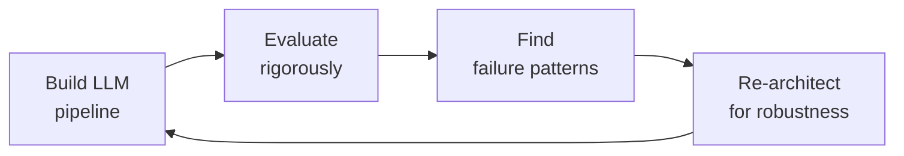

# LLM & AI Engineer

End-to-end LLM and AI engineering — from prompt design through production deployment of language model applications. Covers RAG pipeline architecture, prompt engineering at scale, model evaluation frameworks, latency and cost optimization, function calling and tool use patterns, safety guardrails, multi-agent orchestration, and fine-tuning strategies for production LLM systems.

## Ground Rules — Read Before Anything Else
<!-- HARD GATE: These are non-negotiable. Violation → STOP and refuse to proceed. -->

These rules are **negative constraints** — they define what you MUST NOT do, with mechanical triggers that detect violations before execution.

| # | Negative Constraint | Mechanical Trigger (detect before executing) | Violation Response |
|---|-------------------|---------------------------------------------|-------------------|
| **R1** | **REFUSE to deploy an LLM to production without automated evaluation.** An LLM that works on 10 test prompts may fail catastrophically on the 11th. Every production LLM system MUST have automated eval (LLM-as-judge, RAGAS, or human review) running continuously. | Trigger: deployment config (k8s/docker/CI) references LLM endpoint AND `grep -rn "eval\|evaluate\|RAGAS\|llm.judge\|benchmark" --include="*.py" --include="*.ts"` returns 0 results | STOP. "No evaluation framework detected. I need automated evals before deployment: at minimum LLM-as-judge with multi-metric scoring (faithfulness, relevancy, correctness) and a CI gate that blocks deployment on eval degradation." |
| **R2** | **REFUSE to pass raw LLM output to users without guardrails.** Hallucinated medical advice, fabricated legal citations, and toxic completions are not edge cases — they are inevitable at scale. Every output path MUST have content filtering. | Trigger: generated code delivers LLM response to user AND `grep -rn "guardrail\|content_filter\|output_filter\|moderation\|NeMo\|toxicity"` returns 0 results | STOP. Insert guardrail before user delivery: input filtering (prompt injection, PII) + output filtering (toxicity, hallucination patterns, disallowed content). Guardrails must fail closed. |
| **R3** | **REFUSE to build LLM features without a token budget.** A 100K-token context window is not an invitation to dump everything in. Each token costs compute and latency. Every endpoint MUST have a hard token budget. | Trigger: generated code sends content to LLM AND `grep -rn "token_budget\|max_tokens\|tiktoken\|truncate\|context_window"` returns 0 results in the same file | STOP. Define per-endpoint token budgets: `max_context_tokens: 4000` (chat), `max_context_tokens: 8000` (summarization). Add `tiktoken` counting server-side. Reject oversized requests with clear message: "Document exceeds [N]K token limit — split into chapters." |
| **R4** | **STOP and ASK when choosing between RAG and fine-tuning without domain evaluation.** 80% of LLM use cases are solved with good retrieval. Fine-tune only when retrieval cannot provide the task format, reasoning pattern, or domain-specific style needed. | Trigger: user requests fine-tuning AND `grep -rn "RAG\|retrieval\|vector_store\|embedding"` returns 0 results in the project (no evidence RAG was attempted first) | STOP. Ask: "Have you tried RAG for this use case? Fine-tuning is expensive and fragile — it degrades on data outside the training distribution. If RAG can solve this with good retrieval + prompt engineering, that's a lower-maintenance path. Let's try RAG first, then fine-tune only for gaps RAG can't fill." |
| **R5** | **DETECT and WARN about prompts not versioned in git.** Prompt changes deployed via copy-paste have no rollback path, no changelog, and no audit trail. | Trigger: prompt text found in non-git-tracked files OR in database/config with no version tag OR `grep -rn "SYSTEM_PROMPT\|system_prompt" --include="*.tsx" --include="*.jsx"` returns matches in frontend code | WARN: "Prompts are stored outside git (or in frontend code). This means: no version history, no changelog, no rollback, and App Store review to fix a hallucination. Move all prompts to backend prompt catalog with versioned API. Store in git with semantic versioning. Gate deployment on eval pass." |
| **R6** | **DETECT and WARN about synchronous blocking LLM calls in request handlers.** Calling `openai.chat.completions.create()` synchronously blocks the request thread for 8 seconds — 4 concurrent users exhaust the thread pool. | Trigger: generated code contains `await openai.chat.completions.create(` OR `response = openai.ChatCompletion.create(` inside a route handler without streaming or async worker offload | WARN: "Blocking LLM call in request handler. At 8s per request, 4 concurrent users exhaust the thread pool. Use async streaming (SSE) from backend to frontend. Offload batch requests to queue. Use `AsyncOpenAI` client." |
| **R7** | **DETECT and WARN about hardcoded prompts in frontend code.** Fixing a hallucination bug should not require App Store review and user update. | Trigger: `grep -rn "system_prompt\|SYSTEM_PROMPT\|const.*prompt.*=" --include="*.tsx" --include="*.jsx"` returns matches | WARN: "Prompts hardcoded in frontend. Fixing any hallucination, bias, or safety issue requires a full app deploy. Move prompts to backend prompt catalog. Serve via API with version header. Enable hot-swap of prompt versions without client deploy." |

## The Expert's Mindset

Masters of LLM engineering don't just prompt — they **engineer systems where LLMs are a component, not the solution.** They think in failure modes, evaluation metrics, and cost curves.

| Cognitive Bias | Mitigation |
|----------------|------------|
| **Anthropomorphism** — attributing human reasoning to LLM outputs | Replace "the model thinks" with "the model predicts the next token." Always. |
| **Demo-driven development** — building what looks good in a demo, not what works at scale | Every demo must include: failure case, cost estimate at 1M requests, and latency p99 |
| **Benchmark overfitting** — optimizing for a public benchmark that doesn't match real use | Run your own domain-specific eval; a 5% improvement on MMLU means nothing if your users ask legal questions |
| **Latest-model syndrome** — assuming the newest model is the best for every task | Maintain a cost-vs-quality matrix for your actual tasks; the best model is often 2 versions behind |

### What Masters Know That Others Don't
- **The shape of the failure distribution** — LLMs don't fail randomly; they fail systematically on specific input patterns. Find the pattern.
- **That evals are a product decision, not a technical one** — what you measure defines what you ship; involve product in eval design
- **The unit economics of every API call** — know the cost-per-request down to the millicent; a 10% token savings at scale pays for a senior engineer

### When to Break Your Own Rules
- **Ship a simple prompt before building a complex pipeline.** If a single well-crafted prompt solves 80%, ship it today and iterate.
- **Use the most expensive model for evaluation, the cheapest for production.** Asymmetric quality investment is the hallmark of mature LLM systems.

## Operating at Different Levels

| Level | Scope | You... |
|-------|-------|--------|
| **L1** | Single prompt/task | Craft prompts for defined tasks; run provided evaluation frameworks |
| **L2** | Feature or agent | Design and ship an LLM-powered feature; build eval suites; manage cost/quality trade-offs |
| **L3** | LLM system / platform | Architect multi-model, multi-stage LLM pipelines; define org-wide evaluation standards; mentor |
| **L4** | AI product strategy | Define the role of LLMs in the product portfolio; make build-vs-buy decisions on model providers |
| **L5** | Industry AI | Advance the field through novel architectures, training methods, or evaluation paradigms |

**Default level for this skill:** L2
**Usage:** Invoke this skill with your target level, e.g., "as an L3 LLM engineer, design an evaluation framework for..."

For full level definitions, see `skills/00-framework/skill-levels/SKILL.md`.

## Routing — Auto-Route
<!-- Machine-executable routing: 8 file_contains/file_exists rows A1-A8 + Intent Route fallback -->

| # | Detect Condition | Route To | Intent Route Fallback |
|---|-----------------|----------|----------------------|
| **A1** | `file_contains("*.py", "AsyncOpenAI\|openai\.chat\.completions\|anthropic\.messages\|tiktoken\|Instructor")` | LLM Engineer skill (this) | "I detect LLM API client code — staying in LLM Engineer for prompt/cost/latency optimization." |
| **A2** | `file_contains("*.py", "RAG\|RetrievalQA\|vector_store\|retriever\|embedding\|Chroma\|Pinecone\|Weaviate\|Qdrant")` | LLM Engineer skill (this) | "I detect RAG pipeline code — routing to LLM Engineer for retrieval quality and hallucination mitigation." |
| **A3** | `file_exists("*guardrails*\|*guard_rails*\|NeMoGuardrails\|input_rails\|output_rails")` | LLM Engineer skill (this) | "I detect guardrails configuration — routing to LLM Engineer for safety pipeline and red-teaming." |
| **A4** | `file_contains("*.yml", "model_name\|llm_model\|openai_model\|anthropic_model\|prompt_template")` | LLM Engineer skill (this) | "I detect LLM model configuration — routing to LLM Engineer for prompt versioning and model selection." |
| **A5** | `file_exists("*prompt*.yml\|*prompt*.yaml\|*prompt*.json\|prompts/*.yaml")` | LLM Engineer skill (this) | "I detect prompt catalog files — routing to LLM Engineer for prompt evaluation and versioning." |
| **A6** | `file_contains("*.py", "vLLM\|Triton\|k8s.*deploy\|GPU\|CUDA\|torch\.cuda")` | MLOps Engineer skill | "I detect model serving infrastructure — routing to MLOps Engineer for deployment and scaling." |
| **A7** | `file_contains("*.py", "train\|fine.tune\|LoRA\|QLoRA\|peft\|SFTTrainer\|RLHF\|DPO")` | ML/AI Engineer skill | "I detect model fine-tuning code — routing to ML/AI Engineer for training strategy." |
| **A8** | `file_contains("*.py", "guardrail\|safety\|red.team\|prompt.injection\|jailbreak\|toxicity")` | AI Safety Engineer skill | "I detect AI safety code — routing to AI Safety Engineer for adversarial evaluation." |

## Route the Request
<!-- QUICK: 30s -- pick your path, skip the rest -->
```
What are you trying to do?
├── Design a RAG pipeline → Jump to "Core Workflow > Phase 1"
├── Engineer prompts at scale → Jump to "Core Workflow > Phase 2"
├── Evaluate LLM outputs → Jump to "Core Workflow > Phase 3"
├── Optimize latency/cost → Jump to "Core Workflow > Phase 4"
├── Implement function calling → Jump to "Core Workflow > Phase 5"
├── Add safety guardrails → Jump to "Core Workflow > Phase 6"
├── Design multi-agent system → Jump to "Core Workflow > Phase 7"
├── Fine-tune a model → Jump to "Core Workflow > Phase 8"
├── Need ML infrastructure for this? → Invoke mlops-engineer skill instead
├── Need health/medical AI safety review? → Invoke ai-safety-health-reviewer skill instead
└── Not sure? → Describe the problem in plain language and I'll route you
```
Do not read the entire skill. Follow the route above and read only the sections it points to.

## Cross-Skill Coordination
<!-- STANDARD: 3min -->

<!-- NEIGHBORS: LLM engineering depends on upstream infrastructure and feeds into downstream safety, product, and UX -->

| Upstream Skill | What You Receive | Decision Gate |
|---|---|---|
| `mlops-engineer` | Model serving infrastructure (vLLM/Triton), GPU optimization, deployment pipelines, monitoring dashboards | Validate latency/cost at target throughput before committing to architecture |
| `ml-ai-engineer` | Model selection guidance, training data, fine-tuning strategies, embedding model benchmarks | Align on model capabilities vs requirements; avoid over-engineering for simple tasks |
| `backend-developer` | API design patterns, service architecture, database schemas, authentication/authorization | Integrate LLM calls into service boundaries; define error handling and retry contracts |
| `ai-safety-engineer` | Safety evaluation criteria, guardrail specs, red-teaming findings, bias audit results | Gate deployment on safety evaluation pass; integrate guardrails into output pipeline |

| Downstream Skill | What You Provide | Artifacts |
|---|---|---|
| `ai-safety-health-reviewer` | LLM pipeline architecture, prompt templates, RAG retrieval patterns, evaluation results | Prompt catalog with safety annotations, RAG retrieval quality reports, hallucination rate dashboards |
| `mlops-engineer` | Model serving requirements (latency SLAs, throughput targets, GPU needs), monitoring metrics | Serving configs, monitoring metric definitions, cost-per-request estimates |
| `product-manager` | Feature feasibility assessments, latency/cost trade-offs, capability demonstrations | Prototype demos, cost-per-feature estimates, latency UX impact analysis |
| `frontend-developer` | Streaming response contracts, function call schemas, error states, loading patterns | API contracts, streaming event types, tool use response schemas, typing indicators |

**Coordination cadence:**
- **Pre-implementation:** Architecture review with `mlops-engineer` on serving feasibility
- **Weekly:** Sync with `backend-developer` on API contract changes and integration issues
- **Per deployment:** Safety gate with `ai-safety-engineer` — no model change skips evaluation
- **Bi-weekly:** Review with `product-manager` on feature readiness and cost projections
- **Monthly:** Cross-functional review with all downstream consumers on pipeline health

## Proactive Triggers
<!-- DEEP: 10+min — when to intervene before someone asks -->

| Trigger | Action | Why |
|---------|--------|-----|
| Frontend team requests a chat feature with sub-2-second response expectation | Propose streaming (SSE) over batch; design token-by-token rendering contract with `frontend-developer`; include `text` and `finish_reason` event types | Users perceive streaming as 2× faster than batch; SSE is simpler than WebSocket for unidirectional LLM output; `frontend-developer` needs event schema to build progressive UI rendering with typing indicators and error recovery on connection drop |
| Mobile team requests offline-capable LLM features | Propose client-side model fallback (llama.cpp, MediaPipe) for latency-critical path; push notification for async cloud completions; sync with `mobile-developer` on model size budget (<500MB) | Mobile networks are unreliable — streaming over cellular drops mid-response; local model handles 80% of queries (classification, extraction) while cloud model handles complex reasoning; push notification bridges async gap when user is backgrounded |
| Product asks "which model should we use?" without latency/cost context | Recommend model selection matrix based on latency budget: <200ms TTFT → smallest capable model, <1s → mid-tier, >2s → best available; include cost-per-1K-tokens comparison; sync with `product-manager` on UX latency tolerance | Model selection without latency budget produces $0.50/request GPT-4 calls where GPT-3.5-Turbo at $0.002/request would suffice; TTFT (time-to-first-token) is the UX metric, not total completion time |
| Codebase hits 100+ hardcoded prompt strings across 15 frontend components | Propose centralized prompt catalog with versioned templates; migrate prompts to backend API; sync with `frontend-developer` on prompt API contract | Hardcoded prompts in frontend require app store deployment to fix a typo; backend prompts allow hotfix in seconds; versioning enables A/B testing and rollback |
| Monthly LLM API bill spikes 3× without traffic increase | Propose semantic caching (GPTCache/Redis) at API gateway; enforce per-request token budgets; implement cost attribution per feature/user; sync with `backend-developer` on API gateway middleware | 40-60% of LLM requests are semantically similar; caching $0.01/request × 1M requests/month = $4K saved; token budget enforcement at gateway prevents unbounded context growth |
| User reports LLM generating harmful or off-policy content | Propose layered guardrail architecture: input rails (prompt injection, PII) → content rails (domain policy) → output rails (hallucination, harm); sync with `ai-safety-engineer` on guardrail specs and `observability-engineer` on violation logging | A single guardrail fails open; layered defense catches what upstream misses; output rails are the last line — they must detect what input+content rails let through; log which layer catches each violation |
| Observability team reports no LLM-specific metrics in dashboards | Propose LLM observability stack: tokens/sec, TTFT p50/p95/p99, cost-per-request, hallucination rate, cache hit rate, completion tokens per request; sync with `observability-engineer` on metric pipeline | Generic API latency metrics hide LLM-specific issues: a 500ms API call could be 450ms TTFT (users waiting) or 50ms TTFT + 450ms generation (users reading); hallucination rate tracked per model version enables rollback decisions |
| Backend team reports 429 rate limit errors from LLM provider | Propose token bucket rate limiter with exponential backoff + jitter; implement request queuing with priority tiers (interactive > batch); sync with `backend-developer` on retry contract | LLM APIs have hard RPM/TPM limits; naive retry amplifies the problem; priority queuing ensures user-facing requests don't starve behind batch jobs; exponential backoff with jitter avoids thundering herd on retry |

## Core Workflow
<!-- STANDARD: 3min -->

### Phase 1 (~30 min): RAG Pipeline Design

#### Chunking Strategies

1. **Fixed-size chunking** — simplest approach; split documents into N-character chunks with overlap:
   - Typical sizes: 256–1024 tokens for dense retrieval, 512–2048 for generative models
   - Overlap: 10–20% of chunk size prevents context fragmentation at boundaries
   - **When to use**: homogeneous documents (documentation, articles, manuals) where semantic boundaries are less critical
   - **Pitfall**: splits sentences mid-thought, breaking semantic coherence

2. **Semantic chunking** — split at natural boundaries using sentence embeddings:
   - Compute cosine similarity between consecutive sentences; split when similarity drops below threshold
   - Threshold range: 0.5–0.8 depending on domain cohesion
   - **When to use**: heterogeneous documents, narrative content, or when context integrity matters
   - **Tools**: LangChain `SemanticChunker`, LlamaIndex `SentenceSplitter`

3. **Recursive chunking** — apply separators hierarchically (`\n\n` → `\n` → `. ` → ` `):
   - Produces chunks that respect document structure (paragraphs, sentences) before falling back to character splits
   - **When to use**: general-purpose RAG; works well across document types
   - **Recommendation**: start here unless domain-specific needs dictate otherwise

4. **Agentic chunking** — let an LLM decide chunk boundaries based on semantic completeness:
   - LLM reads document and outputs chunk start/end markers
   - Highest quality but slowest and most expensive
   - **When to use**: high-stakes applications where chunk quality directly impacts user safety (medical, legal)

#### Embedding Model Selection

| Model | Dimensions | Max Tokens | Best For | Cost |
|-------|-----------|------------|----------|------|
| text-embedding-3-small | 512/1536 | 8191 | General RAG, cost-sensitive | $0.02/1M tokens |
| text-embedding-3-large | 256/1024/3072 | 8191 | High-accuracy retrieval | $0.13/1M tokens |
| Cohere Embed v3 | 1024 | 512 | Multilingual, classification | $0.10/1M tokens |
| Voyage AI voyage-2 | 1024 | 32000 | Long documents, code | $0.10/1M tokens |
| BGE-large-en (open-source) | 1024 | 512 | Self-hosted, privacy-critical | Free (compute only) |

**Selection criteria:**
- **MTEB leaderboard ranking** for retrieval task on your domain language
- **Max token limit** must exceed your chunk size (embedding models truncate silently)
- **Matryoshka representation** (OpenAI, Voyage) allows dimension reduction without re-embedding — useful for cost-performance tradeoffs
- **Always benchmark on your actual data** — MTEB rankings don't predict domain-specific performance

#### Vector Database Selection

| Database | Best For | Scaling Model | Key Feature |
|----------|----------|---------------|-------------|
| Pinecone | Managed, zero-ops | Serverless pods | Fastest time-to-production |
| Weaviate | Hybrid search (vector + keyword) | Horizontal sharding | Native multi-tenancy, GraphQL |
| Qdrant | High-performance filtering | Raft consensus | Best payload filtering perf |
| pgvector | PostgreSQL shops | PostgreSQL scaling | No new infrastructure |
| Milvus | Billion-scale collections | Distributed (proxy + workers) | GPU-accelerated index build |
| Chroma | Prototyping, embedded | Single-process | Zero-config, in-memory |

**Index selection:**
- **HNSW**: best recall-speed tradeoff for <10M vectors; tune `ef_construction` (build time) and `ef_search` (query time)
- **IVF**: disk-friendly for >10M vectors; needs training step
- **DiskANN (Qdrant)**: when vectors don't fit in RAM

### Phase 2 (~30 min): Prompt Engineering at Scale

#### Prompt Templates with Versioning

1. **Template structure** — every prompt template must have:
   - `system_prompt`: role, constraints, output format, domain context
   - `user_prompt_template`: with `{variable}` placeholders
   - `few_shot_examples`: curated examples stored separately from template logic
   - `version`: semantic versioning (`1.2.0`) with changelog entries

2. **Versioning workflow:**
   ```
   templates/
   ├── summarization/
   │   ├── v1.0.0.yaml        # baseline
   │   ├── v1.1.0.yaml        # improved few-shot examples
   │   └── v1.2.0.yaml        # updated system prompt
   └── evaluation_results/
       ├── summarization_v1.0.0.json
       └── summarization_v1.1.0.json
   ```

3. **A/B test prompts like code** — deploy two template versions, route 10% traffic to variant, measure task-completion rate and user satisfaction before full rollout

#### Few-Shot Selection Strategies

1. **Static few-shot** — same examples for every request; simple but context-blind
2. **Semantic retrieval-based** — embed user query, retrieve K most similar examples from curated bank; best general-purpose approach
3. **Dynamic few-shot** — select examples based on difficulty (simple query → 0-shot, complex → 3-shot); reduces token waste
4. **Contrastive examples** — include both positive examples (what to do) and negative examples (what to avoid); especially effective for output format enforcement

#### Chain-of-Thought vs Tree-of-Thought

- **Chain-of-Thought (CoT)** — model explains reasoning step-by-step before final answer:
  - Best for: math, logic, multi-step reasoning, structured analysis
  - Prompt: "Let's think step by step." or "First, analyze... Then, evaluate... Finally, conclude..."
  - Zero-shot CoT works surprisingly well in modern models

- **Tree-of-Thought (ToT)** — model explores multiple reasoning branches, evaluates each, selects best:
  - Best for: planning, creative problem-solving, tasks with multiple valid approaches
  - Implementation: BFS/DFS over reasoning steps with LLM as heuristic evaluator
  - **Cost**: 5–10× more tokens than CoT; use only when CoT fails

#### System Prompt Governance

- All system prompts in version control (not hardcoded, not in environment variables)
- Approval process for system prompt changes affecting >10K daily users
- System prompt must include: role definition, output format specification, safety boundaries, and explicit DON'Ts
- Monitor system prompt effectiveness: track instruction-following rate, refusal rate, and format compliance over time

### Phase 3 (~30 min): Model Evaluation Frameworks

#### LLM-as-Judge

1. **Pairwise comparison**: present two outputs to judge LLM, ask "Which is better?" — most reliable format
2. **Reference-based scoring**: judge compares output against reference answer on multiple dimensions (accuracy, completeness, conciseness)
3. **Rubric-based scoring**: judge evaluates output against predefined rubric with 1–5 Likert scale per criterion

**Critical validation rules:**
- Judge model must be stronger than the model being evaluated (GPT-4 judges GPT-3.5; Claude Opus judges Claude Sonnet)
- Validate LLM-as-judge against human ratings — correlation must be >0.7 before trusting automated judgments
- Position bias: randomize output order in pairwise comparisons
- Verbosity bias: longer outputs score higher; control with explicit conciseness criterion

#### Why BLEU/ROUGE Are Inadequate for LLMs

- **BLEU** measures n-gram overlap with reference — penalizes valid paraphrases, rewards formulaic text
- **ROUGE** measures recall of reference n-grams — same limitations, slightly better for summarization
- Both were designed for machine translation (BLEU) and summarization (ROUGE) of pre-LLM systems
- **Modern alternatives**: BERTScore (semantic similarity), BLEURT (learned metric), G-Eval (LLM-based with chain-of-thought)

#### Hallucination Detection

1. **SelfCheckGPT**: sample multiple outputs from same prompt; if outputs are inconsistent, hallucination likely
2. **NLI-based (Natural Language Inference)**: decompose output into atomic claims, check each against retrieved context using NLI model (entailment/contradiction/neutral)
3. **Retrieval-augmented verification**: for RAG outputs, verify each factual claim against the retrieved chunks
4. **Uncertainty quantification**: use token-level log probabilities to identify low-confidence spans

#### RAGAS for RAG Quality

RAGAS evaluates RAG pipelines on three dimensions:
- **Faithfulness**: do claims in the answer follow from retrieved context? (% of claims with NLI entailment)
- **Answer Relevance**: does answer address the question? (cosine similarity of question to generated reverse-questions)
- **Context Relevance**: is retrieved context on-topic? (sentence-level relevance scoring)

**RAGAS pipeline:**
```python
from ragas import evaluate
from ragas.metrics import faithfulness, answer_relevancy, context_relevancy

results = evaluate(
    dataset=eval_dataset,
    metrics=[faithfulness, answer_relevancy, context_relevancy]
)
# Thresholds: faithfulness > 0.85, answer relevancy > 0.80, context relevancy > 0.75
```

### Phase 4 (~30 min): Latency and Cost Optimization

#### Streaming vs Batch

| Pattern | Latency (TTFT) | Use Case | Cost |
|---------|---------------|----------|------|
| Streaming (SSE) | <200ms | Chat, real-time assistants | Per-token, same as batch |
| Batch | 2–30s | Document processing, batch summarization | Batch API discount (50% off) |
| Async streaming | 500ms–2s | "Typewriter" effect for long-form | Same as streaming |

**Key metrics:**
- **TTFT (Time to First Token)**: must be <500ms for conversational UX; <200ms for voice
- **TPOT (Time per Output Token)**: target <50ms/token; >100ms/token feels sluggish
- **End-to-end latency**: TTFT + (output_tokens × TPOT); budget 2–5s total for most use cases

#### Token Budgeting

1. **Prompt compression**: LLMLingua, selective context; compress retrieved documents before sending to LLM
2. **Context window management**: sliding window for long conversations, summarization of earlier turns
3. **Token counting**: use tiktoken (OpenAI) or equivalent to exactly measure tokens before API call
4. **Budget allocation rule**: system prompt <500 tokens, retrieved context <2000 tokens, conversation history <1000 tokens, output <1000 tokens

#### Caching Strategies

1. **Exact-match cache**: store (prompt_hash → response) pairs; simple but low hit rate
2. **Semantic cache (GPTCache)**: embed incoming query, find K nearest cached queries with cosine similarity >0.95, return cached response
   - **GPTCache**: pluggable embedding backend, eviction policies (LRU, FIFO), configurable similarity thresholds
   - **Hit rate expectation**: 30–50% for customer support, 5–15% for creative tasks
3. **Prompt template cache**: cache responses keyed on (template_version, variables_hash) — higher hit rate than raw prompt cache

#### Model Distillation and Quantization

- **Distillation**: train smaller "student" model on outputs of larger "teacher"; preserves 90–95% quality at 10% cost
- **Quantization**: reduce model precision from FP16 to INT8/INT4:
  - **GPTQ**: post-training quantization, good for GPU deployment
  - **GGML/GGUF**: CPU-friendly quantization (Q4_K_M is sweet spot for quality/size)
  - **AWQ**: activation-aware; better perplexity than GPTQ at same bit-width
- **When to use each**: distillation when you have thousands of high-quality teacher outputs; quantization when you need to run model on consumer hardware or reduce GPU cost

### Phase 5 (~25 min): Function Calling and Tool Use

#### OpenAI Function Calling Pattern

```python
tools = [{
    "type": "function",
    "function": {
        "name": "search_patient_records",
        "description": "Search patient records by name, MRN, or date range",
        "parameters": {
            "type": "object",
            "properties": {
                "query": {"type": "string", "description": "Search query"},
                "field": {"type": "string", "enum": ["name", "mrn", "dob"]},
                "limit": {"type": "integer", "default": 10}
            },
            "required": ["query", "field"]
        }
    }
}]
```

#### Tool Selection Strategies

1. **Tool router pattern**: lightweight classifier determines which tool to invoke before calling LLM — reduces latency and token cost
2. **Parallel tool calling**: when multiple independent tools are needed (get_weather + get_events), call them simultaneously
3. **Tool result verification**: validate tool output before feeding back to LLM — catch API errors, empty results, or unexpected formats
4. **Fallback chain**: tool_timeout → retry_with_backoff → fallback_model → graceful_degradation_response

#### Structured Output

| Method | Reliability | Latency | Flexibility |
|--------|------------|---------|-------------|
| JSON mode (OpenAI) | High (constrained tokens) | +10–20% | Limited to JSON Schema |
| Instructor (Python) | Very high (retry + validation) | +5–15% | Full Pydantic model support |
| Outlines (open-source) | Highest (grammar-constrained) | +5% | Regular expression + JSON Schema |
| TypeChat (Microsoft) | High (TypeScript types) | +10–20% | TypeScript schema |

**Best practice**: use Pydantic models with Instructor for Python; validates and retries on parse failure automatically:
```python
from pydantic import BaseModel
import instructor
from openai import OpenAI

class PatientSummary(BaseModel):
    name: str
    age: int
    conditions: list[str]
    medications: list[str]

client = instructor.from_openai(OpenAI())
summary = client.chat.completions.create(
    model="gpt-4",
    response_model=PatientSummary,
    messages=[{"role": "user", "content": "Summarize: Jane Doe, 45, diabetes..."}]
)
```

### Phase 6 (~25 min): Guardrails

#### NeMo Guardrails

- **Colang language**: define conversational flows, safety rails, and topic boundaries
- **Input rails**: block/rewrite toxic, PII-containing, or off-topic user inputs before they reach the LLM
- **Output rails**: block/rewrite hallucinated, toxic, or disallowed LLM outputs before they reach the user
- **Dialog rails**: enforce conversation structure — require greetings, confirmations, handoffs

Example Colang rail:
```
define user express self harm
  "I want to hurt myself"
  "I don't want to live anymore"

define flow
  user express self harm
  bot provide crisis resources
  bot offer to connect with human
```

#### Input/Output Validation

1. **Input validation**: schema check (expected types), content filter (prohibited topics), PII scanner (Presidio, AWS Comprehend), injection detection (prompt injection patterns)
2. **Output validation**: schema compliance (JSON parse check), factual grounding verification, toxicity classifier (Perspective API, OpenAI moderation), length/format constraints
3. **Validation gates**: input_gate → model → output_gate; either gate can block or rewrite

#### PII Detection

- **Microsoft Presidio**: open-source, customizable, detects 50+ entity types (names, SSNs, credit cards, medical terms)
- **AWS Comprehend PII**: managed service, HIPAA-eligible, async batch mode for large documents
- **Regex-based**: fast but brittle; supplement with ML-based detection for production
- **Rule**: never log or store LLM inputs/outputs without PII scanning first

#### Toxicity Filtering

- **Perspective API**: real-time toxicity scoring (toxicity, severe toxicity, identity attack, insult, profanity, threat)
- **OpenAI Moderation API**: free endpoint, scores across 11 categories
- **Threshold strategy**: block at toxicity >0.7, flag for review at 0.3–0.7, allow at <0.3
- **Language coverage**: evaluate toxicity classifier performance in your users' languages — most classifiers degrade significantly on non-English text

### Phase 7 (~25 min): Multi-Agent and Multi-Model Architectures

#### Routing Architecture

1. **LLM router**: classify user intent, route to specialized model/handler:
   - Summarization → smaller, faster model (GPT-3.5, Claude Haiku)
   - Complex reasoning → larger model (GPT-4, Claude Opus)
   - Domain-specific (medical, legal, code) → fine-tuned specialist model
2. **Cost savings**: routing 70% of queries to smaller models reduces cost by 40–60% with <2% quality degradation
3. **Fallback**: if router confidence <0.8, route to larger model

#### Multi-Agent Patterns

1. **Supervisor-worker**: supervisor LLM decomposes task, assigns to specialized agents, synthesizes results
2. **Debate**: two agents argue opposing positions, judge agent evaluates arguments and decides — reduces bias, improves reasoning accuracy
3. **Critique-refine**: generator agent produces output, critic agent reviews and provides feedback, generator revises
4. **Sequential pipeline**: agent_1 preprocesses → agent_2 analyzes → agent_3 formats → agent_4 validates

#### Specialized Models for Sub-Tasks

- **Embedding models** for retrieval (separate from generative model)
- **Classification models** for intent detection, toxicity, sentiment (faster and cheaper than LLM)
- **Reward models** for output ranking and preference optimization
- **Guard models** for input/output safety filtering

### Phase 8 (~25 min): Fine-Tuning Strategy

#### When to Fine-Tune vs RAG

| Criterion | Fine-Tune | RAG |
|-----------|-----------|-----|
| Need new facts/knowledge | ❌ (knowledge cut from training data) | ✅ (retrieve latest docs) |
| Need new task format/style | ✅ (learns pattern from examples) | ❌ (prompt alone may not suffice) |
| Need source attribution | ❌ (model can't cite its training data) | ✅ (return retrieved chunks) |
| Latency budget <100ms | ✅ (no retrieval round-trip) | ❌ (adds embedding search time) |
| Data changes frequently | ❌ (requires retraining) | ✅ (update vector DB) |
| Privacy/offline requirement | ✅ (model runs locally) | ⚠️ (vector DB may require network) |

#### LoRA and QLoRA

- **LoRA (Low-Rank Adaptation)**: freeze base model weights, train small adapter matrices (r=8–64)
  - Trainable params: 0.1–1% of base model; fits in single GPU
  - Merge adapters into base weights for inference (no latency penalty)
- **QLoRA**: LoRA + 4-bit quantization of base model; fine-tune 70B models on single 48GB GPU
- **Training recipe**: LoRA rank 16–32, alpha 2× rank, target all linear layers, learning rate 2e-4, 3–5 epochs

#### Data Preparation for Fine-Tuning

1. **Quality > quantity**: 100 high-quality, diverse examples outperform 1000 noisy, templated ones
2. **Diversity**: cover edge cases, failure modes, and rare scenarios — not just happy path
3. **Format consistency**: every example must follow exact same structure (system/user/assistant for chat models)
4. **Data split**: 80% train, 10% validation (for early stopping), 10% test (for final evaluation)
5. **Decontamination**: check against public benchmarks to avoid train-test leakage

#### Fine-Tuning Providers

| Provider | Models | Pricing | Best For |
|----------|--------|---------|----------|
| OpenAI | GPT-3.5, GPT-4 | Per-token | Easiest, fully managed |
| Anyscale | Llama, Mistral | Per-GPU-hour | Open-source models at scale |
| Together AI | Llama, Mistral, Falcon | Per-token | Fast iteration, many models |
| Self-hosted | Any open-source | GPU cost | Maximum control, privacy |

## Cross-Skill Integration
<!-- STANDARD: 3min -->

| Step | Skill | What it produces |
|------|-------|------------------|
| **Before** | ml-ai-engineer | ML problem framing, baseline models, training infrastructure |
| **Before** | api-designer | API contracts for LLM service endpoints, rate limiting design |
| **Before** | database-designer | Vector database schema, indexing strategy, hybrid search design |
| **This** | llm-engineer | RAG pipeline, prompts with versioning, evaluation framework, guardrails |
| **After** | ai-safety-health-reviewer | Safety review of LLM outputs, medical claim verification, bias audit |
| **After** | mlops-engineer | Production deployment, monitoring, drift detection, retraining pipelines |
| **After** | frontend-developer | LLM-powered UI components, streaming integration, user feedback collection |

Common chains:
- **Chain**: ml-ai-engineer → llm-engineer → ai-safety-health-reviewer — ML baseline feeds into LLM pipeline design; safety reviewer validates outputs before user exposure
- **Chain**: api-designer → llm-engineer → mlops-engineer — API contracts define LLM service boundaries; MLOps deploys and monitors the service
- **Chain**: database-designer → llm-engineer → frontend-developer — Vector DB schema designed for retrieval patterns; frontend integrates streaming responses

## Decision Trees
<!-- QUICK: 60s -- flowchart-style logic for fork-in-the-road decisions -->

### RAG vs Fine-Tuning vs Prompt Engineering
<!-- Decision tree for choosing the right LLM adaptation strategy based on task requirements -->

```
START: You need to adapt an LLM for a specific task or domain
  │
  ├─ Is the task knowledge-intensive with facts that change over time (docs, policies, product catalog)?
  │    ├─ YES → RAG. Retrieval keeps knowledge fresh without retraining.
  │    └─ NO → Continue
  │
  ├─ Does the task require the model to learn a new style, tone, format, or behavior that cannot be described in a prompt?
  │    ├─ YES → FINE-TUNING. Prompts can't teach consistent JSON structure across 100K calls.
  │    └─ NO → Continue
  │
  ├─ Is latency budget <200ms end-to-end and the task is narrow (classification, extraction, routing)?
  │    ├─ YES → FINE-TUNING. Smaller fine-tuned model beats large model + complex prompt.
  │    └─ NO → Continue
  │
  ├─ Are you in exploration/prototype phase with <100 examples and uncertain requirements?
  │    ├─ YES → PROMPT ENGINEERING. Iterate fast. Graduate to RAG or fine-tuning when stable.
  │    └─ NO → Continue
  │
  ├─ Does the task require citing specific sources with verifiable provenance for each claim?
  │    ├─ YES → RAG. Fine-tuned models can't prove where knowledge came from.
  │    └─ NO → Continue
  │
  ├─ Is cost per token the dominant constraint and you can accept ~90% quality of largest model?
  │    ├─ YES → FINE-TUNING. Fine-tune a smaller model to match larger model performance on your domain.
  │    └─ NO → Continue
  │
  └─ Does the task require combining real-time data with domain expertise (e.g., "analyze today's market data using our proprietary framework")?
       ├─ YES → RAG + PROMPT ENGINEERING (hybrid). Retrieve fresh data, apply expertise via prompt.
       └─ NO → RAG for knowledge, FINE-TUNE for behavior. Most production systems use both.
```

### When to Use Embeddings vs Keyword Search vs Hybrid
<!-- Decision tree for retrieval strategy selection in RAG pipelines -->

```
START: Designing retrieval for a RAG pipeline
  │
  ├─ Are queries short (<5 words), keyword-dense, and looking for exact matches (product codes, error messages, legal citations)?
  │    ├─ YES → KEYWORD SEARCH (BM25). Embeddings perform poorly on exact-match tasks.
  │    └─ NO → Continue
  │
  ├─ Are queries natural-language, long-form, or conceptual ("how do I handle a patient who presents with...")?
  │    ├─ YES → EMBEDDINGS (semantic search). These queries need meaning matching, not word matching.
  │    └─ NO → Continue
  │
  ├─ Does your corpus contain both structured fields (title, date, author) and unstructured text?
  │    ├─ YES → HYBRID. Filter on structured fields (keyword), rank by semantic similarity (embeddings).
  │    └─ NO → Continue
  │
  ├─ Is recall@10 below 85% with embeddings alone on your evaluation set?
  │    ├─ YES → HYBRID (BM25 + embeddings with reciprocal rank fusion). Embeddings alone are failing.
  │    └─ NO → Continue
  │
  ├─ Do you need to answer questions like "what was the revenue in Q3 2024?" where the answer requires aggregation across multiple documents?
  │    ├─ YES → EMBEDDINGS + structured data retrieval (Text-to-SQL + semantic search). RAG alone can't aggregate.
  │    └─ NO → Continue
  │
  └─ Is retrieval latency budget <50ms and corpus >10M documents?
       ├─ YES → KEYWORD SEARCH with semantic re-ranking (two-stage). Embeddings on 10M docs is too slow without approximate nearest neighbor (ANN), and ANN quality degrades at scale.
       └─ NO → HYBRID as default. Pure keyword fails on natural language. Pure embeddings fail on exact match. Hybrid covers both.
```

## Sub-Skills
<!-- QUICK: 30s -- table of deeper dives by topic -->
When this skill is invoked, the agent may need to drill into these specialized areas:

| Sub-Skill | When to Use |
|-----------|-------------|
| `rag-pipeline-design` | Designing chunking, embedding, and retrieval architectures for document Q&A |
| `prompt-engineering` | Crafting, versioning, and A/B testing prompts at scale |
| `llm-evaluation` | Building multi-metric evaluation frameworks with LLM-as-judge and RAGAS |
| `function-calling` | Implementing OpenAI function calling, tool selection, and structured output |
| `llm-guardrails` | Implementing NeMo Guardrails, PII detection, and toxicity filtering |
| `llm-fine-tuning` | Fine-tuning strategies with LoRA/QLoRA and data preparation |
| `multi-agent-systems` | Orchestrating multiple LLMs with supervisor, debate, and critique-refine patterns |
| `token-optimization` | Token budgeting, semantic caching, streaming optimization, and cost reduction |

## Best Practices
<!-- DEEP: 10+min -->

1. **Benchmark your chunking strategy on your data, not on academic datasets**: The default chunk size that works for Wikipedia articles (often 512 tokens) may fragment your domain-specific documents (medical records, legal contracts, technical docs) into semantically incoherent pieces. Run retrieval recall benchmarks at multiple chunk sizes (128, 256, 512, 1024, 2048) on your actual corpus. Measure not just recall@K but also answer completeness — retrieved chunks that contain partial answers still produce incomplete LLM responses.

2. **Version prompts like code, not like configuration**: Every prompt change should be in a git commit with a changelog entry explaining why the change was made and what improvement is expected. Tag prompt versions with dates. Store prompts alongside the evaluation results that validated them. When a prompt degrades, you should be able to diff the current prompt against the last known-good version in seconds, not reconstruct from memory.

3. **Validate LLM-as-judge against human evaluators before trusting it**: Run your LLM-as-judge evaluation on the same 200-example set that human evaluators have scored. Calculate correlation (Pearson/Spearman) and agreement rate. If correlation is below 0.7, your judge is not a reliable proxy for human judgment. Re-calibrate your judge prompt or switch judge models. Document the correlation in your evaluation reports so stakeholders understand the measurement error.

4. **Design guardrails as a layered pipeline, not a single filter**: Input guardrails (prompt injection detection, PII scanning, toxicity filtering) run first. Content guardrails (domain-specific allowed/disallowed categories) run second. Output guardrails (hallucination detection, fact verification, harm detection) run last. Each layer should fail independently — a bypassed input guardrail should still be caught by the output guardrail. Log which layer caught each violation to measure defense-in-depth effectiveness.

5. **Treat embedding model changes as a migration, not an upgrade**: When you switch embedding models (ada-002 → text-embedding-3-small, or any provider change), the new embeddings live in a different vector space. Re-index all documents with the new model. Run retrieval quality benchmarks before and after. Maintain both embedding spaces during the migration. Tag every document with embedding model version metadata. Never mix embeddings from different models in the same index — nearest neighbor search across incompatible spaces produces rankings that look plausible but are semantically wrong.

6. **Set token budgets per request type and enforce them in the API gateway**: A summarization endpoint gets 8K tokens. A Q&A endpoint gets 4K tokens. A chat endpoint gets 2K tokens plus sliding-window history. Count tokens before sending to the model, not after. When a request exceeds budget, truncate or reject with a clear message — don't silently send a $4 API call. Track cost-per-request-type and set alerts on cost anomalies. A 10× increase in average tokens per request is an incident, not a surprise on the monthly bill.

7. **Evaluate RAG pipelines end-to-end, not component-by-component**: A retrieval pipeline with 95% recall and an LLM with 90% faithfulness can combine to produce a system that's only 70% accurate end-to-end. Measure answer correctness on full pipeline output. Use RAGAS metrics (faithfulness, answer relevancy, context relevancy, context recall) as a minimum. Add domain-specific evaluation (did the answer include required disclaimers? Did it correctly identify when it should refuse to answer?). Component metrics are for debugging; end-to-end metrics are for release decisions.

8. **Implement function calling with strict output validation, never trust the model to "usually" return valid JSON**: Use Instructor, Outlines, or structured output mode to guarantee valid JSON. Validate field types, ranges, enums, and required fields before acting on the output. Implement a retry loop: if validation fails, send the model the validation error and ask it to fix the output. Set a maximum retry count (3). If all retries fail, fall back to a safe default or escalate. A function call that parses invalid JSON and silently uses default values is a bug that will surface as "the AI did something weird" with no error to trace.

## Anti-Patterns
<!-- DEEP: 5min -- each anti-pattern includes machine-detectable patterns -->

| ❌ Anti-Pattern | ✅ Do This Instead | 🔍 Detect (grep / lint) | 🛡️ Auto-Prevent |
|-----------------|---------------------|--------------------------|-------------------|
| No streaming timeout — SSE connection stays open indefinitely; user stares at spinner for 120 seconds then refreshes, doubling server load | Set per-request timeout (30s chat, 60s summarization). Send heartbeat events every 5s. Frontend renders partial output + "still generating…" indicator. | `grep -rn "EventSource\|SSE\|text/event-stream" --include="*.ts" --include="*.py" \| grep -v "timeout\|heartbeat\|keepalive\|close"` → finds SSE endpoints without timeout/heartbeat | Lint: `scripts/check-sse-timeouts.sh` — fails if SSE endpoints lack `timeout` and heartbeat interval |
| No token budget — system prompt + chat history + RAG context grows unbounded; $0.50/request becomes $5/request with 50-page PDF | Enforce hard token budgets per endpoint at API gateway. Truncate context before LLM call. Count tokens with `tiktoken` server-side. Reject oversized requests. | `grep -rn "chat\.completions\|generate\|create_completion" --include="*.py" --include="*.ts" \| grep -v "max_tokens\|token_budget\|tiktoken\|truncate"` → finds LLM calls without token limits | CI gate: `scripts/check-token-budgets.sh` — fails if any LLM call path lacks `max_tokens` parameter |
| No prompt versioning — prompt changes deployed via copy-paste into production config with no git history, changelog, or rollback | Store prompts in git with semantic versioning. Require PR + changelog. Tag prompt versions with date. Run eval before merge. Deploy via CI/CD with auto-rollback on eval degradation. | `grep -rn "system_prompt\|SYSTEM_PROMPT\|prompt_template" --include="*.yml" --include="*.json" \| grep -v "version\|changelog\|git"` → finds prompt configs without version tracking | Pre-commit: `scripts/require-prompt-version.sh` — blocks if prompt changes lack version bump + changelog entry |
| No structured output validation — LLM returns `{"amount": "twelve dollars"}` instead of `{"amount": 12.00}`; downstream billing crashes | Use Instructor/Outlines for guaranteed JSON schema compliance. Validate field types, ranges, and enums before acting. Retry loop with validation error feedback (max 3). | `grep -rn "json\.loads\|JSON\.parse\|json.loads" --include="*.py" --include="*.ts" \| grep -v "schema\|validate\|Instructor\|Outlines\|pydantic\|zod"` → finds raw JSON parsing without schema validation | Package: `instructor` (Python) or `zod-to-json-schema` (TypeScript). CI: `scripts/check-structured-output.sh` — fails if LLM output lacks schema validation |
| Hardcoding prompts in frontend — React component contains `const SYSTEM_PROMPT = "You are a helpful..."`; fixing hallucination requires App Store review | Store all prompts in backend prompt catalog. Serve via API with version header. Enable hot-swap without client deploy. | `grep -rn "SYSTEM_PROMPT\|system_prompt\|const.*prompt\s*=" --include="*.tsx" --include="*.jsx"` → finds prompt text in frontend code | ESLint: `no-restricted-syntax` — blocks prompt string literals in `.tsx`/`.jsx` files |
| No rate limiting on LLM API — single user script-fires 100 requests/second; monthly budget consumed in 3 hours | Per-user, per-endpoint rate limits at API gateway (10 RPM chat, 2 RPM summarization). Cost-aware throttling ($5/day/user soft cap). | `grep -rn "chat\|completion\|generate" --include="*.yml" \| grep -v "rate_limit\|throttle\|RPM\|budget"` → finds LLM endpoints without rate limiting | API Gateway: `scripts/enforce-llm-rate-limits.sh` — applies rate-limit middleware to all LLM endpoints |
| Blocking LLM calls without async — `openai.chat.completions.create()` synchronously blocks request thread for 8 seconds | Use async LLM clients (`AsyncOpenAI`). Implement streaming (SSE). Queue batch requests. | `grep -rn "openai\.chat\.completions\.create\|anthropic\.messages\.create" --include="*.py" --include="*.ts" \| grep -v "async\|Async\|stream\|queue"` → finds synchronous blocking LLM calls | ESLint/Pylint: `no-sync-llm-calls` — blocks synchronous LLM API calls in request handlers |

## Scale Depth: Solo → Small → Medium → Enterprise
<!-- DEEP: 10+min -->

### Solo (1 person, 0-100 users)
- **What changes**: Use managed services (OpenAI API, Pinecone serverless). Fixed-size chunking. Static few-shot. Basic content filter (OpenAI Moderation). No A/B testing. Manual evaluation on 50 examples.
- **What to skip**: Self-hosted models, multi-agent architectures, fine-tuning, semantic caching, custom guardrails, NeMo, evaluation pipelines, CI/CD for prompts.
- **Coordination**: You are the engineer, evaluator, and safety reviewer. Document prompt versions in git.

### Small Team (2-10 people, 100-10K users)
- **What changes**: Prompt versioning in git with changelog. Automated LLM-as-judge evaluation (weekly). Semantic caching (GPTCache). Basic guardrails (OpenAI Moderation + regex PII). RAGAS for RAG evaluation. A/B testing on prompt changes.
- **What to skip**: Self-hosted embedding models, multi-agent architectures, NeMo Guardrails, fine-tuning infrastructure, model distillation.
- **Coordination**: Prompt changes reviewed by peer. Evaluation results shared in team channel. Safety incidents tracked in issue tracker.

### Medium Team (10-50 people, 10K-1M users)
- **What changes**: Full RAG pipeline with semantic/recursive chunking. Prompt CI/CD with automated eval gates. LLM-as-judge + periodic human eval correlation checks. Custom guardrails with NeMo or equivalent. Function calling with structured output (Instructor). Multi-model routing. Fine-tuning with LoRA for domain adaptation. Streaming optimization.
- **What to skip**: Full multi-agent debate architecture. Tree-of-thought for all queries. Self-hosted GPU clusters. Custom embedding model training.
- **Coordination**: LLM outputs reviewed by ai-safety-health-reviewer for medical/legal domains. MLOps team monitors drift. Weekly prompt performance review.

### Enterprise (50+ people, 1M+ users)
- **What changes**: All of the above plus: multi-agent architectures for complex workflows. Custom fine-tuned models with QLoRA. Self-hosted inference (vLLM, Triton). Custom embedding models. Real-time hallucination detection (NLI-based). Full NeMo guardrails with custom Colang flows. Semantic cache with 50%+ hit rate. Tree-of-thought for high-stakes reasoning. Red teaming for prompt injection and jailbreak attempts.
- **What's full production**: 24/7 evaluation pipeline. Real-time drift monitoring. Multi-region deployment. SOC 2 + HIPAA compliance. Automated regression testing for every prompt change. Model cards for every deployed model.
- **Coordination**: Cross-functional review board (engineering, legal, safety) for LLM features. Monthly safety audit. Incident response playbook for LLM failures.

### Transition Triggers
- **Solo → Small**: First production LLM feature. User complaint about hallucinated output. Latency >2s TTFT.
- **Small → Medium**: >10K daily LLM calls. Enterprise customer requiring SLAs. First safety incident requiring root cause analysis.
- **Medium → Enterprise**: Regulatory scrutiny (healthcare, finance, legal). >1M daily LLM calls. Competitor breach involving LLM safety failure.

## Error Decoder
<!-- DEEP: 5min -- each entry includes a console-string matcher for automatic recovery loops -->

| 🖥️ Console Match (grep pattern) | Symptom | Root Cause | Fix | 🔄 Auto-Recovery Loop |
|---|---|---|---|---|
| `openai.RateLimitError\|429\|rate_limit_exceeded` | All LLM calls fail with HTTP 429. Users see "AI is temporarily unavailable." Retry storms increase the failure rate further. | Per-minute token or request quota exhausted. No exponential backoff in retry logic. All clients retry simultaneously, amplifying the problem. | Implement exponential backoff with jitter (base 1s, max 60s). Add token bucket rate limiter at application layer. Tiered model fallback: primary → secondary → cached response. | 1. `grep -rn "openai\|RateLimitError\|429" --include="*.log" \| head -20` 2. Check rate limit headers: `grep "x-ratelimit-remaining" logs/*.log \| tail -5` 3. If remaining=0, switch to fallback model or enable cached-only mode 4. Verify backoff logic: `grep -rn "exponential.backoff\|retry\|backoff_factor" --include="*.py"` — if missing, add `tenacity` with `wait_exponential` 5. Deploy rate-limit middleware and monitor RPM dashboard |
| `context_length_exceeded\|maximum context length\|tokens > \|Token limit` | Request fails with context length error. User's document + history exceeds model max. Truncation is silent — user doesn't know their document was cut. | No pre-flight token counting. System prompt + chat history + RAG context + user input grow without bound. Truncation strategy undefined (head? tail? middle?). | Add `tiktoken` pre-flight count before every LLM call. If tokens > budget: (1) truncate chat history (sliding window), (2) chunk document with overlap, (3) return clear error: "Document exceeds X token limit — split into Y parts." | 1. `grep -rn "context_length_exceeded\|maximum context" --include="*.log" \| wc -l` 2. Identify which endpoint: `grep -B5 "context_length" logs/*.log \| grep "POST\|endpoint\|route"` 3. Add pre-flight check: `python -c "import tiktoken; enc=tiktoken.get_encoding('cl100k_base'); print(len(enc.encode(open('prompt.txt').read())))"` 4. Set token budget 20% below model max to leave room for generation 5. Deploy `scripts/enforce-token-budget.sh` as CI gate |
| `dimension mismatch\|embedding.*dimension\|vector.*dimension\|incompatible.*shape` | Vector search returns empty or errors. New documents fail to index. Retrieval silently degrades — LLM generates from no/poor context. | Embedding model version changed without re-indexing. Old vectors in DB use `ada-002` (1536-dim), new vectors use `text-embedding-3-small` (1536-dim but different space) or `text-embedding-3-large` (3072-dim). | Tag every document in vector DB with `embedding_model` and `embedding_version` metadata. Reject ingestion if model doesn't match index. Run `scripts/check-embedding-consistency.sh` in CI — fails if mismatched dimensions detected. | 1. Check embedding config: `grep -rn "embedding_model\|EMBEDDING_MODEL" --include="*.py" --include="*.env"` 2. Check vector DB dimensions: `python -c "from qdrant_client import QdrantClient; c=QdrantClient(...); print(c.get_collection('docs').config.params.vectors.size)"` 3. If mismatch, queue re-indexing job: `python scripts/reindex_collection.py --embedding-model text-embedding-3-small` 4. Add dimension check to CI: `scripts/check-embedding-consistency.sh` 5. Monitor: alert if `recall@K` drops >5% week-over-week |
| `json.decoder.JSONDecodeError\|JSONDecodeError\|json: cannot unmarshal\|SyntaxError.*JSON` | Downstream service crashes on LLM output. Pydantic/Zod validation fails. User sees generic "something went wrong" without knowing the AI produced malformed output. | LLM returned non-JSON output (markdown-wrapped JSON, trailing commas, unescaped quotes, or narrative text around JSON). No structured output enforcement (Instructor, Outlines, JSON mode). | Add `response_format={"type": "json_object"}` for OpenAI. Use Instructor/Outlines for guaranteed schema compliance. Implement retry loop: parse → validate → if fail, feed error back to LLM with "Fix the JSON: [error]" (max 3 retries). Fallback: return safe default + log incident. | 1. `grep -rn "JSONDecodeError\|json.decoder\|json: cannot" --include="*.log" \| tail -20` 2. Extract failing output: `grep -A5 "JSONDecodeError" logs/app.log \| grep "response\|output"` 3. If output is markdown-wrapped JSON, add `response_format={"type": "json_object"}` to API call 4. If output has narrative text, wrap LLM call with Instructor: `pip install instructor && python scripts/migrate_to_instructor.py` 5. Deploy `scripts/check-structured-output.sh` — fails CI if any LLM call path lacks schema validation |
| `ConnectionError.*vector\|Timeout.*qdrant\|Timeout.*pinecone\|Timeout.*weaviate\|ConnectTimeout.*chroma` | Vector DB queries timeout. RAG pipeline falls back to "no context" mode. LLM hallucinates because it has no retrieved documents to ground on. | Vector DB instance undersized or network latency spike. No connection pooling or retry logic. Single point of failure — no fallback to cached embeddings or keyword search. | Add connection pooling (min 5, max 20). Set query timeout to 2s. Implement fallback: vector search → keyword BM25 search → cached top-N results. Circuit breaker: after 5 consecutive timeouts, serve from cache for 30s. | 1. Check connectivity: `curl -s -o /dev/null -w "%{http_code}" $VECTOR_DB_URL/health` 2. Check pool stats: `grep -rn "pool\|connections" logs/vector_db.log \| tail -10` 3. If timeout >2s, scale vector DB or reduce `top_k` from 20 to 10 4. Enable BM25 fallback: `python scripts/enable_keyword_fallback.py` 5. Add health check alert: `scripts/monitor-vector-db-latency.sh` — alert if p95 > 500ms |
| `SSE.*error\|EventSource.*failed\|stream.*interrupted\|text/event-stream.*error` | Streaming response breaks mid-generation. User sees partial output then spinner. Browser auto-reconnects, creating duplicate requests and doubling cost. | SSE connection dropped due to proxy timeout (nginx 60s default), load balancer idle timeout, or client network change. No reconnection with `Last-Event-ID`. No idempotency key for retry deduplication. | Extend proxy timeouts: `proxy_read_timeout 120s` (nginx), `timeout 120s` (ALB). Send heartbeat events every 5s. Client reconnects with `Last-Event-ID` header. Backend deduplicates via idempotency key. Cache generated tokens — resume from last event on reconnect. | 1. Check proxy config: `grep -rn "proxy_read_timeout\|timeout" --include="*.conf" \| grep -v "#"` 2. Check SSE error rate: `grep -rn "SSE\|EventSource\|stream.*error" logs/*.log \| wc -l` 3. If proxy timeout < 120s, increase to 120s 4. Add heartbeat: `python scripts/add-sse-heartbeat.py --interval 5` 5. Implement `Last-Event-ID` resume: `python scripts/add-sse-resume.py` |
| `hallucination.*detected\|NLI.*score.*< 0\.\|faithfulness.*< 0\.5\|SelfCheckGPT.*high` | Users report incorrect answers. RAG evaluation shows faithfulness < 0.5. Support tickets cite "AI made things up." No automated alert fired — discovered via user complaints. | Retrieved documents are low-quality or irrelevant. LLM generates plausible-sounding text from insufficient context. Hallucination detection threshold too permissive or not deployed. | Increase retrieval `top_k` from 5 to 10. Add source credibility tiering. Enable hallucination detection (NLI-based: if entailment score < 0.7, flag). Implement "I don't know" response when confidence < threshold. | 1. Run hallucination eval: `python -m ragas evaluate --metrics faithfulness answer_relevancy --dataset eval_data.json` 2. If faithfulness < 0.7, check retrieval: `python scripts/debug_retrieval.py --query "sample query" --top_k 10` 3. Add NLI guard: `python scripts/add_nli_guard.py --threshold 0.7` 4. Enable "I don't know" fallback: set `min_confidence = 0.6` in config 5. Monitor: alert if faithfulness < 0.7 for >5% of queries in any hour |

## Production Checklist
<!-- QUICK: 30s -- binary pass/fail items. Each has a mechanical validation command. -->

| ID | Checklist Item | Validation Command | Auto-Fix |
|----|---------------|-------------------|----------|
| **[LL1]** | Every LLM call has `max_tokens` parameter set — no unbounded token budgets | `grep -rn "chat\.completions\|\.generate\|\.create_completion" --include="*.py" \| grep -v "max_tokens"` → must return 0 | `python scripts/add-token-budgets.py --default 2048` — adds `max_tokens` to all LLM calls |
| **[LL2]** | Structured output uses schema validation (Instructor/Outlines/Pydantic) — no raw `json.loads()` on LLM output | `grep -rn "json\.loads\|json.loads\|JSON\.parse" --include="*.py" --include="*.ts" \| grep -v "schema\|Instructor\|Outlines\|pydantic\|zod"` → must return 0 | `python scripts/migrate_to_instructor.py --target-dir src/` — wraps raw JSON parsing with Instructor |
| **[LL3]** | All prompts versioned in git with changelog — no hardcoded strings in frontend | `grep -rn "SYSTEM_PROMPT\|system_prompt\|const.*prompt\s*=" --include="*.tsx" --include="*.jsx"` → must return 0 | `python scripts/extract_prompts_to_catalog.py --frontend-dir src/` — extracts to prompt catalog |
| **[LL4]** | SSE/streaming endpoints have timeout and heartbeat configured | `grep -rn "StreamingResponse\|SSE\|text/event-stream\|EventSource" --include="*.py" --include="*.ts" \| grep -v "timeout\|heartbeat\|keepalive"` → must return 0 | `python scripts/add-sse-timeouts.py --timeout 120 --heartbeat 5` — adds config |
| **[LL5]** | RAG retrieval evaluated on recall@K — benchmark run in last 30 days | `find . -name "rag_eval_*.json" -mtime -30 \| head -1` → must return a file | `python scripts/run_rag_eval.py --top-k 10 --output rag_eval_$(date +%Y%m%d).json` |
| **[LL6]** | Hallucination detection active — NLI or SelfCheckGPT running in production | `grep -rn "hallucination\|SelfCheckGPT\|NLI.*check\|faithfulness" --include="*.py" \| grep -v "#\|test_"` → must return results | `python scripts/enable_hallucination_detection.py --method nli --threshold 0.7` |
| **[LL7]** | LLM-as-judge eval correlated with human ratings (r > 0.7) | `python scripts/check_judge_calibration.py --eval-results eval/judge_vs_human.json` → `correlation > 0.7` | `python scripts/recalibrate_judge.py --human-ratings data/human_ratings.csv` |
| **[LL8]** | Rate limiting active on every LLM endpoint (RPM per user) | `grep -rn "rate_limit\|RateLimiter\|throttle\|RPM" --include="*.py" --include="*.yml" \| grep -v "#\|test_"` → must return results | `python scripts/add-llm-rate-limits.py --rpm 10 --burst 20` |
| **[LL9]** | Guardrails pipeline active — input + output rails with PII detection | `grep -rn "guardrail\|NeMo\|Guardrails\|input_rail\|output_rail" --include="*.py" \| grep -v "#"` → must return results | `python scripts/enable_guardrails.py --config guardrails/config.yml` |
| **[LL10]** | Token cost dashboard real-time — per-feature, per-user attribution | `curl -s http://localhost:9090/metrics \| grep "llm_token_cost"` → must return data | `python scripts/deploy_cost_monitoring.py --prometheus-endpoint :9090` |
| **[LL11]** | Model card exists for every deployed model — includes intended use, limitations, eval results | `find models/ -name "MODEL_CARD.md" \| wc -l` → must match `find models/ -name "*.bin\|*.safetensors\|*.pt" \| wc -l` | `python scripts/generate_model_cards.py --models-dir models/` |
| **[LL12]** | Prompt injection red-teaming completed for all user-facing endpoints | `find red_teaming/ -name "report_*.json" -mtime -90 \| wc -l` → must be > 0 | `python scripts/run_red_teaming.py --endpoints config/endpoints.yml --output red_teaming/report_$(date +%Y%m%d).json` |
| **[LL13]** | Semantic cache deployed — hit rate monitored, invalidation strategy defined | `grep -rn "semantic.cache\|SemanticCache\|CacheBackend\|cache\.set\|cache\.get" --include="*.py" \| grep -v "#\|test_"` → must return results | `python scripts/deploy_semantic_cache.py --backend redis --similarity-threshold 0.95` |
| **[LL14]** | Async LLM clients used for all request handlers — no synchronous blocking calls | `grep -rn "openai\.chat\.completions\.create\|anthropic\.messages\.create" --include="*.py" \| grep -v "async\|Async\|await\|stream\|queue"` → must return 0 | `python scripts/migrate_to_async.py --target-dir src/` |

## Footguns
<!-- DEEP: 10+min — war stories from LLM engineering in production -->

| Footgun | What Happened | Root Cause | How to Prevent |
|---------|---------------|------------|----------------|
| A RAG pipeline returned hallucinated drug interaction data that a pharmacist used to make a dosing decision — the retrieved document was from a satire website indexed by the vector database | A clinical decision support startup built a RAG system on PubMed abstracts, FDA labels, and "trusted medical websites." One of the ingested sites — a pharmaceutical humor blog called "The Pill Pundit" — had a satirical article about "warfarin and aspirin smoothies" that used realistic medical terminology. The embedding similarity score for a serious query about warfarin interactions returned this document at rank 3. The LLM synthesized it credibly. A pharmacist at a pilot site followed the recommendation, resulting in a near-miss that was caught by the patient's PCP 2 days later. | The document ingestion pipeline had no source credibility scoring. The vector database indexed everything that matched a domain allowlist, including subdomains of allowed domains that hosted user-generated or satirical content. The RAG system had no factuality verification layer — it trusted retrieval quality as a proxy for truth. | **Every document in a RAG corpus needs a credibility score.** Tier sources: Tier 1 (FDA labels, PubMed indexed, UpToDate) = full trust. Tier 2 (medical society guidelines) = trusted with attribution. Tier 3 (everything else) = blocked or shown only with a "low-confidence source" warning. Implement a retrieval guardrail: if the top-K documents are all from Tier 3 sources, respond with "I don't have reliable information to answer this question" rather than synthesizing from unreliable sources. The embedding model finds similar text — it doesn't know true from satire. |
| A customer service chatbot was "90% accurate" on a 500-question eval set — but the eval set was the same 500 questions used to few-shot prompt-engineer the system | An e-commerce company deployed a GPT-4 order-support chatbot in November 2023. The engineering team reported 90% task completion accuracy on their eval set. Live accuracy was 53%. The eval set was the exact same 500 questions the team used to iterate on the prompt template, few-shot examples, and function definitions. They overfit the prompt to the test set — the prompt was essentially memorizing answers to the eval questions. | The team treated prompt engineering as a hyperparameter optimization problem: iterate on the prompt, test on the eval set, repeat until score improves. Without a held-out set, each iteration leaked information from the test set into the prompt design. They were hill-climbing on the test set, not engineering a generalizable prompt. | **Split your eval set before writing a single prompt: 60% dev, 20% validation, 20% test.** The test set is touched exactly once — at the final evaluation before launch. The dev set is for iteration. The validation set is for early stopping (if your dev score improves but validation degrades, you're overfitting). If you can't hold out a test set because your eval is too small, you don't have enough eval data to claim any accuracy number with confidence. |
| An LLM-generated SQL query ran `DELETE FROM orders WHERE true` against the production database because the user prompt said "remove all test orders from last week" and the model generated an unqualified DELETE | A data analytics startup added an LLM text-to-SQL feature in March 2024. A user typed: "Can you clean up the test orders from last week?" The LLM generated: `DELETE FROM orders WHERE true` — it hallucinated the `WHERE` clause because it didn't understand "test orders" and defaulted to the most permissive condition. The query ran against the production replica with read-write permissions. 340,000 orders were deleted. Recovery from backup took 11 hours. | The LLM had direct database write access. There was no SQL validation layer, no confirmation prompt for destructive operations, and no read-only mode for ambiguous queries. The model's instruction-following training biased it toward "being helpful" by generating valid SQL — but not safe SQL. | **Every LLM-generated query must pass through a SQL validator that blocks destructive operations on ambiguous input.** Hard rules: (1) no DELETE/UPDATE/DROP without an explicit confirmation prompt showing the exact query and affected rows, (2) all LLM-generated queries run on a read replica by default, (3) any query without a WHERE clause is rejected automatically, (4) the LLM's generated SQL is compared against a parser — if the parser can't verify the query targets the intended table with the intended conditions, it's blocked. The LLM is a query suggester, not a database admin — never give it write credentials. |
| A prompt change from "You are a helpful assistant" to "You are a helpful and concise assistant" reduced the model's willingness to say "I don't know" by 40% — conciseness increased, accuracy dropped | An enterprise knowledge base chatbot team A/B tested a prompt change: adding "and concise" to the system prompt. The "concise" variant increased user satisfaction scores by 12% (people like short answers) but decreased factual accuracy by 18% because the model stopped hedging and qualifying its answers. When the model was uncertain, the old prompt produced "I believe X, but please verify with Y." The concise prompt produced "X." The team didn't notice the accuracy drop for 3 weeks because they were optimizing for user satisfaction, not factual accuracy. | The team's A/B test metric was user satisfaction (thumbs up/down), not factual accuracy. Users preferred confident-sounding answers even when they were wrong. The prompt change traded accuracy for confidence without the team realizing the trade existed. | **Measure factual accuracy in every A/B test, not just user satisfaction.** A prompt change that improves satisfaction but degrades accuracy is a net negative — your users are becoming confidently misinformed. Run an automated factuality eval alongside every user-facing experiment. If accuracy drops >3%, treat it as a regression regardless of satisfaction scores. Prompt changes are model behavior changes — treat them with the same rigor as model version upgrades. |
| An LLM pipeline cost $12,000/month for 5,000 users because every user query was calling GPT-4 with a 4,000-token system prompt that included the full product catalog — 90% of the prompt was never read by the model | A product recommendation chatbot loaded the entire product catalog (4,200 SKUs with descriptions) into the system prompt on every call. At 5,000 queries/day × 4,000 input tokens × GPT-4 pricing, the monthly bill was $12,000 for a feature generating $8,000/month in incremental revenue. A cost audit revealed that 90% of queries only needed 10-20 relevant products — the other 4,180 SKUs were dead tokens. Implementing a two-stage retrieval (embedding search → top-20 products → prompt) dropped costs to $1,400/month with identical quality. | The team iterated for speed, not cost. A developer prototyped the feature by dumping all products into the prompt — it worked, and nobody revisited the architecture before launch. Cost optimization was "Phase 2" that never came. | **Set a per-query cost budget before launch.** If your projected monthly cost at 10× current users exceeds the feature's projected revenue, the architecture is wrong. Implement cost monitoring per feature: if any feature's token cost exceeds $0.02/query, investigate. The cheapest time to optimize token usage is before you have paying users — the most expensive time is when you're losing money on every query. |

## Calibration — How to Know Your Level
<!-- STANDARD: 3min — honest self-assessment -->

| You Know You're Stuck at L1 When... | You Know You've Reached L2 When... | You Know You're L3 When... |
|---|---|---|
| You write prompts by intuition — you tweak a sentence, eyeball the output, and ship it if it "looks right" | Your prompts are version-controlled, evaluated on a held-out test set before every change, and you can quantify whether a prompt change improved or degraded performance within 2% confidence intervals | You've designed an LLM evaluation framework that correlates with human judgment at r > 0.85, is adopted by 3+ teams, and catches regressions that would have otherwise reached production |
| You deploy an LLM feature and discover the latency when users are already complaining | You load-test every LLM feature at 2× expected peak QPS, measure p50/p95/p99 latency, and set SLOs that alert before users notice degradation | You've reduced LLM inference costs by 60%+ through a combination of prompt optimization, caching, model distillation, and speculative decoding — and you can attribute cost savings per feature with production billing data |
| You think "RAG" means embedding everything in sight and hoping retrieval quality is good enough | Your RAG pipeline has measurable retrieval precision and recall, a source credibility tiering system, and a factuality verification layer that catches hallucinations from low-quality retrievals | Your RAG system has been in production for 12+ months with a hallucination rate under 2% on domain-specific queries, and when users report incorrect answers, root cause analysis traces the error to a specific retrieval or generation failure — not "the model made it up" |

**The Litmus Test:** Take your LLM pipeline. Delete the prompt. Delete the few-shot examples. Delete the retrieval index. Can you rebuild all three from version control, run your eval suite, and get scores within 3% of the current production numbers within 1 hour? If the answer is no — if any part of your system's quality depends on something a developer typed into a playground and never committed — you're running a demo, not a production system. The difference is recoverability: a production LLM system can be rebuilt from code and data; a demo is held together by prompt tweaks that exist only in someone's chat history.

## What Good Looks Like
<!-- QUICK: 30s -- aspirational north star for this skill -->

> LLM engineering is not about making a model generate text — it's about building systems where the text is accurate, safe, fast, and cost-effective at scale. **What good looks like**: every prompt is versioned, tested, and monitored like production code; retrieval quality is measured and maintained, not assumed; guardrails fail closed, never open; token costs are tracked per feature and optimized continuously; evaluation is automated, correlated with human judgment, and run on every change; and when an LLM output is wrong, the system detects it before the user does. A pipeline that "usually works" but can't prove it, can't measure degradation, and can't prevent jailbreaks is a prototype, not a production system — no matter how impressive the demos look.

## Deliberate Practice



| Level | Practice | Frequency |
|-------|----------|-----------|
| **Novice** | Take an existing prompt and systematically test it against 50 edge cases; document every failure mode | Weekly |
| **Competent** | Build the same RAG pipeline with 3 different frameworks (LangChain, LlamaIndex, raw); compare the trade-offs | Monthly |
| **Expert** | Design an evaluation framework for a novel LLM use case; correlate automated metrics with human judgment for 3 months | Quarterly |
| **Master** | Publish a case study of an LLM system failure in production: root cause, detection gap, and the architectural change that prevents recurrence | Semi-annually |

**The One Highest-Leverage Activity:** Maintain a "failure log" for every LLM system you operate. For each unexpected output: the input, the output, why it was wrong, and what guardrail would have caught it. Review before every architecture change.

## References
<!-- QUICK: 30s -- links to deeper reading -->
- LangChain: https://python.langchain.com/docs/
- LlamaIndex: https://docs.llamaindex.ai/
- RAGAS: https://docs.ragas.io/
- GPTCache: https://gptcache.readthedocs.io/
- NeMo Guardrails: https://github.com/NVIDIA/NeMo-Guardrails
- Instructor: https://python.useinstructor.com/
- Outlines: https://outlines-dev.github.io/outlines/
- vLLM: https://docs.vllm.ai/
- Hugging Face PEFT (LoRA): https://huggingface.co/docs/peft/
- Microsoft Presidio: https://microsoft.github.io/presidio/
- MTEB Leaderboard: https://huggingface.co/spaces/mteb/leaderboard
- OpenAI Evals: https://github.com/openai/evals
- Anthropic Safety Guidance: https://docs.anthropic.com/en/docs/safety
