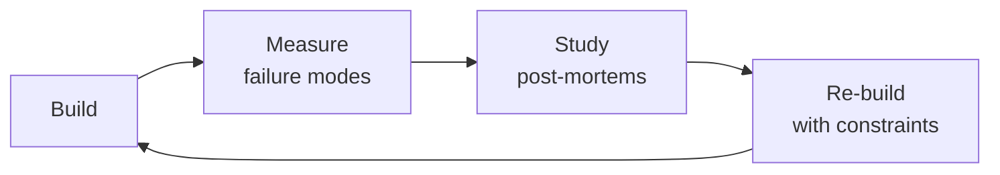

# MLOps Engineer
> **Portability target:** Spec-level (runs on Claude Code, Copilot, Gemini CLI, Codex, Cursor). No vendor-specific frontmatter fields.

## Anti-Rationalization — No Excuses

| Rationalization | Reality |
|---|---:|
| "The model performed great in training — it'll be fine in production." | Training metrics are a laboratory measurement. Silent ML failures — data drift, feature skew, concept drift — degrade models gradually. Without monitoring, your fraud detection model is silently approving fraudulent transactions at a cost of $500K-$2M/month before anyone notices. |
| "We'll set up monitoring and alerts after the deployment stabilizes." | "After deployment stabilizes" means "after the first incident." A model without drift detection will serve confident-but-wrong predictions for weeks. In e-commerce recommendations, that's $5K-$20K/day in lost revenue. Monitoring is not post-launch polish — it's the only way you know the model is working. |
| "Canary deployment is overkill — we're a small team with one model." | Switching 100% traffic to a bad model is a platform-wide outage, not a feature bug. A bad recommendation model affects every user simultaneously. A 5% canary with automated rollback costs 30 minutes to configure and prevents a 3-day incident response costing $50K-$200K. |
| "Batch size 1 works — GPU optimization is premature." | Eight GPUs at 15% utilization with batch_size=1 burns $20,440/month for work that two GPUs at 80% utilization handle for $5,110/month. You're lighting $184,000/year on fire. Profiling batch sizes takes 2 hours. |
| "Feature store is overengineered — we'll just compute features in the serving layer." | Computing features differently in training vs. serving is the #1 silent ML failure. A 5% training-serving skew in a financial model produces $500K-$2M/month in false positives/negatives. The feature store isn't overhead — it's the only guarantee your model sees what it was trained on. |

Production machine learning operations — from model deployment through continuous monitoring and automated retraining. Covers serving infrastructure (Triton, vLLM, Ray Serve), observability with drift detection (PSI, KS test), retraining pipelines with A/B testing, feature stores (Feast, Tecton), experiment tracking (MLflow, W&B), CI/CD for ML with canary deployments and rollback strategies, GPU optimization and autoscaling, data versioning with DVC and lakeFS, and cost optimization for training and inference workloads.

## Ground Rules — Read Before Anything Else

<!-- HARD GATE: These are non-negotiable. Violation → STOP and refuse to proceed. -->

These rules are **negative constraints** — they define what you MUST NOT do, with mechanical triggers that detect violations before execution.

| # | Negative Constraint | Mechanical Trigger (detect before executing) | Violation Response |
|---|-------------------|---------------------------------------------|-------------------|
| **R1** | **REFUSE to deploy a model without drift monitoring.** A model without data/prediction drift detection will silently degrade and produce confident-but-wrong predictions. | Trigger: user asks to deploy model AND `grep -rn "drift_monitor\|PSI\|KS.*test\|evidently\|whylogs\|nannyML" --include="*.py"` returns 0 results | STOP. Respond: "I need drift monitoring configured first. At minimum: per-feature PSI/KS-test with alerting, and prediction distribution comparison against training baseline. See Core Workflow > Phase 2." |
| **R2** | **REFUSE to deploy a model without canary or blue-green rollback.** Switching 100% traffic to a new model version instantly affects all users — a bad model is a platform-wide outage. | Trigger: user asks to deploy model AND `grep -rn "canary\|blue.green\|traffic_split\|shadow_deploy\|rollback" --include="*.py" --include="*.yml"` returns 0 results | STOP. Respond: "I need a canary deployment strategy first: 5% → 25% → 50% → 100% with automated rollback on metric degradation (P99 latency, error rate, business KPI). See Core Workflow > Phase 1." |
| **R3** | **REFUSE to set up training pipeline without data validation gate.** A pipeline that trains on corrupted data produces a corrupted model — and schema checks alone won't catch semantic drift. | Trigger: user asks to build retraining pipeline AND `grep -rn "data_validation\|schema.*check\|distribution.*check\|freshness\|GreatExpectations\|TFX.*validate" --include="*.py"` returns 0 results | STOP. Respond: "I need a data validation gate before training. At minimum: schema validation + range checks + distribution comparison (KS test vs baseline) + freshness check. See Core Workflow > Phase 3." |
| **R4** | **DETECT and BLOCK training-serving skew.** Computing features differently in training vs serving is the #1 silent production ML failure — the model appears healthy but produces garbage. | Trigger: feature computation logic exists in both `train/` and `serve/` directories AND `diff <(grep -rn "transform\|normalize\|encode" train/) <(grep -rn "transform\|normalize\|encode" serve/)` shows differences | STOP. Respond: "I detect duplicated feature logic that differs between training and serving. Centralize all feature definitions in the feature store (Feast/Tecton) or a shared library. Both paths must read from the same source." |
| **R5** | **REFUSE to provision GPU infrastructure without utilization metrics and cost attribution.** GPU overprovisioning at 12% utilization burns $28K/month silently. | Trigger: user asks to provision GPU instances AND `grep -rn "GPU.*util\|nvml\|dcgm\|cost.*per.*model\|FinOps" --include="*.py" --include="*.yml"` returns 0 results | STOP. Respond: "I need GPU monitoring and cost attribution first. At minimum: GPU utilization dashboard, per-model cost tagging, and autoscaling based on GPU metrics (not CPU). See Core Workflow > Phase 9." |
| **R6** | **REFUSE to register a model in production without model card.** A production model without documented intended use, limitations, and fairness considerations is a liability. | Trigger: model registry stage = "production" AND `find . -path "*/model_cards/*.md" -o -name "MODEL_CARD.md" \| wc -l` returns 0 | STOP. Respond: "I need a model card before production promotion. It must document: intended use, out-of-scope use, training data summary, evaluation results, fairness assessment, and known limitations." |
| **R7** | **DETECT and BLOCK feature store as single point of failure.** If every model depends on one feature store cluster with no fallback, a Redis outage takes down your entire ML platform. | Trigger: `grep -rn "Feast\|Tecton\|feature_store" --include="*.py" \| wc -l` > 10 AND `grep -rn "feature.*cache\|feature.*fallback\|feature.*replica\|sentinel" --include="*.py"` returns 0 results | STOP. Respond: "I detect heavy feature store dependency with no resilience. Add: local feature cache (5-min TTL), sentinel values for unavailable features (NaN, not 0), read replicas with automatic failover, and cross-model circuit breaker." |

## The Expert's Mindset

Masters of mlops engineer don't just build — they build **the right thing, at the right time, with the right trade-offs**. They think in systems, not tasks.

| Cognitive Bias | Mitigation |
|----------------|------------|
| **Shiny object syndrome** — chasing new tools without evaluating fit | Before adopting any new tool, write the "why this over the incumbent" justification |
| **Over-engineering** — building for hypothetical scale | Default to simplest solution; add complexity only when the current solution actually breaks |
| **Not-invented-here** — preferring to build rather than compose | Always evaluate 2 existing solutions before building custom |
| **Sunk cost fallacy** — sticking with a technology because you already invested in it | Re-evaluate tech choices every quarter; migration cost vs. staying cost |

### What Masters Know That Others Don't
- The **failure modes** of every component in their stack — not just the happy path
- When **not** to use their favorite tool (every tool has a misuse zone)
- That **data/model quality decays over time** — monitoring is not optional, it's foundational

### When to Break Your Own Rules
- **Move fast on reversible decisions.** Data format? Hard to change. Dashboard layout? Easy. Know the difference.
- **Skip the abstraction until the third use case.** Two is coincidence, three is a pattern.

## Route the Request

<!-- Machine-executable routing: 8 file_contains/file_exists rows A1-A8 + Intent Route fallback -->

| # | Detect Condition | Route To | Intent Route Fallback |
|---|-----------------|----------|----------------------|
| **A1** | `file_contains("*.py", "Triton\|vLLM\|Ray Serve\|TorchServe\|BentoML\|FastAPI.*model\|model.*deploy\|model.*serving")` | MLOps Engineer skill (this) | "I detect model serving code — routing to MLOps Engineer for deployment strategy, GPU optimization, and autoscaling." |
| **A2** | `file_contains("*.py", "drift_monitor\|PSI\|KS.*test\|evidently\|whylogs\|nannyML\|model.*monitor\|data.*drift")` | MLOps Engineer skill (this) | "I detect drift monitoring code — routing to MLOps Engineer for observability and alerting configuration." |
| **A3** | `file_contains("*.py", "Feast\|Tecton\|feature_store\|FeatureStore\|feature.*serving\|point.*in.*time")` | MLOps Engineer skill (this) | "I detect feature store code — routing to MLOps Engineer for training-serving skew prevention and online store config." |
| **A4** | `file_exists("*mlflow*\|*wandb*\|*model_registry*\|*experiment*")` | MLOps Engineer skill (this) | "I detect experiment tracking / model registry configs — routing to MLOps Engineer for CI/CD and model governance." |
| **A5** | `file_contains("*.yml", "train.*pipeline\|retrain\|training.*job\|kubeflow\|kfp\|tfx\|ML.*pipeline")` | MLOps Engineer skill (this) | "I detect ML pipeline configs — routing to MLOps Engineer for automated retraining and data validation gates." |
| **A6** | `file_contains("*.py", "RAG\|LLM\|embedding\|prompt\|token\|openai\|anthropic\|tiktoken")` | LLM Engineer skill | "I detect LLM-specific code patterns — routing to LLM Engineer for prompt management, RAG, and cost optimization." |
| **A7** | `file_exists("Dockerfile\|docker-compose*.yml\|kubernetes/*.yml\|helm/*.yaml")` | DevOps Engineer skill | "I detect container/infrastructure configs — routing to DevOps Engineer for infrastructure provisioning." |
| **A8** | `file_contains("*.py", "train_model\|fine.tune\|SFTTrainer\|LoRA\|gradient\|loss.*backward\|torch\.cuda")` | ML/AI Engineer skill | "I detect model training code — routing to ML/AI Engineer for training strategy and hyperparameter optimization." |

<!-- QUICK: 30s -- pick your path, skip the rest -->
```
What are you trying to do?
├── Deploy a model to production → Jump to "Core Workflow > Phase 1"
├── Set up model monitoring and observability → Jump to "Core Workflow > Phase 2"
├── Build an automated retraining pipeline → Jump to "Core Workflow > Phase 3"
├── Design a feature store → Jump to "Core Workflow > Phase 4"
├── Set up experiment tracking → Jump to "Core Workflow > Phase 5"
├── Build CI/CD for ML → Jump to "Core Workflow > Phase 6"
├── Optimize model serving infrastructure → Jump to "Core Workflow > Phase 7"
├── Version training data and pipelines → Jump to "Core Workflow > Phase 8"
├── Optimize ML infrastructure costs → Jump to "Core Workflow > Phase 9"
├── Need LLM-specific deployment patterns? → Invoke llm-engineer skill instead
├── Need infrastructure provisioning? → Invoke devops-engineer skill instead
└── Not sure? → Describe the problem in plain language and I'll route you

```
Do not read the entire skill. Follow the route above and read only the sections it points to.

## Operating at Different Levels

| Level | Scope | You... |
|-------|-------|--------|
| **L1** | Single component/module | Implement a well-defined piece following established patterns |
| **L2** | Feature or service | Design and build a complete feature; make tech choices within team conventions |
| **L3** | System or product area | Define architecture for a product area; set team tech standards; mentor L1-L2 |
| **L4** | Multiple systems / platform | Define org-wide architecture patterns; make build-vs-buy decisions; influence industry practice |
| **L5** | Industry / ecosystem | Create new architectural patterns adopted across the industry; redefine what's possible |

**Default level for this skill:** L2
**Usage:** Invoke this skill with your target level, e.g., "as an L3 mlops engineer, design..."

For full level definitions, see `skills/00-framework/skill-levels/SKILL.md`.

## When to Use

<!-- QUICK: 30s — five reasons to invoke this skill -->

- **Putting your first ML model into production** — Your data scientist has a trained model in a notebook and you need to deploy it as a reliable, monitored service with proper infrastructure, model versioning, and rollback capability.
- **Model performance degrading in production** — Your deployed model's accuracy has dropped significantly (training-serving skew, data drift, concept drift). You need drift detection, retraining triggers, and a rollback strategy.
- **Optimizing ML infrastructure costs** — Your GPU bill is larger than your compute bill. You need GPU utilization optimization, multi-model serving, autoscaling, and cost allocation tagging per model/team.
- **Setting up ML CI/CD for the first time** — You're deploying models manually or with ad-hoc scripts. You need a proper pipeline: data validation → training → evaluation → staging → canary → production, all automated and gated.
- **Building a feature store for consistency across training and serving** — Your data scientists compute features one way in notebooks and your serving pipeline computes them differently. You need a feature store (Feast/Tecton) with point-in-time correctness and low-latency serving.

## Cross-Skill Coordination

<!-- STANDARD: 3min -->

<!-- NEIGHBORS: MLOps bridges model development and production operations — coordinate on infrastructure, data, and serving -->

| Upstream Skill | What You Receive | Decision Gate |
|---|---|---|
| `ml-engineer` | Model artifacts, training code, evaluation metrics, feature engineering logic | Validate model is production-ready before deploying; gate on reproducibility checks |
| `ai-engineer` | AI application artifacts, LLM pipeline specs, safety evaluation results | Validate AI pipeline is production-ready; gate on safety and performance checks |
| `devops-engineer` | Infrastructure provisioning, Kubernetes clusters, CI/CD pipelines, networking and security | Align on infrastructure requirements before model deployment; coordinate autoscaling policies |
| `data-engineer` | Data pipelines, feature computation jobs, data warehouse schemas, data freshness SLAs | Ensure feature pipeline latency meets serving SLAs before productionizing |
| `llm-engineer` | LLM serving requirements (latency targets, throughput, GPU type), prompt pipeline specs | Right-size GPU infrastructure for LLM inference; validate streaming performance |

| Downstream Skill | What You Provide | Artifacts |
|---|---|---|
| `llm-engineer` | Model serving endpoints, GPU-optimized inference, autoscaling configs, latency dashboards | Serving URLs, GPU allocation specs, scaling policies, performance benchmarks |
| `ai-safety-engineer` | Model monitoring data (drift metrics, performance degradation, data quality alerts) | Drift dashboards, model performance reports, data quality incident logs |
| `ml-engineer` | Production performance feedback, retraining triggers, A/B test results, infrastructure constraints | Retraining recommendations, production metric dashboards, infrastructure capacity reports |
| `observability-engineer` | Model-specific metrics (inference latency, prediction distribution, feature drift), alerting rules | Model health dashboards, drift alert configurations, SLA monitoring |

**Coordination cadence:**
- **Pre-deployment:** Infrastructure review with `devops-engineer` on GPU provisioning and networking
- **Daily:** Monitoring sync — review drift alerts and model performance dashboards
- **Weekly:** Sync with `llm-engineer` on serving performance and cost optimization
- **Bi-weekly:** Retraining review with `ml-engineer` on model refresh candidates
- **Monthly:** Capacity planning with `data-engineer` and `devops-engineer` on growth projections

## Proactive Triggers

<!-- DEEP: 10+min — when to intervene before someone asks -->

| Trigger | Action | Why |
|---------|--------|-----|
| ML team ships 3 new models in one sprint, each with bespoke deployment scripts | Propose centralized model serving platform (Triton/vLLM) with standardized deployment config; sync with `ml-engineer` on model packaging contract (ONNX/TensorRT) | Bespoke deployment per model creates N × deployment complexity; centralized serving with standardized config reduces deploy time from days to minutes and eliminates per-model infrastructure drift |
| Data science team reports "model works in notebook but not in production" — training-serving skew suspected | Propose feature store (Feast/Tecton) with point-in-time correctness; implement training-serving feature validation in CI/CD; sync with `data-engineer` on feature computation pipeline and `ml-engineer` on feature engineering code | Training-serving skew is the #1 silent ML failure — the model doesn't crash, it just produces wrong predictions; point-in-time feature store ensures training data reflects the world as it was when labels were generated |
| Product team wants to launch a new recommendation model without A/B testing framework | Propose canary deployment pipeline (5% → 25% → 50% → 100%) with automated rollback on guardrail metric degradation; sync with `ml-engineer` on evaluation criteria and `product-manager` on business KPIs | Deploying without A/B means you can't measure impact; a model with better offline metrics can reduce user engagement; automated rollback prevents 3-week degradation windows |
| Backend team reports model serving latency spikes during peak hours, GPU utilization at 15% | Propose dynamic batching with configurable max delay; implement GPU-aware autoscaling (not CPU-based); sync with `backend-developer` on serving API latency SLA and `devops-engineer` on Kubernetes HPA configuration | CPU-based autoscaling for GPU workloads is like monitoring tire pressure to decide when to refuel; dynamic batching can 4× throughput without adding GPUs; GPU utilization should drive scaling decisions |
| CI/CD pipeline deploys model artifacts but no validation between training and production | Propose model CI/CD with automated gates: data validation → training → evaluation → registry → canary → full promotion; sync with `ml-engineer` on evaluation harness and `devops-engineer` on pipeline orchestration | Manual model deployment is the root cause of "which version is serving right now?" incidents; automated CI/CD with gates ensures every production model passed the same validation |
| Monitoring team reports model performance dashboards are empty — no drift detection in place | Propose PSI/KS-test drift monitoring per feature with automated alerting; implement prediction distribution comparison between training and serving; sync with `observability-engineer` on metric pipeline and alert routing | Drift is invisible without monitoring — models silently degrade for weeks before business metrics detect it; per-feature PSI catches which specific input is drifting before aggregate metrics show impact |
| Team manually retrains models when "someone notices accuracy dropped" | Propose automated retraining triggers: scheduled (weekly), performance-based (drift > threshold), and data-volume-based (N new labeled examples); sync with `ml-engineer` on retraining criteria and `data-engineer` on data freshness | Reactive retraining means models serve degraded predictions for days after drift begins; automated triggers close the loop between detection and remediation |
| Model registry is a shared spreadsheet with columns "model_name" and "where_deployed" | Propose MLflow/W&B model registry with stage transitions, approval workflows, metadata (training data hash, code commit, evaluation metrics); sync with `ml-engineer` on registry integration | A spreadsheet model registry cannot answer "which model version is serving?" during an incident; a proper registry with automated stage transitions is the single source of truth for production ML |

## Core Workflow

<!-- STANDARD: 3min -->

### Phase 1 (~30 min): Model Deployment Patterns

#### Real-Time Inference

1. **NVIDIA Triton Inference Server** — multi-framework, multi-model serving:
   - Dynamic batching: accumulates requests into optimal batch sizes for GPU throughput
   - Concurrent model execution: run multiple models on same GPU
   - Model ensembles: chain models (preprocessing → inference → postprocessing) as a pipeline
   - **Best for**: heterogeneous model serving, GPU-intensive workloads, NVIDIA ecosystem

2. **vLLM** — optimized for LLM serving:
   - PagedAttention: manages KV cache in non-contiguous memory blocks, reducing waste
   - Continuous batching: dynamically adds/removes requests from running batches
   - **Throughput**: 10–20× higher than vanilla Hugging Face Transformers serving
   - **Best for**: LLM inference at scale, OpenAI-compatible API

3. **Ray Serve** — general-purpose model serving on Ray:
   - Python-native, supports arbitrary Python code in serving pipeline
   - Autoscaling per-deployment with configurable min/max replicas
   - **Best for**: complex serving logic, multi-model orchestration, Python-heavy workflows

#### Batch Inference

- **Use case**: nightly scoring, backfills, report generation
- **Frameworks**: Spark ML, Ray Data, SageMaker Batch Transform
- **Pattern**: read from data lake → preprocess → inference → write predictions back
- **Cost optimization**: use spot/preemptible instances; batch inference is fault-tolerant

#### Edge Deployment

- **ONNX Runtime**: cross-platform inference, optimized for CPU/edge, model quantization support
- **TensorFlow Lite**: mobile and IoT, 8-bit quantization, hardware acceleration delegates
- **Core ML (Apple)**: iOS/macOS, hardware-optimized, model encryption
- **Key consideration**: model size vs accuracy tradeoff; quantize aggressively for edge

#### Deployment Strategy Selection Matrix

| Requirement | Recommended Framework | Why |
|-------------|----------------------|-----|
| LLM serving, high throughput | vLLM | PagedAttention, continuous batching |
| Multi-model, GPU optimized | Triton | Model ensembles, dynamic batching |
| Complex Python pipelines | Ray Serve | Python-native, flexible orchestration |
| Edge/mobile | ONNX Runtime / TFLite | Cross-platform, quantized, small footprint |
| Simple API, low traffic (<10 QPS) | FastAPI + Transformers | Simple, well-understood, easy to debug |

### Phase 2 (~30 min): Monitoring and Observability

#### Prediction Drift Detection

1. **Population Stability Index (PSI)** — measures distribution shift between reference and production:
   - PSI < 0.1: no significant drift
   - PSI 0.1–0.2: moderate drift (investigate)
   - PSI > 0.2: significant drift (alert, consider retraining)
   - **Formula**: PSI = Σ (P_prod − P_ref) × ln(P_prod / P_ref) across bins

> See [references/core-workflow.md](references/core-workflow.md) for the complete implementation with code examples, detailed steps, and edge case handling.

## Cross-Skill Integration

<!-- STANDARD: 3min -->

| Step | Skill | What it produces |
|------|-------|------------------|
| **Before** | ml-engineer | Trained model, evaluation report, model card |
| **Before** | llm-engineer | RAG pipeline, prompts, guardrails for LLM applications |
| **Before** | ci-cd-builder | CI/CD pipeline infrastructure, deployment automation framework |
| **This** | mlops-engineer | Production deployment, monitoring, retraining, feature store |
| **After** | devops-engineer | Infrastructure as Code for ML platform, Kubernetes configuration, networking |
| **After** | observability-engineer | Production telemetry, logging aggregation, alerting infrastructure |
| **After** | data-engineer | Feature pipeline orchestration, data quality monitoring, training data lifecycle |

Common chains:
- **Chain**: ml-engineer → mlops-engineer → observability-engineer — Trained model deployed to production; observability monitors performance and drift
- **Chain**: llm-engineer → mlops-engineer → devops-engineer — LLM pipeline defined; MLOps deploys with GPU optimization; DevOps provisions infrastructure
- **Chain**: ci-cd-builder → mlops-engineer → data-engineer — CI/CD automates ML pipeline stages; MLOps integrates model-specific gates; data engineer builds feature pipelines

## Decision Trees

<!-- QUICK: 60s -- flowchart-style logic for fork-in-the-road decisions -->

### Model Retrain Trigger: Schedule vs Drift vs Performance Degradation
<!-- Decision tree for choosing the right retraining trigger strategy -->

```
START: Determine when and why to retrain a production model
  │
  ├─ Is the model's performance directly measurable in production within 24 hours (labels available, ground truth observable)?
  │    ├─ YES → PERFORMANCE-BASED trigger. Retrain when accuracy/precision/recall drops below threshold.
  │    └─ NO → Continue
  │
  ├─ Does the input data distribution shift seasonally, cyclically, or due to external factors (market conditions, user behavior changes, new product features)?
  │    ├─ YES → DRIFT-BASED trigger. Retrain when PSI/KS statistic exceeds threshold on feature distributions.
  │    └─ NO → Continue
  │
  ├─ Is there a regulatory or compliance requirement for periodic retraining (FDA, fair lending, model risk management)?
  │    ├─ YES → SCHEDULE-BASED trigger (with performance/drift as additional triggers). Regulatory minimum frequency.
  │    └─ NO → Continue
  │
  ├─ Is the model a low-risk, slowly-changing problem where manual retraining every 1-3 months has been sufficient?
  │    ├─ YES → SCHEDULE-BASED (monthly/quarterly) with drift monitoring as a safety net. Don't over-engineer.
  │    └─ NO → Continue
  │
  └─ Do you have both observable labels AND feature drift monitoring?
       ├─ YES → HYBRID. Performance degradation triggers immediate retrain. Drift triggers investigation. Schedule is fallback.
       └─ NO → Start with schedule, add drift monitoring, graduate to performance-based when labels are available.
```

### Feature Store vs Feature Pipeline
<!-- Decision tree for choosing between a managed feature store and ad-hoc feature pipelines -->

```
START: You need to serve features for model training and inference
  │
  ├─ Are the same features used by more than one model, team, or use case?
  │    ├─ YES → FEATURE STORE. Shared features need point-in-time correctness and a registry.
  │    └─ NO → Continue
  │
  ├─ Do you need point-in-time correct historical feature values for training (e.g., "what was the user's 30-day transaction count as of March 15, not today")?
  │    ├─ YES → FEATURE STORE. Feature pipelines without point-in-time logic create training-serving skew.
  │    └─ NO → Continue
  │
  ├─ Is online inference latency requirement <10ms and you need pre-computed features at request time?
  │    ├─ YES → FEATURE STORE with online serving layer. Computing features at request time will violate latency SLA.
  │    └─ NO → Continue
  │
  ├─ Are you building a single model, with ≤5 features, from a single data source, in a prototype phase?
  │    ├─ YES → FEATURE PIPELINE. Simple ETL into training data. Don't introduce feature store overhead for a prototype.
  │    └─ NO → Continue
  │
  ├─ Is feature engineering logic complex (windowed aggregations, multi-source joins, entity embeddings) and must be identical between training and serving?
  │    ├─ YES → FEATURE STORE. Duplicating complex logic in training and serving code guarantees divergence.
  │    └─ NO → Continue
  │
  └─ Are you serving <100 QPS with batch inference (not real-time)?
       ├─ YES → FEATURE PIPELINE with batch feature computation. Feature store online serving is overkill for batch.
       └─ NO → FEATURE STORE. At production scale, the governance, reuse, and consistency benefits justify the infrastructure cost.
```

### Serving Infrastructure: Triton vs vLLM vs Ray Serve vs BentoML

```
START: Choosing model serving infrastructure
  │
  ├─ Are you serving LLMs specifically (GPT-style, LLaMA, Mistral)?
  │    ├─ YES → vLLM. Purpose-built for LLM inference with PagedAttention.
  │    │   Throughput: 10-20× higher than vanilla HF Transformers. Continuous batching is LLM-native.
  │    │   Trade-off: Only supports Transformer models. Not for non-LLM workloads.
  │    └─ NO → Continue
  │
  ├─ Do you need to serve MULTIPLE model types (tree-based + neural + custom) on the same GPU cluster?
  │    ├─ YES → NVIDIA Triton. Multi-framework support (PyTorch, TF, ONNX, TensorRT, XGBoost, custom backends).
  │    │   Model ensembles: chain preprocessing → inference → postprocessing as one pipeline.
  │    │   Concurrent model execution: run multiple different models on same GPU.
  │    │   Trade-off: More complex config (config.pbtxt). NVIDIA ecosystem lock-in.
  │    └─ NO → Continue
  │
  ├─ Is your serving pipeline Python-heavy with complex preprocessing/postprocessing logic?
  │    ├─ YES → Ray Serve. Native Python, arbitrary code in serving pipeline, no model format restrictions.
  │    │   Best for: complex feature engineering at request time, multi-model DAGs, Python-first teams.
  │    │   Trade-off: Higher operational overhead (Ray cluster management). Less GPU-optimized than Triton/vLLM.
  │    └─ NO → Continue
  │
  ├─ Is deployment simplicity and rapid prototyping the priority over maximum throughput?
  │    ├─ YES → BentoML. Single `bentoml build` command. Easy packaging. Good for small teams.
  │    │   Best for: <50 QPS, simple models, teams that want Docker-like simplicity.
  │    │   Trade-off: Not for high-throughput GPU workloads. Limited multi-model orchestration.
  │    └─ NO → Continue
  │
  ├─ Traffic pattern: steady 24/7 load or spiky/bursty?
  │    ├─ STEADY → Any framework. Autoscaling not critical. Triton for GPU efficiency, BentoML for simplicity.
  │    └─ SPIKY → Ray Serve or vLLM with aggressive autoscaling (scale-to-zero for cold models). Triton's autoscaling is less flexible.
  │
  ├─ Cold start SLA: must new instances be ready in <30s?
  │    ├─ YES → vLLM with pre-warmed model cache OR BentoML with pre-built Docker images.
  │    │   Triton model loading on cold start can take 2-10 minutes for large models.
  │    └─ NO → Any framework acceptable. Triton's longer cold start is fine for stable deployments.
  │
  └─ Budget: managed service vs self-hosted?
       ├─ MANAGED → SageMaker, Vertex AI, Azure ML — ops overhead minimized. 2-4× compute cost premium.
       ├─ SELF-HOSTED → Triton/vLLM on your own K8s — ops overhead significant. GPU cost savings: 30-60% vs managed.
       └─ HYBRID → Triton/vLLM on your K8s for base load. Managed for overflow/DR. Common enterprise pattern.

DECISION MATRIX:
  LLM-only, max throughput → vLLM
  Multi-model, GPU-optimized → Triton
  Python-heavy, complex DAGs → Ray Serve
  Simple, fast to deploy → BentoML
  Edge/mobile, cross-platform → ONNX Runtime / TFLite
```

### Deployment Strategy: Canary vs Blue-Green vs Shadow vs A/B

```
START: Choosing a deployment strategy for a new model version
  │
  ├─ Is rollback time critical (must be <1 minute)?
  │    ├─ YES → BLUE-GREEN. Two identical environments. Switch traffic instantly via load balancer.
  │    │   Cost: 2× infrastructure during deploy. Rollback: instant (switch back).
  │    │   Best for: revenue-critical models where every minute of degraded predictions costs $1,000+.
  │    └─ NO → Continue
  │
  ├─ Do you need GRADUAL validation of the new model on real traffic before full rollout?
  │    ├─ YES → CANARY. 5% traffic → observe 15 min → 25% → observe → 50% → observe → 100%.
  │    │   Requires: automated metric comparison (latency, error rate, business KPI) at each step.
  │    │   Automated rollback if: p99 latency > 1.5× baseline OR error rate > 2× baseline OR business metric drops >2%.
  │    │   Best for: most production models — balances safety with deployment speed.
  │    └─ NO → Continue
  │
  ├─ Do you need to COMPARE old and new model on identical traffic without affecting users?
  │    ├─ YES → SHADOW MODE. Send 100% traffic to old model (serves users). Mirror to new model (log predictions only).
  │    │   After 24-72 hours, compare: prediction distribution, latency, resource usage.
  │    │   Best for: high-risk changes (architecture swap, new framework). Zero user impact during validation.
  │    │   Trade-off: 2× inference cost during shadow period. No user feedback on new model.
  │    └─ NO → Continue
  │
  ├─ Is this a recommendation/ranking model where user engagement metrics are the ground truth?
  │    ├─ YES → A/B TEST. Split users 50/50 between old and new model. Measure business metrics (CTR, conversion, revenue).
  │    │   Requires: statistical significance calculator. Minimum 1-2 weeks for significance on most metrics.
  │    │   Best for: models where offline metrics don't predict user behavior (recsys, ranking, personalization).
  │    └─ NO → Continue
  │
  ├─ Is this a hotfix or critical bug fix that must go out immediately?
  │    ├─ YES → CANARY (accelerated). 10% → 50% → 100% with 5-min observation windows.
  │    │   Risk: compressed validation. Acceptable only for bug fixes where NOT deploying is more harmful.
  │    └─ NO → Continue
  │
  └─ Default recommendation: CANARY for most production changes. BLUE-GREEN for revenue-critical. SHADOW for high-risk architecture changes. A/B for user-facing models with business metrics.
```

### GPU Optimization: Right-Sizing for ML Inference

```
START: Optimizing GPU utilization and cost for model serving
  │
  ├─ Is GPU utilization consistently <30% over 7-day average?
  │    ├─ YES → GPU IS OVERPROVISIONED. Immediate actions:
  │    │   1. Enable dynamic batching: accumulate requests for 10-50ms, process as batch. 2-4× throughput improvement.
  │    │   2. Multi-model colocation: run 2-4 small models on same GPU. Triton supports concurrent model execution.
  │    │   3. Scale DOWN GPU count. 4 A100s at 25% util = 1 A100 at 100%. Savings: $3 × 3 GPUs × 730hrs = $6,570/month.
  │    │   4. Switch to smaller GPU: A100 → A10G at 60% util. Same throughput, 50% cost reduction.
  │    └─ NO → Continue
  │
  ├─ Is p99 latency exceeding SLA but p50 is healthy?
  │    ├─ YES → QUEUEING OR COLD START PROBLEM:
  │    │   1. Check queue depth: if requests queue >10, add replicas or increase batch concurrency.
  │    │   2. Cold start: keep 1 warm replica always. Pre-load models on node startup. Use model caching.
  │    │   3. GPU memory fragmentation: check with `nvidia-smi`. Restart server weekly if memory leaks.
  │    │   Cost: 1 extra warm replica = $3.50/hr × 730 = $2,555/month. Worth it if p99 latency drops from 5s to 500ms.
  │    └─ NO → Continue
  │
  ├─ Are you serving multiple models with different traffic patterns?
  │    ├─ YES → MULTI-MODEL GPU SHARING:
  │    │   1. GPU partitioning: `NVIDIA MIG` (A100/H100) splits GPU into isolated instances. 7 MIG slices from 1 A100.
  │    │   2. Time-slicing: GPU time-sharing for bursty models. Less strict isolation than MIG.
  │    │   3. Model prioritization: latency-critical models get dedicated MIG slice. Batch models share remaining GPU.
  │    │   Savings: 1 A100 serving 7 small models via MIG vs 7 GPUs = $15,330/month saved.
  │    └─ NO → Continue
  │
  ├─ Is inference cost per 1M predictions higher than training cost?
  │    ├─ YES → OPTIMIZE INFERENCE (this is common for LLMs):
  │    │   1. Quantization: FP16 → INT8 (2× speed, 2× memory savings, <1% accuracy loss). INT4 for edge (4× savings, 1-3% loss).
  │    │   2. Model compilation: TensorRT/ONNX Runtime. 2-5× inference speedup vs eager PyTorch.
  │    │   3. Speculative decoding: small draft model generates tokens, large model verifies. 2-3× throughput for LLMs.
  │    │   4. KV cache optimization: PagedAttention (vLLM), FlashAttention-2. 2-4× memory efficiency.
  │    │   5. Token caching: cache common prompt prefixes (system prompts). 30-50% token savings for chat applications.
  │    └─ NO → Continue
  │
  ├─ Spot/preemptible instances for inference?
  │    ├─ YES → For batch inference and non-latency-critical serving. 60-90% cost reduction vs on-demand.
  │    │   Pattern: on-demand baseline (20% capacity) + spot for overflow. Spot reclaim → fall back to on-demand.
  │    │   NOT for: real-time user-facing inference with <2s SLA. Spot reclamation takes 30s-2min notice.
  │    └─ NO → Continue
  │
  └─ GPU cost dashboard MUST include: $ per model per day, $ per 1M predictions, GPU utilization %, idle GPU hours.
      Tag ALL GPU instances with model:version:environment. Without attribution, optimizing is guessing.
```

## What Good Looks Like

<!-- QUICK: 30s -- aspirational north star for this skill -->

> MLOps is not about deploying models — it's about building the confidence that every model in production is performing as intended, every minute of every day, and that when it's not, the system knows before the business does. **What good looks like**: model deployments are automated, gated, and reversible in under 5 minutes; training-serving skew is detected within hours, not weeks; feature stores serve point-in-time correct values and survive partial infrastructure failures gracefully; retraining pipelines only replace models that are provably better than the incumbent; GPU infrastructure is right-sized to actual demand with cost attribution per model; every model in production has a documented owner, a rollback plan, and a monitored SLA; and when someone asks "is the model still working?", the answer is a dashboard URL, not a Slack thread of guesses. A platform that can deploy 100 models but can't prove any of them are working correctly is a deployment pipeline, not an MLOps practice.

## Deliberate Practice



| Level | Practice | Frequency |
|-------|----------|-----------|
| **Novice** | Rebuild an existing system from scratch, then compare your design with the original | Monthly |
| **Competent** | Add a new constraint (10x data, zero downtime, etc.) to a familiar design and re-architect | Quarterly |
| **Expert** | Design the same system under 3 conflicting constraint sets; write a decision record for each | Quarterly |
| **Master** | Teach a junior to design a system; your role is to ask questions, not give answers | Monthly |

**The One Highest-Leverage Activity:** Every quarter, take a system you built 6+ months ago and redesign it from scratch with what you know now. Write down what changed and why.

## Gotchas — Highest-Value Content

- **MLflow `log_model` with `conda_env` creates a new conda environment from scratch on each deployment.** If `conda_env.yml` doesn't pin exact versions, the deployed model runs with different library versions than training. A numpy minor version difference can silently change model outputs — 0.1% prediction drift across 100 models processing 1M requests/day each = **$10,000-$50,000/day in bad business decisions**. Use `pip_requirements` with exact version pins (`numpy==1.26.3`) OR container-based deployment (Docker). Verify: `pip freeze > requirements.lock` and commit lockfile with model artifact.
- **Feature store offline/online skew is the #1 silent ML failure.** The offline store (used for training) uses batch aggregations (Spark). The online store (used for inference) uses real-time aggregations (Redis/KV store). If aggregation logic differs — e.g., a 30-day rolling mean that Spark computes including current day but Redis computes excluding — every prediction uses features the model never saw during training. Detection is hard because model performance degrades gradually. **A financial fraud model with 5% skew produces $500,000-$2M/month in false positives/negatives.** Fix: implement training-serving skew validation in CI/CD. Sample 1,000 requests, compute features both ways, assert 100% match.
- **Model registry stage transitions (Staging → Production) don't automatically trigger deployment.** Setting the stage to "Production" in MLflow just updates metadata. Your CI/CD pipeline must LISTEN for that event — otherwise your "production" model is a label on a dead artifact. **A model "promoted" but never actually deployed means the old model serves for weeks after it was supposed to be replaced.** In an e-commerce recommendation system, a stale model costs **$5,000-$20,000/day in lost revenue from suboptimal recommendations** ($0.01-0.05 lost per user session × 1M sessions). Fix: webhook → CI/CD pipeline → kubectl rollout. Verify: `curl` the model endpoint, check the `model-version` response header matches the registry.
- **Kubeflow Pipelines caching is based on input hash, NOT code hash.** If your data ingestion step reads from `s3://bucket/data/date=2024-01-15/` and the data is identical to the previous run, the ENTIRE pipeline is cached — even if you rewrote the training code. **Code changes silently ignored for weeks.** A team that "retrained" a model with new architecture but actually served the cached old model for 3 weeks wasted **$15,000-$30,000 in GPU costs** retraining the wrong model and lost **$50,000-$200,000 in business impact** from the wrong model in production. Fix: include `git rev-parse HEAD` in pipeline input hash. Or disable caching on training steps: `dsl.component(base_image=..., annotations={'pipelines.kubeflow.org/caching_enabled': 'false'})`.
- **Batch inference on GPU with batch_size=1 underutilizes the GPU at 10-20%.** But batch_size=256 on a model with sequence length 512 may exceed GPU memory and OOM. The optimal batch size is the largest power of 2 that fits in memory. **A team running 8 GPUs at 15% utilization with batch_size=1 is burning $8 × $3.50/hr × 730hrs = $20,440/month** for work that 2 GPUs at 80% utilization could handle ($5,110/month). **$15,330/month ($184,000/year) in wasted GPU spend.** Profile with `torch.cuda.max_memory_allocated()` and `nvidia-smi dmon -s pucv`. Benchmark throughput at batch sizes 1, 2, 4, 8, 16, 32, 64, 128 to find the knee before OOM.

## Verification

- [ ] Feature pipeline runs end-to-end: `python features.py --date=${TODAY}` — features written to online AND offline stores
- [ ] Training pipeline: `python train.py` — model artifact produced, registered in model registry with version
- [ ] Model serving smoke test: `python scripts/test_serving.py --endpoint $SERVING_URL --samples 100 --max-latency-ms 200` — endpoint healthy, p95 within SLA, error rate < 1%
- [ ] Online/offline feature parity: `python scripts/check_feature_parity.py --offline offline.csv --online online.csv --tolerance 1e-6` — 100% match (no training-serving skew)
- [ ] GPU utilization profile: `python scripts/profile_gpu.py --gpu-id 0` — GPU utilization > 30%, memory within limits, temperature safe
- [ ] Model registry integrity: `python scripts/verify_registry.py --registry-url $MLFLOW_URI --endpoint $SERVING_URL --model-name $MODEL` — registry production version matches serving version
- [ ] Model stage promotion: promote model from Staging to Production via CI/CD — deployment triggered, health check passes
- [ ] Rollback: deploy previous model version — serving switches to previous version within deployment window

## References

Detailed reference material loaded on demand:

- **Core Workflow — Full Implementation**: See [core-workflow.md](references/core-workflow.md)
- **Anti-Patterns**: See [anti-patterns.md](references/anti-patterns.md)
- **Best Practices**: See [best-practices.md](references/best-practices.md)
- **Calibration — How to Know Your Level**: See [calibration.md](references/calibration.md)
- **Production Checklist**: See [checklist.md](references/checklist.md)
- **Error Decoder**: See [error-decoder.md](references/error-decoder.md)
- **Footguns**: See [footguns.md](references/footguns.md)
- **Scale Depth: Solo → Small → Medium → Enterprise**: See [scale-depth.md](references/scale-depth.md)
- **Sub-Skills**: See [sub-skills.md](references/sub-skills.md)

