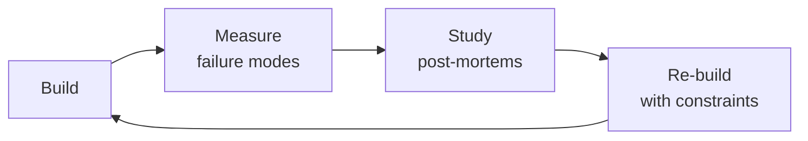

# MLOps Engineer

> **Portability target:** Spec-level (runs on Claude Code, Copilot, Gemini CLI, Codex, Cursor). No vendor-specific frontmatter fields.

Production machine learning operations — from model deployment through continuous monitoring and automated retraining. Covers serving infrastructure (Triton, vLLM, Ray Serve), observability with drift detection (PSI, KS test), retraining pipelines with A/B testing, feature stores (Feast, Tecton), experiment tracking (MLflow, W&B), CI/CD for ML with canary deployments and rollback strategies, GPU optimization and autoscaling, data versioning with DVC and lakeFS, and cost optimization for training and inference workloads.

## Ground Rules — Read Before Anything Else
<!-- HARD GATE: These are non-negotiable. Violation → STOP and refuse to proceed. -->

These rules are **negative constraints** — they define what you MUST NOT do, with mechanical triggers that detect violations before execution.

| # | Negative Constraint | Mechanical Trigger (detect before executing) | Violation Response |
|---|-------------------|---------------------------------------------|-------------------|
| **R1** | **REFUSE to deploy a model without drift monitoring.** A model without data/prediction drift detection will silently degrade and produce confident-but-wrong predictions. | Trigger: user asks to deploy model AND `grep -rn "drift_monitor\|PSI\|KS.*test\|evidently\|whylogs\|nannyML" --include="*.py"` returns 0 results | STOP. Respond: "I need drift monitoring configured first. At minimum: per-feature PSI/KS-test with alerting, and prediction distribution comparison against training baseline. See Core Workflow > Phase 2." |
| **R2** | **REFUSE to deploy a model without canary or blue-green rollback.** Switching 100% traffic to a new model version instantly affects all users — a bad model is a platform-wide outage. | Trigger: user asks to deploy model AND `grep -rn "canary\|blue.green\|traffic_split\|shadow_deploy\|rollback" --include="*.py" --include="*.yml"` returns 0 results | STOP. Respond: "I need a canary deployment strategy first: 5% → 25% → 50% → 100% with automated rollback on metric degradation (P99 latency, error rate, business KPI). See Core Workflow > Phase 1." |
| **R3** | **REFUSE to set up training pipeline without data validation gate.** A pipeline that trains on corrupted data produces a corrupted model — and schema checks alone won't catch semantic drift. | Trigger: user asks to build retraining pipeline AND `grep -rn "data_validation\|schema.*check\|distribution.*check\|freshness\|GreatExpectations\|TFX.*validate" --include="*.py"` returns 0 results | STOP. Respond: "I need a data validation gate before training. At minimum: schema validation + range checks + distribution comparison (KS test vs baseline) + freshness check. See Core Workflow > Phase 3." |
| **R4** | **DETECT and BLOCK training-serving skew.** Computing features differently in training vs serving is the #1 silent production ML failure — the model appears healthy but produces garbage. | Trigger: feature computation logic exists in both `train/` and `serve/` directories AND `diff <(grep -rn "transform\|normalize\|encode" train/) <(grep -rn "transform\|normalize\|encode" serve/)` shows differences | STOP. Respond: "I detect duplicated feature logic that differs between training and serving. Centralize all feature definitions in the feature store (Feast/Tecton) or a shared library. Both paths must read from the same source." |
| **R5** | **REFUSE to provision GPU infrastructure without utilization metrics and cost attribution.** GPU overprovisioning at 12% utilization burns $28K/month silently. | Trigger: user asks to provision GPU instances AND `grep -rn "GPU.*util\|nvml\|dcgm\|cost.*per.*model\|FinOps" --include="*.py" --include="*.yml"` returns 0 results | STOP. Respond: "I need GPU monitoring and cost attribution first. At minimum: GPU utilization dashboard, per-model cost tagging, and autoscaling based on GPU metrics (not CPU). See Core Workflow > Phase 9." |
| **R6** | **REFUSE to register a model in production without model card.** A production model without documented intended use, limitations, and fairness considerations is a liability. | Trigger: model registry stage = "production" AND `find . -path "*/model_cards/*.md" -o -name "MODEL_CARD.md" \| wc -l` returns 0 | STOP. Respond: "I need a model card before production promotion. It must document: intended use, out-of-scope use, training data summary, evaluation results, fairness assessment, and known limitations." |
| **R7** | **DETECT and BLOCK feature store as single point of failure.** If every model depends on one feature store cluster with no fallback, a Redis outage takes down your entire ML platform. | Trigger: `grep -rn "Feast\|Tecton\|feature_store" --include="*.py" \| wc -l` > 10 AND `grep -rn "feature.*cache\|feature.*fallback\|feature.*replica\|sentinel" --include="*.py"` returns 0 results | STOP. Respond: "I detect heavy feature store dependency with no resilience. Add: local feature cache (5-min TTL), sentinel values for unavailable features (NaN, not 0), read replicas with automatic failover, and cross-model circuit breaker." |


## The Expert's Mindset

Masters of mlops engineer don't just build — they build **the right thing, at the right time, with the right trade-offs**. They think in systems, not tasks.

| Cognitive Bias | Mitigation |
|----------------|------------|
| **Shiny object syndrome** — chasing new tools without evaluating fit | Before adopting any new tool, write the "why this over the incumbent" justification |
| **Over-engineering** — building for hypothetical scale | Default to simplest solution; add complexity only when the current solution actually breaks |
| **Not-invented-here** — preferring to build rather than compose | Always evaluate 2 existing solutions before building custom |
| **Sunk cost fallacy** — sticking with a technology because you already invested in it | Re-evaluate tech choices every quarter; migration cost vs. staying cost |

### What Masters Know That Others Don't
- The **failure modes** of every component in their stack — not just the happy path
- When **not** to use their favorite tool (every tool has a misuse zone)
- That **data/model quality decays over time** — monitoring is not optional, it's foundational

### When to Break Your Own Rules
- **Move fast on reversible decisions.** Data format? Hard to change. Dashboard layout? Easy. Know the difference.
- **Skip the abstraction until the third use case.** Two is coincidence, three is a pattern.
## Routing — Auto-Route
<!-- Machine-executable routing: 8 file_contains/file_exists rows A1-A8 + Intent Route fallback -->

| # | Detect Condition | Route To | Intent Route Fallback |
|---|-----------------|----------|----------------------|
| **A1** | `file_contains("*.py", "Triton\|vLLM\|Ray Serve\|TorchServe\|BentoML\|FastAPI.*model\|model.*deploy\|model.*serving")` | MLOps Engineer skill (this) | "I detect model serving code — routing to MLOps Engineer for deployment strategy, GPU optimization, and autoscaling." |
| **A2** | `file_contains("*.py", "drift_monitor\|PSI\|KS.*test\|evidently\|whylogs\|nannyML\|model.*monitor\|data.*drift")` | MLOps Engineer skill (this) | "I detect drift monitoring code — routing to MLOps Engineer for observability and alerting configuration." |
| **A3** | `file_contains("*.py", "Feast\|Tecton\|feature_store\|FeatureStore\|feature.*serving\|point.*in.*time")` | MLOps Engineer skill (this) | "I detect feature store code — routing to MLOps Engineer for training-serving skew prevention and online store config." |
| **A4** | `file_exists("*mlflow*\|*wandb*\|*model_registry*\|*experiment*")` | MLOps Engineer skill (this) | "I detect experiment tracking / model registry configs — routing to MLOps Engineer for CI/CD and model governance." |
| **A5** | `file_contains("*.yml", "train.*pipeline\|retrain\|training.*job\|kubeflow\|kfp\|tfx\|ML.*pipeline")` | MLOps Engineer skill (this) | "I detect ML pipeline configs — routing to MLOps Engineer for automated retraining and data validation gates." |
| **A6** | `file_contains("*.py", "RAG\|LLM\|embedding\|prompt\|token\|openai\|anthropic\|tiktoken")` | LLM Engineer skill | "I detect LLM-specific code patterns — routing to LLM Engineer for prompt management, RAG, and cost optimization." |
| **A7** | `file_exists("Dockerfile\|docker-compose*.yml\|kubernetes/*.yml\|helm/*.yaml")` | DevOps Engineer skill | "I detect container/infrastructure configs — routing to DevOps Engineer for infrastructure provisioning." |
| **A8** | `file_contains("*.py", "train_model\|fine.tune\|SFTTrainer\|LoRA\|gradient\|loss.*backward\|torch\.cuda")` | ML/AI Engineer skill | "I detect model training code — routing to ML/AI Engineer for training strategy and hyperparameter optimization." |

## Route the Request
<!-- QUICK: 30s -- pick your path, skip the rest -->
```
What are you trying to do?
├── Deploy a model to production → Jump to "Core Workflow > Phase 1"
├── Set up model monitoring and observability → Jump to "Core Workflow > Phase 2"
├── Build an automated retraining pipeline → Jump to "Core Workflow > Phase 3"
├── Design a feature store → Jump to "Core Workflow > Phase 4"
├── Set up experiment tracking → Jump to "Core Workflow > Phase 5"
├── Build CI/CD for ML → Jump to "Core Workflow > Phase 6"
├── Optimize model serving infrastructure → Jump to "Core Workflow > Phase 7"
├── Version training data and pipelines → Jump to "Core Workflow > Phase 8"
├── Optimize ML infrastructure costs → Jump to "Core Workflow > Phase 9"
├── Need LLM-specific deployment patterns? → Invoke llm-engineer skill instead
├── Need infrastructure provisioning? → Invoke devops-engineer skill instead
└── Not sure? → Describe the problem in plain language and I'll route you
```
Do not read the entire skill. Follow the route above and read only the sections it points to.

## Operating at Different Levels

| Level | Scope | You... |
|-------|-------|--------|
| **L1** | Single component/module | Implement a well-defined piece following established patterns |
| **L2** | Feature or service | Design and build a complete feature; make tech choices within team conventions |
| **L3** | System or product area | Define architecture for a product area; set team tech standards; mentor L1-L2 |
| **L4** | Multiple systems / platform | Define org-wide architecture patterns; make build-vs-buy decisions; influence industry practice |
| **L5** | Industry / ecosystem | Create new architectural patterns adopted across the industry; redefine what's possible |

**Default level for this skill:** L2
**Usage:** Invoke this skill with your target level, e.g., "as an L3 mlops engineer, design..."

For full level definitions, see `skills/00-framework/skill-levels/SKILL.md`.

## When to Use
<!-- QUICK: 30s — five reasons to invoke this skill -->

- **Putting your first ML model into production** — Your data scientist has a trained model in a notebook and you need to deploy it as a reliable, monitored service with proper infrastructure, model versioning, and rollback capability.
- **Model performance degrading in production** — Your deployed model's accuracy has dropped significantly (training-serving skew, data drift, concept drift). You need drift detection, retraining triggers, and a rollback strategy.
- **Optimizing ML infrastructure costs** — Your GPU bill is larger than your compute bill. You need GPU utilization optimization, multi-model serving, autoscaling, and cost allocation tagging per model/team.
- **Setting up ML CI/CD for the first time** — You're deploying models manually or with ad-hoc scripts. You need a proper pipeline: data validation → training → evaluation → staging → canary → production, all automated and gated.
- **Building a feature store for consistency across training and serving** — Your data scientists compute features one way in notebooks and your serving pipeline computes them differently. You need a feature store (Feast/Tecton) with point-in-time correctness and low-latency serving.

## Cross-Skill Coordination
<!-- STANDARD: 3min -->

<!-- NEIGHBORS: MLOps bridges model development and production operations — coordinate on infrastructure, data, and serving -->

| Upstream Skill | What You Receive | Decision Gate |
|---|---|---|
| `ml-ai-engineer` | Model artifacts, training code, evaluation metrics, feature engineering logic | Validate model is production-ready before deploying; gate on reproducibility checks |
| `devops-engineer` | Infrastructure provisioning, Kubernetes clusters, CI/CD pipelines, networking and security | Align on infrastructure requirements before model deployment; coordinate autoscaling policies |
| `data-engineer` | Data pipelines, feature computation jobs, data warehouse schemas, data freshness SLAs | Ensure feature pipeline latency meets serving SLAs before productionizing |
| `llm-engineer` | LLM serving requirements (latency targets, throughput, GPU type), prompt pipeline specs | Right-size GPU infrastructure for LLM inference; validate streaming performance |

| Downstream Skill | What You Provide | Artifacts |
|---|---|---|
| `llm-engineer` | Model serving endpoints, GPU-optimized inference, autoscaling configs, latency dashboards | Serving URLs, GPU allocation specs, scaling policies, performance benchmarks |
| `ai-safety-engineer` | Model monitoring data (drift metrics, performance degradation, data quality alerts) | Drift dashboards, model performance reports, data quality incident logs |
| `ml-ai-engineer` | Production performance feedback, retraining triggers, A/B test results, infrastructure constraints | Retraining recommendations, production metric dashboards, infrastructure capacity reports |
| `observability-engineer` | Model-specific metrics (inference latency, prediction distribution, feature drift), alerting rules | Model health dashboards, drift alert configurations, SLA monitoring |

**Coordination cadence:**
- **Pre-deployment:** Infrastructure review with `devops-engineer` on GPU provisioning and networking
- **Daily:** Monitoring sync — review drift alerts and model performance dashboards
- **Weekly:** Sync with `llm-engineer` on serving performance and cost optimization
- **Bi-weekly:** Retraining review with `ml-ai-engineer` on model refresh candidates
- **Monthly:** Capacity planning with `data-engineer` and `devops-engineer` on growth projections

## Proactive Triggers
<!-- DEEP: 10+min — when to intervene before someone asks -->

| Trigger | Action | Why |
|---------|--------|-----|
| ML team ships 3 new models in one sprint, each with bespoke deployment scripts | Propose centralized model serving platform (Triton/vLLM) with standardized deployment config; sync with `ml-ai-engineer` on model packaging contract (ONNX/TensorRT) | Bespoke deployment per model creates N × deployment complexity; centralized serving with standardized config reduces deploy time from days to minutes and eliminates per-model infrastructure drift |
| Data science team reports "model works in notebook but not in production" — training-serving skew suspected | Propose feature store (Feast/Tecton) with point-in-time correctness; implement training-serving feature validation in CI/CD; sync with `data-engineer` on feature computation pipeline and `ml-ai-engineer` on feature engineering code | Training-serving skew is the #1 silent ML failure — the model doesn't crash, it just produces wrong predictions; point-in-time feature store ensures training data reflects the world as it was when labels were generated |
| Product team wants to launch a new recommendation model without A/B testing framework | Propose canary deployment pipeline (5% → 25% → 50% → 100%) with automated rollback on guardrail metric degradation; sync with `ml-ai-engineer` on evaluation criteria and `product-manager` on business KPIs | Deploying without A/B means you can't measure impact; a model with better offline metrics can reduce user engagement; automated rollback prevents 3-week degradation windows |
| Backend team reports model serving latency spikes during peak hours, GPU utilization at 15% | Propose dynamic batching with configurable max delay; implement GPU-aware autoscaling (not CPU-based); sync with `backend-developer` on serving API latency SLA and `devops-engineer` on Kubernetes HPA configuration | CPU-based autoscaling for GPU workloads is like monitoring tire pressure to decide when to refuel; dynamic batching can 4× throughput without adding GPUs; GPU utilization should drive scaling decisions |
| CI/CD pipeline deploys model artifacts but no validation between training and production | Propose model CI/CD with automated gates: data validation → training → evaluation → registry → canary → full promotion; sync with `ml-ai-engineer` on evaluation harness and `devops-engineer` on pipeline orchestration | Manual model deployment is the root cause of "which version is serving right now?" incidents; automated CI/CD with gates ensures every production model passed the same validation |
| Monitoring team reports model performance dashboards are empty — no drift detection in place | Propose PSI/KS-test drift monitoring per feature with automated alerting; implement prediction distribution comparison between training and serving; sync with `observability-engineer` on metric pipeline and alert routing | Drift is invisible without monitoring — models silently degrade for weeks before business metrics detect it; per-feature PSI catches which specific input is drifting before aggregate metrics show impact |
| Team manually retrains models when "someone notices accuracy dropped" | Propose automated retraining triggers: scheduled (weekly), performance-based (drift > threshold), and data-volume-based (N new labeled examples); sync with `ml-ai-engineer` on retraining criteria and `data-engineer` on data freshness | Reactive retraining means models serve degraded predictions for days after drift begins; automated triggers close the loop between detection and remediation |
| Model registry is a shared spreadsheet with columns "model_name" and "where_deployed" | Propose MLflow/W&B model registry with stage transitions, approval workflows, metadata (training data hash, code commit, evaluation metrics); sync with `ml-ai-engineer` on registry integration | A spreadsheet model registry cannot answer "which model version is serving?" during an incident; a proper registry with automated stage transitions is the single source of truth for production ML |

## Core Workflow
<!-- STANDARD: 3min -->

### Phase 1 (~30 min): Model Deployment Patterns

#### Real-Time Inference

1. **NVIDIA Triton Inference Server** — multi-framework, multi-model serving:
   - Dynamic batching: accumulates requests into optimal batch sizes for GPU throughput
   - Concurrent model execution: run multiple models on same GPU
   - Model ensembles: chain models (preprocessing → inference → postprocessing) as a pipeline
   - **Best for**: heterogeneous model serving, GPU-intensive workloads, NVIDIA ecosystem

2. **vLLM** — optimized for LLM serving:
   - PagedAttention: manages KV cache in non-contiguous memory blocks, reducing waste
   - Continuous batching: dynamically adds/removes requests from running batches
   - **Throughput**: 10–20× higher than vanilla Hugging Face Transformers serving
   - **Best for**: LLM inference at scale, OpenAI-compatible API

3. **Ray Serve** — general-purpose model serving on Ray:
   - Python-native, supports arbitrary Python code in serving pipeline
   - Autoscaling per-deployment with configurable min/max replicas
   - **Best for**: complex serving logic, multi-model orchestration, Python-heavy workflows

#### Batch Inference

- **Use case**: nightly scoring, backfills, report generation
- **Frameworks**: Spark ML, Ray Data, SageMaker Batch Transform
- **Pattern**: read from data lake → preprocess → inference → write predictions back
- **Cost optimization**: use spot/preemptible instances; batch inference is fault-tolerant

#### Edge Deployment

- **ONNX Runtime**: cross-platform inference, optimized for CPU/edge, model quantization support
- **TensorFlow Lite**: mobile and IoT, 8-bit quantization, hardware acceleration delegates
- **Core ML (Apple)**: iOS/macOS, hardware-optimized, model encryption
- **Key consideration**: model size vs accuracy tradeoff; quantize aggressively for edge

#### Deployment Strategy Selection Matrix

| Requirement | Recommended Framework | Why |
|-------------|----------------------|-----|
| LLM serving, high throughput | vLLM | PagedAttention, continuous batching |
| Multi-model, GPU optimized | Triton | Model ensembles, dynamic batching |
| Complex Python pipelines | Ray Serve | Python-native, flexible orchestration |
| Edge/mobile | ONNX Runtime / TFLite | Cross-platform, quantized, small footprint |
| Simple API, low traffic (<10 QPS) | FastAPI + Transformers | Simple, well-understood, easy to debug |

### Phase 2 (~30 min): Monitoring and Observability

#### Prediction Drift Detection

1. **Population Stability Index (PSI)** — measures distribution shift between reference and production:
   - PSI < 0.1: no significant drift
   - PSI 0.1–0.2: moderate drift (investigate)
   - PSI > 0.2: significant drift (alert, consider retraining)
   - **Formula**: PSI = Σ (P_prod − P_ref) × ln(P_prod / P_ref) across bins

2. **Kolmogorov-Smirnov (KS) test** — statistical test for distribution drift:
   - Non-parametric, works on continuous and discrete features
   - KS statistic: maximum difference between CDFs of reference and production
   - Threshold: reject null hypothesis (no drift) at p < 0.01

3. **Monitoring dimensions:**
   - **Prediction drift**: shift in model output distribution (classification probabilities, regression values)
   - **Feature drift**: shift in input feature distributions (individual features, joint distributions)
   - **Data quality**: schema violations, missing values, out-of-range values, type mismatches
   - **Performance degradation**: if ground truth labels arrive later (delayed feedback), track accuracy/F1 over time

#### Monitoring Dashboard Requirements

```
┌────────────────────────────────────────────────────────┐
│ Model Monitoring Dashboard                              │
├──────────────┬──────────────┬───────────────────────────┤
│ Metric        │ Current       │ Trend (7d)               │
├──────────────┼──────────────┼───────────────────────────┤
│ Prediction PSI│ 0.08          │ ─→ stable                │
│ Feature PSI   │ 0.15 ⚠️       │ ↗ rising (feature_3)     │
│ Data quality  │ 99.7%         │ ─→ stable                │
│ Latency p99   │ 120ms         │ ↘ improving              │
│ Error rate    │ 0.02%         │ ─→ stable                │
│ Throughput    │ 450 QPS       │ ↗ rising (organic)       │
└──────────────┴──────────────┴───────────────────────────┘
```

#### Alert Thresholds

- **Critical**: PSI > 0.2, error rate > 1%, latency p99 > SLA → page on-call
- **Warning**: PSI 0.1–0.2, missing values > 5%, throughput anomaly → Slack notification
- **Info**: new feature values observed, schema drift, model age > 30 days → weekly report

### Phase 3 (~25 min): Retraining Pipelines

#### Trigger Strategies

1. **Schedule-based**: retrain weekly/daily/hourly regardless of performance
   - Simplest, predictable compute cost
   - **Risk**: retrains unnecessarily, may miss sudden drift between retrains

2. **Performance-based**: trigger retraining when monitored metric degrades below threshold
   - Efficient, only retrains when needed
   - **Risk**: requires ground truth labels with low latency; delayed feedback breaks this

3. **Data-volume-based**: retrain after N new training examples accumulated
   - Good for cold-start, expanding coverage
   - **Risk**: doesn't account for data quality of new examples

4. **Hybrid**: schedule-based as safety net + performance-based as primary trigger
   - **Recommendation**: most production systems should use hybrid

#### A/B Testing for Model Updates

```
┌─────────────────────────────────────────────────────────┐
│ Model Update A/B Testing Protocol                        │
├─────────────────────────────────────────────────────────┤
│ Phase 1: Shadow (0% traffic, evaluation only)            │
│   └── Deploy new model, log predictions, compare offline  │
│ Phase 2: Canary (5% traffic, 24 hours)                   │
│   └── Monitor: predictions, latency, error rate, drift    │
│ Phase 3: Ramp (25% → 50% → 100%)                         │
│   └── 12 hours at each step, monitor at each transition   │
│ Phase 4: Full rollout (100% traffic)                     │
│   └── Keep old model warm for 48 hours for rollback       │
│ Rollback trigger: any critical metric degrades >5%        │
└─────────────────────────────────────────────────────────┘
```

### Phase 4 (~25 min): Feature Stores

#### Feast Architecture

```yaml
# feature_store.yaml
project: patient_risk
registry: gs://bucket/registry.db
provider: gcp
offline_store:
  type: bigquery
online_store:
  type: redis
  connection_string: redis://...

# Feature definition
from feast import FeatureView, Field, Entity
from feast.types import Float32

patient = Entity(name="patient_id", join_keys=["patient_id"])
patient_features = FeatureView(
    name="patient_features",
    entities=[patient],
    schema=[Field(name="age_normalized", dtype=Float32),
            Field(name="prior_admissions_30d", dtype=Float32)],
    source=BigQuerySource(table="features.patient_daily"),
    ttl=timedelta(days=30)
)
```

#### Point-in-Time Correctness

- **Problem**: training uses features from time T, serving uses features from time "now" — if you join wrong, you leak future information into training
- **Solution**: feature store joins features AS OF event timestamp, ensuring training data doesn't contain future information
- **Feast/Teeton**: `get_historical_features(entity_df, features, full_feature_names=True)` — time-travel queries

#### Offline vs Online Serving

| Aspect | Offline | Online |
|--------|---------|--------|
| Purpose | Training data generation | Real-time inference |
| Latency | Minutes to hours | <10ms |
| Storage | Data warehouse / lake | Redis / DynamoDB / Cassandra |
| Freshness | Daily / hourly batch | Real-time streaming |
| Consistency | Eventual | Point-in-time at request |

### Phase 5 (~25 min): Experiment Tracking

#### MLflow

```python
import mlflow

mlflow.set_experiment("patient-readmission-v2")
with mlflow.start_run(run_name="xgboost-baseline"):
    # Log parameters
    mlflow.log_params({"max_depth": 6, "learning_rate": 0.01})
    # Log metrics
    mlflow.log_metrics({"auc": 0.84, "f1": 0.79})
    # Log model with signature
    mlflow.xgboost.log_model(model, "model",
        signature=infer_signature(X_train, model.predict(X_train)))
    # Log artifacts
    mlflow.log_artifact("confusion_matrix.png")
```

#### Model Registry

- **Stages**: None → Staging → Production → Archived
- **Stage transitions require**: automated tests pass (CI gate), manual approval (for Production), performance above threshold
- **Lineage**: every model in registry has git commit, training data version, hyperparameters, metrics, and environment snapshot

#### Weights & Biases

- **Advantages over MLflow**: better collaboration UI, built-in hyperparameter sweeps, integrated artifacts and reports
- **When to use W&B**: research-heavy teams, hyperparameter optimization, need rich visualization
- **When to use MLflow**: self-hosted requirement, tight integration with Databricks, simpler setup

### Phase 6 (~25 min): CI/CD for ML

#### Pipeline Stages

```
┌──────────┐    ┌───────────┐    ┌──────────┐    ┌────────────┐    ┌───────────┐
│  Data    │───→│  Training  │───→│   Eval    │───→│  Register   │───→│   Deploy   │
│ Validation│   │           │    │           │    │            │    │           │
└──────────┘    └───────────┘    └──────────┘    └────────────┘    └───────────┘
     │               │                │                │                │
     ▼               ▼                ▼                ▼                ▼
  Schema         Experiment       Metrics >        Stage =          Canary
  validation     tracked          baseline         Staging          5%→100%
```

#### Model Validation Gates

- **Data validation**: schema check, statistical profile comparison, data quality tests
- **Training validation**: no NaN loss, convergence within expected steps, no overfitting (train/val gap <5%)
- **Evaluation validation**: primary metric above threshold, all slice metrics above threshold, fairness metrics within bounds
- **Infrastructure validation**: model loads in serving container, latency at target QPS within SLA, memory within limits

#### Canary and Rollback

- **Canary deployment**: deploy new model alongside old, route % traffic via feature flag
- **Shadow mode**: send traffic to new model but only log predictions (no user impact)
- **Rollback**: if critical metric degrades, revert to previous model version within 5 minutes
- **Blue-green**: maintain two identical environments; swap traffic instantly

### Phase 7 (~25 min): Infrastructure

#### GPU Optimization

1. **Mixed precision (FP16/BF16)**: 2× throughput, half memory; BF16 preferred for training stability
2. **Model parallelism**: split model across GPUs (tensor parallelism, pipeline parallelism)
3. **FlashAttention**: memory-efficient attention; 2–4× faster, uses less VRAM
4. **KV cache optimization**: PagedAttention (vLLM), GQA (Grouped Query Attention)
5. **Continuous batching**: dynamically add/remove from batches; 10× throughput improvement for LLMs

#### Autoscaling

- **HPA (Horizontal Pod Autoscaler)**: scale based on CPU/memory or custom metrics (request queue depth)
- **KEDA**: event-driven autoscaling for Kafka/Redis queue depth
- **Cold start mitigation**: keep minimum replicas ≥1; pre-warm models on startup; use provisioned concurrency

#### Cold Start Mitigation

- **Model pre-warming**: send dummy inference request on startup to load model into GPU memory
- **Keep-alive pools**: maintain pool of warm containers; scale ahead of demand based on time-of-day patterns
- **Model caching**: cache model weights on local SSD; reduce download time from minutes to seconds

### Phase 8 (~20 min): Data Versioning

#### DVC (Data Version Control)

```bash
# Track data alongside code
dvc add data/training_data.csv
git add data/training_data.csv.dvc
git commit -m "Add training dataset v1.2"

# Remote storage
dvc remote add -d storage s3://my-bucket/dvc-store
dvc push

# Reproduce pipeline
dvc repro  # runs pipeline stages and caches intermediate results
```

#### lakeFS

- Git-like operations on data lakes: branch, commit, merge, revert
- **Use case**: create branch for model experiment, run on consistent data snapshot, merge if successful
- **Zero-copy branching**: branches don't duplicate data, only metadata

### Phase 9 (~20 min): Cost Optimization

#### Spot/Preemptible Instances

- **Training**: use spot instances for distributed training with checkpointing (resume if interrupted)
- **Batch inference**: spot instances ideal — fault-tolerant, stateless, interruptible
- **Production inference**: avoid spot for latency-sensitive serving; use reserved/committed use discounts

#### Model Compilation

- **ONNX Runtime**: compile PyTorch/TF models to optimized format; 2–5× inference speedup on CPU
- **TensorRT**: NVIDIA's optimizer; 2–3× throughput improvement on GPU
- **OpenVINO**: Intel CPU/VPU optimization; good for edge and CPU inference

#### Token Caching for LLMs

- **KV cache sharing**: reuse KV cache across requests with shared prefixes (system prompts)
- **Speculative decoding**: small draft model generates candidates, large model verifies; 2–3× throughput
- **Prompt caching (Anthropic)**: cache long prompts; 90% cost reduction on cache hits

## Cross-Skill Integration
<!-- STANDARD: 3min -->

| Step | Skill | What it produces |
|------|-------|------------------|
| **Before** | ml-ai-engineer | Trained model, evaluation report, model card |
| **Before** | llm-engineer | RAG pipeline, prompts, guardrails for LLM applications |
| **Before** | ci-cd-builder | CI/CD pipeline infrastructure, deployment automation framework |
| **This** | mlops-engineer | Production deployment, monitoring, retraining, feature store |
| **After** | devops-engineer | Infrastructure as Code for ML platform, Kubernetes configuration, networking |
| **After** | observability-engineer | Production telemetry, logging aggregation, alerting infrastructure |
| **After** | data-engineer | Feature pipeline orchestration, data quality monitoring, training data lifecycle |

Common chains:
- **Chain**: ml-ai-engineer → mlops-engineer → observability-engineer — Trained model deployed to production; observability monitors performance and drift
- **Chain**: llm-engineer → mlops-engineer → devops-engineer — LLM pipeline defined; MLOps deploys with GPU optimization; DevOps provisions infrastructure
- **Chain**: ci-cd-builder → mlops-engineer → data-engineer — CI/CD automates ML pipeline stages; MLOps integrates model-specific gates; data engineer builds feature pipelines

## Decision Trees
<!-- QUICK: 60s -- flowchart-style logic for fork-in-the-road decisions -->

### Model Retrain Trigger: Schedule vs Drift vs Performance Degradation
<!-- Decision tree for choosing the right retraining trigger strategy -->

```
START: Determine when and why to retrain a production model
  │
  ├─ Is the model's performance directly measurable in production within 24 hours (labels available, ground truth observable)?
  │    ├─ YES → PERFORMANCE-BASED trigger. Retrain when accuracy/precision/recall drops below threshold.
  │    └─ NO → Continue
  │
  ├─ Does the input data distribution shift seasonally, cyclically, or due to external factors (market conditions, user behavior changes, new product features)?
  │    ├─ YES → DRIFT-BASED trigger. Retrain when PSI/KS statistic exceeds threshold on feature distributions.
  │    └─ NO → Continue
  │
  ├─ Is there a regulatory or compliance requirement for periodic retraining (FDA, fair lending, model risk management)?
  │    ├─ YES → SCHEDULE-BASED trigger (with performance/drift as additional triggers). Regulatory minimum frequency.
  │    └─ NO → Continue
  │
  ├─ Is the model a low-risk, slowly-changing problem where manual retraining every 1-3 months has been sufficient?
  │    ├─ YES → SCHEDULE-BASED (monthly/quarterly) with drift monitoring as a safety net. Don't over-engineer.
  │    └─ NO → Continue
  │
  └─ Do you have both observable labels AND feature drift monitoring?
       ├─ YES → HYBRID. Performance degradation triggers immediate retrain. Drift triggers investigation. Schedule is fallback.
       └─ NO → Start with schedule, add drift monitoring, graduate to performance-based when labels are available.
```

### Feature Store vs Feature Pipeline
<!-- Decision tree for choosing between a managed feature store and ad-hoc feature pipelines -->

```
START: You need to serve features for model training and inference
  │
  ├─ Are the same features used by more than one model, team, or use case?
  │    ├─ YES → FEATURE STORE. Shared features need point-in-time correctness and a registry.
  │    └─ NO → Continue
  │
  ├─ Do you need point-in-time correct historical feature values for training (e.g., "what was the user's 30-day transaction count as of March 15, not today")?
  │    ├─ YES → FEATURE STORE. Feature pipelines without point-in-time logic create training-serving skew.
  │    └─ NO → Continue
  │
  ├─ Is online inference latency requirement <10ms and you need pre-computed features at request time?
  │    ├─ YES → FEATURE STORE with online serving layer. Computing features at request time will violate latency SLA.
  │    └─ NO → Continue
  │
  ├─ Are you building a single model, with ≤5 features, from a single data source, in a prototype phase?
  │    ├─ YES → FEATURE PIPELINE. Simple ETL into training data. Don't introduce feature store overhead for a prototype.
  │    └─ NO → Continue
  │
  ├─ Is feature engineering logic complex (windowed aggregations, multi-source joins, entity embeddings) and must be identical between training and serving?
  │    ├─ YES → FEATURE STORE. Duplicating complex logic in training and serving code guarantees divergence.
  │    └─ NO → Continue
  │
  └─ Are you serving <100 QPS with batch inference (not real-time)?
       ├─ YES → FEATURE PIPELINE with batch feature computation. Feature store online serving is overkill for batch.
       └─ NO → FEATURE STORE. At production scale, the governance, reuse, and consistency benefits justify the infrastructure cost.
```

## Sub-Skills
<!-- QUICK: 30s -- table of deeper dives by topic -->
When this skill is invoked, the agent may need to drill into these specialized areas:

| Sub-Skill | When to Use |
|-----------|-------------|
| `model-serving-infrastructure` | Designing serving architecture with Triton, vLLM, or Ray Serve for production inference |
| `drift-monitoring` | Setting up prediction drift, feature drift, and data quality monitoring with PSI/KS tests |
| `retraining-automation` | Automating retraining pipelines with schedule/performance/data-volume triggers and A/B testing |
| `feature-store-design` | Designing Feast/Tecton feature stores with point-in-time correctness |
| `ml-experiment-tracking` | Setting up MLflow or W&B for experiment tracking, model registry, and lineage |
| `ml-ci-cd` | Building CI/CD pipelines with model validation gates, canary deployments, and rollback |
| `gpu-infrastructure` | Optimizing GPU utilization with mixed precision, model parallelism, and autoscaling |
| `data-versioning` | Versioning training data with DVC or lakeFS for reproducible ML pipelines |

## Best Practices
<!-- DEEP: 10+min -->

1. **Design the feature store for point-in-time correctness from day one**: The most common source of training-serving skew is using "current" feature values when training on historical labels. If you train a churn model on January data but join with customer features as they exist in July, you're training on the future. Feast/Tecton point-in-time joins ensure training data reflects the world as it was when the label was generated. Validate with a simple test: train on historical data, then check if feature values match what would have been served at that time.

2. **Treat the model registry as the single source of truth, not a nice-to-have**: Every model in production must have a registry entry with stage (staging/production/archived), owner, training data version, evaluation metrics, and approval trail. The registry answers "which model version is serving right now?" in an incident — a question that should never require searching through Kubernetes configs or Slack threads. Automate stage transitions: a model graduates from staging to production only through the CI/CD pipeline, never manually.

3. **Design A/B testing infrastructure to measure business outcomes, not just model metrics**: A model with 2% higher AUC that reduces user engagement by 5% is a worse model. A/B tests must track guardrail metrics (latency, error rate, cost per prediction) alongside business KPIs. Pre-register success criteria before the test starts. Run tests long enough to reach statistical significance — a 2-hour A/B test on a model serving 10 QPS proves nothing.

4. **Shadow-deploy new models for a full business cycle before cutting over traffic**: Run the candidate model in shadow mode (log predictions without serving them) for at least one full business cycle (week/month/quarter depending on domain). Compare shadow predictions against production predictions on the same traffic. Look for: prediction distribution shifts, unexpected edge case behavior, latency differences, and cost differences. A model that looks great in offline evaluation can behave very differently on production traffic patterns.

5. **Build data validation as a pipeline stage, not a monitoring afterthought**: Validate training data before it reaches the model — schema checks (expected columns and types), range checks (values within expected bounds), freshness checks (data not stale), and distribution checks (no sudden shifts). Use Great Expectations or TFDV with automated blocking: if validation fails, the pipeline stops. A model trained on corrupted data is worse than no model at all.

6. **Version models, data, AND code together for full reproducibility**: A model artifact without the training data version and the training code version is not reproducible. Use DVC or lakeFS to version training data. Use MLflow or W&B to version model artifacts. Use git to version training code. Store the triplet (data hash, code commit, model version) in the model registry. When debugging a production issue, you should be able to exactly reproduce the model that's serving.

7. **Monitor for training-serving skew with statistical tests, not eyeballing**: Compute PSI (Population Stability Index) or KS statistic between training data distribution and production feature distribution. Set automated thresholds (PSI > 0.2 triggers alert). Monitor per-feature, not just aggregate. A model can look fine on aggregate metrics while one critical feature has silently drifted. Run these checks on every prediction log batch, not weekly.

8. **Optimize inference costs as aggressively as you optimize model accuracy**: A 0.5% accuracy improvement that triples inference cost is rarely worth it. Use mixed precision (FP16/INT8), model compilation (TensorRT/ONNX), dynamic batching, and spot instances for batch inference. Profile per-model cost and set budgets. Implement model right-sizing: serve simple models on CPU, complex models on GPU. Track cost-per-prediction as a production metric alongside latency and accuracy.

## Anti-Patterns
<!-- DEEP: 5min -- each anti-pattern includes machine-detectable patterns -->

| ❌ Anti-Pattern | ✅ Do This Instead | 🔍 Detect (grep / lint) | 🛡️ Auto-Prevent |
|-----------------|---------------------|--------------------------|-------------------|
| Manual model deployment — SSH into prod, `scp model.pkl`, restart gunicorn; no rollback, no approval trail | Deploy via CI/CD: model artifact → staging validation → canary (5%, 24h) → auto-rollback on metric degradation → promotion. Every deployment logged in model registry. | `grep -rn "scp\|rsync.*model\|kubectl.*apply.*-f.*deploy" --include="*.sh" --include="*.md" \| grep -v "ci\|pipeline\|github"` → finds manual deploy commands | CI gate: `scripts/require-cicd-deploy.sh` — blocks if model artifact deployed outside CI/CD pipeline |
| No canary deployment — new model replaces old model on 100% traffic; bad model hits all users simultaneously | Canary: 5% → 25% → 50% → 100% with automated rollback on P99 latency, error rate, or business metric degradation. Blue-green for instant rollback. | `grep -rn "traffic_split\|canary\|blue.green\|shadow" --include="*.yml" --include="*.py" \| wc -l` → must be > 0 for each serving config | CI gate: `scripts/require-canary-config.sh` — fails if serving config lacks `traffic_split` or `canary` blocks |
| Duplicated feature logic — training uses `transaction_amount / 100`, serving uses `transaction_amount / 1000`; silent prediction skew | Centralize feature definitions in feature store (Feast/Tecton). Training and serving read from same source. Point-in-time correct joins. | `diff <(grep -rn "def.*transform\|def.*normalize\|def.*encode" train/) <(grep -rn "def.*transform\|def.*normalize\|def.*encode" serve/)` → must be empty | Pre-commit: `scripts/check-feature-consistency.sh` — fails if transform logic in `train/` differs from `serve/` |
| No model registry — "which version is serving?" answered by grepping K8s pod env vars at 3 AM | Every production model registered with stage, training data hash, code commit, evaluation metrics, and owner. Registry is single source of truth. | `grep -rn "mlflow\|wandb\|model.*registry\|registered.*model" --include="*.py" --include="*.yml"` → must return results | CI gate: `scripts/require-model-registry.sh` — fails deploy if model not registered with `production` stage |
| GPU overprovisioning — 4× p3.2xlarge at $28K/month, GPU utilization 12%, autoscaling on CPU (never above 25%) | Right-size with FP16/INT8 quantization. Dynamic batching. Autoscale on GPU utilization + queue depth. Spot instances for non-production. Scheduled downscaling off-peak. | `grep -rn "instance_type\|gpu.*count\|p[0-9]\|g[0-9]" --include="*.yml" --include="*.tf" \| grep -v "spot\|preemptible\|scheduled.*scale"` → finds on-demand GPU without cost optimization | CI gate: `scripts/check-gpu-cost.sh` — fails if GPU instances lack mixed-precision, dynamic batching, and off-peak scale-down |
| Data validation as syntax-only check — schema checks pass but categorical values are semantically swapped after Python version upgrade | Validate with: schema + range + distribution (KS test vs baseline) + semantic consistency (label mapping unchanged) + freshness. Block pipeline on any failure. | `grep -rn "data.*valid\|validate.*data\|schema.*check" --include="*.py" \| grep -v "distribution\|KS.*test\|semantic\|freshness\|drift"` → finds validation without semantic/distribution checks | CI gate: `scripts/require-semantic-validation.sh` — fails if data validation pipeline lacks distribution comparison and semantic consistency checks |
| Feature store as single point of failure — Redis cluster outage = 23 models unable to retrieve features = all return zero predictions | Sentinel values (NaN, not 0). Local feature cache with 5-min TTL. Read replicas with auto-failover. Cross-model circuit breaker: if >3 models detect feature failures in 30s, all models enter degraded mode. | `grep -rn "feature.*store\|Feast\|Tecton\|online.*store" --include="*.py" \| wc -l` > 10 AND `grep -rn "feature.*cache\|feature.*fallback\|sentinel\|circuit.*breaker" --include="*.py"` returns 0 results | CI gate: `scripts/require-feature-store-resilience.sh` — fails if feature store used without cache, fallback, and circuit breaker |
| Automated retraining without champion/challenger comparison — pipeline replaces production model because new model "trained successfully" regardless of quality | New model must outperform currently-serving model on evaluation metrics. Canary at 5% for 24h. Auto-rollback if metrics degrade >2%. | `grep -rn "retrain\|train.*pipeline\|retraining" --include="*.py" \| grep -v "champion\|challenger\|compare\|incumbent\|canary\|rollback"` → finds retraining without model comparison | CI gate: `scripts/require-champion-challenger.sh` — fails if retraining pipeline lacks champion comparison + canary validation |

## Scale Depth: Solo → Small → Medium → Enterprise
<!-- DEEP: 10+min -->

### Solo (1 person, 0-100 users)
- **What changes**: Deploy model as FastAPI endpoint on single VM. Manual drift check (compare weekly prediction distributions). Manual retraining when performance drops. No feature store (feature logic in serving code). Spreadsheet for experiment tracking. Manual A/B test (flip feature flag).
- **What to skip**: Triton/vLLM, Feast/Tecton, MLflow/W&B, CI/CD for ML, canary deployments, Kubernetes, GPU optimization, DVC/lakeFS.
- **Coordination**: You own the full stack. Document deployment steps in README.

### Small Team (2-10 people, 100-10K users)
- **What changes**: Model served with basic autoscaling (HPA). Automated drift monitoring (PSI weekly). Scheduled retraining (weekly). Simple feature store (Feast, single node). MLflow for experiment tracking. Canary deployment (5%→100% with manual approval). GPU instances for inference.
- **What to skip**: Continuous drift monitoring, full model registry, automated retraining triggers, multi-region serving, cold start optimization, model compilation.
- **Coordination**: MLOps engineer manages deployment and monitoring. ML engineers own experiment tracking. Weekly reliability review.

### Medium Team (10-50 people, 10K-1M users)
- **What changes**: Triton/vLLM for model serving. Real-time drift monitoring with alerting. Performance-based retraining triggers. Full Feast feature store with point-in-time correctness. W&B with model registry. Full CI/CD with automated validation gates. Blue-green deployments. GPU autoscaling with cold start mitigation. DVC for data versioning.
- **What to skip**: Multi-cloud deployment, GPU sharing (MIG), continuous training, online learning, custom hardware optimization.
- **Coordination**: MLOps team (2-3 engineers). Weekly model performance review. Monthly infrastructure cost review. On-call rotation for model incidents.

### Enterprise (50+ people, 1M+ users)
- **What changes**: Multi-model serving platform. Real-time drift detection with automated rollback. Continuous training pipelines. Federated feature store (Feast/Tecton at scale). Full model governance with approval workflows. Multi-region deployment. GPU sharing with MIG. TensorRT model compilation. LakeFS for data versioning across teams. FinOps for ML (cost attribution per model/team).
- **What's full production**: 24/7 monitoring. Automated incident response. Multi-cloud deployment. Compliance (SOC 2, HIPAA). SLA-backed serving (99.95%). Model cards for every production model.
- **Coordination**: ML platform team (5+ engineers). Feature store team. Model governance committee. Monthly cost optimization reviews. Quarterly disaster recovery testing.

### Transition Triggers
- **Solo → Small**: First production model serving >100 QPS. Model performance degradation detected in production. Need to serve multiple models.
- **Small → Medium**: >10 models in production. Serving >1K QPS. SLA breach from drift. Enterprise customer requiring model governance.
- **Medium → Enterprise**: Regulatory compliance required. >100 models. Serving >10K QPS. Multi-team ML platform.

## Error Decoder
<!-- DEEP: 5min -- each entry includes a console-string matcher for automatic recovery loops -->

| 🖥️ Console Match (grep pattern) | Symptom | Root Cause | Fix | 🔄 Auto-Recovery Loop |
|---|---|---|---|---|
| `CUDA out of memory\|OOM\|out of memory\|MemoryError.*GPU\|torch.cuda.OutOfMemoryError` | Model serving crashes on inference. GPU memory exhausted. Requests fail with 500 errors. Cascade: autoscaler adds instances, all crash identically. | Batch size too large for GPU VRAM. FP32 model uses 2× memory needed. No mixed-precision. Dynamic batching accumulating oversized batches. No OOM kill switch. | Reduce max batch size. Enable FP16/INT8 quantization. Set hard batch ceiling based on VRAM budget. Add OOM circuit breaker: after 3 OOMs in 60s, reduce batch 50% and alert. | 1. Check GPU memory: `nvidia-smi --query-gpu=memory.used,memory.total --format=csv` 2. Profile memory: `python scripts/profile_model_memory.py --batch-sizes 1 2 4 8 16 32` 3. If headroom <20%, enable FP16: `python scripts/quantize_model.py --precision fp16` 4. Set `max_batch_size` to 80% of VRAM-safe max 5. Deploy OOM circuit breaker: `python scripts/add_oom_circuit_breaker.py` |
| `module.*not found\|ModuleNotFoundError\|ImportError.*model\|No module named` | Model server fails to start after deploy. Health check returns 503. Previous version running fine — but new deploy is bricked. | Dependency mismatch between training and serving environments. Training used `scikit-learn==1.3.0` but serving has `1.2.0`. Missing/renamed module. No pinned requirements. | Freeze deps at training time: `pip freeze > requirements.lock`. Same Docker base image for train/serve. Validate in CI: `pip check --requirement requirements.lock` before deploy. | 1. Check pod logs: `kubectl logs deploy/model-server \| grep -i "import\|module\|not found"` 2. Compare deps: `diff <(pip freeze --path train/) <(pip freeze --path serve/)` 3. If mismatch, rebuild serving image: `docker build --build-arg REQUIREMENTS=requirements.lock -t model-server .` 4. Add CI: `scripts/check-dependency-consistency.sh` — fails deploy if deps differ |
| `PSI.*> 0\.\|drift.*detected\|KS.*statistic.*> 0\.\|distribution.*shift` | Drift monitor fires alert. Prediction distribution shifted from baseline. Model still serving — but accuracy unknown without ground truth. | Upstream data source changed (new vendor, schema migration, seasonality). Feature values outside training distribution. Model extrapolating on unseen patterns. | Investigate per-feature PSI. If expected (seasonal), log/update baseline. If unexpected, block model for affected segment, trigger retraining with recent data, notify data owners. | 1. Identify drifted features: `python scripts/analyze_drift.py --baseline train_baseline.parquet --current prod_sample.parquet --threshold 0.1` 2. If >3 features drifted >0.2, check upstream: `python scripts/trace_feature_lineage.py --features "feat_a,feat_b"` 3. If benign, update baseline: `python scripts/update_baseline.py` 4. If harmful, rollback: `python scripts/rollback_model.py --to-version v26` 5. Trigger retraining: `python scripts/trigger_retraining.py --data-range 2024-W27` |
| `timeout.*feature\|feature.*timeout\|Feast.*Timeout\|online_store.*timeout\|Redis.*timeout` | Inference latency spikes 50ms → 2000ms. Feature store calls timing out. Models serving zeros for missing features — pricing model recommends $0.00. | Feature store (Redis) overloaded or network partition. No local cache. Timeout values wrong for transient spikes. No sentinel values distinguishing "missing" from "zero." | Add local feature cache (5-min TTL). Exponential backoff timeouts (50ms → 100ms → 200ms). Deploy read replicas. Use NaN sentinels, not zero defaults. | 1. Check latency: `curl -s "$FEATURE_STORE_URL/health" \| jq '.latency_p99'` 2. If P99 > 50ms, enable cache: `python scripts/enable_feature_cache.py --ttl 300` 3. Check Redis: `redis-cli --latency-history` 4. If degraded, promote replica: `python scripts/promote_feature_replica.py` 5. Verify NaN handling: `python scripts/test_sentinel_handling.py --model-ids all` |
| `spot.*termination\|instance.*terminated\|preemptible.*shutdown\|interrupt` | Training job killed mid-epoch. 6 hours of GPU time wasted. Checkpoint corrupted — termination signal arrived during save. | Training on spot/preemptible instances without graceful shutdown. No SIGTERM handler. 30s warning insufficient to save large model. Checkpoint save not atomic. | Register SIGTERM → emergency checkpoint. Spot with on-demand fallback after 3 failures. Checkpoint every N steps (not just epoch end). Validate checkpoint integrity before resume. | 1. Check termination: `grep -rn "spot\|termination\|preemptible\|interrupt" logs/training/*.log \| tail -20` 2. Verify checkpoint: `python scripts/validate_checkpoint.py --path checkpoints/latest.ckpt` 3. If corrupted, resume from previous: `python scripts/resume_training.py --checkpoint checkpoints/epoch_12.ckpt` 4. Add handler: `python scripts/add_graceful_shutdown.py` 5. Enable fallback: set `use_spot_with_fallback: true` in training config |
| `validation.*failed\|model.*validation\|gate.*failed\|evaluation.*below.*threshold` | CI/CD blocks deployment. Model validation gate fails — AUC dropped 0.87 → 0.81. Pipeline halts, on-call paged. This is a correct block — not a false alarm. | New model underperforms baseline. Training data quality issue, hyperparameter drift, or legitimate concept change. Pipeline correctly prevents degraded model promotion. | Investigate training data quality. Compare feature importance champion vs challenger. If data issue: fix and retrain. If legitimate concept drift: accept lower metrics, update baseline threshold, document rationale. | 1. Check failures: `grep -rn "validation\|gate\|threshold" logs/ci/*.log \| grep -i "fail"` 2. Compare models: `python scripts/compare_models.py --champion v26 --challenger v27` 3. If data issue: `python scripts/debug_training_data.py --run-id v27` 4. If legitimate degradation: `python scripts/update_metric_threshold.py --metric auc --new-threshold 0.80` 5. Re-run: `python scripts/retry_pipeline.py --run-id v27` |
| `model.*not.*found\|registry.*404\|artifact.*missing\|model.*artifact.*not` | Rollback fails during incident. Previous model version not in registry. Current degraded model is all that's serving. Incident extends from 5 min to 3 hours. | Model registry GC removed previous versions. Retention too aggressive (keep 2). Rollback untested. S3/GCS lifecycle deleted old artifacts. | Keep minimum 5 previous production versions (48h min, 7d recommended). Test rollback monthly. Exclude `models/production/` from S3 lifecycle. Mark production artifacts as immutable. | 1. List versions: `python scripts/list_model_versions.py --model fraud-detector --stage production` 2. If <3 versions, disable GC: `python scripts/disable_model_gc.py --model fraud-detector` 3. Check storage: `aws s3 ls s3://models/production/fraud-detector/` 4. If missing, restore from backup: `python scripts/restore_model_artifact.py --version v25 --backup-source glacier` 5. Test rollback: `python scripts/test_rollback.py --model fraud-detector --to-version v25 --dry-run` |

## Production Checklist
<!-- QUICK: 30s -- binary pass/fail items. Each has a mechanical validation command. -->

| ID | Checklist Item | Validation Command | Auto-Fix |
|----|---------------|-------------------|----------|
| **[MO1]** | Model served with canary deployment — traffic split configured, auto-rollback on metric degradation | `grep -rn "traffic_split\|canary\|blue.green" --include="*.yml" --include="*.py"` → must return results | `python scripts/add-canary-config.py --stages 5,25,50,100 --rollback-metric p99_latency` |
| **[MO2]** | Drift monitoring active — PSI per feature tracked, alert threshold at 0.2 | `grep -rn "PSI\|drift_monitor\|KS.*test\|evidently\|whylogs" --include="*.py" \| grep -v "#\|test_"` → must return results | `python scripts/enable_drift_monitoring.py --method psi --threshold 0.2 --features all` |
| **[MO3]** | Retraining pipeline with champion/challenger comparison — new model must outperform incumbent | `grep -rn "champion\|challenger\|incumbent\|compare.*model" --include="*.py" \| grep -v "#"` → must return results | `python scripts/add-champion-challenger.py --pipeline retraining_pipeline.py` |
| **[MO4]** | Feature store with training-serving consistency — both paths read from same definitions | `diff <(grep -rn "transform\|normalize\|encode" train/) <(grep -rn "transform\|normalize\|encode" serve/)` → must be empty | `python scripts/extract_features_to_store.py --source train/ --output feature_store/` |
| **[MO5]** | Model registry active — every production model has stage, data hash, code commit, owner | `python scripts/check_model_registry.py --stage production` → every model must have all 4 fields | `python scripts/register_missing_models.py --stage production` |
| **[MO6]** | GPU utilization optimized — FP16 enabled, dynamic batching on, autoscaling on GPU metrics | `grep -rn "fp16\|mixed.precision\|dynamic.batch\|gpu.*autoscale" --include="*.py" --include="*.yml" \| grep -v "#"` → must return results | `python scripts/optimize_gpu_serving.py --fp16 --dynamic-batch --gpu-autoscale` |
| **[MO7]** | Data validation gate active before training — schema + distribution + semantic + freshness checks | `grep -rn "data.*valid\|validate.*data\|GreatExpectations\|TFX" --include="*.py" \| grep -v "#\|test_"` → must return results | `python scripts/add_data_validation_gate.py --checks schema,distribution,semantic,freshness` |
| **[MO8]** | Training data versioned — DVC or lakeFS tracking every training dataset | `grep -rn "dvc\|lakefs\|data.*version\|DVC" --include="*.py" --include="*.yml" \| grep -v "#"` → must return results | `dvc init && dvc add data/training/ && git add data/training/.gitignore data/training.dvc` |
| **[MO9]** | Feature store resilience — local cache, sentinel values, read replicas, cross-model circuit breaker | `grep -rn "feature.*cache\|sentinel\|feature.*replica\|circuit.*breaker" --include="*.py" \| wc -l` → must be >= 3 | `python scripts/add_feature_store_resilience.py --cache-ttl 300 --sentinel NaN --replicas 2` |
| **[MO10]** | Model rollback tested — 5+ previous versions available, rollback verified in last 30 days | `python scripts/list_model_versions.py --stage production \| wc -l` → must be >= 5 AND `find logs/ -name "rollback_test_*.log" -mtime -30` → must return file | `python scripts/test_rollback.py --model all --dry-run && python scripts/test_rollback.py --model all` |
| **[MO11]** | Cost attribution per model — GPU cost tracked per model/team, idle resources detected | `curl -s http://localhost:9090/metrics \| grep "model_cost\|gpu_cost_per_model"` → must return data | `python scripts/deploy_cost_attribution.py --prometheus-endpoint :9090` |
| **[MO12]** | Dependency lockfile — training and serving use same pinned requirements | `diff requirements.train.lock requirements.serve.lock` → must be empty | `pip freeze --path train/ > requirements.lock && cp requirements.lock requirements.serve.lock` |
| **[MO13]** | SLA monitoring — P99 latency, availability, error rate tracked with alert thresholds | `grep -rn "SLA\|slo\|p99.*latency\|availability\|error.*rate" --include="*.yml" \| grep -v "#"` → must return results | `python scripts/add_sla_monitoring.py --p99-target 200ms --availability 99.9 --error-rate 0.1` |
| **[MO14]** | Model cards exist for all production models — intended use, limitations, fairness, eval results | `find models/ -name "MODEL_CARD.md" \| wc -l` → must match production model count | `python scripts/generate_model_cards.py --stage production --output-dir models/` |

## Footguns
<!-- DEEP: 10+min — war stories from MLOps in production -->

| Footgun | What Happened | Root Cause | How to Prevent |
|---------|---------------|------------|----------------|
| A retrained fraud detection model was deployed with 99.1% AUC in staging — but rejected 47% of legitimate transactions in production because the training pipeline used an outdated feature definition that inflated performance | A fintech company retrained their XGBoost fraud model in January 2024. The new model showed 99.1% AUC in the staging environment — a 2% improvement over production. They deployed it via a blue/green rollout. Within 4 hours, the model was rejecting 47% of all transactions (vs the expected 2.3%). The feature store was serving a different version of the `user_transaction_velocity` feature in staging vs production. The staging feature had a 30-day lookback window; production had a 90-day window. The model learned that "velocity > 50" was highly suspicious — but in production, most users had velocity > 50 because of the wider window. | Training-serving skew from feature definition drift. The feature store's staging environment had been accidentally pinned to an older feature definition during a migration 3 months prior. The model CI/CD pipeline didn't compare the feature distributions between training and serving — it only checked model metrics, which looked great because the features were consistently wrong in both training and staging. | **Monitor feature distribution parity between training and serving.** For every feature, compute the KS statistic and PSI (Population Stability Index) between the training dataset and a sample of production inference requests. Set thresholds: PSI > 0.1 = warning, PSI > 0.25 = block deployment. Feature stores must be immutable and versioned — when a model is deployed, it pins to specific feature versions that can't drift independently across environments. A model trained on features it won't see in production is a random number generator with a resume. |
| A GPU cluster cost $340,000/month because the autoscaler was configured for "minimum 20 GPUs always on" — the actual inference load needed 3-5 GPUs at peak | A $50M AI startup provisioned a Kubernetes cluster with 20 NVIDIA A100 GPUs for model inference in September 2023. The MLOps engineer set the cluster autoscaler minimum to 20 "just to be safe." The actual inference load — 200 requests/minute to a 7B-parameter model — needed 3 GPUs at peak and 1 GPU at night. Cloud bill for the first month was $340K. The startup burned 6 months of runway in GPU costs before the CFO noticed. | The engineer configured the cluster for peak provisioning, not elastic scaling. They benchmarked a single query on a single GPU and extrapolated to "worst case" without testing actual load patterns. Nobody set a cost budget or cost alert on the GPU cluster. | **Start with zero minimum and scale based on queue depth, not guesses.** Autoscaling rule: if the inference queue depth exceeds 10 for > 60 seconds, add a GPU. If a GPU is idle for > 5 minutes, remove it. Set a hard monthly cost budget per model — if costs exceed budget, throttle non-critical traffic before adding more GPUs. The cheapest GPU is the one that wasn't provisioned for a load that never arrived. |
| Model retraining was triggered automatically every Monday at 2 AM — the new model was 12% worse but nobody noticed for 3 weeks because the monitoring dashboard was checking the wrong metric | A recommendation system at an e-commerce company retrained weekly on accumulated user interaction data. On June 10, 2024, the training pipeline ingested 2 weeks of data that included a broken tracking pixel (50% of click events went unlogged). The model trained on half-clicks — it learned that "users don't click on recommendations anymore" and stopped recommending popular items. Click-through rate dropped 12%. The monitoring dashboard was tracking API latency and error rate — not model performance metrics. Nobody noticed until the VP of Growth asked why revenue from recommendations was down 18% MoM. | The automated retraining pipeline had no model validation gate. It replaced the production model unconditionally — the assumption was "more data = better model." The monitoring dashboard focused on infrastructure health (latency, errors) — not model health (CTR, precision@K, revenue per session). | **Every automated retraining pipeline must have a model validation gate.** Before replacing the production model: test the new model on a held-out validation set and a canary deployment (5% of traffic for 4 hours). Compare key business metrics (not just model metrics) against the current production model. If the new model is worse on ANY business metric, block the promotion. Monitor both infrastructure health AND model performance — a model serving 10ms responses with perfect uptime that nobody clicks on is an operational success and a business failure. |
| A feature store migration corrupted point-in-time correctness — the most recent feature values leaked into training data from 3 months ago | An MLOps team at a lending company migrated from a custom Redis feature store to Feast in March 2024. During migration, the historical feature retrieval job had an off-by-one error in the timestamp join: `feature_timestamp <= event_timestamp` instead of `feature_timestamp < event_timestamp`. This meant the feature value from the day OF the loan application was included in the training data — a subtle look-ahead leak. The credit model's AUC jumped from 0.76 to 0.89. The team celebrated the "improvement" for 2 weeks until a data scientist noticed the model was using "approved/denied" as a feature to predict... approved/denied. | The migration engineer didn't understand point-in-time correctness. They tested that the data pipeline ran without errors — not that the feature values were correct relative to the event timestamps. Feast's documentation warns about `<=` vs `<` on join timestamps, but the warning is easy to miss. | **Test point-in-time correctness explicitly after every feature store migration or schema change.** Write a validation query: for a random sample of 100 training examples, manually reconstruct the feature values as they would have been known at event time. Compare against what the feature store returned. If they differ, the migration has a data leak. Add a sanity check: if a model's AUC increases by more than 0.10 after a feature store change, assume data leakage until proven otherwise. AUC improvements of that magnitude in credit modeling are almost always bugs. |
| The MLflow experiment tracking database reached 2TB because every hyperparameter tuning run logged every model artifact — including 200MB model checkpoints per trial | A research team ran hyperparameter sweeps on a 1.3B-parameter model using Optuna with MLflow tracking. Each trial logged the model checkpoint (200MB) as an artifact. With 10,000 trials over 6 months, the MLflow artifact store reached 2TB. The team's cloud storage bill was $46,000/month — more than their compute bill. Worst: 99.9% of the logged artifacts were from suboptimal trials that would never be used. | Default MLflow configuration logs everything. The team never set artifact retention policies or filtered which trials to save. They treated experiment tracking like a database, not a log — saving every intermediate result indefinitely. | **Configure MLflow to log artifacts only for top-N trials.** Save full model artifacts only for trials within the top 10% of the objective function. Log only metrics and parameters for the remaining 90%. Set an artifact retention policy: delete artifacts for trials older than 90 days unless they were promoted to the model registry. An experiment tracker is a decision journal, not an infinite warehouse. |

## Calibration — How to Know Your Level
<!-- STANDARD: 3min — honest self-assessment -->

| You Know You're Stuck at L1 When... | You Know You've Reached L2 When... | You Know You're L3 When... |
|---|---|---|
| You deploy a model by SSH-ing into the prod server, `scp`-ing a `.pkl` file, and restarting the service manually | Models are deployed via CI/CD with automated validation gates, canary rollouts, and < 5-minute rollback — and you haven't manually touched a production model in 6 months | You've reduced the time from model training completion to production deployment from 2 weeks to under 4 hours, and you can prove it with DORA metrics that track ML-specific lead time |
| You discover training-serving skew when users report bad predictions — days or weeks after deployment | Your monitoring detects feature drift (PSI > 0.25) within 4 hours and your incident response either recalibrates the model or rolls back automatically | You've designed a feature store architecture where point-in-time correctness is mathematically guaranteed (not just tested), and the proof is in the data model, not in a runbook |
| Your GPU costs are "whatever AWS billed us this month" — you discover cost anomalies in the invoice, not in a dashboard | You have per-model cost attribution, budget alerts, and GPU right-sizing that keeps costs within 10% of projected — and you can explain any variance | You've reduced organization-wide ML infrastructure costs by 40%+ while maintaining or improving model SLAs — and the CFO cites your cost attribution system as the standard for other engineering teams |

**The Litmus Test:** Delete your production model. Delete the Docker image. Delete the feature values in the online store. Can you rebuild the exact same model (same weights, same features, same performance) from your experiment tracker, feature store, and CI/CD pipeline within 2 hours? If you can't — if part of the model's "secret sauce" exists only in a data scientist's laptop — you have a deployment system, not an MLOps practice. Reproducibility is the difference between engineering and alchemy. A model that can't be rebuilt from source is a liability with an expiration date.

## What Good Looks Like
<!-- QUICK: 30s -- aspirational north star for this skill -->

> MLOps is not about deploying models — it's about building the confidence that every model in production is performing as intended, every minute of every day, and that when it's not, the system knows before the business does. **What good looks like**: model deployments are automated, gated, and reversible in under 5 minutes; training-serving skew is detected within hours, not weeks; feature stores serve point-in-time correct values and survive partial infrastructure failures gracefully; retraining pipelines only replace models that are provably better than the incumbent; GPU infrastructure is right-sized to actual demand with cost attribution per model; every model in production has a documented owner, a rollback plan, and a monitored SLA; and when someone asks "is the model still working?", the answer is a dashboard URL, not a Slack thread of guesses. A platform that can deploy 100 models but can't prove any of them are working correctly is a deployment pipeline, not an MLOps practice.

## Deliberate Practice



| Level | Practice | Frequency |
|-------|----------|-----------|
| **Novice** | Rebuild an existing system from scratch, then compare your design with the original | Monthly |
| **Competent** | Add a new constraint (10x data, zero downtime, etc.) to a familiar design and re-architect | Quarterly |
| **Expert** | Design the same system under 3 conflicting constraint sets; write a decision record for each | Quarterly |
| **Master** | Teach a junior to design a system; your role is to ask questions, not give answers | Monthly |

**The One Highest-Leverage Activity:** Every quarter, take a system you built 6+ months ago and redesign it from scratch with what you know now. Write down what changed and why.

## References
<!-- QUICK: 30s -- links to deeper reading -->
- NVIDIA Triton Inference Server: https://github.com/triton-inference-server/server
- vLLM: https://docs.vllm.ai/
- Ray Serve: https://docs.ray.io/en/latest/serve/index.html
- MLflow: https://mlflow.org/docs/latest/
- Feast Feature Store: https://docs.feast.dev/
- Tecton: https://docs.tecton.ai/
- DVC: https://dvc.org/doc
- lakeFS: https://docs.lakefs.io/
- Weights & Biases: https://docs.wandb.ai/
- ONNX Runtime: https://onnxruntime.ai/docs/
- TensorRT: https://developer.nvidia.com/tensorrt
- KS Test for Drift: https://docs.nannyml.com/latest/how_it_works/performance_estimation/
- KEDA: https://keda.sh/docs/
