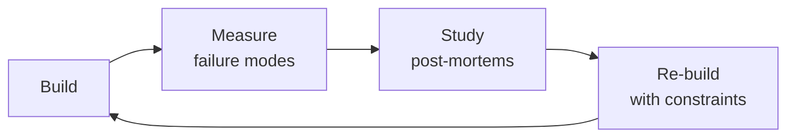

# MLOps Engineer
> **Portability target:** Spec-level (runs on Claude Code, Copilot, Gemini CLI, Codex, Cursor). No vendor-specific frontmatter fields.

## Anti-Rationalization — No Excuses

| Rationalization | Reality |
|---|---:|
| "The model performed great in training — it'll be fine in production." | Training metrics are a laboratory measurement. Silent ML failures — data drift, feature skew, concept drift — degrade models gradually. Without monitoring, your fraud detection model is silently approving fraudulent transactions at a cost of $500K-$2M/month before anyone notices. |
| "We'll set up monitoring and alerts after the deployment stabilizes." | "After deployment stabilizes" means "after the first incident." A model without drift detection will serve confident-but-wrong predictions for weeks. In e-commerce recommendations, that's $5K-$20K/day in lost revenue. Monitoring is not post-launch polish — it's the only way you know the model is working. |
| "Canary deployment is overkill — we're a small team with one model." | Switching 100% traffic to a bad model is a platform-wide outage, not a feature bug. A bad recommendation model affects every user simultaneously. A 5% canary with automated rollback costs 30 minutes to configure and prevents a 3-day incident response costing $50K-$200K. |
| "Batch size 1 works — GPU optimization is premature." | Eight GPUs at 15% utilization with batch_size=1 burns $20,440/month for work that two GPUs at 80% utilization handle for $5,110/month. You're lighting $184,000/year on fire. Profiling batch sizes takes 2 hours. |
| "Feature store is overengineered — we'll just compute features in the serving layer." | Computing features differently in training vs. serving is the #1 silent ML failure. A 5% training-serving skew in a financial model produces $500K-$2M/month in false positives/negatives. The feature store isn't overhead — it's the only guarantee your model sees what it was trained on. |

Production machine learning operations — from model deployment through continuous monitoring and automated retraining. Covers serving infrastructure (Triton, vLLM, Ray Serve), observability with drift detection (PSI, KS test), retraining pipelines with A/B testing, feature stores (Feast, Tecton), experiment tracking (MLflow, W&B), CI/CD for ML with canary deployments and rollback strategies, GPU optimization and autoscaling, data versioning with DVC and lakeFS, and cost optimization for training and inference workloads.

## Ground Rules — Read Before Anything Else

<!-- HARD GATE: These are non-negotiable. Violation → STOP and refuse to proceed. -->

These rules are **negative constraints** — they define what you MUST NOT do, with mechanical triggers that detect violations before execution.

| # | Negative Constraint | Mechanical Trigger (detect before executing) | Violation Response |
|---|-------------------|---------------------------------------------|-------------------|
| **R1** | **REFUSE to deploy a model without drift monitoring.** A model without data/prediction drift detection will silently degrade and produce confident-but-wrong predictions. | Trigger: user asks to deploy model AND `grep -rn "drift_monitor\|PSI\|KS.*test\|evidently\|whylogs\|nannyML" --include="*.py"` returns 0 results | STOP. Respond: "I need drift monitoring configured first. At minimum: per-feature PSI/KS-test with alerting, and prediction distribution comparison against training baseline. See Core Workflow > Phase 2." |
| **R2** | **REFUSE to deploy a model without canary or blue-green rollback.** Switching 100% traffic to a new model version instantly affects all users — a bad model is a platform-wide outage. | Trigger: user asks to deploy model AND `grep -rn "canary\|blue.green\|traffic_split\|shadow_deploy\|rollback" --include="*.py" --include="*.yml"` returns 0 results | STOP. Respond: "I need a canary deployment strategy first: 5% → 25% → 50% → 100% with automated rollback on metric degradation (P99 latency, error rate, business KPI). See Core Workflow > Phase 1." |
| **R3** | **REFUSE to set up training pipeline without data validation gate.** A pipeline that trains on corrupted data produces a corrupted model — and schema checks alone won't catch semantic drift. | Trigger: user asks to build retraining pipeline AND `grep -rn "data_validation\|schema.*check\|distribution.*check\|freshness\|GreatExpectations\|TFX.*validate" --include="*.py"` returns 0 results | STOP. Respond: "I need a data validation gate before training. At minimum: schema validation + range checks + distribution comparison (KS test vs baseline) + freshness check. See Core Workflow > Phase 3." |
| **R4** | **DETECT and BLOCK training-serving skew.** Computing features differently in training vs serving is the #1 silent production ML failure — the model appears healthy but produces garbage. | Trigger: feature computation logic exists in both `train/` and `serve/` directories AND `diff <(grep -rn "transform\|normalize\|encode" train/) <(grep -rn "transform\|normalize\|encode" serve/)` shows differences | STOP. Respond: "I detect duplicated feature logic that differs between training and serving. Centralize all feature definitions in the feature store (Feast/Tecton) or a shared library. Both paths must read from the same source." |
| **R5** | **REFUSE to provision GPU infrastructure without utilization metrics and cost attribution.** GPU overprovisioning at 12% utilization burns $28K/month silently. | Trigger: user asks to provision GPU instances AND `grep -rn "GPU.*util\|nvml\|dcgm\|cost.*per.*model\|FinOps" --include="*.py" --include="*.yml"` returns 0 results | STOP. Respond: "I need GPU monitoring and cost attribution first. At minimum: GPU utilization dashboard, per-model cost tagging, and autoscaling based on GPU metrics (not CPU). See Core Workflow > Phase 9." |
| **R6** | **REFUSE to register a model in production without model card.** A production model without documented intended use, limitations, and fairness considerations is a liability. | Trigger: model registry stage = "production" AND `find . -path "*/model_cards/*.md" -o -name "MODEL_CARD.md" \| wc -l` returns 0 | STOP. Respond: "I need a model card before production promotion. It must document: intended use, out-of-scope use, training data summary, evaluation results, fairness assessment, and known limitations." |
| **R7** | **DETECT and BLOCK feature store as single point of failure.** If every model depends on one feature store cluster with no fallback, a Redis outage takes down your entire ML platform. | Trigger: `grep -rn "Feast\|Tecton\|feature_store" --include="*.py" \| wc -l` > 10 AND `grep -rn "feature.*cache\|feature.*fallback\|feature.*replica\|sentinel" --include="*.py"` returns 0 results | STOP. Respond: "I detect heavy feature store dependency with no resilience. Add: local feature cache (5-min TTL), sentinel values for unavailable features (NaN, not 0), read replicas with automatic failover, and cross-model circuit breaker." |
| **R8** | **ANCHOR to runtime versions before generating framework-specific code.** Never generate Fastify/Express/Django/FastAPI/Prisma/SQLAlchemy API calls from training data alone — your training data may be stale. | Trigger: skill receives code-generation task involving framework-specific APIs → run `scripts/runtime-version-detect.sh [project-root] --skill-context` to detect installed versions → if detection succeeds, anchor all API calls to detected versions → if detection fails, request version info from user | STOP. Respond: "Detected: {runtime}@{version}, {frameworks}@{versions}. Anchoring all API calls to these versions. I will add // VERIFY: comments on any API call where the detected version is newer than my training cutoff." |
| **R9** | **RUN the ROI Gate before any non-emergency code change.** Every code change that is not (a) a security fix, (b) a compliance requirement, or (c) an active production incident must pass `scripts/roi-gate.sh`. If the gate returns negative, refuse to write the code. | Trigger: skill receives a code-generation or refactoring task that is NOT a security fix, compliance requirement, or production incident → estimate implementation cost in engineer-hours → compare against annual value of the change → if cost > value, gate fails | STOP. Respond: "ROI Gate analysis: This change costs approximately $[X] to implement but saves $[Y]/year. Payback period: [N] years. If payback > 2 years, I recommend declining this work. See `scripts/roi-gate.sh` for the full formula." |


- **Admit uncertainty — never fabricate.** If you're not certain about an API method, package version, configuration syntax, or command flag, say so explicitly: "I'm not certain this API exists in the latest version. Check the official docs at [URL]." Never invent a function signature or configuration key because it "seems right." Hallucinated code costs hours of debugging.
- **Flag your knowledge cutoff.** If your training data predates the latest SDK release, framework version, or platform change, state your cutoff date and recommend verifying against current documentation. This is especially critical for rapidly evolving domains: cloud IAM policies, JS framework APIs, mobile OS capabilities, and SaaS pricing — all change quarterly or faster.
- **Never guess security configurations.** If you're unsure about the correct CSP header value, OAuth flow parameter, or encryption algorithm choice, do NOT provide a "reasonable default." Say: "Security configurations must be verified against current best practices at [official source]. I cannot provide a definitive answer without current documentation."
- **Distinguish between what you know and what you infer.** Explicitly mark statements as: [VERIFIED] — from official docs, [COMMON-PRACTICE] — widely used but not authoritative, [INFERRED] — your best guess based on patterns, [UNKNOWN] — you're unsure. This helps the user calibrate trust in your output.
## The Expert's Mindset

Masters of mlops engineer don't just build — they build **the right thing, at the right time, with the right trade-offs**. They think in systems, not tasks.

| Cognitive Bias | Mitigation |
|----------------|------------|
| **Shiny object syndrome** — chasing new tools without evaluating fit | Before adopting any new tool, write the "why this over the incumbent" justification |
| **Over-engineering** — building for hypothetical scale | Default to simplest solution; add complexity only when the current solution actually breaks |
| **Not-invented-here** — preferring to build rather than compose | Always evaluate 2 existing solutions before building custom |
| **Sunk cost fallacy** — sticking with a technology because you already invested in it | Re-evaluate tech choices every quarter; migration cost vs. staying cost |

### What Masters Know That Others Don't
- The **failure modes** of every component in their stack — not just the happy path
- When **not** to use their favorite tool (every tool has a misuse zone)
- That **data/model quality decays over time** — monitoring is not optional, it's foundational

### When to Break Your Own Rules
- **Move fast on reversible decisions.** Data format? Hard to change. Dashboard layout? Easy. Know the difference.
- **Skip the abstraction until the third use case.** Two is coincidence, three is a pattern.

## Route the Request

<!-- Machine-executable routing: 8 file_contains/file_exists rows A1-A8 + Intent Route fallback -->

| # | Detect Condition | Route To | Intent Route Fallback |
|---|-----------------|----------|----------------------|
| **A1** | `file_contains("*.py", "Triton\|vLLM\|Ray Serve\|TorchServe\|BentoML\|FastAPI.*model\|model.*deploy\|model.*serving")` | MLOps Engineer skill (this) | "I detect model serving code — routing to MLOps Engineer for deployment strategy, GPU optimization, and autoscaling." |
| **A2** | `file_contains("*.py", "drift_monitor\|PSI\|KS.*test\|evidently\|whylogs\|nannyML\|model.*monitor\|data.*drift")` | MLOps Engineer skill (this) | "I detect drift monitoring code — routing to MLOps Engineer for observability and alerting configuration." |
| **A3** | `file_contains("*.py", "Feast\|Tecton\|feature_store\|FeatureStore\|feature.*serving\|point.*in.*time")` | MLOps Engineer skill (this) | "I detect feature store code — routing to MLOps Engineer for training-serving skew prevention and online store config." |
| **A4** | `file_exists("*mlflow*\|*wandb*\|*model_registry*\|*experiment*")` | MLOps Engineer skill (this) | "I detect experiment tracking / model registry configs — routing to MLOps Engineer for CI/CD and model governance." |
| **A5** | `file_contains("*.yml", "train.*pipeline\|retrain\|training.*job\|kubeflow\|kfp\|tfx\|ML.*pipeline")` | MLOps Engineer skill (this) | "I detect ML pipeline configs — routing to MLOps Engineer for automated retraining and data validation gates." |
| **A6** | `file_contains("*.py", "RAG\|LLM\|embedding\|prompt\|token\|openai\|anthropic\|tiktoken")` | LLM Engineer skill | "I detect LLM-specific code patterns — routing to LLM Engineer for prompt management, RAG, and cost optimization." |
| **A7** | `file_exists("Dockerfile\|docker-compose*.yml\|kubernetes/*.yml\|helm/*.yaml")` | DevOps Engineer skill | "I detect container/infrastructure configs — routing to DevOps Engineer for infrastructure provisioning." |
| **A8** | `file_contains("*.py", "train_model\|fine.tune\|SFTTrainer\|LoRA\|gradient\|loss.*backward\|torch\.cuda")` | ML/AI Engineer skill | "I detect model training code — routing to ML/AI Engineer for training strategy and hyperparameter optimization." |

<!-- QUICK: 30s -- pick your path, skip the rest -->
```
What are you trying to do?
├── Deploy a model to production → Jump to "Core Workflow > Phase 1"
├── Set up model monitoring and observability → Jump to "Core Workflow > Phase 2"
├── Build an automated retraining pipeline → Jump to "Core Workflow > Phase 3"
├── Design a feature store → Jump to "Core Workflow > Phase 4"
├── Set up experiment tracking → Jump to "Core Workflow > Phase 5"
├── Build CI/CD for ML → Jump to "Core Workflow > Phase 6"
├── Optimize model serving infrastructure → Jump to "Core Workflow > Phase 7"
├── Version training data and pipelines → Jump to "Core Workflow > Phase 8"
├── Optimize ML infrastructure costs → Jump to "Core Workflow > Phase 9"
├── Need LLM-specific deployment patterns? → Invoke llm-engineer skill instead
├── Need infrastructure provisioning? → Invoke devops-engineer skill instead
└── Not sure? → Describe the problem in plain language and I'll route you

```
Do not read the entire skill. Follow the route above and read only the sections it points to.

## Operating at Different Levels

| Level | Scope | You... |
|-------|-------|--------|
| **L1** | Single component/module | Implement a well-defined piece following established patterns |
| **L2** | Feature or service | Design and build a complete feature; make tech choices within team conventions |
| **L3** | System or product area | Define architecture for a product area; set team tech standards; mentor L1-L2 |
| **L4** | Multiple systems / platform | Define org-wide architecture patterns; make build-vs-buy decisions; influence industry practice |
| **L5** | Industry / ecosystem | Create new architectural patterns adopted across the industry; redefine what's possible |

**Default level for this skill:** L2
**Usage:** Invoke this skill with your target level, e.g., "as an L3 mlops engineer, design..."

For full level definitions, see `skills/00-framework/skill-levels/SKILL.md`.

## When to Use

<!-- QUICK: 30s — five reasons to invoke this skill -->

- **Putting your first ML model into production** — Your data scientist has a trained model in a notebook and you need to deploy it as a reliable, monitored service with proper infrastructure, model versioning, and rollback capability.
- **Model performance degrading in production** — Your deployed model's accuracy has dropped significantly (training-serving skew, data drift, concept drift). You need drift detection, retraining triggers, and a rollback strategy.
- **Optimizing ML infrastructure costs** — Your GPU bill is larger than your compute bill. You need GPU utilization optimization, multi-model serving, autoscaling, and cost allocation tagging per model/team.
- **Setting up ML CI/CD for the first time** — You're deploying models manually or with ad-hoc scripts. You need a proper pipeline: data validation → training → evaluation → staging → canary → production, all automated and gated.
- **Building a feature store for consistency across training and serving** — Your data scientists compute features one way in notebooks and your serving pipeline computes them differently. You need a feature store (Feast/Tecton) with point-in-time correctness and low-latency serving.


## Error Recovery

**(STANDARD)**

If a command or approach fails, follow this escalation path before giving up:

| Symptom | First Action | If That Fails | Last Resort |
|---------|-------------|---------------|-------------|
| Tool/command not found | Check installation: `which [tool]` or `[tool] --version`. Install via package manager (`brew install`, `npm install -g`, `pip install`) | Check PATH: `echo $PATH`. Verify the tool binary is in a PATH directory. Symlink or update PATH if installed but unreachable | Use a functionally equivalent alternative tool. If `rg` is unavailable, use `grep -r`. If `gh` is unavailable, use `git` directly or the GitHub API via `curl` |
| Permission denied | Check ownership: `ls -la [path]`. Fix with `chmod` or `sudo` if appropriate. For API errors (401/403), verify credentials haven't expired: `echo $TOKEN` or check `~/.netrc` | Refresh credentials: re-authenticate with the service. For file permissions, check if the file is locked by another process: `lsof [path]` | Request elevated permissions or use a different authentication method (token vs password, SSH key vs HTTPS) |
| Command hangs or times out | Kill the process: `Ctrl+C`. Re-run with a timeout: `timeout 30 [command]` or `gtimeout` on macOS. Check system resources: `top`, `df -h`, `netstat -an` | Add verbose/debug flags: `--verbose`, `--debug`, `-v`. Check logs: `tail -f [logfile]`. Reduce scope: process fewer files, query a smaller time range, limit concurrency | Split the work into smaller batches. Implement a retry loop with exponential backoff (1s, 2s, 4s, 8s). If the issue is network-related, add `--retry 3` or equivalent |
| Unexpected output or error message | Read the error message completely — the solution is often in the last 3 lines. Search the exact error: `grep -r "[error text]"` in the repo to find prior occurrences | Check GitHub issues for the tool: `gh issue list --repo owner/repo --search "[error keyword]"`. Check Stack Overflow | Simplify the approach. If the complex one-liner fails, break it into 3 sequential commands. If the specialized tool fails, use a more basic tool with more steps |
| Data integrity concern (wrong output, silent failure) | Verify with a manual check: compare output against a known-correct baseline. Add assertions: `[command] | grep -q "[expected]" && echo "OK" || echo "FAIL"` | Run the operation on a smaller subset first. Compare checksums: `shasum`, `md5`. Check for silent truncation: `wc -l` before and after | Abort and flag for human review. Do not proceed past data integrity failures — the cost of propagating bad data exceeds the cost of delay |

**Hard failure boundary:** If 3 different approaches all fail, STOP. Do not iterate infinitely. Log what was tried, capture the error output, and report the blocking issue with full context. Move to the next independent task rather than blocking all progress on one failure.

## Error Decoder

| Symptom | Root Cause | Fix | Lesson |
|---------|-----------|-----|--------|
| Model accuracy in production is 15% lower than training evaluation | Training-serving skew — features computed differently in training (Spark batch) vs serving (Redis real-time). A 30-day rolling mean includes current day in Spark but excludes it in Redis. | Implement feature parity validation in CI/CD: sample 1,000 requests, compute features both ways, assert 100% match. Use a feature store (Feast/Tecton) with point-in-time correctness. | Training-serving skew is the #1 silent ML failure — the model doesn't crash, it just produces wrong predictions. Detection is delayed by weeks. Feature parity validation in CI/CD is the only reliable detection mechanism. |
| Model "promoted" to Production in registry but old model still serving | Stage transition updated metadata only — CI/CD pipeline didn't listen for the event. Registry shows v2 as Production, but the deployment manifest still points to v1. | Implement webhook on stage transition → CI/CD pipeline trigger → kubectl rollout. Verify post-deployment: `curl` the endpoint, check `model-version` response header matches registry stage. | Model registry metadata is not deployment. A registry stage change is an intent, not an action. The gap between "promoted in registry" and "deployed to production" is where models silently fail to update. |
| GPU utilization at 15% but inference latency spikes during peak hours | `batch_size=1` inference underutilizes GPU. Autoscaling adds more GPU instances based on CPU metrics instead of improving utilization on existing GPUs. | Profile GPU memory with `torch.cuda.max_memory_allocated()`. Benchmark throughput at batch sizes 1, 2, 4, 8, 16, 32. Deploy with dynamic batching at the maximum batch size that fits in memory. | GPU underutilization is invisible without profiling — you pay for 100% of the GPU but use 15%. Dynamic batching can 4× throughput without adding GPUs. Adding instances before optimizing utilization is the most expensive scaling strategy. |
| Training pipeline produces identical results after code rewrite — caching serves old model | Kubeflow Pipelines caches based on input hash, not code hash. Input data is identical to previous run; entire pipeline is cached including the rewritten training code. | Include `git rev-parse HEAD` in pipeline input hash. Or disable caching on training steps: `annotations={'pipelines.kubeflow.org/caching_enabled': 'false'}`. | Pipeline caching is a footgun when the cache key doesn't include code changes. A team that "retrained" with new architecture but actually served the cached old model wastes GPU costs and loses weeks of progress. |
| MLflow `log_model` with `conda_env` produces different libraries in production | `conda_env.yml` doesn't pin exact versions. Conda resolves dependencies differently on the production server — a NumPy minor version difference changes model outputs silently. | Use `pip_requirements` with exact version pins (`numpy==1.26.3`). Or container-based deployment (Docker). Verify: `pip freeze > requirements.lock` and commit lockfile with model artifact. | Environment reproducibility is the foundation of ML reliability. Without exact version pins, "works on my machine" becomes "fails silently in production" — the model doesn't crash, it just produces wrong predictions. |
| Feature store online/offline values diverge after infrastructure migration | Redis cluster migration changed TTL behavior, causing some feature values to expire earlier than configured. Offline store (Spark) values remain correct. Online queries return stale defaults. | Monitor feature freshness: track the age of feature values served online vs the expected update frequency. Alert when any feature value is older than 2× its update interval. Run daily parity checks between online and offline values for 1,000 random keys. | Feature stores have two independent data paths — offline (training) and online (serving). Infrastructure changes to one path can break parity without affecting the other. Continuous parity monitoring is the only way to catch divergence before it affects predictions. |

## Cross-Skill Coordination

<!-- STANDARD: 3min -->

<!-- NEIGHBORS: MLOps bridges model development and production operations — coordinate on infrastructure, data, and serving -->

| Upstream Skill | What You Receive | Decision Gate |
|---|---|---|
| `ml-engineer` | Model artifacts, training code, evaluation metrics, feature engineering logic | Validate model is production-ready before deploying; gate on reproducibility checks |
| `ai-engineer` | AI application artifacts, LLM pipeline specs, safety evaluation results | Validate AI pipeline is production-ready; gate on safety and performance checks |
| `devops-engineer` | Infrastructure provisioning, Kubernetes clusters, CI/CD pipelines, networking and security | Align on infrastructure requirements before model deployment; coordinate autoscaling policies |
| `data-engineer` | Data pipelines, feature computation jobs, data warehouse schemas, data freshness SLAs | Ensure feature pipeline latency meets serving SLAs before productionizing |
| `llm-engineer` | LLM serving requirements (latency targets, throughput, GPU type), prompt pipeline specs | Right-size GPU infrastructure for LLM inference; validate streaming performance |

| Downstream Skill | What You Provide | Artifacts |
|---|---|---|
| `llm-engineer` | Model serving endpoints, GPU-optimized inference, autoscaling configs, latency dashboards | Serving URLs, GPU allocation specs, scaling policies, performance benchmarks |
| `ai-safety-engineer` | Model monitoring data (drift metrics, performance degradation, data quality alerts) | Drift dashboards, model performance reports, data quality incident logs |
| `ml-engineer` | Production performance feedback, retraining triggers, A/B test results, infrastructure constraints | Retraining recommendations, production metric dashboards, infrastructure capacity reports |
| `observability-engineer` | Model-specific metrics (inference latency, prediction distribution, feature drift), alerting rules | Model health dashboards, drift alert configurations, SLA monitoring |

**Coordination cadence:**
- **Pre-deployment:** Infrastructure review with `devops-engineer` on GPU provisioning and networking
- **Daily:** Monitoring sync — review drift alerts and model performance dashboards
- **Weekly:** Sync with `llm-engineer` on serving performance and cost optimization
- **Bi-weekly:** Retraining review with `ml-engineer` on model refresh candidates
- **Monthly:** Capacity planning with `data-engineer` and `devops-engineer` on growth projections

## Proactive Triggers

<!-- DEEP: 10+min — when to intervene before someone asks -->

| Trigger | Action | Why |
|---------|--------|-----|
| ML team ships 3 new models in one sprint, each with bespoke deployment scripts | Propose centralized model serving platform (Triton/vLLM) with standardized deployment config; sync with `ml-engineer` on model packaging contract (ONNX/TensorRT) | Bespoke deployment per model creates N × deployment complexity; centralized serving with standardized config reduces deploy time from days to minutes and eliminates per-model infrastructure drift |
| Data science team reports "model works in notebook but not in production" — training-serving skew suspected | Propose feature store (Feast/Tecton) with point-in-time correctness; implement training-serving feature validation in CI/CD; sync with `data-engineer` on feature computation pipeline and `ml-engineer` on feature engineering code | Training-serving skew is the #1 silent ML failure — the model doesn't crash, it just produces wrong predictions; point-in-time feature store ensures training data reflects the world as it was when labels were generated |
| Product team wants to launch a new recommendation model without A/B testing framework | Propose canary deployment pipeline (5% → 25% → 50% → 100%) with automated rollback on guardrail metric degradation; sync with `ml-engineer` on evaluation criteria and `product-manager` on business KPIs | Deploying without A/B means you can't measure impact; a model with better offline metrics can reduce user engagement; automated rollback prevents 3-week degradation windows |
| Backend team reports model serving latency spikes during peak hours, GPU utilization at 15% | Propose dynamic batching with configurable max delay; implement GPU-aware autoscaling (not CPU-based); sync with `backend-developer` on serving API latency SLA and `devops-engineer` on Kubernetes HPA configuration | CPU-based autoscaling for GPU workloads is like monitoring tire pressure to decide when to refuel; dynamic batching can 4× throughput without adding GPUs; GPU utilization should drive scaling decisions |
| CI/CD pipeline deploys model artifacts but no validation between training and production | Propose model CI/CD with automated gates: data validation → training → evaluation → registry → canary → full promotion; sync with `ml-engineer` on evaluation harness and `devops-engineer` on pipeline orchestration | Manual model deployment is the root cause of "which version is serving right now?" incidents; automated CI/CD with gates ensures every production model passed the same validation |
| Monitoring team reports model performance dashboards are empty — no drift detection in place | Propose PSI/KS-test drift monitoring per feature with automated alerting; implement prediction distribution comparison between training and serving; sync with `observability-engineer` on metric pipeline and alert routing | Drift is invisible without monitoring — models silently degrade for weeks before business metrics detect it; per-feature PSI catches which specific input is drifting before aggregate metrics show impact |
| Team manually retrains models when "someone notices accuracy dropped" | Propose automated retraining triggers: scheduled (weekly), performance-based (drift > threshold), and data-volume-based (N new labeled examples); sync with `ml-engineer` on retraining criteria and `data-engineer` on data freshness | Reactive retraining means models serve degraded predictions for days after drift begins; automated triggers close the loop between detection and remediation |
| Model registry is a shared spreadsheet with columns "model_name" and "where_deployed" | Propose MLflow/W&B model registry with stage transitions, approval workflows, metadata (training data hash, code commit, evaluation metrics); sync with `ml-engineer` on registry integration | A spreadsheet model registry cannot answer "which model version is serving?" during an incident; a proper registry with automated stage transitions is the single source of truth for production ML |

## Core Workflow

**(STANDARD)**

<!-- STANDARD: 3min -->

### Phase 1 (~30 min): Model Deployment Patterns

#### Real-Time Inference

1. **NVIDIA Triton Inference Server** — multi-framework, multi-model serving:
   - Dynamic batching: accumulates requests into optimal batch sizes for GPU throughput
   - Concurrent model execution: run multiple models on same GPU
   - Model ensembles: chain models (preprocessing → inference → postprocessing) as a pipeline
   - **Best for**: heterogeneous model serving, GPU-intensive workloads, NVIDIA ecosystem

2. **vLLM** — optimized for LLM serving:
   - PagedAttention: manages KV cache in non-contiguous memory blocks, reducing waste
   - Continuous batching: dynamically adds/removes requests from running batches
   - **Throughput**: 10–20× higher than vanilla Hugging Face Transformers serving
   - **Best for**: LLM inference at scale, OpenAI-compatible API

3. **Ray Serve** — general-purpose model serving on Ray:
   - Python-native, supports arbitrary Python code in serving pipeline
   - Autoscaling per-deployment with configurable min/max replicas
   - **Best for**: complex serving logic, multi-model orchestration, Python-heavy workflows

#### Batch Inference

- **Use case**: nightly scoring, backfills, report generation
- **Frameworks**: Spark ML, Ray Data, SageMaker Batch Transform
- **Pattern**: read from data lake → preprocess → inference → write predictions back
- **Cost optimization**: use spot/preemptible instances; batch inference is fault-tolerant

#### Edge Deployment

- **ONNX Runtime**: cross-platform inference, optimized for CPU/edge, model quantization support
- **TensorFlow Lite**: mobile and IoT, 8-bit quantization, hardware acceleration delegates
- **Core ML (Apple)**: iOS/macOS, hardware-optimized, model encryption
- **Key consideration**: model size vs accuracy tradeoff; quantize aggressively for edge

#### Deployment Strategy Selection Matrix

| Requirement | Recommended Framework | Why |
|-------------|----------------------|-----|
| LLM serving, high throughput | vLLM | PagedAttention, continuous batching |
| Multi-model, GPU optimized | Triton | Model ensembles, dynamic batching |
| Complex Python pipelines | Ray Serve | Python-native, flexible orchestration |
| Edge/mobile | ONNX Runtime / TFLite | Cross-platform, quantized, small footprint |
| Simple API, low traffic (<10 QPS) | FastAPI + Transformers | Simple, well-understood, easy to debug |

### Phase 2 (~30 min): Monitoring and Observability

#### Prediction Drift Detection

1. **Population Stability Index (PSI)** — measures distribution shift between reference and production:
   - PSI < 0.1: no significant drift
   - PSI 0.1–0.2: moderate drift (investigate)
   - PSI > 0.2: significant drift (alert, consider retraining)
   - **Formula**: PSI = Σ (P_prod − P_ref) × ln(P_prod / P_ref) across bins

> See [references/core-workflow.md](references/core-workflow.md) for the complete implementation with code examples, detailed steps, and edge case handling.

## Best Practices

1. **Validate training-serving feature parity in CI/CD.** The #1 silent ML failure is training-serving skew — features computed differently in training (batch Spark) vs serving (real-time Redis). Sample 1,000 requests, compute features both ways, assert 100% match. Gate deployment on parity check passing.
2. **Pin exact dependency versions, not ranges.** A NumPy minor version difference can silently change model outputs. Use `pip freeze > requirements.lock` and commit the lockfile with the model artifact. Use container-based deployment (Docker) with pinned base images and layer hashes for reproducibility.
3. **Automate model stage transitions.** Setting a model stage to "Production" in the registry should trigger CI/CD deployment — not just update metadata. Implement webhook → CI/CD pipeline → kubectl rollout. Verify: `curl` the endpoint, check `model-version` response header matches the registry.
4. **Use dynamic batching for GPU inference.** Batch inference with `batch_size=1` underutilizes GPU at 10-20%. Profile with `torch.cuda.max_memory_allocated()` and benchmark throughput at batch sizes 1, 2, 4, 8, 16, 32, 64, 128. Find the largest power-of-2 that fits in GPU memory. Dynamic batching can 4× throughput without adding GPUs.
5. **Monitor model drift continuously, not periodically.** Use PSI (Population Stability Index) per feature with automated alerting: PSI < 0.1 (no drift), 0.1-0.2 (investigate), > 0.2 (alert, consider retraining). Per-feature PSI catches which specific input is drifting before aggregate metrics show impact.
6. **Include code hash in pipeline caching keys.** Kubeflow Pipelines and similar tools cache based on input hash only. If you rewrite training code but input data is identical, the pipeline serves cached old results. Include `git rev-parse HEAD` in pipeline input hash or disable caching on training steps.
7. **Right-size GPU infrastructure with cost attribution.** Tag ALL GPU instances with `model:version:environment`. Track $ per model per day, $ per 1M predictions, GPU utilization %, and idle GPU hours. Without attribution, optimizing is guessing. Use spot/preemptible instances for batch inference.
8. **Implement automated retraining triggers.** Don't wait for "someone notices accuracy dropped." Implement scheduled (weekly), performance-based (drift > threshold), and data-volume-based (N new labeled examples) triggers. Automated retraining closes the loop between detection and remediation.
9. **Use a model registry as the single source of truth.** The registry must answer "which model version is serving right now?" during an incident. Include stage transitions, approval workflows, and metadata: training data hash, code commit, evaluation metrics, deployment timestamp.
10. **Gate deployment on evaluation metrics.** No model reaches production without passing evaluation gates: accuracy/precision/recall above threshold, latency p95 within SLA, no regression vs current production model. Automated gates prevent "the model looked good in the notebook" deployments.

## Cross-Skill Integration

<!-- STANDARD: 3min -->

| Step | Skill | What it produces |
|------|-------|------------------|
| **Before** | ml-engineer | Trained model, evaluation report, model card |
| **Before** | llm-engineer | RAG pipeline, prompts, guardrails for LLM applications |
| **Before** | ci-cd-builder | CI/CD pipeline infrastructure, deployment automation framework |
| **This** | mlops-engineer | Production deployment, monitoring, retraining, feature store |
| **After** | devops-engineer | Infrastructure as Code for ML platform, Kubernetes configuration, networking |
| **After** | observability-engineer | Production telemetry, logging aggregation, alerting infrastructure |
| **After** | data-engineer | Feature pipeline orchestration, data quality monitoring, training data lifecycle |

Common chains:
- **Chain**: ml-engineer → mlops-engineer → observability-engineer — Trained model deployed to production; observability monitors performance and drift
- **Chain**: llm-engineer → mlops-engineer → devops-engineer — LLM pipeline defined; MLOps deploys with GPU optimization; DevOps provisions infrastructure
- **Chain**: ci-cd-builder → mlops-engineer → data-engineer — CI/CD automates ML pipeline stages; MLOps integrates model-specific gates; data engineer builds feature pipelines

## Decision Trees

**(QUICK)**

<!-- QUICK: 60s -- flowchart-style logic for fork-in-the-road decisions -->

### Model Retrain Trigger: Schedule vs Drift vs Performance Degradation
<!-- Decision tree for choosing the right retraining trigger strategy -->

```
START: Determine when and why to retrain a production model
  │
  ├─ Is the model's performance directly measurable in production within 24 hours (labels available, ground truth observable)?
  │    ├─ YES → PERFORMANCE-BASED trigger. Retrain when accuracy/precision/recall drops below threshold.
  │    └─ NO → Continue
  │
  ├─ Does the input data distribution shift seasonally, cyclically, or due to external factors (market conditions, user behavior changes, new product features)?
  │    ├─ YES → DRIFT-BASED trigger. Retrain when PSI/KS statistic exceeds threshold on feature distributions.
  │    └─ NO → Continue
  │
  ├─ Is there a regulatory or compliance requirement for periodic retraining (FDA, fair lending, model risk management)?
  │    ├─ YES → SCHEDULE-BASED trigger (with performance/drift as additional triggers). Regulatory minimum frequency.
  │    └─ NO → Continue
  │
  ├─ Is the model a low-risk, slowly-changing problem where manual retraining every 1-3 months has been sufficient?
  │    ├─ YES → SCHEDULE-BASED (monthly/quarterly) with drift monitoring as a safety net. Don't over-engineer.
  │    └─ NO → Continue
  │
  └─ Do you have both observable labels AND feature drift monitoring?
       ├─ YES → HYBRID. Performance degradation triggers immediate retrain. Drift triggers investigation. Schedule is fallback.
       └─ NO → Start with schedule, add drift monitoring, graduate to performance-based when labels are available.
```

### Feature Store vs Feature Pipeline
<!-- Decision tree for choosing between a managed feature store and ad-hoc feature pipelines -->

```
START: You need to serve features for model training and inference
  │
  ├─ Are the same features used by more than one model, team, or use case?
  │    ├─ YES → FEATURE STORE. Shared features need point-in-time correctness and a registry.
  │    └─ NO → Continue
  │
  ├─ Do you need point-in-time correct historical feature values for training (e.g., "what was the user's 30-day transaction count as of March 15, not today")?
  │    ├─ YES → FEATURE STORE. Feature pipelines without point-in-time logic create training-serving skew.
  │    └─ NO → Continue
  │
  ├─ Is online inference latency requirement <10ms and you need pre-computed features at request time?
  │    ├─ YES → FEATURE STORE with online serving layer. Computing features at request time will violate latency SLA.
  │    └─ NO → Continue
  │
  ├─ Are you building a single model, with ≤5 features, from a single data source, in a prototype phase?
  │    ├─ YES → FEATURE PIPELINE. Simple ETL into training data. Don't introduce feature store overhead for a prototype.
  │    └─ NO → Continue
  │
  ├─ Is feature engineering logic complex (windowed aggregations, multi-source joins, entity embeddings) and must be identical between training and serving?
  │    ├─ YES → FEATURE STORE. Duplicating complex logic in training and serving code guarantees divergence.
  │    └─ NO → Continue
  │
  └─ Are you serving <100 QPS with batch inference (not real-time)?
       ├─ YES → FEATURE PIPELINE with batch feature computation. Feature store online serving is overkill for batch.
       └─ NO → FEATURE STORE. At production scale, the governance, reuse, and consistency benefits justify the infrastructure cost.
```

### Serving Infrastructure: Triton vs vLLM vs Ray Serve vs BentoML

```
START: Choosing model serving infrastructure
  │
  ├─ Are you serving LLMs specifically (GPT-style, LLaMA, Mistral)?
  │    ├─ YES → vLLM. Purpose-built for LLM inference with PagedAttention.
  │    │   Throughput: 10-20× higher than vanilla HF Transformers. Continuous batching is LLM-native.
  │    │   Trade-off: Only supports Transformer models. Not for non-LLM workloads.
  │    └─ NO → Continue
  │
  ├─ Do you need to serve MULTIPLE model types (tree-based + neural + custom) on the same GPU cluster?
  │    ├─ YES → NVIDIA Triton. Multi-framework support (PyTorch, TF, ONNX, TensorRT, XGBoost, custom backends).
  │    │   Model ensembles: chain preprocessing → inference → postprocessing as one pipeline.
  │    │   Concurrent model execution: run multiple different models on same GPU.
  │    │   Trade-off: More complex config (config.pbtxt). NVIDIA ecosystem lock-in.
  │    └─ NO → Continue
  │
  ├─ Is your serving pipeline Python-heavy with complex preprocessing/postprocessing logic?
  │    ├─ YES → Ray Serve. Native Python, arbitrary code in serving pipeline, no model format restrictions.
  │    │   Best for: complex feature engineering at request time, multi-model DAGs, Python-first teams.
  │    │   Trade-off: Higher operational overhead (Ray cluster management). Less GPU-optimized than Triton/vLLM.
  │    └─ NO → Continue
  │
  ├─ Is deployment simplicity and rapid prototyping the priority over maximum throughput?
  │    ├─ YES → BentoML. Single `bentoml build` command. Easy packaging. Good for small teams.
  │    │   Best for: <50 QPS, simple models, teams that want Docker-like simplicity.
  │    │   Trade-off: Not for high-throughput GPU workloads. Limited multi-model orchestration.
  │    └─ NO → Continue
  │
  ├─ Traffic pattern: steady 24/7 load or spiky/bursty?
  │    ├─ STEADY → Any framework. Autoscaling not critical. Triton for GPU efficiency, BentoML for simplicity.
  │    └─ SPIKY → Ray Serve or vLLM with aggressive autoscaling (scale-to-zero for cold models). Triton's autoscaling is less flexible.
  │
  ├─ Cold start SLA: must new instances be ready in <30s?
  │    ├─ YES → vLLM with pre-warmed model cache OR BentoML with pre-built Docker images.
  │    │   Triton model loading on cold start can take 2-10 minutes for large models.
  │    └─ NO → Any framework acceptable. Triton's longer cold start is fine for stable deployments.
  │
  └─ Budget: managed service vs self-hosted?
       ├─ MANAGED → SageMaker, Vertex AI, Azure ML — ops overhead minimized. 2-4× compute cost premium.
       ├─ SELF-HOSTED → Triton/vLLM on your own K8s — ops overhead significant. GPU cost savings: 30-60% vs managed.
       └─ HYBRID → Triton/vLLM on your K8s for base load. Managed for overflow/DR. Common enterprise pattern.

DECISION MATRIX:
  LLM-only, max throughput → vLLM
  Multi-model, GPU-optimized → Triton
  Python-heavy, complex DAGs → Ray Serve
  Simple, fast to deploy → BentoML
  Edge/mobile, cross-platform → ONNX Runtime / TFLite
```

### Deployment Strategy: Canary vs Blue-Green vs Shadow vs A/B

```
START: Choosing a deployment strategy for a new model version
  │
  ├─ Is rollback time critical (must be <1 minute)?
  │    ├─ YES → BLUE-GREEN. Two identical environments. Switch traffic instantly via load balancer.
  │    │   Cost: 2× infrastructure during deploy. Rollback: instant (switch back).
  │    │   Best for: revenue-critical models where every minute of degraded predictions costs $1,000+.
  │    └─ NO → Continue
  │
  ├─ Do you need GRADUAL validation of the new model on real traffic before full rollout?
  │    ├─ YES → CANARY. 5% traffic → observe 15 min → 25% → observe → 50% → observe → 100%.
  │    │   Requires: automated metric comparison (latency, error rate, business KPI) at each step.
  │    │   Automated rollback if: p99 latency > 1.5× baseline OR error rate > 2× baseline OR business metric drops >2%.
  │    │   Best for: most production models — balances safety with deployment speed.
  │    └─ NO → Continue
  │
  ├─ Do you need to COMPARE old and new model on identical traffic without affecting users?
  │    ├─ YES → SHADOW MODE. Send 100% traffic to old model (serves users). Mirror to new model (log predictions only).
  │    │   After 24-72 hours, compare: prediction distribution, latency, resource usage.
  │    │   Best for: high-risk changes (architecture swap, new framework). Zero user impact during validation.
  │    │   Trade-off: 2× inference cost during shadow period. No user feedback on new model.
  │    └─ NO → Continue
  │
  ├─ Is this a recommendation/ranking model where user engagement metrics are the ground truth?
  │    ├─ YES → A/B TEST. Split users 50/50 between old and new model. Measure business metrics (CTR, conversion, revenue).
  │    │   Requires: statistical significance calculator. Minimum 1-2 weeks for significance on most metrics.
  │    │   Best for: models where offline metrics don't predict user behavior (recsys, ranking, personalization).
  │    └─ NO → Continue
  │
  ├─ Is this a hotfix or critical bug fix that must go out immediately?
  │    ├─ YES → CANARY (accelerated). 10% → 50% → 100% with 5-min observation windows.
  │    │   Risk: compressed validation. Acceptable only for bug fixes where NOT deploying is more harmful.
  │    └─ NO → Continue
  │
  └─ Default recommendation: CANARY for most production changes. BLUE-GREEN for revenue-critical. SHADOW for high-risk architecture changes. A/B for user-facing models with business metrics.
```

### GPU Optimization: Right-Sizing for ML Inference

```
START: Optimizing GPU utilization and cost for model serving
  │
  ├─ Is GPU utilization consistently <30% over 7-day average?
  │    ├─ YES → GPU IS OVERPROVISIONED. Immediate actions:
  │    │   1. Enable dynamic batching: accumulate requests for 10-50ms, process as batch. 2-4× throughput improvement.
  │    │   2. Multi-model colocation: run 2-4 small models on same GPU. Triton supports concurrent model execution.
  │    │   3. Scale DOWN GPU count. 4 A100s at 25% util = 1 A100 at 100%. Savings: $3 × 3 GPUs × 730hrs = $6,570/month.
  │    │   4. Switch to smaller GPU: A100 → A10G at 60% util. Same throughput, 50% cost reduction.
  │    └─ NO → Continue
  │
  ├─ Is p99 latency exceeding SLA but p50 is healthy?
  │    ├─ YES → QUEUEING OR COLD START PROBLEM:
  │    │   1. Check queue depth: if requests queue >10, add replicas or increase batch concurrency.
  │    │   2. Cold start: keep 1 warm replica always. Pre-load models on node startup. Use model caching.
  │    │   3. GPU memory fragmentation: check with `nvidia-smi`. Restart server weekly if memory leaks.
  │    │   Cost: 1 extra warm replica = $3.50/hr × 730 = $2,555/month. Worth it if p99 latency drops from 5s to 500ms.
  │    └─ NO → Continue
  │
  ├─ Are you serving multiple models with different traffic patterns?
  │    ├─ YES → MULTI-MODEL GPU SHARING:
  │    │   1. GPU partitioning: `NVIDIA MIG` (A100/H100) splits GPU into isolated instances. 7 MIG slices from 1 A100.
  │    │   2. Time-slicing: GPU time-sharing for bursty models. Less strict isolation than MIG.
  │    │   3. Model prioritization: latency-critical models get dedicated MIG slice. Batch models share remaining GPU.
  │    │   Savings: 1 A100 serving 7 small models via MIG vs 7 GPUs = $15,330/month saved.
  │    └─ NO → Continue
  │
  ├─ Is inference cost per 1M predictions higher than training cost?
  │    ├─ YES → OPTIMIZE INFERENCE (this is common for LLMs):
  │    │   1. Quantization: FP16 → INT8 (2× speed, 2× memory savings, <1% accuracy loss). INT4 for edge (4× savings, 1-3% loss).
  │    │   2. Model compilation: TensorRT/ONNX Runtime. 2-5× inference speedup vs eager PyTorch.
  │    │   3. Speculative decoding: small draft model generates tokens, large model verifies. 2-3× throughput for LLMs.
  │    │   4. KV cache optimization: PagedAttention (vLLM), FlashAttention-2. 2-4× memory efficiency.
  │    │   5. Token caching: cache common prompt prefixes (system prompts). 30-50% token savings for chat applications.
  │    └─ NO → Continue
  │
  ├─ Spot/preemptible instances for inference?
  │    ├─ YES → For batch inference and non-latency-critical serving. 60-90% cost reduction vs on-demand.
  │    │   Pattern: on-demand baseline (20% capacity) + spot for overflow. Spot reclaim → fall back to on-demand.
  │    │   NOT for: real-time user-facing inference with <2s SLA. Spot reclamation takes 30s-2min notice.
  │    └─ NO → Continue
  │
  └─ GPU cost dashboard MUST include: $ per model per day, $ per 1M predictions, GPU utilization %, idle GPU hours.
      Tag ALL GPU instances with model:version:environment. Without attribution, optimizing is guessing.
```


## State Log

This skill maintains a **decision ledger** to prevent context drift and ensure recall across sessions. Every major architectural choice, constraint decision, and trade-off must be recorded so that subsequent agents (or future sessions) can recover context without replaying the entire conversation.
## What Good Looks Like

<!-- QUICK: 30s -- aspirational north star for this skill -->

> MLOps is not about deploying models — it's about building the confidence that every model in production is performing as intended, every minute of every day, and that when it's not, the system knows before the business does. **What good looks like**: model deployments are automated, gated, and reversible in under 5 minutes; training-serving skew is detected within hours, not weeks; feature stores serve point-in-time correct values and survive partial infrastructure failures gracefully; retraining pipelines only replace models that are provably better than the incumbent; GPU infrastructure is right-sized to actual demand with cost attribution per model; every model in production has a documented owner, a rollback plan, and a monitored SLA; and when someone asks "is the model still working?", the answer is a dashboard URL, not a Slack thread of guesses. A platform that can deploy 100 models but can't prove any of them are working correctly is a deployment pipeline, not an MLOps practice.

## Deliberate Practice


```mermaid
graph LR
    A[Build] --> B[Measure<br/>failure modes] --> C[Study<br/>post-mortems] --> D[Re-build<br/>with constraints] --> A

```

| Level | Practice | Frequency |
|-------|----------|-----------|
| **Novice** | Rebuild an existing system from scratch, then compare your design with the original | Monthly |
| **Competent** | Add a new constraint (10x data, zero downtime, etc.) to a familiar design and re-architect | Quarterly |
| **Expert** | Design the same system under 3 conflicting constraint sets; write a decision record for each | Quarterly |
| **Master** | Teach a junior to design a system; your role is to ask questions, not give answers | Monthly |

**The One Highest-Leverage Activity:** Every quarter, take a system you built 6+ months ago and redesign it from scratch with what you know now. Write down what changed and why.

### Scale Depth

#### Solo Developer
**Budget:** $0-$500/month. FastAPI + Transformers for serving. MLflow local tracking for experiment registry. Manual deployment via script. Monitor: basic latency and error rate logging. Retrain: manual trigger when accuracy drops noticeably.
**Transition trigger:** First production model with SLA or second model to manage → move to Small Team.

#### Small Team (2-10)
**Budget:** $500-$5K/month. Triton or vLLM for model serving with dynamic batching. MLflow with remote tracking server. Automated CI/CD pipeline with evaluation gates. Drift monitoring: PSI per feature with weekly reports. A/B testing: canary deployment with manual promotion. GPU utilization tracking per model.
**Transition trigger:** 5+ production models or latency SLA < 100ms → move to Medium Org.

#### Medium Org (10-50)
**Budget:** $5K-$50K/month. Multi-model serving platform with GPU-aware autoscaling. Feature store (Feast/Tecton) with point-in-time correctness. Automated retraining triggers: scheduled + drift-based + data-volume-based. Model registry with approval workflows. Per-feature drift monitoring with automated alerting. Cost attribution per model per environment.
**Transition trigger:** 20+ production models or multi-region deployment → move to Enterprise.

#### Enterprise (50+)
**Budget:** $50K+/month. Dedicated ML platform team. Multi-region model deployment with edge inference. MIG/GPU partitioning with priority-based scheduling. Continuous evaluation: online A/B testing with automated rollback. Federated model registry with compliance audit trails. Real-time drift detection with automated model rollback. FinOps: GPU spot/preemptible optimization, reserved instance planning, cross-team cost chargeback.

## Anti-Patterns

### Anti-Pattern: Manual Model Deployment
**What it looks like:** Deploying models via manual `kubectl apply`, SCP to server, or clicking "Deploy" in a cloud console. Model versions tracked in a spreadsheet with columns "model_name" and "where_deployed."
**Why it fails:** Manual deployment cannot answer "which model version is serving right now?" during an incident. Rollback requires remembering which previous version was good and manually re-deploying it. A spreadsheet is not a source of truth — it's stale the moment it's saved.
**Do this instead:** Use a model registry (MLflow, W&B) with automated stage transitions. CI/CD pipeline deploys on stage change. Every deployment logs: model version, code commit, deployment timestamp, and evaluation metrics. Rollback is one command: deploy previous stage's artifact.

### Anti-Pattern: Conda Environment Without Version Pins
**What it looks like:** Using `mlflow.log_model` with `conda_env` that doesn't pin exact dependency versions. Each deployment creates a new conda environment from scratch with potentially different library versions than training.
**Why it fails:** A NumPy minor version difference can silently change model outputs — 0.1% prediction drift across 100 models processing 1M requests/day each. The model doesn't crash, it just produces wrong predictions. Detection is delayed by weeks because performance degrades gradually.
**Do this instead:** Use `pip_requirements` with exact version pins (`numpy==1.26.3`). Or use container-based deployment (Docker) where the entire environment is versioned as an image layer hash. Verify: `pip freeze > requirements.lock` and commit lockfile with model artifact.

### Anti-Pattern: CPU-Based Autoscaling for GPU Workloads
**What it looks like:** Configuring Kubernetes HPA (Horizontal Pod Autoscaler) on CPU utilization for GPU inference workloads. GPU utilization at 15% while CPU is at 80% — autoscaler adds more GPU instances unnecessarily.
**Why it fails:** CPU-based autoscaling for GPU workloads is like monitoring tire pressure to decide when to refuel. GPU is the bottleneck resource, not CPU. Adding instances based on CPU metrics wastes GPU capacity and inflates costs without improving throughput.
**Do this instead:** Use GPU-aware autoscaling: scale based on GPU utilization, GPU memory usage, or inference queue depth. Implement dynamic batching to improve GPU utilization before adding instances. NVIDIA DCGM metrics can feed directly into Kubernetes custom metrics for HPA.

### Anti-Pattern: Offline-Only Model Evaluation
**What it looks like:** Evaluating model performance only on offline test sets during training. No online evaluation, no A/B testing, no production metrics tracking. Deploying with the assumption that offline metrics predict online performance.
**Why it fails:** Offline metrics don't capture training-serving skew, user behavior changes, or real-world data distribution. A model with better offline metrics can reduce user engagement. Without online evaluation, you can't measure business impact — you can only measure statistical metrics on static data.
**Do this instead:** Implement A/B testing: canary deployment (5% → 25% → 50% → 100%) with automated rollback on guardrail metric degradation. Track business KPIs per model version. Compare online performance against offline evaluation to calibrate your test sets.

### Anti-Pattern: Retraining Without Performance Comparison
**What it looks like:** Automatically deploying every newly trained model to production because "newer is better." No comparison against the incumbent model, no evaluation gate, no canary deployment.
**Why it fails:** Newer is not always better. A retrained model may overfit recent data, lose generalization, or introduce regression on edge cases. Replacing a working model with an untested one causes silent degradation — the system doesn't crash, it just gets worse.
**Do this instead:** Run evaluation suite on new model vs incumbent. Gate deployment: new model must be provably better (higher accuracy, lower latency, or lower cost) on held-out test set. Deploy via canary (5% → 100%) with automated rollback if online metrics degrade.

### Anti-Pattern: Shared GPU Clusters Without Isolation
**What it looks like:** Running multiple model serving workloads on the same GPU without resource isolation. A batch inference job saturates GPU memory, starving real-time inference endpoints. Latency SLA violations cascade without clear attribution.
**Why it fails:** Noisy neighbor problems on GPU are worse than CPU because GPU memory is a hard limit — when one workload OOMs, it doesn't gracefully degrade, it crashes. Real-time inference latency SLAs are violated silently until users complain. Attribution is impossible without per-model GPU metrics.
**Do this instead:** Use MIG (Multi-Instance GPU) partitioning on NVIDIA A100/H100 for hard isolation. Implement GPU scheduling with priority classes: real-time inference > batch inference > training. Set GPU memory limits per container. Monitor per-model GPU utilization with attribution tags.

- **MLflow `log_model` with `conda_env` creates a new conda environment from scratch on each deployment.** If `conda_env.yml` doesn't pin exact versions, the deployed model runs with different library versions than training. A numpy minor version difference can silently change model outputs — 0.1% prediction drift across 100 models processing 1M requests/day each = **$10,000-$50,000/day in bad business decisions**. Use `pip_requirements` with exact version pins (`numpy==1.26.3`) OR container-based deployment (Docker). Verify: `pip freeze > requirements.lock` and commit lockfile with model artifact.
- **Feature store offline/online skew is the #1 silent ML failure.** The offline store (used for training) uses batch aggregations (Spark). The online store (used for inference) uses real-time aggregations (Redis/KV store). If aggregation logic differs — e.g., a 30-day rolling mean that Spark computes including current day but Redis computes excluding — every prediction uses features the model never saw during training. Detection is hard because model performance degrades gradually. **A financial fraud model with 5% skew produces $500,000-$2M/month in false positives/negatives.** Fix: implement training-serving skew validation in CI/CD. Sample 1,000 requests, compute features both ways, assert 100% match.
- **Model registry stage transitions (Staging → Production) don't automatically trigger deployment.** Setting the stage to "Production" in MLflow just updates metadata. Your CI/CD pipeline must LISTEN for that event — otherwise your "production" model is a label on a dead artifact. **A model "promoted" but never actually deployed means the old model serves for weeks after it was supposed to be replaced.** In an e-commerce recommendation system, a stale model costs **$5,000-$20,000/day in lost revenue from suboptimal recommendations** ($0.01-0.05 lost per user session × 1M sessions). Fix: webhook → CI/CD pipeline → kubectl rollout. Verify: `curl` the model endpoint, check the `model-version` response header matches the registry.
- **Kubeflow Pipelines caching is based on input hash, NOT code hash.** If your data ingestion step reads from `s3://bucket/data/date=2024-01-15/` and the data is identical to the previous run, the ENTIRE pipeline is cached — even if you rewrote the training code. **Code changes silently ignored for weeks.** A team that "retrained" a model with new architecture but actually served the cached old model for 3 weeks wasted **$15,000-$30,000 in GPU costs** retraining the wrong model and lost **$50,000-$200,000 in business impact** from the wrong model in production. Fix: include `git rev-parse HEAD` in pipeline input hash. Or disable caching on training steps: `dsl.component(base_image=..., annotations={'pipelines.kubeflow.org/caching_enabled': 'false'})`.
- **Batch inference on GPU with batch_size=1 underutilizes the GPU at 10-20%.** But batch_size=256 on a model with sequence length 512 may exceed GPU memory and OOM. The optimal batch size is the largest power of 2 that fits in memory. **A team running 8 GPUs at 15% utilization with batch_size=1 is burning $8 × $3.50/hr × 730hrs = $20,440/month** for work that 2 GPUs at 80% utilization could handle ($5,110/month). **$15,330/month ($184,000/year) in wasted GPU spend.** Profile with `torch.cuda.max_memory_allocated()` and `nvidia-smi dmon -s pucv`. Benchmark throughput at batch sizes 1, 2, 4, 8, 16, 32, 64, 128 to find the knee before OOM.

## Production Checklist

Before any model reaches production, verify:

- [ ] Feature pipeline runs end-to-end: features written to online AND offline stores with parity verification
- [ ] Training pipeline: model artifact produced, registered with version, evaluation metrics stored
- [ ] Online/offline feature parity: 100% match between training and serving feature computation (tolerance 1e-6)
- [ ] Model serving smoke test: endpoint healthy, p95 latency within SLA, error rate < 1%
- [ ] GPU utilization profile: utilization > 30%, memory within limits, dynamic batching configured
- [ ] Model registry integrity: production version in registry matches version serving on the endpoint
- [ ] Stage promotion automation: promoting model to Production triggers CI/CD deployment with health check
- [ ] Rollback tested: deploy previous model version within deployment window (target < 5 min)
- [ ] Drift monitoring active: PSI per feature with automated alerting (PSI > 0.2 triggers investigation)
- [ ] Automated retraining triggers: scheduled (weekly), performance-based (drift), data-volume-based
- [ ] Evaluation gate: new model passes accuracy/latency thresholds and shows no regression vs incumbent
- [ ] Canary deployment: 5% → 25% → 50% → 100% with automated rollback on metric degradation
- [ ] Cost attribution: GPU $ per model per day, $ per 1M predictions, idle GPU hours tracked
- [ ] Dependency versions pinned in lockfile committed with model artifact (container-based deployment preferred)
- [ ] Pipeline caching configured with code hash in input key (or caching disabled on training steps)

## Verification

- [ ] Feature pipeline runs end-to-end: `python features.py --date=${TODAY}` — features written to online AND offline stores
- [ ] Training pipeline: `python train.py` — model artifact produced, registered in model registry with version
- [ ] Model serving smoke test: `python scripts/test_serving.py --endpoint $SERVING_URL --samples 100 --max-latency-ms 200` — endpoint healthy, p95 within SLA, error rate < 1%
- [ ] Online/offline feature parity: `python scripts/check_feature_parity.py --offline offline.csv --online online.csv --tolerance 1e-6` — 100% match (no training-serving skew)
- [ ] GPU utilization profile: `python scripts/profile_gpu.py --gpu-id 0` — GPU utilization > 30%, memory within limits, temperature safe
- [ ] Model registry integrity: `python scripts/verify_registry.py --registry-url $MLFLOW_URI --endpoint $SERVING_URL --model-name $MODEL` — registry production version matches serving version
- [ ] Model stage promotion: promote model from Staging to Production via CI/CD — deployment triggered, health check passes
- [ ] Rollback: deploy previous model version — serving switches to previous version within deployment window

## Verification Guardrails

Before delivering work, verify: self-check against What Good Looks Like, no broken references, continuity with State Log, no fabricated APIs/versions/capabilities, Error Recovery paths exercised, cross-skill dependencies satisfied. If any fail, revise before delivering.

## References

Detailed reference material loaded on demand:

- **Core Workflow — Full Implementation**: See [core-workflow.md](references/core-workflow.md)
- **Anti-Patterns**: See [anti-patterns.md](references/anti-patterns.md)
- **Best Practices**: See [best-practices.md](references/best-practices.md)
- **Calibration — How to Know Your Level**: See [calibration.md](references/calibration.md)
- **Production Checklist**: See [checklist.md](references/checklist.md)
- **Error Decoder**: See [error-decoder.md](references/error-decoder.md)
- **Footguns**: See [footguns.md](references/footguns.md)
- **Scale Depth: Solo → Small → Medium → Enterprise**: See [scale-depth.md](references/scale-depth.md)
- **Sub-Skills**: See [sub-skills.md](references/sub-skills.md)

