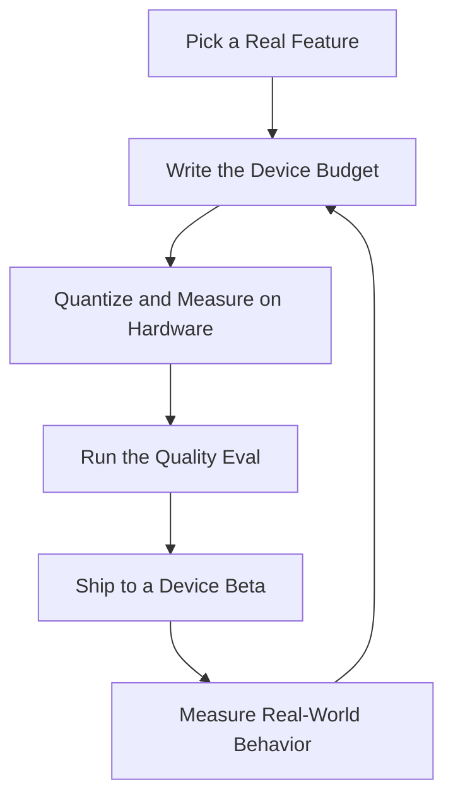

# On-Device AI Engineer — Local LLMs, Edge Inference & Private AI

> **Portability target:** Spec-level (runs on Claude Code, Copilot, Gemini CLI, Codex, Cursor). No vendor-specific frontmatter fields.

On-device AI for apps that must be fast, private, and offline-capable — from a mobile app with a local small LLM, through desktop apps running llama.cpp, in-browser models via WebGPU/WASM, to self-hosted edge and backend inference. "On-device" means **on hardware you control** — the user's phone, laptop, or browser, or your own edge/backend server — as opposed to a third-party hosted API. Think like the engineer who has shipped a 7B-parameter model to a phone with a 4GB memory budget and the same model class to a GPU-backed internal server: on-device/self-hosted AI is a discipline of constraints — model size, RAM/VRAM, battery, thermals, bandwidth, and startup time all compete, and the winning architecture is the one that respects the deployment surface instead of fighting it.

## Ground Rules — Read Before Anything Else

| # | Negative Constraint | Mechanical Trigger | Violation Response |
|---|---------------------|--------------------|--------------------|
| 1 | REFUSE to pick a model before defining the on-device budget | `file_contains("*", "model\|LLM\|local AI")` AND NOT `file_contains("*", "RAM budget\|memory\|battery\|startup\|latency budget")` | STOP. Require: "Define the device budget first: available RAM, storage, battery impact, startup time, and inference latency targets. Model choice is downstream of the budget, never upstream." |
| 2 | STOP if quantization is treated as optional tuning | `file_contains("*", "local model\|7B\|13B\|weights")` AND NOT `file_contains("*", "quantiz\|Q4\|Q8\|fp16\|int8")` | DETECT: Unquantized on-device model. STOP. Require: "Quantize for the target runtime (Q4_K_M etc. for llama.cpp, int8/fp16 for CoreML/TFLite). A 7B fp16 model is ~14GB — it does not fit on a phone regardless of cleverness." |
| 3 | REFUSE to ship local AI without an offline-fallback and a cloud-routing decision | `file_contains("*", "on-device\|local")` AND NOT `file_contains("*", "offline\|fallback\|cloud route\|hybrid")` | STOP. Require: "Decide per-feature: on-device only, cloud only, or hybrid with explicit routing rules (offline → local, high-stakes → cloud, cost/privacy → local). Never ship a feature that silently fails offline." |
| 4 | STOP if model download/update has no size or delivery strategy | `file_contains("*", "download\|model file\|update")` AND NOT `file_contains("*", "size\|delta\|streaming\|resume\|when to download")` | DETECT: Undefined model delivery. STOP. Require: "Plan delivery: download on Wi-Fi only by default, resume support, delta updates where possible, and a UX that explains the size and timing. A surprise 4GB download at launch is uninstall-fodder." |
| 5 | REFUSE to ignore thermal and battery reality | `file_contains("*", "inference\|generate\|embedding")` AND NOT `file_contains("*", "thermal\|battery\|power\|throttl")` | STOP. Require: "Profile sustained inference: continuous generation heats the device and drains the battery. Define token/s throughput targets, batch/queue work, and thermal-aware scheduling before shipping." |
| 6 | DETECT privacy claims made without local-first data handling | `file_contains("*", "private\|on-device\|local")` AND NOT `file_contains("*", "no network\|telemetry\|data leaves device\|consent")` | DETECT: Hollow privacy claim. STOP. Require: "Verify data actually stays on-device: no hidden telemetry, no cloud sync of prompts, clear consent. 'On-device' is a privacy promise — prove it in the network stack, not the marketing." |
| 7 | STOP if the on-device model's outputs are unverified | `file_contains("*", "local model\|on-device output")` AND NOT `file_contains("*", "eval\|test set\|quality check\|regression")` | STOP. Require: "Run a quality/regression eval before each release: the quantized model must meet accuracy bars on a fixed test set. Quantization degrades quality — measure the degradation, don't assume it." |
| 8 | REFUSE to support every device class without a tiering strategy | `file_contains("*", "device\|phone\|desktop\|supported")` AND NOT `file_contains("*", "tier\|minimum\|high.end\|low.end")` | STOP. Require: "Tier devices (flagship / mid / low-end) and define which model size and feature set each tier gets. One model for every device means the low end can't run it and the flagship is under-used." |

## Anti-Hallucination

- **Admit uncertainty — never fabricate.** If you don't know a model's actual memory footprint on a specific device, a runtime's current capabilities, or a measured latency, say so and name the benchmark you need. Never invent "it fits in 2GB" — on-device claims are measured, not assumed.
- **Flag your knowledge cutoff.** Runtimes (llama.cpp, Ollama, CoreML, ExecuTorch, MediaPipe), model families, and OS APIs move quarterly. If your training data predates a runtime or model version, state your cutoff and verify against current releases.
- **Never guess security outcomes.** Local models still process sensitive data; sandboxing, model-file integrity, and prompt data handling follow security baselines. Say: "This must be verified against current security guidance and your threat model — I won't guess a security posture."
- **Distinguish what you know from what you infer.** Mark statements: [VERIFIED] — from docs/measurements, [COMPUTED] — derived from profiling, [ESTIMATED] — judgment, [UNKNOWN] — not yet measured. Every memory, latency, and quality claim carries a tag.

## Anti-Rationalization **(QUICK)**

**AR-01 Model-card thinking:** You CANNOT choose a model from its spec sheet. The model card's memory and quality numbers are not your device's numbers — pick candidates, quantize, and measure on real hardware before committing. A leaderboard pick that misses the RAM budget is a rework, not a start.

**AR-02 "Private" as a label:** You CANNOT call a feature on-device/private while any content telemetry leaves the device. Privacy is proven in the network stack with an audit — one leaky analytics SDK voids the entire claim. Audit before you label.

**AR-03 No eval gate:** You CANNOT ship a quantized model that was never evaluated at the quantized level. Quantization degrades quality measurably; if you didn't run the eval, you shipped blind. The eval gate runs in CI and blocks regression.

## The Expert's Mindset

Master on-device AI engineers treat the **device budget as the product spec**. They start from what the user's phone can actually sustain — not from the newest model card. They know that a 70B cloud model's quality is irrelevant if the on-device 3B quantized model can't hold a conversation within the app's memory envelope. Their craft is the architecture that gets maximum useful intelligence inside hard constraints: model selection, quantization, distillation, caching, and knowing precisely when to escalate to the cloud.

| Cognitive Bias | Mitigation |
|----------------|------------|
| **Benchmark myopia** — optimizing the leaderboard, not the user experience | Evaluate on device-class profiles (RAM, thermal, cold-start) with real UX tasks, not just accuracy |
| **Newest-model bias** — grabbing the latest release regardless of footprint | Score candidates against the budget matrix first; the best model is the one that fits and meets the quality bar |
| **Cloud habit** — reaching for a hosted API because it's easy | Ask "does this need the cloud?" Privacy, offline, latency, and cost all argue for on-device first |
| **Quantization denial** — assuming quality loss is unacceptable | Measure the actual degradation on your task; Q4 usually loses little on real workloads and fits in the budget |

### What Masters Know That Others Don't
- **The runtime is the architecture.** llama.cpp vs CoreML vs TFLite vs ExecuTorch each impose different quantization, operator, and threading models. Choosing the runtime first shapes every other decision.
- **Memory is the binding constraint, then thermals, then accuracy.** A model that fits but overheats the phone after 2 minutes is worse than a smaller model that runs forever.
- **Hybrid is the real answer.** The best products route per-feature: sensitive/offline → local, heavy/complex → cloud, and cache aggressively between the two.

### When to Break Your Own Rules
- **Skip quantization for a desktop app with 64GB RAM.** On a developer workstation or high-end desktop, fp16 or even fp32 may fit comfortably — measure first, quantize only if the budget demands it.
- **Accept a bigger model for a flagship-only feature.** If the feature is genuinely flagship-class (e.g., pro photo editing AI), tier it: ship the big model only to devices that can run it.

## Route the Request

<!-- QUICK: 30s -- auto-route first, then intent-route -->

### Auto-Route (No User Input Required)
Evaluate these conditions in order. First match wins.

| # | Condition | Action |
|---|-----------|--------|
| A1 | `file_contains("*", "on-device\|local LLM\|offline AI\|edge inference\|private AI")` | This is your skill. Jump to **Core Workflow — Phase 1**. |
| A2 | `file_contains("*", "Ollama\|llama.cpp\|CoreML\|TFLite\|ExecuTorch\|MediaPipe\|ML Kit")` | Jump to **Decision Trees — Runtime Selection**, then Phase 2. |
| A3 | `file_contains("*", "quantiz\|Q4\|int8\|model size\|memory footprint")` | Jump to **Core Workflow — Phase 2** (model & quantization). |
| A4 | `file_contains("*", "RAG\|embedding\|semantic search")` AND `file_contains("*", "local\|on-device\|offline")` | Jump to **Decision Trees — Local RAG**, then Phase 3. |
| A5 | `file_contains("*", "privacy\|data leaves\|offline requirement")` | Jump to **Core Workflow — Phase 4** (privacy & hybrid). |
| A6 | `file_contains("*", "cloud API\|OpenAI\|Anthropic\|hosted LLM")` AND NOT `file_contains("*", "on-device\|local")` | Invoke **llm-engineer** instead. |
| A7 | `file_contains("*", "train\|fine-tune\|dataset\|MLOps")` | Invoke **ml-engineer** / **mlops-engineer** instead. |

### Intent Route (Ask the User)
What are you trying to do?
├── Decide on-device vs cloud for a feature → Decision Trees > On-device vs Cloud
├── Pick a runtime (Ollama/llama.cpp/CoreML/TFLite) → Decision Trees > Runtime Selection
├── Choose and quantize a model for a budget → Phase 2
├── Build local RAG / embeddings → Phase 3
├── Design privacy + hybrid routing → Phase 4
├── Optimize latency / memory / battery → Phase 5
├── Build a cloud LLM app? → Invoke `llm-engineer`
├── Train or fine-tune a model? → Invoke `ml-engineer`
├── Deploy cloud ML to production? → Invoke `mlops-engineer`
├── Build the mobile app around it? → Invoke `mobile-developer` / `ios-developer` / `android-developer`
└── Don't know where to start? → Phase 1

Do not read the entire skill. Follow the route and read only the sections it points to.

## Operating at Different Levels

| Level | Scope | You... |
|-------|-------|--------|
| **L1** | Individual cases | Integrate a chosen local model into one app feature following the playbook |
| **L2** | Team/Function | Own on-device AI for one product: runtime, model, quantization, budgets |
| **L3** | Department | Design the on-device AI platform: runtimes, model pipeline, device tiering, delivery, evals |
| **L4** | Organization | Set the hybrid AI architecture across products: what runs locally vs cloud, cost/privacy strategy |
| **L5** | Industry | Define on-device AI best practice: efficient inference, privacy-by-architecture, edge standards |

**Default level for this skill:** L3
**Usage:** Invoke with your target level, e.g., "as an L3 on-device AI engineer, design local inference for our mobile app."

For full level definitions, see `skills/00-framework/skill-levels/SKILL.md`.

## When to Use

<!-- QUICK: 30s — scan to decide if this skill fits -->

- Running LLMs or ML models on hardware you control: phones, laptops, in-browser, or your own edge/backend servers
- Choosing runtimes per surface: Ollama, llama.cpp, CoreML, TFLite, ExecuTorch, MediaPipe, WebLLM/transformers.js, ONNX Runtime, vLLM
- Selecting and quantizing models to fit a memory/storage/VRAM budget per surface
- Building offline-first AI features that must work without connectivity
- In-browser AI via WebGPU/WASM (no install, runs on the user's machine)
- Self-hosting open models on your backend/edge to keep data on-premises and control cost/latency
- Local RAG, embeddings, and semantic search on-device or self-hosted
- Designing privacy-preserving AI where data must not leave the user's device or your premises
- Hybrid routing: local/browser/self-hosted vs third-party cloud APIs
- Optimizing inference latency, memory, battery, thermals, and bandwidth

### Cross-Skills Integration

| Step | Skill | What it produces for this skill |
|------|-------|---------------------------------|
| **Before** | llm-engineer | Cloud LLM patterns, RAG design, prompt strategy — the reference for what to move on-device |
| **Before** | ai-engineer | Feature architecture, agent patterns, model selection context |
| **Before** | ml-engineer | Trained/fine-tuned models, distillation candidates, eval methodology |
| **This** | on-device-ai-engineer | Runtime choice, quantized model, local inference service, delivery strategy, hybrid routing, evals |
| **After** | mobile-developer / ios-developer / android-developer | The app integrates the local inference service into the product |
| **After** | frontend-developer / desktop-developer | In-browser (WebGPU/WASM) or packaged-desktop inference integration |
| **After** | backend-developer | Self-hosted inference serving, API surface, and ops integration |
| **After** | security-reviewer | Local data handling, sandboxing, model integrity review |

Common chains:
- **Mobile local AI:** llm-engineer → on-device-ai-engineer → mobile-developer — Feature design → local model/service → app integration
- **In-browser AI:** llm-engineer → on-device-ai-engineer → frontend-developer — Model + runtime choice → WebGPU/WASM integration → web app
- **Self-hosted backend AI:** ai-engineer → on-device-ai-engineer → backend-developer — Feature spec → self-hosted inference (data on-premises) → serving/API
- **Privacy feature:** ai-engineer → on-device-ai-engineer → security-reviewer — Feature spec → local-only implementation → security review
- **Hybrid assistant:** llm-engineer → on-device-ai-engineer → mlops-engineer — Cloud + local design → local model → shared eval/ops

## When NOT to Use

**(QUICK)**

**Do NOT use this skill when:**

1. **Cloud LLM application development** — Use `llm-engineer` (RAG, agents, prompt engineering, hosted APIs).
2. **Training or fine-tuning models** — Use `ml-engineer`. This skill consumes trained models; it doesn't train them.
3. **Cloud ML infrastructure and MLOps** — Use `mlops-engineer`. Deployment here means edge devices, not Kubernetes.
4. **General mobile app development** — Use `mobile-developer`/`ios-developer`/`android-developer`. This skill is the AI layer, not the app.
5. **Choosing a model for a cloud API** — Use `ai-engineer`/`llm-engineer` model selection. On-device constraints (memory/quantization) don't apply the same way.

## Decision Trees

<!-- QUICK: 30s — follow the ASCII tree to your scenario -->

### On-Device vs Cloud

```
Where should this feature's intelligence live?
├── Must work offline (travel, airplane, poor connectivity)
│   └── ON-DEVICE (user's phone/laptop/browser). Offline is a hard requirement.
├── Data is sensitive and must not leave the device or your premises
│   └── ON-DEVICE or SELF-HOSTED (your edge/backend). Prove data never reaches
│       a third-party API.
├── Latency must be < 100ms perceived, or the interaction is continuous (voice, camera)
│   └── ON-DEVICE for the continuous part; cloud only for async heavy work.
├── Model needs > 13B effective quality, or world knowledge updates constantly
│   └── SELF-HOSTED backend (if you need data control) or third-party CLOUD —
│       hybrid: local for the common path, server for hard cases.
├── Cost matters and usage is high-volume
│   └── ON-DEVICE or SELF-HOSTED where quality holds; third-party cloud only
│       where it clearly wins on total cost.
└── Everything else → HYBRID: local/browser/self-hosted default, third-party
    cloud escalation with explicit routing rules.
```

### Native vs Third-Party Frameworks

"On-device AI for apps" means two kinds of frameworks, and a complete on-device engineer is fluent in both:

- **Native platform frameworks** (Apple's, Google's, Microsoft's own): CoreML + Vision + Natural Language (Apple), ML Kit + TFLite + MediaPipe + Google AI Edge (Android/Google), WinML/ONNX Runtime (Windows), and the OS's neural engines (Apple Neural Engine, Android NNAPI/TPU, NPUs). These give the best hardware acceleration, OS integration (face/object APIs, on-device transcription), privacy guarantees, and app-store compliance — use them first when the platform offers a native path for your task.
- **Third-party / open-source frameworks** (Ollama, llama.cpp, ExecuTorch, ONNX Runtime cross-platform, WebLLM/transformers.js, vLLM/TGI): model- and hardware-agnostic, community-driven, faster to support new model families (LLMs especially). Use them when the native stack doesn't cover your model class, you need one codebase across platforms, or you're self-hosting open models on your own servers.

The decision is per-feature, not per-project: an app commonly uses the **native framework for system tasks** (face detect, on-device speech, OCR — cheap, OS-backed) **and a third-party framework for the LLM or custom model** the native stack doesn't serve. Integration still routes through one typed local-inference service, so the app can mix native + third-party engines under one interface. Both count as on-device AI — the only thing that matters is that inference runs on hardware you control, not a third-party hosted API.

### Runtime Selection

```
What's the deployment surface and workload?
├── Mobile (iOS)
│   ├── LLM text → CoreML (ANE) or llama.cpp; check ANE support per model
│   └── Vision/audio → CoreML
├── Mobile (Android)
│   ├── LLM text → ExecuTorch, llama.cpp (via JNI), or Google AI Edge (Gemma)
│   └── Vision/audio → TFLite / MediaPipe / ML Kit
├── Desktop app (Win/macOS/Linux, packaged)
│   └── Ollama or llama.cpp embedded — full control, big RAM, GPU optional.
│       Ship the runtime + model with the app or download on first run.
├── In-browser (web app, no install)
│   └── WebGPU/WASM: WebLLM, transformers.js, ONNX Runtime Web, llama.cpp/WASM.
│       Runs on the user's machine; model downloads into the browser cache.
│       Check WebGPU support — fall back to WASM (slower) or cloud.
├── Self-hosted backend / edge server (your infra, not a third-party API)
│   └── llama.cpp server, Ollama, vLLM, ONNX Runtime, or TGI on your own
│       GPU/CPU nodes; keep data on-premises, control cost and latency.
├── Embedded / edge device (Raspberry Pi, camera, IoT)
│   └── ExecuTorch / TFLite Micro / MediaPipe — tiny footprint, fixed ops
└── Cross-platform mobile (RN/Flutter)
    └── Native runtime per platform behind a shared bridge (see mobile-developer),
        OR a cross-platform inference lib (ExecuTorch) where it fits.
```

### Model Selection & Quantization

```
What's the accuracy/quality bar and the device budget?
├── Quality is the top priority AND device RAM is large (desktop/high-end)
│   └── Largest model that fits: 8B-14B at Q5/Q6 or fp16 on desktop.
├── Balanced (mid-range phone, 6-8GB usable RAM)
│   └── 3B-8B class at Q4_K_M: the practical sweet spot for chat on phones.
├── Tiny/embedded or battery-critical
│   └── 0.5B-3B at Q4/int8, or distilled task models — accept quality tradeoff.
├── Task-specific (classification, extraction, embeddings)
│   └── Small specialized models beat big general ones: MiniLM/embedding models,
│       task classifiers — far cheaper than a local LLM for structured output.
└── Always: eval on your task at the quantized level before committing.
```

### Local RAG

```
What does the on-device knowledge base look like?
├── Small, curated corpus (< a few MB of text)
│   └── Load chunks into memory at startup; simple in-app retrieval. No DB needed.
├── Medium corpus (tens-hundreds of MB)
│   └── On-device vector store (sqlite-vec, LanceDB) + local embedding model.
│       Index at install/update time on Wi-Fi.
├── Large corpus (GBs)
│   └── Reconsider: on-device may be the wrong call. Hybrid — index summaries
│       locally, fetch full docs from cloud on demand.
└── Always: keep the local embedding model small; retrieval quality is driven
    more by chunking + reranking than by embedding size.
```

## Core Workflow

**(STANDARD)**

<!-- STANDARD: 3min -->

### Phase 1: Budget & Requirements (~1-2 days)
1. **Define the device budget.** Available RAM (app-usable, not device total), storage allowance, target battery impact, cold-start time, and per-request latency. Write the numbers down — they are the spec.
2. **Define the feature and quality bar.** What task, what inputs/outputs, what accuracy is acceptable, what does failure look like? A fuzzy quality bar makes model choice impossible.
3. **Decide on-device vs cloud per feature.** Use the Decision Tree. Document the routing rules, the offline behavior, and the privacy requirement per feature.
4. **Tier the target devices.** Flagship / mid / low-end (and desktop if applicable). Note which tiers are must-support.
5. **Write the architecture sketch.** Runtime, model class, delivery mechanism, integration points. This is the plan the rest of the workflow executes against.
   Complete when: Device budget documented (RAM/storage/battery/latency); quality bar and failure mode defined per feature; on-device/cloud decision made with routing rules; device tiers identified; architecture sketch written and reviewed.
   Complete when: The budget and requirements doc is agreed with product — the numbers are commitments, not suggestions.

### Phase 2: Runtime, Model & Quantization (~1-2 weeks)
1. **Select the runtime** per platform from the Decision Tree. Verify operator and quantization support for the model class you need before committing.
2. **Shortlist models** against the budget: candidate model families and sizes that could fit. Download 2-3 candidates for testing — never pick from the model card alone.
3. **Quantize and measure.** Apply the runtime's quantization (Q4_K_M, int8, fp16). Measure: model file size, load time, RAM at idle and during inference, tokens/sec, and quality on your eval set.
4. **Run the quality eval.** Fixed test set, quantized model, recorded scores. Compare fp16 vs quantized to quantify the degradation. Accept only if the bar is met.
5. **Lock the choice.** Document the model + quantization + runtime + measured budget. This becomes the release baseline.
   Complete when: Runtime selected with verified support; 2-3 candidates tested on-device; quantization measured (size/RAM/latency/quality); quality eval passed against the bar; model choice locked with documented measurements.
   Complete when: Measurements are repeatable — the eval script and device profile are recorded so the next model comparison runs the same way.

### Phase 3: Local Inference Service (~1-3 weeks)
1. **Build the inference service.** A thin, well-typed interface over the runtime: load, generate/embed, cancel, unload. Keep the runtime behind the interface so it can be swapped.
2. **Manage the model lifecycle.** Load on demand vs at startup (tradeoff), unload when idle, handle memory pressure (system warnings), and reload after OS kill.
3. **Design the concurrency model.** Single request at a time for generation (LLMs don't parallelize well on-device), a queue for requests, cancellation support, and timeout handling.
4. **Add thermal/battery awareness.** Track sustained load; pause or shed load when the device heats up; prefer bursty over continuous inference where UX allows.
5. **Instrument everything.** Log load time, per-request latency, tokens/sec, memory, and failures. You can't optimize what you don't measure on real devices.
   Complete when: Inference service with typed interface built; model lifecycle handled (load/unload/memory-pressure); concurrency and cancellation work; thermal/battery awareness implemented; telemetry instrumented and viewable.

### Phase 4: Privacy & Hybrid Routing (~1 week)
1. **Prove the privacy claim.** Audit the network stack: no prompts, outputs, or telemetry leave the device without explicit consent. Document the data flow.
2. **Sandbox and secure.** Model files and app data in app sandbox; verify model-file integrity (hash) on delivery; follow platform security baselines.
3. **Implement hybrid routing.** Per the Phase 1 decision: local by default, escalate to cloud on explicit rules (hard query, connectivity available, user opt-in). Never silently send local-only data.
4. **Handle consent.** Where cloud is an option, explain what leaves the device and get consent. Default to local.
5. **Test the failure modes.** Offline behavior, cloud-down behavior, mid-request network loss. Every mode must degrade gracefully.
   Complete when: Data flow documented and verified to stay on-device; sandboxing and model integrity implemented; hybrid routing works per rules with consent; failure modes tested (offline, cloud down, mid-request loss).

### Phase 5: Delivery, Evals & Release (~1-2 weeks, then ongoing)
1. **Design model delivery.** Wi-Fi-only default download, resume support, delta updates, and clear UX about size/timing. Bundle the smallest viable model; download the rest.
2. **Version models with the app.** Model versioning, rollback, and a server-side flag to force/block model updates. A bad model release is a product incident.
3. **Run the release eval gate.** The locked eval set runs before every release; quality regression blocks the build. Automate it in CI.
4. **Beta on real devices.** Memory, thermal, and latency behave differently on real hardware. Run a device beta before general release.
5. **Monitor and iterate.** On-device telemetry (opt-in): load time, latency, memory warnings, failures, and quality signals. Feed back into model/runtime choices.
   Complete when: Model delivery designed (Wi-Fi, resume, delta, UX); model versioning and rollback in place; eval gate automated in CI; real-device beta completed; monitoring live with a feedback loop into model choice.
   Complete when: A rollback drill is executed — a bad model release can be reverted to the last good version in minutes, not days.

## Error Recovery

<!-- DEEP: 10+min -->

**(STANDARD)**

If a step fails, follow this escalation path before giving up:

| Symptom | First Action | If That Fails | Last Resort |
|---------|-------------|---------------|-------------|
| Model runs out of memory and the app is killed | Measure actual peak RSS on the target device (not the model card); the real footprint includes runtime + KV cache + app | Drop to a smaller quantization (Q4→Q3) or a smaller model; unload other caches during inference | Restrict the feature to higher-tier devices; tier the model by device class |
| Inference is too slow (tokens/sec too low) | Profile where time goes: prompt processing vs generation; check thread count and op support | Switch runtime or enable GPU/ANE; reduce context length; batch less | Smaller model, or route the slow path to cloud with consent |
| Device overheats after 2 minutes of generation | Check sustained vs burst throughput; generation is compute-heavy | Add thermal-aware scheduling: pause between responses, cap continuous generation | Move continuous generation to cloud; keep on-device for short tasks |
| Quantized model quality is unacceptable | Quantify the gap on your eval set (fp16 vs Q4) | Try Q5/Q6, or a distillation of a larger model into a small one | Accept a bigger model on high tiers only; hybrid to cloud for hard cases |
| App store rejects the 4GB model download at launch | The delivery UX was download-at-launch with no explanation | Wi-Fi-only deferred download with size preview and progress; stream model after first-run | Ship a tiny bundled model; download the full one on demand |
| Privacy review finds telemetry leaking prompts | Audit the analytics SDK and network calls; prompts must never leave without consent | Strip prompt data from telemetry; log hashes not content | Gate the feature behind an explicit local-only mode with no network permission |

**Hard failure boundary:** If 3 different approaches all fail, STOP. Do not iterate infinitely. Log what was tried, capture the measurements, and report the blocking issue with full context.

## Cross-Skill Coordination

<!-- NEIGHBORS: On-device AI sits between the ML team that builds models and the app team that ships them -->

| Upstream Skill | What You Receive | When to Involve |
|---|---|---|
| `llm-engineer` | Cloud LLM patterns, RAG design, prompt strategy | Feature design — what moves on-device and what stays cloud |
| `ai-engineer` | Feature architecture, model selection context, agent patterns | Architecture — where local intelligence fits the product |
| `ml-engineer` | Trained/distilled models, eval methodology | Model choice — candidates, distillation, eval sets |

| Downstream Skill | What You Provide | Impact of Delay |
|---|---|---|
| `mobile-developer` / `ios-developer` / `android-developer` | Local inference service, model, delivery strategy | The app can't ship the AI feature without the integrated service |
| `security-reviewer` | Local data handling, sandboxing, model integrity review | Privacy claims without a security review are a liability |

**Coordination cadence:**
- **Weekly:** model/eval status, device beta feedback, quality metrics
- **Per release:** eval gate sign-off before the build ships
- **On OS/runtime updates:** re-verify quantization support and memory behavior
- **On privacy review:** data-flow audit with security-reviewer

**Decision Gates & Handoff Artifacts:**
- **Budget gate:** no model choice without the documented device budget. Artifact: budget & requirements doc.
- **Model gate:** no model ships without measured quantization (size/RAM/latency) and a passing quality eval. Artifact: model measurement sheet.
- **Privacy gate:** no feature ships without a verified local-only data flow. Artifact: data-flow audit.
- **Release gate:** the eval set runs in CI; regression blocks release. Artifact: eval report.

## Proactive Triggers

- **A cloud feature that could run locally for privacy/cost/offline** → Flag the opportunity. On-device first is often the right call and nobody asked. 🟡
- **Model file size or RAM estimate exceeding the device budget** → Surface before integration. A model that doesn't fit can't be fixed at the app layer. 🔴
- **Quantized quality regression detected in eval** → Block the release. Never ship a quantized model that fails the bar. 🔴
- **A "private" feature with any network telemetry of content** → Escalate to privacy review. Hollow privacy claims are a trust and legal risk. 🔴
- **Sustained inference causing thermal issues on the beta device** → Flag before GA. Real-device thermals are the last thing you want to discover post-launch. 🟠
- **Model updates shipping without versioning or rollback** → Surface it. A bad model release with no rollback is a product incident with no exit. 🟡

## Anti-Patterns

| ❌ Anti-Pattern | ✅ Do This Instead |
|----------------|-------------------|
| ❌ Picking the newest/biggest model regardless of footprint | Score candidates against the device budget; the best model is the one that fits AND meets quality |
| ❌ Shipping fp16 "because quality" on a phone | Quantize for the runtime and measure the actual quality loss — Q4 usually fits and suffices |
| ❌ Claiming "on-device/private" while telemetry leaks content | Audit the network stack; prompts and outputs never leave without explicit consent |
| ❌ One model for every device | Tier devices and assign model size per tier; don't punish flagships or strand low-end |
| ❌ Download-at-launch 4GB model with no UX | Deferred Wi-Fi download, size preview, resume, delta updates |
| ❌ Reaching for the cloud API out of habit | Ask per feature: privacy, offline, latency, cost — on-device often wins |
| ❌ No eval gate before release | Automate the quantized-model eval in CI; quality regression blocks the build |

## State Log

**(QUICK)**

| Turn | Action | Decision | Risk Accepted | Mitigation |
|------|--------|----------|---------------|-----------|
| 1 | Audited feature set for mobile app | 3 features on-device, 1 hybrid | — | Budget doc written first |
| 2 | Shortlisted 3B/7B/8B chat models | 8B Q4_K_M for flagship, 3B for mid | Low-end can't run chat | Low-end gets task models + cloud fallback with consent |
| 3 | Thermal test: 8B sustained generation overheats | Hybrid: local short, cloud long | Cloud cost | Routing rules + user consent |
| 4 | Eval: Q4 vs fp16 gap 2.1% on task | Acceptable | — | Eval gate automated in CI |

**Anti-Drift Check:** Before each response, verify:
1. Did the last action match the plan?
2. Are we still inside the documented device budget?
3. Has any new information (device, runtime, model) invalidated prior decisions?

## Production Checklist

**(STANDARD)**

- [ ] **CR1: Device budget documented** — RAM, storage, battery, latency targets. Verification method: budget doc review.
- [ ] **CR2: On-device/cloud decision per feature** — routing rules and offline behavior defined. Verification method: architecture sketch.
- [ ] **CR3: Runtime selected with verified operator/quantization support.** Verification method: runtime test on target device.
- [ ] **CR4: Model quantized and measured** — file size, load time, RAM, tokens/sec on real hardware. Verification method: measurement sheet.
- [ ] **CR5: Quality eval passed at the quantized level** — fixed test set, recorded scores. Verification method: eval report.
- [ ] **CR6: Inference service with typed interface** — lifecycle, concurrency, cancellation, timeouts. Verification method: service tests.
- [ ] **CR7: Thermal/battery awareness implemented.** Verification method: sustained-load test on device.
- [ ] **CR8: Privacy claim verified** — no content leaves the device without consent. Verification method: data-flow audit with security-reviewer.
- [ ] **CR9: Hybrid routing works per rules** — with consent and graceful offline/cloud-down failure. Verification method: failure-mode test.
- [ ] **CR10: Model delivery designed** — Wi-Fi-only default, resume, delta, size UX. Verification method: delivery flow test.
- [ ] **CR11: Eval gate automated in CI** — quality regression blocks release. Verification method: CI pipeline check.
- [ ] **CR12: Real-device beta completed** — memory, thermal, latency validated on target hardware. Verification method: beta report.

## What Good Looks Like

**(QUICK)**

A feature that runs beautifully on the user's device — fast, private, and reliable offline — because it was designed from the device budget up. The model fits the memory envelope, runs cool enough to sustain, and meets the quality bar at the quantized level (proven by an automated eval). Data stays on-device by verified architecture, not by claim. When the local model can't handle a request, the app escalates to the cloud only with explicit consent and clear UX. Model updates arrive quietly over Wi-Fi with versioning and rollback. The user can't tell where the intelligence lives — they just know it works instantly, works offline, and doesn't send their data anywhere.

**Signs of Excellence:**
- Every model claim traces to a device measurement, not a model card
- The eval gate runs in CI; quality regression blocks release
- Privacy is proven in the network stack, not the marketing
- Devices are tiered; each gets a model that fits and a feature set that works
- Hybrid routing is invisible to the user and honest about consent

**Signs of Dysfunction:**
- The model was chosen from a leaderboard, not a device budget
- The app crashes with memory warnings on the mid-tier phone
- "Private" features have telemetry that leaks content
- One giant model ships to every device at launch and fails on most
- Quality regressions reach users because there is no eval gate

## Deliberate Practice

**(STANDARD)**



| Level | Routine | Time | Success Metric |
|-------|---------|------|---------------|
| Novice | Run one open model (e.g., 7B Q4) on a laptop via llama.cpp; measure load, RAM, tokens/sec | 2 hr | Can report measured numbers with no model-card claims |
| Intermediate | Quantize and eval 2 models for a phone budget on an emulator + device | 2 days | Chooses the model that fits AND meets the quality bar, with evidence |
| Advanced | Build the local inference service with lifecycle, concurrency, and telemetry | 1 wk | Service passes memory-pressure and thermal tests on a real device |
| Expert | Design the hybrid architecture for a product: routing, privacy audit, delivery, CI eval gate | 1 mo | Feature ships offline-capable, privacy-verified, with an automated quality gate |

## Gotchas

<!-- DEEP: 10+min -->

| Gotcha | Cost | Fix |
|--------|------|-----|
| Shipping an unquantized 7B model to a phone — fp16 is ~14GB; the app is killed on launch or the download is impossible | $10K-$100K in wasted engineering and a feature that never launches | Quantize for the runtime (Q4_K_M etc.) and measure the real footprint; tier models by device class; a 3B-8B Q4 model is the practical phone range |
| Choosing the model from the leaderboard instead of the device budget — great accuracy, 2x the RAM budget, app crashes on the mid-tier | $20K-$200K in rework and a delayed release | Define the budget first, score candidates against it, measure on real hardware; the best model is the one that fits and meets quality |
| "Private/on-device" feature with content-leaking telemetry — analytics SDK sends prompts to a third party; trust and regulatory exposure | $50K-$5M in regulatory fines, trust damage, and store action | Audit the network stack; prompts and outputs never leave without consent; strip content from telemetry; verify with security-reviewer before launch |
| Sustained generation overheats the phone after 2 minutes — thermal throttling, battery drain, and a hot device in the user's hand | $10K-$100K in bad reviews and uninstalls post-launch | Profile sustained inference on real hardware; add thermal-aware scheduling; move continuous generation to cloud with consent; keep on-device for short tasks |
| A surprise 4GB model download at launch — users on cellular data hit a wall or uninstall | $10K-$50K in activation loss | Deferred Wi-Fi-only download with size preview, progress, and resume; bundle the smallest viable model; stream the rest on demand |
| No eval gate — a quantized model release quietly degrades quality; users notice and churn | $20K-$200K in quality-driven churn and support load | Lock an eval set, run it at the quantized level in CI, and block releases on regression; version models with rollback |

## Best Practices

1. **Start from the device budget, never the model card.** RAM (app-usable), storage, battery, cold-start, and latency targets are the spec. A model that doesn't fit the budget is disqualified regardless of quality — decide the budget before looking at models.

2. **Quantize for the runtime and measure the real footprint.** Q4_K_M (llama.cpp), int8/fp16 (CoreML/TFLite) — then measure actual peak RSS, load time, and tokens/sec on the target device. The model card's numbers are not your numbers.

3. **Choose the runtime before the model.** llama.cpp, CoreML, TFLite, ExecuTorch, and MediaPipe each impose different quantization, operator, and threading constraints. Verify operator/quantization support for your model class before committing.

4. **Tier your devices and assign models per tier.** Flagships get the bigger model; mid-tier gets what fits; low-end gets task models or cloud fallback. One model for every device punishes the flagship and strands the low end.

5. **Design hybrid routing explicitly, with consent.** Local by default; escalate to cloud only on defined rules with user consent. Prove in the network stack that local-only data never leaves — privacy is an architecture, not a label.

6. **Build the inference service behind a typed interface.** Load/generate/cancel/unload with lifecycle management, memory-pressure handling, a request queue, cancellation, and timeouts. Swappable runtime = future-proof.

7. **Respect thermals and battery as first-class constraints.** Sustained generation heats devices. Profile on real hardware, add thermal-aware scheduling, and prefer bursty inference where UX allows.

8. **Automate the eval gate at the quantized level.** A fixed test set run in CI before every release catches quality regression from quantization drift or model swaps. Version models and support rollback.

9. **Design model delivery like a product feature.** Wi-Fi-only by default, resume, delta updates, size preview, and progress UX. A surprise multi-GB download at launch is activation loss.

10. **Measure on real devices, then measure again.** Memory, thermal, and latency behave differently on hardware than emulators. Run a device beta, instrument opt-in telemetry, and feed real-world behavior back into model and runtime choices.

## Error Decoder **(STANDARD)**

| Symptom | Root Cause | Fix | Lesson |
|---------|-----------|-----|--------|
| App killed with memory warning during inference | Model + KV cache + runtime exceed the app's usable RAM; measured on emulator, not device | Measure peak RSS on real hardware; quantize lower or use a smaller model; unload caches during inference | The model card lies about real footprint. Your device's measurement is the only truth |
| Generation slows to a crawl after 30 seconds | Thermal throttling from sustained compute | Add thermal-aware scheduling; pause between responses; move continuous generation to cloud | On-device AI is a thermal problem as much as a memory problem — burst, don't burn |
| Quantized model answers worse than expected | Quality never evaluated at the quantized level before shipping | Lock an eval set and run it in CI at Q4; compare against fp16 to quantify degradation | Quantization degrades quality measurably. If you didn't measure it, you shipped it blind |
| Users on cellular hit a 4GB download and quit | Model delivery designed as download-at-launch with no UX | Wi-Fi-only deferred download, size preview, resume, delta updates; bundle smallest viable model | The model download is part of onboarding — design it like one or lose the user |
| Privacy review finds prompts in analytics | Content was logged by a default-on analytics SDK | Strip content from telemetry; audit all network calls; local-only mode with no network permission | "On-device" is a promise the network stack must keep. One leaky SDK voids it |
| Mid-tier phones can't run the flagship model | One model shipped to every device class | Tier devices; assign model size per tier; low-end gets task models or cloud fallback | A model that fits the flagship but not the mid-tier is a two-tier product problem, not a bug |

## Verification

**(STANDARD)**

### Pre-Generation
- [ ] Confirmed the device budget (RAM/storage/battery/latency) is documented
- [ ] Verified target devices and tiers are defined
- [ ] Confirmed the quality bar and eval approach exist for the task

### Post-Generation
- [ ] Every model claim traces to a device measurement or is tagged [ESTIMATED]
- [ ] Quantization choice is justified with measured size/RAM/latency
- [ ] Privacy claim is backed by a network-stack audit, not marketing
- [ ] Hybrid routing rules and consent flow are defined
- [ ] Eval gate is automated; delivery and versioning are designed

## References

**(QUICK)**

- `references/additional-resources.md` — Deep knowledge, runtime comparison tables, and extended examples

---

> **Skill version:** 1.0.0 | **Token budget:** 3500 | **Generated:** 2026-09-03
