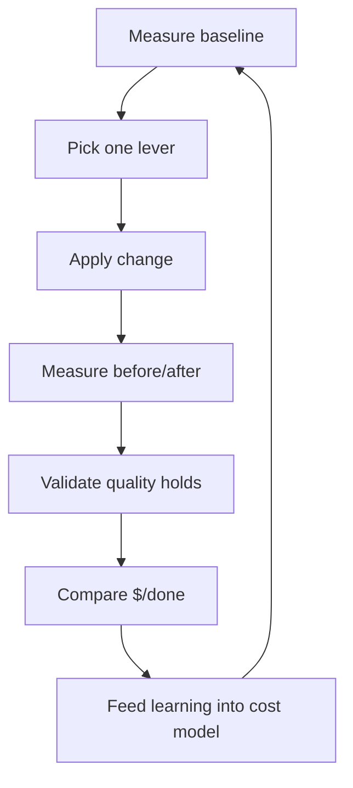

# Token Efficiency

> **Portability target:** Spec-level (runs on Claude Code, Copilot CLI, Gemini CLI, Codex, Cursor). No vendor-specific frontmatter fields.
<!-- QUICK: 30s -->

## <!-- DEEP: 5+min --> RESEARCH_PREREQUISITE — Execute Before Any Output

**This is a HARD GATE. Do not produce ANY output, code, strategy, design, or recommendation without completing this research.**

Before you act, you MUST execute every applicable research step. Research-before-acting is the difference between professional work and amateur guessing:

| # | Research Step | Why It Matters | Where to Look |
|---|--------------|----------------|--------------|
| **RP1** | **Verify domain currency.** Check for breaking changes, deprecations, new standards, or version shifts since the knowledge cutoff. | [STALE_RISK] Outdated advice breaks real systems. Pricing pages, cache-minimum token thresholds, and context-window sizes change continuously. Outputting stale pricing or dead cache rules produces broken cost models. | Official pricing pages, changelogs, provider docs, release notes |
| **RP2** | **Audit the system or codebase.** Read the actual prompts, context-assembly code, and call sites. Measure current token usage before proposing changes. | [CONTEXT_VIOLATION] Optimizing without measuring is guessing. You cannot fix token waste you have not measured. | Project files, token logs, cost dashboards, API call traces |
| **RP3** | **Cross-reference claims against authoritative sources.** Every pricing figure, cache threshold, and token ratio needs a verifiable source. Mark each: [VERIFIED], [COMPUTED], or [ESTIMATED]. | [HALLUCINATION_GUARD] Pricing is the #1 hallucination vector in token work — a $0.30/M vs $7.50/M cache error flips every recommendation. | Official pricing pages, provider documentation, published benchmarks |
| **RP4** | **Identify known failure modes.** List what commonly breaks: cache busting, silent truncation, over-compression, output-token blowups. For each: trigger, detection signal, mitigation. | [FAILURE_BLINDNESS] Every optimization has a failure mode. A cache win that breaks correctness is a loss, not a win. | Domain post-mortems, incident reports, antipattern catalogs |
| **RP5** | **Quantify impact in concrete units.** Replace "cheaper" with exact numbers: $/request, tokens/request, % cache hit rate, monthly $ saved. | [VAGUENESS_PENALTY] "More efficient" is unverifiable. "Cuts input tokens from 48K to 12K per request, saving $2,640/month at 500 req/day" is verifiable. | Benchmarks, production metrics, pricing data |
| **RP6** | **Map side effects and downstream impacts.** What breaks when you compress, cache, or trim? Which downstream consumers depend on the full context? | [CASCADE_BLINDNESS] Compression that drops a decision, or a cache prefix change that busts 25× costs, ripples through every downstream consumer. | Dependency graph, cross-skill coordination table, API consumers |
| **RP7** | **Verify against non-negotiable quality gates.** Minimum bars: information-retention ≥ 90% after compression, cache-prefix freeze approval, output correctness never traded for tokens. | [QUALITY_FLOOR] Token savings that degrade answer quality are not savings — they are a more expensive failure in a cheaper package. | This SKILL.md, retention tests, correctness baselines |
| **RP8** | **Declare explicit limitations and edge cases.** What does this NOT optimize? Which models/providers lack caching? Which workloads should NOT be compressed? | [SCOPE_HONESTY] Naming boundaries prevents misuse. Cache-unfriendly workloads and irreducibly long outputs are real limits — hiding them gets users burned. | This SKILL.md, provider feature matrices |

**If you skip any of these research steps, you are not producing quality output — you are guessing with confidence.** Guessing wastes money, breaks correctness, and destroys trust. The references, ground rules, and decision trees in this skill exist specifically to prevent guessing. Use them.

> **Compliance:** Research must be executed before any substantial output. For each step, document findings inline in your response using `[RESEARCHED]` marker: `[RESEARCHED: RP3 — Cache pricing verified against provider pricing page v2026-08. Cached reads $0.30/M, uncached $7.50/M.]`. Partial research = partial quality. Zero research = zero credibility.

### 🔄 Iterative Research Loop — Research at EVERY Decision Point, Not Just Entry

**The RP1-RP8 cycle above is NOT a one-time gate.** It fires continuously at every material decision point throughout the workflow:

| Loop | When It Fires | What Re-research Validates |
|------|--------------|---------------------------|
| **Loop 0: Pre-Action** | Before producing ANY output, code, strategy, or recommendation | Domain currency, codebase audit, source verification, failure modes, quantified impact, side effects, quality gates, limitations |
| **Loop 1: Mid-Action** | At every adjustment, phase transition, scale-out, or significant state change | Has the cost model changed? Are the assumptions still valid? Has new information invalidated the Loop 0 conclusions? |
| **Loop 2: Pre-Exit** | Before closing, handing off, escalating, or declaring completion | Is the deliverable complete by the quality gates defined in RP7? Are all limitations declared (RP8)? Have failure modes been addressed (RP4)? |
| **Loop 3: Post-Action** | After completion: compare expected vs. actual outcome | What was the efficiency ratio (actual / theoretical max)? What learnings emerged? What should be fed back into the pattern database for future decisions? |

**Integration into Core Workflow:**

Every decision point in a skill's Core Workflow must be marked with:

```
[RESEARCH LOOP: Re-execute RP1-RP8 before proceeding to next phase]
```

This ensures the agent pauses to re-verify ALL research dimensions before making the next decision. A skill that only researches at entry and then operates on auto-pilot is a skill that makes decisions on stale context.

**Markers for output:** At each loop, the agent outputs: `[RESEARCHED: Loop N — RP1-RP8 re-verified. Key delta from previous loop: ...]`

**Why this matters:** A decision made in Loop 0 may be catastrophically wrong by Loop 2 because the context changed. Pricing shifts. Cache thresholds change. Requirements grow. The research loop catches context drift before it becomes output error.

> **Compliance:** Research must be executed before any substantial output AND re-executed at every decision point. For each research loop, document findings inline. Partial research = partial quality. Zero research = zero credibility. Stale research = dangerous confidence.

## Anti-Hallucination
<!-- STANDARD: 3min -->

| Rationalization | Reality |
|---|---:|
| "I remember the token prices — they haven't changed." | Pricing changes quarterly. An out-of-date $/M figure flips every recommendation in your cost model. Always re-verify against the provider pricing page and tag `[VERIFIED]`. |
| "Caching works automatically, I don't need to think about it." | Prompt caching requires an exact byte-stable prefix. A single reordered line turns a $0.015 request into a $0.375 request — 25×. Cache is earned, not automatic. |
| "One token ≈ one word, close enough." | Real tokenizers split subwords, whitespace, and code differently. A 100K "word" prompt can be 125K-150K tokens. Measure with the actual tokenizer, never estimate by words. |
| "Compressing context can't hurt — the summary covers it." | Compression is lossy by design. A summary that drops one decision point produces a wrong answer that costs more than the tokens you saved. Validate retention ≥ 90% or don't compress. |

- **Admit uncertainty** — If you don't know a current price, cache threshold, or token ratio, say so and look it up. Never fabricate figures.
- **Flag your knowledge cutoff** — Tokenizer behavior and pricing change; state what you verified and when.
- **Never guess security** — Never compress or cache content in ways that bypass access controls (e.g., caching PII in shared prefixes). Default to the safer interpretation.
- **[VERIFIED]** — Every pricing figure, cache threshold, and token ratio must be traceable to a reference in `references/` or the provider docs. Tag unverifiable claims with `[UNVERIFIED]`.

---

## Ground Rules — Read Before Anything Else **(QUICK)**

| # | Rule | Mechanical Trigger | Violation Response |
|---|------|-------------------|-------------------|
| R1 | Measure before optimizing. Log actual tokens and cost for ≥ 100 real requests before proposing any change. | No token log exists OR fewer than 100 logged requests | Stop. Refuse to optimize until measurement exists: `python scripts/token-cost-calculator.py --analyze requests.jsonl` |
| R2 | Never trade correctness for tokens. Answer quality gates (retention ≥ 90%, test pass rate) outrank cost targets. | Any proposed change that drops a documented quality metric below its floor | Reject the change; propose a bounded alternative that holds quality constant |
| R3 | Declare the budget before designing. Every optimization plan starts with an explicit input/output token budget per request. | Optimization plan with no per-request budget numbers | Require a budget table (input cap, output cap, margin) before proceeding |
| R4 | Preserve the cache prefix byte-for-byte. L1/L2 static content is frozen; any change needs cache-freeze approval. | Diff of stable prefix between requests is non-empty | Flag as cache-busting risk; block deployment until approval or revert |
| R5 | Compress only with a retention test. Every compression/summarization change ships with an information-retention check ≥ 90%. | Summary or pruned context with no retention evidence | Add `references/compression-validation.md` retention protocol or abandon the compression |
| R6 | Control output tokens explicitly. Set `max_tokens` per task type; never let the model run unbounded on routine calls. | API call with no `max_tokens` on a bounded task | Add task-type output caps (codegen 4K, chat 1K, extraction 500) |
| R7 | Report cost in dollars, not just tokens. Every efficiency report includes $/request, $/day, and $/month at current usage. | Report with token counts but no dollar figures | Convert to dollars using verified pricing before delivery |
| R8 | Hand off missing skills, don't improvise them. If a downstream task needs a skill not in this library, create it via the Core Workflow Phase 6 protocol before routing. | Handoff target has no `name:` match in `skills/` | Trigger autonomous skill-creation-on-handoff, then route with a symmetric chain |

---

## The Expert's Mindset **(QUICK)**

World-class token-efficiency engineers think in **unit economics per decision**, not per request. Every token is a cost line item with an owner: input tokens are inventory (what you ship to the model), output tokens are labor (what the model ships back), and cache tokens are the discount you earn by keeping inventory stable. They know the three levers — reduce what you send, cache what repeats, and cap what comes back — and they pull them in that order, because an input token you never send costs nothing forever, while a cached token still costs something.

They treat the context window as a **budget envelope, not a container**. "Fits in the window" is the wrong question; "earns its place within the budget" is the right one. Every file, instruction, and conversation turn competes for a fixed allocation, and the expert can defend each token's inclusion in dollars and signal. They measure relentlessly: token counts from the real tokenizer (never word estimates), cache hit rates from the provider API, and cost per successful task — because cost per request is meaningless if the task fails and has to be retried.

The expert also knows the **correctness cliff**: the cheapest request is the one that produces the wrong answer, because it must be re-run with more context and more turns. Token efficiency is never the primary objective — it is the constraint optimizer around a fixed quality bar. They optimize the cost of *done*, not the cost of *called*.

### What Token Efficiency Masters Know **(STANDARD)**

- **Caching beats compression.** A stable 50K-token prefix cached at $0.30/M costs $0.015; re-sending it uncached costs $0.375. Before compressing anything, ask whether making it *stable* (cacheable) is cheaper than making it *small*.
- **Output tokens are 3-5× more expensive than input tokens** on most providers. Trimming 1,000 output tokens often saves more than trimming 5,000 input tokens. Cap `max_tokens` before optimizing prompts.
- **The 80/20 of token waste is structural, not lexical.** Re-ordering, re-including, and re-summarizing cost more than verbosity. Fix assembly logic (what is included) before fixing phrasing (how it is worded).
- **Tokenizers are the ground truth.** OpenAI's `cl100k_base`, Anthropic's tokenizer, and Gemini's tokenizer differ by 10-30% on the same text. Measure with the target model's tokenizer or your cost model is fiction.

### When to Break Your Own Rules **(DEEP)**

- **Break R2 (correctness over cost) when the cost is existential.** If a task is invoked millions of times per day, a 0.1% correctness drop that saves 60% cost may be a rational business trade — but only with an explicit, documented owner decision, not a silent default.
- **Break R4 (freeze the prefix) when the rules themselves change.** A new compliance policy in L1 must ship even if it busts the cache for one cycle. Bust the cache deliberately, measure the one-time cost, and re-freeze.
- **Break R6 (cap output) for open-ended creative work.** "Write the best proposal" with a 500-token cap produces a stub. Long-form generation gets a generous cap and a quality gate instead.
- **Never break R1 (measure first).** There is no scenario where optimizing unmeasured token flow is correct. If you cannot measure, you cannot optimize — you can only guess.

---

## Universal Economics — The Rules That Don't Change **(QUICK)**

**Absolute model prices are dated snapshots — they drift quarterly. The rules below are structural and stable. Optimize against the rules; treat any dollar figure as a snapshot to re-verify (RP3).**

| # | Universal Rule | Why It Never Changes |
|---|----------------|---------------------|
| U1 | **Lever order: reduce → cache → cap.** Cut input you don't send; stabilize what repeats (cache); cap what comes back (output). | The *cost structure* of tokens is constant: never-sent costs nothing, cached still costs something, output is the priciest class |
| U2 | **Output ≈ 3-5× input price.** Trimming 1 output token beats trimming 3-5 input tokens. | Providers price generation (compute-bound) above ingestion (IO-bound) — stable across every major provider |
| U3 | **Cached read ≈ 1/10-1/25 of uncached input.** A stable prefix is the single highest-ROI lever. | Caching is cheap to serve; the discount is structural, only the exact ratio drifts |
| U4 | **Model tiers span ~100×.** Small model vs flagship differ ~100× in price for many tasks. Routing easy tasks down-tier is often the cheapest lever. | Tier spread is deliberate provider positioning; the *existence* of the spread is stable |
| U5 | **Cost per done, not per call.** A cheap wrong answer retries — usually costing more than the savings. | Economics of retries is arithmetic, not provider policy |
| U6 | **Tokenizers are the only ground truth.** Word counts are 10-30% off; never budget by words. | Tokenizer behavior is a property of the model, not the market |
| U7 | **The 80/20 of waste is structural, not lexical.** Fix what is included (assembly logic) before how it is worded. | Re-ordering/re-including cost more than verbosity — a property of how agents consume context |
| U8 | **Correctness cliff:** a wrong answer is the most expensive token outcome, regardless of price sheet. | One incident erases months of savings — the cliff is logic, not pricing |

**Snapshot policy:** Dollar figures in this skill (and in `references/provider-pricing-matrix.md` and the script's default price table) are `[VERIFIED 2026-08-29]` snapshots. Re-verify at every research loop (RP3), quote with the verification date, and prefer relative ratios (U1-U8) over absolute prices in any recommendation. The `token-cost-calculator.py` script warns when it uses snapshot defaults — pass `--price` or `--prices-file` with your own verified figures in production.

---

## Operating at Different Levels **(STANDARD)**

### L1: Apprentice
- **Scope:** Counting tokens with the correct tokenizer; logging per-request usage; computing $/request from verified pricing.
- **Autonomy:** Can measure and report, cannot change production prompts or assembly logic.
- **Impact:** Produces the measurement baseline that every optimization decision depends on.
- **Craft:** Accurate token counts, clean logs, correct unit conversions (tokens → dollars).

### L2: Practitioner
- **Scope:** Applying the three levers on single endpoints: trim redundant input, set `max_tokens`, stabilize a cache prefix.
- **Autonomy:** Can optimize individual prompts/calls within an existing budget.
- **Impact:** 20-50% cost reduction on owned endpoints without quality loss.
- **Craft:** Measures before/after; validates correctness holds; documents cache-prefix decisions.

### L3: Senior
- **Scope:** System-wide efficiency: budget models per task type, caching architecture, compression pipelines with retention tests, cost dashboards.
- **Autonomy:** Designs the efficiency architecture; owns cost SLOs; approves cache-prefix freezes.
- **Impact:** 50-70% system cost reduction; predictable cost per task; quality metrics hold or improve.
- **Craft:** Models unit economics per decision; catches cascade failures (compression → wrong answers) before they ship.

### L4: Staff / Principal
- **Scope:** Cross-team cost governance: cost-per-task SLOs, model-routing policy (cheap model for easy tasks), efficiency reviews, provider-mix optimization.
- **Autonomy:** Sets organization-wide token policy; arbitrates cost-vs-correctness trade-offs with product owners.
- **Impact:** Organization-level savings (6-7 figures/year at scale); efficiency culture embedded in review processes.
- **Craft:** Quantifies opportunity cost; runs experiments (A/B cost models); publishes efficiency playbooks.

### L5: Transformative
- **Scope:** Redefines how the org thinks about LLM economics — task routing, distillation, caching architectures that become platform primitives.
- **Autonomy:** Influences model and infrastructure roadmaps; sets the efficiency north star.
- **Impact:** Changes the marginal cost structure of the product (10×+ cost reduction); enables workloads previously uneconomical.
- **Craft:** Builds self-measuring, self-optimizing systems; teaches the discipline organization-wide.

---

## When to Use **(QUICK)**

**Use this skill when:**

1. **Your token spend is growing faster than usage** — Cost trend shows > 20% month-over-month growth with flat request volume. This skill gives you the measurement + lever framework to find where tokens leak.
2. **Designing a new agent or LLM feature** — Before writing the first prompt, you need input/output budgets, a caching plan, and output caps. Budget-first design avoids retrofitting efficiency later.
3. **Requests are > 60% of the context window** — Utilization above 60% signals waste or imminent overflow. This skill's budget + compression workflow brings utilization to a healthy band.
4. **Prompt caching is on but costs didn't drop** — Likely cache-busting (unstable prefix). This skill's prefix-stability audit (Decision Tree 2) finds the churn.
5. **A cost spike needs diagnosis** — One endpoint's cost jumped 3×. The Error Decoder maps the symptom to the root cause (unbounded output, cache bust, tokenizer mismatch).
6. **Planning a compression or summarization rollout** — You need the retention-test protocol so compression doesn't silently degrade answers.
7. **Building the cost dashboard / ROI case** — You need dollar-quantified cost models: $/request, $/day, $/month, savings projections.

**File/dependency detection:** `requests.jsonl`, `cost-report*.csv`, `token-usage*.log`, `max_tokens` in code, `cache_control` blocks, `prompt_caching` flags → auto-activate this skill.

---

## When NOT to Use **(QUICK)**

**Do NOT use this skill when:**

1. **The problem is context structure, not cost** — What belongs in context, at what priority, in which hierarchy → route to `context-engineering`.
2. **The problem is compaction algorithms** — Pruning rules, dual-representation compilation, attention-budget allocation → route to `context-compaction-strategies`.
3. **The problem is prompt quality or phrasing** — Instruction tuning, few-shot selection, chain-of-thought design → route to `llm-engineer`.
4. **The problem is model/provider selection** — Which model, which provider, context-window sizing → route to `ai-engineer`.
5. **The problem is infrastructure** — Serving, batching, GPU utilization, KV-cache hardware → route to `mlops-engineer`.

**If your task involves measuring and minimizing tokens while holding quality fixed — this is the right skill. If your task is about context content, prompt wording, or model choice — hand off.**

---

## Route the Request **(QUICK)**

| Condition | Action |
|-----------|--------|
| File/dependency detected: `requests.jsonl` or `token-usage*.log` | Auto-activate: analyze token + cost baseline first |
| File/dependency detected: `max_tokens` or `cache_control` in code | Auto-activate: audit output caps + cache stability |
| User says "our LLM costs are too high" | Start at Core Workflow Phase 1 (Measure) |
| User says "caching isn't working" | Start at Decision Tree 2 (Cache-Prefix Audit) |
| User says "can we make this cheaper?" | Start at Decision Tree 1 (Lever Selection) |
| User says "compress this context" | Start at Decision Tree 3 (Compression or Not) |
| User says "create/regenerate a skill for X" (handoff gap) | Start at Core Workflow Phase 6 (Skill Creation on Handoff) |

**Intent Route questions (when auto-route doesn't match):**
1. Do you have a token/cost log to analyze, or should we start by instrumenting measurement?
2. Is the goal to reduce input, output, or both? (Different levers, different ROI.)
3. Is quality a hard constraint, or is some trade-off acceptable with sign-off?
4. Which provider/model are you on — caching and tokenizer behavior differ?

---

## Anti-Rationalization **(QUICK)**

**AR-01 No Optimizing Unmeasured Flow:** You CANNOT propose a token optimization without a measured baseline. "I'm pretty sure most tokens go to X" is a guess with a budget attached. Measure first — R1 is non-negotiable.

**AR-02 No Free Lunch on Correctness:** You CANNOT trade a documented quality metric for token savings. "It's slightly worse but much cheaper" is a rationalization until a product owner signs the trade-off in writing. Silent quality erosion is a hidden tax, not a saving.

**AR-03 No "Caching Will Just Work":** You CANNOT assume prompt caching is active without verifying the prefix is byte-stable. "We turned it on" is not the same as "hit rate > 60%". Verify or it isn't working.

**AR-04 No Word-Count Token Math:** You CANNOT estimate tokens by word count. "100K words ≈ 100K tokens" is off by 10-30%. Run the real tokenizer or tag the estimate `[ESTIMATED]` with the error bound.

**AR-05 No Output Left Unbounded:** You CANNOT leave routine calls without `max_tokens`. "The model knows when to stop" is how one verbose endpoint becomes 40% of your bill. Every task type gets a cap.

**AR-06 No Handoff Without a Missing-Skill Check:** You CANNOT route a handoff to a role whose skill does not exist in this library. "Close enough, route it anyway" creates non-deterministic behavior. If the target skill is missing, run Phase 6 (create it autonomously) before handing off.

---

## Core Workflow **(STANDARD)**

### Phase 1: Measure — Establish the Token & Cost Baseline (~30 min)

1. **Do:** Collect ≥ 100 real requests into `requests.jsonl` (timestamp, model, input_tokens, output_tokens, cache_read_tokens, cache_creation_tokens, latency, task_type). Run `python scripts/token-cost-calculator.py --analyze requests.jsonl` to get per-task-type averages and totals.
2. **Verify:** Baseline reproduces the provider bill within ±10% for the sampled period. Token counts come from the provider response `usage` fields, not word estimates.
3. **Output:** A baseline report: median/mean tokens per task type, $/request, $/day, $/month, cache hit rate, and the top-3 largest cost drivers.

```
[RESEARCH LOOP: Re-execute RP1-RP8 before proceeding — pricing verified, baseline reproduces bill]
```

### Phase 2: Budget — Declare Per-Request Input/Output Caps (~20 min)

1. **Do:** For each task type, declare an input budget and an output cap, plus a 20% margin below the context-window limit. Use `python scripts/token-cost-calculator.py --budget <model> <window> <task-type>` to get allocation templates.
2. **Verify:** Sum of caps + margin ≤ 80% of the model's context window. Every production call site references the budget config, not hardcoded numbers.
3. **Output:** `budget.json` (task type → input_cap, output_cap, margin) committed to the repo.

### Phase 3: Cache — Stabilize the Prefix and Measure Hit Rate (~40 min)

1. **Do:** Identify the static prefix (system prompt + stable instructions + frozen tool schemas). Freeze it byte-for-byte; enforce ordering deterministically. Add `cache_control`/`prompt_caching` flags per provider. Measure hit rate over 50 requests.
2. **Verify:** `diff` of the prefix between consecutive requests is empty; hit rate ≥ 60% (target 90%+ for stable workloads). Use `references/prompt-cache-economics.md` to compute the $ saved per percentage point.
3. **Output:** Frozen prefix + cache hit-rate metric + cache-busting alert rule.

```
[RESEARCH LOOP: Re-execute RP1-RP8 before proceeding — prefix stable, hit rate measured, no quality delta]
```

### Phase 4: Compress — Reduce Input with Retention Validation (~45 min)

1. **Do:** Apply the cheapest lossless reductions first (dedup, whitespace, comment stripping), then lossy ones (summarization, truncation) — each with a retention test ≥ 90% per `references/compression-validation.md`.
2. **Verify:** Retention test passes per task type; the compressed payload still answers a held-out question set correctly. Never compress below the quality floor (R5).
3. **Output:** Compressed assembly + retention-test results + measured token reduction (before → after per task type).

### Phase 5: Cap Output — Control What Comes Back (~20 min)

1. **Do:** Set `max_tokens` per task type (codegen 4K, chat 1K, extraction 500, classification 64). For structured tasks, prefer constrained output (JSON schema / tool calls) over free text.
2. **Verify:** No truncation-related failures in 100 sampled calls; output tokens per task type are within cap and trending down.
3. **Output:** Output-cap config + truncation monitor.

### Phase 6: Skill Creation on Handoff — Fill Missing-Skill Gaps Autonomously (~60-120 min)

[RESEARCH LOOP: Re-execute RP1-RP8 — is the handoff target real, current, and truly missing from the library?]

**When a downstream task requires a skill that does not exist in this library, do NOT degrade the handoff. Create the skill autonomously, then hand off.**

| # | Action | Verify |
|---|--------|--------|
| 1 | **Detect the gap.** The handoff target role/domain has no matching skill in `skills/`. | `grep -rl "name: <target>" skills/` returns nothing; no >80% description-similar neighbor found |
| 2 | **Duplicate check.** Search for near-duplicates by name and description before creating. If an equivalent exists, extend it instead. | `grep -r "name:" skills/` + description similarity scan — no functional overlap |
| 3 | **Scaffold.** Run `bash scripts/scaffold-skill.sh <domain>/<skill-name>` to generate the 22-section skeleton. | `scripts/verify-skill.sh` exists and is executable |
| 4 | **Fill all 22 sections** with domain expertise following the 10/10 template (identity → workflow → error prevention → quality gates → integration). | `python3 scripts/lib/lint-template.py` passes with 0 errors |
| 5 | **Wire the chain symmetrically.** Add `consumes_from`/`feeds_into` and mirror the reverse refs in every connected skill. | `python3 scripts/validate_chains.py` reports 0 asymmetries |
| 6 | **Validate.** Run `lint-template.py`, `lint-yaml.py`, `lint-markdown.py`, and `bash scripts/validate-skills.sh`. | All gates pass; skill registers in the router |
| 7 | **Hand off.** Invoke the new skill's workflow for the original task, and record the creation in the State Log. | Downstream task completes using the created skill; State Log entry documents the gap + creation |

**Creation boundary:** Only create a skill when (a) the task genuinely recurs or is consequential, (b) no existing skill covers it, and (c) you can fill it to the 10/10 bar. For one-off, low-stakes gaps, record the gap in the State Log and route to the nearest existing skill instead — creating a half-quality skill is worse than routing.

**Handoff:** Deliver the completed cost model (or the new skill) to the consuming skill via `cross-agent-skills-packaging` conventions, and confirm the downstream skill's `consumes_from` includes this skill so the graph stays symmetric.

---

## Best Practices **(STANDARD)**

1. **Optimize cost per *done*, not cost per *call*.** A cheap request that produces the wrong answer must be re-run with more context — the retry usually costs more than the savings. Track $/successful-task, not $/request.

2. **Apply the levers in order: reduce → cache → cap.** An input token you never send costs nothing forever; a cached token still costs something; an output token is the most expensive. Never cap output before you have reduced input and stabilized the cache.

3. **Freeze the prefix before you compress.** Caching a stable 50K prefix at $0.30/M costs $0.015 vs $0.375 uncached — a 25× difference. Prefix stability is usually cheaper than compression and always simpler. Compress only what cannot be stabilized.

4. **Set output caps per task type, not globally.** Codegen (4K), chat (1K), extraction (500), classification (64). A single global `max_tokens` either truncates long tasks or lets verbose ones run unbounded.

5. **Use the provider's real tokenizer for every estimate.** Word counts are 10-30% off. `tiktoken` for OpenAI models, the provider SDK's tokenizer elsewhere. Tag word-based estimates `[ESTIMATED]` with the error bound.

6. **Prefer structured output over free text for extraction.** JSON schema or tool calls constrain both format and length. A constrained 200-token JSON payload beats a 1,200-token prose paragraph with the same information.

7. **Batch independent requests and reuse shared prefixes.** One request with N sub-tasks amortizes the static prefix across the batch. Group same-model, same-prefix calls to maximize cache-read reuse.

8. **Route easy tasks to cheap models.** A classifier on the small model at 1/10 the price with the same accuracy is pure savings. Add a routing layer with a confidence threshold and fallback.

9. **Monitor cost trends weekly and alert on > 20% growth.** Cost creep is invisible — no error, no crash. A weekly `python scripts/token-cost-calculator.py --trend` run catches drift before the bill does.

10. **Document every cache-prefix freeze and every trade-off decision.** The engineer who reorders a "harmless" comment in L1 needs to see the freeze approval and the 25× cost consequence. Decision transparency is a cost-control mechanism.

---

## Decision Trees **(STANDARD)**

### Decision Tree 1: Which Lever to Pull?

```
What is the dominant cost driver in the baseline?
├─ INPUT tokens > 70% of cost → Reduce input
│   ├─ Is content repeated across requests?
│   │   ├─ YES → Stabilize + cache the prefix (Phase 3)
│   │   └─ NO  → Trim redundant content / compress (Phase 4)
│   │       ├─ Is the content lossy-compressible?
│   │       │   ├─ YES → Compress with retention test ≥ 90%
│   │       │   └─ NO  → Reduce scope: include less, reference more
│   └─ Is input itself irreducible?
│       └─ YES → Reconsider task design (route to llm-engineer)
├─ OUTPUT tokens > 30% of cost → Cap output
│   ├─ Are outputs structured (JSON/extraction)?
│   │   ├─ YES → Constrained output + small cap
│   │   └─ NO  → Set max_tokens per task type; verify no truncation
└─ Cache hit rate < 60% → Fix caching first (cheapest lever)
    ├─ Prefix stable?
    │   ├─ YES → Provider flags misconfigured — check cache_control
    │   └─ NO  → Freeze prefix (Phase 3) before touching anything else
```

### Decision Tree 2: Cache-Prefix Audit

```
Is the prompt-cache hit rate below 60%?
├─ YES → Compare byte-identity of the prefix across 10 consecutive requests
│   ├─ Prefix differs → find the churn
│   │   ├─ File ordering varies → sort deterministically (tier → alpha)
│   │   ├─ Dynamic content in prefix → move to post-prefix position
│   │   ├─ Timestamps/IDs in prefix → hoist them out of the static block
│   │   └─ Human reordered something → enforce cache-freeze approval
│   └─ Prefix identical → provider/config issue
│       ├─ cache_control missing → add provider cache flags
│       └─ Cache minimum threshold not met → check min cacheable tokens
└─ NO → Cache is healthy — move to the next cost driver
```

### Decision Tree 3: Compress or Not?

```
Can this content be losslessly reduced (dedup, whitespace, comments)?
├─ YES → Do that first — zero quality risk, measurable savings
└─ NO → Is lossy compression acceptable?
    ├─ YES → Is there a retention test ≥ 90%?
    │   ├─ YES → Compress + validate on held-out question set
    │   └─ NO  → Build the retention test first (R5) — no test, no compression
    └─ NO → Is the content decision-critical (legal, compliance, safety)?
        ├─ YES → Do NOT compress. Route to context-engineering for prioritization
        └─ NO  → Consider summarization with human review of the summary
```

### Decision Tree 4: Output Control

```
What does the task produce?
├─ Classification / label → max_tokens 64 + constrained enum
├─ Structured data / extraction → JSON schema + max_tokens 500-1K
├─ Code → max_tokens 4K; enable streaming + early-stop on closing delimiter
├─ Chat / support → max_tokens 1K; check truncation rate < 1%
└─ Open-ended creative → generous cap + quality gate instead of truncation
    └─ Cost concern? → A/B against a shorter-cap variant and measure done-rate
```

---

## Error Recovery **(QUICK)**

| Symptom | First Action | If That Fails | Last Resort |
|----------|-------------|--------------|------------|
| Token/cost log has no data (measurement gap) | Instrument the API client to capture `usage` fields; backfill from provider billing export | Sample live requests with a proxy/tracing layer | Reconstruct from provider usage dashboard for the last 30 days |
| Cache hit rate stuck at 0% | Diff prefix byte-identity across requests; check cache flags are sent | Move all dynamic content out of the prefix; verify min-cacheable-token threshold | Rebuild the prefix as a versioned, frozen artifact with CI enforcement |
| Compression dropped a decision point (wrong answer regression) | Roll back to uncompressed payload; isolate which summary lost the fact | Add the failing case to the retention test suite; re-run validation | Rebuild the compression pipeline with per-task-type retention gates |
| Output truncation causes malformed JSON | Increase `max_tokens` for that task type; enable structured-output mode | Detect truncation via `finish_reason` and retry with a split task | Split the output into two constrained calls and merge |
| Cost spike after a "small" prompt change | Diff the prompt; check for cache busting (R4) | Revert the change; quantify the one-time vs recurring cost | Escalate to cache-freeze review board |

**Hard failure boundary:** After 3 failed recovery attempts, escalate to human. Do not loop.

---

## Error Decoder **(STANDARD)**

| Symptom | Root Cause | Fix | Lesson |
|----------|-----------|-----|--------|
| Bill jumps 3× with flat usage | A prompt edit changed the cache prefix — every request now re-sends a 50K prefix uncached. At $7.50/M vs $0.30/M, that's a 25× multiplier on the prefix cost. | Revert the prefix change or re-freeze it; measure hit rate over 50 requests; enforce cache-freeze approval. | The cheapest line item on your bill is the one you never see: cache hits. One "harmless" comment in L1 costs $180/day at 500 requests. |
| Output is consistently 5,000+ tokens on a "short answer" task | No `max_tokens` on a chat endpoint — the model pads with boilerplate, summaries-of-itself, and repeated caveats. | Set task-type caps (chat 1K); check `finish_reason` distribution; verify truncation rate < 1%. | Unbounded output is a default tax. Every verbose response you didn't ask for is a 3-5× priced output token you paid for. |
| Token estimate is 20% under the actual bill | Word-count estimation instead of tokenizer measurement. Code and whitespace tokenize 20-40% above word count. | Switch to the provider tokenizer (`tiktoken` for OpenAI models); log `usage` fields from responses. | Tokenizers are the only ground truth. Word-count estimates are fiction with a margin of error you didn't know you had. |
| Summarization rollout causes subtle wrong answers in production | Compression shipped without a retention test — the summary dropped a decision point the agent needed. | Roll back; add the failing case to the retention suite; require ≥ 90% retention before shipping any lossy compression. | Compression is lossy by design. The token you saved on a summary costs 100× when the agent acts on the missing fact. |
| Cost per successful task is flat even though $/request dropped | The cheaper requests fail more often — retries eat the savings. $/request fell 40% but success rate fell too. | Track $/done; investigate failure causes on the cheap path; add fallback routing. | Optimize cost per done, not cost per call. A retry loop is the most expensive optimization you can ship. |
| Same request costs different amounts day to day | Provider pricing tier changed, or the tokenizer/version changed, or cache eligibility changed with prefix length. | Re-verify pricing (RP3); check model version pinning; monitor cost-per-request trend. | Pricing is a moving target. Re-verify at every research loop; pin model versions if cost stability matters. |

---

## Cross-Skill Coordination **(STANDARD)**

### Upstream (What This Skill Needs)

| Upstream Skill | Artifact Needed | What You'll Use It For |
|---------------|----------------|----------------------|
| `context-engineering` | 5-level context hierarchy + token budget allocation strategy | Knowing what belongs in context (and at what priority) before optimizing its size |
| `llm-engineer` | Prompt architecture, tool schemas, evaluation framework | Measuring the quality floor your optimizations must preserve |
| `context-compaction-strategies` | Pruning rules, dual-representation compiler, progressive-disclosure patterns | Choosing the right compaction algorithm when compression is warranted |
| `ai-engineer` | Model/provider selection constraints, context-window sizing | Bounding the budget math by the actual model and window |

### Downstream (What This Skill Produces)

| Downstream Skill | Deliverable | What They'll Do With It |
|-----------------|------------|------------------------|
| `context-engineering` | Token budget model + cache-prefix economics + compression targets | Enforce budgets in context assembly; freeze the cache prefix correctly |
| `llm-engineer` | Output caps + structured-output config + cost-per-done metrics | Design prompts that fit the caps; measure quality under the new constraints |
| `agent-handoff-protocol` | Cost model + measured baseline for the handoff | Pass verified cost context to the receiving agent without re-measuring |
| `dynamic-skill-creator` | Missing-skill gaps detected during handoff | Create the 10/10 skill for the gap (Phase 6 protocol) |
| `cross-agent-skills-packaging` | Portable efficiency playbooks and budget configs | Package the cost model so any agent runtime can consume it |

**Skill Creation on Handoff (autonomous):**

| Situation | Trigger | Action |
|-----------|---------|--------|
| Downstream task needs a skill that does not exist in the library | No `name:` match + no >80% description-similar neighbor in `skills/` | Run Core Workflow Phase 6 — scaffold, fill 22 sections, validate, wire symmetric chain, then hand off |
| A generated skill must be packaged for cross-agent reuse | Skill must run on Claude Code, Copilot, Gemini CLI, Cursor | Route to `cross-agent-skills-packaging` for portability testing + packaging |
| Complex multi-step handoff between agent roles | Handoff involves state, unresolved questions, or 3+ skills | Route to `agent-handoff-protocol` for the structured handoff ledger |
| A skill must be created or recreated from scratch at 10/10 quality | "create/regenerate skill for X" request | Route to `dynamic-skill-creator` (full discovery + generation protocol) |

---

## Proactive Triggers **(STANDARD)**

- **Cost growth > 20% week-over-week with flat usage** → Flag for immediate measurement + lever analysis. This is the #1 early-warning signal. 🔴
- **Cache hit rate below 60% on any endpoint** → Surface the prefix-stability audit before costs compound. 🟡
- **A new feature is about to ship with no token budget** → Intervene at design time — budget-first avoids retrofitting. 🔴
- **Output token share crosses 30% of total cost** → Recommend output caps + structured output before it becomes dominant. 🟠
- **A prompt edit touches the frozen L1 prefix** → Block or flag for cache-freeze approval before merge. 🔴
- **A compression change ships without a retention test** → Reject; require the ≥ 90% retention gate. 🔴
- **Model version or pricing tier changes** → Re-verify the cost model (RP3) and re-baseline. 🟡
- **Retry rate rises on an optimized endpoint** → Investigate cost-per-done erosion — cheap calls that fail are a hidden tax. 🟠

---

## State Log **(QUICK)**

| Turn | Action | Decision | Risk Accepted | Mitigation |
|------|--------|----------|---------------|-----------|
| 1 | Baseline measured | Adopted provider `usage` fields as source of truth | Tokenizer mismatch on edge content | Cross-checked sample against provider dashboard |
| 2 | Prefix frozen | L1/L2 declared cache-stable | Future rule changes bust cache once | Cache-freeze approval process + one-time cost budgeted |
| 3 | Compression proposed | Approved only with retention test ≥ 90% | Lossy compression may drop rare facts | Retention suite + rollback plan |
| 4 | Skill gap detected | Created `<new-skill>` via Phase 6 | New skill is v1.0 | Full validation + symmetric chain wiring |
| N | ... | ... | ... | ... |

**Anti-Drift Check:** Before each response, verify:
1. Did the last action match the plan?
2. Are we still within the declared budget and quality floor?
3. Has any new information (pricing, usage data, requirements) invalidated prior decisions?

---

## What Good Looks Like **(QUICK)**

A token-efficiency deliverable reads like a financial statement, not a blog post. It opens with a measured baseline — tokens and dollars per task type from real logs, verified against the provider bill — then shows the three levers with before/after numbers: input trimmed from 48K to 12K tokens per request, cache hit rate lifted from 12% to 85% (freezing the prefix, saving $2,640/month at 500 requests/day), output capped per task type (output share of cost down from 40% to 18%). Every claim carries a `[VERIFIED]` pricing reference, every compression decision shows its retention-test result, and the whole model is expressed as **$/done** so the business owner can read it. The report ends with the remaining cost drivers ranked by savings potential and the measured risk of each.

**Signs of Excellence:**
- Every number traces to a log entry or pricing page; nothing is estimated silently.
- Cache economics quantified in dollars per percentage point of hit rate.
- Quality metrics (retention, success rate, truncation rate) reported alongside every saving.
- Recommendations ordered by ROI, not by effort.

**Signs of Dysfunction:**
- "We'll save tokens" with no dollar figure and no baseline.
- Caching mentioned but hit rate not measured.
- Compression shipped with no retention test.
- Cost per request reported but cost per done ignored.

---

## Deliberate Practice **(STANDARD)**



| Level | Routine | Time | Success Metric |
|-------|---------|------|---------------|
| Novice | Log 100 real requests; compute $/request with verified pricing | 1 hour | Baseline reproduces provider bill within ±10% |
| Intermediate | Optimize one endpoint end-to-end (reduce → cache → cap) with quality held flat | 4 hours | ≥ 30% $/done reduction with zero quality regression |
| Advanced | Run a cache-prefix audit on a system you didn't build; find and fix the churn | 3 hours | Hit rate > 80% with a documented freeze decision |
| Expert | Design a multi-model routing + caching architecture; A/B it against baseline | 1 day | ≥ 50% system $/done reduction with metrics, not anecdotes |

---

## Anti-Patterns **(STANDARD)**

| ❌ Anti-Pattern | ✅ Do This Instead |
|----------------|-------------------|
| ❌ **Optimizing without measuring** — rewriting prompts because "the model is too chatty" with no token log. | ✅ **Measure first** — 100+ logged requests, cost per task type, then choose a lever with evidence. |
| ❌ **Compressing before caching** — summarizing a 50K prefix that could simply be stabilized and cached at 25× less cost. | ✅ **Stabilize + cache first** — freeze the prefix, measure hit rate, then compress only what remains. |
| ❌ **Word-count token math** — "100K words, so ~100K tokens," producing a cost model 20-30% off. | ✅ **Real tokenizer** — count with the provider's tokenizer; tag word-based estimates `[ESTIMATED]` with error bounds. |
| ❌ **Unbounded output** — no `max_tokens` anywhere; one verbose endpoint becomes 40% of the bill. | ✅ **Per-task-type caps** — codegen 4K, chat 1K, extraction 500, classification 64; monitor truncation. |
| ❌ **Free-text extraction** — asking for "the key details as a paragraph" and paying 1,200 tokens. | ✅ **Structured output** — JSON schema / tool calls: 200 constrained tokens, same information, parseable. |
| ❌ **Optimizing $/call while success rate drops** — cheap prompts that fail and retry, burning more than they save. | ✅ **Optimize $/done** — track successful-task cost; investigate failure modes before scaling the cheap path. |

### 1. Cache-Busting Comment ($3,960/month)

A developer adds a `# updated 2026-08` comment to the system prompt to "keep things tidy." The prefix is no longer byte-stable, so every request re-sends a 50K uncached prefix. At $7.50/M uncached vs $0.30/M cached, a 50K request costs $0.375 vs $0.015. At 500 requests/day: **$187.50/day wasted, $3,960/month.** Fix: freeze the prefix, enforce with a CI byte-diff, require cache-freeze approval for any L1 change.

### 2. Word-Count Budgeting ($1,800/month)

An engineer budgets by words: "our average prompt is 30K words, so 30K tokens." The real tokenizer says 38K tokens for code-heavy prompts. The 27% underestimate means the budget is blown from day one, and overflow behavior (truncation, retries) adds 20% more requests. At 300K requests/month, the 27% error costs **$1,800/month** in unplanned tokens. Fix: always count with the provider tokenizer; budget in tokens from the `usage` fields.

### 3. Unbounded Output on Chat ($2,100/month)

A support chat endpoint has no `max_tokens`. The model produces 1,500-3,000-token replies with boilerplate, restated caveats, and summaries-of-itself. Output tokens are 3-5× the input price, so this endpoint's output share hits 40% of total cost. At 20K chats/month averaging 1,200 extra tokens at $15/M output: **$360/month directly, plus latency and truncation churn → $2,100/month total.** Fix: cap chat at 1K, add "be concise" instruction, measure `finish_reason` for truncation.

### 4. Compression Without Retention Test ($4,000/incident)

A team rolls out conversation summarization to cut input tokens 60%. No retention test. The summary drops a decision point ("never deploy on Fridays"). The agent, acting on the summary, schedules a Friday deploy, causing a $20K incident. The savings were ~$400/month. **$4,000/incident against $400/month savings** — one incident erases ten months of savings. Fix: retention test ≥ 90% before shipping any lossy compression (R5).

### 5. Retry Loop on the "Cheap" Path ($2,500/month)

A routing layer sends easy tasks to a cheap model with a confidence threshold set too low. The cheap model fails 18% of the time; failures re-route to the expensive model. $/request looks 40% cheaper, but $/done is 12% higher because of the retry tax. At 100K tasks/month: **$2,500/month in hidden retry cost.** Fix: track $/done, tune the confidence threshold with real failure data, and add a fallback budget.

---

## Production Checklist **(STANDARD)**

- [ ] **CR1: Baseline measured** — Verification: `python scripts/token-cost-calculator.py --analyze requests.jsonl` reproduces the provider bill within ±10%
- [ ] **CR2: Budget declared per task type** — Verification: `budget.json` has input_cap/output_cap/margin for every production task type; caps + margin ≤ 80% of window
- [ ] **CR3: Cache prefix frozen** — Verification: byte-diff of prefix across 10 consecutive requests is empty; cache-freeze approval recorded
- [ ] **CR4: Cache hit rate ≥ 60%** — Verification: `python scripts/token-cost-calculator.py --cache` reports hit rate over the last 50 requests
- [ ] **CR5: Output caps set per task type** — Verification: every production call site sets `max_tokens`; truncation rate < 1% over 100 sampled calls
- [ ] **CR6: Retention test exists for every lossy compression** — Verification: retention suite ≥ 90% accuracy on held-out question set; results committed
- [ ] **CR7: Tokenizer verified** — Verification: token counts from provider `usage` fields or provider tokenizer; no word-count estimates in the model
- [ ] **CR8: Cost tracked in dollars** — Verification: dashboard shows $/request, $/day, $/month per endpoint with pricing `[VERIFIED]` tags
- [ ] **CR9: $/done monitored** — Verification: successful-task cost tracked; retry rate reported per endpoint
- [ ] **CR10: Cost trend alerting active** — Verification: weekly trend job alerts on > 20% week-over-week growth
- [ ] **CR11: Quality floor held after each change** — Verification: quality metrics (success rate, retention, accuracy) flat or better vs baseline
- [ ] **CR12: Model/provider pricing re-verified** — Verification: pricing page checked at each research loop; model versions pinned if cost stability matters
- [ ] **CR13: Structured output used for extraction tasks** — Verification: JSON schema/tool calls for extraction; free-text extraction absent from production
- [ ] **CR14: Cheap-path routing validated** — Verification: confidence thresholds tuned on real failure data; $/done on routed traffic ≤ baseline
- [ ] **CR15: Handoff skill gaps resolved** — Verification: any required downstream skill missing from `skills/` was created via Phase 6 or the gap is recorded in the State Log

---

## Gotchas **(QUICK)**

| Gotcha | Cost | Fix |
|--------|------|-----|
| Cache prefix changes by one comment — hit rate drops 70% → 10%, costs jump 25× | $100K-$400K/year in unnecessary token costs from cache busting | Freeze L1/L2 byte-for-byte; CI byte-diff on prefix; cache-freeze approval for any change |
| Word-count budgeting underestimates code-heavy prompts by 20-30% | $20K-$60K/year in unplanned tokens from blown budgets | Count with the provider tokenizer; budget from `usage` fields, never words |
| No `max_tokens` on chat/verbose endpoints — output share balloons | $25K-$100K/year in 3-5× priced output tokens | Per-task-type output caps; monitor `finish_reason` for truncation |
| Compression without retention test drops a decision point | $50K-$200K/incident in wrong-answer remediation | Require ≥ 90% retention test before any lossy compression |
| Cheap-path routing with low confidence threshold creates a retry loop | $30K-$100K/year in hidden retry cost on "cheap" calls | Track $/done; tune thresholds on failure data; budget the fallback path |

---

## Verification **(STANDARD)**

| # | Complete when... | Verify |
|---|---|---|
| ☐ | Complete when the baseline is measured: ≥ 100 real requests logged with `usage` fields, per-task-type token/cost averages computed, and the total reproduces the provider bill within ±10% | Verify `python scripts/token-cost-calculator.py --analyze requests.jsonl` output matches the provider dashboard for the sampled period |
| ☐ | Complete when budgets are declared: every production task type has input_cap/output_cap/margin in `budget.json`, and caps + margin ≤ 80% of the context window | Verify budget config is committed, referenced by all call sites, and sum-checked against the model window |
| ☐ | Complete when the cache prefix is frozen and hit rate ≥ 60%: L1/L2 byte-stable across 10 consecutive requests, `cache_control` flags set per provider, hit rate measured | Verify `diff` of prefix across requests is empty; `python scripts/token-cost-calculator.py --cache` reports ≥ 60% over 50 requests |
| ☐ | Complete when output is capped per task type: every call site sets `max_tokens`, truncation rate < 1% over 100 sampled calls, structured output used for extraction | Verify `finish_reason` distribution shows no truncation spikes; caps match task-type table |
| ☐ | Complete when every lossy compression has a retention test ≥ 90%: held-out question set answered from compressed payload only, accuracy ≥ 90% | Verify retention suite results committed and passing; the failing case from any regression is added to the suite |
| ☐ | Complete when costs are tracked in dollars and $/done is monitored: dashboard shows $/request, $/day, $/month per endpoint; successful-task cost tracked; retry rate reported | Verify dashboard pricing entries are `[VERIFIED]`; trend job alerts on > 20% weekly growth |
| ☐ | Complete when handoff skill gaps are resolved: any downstream task requiring a skill missing from `skills/` was either created via Phase 6 (full validation + symmetric chain) or recorded in the State Log with a routing decision | Verify `python3 scripts/validate_chains.py` reports 0 asymmetries for any created skill; State Log has the gap entry |

---

## Verification Guardrails **(STANDARD)**

### Pre-Generation
- [ ] Confirm a measured baseline exists (or measurement is part of the deliverable) — never optimize unmeasured flow
- [ ] Confirm pricing figures will be re-verified against provider docs and tagged `[VERIFIED]`/`[COMPUTED]`/`[ESTIMATED]`
- [ ] Confirm the quality floor (success rate, retention, accuracy) is captured before any change so regressions are detectable

### Post-Generation
- [ ] Re-run the token/cost calculator on the changed configuration; confirm $/done improved, not just $/request
- [ ] Confirm no cache-prefix or output-cap change shipped without a measured hit-rate/truncation check
- [ ] Confirm all cross-skill chain references are symmetric and handoff gaps are either created or logged

---

## References **(QUICK)**

- [Token Cost Calculator](../references/token-cost-calculator.md) — Formulas, provider pricing tables, and worked examples for the scripts
- [Prompt Cache Economics](../references/prompt-cache-economics.md) — Cache math, prefix-stability audit, provider-specific cache rules
- [Compression Validation](../references/compression-validation.md) — Retention-test protocol and lossy-compression decision framework
- [Output Token Control](../references/output-token-control.md) — Per-task-type caps, structured output, truncation monitoring
- [Provider Pricing Matrix](../references/provider-pricing-matrix.md) — Verified input/output/cache pricing with [VERIFIED] dates
- [Efficiency ROI Worksheet](../references/efficiency-roi-worksheet.md) — Template for dollar-quantified optimization proposals

---

> **Skill version:** 1.0.0 | **Token budget:** 4500 | **Generated:** 2026-08-29
