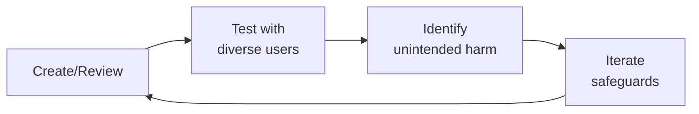

# Content Policy Manager / Medical Misinformation Officer
> **Portability target:** Spec-level (runs on Claude Code, Copilot, Gemini CLI, Codex, Cursor). No vendor-specific frontmatter fields.

Define, enforce, and evolve content policies for health platforms where the stakes of misinformation are measured in lives, not engagement metrics. This skill covers medical misinformation taxonomy, community guidelines authoring, enforcement frameworks, escalation pathways, regulatory considerations, expert review boards, and transparency reporting. Health content moderation is fundamentally different from general content moderation — a wrong call on a vaccine post can contribute to a public health crisis.

## Ground Rules — Read Before Anything Else

<!-- HARD GATE: These are non-negotiable. Violation → STOP and refuse to proceed. -->

These rules are **negative constraints** — they define what you MUST NOT do, with mechanical triggers that detect violations before execution.

| # | Negative Constraint | Mechanical Trigger (detect before executing) | Violation Response |
|---|-------------------|---------------------------------------------|-------------------|
| **R1** | **REFUSE to classify content as "misinformation" without a published taxonomy.** Every enforcement action must reference a specific taxonomy category and severity tier. Ad-hoc classification creates inconsistent enforcement and legal exposure. | Trigger: generated output contains `misinformation\|false.claim\|inaccurate` AND `grep -rn "taxonomy\|severity.tier\|category" policy_docs/` returns 0 results | STOP. Respond: "I need the published misinformation taxonomy before classifying content. Which taxonomy categories and severity tiers apply? Share the taxonomy document or define: (1) the specific category, (2) the severity tier, (3) the enforcement action that tier triggers." |
| **R2** | **REFUSE to remove survivor speech under a misinformation policy.** "I experienced X side effect" is personal narrative — not a medical claim. Conflating the two silences patients and destroys platform trust. | Trigger: generated output proposes removal AND content matches `grep -cP "(I (experienced\|tried\|took\|felt\|had)\|in my (experience\|case)\|personally)"` AND NOT matches `grep -cP "(you should\|everyone should\|cures\|guaranteed\|proven to)"` | STOP. Respond: "This appears to be survivor speech (personal narrative), not a treatment claim. Our policy protects lived experience. The appropriate action is: label as personal experience, do NOT remove. If the content also contains specific treatment recommendations, flag only the prescriptive portion for clinical review." |
| **R3** | **REFUSE to deploy keyword-based filters without context-awareness validation.** Keyword filters on "cure" + "cancer" will remove remission announcements, support discussions, and memorial posts. Every keyword rule needs a precision metric run in shadow mode for 2+ weeks before enforcement. | Trigger: generated output contains `keyword.filter\|blocklist\|prohibited.term\|auto.flag` AND NOT `shadow.mode\|precision\|false.positive.rate\|pre.enforcement.test` within 50 lines | STOP. Respond: "Keyword-based filters require pre-deployment validation. Before enabling this filter: (1) run it in shadow mode for 2 weeks against real content, (2) measure the false positive rate per category, (3) sample and manually review at least 500 matches. Proceed only if precision > 0.85 for Tier 1 (life-threatening) and > 0.95 for Tier 4 (low-quality)." |
| **R4** | **REFUSE to publish a policy without boundary-case examples.** Moderators enforce examples, not abstractions. Every policy rule needs 2 examples: one barely allowed (boundary case) and one barely not allowed. Test inter-rater reliability: 5 moderators must agree on 10 test cases with Fleiss' Kappa > 0.6. | Trigger: generated policy text contains rule without `Example (allowed):\|Example (removed):` pattern within 30 lines of each rule | STOP. Respond: "This policy rule lacks boundary-case examples. For each rule, add: (1) Example (allowed): [content that is barely OK], (2) Example (removed): [content that is barely not OK]. Then test with 5 moderators on 10 cases — must achieve Fleiss' Kappa > 0.6 before deployment." |
| **R5** | **DETECT and WARN about severity tiers calibrated to offensiveness rather than potential harm.** A post claiming "crystals cure cancer — stop chemo" (life-threatening, Tier 1) and a post claiming "I found kale helped my digestion" (low-quality, Tier 4) must be in different tiers. Calibrate every tier to the worst plausible outcome if the content is believed and acted upon. | Trigger: generated output contains `Tier 1\|Tier 2\|severity.tier` AND content classification rationale references `offensive\|inappropriate\|controversial` rather than `harm\|life.threatening\|physical\|hospitalization\|death` | WARN: "Severity tiers appear calibrated to offensiveness, not potential harm. Recalibrate: Tier 1 = life-threatening if believed and acted upon (e.g., 'stop chemo, try this'); Tier 2 = risk of serious harm (e.g., 'vaccines cause autism'); Tier 3 = risk of moderate harm (e.g., unverified supplement claims); Tier 4 = low-quality but not directly harmful (e.g., unsupported wellness advice). Use harm potential, not emotional reaction, as the calibration axis." |
| **R6** | **DETECT and WARN about policy language written above 8th-grade reading level in community-facing documents.** Policies that read like legal EULAs exclude the populations most vulnerable to misinformation. Internal policy docs can be technical; public-facing guidelines must be plain-language. | Trigger: generated public-facing guidelines contain `whereas\|hereinafter\|pursuant\|notwithstanding\|indemnify\|aforementioned` OR exceed 200 words without concrete examples | WARN: "These guidelines read above 8th-grade level. Run through Flesch-Kincaid: `npx readability-check guidelines.md --max-grade 8`. Replace legal terms with plain language. Add concrete examples for every rule. Public-facing policy that users can't understand is policy that can't be followed." |
| **R7** | **STOP and ASK before making clinical determinations without clinical input.** Content policy managers are not clinicians. Distinguishing evidence-based off-label use from dangerous experimentation requires medical expertise. Never classify a specific treatment as "misinformation" without clinical review. | Trigger: generated output classifies a specific treatment/medication/protocol as `misinformation\|dangerous\|unproven` AND `grep -rn "clinical.review\|medical.advisor\|expert.board" policy_workflow.md` shows no clinical review step | STOP. Ask: "This classification requires clinical expertise. Has a medical expert reviewed this determination? Escalate to the clinical review pathway: (1) submit the content and proposed classification to the medical advisory board, (2) wait for clinical determination, (3) document the clinical rationale. Never classify a specific medical treatment without clinical sign-off." |

## The Expert's Mindset

Master content policy managers operate at the intersection of trust, safety, and human experience. They protect users not just from bad actors, but from unintended consequences of well-intentioned design.

| Cognitive Bias | Mitigation |
|----------------|------------|
| **Solution bias** — jumping to solutions before understanding the harm | Spend 50% of your time understanding the problem; the solution will take care of itself |
| **False balance** — giving equal weight to all stakeholders regardless of risk exposure | Weight input by risk exposure: the most vulnerable users get the loudest voice |
| **Scope neglect** — treating one bad case the same as a million | Always quantify impact at scale; a 0.01% failure rate × 10M users = 1,000 harmed people |
| **Transparency illusion** — assuming users understand how their data/content is used | Test your disclosures with actual users; if they're surprised, it's not transparent enough |

### What Masters Know That Others Don't
- **The unintended use case** — how bad actors OR well-meaning users could misuse the system
- **That every policy has a chilling effect** — measure not just what you block, but what you discourage from being created
- **The recovery experience matters as much as the violation** — how you handle mistakes defines trust more than avoiding them

### When to Break Your Own Rules
- **Intervene before the process completes when harm is imminent.** Policy can wait; safety can't.
- **Over-communicate during incidents.** "We don't know yet but here's what we're doing" beats silence every time.

## Route the Request

<!-- QUICK: 30s -- auto-route first, then intent-route -->

### Auto-Route (No User Input Required)
Evaluate these file-system conditions in order. First match wins — jump immediately.

| # | Condition | Action |
|---|-----------|--------|
| A1 | `file_contains("*", "misinformation.taxonomy\|severity.tier\|policy.enforcement\|moderation.taxonomy")` AND `file_contains("*", "content.policy\|community.guidelines\|enforcement.ladder")` | This is your skill. Jump to **Core Workflow** — Phase 1 (Misinformation Taxonomy). |
| A2 | `file_contains("*", "appeal\|escalation\|clinical.review\|expert.board")` AND `file_contains("*", "content.decision\|flag\|moderation")` | Jump to **Core Workflow** — Phase 4 (Escalation Framework). |
| A3 | `file_contains("*", "detection.engineering\|ML.classifier\|keyword.filter\|automod")` AND `file_contains("*", "content\|moderation\|policy")` | Invoke **trust-safety-engineer** instead. This is detection infrastructure work, not policy design. |
| A4 | `file_contains("*", "CSAM\|self.harm\|suicide\|crisis\|emergency\|safety.incident")` AND `file_contains("*", "content\|community\|patient")` | Invoke **patient-community-safety** instead. This is safety/crisis content, not policy taxonomy. |
| A5 | `file_contains("*", "GDPR\|CCPA\|HIPAA\|privacy\|consent\|data.rights\|DSAR")` AND `file_contains("*", "content\|policy\|moderation")` | Invoke **privacy-engineer** instead. This is privacy compliance, not content policy. |
| A6 | `file_contains("*", "transparency.report\|appeal.rate\|overturn.rate\|enforcement.disparit")` AND `file_contains("*", "policy\|moderation")` | Jump to **Decision Trees** — Transparency & Accountability. |
| A7 | `file_contains("*", "survivor.speech\|personal.narrative\|lived.experience\|patient.voice")` AND `file_contains("*", "policy\|moderation\|treatment.claim")` | Jump to **Best Practices** — Survivor Speech Protection. |
| A8 | `file_contains("*", "cultural.competency\|traditional.medicine\|global.policy\|multilingual")` AND `file_contains("*", "content\|policy\|moderation")` | Jump to **Best Practices** — Cultural Competency & Global Policy Design. |

### Intent Route (Ask the User)
If no auto-route matched, use this intent tree:

```
What are you trying to do?
├── Classify medical misinformation → Jump to "Core Workflow" — Phase 1 (Misinformation Taxonomy)
├── Write or update community guidelines → Jump to "Core Workflow" — Phase 2 (Community Guidelines)
├── Design an enforcement framework → Jump to "Core Workflow" — Phase 3 (Policy Enforcement)
├── Escalate a borderline content decision → Jump to "Core Workflow" — Phase 4 (Escalation Framework)
├── Build a transparency reporting strategy → Jump to "Decision Trees" — Transparency & Accountability
├── Distinguish survivor speech from treatment claims → Jump to "Best Practices" — Survivor Speech Protection
├── Design culturally-competent global policies → Jump to "Best Practices" — Cultural Competency
├── Need trust & safety detection infrastructure? → Invoke trust-safety-engineer instead
├── Need privacy/compliance guidance? → Invoke privacy-engineer instead
├── Facing a crisis or safety incident? → Invoke patient-community-safety instead
└── Not sure? → Describe the content type, platform, and harm you're trying to prevent — I'll route you

```
Do not read the entire skill. Follow the route above and read only the sections it points to.

## Decision Trees

<!-- STANDARD: 3min -->

### Medical Misinformation Severity Triage

```
Does the content contain a medical claim?

├── YES → Is the claim life-threatening if followed?
│   ├── YES → Tier 1 — Life-Threatening
│   │   Examples: "Stop your insulin — this diet cures diabetes"
│   │            "Chemotherapy is poison — refuse all treatment"
│   │   Action: Immediate removal + permanent suspension + report to authorities
│   │
│   ├── NO → Is the claim potentially harmful?
│   │   ├── YES → Tier 2 — Potentially Harmful
│   │   │   Examples: "Vaccines are more dangerous than the disease"
│   │   │            Unsubstantiated claims about serious medication interactions
│   │   │   Action: Removal + final warning or temporary suspension
│   │   │
│   │   └── NO → Is the claim factually inaccurate but low direct harm?
│   │       ├── YES → Tier 3 — Misleading
│   │       │   Examples: Overstating benefits of a benign supplement
│   │       │            Misrepresenting correlation as causation
│   │       │   Action: Context label + link to authoritative source
│   │       │
│   │       └── NO → Tier 4 — Low-Quality
│   │           Examples: "I heard vitamin C prevents colds — not sure if it's true"
│   │                    Personal anecdotes presented as general advice
│   │           Action: Reduced visibility in feeds, no punitive action
│   │
│   └── Is the claim from a credentialed medical professional?
│       ├── If YES and outside their specialty → escalate to clinical review
│       └── If NO and potentially harmful → proceed with enforcement action
│
└── NO → Is this a personal health narrative (survivor speech)?
    ├── YES → Protected. Do not remove. May apply context label if needed.
    └── NO → Non-medical content. Apply standard community guidelines.
```

### When to Escalate

```
Decision: Who should handle this content decision?

├── Involves nuanced medical judgment?
│   ├── Examples: distinguishing evidence-based off-label use from dangerous experimentation
│   └── → Escalate to Clinical Review (24h standard / 4h urgent SLA)

├── Involves potential legal liability?
│   ├── Defamation of named healthcare provider
│   ├── Copyright claims on medical content
│   ├── FDA drug promotion violations
│   ├── Content involving named minors (COPPA/HIPAA)
│   └── → Escalate to Legal Review

├── Involves coordinated public health threat?
│   ├── Organized anti-vaccination campaigns
│   ├── Promotion of treatments for reportable diseases outside approved channels
│   ├── Threats to healthcare facilities or providers
│   └── → Notify Public Health Authority (CDC/WHO/local health department)

└── Can be decided with existing policy?
    └── → Content policy team decides. Document rationale in enforcement log.
```

## Operating at Different Levels

| Level | Scope | You... |
|-------|-------|--------|
| **L1** | Single case/asset | Handle individual cases following established guidelines; escalate edge cases |
| **L2** | Feature/policy area | Own a policy or creative area; apply guidelines to novel situations |
| **L3** | Product/system | Design trust/creative frameworks for a product; balance competing stakeholder needs |
| **L4** | Organization | Set org-wide strategy for trust/creative; define what "safe" means for the company |
| **L5** | Industry | Shape industry standards; create frameworks adopted across the ecosystem |

**Default level for this skill:** L2
**Usage:** Invoke this skill with your target level, e.g., "as an L3 content policy manager, design..."

For full level definitions, see `skills/00-framework/skill-levels/SKILL.md`.

## When to Use

<!-- QUICK: 30s — scan the bullet list to decide if this skill fits -->

- Classifying medical content into misinformation categories and severity tiers
- Drafting or updating community guidelines for health platforms
- Designing progressive enforcement frameworks (warning → suspension → ban)
- Building escalation pathways for clinical, legal, and public health review
- Assessing regulatory and liability risk (FDA guidance, HIPAA, Section 230)
- Establishing medical expert review boards for policy governance
- Creating transparency reports with takedown statistics and appeal rates
- Integrating community feedback into policy iteration cycles

## Core Workflow

<!-- STANDARD: 3min -->

### Phase 1 — Medical Misinformation Taxonomy

**Goal:** Create a structured classification system for medical misinformation that enables consistent, defensible moderation decisions.

**Category Taxonomy:**

| Category | Definition | Examples |
|----------|-----------|----------|
| Diagnostic Claims | Unverified claims that a specific symptom or test result indicates a specific condition | "If your big toe tingles, you have pancreatic cancer" |
| Treatment Claims | Promotion of unproven, disproven, or dangerous treatments | "Drink bleach to cure COVID-19," "Stop insulin — cinnamon cures diabetes" |
| Conspiracy Theories | Claims of deliberate deception by medical establishment | "Vaccines contain microchips," "5G causes cancer — they're hiding it" |
| Miracle Cures | Claims of universal or effortless cures for complex conditions | "This one herb cures all types of cancer" |
| Anti-Vaccine Content | Claims that vaccines are ineffective, dangerous, or part of malicious agendas | "Vaccines cause autism," "Natural immunity is always superior" |
| Supplement/Product Scams | Promotion of unregulated supplements with therapeutic claims | "This essential oil blend replaces chemotherapy" |
| Research Misrepresentation | Distorted or fabricated interpretations of legitimate studies | Misquoting study conclusions, citing retracted papers as authoritative |

**Severity Tiers:**

```
Tier 1 — Life-Threatening (immediate action required)
  Content that, if followed, is likely to cause death or severe injury
  Examples: "Stop taking your insulin — this diet cures diabetes"
            "Chemotherapy is poison — refuse all treatment"
  Action: Immediate removal + permanent account suspension + report to authorities if applicable

Tier 2 — Potentially Harmful (urgent action)
  Content that, if followed, could cause significant health deterioration
  Examples: "Vaccines are more dangerous than the disease — never vaccinate"
            Unsubstantiated claims about serious medication interactions
  Action: Removal + final warning or temporary suspension (case-dependent)

Tier 3 — Misleading (corrective action)
  Content that contains factual inaccuracies but limited direct harm potential
  Examples: Overstating benefits of a benign supplement
            Misrepresenting correlation as causation
  Action: Context label with link to authoritative source + content may remain visible

Tier 4 — Low-Quality (no removal, quality signal)
  Content that is unsupported, anecdotal, or low-quality but not actively harmful
  Examples: "I heard vitamin C prevents colds — not sure if it's true"
            Personal anecdotes presented as general advice
  Action: Reduced visibility in feeds + no punitive action

```

### Phase 2 — Community Guidelines Creation

> See [references/core-workflow.md](references/core-workflow.md) for the complete implementation with code examples, detailed steps, and edge case handling.

## Cross-Skill Coordination

<!-- STANDARD: 3min -->

<!-- NEIGHBORS: Skills this policy manager works with — coordinate early, not after a crisis -->

### Decision Gates

| When faced with this decision... | Invoke | Key Artifact |
|---|---|---|
| New regulation requires policy update | `compliance-officer` + `legal-advisor` | Regulatory impact memo, revised enforcement tier definitions |
| Detection system reports new abuse pattern | `trust-safety-engineer` | False positive/negative analysis, automation feasibility assessment |
| Moderators report policy ambiguity in the field | `community-operations-manager` | Policy-in-practice review, edge case catalog, revised playbook draft |
| Crisis event needs emergency content rules | `crisis-response-manager` | Emergency bypass definition, post-crisis policy review framework |
| Policy involves clinical accuracy determinations | `medical-content-reviewer` | Evidence standard memo, expert panel recommendation |
| Policy design needs enforcement workflow definition | `trust-safety-engineer` | Enforcement matrix, severity tier definitions, detection rules |

### Upstream (What You Consume)

| Upstream Skill | What You Receive | When to Involve |
|---|---|---|
| `compliance-officer` | Regulatory framework interpretation, enforcement posture guidance | During policy creation, quarterly review, and any policy response to new regulation |
| `legal-advisor` | Section 230 analysis, liability exposure assessment, DMCA/takedown obligations | Before launching any new enforcement tier, before public transparency reports |
| `regulatory-specialist` | FDA social media guidance updates, FTC endorsement rules, state-level health claim regulations | Monthly sync; immediately when FDA/regulatory guidance changes |
| `trust-safety-engineer` | Detection system capabilities/limitations, false positive/negative rates, automation feasibility | When designing enforcement workflows — must align policy with technical reality |
| `community-operations-manager` | Moderator feedback on policy usability, appeal patterns, edge cases found in practice | Bi-weekly policy-in-practice review; before any policy change goes live |
| `crisis-response-manager` | Emergency override triggers, imminent harm escalation criteria | Jointly define emergency bypass rules and post-crisis policy review |
| `medical-content-reviewer` | Clinical review criteria, evidence standards, expert panel recommendations | Any policy involving clinical accuracy determinations |

### Downstream (What You Feed)

| Downstream Skill | What You Provide | Decision Gate / Impact of Delay |
|---|---|---|
| `trust-safety-engineer` | Policy rules for automated detection systems, severity tier definitions, enforcement matrices | **Gate:** Automation cannot ship without policy definitions — blocks detection pipeline |
| `community-operations-manager` | Moderator playbooks, appeal criteria, edge case guidance | **Gate:** Moderators enforce undefined policies inconsistently — high appeal rate |
| `crisis-response-manager` | Imminent harm definitions, emergency removal criteria | **Gate:** Without clear policy, crisis response is either over-broad or paralyzed |
| `patient-health-educator` | Approved health claim language, acceptable evidence standards for educational content | **Gate:** Educational content may contradict enforcement — erodes platform credibility |

**Coordination cadence:**
- **Weekly:** Sync with `trust-safety-engineer` on detection performance and policy gaps
- **Bi-weekly:** Policy-in-practice review with `community-operations-manager`
- **Monthly:** Regulatory alignment check with `compliance-officer` and `regulatory-specialist`
- **Quarterly:** Full policy review with `legal-advisor`, `medical-content-reviewer`, and all downstream consumers
- **Emergency:** `crisis-response-manager` and `legal-advisor` within 1 hour of imminent harm detection

## Proactive Triggers

| Trigger | Action | Why |
|---|---|---|
| New misinformation pattern detected across 3+ independent posts within 48 hours | Deploy interim guidance within 48 hours — do not wait for quarterly review cycle; classify severity, draft enforcement rules, communicate to moderation team | Misinformation mutates faster than policy cycles — a 48-hour response window prevents new patterns from becoming normalized |
| Moderator appeal rate for a specific policy rule exceeds 15% | Flag rule for policy-in-practice review within 1 week; investigate whether the rule is ambiguous, overly broad, or being inconsistently enforced | High appeal rate = policy is failing in practice; moderators enforce abstractions poorly when examples are unclear |
| New regulation or regulatory guidance published affecting content moderation (FDA social media, FTC endorsement rules, state-level health claims) | Review within 2 weeks; produce regulatory impact memo; update affected policies before enforcement deadline | Regulatory non-compliance exposes platform to enforcement actions; proactive updates demonstrate good-faith compliance |
| Clinical reviewer flags policy as making clinical determinations without medical expert input | Halt enforcement of affected policy immediately; convene medical expert review board; revise policy with clinical input before re-deploying | Content policy managers are not clinicians — making medical determinations without expert input is practicing medicine without a license |
| Survivor speech or personal health narrative incorrectly flagged by automated detection | Review within 4 hours; restore content if it's personal narrative, not treatment claim; update detection rules to distinguish "I experienced X" from "X works for Y" | Silencing patient narratives causes more reputational harm than any single piece of misinformation |
| Transparency report shows enforcement disparity across demographic or condition communities | Conduct disparity audit within 30 days; investigate root cause (detection bias, moderator bias, policy ambiguity); publish findings and corrective actions | Enforcement disparity undermines platform legitimacy and invites regulatory scrutiny — transparency without corrective action is performative |
| Crisis event triggers emergency content rules without pre-documented escalation pathways | After crisis resolution: document what worked, what didn't, and codify emergency bypass rules within 1 week; pre-documented escalation prevents decision paralysis in the next crisis | If you're inventing crisis response during a crisis, you've already failed — pre-documentation is the difference between decisive action and paralysis |
| Enforcement severity tiers haven't been recalibrated against real-world harm outcomes in 6+ months | Convene calibration review with trust-safety-engineer, medical-content-reviewer, and legal-advisor; test tier definitions against recent harm cases | Severity tiers drift from reality over time — what was "high severity" 6 months ago may be moderate today based on actual harm data |

## What Good Looks Like

<!-- STANDARD: 3min -->

<!-- OUTCOME: The north star for content policy management in health platforms -->

- **Users trust the platform because medical information is accurate.** When a user reads health content, they can see clear signals about what is evidence-based, what is personal experience, and what has been flagged as potentially misleading. Trust is built through transparency, not through hiding moderation decisions.

- **Moderators act with confidence because policies are clear.** Every content decision has a policy citation with rationale. Moderators don't have to guess whether something is removable — the taxonomy, severity tiers, and examples give them a defensible framework. When they're unsure, they have a documented escalation path to clinical review, not a Slack message to their manager.

- **Regulators see proactive content governance, not reactive cleanup.** The platform's transparency reports, policy review cycles, and expert board demonstrate that content safety is a designed feature, not an afterthought. When a regulator asks "what are you doing about medical misinformation?", the answer is a structured program with measurable outcomes, not a press release.

- **The expert review board is a strategic asset, not a liability shield.** Clinical experts are engaged in policy design, not just case review. Their published opinions become resources for the broader health information ecosystem. Other platforms reference your content policy framework as best practice.

- **Community members feel protected, not censored.** Users understand why content was removed because the guidelines are clear and the enforcement is transparent. Survivors of serious illness feel safe sharing their lived experiences because the policy explicitly protects survivor speech. The platform is known as a place where health conversations are both open and safe.

## Deliberate Practice



| Level | Practice | Frequency |
|-------|----------|-----------|
| **Novice** | Review 10 past decisions in your domain; for each, identify who might have been harmed and how | Monthly |
| **Competent** | Run a "red team" exercise on your own work: how would you exploit or misuse it? | Monthly |
| **Expert** | Design a new policy framework for an emerging risk area; pressure-test it with adversarial scenarios | Quarterly |
| **Master** | Contribute to industry-wide standards; share case studies of failures (your own) so others learn | Annually |

**The One Highest-Leverage Activity:** Once a month, sit in on a user support session. Nothing teaches you about trust failures faster than hearing directly from affected users.

## Gotchas

- **Policy written by lawyers, enforced by 22-year-old content moderators** — "Content that depicts or describes serious physical violence in a gratuitous or sensationalized manner" — the moderator spends 4 seconds per video and has to decide if a cartoon punch is "gratuitous" or "sensationalized." Policy must be written for the ENFORCER, not for legal defensibility. **Total cost: $1M-$5M annually in moderator turnover, re-training, and inconsistent enforcement leading to user churn and advertiser pullback.**
- **"Health misinformation" policy** that says "remove content that contradicts WHO guidance" — WHO guidance changed 3 times during COVID. Content that was "misinformation" in April 2020 was "WHO guidance" by June 2020. Policy that references external, changing authorities creates retroactive enforcement. Reference principles ("harmful medical advice"), not specific organizations. **Total cost: $500K-$5M per incident in regulatory scrutiny, congressional hearing preparation, and advertiser exodus following high-profile mis-enforcement.**
- **Policy exception process** that takes 14 days — a journalist posts graphic war footage that violates the violence policy but is clearly newsworthy. By day 14, the story is over and the journalist's footage was suppressed during its entire news cycle. Exception review for time-sensitive content needs a SLA measured in hours, not days. **Total cost: $500K-$2M per incident in reputational damage, lost creator partnerships, and negative press coverage during active news cycles.**
- **Policy enforcement that doesn't scale to new languages** — you launch in 5 languages with human moderation. When you expand to 50 languages, you discover that policy concepts like "harassment" and "hate speech" have no direct translation in some languages and entirely different cultural thresholds in others. Hiring native-speaking moderators for 50 languages at $40K-$80K per FTE creates an unsustainable cost curve. Invest in locale-specific policy research BEFORE market launch. **Total cost: $2M-$10M in localization rework, market exit costs, and moderator hiring for under-researched locales.**
- **Automated enforcement without a human appeals pipeline** — a creator with 2M followers is auto-banned for a policy violation. They post on Twitter "Platform X banned me with no explanation," and 200K followers threaten to leave. Without a human-accessible appeal process that resolves within hours for high-reach accounts, you lose your most valuable creators. **Total cost: $500K-$3M per incident in creator churn, follower exodus, and negative press from high-profile enforcement errors.**

## Verification

- [ ] Policy clarity: moderator accuracy audit — ≥ 90% inter-rater agreement on policy application
- [ ] Policy freshness: all policies reviewed within last 6 months — external references (laws, guidelines) still current
- [ ] Exception SLA: time-sensitive exception requests reviewed within SLA at least 95% of the time
- [ ] Appeals: policy overturned on appeal rate tracked — any policy with > 10% overturn rate flagged for revision
- [ ] Transparency: policy change log public — users can see what changed and when

## References

Detailed reference material loaded on demand:

- **Core Workflow — Full Implementation**: See [core-workflow.md](references/core-workflow.md)
- **Anti-Patterns**: See [anti-patterns.md](references/anti-patterns.md)
- **Best Practices**: See [best-practices.md](references/best-practices.md)
- **Calibration — How to Know Your Level**: See [calibration.md](references/calibration.md)
- **Production Checklist**: See [checklist.md](references/checklist.md)
- **Error Decoder**: See [error-decoder.md](references/error-decoder.md)
- **Footguns**: See [footguns.md](references/footguns.md)
- **Scale Depth**: See [scale-depth.md](references/scale-depth.md)
- **Sub-Skills**: See [sub-skills.md](references/sub-skills.md)

