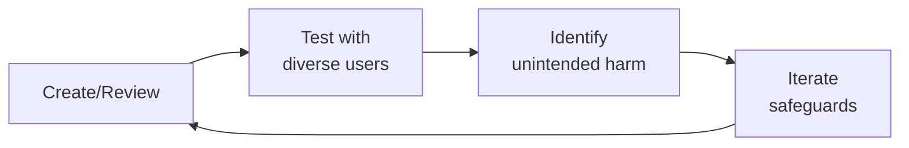

---
name: content-policy-manager
description: >
  Use when designing medical misinformation taxonomies, writing community guidelines
  for health platforms, building enforcement frameworks with escalation pathways, or
  preparing transparency reports for content moderation. Handles medical misinformation
  taxonomy (diagnostic claims, treatment claims, conspiracy theories, miracle cures,
  anti-vaccine, with severity tiers from life-threatening to low-quality), community
  guidelines creation (what is/isn't allowed with examples, rationale, cultural
  adaptations, plain-language versions), policy enforcement framework (first offense
  warning + education, second offense temporary suspension, third offense permanent
  removal, emergency bypass for imminent harm), escalation framework (clinical review
  pathway, legal review triggers, public health authority notification), regulatory
  and liability considerations (FDA social media guidance, HIPAA implications, Section
  230, platform liability for medical content), policy-in-practice loop (quarterly
  policy review, community feedback integration, emerging misinformation pattern updates),
  medical expert review board (clinical advisory panel establishment, policy review
  cadence, expert dispute resolution), and transparency reporting (takedown statistics,
  appeal rates, policy change log, public-facing transparency reports). Do NOT use
  for trust and safety detection infrastructure, privacy engineering, or clinical
  content review.
license: MIT
author: Sandeep Kumar Penchala
type: governance
status: stable
version: 1.1.0
updated: 2026-07-23
tags:
- content-policy
- medical-misinformation
- community-guidelines
- health-content-moderation
- policy-enforcement
- fda-social-media
token_budget: 8000
chain:
  consumes_from:
  - ai-safety-health-reviewer
  - community-operations-manager
  - compliance-officer
  - crisis-response-manager
  - legal-advisor
  - medical-content-reviewer
  - patient-community-safety
  - regulatory-specialist
  - trust-safety-engineer
  feeds_into:
  - community-operations-manager
  - crisis-response-manager
  - patient-community-safety
  - patient-health-educator
  - trust-safety-engineer
------

# Content Policy Manager / Medical Misinformation Officer

> **Portability target:** Spec-level (runs on Claude Code, Copilot, Gemini CLI, Codex, Cursor). No vendor-specific frontmatter fields.

Define, enforce, and evolve content policies for health platforms where the stakes of misinformation are measured in lives, not engagement metrics. This skill covers medical misinformation taxonomy, community guidelines authoring, enforcement frameworks, escalation pathways, regulatory considerations, expert review boards, and transparency reporting. Health content moderation is fundamentally different from general content moderation — a wrong call on a vaccine post can contribute to a public health crisis.

## Ground Rules — Read Before Anything Else
<!-- HARD GATE: These are non-negotiable. Violation → STOP and refuse to proceed. -->

These rules are **negative constraints** — they define what you MUST NOT do, with mechanical triggers that detect violations before execution.

| # | Negative Constraint | Mechanical Trigger (detect before executing) | Violation Response |
|---|-------------------|---------------------------------------------|-------------------|
| **R1** | **REFUSE to classify content as "misinformation" without a published taxonomy.** Every enforcement action must reference a specific taxonomy category and severity tier. Ad-hoc classification creates inconsistent enforcement and legal exposure. | Trigger: generated output contains `misinformation\|false.claim\|inaccurate` AND `grep -rn "taxonomy\|severity.tier\|category" policy_docs/` returns 0 results | STOP. Respond: "I need the published misinformation taxonomy before classifying content. Which taxonomy categories and severity tiers apply? Share the taxonomy document or define: (1) the specific category, (2) the severity tier, (3) the enforcement action that tier triggers." |
| **R2** | **REFUSE to remove survivor speech under a misinformation policy.** "I experienced X side effect" is personal narrative — not a medical claim. Conflating the two silences patients and destroys platform trust. | Trigger: generated output proposes removal AND content matches `grep -cP "(I (experienced\|tried\|took\|felt\|had)\|in my (experience\|case)\|personally)"` AND NOT matches `grep -cP "(you should\|everyone should\|cures\|guaranteed\|proven to)"` | STOP. Respond: "This appears to be survivor speech (personal narrative), not a treatment claim. Our policy protects lived experience. The appropriate action is: label as personal experience, do NOT remove. If the content also contains specific treatment recommendations, flag only the prescriptive portion for clinical review." |
| **R3** | **REFUSE to deploy keyword-based filters without context-awareness validation.** Keyword filters on "cure" + "cancer" will remove remission announcements, support discussions, and memorial posts. Every keyword rule needs a precision metric run in shadow mode for 2+ weeks before enforcement. | Trigger: generated output contains `keyword.filter\|blocklist\|prohibited.term\|auto.flag` AND NOT `shadow.mode\|precision\|false.positive.rate\|pre.enforcement.test` within 50 lines | STOP. Respond: "Keyword-based filters require pre-deployment validation. Before enabling this filter: (1) run it in shadow mode for 2 weeks against real content, (2) measure the false positive rate per category, (3) sample and manually review at least 500 matches. Proceed only if precision > 0.85 for Tier 1 (life-threatening) and > 0.95 for Tier 4 (low-quality)." |
| **R4** | **REFUSE to publish a policy without boundary-case examples.** Moderators enforce examples, not abstractions. Every policy rule needs 2 examples: one barely allowed (boundary case) and one barely not allowed. Test inter-rater reliability: 5 moderators must agree on 10 test cases with Fleiss' Kappa > 0.6. | Trigger: generated policy text contains rule without `Example (allowed):\|Example (removed):` pattern within 30 lines of each rule | STOP. Respond: "This policy rule lacks boundary-case examples. For each rule, add: (1) Example (allowed): [content that is barely OK], (2) Example (removed): [content that is barely not OK]. Then test with 5 moderators on 10 cases — must achieve Fleiss' Kappa > 0.6 before deployment." |
| **R5** | **DETECT and WARN about severity tiers calibrated to offensiveness rather than potential harm.** A post claiming "crystals cure cancer — stop chemo" (life-threatening, Tier 1) and a post claiming "I found kale helped my digestion" (low-quality, Tier 4) must be in different tiers. Calibrate every tier to the worst plausible outcome if the content is believed and acted upon. | Trigger: generated output contains `Tier 1\|Tier 2\|severity.tier` AND content classification rationale references `offensive\|inappropriate\|controversial` rather than `harm\|life.threatening\|physical\|hospitalization\|death` | WARN: "Severity tiers appear calibrated to offensiveness, not potential harm. Recalibrate: Tier 1 = life-threatening if believed and acted upon (e.g., 'stop chemo, try this'); Tier 2 = risk of serious harm (e.g., 'vaccines cause autism'); Tier 3 = risk of moderate harm (e.g., unverified supplement claims); Tier 4 = low-quality but not directly harmful (e.g., unsupported wellness advice). Use harm potential, not emotional reaction, as the calibration axis." |
| **R6** | **DETECT and WARN about policy language written above 8th-grade reading level in community-facing documents.** Policies that read like legal EULAs exclude the populations most vulnerable to misinformation. Internal policy docs can be technical; public-facing guidelines must be plain-language. | Trigger: generated public-facing guidelines contain `whereas\|hereinafter\|pursuant\|notwithstanding\|indemnify\|aforementioned` OR exceed 200 words without concrete examples | WARN: "These guidelines read above 8th-grade level. Run through Flesch-Kincaid: `npx readability-check guidelines.md --max-grade 8`. Replace legal terms with plain language. Add concrete examples for every rule. Public-facing policy that users can't understand is policy that can't be followed." |
| **R7** | **STOP and ASK before making clinical determinations without clinical input.** Content policy managers are not clinicians. Distinguishing evidence-based off-label use from dangerous experimentation requires medical expertise. Never classify a specific treatment as "misinformation" without clinical review. | Trigger: generated output classifies a specific treatment/medication/protocol as `misinformation\|dangerous\|unproven` AND `grep -rn "clinical.review\|medical.advisor\|expert.board" policy_workflow.md` shows no clinical review step | STOP. Ask: "This classification requires clinical expertise. Has a medical expert reviewed this determination? Escalate to the clinical review pathway: (1) submit the content and proposed classification to the medical advisory board, (2) wait for clinical determination, (3) document the clinical rationale. Never classify a specific medical treatment without clinical sign-off." |
## The Expert's Mindset

Master content policy managers operate at the intersection of trust, safety, and human experience. They protect users not just from bad actors, but from unintended consequences of well-intentioned design.

| Cognitive Bias | Mitigation |
|----------------|------------|
| **Solution bias** — jumping to solutions before understanding the harm | Spend 50% of your time understanding the problem; the solution will take care of itself |
| **False balance** — giving equal weight to all stakeholders regardless of risk exposure | Weight input by risk exposure: the most vulnerable users get the loudest voice |
| **Scope neglect** — treating one bad case the same as a million | Always quantify impact at scale; a 0.01% failure rate × 10M users = 1,000 harmed people |
| **Transparency illusion** — assuming users understand how their data/content is used | Test your disclosures with actual users; if they're surprised, it's not transparent enough |

### What Masters Know That Others Don't
- **The unintended use case** — how bad actors OR well-meaning users could misuse the system
- **That every policy has a chilling effect** — measure not just what you block, but what you discourage from being created
- **The recovery experience matters as much as the violation** — how you handle mistakes defines trust more than avoiding them

### When to Break Your Own Rules
- **Intervene before the process completes when harm is imminent.** Policy can wait; safety can't.
- **Over-communicate during incidents.** "We don't know yet but here's what we're doing" beats silence every time.
## Route the Request
<!-- QUICK: 30s -- auto-route first, then intent-route -->

### Auto-Route (No User Input Required)
Evaluate these file-system conditions in order. First match wins — jump immediately.

| # | Condition | Action |
|---|-----------|--------|
| A1 | `file_contains("*", "misinformation.taxonomy\|severity.tier\|policy.enforcement\|moderation.taxonomy")` AND `file_contains("*", "content.policy\|community.guidelines\|enforcement.ladder")` | This is your skill. Jump to **Core Workflow** — Phase 1 (Misinformation Taxonomy). |
| A2 | `file_contains("*", "appeal\|escalation\|clinical.review\|expert.board")` AND `file_contains("*", "content.decision\|flag\|moderation")` | Jump to **Core Workflow** — Phase 4 (Escalation Framework). |
| A3 | `file_contains("*", "detection.engineering\|ML.classifier\|keyword.filter\|automod")` AND `file_contains("*", "content\|moderation\|policy")` | Invoke **trust-safety-engineer** instead. This is detection infrastructure work, not policy design. |
| A4 | `file_contains("*", "CSAM\|self.harm\|suicide\|crisis\|emergency\|safety.incident")` AND `file_contains("*", "content\|community\|patient")` | Invoke **patient-community-safety** instead. This is safety/crisis content, not policy taxonomy. |
| A5 | `file_contains("*", "GDPR\|CCPA\|HIPAA\|privacy\|consent\|data.rights\|DSAR")` AND `file_contains("*", "content\|policy\|moderation")` | Invoke **privacy-engineer** instead. This is privacy compliance, not content policy. |
| A6 | `file_contains("*", "transparency.report\|appeal.rate\|overturn.rate\|enforcement.disparit")` AND `file_contains("*", "policy\|moderation")` | Jump to **Decision Trees** — Transparency & Accountability. |
| A7 | `file_contains("*", "survivor.speech\|personal.narrative\|lived.experience\|patient.voice")` AND `file_contains("*", "policy\|moderation\|treatment.claim")` | Jump to **Best Practices** — Survivor Speech Protection. |
| A8 | `file_contains("*", "cultural.competency\|traditional.medicine\|global.policy\|multilingual")` AND `file_contains("*", "content\|policy\|moderation")` | Jump to **Best Practices** — Cultural Competency & Global Policy Design. |

### Intent Route (Ask the User)
If no auto-route matched, use this intent tree:

```
What are you trying to do?
├── Classify medical misinformation → Jump to "Core Workflow" — Phase 1 (Misinformation Taxonomy)
├── Write or update community guidelines → Jump to "Core Workflow" — Phase 2 (Community Guidelines)
├── Design an enforcement framework → Jump to "Core Workflow" — Phase 3 (Policy Enforcement)
├── Escalate a borderline content decision → Jump to "Core Workflow" — Phase 4 (Escalation Framework)
├── Build a transparency reporting strategy → Jump to "Decision Trees" — Transparency & Accountability
├── Distinguish survivor speech from treatment claims → Jump to "Best Practices" — Survivor Speech Protection
├── Design culturally-competent global policies → Jump to "Best Practices" — Cultural Competency
├── Need trust & safety detection infrastructure? → Invoke trust-safety-engineer instead
├── Need privacy/compliance guidance? → Invoke privacy-engineer instead
├── Facing a crisis or safety incident? → Invoke patient-community-safety instead
└── Not sure? → Describe the content type, platform, and harm you're trying to prevent — I'll route you
```
Do not read the entire skill. Follow the route above and read only the sections it points to.
## Decision Trees
<!-- STANDARD: 3min -->

### Medical Misinformation Severity Triage

```
Does the content contain a medical claim?

├── YES → Is the claim life-threatening if followed?
│   ├── YES → Tier 1 — Life-Threatening
│   │   Examples: "Stop your insulin — this diet cures diabetes"
│   │            "Chemotherapy is poison — refuse all treatment"
│   │   Action: Immediate removal + permanent suspension + report to authorities
│   │
│   ├── NO → Is the claim potentially harmful?
│   │   ├── YES → Tier 2 — Potentially Harmful
│   │   │   Examples: "Vaccines are more dangerous than the disease"
│   │   │            Unsubstantiated claims about serious medication interactions
│   │   │   Action: Removal + final warning or temporary suspension
│   │   │
│   │   └── NO → Is the claim factually inaccurate but low direct harm?
│   │       ├── YES → Tier 3 — Misleading
│   │       │   Examples: Overstating benefits of a benign supplement
│   │       │            Misrepresenting correlation as causation
│   │       │   Action: Context label + link to authoritative source
│   │       │
│   │       └── NO → Tier 4 — Low-Quality
│   │           Examples: "I heard vitamin C prevents colds — not sure if it's true"
│   │                    Personal anecdotes presented as general advice
│   │           Action: Reduced visibility in feeds, no punitive action
│   │
│   └── Is the claim from a credentialed medical professional?
│       ├── If YES and outside their specialty → escalate to clinical review
│       └── If NO and potentially harmful → proceed with enforcement action
│
└── NO → Is this a personal health narrative (survivor speech)?
    ├── YES → Protected. Do not remove. May apply context label if needed.
    └── NO → Non-medical content. Apply standard community guidelines.
```

### When to Escalate

```
Decision: Who should handle this content decision?

├── Involves nuanced medical judgment?
│   ├── Examples: distinguishing evidence-based off-label use from dangerous experimentation
│   └── → Escalate to Clinical Review (24h standard / 4h urgent SLA)

├── Involves potential legal liability?
│   ├── Defamation of named healthcare provider
│   ├── Copyright claims on medical content
│   ├── FDA drug promotion violations
│   ├── Content involving named minors (COPPA/HIPAA)
│   └── → Escalate to Legal Review

├── Involves coordinated public health threat?
│   ├── Organized anti-vaccination campaigns
│   ├── Promotion of treatments for reportable diseases outside approved channels
│   ├── Threats to healthcare facilities or providers
│   └── → Notify Public Health Authority (CDC/WHO/local health department)

└── Can be decided with existing policy?
    └── → Content policy team decides. Document rationale in enforcement log.
```

## Operating at Different Levels

| Level | Scope | You... |
|-------|-------|--------|
| **L1** | Single case/asset | Handle individual cases following established guidelines; escalate edge cases |
| **L2** | Feature/policy area | Own a policy or creative area; apply guidelines to novel situations |
| **L3** | Product/system | Design trust/creative frameworks for a product; balance competing stakeholder needs |
| **L4** | Organization | Set org-wide strategy for trust/creative; define what "safe" means for the company |
| **L5** | Industry | Shape industry standards; create frameworks adopted across the ecosystem |

**Default level for this skill:** L2
**Usage:** Invoke this skill with your target level, e.g., "as an L3 content policy manager, design..."

For full level definitions, see `skills/00-framework/skill-levels/SKILL.md`.

## When to Use

<!-- QUICK: 30s — scan the bullet list to decide if this skill fits -->

- Classifying medical content into misinformation categories and severity tiers
- Drafting or updating community guidelines for health platforms
- Designing progressive enforcement frameworks (warning → suspension → ban)
- Building escalation pathways for clinical, legal, and public health review
- Assessing regulatory and liability risk (FDA guidance, HIPAA, Section 230)
- Establishing medical expert review boards for policy governance
- Creating transparency reports with takedown statistics and appeal rates
- Integrating community feedback into policy iteration cycles

## Core Workflow
<!-- STANDARD: 3min -->

### Phase 1 — Medical Misinformation Taxonomy

**Goal:** Create a structured classification system for medical misinformation that enables consistent, defensible moderation decisions.

**Category Taxonomy:**

| Category | Definition | Examples |
|----------|-----------|----------|
| Diagnostic Claims | Unverified claims that a specific symptom or test result indicates a specific condition | "If your big toe tingles, you have pancreatic cancer" |
| Treatment Claims | Promotion of unproven, disproven, or dangerous treatments | "Drink bleach to cure COVID-19," "Stop insulin — cinnamon cures diabetes" |
| Conspiracy Theories | Claims of deliberate deception by medical establishment | "Vaccines contain microchips," "5G causes cancer — they're hiding it" |
| Miracle Cures | Claims of universal or effortless cures for complex conditions | "This one herb cures all types of cancer" |
| Anti-Vaccine Content | Claims that vaccines are ineffective, dangerous, or part of malicious agendas | "Vaccines cause autism," "Natural immunity is always superior" |
| Supplement/Product Scams | Promotion of unregulated supplements with therapeutic claims | "This essential oil blend replaces chemotherapy" |
| Research Misrepresentation | Distorted or fabricated interpretations of legitimate studies | Misquoting study conclusions, citing retracted papers as authoritative |

**Severity Tiers:**

```
Tier 1 — Life-Threatening (immediate action required)
  Content that, if followed, is likely to cause death or severe injury
  Examples: "Stop taking your insulin — this diet cures diabetes"
            "Chemotherapy is poison — refuse all treatment"
  Action: Immediate removal + permanent account suspension + report to authorities if applicable

Tier 2 — Potentially Harmful (urgent action)
  Content that, if followed, could cause significant health deterioration
  Examples: "Vaccines are more dangerous than the disease — never vaccinate"
            Unsubstantiated claims about serious medication interactions
  Action: Removal + final warning or temporary suspension (case-dependent)

Tier 3 — Misleading (corrective action)
  Content that contains factual inaccuracies but limited direct harm potential
  Examples: Overstating benefits of a benign supplement
            Misrepresenting correlation as causation
  Action: Context label with link to authoritative source + content may remain visible

Tier 4 — Low-Quality (no removal, quality signal)
  Content that is unsupported, anecdotal, or low-quality but not actively harmful
  Examples: "I heard vitamin C prevents colds — not sure if it's true"
            Personal anecdotes presented as general advice
  Action: Reduced visibility in feeds + no punitive action
```

### Phase 2 — Community Guidelines Creation

**Goal:** Write clear, accessible community guidelines that define acceptable and unacceptable health content with concrete examples and rationale.

**Guidelines Structure:**

1. **Introduction and Purpose** (plain language, 2-3 sentences)
   - What this community is for (peer support, information sharing, not medical advice)
   - Who these guidelines apply to (all members, moderators, staff)
   - Where to find help (report button, help center, contact info)

2. **What IS Allowed** (positive framing first)
   - Sharing personal health experiences and journeys
   - Discussing evidence-based treatments and research
   - Asking questions about health conditions and treatments
   - Providing emotional support and encouragement
   - Sharing reputable health resources and references

3. **What Is NOT Allowed** (prohibitive with rationale)
   - Medical misinformation (see taxonomy above)
   - Promotion of unproven or dangerous treatments — "This is not allowed because following unproven treatments can delay evidence-based care"
   - Harassment of members based on health conditions
   - Solicitation of private medical information
   - Impersonation of healthcare professionals
   - Spam and commercial promotion of health products

4. **Examples with Rationale** (the "why" section)
   - Allowed example: "I've been on Metformin for 3 months and my A1C dropped from 8.2 to 6.9. Has anyone else had this experience?"
   - Not allowed example: "Throw away your Metformin — Big Pharma is poisoning you. My herbal protocol reversed diabetes in 2 weeks."
   - Rationale: The first shares personal experience with a prescribed treatment. The second makes unsubstantiated claims that could cause someone to discontinue prescribed medication.

5. **Cultural Adaptations**
   - Translated versions in all supported languages (not machine-translated — human-reviewed)
   - Culturally specific examples that resonate with each audience
   - Adaptation for regions with different regulatory frameworks (EU vs. US vs. India)

**Plain-Language Version:**
- One-page summary at 6th-grade reading level
- Visual decision tree: "Should I post this? → Is it my personal experience? → Does it recommend a specific treatment? → Could someone be harmed by following this?"
- Accessible formats: large print, screen-reader-compatible, audio version

### Phase 3 — Policy Enforcement Framework

**Goal:** Implement a progressive enforcement model that educates first and escalates only when necessary, with an emergency bypass for imminent harm.

**Progressive Enforcement Ladder:**

```
Offense 1 — Warning + Education
  ├── Remove violating content
  ├── Send educational message: what policy was violated, why it matters, link to guidelines
  ├── Offer appeal pathway
  └── No account restriction (can still post)

Offense 2 — Temporary Suspension
  ├── Remove violating content
  ├── 7-day suspension for Tier 3, 14-day for Tier 2
  ├── Educational message + link to guidelines + appeal pathway
  └── During suspension: read-only access (can view, cannot post/comment/message)

Offense 3 — Permanent Removal
  ├── Remove violating content
  ├── Permanent account suspension
  ├── Detailed removal notice: policy section, violation history, appeal pathway
  └── Appeal available (no permanent ban is truly final — always offer appeal)

Emergency Bypass — Imminent Harm
  ├── Triggered by: Tier 1 (life-threatening) content, active self-harm, credible threats
  ├── Immediate permanent suspension (skip warning and temporary stages)
  ├── Content preserved for law enforcement (if applicable)
  └── Manual review by senior moderator within 1 hour to confirm/override
```

**Enforcement Principles:**
- Consistency: same violation → same consequence, regardless of user's status or popularity
- Transparency: every enforcement action includes the specific policy violated
- Proportionality: consequences match the severity of the violation
- Appealability: every enforcement action has an appeal pathway
- Documentation: every enforcement action is logged with rationale

### Phase 4 — Escalation Framework

**Goal:** Define clear criteria for when content decisions must be escalated beyond the content policy team.

**Clinical Review Pathway:**
- **When to escalate:** Content involves nuanced medical claims where harm is not obvious, off-label treatment discussions where clinical context matters, emerging treatment discussions (e.g., new clinical trial results), content flagged as misinformation that might actually be accurate but poorly sourced
- **Who reviews:** Medical advisory board member with relevant specialty
- **SLA:** 24 hours for standard, 4 hours for urgent
- **Output:** Clinical opinion on whether content is: (a) evidence-based, (b) unproven but not harmful, (c) potentially harmful, (d) definitely harmful

**Legal Review Triggers:**
- Content that may constitute defamation of a named healthcare provider
- Copyright claims on medical content (study excerpts, medical images)
- Content that may violate FDA regulations on drug promotion
- Content involving named minors and potential COPPA/HIPAA violations
- Subpoena or law enforcement requests for content data

**Public Health Authority Notification:**
- **Notifiable events:**
  - Coordinated misinformation campaigns targeting vaccination programs
  - Content promoting treatments for reportable diseases outside approved channels
  - Threats to healthcare facilities or providers
  - Organized efforts to discourage participation in public health initiatives
- **Notification protocol:** Designated public health liaison, pre-established relationships with CDC/WHO/local health departments, notification template with content summary and engagement metrics

### Phase 5 — Regulatory & Liability Considerations

**Goal:** Understand the regulatory landscape governing medical content on platforms and design policies that manage liability risk.

**FDA Social Media Guidance:**
- FDA guidance on social media promotion of prescription drugs and devices applies primarily to manufacturers, but platforms hosting such content should be aware
- "Fair balance" requirement: benefit claims must be accompanied by risk information — platforms may need to provide space for balanced information
- Off-label promotion monitoring: if a pharmaceutical company uses your platform to promote off-label uses, the platform may have notification obligations
- Corrective messaging: when FDA requires a company to issue corrective communications, platforms must cooperate with dissemination

**HIPAA Implications:**
- The platform is generally not a Covered Entity or Business Associate unless it provides services to healthcare providers
- However, if the platform processes PHI on behalf of a Covered Entity (e.g., patient portal integration), a BAA is required
- User-volunteered health information in public posts is not PHI under HIPAA (it was not generated by a Covered Entity)
- Content removal: if a user posts another person's PHI without authorization, the platform should have a clear process for removal upon request

**Section 230 (47 U.S.C. § 230):**
- Section 230(c)(1): Platforms are not liable for user-generated content — "No provider or user of an interactive computer service shall be treated as the publisher or speaker of any information provided by another information content provider"
- Section 230(c)(2): Good Samaritan protection — platforms may restrict access to objectionable content without becoming liable
- Key limitation: Section 230 does not protect against federal criminal liability, intellectual property claims, or violations of sex trafficking laws (FOSTA-SESTA)
- **Policy implication:** Section 230 protects content moderation decisions made in good faith. Document the policy rationale for every content category to establish good faith.

**Platform Liability for Medical Content:**
- No current US federal law specifically makes platforms liable for medical misinformation
- State-level legislation is emerging (e.g., California AB 2098 on COVID misinformation by physicians — later repealed but signals trend)
- EU Digital Services Act (DSA): Very Large Online Platforms (VLOPs) must assess systemic risks including "negative effects on the protection of public health"
- Best practice: implement policies that exceed current legal minimums to stay ahead of regulatory trajectory

### Phase 6 — Policy-in-Practice Loop

**Goal:** Establish a continuous improvement cycle for content policies that incorporates data, community feedback, and emerging threats.

**Quarterly Policy Review Process:**

```
Q1 Review Cycle:
  Week 1-2: Data Collection
    ├── Takedown statistics by category and severity tier
    ├── Appeal rates and overturn rates by policy section
    ├── Community feedback themes (surveys, focus groups, advisory council)
    └── Emerging misinformation pattern report from trust and safety team

  Week 3: Policy Review Meeting
    ├── Attendees: Content policy manager, clinical advisor, legal advisor, trust and safety lead
    ├── Agenda: Review metrics, discuss borderline cases, propose policy changes
    └── Output: Policy change proposals with rationale

  Week 4: Implementation
    ├── Update policy documents and community guidelines
    ├── Update enforcement workflows and moderator training materials
    ├── Publish policy change log (transparency report update)
    └── Communicate changes to community (announcement post, FAQ)
```

**Community Feedback Integration:**
- Annual community guidelines survey (target: 5% response rate)
- Community advisory council (rotating membership, diverse health conditions, quarterly meetings)
- Public policy feedback channel (dedicated forum category or email)
- Feedback categorization: policy gap, policy overreach, unclear language, implementation issue

**Emerging Misinformation Pattern Updates:**
- Ad-hoc policy updates for novel misinformation (new conspiracy theories, trending harmful claims)
- Expedited review: 72-hour turnaround for emergency policy additions
- Cross-platform intelligence sharing: participate in industry misinformation working groups
- Pattern documentation: maintain a living taxonomy of misinformation narratives with examples

### Phase 7 — Medical Expert Review Board

**Goal:** Establish and maintain a clinical advisory panel that provides expert input on medical content policy decisions.

**Board Composition:**
- Minimum 5 members with diverse specialties relevant to the platform's health focus areas
- Required specialties (example for general health platform): internal medicine, infectious disease, oncology, psychiatry, pediatrics
- Diversity requirements: gender, race, geography (at least 2 non-US members for global platforms)
- Term: 2-year renewable terms, staggered to ensure continuity

**Policy Review Cadence:**
- Monthly: review of escalated content decisions (up to 10 cases)
- Quarterly: policy review participation (see Phase 6)
- Annual: comprehensive policy audit and recommendations report
- Ad-hoc: emergency consultation for novel public health situations

**Expert Dispute Resolution:**
- When board members disagree on a content decision:
  - Document all positions with clinical rationale and supporting evidence
  - Majority vote decides the content moderation action
  - Dissenting opinion is documented and retained
  - If tied or split on life-threatening content → err on the side of removal
  - If tied on non-life-threatening content → err on the side of keeping content with context label

**Board Operations:**
- Compensation: honorarium per review session, not per-decision (avoids incentive to escalate)
- Liability protection: board members are advisors, not final decision-makers — platform retains legal responsibility
- Conflict of interest disclosure: annual disclosure, recusal from relevant decisions
- Board materials: confidential, HIPAA-compliant storage, retention per legal requirements

### Phase 8 — Transparency Reporting

**Goal:** Publish regular transparency reports that build trust through openness about content moderation practices.

**Takedown Statistics (per reporting period):**
- Total content items reviewed (automated + human)
- Content removed by category: misinformation, harassment, spam, CSAM, self-harm, other
- Content removed by severity tier
- Removal method: automated vs. human-reviewed
- Geographic breakdown: removals by country/region
- Proactive detection rate: % of removed content detected by platform vs. user reports

**Appeal Statistics:**
- Total appeals received
- Appeal outcomes: upheld (%), overturned (%), reduced penalty (%)
- Average appeal response time vs. SLA
- Appeals by policy category (which policies generate the most appeals)

**Policy Change Log:**
- Date-stamped log of all policy changes
- Each entry: what changed, why, who approved, effective date
- Public-facing summary (non-confidential version)
- Internal detailed version with borderline cases and discussion

**Public-Facing Transparency Reports:**
- Publish quarterly (minimum: semi-annually)
- Formats: interactive dashboard + downloadable PDF + machine-readable CSV
- Plain-language summary for non-technical audience
- Methodology section: how data is collected, limitations, definitions
- Historical comparison: trends over time (at least 4 quarters)
- Available in all supported platform languages

## Cross-Skill Coordination
<!-- STANDARD: 3min -->

<!-- NEIGHBORS: Skills this policy manager works with — coordinate early, not after a crisis -->

### Decision Gates

| When faced with this decision... | Invoke | Key Artifact |
|---|---|---|
| New regulation requires policy update | `compliance-officer` + `legal-advisor` | Regulatory impact memo, revised enforcement tier definitions |
| Detection system reports new abuse pattern | `trust-safety-engineer` | False positive/negative analysis, automation feasibility assessment |
| Moderators report policy ambiguity in the field | `community-operations-manager` | Policy-in-practice review, edge case catalog, revised playbook draft |
| Crisis event needs emergency content rules | `crisis-response-manager` | Emergency bypass definition, post-crisis policy review framework |
| Policy involves clinical accuracy determinations | `medical-content-reviewer` | Evidence standard memo, expert panel recommendation |
| Policy design needs enforcement workflow definition | `trust-safety-engineer` | Enforcement matrix, severity tier definitions, detection rules |

### Upstream (What You Consume)

| Upstream Skill | What You Receive | When to Involve |
|---|---|---|
| `compliance-officer` | Regulatory framework interpretation, enforcement posture guidance | During policy creation, quarterly review, and any policy response to new regulation |
| `legal-advisor` | Section 230 analysis, liability exposure assessment, DMCA/takedown obligations | Before launching any new enforcement tier, before public transparency reports |
| `regulatory-specialist` | FDA social media guidance updates, FTC endorsement rules, state-level health claim regulations | Monthly sync; immediately when FDA/regulatory guidance changes |
| `trust-safety-engineer` | Detection system capabilities/limitations, false positive/negative rates, automation feasibility | When designing enforcement workflows — must align policy with technical reality |
| `community-operations-manager` | Moderator feedback on policy usability, appeal patterns, edge cases found in practice | Bi-weekly policy-in-practice review; before any policy change goes live |
| `crisis-response-manager` | Emergency override triggers, imminent harm escalation criteria | Jointly define emergency bypass rules and post-crisis policy review |
| `medical-content-reviewer` | Clinical review criteria, evidence standards, expert panel recommendations | Any policy involving clinical accuracy determinations |

### Downstream (What You Feed)

| Downstream Skill | What You Provide | Decision Gate / Impact of Delay |
|---|---|---|
| `trust-safety-engineer` | Policy rules for automated detection systems, severity tier definitions, enforcement matrices | **Gate:** Automation cannot ship without policy definitions — blocks detection pipeline |
| `community-operations-manager` | Moderator playbooks, appeal criteria, edge case guidance | **Gate:** Moderators enforce undefined policies inconsistently — high appeal rate |
| `crisis-response-manager` | Imminent harm definitions, emergency removal criteria | **Gate:** Without clear policy, crisis response is either over-broad or paralyzed |
| `patient-health-educator` | Approved health claim language, acceptable evidence standards for educational content | **Gate:** Educational content may contradict enforcement — erodes platform credibility |

**Coordination cadence:**
- **Weekly:** Sync with `trust-safety-engineer` on detection performance and policy gaps
- **Bi-weekly:** Policy-in-practice review with `community-operations-manager`
- **Monthly:** Regulatory alignment check with `compliance-officer` and `regulatory-specialist`
- **Quarterly:** Full policy review with `legal-advisor`, `medical-content-reviewer`, and all downstream consumers
- **Emergency:** `crisis-response-manager` and `legal-advisor` within 1 hour of imminent harm detection

## Proactive Triggers

| Trigger | Action | Why |
|---|---|---|
| New misinformation pattern detected across 3+ independent posts within 48 hours | Deploy interim guidance within 48 hours — do not wait for quarterly review cycle; classify severity, draft enforcement rules, communicate to moderation team | Misinformation mutates faster than policy cycles — a 48-hour response window prevents new patterns from becoming normalized |
| Moderator appeal rate for a specific policy rule exceeds 15% | Flag rule for policy-in-practice review within 1 week; investigate whether the rule is ambiguous, overly broad, or being inconsistently enforced | High appeal rate = policy is failing in practice; moderators enforce abstractions poorly when examples are unclear |
| New regulation or regulatory guidance published affecting content moderation (FDA social media, FTC endorsement rules, state-level health claims) | Review within 2 weeks; produce regulatory impact memo; update affected policies before enforcement deadline | Regulatory non-compliance exposes platform to enforcement actions; proactive updates demonstrate good-faith compliance |
| Clinical reviewer flags policy as making clinical determinations without medical expert input | Halt enforcement of affected policy immediately; convene medical expert review board; revise policy with clinical input before re-deploying | Content policy managers are not clinicians — making medical determinations without expert input is practicing medicine without a license |
| Survivor speech or personal health narrative incorrectly flagged by automated detection | Review within 4 hours; restore content if it's personal narrative, not treatment claim; update detection rules to distinguish "I experienced X" from "X works for Y" | Silencing patient narratives causes more reputational harm than any single piece of misinformation |
| Transparency report shows enforcement disparity across demographic or condition communities | Conduct disparity audit within 30 days; investigate root cause (detection bias, moderator bias, policy ambiguity); publish findings and corrective actions | Enforcement disparity undermines platform legitimacy and invites regulatory scrutiny — transparency without corrective action is performative |
| Crisis event triggers emergency content rules without pre-documented escalation pathways | After crisis resolution: document what worked, what didn't, and codify emergency bypass rules within 1 week; pre-documented escalation prevents decision paralysis in the next crisis | If you're inventing crisis response during a crisis, you've already failed — pre-documentation is the difference between decisive action and paralysis |
| Enforcement severity tiers haven't been recalibrated against real-world harm outcomes in 6+ months | Convene calibration review with trust-safety-engineer, medical-content-reviewer, and legal-advisor; test tier definitions against recent harm cases | Severity tiers drift from reality over time — what was "high severity" 6 months ago may be moderate today based on actual harm data | 

## Best Practices
<!-- DEEP: 10+min -->

<!-- NON-NEGOTIABLES: These apply to every response — no exceptions, no shortcuts -->

1. **Taxonomy first, enforcement second.** Never write enforcement rules before defining what you're enforcing against. A clear medical misinformation taxonomy (diagnostic claims, treatment claims, conspiracy theories, miracle cures, anti-vaccine) with severity tiers is the foundation every policy decision rests on. Without it, enforcement is arbitrary.

2. **Examples are policy.** Community guidelines without concrete examples of what IS and IS NOT allowed are unenforceable. Every rule needs at least two examples: one that is just barely allowed (the boundary case) and one that is just barely not allowed. Moderators enforce examples, not abstractions.

3. **Severity tiers must map to potential harm, not offensiveness.** Life-threatening misinformation (discontinue insulin for cinnamon cure) requires immediate removal. Low-quality health claims (kale helps digestion) may require a label, not removal. Calibrate every tier to the worst plausible outcome if the content is believed and acted upon.

4. **Escalation pathways must exist before they're needed.** Define clinical review pathways, legal review triggers, and public health authority notification procedures in advance. When a post threatens self-harm or describes an adverse event from a regulated product, the window for action is minutes, not days. Pre-documented escalation prevents decision paralysis.

5. **Transparency reporting is a regulatory asset, not a PR exercise.** Public-facing reports with takedown statistics, appeal rates, and policy change logs demonstrate good-faith moderation to regulators. Courts and agencies look for evidence of consistent, principled enforcement — publish it proactively.

6. **Survivor speech protection must be explicit in policy language.** Patients discussing their own lived experience with treatments — positive or negative — are engaging in protected health discourse. The policy must explicitly distinguish between "I experienced X" (personal narrative) and "X works for Y condition" (treatment claim). When in doubt, protect the narrative and flag the claim for clinical review.

7. **Policy review cycles must outpace misinformation evolution.** Medical misinformation mutates faster than quarterly review cycles. Build a rapid-response mechanism: when a new misinformation pattern emerges (e.g., a novel conspiracy theory about a newly approved drug), the policy team must be able to deploy interim guidance within 48 hours, not wait for the next quarterly review.

8. **Never make clinical determinations without clinical input.** Content policy managers are not clinicians. A policy that classifies specific treatments as "misinformation" or "evidence-based" without medical expert review is practicing medicine without a license. Maintain a medical expert review board with defined review cadences and dispute resolution processes.

## Anti-Patterns
<!-- MACHINE-EXECUTABLE: Each row has a grep/lint pattern for detection and auto-prevention -->

| ❌ Anti-Pattern | ✅ Do This Instead | 🔍 Detect (grep/lint) | 🛡️ Auto-Prevent |
|-----------------|---------------------|--------------------------|-------------------|
| Writing enforcement rules before defining taxonomy of what you're enforcing against | Define clear taxonomy (diagnostic claims, treatment claims, conspiracy theories, miracle cures, anti-vaccine) with severity tiers FIRST — enforcement rules derive from taxonomy | `grep -rn "enforcement\|removal\|suspension\|ban" policy.md \| grep -v "taxonomy\|category\|tier\|severity"` → enforcement rules without taxonomy references = fail | **Policy lint**: `npx validate-policy policy.md --require-taxonomy` — CI fails if enforcement rules don't reference taxonomy categories |
| Publishing community guidelines without concrete examples of boundary cases | Every rule needs 2 examples: one barely allowed (boundary case) and one barely not allowed; moderators enforce examples, not abstractions | `grep -cP "Example.*(allowed\|OK\|permitted)" guidelines.md` → count < number of rules = fail | **Example coverage lint**: CI rule `npx validate-guidelines guidelines.md --min-examples-per-rule 2` |
| Calibrating severity tiers to offensiveness rather than potential harm | Calibrate every tier to the worst plausible outcome if content is believed and acted upon: life-threatening (immediate removal) vs. low-quality (label, not removal) | `grep -rn "offensive\|inappropriate\|disturbing\|shocking" severity_tiers.yaml` → matches = flag | **Harm-axis lint**: `npx validate-severity-tiers severity_tiers.yaml --require-harm-axis` — must use `life_threatening\|serious_harm\|moderate_harm\|low_quality` |
| Treating survivor speech ("I experienced X side effect") as equivalent to treatment claims ("X cures Y") | Explicitly distinguish personal narrative from treatment claims in policy language; when in doubt, protect the narrative and flag the claim for clinical review | `grep -rn "personal.experience\|survivor.speech\|lived.experience" policy.md` → 0 matches = fail; policy must explicitly define this boundary | **Survivor speech lint**: CI rule `npx validate-policy policy.md --require-survivor-speech-section` |
| Waiting for quarterly review cycle to respond to new misinformation patterns | Build rapid-response mechanism: deploy interim guidance within 48 hours when new patterns emerge; quarterly review is for refinement, not first response | `grep -rn "rapid.response\|interim.guidance\|48.hour\|emergency.update" policy_workflow.md` → 0 matches = fail | **Rapid-response lint**: CI rule `npx validate-workflow policy_workflow.md --require-rapid-response --max-sla-hours 48` |
| Designing enforcement workflows without consulting detection engineering team | Jointly design policies with trust-safety-engineer: policy must align with technical detection capabilities — aspirational policies without detection support are unenforceable | `grep -rn "detection\|classifier\|ML\|automod\|precision\|recall" enforcement_workflow.md` → matches < 3 = flag | **Detection alignment lint**: `npx validate-enforcement-workflow enforcement_workflow.md --require-detection-integration` — must reference detection capabilities |
| Publishing transparency reports as PR exercises without actionable follow-through | Include: takedown statistics, appeal rates, policy change logs, enforcement disparities; publish corrective actions for any disparities found | `grep -rn "appeal.rate\|overturn\|disparit\|corrective.action" transparency_report.md` → matches = 0 = fail | **Transparency lint**: CI rule `npx validate-transparency-report transparency_report.md --require "appeal_rate\|overturn_rate\|disparity\|corrective_action"` |
| Assuming policy language is clear because the policy team understands it | Test every policy with moderators before deployment: can they correctly classify 10 test cases with >90% accuracy? If not, rewrite with more examples | `grep -rn "inter.rater\|Fleiss\|moderator.test\|classification.test" policy_deployment.md` → 0 matches = fail | **Pre-deployment gate**: CI rule `npx validate-policy-deployment --require-moderator-test --min-accuracy 0.90` |
## Error Decoder
<!-- MACHINE-EXECUTABLE: First column is exact grep regex for console/log matching -->

| 🖥️ Console Match (grep regex) | Symptom | Root Cause | Fix | 🔄 Auto-Recovery Loop |
|---|---|---|---|---|
| `grep -cP "survivor.speech\|personal.narrative\|lived.experience" removed_content_log.csv` → `> 0.10` AND `grep -cP "treatment.claim\|prescriptive\|you.should" removed_content_log.csv` → `< 0.05` | 10%+ of removed content is survivor speech — patients' personal narratives flagged as misinformation | Survivor speech protection rules absent or too vague. Moderators can't distinguish "I experienced X" from "X works for Y condition." No clinical review step before removing health narratives | Add explicit survivor speech definition to policy: personal narrative = protected, prescriptive claim = review. Insert clinical review gate before any removal of health-related personal narratives. Train moderators on 50 boundary cases. Update transparency report to track survivor speech removal rate | **1.** Audit removed content: `grep -cP "(I (experienced\|tried\|took\|felt)\|in my (experience\|case))" removed_content_log.csv` → if `> 0.10` of total removals, flag. **2.** Insert clinical review gate: `npx add-review-gate --trigger "personal_narrative" --route clinical_review`. **3.** Update policy: `npx add-survivor-speech-section policy.md --examples 10`. **4.** Retrain moderators: `npx train-moderators --module survivor_speech --cases 50`. **5.** Re-measure after 30 days — target < 0.02 survivor speech removal rate |
| `grep -cP "\bcure\b.*\bcancer\b\|\bcancer\b.*\bcure\b" auto_removed.csv` → `false_positive_rate > 0.30` | 30%+ of posts auto-removed for "cure" + "cancer" keyword are false positives — includes remission announcements, support discussions, memorial posts | Keyword filter deployed without shadow-mode validation. No context awareness. "My doctor says I'm cured" (remission announcement) treated identically to "This herb cures cancer" (treatment claim) | Disable keyword-only filter. Replace with context-aware classifier. Run in shadow mode for 2+ weeks. Require precision > 0.85 before enforcement. Add clinical review step for any auto-removal of health content | **1.** Audit false positives: `grep -cP "remission\|my doctor\|survivor\|memorial\|anniversary" auto_removed.csv` → if `> 0.20` of matches, disable filter. **2.** Deploy shadow mode: `npx deploy-classifier --mode shadow --model context_aware_v2`. **3.** Measure precision: `npx measure-precision --model context_aware_v2 --sample 500`. **4.** Enable only if precision > 0.85: `npx enable-classifier --precision-threshold 0.85`. **5.** Continuous monitoring: `npx monitor-false-positives --alert-threshold 0.10` |
| `grep -cP "traditional.medicine\|Ayurved\|TCM\|herbal.remedy\|indigenous" removed_content.csv` → `> 0.05` AND `grep -cP "cultural.competency\|traditional.medicine.expert" policy.md` → `0` | Traditional medicine discussions from non-Western communities flagged as "misinformation" — Ayurveda, TCM, indigenous healing practices removed under same rules as conspiracy theories | Policy team predominantly Western, clinically trained. Equated "not evidence-based by Western RCT standards" with "misinformation." No cultural competency review in policy design process | Add cultural competency section to policy. Distinguish: "unproven by Western RCT standards" ≠ "actively harmful." Include traditional medicine experts in review board. Create "traditional health practice" content category with different enforcement rules (label, don't remove) | **1.** Audit cultural bias: `grep -cP "(Ayurved\|TCM\|traditional Chinese\|indigenous\|folk remedy\|herbalist)" removed_content.csv` → if `> 0.03`, flag. **2.** Add expert review: `npx add-to-review-board --expertise "traditional_medicine\|cultural_anthropology"`. **3.** Create policy category: `npx create-content-category --name traditional_health_practice --action label --not-remove`. **4.** Reclassify removed content: `npx reclassify-content --category traditional_health_practice --date-range last_12_months`. **5.** Publish policy update with cultural competency acknowledgment |
| `grep -cP "Fleiss.*Kappa\|inter.rater\|moderator.agreement" moderation_quality.csv` → `kappa < 0.6` | Moderators disagree on 40%+ of borderline content decisions — same post gets different outcomes depending on which moderator reviews it | Policy categories too ambiguous. No boundary-case examples. Moderators interpreting abstract rules differently. Inter-rater reliability never measured before policy deployment | Simplify taxonomy to 3-4 clear tiers. Add 10 boundary-case examples per rule. Test inter-rater reliability before every policy update. Target Fleiss' Kappa > 0.6 before deployment. Below 0.6 = policy is too ambiguous to enforce consistently | **1.** Measure agreement: `npx measure-inter-rater --policy-version $(cat .policy_version) --cases 100`. **2.** If kappa < 0.6: `npx identify-ambiguous-rules --kappa-threshold 0.6` → returns rules causing disagreement. **3.** For each ambiguous rule: `npx add-boundary-examples --rule $RULE_ID --count 10`. **4.** Retest: `npx measure-inter-rater --policy-version $(cat .policy_version) --cases 100`. **5.** Gate deployment: CI must pass `npx validate-policy --min-kappa 0.6` |
| `grep -cP "appeal.overturned\|reversed\|restored" transparency_report.json` → `overturn_rate > 0.30` | 30%+ of appealed content decisions overturned — enforcement is over-aggressive or policies are unclear | Automated enforcement thresholds too sensitive. Policies written too broadly. Moderators not given discretion for borderline cases. Appeal process is the only check on poor decisions — and it's catching too many errors | Raise automated enforcement thresholds. Add human review gate for borderline confidence scores. Track overturn rate by policy category — high-overturn categories need policy rewrite. Publish overturn rate prominently in transparency report | **1.** Identify over-enforcing categories: `npx analyze-overturns --by-category --min-overturn-rate 0.30`. **2.** For each high-overturn category: `npx raise-enforcement-threshold --category $CAT --confidence-min 0.90`. **3.** Add human review gate: `npx add-review-gate --confidence-range 0.70-0.90 --route human_review`. **4.** Rewrite policy: `npx rewrite-policy --category $CAT --based-on overturned_cases.json`. **5.** Monitor: `npx monitor-overturn-rate --target < 0.15 --alert > 0.25` |
| `grep -cP "non.English\|language.*not.supported\|translation.error" removed_content.csv` → `> 0.15` AND `grep -cP "native.speaker\|language.specific\|local.moderator" moderation_team.csv` → `0` | 15%+ of removed content is non-English posts removed based on machine-translated review — content in languages without native-speaking moderators over-removed | Platform expanded to new language markets without hiring native-speaking moderators. Machine translation used for enforcement decisions. Cultural context lost in translation — a Bengali idiom about health was translated as a treatment claim | Hire at least one native-speaking moderator per supported language. Machine translation is a triage tool, not an enforcement tool. Validate enforcement accuracy per language independently. Publish per-language false positive rates | **1.** Audit per-language accuracy: `npx audit-enforcement-by-language --min-posts 100`. **2.** For languages with `false_positive_rate > 0.10`: `npx hire-moderator --language $LANG --requirement native_speaker`. **3.** Route non-English content to native-speaking moderators: `npx update-routing --language $LANG --route native_speaker`. **4.** Validate: `npx measure-precision --language $LANG --sample 200`. **5.** Gate: block enforcement for any language without native-speaking moderator coverage |
## Production Checklist
<!-- MACHINE-EXECUTABLE: Every item has an exact CLI validation command and auto-fix path -->

| ID | Checklist Item | Validation Command | Auto-Fix |
|----|---------------|-------------------|----------|
| **CP1** | Medical misinformation taxonomy defined with categories, severity tiers, and concrete examples for each | `grep -cP "Tier (1\|2\|3\|4)\|severity.tier\|taxonomy.category" taxonomy.yaml` must be `>= 6` AND `grep -cP "Example.*(allowed\|removed)" taxonomy.yaml` must be `>= 8` | `npx init-taxonomy --tiers 4 --output taxonomy.yaml --domain medical_misinformation` |
| **CP2** | Community guidelines published in all supported languages with plain-language version at ≤8th grade reading level | `npx readability-check guidelines.md --max-grade 8` must return exit 0 AND `grep -c "language:" guidelines_i18n.yaml` must be `>= 2` | `npx generate-guidelines --readability-grade 8 --languages "$(cat .supported_languages)"` |
| **CP3** | Progressive enforcement ladder: warning → suspension → ban workflow with automated messaging | `grep -cP "warning\|suspension\|ban\|permanent" enforcement_ladder.yaml` must be `>= 3` AND `curl -s http://localhost:${PORT}/api/enforcement/ladder \| jq '.steps \| length'` must be `>= 3` | `npx init-enforcement-ladder --steps "warning,suspension,ban" --auto-messaging` |
| **CP4** | Emergency bypass process for imminent harm content with 1-hour manual review SLA | `grep -cP "emergency.bypass\|imminent.harm\|1.hour\|SLA" emergency_workflow.yaml` must be `>= 3` AND `curl -s http://localhost:${PORT}/api/emergency/sla \| jq '.max_minutes'` must be `<= 60` | `npx init-emergency-bypass --sla-minutes 60 --require-manual-review` |
| **CP5** | Clinical review escalation pathway established with medical advisory board and documented SLAs | `grep -cP "clinical.review\|medical.advisory\|escalat" clinical_review.yaml` must be `>= 4` AND `curl -s http://localhost:${PORT}/api/clinical-review/board \| jq '.members \| length'` must be `>= 2` | `npx init-clinical-review --min-board-members 2 --sla-hours 24` |
| **CP6** | Legal review triggers documented; legal advisor relationship established for content escalations | `grep -cP "legal.review\|counsel\|legal.advisor\|escalat.*legal" legal_review.yaml` must be `>= 3` | `npx init-legal-review --triggers "criminal,regulatory,liability" --contact legal@company.example` |
| **CP7** | Public health authority notification protocol defined with pre-established contacts and templates | `grep -cP "public.health\|CDC\|WHO\|health.authority\|notification" pha_protocol.yaml` must be `>= 4` AND `grep -cP "template\|notification" pha_templates/` count must be `>= 2` | `npx init-pha-protocol --authorities "CDC,WHO,FDA" --generate-templates` |
| **CP8** | Regulatory landscape assessment: FDA, HIPAA, Section 230, DSA reviewed with legal counsel | `grep -cP "FDA\|HIPAA\|Section.230\|DSA\|DMCA\|regulatory" regulatory_assessment.md` must be `>= 5` | `npx assess-regulatory-landscape --jurisdictions "US,EU" --output regulatory_assessment.md` |
| **CP9** | Quarterly policy review cycle operational with defined participants, agenda, and outputs | `grep -cP "quarterly.review\|review.cycle\|policy.review" review_process.yaml` must be `>= 3` AND `curl -s http://localhost:${PORT}/api/policy-review/next \| jq '.scheduled_date'` must not be null | `npx init-review-cycle --frequency quarterly --participants "policy,legal,clinical,product"` |
| **CP10** | Community feedback integration channels: survey, advisory council, public feedback channel | `grep -cP "feedback\|survey\|advisory.council\|public.comment" feedback_channels.yaml` must be `>= 3` AND `curl -s http://localhost:${PORT}/api/feedback/channels \| jq 'length'` must be `>= 2` | `npx init-feedback-channels --types "survey,advisory_council,public_channel"` |
| **CP11** | Medical expert review board established: members onboarded, first quarterly review completed | `grep -cP "expert.board\|medical.review\|clinical.advisor" expert_board.yaml` must be `>= 3` AND `curl -s http://localhost:${PORT}/api/expert-board/members \| jq 'length'` must be `>= 3` | `npx init-expert-board --min-members 3 --specialties "infectious_disease,oncology,pharmacology"` |
| **CP12** | Expert dispute resolution process documented and tested with mock scenarios | `grep -cP "dispute.resolution\|disagreement\|tie.break\|mock.scenario" dispute_process.yaml` must be `>= 4` | `npx init-dispute-process --mock-scenarios 5 --escalation-path "chair_review"` |
| **CP13** | Transparency reporting pipeline: data collection automated, first report drafted and reviewed | `curl -s http://localhost:${PORT}/api/transparency/report \| jq '.sections \| length'` must be `>= 5` AND `grep -cP "appeal.rate\|overturn\|enforcement.by.category" transparency_report.json` must be `>= 3` | `npx init-transparency-pipeline --auto-collect --sections "takedowns,appeals,disparities,policy_changes"` |
| **CP14** | Policy change log maintained with all changes since policy inception; public version published | `grep -c "version:" changelog.yaml` must be `>= 1` AND `curl -s http://localhost:${PORT}/api/policy/changelog \| jq 'length'` must be `>= 1` | `npx init-changelog --policy-version 1.0 --public-url https://trust.company.example/changelog` |
## Footguns
<!-- DEEP: 10+min — war stories from content policy and medical misinformation enforcement -->

| Footgun | What Happened | Root Cause | How to Prevent |
|---------|---------------|------------|----------------|
| A "COVID-19 misinformation" policy flagged 2,300 posts in the first week — 1,800 of which were legitimate scientific debates about vaccine efficacy in immunocompromised populations | A health platform launched an automated COVID misinformation classifier in September 2021. The classifier was trained to flag any post containing "vaccine" + "doesn't work" within 50 characters. It flagged posts from oncologists discussing vaccine response in chemotherapy patients, rheumatologists discussing TNF inhibitor interactions, and transplant surgeons discussing immunosuppression protocols. 1,800 legitimate medical discussions were removed in the first week. Several physicians quit the platform, calling it "anti-science censorship." | The classifier used proximity-based keyword matching without understanding medical context. It couldn't distinguish between "vaccines don't work because the government is microchipping you" and "vaccines don't work as well in patients on rituximab — here's the data." The policy team had no medical review board to calibrate the classifier. | **Medical misinformation classifiers must distinguish between anti-science claims and legitimate scientific uncertainty.** Partner with domain experts: an oncologist reviewing chemotherapy+vaccine content, a rheumatologist for immunosuppression discussions. Implement a "medical nuance" tier: if a post contains scientific terminology AND references to specific studies or mechanisms AND a disclaimer of medical uncertainty, route it to human review rather than auto-removing. Over-removing legitimate medical discussion erodes trust faster than under-removing misinformation — physicians will leave. |
| A platform banned "ivermectin" as a prohibited topic — 6 months later, the WHO added ivermectin to its essential medicines list for neglected tropical diseases, creating a policy that banned WHO-recommended treatment discussions | In January 2021, a health community platform added "ivermectin" to its prohibited keyword list in response to COVID misinformation. In July 2021, the WHO published updated essential medicines guidance that included ivermectin for onchocerciasis, strongyloidiasis, and scabies. Travel medicine doctors posting about ivermectin prophylaxis for river blindness were auto-flagged. A patient with chronic strongyloidiasis had their post about treatment side effects removed — they messaged the CEO: "Are you telling me the WHO is promoting misinformation?" | Content policies based on specific keywords don't age well. The platform banned a drug name, not a behavior. When the legitimate medical context for the drug shifted, the policy didn't shift with it — because policies written as keyword blocklists have no concept of changing scientific consensus. | **Ban behaviors, not keywords.** The policy should say: "Promotion of unproven COVID-19 treatments is prohibited" — not "the word 'ivermectin' is banned." When scientific consensus changes (as it regularly does), a behavior-based policy adapts naturally. Maintain a "policy sunset review" for every topic-based restriction: every 6 months, re-evaluate whether the restriction is still appropriate given current scientific evidence. A keyword blocked in 2021 may be standard of care in 2024. |
| The transparency report proudly announced "99.2% of flagged content was actioned" — failing to disclose that 43% of those actions were overturned on appeal | A social media platform published their Q1 2024 transparency report with the headline metric: "99.2% enforcement rate on medical misinformation." A journalist at The Verge filed a data request and discovered that 43% of content removed by the automated system was restored on human appeal. The "99.2%" number was content that received any action — including actions that were later reversed. The platform hadn't disclosed the overturn rate. The resulting article was titled "Behind the 99%: How One Platform's Transparency Report Concealed Its Content Moderation Failures." | The platform optimized for a metric that made them look good, not one that measured accuracy. "Content actioned" counts removals AND reinstatements as separate actions — a post removed and then restored counts as two "correct" actions in this framing. | **Your headline transparency metric must be net accuracy, not gross actions.** Report: (1) content correctly removed without appeal, (2) content removed and then restored on appeal, (3) content flagged but determined to be acceptable on first review. The overturn rate IS your accuracy problem — burying it in a footnote destroys credibility. A transparency report that conceals more than it reveals is a reputational time bomb. Publish your overturn rate as prominently as your enforcement rate. |
| A policy team spent 8 months creating a 47-page medical misinformation taxonomy that moderators couldn't use because it required distinguishing between 14 subcategories of "off-label promotion" | A health platform's policy team — 5 PhDs in public health — created an exhaustive medical misinformation taxonomy with 47 pages, 14 subcategories, and 93 edge case examples. They trained a team of 30 moderators on the taxonomy for 2 weeks. Inter-rater reliability (Fleiss' Kappa) on test cases was 0.31 — worse than chance agreement on some categories. Moderators were spending 4 minutes per post trying to decide which subcategory a piece of content fell into, creating a review backlog of 12,000 posts. After 3 months, the taxonomy was abandoned for a simplified 3-tier system. | The policy team optimized for intellectual completeness, not operational usability. They wrote policies for other policy experts, not for the people who had to apply them to 500 posts/day. The taxonomy was scientifically rigorous but operationally impossible — every subcategory required clinical knowledge moderators didn't have. | **Test your policy framework with the actual people who will apply it.** Before finalizing any taxonomy: have 5 moderators classify 100 real posts using the draft policy. Measure inter-rater reliability. If Fleiss' Kappa < 0.6, your categories are too ambiguous. Simplify until moderators can reliably agree. A policy that can't be applied consistently isn't a policy — it's a suggestion that moderators will interpret differently, creating the illusion of consistency while delivering arbitrary outcomes to users. |
| A "suicide and self-harm" policy was so broad that it caught a support group post saying "after my suicide attempt, I finally found hope" — removing the exact kind of content the community existed to share | A mental health support community implemented a keyword-based suicide content filter in February 2024. The filter flagged any post containing words from a 200-term suicide lexicon, including "attempt," "suicide," "overdose," and "hopeless." Within 72 hours, the filter had removed 900+ posts — including a viral post from a 19-year-old describing her recovery journey after a suicide attempt, which had 2,400 supportive comments and had been shared by a suicide prevention nonprofit. The author posted a TikTok saying "the platform built to help people like me just silenced me." The hashtag #TheySilencedMyRecovery trended for 2 days. | The keyword filter couldn't distinguish between promoting self-harm and sharing recovery experiences. The word "suicide" appeared in both contexts. The policy didn't include an exception for first-person recovery narratives or peer support — it was designed to minimize false negatives at the cost of catastrophic false positives in the community's core use case. | **Design content policies from the user's perspective, not the liability perspective.** A suicide prevention community's users are people with lived experience — their posts will use triggering words because that's their reality. Build a classifier that distinguishes between: (1) glorification/promotion of self-harm, (2) neutral clinical discussion, and (3) first-person recovery narratives. The first should be removed. The second and third should be preserved — they are the point of the community. Test your policy against the community's most-upvoted posts of all time — if your filter would have removed them, your filter is destroying the community it's supposed to protect. |

## Calibration — How to Know Your Level
<!-- STANDARD: 3min — honest self-assessment -->

| You Know You're Stuck at L1 When... | You Know You've Reached L2 When... | You Know You're L3 When... |
|---|---|---|
| Your content policy is a list of banned keywords — and you add new keywords reactively every time a journalist writes about something you missed | Your policies are defined by behaviors and context (not keywords), reviewed by domain experts, and tested with moderators for inter-rater reliability > 0.6 before launch | Your content policy framework is cited by other platforms as a model for medical content moderation, has survived regulatory scrutiny in multiple jurisdictions, and has been in place for 3+ years with only minor updates |
| You measure enforcement rate (% of flagged content actioned) and consider high numbers success | You report net accuracy (correct actions minus overturned actions), track overturn rate by policy category, and publish both numbers in your transparency report | You've designed a transparency reporting framework adopted by an industry working group (e.g., Digital Trust & Safety Partnership), and your overturn-rate methodology is the basis for an emerging standard |
| Your policy taxonomy was written by policy experts and reviewed only by other policy experts | Your policy framework is co-designed with the moderators who apply it, the clinicians who advise on edge cases, and the community members whose content it governs | You've navigated a high-profile content policy crisis (media coverage, regulatory inquiry, or user revolt) and emerged with stronger policies AND stronger community trust — and you can describe exactly what you changed and why |

**The Litmus Test:** A user posts "I was prescribed [Drug X] for [Condition Y] but I'm worried about [Side Effect Z]. Does anyone have experience with this?" Your content policy system flags it as "potential medical advice solicitation." Do you remove it, approve it, or route it for review? If your answer depends on which drug and which condition — and you can articulate the principles that govern the decision in under 30 seconds — you're building a policy framework. If your answer is "the system decides" or you need to check a 47-page taxonomy, you've built a bureaucracy that mistakes complexity for wisdom.

## Scale Depth
<!-- DEEP: 10+min -->

<!-- SCALE: How content policy management evolves as the platform grows -->

### Solo Community (1 moderator, < 1,000 users)
- One person writes policies, enforces them, and handles appeals
- Policy is a single document (Google Doc or Notion page)
- "Escalation" means asking the founder or a clinician friend
- Transparency reporting: a monthly forum post with basic stats
- Expert review: informal — one or two clinicians who review borderline cases as a favor
- **Key risk:** Policy knowledge lives in one person's head. If they leave, institutional knowledge is zero.

### Growing Platform (2-5 moderators, 1,000-100,000 users)
- Dedicated content policy manager role separates policy creation from enforcement
- Policy document with version control and change log
- Formal escalation pathways: named clinical and legal contacts with documented SLAs
- Basic enforcement tooling: flagging, queues, template messaging
- Quarterly policy review cycle begins (lightweight — 2-hour meeting)
- Transparency reporting: quarterly blog post with basic metrics
- Expert review board: 3 clinicians on retainer, monthly case review
- **Key risk:** Volume outpaces manual review. First automation decisions will set precedent.

### Enterprise Health Community (Trust & Safety team, 100,000-10M users)
- Dedicated content policy team (policy manager + policy analysts)
- Multi-language policy versions with cultural adaptation
- Full progressive enforcement ladder with automated workflows
- Clinical review panel: 5+ specialists with monthly case review and published opinions
- Legal review: established relationship with healthcare regulatory counsel
- Transparency reporting: quarterly interactive dashboard + downloadable data
- Community advisory council operational with rotating membership
- Cross-platform misinformation intelligence sharing
- **Key risk:** Policy complexity creates inconsistency. Different moderators apply the same policy differently.

### Multi-Platform Health Network (Trust org, 10M+ users)
- Policy governance board: policy, legal, clinical, product, and executive stakeholders
- AI-assisted policy enforcement with human-in-the-loop for borderline cases
- Real-time misinformation detection with cross-platform pattern sharing
- Global expert review board: 10+ members across geographies and specialties
- Regulatory affairs team dedicated to monitoring emerging legislation worldwide
- Transparency center: dedicated public website with real-time data, academic partnerships, external audits
- Policy sandbox: test policy changes against historical content before deployment
- **Key risk:** Regulatory fragmentation. A policy that satisfies the EU DSA may conflict with US Section 230 interpretation. Need jurisdiction-specific policy overlays.

## What Good Looks Like
<!-- STANDARD: 3min -->

<!-- OUTCOME: The north star for content policy management in health platforms -->

- **Users trust the platform because medical information is accurate.** When a user reads health content, they can see clear signals about what is evidence-based, what is personal experience, and what has been flagged as potentially misleading. Trust is built through transparency, not through hiding moderation decisions.

- **Moderators act with confidence because policies are clear.** Every content decision has a policy citation with rationale. Moderators don't have to guess whether something is removable — the taxonomy, severity tiers, and examples give them a defensible framework. When they're unsure, they have a documented escalation path to clinical review, not a Slack message to their manager.

- **Regulators see proactive content governance, not reactive cleanup.** The platform's transparency reports, policy review cycles, and expert board demonstrate that content safety is a designed feature, not an afterthought. When a regulator asks "what are you doing about medical misinformation?", the answer is a structured program with measurable outcomes, not a press release.

- **The expert review board is a strategic asset, not a liability shield.** Clinical experts are engaged in policy design, not just case review. Their published opinions become resources for the broader health information ecosystem. Other platforms reference your content policy framework as best practice.

- **Community members feel protected, not censored.** Users understand why content was removed because the guidelines are clear and the enforcement is transparent. Survivors of serious illness feel safe sharing their lived experiences because the policy explicitly protects survivor speech. The platform is known as a place where health conversations are both open and safe.

## Sub-Skills

<!-- QUICK: lookup specialized workflows -->

### misinformation-taxonomy

Categories: diagnostic claims, treatment claims, conspiracy theories, miracle cures, anti-vaccine, supplement scams, research misrepresentation. See Phase 1.

### community-guidelines-authoring

What is/isn't allowed, examples with rationale, cultural adaptations, plain-language versions, visual decision trees. See Phase 2.

### enforcement-framework

Progressive ladder (warning → suspension → ban), emergency bypass, enforcement principles. See Phase 3.

### escalation-framework

Clinical review pathway, legal review triggers, public health authority notification. See Phase 4.

### regulatory-liability

FDA social media guidance, HIPAA, Section 230, DSA, platform liability for medical content. See Phase 5.

### policy-review-cycle

Quarterly review process, community feedback integration, emerging pattern updates. See Phase 6.

### expert-review-board

Board composition, policy review cadence, dispute resolution, board operations. See Phase 7.

### transparency-reporting

Takedown statistics, appeal statistics, policy change log, public-facing reports. See Phase 8.


## Deliberate Practice



| Level | Practice | Frequency |
|-------|----------|-----------|
| **Novice** | Review 10 past decisions in your domain; for each, identify who might have been harmed and how | Monthly |
| **Competent** | Run a "red team" exercise on your own work: how would you exploit or misuse it? | Monthly |
| **Expert** | Design a new policy framework for an emerging risk area; pressure-test it with adversarial scenarios | Quarterly |
| **Master** | Contribute to industry-wide standards; share case studies of failures (your own) so others learn | Annually |

**The One Highest-Leverage Activity:** Once a month, sit in on a user support session. Nothing teaches you about trust failures faster than hearing directly from affected users.

## References
<!-- STANDARD: 3min -->

- **ai-safety-health-reviewer, community-operations-manager, compliance-officer** and others — for upstream design decisions, specifications, and architectural context that inform Content policy definition, enforcement frameworks, and moderation guidelines
- **community-operations-manager, crisis-response-manager, patient-health-educator** and others — downstream skills that consume outputs from this skill for implementation and execution
