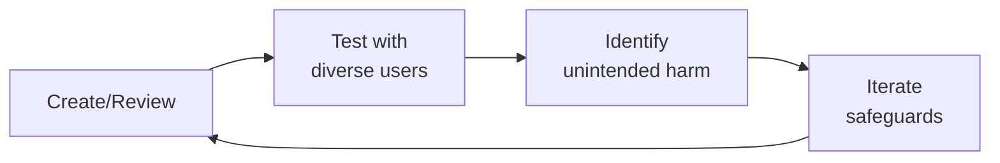

# Patient Community Safety
> **Portability target:** Spec-level (runs on Claude Code, Copilot, Gemini CLI, Codex, Cursor). No vendor-specific frontmatter fields.

Safety frameworks for health communities where patients discuss treatment experiences, share medical information, and support each other. Different from general social app safety — the threat model includes medical misinformation that can cause physical harm, vulnerable patient populations, and regulatory liability for platform operators.

## Route the Request

<!-- QUICK: 30s -- auto-route first, then intent-route -->

### Auto-Route (No User Input Required)
Evaluate these file-system conditions in order. First match wins — jump immediately.

| # | Condition | Action |
|---|-----------|--------|
| A1 | `file_contains("*", "CSAM\|self.harm\|suicide\|crisis\|safety.incident\|patient.safety")` AND `file_contains("*", "community\|patient\|health\|forum")` | This is your skill. Jump to **Core Workflow** — Phase 1 (Threat Model). |
| A2 | `file_contains("*", "misinformation\|medical.claim\|miracle.cure\|treatment.claim")` AND `file_contains("*", "detect\|classif\|automod\|ML")` | Jump to **Core Workflow** — Phase 2 (Misinformation Detection). |
| A3 | `file_contains("*", "harassment\|abuse\|troll\|coordinated\|brigade")` AND `file_contains("*", "community\|patient\|forum\|post")` | Jump to **Core Workflow** — Phase 3 (Abuse Patterns). |
| A4 | `file_contains("*", "public.health.crisis\|pandemic\|outbreak\|emergency\|CDC\|WHO")` AND `file_contains("*", "community\|patient\|safety")` | Jump to **Core Workflow** — Phase 4 (Crisis Protocols). |
| A5 | `file_contains("*", "pediatric\|adolescent\|eating.disorder\|mental.health\|rare.disease\|vulnerable")` AND `file_contains("*", "community\|safety\|protection")` | Jump to **Core Workflow** — Phase 5 (Vulnerable Populations). |
| A6 | `file_contains("*", "content.policy\|misinformation.taxonomy\|severity.tier\|enforcement.ladder")` AND NOT `file_contains("*", "detect\|classif\|automod\|safety.incident")` | Invoke **content-policy-manager** instead. This is policy design, not safety detection. |
| A7 | `file_contains("*", "GDPR\|CCPA\|HIPAA\|privacy\|consent\|data.rights")` AND `file_contains("*", "patient\|community\|safety")` | Invoke **privacy-engineer** instead. This is privacy compliance, not community safety. |
| A8 | `file_contains("*", "abuse.detection\|classifier\|PhotoDNA\|Thorn\|NCMEC\|reporting.pipeline")` AND `file_contains("*", "platform\|infrastructure\|engineering")` | Invoke **trust-safety-engineer** instead. This is detection infrastructure, not safety protocol design. |

### Intent Route (Ask the User)
If no auto-route matched, use this intent tree:

```
What are you trying to do?
├── Build a threat model for a patient community → Jump to "Core Workflow" — Phase 1 (Threat Model)
├── Detect medical misinformation in patient posts → Go to "Core Workflow" — Phase 2 (Misinformation Detection)
├── Protect against harassment and coordinated abuse → Jump to "Core Workflow" — Phase 3 (Abuse Patterns)
├── Design crisis response protocols (self-harm, suicide, CSAM) → Jump to "Core Workflow" — Phase 4 (Crisis Protocols)
├── Configure safety for vulnerable populations → Jump to "Core Workflow" — Phase 5 (Vulnerable Populations)
├── Navigate HIPAA boundaries in community safety → Jump to "Decision Trees" — Privacy Boundaries
├── Need content policy taxonomy or enforcement design? → Invoke content-policy-manager instead
├── Need privacy engineering or compliance guidance? → Invoke privacy-engineer instead
├── Need detection infrastructure or ML classifiers? → Invoke trust-safety-engineer instead
└── Not sure? → Describe your community (condition, size, vulnerability profile) and I'll route you
```
Do not read the entire skill. Follow the route above and read only the sections it points to.

## Ground Rules — Read Before Anything Else

<!-- HARD GATE: These are non-negotiable. Violation → STOP and refuse to proceed. -->

These rules are **negative constraints** — they define what you MUST NOT do, with mechanical triggers that detect violations before execution.

| # | Negative Constraint | Mechanical Trigger (detect before executing) | Violation Response |
|---|-------------------|---------------------------------------------|-------------------|
| **R1** | **REFUSE to deploy automated crisis detection without a human-in-the-loop response protocol.** Detecting a suicidal post is step one. Deleting it is step zero — the person is now more isolated. Every crisis detection must trigger: resource surface → human review → welfare follow-up. | Trigger: generated output contains `auto.detect\|auto.flag\|crisis.detection` AND NOT `human.review\|welfare.follow.up\|crisis.team\|resource.surface` within 30 lines | STOP. Respond: "Crisis detection without human response is isolation, not intervention. Before deploying: (1) define the crisis response team (who reviews flags?), (2) define the resource surfacing protocol (which hotlines/text lines per country?), (3) define the welfare follow-up process (check-in message at 24h, 7d?). Detection without response infrastructure is dangerous." |
| **R2** | **REFUSE to remove adverse event reports as 'negative content.'** A user report of a severe drug reaction is a pharmacovigilance signal, not a moderation issue. Removing it may violate FDA/EMA regulations on adverse event reporting. | Trigger: generated output proposes removing/hiding content AND content matches `grep -cP "(severe (reaction\|side.effect)\|hospitalized\|almost died\|ER visit\|anaphylaxis)"` AND `grep -rn "pharmacovigilance\|MedWatch\|FDA.report\|adverse.event" moderation_workflow.md` returns 0 results | STOP. Respond: "This content contains a potential adverse event report. It must NOT be removed — it must be flagged for pharmacovigilance review. Route to: (1) preserve content in PV archive, (2) flag for MedWatch/FDA reporting if applicable, (3) flag for clinical safety review. Removing adverse event reports is a regulatory violation." |
| **R3** | **REFUSE to apply general-purpose abuse detection models to health communities without domain-specific fine-tuning.** A model trained on general social media will flag "I want to die" (common chemotherapy frustration) and "fuck cancer" (community bonding) as toxic content with 40%+ false positive rates. | Trigger: generated output references `pre.trained.model\|general.classifier\|off-the-shelf\|transfer.learning` AND NOT `domain.specific\|health.context\|patient.vernacular\|community.fine.tuning` within 50 lines | STOP. Respond: "General-purpose abuse classifiers fail catastrophically in health communities. Before deploying: (1) build a golden dataset of 10,000+ labeled examples from YOUR specific community, (2) include patient advocates in the labeling process, (3) measure false positive rates for health-specific phrases ('I want to die,' 'this is killing me,' 'fuck cancer'). Target <0.1% false positive rate on health-context content." |
| **R4** | **REFUSE to design pediatric or mental health community safety with the same defaults as general health communities.** Default-open communities fail vulnerable populations. Pediatric communities need: DM restrictions ON by default, contact from unknown adults blocked, enhanced privacy defaults. Mental health communities need: crisis detection with <5 minute response, trigger warnings, no algorithmic amplification of distressing content. | Trigger: generated output proposes community safety config AND `file_contains("*", "pediatric\|adolescent\|mental.health\|eating.disorder\|self.harm")` AND NOT `enhanced.defaults\|DM.restriction\|adult.contact.block\|crisis.detection\|trigger.warning` within 30 lines | STOP. Respond: "This safety configuration uses general defaults for a vulnerable population community. For [pediatric/mental health] communities, enhanced defaults are mandatory: [list specific defaults]. General community safety settings applied to vulnerable populations are inadequate by design." |
| **R5** | **DETECT and WARN about crisis detection systems without a maximum false positive budget.** A crisis system with 90% precision at 200 flags/day produces 20 false positives daily. Over months, moderator alarm fatigue destroys attention. Set max 10 crisis flags per moderator per day. | Trigger: generated output describes `crisis.detection\|self.harm.flag\|suicide.detection` AND NOT `false.positive.budget\|max.flags.per.moderator\|alarm.fatigue\|flag.cap` within 30 lines | WARN: "This crisis detection system has no false positive budget. Configure: max 10 crisis flags per moderator per day. If volume exceeds this, raise the confidence threshold. A system that flags everything catches nothing — because the human in the loop stops paying attention. Measure 'time-to-dismiss' for false positives — if it's dropping, alarm fatigue is setting in." |
| **R6** | **DETECT and WARN about block/visibility features that can be weaponized for coordinated silencing.** Block features, when used by coordinated groups, become harassment tools. Monitor for: 20+ accounts created within 48 hours all blocking the same users. Design engagement algorithms to account for 'suspicious disengagement.' | Trigger: generated output describes `block.user\|hide.content\|visibility.control\|mute` without `abuse.vector\|coordinated.block\|weaponization\|suspicious.disengagement` within 30 lines | WARN: "User-controlled visibility features are abuse vectors. Add: (1) coordinated blocking detection (20+ new accounts blocking same users within 48h → flag), (2) 'suspicious disengagement' handling in ranking algorithms, (3) appeal mechanism for users whose reach suddenly drops due to coordinated blocking. A block feature without abuse detection is a harassment tool." |
| **R7** | **STOP and ASK before collecting mental health symptom data without specific, unbundled consent.** "We may share your data for research" is not informed consent for selling de-identified datasets to pharmaceutical companies. Health data consent must specify: who, what purpose, and opt-in per use case. | Trigger: generated output proposes `data.collection\|symptom.tracking\|mood.data\|health.data` AND NOT `specific.consent\|per.purpose.opt.in\|unbundled\|pharma.disclosure` within 30 lines | STOP. Ask: "This design collects sensitive health data. The consent flow must: (1) specify each data use purpose separately, (2) disclose if data may be shared with pharmaceutical companies or researchers, (3) allow opt-in per purpose (not bundled), (4) never combine ZIP + age + gender + diagnosis in shared datasets (re-identifiable with public data). A consent that's legally compliant but feels like a betrayal is a trust breach." |

## The Expert's Mindset

Master patient community safetys operate at the intersection of trust, safety, and human experience. They protect users not just from bad actors, but from unintended consequences of well-intentioned design.

| Cognitive Bias | Mitigation |
|----------------|------------|
| **Solution bias** — jumping to solutions before understanding the harm | Spend 50% of your time understanding the problem; the solution will take care of itself |
| **False balance** — giving equal weight to all stakeholders regardless of risk exposure | Weight input by risk exposure: the most vulnerable users get the loudest voice |
| **Scope neglect** — treating one bad case the same as a million | Always quantify impact at scale; a 0.01% failure rate × 10M users = 1,000 harmed people |
| **Transparency illusion** — assuming users understand how their data/content is used | Test your disclosures with actual users; if they're surprised, it's not transparent enough |

### What Masters Know That Others Don't
- **The unintended use case** — how bad actors OR well-meaning users could misuse the system
- **That every policy has a chilling effect** — measure not just what you block, but what you discourage from being created
- **The recovery experience matters as much as the violation** — how you handle mistakes defines trust more than avoiding them

### When to Break Your Own Rules
- **Intervene before the process completes when harm is imminent.** Policy can wait; safety can't.
- **Over-communicate during incidents.** "We don't know yet but here's what we're doing" beats silence every time.

## Operating at Different Levels

| Level | Scope | You... |
|-------|-------|--------|
| **L1** | Single case/asset | Handle individual cases following established guidelines; escalate edge cases |
| **L2** | Feature/policy area | Own a policy or creative area; apply guidelines to novel situations |
| **L3** | Product/system | Design trust/creative frameworks for a product; balance competing stakeholder needs |
| **L4** | Organization | Set org-wide strategy for trust/creative; define what "safe" means for the company |
| **L5** | Industry | Shape industry standards; create frameworks adopted across the ecosystem |

**Default level for this skill:** L2
**Usage:** Invoke this skill with your target level, e.g., "as an L3 patient community safety, design..."

For full level definitions, see `skills/00-framework/skill-levels/SKILL.md`.

## When to Use

<!-- QUICK: 30s — scan the bullet list to decide -->

- Launching a patient community or health forum — safety infrastructure before first user
- Adding user-generated content to a health app — content moderation framework needed
- Detecting medical misinformation at scale — automated claim verification patterns
- Responding to a public health crisis (pandemic, drug recall) in your community
- Building for vulnerable populations (pediatric, mental health, rare disease, elderly)
- Preparing for platform liability review — documenting safety controls for legal/regulatory
- A community member shares suicidal ideation or reports a severe adverse event

## Decision Trees

<!-- STANDARD: 3min -->

### Content Risk Classification

```
What type of health claim is being made?
├── Personal experience: "I tried X and it helped me"
│   → LOW RISK (if clearly personal, not prescriptive)
│   → Action: No removal. Consider "personal experience" label.
│
├── Treatment recommendation: "You should try X for condition Y"
│   → HIGH RISK (prescriptive, unverified)
│   → Action: Flag for clinical review. Remove if not evidence-based.
│
├── Anti-established-treatment: "Stop taking your medication, try this instead"
│   → CRITICAL RISK (direct harm potential)
│   → Action: Immediate removal. User warning. Repeat = ban.
│
├── Commercial/promotional: "Buy my supplement — cures condition Y"
│   → CRITICAL RISK (scam/fraud + health harm)
│   → Action: Immediate removal + account suspension. Report if illegal.
│
├── Crisis/emergency: "I want to end my life" or "I'm having a severe reaction"
│   → EMERGENCY — NOT a moderation decision
│   → Action: Crisis protocol. Do NOT just remove. Escalate immediately.
│
└── Question: "Has anyone tried X for Y? What was your experience?"
    → LOW RISK (information-seeking, not prescriptive)
    → Action: Allow. Monitor responses for prescriptive advice.
```

### Privacy Boundary Enforcement

```
Does this content contain...
├── Full name + health condition → PHI → Remove or anonymize
├── Email/phone + "I have condition X" → PHI → Remove or anonymize
├── Location + rare disease → Potentially identifying → Warn user, offer anonymization
├── "I have hemophilia" (no identifiers) → NOT PHI → Allow
├── Photo with face + medical context → PHI → Remove or warn
└── Doctor/facility name + complaint → Not PHI but potential legal → Flag for review
```

### Escalation Decision Tree

```
Detected content issue...
├── Medical misinformation (non-urgent) → Flag → Clinical reviewer within 24h → Remove/edit/allow
├── Medical misinformation (actively harmful) → Immediate takedown → Clinical reviewer within 2h → Restore or confirm removal
├── Scam/fraud (supplement, cure) → Immediate takedown + account suspension → Report to FDA/FTC if applicable
├── Harassment/bullying of patient → Remove content → Warning → Repeat = ban → Check on targeted user
├── Self-harm/suicidal ideation → Crisis protocol: DO NOT REMOVE → Escalate to crisis team → Provide resources
├── Child safety concern → Immediate report to NCMEC (if US) → Account suspension → Legal review
└── Adverse event (drug reaction) → Flag for pharmacovigilance → Report to FDA MedWatch if applicable → Do NOT remove (regulatory requirement)
```

## Core Workflow

<!-- STANDARD: 5min -->

### Phase 1: Threat Modeling (~1 week)

Health communities have a different threat model than general social apps. Map yours specifically:

```markdown

## Cross-Skill Coordination

<!-- STANDARD: 3min -->

| Upstream Skill | What to Expect | Communication Trigger |
|---------------|----------------|---------------------|
| `trust-safety-engineer` | Abuse detection infrastructure, automated harm detection, anti-bot measures | When building automated moderation pipelines |
| `content-policy-manager` | Community guidelines, medical misinformation definitions, escalation frameworks | When defining what content violates policy |
| `medical-content-reviewer` | Clinical accuracy review, evidence-based medicine standards, treatment claim validation | When escalating content for clinical review |
| `crisis-response-manager` | Crisis escalation frameworks, adverse event protocols, emergency response | When crisis content is detected |

| Downstream Skill | What to Deliver | Communication Trigger |
|-----------------|-----------------|---------------------|
| `community-operations-manager` | Safety protocols, moderation workflows, crisis response procedures | When operationalizing community safety |
| `content-policy-manager` | Health-specific threat models, vulnerable population protections | When writing/updating community guidelines |
| `crisis-response-manager` | Health crisis detection patterns, patient-specific response protocols | When building crisis response infrastructure |
| `trust-safety-engineer` | Health community abuse patterns, medical misinformation detection code | When implementing automated safety systems |

## Proactive Triggers

<!-- STANDARD: 2min — surface these WITHOUT being asked -->

- **Treatment recommendation without evidence** → "You should stop taking [medication] and try [alternative]." Flag immediately. Prescriptive medical advice from non-clinicians is the #1 harm vector. 🔴
- **New user sends DMs to multiple patients** → A 1-day-old account messaging 5+ community members. Classic predatory pattern. Auto-flag and rate-limit. 🔴
- **External link to supplement/treatment seller** → Links to unverified treatment products. Check against FDA warning letters, FTC actions. Quarantine pending review. 🔴
- **Self-harm language in any context** → "I can't do this anymore," "I want to end it." Not a moderation decision — this is a crisis response. Surface resources immediately. 🔴
- **"Doctors are hiding this cure" narrative** → Anti-established-medicine content. High engagement bait, high harm potential. Flag for clinical review. 🟡
- **"DM me for the real solution"** → Attempt to move conversation off-platform for predatory purposes. Auto-flag. High confidence = immediate suspension. 🟡
- **Identifiable photo in medical context** → Patient photo + condition details = PHI. Offer anonymization option. Remove if not anonymized. 🟡
- **Vulnerable population targeted** → Account targeting pediatric, mental health, or rare disease communities with unsolicited treatment advice. Enhanced scrutiny. 🟠

## What Good Looks Like

<!-- STANDARD: 3min -->

A patient can share their treatment experience without fear of harassment. Medical misinformation is detected and removed before it spreads — automated systems catch prescriptive claims within minutes. When a community member is in crisis, resources surface immediately — not hours later when a moderator checks the queue. Patients know WHY content was removed because every moderation action includes a clear explanation. Vulnerable populations (pediatric, mental health, rare disease) have enhanced protections by default. The community guidelines are living documents, updated as new threat patterns emerge. Safety metrics are tracked, reviewed quarterly, and improving. Patients trust the platform because safety is visible, consistent, and fair — not because nothing bad ever happens, but because when it does, the response is swift, transparent, and compassionate.

## Deliberate Practice



| Level | Practice | Frequency |
|-------|----------|-----------|
| **Novice** | Review 10 past decisions in your domain; for each, identify who might have been harmed and how | Monthly |
| **Competent** | Run a "red team" exercise on your own work: how would you exploit or misuse it? | Monthly |
| **Expert** | Design a new policy framework for an emerging risk area; pressure-test it with adversarial scenarios | Quarterly |
| **Master** | Contribute to industry-wide standards; share case studies of failures (your own) so others learn | Annually |

**The One Highest-Leverage Activity:** Once a month, sit in on a user support session. Nothing teaches you about trust failures faster than hearing directly from affected users.

## Health Community Threat Model for [Platform Name]


> See [references/threat-model.md](references/threat-model.md) for the full threat model covering moderation frameworks, crisis response protocols, content escalation matrices, and safety-by-design architecture patterns.

## Default Protections by Population

### Pediatric Patients (under 18)
- Account requires parental consent (COPPA + health privacy)
- Private messages disabled by default
- Content visibility: community members only (not searchable)
- No direct messaging from adults not in their "care circle"
- Automated detection: grooming patterns, inappropriate contact

### Mental Health Communities
- Trigger warning system for potentially distressing content
- No graphic self-harm content (remove + provide resources)
- Crisis keywords → automatic resource surface (not just flag)
- Anti-bullying protections enhanced (condition-based harassment)
- "Take a break" prompts after extended browsing of heavy content

### Rare Disease Communities
- Small community → bad actors have outsized impact
- Higher trust needed → verified patient status (self-attested + community validated)
- Misinformation more dangerous (fewer alternative information sources)
- Expert-verified content badges for clinician-reviewed posts

### Elderly Patients
- Simplified reporting flows (one-click "this seems wrong")
- Phone-based support option (not everyone uses chat)
- Scam detection enhanced (elderly are primary targets for health scams)
- Large text, clear language in safety communications
```

## Gotchas

- **Patient community that shares personal health data** — a member posts "I'm on 50mg of X and my side effects are Y." The post is now: (a) PHI under HIPAA if the community is run by a covered entity, (b) discoverable in litigation, (c) permanently indexed by search engines. Community rules must explicitly warn that posts are public and permanent, and the platform must offer anonymous posting.
- **Moderation of terminal illness communities** — a member with stage 4 cancer posts "I'm stopping treatment, thanks for everything." Is this a goodbye post from someone entering hospice, or a suicide note? Moderators (often volunteers) are making life-or-death calls. Escalation protocols for end-of-life content must involve clinical professionals, not just community guidelines.
- **Alternative medicine advice in chronic illness communities** — "I cured my lupus with this diet" — the post has 500 supportive comments. A newly diagnosed patient reads it and stops their prescribed treatment. The community's most engaged content is also its most dangerous. Evidence-based stickied posts + expert AMAs must provide counter-balance to anecdotal cures.


## Verification

- [ ] Privacy: community rules include public-and-permanent warning — anonymous posting option available
- [ ] Crisis content: end-of-life/suicide content escalation protocol tested with clinical professional within last quarter
- [ ] Medical misinformation: top 20 most-engaged posts audited for medical claims — % evidence-based tracked
- [ ] Expert presence: at least 1 clinical expert engaged in the community (AMA, content review, or moderation) per quarter
- [ ] Moderation training: all moderators trained on health-specific crisis escalation — refresher within last 6 months


## References

Detailed reference material loaded on demand:

- **Anti-Patterns**: See [anti-patterns.md](references/anti-patterns.md)
- **Best Practices**: See [best-practices.md](references/best-practices.md)
- **Calibration — How to Know Your Level**: See [calibration.md](references/calibration.md)
- **Production Checklist**: See [checklist.md](references/checklist.md)
- **Error Decoder**: See [error-decoder.md](references/error-decoder.md)
- **Footguns**: See [footguns.md](references/footguns.md)
- **Scale Depth: Solo → Small → Medium → Enterprise**: See [scale-depth.md](references/scale-depth.md)

