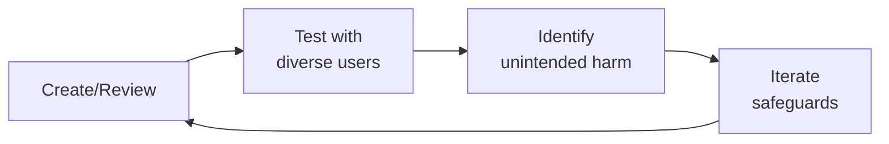

# Patient Community Safety

Safety frameworks for health communities where patients discuss treatment experiences, share medical information, and support each other. Different from general social app safety — the threat model includes medical misinformation that can cause physical harm, vulnerable patient populations, and regulatory liability for platform operators.

## Route the Request
<!-- QUICK: 30s — pick your path, skip the rest -->

```
Request: "How do I keep this patient community safe?"
├── ...from medical misinformation? → Jump to Phase 2 (Misinformation Detection)
├── ...from bad actors/harassment? → Jump to Phase 3 (Abuse Patterns)
├── ...during a public health crisis? → Jump to Phase 4 (Crisis Protocols)
├── ...for vulnerable populations (pediatric, mental health)? → Jump to Phase 5 (Vulnerable Populations)
├── ...while staying HIPAA compliant? → Jump to Decision Trees (Privacy Boundaries)
└── Starting from scratch?
    → Phase 1. Build the threat model before writing community guidelines.
```

## Ground Rules — Read Before Anything Else
<!-- STANDARD: 3min -->

1. **Medical misinformation can kill.** Unlike general social media misinformation (politics, entertainment), wrong medical information leads to skipped treatments, dangerous self-medication, or delayed emergency care. The stakes are life and death.
2. **Patients are not content moderators.** Community members reporting harmful content is a signal, not a solution. Automated detection + clinical review must be the primary defense.
3. **Privacy boundaries in health communities are different.** A patient's forum post about their treatment IS PHI if combined with their account identity. Community safety must operate within HIPAA constraints.
4. **Vulnerable populations need proactive protection.** Patients with chronic conditions, mental health diagnoses, or rare diseases are targeted by scammers, miracle-cure sellers, and predatory actors. Default-open communities fail these populations.
5. **Clinical escalation has legal liability.** If your platform detects a patient in crisis (suicidal ideation, severe adverse event), you have a duty of care. Have the protocol BEFORE the first incident.


## The Expert's Mindset

Master patient community safetys operate at the intersection of trust, safety, and human experience. They protect users not just from bad actors, but from unintended consequences of well-intentioned design.

| Cognitive Bias | Mitigation |
|----------------|------------|
| **Solution bias** — jumping to solutions before understanding the harm | Spend 50% of your time understanding the problem; the solution will take care of itself |
| **False balance** — giving equal weight to all stakeholders regardless of risk exposure | Weight input by risk exposure: the most vulnerable users get the loudest voice |
| **Scope neglect** — treating one bad case the same as a million | Always quantify impact at scale; a 0.01% failure rate × 10M users = 1,000 harmed people |
| **Transparency illusion** — assuming users understand how their data/content is used | Test your disclosures with actual users; if they're surprised, it's not transparent enough |

### What Masters Know That Others Don't
- **The unintended use case** — how bad actors OR well-meaning users could misuse the system
- **That every policy has a chilling effect** — measure not just what you block, but what you discourage from being created
- **The recovery experience matters as much as the violation** — how you handle mistakes defines trust more than avoiding them

### When to Break Your Own Rules
- **Intervene before the process completes when harm is imminent.** Policy can wait; safety can't.
- **Over-communicate during incidents.** "We don't know yet but here's what we're doing" beats silence every time.
## Operating at Different Levels

| Level | Scope | You... |
|-------|-------|--------|
| **L1** | Single case/asset | Handle individual cases following established guidelines; escalate edge cases |
| **L2** | Feature/policy area | Own a policy or creative area; apply guidelines to novel situations |
| **L3** | Product/system | Design trust/creative frameworks for a product; balance competing stakeholder needs |
| **L4** | Organization | Set org-wide strategy for trust/creative; define what "safe" means for the company |
| **L5** | Industry | Shape industry standards; create frameworks adopted across the ecosystem |

**Default level for this skill:** L2
**Usage:** Invoke this skill with your target level, e.g., "as an L3 patient community safety, design..."

For full level definitions, see `skills/00-framework/skill-levels/SKILL.md`.

## When to Use
<!-- QUICK: 30s — scan the bullet list to decide -->

- Launching a patient community or health forum — safety infrastructure before first user
- Adding user-generated content to a health app — content moderation framework needed
- Detecting medical misinformation at scale — automated claim verification patterns
- Responding to a public health crisis (pandemic, drug recall) in your community
- Building for vulnerable populations (pediatric, mental health, rare disease, elderly)
- Preparing for platform liability review — documenting safety controls for legal/regulatory
- A community member shares suicidal ideation or reports a severe adverse event

## Decision Trees
<!-- STANDARD: 3min -->

### Content Risk Classification

```
What type of health claim is being made?
├── Personal experience: "I tried X and it helped me"
│   → LOW RISK (if clearly personal, not prescriptive)
│   → Action: No removal. Consider "personal experience" label.
│
├── Treatment recommendation: "You should try X for condition Y"
│   → HIGH RISK (prescriptive, unverified)
│   → Action: Flag for clinical review. Remove if not evidence-based.
│
├── Anti-established-treatment: "Stop taking your medication, try this instead"
│   → CRITICAL RISK (direct harm potential)
│   → Action: Immediate removal. User warning. Repeat = ban.
│
├── Commercial/promotional: "Buy my supplement — cures condition Y"
│   → CRITICAL RISK (scam/fraud + health harm)
│   → Action: Immediate removal + account suspension. Report if illegal.
│
├── Crisis/emergency: "I want to end my life" or "I'm having a severe reaction"
│   → EMERGENCY — NOT a moderation decision
│   → Action: Crisis protocol. Do NOT just remove. Escalate immediately.
│
└── Question: "Has anyone tried X for Y? What was your experience?"
    → LOW RISK (information-seeking, not prescriptive)
    → Action: Allow. Monitor responses for prescriptive advice.
```

### Privacy Boundary Enforcement

```
Does this content contain...
├── Full name + health condition → PHI → Remove or anonymize
├── Email/phone + "I have condition X" → PHI → Remove or anonymize
├── Location + rare disease → Potentially identifying → Warn user, offer anonymization
├── "I have hemophilia" (no identifiers) → NOT PHI → Allow
├── Photo with face + medical context → PHI → Remove or warn
└── Doctor/facility name + complaint → Not PHI but potential legal → Flag for review
```

### Escalation Decision Tree

```
Detected content issue...
├── Medical misinformation (non-urgent) → Flag → Clinical reviewer within 24h → Remove/edit/allow
├── Medical misinformation (actively harmful) → Immediate takedown → Clinical reviewer within 2h → Restore or confirm removal
├── Scam/fraud (supplement, cure) → Immediate takedown + account suspension → Report to FDA/FTC if applicable
├── Harassment/bullying of patient → Remove content → Warning → Repeat = ban → Check on targeted user
├── Self-harm/suicidal ideation → Crisis protocol: DO NOT REMOVE → Escalate to crisis team → Provide resources
├── Child safety concern → Immediate report to NCMEC (if US) → Account suspension → Legal review
└── Adverse event (drug reaction) → Flag for pharmacovigilance → Report to FDA MedWatch if applicable → Do NOT remove (regulatory requirement)
```

## Core Workflow
<!-- STANDARD: 5min -->

### Phase 1: Threat Modeling (~1 week)

Health communities have a different threat model than general social apps. Map yours specifically:

```markdown
## Health Community Threat Model for [Platform Name]

### Assets to Protect
- Patient physical safety (from bad medical advice)
- Patient emotional safety (from harassment, bullying)
- Patient privacy (PHI exposure)
- Clinical accuracy of shared information
- Community trust (platform credibility)
- Regulatory compliance (HIPAA, FDA, FTC)

### Threat Actors
1. **Well-meaning misinformer** — Patient sharing something that worked for them but is dangerous
2. **Commercial scammer** — Selling unproven treatments, supplements, "cures"
3. **Anti-medicine activist** — Organized effort to discourage evidence-based treatment
4. **Predator** — Targeting vulnerable patients for exploitation
5. **Troll/harasser** — Targeting patients based on their health conditions
6. **Data harvester** — Scraping patient community for PHI/sensitive data

### Attack Vectors
- Public forum posts (highest volume, most visible)
- Private messages (hardest to detect, highest harm potential)
- User profiles/bios (often overlooked in moderation)
- External links (can lead to harmful content off-platform)
- Images/media (medical images can be PHI, can contain harmful advice)
```

### Phase 2: Medical Misinformation Detection (~2 weeks)

Build automated detection with clinical review escalation:

```python
# app/services/misinformation_detection.py
from enum import Enum
from typing import Optional

class ClaimRisk(Enum):
    LOW = "personal_experience"
    MEDIUM = "unverified_claim"
    HIGH = "treatment_recommendation"
    CRITICAL = "anti_established_treatment"

class MisinformationDetector:
    """Pattern-based detection — AI-assisted, human-reviewed."""

    # High-risk patterns: prescriptive language about treatment
    PRESCRIPTIVE_PATTERNS = [
        r"( stop|quit|don't take|never take)\s+(your|the)\s+(medication|meds|drug|treatment)",
        r"(try|use|take)\s+(this|these)\s+(instead|rather than)\s+(your|the)\s+(medication|treatment)",
        r"(cure|heal|fix|reverse)\w*\s+(your|the)\s+(cancer|diabetes|hemophilia|condition)",
        r"(doctors?|they)\s+(don't want|won't tell|are hiding)\s+(you|patients?)",
    ]

    # Medium-risk: unverified treatment claims
    UNVERIFIED_CLAIM_PATTERNS = [
        r"(I|you|they)\s+(should|must|need to|have to)\s+(try|take|use)\s+[\w\s]+for",
        r"(studies?|research)\s+(shows?|proves?)\s+that\s+[\w\s]+(cures?|treats?|heals?)",
        r"(natural|cure|remedy)\s+for\s+(your|the)\s+(condition|disease|symptoms?)",
    ]

    def classify_risk(self, content: str) -> tuple[ClaimRisk, Optional[str]]:
        """Classify content risk level. Returns (risk, matched_pattern)."""
        for pattern in self.PRESCRIPTIVE_PATTERNS:
            if re.search(pattern, content, re.IGNORECASE):
                return ClaimRisk.CRITICAL, pattern

        for pattern in self.UNVERIFIED_CLAIM_PATTERNS:
            if re.search(pattern, content, re.IGNORECASE):
                return ClaimRisk.HIGH, pattern

        # Check for personal experience sharing (low risk)
        if re.search(r"(in my experience|I found that|for me personally|helped me)", content, re.IGNORECASE):
            return ClaimRisk.LOW, None

        return ClaimRisk.MEDIUM, None

    def get_moderation_action(self, risk: ClaimRisk, user_history: dict) -> str:
        """Determine moderation action based on risk and user history."""
        actions = {
            ClaimRisk.LOW: "allow_with_label",
            ClaimRisk.MEDIUM: "flag_for_clinical_review",
            ClaimRisk.HIGH: "quarantine_pending_review",
            ClaimRisk.CRITICAL: "immediate_removal",
        }

        # Escalate repeat offenders
        if risk in (ClaimRisk.HIGH, ClaimRisk.CRITICAL):
            if user_history.get('previous_warnings', 0) >= 2:
                return "suspend_account"
            if user_history.get('previous_removals', 0) >= 1:
                return "suspend_account"

        return actions[risk]
```

### Phase 3: Abuse Pattern Detection for Health Communities (~1 week)

```python
# app/services/health_community_abuse.py

class HealthCommunityAbuseDetector:
    """Detect abuse patterns specific to health communities."""

    # Predatory patterns targeting vulnerable patients
    PREDATORY_PATTERNS = [
        r"(DM|message|PM)\s+me\s+(for|if you want|to get)\s+(help|advice|treatment|cure)",
        r"(I can help you|I can cure|I can treat)\s+(your|the)\s+(condition|disease)",
        r"(contact|email|call|text)\s+me\s+(at|on)\s+\d{3}",
    ]

    # Harassment based on health condition
    CONDITION_HARASSMENT_PATTERNS = [
        r"( it's your own fault| you deserve| you brought this on)",
        r"(just exercise|just eat better|just think positive)\s+(and|to)\s+(cure|fix)",
        r"you('re| are)\s+(faking|exaggerating|pretending)",
    ]

    # Data harvesting (trying to collect PHI from community members)
    DATA_HARVESTING_PATTERNS = [
        r"(what's your|share your)\s+(diagnosis|treatment|medication|doctor|hospital)",
        r"(survey|research study|clinical trial)\s+(about|for)\s+(your|patients? with)",
        r"(email|phone|address)\s+(so I can|to)\s+(send|share|contact)",
    ]

    def detect_abuse(self, content: str, context: dict) -> dict:
        """Returns abuse classification and confidence."""
        # Check context: PM vs public post, user relationship, new account
        if context.get('channel') == 'private_message':
            confidence_multiplier = 1.5  # PMs are higher risk
        else:
            confidence_multiplier = 1.0

        results = []

        for pattern in self.PREDATORY_PATTERNS:
            if re.search(pattern, content, re.IGNORECASE):
                results.append({'type': 'predatory', 'confidence': 0.7 * confidence_multiplier})

        for pattern in self.CONDITION_HARASSMENT_PATTERNS:
            if re.search(pattern, content, re.IGNORECASE):
                results.append({'type': 'condition_harassment', 'confidence': 0.8 * confidence_multiplier})

        for pattern in self.DATA_HARVESTING_PATTERNS:
            if re.search(pattern, content, re.IGNORECASE):
                results.append({'type': 'data_harvesting', 'confidence': 0.6 * confidence_multiplier})

        return {'flags': results, 'action': self._determine_action(results, context)}

    def _determine_action(self, results: list, context: dict) -> str:
        if not results:
            return 'allow'
        high_conf = [r for r in results if r['confidence'] > 0.8]
        if any(r['type'] == 'predatory' for r in high_conf):
            return 'suspend_account'
        if high_conf:
            return 'remove_content_and_warn'
        return 'flag_for_review'
```

### Phase 4: Crisis Protocol Implementation (~1 week)

```python
# app/services/crisis_response.py

class HealthCrisisProtocol:
    """Protocols for health emergencies detected in community content."""

    CRISIS_KEYWORDS = [
        "kill myself", "end my life", "suicide", "want to die",
        "no reason to live", "better off dead", "can't go on",
        "severe allergic reaction", "anaphylaxis", "can't breathe",
        "overdose", "took too many", "severe bleeding",
        "won't stop bleeding", "hemorrhaging",
    ]

    CRISIS_RESOURCES = {
        'US': {
            'suicide': '988 Suicide & Crisis Lifeline — Call or text 988',
            'crisis_text': 'Text HOME to 741741',
            'emergency': 'Call 911 or go to nearest emergency room',
        },
        'UK': {
            'suicide': 'Samaritans — Call 116 123',
            'crisis_text': 'Text SHOUT to 85258',
            'emergency': 'Call 999 or go to nearest A&E',
        },
        'EU': {
            'suicide': 'EU emergency number: 112',
            'emergency': 'Call 112',
        },
    }

    async def handle_crisis_detection(self, content: str, user_context: dict) -> dict:
        """
        When crisis content is detected, this is NOT a moderation action.
        This is an emergency response. DO NOT simply remove the content.
        """
        crisis_type = self._classify_crisis(content)
        country = user_context.get('country', 'US')
        resources = self.CRISIS_RESOURCES.get(country, self.CRISIS_RESOURCES['US'])

        response = {
            'crisis_type': crisis_type,
            'immediate_action': 'surface_resources_in_app',
            'escalation': 'notify_crisis_team',
            'content_action': 'do_not_remove',  # Preserve for potential welfare check
            'user_message': self._craft_crisis_message(crisis_type, resources),
            'internal_actions': [
                'Log incident for compliance',
                'Notify designated crisis response team member',
                'If pediatric: follow mandatory reporting requirements',
            ]
        }
        return response

    def _craft_crisis_message(self, crisis_type: str, resources: dict) -> str:
        """Message shown to user in crisis. Must be supportive, not clinical."""
        if crisis_type == 'suicide':
            return (
                "We care about your safety. If you're thinking about suicide, "
                "please reach out for support right now:\n\n"
                f"📞 {resources['suicide']}\n"
                f"💬 {resources.get('crisis_text', '')}\n"
                f"🚨 {resources['emergency']}\n\n"
                "You are not alone. These services are free, confidential, "
                "and available 24/7."
            )
        # ... other crisis types
```

### Phase 5: Vulnerable Population Protection (~1 week)

```markdown
## Default Protections by Population

### Pediatric Patients (under 18)
- Account requires parental consent (COPPA + health privacy)
- Private messages disabled by default
- Content visibility: community members only (not searchable)
- No direct messaging from adults not in their "care circle"
- Automated detection: grooming patterns, inappropriate contact

### Mental Health Communities
- Trigger warning system for potentially distressing content
- No graphic self-harm content (remove + provide resources)
- Crisis keywords → automatic resource surface (not just flag)
- Anti-bullying protections enhanced (condition-based harassment)
- "Take a break" prompts after extended browsing of heavy content

### Rare Disease Communities
- Small community → bad actors have outsized impact
- Higher trust needed → verified patient status (self-attested + community validated)
- Misinformation more dangerous (fewer alternative information sources)
- Expert-verified content badges for clinician-reviewed posts

### Elderly Patients
- Simplified reporting flows (one-click "this seems wrong")
- Phone-based support option (not everyone uses chat)
- Scam detection enhanced (elderly are primary targets for health scams)
- Large text, clear language in safety communications
```

## Cross-Skill Coordination
<!-- STANDARD: 3min -->

| Upstream Skill | What to Expect | Communication Trigger |
|---------------|----------------|---------------------|
| `trust-safety-engineer` | Abuse detection infrastructure, automated harm detection, anti-bot measures | When building automated moderation pipelines |
| `content-policy-manager` | Community guidelines, medical misinformation definitions, escalation frameworks | When defining what content violates policy |
| `medical-content-reviewer` | Clinical accuracy review, evidence-based medicine standards, treatment claim validation | When escalating content for clinical review |
| `crisis-response-manager` | Crisis escalation frameworks, adverse event protocols, emergency response | When crisis content is detected |

| Downstream Skill | What to Deliver | Communication Trigger |
|-----------------|-----------------|---------------------|
| `community-operations-manager` | Safety protocols, moderation workflows, crisis response procedures | When operationalizing community safety |
| `content-policy-manager` | Health-specific threat models, vulnerable population protections | When writing/updating community guidelines |
| `crisis-response-manager` | Health crisis detection patterns, patient-specific response protocols | When building crisis response infrastructure |
| `trust-safety-engineer` | Health community abuse patterns, medical misinformation detection code | When implementing automated safety systems |

## Proactive Triggers
<!-- STANDARD: 2min — surface these WITHOUT being asked -->

- **Treatment recommendation without evidence** → "You should stop taking [medication] and try [alternative]." Flag immediately. Prescriptive medical advice from non-clinicians is the #1 harm vector. 🔴
- **New user sends DMs to multiple patients** → A 1-day-old account messaging 5+ community members. Classic predatory pattern. Auto-flag and rate-limit. 🔴
- **External link to supplement/treatment seller** → Links to unverified treatment products. Check against FDA warning letters, FTC actions. Quarantine pending review. 🔴
- **Self-harm language in any context** → "I can't do this anymore," "I want to end it." Not a moderation decision — this is a crisis response. Surface resources immediately. 🔴
- **"Doctors are hiding this cure" narrative** → Anti-established-medicine content. High engagement bait, high harm potential. Flag for clinical review. 🟡
- **"DM me for the real solution"** → Attempt to move conversation off-platform for predatory purposes. Auto-flag. High confidence = immediate suspension. 🟡
- **Identifiable photo in medical context** → Patient photo + condition details = PHI. Offer anonymization option. Remove if not anonymized. 🟡
- **Vulnerable population targeted** → Account targeting pediatric, mental health, or rare disease communities with unsolicited treatment advice. Enhanced scrutiny. 🟠

## Best Practices
<!-- STANDARD: 3min -->

1. **Tiered moderation: automated → clinical review → human judgment.** Automation catches patterns. Clinical reviewers validate medical accuracy. Human moderators handle nuanced cases. No single layer is sufficient.
2. **Crisis content is NEVER just removed.** A post about suicidal ideation that gets deleted by an algorithm leaves the person MORE isolated. Surface resources, escalate to crisis team, preserve the content for welfare follow-up.
3. **Personal experience ≠ medical advice.** "This worked for me" is different from "You should do this." Label personal experiences. Remove prescriptive advice from non-clinicians.
4. **Adverse events are regulatory reports, not content to moderate.** If a user reports a severe drug reaction, you have pharmacovigilance obligations. Flag for MedWatch/FDA reporting. Do NOT remove.
5. **Repeat education before punishment.** First-time well-meaning misinformers get education + content removal. Repeat offenders get escalating consequences. Scammers get banned immediately.
6. **Vulnerable populations get enhanced defaults.** Pediatric, mental health, and rare disease communities should have stricter privacy defaults, DM restrictions, and content filtering ON by default.
7. **Transparency builds trust.** When content is removed, tell the user why. "This post was removed because it made a medical claim that could not be verified. Our clinical review team determined..." Opacity breeds conspiracy theories.
8. **Safety metrics are community health metrics.** Track: misinformation prevalence, time-to-detection, crisis response time, user reports per 1K posts. These ARE your community health dashboard.

## Anti-Patterns
<!-- STANDARD: 2min -->

| ❌ Anti-Pattern | ✅ Do This Instead |
|----------------|-------------------|
| "We'll use the same moderation as Reddit/Facebook" | Health communities need clinical review escalation + medical misinformation detection. General social moderation isn't sufficient for content that can cause physical harm. |
| Auto-deleting crisis content without human follow-up | Crisis content gets: immediate resource surface → human review → welfare follow-up. Automation triggers response, not deletion. |
| "Free speech" absolutism in health communities | "Free speech" doesn't include telling someone to stop their chemotherapy. Health communities have a duty of care that overrides absolute free expression. |
| Moderating without clinical expertise available | At minimum, have a clinical advisor on retainer for content appeals. At scale, hire clinical content reviewers. Non-clinicians shouldn't make final medical accuracy determinations. |
| One-size-fits-all safety for all community segments | Pediatric, mental health, rare disease, and elderly communities each need tailored protections. What's safe for a general health forum may be unsafe for teens with eating disorders. |
| Removing adverse event reports as "negative content" | Adverse event reports are legally required to be preserved and reported. Removing them can violate FDA regulations. Flag for pharmacovigilance, not moderation. |
| Waiting for user reports to detect problems | By the time a user reports harmful medical advice, 100 people have already seen it. Automated detection must catch prescriptive medical claims BEFORE they spread. |

## Error Decoder
<!-- STANDARD: 3min -->

| Symptom | Root Cause | Fix | Lesson |
|---------|-----------|-----|--------|
| Users moving to Discord/WhatsApp because "the platform censors everything" | Over-moderation without transparency. Users don't understand why content was removed. | When removing content, always explain WHY. Link to the specific community guideline. Offer appeal process. Publish transparency reports. | Censorship perception kills health communities. Transparency + education + appeals = trust. |
| Crisis content reported by users 4 hours after posting | Detection is purely report-based. Automated keyword detection wasn't implemented. | Deploy crisis keyword detection with < 5 minute response time. Users in crisis can't wait for someone to report their post. | Crisis detection must be automated. A 4-hour delay can be fatal. |
| Medical misinformation going viral because "it sounds credible" | Sophisticated misinformation uses scientific language. Pattern matching misses well-crafted false claims. | Layer clinical review with AI-assisted claim verification. Cross-reference claims against medical literature databases (PubMed). | Well-written misinformation is the hardest to detect. It requires clinical expertise, not just keyword matching. |
| Patient's own treatment experience removed as "misinformation" | "I tried [legitimate treatment] and it didn't work for me" is a valid patient experience, not misinformation. | Distinguish between: personal experience (allow), general claim from experience (label), prescriptive advice (remove). | Silencing negative treatment experiences is as harmful as spreading false cures. Patients need honest community feedback. |

## Production Checklist
<!-- STANDARD: 3min -->

| ID | Item | Status |
|----|------|--------|
| PS1 | Health community threat model documented — assets, threat actors, attack vectors | ☐ |
| PS2 | Automated medical misinformation detection deployed — prescriptive claim patterns | ☐ |
| PS3 | Clinical review escalation workflow active — < 24h for non-urgent, < 2h for harmful | ☐ |
| PS4 | Crisis keyword detection deployed — < 5 minute response time | ☐ |
| PS5 | Crisis protocol documented — suicide, adverse event, child safety, emergency | ☐ |
| PS6 | Crisis resources surfaced automatically — country-specific hotlines, text lines | ☐ |
| PS7 | Vulnerable population protections configured — pediatric, mental health, rare disease | ☐ |
| PS8 | Adverse event reporting pipeline integrated with FDA MedWatch | ☐ |
| PS9 | Content removal transparency — users told WHY content was removed, with appeal process | ☐ |
| PS10 | Safety metrics dashboard — misinformation prevalence, time-to-detection, crisis response time | ☐ |
| PS11 | Clinical advisor retained — available for content appeals and policy decisions | ☐ |
| PS12 | Community guidelines published — medical misinformation, personal experience vs advice, crisis resources | ☐ |
| PS13 | User reporting system tested — one-click report for medical misinformation, crisis, harassment | ☐ |
| PS14 | Quarterly safety audit — review detection effectiveness, false positive rates, missed incidents | ☐ |

## Footguns
<!-- DEEP: 10+min — war stories from patient community safety -->

| Footgun | What Happened | Root Cause | How to Prevent |
|---------|---------------|------------|----------------|
| A patient in a rare disease community posted about an experimental treatment trial in Mexico — it was a stem cell scam that cost patients $35,000 and caused 3 deaths | In March 2023, a member of a rare disease support community for ALS patients posted about a clinic in Tijuana offering "curative stem cell therapy" with "92% success rate." The post included the clinic's phone number and a testimonial from a supposed patient. Over 4 months, 12 community members traveled to the clinic, paying $35,000 each. Three died from infections related to the unsterile procedure. The platform had no medical misinformation detection, no treatment claim verification process, and no policy against promoting unlicensed medical facilities. | The platform treated the community as a neutral discussion space — "we don't evaluate medical claims." But in a rare disease community, desperate patients are specifically targeted by scammers. The platform's neutrality was exploited as a marketing channel for unlicensed treatments. | **Every health community needs active fraud detection for treatment claims.** Red flags: claims of cures for incurable conditions, specific success-rate numbers without published studies, clinics in jurisdictions with weak medical regulation, requests for upfront payment. Partner with organizations like the FDA's Health Fraud Branch or NORD (National Organization for Rare Disorders) to maintain a known-scam registry. When in doubt, remove first and verify later — a deleted post can be restored; a patient who traveled to a scam clinic can't be brought back. |
| A moderator in an eating disorder recovery community was secretly promoting pro-ana content via DM to vulnerable members — the platform discovered it after 11 months when a parent sued | A 28-year-old moderator for a major eating disorder support community was privately messaging teenage members with "thinspiration" content, diet pill recommendations, and encouragement to "stay dedicated to your goals." The messages were outside the public community and invisible to the platform's content moderation tools. 11 months later, a 15-year-old's parents discovered the messages and sued the platform. The moderator had passed the platform's background check — they had no prior offenses because private DMs had never been monitored. | The platform assumed moderation risk ended at the public community boundary. Private messages between moderators and users were invisible. The background check screened for criminal history, not predatory behavior patterns — there was no behavioral monitoring for moderators who disproportionately initiated private conversations with vulnerable users. | **Monitor moderator behavior, not just moderator content.** Track: what percentage of a moderator's interactions are private DMs vs public posts? What's the age distribution of users they DM? Set alerts for moderators whose private-message ratio exceeds 3 standard deviations above the moderation team average. Conduct quarterly random audits of moderator DMs with consent (built into the moderator agreement). A moderator badge is a trust signal to vulnerable users — bad actors specifically seek moderator positions to exploit that trust. |
| A crisis detection system flagged 200 posts/day as "suicidal" — 180 were false positives. Moderators developed alarm fatigue and started ignoring ALL crisis alerts, including the 20 real ones. | A mental health community deployed an AI crisis detection system in January 2024. The system had 90% precision — meaning 20 of 200 daily flags were genuine crises. Moderators had to review all 200 flags. Within 3 months, alarm fatigue set in. Moderators started clicking "dismiss" without reading. In April, a genuine crisis post — a user posting their suicide note in real time — was dismissed along with the noise. The user made an attempt (survived). The post had been flagged and dismissed in 4 seconds by a moderator who later said "I assumed it was another false positive like all the others." | The crisis detection threshold was set to maximize recall at the expense of precision. 90% precision sounds good in isolation — but at 200 flags/day, it produces 20 false positives per day. Over months, the false positive volume destroys moderator attention. The system was optimized for the metric (recall) rather than the human workflow (sustainable review volume). | **Design crisis detection for the human who has to review it.** Set a maximum false positive budget: no more than 10 crisis flags per moderator per day. If the system produces more flags than that, raise the confidence threshold — even if it means missing some true crises. A system that flags everything catches nothing, because the human in the loop stops paying attention. Measure "time-to-dismiss" for false positives — if it's dropping over time, your moderators are developing alarm fatigue. Rotate crisis review duty weekly to prevent desensitization. |
| A patient community's "block user" feature was weaponized by coordinated groups to mass-block LGBTQ+ cancer survivors, silencing their posts from community feeds | A cancer support community had a standard block feature: if a user blocks another user, they no longer see each other's content. In June 2023, a coordinated group from an external anti-LGBTQ+ forum created 200 accounts and systematically blocked every active LGBTQ+ member in the community. The blocked users' posts no longer appeared in the feeds of the 200 accounts — but more damagingly, the community's "trending" algorithm weighted engagement, and the blocked users' posts received less engagement because 200 active-looking accounts were no longer seeing or interacting with them. The posts of LGBTQ+ survivors effectively disappeared from the community's discovery surfaces. | The platform didn't consider the block feature as a vector for coordinated harm. Standard abuse detection looked for content violations (harassment, threats) — not for coordination patterns that used legitimate features for illegitimate purposes. The trending algorithm amplified the effect by treating reduced engagement as a signal of lower quality. | **Treat any user-controlled visibility feature as a potential abuse vector.** Monitor for coordinated blocking: if 20+ accounts created within 48 hours all block the same set of users, flag for investigation. Design engagement algorithms to account for "suspicious disengagement" — if a user's engagement drops suddenly due to new accounts blocking them, don't penalize their content in rankings. A block feature that can be weaponized is a coordinated harassment tool wearing the mask of a safety feature. |
| The platform collected detailed mental health symptom data "for research" — then sold anonymized datasets to pharmaceutical companies without patient consent | A mental health tracking app collected daily mood ratings, medication adherence data, and symptom journal entries from 400,000 users. The privacy policy stated data could be used "to improve our services and for research purposes." In February 2024, an investigative journalist discovered the company had sold "anonymized" datasets to 3 pharmaceutical companies for $2.1M total. The datasets included zip code, age, gender, diagnosis, and medication history — a combination that re-identified 87% of users when cross-referenced with public voter registration data. Patients joined the app seeking support; they became unwitting participants in pharmaceutical market research. | The company interpreted "research purposes" to include commercial pharmaceutical research without separately disclosing this. The "anonymization" was pseudonymization (removing names but keeping quasi-identifiers). The consent flow bundled data-sharing permissions into a single opt-in that users clicked through without reading — it was legally compliant, but patients felt betrayed. | **Health data consent must be specific, not bundled.** "We may share your data for research" is not informed consent — specify: "We may sell de-identified data to pharmaceutical companies for drug development research." Let users opt in/out of each data use separately. Never use zip code + age + gender + diagnosis in the same dataset — this combination is re-identifiable with public data. A privacy policy that's legally compliant but feels like a betrayal when discovered IS a trust breach — the legal department may say you're fine, but your patients will say you're not. |

## Calibration — How to Know Your Level
<!-- STANDARD: 3min — honest self-assessment -->

| You Know You're Stuck at L1 When... | You Know You've Reached L2 When... | You Know You're L3 When... |
|---|---|---|
| Your safety system is reactive — you address issues after a user reports them or a journalist writes about them | Your detection system catches 85%+ of policy violations before user reports, your false positive rate is under 5%, and your crisis response time is under 15 minutes | You've built a safety infrastructure where the community self-regulates 60%+ of minor violations through user reporting and peer moderation, freeing your team to focus on novel threat patterns |
| Your privacy policy is a template you copied from a competitor and your consent flow bundles everything into one checkbox | Your consent flows are granular (separate opt-ins for data sharing, research, marketing), your data sharing is disclosed in plain language, and your anonymization methods are validated against re-identification risk | You've designed a privacy framework that goes beyond legal compliance — your patients actively praise your data practices in app store reviews, and privacy regulators cite your consent flow as a positive example in guidance documents |
| You assume a feature designed for safety (blocking, reporting, crisis flags) can't be abused | You threat-model every safety feature for abuse vectors: "how could a coordinated group use this to silence or harm our most vulnerable users?" | You've discovered and mitigated a novel abuse vector in a patient community, published a case study, and other platforms have adopted your mitigation strategy |

**The Litmus Test:** Spend 2 hours in your patient community as a vulnerable user — create an account, join a support group for a stigmatized condition, and post something vulnerable. How long before you encounter harmful content? How easy is it to report? Does anything happen when you do? If you can't do this because you're afraid of what you'll find, you already know the answer. A patient community's safety isn't measured by the absence of lawsuits — it's measured by whether a newly diagnosed patient, at their most vulnerable moment, finds support or exploitation. If you wouldn't let your own family member join your community unsupervised, you have work to do.

## Scale Depth: Solo → Small → Medium → Enterprise
<!-- STANDARD: 3min -->

### Solo (1 developer, patient community MVP)
**Description:** Building MVP health community. < 100 users. No dedicated safety team.
**Approach:** Published community guidelines. Basic keyword detection (prescriptive patterns + crisis keywords). Manual review of all flagged content. Crisis protocol: surface 988/crisis resources. Clinical advisor: on-call consultant for content appeals.
**Time investment:** ~1 week to set up. ~2 hours/week ongoing.

### Small Team (2-10 developers, growing community, 1K-50K users)
**Description:** Active community. Real moderation volume. Starting to see bad actors.
**Approach:** Automated detection for all risk levels. Part-time clinical reviewer. Tiered moderation: auto-flag → clinical review → human mod. User reporting system. Crisis protocol: automated detection + human follow-up within 1 hour. Vulnerable population protections active. Safety metrics dashboard.
**Time investment:** ~1 month to set up. ~10 hours/week ongoing.

### Medium Team (10-50 developers, large community, 50K-500K users)
**Description:** Large, established community. Multiple conditions/segments. Regulatory scrutiny.
**Approach:** Machine learning-assisted detection. Full-time clinical review team. 24/7 crisis response. Automated adverse event reporting to FDA. Community health metrics with SLAs. Dedicated trust & safety team. Transparency reports published quarterly. External safety audit annually.
**Time investment:** Dedicated trust & safety team (2-4 FTE).

### Enterprise (50+ developers, global community, 500K+ users)
**Description:** Multi-country, multi-language health community. Multiple regulatory jurisdictions.
**Approach:** AI-powered detection with multi-language support. Global clinical review team across time zones. Country-specific crisis resources and protocols. Automated pharmacovigilance reporting to FDA, EMA, PMDA, etc. Safety research program. External safety advisory board. Real-time safety dashboards. Regulatory compliance across jurisdictions.
**Time investment:** Large trust & safety organization (10-20+ FTE).

## What Good Looks Like
<!-- STANDARD: 3min -->

A patient can share their treatment experience without fear of harassment. Medical misinformation is detected and removed before it spreads — automated systems catch prescriptive claims within minutes. When a community member is in crisis, resources surface immediately — not hours later when a moderator checks the queue. Patients know WHY content was removed because every moderation action includes a clear explanation. Vulnerable populations (pediatric, mental health, rare disease) have enhanced protections by default. The community guidelines are living documents, updated as new threat patterns emerge. Safety metrics are tracked, reviewed quarterly, and improving. Patients trust the platform because safety is visible, consistent, and fair — not because nothing bad ever happens, but because when it does, the response is swift, transparent, and compassionate.

## Deliberate Practice



| Level | Practice | Frequency |
|-------|----------|-----------|
| **Novice** | Review 10 past decisions in your domain; for each, identify who might have been harmed and how | Monthly |
| **Competent** | Run a "red team" exercise on your own work: how would you exploit or misuse it? | Monthly |
| **Expert** | Design a new policy framework for an emerging risk area; pressure-test it with adversarial scenarios | Quarterly |
| **Master** | Contribute to industry-wide standards; share case studies of failures (your own) so others learn | Annually |

**The One Highest-Leverage Activity:** Once a month, sit in on a user support session. Nothing teaches you about trust failures faster than hearing directly from affected users.

## References
<!-- STANDARD: 3min -->

- **trust-safety-engineer** — Abuse detection infrastructure, automated harm detection, anti-bot measures
- **content-policy-manager** — Community guidelines, medical misinformation definitions, escalation frameworks
- **medical-content-reviewer** — Clinical accuracy review, evidence-based medicine, treatment claim validation
- **crisis-response-manager** — Crisis escalation frameworks, adverse event protocols, emergency response coordination
- **community-operations-manager** — Community health metrics, ambassador programs, operational workflows
