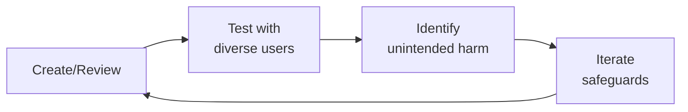

# Patient Community Safety
> **Portability target:** Spec-level (runs on Claude Code, Copilot, Gemini CLI, Codex, Cursor). No vendor-specific frontmatter fields.

Safety frameworks for health communities where patients discuss treatment experiences, share medical information, and support each other. Different from general social app safety — the threat model includes medical misinformation that can cause physical harm, vulnerable patient populations, and regulatory liability for platform operators.

## Route the Request

<!-- QUICK: 30s -- auto-route first, then intent-route -->

### Auto-Route (No User Input Required)
Evaluate these file-system conditions in order. First match wins — jump immediately.

| # | Condition | Action |
|---|-----------|--------|
| A1 | `file_contains("*", "CSAM\|self.harm\|suicide\|crisis\|safety.incident\|patient.safety")` AND `file_contains("*", "community\|patient\|health\|forum")` | This is your skill. Jump to **Core Workflow** — Phase 1 (Threat Model). |
| A2 | `file_contains("*", "misinformation\|medical.claim\|miracle.cure\|treatment.claim")` AND `file_contains("*", "detect\|classif\|automod\|ML")` | Jump to **Core Workflow** — Phase 2 (Misinformation Detection). |
| A3 | `file_contains("*", "harassment\|abuse\|troll\|coordinated\|brigade")` AND `file_contains("*", "community\|patient\|forum\|post")` | Jump to **Core Workflow** — Phase 3 (Abuse Patterns). |
| A4 | `file_contains("*", "public.health.crisis\|pandemic\|outbreak\|emergency\|CDC\|WHO")` AND `file_contains("*", "community\|patient\|safety")` | Jump to **Core Workflow** — Phase 4 (Crisis Protocols). |
| A5 | `file_contains("*", "pediatric\|adolescent\|eating.disorder\|mental.health\|rare.disease\|vulnerable")` AND `file_contains("*", "community\|safety\|protection")` | Jump to **Core Workflow** — Phase 5 (Vulnerable Populations). |
| A6 | `file_contains("*", "content.policy\|misinformation.taxonomy\|severity.tier\|enforcement.ladder")` AND NOT `file_contains("*", "detect\|classif\|automod\|safety.incident")` | Invoke **content-policy-manager** instead. This is policy design, not safety detection. |
| A7 | `file_contains("*", "GDPR\|CCPA\|HIPAA\|privacy\|consent\|data.rights")` AND `file_contains("*", "patient\|community\|safety")` | Invoke **privacy-engineer** instead. This is privacy compliance, not community safety. |
| A8 | `file_contains("*", "abuse.detection\|classifier\|PhotoDNA\|Thorn\|NCMEC\|reporting.pipeline")` AND `file_contains("*", "platform\|infrastructure\|engineering")` | Invoke **trust-safety-engineer** instead. This is detection infrastructure, not safety protocol design. |

### Intent Route (Ask the User)
If no auto-route matched, use this intent tree:

```
What are you trying to do?
├── Build a threat model for a patient community → Jump to "Core Workflow" — Phase 1 (Threat Model)
├── Detect medical misinformation in patient posts → Go to "Core Workflow" — Phase 2 (Misinformation Detection)
├── Protect against harassment and coordinated abuse → Jump to "Core Workflow" — Phase 3 (Abuse Patterns)
├── Design crisis response protocols (self-harm, suicide, CSAM) → Jump to "Core Workflow" — Phase 4 (Crisis Protocols)
├── Configure safety for vulnerable populations → Jump to "Core Workflow" — Phase 5 (Vulnerable Populations)
├── Navigate HIPAA boundaries in community safety → Jump to "Decision Trees" — Privacy Boundaries
├── Need content policy taxonomy or enforcement design? → Invoke content-policy-manager instead
├── Need privacy engineering or compliance guidance? → Invoke privacy-engineer instead
├── Need detection infrastructure or ML classifiers? → Invoke trust-safety-engineer instead
└── Not sure? → Describe your community (condition, size, vulnerability profile) and I'll route you

```
Do not read the entire skill. Follow the route above and read only the sections it points to.

## Ground Rules — Read Before Anything Else

<!-- HARD GATE: These are non-negotiable. Violation → STOP and refuse to proceed. -->

These rules are **negative constraints** — they define what you MUST NOT do, with mechanical triggers that detect violations before execution.

| # | Negative Constraint | Mechanical Trigger (detect before executing) | Violation Response |
|---|-------------------|---------------------------------------------|-------------------|
| **R1** | **REFUSE to deploy automated crisis detection without a human-in-the-loop response protocol.** Detecting a suicidal post is step one. Deleting it is step zero — the person is now more isolated. Every crisis detection must trigger: resource surface → human review → welfare follow-up. | Trigger: generated output contains `auto.detect\|auto.flag\|crisis.detection` AND NOT `human.review\|welfare.follow.up\|crisis.team\|resource.surface` within 30 lines | STOP. Respond: "Crisis detection without human response is isolation, not intervention. Before deploying: (1) define the crisis response team (who reviews flags?), (2) define the resource surfacing protocol (which hotlines/text lines per country?), (3) define the welfare follow-up process (check-in message at 24h, 7d?). Detection without response infrastructure is dangerous." |
| **R2** | **REFUSE to remove adverse event reports as 'negative content.'** A user report of a severe drug reaction is a pharmacovigilance signal, not a moderation issue. Removing it may violate FDA/EMA regulations on adverse event reporting. | Trigger: generated output proposes removing/hiding content AND content matches `grep -cP "(severe (reaction\|side.effect)\|hospitalized\|almost died\|ER visit\|anaphylaxis)"` AND `grep -rn "pharmacovigilance\|MedWatch\|FDA.report\|adverse.event" moderation_workflow.md` returns 0 results | STOP. Respond: "This content contains a potential adverse event report. It must NOT be removed — it must be flagged for pharmacovigilance review. Route to: (1) preserve content in PV archive, (2) flag for MedWatch/FDA reporting if applicable, (3) flag for clinical safety review. Removing adverse event reports is a regulatory violation." |
| **R3** | **REFUSE to apply general-purpose abuse detection models to health communities without domain-specific fine-tuning.** A model trained on general social media will flag "I want to die" (common chemotherapy frustration) and "fuck cancer" (community bonding) as toxic content with 40%+ false positive rates. | Trigger: generated output references `pre.trained.model\|general.classifier\|off-the-shelf\|transfer.learning` AND NOT `domain.specific\|health.context\|patient.vernacular\|community.fine.tuning` within 50 lines | STOP. Respond: "General-purpose abuse classifiers fail catastrophically in health communities. Before deploying: (1) build a golden dataset of 10,000+ labeled examples from YOUR specific community, (2) include patient advocates in the labeling process, (3) measure false positive rates for health-specific phrases ('I want to die,' 'this is killing me,' 'fuck cancer'). Target <0.1% false positive rate on health-context content." |
| **R4** | **REFUSE to design pediatric or mental health community safety with the same defaults as general health communities.** Default-open communities fail vulnerable populations. Pediatric communities need: DM restrictions ON by default, contact from unknown adults blocked, enhanced privacy defaults. Mental health communities need: crisis detection with <5 minute response, trigger warnings, no algorithmic amplification of distressing content. | Trigger: generated output proposes community safety config AND `file_contains("*", "pediatric\|adolescent\|mental.health\|eating.disorder\|self.harm")` AND NOT `enhanced.defaults\|DM.restriction\|adult.contact.block\|crisis.detection\|trigger.warning` within 30 lines | STOP. Respond: "This safety configuration uses general defaults for a vulnerable population community. For [pediatric/mental health] communities, enhanced defaults are mandatory: [list specific defaults]. General community safety settings applied to vulnerable populations are inadequate by design." |
| **R5** | **DETECT and WARN about crisis detection systems without a maximum false positive budget.** A crisis system with 90% precision at 200 flags/day produces 20 false positives daily. Over months, moderator alarm fatigue destroys attention. Set max 10 crisis flags per moderator per day. | Trigger: generated output describes `crisis.detection\|self.harm.flag\|suicide.detection` AND NOT `false.positive.budget\|max.flags.per.moderator\|alarm.fatigue\|flag.cap` within 30 lines | WARN: "This crisis detection system has no false positive budget. Configure: max 10 crisis flags per moderator per day. If volume exceeds this, raise the confidence threshold. A system that flags everything catches nothing — because the human in the loop stops paying attention. Measure 'time-to-dismiss' for false positives — if it's dropping, alarm fatigue is setting in." |
| **R6** | **DETECT and WARN about block/visibility features that can be weaponized for coordinated silencing.** Block features, when used by coordinated groups, become harassment tools. Monitor for: 20+ accounts created within 48 hours all blocking the same users. Design engagement algorithms to account for 'suspicious disengagement.' | Trigger: generated output describes `block.user\|hide.content\|visibility.control\|mute` without `abuse.vector\|coordinated.block\|weaponization\|suspicious.disengagement` within 30 lines | WARN: "User-controlled visibility features are abuse vectors. Add: (1) coordinated blocking detection (20+ new accounts blocking same users within 48h → flag), (2) 'suspicious disengagement' handling in ranking algorithms, (3) appeal mechanism for users whose reach suddenly drops due to coordinated blocking. A block feature without abuse detection is a harassment tool." |
| **R7** | **STOP and ASK before collecting mental health symptom data without specific, unbundled consent.** "We may share your data for research" is not informed consent for selling de-identified datasets to pharmaceutical companies. Health data consent must specify: who, what purpose, and opt-in per use case. | Trigger: generated output proposes `data.collection\|symptom.tracking\|mood.data\|health.data` AND NOT `specific.consent\|per.purpose.opt.in\|unbundled\|pharma.disclosure` within 30 lines | STOP. Ask: "This design collects sensitive health data. The consent flow must: (1) specify each data use purpose separately, (2) disclose if data may be shared with pharmaceutical companies or researchers, (3) allow opt-in per purpose (not bundled), (4) never combine ZIP + age + gender + diagnosis in shared datasets (re-identifiable with public data). A consent that's legally compliant but feels like a betrayal is a trust breach." |


- **Admit uncertainty — never fabricate.** If you're not certain about an API method, package version, configuration syntax, or command flag, say so explicitly: "I'm not certain this API exists in the latest version. Check the official docs at [URL]." Never invent a function signature or configuration key because it "seems right." Hallucinated code costs hours of debugging.
- **Flag your knowledge cutoff.** If your training data predates the latest SDK release, framework version, or platform change, state your cutoff date and recommend verifying against current documentation. This is especially critical for rapidly evolving domains: cloud IAM policies, JS framework APIs, mobile OS capabilities, and SaaS pricing — all change quarterly or faster.
- **Never guess security configurations.** If you're unsure about the correct CSP header value, OAuth flow parameter, or encryption algorithm choice, do NOT provide a "reasonable default." Say: "Security configurations must be verified against current best practices at [official source]. I cannot provide a definitive answer without current documentation."
- **Distinguish between what you know and what you infer.** Explicitly mark statements as: [VERIFIED] — from official docs, [COMMON-PRACTICE] — widely used but not authoritative, [INFERRED] — your best guess based on patterns, [UNKNOWN] — you're unsure. This helps the user calibrate trust in your output.
## The Expert's Mindset

Master patient community safetys operate at the intersection of trust, safety, and human experience. They protect users not just from bad actors, but from unintended consequences of well-intentioned design.

| Cognitive Bias | Mitigation |
|----------------|------------|
| **Solution bias** — jumping to solutions before understanding the harm | Spend 50% of your time understanding the problem; the solution will take care of itself |
| **False balance** — giving equal weight to all stakeholders regardless of risk exposure | Weight input by risk exposure: the most vulnerable users get the loudest voice |
| **Scope neglect** — treating one bad case the same as a million | Always quantify impact at scale; a 0.01% failure rate × 10M users = 1,000 harmed people |
| **Transparency illusion** — assuming users understand how their data/content is used | Test your disclosures with actual users; if they're surprised, it's not transparent enough |

### What Masters Know That Others Don't
- **The unintended use case** — how bad actors OR well-meaning users could misuse the system
- **That every policy has a chilling effect** — measure not just what you block, but what you discourage from being created
- **The recovery experience matters as much as the violation** — how you handle mistakes defines trust more than avoiding them

### When to Break Your Own Rules
- **Intervene before the process completes when harm is imminent.** Policy can wait; safety can't.
- **Over-communicate during incidents.** "We don't know yet but here's what we're doing" beats silence every time.

## Operating at Different Levels

| Level | Scope | You... |
|-------|-------|--------|
| **L1** | Single case/asset | Handle individual cases following established guidelines; escalate edge cases |
| **L2** | Feature/policy area | Own a policy or creative area; apply guidelines to novel situations |
| **L3** | Product/system | Design trust/creative frameworks for a product; balance competing stakeholder needs |
| **L4** | Organization | Set org-wide strategy for trust/creative; define what "safe" means for the company |
| **L5** | Industry | Shape industry standards; create frameworks adopted across the ecosystem |

**Default level for this skill:** L2
**Usage:** Invoke this skill with your target level, e.g., "as an L3 patient community safety, design..."

For full level definitions, see `skills/00-framework/skill-levels/SKILL.md`.

## When to Use

<!-- QUICK: 30s — scan the bullet list to decide -->

- Launching a patient community or health forum — safety infrastructure before first user
- Adding user-generated content to a health app — content moderation framework needed
- Detecting medical misinformation at scale — automated claim verification patterns
- Responding to a public health crisis (pandemic, drug recall) in your community
- Building for vulnerable populations (pediatric, mental health, rare disease, elderly)
- Preparing for platform liability review — documenting safety controls for legal/regulatory
- A community member shares suicidal ideation or reports a severe adverse event

## Decision Trees

<!-- STANDARD: 3min -->

### Content Risk Classification

```
What type of health claim is being made?
├── Personal experience: "I tried X and it helped me"
│   → LOW RISK (if clearly personal, not prescriptive)
│   → Action: No removal. Consider "personal experience" label.
│
├── Treatment recommendation: "You should try X for condition Y"
│   → HIGH RISK (prescriptive, unverified)
│   → Action: Flag for clinical review. Remove if not evidence-based.
│
├── Anti-established-treatment: "Stop taking your medication, try this instead"
│   → CRITICAL RISK (direct harm potential)
│   → Action: Immediate removal. User warning. Repeat = ban.
│
├── Commercial/promotional: "Buy my supplement — cures condition Y"
│   → CRITICAL RISK (scam/fraud + health harm)
│   → Action: Immediate removal + account suspension. Report if illegal.
│
├── Crisis/emergency: "I want to end my life" or "I'm having a severe reaction"
│   → EMERGENCY — NOT a moderation decision
│   → Action: Crisis protocol. Do NOT just remove. Escalate immediately.
│
└── Question: "Has anyone tried X for Y? What was your experience?"
    → LOW RISK (information-seeking, not prescriptive)
    → Action: Allow. Monitor responses for prescriptive advice.
```

### Privacy Boundary Enforcement

```
Does this content contain...
├── Full name + health condition → PHI → Remove or anonymize
├── Email/phone + "I have condition X" → PHI → Remove or anonymize
├── Location + rare disease → Potentially identifying → Warn user, offer anonymization
├── "I have hemophilia" (no identifiers) → NOT PHI → Allow
├── Photo with face + medical context → PHI → Remove or warn
└── Doctor/facility name + complaint → Not PHI but potential legal → Flag for review

```

### Escalation Decision Tree

```
Detected content issue...
├── Medical misinformation (non-urgent) → Flag → Clinical reviewer within 24h → Remove/edit/allow
├── Medical misinformation (actively harmful) → Immediate takedown → Clinical reviewer within 2h → Restore or confirm removal
├── Scam/fraud (supplement, cure) → Immediate takedown + account suspension → Report to FDA/FTC if applicable
├── Harassment/bullying of patient → Remove content → Warning → Repeat = ban → Check on targeted user
├── Self-harm/suicidal ideation → Crisis protocol: DO NOT REMOVE → Escalate to crisis team → Provide resources
├── Child safety concern → Immediate report to NCMEC (if US) → Account suspension → Legal review
└── Adverse event (drug reaction) → Flag for pharmacovigilance → Report to FDA MedWatch if applicable → Do NOT remove (regulatory requirement)
```

## Core Workflow

<!-- STANDARD: 5min -->

### Phase 1: Threat Modeling (~1 week)

Health communities have a different threat model than general social apps. Map yours specifically:

```markdown


## Error Recovery

<!-- STANDARD: 3min -->

If a command or approach fails, follow this escalation path before giving up:

| Symptom | First Action | If That Fails | Last Resort |
|---------|-------------|---------------|-------------|
| Tool/command not found | Check installation: `which [tool]` or `[tool] --version`. Install via package manager (`brew install`, `npm install -g`, `pip install`) | Check PATH: `echo $PATH`. Verify the tool binary is in a PATH directory. Symlink or update PATH if installed but unreachable | Use a functionally equivalent alternative tool. If `rg` is unavailable, use `grep -r`. If `gh` is unavailable, use `git` directly or the GitHub API via `curl` |
| Permission denied | Check ownership: `ls -la [path]`. Fix with `chmod` or `sudo` if appropriate. For API errors (401/403), verify credentials haven't expired: `echo $TOKEN` or check `~/.netrc` | Refresh credentials: re-authenticate with the service. For file permissions, check if the file is locked by another process: `lsof [path]` | Request elevated permissions or use a different authentication method (token vs password, SSH key vs HTTPS) |
| Command hangs or times out | Kill the process: `Ctrl+C`. Re-run with a timeout: `timeout 30 [command]` or `gtimeout` on macOS. Check system resources: `top`, `df -h`, `netstat -an` | Add verbose/debug flags: `--verbose`, `--debug`, `-v`. Check logs: `tail -f [logfile]`. Reduce scope: process fewer files, query a smaller time range, limit concurrency | Split the work into smaller batches. Implement a retry loop with exponential backoff (1s, 2s, 4s, 8s). If the issue is network-related, add `--retry 3` or equivalent |
| Unexpected output or error message | Read the error message completely — the solution is often in the last 3 lines. Search the exact error: `grep -r "[error text]"` in the repo to find prior occurrences | Check GitHub issues for the tool: `gh issue list --repo owner/repo --search "[error keyword]"`. Check Stack Overflow | Simplify the approach. If the complex one-liner fails, break it into 3 sequential commands. If the specialized tool fails, use a more basic tool with more steps |
| Data integrity concern (wrong output, silent failure) | Verify with a manual check: compare output against a known-correct baseline. Add assertions: `[command] | grep -q "[expected]" && echo "OK" || echo "FAIL"` | Run the operation on a smaller subset first. Compare checksums: `shasum`, `md5`. Check for silent truncation: `wc -l` before and after | Abort and flag for human review. Do not proceed past data integrity failures — the cost of propagating bad data exceeds the cost of delay |

**Hard failure boundary:** If 3 different approaches all fail, STOP. Do not iterate infinitely. Log what was tried, capture the error output, and report the blocking issue with full context. Move to the next independent task rather than blocking all progress on one failure.

## Cross-Skill Coordination

<!-- STANDARD: 3min -->

| Upstream Skill | What to Expect | Communication Trigger |
|---------------|----------------|---------------------|
| `trust-safety-engineer` | Abuse detection infrastructure, automated harm detection, anti-bot measures | When building automated moderation pipelines |
| `content-policy-manager` | Community guidelines, medical misinformation definitions, escalation frameworks | When defining what content violates policy |
| `medical-content-reviewer` | Clinical accuracy review, evidence-based medicine standards, treatment claim validation | When escalating content for clinical review |
| `crisis-response-manager` | Crisis escalation frameworks, adverse event protocols, emergency response | When crisis content is detected |

| Downstream Skill | What to Deliver | Communication Trigger |
|-----------------|-----------------|---------------------|
| `community-operations-manager` | Safety protocols, moderation workflows, crisis response procedures | When operationalizing community safety |
| `content-policy-manager` | Health-specific threat models, vulnerable population protections | When writing/updating community guidelines |
| `crisis-response-manager` | Health crisis detection patterns, patient-specific response protocols | When building crisis response infrastructure |
| `trust-safety-engineer` | Health community abuse patterns, medical misinformation detection code | When implementing automated safety systems |

## Proactive Triggers

<!-- STANDARD: 2min — surface these WITHOUT being asked -->

- **Treatment recommendation without evidence** → "You should stop taking [medication] and try [alternative]." Flag immediately. Prescriptive medical advice from non-clinicians is the #1 harm vector. 🔴
- **New user sends DMs to multiple patients** → A 1-day-old account messaging 5+ community members. Classic predatory pattern. Auto-flag and rate-limit. 🔴
- **External link to supplement/treatment seller** → Links to unverified treatment products. Check against FDA warning letters, FTC actions. Quarantine pending review. 🔴
- **Self-harm language in any context** → "I can't do this anymore," "I want to end it." Not a moderation decision — this is a crisis response. Surface resources immediately. 🔴
- **"Doctors are hiding this cure" narrative** → Anti-established-medicine content. High engagement bait, high harm potential. Flag for clinical review. 🟡
- **"DM me for the real solution"** → Attempt to move conversation off-platform for predatory purposes. Auto-flag. High confidence = immediate suspension. 🟡
- **Identifiable photo in medical context** → Patient photo + condition details = PHI. Offer anonymization option. Remove if not anonymized. 🟡
- **Vulnerable population targeted** → Account targeting pediatric, mental health, or rare disease communities with unsolicited treatment advice. Enhanced scrutiny. 🟠


## State Log

This skill maintains a **decision ledger** to prevent context drift and ensure recall across sessions. Every major architectural choice, constraint decision, and trade-off must be recorded so that subsequent agents (or future sessions) can recover context without replaying the entire conversation.

### How the State Log Works
<!-- AGENT: Read this before starting work, update after each phase -->

1. **On session start:** Check `.copilot/session-state/decision-ledger.json` for any prior decisions relevant to this domain. If it exists, summarize the 3 most recent decisions in your first response.
2. **After each major decision:** Append to the ledger:
   ```json
   {
     "timestamp": "ISO-8601",
     "skill": "patient-community-safety",
     "phase": "Phase 3: Implementation",
     "decision": "What was decided",
     "rationale": "Why this choice over alternatives",
     "constraints": ["constraint-1", "constraint-2"],
     "alternatives_considered": ["alt-1", "alt-2"],
     "reversible": true
   }
   ```
3. **Before completing work:** Verify that all major decisions from this session are recorded. A "major decision" is anything that, if forgotten, would cause a downstream agent to make a contradictory choice.
4. **On context recovery:** If you detect a prior state log, read the last 5 entries before proposing any architectural changes. Cite the prior decisions you're building on.

### State Log Schema

| Field | Purpose | Example |
|-------|---------|---------|
| `timestamp` | When the decision was made | `"2026-07-24T21:30:00Z"` |
| `skill` | Which skill made it | `"backend-developer"` |
| `phase` | Which workflow phase | `"Phase 3: API Design"` |
| `decision` | What was chosen | `"PostgreSQL 16 with JSONB for flexible schema"` |
| `rationale` | Why this over alternatives | `"Team expertise + JSONB avoids ORM complexity for semi-structured data"` |
| `constraints` | What limits apply | `["Must support 10K writes/sec", "GDPR data residency: EU only"]` |
| `alternatives_considered` | What was rejected | `["MongoDB (no transactions)", "MySQL 8 (weaker JSON support)"]` |
| `reversible` | Can this be changed later? | `true` (migration possible) or `false` (irreversible choice) |

### Anti-Drift Check
<!-- AGENT: Run this check at the start of each new phase -->

Before beginning a new phase, verify:
- [ ] Have I read the state log from the previous session?
- [ ] Do any prior decisions constrain what I'm about to do?
- [ ] Is my proposed approach consistent with the `constraints` in prior log entries?
- [ ] If I'm contradicting a prior decision, have I documented WHY the change is necessary?

## What Good Looks Like

<!-- STANDARD: 3min -->

A patient can share their treatment experience without fear of harassment. Medical misinformation is detected and removed before it spreads — automated systems catch prescriptive claims within minutes. When a community member is in crisis, resources surface immediately — not hours later when a moderator checks the queue. Patients know WHY content was removed because every moderation action includes a clear explanation. Vulnerable populations (pediatric, mental health, rare disease) have enhanced protections by default. The community guidelines are living documents, updated as new threat patterns emerge. Safety metrics are tracked, reviewed quarterly, and improving. Patients trust the platform because safety is visible, consistent, and fair — not because nothing bad ever happens, but because when it does, the response is swift, transparent, and compassionate.

## Deliberate Practice


```mermaid
graph LR
    A[Create/Review] --> B[Test with<br/>diverse users] --> C[Identify<br/>unintended harm] --> D[Iterate<br/>safeguards] --> A

```

| Level | Practice | Frequency |
|-------|----------|-----------|
| **Novice** | Review 10 past decisions in your domain; for each, identify who might have been harmed and how | Monthly |
| **Competent** | Run a "red team" exercise on your own work: how would you exploit or misuse it? | Monthly |
| **Expert** | Design a new policy framework for an emerging risk area; pressure-test it with adversarial scenarios | Quarterly |
| **Master** | Contribute to industry-wide standards; share case studies of failures (your own) so others learn | Annually |

**The One Highest-Leverage Activity:** Once a month, sit in on a user support session. Nothing teaches you about trust failures faster than hearing directly from affected users.

## Health Community Threat Model for [Platform Name]

> See [references/threat-model.md](references/threat-model.md) for the full threat model covering moderation frameworks, crisis response protocols, content escalation matrices, and safety-by-design architecture patterns.

## Default Protections by Population

### Pediatric Patients (under 18)
- Account requires parental consent (COPPA + health privacy)
- Private messages disabled by default
- Content visibility: community members only (not searchable)
- No direct messaging from adults not in their "care circle"
- Automated detection: grooming patterns, inappropriate contact

### Mental Health Communities
- Trigger warning system for potentially distressing content
- No graphic self-harm content (remove + provide resources)
- Crisis keywords → automatic resource surface (not just flag)
- Anti-bullying protections enhanced (condition-based harassment)
- "Take a break" prompts after extended browsing of heavy content

### Rare Disease Communities
- Small community → bad actors have outsized impact
- Higher trust needed → verified patient status (self-attested + community validated)
- Misinformation more dangerous (fewer alternative information sources)
- Expert-verified content badges for clinician-reviewed posts

### Elderly Patients
- Simplified reporting flows (one-click "this seems wrong")
- Phone-based support option (not everyone uses chat)
- Scam detection enhanced (elderly are primary targets for health scams)
- Large text, clear language in safety communications

```

## Best Practices

<!-- STANDARD: 3min -->

1. **Patient harm severity trumps policy violation severity in all escalation paths.** A suicidal ideation post flagged as "low-severity policy violation — mild" is a systems failure. Escalation must be bifurcated: policy violation severity AND clinical risk score. Clinical risk always overrides policy classification for routing priority.

2. **Anonymous posting is not optional for health communities — it's a safety requirement.** Patients with stigmatized conditions (mental health, addiction, sexual health) will not post honestly under real names. Mandatory identity verification drives vulnerable patients to unmoderated platforms. Offer pseudonymous profiles with platform-verified identity behind them for crisis escalation only.

3. **Crisis response SLAs must align with clinical risk windows, not business hours.** The suicide contagion window is 2-6 hours. A self-harm post flagged at 11 PM Friday that waits until Monday morning is a preventable death. 24/7 on-call clinical escalation with ≤15-minute acknowledgment and ≤2-hour clinical review is the minimum standard for health communities above 10K users.

4. **Medical misinformation classifiers need disease-specific calibration — one model cannot cover all conditions.** A classifier trained on vaccine misinformation performs poorly on cancer treatment claims. Oncology misinformation ("turmeric cures stage 4") has different linguistic patterns than mental health misinformation ("antidepressants are poison"). Train and calibrate per therapeutic area, not across all medicine.

5. **Survivor speech must be explicitly carved out of automated moderation.** A patient saying "chemotherapy ruined my quality of life" is survivorship, not misinformation. Automated classifiers that flag all negative treatment sentiment as "anti-medicine" silence the very patients the community exists to serve. Human-in-the-loop review for negative treatment sentiment with clinical context evaluation.

6. **Community guidelines must differentiate between peer support, medical advice, and medical claims — and enforce each differently.** "This medication helped me" = peer support (allowed). "You should take this medication" = medical advice (remove, warn). "This medication cures X with 95% success" = medical claim (remove, escalate to clinical review, require citation). Each category needs distinct moderation workflow.

7. **End-of-life content requires a specialized escalation path separate from suicide prevention.** A terminal patient saying "I'm stopping treatment" is exercising autonomy, not expressing suicidal ideation. Flagging this as "suicide risk" is harmful and alienating. Train moderators to distinguish end-of-life decision-making from acute suicidal ideation; involve palliative care expertise in protocol design.

8. **Pediatric and adolescent communities need COPPA-compliant architecture before launch, not retrofitted.** Verifiable parental consent, data minimization for under-13 users, no behavioral advertising, age-gated features. Systems that add age gates post-launch inevitably fail to retroactively protect already-collected data. Architecture must assume under-13 users from day zero.

9. **Survivor and lived-experience advisory boards should co-design safety protocols, not just review them.** Safety policies designed entirely by clinicians and lawyers miss the community's actual risk patterns. Patients know who the bad actors are, what content feels predatory, and which moderation approaches feel punitive vs. protective. Compensate advisors for their expertise — this is consulting, not volunteerism.

10. **Transparency reports for health communities must include clinical outcomes, not just content action metrics.** "We removed 5,000 posts" is meaningless without "We escalated 127 crisis cases to clinical review, resulting in 89 successful interventions and 3 adverse outcomes under investigation." Health community safety is measured in lives protected, not content deleted.

## Anti-Patterns

- **Patient community that shares personal health data** — a member posts "I'm on 50mg of X and my side effects are Y." The post is now: (a) PHI under HIPAA if the community is run by a covered entity, (b) discoverable in litigation, (c) permanently indexed by search engines. Community rules must explicitly warn that posts are public and permanent, and the platform must offer anonymous posting. **Total cost: $50K-$250K in HIPAA penalties per violation, plus civil litigation and OCR investigation costs.**
- **Moderation of terminal illness communities** — a member with stage 4 cancer posts "I'm stopping treatment, thanks for everything." Is this a goodbye post from someone entering hospice, or a suicide note? Moderators (often volunteers) are making life-or-death calls. Escalation protocols for end-of-life content must involve clinical professionals, not just community guidelines. **Total cost: $500K-$5M in wrongful death litigation, platform liability, and regulatory investigation per high-profile incident.**
- **Alternative medicine advice in chronic illness communities** — "I cured my lupus with this diet" — the post has 500 supportive comments. A newly diagnosed patient reads it and stops their prescribed treatment. The community's most engaged content is also its most dangerous. Evidence-based stickied posts + expert AMAs must provide counter-balance to anecdotal cures. **Total cost: $100K-$1M in medical malpractice exposure, regulatory action, and patient harm litigation per harmful advice thread.**
- **Unmoderated direct messages in patient communities** — a predator joins a cancer support group, DMs vulnerable members offering "alternative treatments" that are actually dangerous supplements they sell. Community guidelines that only cover public posts leave private channels as ungoverned spaces where the most vulnerable members are targeted. DMs must have abuse reporting, and known-bad-actor patterns must be monitored across both public and private channels. **Total cost: $250K-$2M in platform liability, victim litigation, and regulatory investigation when private channels become exploitation vectors.**
- **Community closure without data portability** — the platform shuts down a rare-disease community with 5 years of patient-generated knowledge. Members lose access to treatment logs, symptom timelines, and peer support networks. GDPR/CCPA right of access requires data export, and the reputational damage from destroying patient-contributed health data is irreparable. **Total cost: $100K-$500K in regulatory penalties and permanent trust loss with patient communities when health data is deleted without export options.**

## Anti-Rationalization — No Excuses

| Rationalization | Reality |
|---|---|
| "It's just a support forum — we're not giving medical advice." | Courts have found community platforms liable when they curate, recommend, or algorithmically amplify health content. Section 230 does not protect platforms that materially contribute to harmful medical content. $1M+ settlements for platforms whose recommendation engines pushed dangerous "cures" to vulnerable patients. |
| "We moderate harmful content within 48 hours — that's reasonable." | In patient communities, 48 hours is an eternity. A suicidal post in a cancer support group needs response within minutes, not days. The suicide contagion window is 2-6 hours. Real-time crisis escalation protocols with clinical oversight are the minimum standard of care for health communities. |
| "Patients know our community isn't run by doctors — there's implied disclaimer." | Implied disclaimers do not hold up when the platform's branding, UI, or marketing suggests clinical authority (e.g., white coats in imagery, "trusted by X million patients"). FTC has fined health platforms $10M+ for deceptive branding that implies medical expertise without disclaiming the absence of clinical oversight. |
| "De-identified community data can be sold to researchers without consent." | Community members consider their lived-experience narratives as personal as medical records. Selling de-identified health community data without explicit opt-in consent has triggered class-action lawsuits under state biometric and consumer health data laws (Washington My Health My Data Act, Nevada SB 370). $5M+ settlements for unauthorized health data monetization. |
| "Automated content flags + human review is sufficient for suicide risk detection." | Machine learning suicide risk classifiers have 40-60% false negative rates on nuanced expressions of suicidal ideation ("I'm tired of fighting this" vs "I want to kill myself"). Every false negative is a potential preventable death. Hybrid systems require trained clinical moderators, not just content moderators, with ≤15 minute response SLAs for flagged crisis content. |


## Verification

- [ ] Privacy: community rules include public-and-permanent warning — anonymous posting option available
- [ ] Crisis content: end-of-life/suicide content escalation protocol tested with clinical professional within last quarter
- [ ] Medical misinformation: top 20 most-engaged posts audited for medical claims — % evidence-based tracked
- [ ] Expert presence: at least 1 clinical expert engaged in the community (AMA, content review, or moderation) per quarter
- [ ] Moderation training: all moderators trained on health-specific crisis escalation — refresher within last 6 months

## Verification Guardrails

Before delivering work, the agent must verify:

- [ ] **Self-check against What Good Looks Like:** All deliverables meet the quality bar defined above
- [ ] **No broken references:** All file paths, URLs, and skill references resolve correctly
- [ ] **Continuity with State Log:** No prior decisions contradicted without documented rationale
- [ ] **Anti-hallucination check:** No fabricated APIs, version numbers, or capabilities asserted
- [ ] **Error Recovery paths exercised:** Failure modes documented and recovery steps tested
- [ ] **Cross-skill dependencies satisfied:** All upstream skill outputs consumed as documented

If any checkbox fails, revise before delivering. When all pass, add to the state log.

## Production Checklist

<!-- STANDARD: 3min -->

| # | Item | Criticality | Validation |
|---|------|------------|------------|
| 1 | Crisis escalation: 24/7 on-call clinical review with ≤15-min acknowledgment, ≤2-hr clinical assessment for self-harm/suicide/CSAM content | 🔴 High | Drill: flagged crisis post → acknowledgment within 15 min → clinical call within 2 hr; tested quarterly |
| 2 | Pediatric safety: COPPA-compliant architecture — verifiable parental consent, data minimization for under-13, no behavioral advertising, age-gated features | 🔴 High | Age verification flow tested; parental consent mechanism audited; data retention for under-13 verified |
| 3 | Medical misinformation: disease-specific classifiers calibrated per therapeutic area (oncology, mental health, rare disease, vaccines) with human-in-the-loop review | 🔴 High | Per-classifier F1 ≥ 0.85; false negative audit on top 100 most-engaged posts per quarter |
| 4 | Survivor speech protection: negative treatment sentiment excluded from automated moderation; human review with clinical context for flagged content | 🔴 High | Quarterly audit of automated flags vs. human review outcomes; false positive rate for survivor speech ≤ 5% |
| 5 | Anonymous/pseudonymous posting available and functional across all community surfaces (posts, comments, DMs) | 🔴 High | Test: create pseudonymous profile → post in condition-specific community → verify identity not exposed |
| 6 | End-of-life content: specialized escalation path (palliative care expertise, NOT suicide prevention) distinct from acute crisis protocol | 🔴 High | Drill: terminal illness discontinuation post → routed to end-of-life protocol → NOT flagged as suicide risk |
| 7 | Direct message safety: abuse reporting in DMs, known-bad-actor pattern monitoring across public + private channels, predator detection heuristics | 🔴 High | Test: simulated predator DM → flagged within 1 hr → account suspended within 4 hr |
| 8 | Moderator training: health-specific crisis escalation training completed within last 6 months; clinical professional available for consultation | 🟡 Medium | Training records current for all moderators; clinical consultant contract active |
| 9 | Medical claim verification: evidence-based review workflow with citation requirements; AMA/expert presence in community ≥ 1 per quarter | 🟡 Medium | Top 20 most-engaged posts audited for medical claim accuracy; expert engagement logged |
| 10 | Community guidelines: peer support vs. medical advice vs. medical claim distinction enforced with category-specific moderation workflows | 🟡 Medium | Guidelines published and version-controlled; moderation decision audit shows correct categorization ≥ 95% |
| 11 | Public-and-permanent warning: community rules explicitly state posts are public and permanent; informed consent for health data sharing in community | 🟡 Medium | Warning displayed at post creation; acknowledged by user; tested across mobile and desktop |
| 12 | Data portability: community closure plan includes patient data export (GDPR/CCPA right of access) with treatment logs, symptom timelines, peer support history | 🟡 Medium | Export tested end-to-end; export includes all user-contributed content in machine-readable format |
| 13 | Vulnerable population protections: eating disorder, self-harm, addiction communities have heightened moderation (image scanning, trigger warnings, pro-recovery framing) | 🟡 Medium | Per-community safety configuration verified; image classifier tuned for eating disorder content |
| 14 | Lived-experience advisory board: patients co-design safety protocols; advisors compensated for expertise | 🟢 Low | Advisory board roster current; meeting cadence documented; compensation records verified |
| 15 | Transparency report: published quarterly with clinical outcomes (crisis interventions, adverse outcomes) in addition to content action metrics | 🟢 Low | Most recent report published within last quarter; includes clinical outcome section |
| 16 | Alternative medicine monitoring: evidence-based stickied posts + expert AMAs counterbalance anecdotal cure claims in chronic illness communities | 🟢 Low | Evidence-based resources pinned per therapeutic area; expert AMA schedule maintained |
| 17 | Cross-platform threat intelligence: predator/exploitation patterns shared with other health platforms; NCMEC reporting pipeline configured | 🟢 Low | Threat intel sharing agreement active; NCMEC reporting tested end-to-end |

## Scale Depth

<!-- STANDARD: 2min -->

#### Solo Developer
- **Safety**: Single-condition community (e.g., one rare disease) with volunteer moderation and manual crisis escalation to 988/crisis hotline
- **Minimum**: Community guidelines with public-permanent warning, anonymous posting, crisis hotline auto-response, basic keyword flagging for self-harm/suicide/CSAM
- **Add**: Clinical consultant (part-time, on-call for crisis escalation), disease-specific misinformation classifier
- **Cost**: ~$200-1,000/mo (crisis hotline API + basic moderation tools + part-time clinical consultant)
- **Coverage**: One condition community, < 5,000 users — sufficient for rare disease support groups

#### Small Team (2-10)
- **Safety**: Multiple condition communities with trained moderators and hybrid (automated + human) crisis response
- **Minimum**: 24/7 on-call clinical escalation, per-condition misinformation classifiers, DM safety monitoring, COPPA-compliant pediatric architecture
- **Add**: Lived-experience advisory board, evidence-based content library per condition, quarterly transparency reports
- **Cost**: ~$3,000-8,000/mo (clinical on-call service + moderation platform + classifier hosting + advisory board stipends)
- **Risk**: Without 24/7 clinical escalation, off-hours crisis posts may go unreviewed for 12+ hours — the suicide contagion window is 2-6 hours

#### Medium Org (10-100)
- **Priority**: In-house clinical safety team (not outsourced) with dedicated crisis response staff
- **Minimum**: Full safety operations center with clinical + content moderation staffing, disease-specific ML classifiers with human-in-the-loop, image/video scanning for CSAM (PhotoDNA/Thorn integration), pediatric safety architecture
- **Add**: Cross-platform threat intelligence sharing, NCMEC reporting pipeline, academic research partnerships for health misinformation detection, survivor speech classifier calibration
- **Cost**: ~$15,000-40,000/mo (in-house clinical safety team of 2-4 + enterprise moderation platform + ML infrastructure)
- **Coverage**: Multiple therapeutic areas, 10K-500K users — regulated health platform scale

#### Enterprise (100+)
- **Organization**: Dedicated trust & safety org with clinical safety, content policy, ML engineering, and crisis response teams; safety embedded in product development
- **Minimum**: Real-time crisis detection with clinical triage, federated ML across therapeutic areas, regulatory-grade transparency reporting, NCMEC/Thorn/INHOPE integration, academic research consortium
- **Add**: Predictive safety analytics (identifying at-risk communities before harm occurs), multi-language crisis detection, health outcome tracking linked to community participation, published safety research
- **Cost**: $50,000-150,000+/mo (dedicated safety org of 8-20 + enterprise-grade infrastructure + research partnerships)
- **Focus**: Setting industry standards for health community safety — publish protocols, share threat intelligence, advocate for patient-centered platform regulation

## Error Decoder

<!-- QUICK: 30s -->

| Symptom | Root Cause | Fix | Lesson |
|---------|-----------|-----|--------|
| Terminal cancer patient's "I'm stopping treatment" post auto-flagged as suicide risk and escalated to crisis hotline — patient feels policed, leaves community | End-of-life and suicide prevention use the same escalation path; classifier trained on suicide ideation patterns flags treatment discontinuation | Implement separate escalation paths: end-of-life protocol (palliative care expertise, autonomy-respecting language, support resources) vs. suicide prevention protocol (immediate clinical triage, crisis hotline). Train classifiers to distinguish "stopping treatment" from "ending life" | One-size-fits-all crisis response harms the patients it's designed to protect. End-of-life and suicide prevention are distinct clinical domains requiring distinct protocols |
| Eating disorder community becomes a pro-ana gathering space despite "pro-recovery" rules — moderation can't keep up with coded language | Moderation relies on keyword lists ("thinspo," "pro-ana") but community has evolved coded language ("butterfly," "ana buddy") that bypasses filters | Implement image-based detection (body-checking photos, before/after collages), behavioral signals (rapid weight-loss celebration patterns, meal-skipping encouragement), and recovery-oriented content amplification. Clinical advisor reviews emerging coded language monthly | Content safety is an arms race. Keyword filters lose within months. Behavioral and image-based signals are harder to evade |
| Rare disease community with 5 years of patient-generated treatment data shut down without data export — patients lose treatment logs, symptom timelines, peer support | Platform had no community closure plan; deletion was treated as infrastructure decommissioning, not patient data stewardship | Implement community closure protocol: 90-day notice, data export tool (all user content in machine-readable format), referral pathway to alternative communities, permanent archive option with consent. Test annually | Health community data is clinical data to patients. GDPR/CCPA right of access applies. Destroying patient-contributed health data without export is both a compliance violation and a trust catastrophe |
| Automated misinformation classifier flags 40% of survivorship posts as "anti-medicine" — cancer patients saying "chemo was brutal" get content warnings | Classifier trained on sentiment polarity (negative treatment sentiment = misinformation) without survivorship speech carve-out; no clinical context in classification pipeline | Implement survivorship speech whitelist: negative treatment experience ≠ misinformation. Human review required for all negative-sentiment treatment posts before flagging. Train classifier on labeled survivorship vs. misinformation datasets per therapeutic area | Sentiment-based classification silences patient voice. The difference between "treatment X didn't work for me" (survivorship) and "treatment X doesn't work" (misinformation) requires clinical context |
| Predator exploits cancer support group DMs to sell dangerous "alternative treatments" — undetected for 6 months because moderation only covers public posts | Safety monitoring limited to public channels; DMs treated as private spaces outside moderation scope | Extend safety monitoring to DMs: abuse reporting with one-click flagging, known-bad-actor heuristics (new accounts DMing vulnerable-population members at high volume), pattern detection across public + private activity. Publish DM safety policy in community guidelines | Private channels are the highest-risk surface in health communities. Predators target DMs because that's where moderation doesn't look |
| Pediatric diabetes community launches without COPPA compliance — collects data on 500+ under-13 users before legal review catches it | COPPA treated as launch checklist item rather than architectural requirement; age gates retrofitted post-launch cannot protect already-collected data | Build COPPA-compliant architecture from day zero: verifiable parental consent flow before any data collection, separate data storage for under-13 users, no behavioral advertising, automated age-up transition at 13. Retroactive compliance requires deletion of all under-13 data collected without consent | COPPA is an architecture constraint, not a legal checkbox. Retroactive compliance means data deletion — you cannot un-collect data from children |

## References

Detailed reference material loaded on demand:

- **Anti-Patterns**: See [anti-patterns.md](references/anti-patterns.md)
- **Best Practices**: See [best-practices.md](references/best-practices.md)
- **Calibration — How to Know Your Level**: See [calibration.md](references/calibration.md)
- **Production Checklist**: See [checklist.md](references/checklist.md)
- **Error Decoder**: See [error-decoder.md](references/error-decoder.md)
- **Footguns**: See [footguns.md](references/footguns.md)
- **Scale Depth: Solo → Small → Medium → Enterprise**: See [scale-depth.md](references/scale-depth.md)

