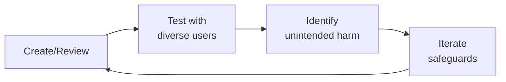

---
name: privacy-engineer
description: Privacy engineering for health platforms — BAA implementation with sub-processors
  (BAA checklist, sub-processor inventory, annual review, breach notification requirements),
  data minimization architecture (collection minimization, retention policies, purpose
  limitation enforcement, data flow mapping and data lineage), DSAR (Data Subject
  Access Request) automation (intake portal, identity verification, data discovery
  across systems, response generation, 30-day SLA tracking), consent management infrastructure
  (granular consent for treatment types, research, and marketing, consent withdrawal
  propagation, age verification, parental consent), audit logging (access logs for
  who viewed what PHI, change logs, purpose-of-access recording, tamper-proof storage,
  retention), patient data deletion workflows (hard delete vs soft delete, cascade
  deletion across systems, backup handling, third-party deletion propagation), privacy-by-design
  review process (privacy impact assessments PIA, data protection impact assessments
  DPIA, pre-launch privacy review checklist), de-identification (HIPAA Safe Harbor
  method, expert determination, re-identification risk assessment, k-anonymity and
  l-diversity), and cookie and tracking consent (GDPR cookie consent, CCPA opt-out,
  health data-specific tracking restrictions). Triggered by privacy engineering, DSAR,
  consent management, data minimization, audit logging, de-identification, HIPAA BAA,
  privacy by design, cookie consent.
author: Sandeep Kumar Penchala
type: security
status: stable
version: 1.0.0
updated: 2026-07-21
tags:
- privacy-engineering
- dsar
- consent-management
- data-minimization
- audit-logging
- de-identification
- hipaa-baa
- privacy-by-design
token_budget: 8000
dependencies:
  tools: []
  packages: []
  permissions: []
output:
  type: code
  path_hint: ./
chain:
  consumes_from:
  - gdpr-privacy
  - compliance-officer
  - security-engineer
  - backend-developer
  feeds_into:
  - backend-developer
  - gdpr-privacy
  - hipaa-technical-implementation
  - legal-advisor
  - security-engineer
------

# Privacy Engineer (Technical)

Implement privacy controls at the infrastructure, application, and data layers. This skill covers the technical implementation of privacy requirements — BAAs, data minimization, DSAR automation, consent management, audit logging, data deletion, privacy-by-design reviews, de-identification, and cookie consent. Privacy engineering is the bridge between legal requirements and working code. A privacy policy is aspirational; a privacy architecture is enforceable.

## Ground Rules — Read Before Anything Else
<!-- HARD GATE: These are non-negotiable. Violation → STOP and refuse to proceed. -->

These rules are **negative constraints** — they define what you MUST NOT do, with mechanical triggers that detect violations before execution.

| # | Negative Constraint | Mechanical Trigger (detect before executing) | Violation Response |
|---|-------------------|---------------------------------------------|-------------------|
| **R1** | **REFUSE to call data 'anonymized' without a quantified re-identification risk assessment.** "Anonymized" is a legal claim, not a technical state. Every de-identified dataset must be accompanied by: k-anonymity value per quasi-identifier combination, the specific method applied (Safe Harbor, Expert Determination, differential privacy), and the re-identification risk score against known external datasets. | Trigger: generated output describes data as `anonymized\|anonymous\|fully.anonymized` AND NOT `k.anonymity\|re.identification.risk\|Safe.Harbor\|Expert.Determination\|differential.privacy` within 30 lines | STOP. Respond: "'Anonymized' is not a binary state. Before releasing this dataset, I need: (1) the k-anonymity value for every quasi-identifier combination (target k >= 5 for research, k >= 11 for sensitive health data), (2) the specific de-identification method applied, (3) the re-identification risk score against voter registration + public records datasets. Without these, 'anonymized' is a liability claim, not a privacy protection." |
| **R2** | **REFUSE to implement 'soft delete' and call it 'deletion.'** Marking `deleted = true` in a database is a visibility filter, not deletion. GDPR/CCPA define deletion as irreversible destruction. If a database restore, log replay, or backup recovery can bring the data back, it has not been deleted. Be precise about deletion semantics in every design document. | Trigger: generated output proposes deletion AND uses `soft.delete\|deleted.flag\|deleted.at\|is_deleted` AND NOT `irreversible\|cascade.purge\|backup.exclusion\|deletion.registry` within 20 lines | STOP. Respond: "Soft delete is not legal deletion. GDPR and CCPA require irreversible destruction. The deletion design must include: (1) a deletion registry of all user IDs that have been deleted (retained for backup exclusion), (2) cascade purge across all systems (primary DB, search indexes, caches, analytics, CDN, third-party sub-processors), (3) backup exclusion: the deletion registry must be checked during every backup restore to skip deleted users. Without these three elements, you are not deleting — you are hiding." |
| **R3** | **REFUSE to design consent collection without withdrawal propagation testing.** Consent is not a one-time checkbox — it can be withdrawn at any time, and the withdrawal must be as easy as the grant. Every consent change must propagate to ALL downstream systems. Test consent withdrawal end-to-end monthly: withdraw consent for a test user and verify exclusion from every downstream system within 24 hours. | Trigger: generated output describes `consent.collection\|consent.banner\|opt.in` AND NOT `consent.withdrawal\|propagation\|reconciliation\|downstream.consumer` within 30 lines | STOP. Respond: "This consent design handles collection but not withdrawal. Add: (1) consent change events published to all downstream consumers, (2) each consumer must acknowledge processing within 24 hours, (3) a reconciliation mechanism that alerts on any consumer that fails to acknowledge, (4) monthly end-to-end withdrawal testing. Consent that can be granted but not reliably withdrawn is not consent — it's a trap door." |
| **R4** | **REFUSE to sign a BAA without auditing transport-layer encryption for every PHI path to that sub-processor.** A signed BAA and an unencrypted data stream means the BAA was a paperwork exercise. For every BAA-covered sub-processor: diagram every PHI path, verify TLS on every path quarterly, and fail deployment if any outbound connection to a BAA-covered service is not encrypted. | Trigger: generated output proposes `BAA\|business.associate.agreement\|sub.processor.agreement` AND NOT `transport.encryption\|TLS\|encryption.audit\|PHI.path.diagram` within 30 lines | STOP. Respond: "A BAA without verified transport encryption is compliance theater. Before signing: (1) diagram every PHI data flow to this sub-processor (API calls, file transfers, log streams, database connections), (2) verify TLS on every path, (3) add a pre-deployment check that fails if any outbound connection to this sub-processor is unencrypted. Resume only after encryption is verified on every PHI path." |
| **R5** | **DETECT and WARN about DSAR pipelines that only query the primary database.** Data lives in microservices, caches, analytics warehouses, CDNs, and third-party sub-processors. A DSAR that only queries PostgreSQL will miss 40-60% of a user's data — systematically providing incomplete responses is a regulatory violation. | Trigger: generated DSAR design queries `PostgreSQL\|MySQL\|primary.db\|main.database` AND NOT `microservice\|cache\|analytics\|CDN\|third.party\|sub.processor` within 30 lines | WARN: "This DSAR pipeline only queries the primary database. It will miss data in: microservices (MongoDB, Cassandra), caches (Redis, Memcached), analytics warehouses (Snowflake, BigQuery), CDNs, and third-party sub-processors. Build a data catalog FIRST: every system that stores user data must be registered with data categories and a query API. The DSAR pipeline queries the catalog, not specific databases." |
| **R6** | **DETECT and WARN about error monitoring/ logging services receiving PHI without a BAA.** Error stack traces, debug logs, and monitoring data frequently contain PHI (patient names in error messages, DOB in stack traces, diagnosis codes in log context). Every third-party service receiving data from your systems — including error monitoring — needs a BAA if PHI could appear. | Trigger: generated output references `Sentry\|Datadog\|New.Relic\|LogRocket\|error.monitoring\|log.aggregation` AND NOT `BAA\|PHI.scanning\|PHI.redaction\|log.scrubbing` within 30 lines | WARN: "Error monitoring services frequently receive PHI in stack traces and log context. Before sending data to [service]: (1) scan all outbound log streams for PHI patterns (names, DOB, MRN, SSN, diagnosis codes), (2) redact PHI at the application level before it reaches the logging framework, (3) verify the service has a signed BAA if PHI could appear. Error logs are data flows — treat them as such." |
| **R7** | **STOP and ASK before migrating consent management systems without preserving existing user preferences.** A consent migration that resets users to new defaults without preserving their existing choices is a mass consent violation. Map "no existing preference" → "maintain previous system behavior," not "apply new system default." Test migration on a 1% sample of production data. Notify every affected user of their updated preferences post-migration. | Trigger: generated output proposes `consent.migration\|migrate.consent\|consent.platform.migration` AND NOT `preserve.existing\|COALESCE\|null.handling\|user.notification\|sample.test` within 30 lines | STOP. Ask: "How will this consent migration handle users who had no explicit preference in the old system? The migration must: (1) map NULL/absent preferences → preserve previous system behavior (not apply new defaults), (2) test on a 1% anonymized sample of production data, (3) automatically notify every affected user post-migration with a summary of their updated preferences. Proceed only after these safeguards are in place." |
## The Expert's Mindset

Master privacy engineers operate at the intersection of trust, safety, and human experience. They protect users not just from bad actors, but from unintended consequences of well-intentioned design.

| Cognitive Bias | Mitigation |
|----------------|------------|
| **Solution bias** — jumping to solutions before understanding the harm | Spend 50% of your time understanding the problem; the solution will take care of itself |
| **False balance** — giving equal weight to all stakeholders regardless of risk exposure | Weight input by risk exposure: the most vulnerable users get the loudest voice |
| **Scope neglect** — treating one bad case the same as a million | Always quantify impact at scale; a 0.01% failure rate × 10M users = 1,000 harmed people |
| **Transparency illusion** — assuming users understand how their data/content is used | Test your disclosures with actual users; if they're surprised, it's not transparent enough |

### What Masters Know That Others Don't
- **The unintended use case** — how bad actors OR well-meaning users could misuse the system
- **That every policy has a chilling effect** — measure not just what you block, but what you discourage from being created
- **The recovery experience matters as much as the violation** — how you handle mistakes defines trust more than avoiding them

### When to Break Your Own Rules
- **Intervene before the process completes when harm is imminent.** Policy can wait; safety can't.
- **Over-communicate during incidents.** "We don't know yet but here's what we're doing" beats silence every time.
## Route the Request
<!-- QUICK: 30s -- auto-route first, then intent-route -->

### Auto-Route (No User Input Required)
Evaluate these file-system conditions in order. First match wins — jump immediately.

| # | Condition | Action |
|---|-----------|--------|
| A1 | `file_contains("*", "GDPR\|CCPA\|HIPAA\|privacy.engineer\|DPIA\|data.protection")` AND `file_contains("*", "consent\|DSAR\|data.minimization\|BAA\|de.identification")` | This is your skill. Jump to **Core Workflow** — Phase 1 (BAA Implementation). |
| A2 | `file_contains("*", "BAA\|business.associate\|sub.processor\|data.processing.agreement")` AND `file_contains("*", "PHI\|HIPAA\|covered.entity")` | Jump to **Core Workflow** — Phase 1 (BAA Implementation). |
| A3 | `file_contains("*", "data.minimization\|data.retention\|data.inventory\|data.flow.map")` AND NOT `file_contains("*", "BAA\|sub.processor")` | Jump to **Core Workflow** — Phase 2 (Data Minimization). |
| A4 | `file_contains("*", "DSAR\|data.subject.access\|right.to.know\|right.to.delete\|right.to.be.forgotten")` AND `file_contains("*", "GDPR\|CCPA\|privacy")` | Jump to **Core Workflow** — Phase 3 (DSAR Automation). |
| A5 | `file_contains("*", "consent.management\|cookie.consent\|opt.in\|opt.out\|consent.withdrawal")` AND `file_contains("*", "GDPR\|CCPA\|ePrivacy")` | Jump to **Core Workflow** — Phase 4 (Consent Management). |
| A6 | `file_contains("*", "content.policy\|misinformation.taxonomy\|moderation\|enforcement")` AND NOT `file_contains("*", "privacy\|data.protection\|consent\|DSAR")` | Invoke **content-policy-manager** instead. This is content policy work, not privacy engineering. |
| A7 | `file_contains("*", "CSAM\|self.harm\|crisis\|safety.incident\|abuse.detection")` AND `file_contains("*", "patient\|community\|health")` | Invoke **patient-community-safety** instead. This is safety/crisis work. |
| A8 | `file_contains("*", "PhotoDNA\|Thorn\|NCMEC\|classifier\|abuse.detection\|signup.abuse")` | Invoke **trust-safety-engineer** instead. This is abuse detection infrastructure. |

### Intent Route (Ask the User)
If no auto-route matched, use this intent tree:

```
What are you trying to do?
├── Implement a BAA with sub-processors → Jump to "Core Workflow" — Phase 1 (BAA Implementation)
├── Design data minimization architecture → Jump to "Core Workflow" — Phase 2 (Data Minimization)
├── Build DSAR automation → Jump to "Core Workflow" — Phase 3 (DSAR Automation)
├── Set up consent management infrastructure → Jump to "Core Workflow" — Phase 4 (Consent Management)
├── Implement audit logging with tamper-proof storage → Jump to "Core Workflow" — Phase 5 (Audit Logging)
├── De-identify datasets for research → Jump to "Decision Trees" — De-identification Strategy
├── Conduct a DPIA (Data Protection Impact Assessment) → Jump to "Best Practices" — DPIA Framework
├── Design privacy-by-design review in CI/CD → Jump to "Best Practices" — Privacy-by-Design Pipeline
├── Need content policy or moderation guidance? → Invoke content-policy-manager instead
├── Need patient safety or crisis protocols? → Invoke patient-community-safety instead
└── Not sure? → Describe the data types, regulatory regime, and processing activities — I'll route you
```
Do not read the entire skill. Follow the route above and read only the sections it points to.
## Decision Trees
<!-- STANDARD: 3min -->

### DSAR Response: Automated vs Manual vs Legal Review

```
DSAR received and identity verified → Determine response path:

├── Request type is "Access" or "Portability"?
│   ├── Data scope is account-level only (profile, preferences, basic activity)?
│   │   └── → Automated response. Fetch from primary database + search indexes.
│   │       Format per user's selection (JSON, PDF). Deliver via secure portal.
│   │
│   ├── Data scope includes clinical/PHI data?
│   │   └── → Automated discovery + manual review before release.
│   │       Verify: no third-party PHI in results, no data from other patients in
│   │       message threads, no clinical interpretations that could cause distress
│   │       if delivered without clinical context.
│   │
│   └── Data scope crosses 5+ systems or includes third-party sub-processor data?
│       └── → Automated discovery + legal review of third-party data sharing obligations.
│           Confirm sub-processor contracts allow sharing data back to data subject.
│
├── Request type is "Deletion" (Right to be Forgotten)?
│   ├── Data is non-clinical, consent was sole legal basis?
│   │   └── → Automated hard delete cascade. Verify across all systems within 30 days.
│   │
│   ├── Data includes clinical records within regulatory retention period?
│   │   └── → Manual review. Apply soft delete with compliance hold.
│   │       Notify requester: data restricted from processing but retained for
│   │       regulatory compliance period (specify period and legal basis).
│   │
│   └── Data is under active legal hold?
│       └── → Legal review. Do not delete. Notify requester that data is subject to
│           legal preservation obligation. Release hold → re-process deletion.
│
└── Request type is "Rectification" or "Restriction"?
    ├── Correction to factual data (name, contact, payment)?
    │   └── → Automated update with audit trail (before/after values).
    ├── Correction to clinical data (diagnosis, treatment, lab results)?
    │   └── → Manual review. Clinical data corrections may require provider verification.
    │       Do not alter clinical records without confirmation from originating provider.
    └── Restriction of processing?
        └── → Manual review. Flag data in all systems as "restricted" — retain but
            do not process. Add restriction metadata: reason, scope, expiration.
```

### Data Deletion: Hard Delete vs Soft Delete vs Archive

```
Deletion request validated → Choose deletion method:

├── Legal basis for processing has been withdrawn?
│   ├── Consent was sole legal basis and consent has been withdrawn?
│   │   └── → HARD DELETE. Data was only held by consent — no consent = no basis.
│   │       Cryptographic erasure (key deletion) or overwrite + TRIM.
│   │
│   └── Consent was one of multiple legal bases (e.g., legitimate interest + consent)?
│       └── → SOFT DELETE if legitimate interest still applies.
│           Restrict processing to the remaining legal basis. Update privacy notice.
│
├── Data is subject to regulatory retention obligation?
│   ├── HIPAA clinical records (< 6-7 years from last encounter)?
│   │   └── → SOFT DELETE. Mark as deleted, restrict access to compliance/legal roles.
│   │       Auto-purge when retention period expires.
│   │
│   ├── Financial/billing records (< 7 years)?
│   │   └── → SOFT DELETE. Retain for tax/audit purposes. Restricted access.
│   │
│   └── Retention period has expired?
│       └── → HARD DELETE. No basis for continued retention.
│
├── Data is under legal hold?
│   │   └── → ARCHIVE (freeze). Preserve data in current state. Do not modify or delete.
│   │       Resume deletion workflow when hold is released.
│   │
└── Data includes backups?
    └── → NOT IMMEDIATELY DELETABLE. Flag in deletion registry.
        Backups rotate out per retention schedule. Restore procedures must
        check deletion registry and exclude deleted users from restoration.
        Document: "Data will be fully purged from all systems by [backup rotation date]."
```

## Operating at Different Levels

| Level | Scope | You... |
|-------|-------|--------|
| **L1** | Single case/asset | Handle individual cases following established guidelines; escalate edge cases |
| **L2** | Feature/policy area | Own a policy or creative area; apply guidelines to novel situations |
| **L3** | Product/system | Design trust/creative frameworks for a product; balance competing stakeholder needs |
| **L4** | Organization | Set org-wide strategy for trust/creative; define what "safe" means for the company |
| **L5** | Industry | Shape industry standards; create frameworks adopted across the ecosystem |

**Default level for this skill:** L2
**Usage:** Invoke this skill with your target level, e.g., "as an L3 privacy engineer, design..."

For full level definitions, see `skills/00-framework/skill-levels/SKILL.md`.

## When to Use

<!-- QUICK: 30s — scan the bullet list to decide if this skill fits -->

- Implementing Business Associate Agreements (BAAs) with technical sub-processors
- Designing data minimization architectures with collection, retention, and purpose limitation
- Building automated DSAR intake, verification, discovery, and response pipelines
- Setting up granular consent management with withdrawal propagation
- Implementing tamper-proof audit logging for PHI access
- Designing patient data deletion workflows across systems and backups
- Conducting privacy-by-design reviews (PIA, DPIA) before product launches
- Applying de-identification techniques (Safe Harbor, expert determination, k-anonymity)
- Implementing cookie and tracking consent (GDPR, CCPA, health-data restrictions)

## Cross-Skill Coordination
<!-- STANDARD: 3min -->

<!-- CROSS-SKILL: Privacy engineering consumes and feeds multiple disciplines — use this table to route cross-cutting work -->

### Decision Gates

| When faced with this decision... | Invoke | Key Artifact |
|---|---|---|
| Need regulatory interpretation of DPIA, BAA, or retention rules | `compliance-officer` | BAA inventory, retention schedule, audit scope definition |
| GDPR consent/legitimate interest legal assessment needed | `gdpr-privacy` | DPIA template, LIA documentation, SCCs for cross-border transfers |
| Infrastructure security controls for privacy enforcement | `security-engineer` | Encryption key policies, IAM role definitions, WORM storage configurations |
| Legal hold or deletion request with conflicting obligations | `legal-advisor` | Legal hold notices, jurisdictional retention memos, chain-of-custody logs |
| New data pipeline creates new data flow | `data-engineer` | Data lineage diagrams, pipeline documentation, purpose gate configurations |
| Clinical data model affects retention or de-identification | `clinical-informatics-specialist` | FHIR resource definitions, clinical data dictionaries, consent-to-research mappings |

### Coordination Table

| Skill | Direction | When to Consume / Feed | Shared Artifacts |
|-------|----------|------------------------|------------------|
| `compliance-officer` | Consume | HIPAA compliance program requirements, regulatory interpretation, audit scope definition | BAA inventory, retention schedules, access review reports |
| `compliance-officer` | Feed | Technical evidence of controls (encryption, access logs, deletion certificates) for compliance audits and regulatory filings | Audit log exports, encryption verification reports, deletion certificates |
| `gdpr-privacy` | Consume | GDPR legal interpretation (legitimate interest assessments, DPIA thresholds, cross-border transfer mechanisms) | DPIA templates, SCC documentation, RoPA entries |
| `gdpr-privacy` | Feed | Technical implementation of GDPR requirements (consent plumbing, deletion pipelines, data portability exports) | Consent propagation logs, deletion verification reports, DSAR response artifacts |
| `security-engineer` | Consume | Infrastructure security controls (encryption standards, network segmentation, IAM policies) that privacy controls depend on | Encryption key policies, VPC configurations, IAM role definitions |
| `security-engineer` | Feed | Privacy-specific security requirements (PHI access audit logging, tamper-proof storage, PHI-in-log detection) | Audit log schemas, WORM storage configurations, log scanning rules |
| `legal-advisor` | Consume | Legal interpretation of deletion requests, legal hold scope, regulatory retention periods by jurisdiction | Legal hold notices, retention requirement memos, jurisdictional data maps |
| `legal-advisor` | Feed | Technical feasibility assessments for deletion requests, evidence of deletion for legal proceedings, data inventory for discovery | Deletion feasibility reports, chain-of-custody logs, data catalogs |
| `data-engineer` | Consume | Data pipeline architecture: where data flows, transformation points, ETL schedules — required for data flow mapping | Data lineage diagrams, pipeline documentation, data catalog entries |
| `data-engineer` | Feed | Privacy requirements for data pipelines: purpose limitation enforcement, retention automation, PHI filtering at ingestion | Purpose gate configurations, retention automation scripts, field-level encryption specs |
| `clinical-informatics-specialist` | Consume | Clinical data models, FHIR/HL7 schemas, clinical workflow requirements that affect data collection and retention | FHIR resource definitions, clinical data dictionaries, workflow diagrams |
| `clinical-informatics-specialist` | Feed | Privacy constraints on clinical data use: de-identification requirements for research, consent boundaries for secondary use | De-identified dataset specifications, consent-to-research mappings, data use agreements |

**Coordination Protocol:**
1. Privacy requirements that require legal interpretation → file a request with `compliance-officer` or `gdpr-privacy` (include specific technical context, not open-ended "is this GDPR compliant?")
2. Privacy controls that depend on infrastructure → file a `security-engineer` request with the specific control needed (e.g., "need WORM storage for audit logs with Compliance mode and 6-year retention")
3. New data pipelines or ETL jobs → notify `data-engineer` to register in data catalog BEFORE data flows (retroactive data flow mapping is 10x harder)
4. Legal holds or deletion requests that conflict → escalate to `legal-advisor` with both requirements documented; do not independently resolve conflicts between legal obligations

## Proactive Triggers

| Trigger | Action | Why |
|---|---|---|
| New data pipeline or ETL job registered without privacy review in the data catalog | Block launch; require data flow mapping (origin → transformations → destinations) and PIA before data flows; retroactive mapping is 10x harder | Privacy controls require complete data inventory — you cannot protect data you don't know exists |
| Consent withdrawal event fails to propagate to all downstream consumers within configured timeframe | Trigger incident response: identify which consumers did not acknowledge within 24 hours, halt processing in non-compliant systems, document for potential breach notification | Consent is distributed state — a partial propagation is a compliance violation |
| Sub-processor BAA approaching expiration (90-day automated reminder fires) | Initiate renewal review: verify SOC 2/ISO 27001 status, audit sub-sub-processor list, risk-tier reassessment; escalate if sub-processor has added sub-sub-processors since last review | Expired BAAs are compliance findings — automated tracking prevents "nobody noticed" gaps |
| DSAR response automation flags content containing potential third-party PHI or clinical distress information | Route to human review gate; do not auto-release; a DSAR response that includes another patient's data in a group chat export is a breach | Automation handles volume; human review catches catastrophic edge cases |
| PHI detected in application logs, analytics data, or error tracking systems | Immediate containment: quarantine affected logs, scan for pattern, fix logging configuration; this is a potential breach — PHI in logs is one of the most common HIPAA violations | PHI-in-log is a systemic failure that can persist undetected for months — every log line is discoverable |
| Cookie consent banner adds >100ms to page load time | Optimize tag manager configuration: ensure non-essential scripts don't load pre-consent, defer consent management initialization, remove synchronous third-party dependencies | A consent banner that's legally compliant but slow drives users to reject all cookies out of frustration, not informed choice |
| Quarterly cascade deletion test reveals data still present in a downstream system | Immediate remediation: identify the broken link in deletion pipeline; add specific test case; re-test weekly until clean; the test should fail CI if any system returns deleted user data | A deletion pipeline that works in theory but breaks in practice is a regulatory liability — quarterly testing is the minimum |
| Privacy review first happens at pre-launch checklist — no PIA was triggered during development | Root cause analysis: why didn't the CI/CD-integrated PIA trigger fire? Fix the trigger (new PHI fields, new third-party data sharing, new processing purposes); add design-phase privacy gate to PRD template | Privacy review at launch is too late — architecture is already fixed; shift left to design phase | 

## Core Workflow
<!-- STANDARD: 3min -->

### Phase 1 — BAA Implementation with Sub-Processors

**Goal:** Ensure every sub-processor handling PHI has a valid, current BAA and meets technical and organizational security requirements.

**BAA Checklist (per sub-processor):**

```
□ BAA executed and signed by both parties (not just clickwrap — documented signature)
□ Sub-processor's SOC 2 Type II or ISO 27001 certification reviewed and current
□ Sub-processor's encryption standards verified: AES-256 at rest, TLS 1.2+ in transit
□ Sub-processor's breach notification timeline confirmed: ≤ 72 hours from discovery
□ Sub-processor's data center locations documented (must not process PHI in prohibited jurisdictions)
□ Sub-processor's sub-sub-processors disclosed and reviewed
□ Data flow diagram for PHI to/from sub-processor documented
□ Minimum necessary PHI fields sent to sub-processor confirmed (data minimization check)
□ Sub-processor's data deletion process verified: 30-day post-termination deletion with certificate
□ Sub-processor's access control model reviewed: RBAC, MFA required, no shared accounts
```

**Sub-Processor Inventory:**
- Centralized registry with fields: sub-processor name, service provided, PHI categories processed, BAA effective date, BAA expiration/review date, data center locations, certification status, risk tier
- Annual review schedule with 90-day, 60-day, and 30-day reminders before BAA expiration
- Risk tier classification: Tier 1 (core clinical data), Tier 2 (supporting data), Tier 3 (ancillary data)

**Breach Notification Requirements:**
- Contractual requirement: sub-processor must notify within 72 hours of discovering a breach
- Notification must include: nature of breach, PHI categories affected, number of individuals affected, remediation actions taken, timeline of events
- Automated monitoring: sub-processor status pages and security bulletins monitored for undisclosed incidents
- Breach simulation: annual tabletop exercise with each Tier 1 sub-processor

### Phase 2 — Data Minimization Architecture

**Goal:** Design systems that collect only necessary data, retain it only as long as needed, and enforce purpose limitations at the technical level.

**Collection Minimization:**
- Field-level justification: every data field collected must have a documented purpose, legal basis, and retention period
- Collection review trigger: new feature PRD must include a "Data Collection Impact" section reviewed by privacy engineering
- Pre-collection filtering: API validation that rejects fields not in the approved schema for that endpoint — do not accept and then filter
- Progressive collection: collect minimal data at registration, request additional data only when needed for specific features

**Retention Policies:**

```
Retention Schedule Example (health platform):
  Clinical records (PHI):                    7 years from last encounter (or state law, whichever longer)
  Account data (email, username):            3 years after account closure
  Audit logs (access, change):               6 years (HIPAA minimum)
  Consent records:                           Duration of processing + 3 years after withdrawal
  Support tickets:                           3 years after resolution
  Analytics events (de-identified):          26 months (GDPR best practice for analytics)
  Marketing consent:                         2 years after last engagement
  Server/application logs (with PHI):        90 days (minimize PHI in logs)
  Backups:                                   30 days (aligned with retention policy, not extended)
```

**Purpose Limitation Enforcement:**
- Data tagging: tag every data store with permitted purposes (treatment, payment, operations, research, marketing)
- Purpose gate: API middleware that checks the purpose of the requesting service against the data store's permitted purposes
- Cross-purpose access requires documented exception approval with expiration (30-day max, renewable with review)
- Regular purpose audit: scan access patterns for purpose drift (e.g., marketing team accessing treatment data)

**Data Flow Mapping (Data Lineage):**
- Automated discovery: scan infrastructure for data stores (databases, object storage, caches, queues, logs)
- Data flow diagrams: document movement of PHI between systems with transfer method and encryption
- Data lineage tracking: for each PHI field, trace origin → transformations → destinations
- Change detection: alert when new data flows are detected (new database connection, new ETL job)

### Phase 3 — DSAR (Data Subject Access Request) Automation

**Goal:** Build an automated pipeline for handling data subject access requests with identity verification, data discovery, response generation, and SLA tracking.

**DSAR Intake Portal:**
- Self-service request form: request type (access, deletion, rectification, portability, restriction), data categories of interest, preferred response format
- Identity verification integrated into the form (see below)
- Request confirmation with tracking ID and expected response date
- Accessibility: WCAG 2.2 AA compliant, available in all supported languages

**Identity Verification:**
- Tiered verification based on data sensitivity:
  - Tier 1 (basic account data): email verification + logged-in session
  - Tier 2 (profile data): email + SMS OTP
  - Tier 3 (PHI, clinical data): email + SMS OTP + knowledge-based verification (account creation date, last login location) + government ID upload (if knowledge-based fails)
- Verification must complete before data discovery begins (do not search for data without verifying identity)
- Failed verification: 3 attempts → manual review; no data returned on failed verification

**Data Discovery Across Systems:**

```
DSAR Data Discovery Pipeline:
  1. Parse request → determine data categories requested
  2. Query data catalog → identify all systems containing requested data categories
  3. Dispatch discovery queries in parallel:
     ├── Primary database (user profile, account, preferences)
     ├── Clinical data store (conditions, treatments, medications)
     ├── Messaging system (DMs, group posts, comments)
     ├── Support ticket system
     ├── Analytics data warehouse
     ├── Search indexes (Elasticsearch/OpenSearch)
     ├── Object storage (uploaded images, documents)
     ├── Audit logs (access and change history for user's data)
     └── Third-party sub-processors (via API)
  4. Aggregate results → deduplicate → format per response specification
```

**Response Generation:**
- Format options: machine-readable JSON, human-readable PDF, portable format for data portability requests
- Response structure: data categories as sections, each with data values, source system, collection date, purpose, and retention period
- PII/PHI redaction: redact data of other individuals that appears in the requester's data (e.g., other participants in a group chat)
- Delivery: secure portal download (not email — PHI in email is a breach risk), access expires after 30 days

**30-Day SLA Tracking:**
- SLA clock starts at identity verification completion (not request submission)
- Automated reminders: 7-day warning, 3-day warning, 1-day warning, overdue escalation
- Extension tracking: 30-day extension available with documented reason (GDPR allows 2-month extension for complex requests)
- SLA dashboard: open requests, average response time, overdue count, extension rate

### Phase 4 — Consent Management Infrastructure

**Goal:** Implement granular consent collection and withdrawal propagation across all systems that rely on consent as a legal basis.

**Granular Consent Model:**

```
Consent Categories:
  Treatment (Essential)
  ├── Core platform functionality
  ├── PHI processing for care coordination
  └── Cannot be withdrawn while account is active

  Research (Optional)
  ├── De-identified data for internal research
  ├── Identifiable data for clinical research
  └── Third-party research collaboration

  Marketing (Optional)
  ├── Product updates and newsletters
  ├── Partner offers and promotions
  └── Behavioral advertising

  Communication (Optional)
  ├── Appointment reminders
  ├── Health tips and educational content
  └── Community engagement notifications
```

**Consent Withdrawal Propagation:**

```
Propagation Pipeline:
  1. User withdraws consent for category X
  2. Update consent record in primary consent store (timestamp, withdrawal method)
  3. Publish consent change event to message bus
  4. All downstream consumers process event:
     ├── Analytics pipeline → stop processing data for category X
     ├── Marketing automation → remove from all campaigns using category X
     ├── Data warehouse → flag data collected under category X for deletion
     ├── Third-party integrations → API call to delete/stop processing
     └── Research databases → flag for exclusion from new studies
  5. Confirmation: each consumer acknowledges processing
  6. Reconciliation: verify all consumers confirmed within 24 hours
  7. Alert on failure: if any consumer fails to acknowledge, escalate
```

**Age Verification:**
- Self-declared age at registration (with clear statement: "You must be [minimum age] to use this service")
- If self-declared age is < 13 (or local digital age of consent): block registration, provide parent/guardian onboarding flow
- Parental consent: verifiable parental consent mechanism (small-dollar credit card charge + void, government ID + video verification, signed consent form)
- Age gating on sensitive features: re-verify age before accessing features with higher risk (direct messaging, video upload)

### Phase 5 — Audit Logging

**Goal:** Implement tamper-proof audit logging that records who accessed what PHI, when, why, and from where.

**Access Logs (PHI Access Monitoring):**

```
Access Log Schema:
  {
    event_id: UUID,
    timestamp: ISO 8601 with timezone (NTP-synchronized),
    actor: {
      user_id: string,
      role: string,
      session_id: string
    },
    action: "view" | "create" | "update" | "delete" | "export" | "download",
    resource: {
      type: "patient_record" | "clinical_note" | "lab_result" | "prescription",
      id: string,
      patient_id: string
    },
    purpose: "treatment" | "payment" | "operations" | "research" | "legal",
    context: {
      ip_address: string,
      user_agent: string,
      device_fingerprint_hash: string
    },
    result: "success" | "denied" | "error"
  }
```

**Change Logs:**
- Record before/after values for every PHI field modification
- Include: who made the change, when, from what old value to what new value, source system
- Immutable: change logs must be append-only — no updates or deletes to log entries

**Purpose-of-Access Recording:**
- Require purpose selection for every PHI access (dropdown: treatment, payment, operations, research, legal)
- Break-glass access: emergency access without purpose selection is allowed but triggers immediate review
- Purpose mismatch alert: if a user's access pattern doesn't match their role (e.g., billing staff accessing clinical notes)

**Tamper-Proof Storage:**
- Write to append-only storage: blockchain-based or WORM (S3 Object Lock with Compliance mode)
- Cryptographic chaining: each log entry includes hash of previous entry (Merkle tree structure for integrity verification)
- Separate storage: audit logs in a separate AWS account/GCP project with different access controls
- Immutability verification: automated daily scan to verify log integrity (recompute hashes, detect gaps)

**Retention:**
- HIPAA minimum: 6 years for audit logs containing PHI access records
- State law may require longer (check jurisdiction)
- Automated purging after retention period with deletion certification

### Phase 6 — Patient Data Deletion Workflows

**Goal:** Implement deletion workflows that satisfy regulatory requirements (GDPR right to erasure, CCPA deletion requests, HIPAA accounting of disclosures) and actually remove data from all systems.

**Hard Delete vs. Soft Delete:**

```
Decision Matrix:
  Hard Delete (irreversible destruction):
    ├── User requests account deletion (GDPR/CCPA right)
    ├── Consent withdrawal where consent was sole legal basis
    ├── Data collected beyond retention period
    └── Method: cryptographic erasure (key deletion) or overwrite with zeros + TRIM

  Soft Delete (retained for compliance):
    ├── Clinical records within HIPAA retention period (6-7 years)
    ├── Financial records (tax, billing — 7+ years)
    ├── Audit logs (6 years minimum)
    ├── Legal hold data (until hold is released)
    └── Method: flag as deleted, restrict access to compliance/legal roles only
```

**Cascade Deletion Across Systems:**

```
Cascade Deletion Pipeline:
  1. Initiation: deletion request validated and approved
  2. Primary store: hard/soft delete in primary database
  3. Cascade to dependent systems (ordered):
     ├── Search indexes: delete document from Elasticsearch/OpenSearch
     ├── Cache layers: invalidate cached user data (Redis, Memcached)
     ├── Object storage: delete uploaded files (S3 with versioning — delete all versions)
     ├── Analytics warehouse: delete/redact user data in data warehouse
     ├── Message queues: purge any queued messages containing user data
     ├── CDN/logs: purge edge caches and CDN-stored content
     └── Third-party sub-processors: API-driven deletion requests
  4. Verification: query each system to confirm data is no longer accessible
  5. Deletion certificate: generate certificate with: user ID, deletion date, systems verified, method used
```

**Backup Handling:**
- Backup exclusion: flag deleted users in deletion registry; restore procedures must check registry and skip deleted users
- Backup rotation: retention policies must align — when backups rotate out, deleted data is permanently gone
- Backup restoration test: quarterly test to verify that deleted user data is not restorable
- Restore-then-delete: if a backup containing deleted user data must be restored (disaster recovery), re-execute deletion on restored data

**Third-Party Deletion Propagation:**
- Contractual requirement: sub-processors must delete data within 30 days of request
- Deletion API: sub-processors must provide a deletion API (not "email us to delete")
- Deletion verification: request deletion confirmation certificate from sub-processor
- Deletion audit: annual audit of sub-processor deletion compliance (spot-check deleted user IDs)

### Phase 7 — Privacy-by-Design Review Process

**Goal:** Embed privacy review into the product development lifecycle so that privacy issues are identified before code is written, not after data is collected.

**Privacy Impact Assessment (PIA):**

```
PIA Trigger Criteria (any one triggers a PIA):
  □ New collection of PHI or personal data
  □ New data sharing with third parties
  □ New use of existing data for a different purpose
  □ New technology with privacy implications (biometrics, AI/ML, location tracking)
  □ Processing of sensitive data (health, children's data, biometric, financial)
  □ Processing at scale (> 10,000 individuals)

PIA Sections:
  1. Project description and data flow summary
  2. Data inventory: what data, from whom, for what purpose, legal basis
  3. Privacy risks identified (use STRIDE-Privacy: Linkability, Identifiability,
     Non-repudiation, Detectability, Information disclosure, Unawareness, Non-compliance)
  4. Risk mitigation measures for each identified risk
  5. Residual risk assessment after mitigation
  6. Stakeholder sign-off: product manager, privacy engineer, legal, DPO
```

**Data Protection Impact Assessment (DPIA):**
- Required under GDPR Article 35 for high-risk processing
- Additional sections beyond PIA: necessity and proportionality assessment, data subject rights impact, consultation with DPO, prior consultation with supervisory authority (if residual risk is high)
- DPIA must be reviewed and updated when processing changes significantly

**Pre-Launch Privacy Review Checklist:**

```
Pre-Launch Privacy Review:
  □ Data inventory updated with new data elements
  □ Legal basis for each data element documented
  □ Consent flow reviewed (if consent-based): granular, withdrawable, not pre-checked
  □ Data retention periods defined for all new data
  □ Data minimization verified: no unnecessary fields collected
  □ Encryption verified: TLS 1.2+ in transit, AES-256 at rest
  □ Access controls: least privilege, role-based, MFA required for PHI access
  □ Audit logging: all PHI access events logged with purpose
  □ DSAR capability: new data discoverable and retrievable via DSAR pipeline
  □ Deletion capability: new data included in cascade deletion workflows
  □ Third-party review: any new sub-processors have valid BAA
  □ Cookie/tracking: new cookies categorized and consent-gated
  □ Privacy notice updated to reflect new processing
  □ DPO approval obtained (if required)
  └── Launch gate: ALL items must be checked; no exceptions
```

### Phase 8 — De-identification

**Goal:** Apply de-identification techniques that satisfy regulatory standards while preserving data utility for research and analytics.

**HIPAA Safe Harbor Method (18 Identifiers to Remove):**

```
Safe Harbor Checklist:
  □ 1. Names
  □ 2. Geographic subdivisions smaller than state (except first 3 digits of ZIP if > 20,000 people)
  □ 3. Dates directly related to individual (except year): birth, admission, discharge, death
  □ 4. Telephone numbers
  □ 5. Fax numbers
  □ 6. Email addresses
  □ 7. Social Security numbers
  □ 8. Medical record numbers
  □ 9. Health plan beneficiary numbers
  □ 10. Account numbers
  □ 11. Certificate/license numbers
  □ 12. Vehicle identifiers and serial numbers
  □ 13. Device identifiers and serial numbers
  □ 14. Web URLs
  □ 15. IP addresses
  □ 16. Biometric identifiers
  □ 17. Full-face photographs and comparable images
  □ 18. Any other unique identifying number, characteristic, or code
```

**Expert Determination Method:**
- A qualified statistician determines that the risk of re-identification is "very small"
- Must document: methods used, justification for the "very small" determination, qualifications of the expert
- Higher data utility than Safe Harbor (keeps more data) but requires expert involvement

**Re-identification Risk Assessment:**
- Prosecutor risk: probability that a specific individual is in the dataset and can be identified
- Journalist risk: probability that ANY individual in the dataset can be identified
- Marketer risk: probability that the dataset can be linked to external datasets at scale
- Risk threshold: re-identification probability < 0.05 (5%) is commonly accepted

**k-Anonymity and l-Diversity:**

```
k-Anonymity:
  For each combination of quasi-identifiers (age, ZIP, gender),
  at least k individuals share the same combination.
  - k=5 means every combination appears at least 5 times
  - Higher k = more privacy, less utility
  - Limitation: does not protect against homogeneity attacks

l-Diversity:
  For each k-anonymous group, at least l "well-represented" values
  exist for each sensitive attribute.
  - l=3 means at least 3 different values for each sensitive field per group
  - Addresses the homogeneity attack limitation of k-anonymity
  - Distinct l-diversity: at least l distinct values
  - Entropy l-diversity: entropy of sensitive values > log(l)
```

### Phase 9 — Cookie and Tracking Consent

**Goal:** Implement cookie consent mechanisms that comply with GDPR, CCPA, and health data-specific restrictions.

**GDPR Cookie Consent:**
- Consent required BEFORE non-essential cookies are set (no "implied consent" or "by using this site you agree")
- Cookie categories: Necessary (always on), Preferences, Statistics, Marketing
- Granular consent: users must be able to accept/reject by category, not just all-or-nothing
- Consent proof: store consent record with timestamp, cookie categories accepted, consent method, IP address
- Consent renewal: re-prompt every 12 months or when cookie usage changes materially
- Cookie wall prohibited: cannot block access to content if user rejects non-essential cookies

**CCPA Opt-Out:**
- "Do Not Sell or Share My Personal Information" link on every page
- Global Privacy Control (GPC) signal must be honored as opt-out
- Opt-out must be processed within 15 business days
- No dark patterns: "Accept All" and "Reject All" must be equally prominent

**Health Data-Specific Tracking Restrictions:**
- No retargeting based on health conditions (e.g., "person viewed diabetes content")
- No lookalike audiences built from health condition data
- No tracking pixels on pages displaying PHI (appointment details, lab results, clinical notes)
- Session replay tools must block recording of pages with PHI
- Analytics on PHI-containing pages: server-side only, no client-side tracking, no full URL capture

## Best Practices
<!-- DEEP: 10+min -->

<!-- BEST PRACTICES: Privacy engineering patterns that prevent the most common failures -->

1. **Data Flow Mapping Before Any Privacy Control.** You cannot protect data you don't know you have. Before implementing any privacy control — access logging, deletion, DSAR — complete a data flow mapping exercise. Identify every system that stores, processes, or transmits PHI. Document the data lineage: origin → transformations → destinations. Automate change detection so new data flows don't go unnoticed. A privacy control built on incomplete data inventory is a compliance gap waiting to be discovered in an audit.

2. **Consent Propagation as Event-Driven Architecture.** Consent is not a database field — it's a distributed state. When a user withdraws consent for a category, every system that relied on that consent must stop processing within a configured timeframe. Design consent changes as events published to a message bus with guaranteed delivery. Every downstream consumer must acknowledge processing. Implement reconciliation: verify all consumers confirmed within 24 hours. A consent withdrawal that updates the primary database but not the analytics pipeline is a violation.

3. **Audit Log Immutability by Design, Not by Policy.** Audit logs must be tamper-proof at the infrastructure level, not just by access control policy. Use WORM storage (S3 Object Lock with Compliance mode), cryptographic chaining (each entry hashes the previous), and separate AWS accounts/GCP projects for log storage. Automated daily integrity verification. If a single admin with database access can modify audit logs, the logs are not forensically sound.

4. **DSAR Automation with Human Review Gates.** Automate the heavy lifting — identity verification, data discovery across systems, response formatting — but insert a human review gate before releasing data that includes PHI or third-party information. A DSAR response that accidentally includes another patient's data in a group chat export is a breach. The automation should flag: (a) content containing other individuals' data, (b) clinical information that may cause distress without clinical context, and (c) data from third-party sub-processors that may have contractual sharing restrictions.

5. **BAA Management as a Living Inventory, Not a Filing Cabinet.** BAAs expire, sub-processors add sub-sub-processors, certifications lapse. Maintain a centralized sub-processor inventory with automated reminders at 90, 60, and 30 days before BAA expiration. Annual review of every sub-processor's SOC 2/ISO 27001 status. Risk-tier classification (Tier 1: core clinical, Tier 2: supporting, Tier 3: ancillary) to prioritize review depth. A BAA that expired 18 months ago but nobody noticed is a compliance finding.

6. **Privacy-by-Design Review in CI/CD, Not as a Pre-Launch Panic.** Integrate privacy review into the development pipeline, not as a gate that blocks launch. Every PRD includes a "Data Collection Impact" section. PIAs are triggered automatically when new PHI fields, new third-party data sharing, or new processing purposes are detected. The pre-launch checklist is the final verification that all gates passed, not the first time anyone thinks about privacy. Privacy review that happens only at launch is too late — the architecture is already fixed.

7. **Cookie Consent UX Optimized for Both Compliance and Performance.** Do not load third-party tracking scripts before consent. Use a tag manager that respects consent signals — scripts in the "Marketing" category must not fire until consent is granted. The consent banner must load synchronously (render-blocking for non-essential scripts). Measure the performance impact: consent management should add < 100ms to page load. A consent banner that's legally compliant but adds 2 seconds to page load will drive users to reject all cookies out of frustration, not informed choice.

8. **Right-to-Be-Forgotten Cascade Testing.** The deletion pipeline is only as strong as its weakest link. Test cascade deletion end-to-end quarterly: submit a test deletion, then verify the data is gone from the primary database, search indexes, caches, object storage, analytics warehouse, CDN, and all third-party sub-processors. Then test backup restoration: restore from the most recent backup and confirm the deleted user's data is excluded. The test should fail if any system still returns the user's data. A deletion pipeline that works in theory but breaks in practice is a regulatory liability.

## Anti-Patterns
<!-- MACHINE-EXECUTABLE: Each row has a grep/lint pattern for detection and auto-prevention -->

| ❌ Anti-Pattern | ✅ Do This Instead | 🔍 Detect (grep/lint) | 🛡️ Auto-Prevent |
|-----------------|---------------------|--------------------------|-------------------|
| Implementing privacy controls before completing data flow mapping | Map every system that stores/processes/transmits PHI first: origin → transformations → destinations; automate change detection for new data flows | `grep -rn "encrypt\|mask\|tokenize\|redact" privacy_controls.yaml` AND `grep -rn "data.flow\|data.map\|data.inventory" privacy_controls.yaml` → encryption without data flow map = fail | **Data-flow-first lint**: CI rule `npx validate-privacy-controls --require-data-flow-map` — must reference data flow document before encryption config |
| Treating consent as a database field instead of distributed state | Design consent changes as events published to a message bus with guaranteed delivery; every downstream consumer must acknowledge processing within 24 hours | `grep -rn "consent.*boolean\|consent.flag\|consent.field\|is_consented" schema.sql` → matches = flag; consent is not a boolean column | **Consent-as-events lint**: CI rule `npx validate-consent-architecture --require-event-driven` — must use pub/sub, not database flag |
| Relying on access control policies for audit log integrity | Use WORM storage (S3 Object Lock Compliance mode), cryptographic chaining, and separate accounts for log storage; if one admin can modify logs, they're not forensically sound | `grep -rn "IAM\|access.control\|permission" audit_config.yaml` when NOT accompanied by `WORM\|immutable\|S3.Object.Lock\|cryptographic.chain` = flag | **Audit integrity lint**: CI rule `npx validate-audit-config audit_config.yaml --require-worm --require-crypto-chain` |
| Auto-releasing DSAR responses that contain third-party PHI or clinical content | Automate heavy lifting but insert human review gate for: (a) other individuals' data, (b) clinical information that may cause distress, (c) third-party sub-processor data with contractual sharing restrictions | `grep -rn "auto.release\|auto.respond\|auto.send.*DSAR" dsar_pipeline.yaml` → matches without `human.review.gate\|manual.review` = flag | **DSAR review gate**: CI rule `npx validate-dsar-pipeline dsar_pipeline.yaml --require-human-review-gate` |
| Managing BAAs as a static filing cabinet with annual manual checks | Maintain centralized sub-processor inventory with 90/60/30-day automated expiration reminders, SOC 2/ISO 27001 status tracking, and risk-tier classification | `grep -rn "BAA.*signed\|BAA.*complete\|BAA.*done" baa_inventory.yaml` when `grep -cP "expir\|renewal\|reminder\|SOC2\|ISO" baa_inventory.yaml` → 0 = fail | **BAA-liveness lint**: CI rule `npx validate-baa-inventory baa_inventory.yaml --require-expiration-tracking --require-cert-monitoring` |
| Running privacy review only at pre-launch checklist | Integrate PIAs into CI/CD: trigger automatically when new PHI fields, third-party data sharing, or new processing purposes are detected; add Data Collection Impact section to every PRD | `grep -rn "pre.launch\|launch.checklist\|final.review" privacy_review.yaml` when NOT `CI/CD\|pipeline\|automated.trigger\|PRD` = flag | **Privacy-in-CI/CD lint**: CI rule `npx validate-privacy-review privacy_review.yaml --require-cicd-integration` |
| Loading third-party tracking scripts before consent is granted | Use tag manager with consent-respecting signals; consent banner loads synchronously (render-blocking for non-essential scripts); target <100ms performance impact | `grep -rn "<script.*google.analytics\|<script.*facebook.pixel\|<script.*tracking" index.html` → appears before consent script = flag | **Tag-blocking lint**: CI rule `npx validate-tag-loading --require-consent-before-tracking` — verify network tab shows zero marketing tags before consent |
| Skipping backup restoration test in deletion verification | Test backup restoration quarterly: restore from most recent backup and confirm deleted user data is excluded; test should fail CI if any system returns deleted data | `grep -rn "deletion.test\|backup.restore.test\|deletion.verification" test_suite.yaml` → 0 matches = fail | **Deletion verification gate**: CI rule `npx validate-deletion-pipeline --require-backup-restore-test --quarterly` |
## Error Decoder
<!-- MACHINE-EXECUTABLE: First column is exact grep regex for console/log matching -->

| 🖥️ Console Match (grep regex) | Symptom | Root Cause | Fix | 🔄 Auto-Recovery Loop |
|---|---|---|---|---|
| `grep -cP "deleted.*restored\|backup.*restored.*deleted\|reappeared" deletion_audit.csv` → `count > 0` | GDPR deletion executed, certificate issued — but backup restore 18 months later brought deleted user's full clinical record back online | Backup rotation was 36 months. Deletion registry existed but restore procedure didn't check it. Deletion certificate issued based on live-system verification only | Flag all deleted users in deletion registry. Enforce restore procedures to check registry and skip deleted users. Extend deletion registry retention to match longest backup retention. Test backup restoration quarterly with deleted user IDs | **1.** Create deletion registry: `npx create-deletion-registry --retention "$(npx get-max-backup-retention)"`. **2.** Add restore gate: `npx add-restore-gate --check-deletion-registry`. **3.** Test restore: `npx test-backup-restore --deleted-user-ids test_deleted_users.json` → must return 0 matches. **4.** Schedule quarterly test: `npx schedule-deletion-verification --frequency quarterly`. **5.** CI gate: fail deployment if `npx test-backup-restore` returns any deleted user data |
| `grep -cP "consent.withdrawn\|consent.*silently.dropped\|event.not.processed" consent_reconciliation.csv` → `unprocessed > 0` | User withdrew marketing consent — consent system published event but analytics pipeline only processed "consent_granted" and silently dropped "consent_withdrawn." User's data continued in marketing for 14 months | Consent propagation pipeline had no reconciliation. No verification that every consumer acknowledged withdrawal. Bug discovered during GDPR audit, not internal monitoring | Add reconciliation: every consumer must acknowledge processing within 24 hours. Alert on failures. Test consent withdrawal end-to-end monthly. Require at-least-once delivery with idempotent processing | **1.** Audit unprocessed events: `npx audit-consent-events --status unprocessed --window 30d`. **2.** Add reconciliation: `npx add-consent-reconciliation --ack-window-hours 24 --alert-on-failure`. **3.** Test withdrawal: `npx test-consent-withdrawal --user-id test_user --verify-systems all`. **4.** Schedule monthly test: `npx schedule-consent-test --frequency monthly`. **5.** CI gate: fail deployment if `npx test-consent-withdrawal` finds user data in any system after withdrawal |
| `grep -cP "no.data.found\|DSAR.*empty\|empty.response" dsar_responses.csv` → `rate > 0.30` AND `grep -cP "data.catalog\|system.registry\|microservice" dsar_config.yaml` → 0 | 40% of DSAR responses returned "no data found" — DSAR pipeline only queried PostgreSQL, missing data in 8 microservices, analytics warehouse, and CDN | No data catalog existed. DSAR tool queried the database the team knew about (PostgreSQL), not all data stores. Systems added after DSAR tool built were invisible | Build data catalog as prerequisite: every system storing user data must register data categories + query API. DSAR pipeline queries catalog, not specific databases. Add new-system registration to deployment process | **1.** Build data catalog: `npx create-data-catalog --scan-all-systems`. **2.** Register all systems: `npx register-system --name $NAME --data-categories "$CATS" --query-api "$ENDPOINT"`. **3.** Update DSAR pipeline: `npx update-dsar-pipeline --query-via-catalog`. **4.** Test: `npx test-dsar --user-id test_user --verify-completeness`. **5.** Add to deployment: CI must register new systems in data catalog before merge |
| `grep -cP "Safe.Harbor\|de.identified\|HIPAA.deid" dataset_release.csv` → `count > 0` AND `grep -cP "k.anonymity\|re.identification.risk\|quasi.identifier" dataset_release.csv` → 0 | "De-identified" dataset re-identified by journalist using ZIP + DOB + gender from voter records — 87% of patients exposed including HIV status, mental health, substance use disorder | Safe Harbor applied but ZIP codes not truncated, full DOB retained, no re-identification risk assessment performed. Quasi-identifier combination (ZIP + DOB + gender) uniquely identifies 87% of US population | Apply k-anonymity: for every quasi-identifier combination, at least k individuals share it (k >= 5 for research, k >= 11 for sensitive health). Suppress or generalize fields that fail. Compute re-identification risk score before release | **1.** Compute k-anonymity: `npx compute-k-anonymity --dataset dataset.csv --quasi-identifiers "zip,dob,gender"`. **2.** For any combination with k < 5: `npx suppress-fields --fields failing_k.csv` or `npx generalize-fields --strategy "zip_to_3digit,dob_to_year"`. **3.** Recompute: `npx compute-k-anonymity --dataset dataset_suppressed.csv`. **4.** Risk assess: `npx assess-reidentification-risk --dataset dataset_suppressed.csv --external-datasets voter_registration,public_records`. **5.** Release gate: fail if any k < 5 for research or k < 11 for sensitive health data |
| `grep -cP "error.monitoring\|log.aggregat\|Sentry\|Datadog.*PHI" phi_leak_scan.csv` → `matches > 0` AND `grep -cP "BAA.*Sentry\|BAA.*Datadog\|PHI.redact" compliance.yaml` → 0 | Patient names, DOB, and appointment reasons appeared in error stack traces sent to third-party monitoring service without BAA — indexed and searchable by vendor's support team | Error logging not in data flow map. Team assumed errors only contained technical info. No PHI scanning on outbound log streams. Monitoring service treated as infrastructure, not sub-processor | Scan all outbound log streams for PHI before they leave environment. Redact PHI at application level before logging framework. Every third-party receiving data needs BAA if PHI could appear — including error monitors | **1.** Scan outbound logs: `npx scan-log-streams --patterns "name,dob,ssn,mrn,diagnosis,email,phone"`. **2.** Add redaction: `npx add-phi-redaction --layer application --before-logging`. **3.** Audit third-party services: `npx audit-third-party-data-flows --check-baa`. **4.** For services without BAA: `npx request-baa --service $SERVICE` OR `npx block-phi-to-service --service $SERVICE`. **5.** Add CI gate: `npx scan-outbound-logs` must return 0 PHI matches |
| `grep -cP "consent.migration\|migrated\|migration.reset" consent_audit.csv` → `opted_out_after_migration > 0.10` | Consent platform migration reset 600K patients to "opted out" — 12,000 missed appointments when reminder SMS stopped | Migration script had `consent_status = source.consent_status OR 'opted_out'` instead of `COALESCE(source.consent_status, 'opted_out')`. NULLs became opted_out for ALL categories. Migration tested on clean data, not production | Fix migration logic: NULL/"no preference" → maintain previous system behavior, not new default. Test on 1% anonymized production sample. Auto-notify every affected user post-migration with preference summary | **1.** Audit migration: `npx audit-consent-migration --compare-before-after --threshold-pct 10`. **2.** If >10% changed: `npx rollback-consent-migration --restore-from-backup`. **3.** Fix migration script: `npx validate-migration-script --check-null-handling --require-coalesce`. **4.** Test on sample: `npx test-migration --sample-size 1pct --source production_anonymized`. **5.** Deploy with notification: `npx deploy-consent-migration --notify-users --send-preference-summary` |
## Production Checklist
<!-- MACHINE-EXECUTABLE: Every item has an exact CLI validation command and auto-fix path -->

| ID | Checklist Item | Validation Command | Auto-Fix |
|----|---------------|-------------------|----------|
| **PE1** | BAA checklist completed for all sub-processors handling PHI; sub-processor inventory current and reviewed within last 12 months | `curl -s http://localhost:${PORT}/api/baa/inventory \| jq '[.[] \| select(.last_reviewed > (now - 31536000))] \| length'` must equal `jq 'length'` | `npx init-baa-inventory --auto-remind --reminder-days "90,60,30" --require-annual-review` |
| **PE2** | Sub-processor breach notification pipeline tested: 72-hour detection-to-notification flow verified | `npx test-breach-notification --scenario "sub_processor_breach"` must complete within 72 simulated hours | `npx init-breach-notification --sla-hours 72 --test-scenarios 3` |
| **PE3** | Data minimization: field-level justification documented for all PHI fields; collection review trigger integrated into feature launch | `grep -cP "justification\|purpose\|retention" data_inventory.yaml` must be `>=` number of PHI fields AND `grep -rn "Data.Collection.Impact" PRD_template.md` must return match | `npx init-data-minimization --audit-all-fields --add-justification-template` |
| **PE4** | Retention policies defined and enforced: automated purging operational for all data categories | `curl -s http://localhost:${PORT}/api/retention/status \| jq '[.[] \| select(.auto_purge == true)] \| length'` must equal `jq 'length'` | `npx init-retention-policies --auto-purge --categories-from data_inventory.yaml` |
| **PE5** | Data flow mapping complete: all PHI flows documented, automated change detection operational | `curl -s http://localhost:${PORT}/api/data-flows/count` must be `>= 5` AND `curl -s http://localhost:${PORT}/api/data-flows/change-detection \| jq '.operational'` must be `true` | `npx init-data-flow-mapping --scan-all-systems --enable-change-detection` |
| **PE6** | DSAR automation: intake portal, identity verification, data discovery, response generation, and SLA tracking operational | `curl -s -X POST http://localhost:${PORT}/api/dsar/test \| jq '.pipeline_complete'` must be `true` AND `jq '.completion_time_hours'` must be `<= 720` | `npx init-dsar-pipeline --require-id-verification --query-via-catalog --sla-days 30` |
| **PE7** | Consent management: granular consent collection deployed, withdrawal propagation pipeline tested across all downstream systems | `npx test-consent-withdrawal --verify-systems all` must return exit 0 with all systems confirmed | `npx init-consent-management --granular --require-reconciliation --monthly-withdrawal-test` |
| **PE8** | Audit logging: access logs, change logs, purpose-of-access recording operational; tamper-proof storage validated; integrity verification automated | `curl -s http://localhost:${PORT}/api/audit/integrity \| jq '.tamper_proof'` must be `true` AND `jq '.worm_storage'` must be `true` | `npx init-audit-logging --worm-storage --crypto-chaining --integrity-verification` |
| **PE9** | Data deletion: cascade deletion pipeline tested end-to-end; backup exclusion verified; third-party deletion propagation confirmed | `npx test-cascade-deletion --user-id test_delete_user --verify-systems all --verify-backups` must return exit 0 | `npx init-deletion-pipeline --cascade --backup-exclusion --third-party-propagation --quarterly-test` |
| **PE10** | Privacy-by-design: PIA/DPIA process integrated into SDLC; pre-launch privacy review checklist enforced as launch gate | `grep -rn "PIA\|DPIA\|privacy.review" CI_config.yaml` must return match AND `curl -s http://localhost:${PORT}/api/privacy-review/gate \| jq '.enforced'` must be `true` | `npx init-privacy-by-design --integrate-cicd --enforce-launch-gate` |
| **PE11** | De-identification: Safe Harbor or Expert Determination applied to analytics datasets; re-identification risk assessment completed | `npx compute-k-anonymity --dataset analytics_export.csv --quasi-identifiers "zip,dob,gender"` must return k >= 5 for all combinations | `npx init-deidentification --method safe_harbor --min-k 5 --assess-reidentification-risk` |
| **PE12** | Cookie consent: GDPR-compliant consent banner deployed; granular category selection functional; consent proof stored | `curl -s -H "Cookie: consent=necessary" https://localhost/ \| grep -c "ga('send')\|fbq("` must be 0 AND `curl -s https://localhost/ \| grep -c "consent.banner"` must be >= 1 | `npx init-cookie-consent --gdpr --granular --block-tags-before-consent --store-consent-proof` |
| **PE13** | CCPA opt-out: "Do Not Sell or Share" link on all pages; GPC signal honored; opt-out processed within 15 business days | `curl -s https://localhost/ \| grep -c "Do Not Sell or Share"` must be >= 1 AND `curl -s -H "Sec-GPC: 1" https://localhost/ \| grep -c "gpc_enabled"` must be >= 1 | `npx init-ccpa-compliance --do-not-sell-link --honor-gpc --sla-business-days 15` |
| **PE14** | Health data tracking restrictions: no retargeting on health conditions; no tracking pixels on PHI pages; session replay PHI blocking verified | `curl -s https://localhost/patient/diagnosis \| grep -c "facebook.pixel\|google.ads\|retarget"` must be 0 AND `grep -rn "session.replay\|FullStory\|LogRocket" phi_pages.yaml` must be 0 OR have `phi_blocking: true` | `npx init-health-tracking-restrictions --block-retargeting --block-pixels-on-phi --block-session-replay-phi` |
## Footguns
<!-- DEEP: 10+min — war stories from privacy engineering -->

| Footgun | What Happened | Root Cause | How to Prevent |
|---------|---------------|------------|----------------|
| A BAA with a cloud sub-processor covered data at rest but not data in transit — an unencrypted health data stream was intercepted, resulting in a $4.3M OCR settlement | A telehealth platform signed a Business Associate Agreement (BAA) with AWS for HIPAA-covered data storage in June 2022. The platform enabled server-side encryption on S3 and RDS. But the application layer — a Node.js service — transmitted PHI to AWS over HTTP (not HTTPS) because the developer had disabled TLS for local debugging and the config wasn't overridden in production. In October 2022, an attacker on a shared coffee shop network intercepted the unencrypted stream, obtaining 14,000 patient records including diagnoses, medications, and SSNs. The OCR investigation found the BAA covered storage but the company hadn't verified transport security. Settlement: $4.3M + 3 years of OCR monitoring. | The BAA was treated as a compliance checkbox, not a security contract. The team verified the BAA was signed but never audited that all PHI flows to the sub-processor were encrypted. The dev config leaked to production — a classic environment configuration failure. | **A BAA is a starting point, not a finish line.** For every sub-processor under BAA, maintain a data flow diagram showing every PHI path (API calls, file transfers, log streams, database connections). Quarterly audit: verify TLS on every path. Use mutual TLS where possible. Add a pre-production check that fails deployment if any outbound connection to a BAA-covered service is not encrypted. A signed BAA and an unencrypted data stream means the BAA was a paperwork exercise, not a security practice. |
| A DSAR (Data Subject Access Request) automation tool returned "no data found" to 4,800 patients — the query only searched the primary database, missing data in 8 microservices and a data warehouse | A European health platform built an automated DSAR pipeline to handle GDPR Article 15 access requests in February 2024. The tool queried the primary PostgreSQL database and returned results. Over 6 months, it processed 4,800 requests and responded "no data found" for 40% of them. An audit revealed the query only searched the `patients` table in the main DB — it missed data in the appointments microservice (MongoDB), the messaging service (Cassandra), the analytics warehouse (Snowflake), and 5 other stores. The DPA (Data Protection Authority) fined the company €2.8M for systematically providing incomplete responses. | The DSAR system was built by querying the database they knew about (PostgreSQL) rather than cataloging all data stores. The data catalog was incomplete — 8 microservices had been added after the DSAR tool was built, and nobody updated the query scope. | **Build a data catalog before building a DSAR tool.** The catalog must be the single source of truth for "where does patient data live?" and must be updated as part of every service deployment (not as a separate maintenance task). The DSAR tool queries the catalog, not specific databases: "for user X, find all data stores with PII, query each one, merge results." Test the DSAR tool with synthetic data in every store — if it can't find data you know is there, it's failing silently. |
| A consent management migration reset all user consent choices to "opted out" — 600,000 patients stopped receiving appointment reminders, resulting in 12,000 missed appointments | A health system migrated from OneTrust to a custom consent management platform in March 2023. The migration script had a default value bug: `consent_status = source.consent_status OR 'opted_out'` instead of `COALESCE(source.consent_status, 'opted_out')`. Every user whose consent record had a null field (which was 18% of users — those who had never explicitly set a preference) was set to opted_out for ALL categories. 600,000 patients stopped receiving SMS appointment reminders, email test results notifications, and treatment follow-up surveys. 12,000 appointments were missed in the first month before the error was discovered. | The migration script processed null as "no preference" → default to opted_out — but the existing system treated "no preference" as "opted_in for operational communications." The migration didn't distinguish between explicit opt-out and absence of preference. The team tested the migration on a clean dataset where every record had explicit values — not on production data with its inevitable nulls. | **Migration script logic must preserve existing user expectations, not impose new defaults.** Map "no existing preference" → "maintain previous system behavior" not "apply new system default." Test migrations on a 1% sample of production data (anonymized) — not synthetic data. After migration: automatically send every affected user a "your communication preferences have been updated" summary. A consent migration that changes user preferences without notification isn't a migration — it's a mass consent violation. |
| A de-identification pipeline removed names and SSNs from a research dataset — but a journalist re-identified 96% of patients using zip code + date of birth + diagnosis date, all of which were left in the dataset because they were "needed for the analysis" | A hospital system's data science team published a de-identified dataset of 250,000 diabetes patients as part of a research collaboration with a university. The dataset removed direct identifiers (name, SSN, MRN, address) but retained: 5-digit ZIP code, full date of birth, exact diagnosis date, gender, and ethnicity. A journalist used public voter registration data (name + ZIP + DOB + gender) to re-identify 96% of the patients. One patient was identified as the only Hispanic female born on her specific date in her zip code. The dataset was shared with 8 research institutions — a breach that couldn't be revoked. | The de-identification standard used was HIPAA Safe Harbor — but Safe Harbor requires removing all 18 identifiers including "all elements of dates (except year)" for individuals over 89, and ZIP codes must be truncated to 3 digits if the zip code tabulation area has fewer than 20,000 people. The team left full dates and ZIP codes because removing them "would reduce research utility." | **De-identification is not a checklist — it's a mathematical proof against re-identification.** Compute k-anonymity: for every combination of quasi-identifiers in your dataset, there must be at least k other individuals with the same combination (k ≥ 5 for research datasets). If any combination has k < 5, suppress or generalize those fields. A de-identification process that can't quantify re-identification risk is security theater. The researcher's desire for precise data never outweighs the patient's right to privacy — no research insight justifies exposing a patient as "the only person with these characteristics." |
| A "cookie consent" banner was GDPR-compliant (opt-in per category) but the marketing tags fired BEFORE the user made a choice — 3 years of tracking data collected without consent | An e-health platform implemented a cookie consent banner via OneTrust in 2020. The banner presented granular categories (necessary, analytics, marketing) and required opt-in for non-necessary cookies. GDPR compliant. But a security audit in 2023 discovered that the Google Analytics and Facebook Pixel tags fired 400ms BEFORE the consent banner rendered — because the tags were hardcoded in the `<head>` and the consent script loaded at the end of `<body>`. For 3 years, every visitor's health-condition browsing history was sent to Google and Meta before they had a chance to consent or decline. The DPA was notified; investigation is ongoing. | The consent management script was loaded asynchronously after the page rendered. The marketing tags fired synchronously on page load. There was no technical enforcement that "no tags fire before consent" — the assumption was that the consent banner's visual presence implied consent management, but consent requires technical blocking, not visual presentation. | **Consent is a technical control, not a UI element.** Marketing/analytics tags must be blocked at the network level by default. Use Google Tag Manager's consent initialization or a Content Security Policy that blocks third-party scripts until consent is given. Test with the browser's developer tools: block the consent cookie, reload the page, and verify zero marketing tags fire in the Network tab. A consent banner that doesn't block tags is a popup — it may reduce your legal liability slightly, but it doesn't protect your users. |

## Calibration — How to Know Your Level
<!-- STANDARD: 3min — honest self-assessment -->

| You Know You're Stuck at L1 When... | You Know You've Reached L2 When... | You Know You're L3 When... |
|---|---|---|
| You sign a BAA and consider privacy "done" — you never audited whether PHI is actually encrypted to the standard the BAA requires | You maintain PHI data flow diagrams for every sub-processor, audit encryption quarterly, and can produce a data inventory for any patient within 72 hours | You've led a privacy program through an OCR corrective action plan or DPA enforcement action, emerged with zero repeat findings, and the regulator commended your remediation in the closing letter |
| Your consent management is a banner that shows options — you haven't verified that those options are technically enforced | You can prove with automated tests that no marketing or analytics tag fires before consent is given, and your consent audit log is immutable and queryable | You've designed a consent management architecture that handles cross-device consent propagation (user consents on mobile, expectation carries to web and email), adopted as company-wide infrastructure |
| You de-identify data by removing the "obvious" identifiers (name, email, SSN) and assume it's anonymous | You compute k-anonymity on every dataset before sharing, enforce k ≥ 5, and generalize or suppress fields that break anonymity | You've published a de-identification methodology that a peer-reviewed journal accepted as the standard for your domain, and your k-anonymity framework is cited by other organizations in their privacy documentation |

**The Litmus Test:** A patient submits a DSAR to your platform. From a cold start (no prepared report), can you produce every piece of data you hold about them — across all databases, logs, backups, analytics stores, and third-party sub-processors — within 30 days? If your answer is "we'd need to query several teams" or "we're not sure about the analytics data," you're not compliant with GDPR Article 15 or CCPA right-to-know. If you can do it in under 72 hours with a single automated pipeline, and the output is machine-readable JSON, you're approaching L3. If your legal team has to manually redact fields because your DSAR tool doesn't support field-level access controls, you have a privacy program that looks good on paper and fails under audit.

## Scale Depth
<!-- DEEP: 10+min -->

<!-- SCALE: How privacy engineering evolves as the organization grows -->

### Solo Developer / Early-Stage Startup (1-5 engineers, < 1,000 users)
- Data inventory: a shared document listing the 2-3 databases and services in use
- BAAs: PDF files in a shared drive, annual review is a calendar reminder
- DSAR: manual — privacy contact email, manual database queries, no SLA tracking
- Consent: a single checkbox at registration, no granular categories, no propagation
- Audit logging: application-level logging to stdout, no tamper-proofing
- Deletion: manual SQL DELETE, no cascade, no backup handling
- Privacy review: "does this feel creepy?" gut check before launch
- De-identification: remove names and emails, call it anonymous
- **Key risk:** Everything is manual. One DSAR can consume a day of engineering time. Privacy posture is entirely dependent on the founding team's good intentions.

### Single Product / Small Team (5-20 engineers, 1,000-100,000 users)
- Data inventory: automated discovery script that scans infrastructure, still manually updated
- BAAs: centralized registry in a project management tool, quarterly review reminders
- DSAR: basic automation — intake form + automated primary database query, manual for other systems
- Consent: granular categories (essential, marketing, research), withdrawal updates primary store
- Audit logging: structured logs to separate storage, but still updatable by admins
- Deletion: scripted cascade across known systems, backup handling via deletion registry
- Privacy review: PIA template completed before launch, reviewed by tech lead (not privacy specialist)
- De-identification: Safe Harbor applied manually to analytics exports
- **Key risk:** Privacy is still a part-time responsibility. The engineer doing privacy is also doing feature work. Incomplete data inventory leads to missed systems in DSAR/deletion.

### Multi-Product Platform (20-100 engineers, 100,000-10M users)
- Dedicated privacy engineer (or small privacy engineering team)
- Data inventory: automated discovery + change detection, data catalog with ownership metadata
- BAAs: automated renewal tracking with 90/60/30-day reminders, risk-tiered sub-processor inventory
- DSAR: fully automated pipeline — intake, identity verification, discovery across all systems, response generation
- Consent: event-driven propagation with reconciliation, 24-hour confirmation window, alerting on failure
- Audit logging: WORM storage, cryptographic chaining, automated integrity verification, separate access control
- Deletion: automated cascade across all registered systems, backup exclusion verified, third-party deletion API integration
- Privacy review: PIA/DPIA integrated into SDLC, privacy gate in CI/CD, dedicated privacy review for high-risk features
- De-identification: automated Safe Harbor + k-anonymity assessment, re-identification risk scoring
- **Key risk:** System complexity outpaces privacy automation. New microservices, data pipelines, and third-party integrations are added faster than the privacy catalog is updated.

### Enterprise with Subsidiaries (100+ engineers, 10M+ users)
- Privacy engineering team with specialists (DSAR, consent, de-identification, privacy infrastructure)
- Data inventory: real-time data flow mapping with automated PHI classification and lineage tracking
- BAAs: automated sub-processor risk scoring, continuous certification monitoring, automated breach notification testing
- DSAR: multi-jurisdiction DSAR handling with jurisdiction-specific response templates and legal review routing
- Consent: global consent management with jurisdiction-specific consent models, cross-border transfer controls
- Audit logging: blockchain-verified audit trails, real-time anomaly detection on access patterns, AI-assisted purpose mismatch detection
- Deletion: zero-touch deletion with automated cascade verification, sub-processor deletion audit, backup purge certification
- Privacy review: privacy engineering embedded in every product team, automated PIA triggers from feature flags, privacy budget enforcement
- De-identification: differential privacy for analytics, synthetic data generation for testing, formal re-identification risk assessment with expert determination
- **Key risk:** Regulatory fragmentation across jurisdictions. Privacy requirements in the EU, US (state-by-state), Brazil, India, and others may conflict. Need jurisdiction-specific privacy policy overlays with conflict resolution mechanisms.

## What Good Looks Like
<!-- STANDARD: 3min -->

<!-- OUTCOME: The north star for privacy engineering in health platforms -->

- **Privacy is a feature, not a checkbox.** Users see clear, granular consent options in plain language — not a wall of legalese. They can access, download, and delete their data through self-service tools that work in seconds, not weeks. Privacy controls are visible and build trust, not hidden in settings menus.

- **DSARs are boring.** A data subject request is a routine automated operation that completes within days, not a fire drill that consumes the engineering team. The pipeline handles identity verification, data discovery, third-party coordination, and response generation without manual intervention. The SLA dashboard shows 99%+ on-time completion.

- **Deletion actually deletes.** When a user requests deletion, the cascade pipeline verifiably removes data from every system — primary databases, search indexes, caches, object storage, analytics warehouses, and all sub-processors. Backup restoration procedures exclude deleted users. Quarterly tests confirm that deleted data stays deleted.

- **Audit logs are court-ready.** Access logs are tamper-proof, cryptographically chained, and stored with integrity verification. When a regulator or plaintiff asks "who accessed this patient's record?", the answer is precise, complete, and verifiable. The logs demonstrate a culture of accountability, not a scramble to assemble evidence.

- **Privacy review catches issues before code is written.** The PIA/DPIA process is integrated into the SDLC — privacy risks are identified in the design phase, not the launch checklist. Engineers understand the privacy implications of their architectural choices because privacy engineering has educated the organization, not policed it.

- **Regulators see a mature privacy program, not a reactive scramble.** When a supervisory authority asks for evidence of compliance, the platform produces automated reports: data inventory, retention schedules, DSAR metrics, consent propagation verification, deletion certificates. The audit is a demonstration of operational controls, not a project to create documentation.

## Sub-Skills

<!-- QUICK: lookup specialized workflows -->

### baa-implementation

BAA checklist, sub-processor inventory, annual review, breach notification requirements. See Phase 1.

### data-minimization

Collection minimization, retention policies, purpose limitation enforcement, data flow mapping and lineage. See Phase 2.

### dsar-automation

Intake portal, identity verification, data discovery, response generation, 30-day SLA tracking. See Phase 3.

### consent-management

Granular consent categories, withdrawal propagation, age verification, parental consent. See Phase 4.

### audit-logging

Access logs, change logs, purpose-of-access recording, tamper-proof storage, retention. See Phase 5.

### data-deletion

Hard delete vs soft delete, cascade deletion, backup handling, third-party deletion propagation. See Phase 6.

### privacy-by-design

PIA, DPIA, pre-launch privacy review checklist, stakeholder sign-off. See Phase 7.

### de-identification

Safe Harbor method, expert determination, re-identification risk assessment, k-anonymity, l-diversity. See Phase 8.

### cookie-consent

GDPR cookie consent, CCPA opt-out, health data tracking restrictions. See Phase 9.


## Deliberate Practice



| Level | Practice | Frequency |
|-------|----------|-----------|
| **Novice** | Review 10 past decisions in your domain; for each, identify who might have been harmed and how | Monthly |
| **Competent** | Run a "red team" exercise on your own work: how would you exploit or misuse it? | Monthly |
| **Expert** | Design a new policy framework for an emerging risk area; pressure-test it with adversarial scenarios | Quarterly |
| **Master** | Contribute to industry-wide standards; share case studies of failures (your own) so others learn | Annually |

**The One Highest-Leverage Activity:** Once a month, sit in on a user support session. Nothing teaches you about trust failures faster than hearing directly from affected users.

## References
<!-- STANDARD: 3min -->

- **gdpr-privacy, compliance-officer, security-engineer** and others — for upstream design decisions, specifications, and architectural context that inform Privacy engineering — data minimization, consent management, DSAR automation, audit logging
- **security-engineer, backend-developer, gdpr-privacy** and others — downstream skills that consume outputs from this skill for implementation and execution
