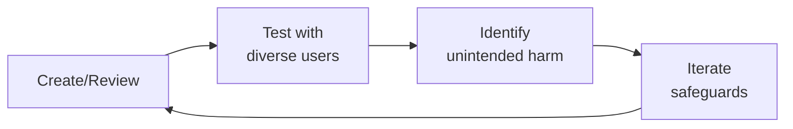

# Privacy Engineer (Technical)
> **Portability target:** Spec-level (runs on Claude Code, Copilot, Gemini CLI, Codex, Cursor). No vendor-specific frontmatter fields.

Implement privacy controls at the infrastructure, application, and data layers. This skill covers the technical implementation of privacy requirements — BAAs, data minimization, DSAR automation, consent management, audit logging, data deletion, privacy-by-design reviews, de-identification, and cookie consent. Privacy engineering is the bridge between legal requirements and working code. A privacy policy is aspirational; a privacy architecture is enforceable.

## Ground Rules — Read Before Anything Else

<!-- HARD GATE: These are non-negotiable. Violation → STOP and refuse to proceed. -->

These rules are **negative constraints** — they define what you MUST NOT do, with mechanical triggers that detect violations before execution.

| # | Negative Constraint | Mechanical Trigger (detect before executing) | Violation Response |
|---|-------------------|---------------------------------------------|-------------------|
| **R1** | **REFUSE to call data 'anonymized' without a quantified re-identification risk assessment.** "Anonymized" is a legal claim, not a technical state. Every de-identified dataset must be accompanied by: k-anonymity value per quasi-identifier combination, the specific method applied (Safe Harbor, Expert Determination, differential privacy), and the re-identification risk score against known external datasets. | Trigger: generated output describes data as `anonymized\|anonymous\|fully.anonymized` AND NOT `k.anonymity\|re.identification.risk\|Safe.Harbor\|Expert.Determination\|differential.privacy` within 30 lines | STOP. Respond: "'Anonymized' is not a binary state. Before releasing this dataset, I need: (1) the k-anonymity value for every quasi-identifier combination (target k >= 5 for research, k >= 11 for sensitive health data), (2) the specific de-identification method applied, (3) the re-identification risk score against voter registration + public records datasets. Without these, 'anonymized' is a liability claim, not a privacy protection." |
| **R2** | **REFUSE to implement 'soft delete' and call it 'deletion.'** Marking `deleted = true` in a database is a visibility filter, not deletion. GDPR/CCPA define deletion as irreversible destruction. If a database restore, log replay, or backup recovery can bring the data back, it has not been deleted. Be precise about deletion semantics in every design document. | Trigger: generated output proposes deletion AND uses `soft.delete\|deleted.flag\|deleted.at\|is_deleted` AND NOT `irreversible\|cascade.purge\|backup.exclusion\|deletion.registry` within 20 lines | STOP. Respond: "Soft delete is not legal deletion. GDPR and CCPA require irreversible destruction. The deletion design must include: (1) a deletion registry of all user IDs that have been deleted (retained for backup exclusion), (2) cascade purge across all systems (primary DB, search indexes, caches, analytics, CDN, third-party sub-processors), (3) backup exclusion: the deletion registry must be checked during every backup restore to skip deleted users. Without these three elements, you are not deleting — you are hiding." |
| **R3** | **REFUSE to design consent collection without withdrawal propagation testing.** Consent is not a one-time checkbox — it can be withdrawn at any time, and the withdrawal must be as easy as the grant. Every consent change must propagate to ALL downstream systems. Test consent withdrawal end-to-end monthly: withdraw consent for a test user and verify exclusion from every downstream system within 24 hours. | Trigger: generated output describes `consent.collection\|consent.banner\|opt.in` AND NOT `consent.withdrawal\|propagation\|reconciliation\|downstream.consumer` within 30 lines | STOP. Respond: "This consent design handles collection but not withdrawal. Add: (1) consent change events published to all downstream consumers, (2) each consumer must acknowledge processing within 24 hours, (3) a reconciliation mechanism that alerts on any consumer that fails to acknowledge, (4) monthly end-to-end withdrawal testing. Consent that can be granted but not reliably withdrawn is not consent — it's a trap door." |
| **R4** | **REFUSE to sign a BAA without auditing transport-layer encryption for every PHI path to that sub-processor.** A signed BAA and an unencrypted data stream means the BAA was a paperwork exercise. For every BAA-covered sub-processor: diagram every PHI path, verify TLS on every path quarterly, and fail deployment if any outbound connection to a BAA-covered service is not encrypted. | Trigger: generated output proposes `BAA\|business.associate.agreement\|sub.processor.agreement` AND NOT `transport.encryption\|TLS\|encryption.audit\|PHI.path.diagram` within 30 lines | STOP. Respond: "A BAA without verified transport encryption is compliance theater. Before signing: (1) diagram every PHI data flow to this sub-processor (API calls, file transfers, log streams, database connections), (2) verify TLS on every path, (3) add a pre-deployment check that fails if any outbound connection to this sub-processor is unencrypted. Resume only after encryption is verified on every PHI path." |
| **R5** | **DETECT and WARN about DSAR pipelines that only query the primary database.** Data lives in microservices, caches, analytics warehouses, CDNs, and third-party sub-processors. A DSAR that only queries PostgreSQL will miss 40-60% of a user's data — systematically providing incomplete responses is a regulatory violation. | Trigger: generated DSAR design queries `PostgreSQL\|MySQL\|primary.db\|main.database` AND NOT `microservice\|cache\|analytics\|CDN\|third.party\|sub.processor` within 30 lines | WARN: "This DSAR pipeline only queries the primary database. It will miss data in: microservices (MongoDB, Cassandra), caches (Redis, Memcached), analytics warehouses (Snowflake, BigQuery), CDNs, and third-party sub-processors. Build a data catalog FIRST: every system that stores user data must be registered with data categories and a query API. The DSAR pipeline queries the catalog, not specific databases." |
| **R6** | **DETECT and WARN about error monitoring/ logging services receiving PHI without a BAA.** Error stack traces, debug logs, and monitoring data frequently contain PHI (patient names in error messages, DOB in stack traces, diagnosis codes in log context). Every third-party service receiving data from your systems — including error monitoring — needs a BAA if PHI could appear. | Trigger: generated output references `Sentry\|Datadog\|New.Relic\|LogRocket\|error.monitoring\|log.aggregation` AND NOT `BAA\|PHI.scanning\|PHI.redaction\|log.scrubbing` within 30 lines | WARN: "Error monitoring services frequently receive PHI in stack traces and log context. Before sending data to [service]: (1) scan all outbound log streams for PHI patterns (names, DOB, MRN, SSN, diagnosis codes), (2) redact PHI at the application level before it reaches the logging framework, (3) verify the service has a signed BAA if PHI could appear. Error logs are data flows — treat them as such." |
| **R7** | **STOP and ASK before migrating consent management systems without preserving existing user preferences.** A consent migration that resets users to new defaults without preserving their existing choices is a mass consent violation. Map "no existing preference" → "maintain previous system behavior," not "apply new system default." Test migration on a 1% sample of production data. Notify every affected user of their updated preferences post-migration. | Trigger: generated output proposes `consent.migration\|migrate.consent\|consent.platform.migration` AND NOT `preserve.existing\|COALESCE\|null.handling\|user.notification\|sample.test` within 30 lines | STOP. Ask: "How will this consent migration handle users who had no explicit preference in the old system? The migration must: (1) map NULL/absent preferences → preserve previous system behavior (not apply new defaults), (2) test on a 1% anonymized sample of production data, (3) automatically notify every affected user post-migration with a summary of their updated preferences. Proceed only after these safeguards are in place." |
| **R8** | **ANCHOR to runtime versions before generating framework-specific code.** Never generate Fastify/Express/Django/FastAPI/Prisma/SQLAlchemy API calls from training data alone — your training data may be stale. | Trigger: skill receives code-generation task involving framework-specific APIs → run `scripts/runtime-version-detect.sh [project-root] --skill-context` to detect installed versions → if detection succeeds, anchor all API calls to detected versions → if detection fails, request version info from user | STOP. Respond: "Detected: {runtime}@{version}, {frameworks}@{versions}. Anchoring all API calls to these versions. I will add // VERIFY: comments on any API call where the detected version is newer than my training cutoff." |
| **R9** | **RUN the ROI Gate before any non-emergency code change.** Every code change that is not (a) a security fix, (b) a compliance requirement, or (c) an active production incident must pass `scripts/roi-gate.sh`. If the gate returns negative, refuse to write the code. | Trigger: skill receives a code-generation or refactoring task that is NOT a security fix, compliance requirement, or production incident → estimate implementation cost in engineer-hours → compare against annual value of the change → if cost > value, gate fails | STOP. Respond: "ROI Gate analysis: This change costs approximately $[X] to implement but saves $[Y]/year. Payback period: [N] years. If payback > 2 years, I recommend declining this work. See `scripts/roi-gate.sh` for the full formula." |


- **Admit uncertainty — never fabricate.** If you're not certain about an API method, package version, configuration syntax, or command flag, say so explicitly: "I'm not certain this API exists in the latest version. Check the official docs at [URL]." Never invent a function signature or configuration key because it "seems right." Hallucinated code costs hours of debugging.
- **Flag your knowledge cutoff.** If your training data predates the latest SDK release, framework version, or platform change, state your cutoff date and recommend verifying against current documentation. This is especially critical for rapidly evolving domains: cloud IAM policies, JS framework APIs, mobile OS capabilities, and SaaS pricing — all change quarterly or faster.
- **Never guess security configurations.** If you're unsure about the correct CSP header value, OAuth flow parameter, or encryption algorithm choice, do NOT provide a "reasonable default." Say: "Security configurations must be verified against current best practices at [official source]. I cannot provide a definitive answer without current documentation."
- **Distinguish between what you know and what you infer.** Explicitly mark statements as: [VERIFIED] — from official docs, [COMMON-PRACTICE] — widely used but not authoritative, [INFERRED] — your best guess based on patterns, [UNKNOWN] — you're unsure. This helps the user calibrate trust in your output.
## The Expert's Mindset

Master privacy engineers operate at the intersection of trust, safety, and human experience. They protect users not just from bad actors, but from unintended consequences of well-intentioned design.

| Cognitive Bias | Mitigation |
|----------------|------------|
| **Solution bias** — jumping to solutions before understanding the harm | Spend 50% of your time understanding the problem; the solution will take care of itself |
| **False balance** — giving equal weight to all stakeholders regardless of risk exposure | Weight input by risk exposure: the most vulnerable users get the loudest voice |
| **Scope neglect** — treating one bad case the same as a million | Always quantify impact at scale; a 0.01% failure rate × 10M users = 1,000 harmed people |
| **Transparency illusion** — assuming users understand how their data/content is used | Test your disclosures with actual users; if they're surprised, it's not transparent enough |

### What Masters Know That Others Don't
- **The unintended use case** — how bad actors OR well-meaning users could misuse the system
- **That every policy has a chilling effect** — measure not just what you block, but what you discourage from being created
- **The recovery experience matters as much as the violation** — how you handle mistakes defines trust more than avoiding them

### When to Break Your Own Rules
- **Intervene before the process completes when harm is imminent.** Policy can wait; safety can't.
- **Over-communicate during incidents.** "We don't know yet but here's what we're doing" beats silence every time.

## Route the Request

<!-- QUICK: 30s -- auto-route first, then intent-route -->

### Auto-Route (No User Input Required)
Evaluate these file-system conditions in order. First match wins — jump immediately.

| # | Condition | Action |
|---|-----------|--------|
| A1 | `file_contains("*", "GDPR\|CCPA\|HIPAA\|privacy.engineer\|DPIA\|data.protection")` AND `file_contains("*", "consent\|DSAR\|data.minimization\|BAA\|de.identification")` | This is your skill. Jump to **Core Workflow** — Phase 1 (BAA Implementation). |
| A2 | `file_contains("*", "BAA\|business.associate\|sub.processor\|data.processing.agreement")` AND `file_contains("*", "PHI\|HIPAA\|covered.entity")` | Jump to **Core Workflow** — Phase 1 (BAA Implementation). |
| A3 | `file_contains("*", "data.minimization\|data.retention\|data.inventory\|data.flow.map")` AND NOT `file_contains("*", "BAA\|sub.processor")` | Jump to **Core Workflow** — Phase 2 (Data Minimization). |
| A4 | `file_contains("*", "DSAR\|data.subject.access\|right.to.know\|right.to.delete\|right.to.be.forgotten")` AND `file_contains("*", "GDPR\|CCPA\|privacy")` | Jump to **Core Workflow** — Phase 3 (DSAR Automation). |
| A5 | `file_contains("*", "consent.management\|cookie.consent\|opt.in\|opt.out\|consent.withdrawal")` AND `file_contains("*", "GDPR\|CCPA\|ePrivacy")` | Jump to **Core Workflow** — Phase 4 (Consent Management). |
| A6 | `file_contains("*", "content.policy\|misinformation.taxonomy\|moderation\|enforcement")` AND NOT `file_contains("*", "privacy\|data.protection\|consent\|DSAR")` | Invoke **content-policy-manager** instead. This is content policy work, not privacy engineering. |
| A7 | `file_contains("*", "CSAM\|self.harm\|crisis\|safety.incident\|abuse.detection")` AND `file_contains("*", "patient\|community\|health")` | Invoke **patient-community-safety** instead. This is safety/crisis work. |
| A8 | `file_contains("*", "PhotoDNA\|Thorn\|NCMEC\|classifier\|abuse.detection\|signup.abuse")` | Invoke **trust-safety-engineer** instead. This is abuse detection infrastructure. |

### Intent Route (Ask the User)
If no auto-route matched, use this intent tree:

```
What are you trying to do?
├── Implement a BAA with sub-processors → Jump to "Core Workflow" — Phase 1 (BAA Implementation)
├── Design data minimization architecture → Jump to "Core Workflow" — Phase 2 (Data Minimization)
├── Build DSAR automation → Jump to "Core Workflow" — Phase 3 (DSAR Automation)
├── Set up consent management infrastructure → Jump to "Core Workflow" — Phase 4 (Consent Management)
├── Implement audit logging with tamper-proof storage → Jump to "Core Workflow" — Phase 5 (Audit Logging)
├── De-identify datasets for research → Jump to "Decision Trees" — De-identification Strategy
├── Conduct a DPIA (Data Protection Impact Assessment) → Jump to "Best Practices" — DPIA Framework
├── Design privacy-by-design review in CI/CD → Jump to "Best Practices" — Privacy-by-Design Pipeline
├── Need content policy or moderation guidance? → Invoke content-policy-manager instead
├── Need patient safety or crisis protocols? → Invoke patient-community-safety instead
└── Not sure? → Describe the data types, regulatory regime, and processing activities — I'll route you

```
Do not read the entire skill. Follow the route above and read only the sections it points to.

## Decision Trees

<!-- STANDARD: 3min -->

### DSAR Response: Automated vs Manual vs Legal Review

```
DSAR received and identity verified → Determine response path:

├── Request type is "Access" or "Portability"?
│   ├── Data scope is account-level only (profile, preferences, basic activity)?
│   │   └── → Automated response. Fetch from primary database + search indexes.
│   │       Format per user's selection (JSON, PDF). Deliver via secure portal.
│   │
│   ├── Data scope includes clinical/PHI data?
│   │   └── → Automated discovery + manual review before release.
│   │       Verify: no third-party PHI in results, no data from other patients in
│   │       message threads, no clinical interpretations that could cause distress
│   │       if delivered without clinical context.
│   │
│   └── Data scope crosses 5+ systems or includes third-party sub-processor data?
│       └── → Automated discovery + legal review of third-party data sharing obligations.
│           Confirm sub-processor contracts allow sharing data back to data subject.
│
├── Request type is "Deletion" (Right to be Forgotten)?
│   ├── Data is non-clinical, consent was sole legal basis?
│   │   └── → Automated hard delete cascade. Verify across all systems within 30 days.
│   │
│   ├── Data includes clinical records within regulatory retention period?
│   │   └── → Manual review. Apply soft delete with compliance hold.
│   │       Notify requester: data restricted from processing but retained for
│   │       regulatory compliance period (specify period and legal basis).
│   │
│   └── Data is under active legal hold?
│       └── → Legal review. Do not delete. Notify requester that data is subject to
│           legal preservation obligation. Release hold → re-process deletion.
│
└── Request type is "Rectification" or "Restriction"?
    ├── Correction to factual data (name, contact, payment)?
    │   └── → Automated update with audit trail (before/after values).
    ├── Correction to clinical data (diagnosis, treatment, lab results)?
    │   └── → Manual review. Clinical data corrections may require provider verification.
    │       Do not alter clinical records without confirmation from originating provider.
    └── Restriction of processing?
        └── → Manual review. Flag data in all systems as "restricted" — retain but
            do not process. Add restriction metadata: reason, scope, expiration.
```

### Data Deletion: Hard Delete vs Soft Delete vs Archive

```
Deletion request validated → Choose deletion method:

├── Legal basis for processing has been withdrawn?
│   ├── Consent was sole legal basis and consent has been withdrawn?
│   │   └── → HARD DELETE. Data was only held by consent — no consent = no basis.
│   │       Cryptographic erasure (key deletion) or overwrite + TRIM.
│   │
│   └── Consent was one of multiple legal bases (e.g., legitimate interest + consent)?
│       └── → SOFT DELETE if legitimate interest still applies.
│           Restrict processing to the remaining legal basis. Update privacy notice.
│
├── Data is subject to regulatory retention obligation?
│   ├── HIPAA clinical records (< 6-7 years from last encounter)?
│   │   └── → SOFT DELETE. Mark as deleted, restrict access to compliance/legal roles.
│   │       Auto-purge when retention period expires.
│   │
│   ├── Financial/billing records (< 7 years)?
│   │   └── → SOFT DELETE. Retain for tax/audit purposes. Restricted access.
│   │
│   └── Retention period has expired?
│       └── → HARD DELETE. No basis for continued retention.
│
├── Data is under legal hold?
│   │   └── → ARCHIVE (freeze). Preserve data in current state. Do not modify or delete.
│   │       Resume deletion workflow when hold is released.
│   │
└── Data includes backups?
    └── → NOT IMMEDIATELY DELETABLE. Flag in deletion registry.
        Backups rotate out per retention schedule. Restore procedures must
        check deletion registry and exclude deleted users from restoration.
        Document: "Data will be fully purged from all systems by [backup rotation date]."
```

## Operating at Different Levels

| Level | Scope | You... |
|-------|-------|--------|
| **L1** | Single case/asset | Handle individual cases following established guidelines; escalate edge cases |
| **L2** | Feature/policy area | Own a policy or creative area; apply guidelines to novel situations |
| **L3** | Product/system | Design trust/creative frameworks for a product; balance competing stakeholder needs |
| **L4** | Organization | Set org-wide strategy for trust/creative; define what "safe" means for the company |
| **L5** | Industry | Shape industry standards; create frameworks adopted across the ecosystem |

**Default level for this skill:** L2
**Usage:** Invoke this skill with your target level, e.g., "as an L3 privacy engineer, design..."

For full level definitions, see `skills/00-framework/skill-levels/SKILL.md`.

## When to Use

<!-- QUICK: 30s — scan the bullet list to decide if this skill fits -->

- Implementing Business Associate Agreements (BAAs) with technical sub-processors
- Designing data minimization architectures with collection, retention, and purpose limitation
- Building automated DSAR intake, verification, discovery, and response pipelines
- Setting up granular consent management with withdrawal propagation
- Implementing tamper-proof audit logging for PHI access
- Designing patient data deletion workflows across systems and backups
- Conducting privacy-by-design reviews (PIA, DPIA) before product launches
- Applying de-identification techniques (Safe Harbor, expert determination, k-anonymity)
- Implementing cookie and tracking consent (GDPR, CCPA, health-data restrictions)


## Error Recovery

<!-- STANDARD: 3min -->

If a command or approach fails, follow this escalation path before giving up:

| Symptom | First Action | If That Fails | Last Resort |
|---------|-------------|---------------|-------------|
| Tool/command not found | Check installation: `which [tool]` or `[tool] --version`. Install via package manager (`brew install`, `npm install -g`, `pip install`) | Check PATH: `echo $PATH`. Verify the tool binary is in a PATH directory. Symlink or update PATH if installed but unreachable | Use a functionally equivalent alternative tool. If `rg` is unavailable, use `grep -r`. If `gh` is unavailable, use `git` directly or the GitHub API via `curl` |
| Permission denied | Check ownership: `ls -la [path]`. Fix with `chmod` or `sudo` if appropriate. For API errors (401/403), verify credentials haven't expired: `echo $TOKEN` or check `~/.netrc` | Refresh credentials: re-authenticate with the service. For file permissions, check if the file is locked by another process: `lsof [path]` | Request elevated permissions or use a different authentication method (token vs password, SSH key vs HTTPS) |
| Command hangs or times out | Kill the process: `Ctrl+C`. Re-run with a timeout: `timeout 30 [command]` or `gtimeout` on macOS. Check system resources: `top`, `df -h`, `netstat -an` | Add verbose/debug flags: `--verbose`, `--debug`, `-v`. Check logs: `tail -f [logfile]`. Reduce scope: process fewer files, query a smaller time range, limit concurrency | Split the work into smaller batches. Implement a retry loop with exponential backoff (1s, 2s, 4s, 8s). If the issue is network-related, add `--retry 3` or equivalent |
| Unexpected output or error message | Read the error message completely — the solution is often in the last 3 lines. Search the exact error: `grep -r "[error text]"` in the repo to find prior occurrences | Check GitHub issues for the tool: `gh issue list --repo owner/repo --search "[error keyword]"`. Check Stack Overflow | Simplify the approach. If the complex one-liner fails, break it into 3 sequential commands. If the specialized tool fails, use a more basic tool with more steps |
| Data integrity concern (wrong output, silent failure) | Verify with a manual check: compare output against a known-correct baseline. Add assertions: `[command] | grep -q "[expected]" && echo "OK" || echo "FAIL"` | Run the operation on a smaller subset first. Compare checksums: `shasum`, `md5`. Check for silent truncation: `wc -l` before and after | Abort and flag for human review. Do not proceed past data integrity failures — the cost of propagating bad data exceeds the cost of delay |

**Hard failure boundary:** If 3 different approaches all fail, STOP. Do not iterate infinitely. Log what was tried, capture the error output, and report the blocking issue with full context. Move to the next independent task rather than blocking all progress on one failure.

## Cross-Skill Coordination

<!-- STANDARD: 3min -->

<!-- CROSS-SKILL: Privacy engineering consumes and feeds multiple disciplines — use this table to route cross-cutting work -->

### Decision Gates

| When faced with this decision... | Invoke | Key Artifact |
|---|---|---|
| Need regulatory interpretation of DPIA, BAA, or retention rules | `compliance-officer` | BAA inventory, retention schedule, audit scope definition |
| GDPR consent/legitimate interest legal assessment needed | `gdpr-privacy` | DPIA template, LIA documentation, SCCs for cross-border transfers |
| Infrastructure security controls for privacy enforcement | `security-engineer` | Encryption key policies, IAM role definitions, WORM storage configurations |
| Legal hold or deletion request with conflicting obligations | `legal-advisor` | Legal hold notices, jurisdictional retention memos, chain-of-custody logs |
| New data pipeline creates new data flow | `data-engineer` | Data lineage diagrams, pipeline documentation, purpose gate configurations |
| Clinical data model affects retention or de-identification | `clinical-informatics-specialist` | FHIR resource definitions, clinical data dictionaries, consent-to-research mappings |

### Coordination Table

| Skill | Direction | When to Consume / Feed | Shared Artifacts |
|-------|----------|------------------------|------------------|
| `compliance-officer` | Consume | HIPAA compliance program requirements, regulatory interpretation, audit scope definition | BAA inventory, retention schedules, access review reports |
| `compliance-officer` | Feed | Technical evidence of controls (encryption, access logs, deletion certificates) for compliance audits and regulatory filings | Audit log exports, encryption verification reports, deletion certificates |
| `gdpr-privacy` | Consume | GDPR legal interpretation (legitimate interest assessments, DPIA thresholds, cross-border transfer mechanisms) | DPIA templates, SCC documentation, RoPA entries |
| `gdpr-privacy` | Feed | Technical implementation of GDPR requirements (consent plumbing, deletion pipelines, data portability exports) | Consent propagation logs, deletion verification reports, DSAR response artifacts |
| `security-engineer` | Consume | Infrastructure security controls (encryption standards, network segmentation, IAM policies) that privacy controls depend on | Encryption key policies, VPC configurations, IAM role definitions |
| `security-engineer` | Feed | Privacy-specific security requirements (PHI access audit logging, tamper-proof storage, PHI-in-log detection) | Audit log schemas, WORM storage configurations, log scanning rules |
| `legal-advisor` | Consume | Legal interpretation of deletion requests, legal hold scope, regulatory retention periods by jurisdiction | Legal hold notices, retention requirement memos, jurisdictional data maps |
| `legal-advisor` | Feed | Technical feasibility assessments for deletion requests, evidence of deletion for legal proceedings, data inventory for discovery | Deletion feasibility reports, chain-of-custody logs, data catalogs |
| `data-engineer` | Consume | Data pipeline architecture: where data flows, transformation points, ETL schedules — required for data flow mapping | Data lineage diagrams, pipeline documentation, data catalog entries |
| `data-engineer` | Feed | Privacy requirements for data pipelines: purpose limitation enforcement, retention automation, PHI filtering at ingestion | Purpose gate configurations, retention automation scripts, field-level encryption specs |
| `clinical-informatics-specialist` | Consume | Clinical data models, FHIR/HL7 schemas, clinical workflow requirements that affect data collection and retention | FHIR resource definitions, clinical data dictionaries, workflow diagrams |
| `clinical-informatics-specialist` | Feed | Privacy constraints on clinical data use: de-identification requirements for research, consent boundaries for secondary use | De-identified dataset specifications, consent-to-research mappings, data use agreements |

**Coordination Protocol:**
1. Privacy requirements that require legal interpretation → file a request with `compliance-officer` or `gdpr-privacy` (include specific technical context, not open-ended "is this GDPR compliant?")
2. Privacy controls that depend on infrastructure → file a `security-engineer` request with the specific control needed (e.g., "need WORM storage for audit logs with Compliance mode and 6-year retention")
3. New data pipelines or ETL jobs → notify `data-engineer` to register in data catalog BEFORE data flows (retroactive data flow mapping is 10x harder)
4. Legal holds or deletion requests that conflict → escalate to `legal-advisor` with both requirements documented; do not independently resolve conflicts between legal obligations


| Upstream Skill | What You Receive | When to Involve |
|---|---|---|
| `security-engineer` | Threat model, attack surface, security boundaries | Before implementing safety controls |
| `compliance-officer` | Regulatory requirements, audit expectations, data handling rules | Before designing trust systems |


## Proactive Triggers

| Trigger | Action | Why |
|---|---|---|
| New data pipeline or ETL job registered without privacy review in the data catalog | Block launch; require data flow mapping (origin → transformations → destinations) and PIA before data flows; retroactive mapping is 10x harder | Privacy controls require complete data inventory — you cannot protect data you don't know exists |
| Consent withdrawal event fails to propagate to all downstream consumers within configured timeframe | Trigger incident response: identify which consumers did not acknowledge within 24 hours, halt processing in non-compliant systems, document for potential breach notification | Consent is distributed state — a partial propagation is a compliance violation |
| Sub-processor BAA approaching expiration (90-day automated reminder fires) | Initiate renewal review: verify SOC 2/ISO 27001 status, audit sub-sub-processor list, risk-tier reassessment; escalate if sub-processor has added sub-sub-processors since last review | Expired BAAs are compliance findings — automated tracking prevents "nobody noticed" gaps |
| DSAR response automation flags content containing potential third-party PHI or clinical distress information | Route to human review gate; do not auto-release; a DSAR response that includes another patient's data in a group chat export is a breach | Automation handles volume; human review catches catastrophic edge cases |
| PHI detected in application logs, analytics data, or error tracking systems | Immediate containment: quarantine affected logs, scan for pattern, fix logging configuration; this is a potential breach — PHI in logs is one of the most common HIPAA violations | PHI-in-log is a systemic failure that can persist undetected for months — every log line is discoverable |
| Cookie consent banner adds >100ms to page load time | Optimize tag manager configuration: ensure non-essential scripts don't load pre-consent, defer consent management initialization, remove synchronous third-party dependencies | A consent banner that's legally compliant but slow drives users to reject all cookies out of frustration, not informed choice |
| Quarterly cascade deletion test reveals data still present in a downstream system | Immediate remediation: identify the broken link in deletion pipeline; add specific test case; re-test weekly until clean; the test should fail CI if any system returns deleted user data | A deletion pipeline that works in theory but breaks in practice is a regulatory liability — quarterly testing is the minimum |
| Privacy review first happens at pre-launch checklist — no PIA was triggered during development | Root cause analysis: why didn't the CI/CD-integrated PIA trigger fire? Fix the trigger (new PHI fields, new third-party data sharing, new processing purposes); add design-phase privacy gate to PRD template | Privacy review at launch is too late — architecture is already fixed; shift left to design phase |

## Core Workflow

<!-- STANDARD: 3min -->

### Phase 1 — BAA Implementation with Sub-Processors

**Goal:** Ensure every sub-processor handling PHI has a valid, current BAA and meets technical and organizational security requirements.

**BAA Checklist (per sub-processor):**

```
□ BAA executed and signed by both parties (not just clickwrap — documented signature)
□ Sub-processor's SOC 2 Type II or ISO 27001 certification reviewed and current
□ Sub-processor's encryption standards verified: AES-256 at rest, TLS 1.2+ in transit
□ Sub-processor's breach notification timeline confirmed: ≤ 72 hours from discovery
□ Sub-processor's data center locations documented (must not process PHI in prohibited jurisdictions)
□ Sub-processor's sub-sub-processors disclosed and reviewed
□ Data flow diagram for PHI to/from sub-processor documented
□ Minimum necessary PHI fields sent to sub-processor confirmed (data minimization check)
□ Sub-processor's data deletion process verified: 30-day post-termination deletion with certificate
□ Sub-processor's access control model reviewed: RBAC, MFA required, no shared accounts

```

**Sub-Processor Inventory:**
- Centralized registry with fields: sub-processor name, service provided, PHI categories processed, BAA effective date, BAA expiration/review date, data center locations, certification status, risk tier
- Annual review schedule with 90-day, 60-day, and 30-day reminders before BAA expiration
- Risk tier classification: Tier 1 (core clinical data), Tier 2 (supporting data), Tier 3 (ancillary data)

**Breach Notification Requirements:**
- Contractual requirement: sub-processor must notify within 72 hours of discovering a breach
- Notification must include: nature of breach, PHI categories affected, number of individuals affected, remediation actions taken, timeline of events
- Automated monitoring: sub-processor status pages and security bulletins monitored for undisclosed incidents
- Breach simulation: annual tabletop exercise with each Tier 1 sub-processor

### Phase 2 — Data Minimization Architecture

**Goal:** Design systems that collect only necessary data, retain it only as long as needed, and enforce purpose limitations at the technical level.

**Collection Minimization:**
- Field-level justification: every data field collected must have a documented purpose, legal basis, and retention period
- Collection review trigger: new feature PRD must include a "Data Collection Impact" section reviewed by privacy engineering
- Pre-collection filtering: API validation that rejects fields not in the approved schema for that endpoint — do not accept and then filter
- Progressive collection: collect minimal data at registration, request additional data only when needed for specific features

**Retention Policies:**

> See [references/core-workflow.md](references/core-workflow.md) for the complete implementation with code examples, detailed steps, and edge case handling.


## State Log

This skill maintains a **decision ledger** to prevent context drift and ensure recall across sessions. Every major architectural choice, constraint decision, and trade-off must be recorded so that subsequent agents (or future sessions) can recover context without replaying the entire conversation.
## What Good Looks Like

<!-- STANDARD: 3min -->

<!-- OUTCOME: The north star for privacy engineering in health platforms -->

- **Privacy is a feature, not a checkbox.** Users see clear, granular consent options in plain language — not a wall of legalese. They can access, download, and delete their data through self-service tools that work in seconds, not weeks. Privacy controls are visible and build trust, not hidden in settings menus.

- **DSARs are boring.** A data subject request is a routine automated operation that completes within days, not a fire drill that consumes the engineering team. The pipeline handles identity verification, data discovery, third-party coordination, and response generation without manual intervention. The SLA dashboard shows 99%+ on-time completion.

- **Deletion actually deletes.** When a user requests deletion, the cascade pipeline verifiably removes data from every system — primary databases, search indexes, caches, object storage, analytics warehouses, and all sub-processors. Backup restoration procedures exclude deleted users. Quarterly tests confirm that deleted data stays deleted.

- **Audit logs are court-ready.** Access logs are tamper-proof, cryptographically chained, and stored with integrity verification. When a regulator or plaintiff asks "who accessed this patient's record?", the answer is precise, complete, and verifiable. The logs demonstrate a culture of accountability, not a scramble to assemble evidence.

- **Privacy review catches issues before code is written.** The PIA/DPIA process is integrated into the SDLC — privacy risks are identified in the design phase, not the launch checklist. Engineers understand the privacy implications of their architectural choices because privacy engineering has educated the organization, not policed it.

- **Regulators see a mature privacy program, not a reactive scramble.** When a supervisory authority asks for evidence of compliance, the platform produces automated reports: data inventory, retention schedules, DSAR metrics, consent propagation verification, deletion certificates. The audit is a demonstration of operational controls, not a project to create documentation.

## Deliberate Practice


```mermaid
graph LR
    A[Create/Review] --> B[Test with<br/>diverse users] --> C[Identify<br/>unintended harm] --> D[Iterate<br/>safeguards] --> A

```

| Level | Practice | Frequency |
|-------|----------|-----------|
| **Novice** | Review 10 past decisions in your domain; for each, identify who might have been harmed and how | Monthly |
| **Competent** | Run a "red team" exercise on your own work: how would you exploit or misuse it? | Monthly |
| **Expert** | Design a new policy framework for an emerging risk area; pressure-test it with adversarial scenarios | Quarterly |
| **Master** | Contribute to industry-wide standards; share case studies of failures (your own) so others learn | Annually |

**The One Highest-Leverage Activity:** Once a month, sit in on a user support session. Nothing teaches you about trust failures faster than hearing directly from affected users.

## Best Practices

<!-- STANDARD: 3min -->

1. **Never call pseudonymized data "anonymized."** SHA-256 of an email is pseudonymization — it retains a reversible link and remains personal data under GDPR Article 4(1). Anonymization is irreversible and removes data from GDPR scope entirely. Use "pseudonymized" in all documentation, contracts, and data-sharing agreements. The distinction is legally binding.

2. **Implement consent as an event-sourced ledger.** A boolean `consented=true` column is unprovable to regulators. Store: consent version (which notice was shown), timestamp, affirmative action proof (click/checkbox), purpose(s) consented to, and withdrawal capability. Each consent change is an append-only event — never overwrite consent history.

3. **Test consent withdrawal end-to-end monthly.** Withdraw consent for a test user and verify exclusion from every downstream system (analytics, email, advertising, data warehouse) within 24 hours. Automated reconciliation alerts if any consumer fails to acknowledge the withdrawal event. Consent that can be granted but not reliably withdrawn is not consent — it's a trap door.

4. **Build DSAR pipelines against a data catalog, not specific databases.** A DSAR querying only PostgreSQL misses 40-60% of user data in caches, CDNs, analytics warehouses, and third-party sub-processors. Build a data catalog first: every system storing user data registers data categories and a query API. The DSAR pipeline queries the catalog, then each registered system.

5. **Implement soft-delete → hard-delete → backup exclusion as a three-phase deletion pipeline.** GDPR/CCPA require irreversible destruction. Phase 1: soft-delete with 30-day recovery window. Phase 2: hard-delete after window expires. Phase 3: maintain a deletion registry checked during every backup restore to skip deleted users. Audit trail at every phase with reconciliation jobs detecting partial deletions.

6. **Require a BAA PLUS transport encryption verification for every PHI sub-processor.** A signed BAA without verified TLS on every PHI path is compliance theater. Diagram every PHI data flow, verify TLS quarterly, and add a pre-deployment check that fails if any outbound connection to a BAA-covered service is unencrypted. Error monitoring services (Sentry, Datadog) receiving stack traces with PHI also need BAAs.

7. **Apply k-anonymity (k ≥ 5) AND l-diversity (l ≥ 3) for published datasets.** k-anonymity alone is broken by homogeneity attacks — if all k records share the same sensitive value, the attacker learns it. l-diversity ensures at least l distinct sensitive values per equivalence class. For health data, increase to k ≥ 11 with t-closeness to prevent attribute disclosure.

8. **Track differential privacy budget cumulatively, not per query.** Privacy loss composes additively across queries. A dashboard with 20 charts querying a DP-protected dataset at ε=1 each = total ε=20, providing essentially no privacy. Implement a privacy budget manager that rejects queries exceeding the configured maximum ε per dataset per time window.

9. **Verify that error monitoring/logging services have PHI redaction before data leaves the application.** Stack traces, debug logs, and monitoring data frequently contain PHI (patient names in error messages, DOB in traces, diagnosis codes in log context). Redact PHI at the application level before it reaches any logging framework or third-party service.

10. **Document privacy-by-design decisions in the architecture, not just the privacy policy.** A privacy policy is aspirational; an architecture diagram with data minimization, purpose limitation, and retention enforcement is enforceable. Every privacy requirement must trace to a concrete system property: data minimization → `SELECT specific_columns` not `SELECT *`, purpose limitation → access control per processing purpose, retention → `expires_at` columns with automated TTL deletion.

## Anti-Patterns

- **Differential privacy with ε=1 applied once** gives meaningful privacy. Applied to the SAME dataset for 10 different queries, the combined ε=10 (privacy loss composes additively). A dashboard with 20 charts each querying a DP-protected dataset = ε=20, providing essentially no privacy. Track the privacy BUDGET, not per-query ε. **Total cost: $100K-$1M in re-identification incidents, regulatory fines, and mandated third-party audits after a privacy budget exhaustion event.**
- **`k-anonymity` with k=5** — each record has at least 4 identical neighbors. But if all 5 records have the same sensitive value ("HIV positive"), the attacker learns the sensitive value despite k-anonymity. k-anonymity without l-diversity (at least `l` DISTINCT sensitive values in each group) is insufficient. **Total cost: $250K-$2M in data re-identification liability, FTC enforcement action, and class-action settlements per published dataset.**
- **Pseudonymization vs anonymization** — you hash the user ID with SHA-256 and call it "anonymous." But the same user ID in your partner's dataset produces the same hash (deterministic). Joined datasets re-identify users. Cryptographic pseudonyms are pseudonyms, not anonymization. GDPR treats them as personal data. **Total cost: up to 4% of global annual revenue in GDPR fines ($20M+ for mid-market, $100M+ for enterprises) for treating pseudonymized data as anonymous in a data-sharing arrangement.**
- **Data deletion request** executes `DELETE FROM users WHERE id = 123` — but the user's data also exists in: analytics events (Mixpanel), email logs (SendGrid), support tickets (Zendesk), database backups (28-day retention), and 6 other services. "Deleted from primary DB" ≠ deleted everywhere. **Total cost: $100K-$500K per incident in DSAR non-compliance fines, plus the cost of retroactive data scrubbing across all downstream systems.**
- **Privacy policy that promises more than the engineering team delivers** — the policy says "we never share your data with third parties" but the analytics SDK embedded in the mobile app sends device IDs to a third-party attribution provider. The FTC treats privacy policy violations as deceptive trade practices under Section 5 of the FTC Act, separate from any GDPR/CCPA penalties. **Total cost: $500K-$5M in FTC fines, consent decree monitoring costs, and mandated third-party audits for privacy policy misrepresentation.**

## Anti-Rationalization — No Excuses

| Rationalization | Reality |
|---|---|
| "We hashed the emails, so the data is anonymized" | SHA-256 of an email address is trivially reversible via rainbow tables and brute force. Hashing without per-record salt is pseudonymization, not anonymization — hashed identifiers remain personal data under GDPR and CCPA. |
| "k-anonymity with k=5 is sufficient for published datasets" | k-anonymity is broken by homogeneity attacks (all k records share the same sensitive value) and background knowledge attacks. The Netflix Prize dataset had k=5 and was still de-anonymized — you need l-diversity AND t-closeness. |
| "Deleting the database row satisfies the deletion request" | Data exists in backups, replicas, logs, analytics exports, and third-party processors. GDPR Article 17 requires erasure from ALL systems. A DSAR audit finding residual data in an S3 analytics bucket invalidates the entire deletion. |
| "Differential privacy is academic, not practical for production" | Apple, Google, and Microsoft deploy differential privacy in production across billions of devices. The US Census Bureau used it for the 2020 Census. Failing to ε-bound query responses on user telemetry exposes raw individual data in aggregate reports. |
| "We'll add privacy review to the launch checklist" | Privacy-by-design under GDPR Article 25 requires Data Protection Impact Assessments BEFORE processing begins. Retrofitting privacy after the data model is designed costs 10x more and may require schema migrations that break production systems. |

## Verification

- [ ] Privacy budget: ε tracked cumulatively per dataset per time window — total ε ≤ configured maximum
- [ ] Anonymization: k-anonymity AND l-diversity verified on published datasets
- [ ] DSAR: end-to-end test — data subject request retrieves ALL data from ALL stores within SLA
- [ ] Deletion: end-to-end test — deletion request removes data from ALL stores, verified by query
- [ ] Data inventory: all data stores catalogued — no "I forgot about that database" gaps

## References

- [NIST Privacy Framework](https://www.nist.gov/privacy-framework)
- [IAPP Resources](https://iapp.org/resources/)
- `scripts/references/closed-loop-feedback.md`

## Verification Guardrails

Before delivering work, the agent must verify:

- [ ] **Self-check against What Good Looks Like:** All deliverables meet the quality bar defined above
- [ ] **No broken references:** All file paths, URLs, and skill references resolve correctly
- [ ] **Continuity with State Log:** No prior decisions contradicted without documented rationale
- [ ] **Anti-hallucination check:** No fabricated APIs, version numbers, or capabilities asserted
- [ ] **Error Recovery paths exercised:** Failure modes documented and recovery steps tested
- [ ] **Cross-skill dependencies satisfied:** All upstream skill outputs consumed as documented

If any checkbox fails, revise before delivering. When all pass, add to the state log.

## Production Checklist

<!-- STANDARD: 5min -->

| # | Item | Criticality | Validation |
|---|------|-------------|------------|
| 1 | BAA executed with every sub-processor handling PHI — sub-processor inventory current | CRITICAL | Audit sub-processor list against vendor contracts; verify BAA exists per vendor |
| 2 | TLS 1.3 verified on every PHI data path to every BAA-covered sub-processor | CRITICAL | Run quarterly TLS scan on all outbound connections to sub-processors |
| 3 | Data catalog complete — every data store registered with data categories and query API | CRITICAL | Query catalog for all known data stores; cross-reference with infrastructure inventory |
| 4 | DSAR pipeline tested end-to-end — retrieves data from ALL registered stores within 30-day SLA | CRITICAL | Submit test DSAR; verify response includes data from primary DB + caches + analytics + CDN + sub-processors |
| 5 | Consent records are event-sourced with proof hash — consent version, timestamp, purpose, affirmative action | HIGH | Query consent ledger for test user; verify all fields present and append-only |
| 6 | Consent withdrawal propagates to all downstream consumers within 24h — monthly end-to-end test | HIGH | Withdraw consent for test user; verify exclusion from all downstream systems within 24h |
| 7 | Three-phase deletion pipeline active: soft-delete → hard-delete → backup exclusion with reconciliation | CRITICAL | Submit test deletion; verify all three phases complete within configured windows |
| 8 | Published datasets meet k-anonymity (k ≥ 5 or k ≥ 11 for health) AND l-diversity (l ≥ 3) | HIGH | Run k-anonymity/l-diversity analysis on last published dataset; verify thresholds met |
| 9 | Differential privacy budget tracked cumulatively — total ε ≤ configured maximum per dataset per window | HIGH | Query privacy budget manager; verify cumulative ε within limits |
| 10 | PHI redaction active on all error monitoring, logging, and analytics pipelines before data leaves application | CRITICAL | Scan error monitoring service for PHI patterns in last 7 days of data; verify zero findings |
| 11 | Data minimization verified — every collected field has documented lawful basis and purpose | HIGH | Audit data model against purpose specification; verify zero orphan data fields |
| 12 | Automated retention enforcement active — `expires_at` on all PII tables with daily deletion job | HIGH | Query for records past retention period; verify zero results |
| 13 | De-identification method documented per dataset with quantified re-identification risk score | HIGH | For each shared dataset: verify method (Safe Harbor/Expert Determination/DP), k value, risk score |
| 14 | Privacy-by-design review completed before processing begins — not at launch checklist | HIGH | Verify PIA/DPIA triggered at design phase, not pre-launch; check CI/CD integration |

## Scale Depth

<!-- STANDARD: 2min -->

#### Solo Developer
- **Minimum:** Manual consent tracking (event-sourced ledger). DSAR handled via email with manual data export. Soft-delete with 30-day window. BAA for any third-party services.
- **Cost:** ~$0-100/month (manual processes + basic infrastructure).
- **Risk:** No automated DSAR, no DP budget tracking, no automated retention, manual consent withdrawal propagation.

#### Small Team (2-10 engineers)
- **Add:** Automated DSAR pipeline with data catalog covering primary DB + common services. Consent management platform with proof chain. Automated retention with TTL columns. k-anonymity analysis on shared datasets. BAA inventory with quarterly review.
- **Cost:** ~$1000-5000/month (DSAR automation + consent platform + retention tooling).
- **Coverage:** GDPR/CCPA DSAR compliance, consent audit readiness, basic de-identification.

#### Medium Org (10-50 engineers)
- **Add:** Full data catalog with automated discovery across all data stores. End-to-end deletion pipeline with reconciliation. Differential privacy on analytics query interface. Automated consent withdrawal propagation with reconciliation. SOC 2 Type II coverage for privacy controls. Monthly privacy-by-design reviews.
- **Cost:** ~$5000-20000/month (data catalog + DP infrastructure + compliance overhead).
- **Coverage:** Multi-regulation compliance (GDPR, CCPA, CPRA, VCDPA), privacy-by-design integrated into SDLC.

#### Enterprise (50+ engineers)
- **Add:** Global data residency automation with per-jurisdiction policy enforcement. Real-time consent propagation across 100+ downstream systems. Privacy-preserving ML (federated learning, SMPC). Automated re-identification risk scoring on all data exports. Dedicated privacy engineering team. EU AI Act readiness with transparency documentation.
- **Cost:** ~$20000-100000+/month (global infrastructure + dedicated team + advanced privacy tech).
- **Coverage:** Zero-trust privacy, automated compliance across 50+ jurisdictions, privacy-preserving innovation.

## Error Decoder

<!-- QUICK: 30s -->

| Symptom | Root Cause | Fix | Lesson |
|---------|-----------|-----|--------|
| GDPR fine: DSAR response missed user data in Mixpanel, Intercom, Redis — regulator found data in 6 of 15 systems | DSAR pipeline hardcoded to query PostgreSQL. No data catalog existed. Engineers assumed "analytics data isn't personal data" — it is | Build data catalog as prerequisite. Register every system with data categories. DSAR queries catalog → each registered system. Test with synthetic user having data in all 15 systems monthly | "I forgot about that database" is the #1 DSAR violation. 40-60% of user data lives outside the primary database in analytics, CDNs, cache layers, and SaaS tools |
| FTC consent decree: privacy policy said "we never share data" but mobile SDK sent device IDs to attribution provider | Privacy policy written by legal team without engineering review. Mobile SDK integration added attribution tracking that legal didn't know existed | Implement automated privacy policy-to-code audit: scan all outbound network calls, compare against policy claims, alert on discrepancies. Add privacy review gate to SDK integration checklist | Privacy policy claims must be verifiable against code. The FTC treats policy-code gaps as deceptive trade practices under Section 5 — separate from any GDPR/CCPA penalty |
| Consent withdrawal didn't propagate: user opted out of marketing but continued receiving targeted emails for 6 months | Consent change event published but 3 of 12 downstream consumers had broken webhook endpoints. No reconciliation mechanism detected the delivery failure | Implement: (1) retry with dead-letter queue, (2) reconciliation job checking consumer state vs consent ledger daily, (3) alert on any consumer > 24h out of sync, (4) monthly end-to-end withdrawal test | Consent withdrawal propagation is a distributed systems problem. Without reconciliation, partial failures are silent and accumulate indefinitely |
| "Anonymized" dataset shared with research partner re-identified within 72 hours using public voter records | SHA-256(email) was called "anonymized." Joined with voter registration DB using ZIP+DOB+gender as quasi-identifiers. 87% of records uniquely identified | Apply k-anonymity ≥ 11 with l-diversity ≥ 3. Add differential privacy (ε ≤ 1.0) on query interface. Conduct re-identification risk assessment against known external datasets before sharing | "Anonymized" is a legal claim, not a technical state. Pseudonymization ≠ anonymization. Every shared dataset needs quantified re-identification risk assessment |
| PHI leaked via Sentry error stack trace: patient name and diagnosis code appeared in error monitoring dashboard accessible to 200+ developers | Application caught exception and logged full request context including POST body with PHI. Sentry had no BAA. 200+ developers had access to the Sentry project | Redact PHI at application layer before it reaches any logging framework. Use structured logging with PII-safe field allowlists. Audit all third-party services receiving application data for PHI exposure risk | Error logs are data flows. Every service receiving application data — including error monitoring — needs the same privacy assessment as any other data processor |
| Deletion request partially failed: user record removed from PostgreSQL but restored from backup 45 days later | Backup from day 29 still contained the record. Restore process didn't check deletion registry. User's "deleted" data reappeared in production | Implement deletion registry checked during every backup restore. Document backup retention window in privacy policy: "backups may retain data for up to X days." Add reconciliation job detecting re-appeared deleted records | GDPR right to erasure extends to backups. If a backup restore can bring data back, the deletion was incomplete — and regulators consider this a violation |

Detailed reference material loaded on demand:

- **Core Workflow — Full Implementation**: See [core-workflow.md](references/core-workflow.md)
- **Anti-Patterns**: See [anti-patterns.md](references/anti-patterns.md)
- **Best Practices**: See [best-practices.md](references/best-practices.md)
- **Calibration — How to Know Your Level**: See [calibration.md](references/calibration.md)
- **Production Checklist**: See [checklist.md](references/checklist.md)
- **Error Decoder**: See [error-decoder.md](references/error-decoder.md)
- **Footguns**: See [footguns.md](references/footguns.md)
- **Scale Depth**: See [scale-depth.md](references/scale-depth.md)
- **Sub-Skills**: See [sub-skills.md](references/sub-skills.md)

